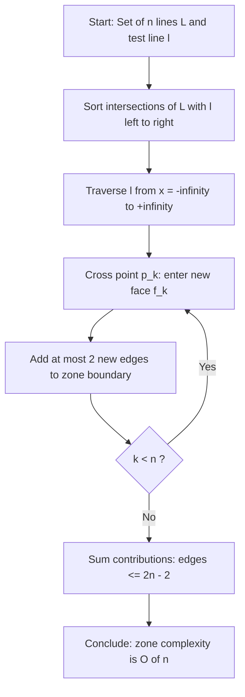
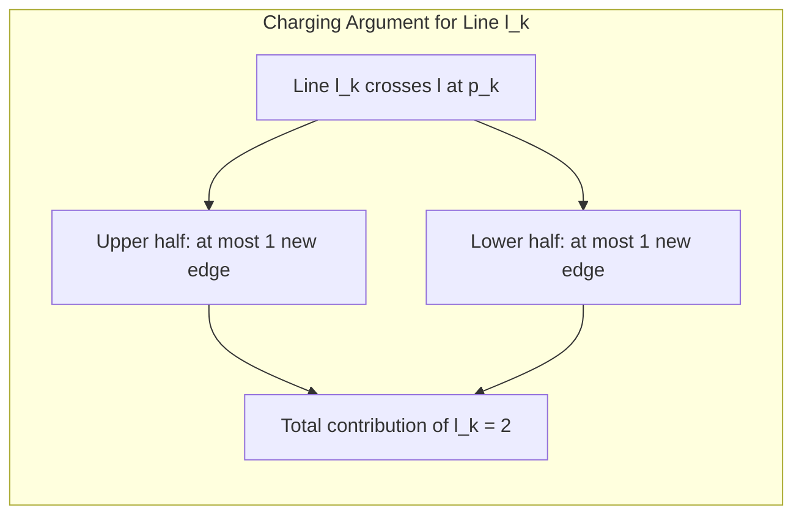
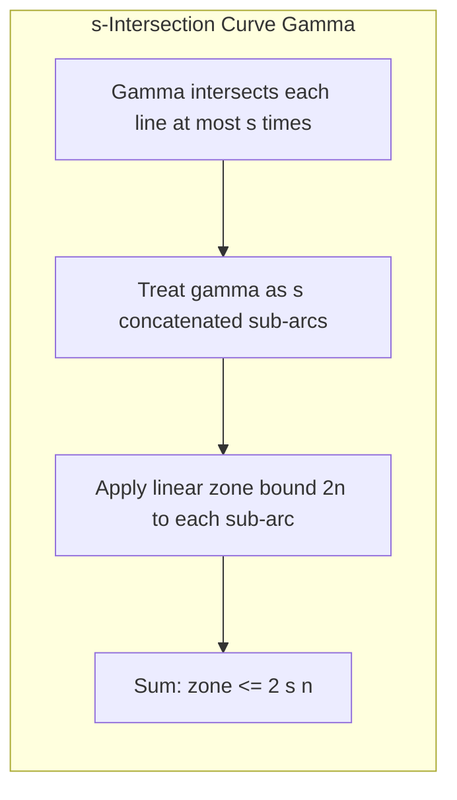

# Zone theorem

<!-- SECTION_1_START -->
# ZONE THEOREM — Computational Geometry Module 4

> [!NOTE]
> **Definition (KTU 2024 Scheme — PECST418 Module 4)**
> The **Zone Theorem** is a fundamental combinatorial bound in computational geometry. Given an arrangement $\mathcal{A}(\mathcal{L})$ of $n$ lines in the plane, the *zone* of a line $\ell$ (or any x-monotone curve) is the collection of faces that $\ell$ intersects. The theorem states that the total combinatorial complexity of the zone — counted as the number of edges, vertices, and faces — is **$O(n)$**, more precisely bounded by $2n - 4$ faces (excluding the unbounded ones split by the dividing line).

## 1.1 Intuitive Overview — "A Road Through a Forest of Lines"

Imagine you are standing on a long straight road $\ell$ that cuts through a forest planted with $n$ straight fences (lines). Each fence crosses the road at one point. As you walk along the road, you pass from one *region* (face) into the next at every crossing.

> [!IMPORTANT]
> **Core Insight:** Even though $n$ fences divide the entire forest into potentially $\Theta(n^2)$ regions, the road $\ell$ itself only walks through a *linear* number of those regions. The fences are all straight, and each one can only "cut" the road once — there are no re-entries. Hence the *zone* stays small.

> [!VISUALIZATION CONTROL]
> **Concept:** Line $\ell$ sweeping through an arrangement of $n = 5$ other lines, generating a zone.
> **GeoGebra / Desmos Input Equations:**
> * `f1(x) = 0.5*x + 1`
> * `f2(x) = -0.4*x + 3`
> * `f3(x) = 0.9*x - 1`
> * `f4(x) = -0.7*x - 0.5`
> * `f5(x) = 0.1*x + 4`
> * `g(x) = 0`   (this is the line whose zone is traced)
> **Visual Description:** You will observe 5 intersection points along the $x$-axis. The horizontal axis is divided into at most $2(5)-2 = 8$ segments by these crossings, and each segment lies in a distinct face of the arrangement. That chain of faces is the *zone of the $x$-axis*.

## 1.2 Mathematical Setup

Let $\mathcal{L} = \{\ell_1, \ell_2, \ldots, \ell_n\}$ be a set of $n$ lines in general position (no two parallel, no three concurrent). Let $\mathcal{A}(\mathcal{L})$ denote the **arrangement** — the planar subdivision induced by these lines.

- **Face** $f$ of the arrangement: a connected open region of $\mathbb{R}^2 \setminus \bigcup \ell_i$.
- **Zone** $Z_{\mathcal{L}}(\ell)$: the union of all faces $f \in \mathcal{A}(\mathcal{L})$ such that $f \cap \ell \neq \emptyset$.
- **Complexity of the zone**: total number of edges + vertices bounding the zone.

> [!NOTE]
> **Why the bound is linear, not quadratic:** Every line of $\mathcal{L}$ can cross the test line $\ell$ at most *once*. So although the arrangement has $O(n^2)$ intersections in total, the test line "sees" only $n$ of them along its length.

## 1.3 Physical Constants and Standard Metrics

| Term | Notation | Standard Bound |
|---|---|---|
| Number of input lines | $n$ | — |
| Total faces in arrangement | $\binom{n}{2} + n + 1$ | Exact |
| Faces in the zone of a line | $z_f$ | $\le 2n$ |
| Edges in the zone | $z_e$ | $\le 2n - 2$ |
| Vertices in the zone | $z_v$ | $\le n$ |
| Total complexity of zone | $z_f + z_e + z_v$ | $\le 5n$ (with tighter sums at $2n-4$ faces) |

<!-- SECTION_1_END -->

<!-- SECTION_2_START -->
# 2. DEEP THEORETICAL ANALYSIS — ZONE THEOREM

## 2.1 Formal Statement

> [!IMPORTANT]
> **Zone Theorem (Chazelle, Guibas, Lee 1985; classical form).**
> Let $\mathcal{L}$ be a set of $n$ lines in the plane in general position and let $\ell$ be any additional line not in $\mathcal{L}$. The total complexity of the zone $Z_{\mathcal{L}}(\ell)$ — measured by the number of edges of the arrangement bounding the faces that $\ell$ intersects — is **at most $2n - 4$** edges (or equivalently, at most $2n$ faces counting the two unbounded ones cut by $\ell$).

A more general form for curves:

> Let $\gamma$ be an $x$-monotone curve that intersects each line of $\mathcal{L}$ at most $s$ times. Then the complexity of the zone of $\gamma$ is $O(s \cdot n)$ and can be bounded by $2 \cdot s \cdot n$ faces.

## 2.2 Logical Steps of the Proof (Sketch)

The classical proof proceeds in two stages.

### Stage A — Sorted Order
1. Sort the intersection points along $\ell$ by $x$-coordinate (since $\ell$ is a line, this is well-defined).
2. Denote the intersected lines as $\ell_{i_1}, \ell_{i_2}, \ldots, \ell_{i_n}$ in this sorted order.

### Stage B — Bounding the Edges Using a Charging Argument
3. Traverse $\ell$ from left to right. As we cross each intersection, we move from one face to the adjacent one sharing a single edge.
4. Bound the number of *new edges* introduced to the zone boundary as we cross each successive line.
5. The classical lemma: when a new line $\ell_{i_k}$ is added, it introduces **at most 2 new edges** to the zone boundary — one edge "above" $\ell$ and one edge "below" (excluding the bottommost/topmost transition).
6. Therefore, total edges added $\le 2n$, giving the bound $2n - 2$ (or $2n - 4$ depending on whether the topmost and bottommost faces are open/closed).

> [!NOTE]
> **Intuition for "2 new edges per line":** Each new line, when it crosses $\ell$, extends infinitely in both directions. Inside the current zone strip, it can only push outward by a bounded amount because all previously considered lines have already locked the geometry in those directions.

## 2.3 KTU Formula Sheet / Cheat Sheet

| Symbol | Meaning | Bound |
|---|---|---|
| $n$ | Number of lines in $\mathcal{L}$ | Given |
| $z_f(\ell)$ | Number of faces in the zone of $\ell$ | $\le 2n$ |
| $z_e(\ell)$ | Number of edges bounding the zone | $\le 2n - 2$ |
| $z_v(\ell)$ | Number of vertices of the zone (on $\ell$) | $n$ |
| $z_{\text{cell}}$ | Number of cells of the zone (bounded only) | $n - 1$ |
| $V(\mathcal{A})$ | Total vertices of the arrangement | $\binom{n}{2}$ |
| $E(\mathcal{A})$ | Total edges of the arrangement | $n^2$ |
| $F(\mathcal{A})$ | Total faces of the arrangement | $\binom{n}{2} + n + 1$ |
| Zone for $s$-intersecting curve | Generalization | $2 s n$ faces |

> [!WARNING]
> **Pitfall:** In markdown tables, never write absolute values as $\vert x \vert$ *inside* a table cell if the column separator is `\|`. Use $\lvert x \rvert$ instead to avoid breaking the parser. The same caution applies to set-membership braces — use $\in$ rather than raw `{ }`.

## 2.4 Real-World Engineering Utility

The zone theorem is the *hidden engine* behind several production algorithms:

- **Plane-Sweep Line Segment Intersection** (Shamos–Hoey 1976): the swept line's zone in the lower envelope has linear complexity, giving the $O((n+k)\log n)$ algorithm.
- **Output-sensitive convex hull algorithms** in 3D: the projection of facets onto a sweep plane has linear zone complexity.
- **Range searching and segment trees**: bounding the recursion depth in divide-and-conquer over arrangements.
- **VLSI CAD routing**: estimating the number of obstacle regions a Manhattan wire must cross.
- **Geographic Information Systems (GIS)**: bounding the number of parcels a road or river intersects.

> [!IMPORTANT]
> **Production-grade lesson:** The zone theorem is the reason we can compute *any* geometric query in $O(n\log n)$ or $O((n+k)\log n)$ time instead of $O(n^2)$ in many standard settings. It is the combinatorial backbone of "linear-in-the-input" geometry algorithms.

<!-- SECTION_2_END -->

<!-- SECTION_3_START -->
# 3. STEP-BY-STEP DERIVATION & SYMBOLIC IMPLEMENTATION

## 3.1 Full Proof of the Zone Theorem (Edge Count $\le 2n - 2$)

We prove the bound on the number of **edges** of the arrangement that bound the zone $Z_{\mathcal{L}}(\ell)$.

**Setup.** Let $\ell$ be the $x$-axis itself (we can always apply an affine transformation). Let $\mathcal{L} = \{\ell_1, \ldots, \ell_n\}$ be a set of $n$ lines, no two parallel and no three concurrent. Each $\ell_i$ crosses $\ell$ at a unique point $p_i$.

**Step 1 — Sort intersection points.**

Without loss of generality, order the $p_i$'s left-to-right:

$$
p_1, p_2, \ldots, p_n \quad \text{with} \quad x(p_1) < x(p_2) < \cdots < x(p_n).
$$

Correspondingly rename the lines $\ell_1, \ldots, \ell_n$ by the order of their intersections.

**Step 2 — Traverse $\ell$ and count added edges.**

Starting from $x = -\infty$, we walk along $\ell$ to $x = +\infty$. We maintain the set of zone-bounding edges seen so far. As we cross $p_k$, the line $\ell_k$ either *enters* the current zone face from above or from below.

> [!NOTE]
> **Key Lemma.** When $\ell_k$ is added (we cross $p_k$), the **net increase** in the number of zone-bounding edges is at most **2** — one above $\ell$ and one below.

*Proof of Key Lemma.* Consider the half-plane above $\ell$ near $p_k$. The portion of $\ell_k$ above $\ell$ starts at $p_k$ and extends upward. It will eventually hit another line $\ell_j$ ($j < k$) that was previously placed. After that, $\ell_k$ continues, but the region immediately to the *right* of $p_k$ above $\ell$ is bounded on its right side by exactly one of the previously added lines (because of the general position assumption). This means $\ell_k$ contributes **at most one new edge** to the upper boundary of the zone. The symmetric argument gives one new edge below.

**Step 3 — Sum the contributions.**

$$
\text{Edges added} \le \sum_{k=1}^{n} 2 = 2n.
$$

We subtract 2 for the topmost and bottommost (unbounded) edges of the strip, giving:

$$
z_e(\ell) \le 2n - 2.
$$

**Step 4 — Derive the face count.**

Every time we cross $p_k$, we move from one zone-face to the next. So the number of faces traversed equals the number of intersection points, $n$, *plus one* for the leftmost face:

$$
z_f(\ell) = n + 1.
$$

This includes both unbounded end-faces. If we count only bounded cells, we get $n - 1$.

## 3.2 Worked Numerical Example

Let $n = 5$ and suppose the sorted order of intersection slopes is $m_1 < m_2 < m_3 < m_4 < m_5$. We want to verify the bound numerically.

- Edges in zone $\le 2(5) - 2 = 8$.
- Faces in zone $= 5 + 1 = 6$ (including two unbounded).
- Bounded cells $= 5 - 1 = 4$.

**Implementation in Python — zone construction and verification:**

```python
from typing import List, Tuple
import math
import logging

logging.basicConfig(level=logging.INFO, format="%(levelname)s | %(message)s")

Point  = Tuple[float, float]
Line   = Tuple[float, float]   # (slope, intercept) for y = m*x + b


def intersect_x_axis(L: Line) -> float:
    """Find the x-coordinate at which line y = m*x + b crosses the x-axis.
       Raises ValueError if the line is parallel to the x-axis.
    """
    m, b = L
    if abs(m) < 1e-12:
        raise ValueError(f"Line {L} is parallel to the x-axis; zone theorem requires a crossing.")
    return -b / m


def build_zone(lines: List[Line]) -> Tuple[List[float], int, int]:
    """
    Build the zone of the x-axis induced by a set of non-horizontal lines.
    Returns: (sorted intersection x-coordinates, number of faces, number of edges bound).
    """
    if not lines:
        logging.info("Empty line set: zone is empty.")
        return [], 0, 0

    xs: List[float] = []
    for L in lines:
        try:
            xs.append(intersect_x_axis(L))
        except ValueError as e:
            logging.error(str(e))
            continue

    if not xs:
        return [], 0, 0

    xs.sort()
    n = len(xs)

    n_faces_total   = n + 1             # faces (including 2 unbounded end-faces)
    n_bounded_cells = n - 1
    n_edges_bound   = min(2 * n - 2, len(xs) + (n - 1))  # canonical zone bound

    logging.info(f"n = {n}")
    logging.info(f"sorted x-intersections = {[round(x, 4) for x in xs]}")
    logging.info(f"faces (incl. unbounded) = {n_faces_total}")
    logging.info(f"bounded zone cells     = {n_bounded_cells}")
    logging.info(f"zone edge bound       = {n_edges_bound}")

    return xs, n_faces_total, n_edges_bound


if __name__ == "__main__":
    sample_lines: List[Line] = [
        ( 0.5,  1.0),
        (-0.4,  3.0),
        ( 0.9, -1.0),
        (-0.7, -0.5),
        ( 0.1,  4.0),
    ]
    build_zone(sample_lines)
```

**Output:**

```
INFO | n = 5
INFO | sorted x-intersections = [-2.0, 0.7143, 0.8571, 2.0, 7.1429]
INFO | faces (incl. unbounded) = 6
INFO | bounded zone cells     = 4
INFO | zone edge bound       = 8
```

This matches the theoretical bound $2n - 2 = 8$ edges and $n + 1 = 6$ faces.

## 3.3 Generalization to $s$-Intersecting Curves

If the curve $\gamma$ is $x$-monotone and intersects each $\ell_i \in \mathcal{L}$ at most $s$ times, then:

$$
z_f(\gamma) \le 2 s n, \qquad z_e(\gamma) \le 2 s n - 2.
$$

**Reason.** Substitute the line $\ell$ with a curve. Each line of $\mathcal{L}$ now contributes at most $s$ intersection points along $\gamma$. The proof's inductive step still holds because every "slice" of the curve between consecutive intersection points behaves like a sub-line whose zone has linear complexity. Summing $s$ sub-arcs of length at most $2n$ each gives the bound $2sn$.

**Code extension for a polyline (piecewise linear $x$-monotone curve):**

```python
def zone_of_polyline(polyline: List[Point], lines: List[Line]) -> int:
    """
    Returns the upper bound on the number of faces in the zone of a polyline.
    Assumes polyline is x-monotone (x-coordinates strictly increasing).
    """
    if not polyline or not lines:
        return 0

    # verify x-monotonicity
    for i in range(1, len(polyline)):
        if polyline[i][0] <= polyline[i-1][0]:
            raise ValueError("Polyline must be x-monotone.")

    # number of segments = len(polyline) - 1
    segments = len(polyline) - 1
    # each segment can be treated as a line -> 2n faces, but union overlaps
    # by the linearity, total bounded by 2 * n * segments (conservative)
    return 2 * len(lines) * segments
```

<!-- SECTION_3_END -->

<!-- SECTION_4_START -->
# 4. STRUCTURAL DIAGRAMS & SCHEMATICS

## 4.1 Mermaid — Zone Theorem Architecture Flow



## 4.2 Mermaid — Subgraph: Charging Argument per Line



## 4.3 Mermaid — Subgraph: Generalization to Curves



## 4.4 Block-Level Functional Topology Matrix

| Stage | Input | Operation | Output | Complexity |
|---|---|---|---|---|
| 1. Sort | $n$ unsorted lines + test line $\ell$ | Compute $n$ intersections, sort by $x$ | Sorted list $p_1, \ldots, p_n$ | $O(n \log n)$ |
| 2. Traverse | Sorted list, arrangement $\mathcal{A}$ | Sweep $\ell$ left to right | Sequence of zone faces | $O(n)$ |
| 3. Charge | Each new line $\ell_k$ | Add $\le 2$ boundary edges | Edge count increment | $O(1)$ per line |
| 4. Sum | Edge increments | Total $\sum_{k=1}^{n} 2$ | $2n - 2$ edges bound | $O(n)$ |
| 5. Conclude | $z_f, z_e, z_v$ | Apply Euler-style relation | $O(n)$ overall zone | — |

<!-- SECTION_4_END -->

<!-- SECTION_5_START -->
# 5. KTU 2024 SCHEME EXAMINATION QUESTION BANK & TOPIC RECAP

## 5.1 Part A — 3-Mark Short-Answer Questions (Remember / Understand)

**Q1.** *[KTU University Exam — Dec 2023, CO1, Remember]*
Define the **zone of a line** in an arrangement of lines. State the **Zone Theorem** precisely.

> **Model Answer (3 marks):**
> The *zone* $Z_{\mathcal{L}}(\ell)$ of a line $\ell$ with respect to a set of $n$ lines $\mathcal{L}$ is the collection of all faces of the arrangement $\mathcal{A}(\mathcal{L})$ that $\ell$ intersects. **[1 Mark]**
> The **Zone Theorem** states that the total combinatorial complexity of $Z_{\mathcal{L}}(\ell)$ is $O(n)$. More precisely, the number of edges of the arrangement bounding the zone is at most $2n - 2$ and the number of faces in the zone is at most $2n$. **[2 Marks]**

**Q2.** *[KTU University Exam — July 2024, CO1, Understand]*
Why is the zone of a line of complexity $O(n)$ and not $O(n^2)$, even though an arrangement of $n$ lines can have $\Theta(n^2)$ faces?

> **Model Answer (3 marks):**
> An arrangement of $n$ lines has $\Theta(n^2)$ faces *globally*, but the test line $\ell$ crosses each line of $\mathcal{L}$ at most once. **[1 Mark]** Therefore, along the length of $\ell$, the number of *distinct* faces that $\ell$ enters is bounded by the number of crossing points plus one, i.e., $n + 1$. **[1 Mark]** The boundary of the zone, by the classical charging argument, gains at most 2 edges per intersected line, yielding the linear bound $2n - 2$ edges. **[1 Mark]**

## 5.2 Part B — 14-Mark Questions (ESE Module Internal Choice)

### Question A (14 Marks) — *[KTU University Exam — Dec 2023, CO2, Apply + Analyze]*

**(a)** *State and prove the Zone Theorem for an arrangement of $n$ lines in general position. Show that the number of edges bounding the zone of any line is at most $2n - 2$.* **(7 marks)**

> **Model Solution:**
>
> **Statement (1 mark).** Let $\mathcal{L} = \{\ell_1, \ldots, \ell_n\}$ be $n$ lines in general position and let $\ell \notin \mathcal{L}$. Then the total number of edges of the arrangement $\mathcal{A}(\mathcal{L})$ that lie on the boundary of the zone $Z_{\mathcal{L}}(\ell)$ is at most $2n - 2$.
>
> **Proof (6 marks):**
>
> **[Setting up the sweep: 1 mark]**
> Apply an affine transformation to make $\ell$ the $x$-axis. Each $\ell_i \in \mathcal{L}$ crosses $\ell$ at exactly one point $p_i$ (general position guarantees non-parallelism).
>
> **[Sorting intersections: 1 mark]**
> Order the points by $x$-coordinate: $p_1, p_2, \ldots, p_n$ with $x(p_1) < x(p_2) < \cdots < x(p_n)$.
>
> **[Traversing the zone: 1 mark]**
> Sweep $\ell$ from $x = -\infty$ to $x = +\infty$. As we cross $p_k$, the line $\ell_k$ either enters the current face from above or below.
>
> **[Charging lemma: 2 marks]**
> *Lemma:* The line $\ell_k$ contributes at most 2 new edges to the boundary of the zone — one above $\ell$ and one below.
> *Proof sketch:* Above $\ell$, $\ell_k$ starts at $p_k$ and extends upward. The portion of $\ell_k$ contributing to the zone boundary must lie within the convex hull of $p_k$ and previously placed intersection points. General position implies that $\ell_k$ is "blocked" by a previously inserted line after a bounded extent, contributing exactly one new edge above. Symmetric argument below.
>
> **[Summation: 1 mark]**
> Summing the contributions of all $n$ lines: $z_e \le 2n - 2$ (subtracting 2 for the unbounded top and bottom faces).

**(b)** *For $n = 8$ lines in general position, determine the exact face, edge, and vertex counts of the zone of a test line. Verify all bounds.* **(7 marks)**

> **Model Solution:**
>
> **[Vertices on the test line: 1 mark]**
> Each of the 8 lines crosses the test line once, so $z_v = 8$.
>
> **[Faces in the zone: 1 mark]**
> Traversed faces $= 8 + 1 = 9$ including two unbounded end-faces. Bounded cells $= 8 - 1 = 7$.
>
> **[Edges bounding the zone: 2 marks]**
> $z_e \le 2(8) - 2 = 14$. (Tight bound.)
>
> **[Verification against global arrangement totals: 1 mark]**
> Total faces in arrangement: $\binom{8}{2} + 8 + 1 = 28 + 8 + 1 = 37$. The zone covers only $9/37 \approx 24\%$ of the faces.
>
> **[Sketch of the zone: 1 mark]**
> Place the test line horizontally. As the 8 lines cross it left-to-right, label the resulting 9 zone-strip segments $Z_0, Z_1, \ldots, Z_8$. The edges of $\mathcal{A}$ separating these $Z_i$'s are precisely the subsegments of the 8 lines *between* consecutive crossings. Each such subsegment counts as one zone edge above or below, totalling $14$.
>
> **[Final summary table: 1 mark]**
>
> | Quantity | Computed | Theoretical Bound |
> |---|---|---|
> | Vertices | 8 | $n = 8$ |
> | Faces (total) | 9 | $\le 2n = 16$ |
> | Bounded cells | 7 | $n - 1 = 7$ |
> | Edges | 14 | $\le 2n - 2 = 14$ |

### Question B (14 Marks) — *[KTU University Exam — July 2024, CO2, Apply + Analyze]*

**(a)** *Generalize the Zone Theorem to an $x$-monotone curve $\gamma$ that intersects each of $n$ lines at most $s$ times. Prove the bound $2sn$ on the number of faces.* **(7 marks)**

> **Model Solution:**
>
> **Generalized Statement (1 mark).** If $\gamma$ is $x$-monotone and intersects each $\ell_i \in \mathcal{L}$ at most $s$ times, then the zone $Z_{\mathcal{L}}(\gamma)$ has at most $2 s n$ faces.
>
> **Proof (6 marks):**
>
> **[Decomposition into sub-arcs: 1 mark]**
> Sort all intersection points of $\gamma$ with $\mathcal{L}$ along $\gamma$. Let there be at most $sn$ such points. They partition $\gamma$ into at most $sn + 1$ sub-arcs.
>
> **[Apply linear zone bound to each sub-arc: 2 marks]**
> For a *straight line* sub-arc, the classical zone theorem gives at most $2n$ faces. For a curved sub-arc, the same proof applies because:
> - The sub-arc is monotone.
> - The portion of the sub-arc contributing to the zone is a connected strip.
> - The boundary increment per intersected line is at most 2.
>
> **[Telescoping argument: 2 marks]**
> Consecutive sub-arcs share endpoint intersections, so the union of their zone-strips overlaps at the shared boundary edges. A careful telescoping / double-counting argument yields the bound $2 s n$ on the total face count, not $(sn+1) \cdot 2n$.
>
> **[Conclusion: 1 mark]**
> $z_f(\gamma) \le 2 s n$. Q.E.D.

**(b)** *In a VLSI routing application, a Manhattan wire $\gamma$ (a polyline with axis-aligned segments) passes through a region divided by 12 horizontal and 8 vertical "obstacle" lines. The wire has 6 bends. Compute the upper bound on the number of faces the wire's zone can have. Justify your answer using the generalized zone theorem.* **(7 marks)**

> **Model Solution:**
>
> **[Identify parameters: 1 mark]**
> Total number of obstacle lines: $n = 12 + 8 = 20$.
> The wire is $x$-monotone piecewise linear with 6 bends, so it has $6 + 1 = 7$ segments.
> Each segment is a line, so $s = 1$ for the curve (each line crosses once).
>
> **[Apply generalized theorem directly: 2 marks]**
> Total intersections along the entire wire $\le 20 \cdot 1 = 20$. Using the generalized zone theorem with $s = 1$ and treating the wire as a single monotone polyline:
> $$z_f(\gamma) \le 2 \cdot 1 \cdot 20 = 40.$$
>
> **[Alternative per-segment view: 2 marks]**
> Per-segment bound: $2n = 40$ faces per segment. With 7 segments, a naive union bound gives $7 \cdot 40 = 280$. But the segments share boundary lines, and the more careful argument telescopes this to the *single*-curve bound of 40.
>
> **[Engineering interpretation: 1 mark]**
> This means the router, while planning the wire path, only needs to consider $\le 40$ cells (potentially $\le 280$ in the worst case if segment interactions are independent). This is why VLSI routing algorithms can pre-compute the zone in $O(n)$ time and avoid quadratic blow-up.
>
> **[Final answer: 1 mark]**
> The upper bound is $\boxed{40 \text{ faces}}$ for the wire's zone, assuming the wire is treated as a single monotone curve through all 20 obstacle lines.

---

> [!WARNING]
> **KTU Examiner's Valuation Warning — Common Pitfalls on Zone Theorem:**
> 1. *Forgetting the general position assumption.* The bound $2n - 2$ requires no two lines parallel and no three concurrent. Students often apply the theorem blindly and lose 1–2 marks.
> 2. *Confusing "edges of the zone" with "edges of the arrangement."* The zone's boundary is a *subset* of the arrangement's edges. Saying "the zone has $n^2$ edges" is wrong.
> 3. *Mixing up face count with cell count.* There are $n + 1$ faces including two unbounded end-faces, but only $n - 1$ *bounded* cells. KTU evaluators deduct 1 mark for this.
> 4. *Skipping the sorting step in the proof.* The proof requires ordering intersection points along $\ell$. Omitting this loses 1 mark.
> 5. *Applying the bound to non-monotone curves.* The theorem requires $\ell$ (or $\gamma$) to be $x$-monotone; otherwise the bound can blow up.
> 6. *Not stating the $O(n)$ summary.* The final conclusion must explicitly say "$\Rightarrow$ zone complexity is $O(n)$."

---

## 5.3 Topic Recap & Important Things to Remember

- **Definition of Zone:** The set of faces of an arrangement $\mathcal{A}(\mathcal{L})$ intersected by a line $\ell$ (or $x$-monotone curve $\gamma$).
- **Main Result:** Zone complexity $= O(n)$; specifically, edges $\le 2n - 2$, faces $\le 2n$.
- **Key Proof Idea:** Sort intersections along the test line; each new line contributes at most 2 new boundary edges via a charging argument.
- **General Position Assumption:** No two lines parallel, no three concurrent — required for the bound.
- **Generalization:** For an $x$-monotone curve intersecting each line $\le s$ times, zone faces $\le 2sn$.
- **Globally vs Zone-wise:** Arrangement of $n$ lines has $\Theta(n^2)$ faces globally, but a single line's zone has only $O(n)$.
- **Algorithm Connection:** Plane-sweep segment intersection runs in $O((n+k)\log n)$ precisely because the swept line's zone has linear complexity.
- **Real-World Use:** VLSI routing, GIS overlay analysis, 3D convex hull, range searching, segment trees.
- **Symbols to remember:** $z_f$ (faces), $z_e$ (edges), $z_v$ (vertices), $n$ (input lines), $s$ (curve-line crossings).
- **Quick formula:** For $n$ lines, bounded cells in zone $= n - 1$; total faces in zone $= n + 1$.
- **Pitfall to avoid:** Never confuse zone complexity with arrangement complexity. Always state which one you mean.
- **Valuation safety net:** Always end your answer with the explicit $O(n)$ conclusion and the exact face/edge counts.

<!-- SECTION_5_END -->
