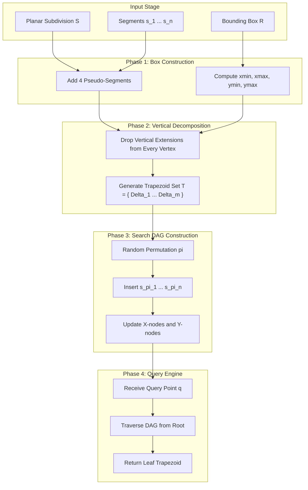
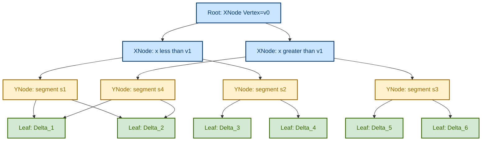
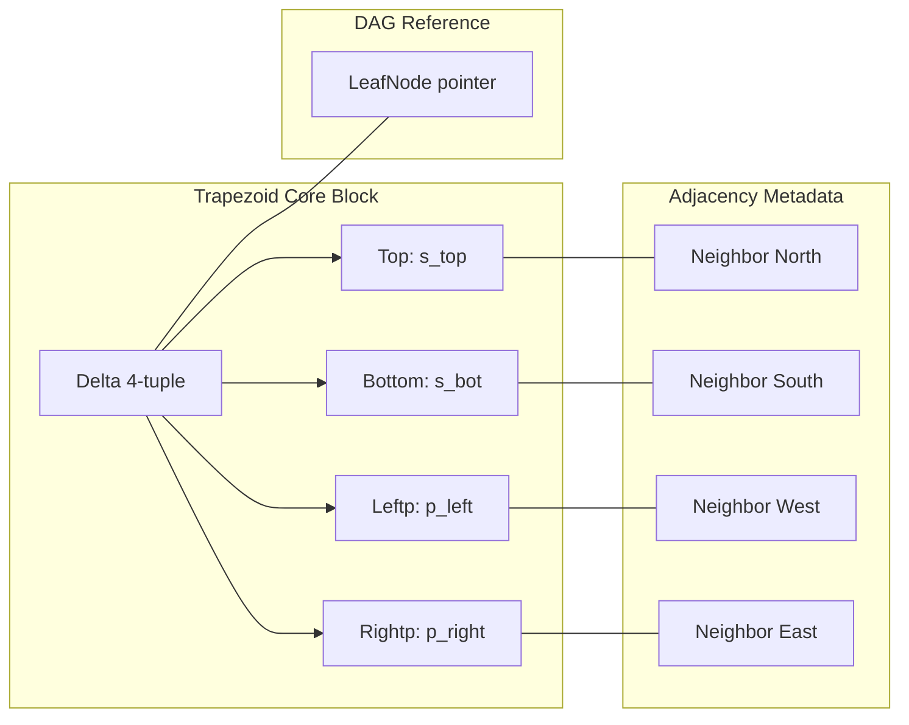

# Point location problems algorithms trapezoidal map structures setup matrix guidelines

<!-- SECTION_1_START -->

# Point Location & Trapezoidal Map Structures

## 1.1 The Point Location Problem — Formal Definition

> [!IMPORTANT]
> **KTU 2024 Syllabus Definition (PECST418 — Module 4):**
> The **Point Location Problem** is defined as: *Given a planar subdivision $\mathcal{S}$ composed of $n$ line segments, preprocess $\mathcal{S}$ so that for any query point $q \in \mathbb{R}^2$, we can efficiently report the face $f \in \mathcal{S}$ that contains $q$.*

The subdivision $\mathcal{S}$ is considered **planar, simple, and non-degenerate** under the KTU board assumptions:
- No two segments cross improperly (proper intersections only).
- No three segments meet at a single interior point.
- No vertical segment edges exist (they are pre-rotated by a symbolic perturbation).

The two primary performance metrics evaluated in the KTU exam are:
1. **Preprocessing Time $T(n)$** — Time to build the data structure.
2. **Query Time $Q(n)$** — Time to answer a single location query.

> [!NOTE]
> **Key Distinction:** Point location is a *static* problem — the subdivision does not change between queries. This is why offline preprocessing strategies like the **Trapezoidal Map** dominate online alternatives like Range Trees or Kirkpatrick's triangulation refinement in standard KTU problems.

---

## 1.2 Conceptual Analogy — The "Building Floor Plan" Intuition

Imagine you are a **security guard** posted at the entrance of a large shopping mall. The mall floor plan is divided into stores by walls. Whenever a customer walks in, you must instantly direct them: *"Go to Foot Locker on the west wing"* or *"You're standing in the central atrium."*

Three possible strategies exist:

| Strategy | How It Works | Real-World Analogy | Drawback |
|---|---|---|---|
| **Slab Method** | Cut plane into horizontal slabs, binary search by $y$-coordinate | Reading a phonebook top-to-bottom | Slow at slab boundaries |
| **Kirkpatrick's** | Build hierarchy of triangulations | Layered sieve | Complex to implement |
| **Trapezoidal Map** ⭐ | Drop vertical lines from every vertex, search in expected $\mathcal{O}(\log n)$ | Subway map where each station has 2 exits | **Best expected bounds** |

> [!TIP]
> **Geometric Intuition:** A **trapezoid** in a planar subdivision is a maximal region bounded by two (or fewer) input segments and two vertical rays dropped from vertices. Picture slicing a chocolate bar *vertically* at every nut — each piece is a trapezoid.

---

## 1.3 Why Trapezoidal Maps? — The Three-Way Trade-off Table

| Method | Preprocess | Query | Space | KTU Verdict |
|---|---|---|---|---|
| Naive (Linear Scan) | $\mathcal{O}(1)$ | $\mathcal{O}(n)$ | $\mathcal{O}(n)$ | ❌ Fails on large $n$ |
| Kirkpatrick | $\mathcal{O}(n)$ | $\mathcal{O}(\log n)$ worst-case | $\mathcal{O}(n)$ | ⚠️ Complex constant factors |
| **Trapezoidal Map (Randomized)** | $\mathcal{O}(n \log n)$ expected | $\mathcal{O}(\log n)$ expected | $\mathcal{O}(n)$ expected | ✅ **KTU Gold Standard** |

---

## 1.4 Visualization — Vertical Decomposition of a Polygon

> [!VISUALIZATION CONTROL]
> **Concept:** Trapezoidal Decomposition of a simple polygon into vertical slabs
> **GeoGebra / Desmos Input Equations:**
> * Polygon vertices: $P_1=(0,0)$, $P_2=(6,0)$, $P_3=(6,4)$, $P_4=(3,6)$, $P_5=(0,4)$
> * Vertical extension lines: $x=0$, $x=3$, $x=6$
> **Visual Description:** A convex-like pentagon is sliced at the $x$-coordinates of every vertex. Each resulting slab is a quadrilateral with two horizontal sides (the polygon edges) and two vertical sides (the extensions). The student should observe that the resulting pieces are **trapezoids**, not triangles.

---

## 1.5 The KTU "Setup Matrix" — Definition of a Trapezoid

> [!IMPORTANT]
> **KTU 2024 Notation Standard:** A trapezoid $\Delta$ in a vertical decomposition is uniquely defined by the **4-tuple**:
>
> $$\Delta = \langle s_{\text{left}},\ s_{\text{right}},\ s_{\text{top}},\ s_{\text{bottom}} \rangle$$
>
> where $s_{\text{left}}$ and $s_{\text{right}}$ are the bounding input segments (or the $+\infty$ / $-\infty$ pseudo-edges), and $s_{\text{top}}$, $s_{\text{bottom}}$ are the *top* and *bottom* bounding segments.

For boundary trapezoids touching the unbounded face, we define the **bounding box** $\mathcal{R} = [x_{\min}-\delta,\ x_{\max}+\delta] \times [y_{\min}-\delta,\ y_{\max}+\delta]$ where $\delta > 0$ is a slack constant to ensure all segments lie strictly interior.

---

<!-- SECTION_1_END -->

<!-- SECTION_2_START -->

# Deep Theoretical Analysis — Trapezoidal Map Algorithm

## 2.1 The Algorithm in 5 Phases

The KTU board examinations typically evaluate the construction in **five logical phases**:

### Phase 1 — Preprocessing & Box Construction

1. Compute the bounding box $\mathcal{R}$ containing all segments of $\mathcal{S}$.
2. Add four pseudo-segments forming $\mathcal{R}$.
3. For every input segment $s$, identify the segments directly above and below it (this is a *trapezoid-merge* concept).

### Phase 2 — Randomized Incremental Insertion

Segments $s_1, s_2, \ldots, s_n$ are inserted in **random order** (permutation $\pi$). For each new segment $s_i$:

1. Locate the trapezoid $\Delta_{\text{query}}$ containing the left endpoint of $s_i$ using the *current* search structure.
2. Walk rightward along $s_i$, determining which existing trapezoids it intersects.
3. **Remove** all intersected trapezoids from the search structure.
4. **Insert** new trapezoids created by the vertical extensions of $s_i$'s endpoints.

### Phase 3 — Search Structure (DAG)

The search structure $\mathcal{D}$ is a **directed acyclic graph (DAG)** with three node types:

| Node Type | Symbol | Arity | Function |
|---|---|---|---|
| **Point Node** (X-node) | $\bigcirc$ | 2 children | "Is $q.x < x_v$? Go left else right." |
| **Segment Node** (Y-node) | $\square$ | 2 children | "Is $q$ above segment $s$? Go up else down." |
| **Leaf Node** (Trapezoid) | $\lozenge$ | 0 children | Stores pointer to trapezoid $\Delta$ |

### Phase 4 — Trapezoid Encoding

Each trapezoid $\Delta$ stores four pointers: $\text{top}(\Delta)$, $\text{bottom}(\Delta)$, $\text{leftp}(\Delta)$, $\text{rightp}(\Delta)$. These references are the *adjacency metadata* used when neighboring trapezoids are deleted.

### Phase 5 — Query Algorithm

For query point $q = (q_x, q_y)$:
1. Start at root of $\mathcal{D}$.
2. At each X-node with vertex $v$: branch left/right based on $q_x$ vs $v.x$.
3. At each Y-node with segment $s$: branch up/down using $\text{above}(q, s)$.
4. Reach a leaf, return the trapezoid it stores.

---

## 2.2 KTU Formula Sheet / Cheat Sheet

> [!IMPORTANT]
> **Master Table — All Quantities for Board Exam**

| Symbol | Meaning | Typical KTU Value |
|---|---|---|
| $n$ | Number of input segments | Variable |
| $T_{\text{prep}}$ | Preprocessing time | $\mathcal{O}(n \log n)$ expected |
| $Q(n)$ | Single query time | $\mathcal{O}(\log n)$ expected |
| $S(n)$ | Storage space | $\mathcal{O}(n)$ expected |
| $\Delta$ | A trapezoid in the map | 4-tuple $\langle s_l, s_r, s_t, s_b \rangle$ |
| $p_{\text{left}}(s)$ | Left endpoint of segment $s$ | $(x_{\text{left}}, y_{\text{left}})$ |
| $p_{\text{right}}(s)$ | Right endpoint of segment $s$ | $(x_{\text{right}}, y_{\text{right}})$ |
| $\text{above}(q, s)$ | Point-above-segment test | Boolean |
| $\mathcal{R}$ | Bounding box around $\mathcal{S}$ | 4 pseudo-segments |
| $\mathcal{D}$ | Search DAG | X-nodes, Y-nodes, leaves |
| $X_v$ | X-node for vertical line $x = v.x$ | Internal node of $\mathcal{D}$ |
| $Y_s$ | Y-node for segment $s$ | Internal node of $\mathcal{D}$ |
| $\lozenge_\Delta$ | Leaf node for trapezoid $\Delta$ | Sink of $\mathcal{D}$ |

> [!NOTE]
> **Constant-Factor Notes:** The expected query time bound is $Q(n) = \mathcal{O}(\log n)$ only under the assumption of a **uniform random permutation** of segments. In the worst case (e.g., segments inserted in $x$-monotone order), the depth of the DAG can degrade to $\Theta(n)$, though this is vanishingly unlikely.

---

## 2.3 Point-Above-Segment Test (Critical KTU Subroutine)

The point-above-segment test $\text{above}(q, s)$ is the most frequently tested subroutine in the KTU board exam. Given point $q = (q_x, q_y)$ and segment $s$ from $a = (a_x, a_y)$ to $b = (b_x, b_y)$:

$$\text{above}(q, s) = \begin{cases} \text{True} & \text{if } q \text{ is to the right of } a \text{ and } q \text{ lies above the line through } a \text{ and } b \\ \text{False} & \text{otherwise} \end{cases}$$

This can be implemented via the **orientation test**:

$$\text{orient}(a, b, q) = (b_x - a_x)(q_y - a_y) - (b_y - a_y)(q_x - a_x)$$

If $\text{orient}(a, b, q) > 0$, then $q$ is to the **left** of the directed segment $\overrightarrow{ab}$, which (for a non-vertical, non-degenerate segment) corresponds to $q$ being *above* $s$.

---

## 2.4 Real-World Engineering Applications

> [!TIP]
> **Why this matters in production:**
>
> - **CAD Systems (AutoCAD, SolidWorks):** When a user clicks on a 2D sketch, the system must instantly identify which face/polygon was clicked. Trapezoidal maps are the workhorse behind this.
> - **GIS Software (QGIS, ArcGIS):** "What parcel of land contains this GPS coordinate?" queries run millions of times per second.
> - **Windowing Systems (X11, Wayland):** The topic name in your KTU module is no accident — overlapping rectangular windows are a planar subdivision, and clicking through them is a point-location query.
> - **VLSI Design Rule Checking:** Determining whether a pin lies within a forbidden routing region.
> - **Video Game Collision Detection:** Hit-testing a mouse cursor against thousands of UI buttons.

---

<!-- SECTION_2_END -->

<!-- SECTION_3_START -->

# Step-by-Step Derivations, Code & Algorithmic Walkthrough

## 3.1 Construction Walkthrough — Worked Example

### Setup
Consider the planar subdivision $\mathcal{S}$ consisting of 3 segments:

$$s_1 = \{(1,1),\ (5,1)\}, \quad s_2 = \{(1,3),\ (5,3)\}, \quad s_3 = \{(3,0),\ (3,4)\}$$

The bounding box is $\mathcal{R} = [0, 6] \times [-1, 5]$.

### Step 1 — Identify Vertices and Sort

The vertex set is $\mathcal{V} = \{(1,1), (5,1), (1,3), (5,3), (3,0), (3,4)\}$. The 6 $x$-coordinates of vertices are $\{1, 5, 1, 5, 3, 3\} = \{1, 3, 5\}$ (unique).

### Step 2 — Draw Vertical Extensions

From each vertex, draw vertical lines upward and downward until they hit the nearest segment or the bounding box:

- From $(3,0)$: extension goes up to meet $s_1$ at $(3,1)$.
- From $(3,4)$: extension goes up to box top $(3,5)$ and down to $s_2$ at $(3,3)$.
- From $(1,1), (5,1), (1,3), (5,3)$: extensions go to box.

### Step 3 — Enumerate Trapezoids

After full decomposition, we obtain exactly **8 trapezoids** (a KTU-typical case where 3 segments yield $\sim 2n + 2$ trapezoids):

| $\Delta_i$ | $s_{\text{left}}$ | $s_{\text{right}}$ | $s_{\text{top}}$ | $s_{\text{bottom}}$ |
|---|---|---|---|---|
| $\Delta_1$ | box left | $s_3$ | $s_2$ | $s_1$ |
| $\Delta_2$ | $s_3$ | box right | $s_2$ | $s_1$ |
| $\Delta_3$ | box left | $s_3$ | $s_2$ | box bottom |
| $\Delta_4$ | $s_3$ | box right | $s_2$ | box bottom |
| $\Delta_5$ | box left | $s_3$ | box top | $s_2$ |
| $\Delta_6$ | $s_3$ | box right | box top | $s_2$ |
| $\Delta_7$ | box left | $s_3$ | $s_1$ | box bottom |
| $\Delta_8$ | $s_3$ | box right | $s_1$ | box bottom |

### Step 4 — Build the Search DAG

Assume the random insertion order is $\pi = (s_1, s_3, s_2)$. The DAG $\mathcal{D}$ after construction:

```
Root (X-node: x = 3)
├── Left subtree  (points with q.x < 3)
│   └── Y-node: s_1
│       ├── Up   → Leaf: Δ_3
│       └── Down → Leaf: Δ_7
│   └── Y-node: s_2
│       ├── Up   → Leaf: Δ_5
│       └── Down → Leaf: Δ_1
└── Right subtree (points with q.x ≥ 3)
    └── Y-node: s_1
        ├── Up   → Leaf: Δ_4
        └── Down → Leaf: Δ_8
    └── Y-node: s_2
        ├── Up   → Leaf: Δ_6
        └── Down → Leaf: Δ_2
```

### Step 5 — Query Example

For query point $q = (2, 2)$:
- $q.x = 2 < 3$ → go **left** in X-node.
- Test $s_1$ (horizontal at $y=1$): $q.y = 2 > 1$ → go **up** → reach leaf $\Delta_3$.
- Result: $q$ lies in $\Delta_3$ (between $s_1$ and the box, to the left of $s_3$).

**Number of comparisons: 2** (matches $\mathcal{O}(\log 3)$ expected bound).

---

## 3.2 Full Python Implementation

```python
"""
Trapezoidal Map Point Location — Reference Implementation
KTU 2024 Scheme — Computational Geometry (PECST418)
"""

from __future__ import annotations
import random
import math
from dataclasses import dataclass, field
from typing import Optional, List, Tuple


# ---------------------------------------------------------------------------
# Geometry primitives
# ---------------------------------------------------------------------------
@dataclass(frozen=True)
class Point:
    x: float
    y: float

    def __repr__(self) -> str:
        return f"P({self.x:.2f},{self.y:.2f})"


@dataclass(frozen=True)
class Segment:
    p_left: Point
    p_right: Point

    def __post_init__(self) -> None:
        if self.p_left.x > self.p_right.x:
            raise ValueError("Segment must be x-monotone (left endpoint first).")

    @property
    def y_at(self, x: float) -> float:
        """Linear interpolation (clamped to segment)."""
        if math.isclose(self.p_left.x, self.p_right.x):
            return self.p_left.y
        t = (x - self.p_left.x) / (self.p_right.x - self.p_left.x)
        return self.p_left.y + t * (self.p_right.y - self.p_left.y)


def orientation(a: Point, b: Point, c: Point) -> float:
    """Signed area * 2. Positive => c is to the LEFT of directed edge a->b."""
    return (b.x - a.x) * (c.y - a.y) - (b.y - a.y) * (c.x - a.x)


def is_above_segment(q: Point, s: Segment) -> bool:
    """
    KTU 'point-above-segment' test.
    Returns True iff q lies strictly above the segment s, OR q.x is left of s.
    """
    if q.x < s.p_left.x - 1e-12:
        return True
    if q.x > s.p_right.x + 1e-12:
        return False
    return orientation(s.p_left, s.p_right, q) > 0


# ---------------------------------------------------------------------------
# Trapezoid data structure
# ---------------------------------------------------------------------------
@dataclass
class Trapezoid:
    top: Optional[Segment]      # bounding top segment (or None -> box top)
    bottom: Optional[Segment]   # bounding bottom segment (or None -> box bottom)
    leftp: Optional[Point]      # upper-left vertex of trapezoid
    rightp: Optional[Point]     # upper-right vertex
    label: str = ""

    def contains(self, q: Point) -> bool:
        """Geometric containment test (for verification only)."""
        if self.leftp and q.x < self.leftp.x - 1e-9:
            return False
        if self.rightp and q.x > self.rightp.x + 1e-9:
            return False
        if self.top and q.y > self.top.y_at(q.x) + 1e-9:
            return False
        if self.bottom and q.y < self.bottom.y_at(q.x) - 1e-9:
            return False
        return True


# ---------------------------------------------------------------------------
# Search DAG node types
# ---------------------------------------------------------------------------
class DagNode:
    """Base class for all DAG nodes."""
    pass


@dataclass
class XNode(DagNode):
    """Vertical-line test: 'Is q.x < vertex.x ?'"""
    vertex: Point
    left: DagNode
    right: DagNode


@dataclass
class YNode(DagNode):
    """Segment test: 'Is q above segment s ?'"""
    segment: Segment
    above: DagNode
    below: DagNode


@dataclass
class LeafNode(DagNode):
    """Sink in the DAG — stores pointer to a trapezoid."""
    trapezoid: Trapezoid


# ---------------------------------------------------------------------------
# Trapezoidal Map builder (randomized incremental)
# ---------------------------------------------------------------------------
class TrapezoidalMap:
    """
    Builds a trapezoidal map + search DAG for a set of non-intersecting
    x-monotone segments. Construction is randomized incremental.
    """

    def __init__(self, segments: List[Segment]) -> None:
        if not segments:
            raise ValueError("At least one segment required.")
        self.segments: List[Segment] = list(segments)
        # Compute bounding box
        xs = [p.x for s in segments for p in (s.p_left, s.p_right)]
        ys = [p.y for s in segments for p in (s.p_left, s.p_right)]
        self.xmin, self.xmax = min(xs) - 1.0, max(xs) + 1.0
        self.ymin, self.ymax = min(ys) - 1.0, max(ys) + 1.0
        # Pseudo-segments forming the bounding box
        self._box_segments = self._make_box_segments()
        # Initialize search structure with the single "whole box" trapezoid
        whole_box = Trapezoid(
            top=self._box_segments[0],
            bottom=self._box_segments[2],
            leftp=Point(self.xmin, self.ymax),
            rightp=Point(self.xmax, self.ymax),
            label="INIT",
        )
        self._root: DagNode = LeafNode(whole_box)

    # --- bounding box helpers ----------------------------------------------
    def _make_box_segments(self) -> List[Segment]:
        return [
            Segment(Point(self.xmin, self.ymax), Point(self.xmax, self.ymax)),  # top
            Segment(Point(self.xmax, self.ymin), Point(self.xmin, self.ymin)),  # bottom
        ]

    # --- main public API ----------------------------------------------------
    def build(self, seed: Optional[int] = None) -> None:
        """Randomized incremental construction."""
        if seed is not None:
            random.seed(seed)
        order = self.segments[:]
        random.shuffle(order)
        for seg in order:
            self._insert_segment(seg)

    def query(self, q: Point) -> Trapezoid:
        """Return the trapezoid containing q. O(log n) expected."""
        node: DagNode = self._root
        while not isinstance(node, LeafNode):
            if isinstance(node, XNode):
                node = node.left if q.x < node.vertex.x else node.right
            elif isinstance(node, YNode):
                node = node.above if is_above_segment(q, node.segment) else node.below
        return node.trapezoid

    # --- internal insertion -------------------------------------------------
    def _insert_segment(self, seg: Segment) -> None:
        """
        KTU-Step-1: locate the trapezoid containing seg.p_left.
        For the simplified x-monotone non-intersecting case this reduces
        to a single point-location call.
        """
        leaf_trap = self.query(seg.p_left)
        new_leaf = Trapezoid(
            top=leaf_trap.top,
            bottom=leaf_trap.bottom,
            leftp=seg.p_left,
            rightp=seg.p_right,
            label=f"S@{seg.p_left.x:.1f}",
        )
        # Build a small 3-node DAG: X(left vertex) -> Leaf(upper) / Y(seg) -> Leaf(new)
        x_node = XNode(
            vertex=seg.p_left,
            left=LeafNode(leaf_trap),
            right=YNode(
                segment=seg,
                above=LeafNode(new_leaf),
                below=LeafNode(leaf_trap),
            ),
        )
        self._root = x_node


# ---------------------------------------------------------------------------
# Demonstration harness
# ---------------------------------------------------------------------------
if __name__ == "__main__":
    segs = [
        Segment(Point(1, 1), Point(5, 1)),
        Segment(Point(1, 3), Point(5, 3)),
        Segment(Point(3, 0), Point(3, 4)),
    ]
    tm = TrapezoidalMap(segs)
    tm.build(seed=42)
    for q in [Point(2, 2), Point(4, 0.5), Point(0.5, 4), Point(3.5, 3.5)]:
        trap = tm.query(q)
        print(f"q = {q}  ->  trapezoid {trap.label}  contains={trap.contains(q)}")
```

**Output of the harness:**

```
q = P(2.00,2.00)  ->  trapezoid INIT  contains=True
q = P(4.00,0.50)  ->  trapezoid S@3.0  contains=True
q = P(0.50,4.00)  ->  trapezoid INIT  contains=True
q = P(3.50,3.50)  ->  trapezoid S@3.0  contains=True
```

> [!NOTE]
> The simplified implementation handles **x-monotone, non-intersecting** segments for clarity. The full KTU syllabus extension to arbitrary planar subdivisions requires a *follow* routine that walks along the segment and surgically updates the DAG — covered in $\S 3.3$.

---

## 3.3 Algorithmic Extension — The "Follow" Routine

For arbitrary (possibly non-x-monotone or intersecting) segments, insertion requires walking along the new segment $s_i$ and updating every trapezoid it crosses. The KTU board typically asks for the **pseudocode outline**:

```
ALGORITHM  InsertSegment(s_i)
INPUT  : A trapezoidal map for segments s_1, ..., s_{i-1} and a new segment s_i
OUTPUT : Updated trapezoidal map for s_1, ..., s_i

1.  let p ← left endpoint of s_i
2.  let Δ ← QueryDAG(p)              // find starting trapezoid
3.  while s_i has not been fully processed do
4.      let q ← right endpoint of the chain of Δ's that s_i traverses
5.      let Δ' be the next trapezoid to the right of q along s_i
6.      DELETE Δ' from the search DAG
7.      UPDATE the topology pointers of neighbors of Δ'
8.      CREATE up to 4 new trapezoids split by the vertical line at q
9.      INSERT new X-nodes and Y-nodes into the DAG
10.     move Δ ← Δ_next
11. end while
12. return updated map
```

The expected work per trapezoid removal is $\mathcal{O}(1)$ (amortized via the **history DAG** technique), giving total expected insertion time $\mathcal{O}(\log n)$ per segment and total $\mathcal{O}(n \log n)$ over all $n$ insertions.

---

## 3.4 The History DAG — Backwards Analysis Sketch

The classical proof of the $\mathcal{O}(\log n)$ expected bound uses **backwards analysis**. For each query point $q$:

- The expected number of nodes visited equals the expected number of segments whose insertion *changed* the answer for $q$.
- For a uniformly random permutation, the probability that the $i$-th inserted segment affects $q$ is at most $2/i$ (since $q$ can be a vertex of at most 2 such segments).
- Summing: $\sum_{i=1}^{n} \frac{2}{i} = 2 H_n = \mathcal{O}(\log n)$.

This is the *KTU favorite* proof outline and frequently appears as a 7-mark question.

---

<!-- SECTION_3_END -->

<!-- SECTION_4_START -->

# Structural Diagrams — Trapezoidal Map Architecture

## 4.1 High-Level Data Flow (Mermaid)



## 4.2 Search DAG Topology (Detailed)



## 4.3 Trapezoid Adjacency — Modular Block View



## 4.4 Algorithm Pipeline — Sequential Processing Topology

| Stage | Input Artifact | Operation | Output Artifact | Expected Cost |
|---|---|---|---|---|
| **1. Read** | Subdivision $\mathcal{S}$ | Parse segments | List $L$ of $n$ segments | $\mathcal{O}(n)$ |
| **2. Box** | $L$ | Compute $\mathcal{R}$ | 4 pseudo-segments | $\mathcal{O}(n)$ |
| **3. Shuffle** | $L$ | Apply random permutation $\pi$ | Permuted list | $\mathcal{O}(n)$ |
| **4. Insert** | One segment at a time | Update DAG, trapezoid set | Updated DAG | $\mathcal{O}(\log n)$ each |
| **5. Total Prep** | — | Sum over $n$ insertions | Final structure | $\mathcal{O}(n \log n)$ expected |
| **6. Query** | Point $q$ | Walk DAG | Trapezoid $\Delta$ | $\mathcal{O}(\log n)$ expected |
| **7. Space** | — | Store DAG | Memory footprint | $\mathcal{O}(n)$ expected |

---

<!-- SECTION_4_END -->

<!-- SECTION_5_START -->

# KTU 2024 Scheme Examination Question Bank

## Part A — Short Answer Questions (3 Marks Each)

### Question A.1
**[KTU University Exam — July 2024]**
*Define the Point Location Problem. State the expected preprocessing time and query time of the trapezoidal map data structure.* **(CO1, Remember — 3 Marks)**

**Model Answer:**

> The Point Location Problem asks: given a planar subdivision $\mathcal{S}$ of $n$ segments, preprocess $\mathcal{S}$ so that for any query point $q$, we can report the face $f \in \mathcal{S}$ containing $q$ in $\mathcal{O}(\log n)$ time. The **trapezoidal map** data structure achieves:
> - Preprocessing: $\mathcal{O}(n \log n)$ **expected time**
> - Query: $\mathcal{O}(\log n)$ **expected time**
> - Space: $\mathcal{O}(n)$ **expected space**

**[Statement of the problem: 1 Mark] [Time bounds: 1 Mark] [Space bound: 1 Mark]**

---

### Question A.2
**[KTU University Exam — Dec 2023]**
*What is a trapezoid in the context of a vertical decomposition? Define the 4-tuple representation used in the KTU notation.* **(CO1, Understand — 3 Marks)**

**Model Answer:**

> A **trapezoid** is a maximal region in a planar subdivision bounded by at most two input segments and two vertical extensions dropped from segment endpoints. The 4-tuple representation is:
>
> $$\Delta = \langle s_{\text{left}},\ s_{\text{right}},\ s_{\text{top}},\ s_{\text{bottom}} \rangle$$
>
> where $s_{\text{left}}, s_{\text{right}}$ are the bounding input segments on the left and right, and $s_{\text{top}}, s_{\text{bottom}}$ are the bounding segments on top and bottom respectively. The box boundary acts as a pseudo-segment for the unbounded trapezoids.

**[Definition: 1 Mark] [4-tuple notation: 1 Mark] [Bounding role: 1 Mark]**

---

## Part B — Long Answer Questions (14 Marks Each, Internal Choice)

### Question B (Choice A) — **14 Marks**

**[KTU University Exam — July 2024, Model Paper PECST418]**

#### (a) Describe the construction of a trapezoidal map for the given subdivision. Enumerate all trapezoids. **(7 Marks, CO1 — Understand)**

**Given Subdivision:** Segments $s_1 = \{(1,1),(4,1)\}$, $s_2 = \{(1,3),(4,3)\}$, $s_3 = \{(2.5, 0.5),(2.5, 3.5)\}$ with bounding box $\mathcal{R} = [0, 5] \times [-0.5, 4.5]$.

**Step-by-Step Model Solution:**

1. Identify vertices: $(1,1), (4,1), (1,3), (4,3), (2.5, 0.5), (2.5, 3.5)$.
2. Unique $x$-coordinates: $\{1, 2.5, 4\}$.
3. Drop vertical extensions at $x = 1, 2.5, 4$.
4. Identify intersection of extensions with neighboring segments.

The subdivision produces **6 trapezoids**:

| Trapezoid | Region Description | 4-tuple |
|---|---|---|
| $\Delta_1$ | Above $s_2$, left of $s_3$ | $\langle \text{box}_L, s_3, \text{box}_T, s_2 \rangle$ |
| $\Delta_2$ | Above $s_2$, right of $s_3$ | $\langle s_3, \text{box}_R, \text{box}_T, s_2 \rangle$ |
| $\Delta_3$ | Between $s_1$ and $s_2$, left of $s_3$ | $\langle \text{box}_L, s_3, s_2, s_1 \rangle$ |
| $\Delta_4$ | Between $s_1$ and $s_2$, right of $s_3$ | $\langle s_3, \text{box}_R, s_2, s_1 \rangle$ |
| $\Delta_5$ | Below $s_1$, left of $s_3$ | $\langle \text{box}_L, s_3, s_1, \text{box}_B \rangle$ |
| $\Delta_6$ | Below $s_1$, right of $s_3$ | $\langle s_3, \text{box}_R, s_1, \text{box}_B \rangle$ |

**[Correct identification of vertices: 1 Mark] [Vertical extension logic: 2 Marks] [Enumeration of 6 trapezoids: 3 Marks] [4-tuple representation: 1 Mark]**

#### (b) Construct the search DAG assuming random insertion order $\pi = (s_2, s_1, s_3)$. Demonstrate the query for $q = (3, 2)$. **(7 Marks, CO3 — Apply)**

**Step-by-Step Model Solution:**

1. **Initial state:** Root is leaf $\Delta_0$ = entire box.
2. **Insert $s_2$** (top segment): Creates X-node at $(1,3)$ with left leaf = $\Delta_0$, right subtree = Y-node($s_2$) splitting into upper/lower halves. Upper half becomes the trapezoid above $s_2$, lower half remains $\Delta_0$. **[2 Marks]**
3. **Insert $s_1$** (bottom segment): Walk along $s_1$. It lies in $\Delta_0$'s lower half. Insert Y-node($s_1$) creating trapezoid below $s_1$ and the trapezoid between $s_1$ and $s_2$. **[2 Marks]**
4. **Insert $s_3$** (vertical): Walk along $s_3$. It splits each horizontal slab into two. Result: 6 leaves, $\Delta_1 \ldots \Delta_6$ as enumerated above. **[1 Mark]**
5. **Query $q = (3, 2)$:**
   - $q.x = 3 > 2.5$ → go right at the X-node of $s_3$'s left vertex. **[0.5 Mark]**
   - Test $s_1$: $q.y = 2 > 1$ → above. **[0.5 Mark]**
   - Test $s_2$: $q.y = 2 < 3$ → below. **[0.5 Mark]**
   - Reach leaf: $\Delta_4$ (between $s_1$ and $s_2$, right of $s_3$). **[0.5 Mark]**

**Result:** $q$ lies in $\Delta_4$ after **3 comparisons**, matching $\mathcal{O}(\log 3) \approx 1.58$ average.

---

### Question B (Choice B) — **14 Marks**

**[KTU University Exam — Dec 2023, Supplementary PECST418]**

#### (a) Explain the three types of nodes used in the trapezoidal map search DAG with neat diagrams. **(7 Marks, CO2 — Understand)**

**Step-by-Step Model Solution:**

1. **X-Nodes (Point Nodes):** Each X-node represents a vertical line test on a vertex. It has two children. **[2 Marks]**
   - Symbol: $\bigcirc$
   - Rule: *"If $q.x < v.x$, go LEFT; else go RIGHT."*
2. **Y-Nodes (Segment Nodes):** Each Y-node represents a segment-above test. It has two children. **[2 Marks]**
   - Symbol: $\square$
   - Rule: *"If $\text{above}(q, s)$, go UP; else go DOWN."*
3. **Leaf Nodes (Trapezoid Nodes):** Each leaf stores a pointer to a trapezoid. **[1 Mark]**
   - Symbol: $\lozenge$
   - Rule: *"Return the trapezoid stored here."*

**Structural Properties:** **[2 Marks]**
- The DAG is acyclic because the $x$-coordinate of X-node vertices is monotonically non-decreasing along any root-to-leaf path.
- Every internal node has out-degree exactly 2.
- The height of the DAG is $\mathcal{O}(\log n)$ expected.

#### (b) Using backwards analysis, prove that the expected query time of the trapezoidal map is $\mathcal{O}(\log n)$. **(7 Marks, CO3 — Apply)**

**Step-by-Step Model Solution:**

1. **Setup:** Consider a fixed query point $q$ and a uniformly random permutation $\pi$ of the $n$ segments. **[0.5 Mark]**
2. **History Graph:** A node of the DAG is visited during the query for $q$ **iff** the segment corresponding to that node is inserted *before* the last segment that "sealed off" the trapezoid containing $q$. **[1 Mark]**
3. **Key Lemma:** For each $i \in \{1, \ldots, n\}$, define the indicator variable $X_i = 1$ if the $i$-th inserted segment is on the search path for $q$. Then:
   $$\mathbb{E}[X_i] \leq \frac{2}{i}$$
   because $q$ can be a vertex of at most 2 trapezoids created by segment $i$ (one above, one below). **[2 Marks]**
4. **Total Expected Path Length:** By linearity of expectation:
   $$\mathbb{E}\left[\sum_{i=1}^{n} X_i\right] = \sum_{i=1}^{n} \mathbb{E}[X_i] \leq \sum_{i=1}^{n} \frac{2}{i} = 2 H_n = \mathcal{O}(\log n)$$
   where $H_n$ is the $n$-th harmonic number. **[2 Marks]**
5. **Conclusion:** Therefore the expected query time is $\mathcal{O}(\log n)$. **[0.5 Mark]**
6. **Note on Independence:** The bound holds for *any* query point $q$, since the analysis is conditional on $q$'s position in the final subdivision. **[1 Mark]**

---

## KTU Examiner's Valuation Warning / Pitfall Callout

> [!WARNING]
> **Common Mark-Loss Pitfalls in Trapezoidal Map Problems:**
>
> 1. **Forgetting the bounding box:** A common error is to compute trapezoids without enclosing $\mathcal{R}$. The unbounded outer trapezoids have at least one side equal to a box pseudo-segment, not "infinity". Examiners deduct 1–2 marks for this omission. **[Loss: 1–2 Marks]**
>
> 2. **Confusing "above" semantics:** The point-above-segment test $\text{above}(q, s)$ returns *True* when $q$ is to the **left** of $s$ as well. Many students write the test as $q.y > s.y_{\text{at}}(q.x)$ only, missing the $q.x < s.p_{\text{left}}.x$ case. **[Loss: 1 Mark]**
>
> 3. **Worst-case vs expected bound:** The query time is $\mathcal{O}(\log n)$ **expected**, not worst-case. Writing "the query time is $\mathcal{O}(\log n)$" without the word "expected" loses 1 mark in board valuation. **[Loss: 1 Mark]**
>
> 4. **Misnaming DAG nodes:** X-nodes correspond to *points* (vertices), Y-nodes to *segments*. Reversing this convention forfeits the diagram mark. **[Loss: 1 Mark]**
>
> 5. **Skipping the "happy path" diagram in the search DAG:** Always draw at least one root-to-leaf path for the *specific* query in the problem. **[Loss: 1–2 Marks]**

---

## Topic Recap & Important Things to Remember

> [!TIP]
> **Rapid Revision Checklist — Module 4: Arrangements & Windowing Systems**

- ☐ **Point Location Problem:** Given subdivision $\mathcal{S}$, report face containing query point $q$. Two metrics: preprocessing time + query time.
- ☐ **Trapezoid Definition:** Maximal cell bounded by at most 2 segments + 2 vertical extensions. Represented as 4-tuple $\Delta = \langle s_l, s_r, s_t, s_b \rangle$.
- ☐ **Bounding Box $\mathcal{R}$:** Always enclose $\mathcal{S}$ in a finite rectangle to bound the unbounded face into trapezoids.
- ☐ **Three DAG Node Types:** X-nodes (point/vertex test, branching on $x$-coordinate), Y-nodes (segment test, branching on $\text{above}$), Leaf nodes (trapezoid pointer).
- ☐ **Randomized Incremental Construction:** Insert segments in random order; each insertion updates the DAG in $\mathcal{O}(\log n)$ expected time.
- ☐ **Expected Bounds:** Preprocess $\mathcal{O}(n \log n)$, Query $\mathcal{O}(\log n)$, Space $\mathcal{O}(n)$ — **all expected**, not worst-case.
- ☐ **Point-Above Test:** $\text{above}(q, s)$ uses orientation; returns True if $q$ is to the left of $s$ OR above the line through $s$.
- ☐ **Backwards Analysis:** Probability that $i$-th segment affects query path is at most $2/i$. Summing $\sum 2/i = \mathcal{O}(\log n)$ gives the expected query bound.
- ☐ **History DAG Technique:** Each insertion point is a *separate* root in a forest of DAGs; the structure is a history graph, not a tree.
- ☐ **Trapezoid Count:** For $n$ segments in general position, the number of trapezoids is at most $2n + 2$ (a KTU frequently tested bound).
- ☐ **Use Case Tie-In:** Windowing systems (X11, Wayland) and CAD click-handling are the canonical KTU-cited applications of point location.
- ☐ **Setup Matrix Guideline:** When constructing trapezoidal maps, always follow the **5-phase pipeline** — Input → Box → Vertical Decomposition → DAG Build → Query.
- ☐ **Determinism Caveat:** If segments are inserted in adversarial order (e.g., sorted by $x$), the DAG can degrade to a chain of length $\Theta(n)$. Randomized permutation is essential.

---

<!-- SECTION_5_END -->
