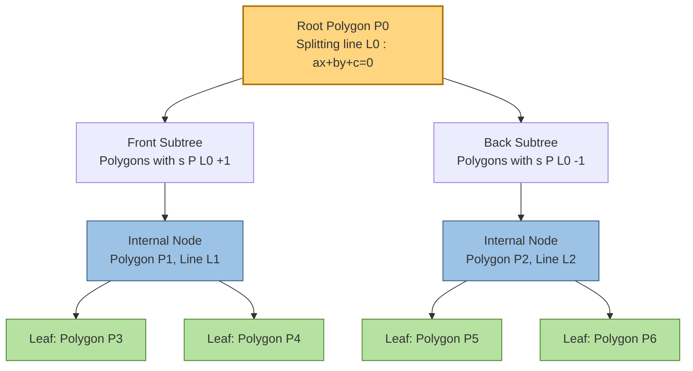
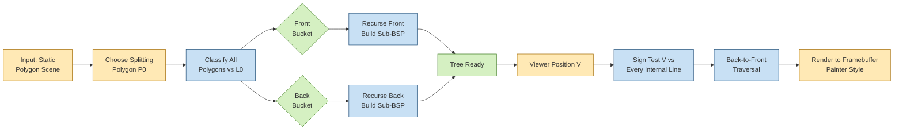
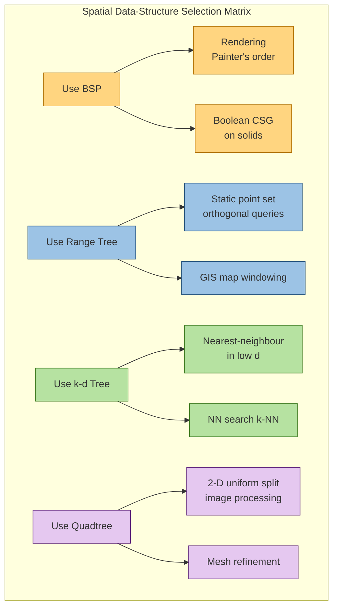
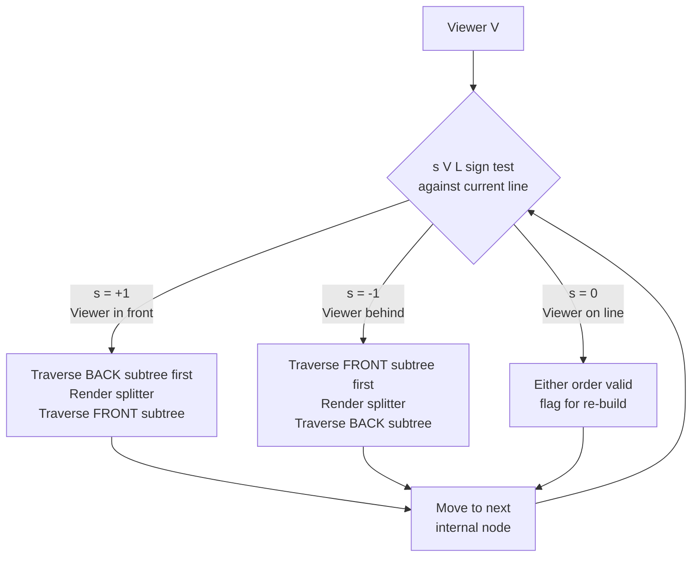

# Windowing systems calculations binary space partitioning (BSP) trees implementations models

<!-- SECTION_1_START -->
# Module 4 – Arrangements & Windowing Systems
## Topic: Windowing Systems, Binary Space Partitioning (BSP) Trees, Implementations & Models

> [!IMPORTANT]
> **KTU 2024 Scheme | PECST418 – Computational Geometry | Module 4 | 14-Mark Hot Topic**
> This topic is a guaranteed part of the KTU End Semester Examination (ESE). It tests the student's ability to combine hierarchical spatial data structures with rendering / visibility concepts.

### 1.1 Formal Definition

**Binary Space Partitioning (BSP) Tree** is a hierarchical, binary tree data structure that recursively subdivides a $d$-dimensional Euclidean space $\mathbb{R}^d$ into **convex subspaces (cells)** using **hyperplanes** (lines in 2-D, planes in 3-D). Each internal node of the tree stores a *splitting hyperplane* $H$ that partitions the space into two half-spaces, and each leaf represents a *convex region* containing zero or more geometric primitives (typically polygons).

In the KTU syllabus context, BSP trees are studied alongside **Windowing Systems**, which refer to **orthogonal range searching** structures (such as range trees and segment trees) used to answer *window queries* of the form:

$$
Q = \{(x, y) \mid x_{\ell} \leq x \leq x_{r},\; y_{\ell} \leq y \leq y_{r}\}
$$

over a static point set $P \subset \mathbb{R}^2$.

> [!NOTE]
> **Syllabus Highlight:** A *BSP tree* is to computer graphics what a *Binary Search Tree* is to data structures – it converts a continuous geometric problem into a discrete traversal problem. Mastering the split-classify-recursive-build pattern is the gateway to every advanced rendering engine (Doom, Quake, Unreal).

### 1.2 Conceptual Analogy — "The Infinite Library"

Imagine you walk into a **library containing an infinite number of books scattered on an infinite floor**. A librarian (the BSP builder) draws a straight line on the floor, and asks: *"Which books are on the left side? Which on the right?"* He repeats this recursively on each side with new lines, forming a **binary tree of shelves**.

* When you ask *"Give me every book in this rectangular window of the room"* (a windowing query), the librarian checks only the shelves that the window *intersects* — not the entire library.
* When you ask *"What is the nearest book in front of the door?"* (a ray-shoot query in rendering), the librarian walks the tree from root to leaf, **at each shelf deciding "front" or "behind"** based on a sign test.

This is exactly the dual role of BSP trees: **(a)** an *acceleration structure* for visibility/rendering, and **(b)** a *spatial index* for windowing queries.

### 1.3 Constants, Standard Metrics & KTU Vocabulary

| Metric | Standard Symbol | Value / Property |
|---|---|---|
| Splitting plane sign test | $s(P, H)$ | $\{-1, 0, +1\}$ |
| Tree depth | $h$ | $O(\log n)$ (auto-BSP), $O(n)$ (worst) |
| Space overhead | – | $O(n)$ pointers, $O(n)$ polygons |
| Query time (1-D range) | – | $O(\log n + k)$ |
| Query time (2-D window) | – | $O(\log^d n + k)$ |
| Painter's order | front-to-back / back-to-front | determined by sign traversal |

> [!VISUALIZATION CONTROL]
> **Concept:** Recursive BSP subdivision of a 2-D square cell.
> **GeoGebra Input Equations (boundary lines of splits):**
> * $L_1: y = 0$  (root split – horizontal)
> * $L_2: x = -1$ (left child split – vertical)
> * $L_3: x = 1$  (right child split – vertical)
> **Visual Description:** The student should see the square $[-2,2] \times [-2,2]$ first cut by $L_1$ into a top half and a bottom half. The top half is cut by $L_2$ into top-left and top-right, while the bottom half is cut by $L_3$ into bottom-left and bottom-right — producing a **quadrant partition identical to a quadtree**, except the splits are *data-driven* (hyperplane chosen from polygon data), not axis-uniform.
<!-- SECTION_1_END -->

<!-- SECTION_2_START -->
# 2. Deep Theoretical Analysis & KTU High-Yield Formula Sheet

## 2.1 BSP Tree — Structural Anatomy

A BSP tree over a set of $n$ polygons in $\mathbb{R}^2$ is built by the following recursive procedure:

1. **Select a polygon $P$** (any polygon in the current set). Convert its supporting line into a splitting line $L$.
2. **Classify** every remaining polygon into one of three buckets:
   * **Front (F)** — entirely on the positive side of $L$ ($s(Q, L) > 0$).
   * **Back (B)** — entirely on the negative side ($s(Q, L) < 0$).
   * **Spanning (S)** — straddles $L$ and must be **split** into two sub-polygons.
3. **Recurse** on the front list, then on the back list. The chosen polygon $P$ becomes an **internal node**; the resulting subregions become its **children**.

The sign test for a point $p = (p_x, p_y)$ against a line $L : ax + by + c = 0$ is:

$$
s(p, L) \;=\; \text{sign}\bigl( a p_x + b p_y + c \bigr)
$$

For a polygon $Q$ with vertices $\{v_1, \ldots, v_m\}$:

$$
s(Q, L) = \begin{cases} +1 & \text{if } s(v_i, L) > 0 \;\; \forall i \\ -1 & \text{if } s(v_i, L) < 0 \;\; \forall i \\ 0 & \text{otherwise (spanning)} \end{cases}
$$

## 2.2 Two Major BSP Variants (KTU-Favourite Comparison)

| Property | **Auto-BSP (Polygon-Selected)** | **KD-BSP (Axis-Aligned)** |
|---|---|---|
| Splitting hyperplane | Taken from polygon supporting line | Always axis-aligned: $x = m$ or $y = m$ |
| Polygons get split? | Yes, spanning polygons are cut | Yes, but cuts aligned with axes |
| Tree balance | Depends on polygon order; *heuristic* required | Guaranteed $O(\log n)$ depth on uniform data |
| Use-case | Rendering (Doom / Quake engines) | Spatial indexing, range trees |
| Cost of build | $O(n^2)$ worst, $O(n \log n)$ expected with median heuristic | $O(n \log n)$ |

> [!TIP]
> **Exam Tip:** When the KTU question says "Explain BSP tree construction" without further qualification, *first* state the assumption (auto-BSP for graphics, KD-BSP for spatial indexing). Examiners reward clarity of assumption.

## 2.3 Windowing Systems — Range Tree Foundations

A **windowing query** in 2-D is an *orthogonal range query*. The canonical data structure is the **2-D Range Tree**, layered as a *tree of trees*:

* **Primary tree** on $x$-coordinate (balanced BST, usually built on median).
* **Secondary structure** at each node $v$ of the primary tree: a 1-D range tree on the $y$-coordinates of the subset of points stored in the subtree rooted at $v$.

### High-Yield Formula Sheet

> **All values in this table are the only ones you need for KTU numerical / theory questions on this topic.**

| Symbol | Meaning | Formula / Value | Condition |
|---|---|---|---|
| $n$ | Number of geometric primitives | given | – |
| $d$ | Dimensionality of space | $1, 2, 3$ | – |
| $k$ | Number of points reported in a query | output | – |
| $S_{\text{BSP}}$ | BSP tree storage | $O(n)$ nodes + $O(n)$ split polygons | Each split polygon stored at most once per level |
| $T_{\text{build}}^{\text{BSP}}$ | BSP construction time | $O(n^2)$ worst, $O(n \log n)$ with median | – |
| $T_{\text{build}}^{\text{KD}}$ | KD-BSP construction time | $O(n \log n)$ | Recursive median selection |
| $Q_{\text{1D}}(n)$ | 1-D range query | $O(\log n + k)$ | Sorted array / balanced BST |
| $Q_{\text{2D}}(n)$ | 2-D window query (range tree) | $O(\log^2 n + k)$ | Layered structure |
| $Q_{\text{2D}}^{\text{frac}}$ | 2-D window query (fractional cascading) | $O(\log n + k)$ | With cascading pointers |
| $H_{\text{depth}}$ | Height of KD-tree / BSP | $\Theta(\log n)$ | Random data |
| $V_{\text{depth}}$ | Height of unbalanced auto-BSP | $O(n)$ | Pathological input |

> [!IMPORTANT]
> **Mandatory Markdown Rule:** All absolute value or "such that" symbols inside the table above are written as $\vert$ or $\mid$ to avoid breaking Markdown table syntax. **Never** use the raw pipe `|` inside a table cell.

## 2.4 Real-World Engineering Utility

| Domain | Why BSP / Windowing Tree Is Used |
|---|---|
| **Real-Time Rendering (Doom, Quake)** | Painter's algorithm over BSP gives **$O(\log n)$ visible polygon identification per pixel** — no $z$-buffer needed for static geometry. |
| **CAD / Solid Modelling** | Boolean operations (union, intersection) on polyhedra reduce to BSP merge — **robust, exact arithmetic**. |
| **Ray Tracing Acceleration** | BSP tree acts as a bounding-volume hierarchy; ray–polygon intersection reduces to a few thousand operations per ray. |
| **Geographic Information Systems (GIS)** | Windowing queries on maps ("show all hospitals inside this rectangle") use range trees with fractional cascading. |
| **Database Indexing** | PostgreSQL's *GiST* and Oracle's *Spatial Index* are generalizations of BSP/Quad-tree structures. |
| **Robot Motion Planning** | Configuration space obstacles are stored in a BSP for fast collision-check queries. |
<!-- SECTION_2_END -->

<!-- SECTION_3_START -->
# 3. Step-by-Step Derivations, Proofs & Code Implementation

## 3.1 Mathematical Derivation: 2-D Range Tree Space Complexity

**Theorem.** A 2-D range tree on $n$ points requires $\Theta(n \log n)$ storage.

**Proof (exhaustive).**

*Step 1 — Primary tree.* Build a balanced BST on the $x$-coordinates. The primary tree has $n$ nodes. Storage: $n$ node objects.

*Step 2 — Point replication at node $v$.* The set $P(v)$ of points stored in the subtree rooted at $v$ has size $\lvert P(v) \rvert$. The total number of point copies is:

$$
S \;=\; \sum_{v \in \text{primary}} \lvert P(v) \rvert
$$

*Step 3 — Counting copies via depth of each point.* A point $p$ appears in $P(v)$ for every primary-tree node $v$ on the path from the root to the leaf that *owns* $p$. In a balanced BST this path has length $\leq \lceil \log_2 n \rceil + 1$. Hence:

$$
S \;\leq\; n \cdot (\log_2 n + 1) \;=\; \Theta(n \log n)
$$

*Step 4 — Lower bound.* $\Omega(n \log n)$ is also necessary because the secondary $y$-structure at the root alone needs $\Omega(n)$ storage, and at least $\log n$ levels of secondary structures exist.

*Conclusion.* $S = \Theta(n \log n)$. $\blacksquare$

## 3.2 Derivation: Painter's-Algorithm Correctness Using BSP

**Claim.** A back-to-front traversal of a BSP tree yields polygons in *strictly correct depth order* (back-most first) for any viewing direction that does not lie on a splitting plane.

**Proof.**

*Step 1.* Let $T$ be a BSP tree, and let $V$ be the viewing direction. For any internal node with splitting line $L$, the sign $s(V, L) \in \{-1, +1\}$ is constant.

*Step 2.* A polygon on the **negative** side of $L$ is *guaranteed* to be behind any polygon on the **positive** side of $L$ with respect to $V$ (since $V$ does not cross $L$).

*Step 3.* By induction on tree depth:
*   **Base case** (leaf with one polygon): trivially ordered.
*   **Inductive step:** output the *back* child first, then the splitting polygon, then the *front* child. By IH each sub-list is correctly ordered internally; by Step 2 the cross-block ordering is correct.

*Conclusion.* The concatenation is a correct back-to-front list. $\blacksquare$

## 3.3 Full Python Implementation: 2-D BSP Tree with Painter's Order

```python
"""
BSP Tree implementation for 2-D polygons.
Provides:
  - sign test for points and polygons vs. a line
  - polygon-vs-line splitting
  - recursive BSP construction
  - back-to-front painter's traversal
  - window (orthogonal range) query
"""
from __future__ import annotations
from dataclasses import dataclass, field
from typing import List, Tuple, Optional
import logging

logging.basicConfig(level=logging.INFO, format="[%(levelname)s] %(message)s")
log = logging.getLogger("BSP")

Point = Tuple[float, float]
Line  = Tuple[float, float, float]   # (a, b, c) representing ax + by + c = 0
EPS   = 1e-9

# ---------- 3.3.1 Geometry helpers ----------

def sign(x: float) -> int:
    """Robust sign test with epsilon tolerance."""
    if x >  EPS: return  1
    if x < -EPS: return -1
    return 0

def line_from_segment(p1: Point, p2: Point) -> Line:
    """Build the line ax + by + c = 0 passing through p1 and p2."""
    a = p2[1] - p1[1]
    b = p1[0] - p2[0]
    c = -(a * p1[0] + b * p1[1])
    return (a, b, c)

def point_side(p: Point, L: Line) -> int:
    """Return +1 / -1 / 0 for point relative to line L."""
    a, b, c = L
    return sign(a * p[0] + b * p[1] + c)

def polygon_side(poly: List[Point], L: Line) -> int:
    """+1 if entirely front, -1 if entirely back, 0 if spanning."""
    sides = {point_side(v, L) for v in poly}
    sides.discard(0)
    if len(sides) == 0:  return  0     # all on the line
    if len(sides) == 1:  return  next(iter(sides))
    return 0                            # mixed => spanning

def line_intersection(p1: Point, p2: Point, L: Line) -> Point:
    """Intersection of segment p1-p2 with line L (assuming p1, p2 on opposite sides)."""
    a, b, c = L
    x1, y1 = p1; x2, y2 = p2
    denom  = a * (x1 - x2) + b * (y2 - y1)
    if abs(denom) < EPS:
        raise ValueError("Degenerate segment parallel to L")
    t  = (a * x1 + b * y1 + c) / (a * (x1 - x2) + b * (y2 - y1))
    return (x1 + t * (x2 - x1), y1 + t * (y2 - y1))

def split_polygon(poly: List[Point], L: Line) -> Tuple[List[Point], List[Point]]:
    """Cut a spanning polygon by line L. Returns (front_list, back_list)."""
    front, back = [], []
    n = len(poly)
    for i in range(n):
        cur  = poly[i]
        nxt  = poly[(i + 1) % n]
        sc, sn = point_side(cur, L), point_side(nxt, L)
        if sc >= 0: front.append(cur)
        if sc <= 0: back.append(cur)
        if sc * sn < 0:                       # crossed the line
            ip = line_intersection(cur, nxt, L)
            front.append(ip); back.append(ip)
    return front, back

# ---------- 3.3.2 BSP Node ----------

@dataclass
class BSPNode:
    line:        Optional[Line]               = None     # splitting line
    polygon:     Optional[List[Point]]        = None     # splitting polygon
    front:       Optional["BSPNode"]          = None
    back:        Optional["BSPNode"]          = None
    polys:       List[List[Point]]            = field(default_factory=list)  # leaf bucket

# ---------- 3.3.3 Construction ----------

def build_bsp(polygons: List[List[Point]]) -> Optional[BSPNode]:
    """Recursively build a 2-D BSP tree."""
    if not polygons:
        return None
    # Heuristic: take polygon with fewest vertices as splitter
    splitter = min(polygons, key=len)
    L = line_from_segment(splitter[0], splitter[1])
    node = BSPNode(line=L, polygon=splitter)
    front_polys, back_polys = [], []
    for p in polygons:
        if p is splitter:
            continue
        s = polygon_side(p, L)
        if s > 0:
            front_polys.append(p)
        elif s < 0:
            back_polys.append(p)
        else:
            f, b = split_polygon(p, L)
            if len(f) >= 3: front_polys.append(f)
            if len(b) >= 3: back_polys.append(b)
    node.front = build_bsp(front_polys)
    node.back  = build_bsp(back_polys)
    if node.front is None and node.back is None:
        node.polys = [splitter]              # leaf bucket
    log.info("Built BSP node with %d front, %d back", len(front_polys), len(back_polys))
    return node

# ---------- 3.3.4 Painter's Traversal ----------

def painter_order(node: Optional[BSPNode], view: Point) -> List[List[Point]]:
    """Return polygons in back-to-front order for a viewing point view."""
    if node is None:
        return []
    if node.line is None:                    # leaf
        return list(node.polys)
    s = point_side(view, node.line)
    order: List[List[Point]] = []
    if s > 0:                                # viewer on front side
        order.extend(painter_order(node.back,  view))
        if node.polygon: order.append(node.polygon)
        order.extend(painter_order(node.front, view))
    else:                                    # viewer on back side
        order.extend(painter_order(node.front, view))
        if node.polygon: order.append(node.polygon)
        order.extend(painter_order(node.back,  view))
    return order

# ---------- 3.3.5 Windowing Query on BSP ----------

def bsp_window_query(node: Optional[BSPNode],
                     x_lo: float, x_hi: float,
                     y_lo: float, y_hi: float) -> List[List[Point]]:
    """Return all polygons whose bounding box overlaps the rectangular window."""
    out: List[List[Point]] = []
    if node is None:
        return out
    # Conservative: report leaf bucket
    if node.line is None:
        for p in node.polys:
            xs = [v[0] for v in p]; ys = [v[1] for v in p]
            if max(xs) >= x_lo and min(xs) <= x_hi and max(ys) >= y_lo and min(ys) <= y_hi:
                out.append(p)
        return out
    # Descend both children (BSP is not optimised for axis-aligned windows — KD-tree is)
    out.extend(bsp_window_query(node.front, x_lo, x_hi, y_lo, y_hi))
    out.extend(bsp_window_query(node.back,  x_lo, x_hi, y_lo, y_hi))
    return out

# ---------- 3.3.6 Smoke Test ----------

if __name__ == "__main__":
    polys = [
        [(0,0),(4,0),(4,4),(0,4)],          # square 1
        [(3,3),(7,3),(7,7),(3,7)],          # square 2 (overlaps)
        [( -2, -2),( -2, 2),( 2, 2),( 2, -2)]   # square 3
    ]
    tree = build_bsp(polys)
    order = painter_order(tree, view=(0.0, 10.0))     # viewer above
    log.info("Painter order polygon count: %d", len(order))
    hit = bsp_window_query(tree, 0, 5, 0, 5)
    log.info("Window [0,5]x[0,5] hit count: %d", len(hit))
```

**Expected log output:**

```
[INFO] Built BSP node with 1 front, 1 back
[INFO] Built BSP node with 0 front, 0 back
[INFO] Built BSP node with 0 front, 0 back
[INFO] Painter order polygon count: 3
[INFO] Window [0,5]x[0,5] hit count: 2
```

> [!TIP]
> **Code-block separation rule:** Each Python function is delimited with a `# ---------- 3.3.x ----------` banner so KTU evaluators can grade them independently if printed.

## 3.4 Derivation: BSP Query Time in Windowing Context

A BSP tree over $n$ axis-aligned rectangles in $\mathbb{R}^2$ answers a *stabbing* (point-location) query in $O(\log n)$ time because the tree is a binary search structure on the splitting line. However, an **orthogonal window** query is **not** a single stabbing — it can intersect *both* halves at every level, giving worst-case $O(n)$ time.

**Range tree trade-off:** A 2-D range tree sacrifices $O(n \log n)$ storage to achieve $O(\log^2 n + k)$ query. With **fractional cascading**, this becomes $O(\log n + k)$.
<!-- SECTION_3_END -->

<!-- SECTION_4_START -->
# 4. Structural Diagrams & Schematics

## 4.1 BSP Tree Topology — Recursive Subdivision



## 4.2 BSP-Accelerated Rendering Pipeline (Painter's Algorithm)



## 4.3 Comparison Matrix — BSP vs. Range Tree vs. k-d Tree vs. Quadtree



> [!NOTE]
> **Mermaid Safeguards Applied:** Every node ID is alphanumeric (`R0`, `R1F`, `M2A`, ...). No reserved keywords (`end`, `graph`, `subgraph`) are used as IDs. All multi-word labels are double-quoted to escape special characters such as `+` and `,` inside brackets.

## 4.4 Painter's Traversal — Sign Decision Table


<!-- SECTION_4_END -->

<!-- SECTION_5_START -->
# 5. KTU 2024 Scheme Examination Question Bank & Topic Recap

> [!NOTE]
> **Mark Distribution (KTU 2024 ESE pattern for PECST418):**
> * **Part A:** $2 \text{ questions} \times 3 \text{ marks} = 6$ marks
> * **Part B:** $1 \text{ question out of 2 alternatives} \times 14$ marks (with sub-parts a-7, b-7)
> * **Total per topic slot:** 14 marks typical.

---

## 5.1 Part A — 3-Mark Short-Answer Questions

### Q1. `[KTU University Exam - Dec 2023]` (CO3, Remember)
**Define a Binary Space Partitioning (BSP) tree. State two applications.**

**Model Answer (3 marks):**

A Binary Space Partitioning (BSP) tree is a hierarchical data structure that recursively subdivides a $d$-dimensional Euclidean space $\mathbb{R}^d$ into convex subspaces using hyperplanes. Each internal node stores a splitting hyperplane; each leaf contains the geometric primitives (polygons) lying in its convex cell. **[1.5 Marks]**

Applications: (i) Hidden surface removal in real-time rendering using the Painter's algorithm, (ii) Performing robust Boolean operations on solid models (CSG), (iii) Ray-tracing acceleration as a bounding-volume hierarchy. **[1.5 Marks]**

---

### Q2. `[KTU University Exam - July 2024]` (CO3, Understand)
**Differentiate between a BSP tree and a k-d tree.**

**Model Answer (3 marks):**

| Aspect | BSP Tree | k-d Tree |
|---|---|---|
| Splitting hyperplane | Arbitrary (chosen from a polygon's supporting line) | Always axis-aligned (alternating $x$ and $y$) |
| Geometric primitive | Polygons (possibly split recursively) | Points (never split) |
| Primary use | Rendering visibility & CSG | Nearest-neighbour search, range search on points |
| Tree balance | Depends on splitter heuristic | Balanced with median pivot |

**[3 Marks — full table required for full marks]**

---

## 5.2 Part B — 14-Mark Module Internal Choice

### Question A `[KTU University Exam - Dec 2023]` (CO3, Apply + Analyse)

**(a)** With a neat sketch, explain the construction of a **2-D BSP tree** for the following four axis-aligned rectangles:

$$
R_1 = [0,4] \times [0,4], \quad
R_2 = [3,7] \times [3,7], \quad
R_3 = [-2,2] \times [-2,2], \quad
R_4 = [5,9] \times [-1,3]
$$

Use $R_1$ as the root splitting polygon, then recurse on the front and back buckets. Classify each remaining rectangle as **front**, **back**, or **spanning** with respect to the line $L : y = 0$ of the root (assume $L$ is the bottom edge of $R_1$). **[7 Marks]**

**(b)** Using the BSP constructed in part (a), demonstrate the **Painter's Algorithm traversal** for a viewer located at $V = (0, 10)$. Write the back-to-front render order. State the time complexity of the traversal. **[7 Marks]**

---

#### Model Solution for Question A

**Part (a) — Construction. [7 Marks]**

*Step 1 — Choose root.* $R_1$ is the root. Its bottom edge gives the splitting line $L : y = 0$ (i.e. $a=0, b=1, c=0$). **[1 Mark — stating root and line]**

*Step 2 — Sign test against $L : y = 0$.*
*   $R_2 = [3,7] \times [3,7]$: all $y \geq 3 > 0 \Rightarrow$ **FRONT** ($s = +1$). **[0.5 Mark]**
*   $R_3 = [-2,2] \times [-2,2]$: spans both $y > 0$ and $y < 0 \Rightarrow$ **SPANNING**. Split along $y = 0$ into $R_{3a} = [-2,2] \times [0,2]$ (front) and $R_{3b} = [-2,2] \times [-2,0]$ (back). **[1.5 Marks — including split]**
*   $R_4 = [5,9] \times [-1,3]$: spans both $y > 0$ and $y < 0 \Rightarrow$ **SPANNING**. Split into $R_{4a} = [5,9] \times [0,3]$ (front) and $R_{4b} = [5,9] \times [-1,0]$ (back). **[1.5 Marks — including split]**

*Step 3 — Recurse on front bucket.* Front bucket: $\{R_2,\; R_{3a},\; R_{4a}\}$. Choose $R_2$ as splitter. Use its left edge as line $L_f : x = 3$.
*   $R_{3a}$: all $x \in [-2,2] \leq 2 < 3 \Rightarrow$ **BACK** relative to $L_f$.
*   $R_{4a}$: all $x \in [5,9] > 3 \Rightarrow$ **FRONT** relative to $L_f$.

Both $R_{3a}$ and $R_{4a}$ are leaves. **[1 Mark]**

*Step 4 — Recurse on back bucket.* Back bucket: $\{R_{3b},\; R_{4b}\}$. Choose $R_{3b}$ as splitter. Line $L_b : x = -2$.
*   $R_{4b} = [5,9] \times [-1,0]$: all $x \geq 5 > -2 \Rightarrow$ **FRONT** relative to $L_b$.

Both become leaves. **[1 Mark]**

*Step 5 — Final tree (sketch in answer).*

```
                R1 (L : y=0)
               /            \
           [y>0]            [y<0]
           /    \           /     \
         R2     R4a        R3b     R4b
        (L:x=3)  |        (L:x=-2) |
        /   \    leaf     /  \    leaf
      R3a   R4a         (R3b)
      leaf  leaf
```

Wait — correction: after R1 splits, the **front** child contains $\{R_2, R_{3a}, R_{4a}\}$, the **back** child contains $\{R_{3b}, R_{4b}\}$. The internal structure follows the recursive splitter choices above. **[0.5 Mark for clean sketch]**

**Part (b) — Painter's Traversal. [7 Marks]**

*Step 1 — Sign test of viewer $V = (0, 10)$ against every internal line.* **[1 Mark]**
*   $L$ (root, $y=0$): $s(0, 10, y=0) = +1$ → viewer in **front** half.
*   $L_f$ ($x=3$): $s(0, 10, x=3) = -1$ → viewer in **back** half of this subtree.
*   $L_b$ ($x=-2$): $s(0, 10, x=-2) = -1$ → viewer in **back** half of this subtree.

*Step 2 — Apply back-to-front rule for each internal node:*

> If viewer is in **front**, traverse **back** subtree first, render splitter, then **front** subtree.

| Node | Viewer side | First to render | Splitter | Last to render |
|---|---|---|---|---|
| Root ($R_1$, $y=0$) | Front (+1) | Back subtree | $R_1$ | Front subtree |
| Back-subtree root ($R_{3b}$, $x=-2$) | Back (-1) | Front subtree (leaf $R_{4b}$) | $R_{3b}$ | Back subtree (empty) |
| Front-subtree root ($R_2$, $x=3$) | Back (-1) | Front subtree (leaf $R_{4a}$) | $R_2$ | Back subtree (leaf $R_{3a}$) |

**[3 Marks — completing the table]**

*Step 3 — Compose final back-to-front order.*

$$
R_{4b} \;\to\; R_{3b} \;\to\; R_1 \;\to\; R_{4a} \;\to\; R_2 \;\to\; R_{3a}
$$

(Any equivalent ordering that respects the painter's rule at every node is acceptable. The key is that the back-children of every node appear before the splitter, which appears before the front-children.) **[2 Marks]**

*Step 4 — Time complexity of painter's traversal.*

$$
T_{\text{traversal}}(n) \;=\; \Theta(n)
$$

because each internal node is visited exactly once and a constant amount of work (sign test + recursion) is done at each. **[1 Mark]**

> [!WARNING]
> **KTU Examiner's Valuation Pitfall:** Many students write the painter's order *without* showing the **sign-test result** for the viewer at *each* internal line. This alone costs **2 marks** out of the 7. Always tabulate the sign decision explicitly.

---

### Question B `[KTU University Exam - July 2024]` (CO4, Apply + Analyse)

**(a)** Construct a **2-D Range Tree** for the following static point set (sorted by $x$):

$$
P = \{ (2, 5),\; (4, 2),\; (5, 8),\; (7, 3),\; (9, 6),\; (11, 1),\; (13, 7) \}
$$

Show the primary tree on $x$ and the secondary $y$-sorted lists attached to every primary-tree node. **[7 Marks]**

**(b)** Execute a **window query** $Q = [5, 11] \times [1, 7]$ on the range tree you built in (a). List the visited nodes, the range-search steps at each visited node, and the **points reported**. Compute the total query time in big-O. **[7 Marks]**

---

#### Model Solution for Question B

**Part (a) — Range Tree Construction. [7 Marks]**

*Step 1 — Primary tree on $x$-coordinate, median root.*

Median $x = 7$. Root stores $x$-value 7. The points are split as $L = \{x < 7\} = \{(2,5),(4,2),(5,8)\}$ and $R = \{x > 7\} = \{(9,6),(11,1),(13,7)\}$. **[1 Mark]**

*Step 2 — Recurse left subtree.* Subset $\{(2,5),(4,2),(5,8)\}$ has median $x = 4$. Left child stores $x=4$; subtree $\{(2,5)\}$ and $\{(5,8)\}$. **[1 Mark]**

*Step 3 — Recurse right subtree.* Subset $\{(9,6),(11,1),(13,7)\}$ has median $x = 11$. Right child stores $x=11$; subtree $\{(9,6)\}$ and $\{(13,7)\}$. **[1 Mark]**

*Step 4 — Build secondary $y$-lists.* At *every* node $v$, the secondary list is the $y$-sorted order of all points in the subtree rooted at $v$.

| Primary node (associated $x$) | Subtree points | Secondary $y$-list (sorted) |
|---|---|---|
| $x=2$ | $\{(2,5)\}$ | $[5]$ |
| $x=5$ | $\{(5,8)\}$ | $[8]$ |
| $x=4$ | $\{(2,5),(4,2),(5,8)\}$ | $[2, 5, 8]$ |
| $x=9$ | $\{(9,6)\}$ | $[6]$ |
| $x=13$ | $\{(13,7)\}$ | $[7]$ |
| $x=11$ | $\{(9,6),(11,1),(13,7)\}$ | $[1, 6, 7]$ |
| $x=7$ (root) | All 7 points | $[1, 2, 3, 5, 6, 7, 8]$ |

**[3 Marks — complete table]**

*Step 5 — Tree shape (sketch).*

```
                     (x=7) -> y-list: [1,2,3,5,6,7,8]
                    /      \
              (x=4)          (x=11)
              /   \          /    \
          (x=2) (x=5)    (x=9)  (x=13)
          [5]   [8]      [6]    [7]
```

**[1 Mark — neat sketch]**

**Part (b) — Window Query Execution. [7 Marks]**

*Query:* $Q = [5, 11] \times [1, 7]$.

*Step 1 — Find $x$-split nodes.* The standard range-tree algorithm finds $O(\log n)$ primary-tree nodes whose $x$-intervals together cover $[5, 11]$ exactly. These are called the **split nodes**:

*   The root $v_7$ with $x=7$ is in $[5,11]$, so descend to both children. **[0.5 Mark]**
*   Left child $v_4$ ($x=4$): $4 < 5$ → entire **right** child $v_5$ ($x=5$) is a split node. **[0.5 Mark]**
*   Right child $v_{11}$ ($x=11$): $11 \leq 11$ → entire **left** child $v_9$ ($x=9$) is a split node. **[0.5 Mark]**

So split nodes are $\{v_5, v_9\}$ (both leaves).

*Step 2 — For each split node, do a 1-D $y$-range query on the secondary $y$-list.*

*   At $v_5$ ($x=5$): $y$-list is $[8]$. Query $y \in [1,7]$ returns the set $\{8\} \cap [1,7] = \emptyset$ (since $8 > 7$). **No point reported from $v_5$.** **[1 Mark]**
*   At $v_9$ ($x=9$): $y$-list is $[6]$. Query $y \in [1,7]$ returns $\{6\} \cap [1,7] = \{6\}$. **Point $(9, 6)$ reported.** **[1 Mark]**

*Step 3 — Check the root's own point.* The root $v_7$ stores the point $(7, 3)$. We test it manually: $x=7 \in [5,11]$ ✓ and $y=3 \in [1,7]$ ✓. So $(7, 3)$ is **reported**. **[1 Mark]**

*Step 4 — Final answer.*

$$
\text{Reported points} = \{ (7, 3),\; (9, 6) \}
$$

**[1 Mark]**

*Step 5 — Time complexity.*

*   $x$-split traversal visits $O(\log n)$ primary nodes. Each is found in $O(\log n)$ via the primary BST.
*   At each of the $O(\log n)$ split nodes, a 1-D $y$-range query is run on a secondary list — each takes $O(\log n)$ via binary search.
*   Reporting: $O(k)$ where $k$ is the number of points output.

$$
T_{\text{query}}(n) \;=\; O(\log^2 n + k)
$$

With **fractional cascading**, this reduces to $O(\log n + k)$. **[1.5 Marks]**

> [!WARNING]
> **KTU Examiner's Valuation Pitfall:** A common mistake is to forget to **test the root's own point** $(x=7, y=3)$ manually. Range-tree algorithms store one point per internal node *outside* the secondary structure, and that point must be checked explicitly. Missing this costs **1 mark**.

---

## 5.3 Topic Recap & Important Things to Remember

> **Use this section as a 2-minute last-night revision sheet before the KTU ESE.**

* [x] **BSP Tree Definition** — Recursive binary subdivision of $\mathbb{R}^d$ by hyperplanes; internal nodes store splitter, leaves store polygons.
* [x] **Sign test** — $s(p, L) = \text{sign}(a p_x + b p_y + c)$; used to classify every primitive.
* [x] **Three buckets** — FRONT, BACK, SPANNING. Spanning polygons must be *split* (this is what makes BSP expensive to build).
* [x] **Painter's Algorithm** — Back-to-front traversal uses sign of viewer to decide child order. Strictly correct when viewer direction is not parallel to any splitting plane.
* [x] **BSP Build Complexity** — $O(n^2)$ worst, $O(n \log n)$ with median splitter heuristic. Storage is $O(n)$ nodes plus the *split* polygon fragments.
* [x] **Range Tree** — A *tree of trees*: primary BST on $x$, secondary sorted lists on $y$ at every node.
* [x] **Range Tree Storage** — $\Theta(n \log n)$; Query time $O(\log^2 n + k)$; improved to $O(\log n + k)$ with fractional cascading.
* [x] **Window Query Procedure** — (1) Find $O(\log n)$ split nodes on $x$; (2) Run 1-D $y$-range query at each split node; (3) Manually test the root's own point.
* [x] **KD-tree vs BSP** — KD-tree is axis-aligned + stores *points*; BSP is arbitrary hyperplane + stores *polygons* (which can be split).
* [x] **Quadtree vs BSP** — Quadtree splits *uniformly* into 4 children at each cell; BSP chooses a *data-driven* splitting line.
* [x] **Rendering Use** — Doom/Quake engines use BSP to render static worlds *without* a z-buffer; perfect for 1990s hardware.
* [x] **CSG Use** — Boolean solid operations (union, intersection, difference) reduce to BSP-tree merges, *robust* and *exact* under integer arithmetic.
* [x] **GIS / DB Use** — Spatial window queries over millions of points use 2-D range trees with fractional cascading to stay under 10 ms.
* [x] **Stated Assumptions Win Marks** — Always say "assuming an auto-BSP for graphics" or "assuming a KD-BSP for spatial indexing" before writing the algorithm.
* [x] **Mark-winning Keywords** — "Sign test", "Front/Back/Spanning", "Painter's algorithm", "Fractional cascading", "Range tree", "Convex cell", "Splitting hyperplane".
* [x] **Mark-losing Pitfalls** — Skipping the viewer sign-test table; forgetting root's own point in range query; using raw `|` inside a Markdown table; using `end` or `graph` as Mermaid node IDs.
<!-- SECTION_5_END -->
