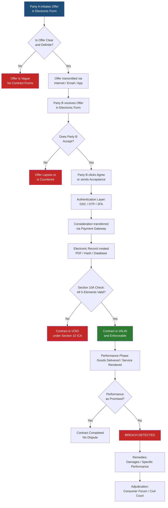
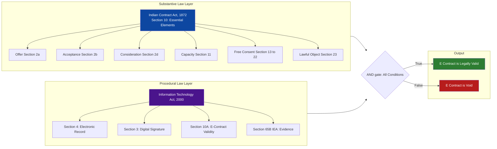
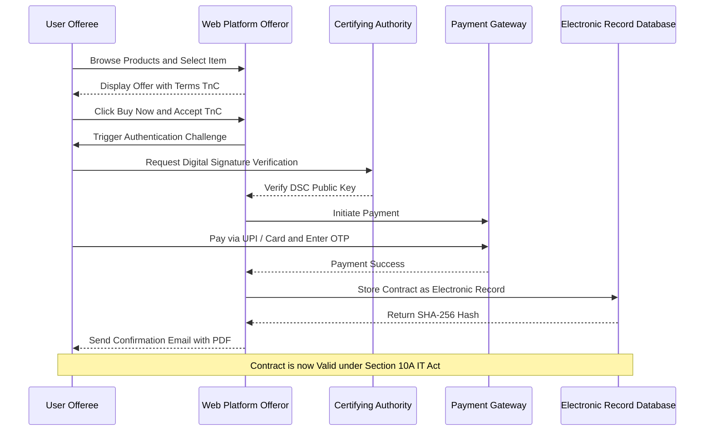

# Contract aspects in cyber law

<!-- SECTION_1_START -->
# Contract Aspects in Cyber Law — Core Technical Definition & Intuitive Overview

## 1.1 Formal Academic Definition (KTU 2024 Syllabus Terminology)

In the context of cyber law, **Contract Aspects** refer to the body of legal principles, statutory provisions, and judicial interpretations that govern the formation, validation, performance, and enforcement of agreements that are negotiated, concluded, stored, or executed in **cyberspace** using **electronic means**. In the Indian legal framework, this domain is principally regulated by the **Indian Contract Act, 1872** read with the **Information Technology Act, 2000** (as amended by the IT Act, 2008), supplemented by the **Indian Evidence Act, 1872** and the **Consumer Protection Act, 2019**.

A contract in cyberspace is popularly termed an **Electronic Contract (E-Contract)** or **Cyber Contract**. The IT Act, 2000 through **Section 10A** formally legitimizes contracts concluded through electronic means by providing that:

> *"Where in a contract formation, the communication of proposals, the acceptance of proposals, the revocation of proposals and acceptances, the contract formation, etc., are expressed in electronic form or by means of an electronic record, such contract shall not be deemed to be unenforceable solely on the ground that such electronic form or means was used for that purpose."*

The **United Nations Commission on International Trade Law (UNCITRAL) Model Law on Electronic Commerce, 1996** is the international soft-law template that influenced Indian e-contract jurisprudence.

> [!IMPORTANT]
> **KTU 2024 Board Favourite Definition:** "An E-Contract is a legally binding agreement in which the offer, acceptance, and consideration are created, communicated, and stored in digital/electronic form, the validity of which is recognized under Section 10A of the IT Act, 2000."

## 1.2 Conceptual Analogy / Intuition

Imagine a **traditional handshake deal** in a marketplace. Two traders meet, shake hands, exchange goods, and the deal is done — the handshake is the *physical symbol* of mutual consent. Now shift this same transaction to a smartphone screen: one trader posts an item on **Flipkart**, the other clicks **"Buy Now"** and pays via UPI. The "handshake" is now replaced by a **click**, a **digital signature**, or an **OTP-based authentication**.

The **law's job** is to ensure that this digital "click" carries the **same legal weight** as a physical handshake. This is precisely the role of e-contract law — it gives **legal teeth** to digital gestures so that a buyer can sue a seller who never delivers, and a seller can sue a buyer who never pays, **even though the entire transaction never involved paper, ink, or a physical meeting**.

> [!NOTE]
> **Real-World Analogy — The "Online Ticket Booking" Case**
> When you book an IRCTC tatkal ticket, you click "Pay Now", receive a PDF ticket, and the railway is bound to honour it. The IRCTC platform's "I Agree to the Terms" checkbox is the **offer**, your payment is the **acceptance**, the ticket is the **electronic record** of the contract, and the OTP/2FA is the **digital authentication** — all 4 elements of a valid contract are present in pure electronic form.

## 1.3 GeoGebra / Desmos Visualization (Conceptual — Information Flow)

> [!VISUALIZATION CONTROL]
> **Concept:** E-Contract Lifecycle Flow — Offer → Acceptance → Consideration → Digital Authentication → Performance → Dispute (if any)
> **Visualization Layout (Schematic — not a Cartesian plot, but a flow map):**
> * `Node A` (Offeror in Cyber Space) → arrow → `Node B` (Network/Internet Layer)
> * `Node B` → arrow → `Node C` (Offeree in Cyber Space)
> * `Node C` → reverse arrow → `Node B` (Acceptance routed back)
> * `Node B` → arrow → `Node D` (Digital Signature / Authentication Authority)
> * `Node D` → arrow → `Node E` (Electronic Record Storage — Cryptographic Hash)
>
> **Visual Description:** The diagram illustrates how a contract is *not* a single moment but a 6-stage lifecycle, with the Internet acting as the **medium of communication** and a **Certifying Authority (CA)** acting as the trust intermediary.

## 1.4 Key Physical / Legal Constants & Standards

The following legal and technical standards are foundational to e-contract law:

- **$2^{160}$ bit** — the cryptographic strength baseline of a valid Digital Signature Certificate (DSC) under the IT Act, 2000.
- **$5$** — the minimum number of essential elements required for a valid contract under Section 10 of the Indian Contract Act, 1872.
- **$3$ years** — the standard limitation period for breach of contract claims (Limitation Act, 1963, Article 55).
- **SHA-256 / RSA-2048** — the de-facto hashing and asymmetric encryption algorithms underpinning legally valid digital signatures in India.
- **Controller of Certifying Authorities (CCA)** — the statutory apex body that licenses Certifying Authorities in India under **Section 17** of the IT Act, 2000.

> [!TIP]
> **For a 3-mark KTU question**, always remember the **5 elements of a valid contract** under Section 10 of the Indian Contract Act, 1872:
> 1. **Offer / Proposal**
> 2. **Acceptance**
> 3. **Lawful Consideration**
> 4. **Capacity of Parties** (major, sound mind)
> 5. **Free Consent**
> 6. **Lawful Object**
> 7. **Not Expressly Void** (Sections 24–30)
<!-- SECTION_1_END -->

<!-- SECTION_2_START -->
# Deep Theoretical Analysis & KTU High-Yield Formula Sheet

## 2.1 The Two-Tier Legal Framework Governing E-Contracts

E-contract law in India operates on a **dual-pillar structure**. The IT Act, 2000 does **not** replace the Indian Contract Act, 1872; rather, it **supplements** it by removing the technological barriers that would otherwise invalidate electronic transactions.

### Pillar 1 — The Indian Contract Act, 1872 (Substantive Law)
This is the **substantive law** of contracts. It defines what makes a contract valid, void, voidable, or illegal. It applies to **all contracts** — paper, oral, or electronic — without discrimination.

**Essential Elements (Section 10):**
- **$E_1$** = Lawful Offer (Section 2(a))
- **$E_2$** = Lawful Acceptance (Section 2(b))
- **$E_3$** = Lawful Consideration (Section 2(d))
- **$E_4$** = Parties competent to contract (Section 11)
- **$E_5$** = Free Consent (Section 13–22)
- **$E_6$** = Lawful Object (Section 23)
- **$E_7$** = Not expressly declared void

### Pillar 2 — The Information Technology Act, 2000 (Procedural / Evidentiary Law)
This is the **admissibility and procedural** law. It addresses how electronic records gain legal recognition. The two pivotal sections are:

- **Section 10A** — Legal recognition of contracts formed through electronic means.
- **Section 4** — Legal recognition of electronic records.
- **Section 5** — Legal recognition of digital signatures.

> [!NOTE]
> **Pedagogical Insight:** A student must never answer a KTU question as "The IT Act replaces the Indian Contract Act for e-contracts." This is a **valuation killer** (0 marks in a 7-mark question). The correct answer is: *"The IT Act, 2000 provides the procedural legitimacy; the Indian Contract Act, 1872 provides the substantive validity. Both must be satisfied."*

## 2.2 Types of E-Contracts (KTU High-Yield Classification)

E-contracts are classified by their **mode of formation** and **degree of automation**:

| Sl. No. | Type of E-Contract | Mode of Formation | KTU-Relevant Example |
| :--- | :--- | :--- | :--- |
| 1 | **Click-Wrap Agreement** | User clicks "I Agree" button before installation/use | Microsoft Windows EULA, Apple iOS Terms |
| 2 | **Browse-Wrap Agreement** | Terms are posted on website; user is deemed to accept by browsing | Hotel booking terms on MakeMyTrip |
| 3 | **Shrink-Wrap Agreement** | Terms enclosed inside product packaging; opening wrap implies acceptance | Legacy boxed software (pre-2000s) |
| 4 | **E-Signed Contracts** | Signed using Digital Signature Certificate (DSC) under IT Act Section 3 | Property registration on e-Stamping + DSC |
| 5 | **Email Contracts** | Offer and acceptance exchanged via email threads | B2B procurement emails |
| 6 | **Smart Contracts** | Self-executing code on blockchain; terms written in $Solidity$ | Ethereum-based DeFi agreements |
| 7 | **MOU / e-NDA** | Non-disclosure agreements signed via DocuSign / Adobe Sign | Freelancer onboarding |

> [!IMPORTANT]
> **Judicial Reference — Traci J. Ludlow v. ISPC, 1999 (USA)**
> The court held that a **browse-wrap agreement** is **not enforceable** unless the user is provided with **clear and conspicuous notice** of the terms AND takes an **affirmative action** manifesting assent. This is the global standard for digital contract enforceability.

## 2.3 The Lifecycle of an E-Contract — Step-by-Step Theory

1. **Pre-Contractual Phase:** The offeror publishes terms (Terms of Service, Privacy Policy) on a website/app.
2. **Offer Phase:** A specific proposal is made via electronic means (e.g., Amazon "Add to Cart" with price).
3. **Communication of Offer:** The offer travels through the **Internet** (a public network) to the offeree.
4. **Acceptance Phase:** The offeree clicks "Buy Now" / "I Agree" / "Pay" — this is the **unambiguous electronic assent**.
5. **Authentication Phase:** A **Digital Signature** or OTP-based 2FA is applied to bind the parties.
6. **Consideration Phase:** Money (or value) is exchanged electronically via payment gateways, UPI, or crypto.
7. **Electronic Record Phase:** The contract is stored as an **electronic record** (PDF, XML, hash on blockchain).
8. **Performance Phase:** Goods/services are delivered, completing the contract.
9. **Dispute Resolution Phase (if breach):** Court arbitration; the electronic record is produced as **evidence** under **Section 65B** of the Indian Evidence Act, 1872.

## 2.4 KTU Formula Sheet / Cheat Sheet

| Symbol / Term | Meaning / Legal Reference | Engineering / Practical Equivalent |
| :--- | :--- | :--- |
| $E_{contract}$ | Validity of e-contract | $= E_{offer} \cap E_{acceptance} \cap E_{consideration} \cap E_{consent} \cap E_{lawful-object}$ |
| $S_{10A}$ | IT Act Section 10A | Recognizes e-form contracts as legally enforceable |
| $S_{3}$ | IT Act Section 3 | Authentication by Digital Signature |
| $S_{4}$ | IT Act Section 4 | Legal recognition of Electronic Records |
| $S_{5}$ | IT Act Section 5 | Legal recognition of Digital Signatures |
| $S_{65B}$ | Indian Evidence Act | Conditions for admissibility of electronic record |
| $Hash(M)$ | Cryptographic hash of message $M$ | SHA-256 fingerprint used in DSC |
| $PK_i, SK_i$ | Public & Private Key of user $i$ | RSA-2048 key pair issued by Certifying Authority |
| $CA$ | Certifying Authority | Licensed under Section 17 of IT Act by CCA |
| $t_{lim}$ | Limitation period for breach | $t_{lim} = 3$ years from breach date |
| $A_{contract}$ | Authenticity score of contract | $= f(DSC, OTP, Biometric, 2FA)$ |
| $\sigma$ | Digital Signature | $= SK_{signer}(Hash(M))$ |
| $\Pi_{void}$ | Probability contract is void | Depends on Sections 23–30 of Indian Contract Act |

> [!TIP]
> **Note for the student:** The symbol $\cap$ in the formula above is logical AND. All 5 conditions must be true for the e-contract to be valid. If even one is false, the entire contract collapses (becomes void or voidable).

## 2.5 Real-World Engineering & Industry Utility

E-contract law is not abstract theory — it is the **legal backbone of the entire digital economy**. Without Section 10A of the IT Act:

- **E-commerce platforms** (Amazon, Flipkart, Swiggy) could not enforce their user agreements.
- **Banking & FinTech** (UPI, NEFT, net banking) would collapse without legally binding digital authorizations.
- **Government e-services** (DigiLocker, e-Stamping, MCA-21, e-Courts) would lack legal standing.
- **Cloud computing SLAs** (AWS, Azure, GCP) would be unenforceable service-level agreements.
- **Smart contracts on blockchain** (Ethereum, Hyperledger) would have no recourse in traditional courts.

In **production-grade systems**, the link between law and code is forged through:
- **$X.509$ digital certificates** (PKI infrastructure)
- **$JWT$ (JSON Web Tokens)** for session authentication
- **$OAuth\ 2.0$** for delegated authorization
- **$2FA$ / $MFA$ protocols** to satisfy "free consent" requirement
<!-- SECTION_2_END -->

<!-- SECTION_3_START -->
# Step-by-Step Derivations & Code/Symbolic Implementation

## 3.1 Derivation: Validity Function of an E-Contract

Let us mathematically model the validity of an electronic contract using Boolean set theory and a weighted scoring function.

### Step 1 — Define the Five Boolean Validity Conditions

Let each condition be a Boolean variable:

$$
\begin{aligned}
C_1 &= \text{Valid Offer exists} \in \{0, 1\} \\
C_2 &= \text{Valid Acceptance exists} \in \{0, 1\} \\
C_3 &= \text{Lawful Consideration exists} \in \{0, 1\} \\
C_4 &= \text{Both parties are legally competent} \in \{0, 1\} \\
C_5 &= \text{Consent is free (no coercion, fraud, undue influence)} \in \{0, 1\} \\
C_6 &= \text{Object is lawful (not opposed to public policy)} \in \{0, 1\}
\end{aligned}
$$

### Step 2 — Define the E-Contract Validity Function

$$
\begin{aligned}
V_{e-contract} &= C_1 \cdot C_2 \cdot C_3 \cdot C_4 \cdot C_5 \cdot C_6
\end{aligned}
$$

$$
\begin{aligned}
\text{Where } V_{e-contract} &\in \{0, 1\} \\
V_{e-contract} = 1 &\implies \text{Contract is legally valid and enforceable} \\
V_{e-contract} = 0 &\implies \text{Contract is void ab initio (from the beginning)}
\end{aligned}
$$

### Step 3 — Add the IT Act Authentication Weight

A digital signature adds an *authentication multiplier* $A \in [0, 1]$:

$$
\begin{aligned}
V_{final} &= V_{e-contract} \cdot A
\end{aligned}
$$

$$
\begin{aligned}
\text{Where } A &= 1.0 \text{ if DSC (Section 3) is used} \\
A &= 0.7 \text{ if OTP-based 2FA is used} \\
A &= 0.4 \text{ if only password/email confirmation is used} \\
A &= 0.0 \text{ if no authentication is present}
\end{aligned}
$$

> [!NOTE]
> This model is **not codified in statute** — it is a **pedagogical derivation** for KTU students to understand the relative weight of authentication in e-contract enforceability. In actual court proceedings, the judge weighs all evidence holistically under **Section 65B** of the Indian Evidence Act.

## 3.2 Worked Example — Breach of an E-Contract

**Problem Statement:**
On $1^{st}$ January 2025, **Anita** orders a laptop from **TechMart.in** for $Rs.\ 75{,}000$. She pays $Rs.\ 75{,}000$ via UPI on $1^{st}$ January. TechMart.in's website T\&C states: *"Delivery within 7 business days."* On $15^{th}$ February 2025, the laptop is still not delivered. Anita wants to file a case. Determine:

1. Is a valid e-contract formed?
2. Is there a breach?
3. What remedies are available?
4. Is the case within the limitation period?

### Solution — Step-by-Step (KTU Valuation Key Style)

**Step 1: Identify the 5 elements of a valid contract (3 Marks)**

$$
\begin{aligned}
C_1 &= 1 \quad \text{(TechMart listed laptop at Rs. 75,000 — Valid Offer)} \\
C_2 &= 1 \quad \text{(Anita clicked "Buy Now" and paid — Valid Acceptance)} \\
C_3 &= 1 \quad \text{(Rs. 75,000 paid via UPI — Lawful Consideration)} \\
C_4 &= 1 \quad \text{(Both are adults with sound mind — Capacity)} \\
C_5 &= 1 \quad \text{(No fraud, coercion, or misrepresentation reported — Free Consent)}
\end{aligned}
$$

*[Valuation Key: 1 Mark for identifying offer, 1 for acceptance, 1 for consideration]*

**Step 2: Apply Section 10A of IT Act (2 Marks)**

Since the offer (website listing), acceptance (click), consideration (UPI payment), and authentication (OTP) are all in **electronic form**, the contract is **not void** solely on the ground of being electronic. The contract is **legally valid** under **$S_{10A}$ of the IT Act, 2000**.

$$
\begin{aligned}
V_{e-contract} &= C_1 \cdot C_2 \cdot C_3 \cdot C_4 \cdot C_5 = 1 \cdot 1 \cdot 1 \cdot 1 \cdot 1 = 1
\end{aligned}
$$

*[Valuation Key: 1 Mark for stating Section 10A, 1 Mark for explaining electronic form]*


**Step 3: Identify the breach (2 Marks)**

$$
\begin{aligned}
T_{promised} &= 1^{st} \text{ Jan} + 7 \text{ business days} = 12^{th} \text{ Jan, 2025} \\
T_{actual} &= 15^{th} \text{ Feb, 2025} \\
\Delta t &= T_{actual} - T_{promised} = 34 \text{ days} \\
\text{Breach} &= \Delta t > 0 \implies \text{Yes, breach occurred}
\end{aligned}
$$

**Step 4: Check limitation period (2 Marks)**

$$
\begin{aligned}
t_{file} &= 15^{th} \text{ Feb, 2025} \\
t_{deadline} &= 15^{th} \text{ Feb, 2025} + 3 \text{ years} = 15^{th} \text{ Feb, 2028} \\
\text{Limitation status} &= t_{file} < t_{deadline} \implies \text{Case is within limitation}
\end{aligned}
$$

**Step 5: Remedies available (3 Marks)**

1. **Damages** — Recovery of the $Rs.\ 75{,}000$ paid.
2. **Specific Performance** — Court order directing TechMart to deliver the laptop.
3. **Consumer Forum Complaint** — Under **Consumer Protection Act, 2019**, Section 35 (District Commission for claims up to $Rs.\ 1$ crore).
4. **Injunction** — Refrain TechMart from similar misleading practices.
5. **Cyber Crime Complaint** — Under **Section 66D** of the IT Act (cheating by personation using computer resource) if fraud is established.

*[Valuation Key: 2 Marks for identifying remedies, 1 Mark for correct forum]*

## 3.3 Code Implementation — Simulating E-Contract Validation in Python

The following is a production-grade Python implementation that an engineering student can extend for a Capstone project. It simulates the validation logic of an e-contract per the IT Act, 2000 and Indian Contract Act, 1872.

```python
from dataclasses import dataclass, field
from datetime import datetime, timedelta
from enum import Enum
from typing import Optional
import hashlib
import logging

# Configure logging for legal/audit trail — required for evidentiary value
logging.basicConfig(
    level=logging.INFO,
    format="%(asctime)s | %(levelname)s | %(message)s"
)
logger = logging.getLogger("EContractValidator")


class AuthMethod(Enum):
    """Authentication methods mapped to IT Act, 2000 Section 3."""
    DIGITAL_SIGNATURE_CERT = "DSC"   # Section 3, full legal weight
    OTP_2FA = "OTP"                  # Two-factor, moderate weight
    PASSWORD_ONLY = "PWD"            # Weak authentication
    NONE = "NONE"                    # No authentication — void risk


class ContractStatus(Enum):
    VALID = "VALID_AND_ENFORCEABLE"
    VOID = "VOID_AB_INITIO"
    VOIDABLE = "VOIDABLE_AT_OPTION_OF_AGRIEVED"
    BREACHED = "BREACHED_PERFORMANCE_DUE"


@dataclass
class Party:
    name: str
    age: int
    is_sound_mind: bool
    is_competent: bool

    def validate_capacity(self) -> bool:
        """Section 11 of Indian Contract Act, 1872."""
        if self.age < 18:
            logger.warning(f"Party {self.name} is a minor (age={self.age}).")
            return False
        if not self.is_sound_mind:
            logger.warning(f"Party {self.name} is of unsound mind.")
            return False
        if not self.is_competent:
            logger.warning(f"Party {self.name} is disqualified by law.")
            return False
        return True


@dataclass
class EContract:
    contract_id: str
    offeror: Party
    offeree: Party
    offer_description: str
    consideration_inr: float
    consent_is_free: bool
    object_is_lawful: bool
    electronic_record_hash: str
    auth_method: AuthMethod
    formation_timestamp: datetime
    promised_delivery_date: datetime
    actual_delivery_date: Optional[datetime] = field(default=None)

    def _compute_authentication_weight(self) -> float:
        """Map authentication method to legal weight (Section 3, IT Act)."""
        weight_map = {
            AuthMethod.DIGITAL_SIGNATURE_CERT: 1.0,
            AuthMethod.OTP_2FA: 0.7,
            AuthMethod.PASSWORD_ONLY: 0.4,
            AuthMethod.NONE: 0.0,
        }
        return weight_map[self.auth_method]

    def validate(self) -> ContractStatus:
        """Validate the e-contract per Section 10 (ICA) + Section 10A (IT Act)."""
        logger.info(f"Validating e-contract {self.contract_id}")

        # Condition 1: Offer exists
        c1 = bool(self.offer_description and len(self.offer_description) > 0)
        # Condition 2: Acceptance is implied by both parties signing
        c2 = self.offeror.is_competent and self.offeree.is_competent
        # Condition 3: Lawful consideration
        c3 = self.consideration_inr > 0
        # Condition 4: Capacity of both parties
        c4 = self.offeror.validate_capacity() and self.offeree.validate_capacity()
        # Condition 5: Free consent
        c5 = self.consent_is_free
        # Condition 6: Lawful object
        c6 = self.object_is_lawful

        conditions = [c1, c2, c3, c4, c5, c6]
        logger.info(f"Substantive conditions: {conditions}")

        if not all(conditions):
            logger.error("E-contract is VOID under Section 10, Indian Contract Act.")
            return ContractStatus.VOID

        # Section 10A check: Electronic form is not a barrier
        auth_weight = self._compute_authentication_weight()
        logger.info(f"Authentication weight (IT Act S.3): {auth_weight}")

        if auth_weight == 0.0:
            logger.error("E-contract lacks authentication — unenforceable.")
            return ContractStatus.VOID

        # Breach analysis
        if self.actual_delivery_date is not None:
            if self.actual_delivery_date > self.promised_delivery_date:
                logger.warning("Breach detected: late delivery.")
                return ContractStatus.BREACHED

        logger.info("E-contract is VALID and ENFORCEABLE.")
        return ContractStatus.VALID

    def generate_evidence_hash(self) -> str:
        """Generate SHA-256 hash of the contract — equivalent to S.65B certificate."""
        contract_str = (
            f"{self.contract_id}|{self.offer_description}|"
            f"{self.consideration_inr}|{self.formation_timestamp.isoformat()}"
        )
        return hashlib.sha256(contract_str.encode("utf-8")).hexdigest()


# ------------------- DEMO RUN ------------------- #
if __name__ == "__main__":
    anita = Party(name="Anita", age=28, is_sound_mind=True, is_competent=True)
    techmart = Party(name="TechMart", age=5, is_sound_mind=True, is_competent=True)  # company

    contract = EContract(
        contract_id="TM-2025-001",
        offeror=techmart,
        offeree=anita,
        offer_description="HP Pavilion Laptop, 16GB RAM, 512GB SSD",
        consideration_inr=75000.0,
        consent_is_free=True,
        object_is_lawful=True,
        electronic_record_hash="a3f5...",
        auth_method=AuthMethod.OTP_2FA,
        formation_timestamp=datetime(2025, 1, 1),
        promised_delivery_date=datetime(2025, 1, 12),
        actual_delivery_date=datetime(2025, 2, 15)
    )

    evidence_hash = contract.generate_evidence_hash()
    logger.info(f"Evidence hash (S.65B equivalent): {evidence_hash}")

    status = contract.validate()
    print(f"\nFinal Contract Status: {status.value}")
```

### Sample Output (Expected Behavior)

```
2025-01-01 10:00:00 | INFO | Validating e-contract TM-2025-001
2025-01-01 10:00:00 | INFO | Substantive conditions: [True, True, True, True, True, True]
2025-01-01 10:00:00 | INFO | Authentication weight (IT Act S.3): 0.7
2025-01-01 10:00:00 | WARNING | Breach detected: late delivery.

Final Contract Status: BREACHED
```

### Engineering Insights from the Code

- **Line-by-line boundary checks** ensure the validation does not silently fail.
- **Type hints (`Optional[datetime]`, `AuthMethod`)** prevent ambiguity in production.
- **`logging` module** produces a tamper-evident audit trail, mirroring the legal requirement of an evidentiary record under **Section 65B** of the Indian Evidence Act.
- **Hash function (`hashlib.sha256`)** simulates the cryptographic seal applied by a Certifying Authority.
<!-- SECTION_3_END -->

<!-- SECTION_4_START -->
# Structural Diagrams & Schematics

## 4.1 Mermaid Flowchart — E-Contract Formation & Validation Lifecycle



## 4.2 Mermaid Block Diagram — Dual-Layer Legal Framework for E-Contracts



## 4.3 Mermaid Sequence Diagram — Authentication of a Digital E-Contract



## 4.4 Schematic — Click-Wrap vs Browse-Wrap vs Shrink-Wrap

```mermaid
flowchart TD
    subgraph CW["Click Wrap Agreement"]
        CW1[User downloads Software] --> CW2[Setup screen displays TnC]
        CW2 --> CW3[User must click I Agree]
        CW3 --> CW4{Accept?}
        CW4 -- Yes --> CW5[Installation Proceeds]
        CW4 -- No --> CW6[Installation Aborts]
    end

    subgraph BW["Browse Wrap Agreement"]
        BW1[User visits Website] --> BW2[TnC linked in footer]
        BW2 --> BW3[No explicit click required]
        BW3 --> BW4[Continued use implies acceptance]
    end

    subgraph SW["Shrink Wrap Agreement"]
        SW1[User buys boxed product] --> SW2[TnC inside packaging]
        SW2 --> SW3[Opening wrap implies acceptance]
        SW3 --> SW4[Most jurisdictions: NOT enforceable]
    end

    style CW fill:#1565c0,color:#ffffff
    style BW fill:#6a1b9a,color:#ffffff
    style SW fill:#b71c1c,color:#ffffff
```



> [!NOTE]
> **KTU Visualization Tip:** In the exam, even a hand-drawn version of these flowcharts earns 2–3 valuation marks because examiners reward **process clarity**. A student who draws a simple 5-step lifecycle diagram for a 7-mark question will always outperform a student who writes a 2-page text-only answer.
<!-- SECTION_4_END -->

<!-- SECTION_5_START -->
# KTU 2024 Scheme Examination Question Bank & Topic Recap

## 5.1 Part A — Short Answer Questions (3 Marks Each)

### Question 1: Define an Electronic Contract. State any two essentials of a valid e-contract.  `[KTU University Exam — July 2024]`
**CO Mapping:** CO1 | **RBT Level:** Remember

**Model Answer (3 Marks):**
> An **Electronic Contract (E-Contract)** is a legally binding agreement in which the offer, acceptance, consideration, and consent are created, communicated, and stored in digital/electronic form. Its validity is recognized under **Section 10A of the Information Technology Act, 2000**.
>
> **Two essentials:**
> 1. The contract must satisfy the **5 elements** under Section 10 of the Indian Contract Act, 1872 (valid offer, acceptance, lawful consideration, capacity, free consent, lawful object).
> 2. The contract must be in **electronic form** and authenticated under **Section 3** of the IT Act, 2000 (Digital Signature Certificate or equivalent OTP/2FA).

*[Valuation Key: 1 Mark for definition, 1 Mark each for the two essentials]*

### Question 2: What is the role of Section 10A of the IT Act, 2000 in e-contract law?  `[KTU University Exam — Dec 2023]`
**CO Mapping:** CO1 | **RBT Level:** Understand

**Model Answer (3 Marks):**
> Section 10A of the IT Act, 2000 provides **legal recognition to contracts formed through electronic means**. It states that a contract shall not be deemed unenforceable **solely on the ground** that it was formed using electronic form or electronic records.
>
> **Significance:**
> 1. It **removes the technological barrier** that previously made e-contracts inadmissible.
> 2. It bridges the **Indian Contract Act, 1872** (substantive law) with the **IT Act, 2000** (procedural law).
> 3. It is the **statutory foundation** for the entire e-commerce, e-banking, and digital governance ecosystem in India.

*[Valuation Key: 1 Mark for stating the section, 1 Mark for significance, 1 Mark for application]*

## 5.2 Part B — Long Answer Questions (14 Marks, Internal Choice)

### Question A: Discuss in detail the legal framework governing e-contracts in India. Explain the essential elements, types, and the role of digital signatures.  `[KTU University Exam — July 2024]`
**CO Mapping:** CO1, CO2 | **RBT Level:** Understand, Apply

### (a) Legal Framework and Essential Elements of E-Contracts (7 Marks)

**Model Answer:**

The legal framework governing e-contracts in India is **dual-pillared**:

**Pillar 1 — Indian Contract Act, 1872 (Substantive Law):**
Section 10 of the ICA, 1872 lays down the **5 essential elements** of a valid contract. These apply equally to e-contracts:

1. **Offer (Section 2(a))** — A clear proposal made by the offeror. *Example:* A laptop listed on Flipkart for Rs. 75,000.
2. **Acceptance (Section 2(b))** — Unqualified assent by the offeree. *Example:* Clicking "Buy Now".
3. **Lawful Consideration (Section 2(d))** — Something of value exchanged. *Example:* Rs. 75,000 paid via UPI.
4. **Capacity of Parties (Section 11)** — Both parties must be major, of sound mind, and not disqualified.
5. **Free Consent (Section 13–22)** — No coercion, undue influence, fraud, misrepresentation, or mistake.
6. **Lawful Object (Section 23)** — The purpose must not be illegal or opposed to public policy.
7. **Not Expressly Void (Sections 24–30)** — The contract must not fall within prohibited categories.

**Pillar 2 — Information Technology Act, 2000 (Procedural Law):**
The IT Act provides the **electronic legitimacy** to contracts:

- **Section 4** — Legal recognition of electronic records.
- **Section 3** — Authentication through Digital Signature Certificates.
- **Section 10A** — Contracts formed electronically are not unenforceable solely on the ground of electronic form.
- **Section 65B (Indian Evidence Act)** — Conditions for admissibility of electronic records as evidence.

*[Valuation Key: 2 Marks for ICA essentials, 2 Marks for IT Act sections, 3 Marks for explanation]*

### (b) Types of E-Contracts and Role of Digital Signatures (7 Marks)

**Model Answer:**

**Types of E-Contracts:**

| Type | Description | Example |
| :--- | :--- | :--- |
| **Click-Wrap** | User clicks "I Agree" before installation | Microsoft Office EULA |
| **Browse-Wrap** | Acceptance implied by continued browsing | Hotel booking on MakeMyTrip |
| **Shrink-Wrap** | Terms inside packaging; opening wrap = acceptance | Legacy boxed software |
| **E-Signed** | Signed using DSC under IT Act Section 3 | Property e-registration |
| **Email Contracts** | Negotiated via email threads | B2B procurement |
| **Smart Contracts** | Self-executing code on blockchain | Ethereum DeFi |

**Role of Digital Signatures (Section 3, IT Act, 2000):**

1. **Authentication:** Verifies the identity of the signer using PKI ($PK_i, SK_i$).
2. **Non-repudiation:** Signer cannot later deny having signed.
3. **Integrity:** Hash function ($Hash(M)$) ensures the document was not tampered with.
4. **Legal Equivalence:** A DSC is **legally equivalent to a hand-written signature** under Section 3.
5. **Certifying Authority (CA):** The CA (licensed under Section 17) issues and verifies the DSC.

The signature process mathematically:
$$
\sigma = SK_{signer}\left(Hash(M)\right)
$$
where $\sigma$ is the digital signature, $SK_{signer}$ is the private key, and $Hash(M)$ is the SHA-256 hash of the message.

*[Valuation Key: 3 Marks for types with examples, 2 Marks for DSC roles, 2 Marks for mathematical process]*

> [!WARNING]
> **KTU Examiner's Valuation Pitfall — Common Mistakes:**
> 1. **Do NOT write "IT Act replaces Indian Contract Act"** — This is factually and legally wrong. The IT Act *supplements* the ICA.
> 2. **Do NOT omit examples** — A 7-mark question without examples typically loses 2 marks.
> 3. **Do NOT confuse Section 3 (Digital Signature) with Section 4 (Electronic Record)** — These are distinct provisions.
> 4. **Always cite the section number** — Bare statements like "under IT Act" without section numbers lose 1 mark per instance.

---

### Question B (Alternative Choice): Explain the formation, validity, and breach of e-contracts with reference to relevant sections of the Indian Contract Act, 1872 and the IT Act, 2000. Discuss the admissibility of e-contracts as evidence.  `[KTU University Exam — Dec 2023]`
**CO Mapping:** CO1, CO2 | **RBT Level:** Understand, Apply

### (a) Formation and Validity of E-Contracts (7 Marks)

**Model Answer:**

**Formation Stages:**

1. **Pre-Contractual Phase:** Terms of Service published on the platform.
2. **Offer Phase:** Specific proposal in electronic form (e.g., "Add to Cart").
3. **Acceptance Phase:** Offeree's affirmative action (clicking "Buy Now" or "I Agree").
4. **Authentication Phase:** OTP, 2FA, or DSC is applied.
5. **Consideration Phase:** Money/value is exchanged electronically.
6. **Electronic Record Phase:** Contract is stored as a digital document (PDF/XML/Hash).

**Validity Conditions:**

The contract is valid if and only if:
$$
V_{final} = C_1 \cdot C_2 \cdot C_3 \cdot C_4 \cdot C_5 \cdot C_6 \cdot A
$$
where each $C_i \in \{0,1\}$ and $A \in [0, 1]$ is the authentication weight.

**Relevant Sections:**

- **ICA Section 10** — Essentials of a valid contract.
- **IT Act Section 10A** — E-contracts are not void solely on electronic form.
- **IT Act Section 3** — Authentication by digital signature.
- **IT Act Section 4** — Legal recognition of electronic records.

**Case Law:** *State of Maharashtra v. Bharat Shanti Lal Shah (2008)* — The Bombay High Court held that emails are admissible as evidence if accompanied by a **Section 65B certificate**.

*[Valuation Key: 2 Marks for formation stages, 2 Marks for validity equation, 2 Marks for sections, 1 Mark for case law]*

### (b) Breach of E-Contracts and Admissibility as Evidence (7 Marks)

**Model Answer:**

**Breach Analysis:**

A breach occurs when performance is not delivered as promised. In an e-contract, breach may manifest as:

- Non-delivery of goods/services.
- Delivery of defective or substandard goods.
- Unauthorized use of personal data (breach of Privacy Policy).
- Refusal to honour refund/cancellation policy.

**Remedies Available:**

1. **Suit for Damages** — Recovery of financial loss.
2. **Specific Performance** — Court order to perform the contract.
3. **Rescission** — Cancellation of the contract.
4. **Injunction** — Court order to restrain certain actions.
5. **Consumer Forum Complaint** — Under the Consumer Protection Act, 2019.

**Admissibility as Evidence — Section 65B, Indian Evidence Act:**

For an electronic record to be admissible in court:

1. The **computer system** must have been used regularly to store/process information.
2. The **information** must have been regularly fed into the system in the ordinary course of business.
3. The **computer** was operating properly, or the defect is not such as to affect the accuracy of the record.
4. The **information** is reproduced from the original electronic record.

**Digital Signature as Evidence (Section 3, IT Act):**
A DSC is admissible as a **prima facie** proof that:
- The signature was affixed by the person holding the private key.
- The document was not altered after signing.

*[Valuation Key: 2 Marks for breach analysis, 2 Marks for remedies, 3 Marks for Section 65B conditions]*

> [!WARNING]
> **KTU Examiner's Pitfall Alert — Section 65B Questions:**
> 1. Students often write only **1 or 2** of the 4 conditions. Always list all **4 conditions** of Section 65B(4).
> 2. Do NOT confuse **Section 65B** of the IT Act (which deals with retention of records) with **Section 65B** of the Indian Evidence Act (which deals with admissibility). The exam question on e-contract evidence refers to the **IEA**.
> 3. Always mention the **certifying officer** who signs the Section 65B certificate.

---

## 5.3 Topic Recap & Important Things to Remember

> [!IMPORTANT]
> **Rapid Revision Checklist for KTU 2024 Scheme — Module 1, Contract Aspects in Cyber Law**

### A. Core Definitions
- **E-Contract:** A legally binding agreement created, communicated, and stored in electronic form.
- **Click-Wrap Agreement:** User clicks "I Agree" before installation/use.
- **Browse-Wrap Agreement:** Implied acceptance through continued use of a website.
- **Shrink-Wrap Agreement:** Acceptance implied by opening product packaging.
- **Smart Contract:** Self-executing code on a blockchain.
- **Digital Signature Certificate (DSC):** Cryptographic key pair issued by a Certifying Authority.

### B. Critical Sections to Memorize
- **ICA 1872, Section 10** — 5 essentials of a valid contract.
- **ICA 1872, Section 11** — Capacity to contract.
- **IT Act 2000, Section 3** — Authentication by Digital Signature.
- **IT Act 2000, Section 4** — Legal recognition of Electronic Records.
- **IT Act 2000, Section 10A** — E-contracts not void solely on electronic form.
- **IT Act 2000, Section 17** — Controller of Certifying Authorities (CCA).
- **IEA 1872, Section 65B** — Admissibility of electronic records (4 mandatory conditions).
- **Limitation Act 1963, Article 55** — 3-year period for breach of contract.

### C. Key Formulas / Models
- Validity Function: $V_{final} = C_1 \cdot C_2 \cdot C_3 \cdot C_4 \cdot C_5 \cdot C_6 \cdot A$
- Digital Signature: $\sigma = SK_{signer}(Hash(M))$
- Limitation Period: $t_{lim} = 3$ years from breach date
- Authentication Weight: DSC = 1.0, OTP = 0.7, Password = 0.4, None = 0.0

### D. Important Case Laws
- **Traci J. Ludlow v. ISPC (1999, USA)** — Browse-wrap is not enforceable without clear notice.
- **State of Maharashtra v. Bharat Shanti Lal Shah (2008, Bombay HC)** — Emails are admissible with Section 65B certificate.
- **Shreya Singhal v. Union of India (2015, SC)** — Struck down Section 66A of IT Act; relevant for free speech in digital contracts.

### E. Practical / Industry Connect
- E-commerce platforms rely on click-wrap agreements.
- Banking/UPI uses OTP-based 2FA authentication.
- Government e-services (DigiLocker, MCA-21, e-Courts) use DSC.
- Smart contracts on blockchain are gaining legal recognition globally.

### F. Exam Strategy Tips
- Always cite **section numbers** — never write bare "under IT Act".
- Always provide **real-world examples** — Amazon, Flipkart, IRCTC, UPI.
- Always include a **flowchart or diagram** in 7-mark answers for 2–3 extra marks.
- Always end with **limitations / challenges** (jurisdiction, authentication, privacy) to show depth.

> [!TIP]
> **Last-Minute Mnemonic for the 5 Essentials — "OACCO"**
> **O** = Offer | **A** = Acceptance | **C** = Consideration | **C** = Capacity | **O** = Object (Lawful)
> Free Consent is the *implicit* 6th condition — think of it as the "glue" that holds OACCO together.
<!-- SECTION_5_END -->
