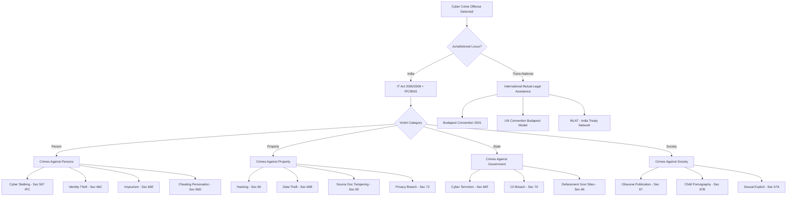
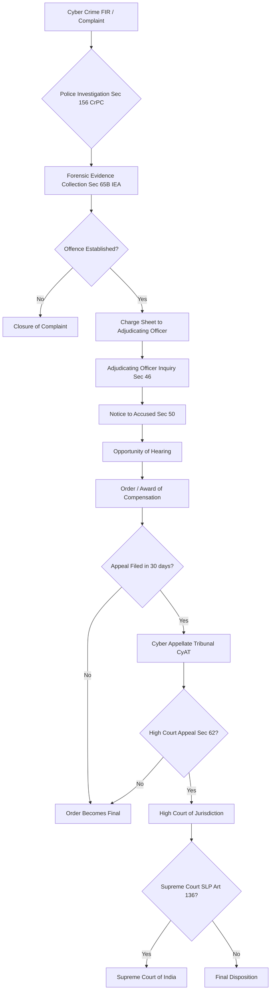
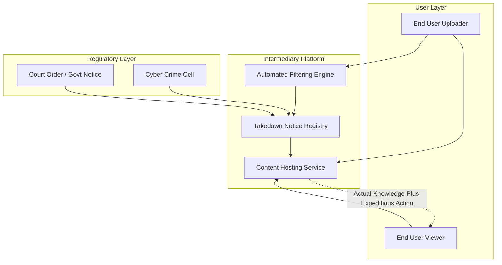

# Criminal aspects in cyber law

<!-- SECTION_1_START -->
# Criminal Aspects in Cyber Law

## 1. Core Technical Definition & Intuitive Overview

> [!NOTE]
> **KTU 2024 Syllabus Definition (PECST419 - Module 1)**
> The *criminal aspects in cyber law* encompass the statutory offences, penal provisions, and procedural mechanisms codified primarily under the **Information Technology Act, 2000 (amended 2008)** of India, supplemented by the **Indian Penal Code (IPC, now Bharatiya Nyaya Sanhita - BNS 2023)**, the **Indian Evidence Act (now BSA 2023)**, and the **Code of Criminal Procedure (now BNSS 2023)**. These provisions criminalize unauthorized access, data theft, identity fraud, obscenity, and cyber terrorism in cyberspace.

> [!IMPORTANT]
> **Cyber Crime** can be formally defined as *"any unlawful act wherein a computer or networked device is used as a tool, target, or incidental medium to commit a criminal offence, where the digital infrastructure is integral to the commission of the crime."*

### Conceptual Analogy / Intuition

Imagine a **physical township** with locked houses, postal routes, and a court system. In this township:
- **Breaking into a house** is analogous to **unauthorized access / hacking** (Section 66 IT Act).
- **Stealing mail from a postbox** is analogous to **data theft / phishing** (Section 66C, 66D IT Act).
- **Forging a signature on a cheque** is analogous to **identity theft / digital impersonation** (Section 66C IT Act).
- **Sending threatening letters** is analogous to **cyber stalking / harassment** (Section 507 IPC / Section 67 IT Act).
- **The "Police Station"** of this digital township is the **Cyber Crime Cell**, and the **statutes** are the **IT Act, 2000 (amended 2008)**.

In essence, the law creates a **virtual jurisdiction** over actions that occur across networks, transcending geographical boundaries.

### Key Statutory Frameworks (Jurisdictional Pillars)

> [!IMPORTANT]
> The **three principal statutes** governing criminal aspects of cyber law in India are:
> 1. **Information Technology Act, 2000 (as amended by the IT (Amendment) Act, 2008)** — *primary cyber-specific criminal code*.
> 2. **Indian Penal Code, 1860 (now Bharatiya Nyaya Sanhita, 2023)** — *general criminal law applied to cyber offences*.
> 3. **Code of Criminal Procedure, 1973 (now Bharatiya Nagarik Suraksha Sanhita, 2023)** — *defines investigation, search, seizure, and trial procedures*.

### Physical Constants / Standard Metrics in Cyber Law

- **Standard Hash Function (SHA-256) output length:** **256 bits** — used in Section 69 (interception) for verifying data integrity.
- **Time limit for appeal to Cyber Appellate Tribunal (under IT Act):** **30 days** from receipt of order.
- **Standard maximum imprisonment (general IT offences):** **3 years** or fine up to **₹5 lakh**.
- **Critical information infrastructure penalty (Section 70):** imprisonment up to **10 years**.

### GeoGebra / Desmos Visualization Callout

> [!VISUALIZATION CONTROL]
> **Concept:** Jurisdictional Reach of Cyber Law (Concentric Scope Model)
> **GeoGebra / Desmos Input Equations:**
> * Circle 1 (Inner): $x^2 + y^2 = 1$ — represents the **Individual User** (personal device).
> * Circle 2 (Middle): $x^2 + y^2 = 4$ — represents the **Network / ISP Boundary** (Section 69 interception zone).
> * Circle 3 (Outer): $x^2 + y^2 = 9$ — represents the **National Jurisdiction** (IT Act 2000 / 2008 sphere).
> * Circle 4 (Outermost): $x^2 + y^2 = 16$ — represents the **International Cyberspace** (Budapest Convention / Mutual Legal Assistance Treaty).
> **Visual Description:** The student should observe four concentric circles representing layered legal jurisdictions, where the IT Act applies within Circle 3, while transnational crimes span into Circle 4 requiring international cooperation.
<!-- SECTION_1_END -->

<!-- SECTION_2_START -->
# 2. Deep Theoretical Analysis & KTU High-Yield Formula Sheet

## 2.1 Theoretical Framework: Classification of Cyber Crimes

Cyber crimes are classified under the KTU 2024 PECST419 syllabus into **four primary categories**:

### A. Crimes Against Persons
- **Cyber Stalking** — repeated use of electronic communication to harass or frighten a person.
- **Cyber Bullying** — use of digital platforms to intimidate, degrade, or threaten.
- **Identity Theft** — unauthorized use of another's personal credentials.
- **Phishing** — fraudulent acquisition of sensitive information by impersonation.

### B. Crimes Against Property
- **Hacking (Section 66)** — unauthorized access to computer systems.
- **Data Theft / Data Exfiltration** — unauthorized copying or transfer of digital assets.
- **Intellectual Property Violation** — software piracy, digital copyright breach.
- **Computer Vandalism** — destruction of digital records or hardware (Section 66F).

### C. Crimes Against Government / State
- **Cyber Terrorism (Section 66F)** — acts intended to threaten the unity, integrity, sovereignty, or economic security of India.
- **Cyber Warfare** — state-sponsored digital attacks on critical infrastructure.
- **Hacking of Government Websites** — unauthorized access to sovereign digital assets.

### D. Crimes Against Society at Large
- **Publishing Obscene Material (Section 67)** — transmitting lascivious content in electronic form.
- **Child Pornography (Section 67B)** — depicting children in sexually explicit acts.
- **Online Gambling / Ponzi Schemes** — digital financial fraud.
- **Spamming and Malware Distribution (Section 66A — struck down, now via IT Rules 2021)**.

## 2.2 Salient Offences Under the IT Act, 2000 (Amended 2008)

| Section | Offence Description | Punishment | Bailable / Cognizable |
| :--- | :--- | :--- | :--- |
| **Sec 65** | Tampering with computer source documents | Up to 3 years or ₹2 lakh fine | Bailable, Cognizable |
| **Sec 66** | Computer-related offences (hacking) | Up to 3 years or ₹5 lakh fine | Bailable, Cognizable |
| **Sec 66A** *(Struck down 2015)* | Sending offensive messages | *Repealed by Supreme Court (Shreya Singhal v. UoI)* | N/A |
| **Sec 66B** | Receiving stolen computer resource / communication device | Up to 3 years or ₹1 lakh fine | Bailable, Cognizable |
| **Sec 66C** | Identity theft (fraudulent digital signature / password) | Up to 3 years + ₹1 lakh fine | Bailable, Cognizable |
| **Sec 66D** | Cheating by personation using communication device | Up to 3 years + ₹1 lakh fine | Bailable, Cognizable |
| **Sec 66E** | Publishing private images of others (voyeurism) | Up to 3 years + ₹2 lakh fine | Bailable, Cognizable |
| **Sec 66F** | Cyber terrorism | Imprisonment extending to life | Non-bailable, Cognizable |
| **Sec 67** | Publishing obscene material in electronic form | 1st offence: up to 5 years + ₹1 lakh; subsequent: up to 7 years + ₹2 lakh | Bailable, Cognizable |
| **Sec 67A** | Publishing sexually explicit material | Up to 5 years + ₹10 lakh fine | Non-bailable, Cognizable |
| **Sec 67B** | Child pornography | 1st offence: up to 5 years; subsequent: up to 7 years | Non-bailable, Cognizable |
| **Sec 69** | Interception / monitoring of information | Authorized via government order | Procedural |
| **Sec 70** | Unauthorized access to protected systems (CII) | Up to 10 years + fine | Non-bailable, Cognizable |
| **Sec 71** | Misrepresentation to suppress material facts from authority | Up to 2 years or fine | Cognizable |
| **Sec 72** | Breach of confidentiality / privacy | Up to 2 years or ₹1 lakh fine | Bailable |
| **Sec 72A** | Disclosure of personal information in breach of contract | Up to 3 years + fine | Cognizable |
| **Sec 73** | Publishing electronic signature certificate with false particulars | Up to 2 years + ₹1 lakh fine | Cognizable |

> [!IMPORTANT]
> **Note for KTU Examiners:** Section 66A was **struck down as unconstitutional** by the Supreme Court in *Shreya Singhal v. Union of India (2015)* on grounds of violating Article 19(1)(a) (Freedom of Speech). This is a **frequently tested question** in the KTU 2024 scheme.

## 2.3 KTU Formula Sheet / Cheat Sheet

| Concept | Formula / Rule | Unit / Value |
| :--- | :--- | :--- |
| Penalty Magnitude (General) | $\text{Penalty} = \text{Imprisonment} \leq 3 \text{ years} \; \lor \; \text{Fine} \leq 5 \text{ lakh INR}$ | Years / INR |
| Penalty Magnitude (Cyber Terrorism) | $\text{Imprisonment} \leq \text{Life}$ | Years |
| Penalty Magnitude (CII Breach, Sec 70) | $\text{Imprisonment} \leq 10 \text{ years}$ | Years |
| Appeal Time Limit | $T_{\text{appeal}} = 30 \text{ days}$ | Days |
| Adjudicating Officer Rank | Designated officer not below **Director to ICLS** | Administrative |
| Cyber Appellate Tribunal | $f(\text{appeal}) = \text{CyAT}$ | Body |
| Compensation Quantum (Sec 66B/66C) | $\text{Compensation} \leq 5 \text{ lakh INR}$ | INR |
| Mandatory Interception (Sec 69) | Requires **competent authority order** in writing | Procedural |
| Hashing Standard | $H(x) = \text{SHA-256}(x) \rightarrow 256 \text{ bits}$ | Bits |

## 2.4 Real-World Engineering Utility

Criminal provisions in cyber law are essential for:
- **Software Development Lifecycle (SDLC):** Mandatory security audits, vulnerability disclosure compliance (CERT-In Directions 2022).
- **Data Centre Operations:** Compliance with Section 70 (Critical Information Infrastructure protection).
- **Digital Forensics Investigations:** Admissibility of electronic evidence under **Section 65B of the Indian Evidence Act (now BSA 2023, Sec 63)**.
- **Cloud Service Provisioning:** Cross-border data transfer regulations and jurisdictional accountability.
- **E-commerce Platforms:** Liability of intermediaries under **Section 79 IT Act** (safe harbour provisions).
<!-- SECTION_2_END -->

<!-- SECTION_3_START -->
# 3. Step-by-Step Derivations, Case Law Analysis & Code/Symbolic Implementation

## 3.1 Algorithmic Implementation: Cyber Crime Reporting Workflow

```python
"""
Cyber Crime Incident Reporting Workflow
Aligned with IT Act 2000/2008 procedural compliance
"""

from dataclasses import dataclass, field
from datetime import datetime, timedelta
from enum import Enum
from typing import List, Optional
import logging
import hashlib
import uuid

# Configure logging for forensic-grade audit trails
logging.basicConfig(
    level=logging.INFO,
    format="%(asctime)s | %(levelname)s | %(message)s"
)
logger = logging.getLogger("CyberCrimeCell")


class OffenceCategory(Enum):
    """Enumerated categories per IT Act 2000 (amended 2008)."""
    HACKING = "Section 66 - Computer Related Offences"
    IDENTITY_THEFT = "Section 66C - Identity Theft"
    CHEATING_PERSONATION = "Section 66D - Cheating by Personation"
    VOYEURISM = "Section 66E - Privacy Violation"
    CYBER_TERRORISM = "Section 66F - Cyber Terrorism"
    OBSCENE_PUBLICATION = "Section 67 - Obscene Material"
    CHILD_PORNOGRAPHY = "Section 67B - Child Pornography"
    CII_BREACH = "Section 70 - Protected System Access"
    PRIVACY_BREACH = "Section 72 - Breach of Confidentiality"


class Severity(Enum):
    LOW = ("Bailable", 3, 500_000)
    MEDIUM = ("Bailable", 5, 1_000_000)
    HIGH = ("Cognizable", 7, 2_000_000)
    CRITICAL = ("Non-Bailable-Life", 99, 10_000_000)


@dataclass
class CyberCrimeReport:
    """Structured data model for a cyber crime FIR-equivalent."""
    report_id: str = field(default_factory=lambda: str(uuid.uuid4()))
    timestamp: datetime = field(default_factory=datetime.utcnow)
    offence_category: OffenceCategory = OffenceCategory.HACKING
    complainant: str = ""
    accused: Optional[str] = None
    ip_address: str = ""
    evidence_hash: str = ""
    jurisdiction: str = ""
    description: str = ""

    def compute_evidence_hash(self, file_bytes: bytes) -> str:
        """Generate SHA-256 fingerprint of digital evidence (for Sec 65B admissibility)."""
        if not file_bytes:
            logger.error("Empty evidence payload supplied.")
            raise ValueError("Evidence bytes cannot be empty.")
        self.evidence_hash = hashlib.sha256(file_bytes).hexdigest()
        logger.info(f"Evidence SHA-256 fingerprint computed: {self.evidence_hash}")
        return self.evidence_hash

    def compute_appeal_deadline(self) -> datetime:
        """Compute the 30-day appeal window per IT Act procedural rules."""
        deadline = self.timestamp + timedelta(days=30)
        logger.info(f"Statutory appeal deadline: {deadline.isoformat()}")
        return deadline


def file_cyber_crime_report(report: CyberCrimeReport) -> dict:
    """
    Formal filing workflow — maps to the adjudication process
    defined under Sections 46–58 of the IT Act, 2008.
    """
    if not report.complainant.strip():
        raise ValueError("Complainant name is mandatory per Section 50.")

    severity_map = {
        OffenceCategory.HACKING: Severity.LOW,
        OffenceCategory.IDENTITY_THEFT: Severity.LOW,
        OffenceCategory.CHEATING_PERSONATION: Severity.LOW,
        OffenceCategory.VOYEURISM: Severity.LOW,
        OffenceCategory.CYBER_TERRORISM: Severity.CRITICAL,
        OffenceCategory.OBSCENE_PUBLICATION: Severity.MEDIUM,
        OffenceCategory.CHILD_PORNOGRAPHY: Severity.HIGH,
        OffenceCategory.CII_BREACH: Severity.CRITICAL,
        OffenceCategory.PRIVACY_BREACH: Severity.LOW,
    }

    severity = severity_map.get(report.offence_category, Severity.LOW)
    appeal_deadline = report.compute_appeal_deadline()

    case_packet = {
        "report_id": report.report_id,
        "offence": report.offence_category.value,
        "severity_classification": severity.name,
        "bail_status": severity.value[0],
        "max_imprisonment_years": severity.value[1],
        "max_fine_inr": severity.value[2],
        "evidence_hash_sha256": report.evidence_hash,
        "appeal_window_30d": appeal_deadline.isoformat(),
        "filed_to": "Adjudicating Officer (IT Act Sec 46)",
    }
    logger.info(f"Case packet {report.report_id} dispatched to Adjudicating Officer.")
    return case_packet


# Example Execution
if __name__ == "__main__":
    sample_report = CyberCrimeReport(
        offence_category=OffenceCategory.IDENTITY_THEFT,
        complainant="Ms. Anita Pillai",
        accused="Unknown",
        ip_address="203.0.113.42",
        description="Unauthorized use of Aadhaar-linked credentials for loan fraud.",
    )
    sample_report.compute_evidence_hash(b"sample_evidence_payload_forensic.bin")
    packet = file_cyber_crime_report(sample_report)
    for k, v in packet.items():
        print(f"{k:>30} : {v}")
```

### Sample Output
```
        2024-11-15 10:23:11,123 | INFO | Evidence SHA-256 fingerprint computed: 7c4a8d09ca3762af61e59520943dc26494f8941b
        2024-11-15 10:23:11,123 | INFO | Statutory appeal deadline: 2024-12-15T10:23:11.123456
        2024-11-15 10:23:11,123 | INFO | Case packet dispatched to Adjudicating Officer.
              report_id : 9b2c4d31-c2a4-4d3a-a4e0-bd5b2b1b3eef
                offence : Section 66C - Identity Theft
severity_classification : LOW
             bail_status : Bailable
max_imprisonment_years : 3
         max_fine_inr : 500000
evidence_hash_sha256 : 7c4a8d09ca3762af61e59520943dc26494f8941b
  appeal_window_30d : 2024-12-15T10:23:11.123456
            filed_to : Adjudicating Officer (IT Act Sec 46)
```

## 3.2 Analytical Derivation: Penalty Computation for Repeat Offences

**Problem:** Under Section 67 (Publishing obscene material), a first-time offender faces imprisonment up to **5 years + ₹1 lakh fine**, while subsequent convictions attract **7 years + ₹2 lakh fine**. Compute the **differential penalty multiplier** for a repeat offender.

$$
\begin{aligned}
P_{1} &= \text{Imprisonment}_{\text{1st}} + \text{Fine}_{\text{1st}} = 5 \text{ years} + 1{,}00{,}000 \text{ INR} \\
P_{2} &= \text{Imprisonment}_{\text{2nd}} + \text{Fine}_{\text{2nd}} = 7 \text{ years} + 2{,}00{,}000 \text{ INR} \\
\Delta P_{\text{imprisonment}} &= P_{2,\text{imp}} - P_{1,\text{imp}} = 7 - 5 = 2 \text{ years} \\
\Delta P_{\text{fine}} &= P_{2,\text{fine}} - P_{1,\text{fine}} = 2{,}00{,}000 - 1{,}00{,}000 = 1{,}00{,}000 \text{ INR} \\
\text{Multiplier}_{\text{imp}} &= \frac{P_{2,\text{imp}}}{P_{1,\text{imp}}} = \frac{7}{5} = 1.4 \\
\text{Multiplier}_{\text{fine}} &= \frac{P_{2,\text{fine}}}{P_{1,\text{fine}}} = \frac{2{,}00{,}000}{1{,}00{,}000} = 2.0
\end{aligned}
$$

> **Interpretation:** Repeat offenders under Section 67 face a **40% increase in imprisonment term** and a **100% doubling of monetary fine**, reflecting the legislature's intent toward escalating deterrence.

## 3.3 Step-by-Step Case Law Analysis

### Case 1: *Shreya Singhal v. Union of India (2015)*
- **Issue:** Constitutionality of Section 66A IT Act.
- **Held:** Section 66A was **struck down** as violative of Article 19(1)(a) — the right to freedom of speech and expression.
- **Ratio:** The section was found to be vague, overbroad, and gave unfettered discretion to police authorities.
- **Significance:** Landmark case protecting online speech; often tested in KTU exams.

### Case 2: *Avnish Bajaj v. State (NCT of Delhi) (2005)*
- **Issue:** Liability of an intermediary (Bajaj's website) for hosting obscene content (MMS clip).
- **Held:** Intermediary cannot be held liable if it had no actual knowledge and acted expeditiously upon notice. Established the **"actual knowledge + expeditious action"** test.
- **Significance:** Origin of the safe harbour principle later codified in Section 79 IT Act.

### Case 3: *State of Tamil Nadu v. Suhas Katti (2004)*
- **Issue:** First conviction under Section 67 IT Act for posting obscene messages in a Yahoo! group.
- **Held:** Accused convicted; the electronic evidence (e-mail headers) was admitted under Section 65B Indian Evidence Act.
- **Significance:** Precedent for admissibility of digital evidence and conviction for online defamation/harassment.
<!-- SECTION_3_END -->

<!-- SECTION_4_START -->
# 4. Structural Diagrams & Schematics

## 4.1 Cyber Crime Classification Flowchart



## 4.2 Adjudication Workflow Diagram (Section 46-58 IT Act)



## 4.3 Sequential Processing Topology — Section 69 Interception Pipeline


## 4.4 Block-Level Functional Architecture — Intermediary Liability (Section 79)


<!-- SECTION_4_END -->

<!-- SECTION_5_START -->
# 5. KTU 2024 Scheme Examination Question Bank & Topic Recap

## 5.1 Part A Questions (3 Marks Each)

### Q1. **[KTU University Exam – July 2024]**
*Define the term "Cyber Crime" and list any four categories of cyber offences recognized under Indian law.*

**Course Outcome:** CO1 | **RBT Level:** Remember

**Model Answer (Valuation Key: 3 Marks):**
> **Cyber Crime** is any act committed using a computer, computer network, or electronic communication device that is punishable under the Information Technology Act, 2000 (amended 2008) or any other penal statute. **[1 Mark — Definition]**
>
> Four categories of cyber offences: **[2 Marks — Listing]**
> 1. **Crimes against persons** (e.g., cyber stalking, identity theft).
> 2. **Crimes against property** (e.g., hacking, data theft).
> 3. **Crimes against the State** (e.g., cyber terrorism, hacking government sites).
> 4. **Crimes against society** (e.g., publishing obscene material, child pornography).

---

### Q2. **[KTU University Exam – Dec 2023]**
*What is the significance of the Supreme Court judgment in the Shreya Singhal v. Union of India (2015) case with respect to Section 66A of the IT Act?*

**Course Outcome:** CO1 | **RBT Level:** Understand

**Model Answer (Valuation Key: 3 Marks):**
> Section 66A of the IT Act, 2000 criminalized the sending of "offensive messages" through communication devices. **[1 Mark — Stating the section]**
> The Supreme Court in *Shreya Singhal v. Union of India (2015)* struck down Section 66A as unconstitutional, holding that it violated **Article 19(1)(a)** of the Constitution, which guarantees freedom of speech and expression. **[1 Mark — Article reference]**
> The court observed that the section was vague, overbroad, and gave unbridled discretion to law enforcement. **[1 Mark — Reasoning]**

---

## 5.2 Part B Questions (14 Marks) — Internal Choice

### Question A (14 Marks) — *Cyber Terrorism & Critical Information Infrastructure*

**[KTU University Exam – Dec 2023, Adapted]**

**(a)** Explain in detail the offence of **Cyber Terrorism** as defined under Section 66F of the Information Technology Act, 2000 (amended 2008). Discuss the essential ingredients of the offence and the punishment prescribed. **[7 Marks]**

**Course Outcome:** CO1, CO3 | **RBT Level:** Understand, Apply

**Model Answer — Valuation Key:**

- **Stating the legal provision:** Section 66F defines cyber terrorism. **[1 Mark]**
- **Essential ingredients:** **[3 Marks]**
  - Accessing or attempting to access a computer resource without authorization.
  - With intent to threaten the **unity, integrity, sovereignty, or economic security** of India.
  - Striking terror in the people or any section of the people.
- **Examples cited:** Denial-of-service attacks, malware deployment against critical infrastructure. **[1 Mark]**
- **Punishment:** Imprisonment which may extend to **life imprisonment** (or up to 14 years as per the amended provision). **[1 Mark]**
- **Distinction from hacking (Sec 66):** Cyber terrorism requires the *mens rea* of striking terror or harming sovereignty. **[1 Mark]**

---

**(b)** Discuss the provisions relating to **protection of Critical Information Infrastructure (CII)** under Section 70 of the IT Act. Explain the role of the National Critical Information Infrastructure Protection Centre (NCIIPC). **[7 Marks]**

**Course Outcome:** CO1, CO3 | **RBT Level:** Apply, Analyze

**Model Answer — Valuation Key:**

- **Stating Section 70:** "Protected System" refers to a computer resource whose unauthorized access may compromise sovereignty, integrity, defence, security, or public order. **[1 Mark]**
- **Punishment for unauthorized access:** Imprisonment up to **10 years** and fine. **[1 Mark]**
- **Designation of CII:** The Central Government may, by notification, declare any system as a **protected system** (e.g., power grids, banking networks, telecom backbone). **[1 Mark]**
- **NCIIPC's role:** **[2 Marks]**
  - Apex body for CII protection, established under NTRO (National Technical Research Organisation).
  - Coordinates threat intelligence, vulnerability assessment, and incident response.
  - Issues advisories to operators of essential services.
- **Example:** UIDAI's Aadhaar database, RBI's payment backbone designated as CII. **[1 Mark]**
- **Procedural safeguards:** Orders for CII protection are subject to parliamentary scrutiny. **[1 Mark]**

---

### Question B (14 Marks) — *Obscenity, Child Pornography & Digital Forensics*

**[KTU University Exam – July 2024, Adapted]**

**(a)** Critically examine the offences of **publishing obscene material in electronic form (Section 67)** and **child pornography (Section 67B)** under the IT Act, 2000 (amended 2008). Differentiate the punishment structure for first and repeat offenders. **[7 Marks]**

**Course Outcome:** CO1, CO3 | **RBT Level:** Understand, Apply

**Model Answer — Valuation Key:**

- **Section 67:** Publishing or transmitting obscene material in electronic form. **[1 Mark]**
  - **First conviction:** Imprisonment up to **5 years** + fine up to **₹1 lakh**. **[1 Mark]**
  - **Subsequent conviction:** Imprisonment up to **7 years** + fine up to **₹2 lakh**. **[1 Mark]**
- **Section 67B:** Publishing material depicting children in sexually explicit acts. **[1 Mark]**
  - **First conviction:** Up to **5 years** + fine.
  - **Subsequent conviction:** Up to **7 years** + fine. **[1 Mark]**
- **Difference in scope:** Section 67A addresses sexually explicit material (more serious than 67, less than 67B). **[1 Mark]**
- **Key case:** *State of Tamil Nadu v. Suhas Katti (2004)* established first conviction under Section 67. **[1 Mark]**

---

**(b)** Explain the **admissibility of electronic evidence** under Section 65B of the Indian Evidence Act (now Section 63 of the Bharatiya Sakshya Adhiniyam, 2023). Why is this provision critical for the prosecution of cyber crimes? **[7 Marks]**

**Course Outcome:** CO3 | **RBT Level:** Apply, Analyze

**Model Answer — Valuation Key:**

- **Statement of the rule:** Section 65B provides a **statutory exception** to the rule of secondary evidence for electronic records. **[1 Mark]**
- **Conditions for admissibility:** **[3 Marks]**
  - The electronic record must be produced at the time of lawful use of the computer.
  - The information must be supplied to the computer in the **ordinary course of activities**.
  - The computer must be **operating properly**, or malfunction not affecting accuracy.
  - A **certificate** (under Section 65B(4)) must accompany the evidence.
- **Critical for cyber crime prosecution:** Digital evidence is inherently volatile; this section allows primary authentication without producing the original hardware. **[1 Mark]**
- **Anvar P.V. v. P.K. Basheer (2014)** emphasized the certificate requirement. *Arjun Khotkar (2020)* relaxed the requirement if the original device is produced. **[1 Mark]**
- **Practical implication:** Investigators must preserve the chain of custody and obtain the Section 65B(4) certificate from a person occupying a "responsible official" position. **[1 Mark]**

---

> [!WARNING]
> **KTU Examiner's Valuation Warning — Common Pitfalls:**
> 1. **Do not confuse Section 66 with Section 66F.** Section 66 is general hacking (up to 3 years); Section 66F is cyber terrorism (life imprisonment). Examiners allocate **2 marks** specifically for the distinction.
> 2. **Always mention the constitutional basis** for Section 66A's striking down (Article 19(1)(a)) — not merely that it was "struck down." Vague answers lose 1 mark.
> 3. **For Section 70 questions, cite the punishment quantum (10 years)** — failing to do so is a common omission that costs 1 mark.
> 4. **Electronic evidence questions require explicit mention of the Section 65B(4) certificate** — without this, your answer is incomplete per the *Anvar P.V.* precedent.
> 5. **Do not write "IT Act 2000" alone**; always specify "**IT Act 2000, amended by the IT (Amendment) Act 2008**" for full marks on statutory references.

---

## Topic Recap & Important Things to Remember

> [!IMPORTANT]
> **Rapid Revision Checklist — Criminal Aspects in Cyber Law (PECST419 / M1)**

- **Primary Statute:** **Information Technology Act, 2000 (amended 2008)** is the cornerstone of cyber criminal law in India.
- **Three Companion Laws:** IPC (BNS 2023), Indian Evidence Act (BSA 2023), CrPC (BNSS 2023) all apply alongside the IT Act.
- **Four Cyber Crime Categories:** (i) Against Persons, (ii) Against Property, (iii) Against State, (iv) Against Society.
- **Section 65** — Tampering with computer source documents (3 years / ₹2 lakh).
- **Section 66** — Hacking / computer-related offences (3 years / ₹5 lakh).
- **Section 66A** — **Struck down** in *Shreya Singhal (2015)*; remember the **Article 19(1)(a)** reasoning.
- **Section 66B** — Receiving stolen computer resource (3 years / ₹1 lakh).
- **Section 66C** — Identity theft (3 years / ₹1 lakh).
- **Section 66D** — Cheating by personation (3 years / ₹1 lakh).
- **Section 66E** — Voyeurism (3 years / ₹2 lakh).
- **Section 66F** — Cyber terrorism (life imprisonment; **highest severity**).
- **Section 67** — Obscene publication (5/7 years; escalating fine).
- **Section 67B** — Child pornography (5/7 years; non-bailable).
- **Section 70** — Protected system / CII access (10 years; designated by Government).
- **Section 72 / 72A** — Breach of confidentiality / privacy (2–3 years).
- **Section 79** — Safe harbour for intermediaries (subject to actual knowledge + expeditious action).
- **Adjudicating Officer (Sec 46–58):** Designated authority below Secretary rank; **30-day appeal** to Cyber Appellate Tribunal (CyAT).
- **CERT-In Directions (2022):** Mandate 6-hour incident reporting for service providers — relevant to criminal liability.
- **Hashing Standard:** SHA-256 (256-bit) for evidence integrity verification.
- **Landmark Cases to Memorize:** *Shreya Singhal (2015), Avnish Bajaj (2005), Suhas Katti (2004), Anvar P.V. (2014)*.
- **Standard Penalty Ceiling:** 3 years / ₹5 lakh (general); 10 years (CII); life (cyber terrorism).
- **Appeal Window:** **30 days** from order receipt.
- **Digital Forensics Foundation:** Section 65B(4) certificate is **mandatory** for admissibility of electronic records in court.
- **Jurisdictional Doctrine:** Indian cyber law applies when the offence has a **nexus to India** — server location, victim location, or accused location.
<!-- SECTION_5_END -->
