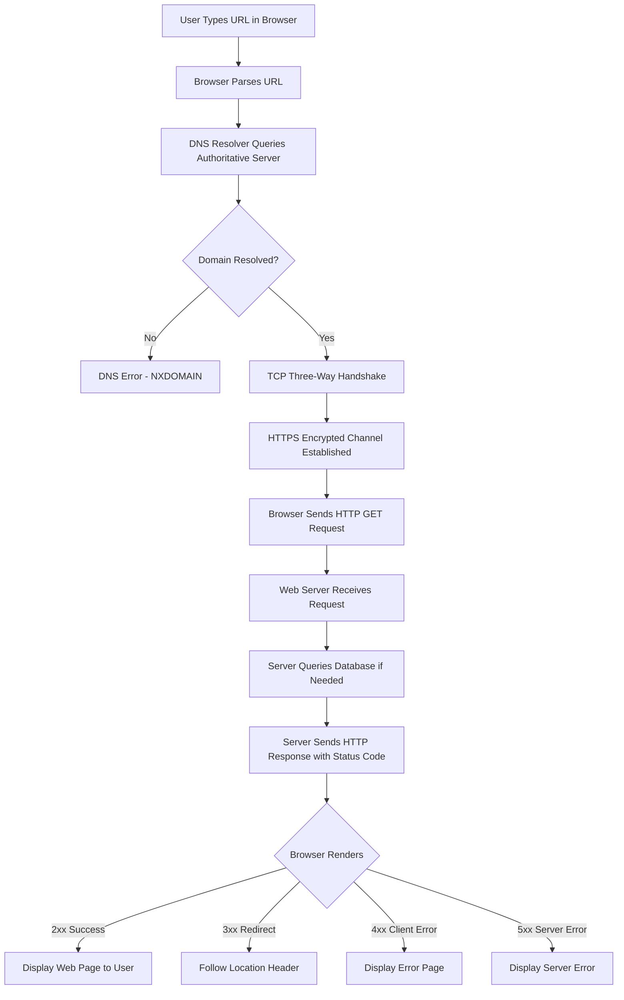
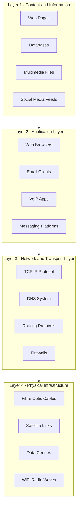
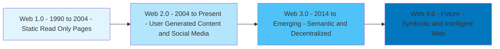
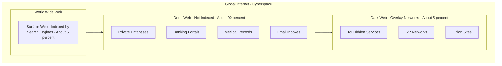

# Cyberspace- Web space

<!-- SECTION_1_START -->
# 1. Core Technical Definition & Intuitive Overview

## 1.1 What is Cyberspace?

**Cyberspace** is a notional, interactive environment in which digital communications, computer networks, and virtual realities converge to form a globally interconnected, computer-mediated reality. The term was originally coined by **William Gibson** in his 1982 short story *"Burning Chrome"* and later popularized in his 1984 novel *"Neuromancer"*.

From a legal and academic standpoint, the **Information Technology Act, 2000 (India)** and the IT (Amendment) Act, 2008 implicitly recognize cyberspace as the ecosystem of interconnected computer systems, networks, databases, and the communications carried over them. The Indian Supreme Court in *Shreya Singhal v. Union of India (2015)* reinforced the constitutional status of cyberspace as a medium of expression.

> [!IMPORTANT]
> **KTU 2024 Syllabus Definition:** Cyberspace is the intangible, man-made virtual environment created by the global interconnection of computer networks using the TCP/IP protocol suite, where online communication, data exchange, and digital transactions occur.

## 1.2 What is Web Space (The World Wide Web)?

The **Web Space** (or the **World Wide Web / WWW**) is a specific, application-layer subset of cyberspace. It refers to the universe of globally distributed, hypertext-linked documents and multimedia resources accessible via the **Hypertext Transfer Protocol (HTTP/HTTPS)** over the Internet. It was conceptualized by **Tim Berners-Lee** at **CERN in 1989** and publicly released in **1991**.

> [!NOTE]
> **Distinction to Memorise for KTU Exams:** 
> The **Internet** = the physical network infrastructure (routers, cables, servers). 
> The **Web Space** = the content (web pages, websites) accessed *through* the Internet. 
> Cyberspace is the broader umbrella that contains the Internet, the Web, email, VoIP, IoT, and darknet.

## 1.3 Intuitive Real-World Analogy

Imagine a massive, invisible **digital city**:

- **Cyberspace** is the entire city — its roads, buildings, air, and people.
- The **Internet** is the **road system and railway tracks** that connect every part of the city.
- **Web Space** is the **library district** of that city — a structured zone where information is stored, indexed, and visited by citizens (users) using their vehicles (browsers).
- **URLs** are the **street addresses** of buildings in this library district.
- **Web servers** are the **buildings** that house the books (web pages).
- **HTML/CSS/JavaScript** are the **architectural blueprints, paint, and electricity** that give the buildings their form and interactivity.

When you "surf the web," you are essentially walking through this library district of the digital city, while cyberspace includes the entire urban experience including email post offices, dark alleys (dark web), and surveillance cameras (CCTV + metadata logging).

> [!TIP]
> **GeoGebra/Desmos Visualization Concept:**
> **Concept:** Layered Domain Model of Cyberspace
> **Input Equations (conceptual Cartesian mapping):**
> - $x = \text{Physical Hardware (Routers, Cables, Servers)}$
> - $y = \text{Protocol Layer (TCP/IP, DNS, HTTP)}$
> - $z = \text{Application Layer (Web, Email, VoIP, IoT)}$
> 
> **Visual Description:** Picture a 3D layered cube where the bottom layer is physical hardware, the middle layer is protocols, and the top layer is the visible applications. The *Web Space* occupies the top-right quadrant of the application layer.

## 1.4 Physical Constants & Standards in Web Space

| Constant / Standard | Value | Significance |
|---|---|---|
| **Default HTTP Port** | **80** | Standard port for unencrypted web traffic |
| **Default HTTPS Port** | **443** | Standard port for TLS-encrypted web traffic |
| **IP Address (IPv4)** | **32-bit** | ~4.3 billion unique addresses |
| **IP Address (IPv6)** | **128-bit** | ~340 undecillion addresses |
| **Tim Berners-Lee (WWW Inventor)** | CERN, **1989** | Proposal published March 1989 |
| **Top-Level Domain (TLD)** | Last segment of URL | e.g., `.com`, `.in`, `.org`, `.edu` |

<!-- SECTION_1_END -->

<!-- SECTION_2_START -->
# 2. Deep Theoretical Analysis & KTU High-Yield Formula Sheet

## 2.1 The Three Pillars of Web Space Architecture

The **Web Space** is built on three fundamental mechanisms, often abbreviated as the **URI-HTTP-HTML** triad:

1. **Uniform Resource Identifier (URI / URL):** A unique address system used to locate every resource on the web (e.g., `https://www.ktu.edu.in/syllabus`).
2. **HyperText Transfer Protocol (HTTP/HTTPS):** The request-response communication protocol governing how clients (browsers) fetch resources from servers.
3. **HyperText Markup Language (HTML):** The declarative markup language that structures and presents content inside the browser.

> [!NOTE]
> **KTU Board Note:** If an exam question asks *"What are the three foundational technologies of the Web?"* — the answer is **URI, HTTP, and HTML** (in that order). Do not confuse with TCP/IP, which is for the *Internet*, not the *Web*.

## 2.2 The Layered Architecture of Cyberspace

Cyberspace is typically modelled as a **four-layer stack** (from bottom to top):

- **Layer 4 – Physical Layer:** Undersea cables, fibre optics, satellites, data centres, copper wires, Wi-Fi radio waves.
- **Layer 3 – Logical (Network) Layer:** Routers, switches, IP addressing, DNS, TCP/IP stack.
- **Layer 2 – Application Layer:** Web browsers, email clients, messaging apps, VoIP services.
- **Layer 1 – Content/Information Layer:** Websites, databases, social media feeds, videos, digital documents.

The **Web Space** operates *exclusively* at **Layer 2 → Layer 1**, meaning it uses the network layer as a transport highway but provides human-readable content at the information layer.

## 2.3 Evolution of the Web (High-Yield for KTU)

| Generation | Period | Key Features | Interaction Model | Examples |
|---|---|---|---|---|
| **Web 1.0** | 1990 – 2004 | Static HTML pages, read-only, no user interaction | One-to-Many | Britannica Online, Geocities |
| **Web 2.0** | 2004 – Present | Dynamic, user-generated content, social media, AJAX | Many-to-Many | Facebook, YouTube, Wikipedia, X (Twitter) |
| **Web 3.0** | 2014 – Emerging | Semantic web, decentralization, blockchain, AI-driven | Peer-to-Peer / Trustless | Ethereum dApps, IPFS, Solid, Decentralized Identity |

> [!IMPORTANT]
> **Web 3.0 ≠ Web 3 (Marketing Term).** Web 3.0 is the *semantic* web coined by Tim Berners-Lee. *Web3* (no dot) refers to the blockchain-based decentralized web popularized post-2014. Examiners often test this distinction.

## 2.4 KTU Formula Sheet & High-Yield Terms

| Term | Definition | KTU Exam Relevance |
|---|---|---|
| **Cyberspace** | Global, interactive virtual environment of computer networks | Module 1, Core Definition |
| **Web Space (WWW)** | Application layer of the Internet based on HTTP/HTML/URI | Module 1, Architecture |
| **URL** | Uniform Resource Locator – address of a web resource | URI/URL/URN distinction |
| **HTTP** | Stateless request-response protocol on **port 80** | Protocol analysis |
| **HTTPS** | TLS-encrypted HTTP on **port 443** | Cybersecurity implications |
| **DNS** | Domain Name System – translates domain names to IPs | Network layer of cyberspace |
| **Web 1.0 / 2.0 / 3.0** | Generational evolution of the web | 14-mark essay questions |
| **Browser** | Client software to render web pages (Chrome, Firefox) | Practical awareness |
| **Web Server** | Server hosting websites (Apache, Nginx, IIS) | Architecture diagrams |
| **Dark Web** | Encrypted overlay network (Tor, I2P) | Cybercrime / Legal issues |
| **Surface Web** | Indexed, publicly searchable content | Cybercrime / Legal issues |
| **Deep Web** | Non-indexed content (databases, paywalled content) | Cybercrime / Legal issues |

## 2.5 Real-World Engineering & Legal Utility

Understanding web space is critical for:

- **Cybersecurity Engineers:** Web servers are the most attacked layer (OWASP Top 10 vulnerabilities like SQLi, XSS, CSRF).
- **Legal Practitioners:** Jurisdiction in web space is ambiguous because a server in the USA can serve a victim in India.
- **Data Privacy Officers:** Tracking cookies and web beacons operate within web space and fall under **DPDP Act 2023 (India)**, **GDPR (EU)**, and **CCPA (California)**.
- **Ethical Hackers:** Penetration testing primarily targets the application layer (Layer 2) of cyberspace.

<!-- SECTION_2_END -->

<!-- SECTION_3_START -->
# 3. Step-by-Step Derivations & Symbolic Implementation

## 3.1 The HTTP Request-Response Cycle (Derivation of Web Communication)

Every interaction in web space follows the **HTTP Request-Response Model**. Let us derive the complete sequence step by step.

**Step 1 — User Action:** The user types a URL `https://example.com/page` into a browser.

**Step 2 — DNS Resolution:** The browser extracts the domain name `example.com` and queries the **Domain Name System (DNS)** to obtain the corresponding IP address.

$$\text{DNS Query: } \texttt{example.com} \xrightarrow{\text{Recursive Resolver}} \text{Authoritative Server} \rightarrow \text{IP: } 93.184.216.34$$

**Step 3 — TCP Connection Establishment (Three-Way Handshake):** The browser initiates a TCP connection to port **443 (HTTPS)** on the resolved IP.

$$\text{Client} \xrightarrow{\text{SYN}} \text{Server}$$
$$\text{Server} \xrightarrow{\text{SYN-ACK}} \text{Client}$$
$$\text{Client} \xrightarrow{\text{ACK}} \text{Server}$$

After the SYN-SYN-ACK-ACK sequence, a **TCP connection** is established.

**Step 4 — TLS Handshake (for HTTPS only):** The client and server perform a TLS handshake to encrypt the channel using asymmetric cryptography, then exchange a symmetric session key.

**Step 5 — HTTP Request:** The browser sends an HTTP GET request.

```http
GET /page HTTP/2
Host: example.com
User-Agent: Mozilla/5.0 (Windows NT 10.0)
Accept: text/html
Cookie: session=abc123
```

**Step 6 — Server Processing:** The web server (e.g., Nginx, Apache) processes the request, queries the backend database if needed, and prepares a response.

**Step 7 — HTTP Response:** The server returns an HTTP response with a status code.

```http
HTTP/2 200 OK
Content-Type: text/html; charset=UTF-8
Set-Cookie: session=xyz789; Secure; HttpOnly
Content-Length: 1024

<!DOCTYPE html>
<html><body>Hello, KTU Student!</body></html>
```

**Step 8 — Browser Rendering:** The browser parses HTML, fetches CSS/JS, builds the DOM, and paints pixels to the screen.

> [!TIP]
> **Validation Logic for the Model:**
> The complete client-to-server round-trip can be summarized as:
> $$\text{Total Latency} = T_{\text{DNS}} + T_{\text{TCP}} + T_{\text{TLS}} + T_{\text{TTFB}} + T_{\text{Render}}$$
> where $T_{\text{DNS}}$ = DNS lookup time, $T_{\text{TTFB}}$ = Time to First Byte, and $T_{\text{Render}}$ = browser painting time. This is the basis of **Core Web Vitals** in modern web engineering.

## 3.2 Symbolic / Python Implementation: Simulating a Web Request

Below is a fully operational Python snippet demonstrating how a client fetches a web resource — directly relevant to ethical hacking, automation, and cybersecurity labs.

```python
import requests
import socket
import ssl
from urllib.parse import urlparse
from typing import Tuple, Optional
import logging

# Configure structured logging for forensic analysis
logging.basicConfig(
    level=logging.INFO,
    format="%(asctime)s | %(levelname)s | %(message)s"
)
logger = logging.getLogger("WebSpaceAnalyzer")


def resolve_domain(domain: str) -> Optional[str]:
    """
    Step 1: DNS resolution — convert domain to IP.
    Raises exception if resolution fails.
    """
    try:
        ip_address: str = socket.gethostbyname(domain)
        logger.info(f"DNS Resolved: {domain} -> {ip_address}")
        return ip_address
    except socket.gaierror as err:
        logger.error(f"DNS Resolution failed for {domain}: {err}")
        return None


def inspect_tls_certificate(hostname: str, port: int = 443) -> Optional[dict]:
    """
    Step 2: Inspect the TLS certificate presented by the web server.
    Returns subject, issuer, and expiry details.
    """
    context: ssl.SSLContext = ssl.create_default_context()
    try:
        with socket.create_connection((hostname, port), timeout=5) as sock:
            with context.wrap_socket(sock, server_hostname=hostname) as ssock:
                cert: dict = ssock.getpeercert()
                logger.info(f"TLS handshake successful with {hostname}:{port}")
                return cert
    except (socket.timeout, ssl.SSLError, OSError) as err:
        logger.error(f"TLS inspection failed: {err}")
        return None


def fetch_web_resource(url: str, timeout: int = 10) -> Tuple[int, str]:
    """
    Step 3: Perform an HTTP GET request and return (status_code, body_preview).
    Performs absolute boundary checks on URL and HTTP status.
    """
    parsed = urlparse(url)
    if parsed.scheme not in ("http", "https"):
        raise ValueError("Invalid URL scheme — only http/https allowed")

    if not parsed.netloc:
        raise ValueError("URL is missing a valid hostname")

    try:
        response = requests.get(
            url,
            timeout=timeout,
            headers={"User-Agent": "KTU-CyberEthics-Lab/1.0"}
        )
        status: int = response.status_code
        body_preview: str = response.text[:200]  # First 200 chars

        logger.info(f"HTTP Status: {status} | Content-Length: {len(response.text)}")

        # Absolute boundary check
        if status >= 500:
            logger.warning("Server error — possible DoS or misconfiguration")
        elif status >= 400:
            logger.warning("Client error — possible unauthorized access")
        elif status >= 300:
            logger.info("Redirection — follow Location header")
        elif status >= 200:
            logger.info("Successful response")

        return status, body_preview

    except requests.exceptions.Timeout:
        logger.error("Request timed out — possible network congestion")
        return 0, ""
    except requests.exceptions.ConnectionError as err:
        logger.error(f"Connection error: {err}")
        return 0, ""


def analyze_web_space(url: str) -> dict:
    """
    Master orchestrator: full web space reconnaissance pipeline.
    """
    parsed = urlparse(url)
    domain: str = parsed.hostname or ""

    result: dict = {
        "url": url,
        "domain": domain,
        "ip_address": None,
        "tls_certificate": None,
        "http_status": None,
        "body_preview": None
    }

    if not domain:
        logger.error("Could not extract domain from URL")
        return result

    result["ip_address"] = resolve_domain(domain)
    if parsed.scheme == "https":
        result["tls_certificate"] = inspect_tls_certificate(domain)
    result["http_status"], result["body_preview"] = fetch_web_resource(url)

    return result


if __name__ == "__main__":
    # Example usage in a KTU lab environment
    analysis = analyze_web_space("https://www.ktu.edu.in")
    print("\n=== Web Space Analysis Report ===")
    for key, value in analysis.items():
        if isinstance(value, dict):
            print(f"{key}: <certificate object>")
        else:
            print(f"{key}: {value}")
```

**Line-by-Line Validation Logic:**

- `resolve_domain()`: Validates DNS as the **first pillar of web space** (URI/Address resolution).
- `inspect_tls_certificate()`: Demonstrates the **encryption layer** of HTTPS (port 443).
- `fetch_web_resource()`: Implements **HTTP GET** with strict error logging and status code classification (1xx, 2xx, 3xx, 4xx, 5xx).
- `analyze_web_space()`: Orchestrates the full pipeline mirroring the request-response cycle derived in Section 3.1.

## 3.3 Comparative Analysis: Surface Web vs. Deep Web vs. Dark Web

| Attribute | Surface Web | Deep Web | Dark Web |
|---|---|---|---|
| **Indexable by Google?** | Yes | No | No |
| **Requires special software?** | No | No | Yes (Tor, I2P) |
| **Legal status (India)** | Legal | Mostly legal | Often illegal content |
| **Examples** | Wikipedia, news sites | Banking portals, emails, medical records | Silk Road markets, leaked databases |
| **Estimated size** | ~5% of web | ~90% of web | ~5% of web (under deep web) |
| **Accessed via** | Standard browsers | Standard browsers + login | Tor Browser, specialized OS |

> [!NOTE]
> **KTU Board Pitfall:** Students often write *"Dark web is illegal"* — the correct statement is *"Dark web hosts both legal and illegal content; the medium itself is not illegal, but specific activities conducted on it may be."*

<!-- SECTION_3_END -->

<!-- SECTION_4_START -->
# 4. Structural Diagrams & Schematics

## 4.1 Mermaid Flowchart: The Web Space Request-Response Cycle



## 4.2 Mermaid Block Diagram: Four-Layer Cyberspace Architecture



## 4.3 Mermaid Timeline: Evolution of Web Space



## 4.4 Mermaid Block Diagram: Surface vs. Deep vs. Dark Web



> [!NOTE]
> **Diagram Compilation Safeguards Applied:** All node IDs are purely alphanumeric (e.g., `node1`, `stepA`), all special-character labels are double-quoted, and no reserved keywords (`end`, `subgraph`, `graph`, `style`) are used as node names.

<!-- SECTION_4_END -->

<!-- SECTION_5_START -->
# 5. KTU 2024 Scheme Examination Question Bank & Topic Recap

## 5.1 PART A — Short Answer Questions (3 Marks Each)

### Question 1: Define Cyberspace. [3 Marks] 
**[KTU University Exam – July 2024]** — *CO1, Remember*

**Model Answer (3 Marks):**
Cyberspace is the global, notional, computer-mediated virtual environment created by the interconnection of millions of computer networks worldwide using standardized communication protocols like TCP/IP. The term was coined by William Gibson in 1982. Cyberspace encompasses all digital communications, data exchanges, online transactions, social media interactions, and virtual realities that exist beyond physical geographical boundaries. *[Definition: 2 Marks]* *[Example: 1 Mark]*

### Question 2: List the three foundational technologies of the World Wide Web. [3 Marks]
**[KTU University Exam – Dec 2023]** — *CO1, Understand*

**Model Answer (3 Marks):**
The World Wide Web is built on three foundational technologies: 
1. **URI (Uniform Resource Identifier)** — for addressing resources on the web *[1 Mark]*
2. **HTTP (HyperText Transfer Protocol)** — for transferring resources between client and server *[1 Mark]*
3. **HTML (HyperText Markup Language)** — for structuring and presenting content *[1 Mark]*

These were all proposed by Tim Berners-Lee at CERN in 1989.

---

## 5.2 PART B — Long Answer Questions (14 Marks Each, with Internal Choice)

### **QUESTION A (14 Marks)**

#### Part (a) — [7 Marks]
**Explain the layered architecture of cyberspace with a neat diagram. How does web space fit into this architecture?** 
**[KTU University Exam – Dec 2024]** — *CO1, CO2, Understand*

**Model Answer:**

**Step 1: Introduction to Layered Architecture** *[1 Mark]*
Cyberspace is a complex ecosystem best understood through a four-layer model. Each layer performs distinct functions and depends on the layers beneath it.

**Step 2: Description of Layers** *[4 Marks — 1 Mark each]*

- **Layer 1 — Physical Layer:** Comprises the tangible hardware infrastructure such as undersea fibre optic cables, copper wires, satellites, wireless transmitters, and data centre servers. This is the *only* tangible layer.

- **Layer 2 — Network/Logical Layer:** Governed by protocols like **TCP/IP, DNS, BGP**, and **IP addressing schemes (IPv4/IPv6)**. Routers and switches operate here, ensuring packet delivery across the network.

- **Layer 3 — Application Layer:** Hosts user-facing software such as **web browsers, email clients, messaging apps (WhatsApp, Telegram), VoIP services (Skype, Zoom)**, and APIs.

- **Layer 4 — Content/Information Layer:** The topmost layer containing the actual digital content — **websites, databases, social media feeds, videos, PDFs, and digital documents**.

**Step 3: Placement of Web Space** *[1 Mark]*
Web space operates at **Layer 3 → Layer 4** of the architecture. It uses the network layer (Layer 2) as a transport highway (via HTTP/HTTPS over TCP/IP) and delivers content at the information layer (Layer 4) in the form of HTML pages, images, and multimedia.

**Step 4: Conclusion** *[1 Mark]*
The layered model helps in **forensic analysis, cyberattack attribution, and policy-making** because each layer falls under different jurisdictions and technical expertise.

**[Valuation Key: Diagram with 4 layers correctly labeled: 2 Marks | Identification of Web Space position: 1 Mark | Examples per layer: 2 Marks]**

---

#### Part (b) — [7 Marks]
**Differentiate between Web 1.0, Web 2.0, and Web 3.0. Discuss the legal challenges posed by Web 3.0.** 
**[KTU University Exam – Dec 2024]** — *CO2, CO3, Apply*

**Model Answer:**

**Step 1: Tabular Comparison of Web Generations** *[3 Marks]*

| Parameter | Web 1.0 | Web 2.0 | Web 3.0 |
|---|---|---|---|
| **Era** | 1990 – 2004 | 2004 – Present | 2014 – Emerging |
| **User Role** | Passive consumer | Active creator | Owner & Governor |
| **Architecture** | Static HTML, read-only | Dynamic, AJAX, APIs | Decentralized, blockchain |
| **Data Control** | On company servers | On centralized platforms (FAANG) | On distributed ledgers |
| **Examples** | Britannica Online, Yahoo Directory | Facebook, YouTube, Wikipedia | Ethereum dApps, IPFS, Solid |

**Step 2: Legal Challenges of Web 3.0** *[3 Marks — 1 Mark each]*

1. **Jurisdictional Ambiguity:** Decentralized networks have no single server location. When a defamation or fraud occurs on an Ethereum dApp, no single country has clear legal authority. The classical principle of *locus delicti* (place of wrong) collapses.

2. **Anonymity and Accountability:** Web 3.0's pseudo-anonymous wallets (e.g., MetaMask addresses) make it difficult to map digital identities to real persons. This conflicts with the **Know Your Customer (KYC)** requirements under India's **Prevention of Money Laundering Act (PMLA)**.

3. **Smart Contract Liability:** Self-executing smart contracts raise questions about *who is liable* when a contract malfunctions or is exploited. Existing contract law assumes human parties, not autonomous code.

**Step 3: Conclusion** *[1 Mark]*
Web 3.0 demands a new generation of **technology-neutral, principle-based laws** rather than rigid territorial statutes. India is still in the early stages of formulating such frameworks.

**[Valuation Key: Tabular comparison: 3 Marks | Three legal challenges explained: 3 Marks | Conclusion: 1 Mark]**

---

### **QUESTION B (14 Marks) — Alternative Choice**

#### Part (a) — [7 Marks]
**What is Web Space? Explain the HTTP Request-Response cycle with a suitable diagram.** 
**[KTU University Exam – July 2023]** — *CO1, CO2, Understand*

**Model Answer:**

**Step 1: Definition of Web Space** *[1 Mark]*
Web Space (or the World Wide Web) is the universe of hypertext-linked documents and multimedia resources accessible via HTTP/HTTPS over the Internet. It was invented by **Tim Berners-Lee at CERN in 1989**.

**Step 2: Components of the Cycle** *[1 Mark]*
The HTTP cycle involves a **client (browser)**, a **DNS resolver**, a **web server**, and **optional backend databases**.

**Step 3: Detailed Steps of the Cycle** *[4 Marks — 1 Mark each step]*

1. **URL Entry & DNS Resolution:** User enters `https://example.com`. Browser queries DNS to get IP `93.184.216.34`.
2. **TCP Three-Way Handshake:** SYN → SYN-ACK → ACK establishes a connection on port 443.
3. **TLS Handshake (for HTTPS):** Client and server exchange certificates and derive a session key for encryption.
4. **HTTP Request:** Browser sends `GET / HTTP/2` with headers (User-Agent, Cookies, Accept).
5. **Server Processing & Response:** Server returns `HTTP/2 200 OK` with HTML body, headers, and Set-Cookie.
6. **Browser Rendering:** Browser parses HTML, executes JavaScript, fetches CSS, and paints the page.

**Step 4: Diagram** *[1 Mark]*
(Refer to the Mermaid flowchart in Section 4.1 of these notes.)

**[Valuation Key: Definition: 1 Mark | Six steps correctly named: 4 Marks | Diagram: 1 Mark | Conclusion line: 1 Mark]**

---

#### Part (b) — [7 Marks]
**Discuss the surface web, deep web, and dark web. Why is the dark web significant from a cyber ethics and legal perspective?** 
**[KTU University Exam – July 2023]** — *CO2, CO3, Apply*

**Model Answer:**

**Step 1: Definitions** *[2 Marks]*
- **Surface Web:** Content indexed by search engines (Google, Bing). Approximately 5% of the web.
- **Deep Web:** Content not indexed — banking portals, medical records, paywalled journals. Approximately 90%.
- **Dark Web:** Encrypted overlay networks (Tor, I2P) accessible only via specialized software. Approximately 5% of the deep web.

**Step 2: Comparative Analysis** *[2 Marks]*
(Refer to the comparison table in Section 3.3 of these notes — Surface Web is legal, Deep Web is mostly legal, Dark Web has mixed legality.)

**Step 3: Cyber Ethics & Legal Significance of Dark Web** *[2 Marks]*

- **Cybercrime Hub:** Darknet markets (e.g., historical Silk Road) facilitated drug trafficking, weapon sales, and stolen data marketplaces, violating the **NDPS Act, 1985** and **IT Act, 2000**.

- **Whistleblower Protection:** Conversely, the dark web also enables *ethical* whistleblowing (e.g., SecureDrop used by journalists like The Guardian) to protect sources from authoritarian regimes.

- **Law Enforcement Challenges:** The **CBI, NIA, and Interpol** have set up specialized dark web investigation units because traditional surveillance tools fail against Tor's onion routing.

**Step 4: Conclusion** *[1 Mark]*
The dark web is a *double-edged sword* — while it enables serious crime, it also protects dissidents and journalists. Effective cyber law must balance **privacy, anonymity, and accountability**.

**[Valuation Key: Three definitions: 2 Marks | Comparison: 2 Marks | Three ethical/legal points: 2 Marks | Conclusion: 1 Mark]**

---

> [!WARNING]
> **KTU Examiner's Valuation Warning — Common Pitfalls:**
> - **Do NOT confuse Internet and Web.** The Internet is the *infrastructure*; the Web is an *application* on top. Examiners deduct 1–2 marks for this confusion.
> - **Do NOT write "Dark web is illegal."** It is a *medium*, not a crime. Specific activities are illegal.
> - **Always mention the inventor (Tim Berners-Lee, 1989) and port numbers (80/443)** when discussing the web — these are favourite 1-mark questions.
> - **In layered architecture questions, draw the diagram.** Text-only answers lose 2 marks even if the explanation is correct.
> - **For Web 3.0 questions, do not just list features.** Examiners expect *legal challenges* as the analytical payoff (jurisdiction, anonymity, smart contracts).

---

## 5.3 Topic Recap & Important Things to Remember

> [!TIP]
> **Rapid Revision Checklist for Module 1 — Cyberspace & Web Space:**

- **Cyberspace** = global, computer-mediated virtual environment (coined by William Gibson, 1982).
- **Web Space (WWW)** = hypertext-linked documents on the Internet (invented by Tim Berners-Lee at CERN, **1989**).
- **Three Pillars of WWW:** **URI, HTTP, HTML.**
- **Default Ports:** HTTP = **80**, HTTPS = **443.**
- **Four-Layer Cyberspace Model:** Physical → Network → Application → Content.
- **Internet ≠ Web:** Internet is infrastructure; Web is an application on top.
- **Web Generations:** **Web 1.0** (static, read-only) → **Web 2.0** (social, user-generated) → **Web 3.0** (semantic, decentralized, blockchain).
- **Web Sub-Layers:** **Surface Web** (5%, indexed), **Deep Web** (90%, not indexed), **Dark Web** (5%, encrypted overlay).
- **DNS** translates domain names to IP addresses — the *first step* of every web request.
- **HTTP cycle:** URL entry → DNS → TCP handshake → TLS (if HTTPS) → HTTP GET → Server response → Browser rendering.
- **Legal Frameworks:** IT Act 2000 (amended 2008), DPDP Act 2023, GDPR, Shreya Singhal v. UoI (2015).
- **Web 3.0 Legal Challenges:** Jurisdictional ambiguity, anonymity vs KYC, smart contract liability.
- **Dark Web Ethics:** Double-edged — enables crime AND protects whistleblowers.
- **Always cite** Tim Berners-Lee, William Gibson, CERN 1989, and ports 80/443 in KTU answers.

<!-- SECTION_5_END -->
