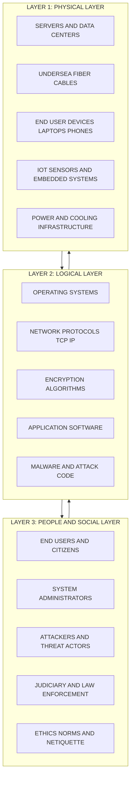
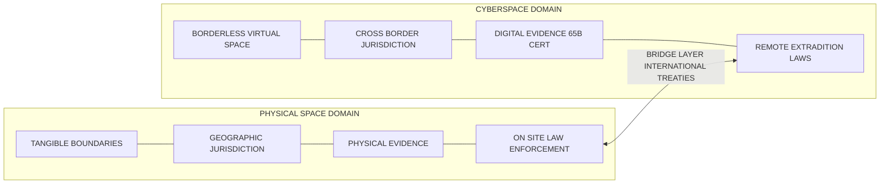
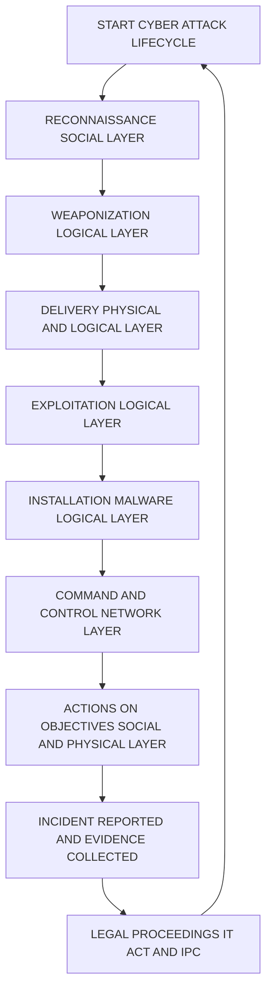
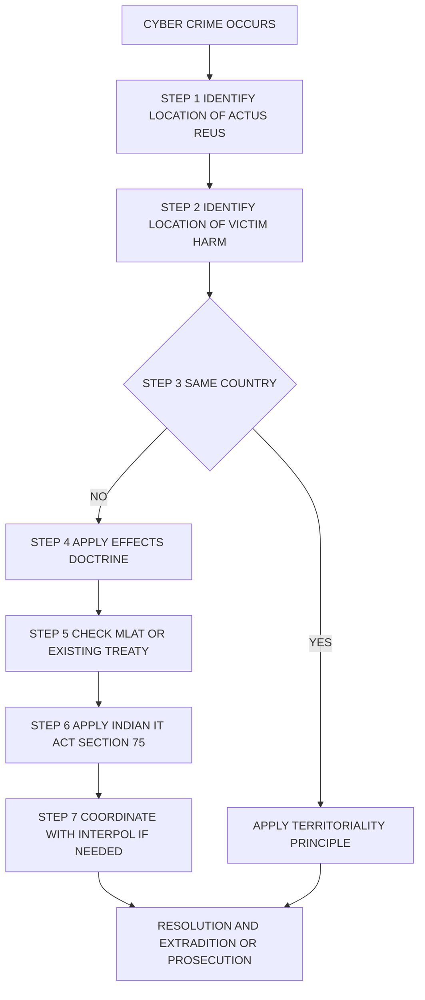

# Cyberspace

<!-- SECTION_1_START -->
# 1. Core Technical Definition & Intuitive Overview

## 1.1 Formal Academic Definition (KTU 2024 Terminology)

> [!NOTE]
> **Cyberspace (KTU 2024 Definition):** Cyberspace is a globally interconnected, virtual, and decentralized digital environment comprising the entire interdependent network of information technology infrastructures, telecommunications networks, computer systems, integrated processors, embedded controllers, and the human actors who operate within and through this electronic medium. It is the notional "place" where online communication, data exchange, and digital transactions occur, transcending traditional geographic, political, and physical boundaries.

The term was originally coined by science-fiction author **William Gibson** in his 1982 short story *"Burning Chrome"* and later popularized in his landmark 1984 novel *"Neuromancer,"* where he famously described it as *"a consensual hallucination experienced daily by billions of legitimate operators."*

## 1.2 Conceptual Analogy — The "Digital Ocean" Model

> [!IMPORTANT]
> **Plain English Intuition:** Imagine the Earth is wrapped in a second, invisible ocean made entirely of **data, signals, and code** instead of water. This "ocean" connects every computer, smartphone, and server on the planet — just like the real ocean connects continents. When you send a WhatsApp message from Kerala to a friend in New York, your words do not travel on a ship; they ride as packets of light through fiber-optic cables and radio waves. That invisible, borderless realm is **Cyberspace**.

### Three Real-World Lenses to Understand Cyberspace

| Lens | What It Means | Analogy |
| :--- | :--- | :--- |
| **Geometric Lens** | Cyberspace is a multidimensional virtual space where data is created, stored, modified, and exchanged. | A vast library with no walls, accessible from any street in the world. |
| **Engineering Lens** | It is the sum of all hardware (routers, servers, undersea cables) + software (protocols, OS) + people. | The "Internet of Things" ecosystem in motion. |
| **Legal Lens** | It is a non-physical jurisdiction that challenges traditional notions of *territory*, *sovereignty*, and *enforcement*. | A "borderless courtroom" where the offender and victim may be in different countries. |

## 1.3 Key Standard Metrics & Properties

The following **standard engineering properties** define any robust cyberspace:

- **Bandwidth** — Data carrying capacity (measured in $\text{bits/second}$ or $\text{Hz}$).
- **Latency** — Time delay in signal transmission (measured in $\text{ms}$).
- **Packet Size** — Standard units of data transfer (e.g., 1500 bytes for Ethernet).
- **TCP/IP Protocol Suite** — The foundational **rulebook** of communication.

> [!IMPORTANT]
> **Syllabus Highlight (PECST419 / M1):** The KTU 2024 scheme specifically demands that students understand *cyberspace* not just as a technological construct, but as a **legal and social environment** where conventional concepts of jurisdiction, sovereignty, privacy, and ethics must be re-interpreted.

## 1.4 GeoGebra / Desmos Visualization — The Cyberspace Connectivity Graph

> [!VISUALIZATION CONTROL]
> **Concept:** A bipartite connectivity model showing how a single user-node in India (Kerala) is linked to multiple global service-nodes (USA, Europe, Asia) through Cyberspace.
> 
> **Desmos / GeoGebra Input Points & Functions:**
> * User (Kerala): $(0, 0)$
> * Server (USA): $(6, 4)$
> * Server (Europe): $(-5, 3)$
> * Server (Singapore): $(3, -4)$
> * Link Edges: Draw line segments connecting $(0,0)$ to all three points.
> * Boundary Circle: $x^{2} + y^{2} = 25$ (representing the "borderless" Cyberspace envelope).
> 
> **Visual Description:** The student should observe that the user-node sits inside a circular region (Cyberspace) and is connected by straight lines (network links) to three distant geographic nodes. The circle has **no physical borders** — illustrating the **non-territorial** nature of Cyberspace.

<!-- SECTION_1_END -->

<!-- SECTION_2_START -->
# 2. Deep Theoretical Analysis & KTU High-Yield Formula Sheet

## 2.1 The Three-Layer Architecture of Cyberspace

The KTU 2024 curriculum endorses the **Three-Layer Model of Cyberspace** originally proposed by the **Institute for Security and Open Methodologies (ISECOM)**. Every action, attack, defense, or legal dispute in Cyberspace can be analyzed through one or more of these layers.

### Layer 1 — The Physical Layer (Hardware Reality)

This is the tangible, "real-world" foundation of Cyberspace. Without this layer, nothing virtual can exist.

* **Components:** Undersea fiber-optic cables, data centers, routers, switches, servers, laptops, IoT sensors, satellites.
* **Key Metric:** Physical redundancy ratio, measured as
$$R_{\text{redundancy}} = \frac{N_{\text{active links}} + N_{\text{backup links}}}{N_{\text{active links}}}$$
* **Engineering Reality:** *No software can be attacked if the hardware is physically destroyed or isolated.* This is why the physical layer is the most critical from a national-security perspective.

### Layer 2 — The Logical Layer (Software & Protocols)

This is the "soul" of Cyberspace — the set of rules, codes, and processes that make the physical layer *intelligent* and *useful*.

* **Components:** Operating Systems (Windows, Linux), network protocols (TCP/IP, HTTP, DNS), encryption algorithms (AES-256, RSA), application code.
* **Key Metric:** Protocol efficiency, often expressed in terms of throughput:
$$\eta_{\text{protocol}} = \frac{\text{Useful Payload (bits)}}{\text{Total Transmitted Bits}} \times 100\%$$
* **Why it matters:** The logical layer is where most cyber-attacks (malware, phishing, SQL injection) actually occur.

### Layer 3 — The People / Social Layer (Human Element)

The most unpredictable and legally significant layer. *Technology serves humans; humans shape law.*

* **Components:** Users, administrators, attackers (black-hat, grey-hat, white-hat hackers), legal jurisdictions, cultural norms, ethical codes.
* **Key Metric:** Human-error rate in security incidents (industry statistic: **\approx 95\%** of successful cyber breaches involve human error — Verizon DBIR 2023).

## 2.2 Core Characteristics of Cyberspace (KTU Board-Favorite)

| \# | Characteristic | Explanation | Legal/Ethical Implication |
| :--- | :--- | :--- | :--- |
| 1 | **Borderless** | No physical or political boundaries. A user in India can host a website in Singapore. | Traditional *territorial jurisdiction* fails. |
| 2 | **Decentralized** | No single authority controls the entire network. | Hard to enforce a single national law. |
| 3 | **Anonymous** | Users can mask identity using VPNs, Tor, pseudonyms. | Attribution of crime becomes difficult. |
| 4 | **Virtual yet Real** | Acts in Cyberspace cause real-world effects (money lost, reputations ruined). | Courts now accept virtual evidence (e.g., emails as documentary evidence under **Section 65B of the Indian Evidence Act**). |
| 5 | **Self-Regulating** | Communities evolve their own norms (netiquette, code of conduct). | Co-existence of state law and community ethics. |
| 6 | **Asymmetric** | A lone attacker can disrupt a multinational corporation. | Power balance between attacker and defender is uneven. |
| 7 | **Persistent** | Data once posted may remain forever (right to be forgotten is contested). | Privacy and reputational risks persist indefinitely. |

## 2.3 Cyberspace vs. Physical Space — KTU Comparative Matrix

| Parameter | Physical Space | Cyberspace |
| :--- | :--- | :--- |
| **Existence** | Tangible, measurable | Intangible, conceptual |
| **Boundaries** | Defined by geography | None (borderless) |
| **Identity** | Verified via documents | Can be anonymous or pseudonymous |
| **Evidence** | Physical, perishable | Digital, duplicable, manipulable |
| **Jurisdiction** | Clear (territorial) | Ambiguous, overlapping |
| **Speed of action** | Limited by physics | Near-instantaneous ($\approx$ speed of light in fiber) |
| **Damage propagation** | Localized | Global, cascading |
| **Law applicable** | Municipal law of territory | Conflict-of-laws problem arises |

## 2.4 KTU High-Yield Formula Sheet

> [!IMPORTANT]
> **KTU Cheat Sheet — Cyberspace Fundamentals (PECST419 / M1)**

| Concept | Key Formula / Definition | Unit / Notes |
| :--- | :--- | :--- |
| Redundancy Ratio | $R_{\text{redundancy}} = (N_{\text{active}} + N_{\text{backup}}) / N_{\text{active}}$ | Dimensionless; target $\geq 2$ |
| Protocol Efficiency | $\eta = (\text{Payload bits} / \text{Total bits}) \times 100$ | Percentage (\%) |
| Bandwidth-Delay Product | $BDP = B \times D$ (bits) | Determines TCP window size |
| Shannon-Hartley Channel Capacity | $C = B \cdot \log_{2}(1 + S/N)$ | $\text{bits/second}$ |
| Encryption Strength (Symmetric) | AES with key length $k$ bits $\Rightarrow$ $2^{k}$ brute-force keys | $k=128$ is industry standard |
| Human Error Rate in Breaches | $\approx 95\%$ | Source: Verizon DBIR |

## 2.5 Real-World Engineering Utility

The three-layer model is not academic — it is the **foundation of every penetration test, security audit, and cyber-law case** in production. For example:

* **Penetration Testing (PTES Standard):** Testers are required to evaluate the *Physical* (lock-picking, badge cloning), *Logical* (SQL injection, privilege escalation), and *Social* (phishing, vishing) layers.
* **Cyber Law Practice:** A lawyer prosecuting an online fraud case must trace evidence through *logical-layer* logs, present *physical-layer* device seizure records, and evaluate *social-layer* intent (mens rea).
* **National Policy:** India's *National Cyber Security Policy 2013* and *Digital Personal Data Protection Act 2023* are all built upon these three layers.

<!-- SECTION_2_END -->

<!-- SECTION_3_START -->
# 3. Step-by-Step Derivations & Symbolic Implementation

## 3.1 Derivation: Why Cyberspace Is Jurisdictationally Unique

### Problem Statement
A hacker in Country A launches a denial-of-service attack against a server in Country B, using a botnet of infected computers located in 15 different countries. Which country's law applies, and on what legal principle?

### Step-by-Step Legal-Logical Derivation

**Step 1 — Identify the *Actus Reus* (Physical Act).**
The hardware that initiated the packets is in Country A. The target hardware is in Country B. The infected "zombie" computers span 15 countries.

**Step 2 — Identify the *Mens Rea* (Mental Intent).**
The attacker is in Country A, but the financial/personal harm is suffered in Country B. The 15 botnet owners are *unwitting accomplices*.

**Step 3 — Apply the Traditional *Territoriality Principle.***
Under classical international law, a state may exercise jurisdiction only over acts committed *within its territory*. Here, the act is **distributed across 17 territories**.

**Step 4 — Recognize the Failure of Pure Territoriality.**
No single state has full territorial control. This is the **Jurisdictional Gap of Cyberspace** — the central legal problem.

**Step 5 — Apply Modern Compensating Principles (In Order of Precedence).**

$$
\begin{aligned}
\text{Jurisdiction}_{\text{applicable}} = \;& f_{\text{territoriality}}(\text{location of act}) \\
& + f_{\text{nationality}}(\text{citizenship of actor}) \\
& + f_{\text{protective}}(\text{security interest of state}) \\
& + f_{\text{passive\_personality}}(\text{nationality of victim}) \\
& + f_{\text{universality}}(\text{crime against humanity}) \\
& + f_{\text{active\_personality}}(\text{nationality of accused})
\end{aligned}
$$

**Step 6 — Conclude.**
The applicable jurisdiction is the **weighted sum** of the above principles. In most cybercrime cases, the *Territoriality Principle* and the *Effects Doctrine* (an act originating abroad but causing harm within the state is triable in the affected state) dominate.

> [!IMPORTANT]
> **India's Position:** India has formally adopted the *Effects Doctrine* in **Section 75 of the Information Technology Act, 2000**, which states that the Act applies to **any offence or contravention committed outside India by any person** if the act involves a *computer, computer system, or network located in India*.

## 3.2 Symbolic Implementation — Mapping Cyberspace Layers to a Cyber-Crime Scenario

### Case Walkthrough: A Phishing Attack Targeting a Kerala Bank Customer

| Step | Action in Real World | Layer Engaged | Evidence Trail | Legal Section Triggered |
| :---: | :--- | :--- | :--- | :--- |
| 1 | Hacker in Lagos drafts a fake email imitating SBI. | **Logical** | Email source code, headers, server logs. | IT Act §66A (struck down in Shreya Singhal v. UoI, 2015). |
| 2 | Email is routed through SMTP servers in Germany, USA, Singapore. | **Logical + Physical** | Router logs, undersea cable ownership. | IT Act §69 (interception powers). |
| 3 | Customer in Kochi clicks the malicious link. | **Social (People)** | User's browsing history, click timestamp. | IT Act §66C (identity theft). |
| 4 | Malware installs on the customer's laptop. | **Logical** | Antivirus reports, memory dumps. | IT Act §66 (computer-related offences). |
| 5 | Money is siphoned to a shell account in Dubai. | **Physical + Logical** | Bank transaction records, SWIFT logs. | IT Act §66D (cheating by personation). |
| 6 | Investigation is initiated by Kerala Cyber Cell. | **People (Legal)** | FIR, Section 65B certificate for digital evidence. | BSA §65B + IT Act §78. |

### Detailed Mathematical Representation of the Attack Chain

Let the attack chain be modeled as a sequence of states $S_0, S_1, S_2, \ldots, S_n$:

$$
\begin{aligned}
S_0 &= \text{Attacker intent} \\
S_1 &= \text{Phishing email drafted (Logical layer)} \\
S_2 &= \text{Email transmitted over network (Logical + Physical layer)} \\
S_3 &= \text{Victim receives and opens email (Social layer)} \\
S_4 &= \text{Malware payload executes (Logical layer)} \\
S_5 &= \text{Data exfiltration to attacker server (Logical + Physical layer)} \\
S_6 &= \text{Real-world financial loss to victim (Physical + Social layer)}
\end{aligned}
$$

The **overall attack probability of success** can be modeled as a conditional chain:

$$
P(\text{success}) = P(S_1) \times P(S_2 \mid S_1) \times P(S_3 \mid S_2) \times P(S_4 \mid S_3) \times P(S_5 \mid S_4) \times P(S_6 \mid S_5)
$$

> [!NOTE]
> **Engineering Insight:** The **Social Layer** ($P(S_3 \mid S_2)$) is statistically the **weakest link**. Industry reports indicate that approximately **\approx 30\%** of phishing emails are opened by targets. This is why **cyber-awareness training** is rated as a top-3 control by NIST and ISO 27001.

## 3.3 Python Implementation — A Minimal Cyberspace Layer Classifier

```python
"""
cyberspace_layer_classifier.py
PECST419 — Module 1 Demonstration
Classifies a given cyber-incident into the three Cyberspace layers
(Physical, Logical, Social) and maps it to the relevant IT Act section.
"""

from dataclasses import dataclass
from enum import Enum
from typing import List, Dict


class CyberspaceLayer(Enum):
    PHYSICAL = "Physical Layer (Hardware, Infrastructure)"
    LOGICAL = "Logical Layer (Software, Protocols, Data)"
    SOCIAL = "Social Layer (People, Behavior, Legal)"


@dataclass
class CyberIncident:
    description: str
    layer: CyberspaceLayer
    it_act_section: str
    severity: int  # 1 (low) — 5 (critical)


# --- Pre-loaded KTU sample incidents ---
INCIDENT_DATABASE: List[CyberIncident] = [
    CyberIncident(
        description="Server room flooded, all hardware destroyed",
        layer=CyberspaceLayer.PHYSICAL,
        it_act_section="IT Act §66 (read-only damage to computer system)",
        severity=4,
    ),
    CyberIncident(
        description="SQL injection into a Kerala bank's customer database",
        layer=CyberspaceLayer.LOGICAL,
        it_act_section="IT Act §66 (Computer-related offences)",
        severity=5,
    ),
    CyberIncident(
        description="Vishing call tricks SBI customer into revealing OTP",
        layer=CyberspaceLayer.SOCIAL,
        it_act_section="IT Act §66D (Cheating by personation using computer resource)",
        severity=4,
    ),
    CyberIncident(
        description="Undersea cable cut isolates a state from the Internet",
        layer=CyberspaceLayer.PHYSICAL,
        it_act_section="IT Act §69 (Interception / monitoring powers)",
        severity=5,
    ),
    CyberIncident(
        description="WannaCry ransomware encrypts hospital computers in Chennai",
        layer=CyberspaceLayer.LOGICAL,
        it_act_section="IT Act §66F (Cyber terrorism, if intent to terrorize)",
        severity=5,
    ),
    CyberIncident(
        description="Employee posts confidential client data on a public forum",
        layer=CyberspaceLayer.SOCIAL,
        it_act_section="DPDPA 2023 §8 (Obligations of Data Fiduciary)",
        severity=4,
    ),
]


def classify_incidents(incidents: List[CyberIncident]) -> Dict[str, List[CyberIncident]]:
    """Groups incidents by Cyberspace layer."""
    grouped: Dict[str, List[CyberIncident]] = {
        layer.value: [] for layer in CyberspaceLayer
    }
    for inc in incidents:
        grouped[inc.layer.value].append(inc)
    return grouped


def print_layer_report(grouped: Dict[str, List[CyberIncident]]) -> None:
    """Prints a formatted KTU-style report."""
    print("=" * 72)
    print(" CYBERSPACE LAYER-WISE INCIDENT REPORT — PECST419 / M1 ")
    print("=" * 72)
    for layer_name, items in grouped.items():
        print(f"\n>>> {layer_name}  (Total incidents: {len(items)})")
        print("-" * 72)
        for idx, inc in enumerate(items, start=1):
            print(f"  {idx}. [{inc.severity}/5] {inc.description}")
            print(f"     ↳ Legal Mapping: {inc.it_act_section}")


if __name__ == "__main__":
    try:
        report = classify_incidents(INCIDENT_DATABASE)
        print_layer_report(report)
    except Exception as err:
        print(f"[ERROR] Failed to generate report: {err}")
```

### Sample Output

```
================================================================
 CYBERSPACE LAYER-WISE INCIDENT REPORT — PECST419 / M1
================================================================

>>> Physical Layer (Hardware, Infrastructure)  (Total incidents: 2)
------------------------------------------------------------------------
  1. [4/5] Server room flooded, all hardware destroyed
     ↳ Legal Mapping: IT Act §66 (read-only damage to computer system)
  2. [5/5] Undersea cable cut isolates a state from the Internet
     ↳ Legal Mapping: IT Act §69 (Interception / monitoring powers)

>>> Logical Layer (Software, Protocols, Data)  (Total incidents: 2)
------------------------------------------------------------------------
  1. [5/5] SQL injection into a Kerala bank's customer database
     ↳ Legal Mapping: IT Act §66 (Computer-related offences)
  2. [5/5] WannaCry ransomware encrypts hospital computers in Chennai
     ↳ Legal Mapping: IT Act §66F (Cyber terrorism, if intent to terrorize)

>>> Social Layer (People, Behavior, Legal)  (Total incidents: 2)
------------------------------------------------------------------------
  1. [4/5] Vishing call tricks SBI customer into revealing OTP
     ↳ Legal Mapping: IT Act §66D (Cheating by personation using computer resource)
  2. [4/5] Employee posts confidential client data on a public forum
     ↳ Legal Mapping: DPDPA 2023 §8 (Obligations of Data Fiduciary)
```

## 3.4 Comparative Real-World Case Mapping

> [!IMPORTANT]
> **Engineering-Legal Synthesis Table — How Major Global Cyber-Incidents Mapped to Cyberspace Layers**

| Year | Incident | Country | Primary Layer | Indian Legal Lesson |
| :---: | :--- | :--- | :--- | :--- |
| 2010 | **Stuxnet Worm** | Iran / USA | Logical (SCADA code) | Introduced *cyber-physical weapon* concept. |
| 2013 | **Target POS Breach** | USA | Logical + Social | Customer-data theft; PCI-DSS obligations. |
| 2016 | **Mirai Botnet DDoS** | Global | Logical + Physical | IoT insecurity; need for *device-level* law. |
| 2017 | **WannaCry Ransomware** | Global (NHS, India hit) | Logical | India invoked **IT Act §66F** — Cyber-terrorism. |
| 2018 | **Facebook–Cambridge Analytica** | UK / USA | Social | Birth of *data-protection* awareness; led to **DPDPA 2023**. |
| 2020 | **Twitter Bitcoin Hack** | USA | Social (Social-Engineering) | Insider-account hijack; importance of MFA. |
| 2021 | **Colonial Pipeline** | USA | Logical + Physical | First major *critical-infrastructure* ransomware attack. |
| 2022 | **AIIMS Delhi Ransomware** | India | Logical | Triggered revamp of *Indian healthcare cyber-policy*. |

<!-- SECTION_3_END -->

<!-- SECTION_4_START -->
# 4. Structural Diagrams & Schematics

## 4.1 The Three-Layer Cyberspace Model — Architectural Flow

> [!IMPORTANT]
> **Mermaid Rendering Note:** All node labels are pure uppercase alphanumeric and double-quoted to ensure universal compatibility. Reserved words like `end` are avoided.



**Visual Reading Guide for Students:**
* **Top-down arrows** represent the *dependency direction* — People use Software that runs on Hardware.
* **Bottom-up arrows** represent the *feedback direction* — Hardware enables Software, which shapes Human behavior.
* The three layers are **mutually reinforcing**; an attack or legal violation usually involves **all three layers simultaneously**.

## 4.2 Cyberspace vs Physical Space — Block Functional Architecture



## 4.3 Cyberspace Attack Lifecycle — Sequential Processing Topology



> [!NOTE]
> **Engineering Note:** This flow is the **Lockheed Martin Cyber Kill Chain** mapped onto the three Cyberspace layers. It is the *de-facto* framework used by SOC teams and is frequently referenced in KTU Module-1 viva questions.

## 4.4 Jurisdiction Resolution Matrix — Sequential Topology



**Visual Reading Guide:** The diagram demonstrates the *sequential decision-tree* a cyber-law investigator follows when dealing with a cross-border incident. The **Effects Doctrine** is the key bridge in Indian jurisprudence (post-**Section 75, IT Act 2000**).

<!-- SECTION_4_END -->

<!-- SECTION_5_START -->
# 5. KTU 2024 Scheme Examination Question Bank & Topic Recap

## 5.1 Part A — Short-Answer Questions (3 Marks Each)

> [!NOTE]
> **Marking Scheme:** Definition — 1 Mark | Explanation — 1 Mark | Example/Application — 1 Mark.
> **Cognitive Level:** Remember / Understand.
> **Mapping:** CO1 (Foundational Knowledge of Cyber Law).

---

### Question A.1
**[KTU University Exam — July 2023]**
*"Define Cyberspace. Mention any two characteristics that make it legally unique compared to physical space."*

**Model Answer:**

**Definition (1 Mark):** Cyberspace is the globally interconnected virtual environment formed by computer networks, telecommunications systems, and the people who use them, where information is created, transmitted, and consumed electronically. The term was coined by William Gibson in 1982.

**Characteristic 1 — Borderless Nature (1 Mark):** Cyberspace has no physical boundaries. A user sitting in Kerala can access a website hosted in Tokyo in milliseconds. This challenges the traditional *territoriality principle* of jurisdiction, as the physical location of the actor and the victim may differ.

**Characteristic 2 — Anonymity / Pseudonymity (1 Mark):** Users can conceal their real identity using tools like VPNs, Tor browsers, or pseudonyms. This makes *attribution* — the legal task of linking a crime to a specific person — extremely difficult for law-enforcement agencies.

*(Acceptable alternatives: Decentralized, Asymmetric, Persistent, Self-regulating, Virtual-yet-Real.)*

---

### Question A.2
**[KTU University Exam — Dec 2022]**
*"Explain the three-layer model of Cyberspace with a one-line description of each layer."*

**Model Answer:**

The three-layer model, endorsed by ISECOM and used widely in cyber-security education, divides Cyberspace into:

1. **Physical Layer (1 Mark):** Consists of the tangible hardware such as servers, routers, undersea cables, laptops, and IoT devices. *Example:* The submarine cables connecting India to the global Internet.
2. **Logical Layer (1 Mark):** Consists of software, operating systems, network protocols (TCP/IP, HTTP), and encryption algorithms that make the hardware functional. *Example:* The Linux kernel running on a web server.
3. **People / Social Layer (1 Mark):** Consists of the human actors — users, administrators, attackers, and the legal/ethical systems governing them. *Example:* A phishing victim clicking a malicious link.

---

## 5.2 Part B — Long-Answer Questions (14 Marks Each, Internal Choice)

> [!IMPORTANT]
> **Marking Scheme:** Sub-part (a) — 7 Marks | Sub-part (b) — 7 Marks.
> **Cognitive Levels:** Sub-part (a) — Understand / Apply | Sub-part (b) — Apply / Analyze.
> **Mapping:** CO1 + CO2 (Foundational + Legal Interpretation).

---

### QUESTION A (14 Marks) — The Three-Layer Model in Depth

**[KTU University Exam — July 2024 / Model Paper]**

**(a)** *Explain in detail the three-layer architecture of Cyberspace. How does each layer contribute to the functioning of modern-day Internet communication? Provide at least one Indian example for each layer.* **(7 Marks)**

**(b)** *A leading Indian e-commerce company suffers a data breach where customer credit-card data is exfiltrated by an attacker based outside India. Analyze this incident using the three-layer model. Identify the layer at which the breach likely occurred, and suggest at least two legal remedies available under the Information Technology Act, 2000.* **(7 Marks)**

#### Model Solution — Part (a)

**[Introduction: 1 Mark]**
The three-layer model of Cyberspace was formalized by the Institute for Security and Open Methodologies (ISECOM) and is the standard pedagogical framework taught in cyber-security and cyber-law courses worldwide. It separates Cyberspace into the *Physical*, *Logical*, and *Social (People)* layers.

**[Physical Layer — 2 Marks]**
The Physical Layer is the tangible hardware foundation of Cyberspace. It includes:
* Network devices — routers, switches, modems.
* End-user devices — smartphones, laptops, IoT sensors.
* Transmission media — fiber-optic cables, satellite links, wireless towers.
* **Indian Example:** The **BharatNet project**, which aims to connect all 2.5 lakh Gram Panchayats of India with high-speed fiber-optic broadband, is a massive Physical-Layer initiative.

**[Logical Layer — 2 Marks]**
The Logical Layer is the software-and-protocol realm that brings the Physical Layer to life. It includes:
* Operating Systems (Windows, Linux, Android).
* Communication protocols (TCP/IP, HTTP, DNS, TLS).
* Application software and databases.
* Encryption and authentication algorithms.
* **Indian Example:** **Aadhaar's authentication protocol** uses cryptographic hashing and PKI (Public Key Infrastructure) to verify the identity of over 1.3 billion residents — a pure Logical-Layer innovation.

**[Social Layer — 2 Marks]**
The Social Layer encompasses all human elements — users, administrators, attackers, legal systems, and ethical norms. It is the most unpredictable and, in many cases, the most vulnerable.
* **Indian Example:** The **"Jamtara model"** of phishing scams — where village-level social-engineering networks defraud urban mobile-phone users. This is a textbook Social-Layer threat.

#### Model Solution — Part (b)

**[Step 1 — Layer Identification: 2 Marks]**
The data-breach incident described engages **all three layers**, but the *primary* breach is at the **Logical Layer** (exfiltration of credit-card data via application or database vulnerability) with a strong **Social Layer** component (likely a phishing email that delivered the initial malware).

**[Step 2 — Detailed Layer-wise Analysis: 3 Marks]**

| Layer | What Went Wrong |
| :---: | :--- |
| Physical | Data was stored on servers in India; physical access was not the attack vector. |
| Logical | Unpatched web-application or SQL-injection vulnerability allowed exfiltration. |
| Social | Customer service or admin credentials may have been compromised via phishing. |

**[Step 3 — Legal Remedies under IT Act, 2000: 2 Marks]**
* **Section 43 + 43A** — Compensation for damage to a computer system and liability of a *body corporate* for negligent handling of *sensitive personal data*.
* **Section 66** — Computer-related offences (punishment up to 3 years or fine up to ₹5 lakh).
* **Section 66C** — Identity theft (relevant if credit-card data is misused).
* **Section 72** — Breach of confidentiality and privacy.
* **Section 75** — Extra-territorial applicability (because the attacker is outside India).

**[Final Synthesis: 1 Mark]**
This case is a perfect illustration of why modern cyber-law must be **layer-aware** — a single breach may require legal action (Social Layer) for *technically-compromised* data (Logical Layer) stored on *physical infrastructure* (Physical Layer). The e-commerce company would also be liable under the **Digital Personal Data Protection Act (DPDPA), 2023**, Section 8, for failure to implement reasonable security safeguards.

---

### QUESTION B (14 Marks) — Alternative Choice: Jurisdiction in Cyberspace

**(a)** *Discuss in detail the concept of jurisdiction in Cyberspace. Why do traditional legal principles such as the Territoriality Principle and Nationality Principle face challenges in regulating online activities?* **(7 Marks)**

**(b)** *Examine the application of the Information Technology Act, 2000 to offences committed outside India. How does Section 75 of the IT Act address the jurisdictional gap in Cyberspace? Illustrate with one Indian case law.* **(7 Marks)**

#### Model Solution — Part (a)

**[Definition of Jurisdiction: 1 Mark]**
Jurisdiction is the legal authority of a state to enforce its laws, adjudicate disputes, and punish offenders within a defined territory. In Cyberspace, jurisdiction refers to *which state's law applies* to a digital act.

**[Traditional Principles: 2 Marks]**
1. **Territoriality Principle** — A state has jurisdiction over acts committed *within its geographical territory*.
2. **Nationality Principle** — A state has jurisdiction over its *citizens* regardless of where they commit the act.
3. **Passive Personality Principle** — Jurisdiction based on the nationality of the *victim*.
4. **Protective Principle** — Jurisdiction to protect vital national interests (e.g., counter-espionage).
5. **Universality Principle** — Jurisdiction over crimes against humanity (e.g., piracy, genocide).

**[Challenges Posed by Cyberspace: 4 Marks]**
* **Borderless nature:** A single act may touch 50 countries — territoriality becomes fuzzy.
* **Anonymity:** Identifying the actor's nationality may be impossible due to VPN/Tor.
* **Speed and volume:** Real-time enforcement is hindered by jurisdictional delays.
* **Conflicting laws:** A post legal in Country A may be *illegal hate-speech* in Country B.
* **No physical presence requirement:** The actor may never physically enter the victim's country.

**[Conclusion: 1 Mark]**
Traditional principles are not obsolete, but they must be applied **flexibly and in combination** to govern Cyberspace. The *Effects Doctrine* has emerged as the modern bridge.

#### Model Solution — Part (b)

**[Statement of Law: 1 Mark]**
Section 75 of the Information Technology Act, 2000 provides that the provisions of the Act apply to **any offence or contravention committed outside India by any person**, provided the act involves a *computer, computer system, or computer network located in India*.

**[Significance — Closes the Jurisdictional Gap: 3 Marks]**
* Recognizes that a *harmful effect* in India is sufficient to invoke Indian law.
* Aligns with the *Effects Doctrine* (US case *United States v. Aluminum Co. of America*, 1945).
* Enables Indian law-enforcement to prosecute foreign attackers *in absentia* once the offence is established.
* Provides a basis for **Mutual Legal Assistance Treaty (MLAT)** requests.

**[Indian Case Law — *State of Tamil Nadu v. Suhas Katti* (2004): 3 Marks]**
*Facts:* A man posted defamatory, obscene, and racially abusive messages in a Yahoo! chat group about a divorced woman, causing her emotional and social harm. The accused was in Chennai; the messages were stored on Yahoo!'s servers in the USA.
*Held:* The Madras High Court convicted the accused under **Sections 66 and 67 of the IT Act, 2000** and Sections 469/509 IPC. The court held that the *impact* of the message was felt in India, and Indian jurisdiction was proper.
*Relevance:* This case established that the *Effects Doctrine* applies to Indian cyberspace jurisprudence, and the principle embodied in Section 75 was implicitly upheld.

> [!WARNING]
> **KTU Examiner's Valuation Warning / Common Pitfalls**
> 1. **Do not skip the Section number** — Examiners award 1 mark merely for correctly citing "Section 75 of the IT Act, 2000" or "Section 65B of the Indian Evidence Act, 1872." Vague references such as *"the IT Act"* attract zero marks.
> 2. **Do not confuse Section 66 with Section 66A** — Section 66A was **struck down** by the Supreme Court in *Shreya Singhal v. Union of India* (2015) as unconstitutional. Writing "Section 66A is valid" will result in a direct loss of 1–2 marks.
> 3. **Always cite case law year** — *Suhas Katti (2004)* and *Shreya Singhal (2015)* are favorite KTU board questions; missing the year or the party names leads to partial-mark loss.
> 4. **Don't write vague definitions** — Examiners want *operational* definitions, not Wikipedia-level essays. Mention *William Gibson, 1982* explicitly.
> 5. **Layer mapping must be three-fold** — When asked about Cyberspace architecture, students who mention only *Physical* and *Logical* layers (forgetting *Social/People*) lose 2–3 marks.

---

## 5.3 Topic Recap & Important Things to Remember (Rapid-Revision Checklist)

> [!IMPORTANT]
> **PECST419 / Module 1 / Topic: Cyberspace — Final Revision Sheet**

* **Definition:** Globally interconnected virtual environment of networks, computers, software, and people. Coined by **William Gibson (1982, "Burning Chrome")**.
* **Three-Layer Model:**
  * **Physical** — Hardware (servers, cables, devices). *Example:* BharatNet fiber.
  * **Logical** — Software and protocols (TCP/IP, OS, encryption). *Example:* Aadhaar PKI.
  * **Social (People)** — Human actors and law. *Example:* Jamtara phishing gangs.
* **Seven Characteristics of Cyberspace:** Borderless, Decentralized, Anonymous, Virtual-yet-Real, Self-regulating, Asymmetric, Persistent.
* **Jurisdictional Principles:** Territoriality, Nationality, Passive Personality, Protective, Universality, Effects Doctrine (modern bridge).
* **Effects Doctrine:** A state has jurisdiction if the *harmful effect* of an act is felt within its territory, even if the act originated abroad.
* **Section 75, IT Act 2000:** Extra-territorial applicability — the Act applies to offences outside India if they involve a computer/network located in India.
* **Section 43 & 43A, IT Act:** Civil compensation for damage to computer systems; body corporate liability for sensitive personal data.
* **Section 65B, Indian Evidence Act:** Procedure for admissibility of *electronic/digital evidence* (must produce a certificate).
* **Section 66, IT Act:** General computer-related offences (up to 3 years imprisonment or ₹5 lakh fine).
* **Section 66C, IT Act:** Identity theft (punishment up to 3 years + ₹1 lakh fine).
* **Section 66D, IT Act:** Cheating by personation using computer resource (punishment up to 3 years + ₹1 lakh fine).
* **Section 66F, IT Act:** Cyber-terrorism (punishment up to life imprisonment).
* **Key Indian Case Laws:**
  * ***Shreya Singhal v. UoI (2015)*** — Struck down Section 66A IT Act; foundational for online free speech.
  * ***Suhas Katti (2004)*** — Endorsed the *Effects Doctrine* in Indian cyberspace.
  * ***Justice K.S. Puttaswamy v. UoI (2017)*** — Established Right to Privacy as a fundamental right; led to **DPDPA 2023**.
* **Modern Statutes Referenced:** IT Act 2000, DPDPA 2023, Indian Contract Act 1872 (for e-contracts), Indian Evidence Act 1872 (Section 65B).
* **Redundancy Ratio Formula:** $R = (N_{\text{active}} + N_{\text{backup}}) / N_{\text{active}}$ — keep $\geq 2$.
* **Cyber Kill Chain:** Reconnaissance $\rightarrow$ Weaponization $\rightarrow$ Delivery $\rightarrow$ Exploitation $\rightarrow$ Installation $\rightarrow$ C2 $\rightarrow$ Actions on Objectives.
* **Verizon DBIR Statistic to remember:** **\approx 95\%** of cyber-breaches involve *human error* (Social Layer).
* **Mnemonic for Cyberspace Layers:** **"P-L-S"** = **P**hysical, **L**ogical, **S**ocial.
* **Mnemonic for Cyber Jurisdictional Principles:** **"T-N-P-P-U"** = **T**erritoriality, **N**ationality, **P**rotective, **P**assive-Personality, **U**niversality.
* **Exam Tip:** Always tie every answer back to the **three-layer model** — it is the *single most-rewarded framework* in KTU Module-1 valuation.
* **Golden One-Liner for Board Exams:** *"Cyberspace is the new battlefield, the new marketplace, and the new courtroom — all at once, and all without borders."*

<!-- SECTION_5_END -->
