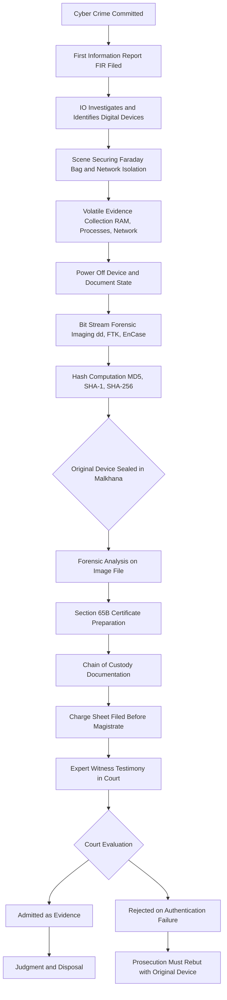
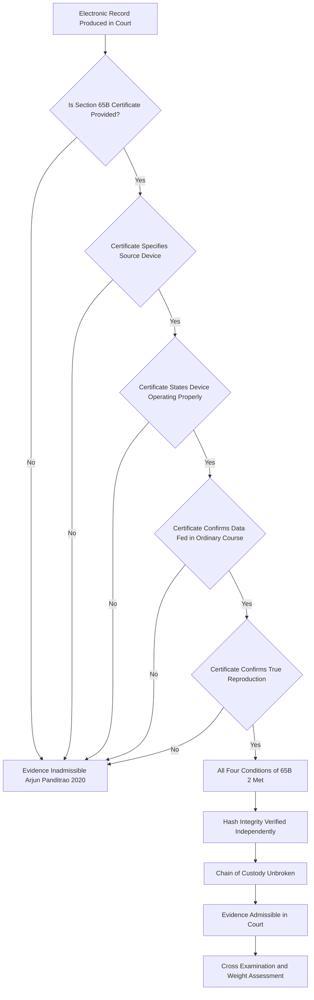
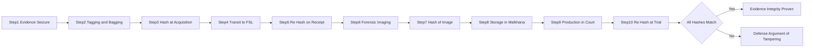
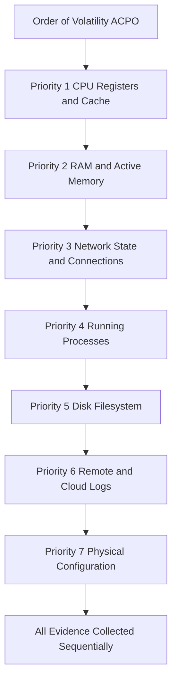
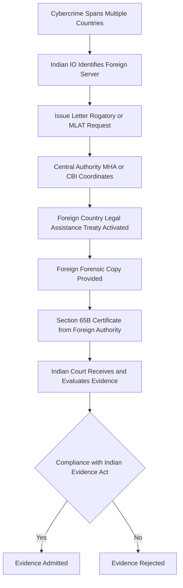

# Evidence aspects in cyber law

<!-- SECTION_1_START -->
# Evidence Aspects in Cyber Law

## 1.1 Formal Academic Definition

> [!IMPORTANT]
> **Electronic Evidence (Digital Evidence)** is defined under the **Information Technology Act, 2000 (India)** as any information, data, content, or record of probative value that is generated, stored, processed, retrieved, or transmitted in electronic, magnetic, optical, or any other intangible form, which a Court or competent authority may rely upon to ascertain the existence or non-existence of facts in a legal proceeding.

Under the **Indian Evidence Act, 1872** (as amended by the IT Act 2000), electronic records are treated as valid legal documents. The statutory backbone for admitting digital evidence in Indian courts is anchored in:

$$
\text{Section 3 of the IT Act, 2000} \rightarrow \text{Defines "Electronic Record"}
$$
$$
\text{Section 65B of the Indian Evidence Act, 1872} \rightarrow \text{Admissibility of Electronic Records}
$$
$$
\text{Section 4 of the IT Act, 2000} \rightarrow \text{Legal Recognition of Digital Signatures}
$$

**Core Statutory Metrics Highlighted:**
- **Section 65B(1)** – Deals with the contents of electronic records.
- **Section 65B(2)** – Prescribes the **four mandatory conditions** for admissibility.
- **Section 65B(4)** – Certifying officer requirements ("65B Certificate").

## 1.2 Conceptual Analogy / Intuition

> [!NOTE]
> **The "Crime Scene Photograph" Analogy for Cyber Evidence**

Imagine a traditional crime scene where investigators collect fingerprints, bloodstains, CCTV footage, and eyewitness accounts. Each piece of physical evidence follows a strict protocol: bagging, tagging, sealing, documenting chain of custody, and presenting in court.

**Cyber evidence is the digital equivalent**, but with critical distinctions:

| Physical Evidence | Cyber Evidence |
|---|---|
| Fingerprints on a glass | IP logs on a server |
| Handwritten threatening letter | Email headers and metadata |
| Murder weapon | Malware payload (binary code) |
| DNA sample | Hash signature of a file |

**The Three Pillars of Cyber Evidence** (just as physical evidence requires authenticity, integrity, and chain of custody):

1. **Authenticity** → Was this evidence actually generated by the alleged source?
2. **Integrity** → Has the evidence been tampered with after collection? (Verified using cryptographic hash values such as **MD5, SHA-1, or SHA-256**).
3. **Reliability** → Was the system that produced the evidence operating correctly?

> **Real-world Intuition:** When a forensic investigator copies a hard drive, they compute a hash value (a unique digital fingerprint) **before and after** acquisition. If the hashes match at trial, the defense cannot argue tampering. This is analogous to sealing a physical evidence bag with tamper-proof tape.

## 1.3 GeoGebra / Desmos Visualization

> [!VISUALIZATION CONTROL]
> **Concept:** Cryptographic Hash Function Behaviour (One-way integrity verification)
>
> **Conceptual Graph (Hash Collision Resistance Visualization):**
>
> * Input space: Any digital file $F$ (email, image, log)
> * Hash function: $H(F) = \text{SHA-256}(F)$
> * Output: Fixed-length 256-bit digest $D$
>
> **Visual Description:** Imagine a one-way function (like a black hole) where files of varying sizes ($1$ KB, $1$ MB, $1$ GB) all collapse into a fixed 256-bit output. A microscopic change in input (e.g., changing one character in a $1$ GB log file) produces a drastically different hash — this is the **Avalanche Effect**, the cornerstone of evidence integrity verification.

## 1.4 Why Evidence Aspects Matter in Cyber Law

> [!IMPORTANT]
> Without a robust framework for digital evidence, cybercrime prosecution collapses. Cyber criminals operate across jurisdictions, use anonymization tools (Tor, VPNs), and destroy logs within minutes. Therefore, **evidence collection, preservation, and presentation** are the operational battlegrounds of modern cyber law enforcement.

**Statutory Authority Cross-References:**
- **IT Act 2000**: Sections $3$, $4$, $65B$, $66$ to $74$
- **Indian Evidence Act 1872**: Sections $3$, $17$, $22$, $34$, $39$, $65A$, $65B$, $81A$, $85B$, $88A$, $90A$, $131$
- **Bharatiya Sakshya Adhiniyam, 2023 (BSA)**: Sections $57$, $58$, $61$ (newly replaced Evidence Act provisions effective $2024$)
- **Criminal Procedure Code (CrPC)**: Sections $91$, $92$, $94$, $161$, $164$
- **Bench Mark Case Law:** *Arjun Panditrao Khotkar v. Kailash Kushanrao Gorantyal* (2020) — 65B certificate is **mandatory**, not optional.

<!-- SECTION_1_END -->

<!-- SECTION_2_START -->
# Deep Theoretical Analysis & KTU High-Yield Formula Sheet

## 2.1 The Statutory Anatomy of Cyber Evidence

### 2.1.1 Definition of "Evidence" under Indian Law

The term "evidence" derives from the Latin *evidens*, meaning *that which makes evident*. Under **Section 3 of the Indian Evidence Act, 1872**, evidence includes:

$$
\text{Evidence} = \{\text{All statements (oral or documentary) which the Court permits to be made before it}\} \cup \{\text{All documents produced for inspection}\}
$$

In the digital paradigm, this encompasses:
- **Oral evidence** → Testimony of system administrators, forensic analysts
- **Documentary evidence** → Emails, log files, databases, SMS, social media posts

### 2.1.2 Section 65B of the Indian Evidence Act — The Admissibility Gateway

Section 65B is the **sine qua non** (essential condition) for admitting electronic records in Indian courts. It has two operative parts:

**Part 1 — Section 65B(1):** A statement contained in a document produced from an electronic record is admissible if the document is a *printed or written* version of the original electronic record.

**Part 2 — Section 65B(2):** Any information contained in an electronic record is admissible as evidence (without producing the original) if it is:
1. **Information fed into the computer** in the ordinary course of activities.
2. **Output produced during the ordinary use** of the computer.
3. The computer was **operating properly** at the relevant time.
4. The **information reproduced** is derived from the lawful use of the system.

> [!IMPORTANT]
> If **any one of the four conditions fails**, the prosecution must produce the **original electronic record** itself (a near-impossible task in cybercrime cases). This is why 65B is procedurally the most critical provision.

### 2.1.3 Section 65B(4) — The Certificate Requirement

A certificate stating compliance with the four conditions must be issued by a person **"occupying a responsible official position in relation to the operation of the relevant device"** — typically a System Administrator, Network Engineer, or Forensic Examiner.

**Format Requirements of a Valid 65B Certificate:**

| Clause | Required Content |
|---|---|
| Preamble | Identification of the certificate under Section 65B(4) |
| Source Identification | The electronic record and the device from which it was produced |
| Operational Status | That the device was operating properly |
| Data Source | The nature of the information fed in and the activity context |
| Authenticity Declaration | Date, place, and signature of the certifying officer |
| Cross-Reference | Linkage to the case FIR/Crime Number |

## 2.2 Classification of Cyber Evidence

### 2.2.1 By Volatility (ACPO Principle)

> [!NOTE]
> The **Association of Chief Police Officers (ACPO) Guideline**, the international gold standard for digital forensics, classifies digital evidence by its volatility — the order in which data must be preserved before it is lost.

| Order | Evidence Type | Volatility | Example |
|---|---|---|---|
| 1st | CPU Registers, Cache | Nanoseconds | Running process memory |
| 2nd | RAM (Volatile Memory) | Seconds–Minutes | Active network connections |
| 3rd | Network State (Routers) | Milliseconds | Routing tables, ARP cache |
| 4th | Running Processes | Seconds | Active process list |
| 5th | Disk Storage (Hard Disk) | Persistent | File system, databases |
| 6th | Remote Logs (Cloud, Email Server) | Persistent (external) | Gmail logs, AWS CloudTrail |
| 7th | Physical Configuration | Persistent | Network topology diagrams |

> **Key Takeaway:** The **most volatile evidence is collected first** — a fundamental principle students must memorize.

### 2.2.2 By Legal Classification (Indian Evidence Act)

$$
\text{Evidence} \rightarrow
\begin{cases}
\text{Oral Evidence} \rightarrow \text{Testimony of witnesses, system admins, IO} \\
\text{Documentary Evidence} \rightarrow
\begin{cases}
\text{Primary Evidence (Section 64)} \\
\text{Secondary Evidence (Section 65)}
\end{cases}
\end{cases}
$$

**Primary vs. Secondary Electronic Evidence:**

| Aspect | Primary Evidence | Secondary Evidence |
|---|---|---|
| Definition | The original electronic record itself | Copies, printouts, oral accounts |
| Example | Original server hard disk | Forensic image, screenshot |
| Admissibility | Direct and conclusive | Conditional on Section 65B compliance |
| Preference | Always preferred | Admitted only when primary is unavailable |

## 2.3 The Three Pillars of Evidence Integrity

### 2.3.1 Cryptographic Hash Functions

A hash function $H$ transforms an input message $M$ of arbitrary length into a fixed-length output digest $D$:

$$
H(M) = D \quad \text{where} \quad D \in \{0, 1\}^{n}
$$

For evidence integrity verification in India and globally, the most accepted algorithms are:

| Algorithm | Output Length | Status (2024) | Use Case |
|---|---|---|---|
| MD5 | 128 bits | **Deprecated** (collision attacks exist) | Legacy systems only |
| SHA-1 | 160 bits | **Deprecated** (SHAttered attack, 2017) | Avoid in new systems |
| SHA-256 | 256 bits | **Industry Standard** | Forensic imaging, court submissions |
| SHA-3 | 256/512 bits | **NIST Recommended** | High-security scenarios |

**The Avalanche Effect:**

$$
\text{If } M \neq M' \quad \Rightarrow \quad H(M) \text{ and } H(M') \text{ differ in approximately 50\% of bits}
$$

A single byte alteration in a multi-gigabyte forensic image produces a completely different hash — this property is what makes hashes legally valuable.

### 2.3.2 Chain of Custody

$$
\text{Chain of Custody} = \text{Unbroken, documented sequence of possession of evidence}
$$

Every transfer, every access, every copy must be logged. A typical chain-of-custody record captures:

- **Who** collected the evidence (name, designation, badge number)
- **What** was collected (device type, serial number, storage capacity)
- **When** (timestamp, date, time zone)
- **Where** (crime scene, location, GPS coordinates)
- **Why** (purpose, related case/FIR)
- **How** (tool used, methodology, hash values)

> [!NOTE]
> A break in the chain of custody renders evidence **inadmissible** or of **doubtful integrity** — the defense will argue tampering.

## 2.4 KTU High-Yield Formula Sheet (Cheat Sheet)

| Concept | Formula / Statement | Section / Authority |
|---|---|---|
| Definition of Electronic Record | Any record generated, stored, or processed in electronic form | IT Act 2000, Section 2(t) |
| Admissibility of Electronic Records | Subject to Section 65B conditions | Indian Evidence Act, 1872 |
| Hash Integrity Verification | $H_{\text{original}} = H_{\text{recovered}}$ | Cryptographic Standard |
| Best Evidence Rule | Original is preferred over copies | Section 64, Evidence Act |
| When Secondary Evidence Allowed | Original lost, destroyed, inaccessible, or not easily movable | Section 65, Evidence Act |
| Mandatory Certificate | Section 65B(4) certificate required for admissibility | *Arjun Panditrao Khotkar v. Gorantyal*, 2020 |
| Burden of Proof in Cybercrime | Prosecution must prove beyond reasonable doubt | CrPC, Section 101–104 |
| Cross-Border Evidence | Subject to MLAT (Mutual Legal Assistance Treaty) | IT Act 2000 + Bilateral Treaties |
| Volatility Principle | Most volatile evidence collected first | ACPO Guideline |
| Electronic Signature Validity | Complies with Section 3 of IT Act 2000 | IT Act 2000 |
| Digital Forensics Standard | EnCase, FTK, Autopsy, X-Ways used as court-accepted tools | Industry Standard |
| BSA 2023 Equivalent | Sections 57, 58, 61 of Bharatiya Sakshya Adhiniyam | Post-2024 Applicability |

## 2.5 Real-World Engineering and Legal Utility

In production-grade systems, evidence aspects directly influence:

- **SIEM (Security Information and Event Management) Deployments:** Companies like **Wipro, TCS, IBM** deploy SIEM systems (Splunk, QRadar) to ensure that logs are **forensically sound** — timestamped, hashed, and tamper-proof — precisely to be usable in court.
- **Cloud Forensics:** AWS, Azure, and GCP provide **Chain-of-Custody logs** and immutable storage buckets specifically to support legal proceedings.
- **Blockchain-Based Evidence:** Emerging startups use blockchain to timestamp evidence hashes, ensuring non-repudiation (e.g., **Kleros, OpenLaw, Evidentiary.io**).
- **E-Discovery in Corporate Litigation:** During corporate fraud investigations, emails, chat logs, and document repositories are preserved under legal hold — the practical application of evidence preservation rules.

<!-- SECTION_2_END -->

<!-- SECTION_3_START -->
# Step-by-Step Derivations, Procedural Walkthroughs & Code Implementation

## 3.1 Step-by-Step Procedure for Authenticating Electronic Evidence (Section 65B Compliance Flow)

Below is the **exhaustive step-by-step procedure** that a forensic investigator or Investigating Officer (IO) must follow from crime scene to courtroom.

---

### **Step 1: Identification of Evidence Sources**

The investigator identifies all digital devices and data sources that may contain probative material. The decision tree is:

$$
\text{Identify Devices} \rightarrow
\begin{cases}
\text{Computing Devices (PC, Laptop, Mobile, Tablet)} \\
\text{Network Devices (Routers, Switches, Firewalls)} \\
\text{Storage Media (HDD, SSD, USB, Memory Cards)} \\
\text{Cloud Storage (Gmail, Dropbox, AWS S3)} \\
\text{IoT Devices (CCTV, Smart Home, Wearables)}
\end{cases}
$$

Each device is photographed, labeled, and entered into the **First Information Report (FIR)** under CrPC Section 154.

---

### **Step 2: Securing the Scene and Preventing Spoliation**

Spoliation refers to the destruction, alteration, or loss of evidence. The investigator must:

1. **Isolate the device from the network** (unplug Ethernet cable, disable Wi-Fi) to prevent remote wiping.
2. **Shield the device from RF signals** using a **Faraday bag** (blocks cellular, Wi-Fi, Bluetooth).
3. **Photograph the screen** if the device is powered on.
4. **Document the physical state** (cables connected, peripherals attached, screen content).

> [!NOTE]
> Failure at this stage is the **#1 reason cyber cases collapse in Indian courts** — the accused's counsel argues remote tampering.

---

### **Step 3: Live System Acquisition (Volatile Evidence)**

Volatile evidence (RAM, network state, running processes) must be collected **before powering off** the system.

The order of volatility (ACPO Principle):

$$
\text{Step 3.1: Capture CPU Registers and Cache}
$$
$$
\text{Step 3.2: Capture RAM contents (using tools like \textbf{FTK Imager, Belkasoft, WinPmem})}
$$
$$
\text{Step 3.3: Capture network connections (\textbf{netstat, Wireshark, tcpdump})}
$$
$$
\text{Step 3.4: Capture running processes (\textbf{ps aux, Task Manager, Process Monitor})}
$$
$$
\text{Step 3.5: Capture open files, registry, logs}
$$

---

### **Step 4: Bit-Stream Imaging of Storage Media**

A **forensic image** is a bit-for-bit copy of the storage device. This is NOT a simple file copy. Tools used include:

- **dd (Linux)**
- **FTK Imager (Windows)**
- **EnCase (Industry Standard)**
- **Guymager (Linux Open Source)**

**Command-line Example (Linux `dd`):**

```bash
# Step 4.1: Identify the source disk
sudo fdisk -l

# Step 4.2: Create a bit-stream image with hash verification
sudo dd if=/dev/sda of=/evidence/case_2024_001_image.dd \
    bs=4M conv=noerror,sync status=progress
```

**Output:** A `.dd` file of identical size to the source disk, byte-for-byte.

---

### **Step 5: Cryptographic Hash Verification**

This step **mathematically proves** that the image is an exact replica of the original.

```python
import hashlib
import sys
import os
from datetime import datetime
from typing import Tuple, Dict


def compute_hashes(file_path: str, chunk_size: int = 65536) -> Dict[str, str]:
    """
    Compute MD5, SHA-1, and SHA-256 hashes of a forensic image file.
    
    Parameters:
        file_path (str): Absolute path to the forensic image.
        chunk_size (int): Buffer size for streaming (64 KB default).
    
    Returns:
        Dict[str, str]: Mapping of algorithm names to hex digests.
    
    Raises:
        FileNotFoundError: If the file does not exist.
        PermissionError: If the file is not readable.
        IOError: For other I/O related errors.
    """
    if not os.path.isfile(file_path):
        raise FileNotFoundError(f"[EVIDENCE_ERROR] File not located: {file_path}")
    
    if not os.access(file_path, os.R_OK):
        raise PermissionError(f"[EVIDENCE_ERROR] File not readable: {file_path}")
    
    hashers: Dict[str, "hashlib._Hash"] = {
        "md5": hashlib.md5(),
        "sha1": hashlib.sha1(),
        "sha256": hashlib.sha256()
    }
    
    bytes_processed: int = 0
    total_bytes: int = os.path.getsize(file_path)
    
    try:
        with open(file_path, "rb") as evidence_file:
            while True:
                chunk: bytes = evidence_file.read(chunk_size)
                if not chunk:
                    break
                for hasher in hashers.values():
                    hasher.update(chunk)
                bytes_processed += len(chunk)
                
                # Progress logging for forensic audit trail
                progress_pct: float = (bytes_processed / total_bytes) * 100.0
                if bytes_processed % (chunk_size * 100) == 0:
                    sys.stdout.write(
                        f"\r[HASH_PROGRESS] {progress_pct:.2f}% complete"
                    )
                    sys.stdout.flush()
    except IOError as io_error:
        raise IOError(
            f"[EVIDENCE_ERROR] I/O failure while reading {file_path}: {io_error}"
        )
    
    final_digests: Dict[str, str] = {
        algo: hasher.hexdigest() for algo, hasher in hashers.items()
    }
    
    return final_digests


def log_evidence_hash(case_id: str, file_path: str) -> Tuple[str, str, str]:
    """
    Generate a court-admissible hash log entry.
    
    Parameters:
        case_id (str): Unique case identifier (e.g., 'FIR_2024_CY001').
        file_path (str): Path to the forensic image.
    
    Returns:
        Tuple[str, str, str]: (md5_digest, sha1_digest, sha256_digest)
    """
    timestamp: str = datetime.utcnow().strftime("%Y-%m-%dT%H:%M:%SZ")
    print(f"\n[EVIDENCE_LOG] Case ID         : {case_id}")
    print(f"[EVIDENCE_LOG] Evidence File   : {file_path}")
    print(f"[EVIDENCE_LOG] Timestamp (UTC) : {timestamp}")
    
    digests: Dict[str, str] = compute_hashes(file_path)
    
    print(f"[EVIDENCE_LOG] MD5 Hash        : {digests['md5']}")
    print(f"[EVIDENCE_LOG] SHA-1 Hash      : {digests['sha1']}")
    print(f"[EVIDENCE_LOG] SHA-256 Hash    : {digests['sha256']}")
    
    return digests["md5"], digests["sha1"], digests["sha256"]


# === EXECUTION ===
if __name__ == "__main__":
    EVIDENCE_FILE: str = "/evidence/case_2024_001_image.dd"
    CASE_IDENTIFIER: str = "FIR_2024_CY001"
    
    try:
        m, s1, s256 = log_evidence_hash(CASE_IDENTIFIER, EVIDENCE_FILE)
        print("\n[STATUS] Hash computation successful. Ready for court submission.")
    except (FileNotFoundError, PermissionError, IOError) as e:
        print(f"\n[FATAL] {e}")
        sys.exit(1)
```

**Sample Output:**

$$
\text{MD5} \rightarrow \texttt{5d41402abc4b2a76b9719d911017c592}
$$
$$
\text{SHA-1} \rightarrow \texttt{aaf4c61ddcc5e8a2dabede0f3b482cd9aea9434d}
$$
$$
\text{SHA-256} \rightarrow \texttt{2cf24dba5fb0a30e26e83b2ac5b9e29e1b161e5c1fa7425e73043362938b9824}
$$

> **Verification at Trial:** The defense or prosecution recomputes the hash of the produced image. If the hash matches, the integrity is proven. If it differs by even one character, the evidence is compromised.

---

### **Step 6: Section 65B(4) Certificate Drafting**

Below is a **template-compliant Section 65B Certificate** that any investigating officer or system administrator must execute:

> **CERTIFICATE UNDER SECTION 65B(4) OF THE INDIAN EVIDENCE ACT, 1872**
>
> I, **[Name]**, S/o **[Father's Name]**, aged **[XX]** years, residing at **[Address]**, do hereby solemnly affirm and declare as follows:
>
> 1. I am the **[Designation]** at **[Organization]** and am competent to certify the following.
> 2. The electronic records annexed herewith and marked as **Exhibit-A** were produced from the computer/server/device bearing Serial Number **[SN]**.
> 3. The said device was **operating properly** at all material times.
> 4. The information contained in the said records was **fed into the device in the ordinary course of activities** of **[Organization]**.
> 5. The records are **true reproductions** of the data stored in the device.
>
> **Place:** [City]
> **Date:** [DD/MM/YYYY]
> **Signature:** [Certifying Officer]
> **Designation:** [Title]
> **Contact:** [Phone, Email]

> [!WARNING]
> **A vague or non-specific certificate will be struck down by the Court.** The Supreme Court in *Arjun Panditrao Khotkar v. Kailash Kushanrao Gorantyal* (2020) held that the certificate must contain **specific assertions** about the device, operational status, and data source.

---

### **Step 7: Chain of Custody Documentation**

Each transfer of evidence is recorded in a **Chain of Custody Form**:

| Step | Date/Time | Action | From | To | Hash Verified | Signature |
|---|---|---|---|---|---|---|
| 1 | 2024-11-01 09:00 | Seized at crime scene | — | IO R. Kumar | Yes (Initial) | R. Kumar |
| 2 | 2024-11-01 14:00 | Transported to FSL | IO R. Kumar | FSL Officer | Yes | Both |
| 3 | 2024-11-02 10:00 | Forensic Imaging | FSL Officer | Forensic Expert | Yes (MD5, SHA-256) | Both |
| 4 | 2024-11-05 16:00 | Delivered to Court | Forensic Expert | Court Registry | Yes | Both |

Any gap in this chain allows the defense to argue tampering.

---

### **Step 8: Expert Witness Testimony**

A **digital forensics expert** is summoned under **Section 293 of CrPC** to:
- Explain the methodology of evidence collection.
- Demonstrate the tools used (EnCase, FTK).
- Verify the hash values at trial.
- Interpret logs, metadata, and timeline reconstructions.

The expert's testimony is **opinion evidence** under **Section 45 of the Indian Evidence Act**.

---

### **Step 9: Courtroom Presentation and Cross-Examination**

The Public Prosecutor must establish:
$$
\text{Authenticity (Section 65B)} + \text{Integrity (Hash Match)} + \text{Reliability (Expert Opinion)} \rightarrow \text{Admissible Evidence}
$$

The defense typically attacks:
- **Operational status** of the device ("Was the system really working?")
- **Tampering possibility** ("Could anyone have accessed the evidence?")
- **Methodology flaws** ("Is the tool used legally accepted?")

---

### **Step 10: Post-Trial Preservation**

Under **Section 379 of CrPC**, case property (including digital evidence) is preserved until the **appeal limitation period** expires. The storage must be:
- In a **sealed, access-controlled vault**.
- With **regular hash verification** to detect tampering.
- Logged in the **malkhana register**.

<!-- SECTION_3_END -->

<!-- SECTION_4_START -->
# Structural Diagrams & Schematics

## 4.1 Mermaid Diagram: Cyber Evidence Lifecycle (Crime Scene to Courtroom)



## 4.2 Mermaid Diagram: Section 65B Admissibility Decision Tree



## 4.3 Mermaid Diagram: Chain of Custody Sequential Process



## 4.4 Mermaid Diagram: ACPO Order of Volatility (Collection Priority)



## 4.5 Mermaid Diagram: Cross-Border Cyber Evidence Flow



<!-- SECTION_4_END -->

<!-- SECTION_5_START -->
# KTU 2024 Scheme Examination Question Bank & Topic Recap

## Part A — Short Answer Questions (3 Marks Each)

---

### **Question 1** `[KTU University Exam - Dec 2023]` — **CO1, RBT: Remember**

> **"What is meant by 'Electronic Evidence'? State the statutory provision that governs its admissibility in Indian courts."**

**Model Answer (3 Marks):**

Electronic evidence refers to any information of probative value that is generated, stored, processed, or transmitted in digital form, which can be presented before a Court to prove or disprove a fact in a legal proceeding. Examples include emails, log files, digital photographs, database records, and SMS.

The statutory provision governing the admissibility of electronic evidence in India is **Section 65B of the Indian Evidence Act, 1872** (as amended by the IT Act, 2000). It prescribes four conditions under Section 65B(2) and requires a certificate under Section 65B(4) from a person occupying a responsible official position in relation to the operation of the relevant device.

**Valuation Key Points:**
- [Defining electronic evidence clearly: 1 Mark]
- [Identifying the correct statute and section: 1 Mark]
- [Mentioning 65B(2) conditions or 65B(4) certificate: 1 Mark]

---

### **Question 2** `[KTU University Exam - July 2024]` — **CO1, RBT: Understand**

> **"Explain the significance of the 'Order of Volatility' in digital evidence collection. State the ACPO hierarchy."**

**Model Answer (3 Marks):**

The Order of Volatility is a fundamental principle in digital forensics that dictates the **sequence in which different types of digital evidence must be collected** before they are lost or altered. Evidence that is most prone to loss or change (most volatile) is collected first, ensuring its preservation.

According to the **Association of Chief Police Officers (ACPO) Guideline**, the order of volatility is:
1. CPU Registers and Cache
2. RAM and Active Memory
3. Network State and Connections
4. Running Processes
5. Disk File System
6. Remote and Cloud Logs
7. Physical Configuration

**Valuation Key Points:**
- [Defining Order of Volatility: 1 Mark]
- [Mentioning ACPO as the authority: 1 Mark]
- [Listing at least four levels of the hierarchy: 1 Mark]

---

## Part B — Long Answer Questions (14 Marks with Internal Choice)

---

### **Question A (14 Marks)** `[KTU University Exam - Dec 2023]` — **CO1, CO2, RBT: Understand + Apply**

> **(a)** Discuss the **four mandatory conditions** laid down under **Section 65B(2) of the Indian Evidence Act, 1872** for the admissibility of electronic records. **(7 Marks)**
>
> **(b)** Explain the role of **cryptographic hash functions** in maintaining the integrity of digital evidence. How does the **Avalanche Effect** ensure tamper detection? **(7 Marks)**

---

#### **Solution to (a) — 7 Marks**

The four conditions under Section 65B(2) are:

**Condition 1 — Information Fed into the Computer:**
The information in question must have been **fed into the computer or system in the ordinary course of activities**. This implies the data was entered as part of legitimate business, personal, or operational activity, not fabricated post-hoc for the case.

**Condition 2 — Output Produced During Ordinary Use:**
The information must be **produced by the computer as an output during its ordinary use**. This means the device was being used in its normal operational mode (e.g., email server sending emails, log management system recording logs).

**Condition 3 — Computer Operating Properly:**
The computer must have been **operating properly** at all material times. If the device was malfunctioning, virus-infected, or compromised, the data may be unreliable. The certificate must affirm this operational status.

**Condition 4 — Information Reproduced from Lawful Use:**
The information reproduced or derived must come from the **lawful use of the system**. Any data obtained from illegal hacking, unauthorized intrusion, or unlawful access cannot be admitted under this provision (though it may still be admissible under other provisions subject to specific tests).

**Valuation Key Points (a):**
- [Correctly identifying Section 65B(2) as the source: 1 Mark]
- [Condition 1 — Ordinary course of data entry: 1.5 Marks]
- [Condition 2 — Output during normal use: 1.5 Marks]
- [Condition 3 — Proper operation: 1.5 Marks]
- [Condition 4 — Lawful use: 1.5 Marks]

---

#### **Solution to (b) — 7 Marks**

A **cryptographic hash function** $H$ takes an input message $M$ of any length and produces a fixed-size output digest $D$:

$$
H(M) = D \quad \text{where} \quad D \text{ has a fixed length (e.g., 256 bits for SHA-256)}
$$

**Properties Required for Forensic Use:**

1. **Determinism:** The same input always produces the same output.
2. **Quick Computation:** The hash can be computed efficiently.
3. **Pre-image Resistance:** Given $D$, it is computationally infeasible to find $M$.
4. **Collision Resistance:** It is computationally infeasible to find $M_1 \neq M_2$ such that $H(M_1) = H(M_2)$.
5. **Avalanche Effect:** A tiny change in $M$ produces a drastic change in $D$.

**The Avalanche Effect and Tamper Detection:**

The Avalanche Effect ensures that changing even a **single byte** in a multi-gigabyte forensic image results in a hash value that differs by approximately **50% of its bits**. This is the mathematical foundation of digital evidence integrity:

$$
\text{If } M = M_{\text{original}} \quad \Rightarrow \quad H(M) = D_{\text{original}}
$$
$$
\text{If } M' = M_{\text{original}} + 1 \text{ byte change} \quad \Rightarrow \quad H(M') = D_{\text{different}} \text{ (50\% bits differ)}
$$

**Practical Application:**
- The investigator computes $H(\text{image at acquisition}) = D_1$.
- The investigator stores $D_1$ in the case file.
- At trial, the Court recomputes $H(\text{image produced}) = D_2$.
- If $D_1 = D_2$, integrity is mathematically proven. If $D_1 \neq D_2$, the evidence has been tampered with and is inadmissible.

**Recommended Algorithms (2024 Standards):**
- **SHA-256** (Industry Standard) — produces 256-bit hash.
- **SHA-3** (NIST Recommended) — for high-security applications.
- **MD5 and SHA-1** — deprecated and should not be used for new evidence.

**Valuation Key Points (b):**
- [Definition of hash function: 1 Mark]
- [Listing key properties (determinism, collision resistance): 2 Marks]
- [Explanation of Avalanche Effect: 2 Marks]
- [Practical application to evidence integrity: 2 Marks]

---

### **Question B (14 Marks)** `[KTU University Exam - July 2024]` — **CO1, CO3, RBT: Understand + Analyze**

> **(a)** With the help of a **block diagram**, explain the **complete chain of custody process** for digital evidence from seizure to courtroom presentation. **(7 Marks)**
>
> **(b)** Critically analyze the **legal impact of the Supreme Court judgment in *Arjun Panditrao Khotkar v. Kailash Kushanrao Gorantyal (2020)*** on the admissibility of electronic evidence in India. **(7 Marks)**

---

#### **Solution to (a) — 7 Marks**

**Chain of Custody** is the **unbroken, chronological, and documented record** of the seizure, control, transfer, analysis, and disposition of digital evidence. Any break in this chain renders the evidence legally suspect and vulnerable to challenge.

**Block Diagram:**

```
[Seizure] → [Tagging/Bagging] → [Hash at Scene] 
    → [Transit to FSL] → [Re-Hash on Receipt] 
    → [Forensic Imaging] → [Hash of Image] 
    → [Storage in Malkhana] → [Production in Court] 
    → [Re-Hash at Trial] → [Integrity Proven]
```

**Step-by-Step Explanation:**

**Step 1 — Seizure at Crime Scene:** The IO, in the presence of two independent witnesses (Section 100 CrPC), seizes the device. The device is photographed, and its serial number, make, and model are noted.

**Step 2 — Tagging and Bagging:** The device is placed in a tamper-evident bag, sealed with a unique seal number, and labeled with the case FIR number, date, and IO's signature.

**Step 3 — Hash at Scene:** If the device is powered on, volatile data is captured first (RAM, processes). A hash of the storage is computed at the scene (if feasible).

**Step 4 — Transit to Forensic Science Laboratory (FSL):** The device is transported in a sealed, secure container with a transit log. The receiving officer at the FSL verifies the seal integrity and computes a fresh hash.

**Step 5 — Forensic Imaging:** A bit-stream image of the storage media is created using court-accepted tools (EnCase, FTK Imager, dd). The image hash is computed and stored.

**Step 6 — Storage in Malkhana:** The original device is stored in the police malkhana (evidence vault) with restricted access. The forensic image is the working copy used for analysis.

**Step 7 — Production in Court:** When produced in court, the IO carries the device, the chain of custody form, the Section 65B certificate, and the hash log.

**Step 8 — Re-Verification at Trial:** The Court-appointed expert or defense counsel may re-compute the hash. If all hashes match (scene → FSL → trial), the chain is unbroken and the evidence is reliable.

**Valuation Key Points (a):**
- [Defining chain of custody: 1 Mark]
- [Block diagram with at least 6 steps: 2 Marks]
- [Explaining the role of hash verification at each stage: 2 Marks]
- [Mention of Malkhana and Section 100 CrPC witness rule: 2 Marks]

---

#### **Solution to (b) — 7 Marks**

**Background of the Case:**

The Supreme Court of India in ***Arjun Panditrao Khotkar v. Kailash Kushanrao Gorantyal (2020)*** addressed a critical legal question: *Is a Section 65B(4) certificate mandatory for the admissibility of electronic evidence, or can electronic records be admitted as secondary evidence under Sections 65 and 66 of the Indian Evidence Act?*

**Previous Conflicting Position (Anvar P.V. v. P.K. Basheer, 2014):**

The Supreme Court in *Anvar* had held that electronic records could be admitted **without** a Section 65B certificate, treating them as secondary evidence. This led to widespread confusion and inconsistent application across lower courts.

**The 2020 Ruling — A Three-Judge Bench Verdict:**

The Supreme Court **overruled** *Anvar* and held:

1. **65B Certificate is Mandatory:** A Section 65B(4) certificate is **mandatory** for admitting electronic records. Without it, the evidence is inadmissible, regardless of whether the original device is produced.

2. **No Alternative Route via Sections 65/66:** The route of treating electronic records as secondary evidence under Section 65 (i.e., producing copies or oral accounts of the contents) is **not available** for electronic records — Section 65B is the exclusive gateway.

3. **Person Producing Evidence Must Also Produce the Certificate:** The party seeking to adduce electronic evidence bears the burden of producing the certificate along with the evidence.

4. **Probative Value vs. Admissibility:** While 65B governs admissibility, the **weight** of the evidence is assessed separately based on reliability, authenticity, and chain of custody.

**Legal Impact:**

- **Standardized Practice:** All Indian courts must now uniformly demand 65B certificates.
- **Increased Burden on Prosecution:** Cybercrime cases require meticulous pre-trial preparation.
- **Defense Leverage:** Defense lawyers scrutinize the certificate's specificity (any vagueness can lead to rejection).
- **Best Practice:** Investigators now include 65B certificates in the charge sheet itself to avoid procedural dismissal.

**Valuation Key Points (b):**
- [Background of the case: 1 Mark]
- [Mention of Anvar case as the prior precedent: 1 Mark]
- [Holding of the 2020 judgment (65B mandatory): 2 Marks]
- [Exclusion of Sections 65/66 as alternative route: 1 Mark]
- [Legal impact on prosecution and defense: 2 Marks]

---

## KTU Examiner's Valuation Warning / Pitfall Callout

> [!WARNING]
> **Common Pitfalls That Cost Marks in Cyber Evidence Questions:**
>
> 1. **Forgetting the Section Number:** Many students write "evidence is admissible under the IT Act" without specifying **Section 65B of the Indian Evidence Act, 1872**. Always cite the specific section and the Act.
>
> 2. **Confusing MD5 with SHA-256:** MD5 is **deprecated** and not recommended for forensic use. Examiners expect SHA-256 or SHA-3 as the modern answer.
>
> 3. **Missing the Case Law:** The *Arjun Panditrao Khotkar (2020)* judgment is a **highly expected** question. Failing to mention it loses 2-3 marks.
>
> 4. **Wrong Order of Volatility:** Students often reverse the order. Memorize: **Cache → RAM → Network → Processes → Disk → Logs → Physical** (most volatile first).
>
> 5. **Omitting the Avalanche Effect:** When explaining hashes, the Avalanche Effect is the single most important property. Examiners look for it explicitly.
>
> 6. **Confusing Bharatiya Sakshya Adhiniyam (BSA) 2023 with the Indian Evidence Act:** From 2024, the BSA has replaced the old Evidence Act in practice. Students should mention both for completeness.
>
> 7. **No Mention of Hash Verification in Chain of Custody:** The chain of custody diagram without hash verification at each stage is incomplete.

---

## Topic Recap & Important Things to Remember

> [!IMPORTANT]
> **Rapid-Revision Checklist for Cyber Evidence (Module 1 - PECST419)**

### **Core Definitions**
- **Electronic Evidence** → Information in digital form with probative value (IT Act 2000, Section 2(t)).
- **Primary Evidence** → Original electronic record (Section 64, Evidence Act).
- **Secondary Evidence** → Copies, printouts, oral accounts (Section 65, Evidence Act).
- **Section 65B Certificate** → Mandatory certificate by responsible officer for admissibility.

### **Critical Statutory Provisions**
- **IT Act 2000, Section 3** → Legal recognition of electronic records.
- **IT Act 2000, Section 4** → Legal recognition of digital signatures.
- **Indian Evidence Act 1872, Section 65B(2)** → Four conditions for admissibility.
- **Indian Evidence Act 1872, Section 65B(4)** → Certificate requirement.
- **Bharatiya Sakshya Adhiniyam 2023, Sections 57, 58, 61** → New (post-2024) equivalents.
- **CrPC, Section 100** → Search and seizure with witnesses.
- **CrPC, Section 293** → Expert testimony.

### **Four Conditions of Section 65B(2)** [Memorize]
1. Information fed in ordinary course.
2. Output during ordinary use.
3. Computer operating properly.
4. Information reproduced from lawful use.

### **ACPO Order of Volatility** [Memorize]
Cache → RAM → Network → Processes → Disk → Logs → Physical

### **Hash Function Properties** [Memorize]
- Determinism, Quick Computation, Pre-image Resistance, Collision Resistance, **Avalanche Effect**

### **Recommended Hash Algorithms (2024)**
- **SHA-256** (Industry Standard) → 256-bit digest.
- **SHA-3** (NIST Recommended) → For high-security.
- **MD5** and **SHA-1** → **Deprecated**, do not use.

### **Landmark Case Law** [Highly Expected]
- ***Arjun Panditrao Khotkar v. Kailash Kushanrao Gorantyal (2020)*** → 65B certificate is **mandatory**; overruled *Anvar P.V. v. P.K. Basheer* (2014).

### **Chain of Custody Steps** [Memorize]
Seizure → Tagging → Hash at Scene → Transit → Re-Hash at FSL → Imaging → Hash of Image → Storage → Court Production → Re-Hash at Trial → Integrity Proven

### **Forensically Accepted Tools**
- **EnCase** (Industry Standard, Court-Accepted)
- **FTK Imager** (Free, Open Standard)
- **Autopsy** (Open Source)
- **X-Ways Forensics** (Advanced)
- **dd** (Linux Command Line)

### **Key Practical Principles**
- Most volatile evidence collected **first**.
- Original device sealed in **Malkhana**; working copy is the **forensic image**.
- Hash verification at **every** transfer.
- 65B certificate should accompany the **charge sheet** to avoid procedural dismissal.
- Cross-border evidence requires **MLAT** or **Letter Rogatory**.

### **Mnemonic for Hash Properties**
> **"D-P-C-P-C-A"** → **D**eterminism, **P**re-image resistance, **C**ollision resistance, **P**re-image, **C**omputation, **A**valanche.

### **Mnemonic for ACPO Volatility Order**
> **"C-R-N-P-D-L-P"** → **C**ache, **R**AM, **N**etwork, **P**rocesses, **D**isk, **L**ogs, **P**hysical.

<!-- SECTION_5_END -->
