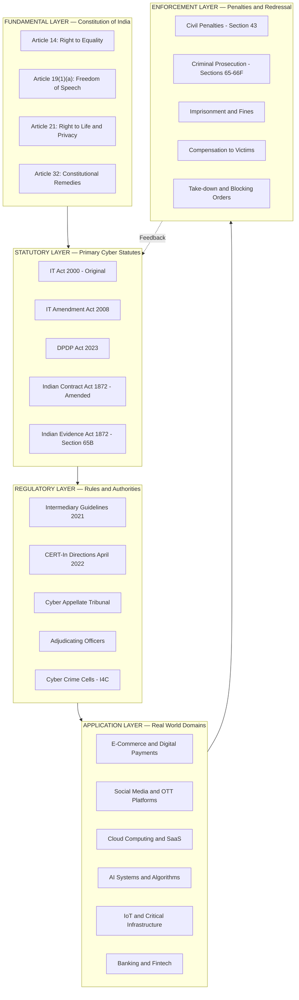
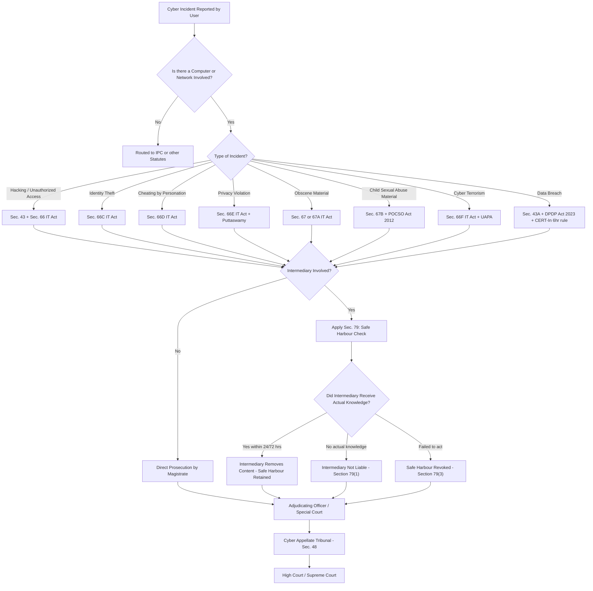

# Fundamentals of Cyber Law and Cyber Space:-  Introduction to cyber law

<!-- SECTION_1_START -->

# Fundamentals of Cyber Law and Cyber Space — Introduction to Cyber Law

## 1. Core Technical Definition

**Cyber Law** is the branch of legal jurisprudence that governs the digital ecosystem, encompassing all regulatory frameworks, statutory provisions, judicial precedents, and ethical standards that regulate the conduct of persons, organizations, and states in **Cyberspace**. It deals with crimes, contracts, intellectual property, privacy, and constitutional rights as they manifest in the networked, digital environment.

**Cyberspace**, a term coined by **William Gibson** in his 1982 short story *Burning Chrome* (and popularized in his 1984 novel *Neuromancer*), refers to the notional, intangible, interactive environment in which digital communication, computation, and data exchange occur over computer networks—most notably the Internet. It is a **borderless, jurisdiction-less, and time-independent** virtual realm.

> [!IMPORTANT]
> **KTU 2024 Syllabus Definition:** Cyber Law is the body of law that deals with the Internet, cyberspace, digital transactions, electronic communications, e-commerce, online privacy, intellectual property, software/hardware crimes, and the rights and obligations of persons interacting through digital technology.

### Conceptual Analogy / Intuition

Think of **Cyberspace** as a *massive, virtual shopping mall* that is open 24×7, has no walls, no doors, no national boundaries, and no security guards at the entry. Anyone, from anywhere, can walk in, browse, transact, communicate, and even commit mischief—without the mall owner being able to physically stop them. **Cyber Law** is the *set of legal signboards, CCTV cameras, security personnel, and courtroom rules* that this mall installs to ensure order, fairness, privacy, and redressal. Just as traffic law governs physical roads, **Cyber Law governs the "information superhighway."**

### Why Cyber Law Exists — The 5 Pillars of Necessity

1. **Anonymity & Identity Abuse** — Users can hide behind digital masks, enabling fraud and impersonation.
2. **Borderless Transactions** — A crime committed in India can originate from a server in Russia and harm a user in the USA.
3. **Digital Evidence Vulnerability** — Electronic records can be altered, deleted, or forged without trace.
4. **E-Commerce Explosion** — Online contracts, digital payments, and electronic signatures need legal sanctity.
5. **Fundamental Rights in the Digital Age** — Articles **14, 19, 21** of the Indian Constitution (Right to Equality, Freedom of Speech, Right to Life & Privacy) extend into cyberspace.

> [!NOTE]
> **Historical Milestones — Timeline of Indian Cyber Law**
> - **1996** — UN Commission on International Trade Law (UNCITRAL) adopts the *Model Law on Electronic Commerce*.
> - **1998** — Ministry of Commerce, Government of India, constitutes the *Electronics Commerce Act, 1998* working group.
> - **2000** — The **Information Technology Act, 2000** (IT Act) is enacted on **9 June 2000** and notified on **17 October 2000**—India's first dedicated cyber law.
> - **2008** — The **Information Technology (Amendment) Act, 2008** is passed, addressing data privacy, cyber terrorism, and child pornography.
> - **2017** — Supreme Court of India declares the *Right to Privacy as a Fundamental Right* (Justice K.S. Puttaswamy v. Union of India).
> - **2023** — The **Digital Personal Data Protection Act, 2023** (DPDP Act) is enacted as India's first comprehensive data protection statute.

### Key Terminology in Cyber Law

| Term | Meaning |
|---|---|
| **Cyberspace** | The virtual environment of networked computers and digital communications. |
| **Cybercrime** | Any illegal act involving a computer, network, or digital device as the object, subject, or instrument of the crime. |
| **E-Contract** | A contract formed electronically, valid under the IT Act, 2000 (Sections 10–12). |
| **Digital Signature** | Cryptographic mechanism used to authenticate electronic records (Section 3, IT Act). |
| **Data** | Any representation of information, knowledge, facts, concepts, or instructions. |
| **Intermediary** | Any person who on behalf of another receives, stores, or transmits electronic records (e.g., ISPs, social media platforms) — Section 2(1)(w). |
| **Phishing** | A fraudulent attempt to obtain sensitive information by disguising as a trustworthy entity. |
| **Hacking** | Unauthorized access to a computer system, network, or data (Section 66, IT Act). |

> [!VISUALIZATION CONTROL]
> **Concept:** The concentric relationship between Cyberspace, Cyber Law, Cybercrime, and Cyber Ethics.
> **Visual Description:** Imagine a series of concentric circles. The innermost circle is **Cyberspace** (the technological layer). Surrounding it is **Cyber Law** (the regulatory layer). Outside that is **Cybercrime** (the violation space that cyber law seeks to penalize). The outermost encompassing layer is **Cyber Ethics** (the moral and social framework that guides user behavior). This "Concentric Governance Model" is foundational to understanding the discipline.
> **Desmos / GeoGebra Input:** Not numerically applicable; conceptual layered Venn diagram.

### Scope of Cyber Law

1. **Digital Contracts & E-Commerce Law** — Electronic records, e-signatures, digital payments.
2. **Intellectual Property in Cyberspace** — Software copyright, domain name disputes, patents in AI/algorithms.
3. **Privacy & Data Protection** — Personal data handling, consent, cross-border data flows.
4. **Cybercrime & Penal Provisions** — Hacking, identity theft, phishing, cyber terrorism, obscenity.
5. **Jurisdictional & International Law** — Cross-border investigation, extradition, mutual legal assistance treaties (MLATs).
6. **Regulatory Compliance** — IT Act 2000/2008, DPDP Act 2023, Indian Penal Code (IPC) related sections, Companies Act 2013.
7. **Emerging Technologies** — AI liability, blockchain regulation, IoT security law, autonomous systems.

> [!IMPORTANT]
> **Key Statutory Reference:** The **Information Technology Act, 2000 (Act No. 21 of 2000)** is the *primary cyber law statute in India*. It was enacted based on the **UNCITRAL Model Law on Electronic Commerce (1996)**. The IT Act has **13 Chapters, 94 Sections** (original), and contains **2 Schedules** (the First Schedule lists documents to which the Act shall not apply; the Second Schedule lists amendments to other laws).

<!-- SECTION_1_END -->

<!-- SECTION_2_START -->

# Deep Theoretical Analysis — Cyber Law Framework

## 2. Theoretical Foundations of Cyber Law

### 2.1 The Triad of Digital Governance

Cyber Law is built on three interlocking pillars that engineers and computer scientists must understand:

1. **Substantive Law** — Defines what is *legal or illegal* in cyberspace (e.g., Section 66 of IT Act criminalizes hacking).
2. **Procedural Law** — Defines *how legal processes operate* in cyberspace (e.g., digital evidence rules under the **Indian Evidence Act, 1872**, amended by the IT Act).
3. **Remedial Law** — Provides the *machinery for enforcement* and compensation (e.g., adjudicating officers, cyber appellate tribunals, criminal courts).

### 2.2 Jurisdictional Challenges in Cyberspace

Traditional legal principles of jurisdiction assume a *physical location* where a crime occurs. In cyberspace, this breaks down:

$$J_{cyber} = \{J_{\text{territorial}}, J_{\text{subject-matter}}, J_{\text{personal}}, J_{\text{universal}}\}$$

where:
- $J_{\text{territorial}}$ — Crime occurred within national borders (server or victim located in India).
- $J_{\text{subject-matter}}$ — Subject matter involves state interests (e.g., cyber terrorism, national security).
- $J_{\text{personal}}$ — Offender is a citizen or resident of the nation.
- $J_{\text{universal}}$ — Crime is so grave (e.g., child pornography) that any nation may prosecute.

> [!NOTE]
> **Section 75 of the IT Act, 2000** (as amended in 2008) gives **extra-territorial jurisdiction** to Indian courts, allowing prosecution of offences committed outside India by *any person, irrespective of nationality*, if the offence involves a computer, computer system, or computer network located in India.

### 2.3 Constitutional Backbone of Cyber Law in India

The Indian Constitution provides the foundational rights that cyber law must protect and balance:

| Article | Right | Cyber Law Implication |
|---|---|---|
| **Article 14** | Right to Equality | Non-discrimination in algorithmic decisions, AI fairness. |
| **Article 19(1)(a)** | Freedom of Speech & Expression | Online content regulation, hate speech laws, Section 69A blocking orders. |
| **Article 19(1)(g)** | Freedom to Practice Profession | E-commerce, digital trade, gig economy. |
| **Article 21** | Right to Life & Personal Liberty | **Right to Privacy** (Puttaswamy, 2017), data protection. |
| **Article 32** | Right to Constitutional Remedies | PILs against digital rights violations. |

### 2.4 The IT Act 2000 — Architecture of the Statute

The IT Act is structured as follows:

$$\text{IT Act, 2000} = \underbrace{\text{Ch. I (Sec. 1–2)}}_{\text{Preliminary}} + \underbrace{\text{Ch. II (Sec. 3–10)}}_{\text{Digital Signatures}} + \underbrace{\text{Ch. III (Sec. 11–13)}}_{\text{Electronic Records}} + \underbrace{\text{Ch. IV (Sec. 14–16)}}_{\text{Secure Digital Signatures}}$$
$$+ \underbrace{\text{Ch. V (Sec. 17–34)}}_{\text{Controller, Certifying Authorities}} + \underbrace{\text{Ch. VI (Sec. 35–45)}}_{\text{Penalties \& Adjudication}} + \underbrace{\text{Ch. VII (Sec. 46–66)}}_{\text{Offences}}$$
$$+ \underbrace{\text{Ch. VIII (Sec. 67–74)}}_{\text{Offences contd. + Intermediary}} + \underbrace{\text{Ch. IX (Sec. 75–77)}}_{\text{Jurisdiction}} + \underbrace{\text{Ch. X–XIII (Sec. 78–94)}}_{\text{Misc., Appellate Tribunal, Special Courts}}$$

### 2.5 Key Definitions under the IT Act, 2000

| Section | Term | Definition (Simplified) |
|---|---|---|
| **2(1)(i)** | "Access" | Gaining entry into, instructing, or communicating with a computer resource. |
| **2(1)(k)** | "Computer" | Any electronic, magnetic, optical, or other high-speed data processing device. |
| **2(1)(l)** | "Computer Network" | Interconnection of one or more computers through telecommunication links. |
| **2(1)(n)** | "Digital Signature" | Authentication of any electronic record by a subscriber via a digital signature certificate. |
| **2(1)(o)** | "Electronic Form" | Information generated, sent, received, or stored in magnetic, optical, or any other electronic medium. |
| **2(1)(r)** | "Electronic Record" | Data, record, or data generated, image, or sound stored in any electronic form. |
| **2(1)(t)** | "Information" | Includes data, text, images, sound, voice, codes, computer programmes, software, and databases. |
| **2(1)(w)** | "Intermediary" | Any entity that receives, stores, or transmits electronic records on behalf of another (ISPs, search engines, social media). |
| **2(1)(za)** | "Secure System" | Computer hardware/software/firmware designed to prevent unauthorized access. |

### 2.6 KTU High-Yield Formula Sheet (Cheat Sheet)

> [!IMPORTANT]
> **KTU Exam Tip:** The following table consolidates the *most frequently tested* definitions, sections, and principles in the "Introduction to Cyber Law" topic.

| # | Concept | Statutory Reference | Engineering / Tech Connection |
|---|---|---|---|
| 1 | **Electronic Record = Legal Evidence** | Sec. 3, IT Act | Hashing, digital signatures, blockchain evidence. |
| 2 | **Legal Recognition of Digital Signatures** | Sec. 5, IT Act | Public Key Infrastructure (PKI), RSA, ECC. |
| 3 | **Retention of Electronic Records** | Sec. 7, IT Act | Database archival, WORM storage. |
| 4 | **Auditing of Electronic Records** | Sec. 7A, IT Act | Digital forensics, audit logs. |
| 5 | **Penalty for Damage to Computer Systems** | Sec. 43, IT Act | Cybersecurity incident reporting. |
| 6 | **Compensation for Failure to Protect Data** | Sec. 43A, IT Act | Data protection by design, encryption. |
| 7 | **Computer-Related Offences** | Sec. 66–66F, IT Act | Hacking, cyber terrorism, phishing. |
| 8 | **Publication of Obscene Material** | Sec. 67, IT Act | Content moderation, intermediary liability. |
| 9 | **Intermediary Safe Harbour** | Sec. 79, IT Act | Notice-and-takedown compliance. |
| 10 | **Extra-Territorial Jurisdiction** | Sec. 75, IT Act | Cross-border cloud jurisdiction, GDPR mapping. |
| 11 | **Adjudicating Officer Appointment** | Sec. 46, IT Act | Quasi-judicial dispute resolution. |
| 12 | **Cyber Appellate Tribunal** | Sec. 48–64, IT Act | Appeals from adjudicating officer orders. |
| 13 | **Power to Intercept Communications** | Sec. 69, IT Act | Lawful interception, surveillance law. |
| 14 | **Right to Privacy as Fundamental Right** | Puttaswamy v. UoI (2017) | DPIA, privacy by design. |
| 15 | **Data Protection Framework** | DPDP Act, 2023 | Cross-border data flow, consent management. |

### 2.7 Real-World Engineering Utility

| Domain | Application of Cyber Law Knowledge |
|---|---|
| **Software Development** | Designing privacy-compliant systems (data minimization, purpose limitation). |
| **Cloud Computing** | Negotiating data processing agreements, understanding cross-border data transfer restrictions. |
| **AI/ML Engineering** | Algorithmic accountability, explainability requirements (EU AI Act, India AI principles). |
| **Network Security** | Compliance with CERT-In Directions (Apr 2022) on cybersecurity incident reporting within 6 hours. |
| **IoT Development** | Security-by-design mandates under evolving IoT security standards. |
| **Blockchain & Web3** | Smart contract legal status, DAO liability, cryptocurrency regulation (RBI, SEBI, FIU-IND). |
| **Cybersecurity Audit** | Legal admissibility of forensic evidence, chain-of-custody requirements. |

> [!NOTE]
> **Key Case Law (Pillars of Cyber Law in India):**
> - ***Vinit Kumar v. Central Public Information Officer (2010)*** — Right to Information extends to digital records.
> - ***Avnish Bajaj v. State (Delhi) (2005)*** — Baazee.com case; intermediary liability for user-generated content.
> - ***Shreya Singhal v. Union of India (2015)*** — Section 66A of IT Act struck down as unconstitutional; "chilling effect" on free speech.
> - ***Justice K.S. Puttaswamy v. Union of India (2017)*** — Nine-judge bench declares Right to Privacy as a Fundamental Right under Article 21.
> - ***Internet and Mobile Association of India v. RBI (2020)*** — Supreme Court strikes down RBI circular banning cryptocurrency bank accounts (subject to regulatory direction).
> - ***Anuradha Bhasin v. Union of India (2020)*** — Kashmir internet shutdown case; *proportionality test* applied to digital restrictions.

<!-- SECTION_2_END -->

<!-- SECTION_3_START -->

# Step-by-Step Analytical Breakdown — Cyber Law Reasoning

## 3. Solving Cyber Law Problems: A Structured Approach

### 3.1 The IRAC Framework (Issue, Rule, Application, Conclusion)

For any cyber law problem (case analysis, statutory question, or scenario), engineers should follow the **IRAC method**—a standard legal-analytical technique adapted for non-law students.

| Step | Description | Example |
|---|---|---|
| **I — Issue** | Identify the legal/ethical question raised. | "Is a screenshot of a WhatsApp chat legally admissible as evidence in an Indian court?" |
| **R — Rule** | State the applicable law/section/principle. | "Yes, under Section 65B of the Indian Evidence Act (as amended by IT Act, 2000)..." |
| **A — Application** | Apply the rule to the facts of the problem. | "The chat is an electronic record, accompanied by a Section 65B certificate, certifying the device's integrity..." |
| **C — Conclusion** | State the final legal outcome. | "Therefore, the chat is admissible provided the certificate accompanies the evidence." |

### 3.2 Worked Example: Section 65B Certificate Problem

**Scenario:** A software engineer in Kerala, Rahul, sues his ex-employer for unpaid wages. The only evidence of the employment contract is an email exchange archived in his Gmail account. The opposing counsel argues that the email is not "original evidence" since it is a printout.

**Step-by-Step Legal-Technical Solution:**

1. **Identify the Issue:**
   - Is a printout of an email admissible as primary evidence in a court of law in India?

2. **State the Applicable Rule:**
   - **Section 65B of the Indian Evidence Act, 1872** (inserted by the IT Act, 2000) provides that any information contained in an electronic record which is printed on a *paper, stored, recorded, or copied in optical or magnetic media* shall be deemed to be also a *document*, provided a certificate under **Section 65B(4)** is furnished.

3. **Apply the Rule to Facts:**
   - The email is an "electronic record" as per **Section 2(1)(r) of the IT Act, 2000**.
   - The printout is admissible as primary evidence *if* accompanied by a certificate under **Section 65B(4)**.
   - The certificate must be signed by a *person occupying a responsible official position* in relation to the operation of the relevant device (e.g., Gmail's legal compliance officer, or Rahul himself, since he is the "occupier" of the device that produced the printout).
   - The certificate must state: (a) the electronic record was produced at a specific time, (b) the device was in regular use, (c) the record was produced by the device in the ordinary course of activities.

4. **Conclude:**
   - Rahul can file the email printout as primary evidence provided he also files a **Section 65B(4) certificate**, signed by a responsible person, confirming the integrity and provenance of the email.

> [!IMPORTANT]
> **Engineering Connection:** This is exactly analogous to a *digital forensics chain-of-custody log*. The certificate preserves the integrity of the digital artifact (analogous to cryptographic hashing and timestamps) so that the court can rely on the evidence. Modern engineers must design systems that produce such *auditable, tamper-evident logs* by default.

### 3.3 Comparative Analysis: IT Act, 2000 vs. IT Act, 2008 (Amendment)

| Aspect | IT Act, 2000 (Original) | IT Act, 2008 (Amendment) |
|---|---|---|
| **Primary Focus** | E-commerce legality, digital signatures. | Cybercrime, data privacy, intermediary regulation. |
| **Sections Added** | 94 (original) | 12+ new sections (66A–66F, 69A–69B, 79 amendments, etc.). |
| **New Offences** | Limited (Sec. 65, 66). | Hacking, identity theft, cyber terrorism, obscenity, child pornography. |
| **Data Protection** | Implicit (Sec. 43A). | Strengthened (Sec. 43A expanded). |
| **Intermediary Liability** | Not addressed. | **Section 79** introduced — safe harbour with conditions. |
| **Section 66A** | Did not exist. | Introduced in 2008, struck down in 2015 (*Shreya Singhal*). |
| **Penalty Cap** | ₹1 crore max. | Increased to ₹5 crore in certain cases. |
| **Cyber Appellate Tribunal** | Established (Sec. 48). | Retained but jurisdiction rebalanced. |
| **Sections 66B–66E** | Did not exist. | Added: dishonestly receiving stolen computer resource, identity theft, cheating by personation using computer resource. |
| **Section 66F** | Did not exist. | Added: Cyber terrorism (punishable with imprisonment up to life). |

### 3.4 Decision Matrix: When Does a Cyber Offence Occur?

A *decision tree* to determine if a digital act constitutes a cybercrime under the IT Act:

| # | Question | Yes → Next Step | No → Next Step |
|---|---|---|---|
| 1 | Was a computer, computer network, or electronic record involved? | Proceed to Q2. | Not a cyber offence under IT Act. May be under IPC. |
| 2 | Was there *unauthorized access* or *damage* to the system? | Likely **Sec. 43 / Sec. 66** (Hacking). | Proceed to Q3. |
| 3 | Was data *stolen*, *altered*, or *used for fraud*? | Likely **Sec. 66C / 66D** (Identity theft, cheating). | Proceed to Q4. |
| 4 | Was *obscene material* transmitted or published? | **Sec. 67 / 67A / 67B** (Obscenity, child pornography). | Proceed to Q5. |
| 5 | Was the act *politically or ideologically motivated* to threaten sovereignty? | **Sec. 66F** (Cyber terrorism). | Proceed to Q6. |
| 6 | Was an *intermediary* facilitating the offence? | **Sec. 79** analysis — safe harbour conditions. | Civil remedy / Other statutes. |

### 3.5 Worked Example: Identifying the Correct Section

**Scenario:** Priya, a 17-year-old student, discovers that her classmate's Instagram account was hacked. The hacker posted her classmate's personal photographs with abusive captions. Priya wants to file a complaint.

**Step-by-Step Section Identification:**

1. **Hack of Instagram account** → Unauthorized access → **Section 66, IT Act (Hacking with computer system)**.
2. **Posting personal photographs without consent** → Violation of privacy + potential obscenity → **Section 66E (Voyeurism, if intimate images) or Section 67 (Obscene material)**.
3. **If the victim is a minor (under 18)** → **Section 67B (Publishing/soliciting sexually explicit material involving children)** + **POCSO Act, 2012** + **Section 75 of JJ Act, 2015**.
4. **Intermediary (Instagram) liability** → **Section 79** — Instagram is an intermediary; if it fails to remove content upon receiving actual knowledge (court order or government notification), it loses safe harbour.
5. **Reporting** → File FIR with local police cyber cell, or complain to **https://cybercrime.gov.in** (Indian Cyber Crime Coordination Centre, I4C) under **Ministry of Home Affairs**.

> [!NOTE]
> **Forensic Tip:** The victim should immediately take **timestamped screenshots with URL bar visible** (proves URL provenance), preserve the original file metadata, and request Instagram via the **Information Technology (Intermediary Guidelines and Digital Media Ethics Code) Rules, 2021** to take down the content within 24 hours for sensitive content.

### 3.6 Algorithmic Analogy: The "Cyber Law State Machine"

A computer-science perspective on the legal lifecycle of a cyber dispute:

$$\text{State}_{\text{Dispute}} = f(\text{Incident}, \text{Detection}, \text{Reporting}, \text{Investigation}, \text{Adjudication}, \text{Appeal})$$

| State | Trigger | Action | Time Limit (Indicative) |
|---|---|---|---|
| **S0: Incident** | Cyber event occurs (hack, leak, fraud). | Automated detection (IDS/IPS). | T = 0 |
| **S1: Detection** | SIEM/EDR triggers alert. | Forensic preservation (Sec. 65B certificate). | T = 0 to 6 hrs (CERT-In Directions). |
| **S2: Reporting** | Internal compliance + CERT-In + Police. | Report to **cybercrime.gov.in** + nodal officer. | T = 6 hrs (CERT-In, 2022). |
| **S3: Investigation** | Law enforcement engages. | Sec. 65B certificate, forensic image (dd, FTK), chain of custody. | 30–90 days (typical). |
| **S4: Adjudication** | Adjudicating Officer / Magistrate. | Evidence presentation, Sec. 66/67 hearing. | 6–12 months. |
| **S5: Appeal** | Cyber Appellate Tribunal (under Sec. 48) / High Court. | Statutory appeal under Sec. 57 of IT Act. | As per tribunal rules. |

> [!IMPORTANT]
> **KTU Board Exam Tip:** When asked *"Explain the role of intermediaries under the IT Act"*, students must cite **Section 2(1)(w)** (definition) + **Section 79** (safe harbour) + the **Intermediary Guidelines and Digital Media Ethics Code Rules, 2021** (operative rules). The 2021 Rules introduced **grievance officers, traceability of messages, and category-based content takedown timelines** (24 hours for nudity/sexual content, 72 hours for others).

### 3.7 Engineering Code: Compliance Audit Pseudocode

For engineering students, here is a **pseudocode implementation of a Section 79 / Intermediary Guidelines, 2021 compliance check** for a digital platform:

```python
from datetime import datetime, timedelta
from typing import Optional, Tuple
import logging

logging.basicConfig(level=logging.INFO, format="%(asctime)s | %(levelname)s | %(message)s")

class IntermediaryCompliance:
    """
    Implements India IT Act Section 79 + Intermediary Guidelines 2021 compliance logic.
    """

    CONTENT_CATEGORIES = {
        "nudity_sexual": 24,         # hours — Intermediary Rules 2021
        "hate_speech": 72,
        "defamation": 72,
        "copyright": 72,
        "general_illegal": 72,
        "court_order": 24,
        "government_block": 24,
    }

    def __init__(self, content_id: str, user_report_time: datetime):
        self.content_id = content_id
        self.report_time = user_report_time
        self.action_log: list = []

    def evaluate_compliance(
        self,
        category: str,
        court_order: Optional[dict] = None
    ) -> Tuple[str, datetime]:
        if category not in self.CONTENT_CATEGORIES:
            logging.error(f"Unknown content category: {category}")
            return ("REJECTED", datetime.min)

        # Highest priority: court/government order
        if court_order is not None:
            deadline_hours = self.CONTENT_CATEGORIES["court_order"]
            self.action_log.append(f"Court order received: {court_order}")
        else:
            deadline_hours = self.CONTENT_CATEGORIES[category]

        takedown_deadline = self.report_time + timedelta(hours=deadline_hours)
        self.action_log.append(
            f"Category={category} | Deadline={takedown_deadline.isoformat()}"
        )
        logging.info(f"Action logged for content_id={self.content_id}")
        return ("COMPLIANT_WINDOW", takedown_deadline)

    def publish_grievance_officer_contact(self, name: str, email: str) -> None:
        if not name or "@" not in email:
            raise ValueError("Invalid grievance officer details per Rule 4(1), IT Rules 2021.")
        self.action_log.append(f"Grievance Officer: {name} <{email}>")
        logging.info("Grievance officer registered per IT Rules 2021, Rule 4(1).")
```

> [!NOTE]
> The above pseudocode mirrors the legal obligations of an *intermediary* in India. Engineers designing platforms with Indian users must build such compliance modules from day one — a "privacy and compliance by design" approach.

<!-- SECTION_3_END -->

<!-- SECTION_4_START -->

# Structural Diagrams & Schematics

## 4. Conceptual Architecture of Cyber Law

### 4.1 Mermaid Diagram: The Cyber Law Ecosystem



### 4.2 Mermaid Diagram: Information Technology Act 2000 — Chapter-wise Topology


### 4.3 Mermaid Diagram: Cyber Law Decision Flow for a Reported Incident



### 4.4 Mermaid Diagram: Sources of Cyber Law

```mermaid
flowchart TB
    SRC["Sources of Cyber Law in India"]
    SRC --> S1["Primary Sources"]
    SRC --> S2["Secondary Sources"]
    SRC --> S3["International Sources"]

    S1 --> S1A["Constitution of India"]
    S1 --> S1B["IT Act 2000 and 2008 Amendment"]
    S1 --> S1C["Indian Penal Code 1860 - Sections 463, 477A, 420, 507"]
    S1 --> S1D["Indian Evidence Act 1872 - Section 65B"]
    S1 --> S1E["DPDP Act 2023"]
    S1 --> S1F["Copyright Act 1957"]

    S2 --> S2A["Judicial Precedents - Shreya Singhal, Puttaswamy"]
    S2 --> S2B["Government Notifications and Rules"]
    S2 --> S2C["CERT-In Advisories"]
    S2 --> S2D["Doctrine of Public Policy"]

    S3 --> S3A["UNCITRAL Model Law on E-Commerce 1996"]
    S3 --> S3B["Budapest Convention on Cybercrime 2001"]
    S3 --> S3C["GDPR - EU General Data Protection Regulation 2016"]
    S3 --> S3D["ASEAN Framework on Personal Data Protection 2016"]
    S3 --> S3E["Universal Declaration of Human Rights - Art 12, 19"]
```



> [!NOTE]
> **Diagram Interpretation:** These Mermaid diagrams collectively form a "Topological Map of Cyber Law" — the *fundamental* layer underpins the *statutory* layer, which is operationalized by the *regulatory* layer, applied in real-world *application* domains, and enforced through the *enforcement* layer. This 5-layer model is widely used in cyber law textbooks and KTU-recommended references.

<!-- SECTION_4_END -->

<!-- SECTION_5_START -->

# KTU 2024 Scheme Examination Question Bank

## 5. Practice Questions Modelled on KTU Past Patterns

### Part A — Short Answer Questions (3 Marks Each)

#### **Question 1: Define Cyberspace. Who coined the term and when?**
> **[KTU University Exam — July 2024 | CO1 | Remember]**

**Model Answer (3 Marks):**
- *Definition of Cyberspace (1 Mark):* Cyberspace refers to the intangible, interactive, and virtual environment in which digital communication, data exchange, and online interactions occur over computer networks, particularly the Internet.
- *Coined by whom and when (1 Mark):* The term was coined by **William Gibson** in his **1982** short story *Burning Chrome* and was subsequently popularized in his **1984** novel *Neuromancer*.
- *Key characteristics (1 Mark):* Cyberspace is **borderless**, **time-independent**, and **jurisdiction-less** — making it a unique domain that traditional legal frameworks struggle to govern.

---

#### **Question 2: List any three offences defined under the Information Technology Act, 2000, with their section numbers.**
> **[KTU University Exam — Dec 2023 | CO1, CO2 | Remember/Understand]**

**Model Answer (3 Marks — 1 Mark each):**
1. **Hacking with computer system** — Section 66, IT Act, 2000 (as amended in 2008). Punishment: Imprisonment up to 3 years or fine up to ₹5 lakh, or both.
2. **Identity theft** — Section 66C, IT Act, 2000 (as amended in 2008). Punishment: Imprisonment up to 3 years and fine up to ₹1 lakh.
3. **Cyber terrorism** — Section 66F, IT Act, 2000 (as amended in 2008). Punishment: Imprisonment that may extend to **life imprisonment**.

---

### Part B — Long Answer Questions (14 Marks — Internal Choice)

> **INSTRUCTIONS (KTU Pattern):** Answer ANY ONE full question from each module. Each Part B question carries 14 marks, split into sub-parts (a) 7 marks and (b) 7 marks.

---

#### **Question 3A: Explain the Information Technology Act, 2000 in detail, with focus on its objectives, salient features, and significance in the digital era.**

> **[KTU University Exam — Dec 2023 | CO1, CO2 | Understand/Apply]**

**(a) Objectives and Salient Features of the IT Act, 2000 (7 Marks)**

**Model Answer:**

**Objectives of the IT Act, 2000 (3 Marks):**
1. **Legal recognition of e-commerce** — To provide legal sanctity to electronic records, digital signatures, and online transactions, thereby facilitating the growth of e-commerce in India.
2. **Facilitate electronic filing of documents** — To enable electronic filing of documents with government departments, the Registrar of Companies, and other agencies.
3. **Penalize cyber offences** — To deter and punish cybercrimes such as hacking, tampering with computer source documents, and publishing of obscene material.
4. **Establish regulatory framework** — To appoint a Controller of Certifying Authorities (CCA) and designate Adjudicating Officers for dispute resolution.
5. **Conformity with UNCITRAL Model Law** — To align Indian law with the **UNCITRAL Model Law on Electronic Commerce, 1996**, enabling international e-commerce interoperability.

**Salient Features (4 Marks):**
1. **Recognition of Electronic Records** (Sec. 4) — Any information stored, generated, or received in electronic form is recognized as a legal record.
2. **Legal Recognition of Digital Signatures** (Sec. 5) — Digital signatures are legally equivalent to physical signatures.
3. **Appointment of Controller of Certifying Authorities (CCA)** (Sec. 17) — The CCA regulates the issuance of digital signature certificates.
4. **Penalties and Adjudication** (Sec. 43–47) — Civil penalties up to ₹1 crore and criminal prosecution for damages to computer systems.
5. **Cyber Appellate Tribunal** (Sec. 48) — An appellate authority for hearing appeals against orders of the Adjudicating Officer.
6. **Amendment of Other Laws** (Sec. 91 + Second Schedule) — The IT Act amends the Indian Evidence Act, 1872 (Sec. 65B), the Indian Penal Code, 1860, and the Bankers' Books Evidence Act, 1891, to make them compatible with electronic records.

**[Valuation Key Points — 7 Marks: 3 (Objectives) + 4 (Features)]**

---

**(b) Significance of the IT Act, 2000 in the Digital Era (7 Marks)**

**Model Answer:**

1. **E-Commerce Enablement (2 Marks):**
   - The IT Act gave legal validity to electronic contracts, e-signatures, and online payments. This enabled the explosive growth of platforms like **Flipkart, Amazon India, Paytm, PhonePe, and UPI-based payment systems**.
   - **Section 10A** validates contracts formed through electronic means. The **Information Technology (Reasonable Security Practices and Procedures and Sensitive Personal Data or Information) Rules, 2011** provide the data-handling framework.

2. **Cybercrime Deterrence (2 Marks):**
   - The **2008 Amendment** introduced offences like cyber terrorism (Sec. 66F), identity theft (Sec. 66C), and obscenity (Sec. 67, 67A, 67B). The 2008 amendment also increased penalties from ₹1 crore to **₹5 crore** in certain cases.
   - The Act created the legal basis for **Cyber Crime Cells** across Indian states and the **Indian Cyber Crime Coordination Centre (I4C)** under the Ministry of Home Affairs.

3. **Digital Governance & E-Governance (1 Mark):**
   - The IT Act paved the way for **e-filing of income tax returns, e-procurement, digital land records, and DigiLocker** — all of which rely on the legal recognition of electronic records under the Act.

4. **Data Protection Foundation (1 Mark):**
   - Section 43A (introduced in 2008) requires body corporates handling *sensitive personal data* to maintain "reasonable security practices" — this was a precursor to the comprehensive **Digital Personal Data Protection Act, 2023**.

5. **Intermediary Liability & Safe Harbour (1 Mark):**
   - Section 79 (introduced in 2008) provided **safe harbour protection to intermediaries** (ISPs, hosting providers, social media platforms) provided they exercised due diligence. The **Intermediary Guidelines and Digital Media Ethics Code Rules, 2021** operationalize this.

**[Valuation Key Points — 7 Marks: 2 + 2 + 1 + 1 + 1]**

---

#### **Question 3B: Discuss the concept, scope, and importance of cyber law in modern society. How does it balance individual rights with societal interests?**

> **[KTU University Exam — July 2024 | CO1, CO3 | Understand/Apply/Analyze]**

**(a) Concept and Scope of Cyber Law (7 Marks)**

**Model Answer:**

**Concept of Cyber Law (3 Marks):**
- Cyber Law is the body of legal rules, regulations, and judicial principles that govern the digital environment, including the Internet, computer networks, software, electronic communications, and digital transactions.
- It encompasses *substantive law* (defines offences), *procedural law* (how to investigate and prosecute), and *remedial law* (compensation, appeals, remedies).
- The **principal statute in India is the Information Technology Act, 2000** (as amended in 2008), supplemented by the **DPDP Act, 2023**, the **Indian Contract Act, 1872**, the **Indian Evidence Act, 1872**, and the **Indian Penal Code, 1860**.

**Scope of Cyber Law (4 Marks):**
1. **E-Commerce and Digital Contracts** — Electronic records, e-signatures, online payments, consumer protection in digital markets.
2. **Cybercrime** — Hacking (Sec. 66), identity theft (Sec. 66C), cyber terrorism (Sec. 66F), obscenity (Sec. 67), phishing, malware, ransomware.
3. **Data Protection and Privacy** — Personal data handling, consent, cross-border data transfer (DPDP Act, 2023).
4. **Intellectual Property in Cyberspace** — Software copyright, domain name disputes, software patents, trade secrets.
5. **Intermediary Liability** — Liability of ISPs, social media, search engines, and cloud providers (Sec. 79).
6. **Cyber Terrorism and National Security** — Critical infrastructure protection, lawful interception (Sec. 69, 69A).
7. **Jurisdictional Issues** — Cross-border crimes, extra-territorial jurisdiction (Sec. 75), international cooperation (MLATs, Budapest Convention).
8. **Emerging Technologies** — AI regulation, blockchain/crypto regulation, IoT security, autonomous vehicles, drones.

**[Valuation Key Points — 7 Marks: 3 (Concept) + 4 (Scope)]**

---

**(b) Balancing Individual Rights with Societal Interests in Cyber Law (7 Marks)**

**Model Answer:**

1. **Right to Privacy vs. National Security (2 Marks):**
   - The **Puttaswamy judgment (2017)** declared the Right to Privacy as a Fundamental Right under Article 21.
   - However, Sections 69 and 69B of the IT Act empower the government to *intercept, monitor, and decrypt* communications on grounds of sovereignty, integrity, defense, and public order.
   - The **proportionality test** (laid down in *Anuradha Bhasin v. UoI, 2020*) requires that any restriction on digital rights must be *necessary, least intrusive, and balanced*.

2. **Freedom of Speech vs. Hate Speech and Obscenity (2 Marks):**
   - **Section 66A of the IT Act (introduced 2008)** — originally intended to combat offensive online messages — was struck down as **unconstitutional** in ***Shreya Singhal v. Union of India (2015)*** for having a "chilling effect" on free speech.
   - However, Sections 67, 67A, and 67B of the IT Act *survive* — they criminalize publication of obscene material, sexually explicit content, and child pornography, balancing Article 19(1)(a) with Article 19(2) reasonable restrictions.

3. **Intermediary Safe Harbour vs. Victim Protection (1.5 Marks):**
   - Section 79 protects intermediaries from liability for user-generated content *only if* they act expeditiously upon receiving "actual knowledge" of unlawful content.
   - The **Intermediary Rules, 2021** require intermediaries to appoint grievance officers, enable traceability of messages, and remove content within 24–72 hours, balancing platform immunity with victim redressal.

4. **Data Protection vs. Innovation (1.5 Marks):**
   - The **DPDP Act, 2023** mandates consent before processing personal data, grants data principals rights of access, correction, and erasure.
   - However, the Act also provides **"legitimate uses"** exemptions for medical emergencies, employment, and government functions — balancing individual privacy with societal needs.

**[Valuation Key Points — 7 Marks: 2 + 2 + 1.5 + 1.5]**

---

### KTU Examiner's Valuation Warning / Pitfall Callout

> [!WARNING]
> **Common Mistakes That Cost Marks in Cyber Law Questions:**
>
> 1. **Forgetting section numbers** — Always cite the *exact Section number* (e.g., "Sec. 66, IT Act 2000") when referencing offences. **[Loss: Up to 2 marks per answer]**
> 2. **Confusing IT Act 2000 and 2008** — The *original* IT Act 2000 did **not** contain Sections 66A, 66C, 66D, 66E, 66F, or 79. These were added by the **2008 Amendment**. Students often write "Sec. 66F was in the 2000 Act" — this is factually wrong. **[Loss: 1 mark]**
> 3. **Treating the IT Act as the ONLY cyber law** — Cyber law is *not* just the IT Act. You must mention related statutes: Indian Contract Act, Indian Evidence Act (Sec. 65B), Indian Penal Code, DPDP Act 2023, Copyright Act. **[Loss: 1–2 marks]**
> 4. **Not mentioning landmark judgments** — The *Puttaswamy* (2017) and *Shreya Singhal* (2015) cases are *expectation* in any answer on privacy / free speech. **[Loss: 1 mark]**
> 5. **Missing the "constitutional angle"** — Always link back to Articles 14, 19, and 21 of the Constitution. Cyber law is not isolated from constitutional law. **[Loss: 1 mark]**
> 6. **Writing only definitions without application** — KTU 2024 scheme emphasizes *RBT Levels Apply and Analyze*. Always explain *how* the law applies to a real-world scenario. **[Loss: 2–3 marks]**
> 7. **Spelling mistakes in legal terms** — Write "Adjudicating Officer" (not "Adjudicating officer"), "Budapest Convention" (not "Budapest treaty"), "Intermediary" (not "Intermediate"). **[Loss: 0.5 mark per term]**

---

## Topic Recap & Important Things to Remember

- **Cyberspace** is the *intangible, borderless, time-independent* digital environment where networked communication occurs; the term was coined by **William Gibson in 1982**.
- **Cyber Law** is the body of law governing digital conduct, including cybercrime, privacy, e-commerce, IP, and constitutional rights in cyberspace.
- The **Information Technology Act, 2000** (enacted 9 June 2000, notified 17 October 2000) is India's **primary cyber statute**, based on the **UNCITRAL Model Law on E-Commerce, 1996**.
- The **IT (Amendment) Act, 2008** introduced critical sections: **66A (struck down 2015)**, **66C (Identity theft)**, **66D (Cheating by personation)**, **66E (Privacy violation)**, **66F (Cyber terrorism)**, **67B (Child pornography)**, **69 (Interception)**, **69A (Website blocking)**, **79 (Intermediary safe harbour)**.
- **Section 65B of the Indian Evidence Act, 1872** (inserted by IT Act) makes electronic records admissible as primary evidence, *provided* a **Section 65B(4) certificate** is furnished.
- **Section 75** gives Indian courts **extra-territorial jurisdiction** over cyber offences committed outside India that involve Indian computers/networks.
- **Article 21** (Right to Life and Personal Liberty) includes **Right to Privacy** as per *Justice K.S. Puttaswamy v. Union of India (2017)* — a 9-judge bench unanimous verdict.
- **Section 66A of the IT Act was struck down** as unconstitutional in ***Shreya Singhal v. Union of India (2015)*** — citing "chilling effect" on free speech under Article 19(1)(a).
- **Intermediary** is defined under **Section 2(1)(w)** of the IT Act. **Section 79** provides safe harbour subject to due diligence. The **Intermediary Guidelines and Digital Media Ethics Code Rules, 2021** operationalize the safe harbour conditions.
- The **Digital Personal Data Protection Act, 2023 (DPDP Act)** is India's first comprehensive data protection statute, replacing the earlier **Personal Data Protection Bill, 2019**.
- **CERT-In Directions, April 2022** mandate cyber incident reporting within **6 hours** of detection, synchronized clocks, and KYC for VPN/Cloud providers.
- **Cyber Appellate Tribunal** (Sec. 48, IT Act) hears appeals against orders of the Adjudicating Officer. The Tribunal is currently being reconstituted as **Telecom Disputes Settlement and Appellate Tribunal (TDSAT)** exercises certain cyber appellate functions.
- The **Budapest Convention on Cybercrime (2001)** is the *first international treaty* on cybercrime. India is **not** a signatory but is in the process of becoming one.
- **Key offences to remember with punishments:**
  - **Sec. 66** (Hacking): 3 years / ₹5 lakh
  - **Sec. 66C** (Identity theft): 3 years / ₹1 lakh
  - **Sec. 66D** (Cheating by personation): 3 years / ₹1 lakh
  - **Sec. 66E** (Privacy violation): 3 years / ₹2 lakh
  - **Sec. 66F** (Cyber terrorism): **Life imprisonment**
  - **Sec. 67** (Obscenity): 5 years / ₹10 lakh (first offence); 7 years / ₹10 lakh (subsequent)
  - **Sec. 67B** (Child pornography): 7 years / ₹10 lakh (first); 10 years / ₹10 lakh (subsequent)
- **Section 43A (Data Protection)** mandates body corporates to compensate victims of negligent handling of *sensitive personal data* — up to **₹5 crore**.
- The **IT Act has 13 Chapters and 94 Sections** in its original form, with **2 Schedules** — the First Schedule exempts certain documents, the Second Schedule lists amendments to other laws (IPC, Evidence Act, etc.).
- For KTU 2024 exams, always remember the **CO-RBT alignment**: CO1 (Remember/Understand definitions), CO2 (Understand concepts), CO3 (Apply to scenarios), CO4 (Analyze case laws), CO5 (Evaluate and create).

<!-- SECTION_5_END -->
