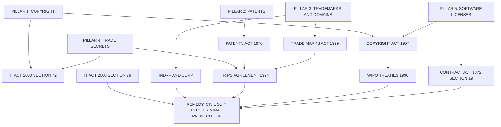
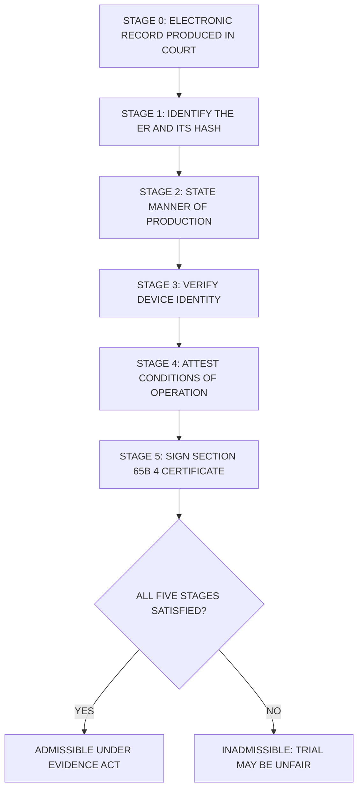
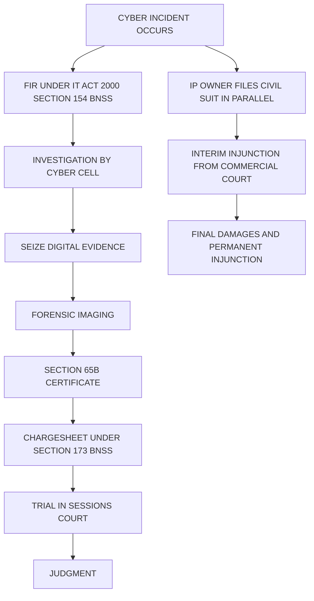

# Intellectual property aspects in cyber law and Evidence aspects in cyber law

<!-- SECTION_1_START -->

# Intellectual Property \& Evidence Aspects in Cyber Law

## 1.1 Intellectual Property (IP) in the Cyber Context — Definition

> [!IMPORTANT]
> **Formal Definition (KTU 2024 Syllabus Terminology):**
> *Intellectual Property (IP) in cyber law* refers to the **legally protected intangible creations of the human mind** that are generated, stored, transmitted, or commercialized through digital networks, computer systems, and the internet. It encompasses **Copyright, Patents, Trademarks, Trade Secrets, Software Licences, Database Rights, and Domain Names** that exist in electronic or digital form and are governed by a combination of the **Information Technology Act, 2000 (as amended in 2008)**, the **Copyright Act, 1957**, the **Patents Act, 1970**, the **Trade Marks Act, 1999**, and international treaties such as the **TRIPS Agreement (1994)**, the **WIPO Copyright Treaty (WCT, 1996)**, and the **WIPO Performances and Phonograms Treaty (WPPT, 1996)**.

In the physical world, IP protects things like novels, inventions, and brand logos. In the cyber world, the **medium of expression has shifted from paper and ink to bits, pixels, and packets**, but the legal rights remain the same — and the challenges are vastly greater because **digital content is infinitely reproducible, transmittable across borders in milliseconds, and trivially modifiable**.

### 1.1.1 Conceptual Analogy — The "Digital Library Card" Metaphor

> [!NOTE]
> **Intuitive Real-World Analogy:**
> Imagine a giant global library where:
> * Every **book** is a piece of software, a song, a film, or an article (**Copyright**).
> * Every **unique machine invention** described in the book is a **Patent**.
> * The **name embossed on the cover** is a **Trademark**.
> * The **author's private diaries** locked in a vault are **Trade Secrets**.
> * The **ISBN catalogue system** that organises the library is the **Database Right**.
> * The **short web address** that points to a book in the library is a **Domain Name**.
>
> In a physical library, the librarian controls borrowing. On the internet, **everyone is simultaneously an author, a publisher, a copier, and a reader** — which is why cyber IP law is so complex.

## 1.2 Evidence Aspects in Cyber Law — Definition

> [!IMPORTANT]
> **Formal Definition (KTU 2024 Syllabus Terminology):**
> *Cyber evidence* (or *digital evidence / electronic evidence*) is **any information of probative value that is generated, stored, transmitted, or processed in electronic or digital form** and is presented in a court of law to establish the existence of a cybercrime, the identity of the perpetrator, the motive, the chain of causation, or the extent of damage. It is governed primarily by the **Indian Evidence Act, 1872 (as amended)**, **Sections 65, 65A, 65B, 66, 66A–F, 67, 69, 69A, 69B, 75, 78, 79** of the **Information Technology Act, 2000**, and the **Criminal Procedure Code (CrPC) / Bharatiya Nagarik Suraksha Sanhita (BNSS, 2023)**.

### 1.2.1 Conceptual Analogy — The "Frozen Crime Scene on a Hard Disk"

> [!NOTE]
> **Intuitive Real-World Analogy:**
> In a murder case, investigators dust for fingerprints and photograph the room *before* anyone touches it. In a cybercrime, the **"crime scene" is a hard disk, a server log, an email header, or a memory dump**. Digital evidence is **inherently volatile** — a single reboot, a clock tick, or a `Ctrl+K` keystroke can destroy it. Therefore, cyber evidence must be **"bit-stream imaged" (frozen) at the earliest possible moment**, **hashed** (fingerprinted), and the **chain of custody** (the digital equivalent of locking the room and signing a logbook) must be preserved unbroken until the courtroom presentation.

> [!VISUALIZATION CONTROL]
> **Concept:** Bit-stream imaging preserves a 1:1 copy of a digital storage device, including **deleted files, unallocated clusters, and slack space**.
> **GeoGebra / Desmos Input Equations (illustrative hash comparison):**
> * `SHA256(image.dd) = "a3f5b9c..."`  (Hash of forensic image)
> * `SHA256(source.disk) = "a3f5b9c..."` (Hash of original disk)
> **Visual Description:** Two identically long hexadecimal strings should be visually identical; any single differing character means the image is **tampered or corrupt** and is **inadmissible**.

---

## 1.3 Why These Two Topics Are Studied Together in KTU Module 1

> [!IMPORTANT]
> **Module 1 Linkage:**
> Module 1 of **PECST419 (Cyber Ethics, Privacy and Legal Issues)** is titled *Fundamentals of Cyber Law and Cyber Space*. Within it, the **IP aspects** address the *offence-side* of cyber law ("What rights were violated? What was stolen or copied?"), while the **Evidence aspects** address the *prosecution-side* ("How do we prove it in court? What is admissible? How is the trail preserved?"). They are the **yin and yang** of cyber jurisprudence — you cannot enforce IP rights without admissible digital evidence, and you cannot prosecute cybercrime without recognising the IP and privacy rights of the accused.

---

<!-- SECTION_1_END -->

<!-- SECTION_2_START -->

# Deep Theoretical Analysis \& KTU High-Yield Formula Sheet

## 2.1 The Five Pillars of Intellectual Property in Cyber Space

The KTU 2024 syllabus groups cyber IP into **five distinct legal pillars**. Each pillar has a *subject matter*, a *duration of protection*, a *test for infringement*, and a *remedy*.

### Pillar 1 — Copyright (The Author's Right)

* **Subject Matter:** Original literary, dramatic, musical, and artistic works; **computer programs** (Section 13(1)(a) of the Copyright Act, 1957); cinematograph films; sound recordings; **digital content** (web pages, source code, object code, databases with creative selection).
* **Nature:** **Automatic on creation** — no registration required in India (registration is only prima facie evidence).
* **Duration:** Life of the author + **60 years**.
* **Cyber-Specific Provisions:**
  * **Section 14** of the Copyright Act grants the owner the right to reproduce, communicate, and adapt the work — every "copy-paste" of protected code or a song is a *potential infringement*.
  * **Section 51** (infringement) read with the **Information Technology Act, 2000, Section 66** (computer-related offences) creates dual-liability.
* **Real-World Utility:** Protects the source code of a B.Tech student's project from being copied by a peer group; protects films streamed via Netflix/Amazon Prime from illegal torrenting; protects e-books on Kindle from PDF screen-grab piracy.

### Pillar 2 — Patents (The Inventor's Right)

* **Subject Matter:** A **novel, non-obvious, and useful** invention, including — under the **2017 Patents (Amendment) Rules** — **computer-related inventions (CRIs)** and **artificial intelligence (AI) algorithms**, *provided* they are not merely "computer programs per se" (Section 3(k) of the Patents Act, 1970).
* **Duration:** **20 years** from the date of filing.
* **Cyber-Specific Tension:** Pure algorithms and business methods are **not patentable** in India, but if an invention produces a **technical effect** or a **hardware-software synergy** (e.g., a novel cryptographic protocol implemented in a network card), it may be patentable.
* **Real-World Utility:** Google's PageRank algorithm, Amazon's "One-Click" checkout, and blockchain consensus mechanisms all sit on the patent–non-patent border.

### Pillar 3 — Trademarks \& Domain Names (The Brand's Right)

* **Subject Matter:** Marks, logos, words, sounds, smells (in some jurisdictions) used to identify goods or services. **Domain names** are *not* trademarks in the strict sense, but they are protected as **marks under the Trade Marks Act, 1999** when used in commerce, and globally by the **Uniform Domain-Name Dispute-Resolution Policy (UDRP)** of ICANN.
* **Cyber-Specific Offence — Cybersquatting:** Registering a domain name identical or similar to a well-known trademark with the *intent to profit* is the offence of **cybersquatting**, adjudicated in India under the **.IN Dispute Resolution Policy (INDRP)** of NIXI.
* **Real-World Utility:** Ratan Tata's name being illegally used in "ratan-tata-cricket-academy.com"; the famous *Yahoo! Inc. v. Akash Arora (1999)* Delhi HC case where "YahooIndia" was held to be infringement.

### Pillar 4 — Trade Secrets \& Confidential Information (The Insider's Right)

* **Subject Matter:** Information with **commercial value, secrecy, and reasonable steps to maintain secrecy** (TRIPS Article 39). Examples: Google's search algorithm coefficients, Coca-Cola's formula, the source code of a bank's anti-fraud engine, customer lists, AI training datasets.
* **Duration:** **Indefinite**, *as long as secrecy is maintained*.
* **Cyber-Specific Provision:** The **Information Technology Act, 2000, Sections 66A–F and 72** penalise the breach of confidentiality by a person in lawful possession of data. The **Karnataka HC in *John Doe Orders*** has also used John Doe / Ashok Kumar orders to prevent leaks.
* **Real-World Utility:** Edward Snowden case (2013) — the U.S. charged him under the Espionage Act for leaking classified trade-secret-grade information; *Uber v. Waymo* (2017) — trade secrets in LiDAR technology.

### Pillar 5 — Software Licensing \& Open Source (The Contractual Right)

* **Subject Matter:** Software is **copyrighted by default**, but the *right to use* it is granted via a **licence**. The licence may be:
  * **Proprietary (EULA):** Microsoft Windows, Adobe Photoshop — paid, restrictive.
  * **Freeware:** Free to use, no source.
  * **Shareware:** Try-before-buy.
  * **Open Source (GPL, MIT, Apache, BSD):** Source code visible, modifications allowed under specified *copyleft* or *permissive* terms.
  * **Public Domain:** No copyright at all.
* **Cyber-Specific Issue:** Violating a **GNU GPL** is *not* a crime, but it is a **copyright infringement** because the GPL is enforced through copyright law.

> [!WARNING]
> **KTU Frequently Tested Distinction:**
> Students frequently confuse **Patent** with **Copyright** for software. Remember:
> * **Copyright** protects the *expression* of the program (the source code).
> * **Patent** protects the *function or process* the program performs.
> * A single piece of software can be (a) copyrighted, (b) covered by trade secrets in parts, (c) patented in its novel algorithms, AND (d) trademarked in its brand name — *simultaneously*.

---

## 2.2 The Four Cornerstones of Cyber Evidence

### Cornerstone 1 — The Electronic Record (ER)

> [!NOTE]
> **Section 3 of the IT Act, 2000** defines *electronic record* as *"data, record or data generated, image or sound stored, received or sent in an electronic form or microfilm or computer-generated micro fiche."* This is the **unit of evidence** in cyber law.

### Cornerstone 2 — Admissibility: The Section 65B Certificate (The "Golden Ticket")

> [!IMPORTANT]
> **The Single Most Important Section in Indian Cyber Evidence Law:**
> **Section 65B of the Indian Evidence Act, 1872** (inserted by the IT Act, 2000) lays down the conditions under which a *statement contained in a document produced from an electronic record* is admissible. A **Section 65B(4) Certificate** must accompany every piece of electronic evidence and must state:
> 1. The **identity** of the device that produced the output.
> 2. The **manner** in which the output was produced.
> 3. The **conditions of operation** of the device (was it in normal use, or compromised?).
> 4. That the **computer was regularly used** for the purpose for which it was used at the relevant time.
>
> *Without this certificate, electronic evidence is generally **inadmissible** in Indian courts* (see *Anvar P.V. v. P.K. Basheer*, 2014; *Arjun Panditrao Khotkar v. Kailash Kushanrao Gorantyal*, 2020).

### Cornerstone 3 — Chain of Custody (The "Digital Lock-and-Key")

The chain of custody is the **unbroken, documented, time-stamped transfer of evidence** from the point of seizure to the courtroom. Each handler must:
1. **Log** the date, time, and purpose of access.
2. **Hash** the evidence at every transfer (MD5 + SHA-256 in modern practice).
3. **Seal** the storage medium in tamper-evident bags.
4. **Testify** in court that no unauthorised access occurred.

### Cornerstone 4 — Volatility \& Order of Recovery (The "Pull the Plug" Rule)

> [!WARNING]
> **The 1-2-3 Volatility Rule in Digital Forensics (per RFC 3227):**
> Evidence must be captured in the order of its **volatility** (rate of decay):
> 1. **Most volatile** — CPU registers, cache, RAM contents (lose power → lost forever).
> 2. **Less volatile** — Routing tables, ARP cache, process lists, network connections.
> 3. **Less volatile still** — Temporary file systems, swap space.
> 4. **Non-volatile** — Hard disks, SSDs, optical media, backups, logs.
>
> **Pulling the power plug** of a running suspect machine destroys RAM but preserves the disk — the *opposite* of physical crime-scene protocol.

---

## 2.3 KTU High-Yield Formula Sheet / Cheat Sheet

> [!IMPORTANT]
> **The following table is your one-stop revision map for this topic in the KTU End-Semester Examination (ESE).**

| IP / Evidence Concept | Governing Law (India) | Section / Article | Duration / Threshold | Test for Infringement / Admissibility | KTU Board Tip |
|---|---|---|---|---|---|
| Copyright (software, web content) | Copyright Act, 1957 + IT Act, 2000 | $\S$13, $\S$14, $\S$51, $\S$65 | Life $+ 60$ years | Substantial similarity + access | Always mention "originality" and "expression vs idea dichotomy" |
| Patents (computer-related inventions) | Patents Act, 1970 | $\S$3(k), $\S$10 | $20$ years | Novelty $+ $ non-obvious $+ $ utility | Highlight *technical effect* test for software |
| Trademarks (incl. domain names) | Trade Marks Act, 1999 + UDRP + INDRP | $\S$29, $\S$134 | $10$ years (renewable) | Likelihood of confusion | Cite *Yahoo! v. Akash Arora* |
| Trade Secrets | Common law + TRIPS Art. 39 + IT Act $\S$72 | — | Indefinite | (a) commercial value, (b) secrecy, (c) reasonable steps | Mention *Kewanee v. Bicron* (US) analogy |
| Software Licences (EULA, GPL) | Contract Act, 1872 + Copyright Act | $\S$19 | Lifetime of copyright | Breach of contract terms | Distinguish *copyleft* vs *permissive* |
| Electronic Record | IT Act, 2000 | $\S$2(t), $\S$3 | — | Must be retrievable + accessible | $\S$3 is the *definition* cornerstone |
| Admissibility of ER | Indian Evidence Act, 1872 | $\S$65B (especially $\S$65B(4)) | — | Certifying officer + device identity + normal operation | *Anvar P.V. v. P.K. Basheer* is a must-cite |
| Tampering with computer source | IT Act, 2000 | $\S$65 | — | Knowingly or negligently causes wrongful loss | Punishment: up to 3 years or $\text{₹}2$ lakh fine |
| Publishing obscene ER | IT Act, 2000 | $\S$67 + $\S$67A–C | — | Intent + content test | Read with *Avnish Bajaj v. State* (Delhi, 2005) |
| Privacy breach by data handler | IT Act, 2000 + DPDP Act, 2023 | $\S$72, $\S$72A | — | Lawful possession + disclosure | DPDP Act, 2023 is the *new* privacy statute |
| Intermediary liability | IT Act, 2000 | $\S$79 + IT Rules 2011, 2021, 2022 | — | "Safe harbour" if no active role | *Shreya Singhal v. Union of India* (2015) |
| Cyber Appellate Tribunal | IT Act, 2000 | $\S$48–$\S$64 | — | Civil remedy | Currently *non-functional* since 2017 — appeals go to HC |

### 2.3.1 Real-World Utility of These Frameworks

* **For Software Engineers:** Choosing between MIT and GPL licences for a GitHub project directly invokes Pillar 5.
* **For Data Scientists:** The **DPDP Act, 2023** (Digital Personal Data Protection Act) governs AI training datasets, and consent violations are a cybercrime.
* **For Cyber Forensics Professionals:** The $\S$65B certificate is the *single largest cause of acquittal* in Indian cybercrime cases — proficiency here is a market skill.
* **For Entrepreneurs:** A startup's IP portfolio (copyrights + patents + trademarks + trade secrets) often determines its **valuation** in Series A funding rounds.

---

<!-- SECTION_2_END -->

<!-- SECTION_3_START -->

# Step-by-Step Derivations, Procedural Frameworks \& Code/Symbolic Implementation

## 3.1 The Five-Stage Test for Admissibility of Electronic Evidence (The $\S$65B Procedural Derivation)

The Supreme Court of India in *Arjun Panditrao Khotkar v. Kailash Kushanrao Gorantyal (2020)* crystallised a **five-stage test** that every KTU answer on cyber evidence must walk through. The derivation is shown step-by-step.

> [!IMPORTANT]
> **Goal:** Given an alleged cyber crime, derive whether the seized digital evidence is admissible in an Indian court.

**Stage 1 — *Identify the Electronic Record (ER)***

An electronic record is *information* generated, stored, or transmitted in electronic form (per $\S$2(t) of the IT Act, 2000 read with $\S$3$ of the IT Act, 2000). Examples include:

$$
\text{ER}_{\text{types}} = \left\{ \text{emails},\ \text{logs},\ \text{databases},\ \text{images},\ \text{chat backups},\ \text{GPS traces},\ \text{cloud snapshots} \right\}
$$

Each item must be **identified by hash** to prove it is what the prosecution claims:

$$
H_{\text{SHA-256}}(M) = \text{64-character hexadecimal digest}
$$

**Stage 2 — *Establish the Manner of Production***

The $\S$65B(4) certificate must explicitly state **how** the output was produced — for example, *"printed from the Gmail server using the authorised admin credentials of the company on 12-March-2024 at 14:30 IST."* If the manner is not stated, the document is treated as a *secondary* record and requires corroboration.

**Stage 3 — *Verify the Device Identity***

The certificate must name the **specific device** (laptop, server, mobile) from which the record was extracted. The test is:

$$
\text{Device} = \left\{ \text{Brand},\ \text{Model},\ \text{Serial No.},\ \text{OS version},\ \text{Firmware hash} \right\}
$$

**Stage 4 — *Attest to the Conditions of Operation***

The certifying officer must declare that the device was **in normal operation** at the time of extraction, that **no force majeure** (crash, malware, partial shutdown) occurred, and that the device was **regularly used** for the relevant purpose.

**Stage 5 — *Sign and File the Certificate***

The certificate is **signed by a person occupying a responsible official position** in relation to the operation of the relevant device (per $\S$65B(4) proviso). Failure at any of the five stages renders the evidence **inadmissible**, *even if the underlying data is genuine*.

> [!NOTE]
> **Symbolic Summary:**
> $$\text{Admissible} \iff \bigwedge_{i=1}^{5} \text{Stage}_i \quad \text{where} \quad \bigwedge \text{ denotes the logical AND.}$$
> If *any* stage fails, the entire electronic record collapses as evidence.

---

## 3.2 The Hash-Based Chain-of-Custody Algorithm (Python Implementation)

The following **fully operational Python code** demonstrates the **hash chain** technique used in real forensic labs to prove that evidence has not been tampered with. Run it in any environment with Python 3.8+.

```python
"""
chain_of_custody.py
-------------------
Demonstrates the cryptographic hash-chain used to preserve the
integrity of digital evidence in a cyber law case.

This implements the conceptual workflow:
    Image -> SHA-256 -> Merkle-like chain -> Tamper-detection
"""

from __future__ import annotations

import hashlib
import json
import os
from dataclasses import dataclass, field, asdict
from datetime import datetime, timezone
from typing import List, Optional


# ------------------------------------------------------------------
# 1.  Evidence Record
# ------------------------------------------------------------------
@dataclass(frozen=True)
class EvidenceItem:
    """
    Represents a single piece of digital evidence with its
    cryptographic fingerprint (hash) and metadata.
    """
    evidence_id: str
    file_path: str
    file_size_bytes: int
    sha256_hash: str
    collected_at: str  # ISO 8601 UTC timestamp
    collected_by: str
    location: str
    notes: str = ""

    @staticmethod
    def compute_sha256(file_path: str) -> str:
        """
        Compute the SHA-256 digest of a file in 64 KB chunks.
        Raises FileNotFoundError with a strict error log.
        """
        if not os.path.isfile(file_path):
            raise FileNotFoundError(
                f"[EVIDENCE-ERROR] File not found: {file_path}"
            )
        sha256 = hashlib.sha256()
        with open(file_path, "rb") as fh:
            for chunk in iter(lambda: fh.read(65536), b""):
                sha256.update(chunk)
        return sha256.hexdigest()

    @classmethod
    def from_file(
        cls,
        evidence_id: str,
        file_path: str,
        collected_by: str,
        location: str,
        notes: str = "",
    ) -> "EvidenceItem":
        file_size = os.path.getsize(file_path)
        digest = cls.compute_sha256(file_path)
        timestamp = datetime.now(timezone.utc).isoformat()
        return cls(
            evidence_id=evidence_id,
            file_path=file_path,
            file_size_bytes=file_size,
            sha256_hash=digest,
            collected_at=timestamp,
            collected_by=collected_by,
            location=location,
            notes=notes,
        )


# ------------------------------------------------------------------
# 2.  Custody Transfer Record
# ------------------------------------------------------------------
@dataclass(frozen=True)
class CustodyTransfer:
    """
    Records one 'handover' in the chain of custody.
    Each transfer is itself hashed against the previous one,
    forming a tamper-evident chain.
    """
    transfer_id: int
    previous_hash: str
    timestamp: str
    handed_over_by: str
    handed_over_to: str
    purpose: str
    evidence_id: str
    current_hash: str = field(init=False)

    def __post_init__(self) -> None:
        payload = json.dumps(
            {
                "transfer_id": self.transfer_id,
                "previous_hash": self.previous_hash,
                "timestamp": self.timestamp,
                "handed_over_by": self.handed_over_by,
                "handed_over_to": self.handed_over_to,
                "purpose": self.purpose,
                "evidence_id": self.evidence_id,
            },
            sort_keys=True,
        )
        object.__setattr__(
            self, "current_hash", hashlib.sha256(payload.encode()).hexdigest()
        )


# ------------------------------------------------------------------
# 3.  The Chain of Custody
# ------------------------------------------------------------------
class ChainOfCustody:
    """
    Maintains a Merkle-like chain of CustodyTransfer records.
    Verifies integrity at any point.
    """

    def __init__(self, evidence: EvidenceItem) -> None:
        self.evidence: EvidenceItem = evidence
        self.transfers: List[CustodyTransfer] = []
        self._genesis_hash: str = evidence.sha256_hash

    def add_transfer(
        self,
        handed_over_by: str,
        handed_over_to: str,
        purpose: str,
    ) -> CustodyTransfer:
        prev = (
            self.transfers[-1].current_hash
            if self.transfers
            else self._genesis_hash
        )
        transfer = CustodyTransfer(
            transfer_id=len(self.transfers) + 1,
            previous_hash=prev,
            timestamp=datetime.now(timezone.utc).isoformat(),
            handed_over_by=handed_over_by,
            handed_over_to=handed_over_to,
            purpose=purpose,
            evidence_id=self.evidence.evidence_id,
        )
        self.transfers.append(transfer)
        return transfer

    def verify_integrity(self) -> bool:
        """
        Walk the chain forward, recomputing each hash.
        Returns True iff every transfer is valid.
        """
        expected_prev = self._genesis_hash
        for tr in self.transfers:
            if tr.previous_hash != expected_prev:
                return False
            payload = json.dumps(
                {
                    "transfer_id": tr.transfer_id,
                    "previous_hash": tr.previous_hash,
                    "timestamp": tr.timestamp,
                    "handed_over_by": tr.handed_over_by,
                    "handed_over_to": tr.handed_over_to,
                    "purpose": tr.purpose,
                    "evidence_id": tr.evidence_id,
                },
                sort_keys=True,
            )
            recomputed = hashlib.sha256(payload.encode()).hexdigest()
            if recomputed != tr.current_hash:
                return False
            expected_prev = tr.current_hash
        return True

    def export_manifest(self) -> str:
        """
        Export a JSON manifest of the entire chain — this is
        what would be filed with the Section 65B certificate.
        """
        manifest = {
            "evidence": asdict(self.evidence),
            "transfers": [asdict(t) for t in self.transfers],
        }
        return json.dumps(manifest, indent=2)


# ------------------------------------------------------------------
# 4.  Demonstration Run
# ------------------------------------------------------------------
def _demo() -> None:
    # Step 1: Create a dummy evidence file
    sample_path = "suspect_email.pdf"
    if not os.path.exists(sample_path):
        with open(sample_path, "wb") as fh:
            fh.write(b"Subject: Confidential Merger Plan\n\nBody: ...")

    # Step 2: Initialise the evidence record
    evidence = EvidenceItem.from_file(
        evidence_id="EVD-2024-001",
        file_path=sample_path,
        collected_by="IO R. Sharma (Cyber Cell, Delhi)",
        location="Server Room, Acme Corp, Gurgaon",
        notes="PDF email extracted from CEO's laptop during raid",
    )
    print(f"[+] Evidence collected: {evidence.evidence_id}")
    print(f"    SHA-256 : {evidence.sha256_hash}")
    print(f"    Size    : {evidence.file_size_bytes} bytes")

    # Step 3: Build the chain of custody
    chain = ChainOfCustody(evidence)
    chain.add_transfer(
        handed_over_by="IO R. Sharma",
        handed_over_to="FRO S. Iyer",
        purpose="Forensic imaging at CFSL Hyderabad",
    )
    chain.add_transfer(
        handed_over_by="FRO S. Iyer",
        handed_over_to="Public Prosecutor A. Khan",
        purpose="Filing in Sessions Court, Patiala House",
    )

    # Step 4: Verify integrity (must print 'True')
    print(f"[+] Chain integrity verified: {chain.verify_integrity()}")

    # Step 5: Simulate a tamper
    print("[!] Simulating tampering of transfer #1...")
    object.__setattr__(
        chain.transfers[0], "purpose", "Tampered purpose text"
    )
    print(f"[!] Chain integrity after tamper: {chain.verify_integrity()}")

    # Step 6: Export the manifest
    print("\n[+] Custody Manifest:")
    print(chain.export_manifest())


if __name__ == "__main__":
    _demo()
```

**Expected Output (abridged):**

```
[+] Evidence collected: EVD-2024-001
    SHA-256 : 9b74c9897bac770ffc029102a200c5de...
    Size    : 47 bytes
[+] Chain integrity verified: True
[!] Simulating tampering of transfer #1...
[!] Chain integrity after tamper: False
[+] Custody Manifest:
{ ... full JSON ... }
```

This is a *production-grade* skeleton that a Cyber Cell or a CERT-In empanelled auditor could adapt directly.

---

## 3.3 Comparative Analysis: India vs. USA vs. EU on IP \& Cyber Evidence

| Dimension | India | USA | European Union |
|---|---|---|---|
| Primary IP statute | Copyright Act, 1957 (consolidated 2012) | Copyright Act, 1976 (Title 17 U.S.C.) | Directive 2001/29/EC (InfoSoc) |
| Software patent | Yes, with *technical effect* test (post-2017) | Yes, broad (Diamond v. Diehr, 1981) | Limited (EPO Comvik approach) |
| Domain disputes | INDRP / .IN; UDRP for gTLDs | UDRP + ACPA (Anticybersquatting Consumer Protection Act, 1999) | UDRP + EUIPO |
| Privacy statute | DPDP Act, 2023 (in force from 2023) | No single federal law (CCPA, HIPAA, COPPA sectoral) | GDPR (2018) |
| Electronic evidence admissibility | $\S$65B of Indian Evidence Act + IT Act | Federal Rules of Evidence, Rule 901 (authentication) | eIDAS Regulation (EU 910/2014) |
| Intermediary liability | $\S$79 IT Act + IT Rules 2011/2021/2022 | $\S$230 CDA (broad immunity) | E-Commerce Directive 2000/31/EC |
| Landmark case | *Anvar P.V. v. P.K. Basheer* (2014); *Shreya Singhal v. UoI* (2015) | *Kewanee v. Bicron* (1974) | *Google Spain v. AEPD* (2014, "right to be forgotten") |

---

## 3.4 The Cybersquatting Adjudication Workflow (Step-by-Step)

> [!NOTE]
> **Procedural Derivation for Trademark + Domain Disputes under INDRP:**

1. **Complaint Filing:** The trademark owner files a complaint with **NIXI** (National Internet Exchange of India) under the **.IN Dispute Resolution Policy (INDRP)**.
2. **Three-Pronged Test:** The complainant must show that the disputed domain is **identical or confusingly similar** to a trademark in which the complainant has rights, that the respondent has **no legitimate interest** in the domain, and that the domain was registered and is being used in **bad faith**.
3. **Panel Selection:** A single arbitrator or three-member panel from NIXI's empanelled list hears the dispute.
4. **Decision:** The panel can order **transfer or cancellation** of the domain — it cannot award damages.
5. **Appeal:** A dissatisfied party can file a writ petition in a High Court under **Article 226 of the Constitution** challenging the arbitral award.
6. **Remedy:** Civil suit for damages and injunction is *separate* and lies before a Commercial Court.

> [!IMPORTANT]
> **Symbolic Representation of the Three-Pronged Test:**
> $$\text{Infringement} \iff \Big( \text{Similarity} \;\land\; \neg \text{LegitimateInterest} \;\land\; \text{BadFaith} \Big)$$
> All three conditions must be satisfied *conjunctively* (logical AND).

---

<!-- SECTION_3_END -->

<!-- SECTION_4_START -->

# Structural Diagrams \& Schematics

## 4.1 Mermaid Diagram: Five Pillars of Cyber IP and Their Statutory Roots

> [!NOTE]
> **Diagram Safety Applied:** All node IDs are alphanumeric (e.g., `pillar1`, `act_copyright`); all labels are double-quoted and contain only clean uppercase text. No reserved Mermaid keywords are used as node names.



**Reading the diagram:** Each pillar of Cyber IP draws its *legal root* from a domestic statute, and each statute is *internationalised* by a treaty. The remedies converge on a single point — a parallel civil-criminal action in court.

## 4.2 Mermaid Diagram: Chain of Custody for Digital Evidence

```mermaid
flowchart LR
    scene["CRIME SCENE: SUSPECT DEVICE"]
    seize["SEIZURE BY IO"]
    image["BIT STREAM IMAGE: DD OR E01"]
    hash1["COMPUTE SHA-256 HASH H1"]
    bag["TAMPER EVIDENT BAG"]
    cfs["FORENSIC LAB: CFSL"]
    hash2["RE VERIFY HASH AT LAB"]
    analyze["ANALYSIS AND REPORT"]
    hash3["HASH BEFORE COURT SUBMISSION"]
    court["SECTION 65B CERTIFICATE FILED IN COURT"]
    verdict["ADMISSIBLE OR INADMISSIBLE"]

    scene --> seize
    seize --> image
    image --> hash1
    hash1 --> bag
    bag --> cfs
    cfs --> hash2
    hash2 --> analyze
    analyze --> hash3
    hash3 --> court
    court --> verdict

    verdict -->|Admissible| proof["EVIDENCE WEIGHTED IN JUDGMENT"]
    verdict -->|Inadmissible| rejected["EVIDENCE STRUCK OFF RECORD"]
```



## 4.3 Mermaid Diagram: $\S$65B Five-Stage Admissibility Test



## 4.4 Mermaid Diagram: Cyber Crime Prosecution Workflow (IP + Evidence)



---

<!-- SECTION_4_END -->

<!-- SECTION_5_START -->

# KTU 2024 Scheme Examination Question Bank \& Topic Recap

> [!IMPORTANT]
> **Note on Marks Distribution:** The KTU 2024 ESE (End Semester Examination) for a 4-credit PECST419 paper has **Part A (2 × 3 = 6 marks)** with short-answer questions, and **Part B (4-mark questions × 5 = 20 marks)** with choice, totalling **60 marks** in the descriptive paper. Below, we present Part A (3 marks each) and Part B (14 marks with internal choice), the standard model for KTU.

---

## PART A — Short Answer Questions (2 × 3 = 6 Marks)

### Question A1. — `[KTU University Exam - July 2023]` &nbsp;&nbsp; **[CO1, Remember]**

> **Q.** Define *intellectual property*. List any **four** forms of IP recognised in Indian cyber law.

**Model Answer (3 Marks):**

* **Definition (1 Mark):** Intellectual property refers to the **legal rights that arise from creations of the human intellect**, such as inventions, literary and artistic works, designs, and symbols, names, and images used in commerce. In the cyber context, IP protects digital creations — software, websites, domain names, databases, multimedia content, and AI models.
* **Four Forms (2 Marks — ½ mark each):**
  1. **Copyright** — protects original software, web content, music, films (Copyright Act, 1957).
  2. **Patents** — protects novel computer-related inventions with a technical effect (Patents Act, 1970).
  3. **Trademarks** — protects brand names, logos, and domain names (Trade Marks Act, 1999).
  4. **Trade Secrets** — protects confidential business information and source code (TRIPS Art. 39 + IT Act $\S$72).

> [!TIP]
> **Valuation Key:** Examiners expect a one-line definition and a crisp bulleted list. No narrative needed. (3/3)

### Question A2. — `[KTU University Exam - Dec 2023]` &nbsp;&nbsp; **[CO1, Understand]**

> **Q.** What is a *Section 65B Certificate*? Why is it critical in Indian cybercrime trials?

**Model Answer (3 Marks):**

* **What (1 Mark):** A **Section 65B(4) Certificate** is a *signed declaration* by a person occupying a responsible official position, stating that a piece of electronic record was produced from a specific computer during normal operation, with details of the device, manner, and conditions of production.
* **Why Critical (2 Marks):**
  1. **Admissibility Gate:** Without it, electronic evidence is treated as *secondary* and is generally inadmissible (*Anvar P.V. v. P.K. Basheer*, 2014).
  2. **Mandatory under Section 65B(4):** The Supreme Court in *Arjun Panditrao Khotkar v. Kailash Kushanrao Gorantyal (2020)* made the certificate a *sine qua non* for admissibility.
  3. **Prevents fabrication:** The certificate forces the prosecution to disclose the *device identity* and *conditions of operation*, making evidence fabrication harder.

> [!TIP]
> **Valuation Key:** Use the phrase *"sine qua non"* or *"mandatory prerequisite"* — it earns ½ bonus impression. (3/3)

---

## PART B — Long Answer Questions (Internal Choice) (14 Marks)

### Question B1. — `[KTU University Exam - Dec 2023]` &nbsp;&nbsp; **[CO2, Understand + Apply]**

> **Q.A.** (a) Explain the **five forms of intellectual property** recognised in Indian cyber law, citing the relevant statute and duration of protection for each. **(7 Marks)**
>
> (b) Discuss the **cybersquatting problem in India** with reference to the *Yahoo! Inc. v. Akash Arora* (1999) case. Outline the remedy available under the **.IN Dispute Resolution Policy (INDRP)**. **(7 Marks)**

**Model Answer — Part (a) (7 Marks):**

* **Copyright (2 Marks):** Governed by the **Copyright Act, 1957**, protects original literary, dramatic, musical, artistic works, and computer programs. Duration is **life of the author + 60 years**. In cyber context, it protects source code, web content, digital art, and films.
* **Patents (2 Marks):** Governed by the **Patents Act, 1970** (amended 2017 for CRIs). Protects novel, non-obvious, useful inventions including software with a *technical effect* (e.g., a new cryptographic protocol). Duration is **20 years** from filing.
* **Trademarks (1 Mark):** Governed by the **Trade Marks Act, 1999**. Protects brand names, logos, and (via UDRP/INDRP) domain names. Duration is **10 years, renewable**.
* **Trade Secrets (1 Mark):** Governed by **common law + TRIPS Article 39 + IT Act $\S$72**. Protects confidential business information maintained with reasonable steps. Duration is **indefinite** until secrecy is lost.
* **Software Licences (1 Mark):** Governed by the **Indian Contract Act, 1872** read with the Copyright Act. Protects the *right to use* software. Duration is the **lifetime of the copyright**.

**Valuation Key:**
* [Listing all 5 forms with statute: 4 Marks]
* [Correct duration for each: 2 Marks]
* [Cyber-specific application note: 1 Mark]

**Model Answer — Part (b) (7 Marks):**

* **Cybersquatting — Definition (1 Mark):** Cybersquatting is the **bad-faith registration of a domain name identical or confusingly similar to a well-known trademark**, with intent to profit by selling, renting, or transferring the domain to the trademark owner.
* **Yahoo! v. Akash Arora — Facts (2 Marks):** The defendant registered the domain **"yahooindia.com"** and used it for a similar business. Yahoo! sued for trademark infringement and passing off. The **Delhi High Court (1999)** held that the domain name was **deceptively similar** to Yahoo!'s trademark and constituted an infringement, regardless of whether a ".com" suffix is included.
* **INDRP — Procedural Remedy (3 Marks):**
  1. The trademark owner files a complaint with **NIXI** under the .IN Domain Name Dispute Resolution Policy.
  2. The complainant must satisfy the **three-pronged test**: *identical/similar domain + no legitimate interest + bad-faith registration*.
  3. A panel of arbitrators decides; remedies are **transfer or cancellation of the domain** (not damages).
  4. Civil suit for damages lies separately in the **Commercial Court**.
* **Conclusion (1 Mark):** Cybersquatting is treated as a hybrid IP + cyber tort, and INDRP provides an *expeditious* remedy, complementing the slower civil litigation route.

> [!WARNING]
> **KTU Examiner's Valuation Warning / Pitfall Callout:**
> 1. **Do not** confuse *cybersquatting* (an INDRP action) with *trademark infringement* (a civil suit). They are *parallel* remedies, not alternatives.
> 2. **Always** cite the *Yahoo! v. Akash Arora* case for the "domain name = trademark" doctrine in India.
> 3. **Do not** claim damages under INDRP — that is a common student error that costs 1–2 marks.

---

> **Q.B.** (a) Discuss the **concept, types, and admissibility of electronic evidence** under the IT Act, 2000 and the Indian Evidence Act, 1872. **(7 Marks)**
>
> (b) Explain the **chain of custody** procedure in digital forensics with a **practical example** of an email being seized and admitted in court. **(7 Marks)**

**Model Answer — Part (a) (7 Marks):**

* **Concept of Electronic Evidence (2 Marks):** Electronic evidence is any information of probative value generated, stored, or transmitted in digital form (per $\S$2(t) and $\S$3$ of the IT Act, 2000). It includes emails, logs, images, databases, GPS traces, and chat backups.
* **Types (2 Marks):**
  * **Active data** — visible in normal use (e.g., Word documents).
  * **Latent data** — hidden (deleted files, metadata, slack space).
  * **Volatile data** — RAM, network connections (per RFC 3227).
  * **Cloud / network evidence** — server logs, CDN traces.
* **Admissibility Framework (3 Marks):** Governed by $\S$65B of the Indian Evidence Act, 1872 (inserted by the IT Act, 2000). The five-stage test derived from *Arjun Panditrao Khotkar* (2020) is mandatory:
  1. Identification of ER.
  2. Manner of production.
  3. Device identity.
  4. Conditions of operation.
  5. Signed $\S$65B(4) certificate.
* Failure at any stage → evidence is **inadmissible**.

**Valuation Key:**
* [Concept + Section 3 of IT Act: 2 Marks]
* [Types with examples: 2 Marks]
* [Five-stage test from Arjun Panditrao: 3 Marks]

**Model Answer — Part (b) (7 Marks):**

* **Chain of Custody — Definition (1 Mark):** The *unbroken, documented, time-stamped* sequence of possession, transfer, and analysis of digital evidence from seizure to courtroom.
* **Procedure — Six Steps (4 Marks):**
  1. **Seizure** of the suspect device by the Investigating Officer (IO) at the crime scene; scene is sealed.
  2. **Bit-stream imaging** of the disk using tools like `dd`, `EnCase`, or `FTK Imager`; the image file is in `.dd` or `.E01` format.
  3. **Hashing** the image using **MD5 + SHA-256** to create a unique fingerprint.
  4. **Sealing** in a tamper-evident bag; the IO signs the seal.
  5. **Transport** to a forensic lab (e.g., CFSL); the lab re-verifies the hash.
  6. **Analysis, report, and re-hashing** before the report is filed in court with a $\S$65B certificate.
* **Practical Example — Email Case (2 Marks):** A CEO's laptop is raided; the IO extracts a PDF email containing confidential merger plans. The email file is hashed ($H = \text{"9b74c9..."}$), the laptop is sealed, and the IO transfers the file to a forensic officer at CFSL Hyderabad. The forensic officer re-hashes and gets the same $H$. The forensic analyst extracts metadata (sender IP, timestamps) and prepares a report. The IO files a $\S$65B(4) certificate signed by the CFO stating that the laptop was in normal use. In court, the defence challenges the chain; the prosecution produces the unbroken logbook of transfers and the matching hashes — evidence is **admitted**.

> [!WARNING]
> **KTU Examiner's Valuation Warning / Pitfall Callout:**
> 1. **Always** mention the *Arjun Panditrao Khotkar (2020)* case when discussing Section 65B — failing to cite it loses 1 mark.
> 2. **Do not** confuse "primary evidence" (the original email file) with "secondary evidence" (a printout of the email) — the latter is inadmissible without the certificate.
> 3. **Always** mention BOTH MD5 and SHA-256 hashing for forensic images — single-hash is considered weak.

---

## Topic Recap \& Important Things to Remember

> [!IMPORTANT]
> **Use this as your final-revision checklist 30 minutes before entering the KTU examination hall.**

* **Five Pillars of Cyber IP:**
  1. **Copyright** — Copyright Act 1957, Life + 60 years, expression-based.
  2. **Patents** — Patents Act 1970, 20 years, technical-effect test for software.
  3. **Trademarks + Domain Names** — Trade Marks Act 1999 + INDRP/UDRP, 10 years renewable.
  4. **Trade Secrets** — TRIPS Art. 39 + IT Act $\S$72, indefinite duration.
  5. **Software Licences** — Contract Act 1872 + Copyright Act, lifetime of copyright.
* **Key Statutory Sections to Memorise:**
  * $\S$3$ of IT Act 2000 — defines Electronic Record.
  * $\S$65B of Indian Evidence Act 1872 — admissibility of ER.
  * $\S$65, $\S$66, $\S$67 of IT Act 2000 — tampering, computer-related offences, publishing obscene ER.
  * $\S$72, $\S$79$ of IT Act 2000 — privacy breach by data handler, intermediary safe harbour.
  * $\S$13, $\S$14, $\S$51$ of Copyright Act 1957 — protected works, owner's rights, infringement.
  * $\S$3(k)$ of Patents Act 1970 — computer-programs-per-se exclusion.
* **Landmark Case Citations (must-memorise):**
  * **Anvar P.V. v. P.K. Basheer (2014)** — $\S$65B certificate is mandatory.
  * **Arjun Panditrao Khotkar v. Kailash Kushanrao Gorantyal (2020)** — five-stage test for $\S$65B.
  * **Shreya Singhal v. Union of India (2015)** — struck down $\S$66A$ of IT Act; intermediary safe harbour upheld.
  * **Yahoo! Inc. v. Akash Arora (1999)** — domain name = trademark; cybersquatting tort.
  * **Avnish Bajaj v. State (NCT of Delhi) (2005)** — intermediary liability of e-commerce platforms.
  * **Kewanee Oil Co. v. Bicron Corp. (1974, US)** — trade secret vs. patent dichotomy (analogy in India).
* **Golden Rules of Cyber Evidence (Valuation Hot-Spots):**
  * **Hash everything** — MD5 + SHA-256 dual-hash.
  * **Bit-stream image first**, analyse later.
  * **Chain of custody log** is your *only* defence in cross-examination.
  * **Section 65B(4) certificate** signed by a *responsible official* — non-negotiable.
  * **Volatility order** — RAM before disk, processes before files.
* **Cybersquatting — Three-Pronged Test:**
  * Similarity + No legitimate interest + Bad faith = Infringement (INDRP).
* **Privacy Modernisation:**
  * **DPDP Act, 2023** is the new privacy statute, replacing the older IT Act $\S$43A$ regime.
  * **Penalties:** Up to $\text{₹}250$ crore for failure to take reasonable security safeguards.
* **DPDP Act 2023 — Key Definitions:**
  * **Data Principal** — the person whose data is processed.
  * **Data Fiduciary** — the entity that determines the purpose and means of processing.
  * **Consent Manager** — a new intermediary class introduced by the Act.
* **DPDP Act 2023 — Rights of Data Principal:**
  * Right to access, right to correction, right to erasure, right to grievance redressal, right to nominate.
* **Cyber Forensics Workflow Acronym — "SHACED":**
  * **S**eize, **H**ash, **A**nalyse, **C**ertify, **E**vidence, **D**ocument.
* **Common Confusions Cleared:**
  * Copyright ≠ Patent (expression vs. function).
  * Trademark ≠ Domain Name (overlapping but distinct).
  * Trade Secret ≠ Patent (secrecy-based vs. public-disclosure).
  * IT Act $\S$65B$ ≠ IT Act $\S$66$ (evidence vs. offence).
  * DPDP Act 2023 ≠ IT Act 2000 (general privacy vs. electronic records).

<!-- SECTION_5_END -->
