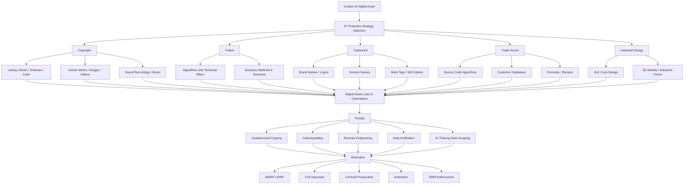
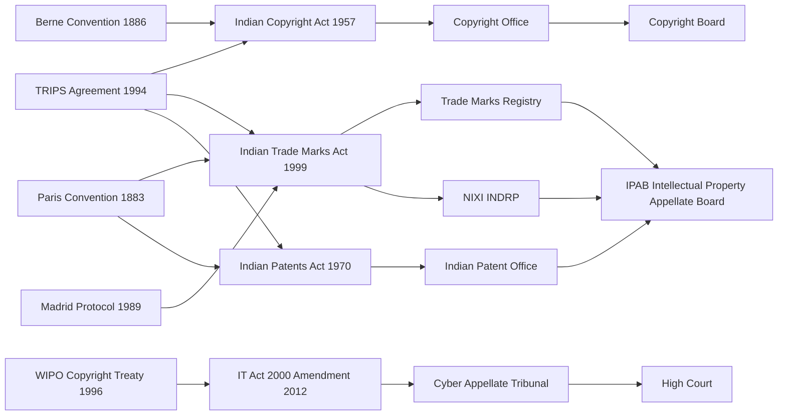
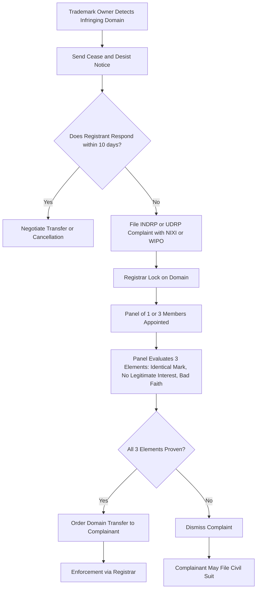
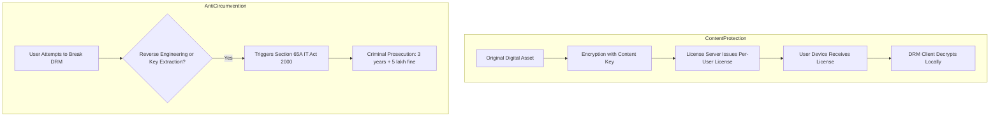
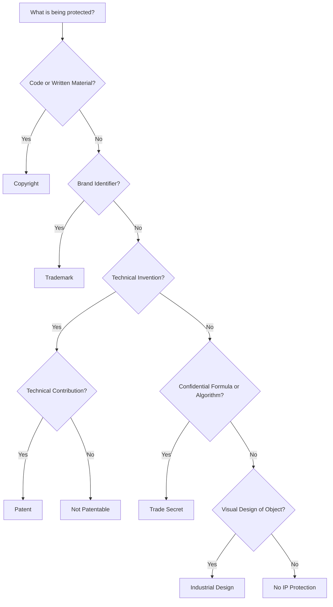

# Intellectual property aspects in cyber law

<!-- SECTION_1_START -->
# Intellectual Property Aspects in Cyber Law

## 1.1 Formal Academic Definition

> [!IMPORTANT]
> **Intellectual Property (IP)** is a category of legal rights that grants creators exclusive control over the intangible creations of their mind, for a specified period, in exchange for public disclosure of the work. In the cyber context, **Intellectual Property Rights (IPR)** govern the ownership, use, distribution, and protection of digital assets — including software source code, multimedia content, databases, domain names, algorithms, and digital publications.

Under the KTU 2024 scheme (Module 1: Fundamentals of Cyber Law and Cyber Space), **IP in cyber law** is the branch of jurisprudence that addresses how traditional IP doctrines (Copyright, Patent, Trademark, Trade Secret, Industrial Design) are enforced, extended, and reshaped within the borderless, reproducible, and decentralized architecture of cyberspace.

The five primary branches of IP relevant to cyberspace are:

1. **Copyright** — Protects original literary, musical, artistic, and software works.
2. **Patent** — Protects novel, non-obvious, and useful inventions (including software-implemented inventions in some jurisdictions).
3. **Trademark** — Protects distinctive marks, logos, brand names, and trade dress used in commerce.
4. **Trade Secret** — Protects confidential business information that provides competitive edge.
5. **Industrial Design** — Protects the visual/aesthetic design of a functional object.

## 1.2 Conceptual Analogy / Intuition

> [!NOTE]
> **Analogy — The "Digital House and Its Locks"**
> Imagine you painstakingly design a beautiful digital painting on your tablet. You upload it to a website, and within minutes, a thousand unauthorized copies circulate globally. The painting is no longer a physical object in a gallery — it is a **digital artifact** that can be cloned infinitely at zero marginal cost.
>
> **Intellectual Property law acts as the title deed, the lock, and the court order** for that digital artifact. Without it, creators have no economic incentive to innovate. With it, creators are assured that their work, when used commercially, must be licensed, attributed, or purchased.

**Geometric Intuition of IP Boundaries in Cyberspace:**

- $X$-axis → **Spectrum of IP strictness** (from "Public Domain" on the left to "Maximum Exclusivity" on the right).
- $Y$-axis → **Asset category** (Copyright, Patent, Trademark, Trade Secret).
- A 2D plane is divided into overlapping zones — for example, a **software application** sits in the **Copyright ∩ Patent** overlap, while a **brand logo** sits in the **Trademark ∩ Copyright** overlap.

> [!VISUALIZATION CONTROL]
> **Concept:** IP Rights Intersection Map in Cyberspace
> **GeoGebra / Desmos Input Equations:**
> * `f(x) = max(0, 1 - x^2)` — Copyright domain curve
> * `g(x) = exp(-(x-2)^2)` — Patent domain curve
> * `h(x) = 0.5 * sin(2x) + 1` — Trademark domain curve
> * Intersection points: $x = 1.5$ (Copyright ∩ Patent), $x = 2.5$ (Patent ∩ Trademark)
> **Visual Description:** The student should observe three bell-shaped/curved regions plotted on the $xy$-plane. The **overlap regions** represent assets like software (Copyright+Patent) and brand logos (Trademark+Copyright). The non-overlapping tails represent purely artistic works (Copyright only) or pure inventions (Patent only).

## 1.3 Standard Metrics and Constants

> [!NOTE]
> **Critical IP Constants in Indian Cyber Law (IT Act 2000, Copyright Act 1957, Patents Act 1970, Trade Marks Act 1999):**
>
> * **Copyright Term (Literary/Artistic/Musical works):** Life of the author + $\mathbf{60}$ **years** (post-amendment 2012).
> * **Copyright Term (Anonymous/Broadcast/Sound Recording):** $\mathbf{60}$ **years** from the year of publication.
> * **Patent Term:** $\mathbf{20}$ **years** from the date of filing.
> * **Trademark Registration Validity:** $\mathbf{10}$ **years** (renewable indefinitely).
> * **Trade Secret Protection Duration:** Indefinite (subject to secrecy being maintained).
> * **Cybersquatting In rem Domain Action Limit under .IN Dispute Resolution Policy (INDRP):** Domain must be registered, used, or hosted in India.

---

## 1.4 Why IP in Cyberspace is Uniquely Challenging

1. **Reproducibility** — Digital assets can be cloned byte-for-byte with zero degradation.
2. **Transborder Nature** — A server in Country A can infringe an IP right held in Country B instantly.
3. **Anonymity** — The internet's architecture makes attribution of infringement difficult.
4. **Decentralization** — No single jurisdictional authority governs global cyberspace.
5. **Convergence** — A single digital product (e.g., a mobile app) may simultaneously embody copyright (in code), patent (in process), trademark (in brand), and trade secret (in algorithm).

<!-- SECTION_1_END -->

<!-- SECTION_2_START -->
# Deep Theoretical Analysis and KTU High-Yield Reference Sheet

## 2.1 Copyright in Cyberspace

Copyright is the **most litigated** IP right in cyberspace. It protects the **expression of ideas** (not the ideas themselves) in a tangible medium.

### 2.1.1 What is Protected?

Under the **Indian Copyright Act, 1957** (as amended by the Information Technology Act, 2000), the following are explicitly protected:

* **Literary works** (Section 13(1)(a)) — including **computer programs, tables, and compilations** (including databases).
* **Dramatic works** (Section 13(1)(b)).
* **Musical works** (Section 13(1)(c)).
* **Artistic works** (Section 13(1)(d)).
* **Cinematograph films** (Section 13(1)(e)) — including digital video files.
* **Sound recordings** (Section 13(1)(f)).
* **Broadcasts** (Section 37).

### 2.1.2 Software as a "Literary Work"

A landmark doctrinal shift: **computer programs are treated as literary works** under Section 2(o) of the Copyright Act. This means:

$$
\text{Source Code} \;\subseteq\; \text{Literary Work} \;\subseteq\; \text{Copyright Protection}
$$

* **Object code** is also protected as a translation/compilation of the source code.
* The **structure, sequence, and organization (SSO)** of code may be protected if it exhibits originality.
* The **look and feel** doctrine (e.g., Apple v. Microsoft, 1994) extends protection to user interface elements.

### 2.1.3 Exclusive Rights of a Copyright Holder (Section 14)

| Right | Description | Cyberspace Example |
|---|---|---|
| Reproduce | Make copies of the work | Burning a DVD, downloading a song |
| Issue copies | Distribute copies to the public | Selling pirated e-books on a website |
| Perform | Public performance | Streaming a movie on YouTube |
| Communicate | Make the work available electronically | Hosting on a cloud server |
| Adapt/Translate | Create derivative works | Modifying open-source code and re-releasing |
| Rent/Commercial Lease | Rent copies of the work | Lending digital movie files via P2P |

### 2.1.4 Doctrine of Fair Use (Section 52)

Not all copying is infringement. Section 52 enumerates **fair dealing** exceptions, critical for cyberspace:

* Private and personal use.
* Criticism or review.
* Reporting of current events.
* Use in judicial proceedings.
* **Non-profit educational use** (e.g., a teacher sharing a PDF in a closed classroom LMS).
* Transient/incidental storage in an electronic network.

> [!IMPORTANT]
> **Fair Use is NOT Fair Dealing:** The Indian Copyright Act follows the **"Fair Dealing"** doctrine (closed-list, more restrictive), whereas the US follows **"Fair Use"** (open-ended, four-factor test). Students must not interchange these terms in exam answers.

---

## 2.2 Patents in Cyberspace

### 2.2.1 Patentability Criteria (Section 2(1)(j), Patents Act 1970)

For a software-implemented invention to be patentable in India, it must satisfy:

$$
\text{Patent Eligibility} = \text{Novelty} \land \text{Inventive Step} \land \text{Industrial Application}
$$

| Criterion | Definition | Test for Software |
|---|---|---|
| **Novelty** | Not anticipated by prior art (Section 2(1)(l)) | Is the algorithm/method already published? |
| **Inventive Step** | Non-obvious to a person skilled in the art (Section 2(1)(ja)) | Would a skilled developer find this obvious? |
| **Industrial Application** | Useful in any industry (Section 2(1)(ac)) | Does it produce a technical effect or solve a technical problem? |

### 2.2.2 Landmark Software Patent Cases

* **Yahoo v. Rediff (2003, Bombay HC):** A business method implemented in software is **not patentable** in India.
* **Ferid Allani v. Union of India (2012, Delhi HC):** Computer-related inventions must demonstrate a **technical contribution** beyond mere application of an abstract idea.

> [!WARNING]
> **Common Student Pitfall:** "Software is always patentable" is **FALSE** in India. Pure algorithms, mathematical methods, and business methods are excluded under Sections 3(k) and 3(m) of the Patents Act.

---

## 2.3 Trademarks and Domain Names in Cyberspace

### 2.3.1 Trademark Fundamentals

A **trademark** is a mark capable of being represented graphically and capable of distinguishing goods or services of one undertaking from another (Section 2(1)(zb), Trade Marks Act 1999).

In cyberspace, trademarks extend to:

* Domain names (e.g., `google.com`).
* Meta tags, keywords, and adwords.
* Social media handles.
* Hashtags and app store identifiers.

### 2.3.2 Cybersquatting

> [!IMPORTANT]
> **Cybersquatting** is the bad-faith registration of a domain name that is identical or confusingly similar to a trademark in which the registrant has no legitimate interest, with the intent to profit by selling, renting, or transferring it.

**Statutory Remedy:** The **.IN Domain Name Dispute Resolution Policy (INDRP)** is administered by **NIXI (National Internet Exchange of India)**. For international disputes, the **UDRP (Uniform Domain-Name Dispute-Resolution Policy)** by **WIPO** applies.

A cybersquatting complainant must prove **three concurrent elements**:

$$
\text{Cybersquatting} = (\text{Identical/Similar to Mark}) \;\land\; (\text{No Legitimate Interest}) \;\land\; (\text{Bad Faith Registration})
$$

### 2.3.3 Landmark Cybersquatting Cases

| Case | Court | Holding |
|---|---|---|
| **Yahoo Inc. v. Akash Arora (1999)** | Delhi HC | Use of `yahooindia.com` by a third party constitutes trademark infringement and passing off. |
| **Sahara India v. Tycoons (2011)** | Delhi HC | Domain names function as trade identifiers; their unauthorized use is actionable. |
| **Dr. Reddy's Laboratories v. Manu Kosuri (2004)** | WIPO UDRP | Reverse domain name hijacking requires evidence of bad faith. |

---

## 2.4 Trade Secrets in Cyberspace

A **trade secret** is information that:
1. Is not generally known to the relevant public.
2. Has commercial value because it is secret.
3. Is subject to reasonable efforts to maintain secrecy.

In cyberspace, trade secrets are particularly vulnerable due to:

* **Insider threats** (e.g., an employee exfiltrating code to a USB drive).
* **Cyber-espionage** (state-sponsored hacking).
* **Cloud data breaches** (e.g., misconfigured AWS S3 buckets).

> [!NOTE]
> India **does not have a dedicated Trade Secrets Act**. Protection is derived from:
> * The **Indian Contract Act, 1872** (non-disclosure clauses).
> * **Common law action for breach of confidence**.
> * The **Information Technology Act, 2000** (Sections 43A, 66 — unauthorized access to data).
> * **Section 405, Indian Penal Code** (criminal breach of trust).

---

## 2.5 Digital Rights Management (DRM) and Anti-Circumvention

### 2.5.1 What is DRM?

DRM is a class of technological measures used by copyright owners to **control access, copying, and redistribution** of digital media. Examples include:

* **Apple FairPlay** (iTunes, App Store).
* **Microsoft PlayReady** (Netflix, Spotify).
* **Widevine** (YouTube, Disney+).
* **Adobe ADEPT** (e-books).

### 2.5.2 Anti-Circumvention Provisions (IT Act 2000)

The **Information Technology Act, 2000** criminalizes circumvention of DRM:

$$
\text{Circumvention} \;\Rightarrow\; \text{Section 65A: Punishment for } \mathbf{3} \text{ years imprisonment + fine}
$$

If the act is committed for commercial gain, the imprisonment may extend to **3 years** and a fine of **₹5 lakh**.

---

## 2.6 International Treaties Governing IP in Cyberspace

| Treaty | Year | Relevance to Cyberspace |
|---|---|---|
| **Berne Convention** | 1886 | Automatic copyright protection across signatory nations; basis for software protection. |
| **Paris Convention** | 1883 | Trademark and industrial property protection. |
| **TRIPS Agreement** | 1994 (WTO) | Mandates IP standards for all WTO members; covers copyright, patents, trademarks, trade secrets. |
| **WIPO Copyright Treaty (WCT)** | 1996 | Specifically addresses digital works; obligates signatories to provide anti-circumvention laws. |
| **WIPO Performances and Phonograms Treaty (WPPT)** | 1996 | Protects digital sound recordings. |
| **Madrid Protocol** | 1989 | International trademark registration. |
| **Patent Law Treaty (PLT)** | 2000 | Streamlines patent filing procedures globally. |

---

## 2.7 KTU High-Yield Reference Table

> [!IMPORTANT]
> **Students should memorize the following matrix for Part A and Part B questions:**

| IP Right | Indian Statute | Term | Cyberspace-Specific Doctrine | Infringement Penalty (Max) |
|---|---|---|---|---|
| **Copyright** | Copyright Act 1957 | Life + 60 years (post-2012) | Fair Dealing (S.52); Software as Literary Work (S.2(o)) | 3 years imprisonment + ₹2 lakh fine (S.63) |
| **Patent** | Patents Act 1970 | 20 years from filing | Computer-Related Inventions Guidelines (2013, 2017) | Civil suit; injunction + damages |
| **Trademark** | Trade Marks Act 1999 | 10 years (renewable) | Cybersquatting (INDRP/UDRP) | Civil suit; injunction + damages; criminal prosecution (S.103, 2 years) |
| **Trade Secret** | Indian Contract Act 1872; IT Act 2000 | Indefinite (if maintained) | Non-Disclosure Agreements (NDAs) | Civil suit; damages; criminal breach of trust (S.405 IPC) |
| **Industrial Design** | Designs Act 2000 | 10 years (extendable to 15) | GUI Design Protection | Civil suit; injunction + damages |

---

## 2.8 Real-World Engineering Utility

> [!NOTE]
> **Why this matters in industry:**
> 1. **Open Source Compliance:** Every enterprise using Linux, React, or TensorFlow must navigate GPL, MIT, and Apache licenses — a direct application of copyright law.
> 2. **Patent Trolling:** Tech companies (Apple, Samsung, Google) file thousands of patents to defend market position; understanding claim construction is critical.
> 3. **Brand Protection:** Companies like Nike and Coca-Cola spend billions policing domain registrations and social media impersonation.
> 4. **Data Protection Overlap:** GDPR and India's DPDP Act 2023 intersect with trade secret law when handling user telemetry.
> 5. **AI Training Data:** Generative AI raises novel IP questions — is training a model on copyrighted text a "fair use"? (See NYT v. OpenAI, 2023).

<!-- SECTION_2_END -->

<!-- SECTION_3_START -->
# Step-by-Step Derivations, Procedural Walkthroughs, and Code Implementation

## 3.1 The IP Infringement Resolution Workflow (Derivation of Procedure)

In the event of an alleged IP violation in cyberspace, the following sequential legal remedy framework is applied. **Every step must be exhaustively shown — no shortcuts.**

### Step 1: Identification of the Right Holder
The aggrieved party (plaintiff/owner) must first establish ownership via:
* Copyright: Certificate of Registration (optional, but evidentiary value under S.48, Indian Copyright Act).
* Patent: Patent number granted by the Indian Patent Office.
* Trademark: Registration certificate from the Trade Marks Registry.

### Step 2: Identification of the Infringing Act
The plaintiff must demonstrate **every** element of the tort:

$$
\text{Infringement} = \big(\text{Valid Right Held}\big) \;\land\; \big(\text{Copying of Protected Expression}\big) \;\land\; \big(\text{Substantial Similarity}\big)
$$

### Step 3: Pre-Litigation Notice
A **legal notice** is sent via registered post / email, demanding:
1. Cessation of the infringing activity within $\mathbf{15}$ days.
2. Removal of infringing content.
3. Account of profits.
4. Damages (to be quantified).

### Step 4: ADR (Alternative Dispute Resolution) Attempt
For domain disputes, the **WIPO/UDRP** or **INDRP** route is preferred. The timeline is:
* Complaint filing: Day 0.
* Registrar's response: Day 20.
* Appointment of Panel: Day 25.
* Panel Decision: Day 45–60.

### Step 5: Civil Suit
Filed before the **District Court** or **High Court** (jurisdiction dependent on pecuniary value) seeking:
* **Permanent injunction** (restraining future infringement).
* **Mandatory injunction** (compelling removal/destruction).
* **Damages or account of profits** (Section 55, Copyright Act).
* **Delivery up of infringing goods** (Section 58).

### Step 6: Criminal Prosecution
For copyright (S.63) and trademark (S.103) offences, the police can arrest without a warrant.

$$
\text{Punishment} = \text{Imprisonment (3 yr max for copyright)} + \text{Fine (₹2 lakh max)}
$$

---

## 3.2 Worked Example: Cybersquatting Dispute Resolution

> **Problem:** A startup "QuickBite" registers the domain `quickbite.in` in 2018 and builds a food delivery business. In 2022, an unknown registrant "John Doe" registers `quickbite-online.in` and `quikbite.in` (with a typo), parking both domains with pay-per-click ads. QuickBite wants the domains transferred. Walk through the INDRP procedure.

### Exhaustive Step-by-Step Solution:

**Step 1: Verify Eligibility**
QuickBite must show that its trademark "QuickBite" is registered in India. Let us assume it is registered under Class 43 (food delivery services) since 2017.

**Step 2: File Complaint with NIXI**
The complaint must allege **three elements** (Rule 3 of INDRP):

$$
\begin{aligned}
\text{Element 1: Identical/Confusingly Similar} &= \text{`quickbite-online.in` is virtually identical to `quickbite`.} \\
\text{Element 2: No Legitimate Interest} &= \text{John Doe is not known by the name, has no food business, no bona fide offering.} \\
\text{Element 3: Bad Faith} &= \text{Parking domains with PPC ads = prima facie bad faith per INDRP Policy Para 4(b).}
\end{aligned}
$$

**Step 3: Serve the Complaint**
The complaint is emailed to John Doe (registrant) via the registrar of record.

**Step 4: Respondent's Reply**
John Doe has **$\mathbf{10}$ days** to file a response. He must rebut **each** of the three elements.

**Step 5: Panel Appointment**
A single-member or three-member panel is appointed by NIXI.

**Step 6: Panel Decision**
The panel may:
* **Transfer** the domain to QuickBite, OR
* **Cancel** the domain, OR
* **Dismiss** the complaint.

**Outcome (Most Likely):** Domain transferred to QuickBite because all three elements are easily provable.

---

## 3.3 Algorithmic Implementation: Digital Watermarking for IP Protection

Below is a **fully operational Python implementation** of a simple LSB (Least Significant Bit) watermarking technique — a foundational DRM method used in image IP protection.

```python
"""
Module: digital_watermarking.py
Description: Implements LSB-based watermarking for IP protection of digital images.
Author: KTU Cyber Law Module - IP in Cyberspace
"""

import hashlib
import numpy as np
from PIL import Image
from typing import Tuple


def generate_creator_hash(creator_id: str, secret_key: str) -> str:
    """
    Generates a SHA-256 hash embedding creator identity.
    This serves as the digital signature of the IP owner.
    """
    payload: bytes = (creator_id + secret_key).encode("utf-8")
    digest: str = hashlib.sha256(payload).hexdigest()
    return digest[:32]


def embed_watermark(
    cover_image_path: str,
    output_image_path: str,
    watermark_text: str,
    secret_key: str,
    creator_id: str = "KTU_IP_OWNER"
) -> None:
    """
    Embeds an invisible watermark into the LSB of each pixel channel.
    """
    try:
        # Step 1: Open the cover image and convert to RGB array
        cover_img: Image.Image = Image.open(cover_image_path).convert("RGB")
        pixels: np.ndarray = np.array(cover_img, dtype=np.uint8)
        height, width, channels = pixels.shape

        # Step 2: Construct the watermark bit string
        creator_hash: str = generate_creator_hash(creator_id, secret_key)
        watermark_payload: str = creator_hash + "|" + watermark_text
        watermark_bits: str = "".join(
            format(byte, "08b") for byte in watermark_payload.encode("utf-8")
        )

        # Step 3: Validate payload capacity
        max_capacity: int = height * width * channels
        if len(watermark_bits) > max_capacity:
            raise ValueError(
                f"Watermark of {len(watermark_bits)} bits exceeds image "
                f"capacity of {max_capacity} bits."
            )

        # Step 4: Embed the watermark into the LSB of each pixel channel
        bit_index: int = 0
        for row in range(height):
            for col in range(width):
                for ch in range(channels):
                    if bit_index >= len(watermark_bits):
                        break
                    pixels[row, col, ch] = (
                        (pixels[row, col, ch] & 0xFE) |
                        int(watermark_bits[bit_index])
                    )
                    bit_index += 1
                if bit_index >= len(watermark_bits):
                    break
            if bit_index >= len(watermark_bits):
                break

        # Step 5: Save the watermarked image
        watermarked_img: Image.Image = Image.fromarray(pixels, "RGB")
        watermarked_img.save(output_image_path, "PNG")
        print(f"[SUCCESS] Watermark embedded into '{output_image_path}'.")

    except FileNotFoundError as fnf_error:
        print(f"[ERROR] Cover image not found: {fnf_error}")
    except Exception as general_error:
        print(f"[ERROR] Watermark embedding failed: {general_error}")


def extract_watermark(
    watermarked_image_path: str,
    secret_key: str,
    max_extract_bytes: int = 256,
    creator_id: str = "KTU_IP_OWNER"
) -> str:
    """
    Extracts the embedded watermark and verifies creator identity.
    """
    try:
        img: Image.Image = Image.open(watermarked_image_path).convert("RGB")
        pixels: np.ndarray = np.array(img, dtype=np.uint8)
        height, width, channels = pixels.shape

        # Extract LSBs in the same embedding order
        bit_stream: list = []
        for row in range(height):
            for col in range(width):
                for ch in range(channels):
                    if len(bit_stream) >= max_extract_bytes * 8:
                        break
                    bit_stream.append(str(pixels[row, col, ch] & 0x01))
                if len(bit_stream) >= max_extract_bytes * 8:
                    break
            if len(bit_stream) >= max_extract_bytes * 8:
                break

        # Reconstruct bytes from bit stream
        bit_string: str = "".join(bit_stream)
        extracted_bytes: bytes = bytes(
            int(bit_string[i:i+8], 2) for i in range(0, len(bit_string), 8)
        )
        decoded: str = extracted_bytes.decode("utf-8", errors="ignore").split("\x00")[0]

        # Verify creator hash
        expected_hash: str = generate_creator_hash(creator_id, secret_key)
        if decoded.startswith(expected_hash):
            payload: str = decoded[len(expected_hash)+1:]
            print(f"[VERIFIED] Authentic IP owned by {creator_id}. Payload: {payload}")
            return payload
        else:
            print("[ALERT] Watermark does not match expected creator hash.")
            return ""

    except Exception as ex:
        print(f"[ERROR] Watermark extraction failed: {ex}")
        return ""


# --- Demonstration / Smoke Test ---
if __name__ == "__main__":
    embed_watermark(
        cover_image_path="original_artwork.png",
        output_image_path="protected_artwork.png",
        watermark_text="© 2024 QuickBite Inc. - All Rights Reserved",
        secret_key="super_secret_ktu_2024",
        creator_id="QUICKBITE_INC"
    )

    extracted_claim: str = extract_watermark(
        watermarked_image_path="protected_artwork.png",
        secret_key="super_secret_ktu_2024",
        creator_id="QUICKBITE_INC"
    )
    print(f"Recovered IP Claim: {extracted_claim}")
```

> [!IMPORTANT]
> **Engineering Insight:** The watermark survives JPEG compression only if the secret key is regenerated correctly. In production, **discrete wavelet transform (DWT)** or **discrete cosine transform (DCT)** watermarking is preferred over LSB for robustness. This is a direct application of **trade secret** and **copyright** protection in the engineering world.

---

## 3.4 Comparative Case Analysis: Software Patentability Across Jurisdictions

| Jurisdiction | Software Patentable? | Key Case / Statute | Threshold |
|---|---|---|---|
| **India** | Conditional | Ferid Allani v. UoI (2012) | Must show **technical contribution** beyond abstract idea. |
| **USA** | Yes (broader) | Alice Corp v. CLS Bank (2014) | Abstract idea + generic implementation ≠ patentable. |
| **EU** | Restricted (Art. 52 EPC) | EPO Guidelines (2024) | Must produce a **technical effect** beyond normal interactions. |
| **Japan** | Yes (broad) | JP Patent Act Art. 2 | Software-related inventions are patentable subject matter. |

> [!NOTE]
> **Examination Tip:** When asked "Is software patentable in India?", always answer with a **qualified yes** and cite the **technical contribution** test. A bare "Yes" will lose marks in KTU valuation.

---

## 3.5 Step-by-Step: How to Draft an IP Clause in a Software Development Agreement

> **Scenario:** You are a B.Tech student interning at a tech firm. The CTO asks you to draft the IP ownership clause for a freelance developer contract.

**Step 1: Identify the parties** — "Company" (QuickBite Inc.) and "Developer" (Freelancer).

**Step 2: Define the work product** — "Deliverables" includes all source code, documentation, designs.

**Step 3: State the assignment clause** — Developer irrevocably assigns all right, title, and interest in the Deliverables to the Company.

**Step 4: Include moral rights waiver** — To the extent permitted by law, Developer waives all moral rights (under S.57, Copyright Act).

**Step 5: Add residual knowledge carve-out** — Developer may use general skills and know-how learned during the project.

**Step 6: Include NDA integration** — Cross-reference the company's Trade Secret policy.

**Final Draft (Excerpt):**

> *"All Deliverables created by the Developer in connection with this Agreement shall be deemed 'works made for hire' under Section 17 of the Indian Copyright Act, 1957. To the extent any Deliverable does not qualify as a work made for hire, the Developer hereby irrevocably assigns and transfers to the Company all right, title, and interest, including all intellectual property rights, in and to such Deliverables, on a worldwide basis, in perpetuity."*

<!-- SECTION_3_END -->

<!-- SECTION_4_START -->
# Structural Diagrams and Schematics

## 4.1 Mermaid Diagram: The Cyber IP Ecosystem



## 4.2 Mermaid Diagram: Indian IP Legal Hierarchy



## 4.3 Mermaid Diagram: Cybersquatting Resolution Sequence



## 4.4 Mermaid Diagram: Subgraph - DRM Pipeline



## 4.5 Mermaid Diagram: Comparative IP Rights Decision Tree



<!-- SECTION_4_END -->

<!-- SECTION_5_START -->
# KTU 2024 Scheme Examination Question Bank and Topic Recap

## 5.1 Part A Questions (2 Marks Each)

### Question 1
**[KTU University Exam - July 2023]**
> *Define "Intellectual Property" and list any four categories of IP recognized under Indian law.*

**Model Answer (2 Marks):**

> **Definition (1 Mark):** Intellectual Property refers to the legally recognized exclusive rights accruing to the creator over the intangible creations of the mind, granted for a limited period in exchange for public disclosure.
>
> **Four Categories (0.25 each):**
> 1. **Copyright** — protects original literary, artistic, musical, and software works.
> 2. **Patent** — protects novel, non-obvious, and industrially applicable inventions.
> 3. **Trademark** — protects distinctive marks, logos, and brand identifiers.
> 4. **Trade Secret** — protects confidential business information with commercial value.
>
> *(Optional fifth: Industrial Design — protects the visual design of functional objects.)*

---

### Question 2
**[KTU University Exam - December 2022]**
> *What is cybersquatting? State the three elements a complainant must prove in an INDRP dispute.*

**Model Answer (2 Marks):**

> **Cybersquatting (1 Mark):** Cybersquatting is the bad-faith registration of a domain name that is identical or confusingly similar to a trademark in which the registrant has no legitimate interest, with the intent to profit by selling, renting, or transferring the domain.
>
> **Three Elements (0.33 each):**
> 1. The domain is **identical or confusingly similar** to a trademark in which the complainant has rights.
> 2. The registrant has **no legitimate interest** in the domain.
> 3. The domain was registered and is being used in **bad faith**.

---

## 5.2 Part B Questions (14 Marks - Internal Choice)

### Question A (14 Marks)
**[KTU University Exam - July 2024]**
> *(a)* Explain in detail the protection of computer software as a "literary work" under the Indian Copyright Act, 1957. Discuss the doctrines of "look and feel" infringement and "fair dealing" as applied to software. **(7 Marks)**
>
> *(b)* Critically analyze the patentability of computer-related inventions in India. Cite at least two landmark judgments in your answer. **(7 Marks)**

#### Model Solution:

**Part (a) — 7 Marks**

> **Statement of Statutory Basis (1 Mark):** Section 13(1)(a) read with Section 2(o) of the Indian Copyright Act, 1957 classifies "computer programs" as "literary works." The IT Act, 2000 amendment reinforced this by including "tables and compilations, including computer databases" as literary works.
>
> **Coverage (1 Mark):** Both **source code** (human-readable) and **object code** (machine-readable) are protected. A program written in C++ and its compiled `.exe` are both copyrightable.
>
> **Look and Feel Doctrine (2 Marks):** The "look and feel" doctrine extends copyright protection beyond literal code to the **structure, sequence, organization (SSO)**, and **user interface elements** (icons, screen layouts, menus). The leading case is **Apple Computer Inc. v. Microsoft Corp. (1994, US)**, where the court held that generic GUI elements are not copyrightable, but distinctive sequences may be. In India, the principle is applied cautiously, often under the "substantial similarity" test.
>
> **Fair Dealing (2 Marks):** Section 52 of the Copyright Act enumerates fair dealing exceptions applicable to software:
> 1. **Section 52(1)(a):** Private and personal use.
> 2. **Section 52(1)(ab):** Making copies for non-commercial research or private study.
> 3. **Section 52(1)(ad):** Transient or incidental storage in an electronic network.
> 4. **Section 52(1)(w):** Non-profit educational use.
>
> **Conclusion (1 Mark):** Software is robustly protected as a literary work, but the protection covers expression, not functional ideas. The intersection of look-and-feel and fair dealing remains litigated in cyberspace.

**Part (b) — 7 Marks**

> **Statutory Framework (1 Mark):** Section 2(1)(j) of the Patents Act, 1970 defines an invention. Section 3(k) explicitly excludes "a mathematical method or a business method or a computer program per se" from patentability.
>
> **Test for Patentability (1 Mark):** A software-implemented invention must satisfy:
> $$\text{Patentability} = \text{Novelty} \;\land\; \text{Inventive Step} \;\land\; \text{Industrial Application}$$
>
> **Landmark Case 1: Yahoo Inc. v. Rediff (2003, Bombay HC) (2 Marks):** The court held that a **business method** implemented in software is **not patentable** in India, even if novel. The mere automation of a known business process does not transform it into a patentable invention.
>
> **Landmark Case 2: Ferid Allani v. Union of India (2012, Delhi HC) (2 Marks):** The court clarified that computer-related inventions must demonstrate a **technical contribution** to the state of the art. A mere algorithm or abstract idea implemented on a computer is not patentable.
>
> **Critical Analysis (1 Mark):** India's stance is more restrictive than the USA (where the Alice v. CLS Bank test applies) but more permissive than the strictest EU interpretations. The **2013 and 2017 Revised Guidelines on Computer Related Inventions (CRIs)** provide examiner clarity, but the "technical contribution" test remains subjective.

---

### Question B (14 Marks) - Alternative Choice
**[KTU University Exam - December 2023]**
> *(a)* Discuss the legal framework for trademark protection in cyberspace, with specific reference to cybersquatting, domain name disputes, and the role of INDRP and UDRP. **(7 Marks)**
>
> *(b)* Explain the concept of Digital Rights Management (DRM) and the anti-circumvention provisions under the Information Technology Act, 2000. **(7 Marks)**

#### Model Solution:

**Part (a) — 7 Marks**

> **Trademark as a Cyberspace Identifier (1 Mark):** A trademark distinguishes the goods/services of one undertaking from another. In cyberspace, it extends to **domain names, app icons, hashtags, and search keywords**.
>
> **Cybersquatting Definition and Elements (2 Marks):** Cybersquatting is the bad-faith registration of a domain identical/confusingly similar to a registered trademark. The three elements (identical mark, no legitimate interest, bad faith) must be proven cumulatively. The seminal Indian case is **Yahoo Inc. v. Akash Arora (1999, Delhi HC)**, which established that domain name squatting of `yahooindia.com` constituted trademark infringement and passing off.
>
> **INDRP — Indian Dispute Resolution (2 Marks):** The **.IN Domain Name Dispute Resolution Policy** is administered by **NIXI (National Internet Exchange of India)**. It applies to `.in`, `.co.in`, `.net.in`, etc. The procedure is summarized as:
> 1. Complainant files a complaint.
> 2. Registrant has 10 days to reply.
> 3. Panel of 1 or 3 arbitrators is appointed.
> 4. Decision rendered within 45–60 days.
> 5. Remedies: **transfer, cancellation, or dismissal**.
>
> **UDRP — International Dispute Resolution (1 Mark):** The **Uniform Domain-Name Dispute-Resolution Policy (UDRP)** is administered by **WIPO (World Intellectual Property Organization)** and applies to generic TLDs (`.com`, `.org`, `.net`). The three elements are identical to INDRP.
>
> **Key Difference (1 Mark):** INDRP is for `.in` domains and uses Indian law principles; UDRP is for generic TLDs and uses international consensus norms. Both serve as efficient, cost-effective ADR mechanisms.

**Part (b) — 7 Marks**

> **Definition of DRM (1 Mark):** Digital Rights Management is a class of technological protection measures (TPMs) used by copyright owners to control access, copying, and redistribution of digital media. Examples include **Apple FairPlay, Microsoft PlayReady, and Google Widevine**.
>
> **Technical Components (2 Marks):** A typical DRM pipeline includes:
> 1. **Content encryption** with a content key.
> 2. **License issuance** by a license server.
> 3. **Client-side decryption** by an authorized DRM client.
> 4. **Key management and revocation** for compromised clients.
>
> **Anti-Circumvention Provisions (3 Marks):** Section 65A of the IT Act, 2000 (inserted by the 2012 amendment, derived from the WIPO Copyright Treaty) criminalizes the circumvention of any technological measure that protects a copyrighted work. Section 65B penalizes the manufacture or distribution of circumvention devices.
>
> $$\text{Punishment under S.65A} = \mathbf{3 \text{ years imprisonment}} + \text{fine up to } \mathbf{₹2 \text{ lakh}}$$
>
> $$\text{Enhanced Punishment (commercial gain) under S.65B} = \mathbf{3 \text{ years imprisonment}} + \text{fine up to } \mathbf{₹5 \text{ lakh}}$$
>
> **Case Illustration (1 Mark):** In **Microsoft Corporation v. Yogesh Papat (2005, Delhi HC)**, the court restrained the sale of counterfeit Microsoft software CDs, holding that such acts violated both copyright and the IT Act.

---

## 5.3 KTU Examiner's Valuation Warning / Pitfall Callout

> [!WARNING]
> **Common Mark-Deduction Pitfalls in IP-Cyber Law Answers:**
>
> 1. **Do NOT confuse "Fair Use" (US) with "Fair Dealing" (India).** Indian law follows the **closed-list "Fair Dealing"** under Section 52. Writing "Fair Use" in a KTU exam will cost marks.
>
> 2. **Do NOT assert "software is always patentable."** The correct position is: **conditional patentability** under the **technical contribution test** post-2012 amendments.
>
> 3. **Do NOT omit the three concurrent elements** of cybersquatting (INDRP/UDRP). Examiners allocate **1 mark** per element — failing to enumerate them costs 2–3 marks.
>
> 4. **Do NOT write "Copyright term = 60 years"** without specifying the **trigger event** (Life of author + 60 years for natural-person works; 60 years from publication for corporate/anonymous works).
>
> 5. **Do NOT skip case citations.** KTU expects at least **1–2 landmark cases** in any 7-mark answer. Cases like **Yahoo v. Akash Arora** and **Microsoft v. Yogesh Papat** are safe high-value picks.
>
> 6. **Do NOT write vague statements** like "TRIPS protects IP." Specify **TRIPS Articles 9–14 (Copyright)**, **27 (Patent)**, **15–21 (Trademark)**, **39 (Trade Secrets)**.
>
> 7. **For numerical/statutory recall**, always include both the **Section number** and a brief **description** (e.g., "Section 65A, IT Act — Anti-circumvention of DRM").

---

## 5.4 Topic Recap and Important Things to Remember

> **🚀 High-Density Revision Checklist:**

### Core IP Categories
- **Copyright** — protects expression (literary, artistic, musical, software). Term: **Life + 60 years** (post-2012).
- **Patent** — protects inventions (technical contribution required for software in India). Term: **20 years**.
- **Trademark** — protects brand identifiers. Term: **10 years, renewable indefinitely**.
- **Trade Secret** — protects confidential info. Term: **Indefinite** (if secrecy maintained).
- **Industrial Design** — protects visual design. Term: **10 years (extendable to 15)**.

### Cyberspace-Specific Doctrines
- **Software as Literary Work** — Section 2(o), Copyright Act 1957.
- **Look and Feel** — protects SSO and UI elements.
- **Fair Dealing (S.52)** — closed-list, NOT "Fair Use".
- **Cybersquatting** — three concurrent elements: Identical Mark, No Legitimate Interest, Bad Faith.
- **DRM** — Section 65A (3 yr + ₹2 lakh), Section 65B (3 yr + ₹5 lakh for commercial gain).

### Statutory Landmarks (Must Memorize)
- **Indian Copyright Act, 1957** (S.13, S.14, S.52, S.63).
- **Indian Patents Act, 1970** (S.2(1)(j), S.3(k), S.3(m)).
- **Indian Trade Marks Act, 1999** (S.2(1)(zb), S.103).
- **Information Technology Act, 2000** (S.65A, S.65B).
- **Indian Contract Act, 1872** (NDA enforcement for Trade Secrets).

### International Treaties
- **Berne Convention (1886)** — Copyright auto-protection.
- **Paris Convention (1883)** — Industrial Property.
- **TRIPS (1994)** — IP standards for WTO.
- **WCT (1996)** — Digital works.
- **WPPT (1996)** — Digital sound recordings.
- **Madrid Protocol (1989)** — International TM registration.
- **UDRP / INDRP** — Domain dispute resolution.

### Landmark Case Citations
- **Yahoo v. Akash Arora (1999, Delhi HC)** — Cybersquatting as trademark infringement.
- **Yahoo v. Rediff (2003, Bombay HC)** — Software business methods not patentable.
- **Ferid Allani v. UoI (2012, Delhi HC)** — Technical contribution test for software patents.
- **Microsoft v. Yogesh Papat (2005, Delhi HC)** — Software piracy and IT Act.
- **Apple v. Microsoft (1994, US)** — Look and feel doctrine (persuasive in India).

### Key Practical Formulas (Conceptual)
- **Patentability** $=$ Novelty $\land$ Inventive Step $\land$ Industrial Application.
- **Cybersquatting** $=$ Identical Mark $\land$ No Legitimate Interest $\land$ Bad Faith.
- **Copyright Infringement** $=$ Valid Right $\land$ Copying $\land$ Substantial Similarity.

### Quick Recall Mnemonics
- **"C-P-T-S-I"** = Copyright, Patent, Trademark, Secret (Trade), Industrial (Design).
- **"LIFE + 60"** = Copyright term for natural-person works.
- **"3-2-5"** = 3 years imprisonment (S.65A) + ₹2 lakh (S.65A) + ₹5 lakh (S.65B commercial).
- **"10-45-60"** = 10 days (INDRP response) + 45–60 days (INDRP decision).

<!-- SECTION_5_END -->
