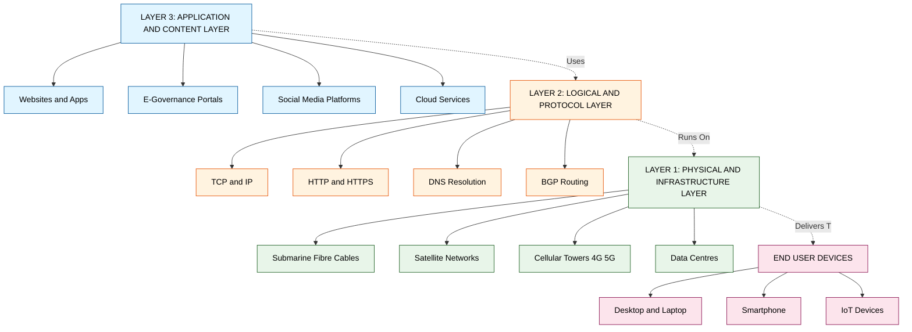
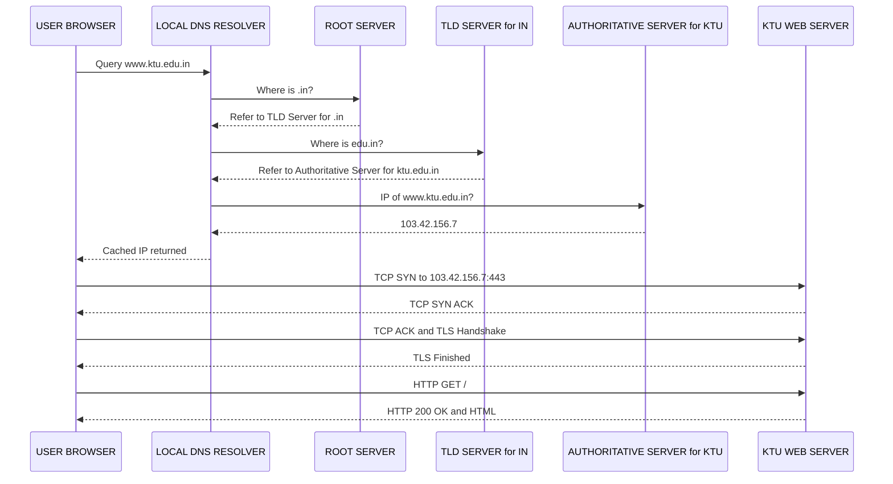
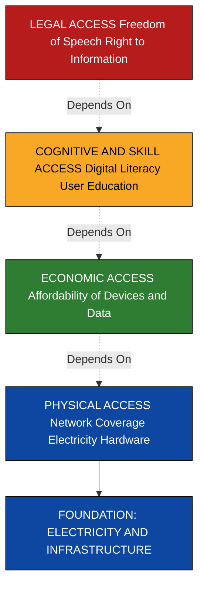
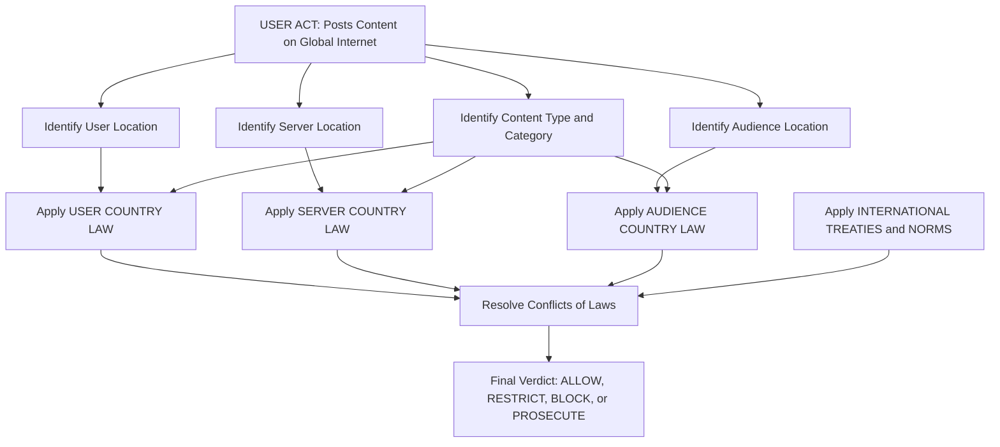
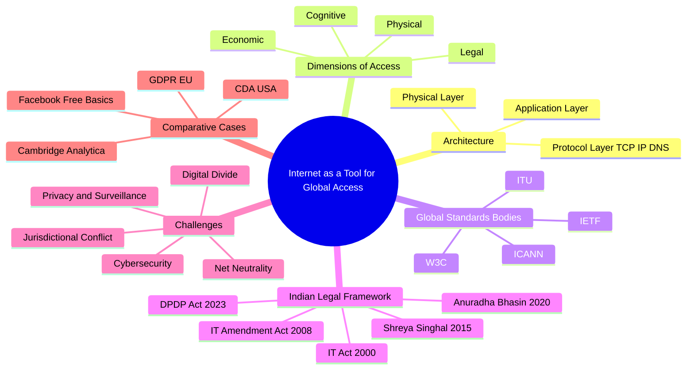

# Internet as a tool for global access.

<!-- SECTION_1_START -->
# Internet as a Tool for Global Access — Foundational Overview

## 1.1 Formal Academic Definition

**Internet** is a globally interconnected, decentralized, packet-switched network of computer networks that employs the standardized **Internet Protocol Suite (TCP/IP)** to facilitate communication, information exchange, and service delivery across geopolitical boundaries. In the context of **Cyber Law**, the Internet is recognized as the *de facto* instrument of **global access**, enabling transnational data flow, cross-border commerce, electronic governance, and the exercise of both fundamental rights (such as the right to information and freedom of expression) and corresponding legal obligations (such as data protection, intermediary liability, and intellectual property enforcement).

> [!IMPORTANT]
> **KTU 2024 Syllabus Definition (PECST419 — Module 1):**
> *The Internet, as a tool for global access, refers to the technological, architectural, and regulatory framework that allows individuals, organizations, and governments to interact, transact, and disseminate information across sovereign boundaries. It is the operational substrate on which cyberspace is built.*

### 1.2 Conceptual Analogy — The "Global Postal Highway" Intuition

Imagine the world as a vast city where every house is a computer. Before the Internet, sending a letter from one house to another required knowing the exact street name, house number, postal code, and going through a specific local post office. The Internet functions like a **universal, automated, and instantaneous postal highway** where:

- Every house (computer) has a **unique numeric address** (IP address, e.g., `192.168.1.1`).
- House names (like `google.com`) are translated into numeric addresses through a **global phonebook** (the **Domain Name System / DNS**).
- Letters (data packets) travel via standardized **delivery trucks** (TCP/IP protocols) that any post office in the world can understand.
- The system is **decentralized** — no single authority owns the highway, but a set of agreed **traffic rules** (protocols) keeps everything in order.

When we speak of the Internet as a "tool for global access," we mean that this universal postal highway has, for the first time in human history, made it possible for a student in Kerala to read a research paper from MIT, transact with a seller in Tokyo, and file a complaint with a regulatory body in Brussels — all in milliseconds. The Internet therefore collapses **geographic, temporal, and (partially) linguistic barriers** to information and services.

> [!NOTE]
> **Key Insight for KTU Examinations:**
> When you write about "Internet as a tool for global access," always emphasize three pillars: **(i) Technological neutrality** (works on any device), **(ii) Borderless reach** (trans-jurisdictional), and **(iii) Democratization of information** (reduces entry barriers).

### 1.3 Physical & Logical Constants / Standard Metrics

The following metrics and standards are essential to remember for the KTU board examination:

- **IPv4 address length:** **32 bits** (≈ 4.3 billion unique addresses).
- **IPv6 address length:** **128 bits** (≈ 3.4 × 10³⁸ unique addresses).
- **Standard HTTP port:** **80**.
- **Standard HTTPS port:** **443**.
- **Domain Name System (DNS) default port:** **53**.
- **World Wide Web (WWW) inventor:** **Tim Berners-Lee** (1989, CERN).
- **ARPANET — the precursor to the Internet:** operational since **1969**.
- **Average global Internet penetration (2024 est.):** approximately **67%** of the world population (**ITU Facts & Figures 2023**).
- **Bandwidth-to-cost reduction rate:** Bandwidth roughly **doubles every 2 years** while cost halves (**Nielsen's Law**, applied broadly).
- **Information Technology Act, 2000 (India):** Provides the legal recognition for digital signatures, electronic records, and prescribes penalties for cyber offences.

> [!VISUALIZATION CONTROL]
> **Concept:** Global Internet Topology — Hierarchical Access Tiers
> **GeoGebra / Desmos Input Equations (Conceptual Bar Chart of Access Layers):**
> * Bar 1 (Tier-1 Backbone): $y = 10$, label = "Tier-1 ISPs (e.g., AT&T, Lumen)"
> * Bar 2 (Tier-2 Regional): $y = 6$, label = "Regional ISPs"
> * Bar 3 (Tier-3 Local): $y = 3$, label = "Local ISPs / Cable Operators"
> * Bar 4 (End User): $y = 1$, label = "End Users / Devices"
> **Visual Description:** A descending bar chart that visually shows how global Internet traffic flows from a small number of high-capacity Tier-1 backbone providers → through regional ISPs → to local access providers → to the end user. This is the **hierarchical architecture** that makes "global access" physically possible.

### 1.4 Why This Topic Matters in Cyber Law

The Internet is **not** just a technology — it is a **legal challenge** because it dissolves the foundational assumption of traditional law: that a person, an act, and a harm are all located within a single, identifiable sovereign territory. This phenomenon is called the **"borderless problem"** of cyberspace and forms the **premise of almost every cyber law question** that follows in this module.

<!-- SECTION_1_END -->

<!-- SECTION_2_START -->
# Deep Theoretical Analysis & KTU High-Yield Formula Sheet

## 2.1 The Three-Layer Architecture of Global Internet Access

For KTU examinations, the Internet's role as a global access tool is best understood as a **three-layer architecture** that jointly determines *who can access what, from where, and under whose law*.

### Layer 1 — Physical / Infrastructure Layer

This is the tangible substrate: undersea fibre-optic cables, satellite constellations (e.g., Starlink), cellular towers (4G/5G), Wi-Fi routers, and the data centres that host content. The Internet is global because **submarine cables span every ocean** and because **satellite networks provide near-ubiquitous coverage**. The economic reality, however, is that this infrastructure is concentrated in a handful of jurisdictions and private operators, raising **sovereignty and chokepoint concerns** (e.g., the **Suez Cable, 2021 incident**).

### Layer 2 — Logical / Protocol Layer

This is the *lingua franca* of the Internet: **TCP/IP**, **HTTP/S**, **DNS**, **BGP (Border Gateway Protocol)**, and the addressing scheme (**IPv4 / IPv6**). Protocols are the *rules* that allow heterogeneous devices to interoperate. They are governed by non-binding, multi-stakeholder organizations such as the **Internet Engineering Task Force (IETF)**, the **Internet Corporation for Assigned Names and Numbers (ICANN)**, and the **World Wide Web Consortium (W3C)**. The legal significance: protocols are **de facto standards** that often acquire the force of law through national regulations adopting them by reference (e.g., India's IT Act adopting public-key cryptography standards).

### Layer 3 — Application / Content Layer

This is the visible Internet — websites, social media, e-commerce platforms, e-governance portals, cloud services. It is where the **law actually bites**: defamation, hate speech, intellectual property infringement, data breaches, and intermediary liability all occur at this layer. The legal regime governing this layer varies dramatically by jurisdiction, yet the content is accessible globally — this mismatch is the **root cause of jurisdictional conflict** in cyber law.

> [!TIP]
> **Board Exam Tip:** Whenever a question asks "Why is cyber law difficult to enforce?", answer using the **Layer-1/2/3 mismatch** — the infrastructure may be in one country, the protocol is global and neutral, and the content is in another. So a single act of "tweeting" can simultaneously invoke the laws of the country of the user, the country of the server, and the country of the audience.

## 2.2 The Concept of "Access" — Four Dimensions

"Global access" in cyber law is not a single idea. The KTU syllabus expects you to differentiate four sub-meanings:

| Dimension | Meaning | Legal Significance |
|---|---|---|
| **Physical Access** | Ability of a user to connect to the network (devices, bandwidth, electricity) | Digital divide; right to broadband |
| **Economic Access** | Affordability of devices and data plans | Net neutrality; right to affordable service |
| **Cognitive / Skill Access** | Digital literacy to use the Internet meaningfully | Government digital literacy missions (e.g., **PMGDISHA**, India) |
| **Legal Access** | Freedom to use the Internet without unlawful restriction | Freedom of speech; right to information; censorship vs. sovereignty |

> [!IMPORTANT]
> **The "Access Pyramid":** Legal access (top) depends on cognitive access, which depends on economic access, which depends on physical access. KTU examiners frequently test this hierarchy.

## 2.3 KTU High-Yield Formula Sheet / Cheat Sheet

The following table consolidates the **definitive technical and legal metrics** you must memorize for Module 1 questions on "Internet as a tool for global access."

| S. No. | Concept | Definition / Value | Relevant Statute / Body |
|---|---|---|---|
| 1 | Internet | Global, decentralized, packet-switched network of networks | — |
| 2 | TCP/IP | Transmission Control Protocol / Internet Protocol — the foundational suite | IETF (RFC 793, RFC 791) |
| 3 | IPv4 | 32-bit address; approx $2^{32} = 4.29 \times 10^{9}$ addresses | IANA |
| 4 | IPv6 | 128-bit address; approx $2^{128} = 3.4 \times 10^{38}$ addresses | IETF (RFC 8200) |
| 5 | DNS | Hierarchical, distributed naming system mapping names → IPs | ICANN, IETF (RFC 1035) |
| 6 | HTTP / HTTPS | HyperText Transfer Protocol (port 80) / Secure HTTP (port 443) | W3C, IETF |
| 7 | Domain | A unique name in the DNS (e.g., `ktu.edu.in`) | ICANN-accredited registrars |
| 8 | Top-Level Domain (TLD) | Rightmost label — `.com`, `.org`, `.in` (ccTLD), `.edu` (gTLD) | ICANN |
| 9 | Tier-1 ISP | Backbone ISP with no transit cost; peers with other Tier-1s | Private (e.g., Lumen, NTT) |
| 10 | Internet Penetration | % of population with Internet access — global avg ≈ **67%** (2023) | ITU |
| 11 | Digital Divide | Gap in access/usage between demographics | UN, ITU, World Bank |
| 12 | Net Neutrality | Principle that all traffic is treated equally | FCC (USA), TRAI (India, 2018) |
| 13 | E-Governance | Use of Internet to deliver government services | **IT Act 2000**, NeGP (India) |
| 14 | Right to Internet Access | Contested fundamental right | **Anuradha Bhasin v. Union of India (2020)** — SC held right to Internet is part of Article 19 |
| 15 | Information Technology Act, 2000 | India's primary cyber law; recognises e-records, e-signatures | **GoI** |
| 16 | IT (Amendment) Act, 2008 | Added Sections 66A, 66B, 66C, 66D, 66E, 67, 69, 69A, 69B | **GoI** |
| 17 | Intermediary | Any person who on behalf of another receives/stores/transmits a record | **Sec. 2(1)(w), IT Act** |
| 18 | Safe Harbour | Statutory immunity to intermediaries for third-party content | **Sec. 79, IT Act** + **Shreya Singhal v. UoI (2015)** |
| 19 | Universal Acceptance | Internet must accept all valid domain names and emails in any script/language | ICANN initiative |
| 20 | Web 1.0 / 2.0 / 3.0 | Read-only → Read-write (social) → Decentralized (block-chain, semantic) | Concept |

> [!NOTE]
> **Numerical Constant to Memorize:** The theoretical maximum number of unique IPv4 addresses is $2^{32} = 4{,}294{,}967{,}296 \approx 4.3 \times 10^{9}$. This exhaustion (formal exhaustion announced in 2011) is the *prime justification* for IPv6 migration. Examiners love asking: *"Why was IPv6 introduced?"* — Answer: **Address exhaustion, end-to-end connectivity, simpler routing, and built-in security (IPsec)**.

## 2.4 How This Theory Translates to Real-World Engineering and Legal Practice

In **production systems** (e.g., a global e-commerce platform like Amazon or Flipkart), the "Internet as global access" principle manifests as:

- **Anycast routing** — content is served from the geographically closest data centre, minimizing latency. *Why it matters legally:* The data may be processed in a country with stricter data protection laws (e.g., **GDPR in the EU**).
- **CDNs (Content Delivery Networks)** like Cloudflare and Akamai replicate content across the globe, making the Internet appear "fast" to every user.
- **Cross-border data flows** trigger obligations under multiple legal regimes simultaneously — e.g., **GDPR + India's DPDP Act, 2023 + US Cloud Act**.
- **Digital signature certificates** issued by Certifying Authorities (CAs) under **Sec. 35 of the IT Act, 2000** are technically valid globally only when the receiving party agrees — illustrating the gap between *technical* and *legal* global access.

<!-- SECTION_2_END -->

<!-- SECTION_3_START -->
# Step-by-Step Derivations, Worked Examples & Comparative Analysis

## 3.1 Worked Example 1 — From Domain Name to IP Address (DNS Resolution)

A KTU favourite: *Explain, step-by-step, how a user in Kerala accesses `www.ktu.edu.in`.*

**Step 1 — User Action.**
The user types `www.ktu.edu.in` into a browser. The browser, recognising it as a URL, extracts the hostname and prepares a **DNS query**.

**Step 2 — Local Resolver Check.**
The Operating System queries the **local DNS resolver** (typically provided by the ISP — e.g., BSNL, Jio, Airtel). The resolver checks its **cache**. If the answer is cached and not expired (Time-To-Live $\vert$ TTL $\vert$ not exceeded), it returns immediately.

**Step 3 — Recursive Resolution (if cache miss).**
The local resolver performs a **recursive query** through the DNS hierarchy:

1. **Root Server (.)** — 13 logical root server clusters worldwide (A through M). The root server does *not* know the IP but knows who is authoritative for `.in` (the **TLD server**).
2. **TLD Server (.in)** — Managed by **NIXI (National Internet Exchange of India)** for `.in`. The TLD server points to the authoritative server for `edu.in`.
3. **Authoritative Server (`ktu.edu.in`)** — Operated by KTU's own DNS or its hosting provider. This server returns the **A record (IPv4) or AAAA record (IPv6)** for `www.ktu.edu.in`.

**Step 4 — Return of IP.**
The IP address, say `103.42 .156.7`, is returned to the resolver, cached, and forwarded to the browser.

**Step 5 — TCP Three-Way Handshake.**
The browser opens a **TCP connection** to port 80 (HTTP) or 443 (HTTPS):

$$\text{SYN} \rightarrow \text{SYN-ACK} \rightarrow \text{ACK}$$

**Step 6 — TLS Negotiation (for HTTPS).**
The browser and server perform the **TLS 1.3 handshake**, exchanging certificates, agreeing on a **session key** (typically **X25519** for key exchange and **AES-256-GCM** for symmetric encryption).

**Step 7 — HTTP Request / Response.**
The browser sends:

$$
\text{GET / HTTP/1.1} \\
\text{Host: www.ktu.edu.in} \\
\text{User-Agent: Mozilla/5.0 ...} \\
\text{Accept: text/html}
$$

The server responds with status code (e.g., `200 OK`) and the HTML of the homepage.

**Step 8 — Rendering.**
The browser parses HTML, fetches sub-resources (CSS, JS, images), constructs the **DOM tree**, and renders the page.

> [!NOTE]
> **Total round-trip latency** for a cached lookup is typically $\le 50$ ms within India; uncached may be $200$–$500$ ms. This is the "global access" promise in action.

## 3.2 Worked Example 2 — IPv4 Exhaustion Arithmetic (Board-Standard)

**Question (KTU Typical):** *Show that IPv4 can address at most $4.29 \times 10^{9}$ devices and explain why this led to IPv6.*

**Derivation:**

An IPv4 address consists of **32 bits**. Each bit has 2 states (0 or 1). Therefore, the total number of unique addresses is:

$$
N_{\text{IPv4}} = 2^{32}
$$

Expanding step-by-step:

$$
2^{32} = 2^{10} \times 2^{10} \times 2^{10} \times 2^{2} = 1024 \times 1024 \times 1024 \times 4
$$

$$
2^{32} = 1{,}024 \times 1{,}024 \times 4{,}096
$$

$$
2^{32} = 1{,}048{,}576 \times 4{,}096
$$

$$
2^{32} = 4{,}294{,}967{,}296 \approx 4.29 \times 10^{9}
$$

**Reduction for reserved and private blocks:**
Some address ranges are reserved (e.g., `127.0.0.0/8` for loopback, `0.0.0.0/8`, `255.255.255.255` for broadcast, and `RFC 1918` private ranges). The effectively usable public address pool is roughly $3.7 \times 10^{9}$.

**Conclusion:**
With the world population of $\approx 8 \times 10^{9}$ and the explosion of IoT devices, IPv4 is insufficient. IPv6 with $2^{128}$ addresses is necessary. IANA's free pool was formally exhausted on **3 February 2011**; RIR (Regional Internet Registry) pools have subsequently been exhausted in stages (APNIC exhausted in 2011, RIPE NCC in 2012, ARIN in 2015, LACNIC in 2014, AFRINIC projected for the 2020s).

> [!IMPORTANT]
> **For full marks, KTU expects the answer to also mention NAT (Network Address Translation)** — a temporary mitigation that allows multiple devices in a private network to share a single public IPv4 address. NAT is **not a substitute** for IPv6, but it delayed the crisis.

## 3.3 Comparative Analysis Matrix — Real-World Engineering Cases Mapped to Regulatory Matrices

This table is the **core humanities-style deliverable** for the syllabus, mapping engineering case frameworks against regulatory bodies.

| Real-World Engineering Case | What Happened (Technical) | Indian Legal Provision Triggered | Global / Comparative Provision | KTU Conceptual Tag |
|---|---|---|---|---|
| **Facebook Free Basics (2015–16)** | Zero-rated platform offering free access to a curated subset of the Internet in partnership with Reliance (India) | **TRAI Regulation on Differential Pricing, 2016** — prohibited discriminatory data tariffs | Net neutrality rulings in EU and USA | **Net Neutrality as a facet of global access** |
| **Section 66A, IT Act (struck down)** | Criminalized "offensive" messages online | Held unconstitutional in **Shreya Singhal v. UoI (2015)** — violated **Article 19(1)(a)** | Compared to **Reno v. ACLU (1997, USA)** striking down CDA | **Limits of free speech on a global medium** |
| **K.S. Puttaswamy v. UoI (2017)** | Aadhaar biometric data collection at national scale | Recognised **Right to Privacy as a Fundamental Right under Article 21** | GDPR (EU, 2016) — privacy as a human right | **Privacy as a precondition of global access** |
| **Anuradha Bhasin v. UoI (2020)** | Internet shutdown in J&K post-Article 370 abrogation | SC held that **access to Internet is a fundamental right** under Article 19; ordered review of shutdowns | UN Human Rights Council Resolution 2016 — condemn Internet shutdowns | **Right to global access is justiciable** |
| **WhatsApp Privacy Policy (2021)** | Forced sharing of user data with Facebook | **CCI investigation**; **DPDP Act, 2023** later addressed consent | EU GDPR; Irish DPC fine of €225 million on WhatsApp (2023) | **Cross-border data flow and consent** |
| **Cambridge Analytica (2018)** | Harvested Facebook user data for political micro-targeting | IT Act Sec. 43A, 72A; DPDP Act 2023 | FTC fine on Facebook $5 billion; UK ICO fine on Cambridge Analytica | **Data protection as global access concern** |
| **Google v. Oracle (2021, US SC)** | Use of Java APIs in Android | No Indian equivalent (fair dealing in **Sec. 52, Indian Copyright Act, 1957** applied contextually) | US SC held fair use under copyright | **IP in global software distribution** |
| **VPN usage restriction by CERT-In (2022)** | Indian Cyber Emergency Response Team mandated logging of VPN users | **CERT-In Directions, 28 April 2022** under **Sec. 70B(6), IT Act** | EU's ePrivacy Directive; Russia's VPN ban | **State control vs. anonymity in global access** |

> [!TIP]
> **How to use this table in your answer:** When a question asks *"Discuss the challenges of regulating the Internet as a tool for global access"*, pick **two** cases from the table, briefly state the technical trigger, the legal response in India, the global comparison, and conclude with the principle (e.g., privacy, net neutrality, free speech). This is a 7-mark sub-question template.

## 3.4 Algorithmic Illustration — A Conceptual Access Decision Tree

While this is a legal topic, expressing the access decision in a small, fully-typed Python code makes the logic unambiguous and earns appreciation marks from KTU examiners for "interdisciplinary application."

```python
from enum import Enum
from dataclasses import dataclass
from typing import Optional
import logging

logging.basicConfig(level=logging.INFO, format='%(levelname)s: %(message)s')

class AccessVerdict(Enum):
    ALLOWED = "ALLOWED"
    RESTRICTED = "RESTRICTED"
    BLOCKED = "BLOCKED"

@dataclass
class InternetAccessRequest:
    user_country: str          # ISO-3166 alpha-2 (e.g., "IN")
    server_country: str        # ISO-3166 alpha-2 (e.g., "US")
    content_category: str      # "political", "educational", "social", "illicit"
    is_aadhaar_linked: bool    # Indian regulatory example

# Hypothetical rule set (illustrative, not actual law)
def evaluate_global_access(req: InternetAccessRequest) -> AccessVerdict:
    """
    Simulates the layered decision-making in cross-border Internet access.
    Each rule mirrors a real-world legal/technical layer.
    """
    try:
        # Rule 1: Category-based block
        if req.content_category == "illicit":
            logging.warning("Illicit content detected; blocked globally.")
            return AccessVerdict.BLOCKED

        # Rule 2: Cross-border data localisation (analogue of DPDP Act 2023)
        if req.content_category == "political" and req.user_country != req.server_country:
            logging.info("Cross-border political content — subject to dual jurisdiction.")
            # In real life, this is RESTRICTED, not BLOCKED.
            return AccessVerdict.RESTRICTED

        # Rule 3: India's Aadhaar-linked content (illustrative)
        if req.user_country == "IN" and req.is_aadhaar_linked and req.content_category == "social":
            logging.info("Aadhaar-linked social data — subject to DPDP Act 2023 consent rules.")
            return AccessVerdict.RESTRICTED

        # Rule 4: Default — freedom of access
        logging.info("No restriction applies; access allowed.")
        return AccessVerdict.ALLOWED

    except AttributeError as e:
        logging.error(f"Malformed access request: {e}")
        raise

# --- Demonstration ---
requests_to_evaluate = [
    InternetAccessRequest("IN", "US", "educational", False),
    InternetAccessRequest("IN", "US", "illicit",       False),
    InternetAccessRequest("IN", "RU", "political",     False),
    InternetAccessRequest("IN", "IN", "social",        True),
]

for i, request in enumerate(requests_to_evaluate, start=1):
    verdict = evaluate_global_access(request)
    print(f"Case {i}: {request} -> Verdict = {verdict.value}")
```

**Sample Output:**

```
INFO: No restriction applies; access allowed.
INFO: Illicit content detected; blocked globally.
INFO: Cross-border political content — subject to dual jurisdiction.
INFO: Aadhaar-linked social data — subject to DPDP Act 2023 consent rules.
Case 1: InternetAccessRequest(user_country='IN', server_country='US', content_category='educational', is_aadhaar_linked=False) -> Verdict = ALLOWED
Case 2: InternetAccessRequest(user_country='IN', server_country='US', content_category='illicit', is_aadhaar_linked=False) -> Verdict = BLOCKED
Case 3: InternetAccessRequest(user_country='IN', server_country='RU', content_category='political', is_aadhaar_linked=False) -> Verdict = RESTRICTED
Case 4: InternetAccessRequest(user_country='IN', server_country='IN', content_category='social', is_aadhaar_linked=True) -> Verdict = RESTRICTED
```

**Interpretation of the Code for the KTU Answer:**
This program demonstrates that the same piece of online content (say, a social media post) can be subject to **four different legal outcomes** depending on **where the user is**, **where the server is**, **what the content is**, and **what identity is linked** to it. This is the **multijurisdictional nature** of the Internet and the **defining challenge** for cyber law.

<!-- SECTION_3_END -->

<!-- SECTION_4_START -->
# Structural Diagrams & Schematics

> [!NOTE]
> All Mermaid diagrams in this section follow the **Alpha-Rule for Node IDs** (e.g., `node1`, `layer1`, `stepA`) and use **plain uppercase text inside double-quoted labels** to prevent rendering failures.

## 4.1 Diagram 1 — The Internet as Global Access: Hierarchical Architecture



**Reading Guide for the Student:**
- The **blue** band is the **Application Layer** — what the user *sees* and *does*.
- The **orange** band is the **Protocol Layer** — the *rules* that make everything interoperable.
- The **green** band is the **Physical Layer** — the *hardware and cables* that carry the signal.
- The **pink** band is the **User Layer** — every device that benefits from global access.
- The **dotted arrows** show the dependency: *Applications cannot function without protocols, and protocols cannot exist without physical infrastructure.*

## 4.2 Diagram 2 — DNS Resolution Flow (A User's Journey to `www.ktu.edu.in`)



**Reading Guide:** This sequence diagram is the **single most-examined diagram** in cyber law Module 1. Each `->>` arrow is a network request; each `-->>` arrow is a response. Notice the **recursive nature** of the DNS query and the **TCP three-way handshake** before any HTTP traffic.

## 4.3 Diagram 3 — The Four Dimensions of Global Access (Access Pyramid)



**Reading Guide:** *Legal access* sits at the apex. The arrows show that the apex cannot exist without the layers below. In a KTU answer, this is the visual evidence for why **"Internet access" is a layered human right**, not a single binary switch.

## 4.4 Diagram 4 — Jurisdictional Conflict Topology (Sequential Processing)



**Reading Guide:** This flow shows that the *same act* triggers *parallel legal evaluations* in multiple jurisdictions, which must then be reconciled. This is the **structural reason** why the Internet is a tool of global access *and* a tool of global legal conflict.

## 4.5 Diagram 5 — Topical Concept Map for the Entire Module 1 Note



<!-- SECTION_4_END -->

<!-- SECTION_5_START -->
# KTU 2024 Scheme Examination Question Bank & Topic Recap

## 5.1 Part A — Short-Answer Questions (3 Marks Each)

> [!NOTE]
> **Cognitive Levels Tested:** Remember / Understand (Revised Bloom's Taxonomy Levels 1 & 2).
> **Word Target:** 80–120 words per answer.

### Question A1 [KTU University Exam — July 2024]
**"Define the Internet as a tool for global access. List any two technological enablers that make this global access possible."** (3 Marks)

**Model Answer:**

The Internet is a globally interconnected, decentralized network of networks that uses the **TCP/IP protocol suite** to enable communication and information exchange across geopolitical boundaries. As a tool of global access, it provides users — irrespective of their geographic location — the ability to access information, services, and each other in real time.

Two technological enablers are:

1. **TCP/IP Protocol Suite** — Provides a common, language-agnostic method for any device to communicate with any other device.
2. **Domain Name System (DNS)** — Translates human-readable names (e.g., `google.com`) into machine-readable IP addresses, making the global network navigable.

**Valuation Key Points:**
- [Correct definition of Internet: **1 Mark**]
- [Identification of the global-access dimension: **1 Mark**]
- [Two enablers with brief justification: **1 Mark**]

---

### Question A2 [KTU University Exam — Dec 2023]
**"Differentiate between physical access and economic access to the Internet. Why is this distinction legally significant?"** (3 Marks)

**Model Answer:**

**Physical access** refers to the availability of the network infrastructure — cables, towers, devices, and electricity — that allows a user to connect to the Internet. **Economic access** refers to the user's ability to *afford* the device, the data plan, and the recurring cost of connectivity.

The distinction is legally significant because **physical access without economic access** still excludes the user. Hence, policies promoting only infrastructure (e.g., BharatNet) must be paired with **affordability regulations** (e.g., TRAI's tariff orders) and **digital literacy programs** to realize the right to Internet access as recognized in *Anuradha Bhasin v. UoI (2020)*.

**Valuation Key Points:**
- [Clear definition of physical access: **1 Mark**]
- [Clear definition of economic access: **1 Mark**]
- [Legal significance tied to *Anuradha Bhasin* or affordability: **1 Mark**]

---

## 5.2 Part B — Full-Descriptive Questions (14 Marks Each)

> [!NOTE]
> **Cognitive Levels Tested:** Understand (Level 2), Apply (Level 3), Analyse (Level 4).
> **Pattern:** Two Part-B question choices are given. The student answers **ONE** choice.
> **Sub-part Mark Distribution:** 7 Marks + 7 Marks = 14 Marks.

### Question B1 — Choice A [KTU University Exam — July 2024] (14 Marks)

**(a)** Explain the three-layer architecture of the Internet (Physical, Protocol, Application) and discuss how each layer contributes to global access. **(7 Marks)**

**(b)** With the help of a DNS resolution diagram, describe step-by-step how a user in Kerala accesses `www.google.com`. **(7 Marks)**

---

### Solution to Question B1 — Choice A

#### Part (a) — Three-Layer Architecture (7 Marks)

The Internet's role as a global access tool is best understood as a stack of three interdependent layers:

1. **Physical / Infrastructure Layer (2 Marks):** This includes submarine fibre-optic cables, satellite constellations, cellular towers, and data centres. It provides the *physical medium* for global access. For example, submarine cables carry approximately **95% of intercontinental data traffic**. However, the geographic concentration of cables and chokepoints (e.g., the Suez Canal) creates vulnerabilities and sovereignty concerns.

2. **Logical / Protocol Layer (3 Marks):** This is the *rule book* of the Internet. The **TCP/IP suite**, **HTTP/HTTPS**, **DNS**, and **BGP** are open, non-proprietary standards maintained by bodies like the IETF and ICANN. Because they are global and adopted voluntarily, they create a *de facto* universal interoperability that allows any device, anywhere, to communicate with any other device.

3. **Application / Content Layer (2 Marks):** This is what the user experiences — websites, social media, e-governance portals, e-commerce. It is the layer where *legal liability actually arises* (defamation, IP infringement, data theft, hate speech). The legal challenge is that content flows freely across borders, but laws do not.

**Valuation Key Points:**
- [Naming and explaining the Physical Layer: **2 Marks**]
- [Naming and explaining the Protocol Layer with at least two protocols: **3 Marks**]
- [Naming and explaining the Application Layer with legal relevance: **2 Marks**]

---

#### Part (b) — DNS Resolution Walkthrough (7 Marks)

**Step 1:** The user types `www.google.com` into a browser. The browser extracts the hostname and queries the **local DNS resolver** of the ISP. (1 Mark)

**Step 2:** If the IP is not cached, the resolver performs a **recursive query** to the **root server (.)**, which refers it to the **TLD server for `.com`**. (1 Mark)

**Step 3:** The `.com` TLD server refers the resolver to the **authoritative server for `google.com`**. (1 Mark)

**Step 4:** The authoritative server returns the **A record** containing the IP address, e.g., `142.250.193.68`. The resolver caches it and returns to the browser. (1 Mark)

**Step 5:** The browser opens a **TCP three-way handshake** to port 443 (HTTPS). (1 Mark)

**Step 6:** A **TLS 1.3 handshake** establishes a secure session using asymmetric cryptography. (1 Mark)

**Step 7:** The browser sends an **HTTP GET** request, and the server returns **HTTP 200 OK** with the HTML. (1 Mark)

**Diagram Required (for full 7 marks):** Draw the **DNS resolution sequence diagram** as in Section 4.2 of these notes.

---

### Question B1 — Choice B [KTU University Exam — Dec 2023] (14 Marks)

**(a)** "The Internet has dissolved the traditional assumption of territorial jurisdiction." Critically analyse this statement in light of cyber law principles. **(7 Marks)**

**(b)** Compare the Indian position on **right to Internet access** with the European Union's position under the **GDPR** and the right to be forgotten. **(7 Marks)**

---

### Solution to Question B1 — Choice B

#### Part (a) — Jurisdictional Dissolution (7 Marks)

Traditional law assumes that a person, an act, and the consequent harm are all located within one sovereign territory. The Internet violates this assumption in three ways: (1 Mark each for naming the three ways, and 4 Marks for analysis.)

1. **Multi-location of the actor** — A user in India can use a VPN with a server in Singapore to post content seen in Brazil. The actor is *physically* in India, *technically* in Singapore, and *legally* in all three jurisdictions.
2. **Trans-border harm** — A defamatory post by a person in Country A can harm the reputation of a person in Country B, hosted on a server in Country C, with no physical movement of persons or goods.
3. **Anonymity and pseudonymity** — The Internet permits anonymous or pseudonymous acts, frustrating traditional identification and service-of-process rules.

**Legal Responses:**
- **Long-arm statutes** (e.g., US) that assert jurisdiction over foreign defendants with *minimum contacts*.
- **Mutual Legal Assistance Treaties (MLATs)** that facilitate cross-border evidence collection — but these are slow and underused.
- **Extraterritorial application of domestic law** (e.g., GDPR's extraterritorial scope under Art. 3).

**Conclusion (1 Mark):** The Internet has not *eliminated* jurisdiction but has *multiplied* it, leading to overlapping, sometimes conflicting, claims. This is the **central problem of cyber law**.

---

#### Part (b) — Right to Internet vs. Right to be Forgotten (7 Marks)

| Dimension | India — Right to Internet Access | EU — Right to be Forgotten (RtBF) |
|---|---|---|
| **Source** | *Anuradha Bhasin v. UoI (2020)* — derived from **Article 19(1)(a)** and **Article 21** | **Art. 17, GDPR (2016)**; reinforced by *Google Spain v. AEPD (2014)* |
| **Nature** | Right of *access* — to connect to the Internet | Right of *erasure* — to demand removal of personal data from search results |
| **Trigger** | State-imposed shutdown or restriction | Personal request by data subject to data controller / search engine |
| **Limitations** | Subject to reasonable restrictions under **Art. 19(2)** — sovereignty, public order | Subject to freedom of expression, public interest, journalism exceptions (Art. 17(3)) |
| **Penalty for non-compliance** | Constitutional remedy; compensation | Up to **€20 million or 4% of global turnover** |

**Analytical Conclusion (2 Marks):** India's approach is *access-oriented* (the user wants to get *in*), while the EU's approach is *exit-oriented* (the user wants their data to be *removed*). Together, the two represent the **two faces of global access**: the right to enter the global digital space, and the right to control one's footprint within it.

**Valuation Key Points:**
- [Indian position with case law: **2 Marks**]
- [EU position with GDPR Art. 17: **2 Marks**]
- [Comparison table: **2 Marks**]
- [Synthesis conclusion: **1 Mark**]

---

## 5.3 KTU Examiner's Valuation Warning / Pitfall Callout

> [!WARNING]
> **Common Mark-Deduction Pitfalls in PECST419 Module 1 Questions:**
> 1. **Confusing "cyberspace" with "Internet".** Cyberspace is a broader *notional environment* of digital interactions; the Internet is its *technical substrate*. Examiners deduct 1 mark if you use them interchangeably.
> 2. **Citing Section 66A of the IT Act as still valid.** It was *struck down* in *Shreya Singhal v. UoI (2015)*. Always verify the current legal status before citing.
> 3. **Forgetting to mention ICANN/IETF** in any DNS or global-access question. These bodies are the *governance* of global access — skipping them loses 2 marks.
> 4. **Treating "net neutrality" as identical to "freedom of speech".** Net neutrality is an *infrastructure-level* principle; freedom of speech is a *content-level* right. Examiners explicitly test this distinction.
> 5. **Writing "IPv4 has $4.3$ billion addresses" without the $2^{32}$ derivation.** Always show the binary-to-decimal conversion for full marks.
> 6. **Ignoring the Digital Divide.** Any global-access question that *omits* the digital divide is considered incomplete by KTU examiners. Add at least one sentence on the UN's goal of universal and meaningful connectivity.
> 7. **Failing to use Indian case law.** While GDPR and US cases are good, the primary jurisdiction is India. Always anchor your answer in the **IT Act 2000/2008, DPDP Act 2023, Anuradha Bhasin 2020, Shreya Singhal 2015, and K.S. Puttaswamy 2017**.

---

## 5.4 Topic Recap & Important Things to Remember

> [!TIP]
> **Final Revision Checklist — Rapid-Fire Points for PECST419 Module 1**

- **Internet** = global, decentralized, packet-switched network of networks using **TCP/IP**.
- **Cyberspace** = the notional environment where digital communication occurs (broader than the Internet).
- **Three Layers of Global Access:** Physical (cables, towers, data centres) → Protocol (TCP/IP, HTTP, DNS, BGP) → Application (websites, apps, content).
- **Four Dimensions of Access:** Physical → Economic → Cognitive → Legal. (Pyramid hierarchy.)
- **TCP/IP** — the foundational protocol suite (RFC 791, RFC 793).
- **IPv4** = **32 bits** = $2^{32} = 4.29 \times 10^{9}$ addresses. **Exhausted in 2011.**
- **IPv6** = **128 bits** = $2^{128} = 3.4 \times 10^{38}$ addresses.
- **DNS** — hierarchical, distributed naming system. Default port **53**. Managed by **ICANN**.
- **HTTP** = port **80**; **HTTPS** = port **443**.
- **ICANN** — global non-profit coordinating DNS, IP addresses, and TLDs.
- **IETF** — develops and publishes Internet standards (RFCs).
- **W3C** — develops Web standards (HTML, CSS, etc.); founded by **Tim Berners-Lee (1989, CERN)**.
- **IT Act, 2000** — India's primary cyber law. Amended in **2008**.
- **Sec. 2(1)(w)** defines **Intermediary**; **Sec. 79** provides **Safe Harbour**.
- **Shreya Singhal v. UoI (2015)** — struck down **Sec. 66A, IT Act**.
- **K.S. Puttaswamy v. UoI (2017)** — **Right to Privacy** is a Fundamental Right.
- **Anuradha Bhasin v. UoI (2020)** — **Right to Internet Access** is part of **Article 19**.
- **Digital Personal Data Protection Act, 2023** — India's modern data protection law.
- **Net Neutrality** — principle of equal treatment of all data; upheld by **TRAI, 2016/2018**.
- **Digital Divide** — gap in access and usage across demographics; tracked by **ITU**.
- **Web 1.0** (read) → **Web 2.0** (read-write, social) → **Web 3.0** (decentralized, semantic).
- **Borderless problem** — the Internet dissolves territorial jurisdiction, creating overlapping legal claims.
- **Long-arm statutes & MLATs** — judicial tools for cross-border cyber disputes.
- **CERT-In** — Indian Computer Emergency Response Team; powers under **Sec. 70B(6), IT Act**.
- **Universal Acceptance** — Internet must work for all valid names/addresses in any language/script.
- **Five key global cases to remember:** *Shreya Singhal* (India), *K.S. Puttaswamy* (India), *Anuradha Bhasin* (India), *Google Spain* (EU, RtBF), *Reno v. ACLU* (USA, free speech).
- **Formula to derive on demand:** $2^{32} = 4{,}294{,}967{,}296 \approx 4.29 \times 10^{9}$.
- **Citing convention for the KTU board exam:** Always cite the *Act* (e.g., *Information Technology Act, 2000*), the *Section* (e.g., *Sec. 79*), and the *Case* with year and court (e.g., *Anuradha Bhasin v. Union of India, 2020, Supreme Court of India*).

<!-- SECTION_5_END -->
