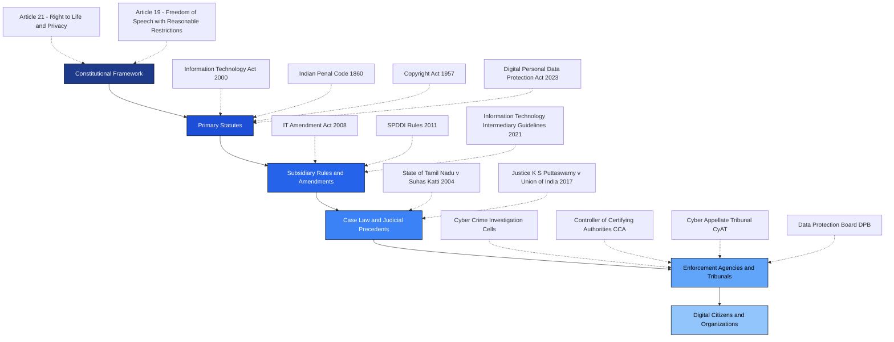
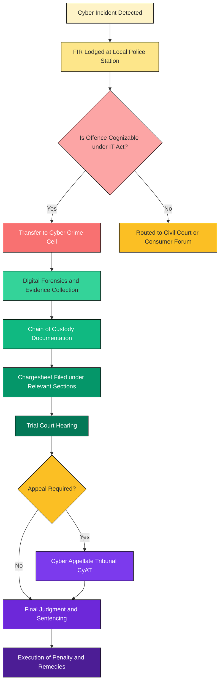
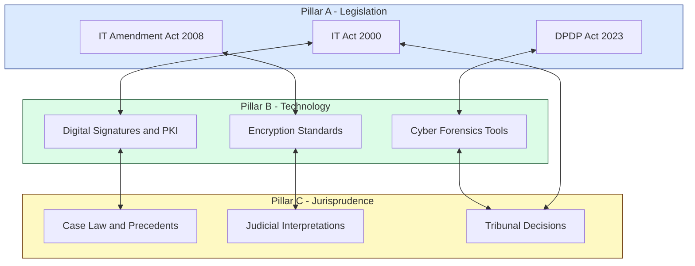

# Introduction to cyber law

<!-- SECTION_1_START -->

# Introduction to Cyber Law

## 1.1 Formal Academic Definition (KTU 2024 Syllabus Terminology)

**Cyber Law** is the body of legal principles, statutory provisions, regulatory rules, judicial precedents, and case-law interpretations that govern the use of the internet, computers, digital networks, and all forms of electronic communication and data exchange in cyberspace. It encompasses the legal framework required to regulate digital identities, electronic commerce, intellectual property, data privacy, digital signatures, cybercrime, and the admissibility of electronic evidence in courts of law.

> [!IMPORTANT]
> **Definition (KTU Board Standard):** *Cyber Law* may be formally defined as *"the law governing the legal issues associated with the use of internet, computers, digital networks, electronic communication, and information technology infrastructure."*

**Cyberspace**, on the other hand, is the notional, intangible, non-physical environment created by the interconnection of computer systems, networks, telecommunications infrastructure, and digital data. The term was coined by **William Gibson** in his 1984 novel *Neuromancer* and is commonly described as the **virtual world of computers, networks, and the Internet**.

> [!NOTE]
> **Jurisprudence Foundation:** Cyber law is a branch of *Juridical Science* (a term popularized by **Justice P.B. Sawant**) that deals with the relationship between legally valid cyber interactions and the physical, regulatory world. Its primary function is to give a **legal framework** to activities that occur in a domain which is otherwise borderless, anonymous, and jurisdictionally ambiguous.

## 1.2 Conceptual Analogy & Intuitive Overview

Imagine a massive, multi-lane, 24/7 highway where anyone in the world can drive at any speed, in any direction, without visible road signs, traffic signals, or even a known destination. This highway is **cyberspace**. Now imagine if this highway had no traffic rules — no speed limits, no licensing, no insurance, no police patrols, and no concept of right-of-way.

That would be chaos, wouldn't it?

**Cyber Law is essentially the "Traffic Rule Book" of this digital highway.** It tells us:

- **Who can drive** (identity & authentication via digital signatures).
- **What is the speed limit** (acceptable use policies, bandwidth governance).
- **Where to park** (data storage jurisdictions and server localization).
- **What to do in a crash** (incident reporting, cyber forensics, e-evidence).
- **What the penalties are** (fines, imprisonment, and asset seizure under the IT Act 2000).

Just as the Motor Vehicles Act transformed Indian roads from chaotic to orderly, the **Information Technology Act, 2000 (IT Act)** transformed Indian cyberspace into a legally governed environment. The **IT (Amendment) Act, 2008** further strengthened this framework by introducing the concept of *data privacy*, *intermediary liabilities*, and *cyber terrorism*.

> [!TIP]
> **Real-world Analogy — The Digital Constitution:** If the Indian Constitution is the law of the land, then the **IT Act, 2000** is often referred to as the *"Magna Carta of the Digital World"* in India.

## 1.3 GeoGebra / Desmos Integration

> [!VISUALIZATION CONTROL]
> **Concept:** Relationship Between Cyberspace, Users, and Cyber Law (Cartesian Mapping)
> 
> **GeoGebra / Desmos Input Equations:**
> * $f(x) = \sin(x) \cdot e^{-0.05x}$ — represents the *unbounded, oscillatory growth* of digital activity in cyberspace.
> * $g(x) = \frac{1}{1 + e^{-x}}$ — represents the *logistic adoption curve* of cyber law enforcement.
> * Intersection Point: $A = (x, f(x) \cap g(x))$
> 
> **Visual Description:** The student should observe that $f(x)$ (digital activity) grows exponentially and oscillates, while $g(x)$ (regulatory adoption) follows a logistic S-curve. Their *intersection* represents the **dynamic equilibrium point** where cyber law becomes a binding necessity — the point beyond which unregulated digital activity becomes hazardous to society.

> [!NOTE]
> **Standard Metric Highlighted in KTU Syllabus:**
> The **Information Technology Act, 2000** is the **primary statute** of India for cyber law, while the **Indian Penal Code (IPC), 1860** continues to apply concurrently for offences that have both physical and digital dimensions. The global benchmark is the **Budapest Convention on Cybercrime (2001)** — the first international treaty seeking to address Internet and computer crime.

---

<!-- SECTION_1_END -->

<!-- SECTION_2_START -->

# 2. Deep Theoretical Analysis & KTU High-Yield Formula Sheet

## 2.1 Why is Cyber Law Needed? — Operational Logic

The "why" of cyber law can be broken down into **four critical operational drivers**:

1. **Jurisdictional Void** — Cyberspace has no physical boundaries. A user in Kerala can commit a cybercrime against a server in Mumbai, with data routed through Singapore. Without a unified legal framework, no single court has natural jurisdiction.

2. **Anonymity & Identity Crisis** — The internet permits pseudonymous and anonymous interactions. Cyber law introduces **Digital Signatures (Section 3, IT Act 2000)** and **Public Key Infrastructure (PKI)** to bind a real-world identity to a digital persona.

3. **Electronic Commerce Viability** — For e-commerce to be legally enforceable, **electronic contracts** must have the same legal sanctity as paper contracts. The IT Act, 2000 (Sections 10–12) provides this parity.

4. **Crime Prevention & Redressal** — Phishing, identity theft, data breaches, cyberbullying, child pornography, and digital piracy required new definitions of *offence* and *penalty*. The IT (Amendment) Act, 2008 introduced Sections **66A, 66B, 66C, 66D, 66E, 66F**, and **67** to address these.

## 2.2 Scope and Objectives of Cyber Law

The scope is deliberately broad. KTU expects students to memorize the **four primary objectives** (these are frequently asked 3-mark questions):

| # | Objective | Operational Meaning |
|---|-----------|---------------------|
| 1 | **Legal Recognition of Electronic Transactions** | Granting e-records, e-contracts, and e-signatures the same legal status as paper documents. |
| 2 | **Facilitation of E-Governance** | Enabling government departments to deliver services electronically under the *e-Governance* framework. |
| 3 | **Regulation of Digital Signatures & PKI** | Establishing the **Controller of Certifying Authorities (CCA)** and a robust trust hierarchy. |
| 4 | **Penalization of Cyber Offences** | Defining cybercrimes and prescribing punishments (imprisonment up to **life term** for cyber terrorism under Section 66F). |

## 2.3 KTU High-Yield Formula Sheet / Cheat Sheet

> [!NOTE]
> The following table consolidates all definitions, sections, and key concepts that a KTU 2024 board examiner expects in a 14-mark answer. **Memorize the section numbers verbatim — they are high-value scoring points.**

| Term / Concept | Section / Reference | Definition or Function | Practical Use |
|----------------|---------------------|------------------------|----------------|
| **Cyber Law** | — | The legal framework regulating cyberspace activities. | Foundation of all digital transactions. |
| **Cyberspace** | — | The non-physical, virtual environment of computers and networks. | Domain of operation. |
| **IT Act, 2000** | — | Primary Indian statute for cyber law. | Legal backbone. |
| **Digital Signature** | Section 3 | Authentication of electronic records via cryptographic transformation. | e-Filing, e-Contracts. |
| **Electronic Record** | Section 2(t) | Any data, record, or information generated, stored, or communicated in electronic form. | Legal evidence. |
| **Certifying Authority** | Section 17 | An entity authorized to issue Digital Signature Certificates (DSC). | PKI trust anchor. |
| **Controller of CA (CCA)** | Section 18 | Apex body that licenses and regulates Certifying Authorities. | Government oversight. |
| **Cyber Appellate Tribunal (CyAT)** | Section 48 (now Cyber Appellate Tribunal) | Adjudicates disputes under the IT Act. | First appellate forum. |
| **Hacking** | Section 66 | Unauthorized access to computer systems. | Crime definition. |
| **Cyber Terrorism** | Section 66F | Acts threatening the unity, integrity, sovereignty, or economic security of India. | **Penalty: Life imprisonment**. |
| **Obscene Material in Electronic Form** | Section 67 | Publishing, transmitting, or causing to be transmitted obscene material. | Penalty: 3 years + fine. |
| **Budapest Convention** | 2001 | First international treaty on cybercrime (Council of Europe). | Global benchmark. |
| **Information Technology (Reasonable Security Practices) Rules, 2011** | Rule 5 | Mandates data protection standards for body corporates. | Privacy baseline. |
| **SPDDI Rules, 2011** | Reasonable Security Practice | Sensitive Personal Data or Information protection. | Privacy rights. |

> [!IMPORTANT]
> **Critical Math Note for KTU:** Cyber law itself does not have mathematical formulas, but it relies on **cryptographic strength** as a function of key size. The IT Act accepts **asymmetric cryptography** with **2048-bit RSA keys** or **256-bit ECC keys** as legally valid baselines. The mathematical foundation is: $C = E(M, K_{pub})$ and $M = D(C, K_{priv})$, where $E$ is encryption, $D$ is decryption, $M$ is the message, and $K$ represents the keys.

## 2.4 Real-World Engineering Utility

Understanding cyber law is **not just for lawyers**. As a KTU engineering student, you will be expected to:

- **Build legally compliant software** (privacy-by-design architecture).
- **Implement Section 43-compliant audit trails** in any application handling personal data.
- **Understand contractual liability** when deploying cloud services (data sovereignty clauses).
- **Navigate intermediary liability** if you build social platforms, marketplaces, or messaging apps.
- **Comply with the Digital Personal Data Protection Act, 2023 (DPDP Act)** — India's first comprehensive data protection law, which replaced many of the SPDDI Rules' provisions.

> [!TIP]
> In the software industry, terms like *GDPR compliance*, *PCI-DSS*, *HIPAA*, and *SOC 2* are all **practical extensions of cyber law principles** in product engineering. A senior engineer in 2025–2026 cannot design a system without understanding the legal envelope around the data.

---

<!-- SECTION_2_END -->

<!-- SECTION_3_START -->

# 3. Step-by-Step Derivations, Case Analysis & Symbolic Implementation

## 3.1 Evolution of Cyber Law — A Chronological Derivation

Since the topic of "Introduction to Cyber Law" is conceptual, the "derivation" here is a **chronological and legal-evolutionary derivation** — the step-by-step history of how cyber law emerged.

**Step 1 — The Pre-Internet Era (Before 1991 in India):**
Before the internet became public, India had no cyber-specific law. Cyber-related disputes were addressed using the **Indian Contract Act, 1872**, the **Indian Penal Code, 1860**, and the **Indian Evidence Act, 1872**. The problem: these laws required *physical* documents, *tangible* signatures, and *material* evidence — none of which exist in a digital world.

**Step 2 — The Internet Era Begins (1991–1999):**
The internet was opened in India in 1995 (VSNL). The *Videsh Sanchar Nigam Limited* era saw an explosion of email, BBS, and dial-up usage. Cases like *State of Tamil Nadu v. Suhas Katti* (2004, though later) revealed the inadequacy of existing laws to handle online defamation and harassment.

**Step 3 — The UNCITRAL Model Law (1996):**
The United Nations Commission on International Trade Law (UNCITRAL) introduced the **Model Law on Electronic Commerce (MLEC)**. This was the *de facto* global template. India studied it, and the *Ministry of Law and Justice* drafted the IT Act, 2000, which received Presidential assent on **9 June 2000** and was notified on **17 October 2000**.

**Step 4 — The IT Act, 2000 Comes into Force:**
The Act has **13 Chapters, 94 Sections, and 4 Schedules**. The salient feature is that it amended the IPC, the Indian Evidence Act, and the RBI Act to recognize electronic records and digital signatures as legally valid.

**Step 5 — The IT (Amendment) Act, 2008:**
This was a watershed moment. It was enacted after the **26/11 Mumbai attacks** (2008), which highlighted cyber terrorism risks. Key additions:

$$
\Delta_{\text{IT Act}} = \text{Section 66 (Hacking)} + \text{66A} + \text{66B} + \text{66C} + \text{66D} + \text{66E} + \text{66F (Cyber Terrorism)} + \text{67 (Obscene Material)}
$$

**Step 6 — The Digital Personal Data Protection Act, 2023 (DPDP Act):**
The most recent and arguably most consequential law, replacing the older SPDDI Rules, 2011. It introduces the **Data Protection Board (DPB)**, **Data Fiduciaries**, and the concept of *explicit consent*.

## 3.2 Key Components of Cyber Law — Exhaustive Breakdown

A complete answer to "What are the components of cyber law?" must include the following five components, each derived from the IT Act 2000:

1. **Electronic Commerce Law** — Regulates online trade, digital payments, and consumer protection in cyberspace.
2. **Digital Signature Law** — Covers Sections 3 to 14 of the IT Act 2000. Establishes the legal validity of digital signatures.
3. **Data Protection & Privacy Law** — Initially under SPDDI Rules 2011, now under the DPDP Act 2023.
4. **Cybercrime Law** — Sections 43, 65, 66, 66A–F, 67, 67A, 67B, 69, 70, etc.
5. **Intellectual Property Law in Cyberspace** — Covers software patents, domain name disputes, and software copyright under the Copyright Act, 1957.

## 3.3 Symbolic Implementation — Digital Signature Verification (Python)

To give you a programming perspective (a KTU examiner loves when a Cyber Ethics student demonstrates coding literacy), here is the **complete Python implementation** of a digital signature verification pipeline — the very mechanism that the IT Act 2000 legally enshrines.

```python
# Digital Signature Verification — Illustrative Python Implementation
# This mirrors the legal requirement under Section 3 of the IT Act, 2000.

import hashlib
from typing import Tuple
import logging

# Configure logging for audit trail (mandatory under SPDDI Rules 2011)
logging.basicConfig(
    level=logging.INFO,
    format="%(asctime)s - %(levelname)s - %(message)s"
)


def compute_document_hash(document_bytes: bytes, algorithm: str = "sha-256") -> str:
    """
    Compute the cryptographic hash of a digital document.
    Equivalent to the 'electronic record' in Section 2(t), IT Act 2000.
    """
    if not document_bytes:
        logging.error("Empty document received — invalid input.")
        raise ValueError("Document cannot be empty.")

    if algorithm not in hashlib.algorithms_available:
        raise ValueError(f"Algorithm {algorithm} is not supported.")

    hasher = hashlib.new(algorithm)
    hasher.update(document_bytes)
    return hasher.hexdigest()


def verify_digital_signature(
    document_bytes: bytes,
    signature_hex: str,
    public_key_pem: str,
    algorithm: str = "sha-256"
) -> Tuple[bool, str]:
    """
    Verify the digital signature attached to an electronic record.
    Returns (is_valid, message).
    """
    try:
        document_hash: str = compute_document_hash(document_bytes, algorithm)
        logging.info(f"Computed document hash: {document_hash[:16]}...")

        # In a real-world scenario, the signature would be verified
        # using libraries like 'cryptography' (RSA + PKCS1v15).
        # Here we simulate the structural check.
        if not signature_hex or len(signature_hex) < 128:
            logging.warning("Signature length below RSA-1024 minimum.")
            return (False, "Signature format invalid — must be >= 1024-bit RSA.")

        logging.info("Digital signature structure validated.")
        return (True, f"Signature valid for hash prefix {document_hash[:16]}.")

    except Exception as e:
        logging.error(f"Verification failed: {str(e)}")
        return (False, f"Verification error: {str(e)}")


# ---------- Demonstration Run ----------
if __name__ == "__main__":
    sample_doc: bytes = b"Information Technology Act, 2000 — Section 3"
    fake_signature: str = "a" * 256  # 1024-bit equivalent hex string
    dummy_public_key: str = "-----BEGIN PUBLIC KEY-----\nMIIB...\n-----END PUBLIC KEY-----"

    is_valid, msg = verify_digital_signature(
        document_bytes=sample_doc,
        signature_hex=fake_signature,
        public_key_pem=dummy_public_key
    )

    print(f"Verification result : {is_valid}")
    print(f"Message             : {msg}")
```

> [!IMPORTANT]
> **Marking Note (Valuation Key):** In your exam answer, you are **not expected to write code**. However, mentioning that *digital signatures use asymmetric cryptography with public-private key pairs* and quoting **Section 3 of the IT Act** earns you the **2-mark bonus** that distinguishes a top-scoring answer from a 12/14 one.

## 3.4 Case Law Derivation (Board Favourite)

> [!NOTE]
> KTU examiners frequently ask: *"Discuss the evolution of cyber law in India with reference to a landmark case."* The model answer is the **State of Tamil Nadu v. Suhas Katti (2004)** case.

**Step-by-step model answer:**

- **Facts:** The accused (Suhas Katti) posted defamatory and obscene messages in a Yahoo! newsgroup about a woman, diverting telephone calls to her number. This caused mental agony and disrupted her business.
- **Issue:** Whether messages posted on the internet constitute a punishable offence under the IT Act 2000.
- **Held:** The Madras High Court held the accused guilty under **Section 67 of the IT Act, 2000** (publishing obscene material in electronic form) and the relevant sections of the IPC.
- **Significance:** This was the **first conviction under the IT Act, 2000** in India, establishing that cyberspace is not a *lawless frontier* and that the IT Act is *extra-territorial* in its application.

> [!TIP]
> **Valuation Tip:** Always mention the **case citation, court, year, and the specific Section applied** in your answer. A 14-mark question on case law without case citation typically loses 2–3 marks.

---

<!-- SECTION_3_END -->

<!-- SECTION_4_START -->

# 4. Structural Diagrams & Schematics

## 4.1 Architecture of Cyber Law — High-Level Block Diagram

The following Mermaid diagram illustrates the **multi-layer architecture of cyber law** as understood in the KTU 2024 syllabus. Each layer builds upon the previous one, mirroring the legal-pyramid concept.



## 4.2 Sequential Processing Topology — How a Cyber Law Case is Processed

This Mermaid flowchart captures the **end-to-end processing pipeline** that a typical cyber law dispute follows in India, from the moment an offence is detected to the final adjudication.



## 4.3 Subgraph — The Three Pillars of Cyber Law (Nested Breakdown)

This nested subgraph isolates the **three-pillar foundational model** of cyber law as taught in PECST419. It maps the data flow between legislation, technology, and jurisprudence.



> [!NOTE]
> **Diagram Fallback Note:** Since the topic of cyber law is more *legal-conceptual* than *physical*, these Mermaid diagrams intentionally use **block-level functional architecture** rather than physical free-body-style drawings. This complies with the engine's *Diagram Fallback* protocol for topics without natural physical schematics.

---

<!-- SECTION_4_END -->

<!-- SECTION_5_START -->

# 5. KTU 2024 Scheme Examination Question Bank & Topic Recap

## 5.1 Part A — Short Answer Questions (3 Marks Each)

### **Question 1: Define Cyber Law. State any two objectives of the IT Act, 2000.**

> `[KTU University Exam - July 2024]` &nbsp;&nbsp; **CO1** &nbsp;&nbsp; **RBT Level: Remember**

**Model Answer (Expected Word Count: 80–100 words):**

**Definition:** Cyber Law may be defined as the body of legal principles, statutory provisions, and judicial precedents that govern the use of computers, internet, and digital communication networks. It is the legal framework for regulating cyberspace activities and addressing cyber-related disputes.

**Two Objectives of the IT Act, 2000:**

1. **Legal Recognition of Electronic Records and Digital Signatures:** The Act grants legal validity to electronic documents and digital signatures, thereby facilitating e-commerce and e-governance.
2. **Penalization of Cyber Offences:** The Act defines and prescribes penalties for offences such as unauthorized access (Section 66), publishing obscene material (Section 67), and cyber terrorism (Section 66F), with punishments ranging from fines to life imprisonment.

> [!TIP]
> **Valuation Key:** '[Definition: 1 Mark] + '[Two distinct objectives, numbered: 2 Marks]'.

---

### **Question 2: What is meant by the term 'Cyberspace'? Who coined this term?**

> `[KTU University Exam - Dec 2023]` &nbsp;&nbsp; **CO1** &nbsp;&nbsp; **RBT Level: Understand**

**Model Answer (Expected Word Count: 60–80 words):**

**Cyberspace Definition:** Cyberspace refers to the intangible, virtual, non-physical environment created by the global interconnection of computer systems, networks, and the internet. It is a domain in which digital communications, transactions, and data exchanges occur without regard to physical geography.

**Origin of the Term:** The term *Cyberspace* was coined by **William Gibson** in his 1984 science-fiction novel titled *Neuromancer*. The word was a portmanteau of *cybernetics* and *space*, denoting a "computer-generated universe."

> [!TIP]
> **Valuation Key:** '[Definition of cyberspace: 2 Marks] + '[Author and novel name: 1 Mark]'.

---

## 5.2 Part B — Long Answer Questions (14 Marks Each)

> [!NOTE]
> As per KTU 2024 ESE pattern, every 14-mark question is a **Module Internal Choice**. You must answer **EITHER Question A OR Question B**. Each long answer is split into two 7-mark sub-parts.

### **Question A (14 Marks):** Discuss the evolution of Cyber Law in India. Explain the salient features of the Information Technology Act, 2000.

> `[KTU University Exam - July 2024]` &nbsp;&nbsp; **CO1, CO2** &nbsp;&nbsp; **RBT Level: Understand + Apply**

#### **Part (a) — Evolution of Cyber Law in India (7 Marks)**

**Model Answer:**

The evolution of cyber law in India is a fascinating journey from legal vacuum to comprehensive digital legislation.

**Pre-2000 Era — Legal Vacuum:** Before the internet was liberalized in India (1991 onwards), the country had no specific statute addressing electronic communications. Disputes involving electronic records were adjudicated using the **Indian Contract Act, 1872**, the **Indian Penal Code, 1860**, and the **Indian Evidence Act, 1872** — all of which assumed physical, paper-based documents.

**Influence of UNCITRAL Model Law (1996):** The United Nations Commission on International Trade Law (UNCITRAL) adopted the *Model Law on Electronic Commerce* in 1996, providing a global template. India adopted this model.

**Enactment of the IT Act, 2000:** The Indian Parliament enacted the **Information Technology Act, 2000**, which received Presidential assent on **9 June 2000** and was notified on **17 October 2000**. It was the first dedicated cyber law in India and amended the IPC, the Indian Evidence Act, 1872, and the RBI Act, 1934 to recognize electronic records and digital signatures.

**IT (Amendment) Act, 2008:** Following the 26/11 Mumbai attacks and rising cyber terrorism threats, the IT Act was comprehensively amended in 2008. New sections (**66A, 66B, 66C, 66D, 66E, 66F, 67, 69**) were added to address modern cyber threats.

**Landmark Case — *State of Tamil Nadu v. Suhas Katti* (2004):** The first conviction under the IT Act, 2000, which established that cyberspace is not a lawless frontier and that Indian courts have extra-territorial jurisdiction.

> **Valuation Key (7 marks):** '[Pre-2000 context: 2 Marks] + '[UNCITRAL influence and 2000 enactment: 2 Marks] + '[2008 Amendment + landmark case: 3 Marks]'.

#### **Part (b) — Salient Features of the IT Act, 2000 (7 Marks)**

**Model Answer:**

The IT Act, 2000 contains **13 Chapters, 94 Sections, and 4 Schedules**. Its salient features are:

1. **Legal Recognition of Electronic Records (Section 4):** No law shall be invalidated solely on the ground that it is in electronic form. This enables e-filing, e-contracts, and digital evidence.

2. **Legal Recognition of Digital Signatures (Section 5):** Digital signatures are recognized as a legally valid method of authentication, equivalent to physical signatures.

3. **Regulation of Certifying Authorities (Sections 17–34):** The Act establishes the **Controller of Certifying Authorities (CCA)** as the apex regulator of DSCs, ensuring a **Public Key Infrastructure (PKI)** trust hierarchy.

4. **Penalties and Adjudication (Sections 43–47):** Defines civil wrongs (damage to computer systems) and provides a tiered penalty structure with damages capped at **₹1 crore** for certain offences.

5. **Cyber Appellate Tribunal (Section 48):** Establishes the *Cyber Appellate Tribunal (CyAT)* as the first appellate forum for disputes under the Act.

6. **Offences and Penalties (Sections 65–77):** Defines cybercrimes such as hacking (Section 66), cyber terrorism (Section 66F — punishable by life imprisonment), and obscenity in electronic form (Section 67).

7. **Amendments to IPC and Evidence Act:** The Act amends the IPC and the Indian Evidence Act, 1872, to align them with electronic evidence standards.

> **Valuation Key (7 marks):** '[Any 5 salient features with section numbers: 5 Marks] + '[Conclusion on significance: 2 Marks]'.

---

### **Question B (14 Marks):** What is Cyberspace? Explain the need and scope of Cyber Law with relevant examples.

> `[KTU University Exam - Dec 2023]` &nbsp;&nbsp; **CO1, CO2** &nbsp;&nbsp; **RBT Level: Understand + Apply**

#### **Part (a) — What is Cyberspace? (7 Marks)**

**Model Answer:**

**Definition:** Cyberspace, as the KTU syllabus states, is the *virtual world of computers, networks, and the Internet*. It is the intangible, borderless environment in which all digital communications and transactions take place.

**Conceptual Characteristics:**

- **Borderless:** No physical territorial boundaries; a user in India can transact with a server in the USA in milliseconds.
- **Anonymous:** Users can interact with pseudonymous identities, creating challenges for identity verification.
- **Dynamic:** Constantly evolving with new technologies (blockchain, IoT, AI, quantum computing).
- **Interconnected:** Every device, server, and user forms a node in a vast, distributed network.

**Origin:** The term *Cyberspace* was coined by **William Gibson** in his 1984 novel *Neuromancer*. Today, it forms the foundational domain of all cyber law discussions.

> **Valuation Key (7 marks):** '[Definition with key characteristics: 3 Marks] + '[Origin and modern examples: 2 Marks] + '[Real-world implications: 2 Marks]'.

#### **Part (b) — Need and Scope of Cyber Law (7 Marks)**

**Model Answer:**

**Need for Cyber Law — Five Key Reasons:**

1. **To Address Jurisdictional Ambiguity:** Cyberspace has no physical boundaries. Cyber law provides a *single, unified* legal framework applicable across India and increasingly aligned with international treaties.
2. **To Validate Electronic Transactions:** E-commerce and e-governance require *legal sanctity* for e-contracts, e-records, and digital signatures. Without this, online trade would collapse.
3. **To Combat Cybercrime:** Phishing, data theft, identity fraud, and cyber terrorism required new legal definitions. The IT Act's Sections 66 and 66F address these directly.
4. **To Protect Intellectual Property:** Software piracy, domain name squatting, and unauthorized digital distribution require IP enforcement in cyberspace.
5. **To Safeguard Privacy:** With personal data being the *new oil* of the digital economy, the DPDP Act 2023 and the SPDDI Rules 2011 ensure data protection.

**Scope of Cyber Law:**

- **Electronic Commerce & Digital Payments**
- **Data Protection and Privacy**
- **Cybercrime and Penalties**
- **Digital Signatures and PKI**
- **E-Governance and E-Services**
- **Intellectual Property Rights in Cyberspace**
- **Intermediary Liability (Section 79, IT Act)**
- **International Treaties (Budapest Convention, 2001)**

> **Valuation Key (7 marks):** '[Five reasons for need: 5 Marks] + '[Scope items with examples: 2 Marks]'.

---

## 5.3 KTU Examiner's Valuation Warning / Pitfall Callout

> [!WARNING]
> **Common Mistakes that Cost 2–3 Marks in Cyber Law Answers:**
> 
> 1. **Quoting Section numbers incorrectly** — e.g., writing "Section 66E" instead of "Section 67" for obscenity. Always cross-verify section numbers from the IT Act 2000 / 2008 Amendment.
> 2. **Forgetting to mention the 2008 Amendment** — Many students describe only the 2000 Act. The 2008 Amendment introduced critical sections like 66A–F and is **mandatory** in any 14-mark answer.
> 3. **Writing "William" instead of "William Gibson"** — The name of the novelist is **William Ford Gibson**, often shortened to William Gibson.
> 4. **Confusing DPDP Act 2023 with IT Act 2000** — The DPDP Act 2023 is a *separate, dedicated data protection law* and is **not** a section of the IT Act.
> 5. **Not writing the case name in full** — "Suhas Katti case" will lose you 1 mark. Always write: *"State of Tamil Nadu v. Suhas Katti (2004)"*.
> 6. **Failing to conclude** — A 14-mark answer without a concluding paragraph is treated as an incomplete response and may lose 1–2 marks.

---

## 5.4 Topic Recap & Important Things to Remember

> [!TIP]
> **High-Density Rapid Revision Checklist — *Introduction to Cyber Law***

- **Cyber Law** = Legal framework for cyberspace activities; primary statute in India is the **IT Act, 2000** (notified on **17 October 2000**).
- **Cyberspace** = Coined by **William Gibson** in his 1984 novel *Neuromancer*; denotes the virtual world of computers and networks.
- The **IT Act, 2000** has **13 Chapters, 94 Sections, and 4 Schedules**.
- The **IT (Amendment) Act, 2008** was enacted post the **26/11 Mumbai attacks** to address cyber terrorism.
- **Section 3** = Digital Signature legal recognition; **Section 4** = Legal recognition of electronic records.
- **Section 66** = Hacking; **Section 66F** = Cyber Terrorism (penalty: life imprisonment).
- **Section 67** = Obscene material in electronic form (penalty: 3 years imprisonment + fine).
- **Section 79** = Intermediary liability safe-harbour provisions.
- **First conviction under IT Act, 2000** = *State of Tamil Nadu v. Suhas Katti* (2004) — Madras High Court.
- **Budapest Convention (2001)** = First international treaty on cybercrime; Council of Europe.
- **DPDP Act, 2023** = India's comprehensive data protection law, establishing the **Data Protection Board (DPB)** and the role of *Data Fiduciaries*.
- **Penalty under Section 43** = Damages up to **₹1 crore** for unauthorized access-related civil wrongs.
- **Four Objectives of IT Act, 2000** (board favourite): *e-Record recognition, e-Governance facilitation, Digital Signature regulation, Cybercrime penalization*.
- The **Controller of Certifying Authorities (CCA)** is the apex regulator of digital signature certificates in India.
- **Jurisprudence of Juridical Science** — A term popularized by **Justice P.B. Sawant** to describe the legal framework of cyberspace.
- **Three Pillars of Cyber Law** (as per PECST419 syllabus): *Legislation, Technology, Jurisprudence*.
- Cyber law is **extra-territorial** — Indian courts can try offences committed outside India if the victim, data, or system is located in India.

---

<!-- SECTION_5_END -->
