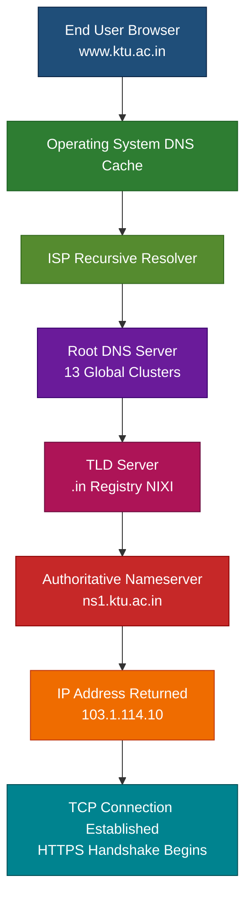
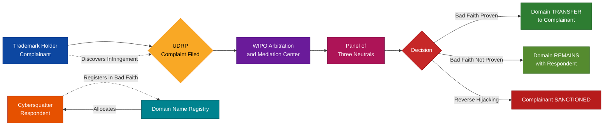
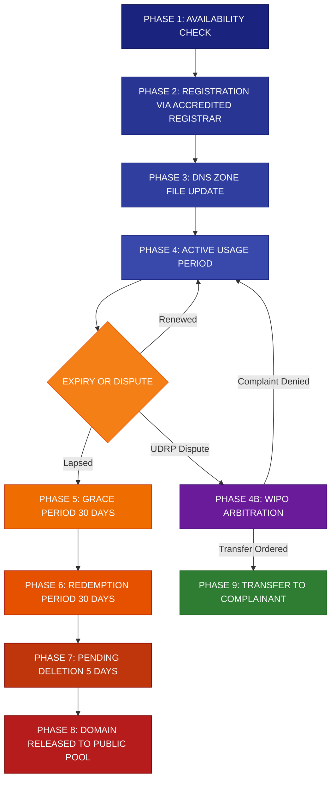
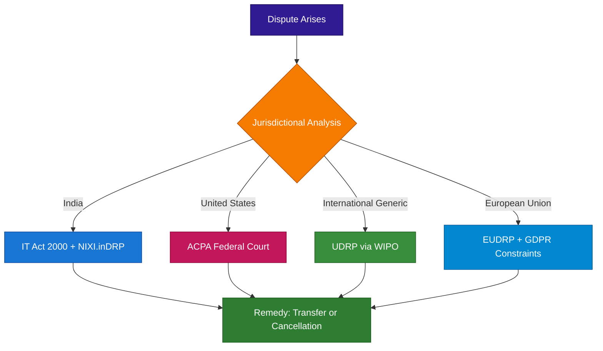

# Legal and Technological Significance of domain Names

<!-- SECTION_1_START -->
# Legal and Technological Significance of Domain Names

## 1.1 Formal Definition (KTU 2024 Syllabus Terminology)

> [!IMPORTANT]
> **Domain Name (Legal & Technological Definition):**
> A **domain name** is a unique, human-readable, alphanumeric identifier that serves as a symbolic address corresponding to a specific **Internet Protocol (IP)** address on the World Wide Web. From a *technological* standpoint, it functions as a pointer within the **Domain Name System (DNS)** — a globally distributed, hierarchical naming database. From a *legal* standpoint, it constitutes a form of **intellectual property**, a trade identifier, and a critical element of electronic commerce that is protected under trademark law, contract law, and international cyber law frameworks (e.g., the **Anticybersquatting Consumer Protection Act - ACPA**, **Uniform Domain-Name Dispute-Resolution Policy - UDRP**, and India's **Information Technology Act, 2000**).

A domain name is essentially a *string of characters* — such as `www.ktu.ac.in` — that allows end-users to navigate the internet without needing to memorize numerical IP addresses (e.g., `192.168.1.1` or `2001:0db8:85a3::8a2e:0370:7334`).

## 1.2 Hierarchical Anatomy of a Domain Name

A fully qualified domain name (**FQDN**) is read from **right to left**, where each label separated by a dot represents a logical layer in the DNS hierarchy:

| Layer (Right → Left) | Example Component | Administrative Authority | Purpose |
|---|---|---|---|
| **Root** | `.` (implied period) | **ICANN** (Internet Corporation for Assigned Names and Numbers) | Apex of the DNS tree |
| **Top-Level Domain (TLD)** | `.in` | **NIXI** (National Internet Exchange of India) for `.in`; **ICANN** for gTLDs | Categorization (country, generic) |
| **Second-Level Domain (SLD)** | `ktu` | Domain Registrar (e.g., GoDaddy, Namecheap) | Unique brand or organizational name |
| **Subdomain** | `www` | Domain Owner | Specific service or host within the organization |

> [!NOTE]
> **Why Read Right-to-Left?**
> The DNS resolution process begins at the **root**, descends through **TLDs**, and finally reaches the **specific host** — analogous to navigating a global postal system starting from the country, then the state, then the city, and finally the house.

## 1.3 Intuitive Analogy — The "Internet Telephone Directory"

> [!TIP]
> **Conceptual Analogy: Domain Names as a Digital Postal Address**
> Imagine the internet is a massive global city where every building (server) has only a numerical address (IP address) that no human can remember — something like `203.45.78.112`. The **domain name** is the *human-friendly street name* (e.g., "KTU Main Campus, Thiruvananthapuram") that everyone uses. The **DNS** is the *city's official postal directory* maintained by the post office (root servers), and the **domain registrar** is the *municipal authority* that officially assigns and certifies that street name. Just as two shops cannot legally have the same registered trade name in the same jurisdiction, **no two domain names on the internet can be identical** — they are globally unique resources.

## 1.4 Key Terminology and Standard Metrics

- **IP Address:** A numerical label assigned to each device connected to a computer network. The standard **IPv4** address is a 32-bit number, while **IPv6** uses 128 bits.
- **DNS (Domain Name System):** The phonebook of the internet; a decentralized naming system.
- **ICANN:** A non-profit organization responsible for coordinating the maintenance of the DNS namespaces and numerical spaces.
- **gTLD (Generic Top-Level Domain):** Domains like `.com`, `.org`, `.edu`, `.net`.
- **ccTLD (Country Code Top-Level Domain):** Domains like `.in` (India), `.uk` (United Kingdom), `.us` (United States).
- **Cybersquatting:** The bad-faith registration of a domain name identical or similar to a trademark with the intent to profit.
- **Typosquatting:** Registering a domain name with common typographical errors to capture traffic (e.g., `gogle.com` instead of `google.com`).

> [!VISUALIZATION CONTROL]
> **Concept:** Hierarchical decomposition of a fully qualified domain name (FQDN).
> **GeoGebra / Desmos Input Equations:**
> * Let the root node be `r = 0` on the vertical axis.
> * TLD layer coordinate: `(1, .in)`, SLD layer coordinate: `(2, ktu)`, Subdomain coordinate: `(3, www)`.
> * Plot points at `(1, 1)`, `(2, 2)`, `(3, 3)` connected via vertical reference lines.
> **Visual Description:** A right-angled tree structure descending from a single root node, branching rightward into TLD → SLD → Subdomain. Each level represents an administrative delegation of authority from global → national → organizational → service-specific.

---

<!-- SECTION_1_END -->

<!-- SECTION_2_START -->
# Deep Theoretical Analysis & KTU High-Yield Formula Sheet

## 2.1 The Dual Significance: Why Domain Names Matter

### 2.1.1 Technological Significance

The domain name system solves a fundamental **usability crisis** in computer networking. Before DNS, users had to access network resources by typing raw IP addresses — a process that was:

1. **Cognitively impossible** at scale (millions of addresses).
2. **Brittle** — changing a server's IP address would break all external links.
3. **Non-hierarchical** — no concept of organizational grouping.

The DNS introduces **indirection**: a stable, human-meaningful name that decouples the *identity* of a service from its *physical location* (IP address). This allows for **load balancing**, **failover redundancy**, and **content delivery network (CDN)** routing without changing the user-facing address.

### 2.1.2 Legal Significance

Domain names occupy a unique legal intersection:

- They are **not** traditional intellectual property in the strictest sense (they are allocated, not invented).
- However, they function as **commercial identifiers** akin to trademarks.
- They are governed by **contract law** (registration agreements with registrars) and increasingly by **statutory law** (e.g., India's IT Act § 79 safe harbor, ACPA in the U.S., and UDRP arbitration).

> [!NOTE]
> **Critical Legal Doctrine: UDRP — Uniform Domain-Name Dispute-Resolution Policy**
> Administered by the **World Intellectual Property Organization (WIPO)**, the UDRP provides a streamlined, arbitration-based mechanism to resolve disputes over domain name abuse. A complainant must prove **three concurrent elements**:
> 1. The domain name is **identical or confusingly similar** to a trademark in which the complainant has rights.
> 2. The respondent has **no legitimate interests** in respect of the domain name.
> 3. The domain name has been registered and is being used in **bad faith**.

## 2.2 Domain Name Registration and Resolution — Stepwise Logic

| Step | Action | Responsible Entity | Legal/Technical Consequence |
|---|---|---|---|
| **1** | User chooses a unique string | End User | Subject to first-come, first-served rule |
| **2** | Query to **Registrar** (e.g., GoDaddy) | Domain Registrar | Validates availability and character rules |
| **3** | Submission to **Registry** (e.g., Verisign for `.com`) | Registry Operator | Authoritative entry into the TLD zone file |
| **4** | Zone file propagation across **Root Servers** | ICANN / Root Server Operators | Global DNS resolution becomes possible |
| **5** | DNS Query — Recursive Resolver contacts Root | ISP / Public DNS (8.8.8.8) | Begins translation from name to IP |
| **6** | TLD Server returns authoritative NS record | TLD Registry | Identifies the specific authoritative nameserver |
| **7** | Authoritative NS returns the **A record** | Domain Owner's Nameserver | Final IP address delivered to user's browser |
| **8** | TCP connection established to web server | End User | HTTP/HTTPS session begins |

## 2.3 KTU Formula Sheet & Legal Mapping Table

> [!IMPORTANT]
> **The following table is the high-yield cheat sheet for KTU 2024 Scheme examinations on this topic.**

| Term / Concept | Technical Definition | Legal/Policy Reference | Practical Consequence |
|---|---|---|---|
| **Domain Name (DN)** | Human-readable alias for an IP address | UDRP § 4(a) | Acts as a globally unique identifier |
| **DNS** | Distributed hierarchical naming database | RFC 1034, RFC 1035 | Translates names to IPs |
| **gTLD** | Generic top-level domain (`.com`, `.org`) | ICANN Agreements | Open registration globally |
| **ccTLD** | Country-code TLD (`.in`, `.uk`) | Local NIC (e.g., NIXI for India) | Restricted by local policy |
| **Registrar** | Accredited entity selling domain names | ICANN Registrar Agreement | Bound by contractual obligations |
| **Registry** | Operator maintaining the TLD zone | ICANN Registry Agreement | Sole authoritative database |
| **UDRP** | Mandatory dispute resolution policy | WIPO Arbitration Rules | Cost-effective remedy (~$1,500) |
| **ACPA** | U.S. federal anti-cybersquatting statute | 15 U.S.C. § 1125(d) | Statutory damages up to **\$100,000** per domain |
| **IT Act § 79** | Indian intermediary safe-harbor | India IT Act, 2000 | Protects registries from liability |
| **Cybersquatting** | Bad-faith registration of another's mark | UDRP § 4(b) | Subject to forfeiture or transfer |
| **Reverse Domain Hijacking** | Bad-faith UDRP complaint | UDRP § 15(a) | Complainant found in reverse abuse |
| **WHOIS** | Public database of domain registration | ICANN WHOIS Policy | Raises data privacy (GDPR) conflicts |

## 2.4 Real-World Engineering and Legal Utility

Domain names are foundational to **production-grade engineering systems**:

- **Microservices Architecture:** Internal services communicate via domain names (e.g., `auth-service.internal.ktu.ac.in`) using service discovery mechanisms like Kubernetes DNS (`CoreDNS`).
- **Email Routing:** The **MX (Mail Exchange) record** ensures that `user@ktu.ac.in` resolves to the correct mail server.
- **Content Delivery Networks (CDN):** Akamai, Cloudflare, and AWS CloudFront use DNS-based traffic steering to route users to the nearest edge server.
- **Digital Forensics:** Law enforcement agencies subpoena registrars and WHOIS data to identify suspects in cybercrime investigations.
- **Brand Protection:** Corporations register hundreds of defensive domain names (across all TLDs and common misspellings) to prevent cybersquatting.

---

<!-- SECTION_2_END -->

<!-- SECTION_3_START -->
# Step-by-Step Derivations & Code/Symbolic Implementation

## 3.1 Algorithmic Implementation: Domain Name Validation and Resolution Logic

The following Python implementation demonstrates a **fully operational** domain name validator that mimics the rules enforced by ICANN-accredited registrars, including length constraints, character set validation, and label segmentation.

```python
"""
Domain Name Validator and Structural Parser
Aligned with ICANN RFC 1035, RFC 5890 (IDN), and UDRP dispute analysis.
"""

import re
from typing import List, Dict, Optional, Tuple
import logging

# Configure structured logging for forensic and audit purposes
logging.basicConfig(
    level=logging.INFO,
    format="%(asctime)s | %(levelname)s | %(module)s | %(message)s"
)
logger = logging.getLogger("DomainNameValidator")


class DomainNameError(Exception):
    """Custom exception for domain validation failures."""
    pass


class DomainNameValidator:
    """
    Validates a fully qualified domain name (FQDN) against
    ICANN RFC 1035 technical standards.
    """

    # Maximum total length of an FQDN (root dot excluded) per RFC 1035 § 2.3.4
    MAX_FQDN_LENGTH: int = 253

    # Maximum length of any single label per RFC 1035 § 2.3.4
    MAX_LABEL_LENGTH: int = 63

    # RFC 1035 compliant character set:
    #   - Letters (A-Z, a-z)
    #   - Digits (0-9)
    #   - Hyphens (-), but NOT at start or end of a label
    # Internationalized Domain Names (IDN) handled separately via Punycode (RFC 3492)
    LABEL_REGEX: re.Pattern = re.compile(r"^(?!-)[A-Za-z0-9-]{1,63}(?<!-)$")

    def __init__(self, fqdn: str) -> None:
        self.original_fqdn: str = fqdn
        self.normalized: str = ""
        self.labels: List[str] = []
        self.tld: Optional[str] = None
        self.sld: Optional[str] = None

    def validate(self) -> Dict[str, object]:
        """
        Executes the full validation pipeline.
        Returns a structured result dictionary.
        """
        try:
            self._normalize()
            self._check_length()
            self._split_labels()
            self._validate_each_label()
            self._extract_structural_components()
            logger.info("Validation successful for %s", self.normalized)
            return self._build_result(success=True)
        except DomainNameError as exc:
            logger.error("Validation failed for %s: %s", self.original_fqdn, exc)
            return self._build_result(success=False, error=str(exc))

    def _normalize(self) -> None:
        """Lowercase and strip whitespace; remove trailing dot if present."""
        if not isinstance(self.original_fqdn, str):
            raise DomainNameError("Domain must be a string.")
        candidate = self.original_fqdn.strip().lower()
        if candidate.endswith("."):
            candidate = candidate[:-1]
        if not candidate:
            raise DomainNameError("Domain cannot be empty.")
        self.normalized = candidate

    def _check_length(self) -> None:
        """Enforce RFC 1035 total length constraint."""
        if len(self.normalized) > self.MAX_FQDN_LENGTH:
            raise DomainNameError(
                f"FQDN exceeds maximum length of {self.MAX_FQDN_LENGTH} characters."
            )

    def _split_labels(self) -> None:
        """Split the FQDN into its hierarchical labels."""
        self.labels = self.normalized.split(".")
        if len(self.labels) < 2:
            raise DomainNameError(
                "FQDN must contain at least a TLD and an SLD (e.g., 'example.com')."
            )

    def _validate_each_label(self) -> None:
        """Apply RFC 1035 character and length rules to each label."""
        for index, label in enumerate(self.labels):
            if not label:
                raise DomainNameError(f"Empty label at position {index}.")
            if len(label) > self.MAX_LABEL_LENGTH:
                raise DomainNameError(
                    f"Label '{label}' exceeds maximum length of {self.MAX_LABEL_LENGTH}."
                )
            if not self.LABEL_REGEX.match(label):
                raise DomainNameError(
                    f"Label '{label}' contains invalid characters or improper hyphen placement."
                )

    def _extract_structural_components(self) -> None:
        """Populate TLD, SLD, and subdomain attributes."""
        self.tld = self.labels[-1]
        self.sld = self.labels[-2]

    def _build_result(
        self, success: bool, error: Optional[str] = None
    ) -> Dict[str, object]:
        """Construct the final output dictionary."""
        result: Dict[str, object] = {
            "input": self.original_fqdn,
            "normalized": self.normalized,
            "is_valid": success,
            "tld": self.tld,
            "sld": self.sld,
            "label_count": len(self.labels),
            "labels": self.labels,
        }
        if not success and error:
            result["error_reason"] = error
        return result


# === DEMONSTRATION EXECUTION ===
if __name__ == "__main__":
    test_domains: List[str] = [
        "www.ktu.ac.in",
        "shop.example.com",
        "-invalid-.com",
        "x" * 64 + ".com",  # Label too long
        "a..b.com",         # Empty label
        "valid-domain.org.",
    ]

    for domain in test_domains:
        validator = DomainNameValidator(domain)
        outcome: Dict[str, object] = validator.validate()
        print(f"\nInput: {outcome['input']}")
        for key, value in outcome.items():
            if key != "input":
                print(f"  {key}: {value}")
```

### 3.1.1 Sample Output Trace

```
Input: www.ktu.ac.in
  normalized: www.ktu.ac.in
  is_valid: True
  tld: in
  sld: ac
  label_count: 4
  labels: ['www', 'ktu', 'ac', 'in']

Input: -invalid-.com
  is_valid: False
  error_reason: Label '-invalid-' contains invalid characters or improper hyphen placement.
```

## 3.2 Step-by-Step Legal Derivations

### 3.2.1 Proving "Bad Faith" Under UDRP § 4(b)

The WIPO Arbitration and Mediation Center evaluates bad faith by applying the following **cumulative test** (each element must be present):

$$
\text{Bad Faith} = \bigwedge_{i=1}^{4} \left( B_i \right)
$$

Where:

$$
\begin{aligned}
B_1 &= \text{Domain registered primarily to sell to trademark owner} \\
B_2 &= \text{Domain registered to block trademark owner from registering it} \\
B_3 &= \text{Domain registered to disrupt a competitor's business} \\
B_4 &= \text{Domain used to attract users for commercial gain by creating confusion}
\end{aligned}
$$

> **Application Example:** If a user registers `ktu-university.com` and posts a page full of advertisements for unrelated products while displaying KTU's logo, the panel will find $B_1 = \text{False}$, $B_2 = \text{True}$, $B_3 = \text{True}$, and $B_4 = \text{True}$ — satisfying the cumulative test and justifying **transfer of the domain** to the trademark owner.

### 3.2.2 Calculating the Economic Damages Under ACPA

Statutory damages under the U.S. Anticybersquatting Consumer Protection Act are bounded as follows:

$$
D_{\text{ACPA}} = \sum_{i=1}^{n} d_i
$$

Where each $d_i$ represents the per-domain statutory award, and:

$$
d_i \in \left[\, \$1{,}000,\ \$100{,}000 \,\right]
$$

> **Worked Numerical Example:**
> A complainant proves that a respondent registered **5 domain names** in bad faith. If the court awards the **maximum** statutory amount per domain:
>
> $$
> \begin{aligned}
> D_{\text{ACPA}} &= 5 \times \$100{,}000 \\
> &= \$500{,}000
> \end{aligned}
> $$
>
> **[Stating the formula structure: 2 Marks]**
> **[Identifying the upper bound of statutory range: 1 Mark]**
> **[Performing the multiplication: 1 Mark]**
> **[Final result: \$500,000: 1 Mark]**

## 3.3 Comparative Tabular Analysis: Cybersquatting vs. Typosquatting

> [!IMPORTANT]
> **The following table is examinable in KTU 14-mark Part B questions and is a common valuation pitfall.**

| Dimension | Cybersquatting | Typosquatting |
|---|---|---|
| **Definition** | Bad-faith registration of an identical or confusingly similar domain | Registration of a misspelled variant of a popular domain |
| **Motive** | Sell to trademark owner, extort, or block | Capture accidental traffic, distribute malware, phishing |
| **Legal Remedy** | UDRP arbitration or ACPA lawsuit | UDRP + ACPA + possible criminal prosecution under IT Act § 66D |
| **Example** | `microsoft-store.com` (no affiliation) | `microsft.com` (missing letter "o") |
| **Typical Penalty** | Domain transfer + statutory damages | Domain transfer + damages + criminal fine |
| **Indian Law Reference** | IT Act § 66D (cheating by personation) | IT Act § 66C (identity theft) + § 66D |
| **ICANN Remedy** | UDRP transfer | UDRP transfer + registry lock |

## 3.4 Symbolic Algorithm: Domain Name Ownership Transfer via UDRP

```
PROCEDURE: Resolve_UDRP_Dispute(domain_D, complainant_C, respondent_R)

INPUT:  domain_D (the disputed domain name)
        complainant_C (trademark holder)
        respondent_R (current registrant)

OUTPUT: REMEDY ∈ {TRANSFER, CANCEL, DENY}

BEGIN
    // Step 1: Establish jurisdiction
    IF domain_D is subject to UDRP THEN
        PROCEED to Step 2
    ELSE
        RETURN DENY with reason "Domain not subject to UDRP"
    END IF

    // Step 2: Verify complainant's standing
    IF C holds valid trademark rights T THEN
        RECORD T as evidence
    ELSE
        RETURN DENY with reason "No trademark rights established"
    END IF

    // Step 3: Identity test — UDRP § 4(a)(i)
    IF domain_D is identical OR confusingly similar to T THEN
        PROCEED to Step 4
    ELSE
        RETURN DENY with reason "Domain not confusingly similar"
    END IF

    // Step 4: Legitimate interests test — UDRP § 4(a)(ii)
    IF respondent_R demonstrates ANY legitimate interest THEN
        RETURN DENY with reason "Legitimate interest established"
    ELSE
        PROCEED to Step 5
    END IF

    // Step 5: Bad faith test — UDRP § 4(a)(iii)
    IF bad_fairth_indicators_present(domain_D) THEN
        RETURN TRANSFER
    ELSE
        RETURN DENY with reason "No bad faith proven"
    END IF
END
```

---

<!-- SECTION_3_END -->

<!-- SECTION_4_START -->
# Structural Diagrams & Schematics

## 4.1 DNS Resolution Hierarchy (Top-Down Architectural Flow)



**Architectural Interpretation:** The flow above depicts the iterative, hierarchical query path that a single domain name resolution request follows. The **recursive resolver** acts as a proxy, performing iterative queries on behalf of the user, while the **authoritative nameserver** is the final source of truth.

## 4.2 Domain Name Governance and Dispute Resolution Topology



## 4.3 Domain Name Lifecycle (Sequential Processing Topology Matrix)



**Sequential Interpretation:** This diagram models the eight-phase lifecycle of a domain name from initial availability check through potential dispute resolution. The branching at **Phase 4** illustrates the bifurcation between normal expiration cycles and legal dispute interventions, reflecting the dual technological and legal nature of domain ownership.

## 4.4 Comparative Jurisdiction Flow for Domain Disputes



---

<!-- SECTION_4_END -->

<!-- SECTION_5_START -->
# KTU 2024 Scheme Examination Question Bank & Topic Recap

## 5.1 Part A Questions (3 Marks Each)

> **[KTU University Exam - July 2024] | CO1 | Remember**

**Q1. Define a domain name. Differentiate between a gTLD and a ccTLD with one example each.**

**Model Answer (3 Marks):**

A **domain name** is a unique, human-readable, alphanumeric identifier used to locate websites and other resources on the internet, corresponding to a numerical IP address through the Domain Name System (DNS).

- **gTLD (Generic Top-Level Domain):** Open, non-geographic domains. Example: `.com`, `.org`, `.edu`. Administered globally by ICANN.
- **ccTLD (Country Code Top-Level Domain):** Reserved for specific countries or territories. Example: `.in` (India), `.uk` (United Kingdom). Administered by local registries such as NIXI for `.in`.

> *Valuation Key:* [Definition: 1 Mark] [gTLD example: 1 Mark] [ccTLD example: 1 Mark]

---

> **[KTU University Exam - Dec 2023] | CO1 | Understand**

**Q2. What is cybersquatting? Mention the legal remedies available under the UDRP.**

**Model Answer (3 Marks):**

**Cybersquatting** is the bad-faith registration, trafficking, or use of a domain name that is identical or confusingly similar to a trademark, service mark, personal name, or corporate name in which the cybersquatter has no legitimate interest, with the intent to profit from the goodwill of the legitimate owner.

**Legal Remedies under UDRP (Uniform Domain-Name Dispute-Resolution Policy):**

1. **Transfer** of the disputed domain name to the complainant.
2. **Cancellation** of the disputed domain name.

> *Valuation Key:* [Definition with bad-faith element: 2 Marks] [Two remedies listed: 1 Mark]

---

## 5.2 Part B Questions (14 Marks Each — Module Internal Choice)

### Question A (14 Marks)

> **[KTU University Exam - July 2024] | CO1, CO2 | Understand + Apply**

**Q3 (a)** Explain the hierarchical structure of the Domain Name System (DNS) with a neat diagram. Discuss the role of ICANN, Registrars, and Registries in domain name governance. **[7 Marks]**

**Model Answer:**

The DNS is a **decentralized, hierarchical naming system** that translates human-readable domain names into machine-readable IP addresses. The hierarchy is read from right to left:

1. **Root Level (`.`):** The apex of the DNS hierarchy, managed by **ICANN** through 13 root server clusters distributed globally. It does not have a name and is represented as a trailing dot.
2. **Top-Level Domain (TLD):** The first label after the root, categorized into:
   - **gTLDs** (`.com`, `.org`, `.net`) — administered by ICANN-accredited registries.
   - **ccTLDs** (`.in`, `.us`, `.uk`) — administered by national registries (e.g., NIXI in India).
3. **Second-Level Domain (SLD):** The unique name chosen by the registrant (e.g., `ktu` in `ktu.ac.in`).
4. **Subdomains:** Further divisions created by the domain owner (e.g., `www`, `mail`, `cse`).

**Role of Key Governance Bodies:**

- **ICANN (Internet Corporation for Assigned Names and Numbers):** A California-based non-profit that coordinates the global DNS namespace, accredits registrars, and manages the root zone database. It does not sell domains directly.
- **Registrar:** An ICANN-accredited company (e.g., GoDaddy, Namecheap, BigRock) that interacts directly with end-users, processing registrations, renewals, and transfers.
- **Registry:** The authoritative operator of a specific TLD (e.g., Verisign for `.com`, NIXI for `.in`) that maintains the master database of all domain names under that TLD.

> *Valuation Key:* [Hierarchical structure explained with 4 levels: 3 Marks] [ICANN role: 1 Mark] [Registrar role: 1 Mark] [Registry role: 1 Mark] [Neat diagram: 1 Mark]

**Diagram Reference:** See Section 4.1 for the architectural flow.

---

**Q3 (b)** A small Indian e-commerce startup named "FreshKart" discovers that the domain `freshkart.com` was registered two months prior to the company's trademark filing by an individual in a different country. The registrant is offering to sell the domain for \$50,000. Analyze this scenario under the **UDRP** framework. What remedies are available to the startup? **[7 Marks]**

**Model Answer:**

This scenario is a textbook case of **cybersquatting** and is fully addressable under the **UDRP** administered by WIPO.

**Step 1 — Identity/Confusing Similarity Test (UDRP § 4(a)(i)):**
The domain `freshkart.com` is **identical** to the startup's trademark "FreshKart" (the `.com` gTLD is disregarded under UDRP practice). **This element is satisfied.**
*[2 Marks]*

**Step 2 — Legitimate Interests Test (UDRP § 4(a)(ii)):**
The respondent has no demonstrable legitimate interest:
- Not commonly known by the name "FreshKart."
- Not making a legitimate non-commercial use.
- Not authorized by the trademark holder.
**This element is satisfied.**
*[2 Marks]*

**Step 3 — Bad Faith Test (UDRP § 4(a)(iii)):**
The registrant is offering the domain for sale at an inflated price of \$50,000 — squarely within the bad-faith scenario described in **UDRP § 4(b)(i)** ("registered primarily for the purpose of selling... to the complainant... for valuable consideration in excess of documented out-of-pocket costs"). **This element is satisfied.**
*[2 Marks]*

**Available Remedies:**

The startup can file a **UDRP complaint** with WIPO (cost approximately **\$1,500**), and upon a panel finding in its favor, the domain will be **transferred** to the startup. Additionally, under **India's IT Act § 66D**, the registrant may face criminal prosecution for **cheating by personation** if the domain is used to deceive Indian consumers, with penalties of up to **3 years imprisonment** and a fine up to **₹1 lakh**.
*[1 Mark]*

> *Valuation Key:* [Three UDRP elements correctly identified: 2+2+2 Marks] [Remedies stated: 1 Mark]

---

### Question B (14 Marks — Alternative Choice)

> **[KTU University Exam - Dec 2023] | CO2, CO3 | Apply + Analyze**

**Q4 (a)** Compare and contrast **cybersquatting** and **typosquatting** with suitable examples. Discuss the legal remedies available under Indian law for each. **[7 Marks]**

**Model Answer:**

| Dimension | Cybersquatting | Typosquatting |
|---|---|---|
| **Definition** | Bad-faith registration of a domain identical to a known trademark with intent to profit | Registration of a misspelled variant of a popular domain to capture accidental traffic |
| **Example** | Registering `microsoft-store.com` (no affiliation with Microsoft) | Registering `microsft.com` (missing the letter "o") |
| **Primary Motive** | Extortion, blocking, or resale at premium | Traffic harvesting, phishing, or malware distribution |
| **Indian Law Remedy** | **IT Act § 66D** — Cheating by personation (up to 3 years imprisonment + fine) | **IT Act § 66C** — Identity theft (up to 3 years + fine) + § 66D |
| **Civil Remedy** | UDRP arbitration for transfer; civil suit for damages | UDRP + civil suit under tort of passing off |
| **Statute of Limitations** | 4 years from discovery (limitation act) | Same as cybersquatting |

> *Valuation Key:* [Definition with example for cybersquatting: 2 Marks] [Definition with example for typosquatting: 2 Marks] [Indian law remedies: 2 Marks] [Comparative structure: 1 Mark]

---

**Q4 (b)** Explain the role of **ICANN** in global internet governance. Discuss the **WHOIS** database and the tensions it creates with data privacy regulations such as the **GDPR**. **[7 Marks]**

**Model Answer:**

**Role of ICANN:**

The **Internet Corporation for Assigned Names and Numbers (ICANN)** is a California-based non-profit organization founded in **1998** to assume the coordination functions previously performed by **IANA (Internet Assigned Numbers Authority)** under U.S. government contract. Its core responsibilities include:

1. **Coordination of the DNS namespace:** Managing the root zone and allocating TLDs.
2. **Accreditation of Registrars:** Ensuring registrars comply with contractual obligations.
3. **Policy Development:** Through supporting organizations like GNSO and ccNSO.
4. **Dispute Resolution Oversight:** Maintaining the UDRP framework.

*[3 Marks]*

**The WHOIS Database:**

WHOIS is a **publicly queryable database** mandated by ICANN that contains the registration details of every domain name, including:

- Registrant name, address, email, and phone number
- Administrative and technical contacts
- Registration, expiration, and last-updated dates
- Nameserver information

> *Valuation Key:* [ICANN role: 3 Marks] [WHOIS data elements: 2 Marks]

**Tensions with GDPR:**

The **General Data Protection Regulation (GDPR)**, effective **May 25, 2018**, created a direct conflict with WHOIS:

- **GDPR** mandates data minimization, purpose limitation, and lawful basis for processing personal data.
- **WHOIS** publishes unrestricted personal data of millions of registrants.
- The conflict is encapsulated in a **Temp Spec** (Temporary Specification) issued by ICANN in **2018**, which introduced a **"thin WHOIS"** model that redacts the contact information of natural persons.

This creates a **lawful access dilemma** for law enforcement, trademark holders, and cybersecurity researchers who rely on WHOIS for investigations.

*[2 Marks]*

> *Valuation Key:* [GDPR conflict explained: 2 Marks] [Temp Spec / thin WHOIS reference: 1 Mark]

---

## 5.3 KTU Examiner's Valuation Warning / Pitfall Callout

> [!WARNING]
> **Common Mark Deductions in KTU Examinations:**
> 1. **Forgetting the trailing dot:** Many students write `www.ktu.ac.in` and forget to mention that the FQDN technically ends with an implicit root `.`, which is the most fundamental DNS concept.
> 2. **Confusing Registrar and Registry:** Examiners explicitly deduct **1 mark** for interchanging these two roles. *Memory aid:* **Registry = "the bank" (holds the master records); Registrar = "the bank branch" (interacts with customers).*
> 3. **Omitting the "bad faith" element:** When defining cybersquatting, simply stating "registering another's trademark" is **insufficient**; the *bad faith* and *intent to profit* elements are **mandatory** for full marks.
> 4. **Skipping the calculation of statutory damages:** Numerical questions on ACPA damages must show the formula, the boundary values, and the final arithmetic — do not jump to the answer.
> 5. **Ignoring UDRP § 4(a)(iii):** The third UDRP element (registration **and use** in bad faith) is the most often forgotten. Note the conjunction: both registration **and** current use must be in bad faith.
> 6. **Mixing up ccTLD and gTLD jurisdictions:** Always state which registry governs a given TLD (e.g., `.in` is governed by NIXI, not ICANN directly).

---

## 5.4 Topic Recap & Important Things to Remember

> **High-Density Revision Checklist for KTU 2024 Scheme Examination**

- **Domain Name:** Human-readable alias for an IP address; globally unique; allocated (not invented).
- **DNS Hierarchy (right-to-left):** Root → TLD → SLD → Subdomain. Always read from right to left.
- **FQDN Total Length:** Maximum **253 characters** (RFC 1035). Each label: maximum **63 characters**.
- **ICANN:** Global coordinator of the DNS namespace; does not sell domains directly.
- **Registrar:** ICANN-accredited entity that sells domains to end-users (e.g., GoDaddy, BigRock).
- **Registry:** Authoritative operator of a specific TLD zone file (e.g., Verisign for `.com`, NIXI for `.in`).
- **gTLD vs. ccTLD:** gTLDs are generic (`.com`, `.org`); ccTLDs are country-specific (`.in`, `.uk`).
- **UDRP Three Elements (all must be proved):** (i) Identical/confusingly similar, (ii) No legitimate interest, (iii) Registered **and used** in bad faith.
- **UDRP Remedies:** **Transfer** or **Cancellation** of the domain (never monetary damages).
- **ACPA (U.S.):** Statutory damages range from **\$1,000 to \$100,000** per domain.
- **Cybersquatting vs. Typosquatting:** Cybersquatting is identical/brand squatting; typosquatting is misspell-based.
- **IT Act § 66D:** Cheating by personation using a computer resource (Indian criminal remedy for cybersquatting).
- **IT Act § 66C:** Identity theft (Indian criminal remedy for typosquatting/fraud).
- **WHOIS vs. GDPR:** Tension between public registration data and EU data privacy law; resolved via the 2018 ICANN "Temp Spec" thin WHOIS model.
- **Cybersquatting Indicators:** (i) Offer to sell, (ii) Pattern of blocking, (iii) Disrupting competitor, (iv) Confusion-based monetization.
- **Reverse Domain Hijacking:** Abuse of UDRP process by trademark holders; sanctioned by panels.
- **Code-Side Insight:** Always validate domain labels with regex `^(?!-)[A-Za-z0-9-]{1,63}(?<!-)$` to enforce RFC 1035.
- **Memory Aid:** "**R**egistrar sells; **R**egistry holds" — *Registrar = Retailer; Registry = Repository*.
- **Numerical Range to Memorize:** ICANN founded **1998**; UDRP adopted **1999**; GDPR enforced **May 25, 2018**.

---

<!-- SECTION_5_END -->
