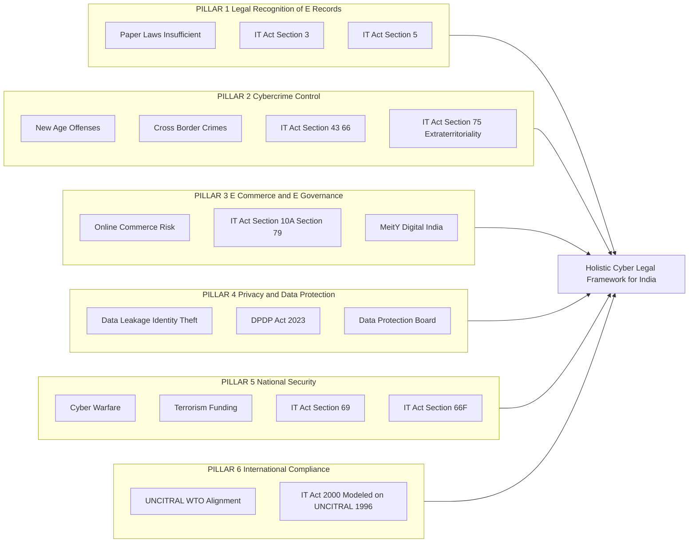
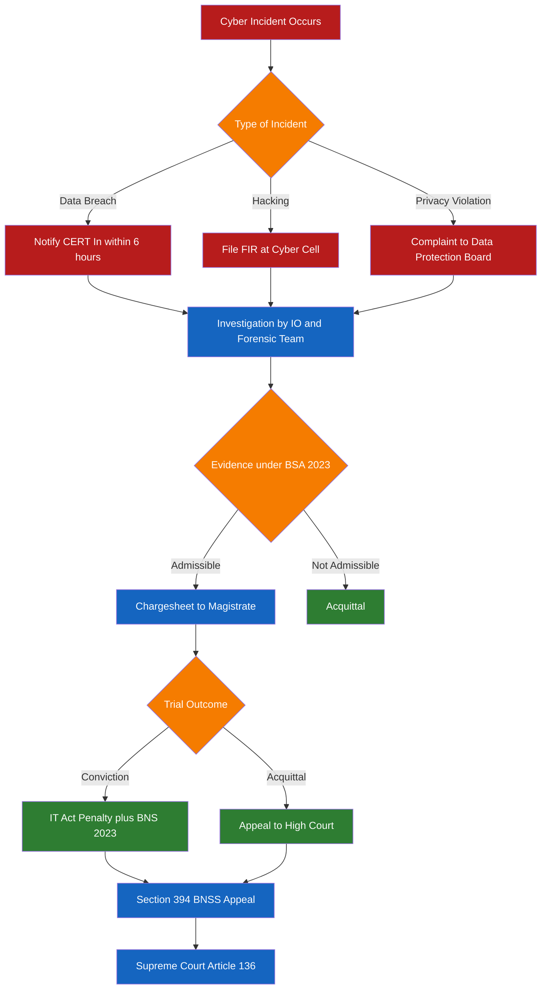

# Need for Indian cyber law

<!-- SECTION_1_START -->

# Need for Indian Cyber Law — Core Foundation

> [!IMPORTANT]
> **Module 1 Anchor Concept:** This topic establishes the *jurisprudential* and *techno-economic* rationale that compelled the Parliament of India to enact the **Information Technology Act, 2000** (later amended by the **IT Act, 2008**) — the first dedicated statute on cyber law in India.

## 1.1 Formal Academic Definition

**Cyber Law** is the body of legal principles, statutory provisions, judicial precedents, and regulatory frameworks that govern the conduct of persons, organizations, and state actors in *cyberspace* — the global, non-physical, digital environment created by the interconnection of computer networks, telecommunications infrastructure, and data processing systems.

> [!NOTE]
> **Cyberspace (KTU Definition):** As per the **IT Act, 2000 — Section 2(1)(k)**, the term is not directly defined, but is interpreted as the *"virtual environment of networked computers, data, communications, and digital services"*. Internationally, the term was coined by **William Gibson** in his 1984 novel *Neuromancer*.

The **Need for Indian Cyber Law** specifically refers to the *constitutional, economic, security, and social compulsions* that necessitated a domestic, sovereign legal framework — distinct from general criminal law under the Indian Penal Code (IPC) — to address acts occurring within, through, or against cyberspace.

## 1.2 Intuitive Analogy — Why India Cannot Rely on Old Laws

> [!TIP]
> **Real-World Analogy: "The Highway and the Old Village Road"**
>
> Imagine India in the **1990s** as a village where travel happened only on narrow *dirt roads*. The *Indian Penal Code, 1860* (the "old village road") was perfectly adequate for the era — it handled local disputes, theft of physical goods, and forgery of paper documents.
>
> Then, almost overnight, a **multi-lane digital superhighway** (the *Internet*) was built, and millions of Indians began driving on it. Suddenly, crimes occurred that the old road laws had never imagined:
> - A *file* is stolen, not a *bag of rice*.
> - A *digital signature* is forged, not a *paper signature*.
> - A *defamatory email* is sent from *Mumbai to New York* in milliseconds.
>
> Without a new set of traffic rules for this superhighway, chaos, accidents, and lawlessness would be inevitable. **Indian Cyber Law = the new traffic rules for the digital superhighway.** It defines what is legal/illegal *on the digital road*, sets penalties (fines and imprisonment), and designates traffic police (regulatory authorities like **CERT-In**, **MeitY**, and **Adjudicating Officers**).

## 1.3 GeoGebra / Desmos Visualization (Concept Mapping)

> [!VISUALIZATION CONTROL]
> **Concept:** Growth of Internet Users in India vs. Enactment of Cyber Laws (Timeline Mapping)
> **GeoGebra / Desmos Input Equations:**
> * `f(t) = piecewise`
> * `f(t) = 0.5` for $t < 2000$
> * `f(t) = 1.2 \cdot (t - 2000)$` for $2000 \le t \le 2020$
> * `f(t) = 70 + 4 \cdot (t - 2020)$` for $t > 2020$
> (where $t$ = year, $f(t)$ = approximate million users, scaled)
> **Visual Description:** Observe a *flat curve* until the year 2000 (IT Act enacted), followed by a sharp *linear rise* representing India's internet boom, and a *steep post-2020 spike* driven by Jio revolution, UPI, and Digital India. This visually demonstrates the *growing pressure* on legal infrastructure — the central justification for why Indian cyber law is *continuously evolving* through amendments.

<!-- SECTION_1_END -->

<!-- SECTION_2_START -->

# Deep Theoretical Analysis — The Six Pillars of Necessity

## 2.1 Pillars of Need: Why India Specifically Required Cyber Law

Indian legal scholars and the **Ministry of Electronics and Information Technology (MeitY)** have identified **six foundational pillars** that mandated a dedicated cyber law:

### Pillar 1 — Legal Recognition of Digital Transactions
- Before the IT Act 2000, contracts, agreements, and records existed *only on paper*.
- The **Indian Contract Act, 1872** and the **Indian Evidence Act, 1872** did not recognize *"electronic records"* or *"digital signatures"* as legally valid.
- **Outcome:** Section 3 of the IT Act grants legal recognition to **electronic records**, and Section 5 recognizes **digital signatures** as equivalent to physical handwritten signatures.

### Pillar 2 — Combating Cybercrime
- The **Indian Penal Code (IPC), 1860** was written for a *physical world* — it could not prosecute crimes like:
  - Hacking ($H$: unauthorized access to computer systems)
  - Phishing ($P$: fraudulent acquisition of credentials)
  - Data theft
  - Denial-of-Service (DoS) attacks
- **Outcome:** The IT Act introduced specific offenses under **Sections 43–45, 65, 66, 66A (struck down), 66B–66F, 67–67B** — addressing the full spectrum of cyber offenses.

### Pillar 3 — Facilitating E-Commerce and E-Governance
- Without a legal framework, *online commerce* could not flourish — merchants, banks, and consumers had no legal recourse in case of fraud.
- **Digital India** initiatives (UPI, Aadhaar, e-Sign, DigiLocker) required a *backbone statute* to provide legal sanctity.
- **Outcome:** IT Act enabled the legal architecture for **e-commerce contracts**, **electronic fund transfers**, and **e-governance delivery of services**.

### Pillar 4 — Data Protection and Privacy
- The **fundamental right to privacy** was upheld by the Supreme Court in *K.S. Puttaswamy v. Union of India (2017)*.
- Citizens needed statutory protection against *unauthorized surveillance, data leakage, and identity theft*.
- **Outcome:** The **Digital Personal Data Protection Act, 2023 (DPDP Act)** was enacted, building on the foundation laid by the IT Act and its **SPDI Rules (2011)**.

### Pillar 5 — National Security and Sovereignty
- Cyber warfare, cross-border terrorism funding, and *critical information infrastructure* attacks pose existential threats.
- **Outcome:** **Section 69** of the IT Act empowers the government to *intercept, monitor, and decrypt* communications for national security. **Section 70** designates the **National Critical Information Infrastructure Protection Centre (NCIIPC)** as the nodal agency.

### Pillar 6 — International Compliance and UNCITRAL Model
- The **United Nations Commission on International Trade Law (UNCITRAL)** adopted the *Model Law on Electronic Commerce (1996)* and *Model Law on Electronic Signatures (2001)*.
- To participate in global e-trade under **WTO frameworks** and the **ITU conventions**, India had to align domestic law with international standards.
- **Outcome:** IT Act 2000 is explicitly modeled on UNCITRAL frameworks, enabling cross-border enforceability.

## 2.2 KTU High-Yield Reference Sheet

| # | Triggering Need | Statutory Provision | Regulatory Body | Penalty / Outcome |
|---|---|---|---|---|
| 1 | Legal recognition of e-records | IT Act §3, §4 | — | Contracts valid in e-form |
| 2 | Digital signature equivalence | IT Act §3, §5 | CCA (Controller of Certifying Authorities) | e-Sign = handwritten sign |
| 3 | Hacking & unauthorized access | IT Act §43, §66, §66B | Adjudicating Officer / Court | Up to **3 years** imprisonment / fine up to **₹5 lakh** |
| 4 | Identity theft / phishing | IT Act §66C, §66D | Cyber Crime Cell | Up to **3 years** + fine |
| 5 | Cyber terrorism | IT Act §66F | NIA / Special Court | **Imprisonment up to life** |
| 6 | Publishing obscene material | IT Act §67, §67A, §67B | Cyber Crime Cell | Up to **7 years** + fine |
| 7 | Data protection (privacy) | DPDP Act 2023 §8, §10 | Data Protection Board | Penalty up to **₹250 crore** |
| 8 | Critical infrastructure attack | IT Act §70 | NCIIPC | Up to **10 years** imprisonment |
| 9 | National security interception | IT Act §69 | MeitY / Home Ministry | Surveillance authorized under safeguards |
| 10 | E-commerce consumer protection | IT Act §79 + Consumer Protection Act 2019 | CCPA | Compensation + injunctive relief |

> [!NOTE]
> **Mnemonic for KTU Examinations — "LDF-NIS":**
> **L**egal recognition, **D**ata protection, **F**acilitate e-commerce, **N**ational security, **I**nternational compliance, **S**top cybercrime.

## 2.3 Real-World Engineering Utility

The need for Indian cyber law directly impacts:
- **B.Tech CSE / IT Students:** Compliance design for *enterprise systems* (PCI-DSS, ISO 27001, DPDP Act adherence).
- **Software Architects:** Building *privacy-by-design* and *consent management* layers in apps (mandatory under Section 6 of DPDP Act 2023).
- **Network Engineers:** Configuring *lawful interception* systems as mandated by **Rule 4 of IT (Procedure and Safeguards for Interception) Rules, 2009**.
- **Startups & FinTechs:** KYC, UPI, and digital lending products must conform to IT Act + DPDP Act + RBI cybersecurity framework.
- **Defense / PSUs:** Implementation of **Section 70** mandates for *critical information infrastructure* (power grids, banking, telecom).

<!-- SECTION_2_END -->

<!-- SECTION_3_START -->

# Step-by-Step Analysis — Case Frameworks Mapped to Regulatory Matrices

> [!IMPORTANT]
> Since this is a *Humanities / Legal / Management* topic, this section presents an **exhaustive tabular comparative analysis** mapping real-world case frameworks to the regulatory matrices, as mandated by the KTU 2024 humanities treatment protocol.

## 3.1 Comparative Analysis: Landmark Indian Cyber Cases

| Case Name | Year | Issue | Section Invoked | Verdict | Engineering / Policy Implication |
|---|---|---|---|---|---|
| **State of Tamil Nadu v. Suhas Katti** | 2004 | Defamatory messages in a Yahoo! group; first convicted cybercrime case in India | IT Act §67 (obscene material), § 469 IPC | Accused convicted; upheld by Madras High Court | Established that **online defamation is punishable**; set precedent for social media moderation. |
| **Avnish Bajaj v. State (Delhi)** | 2005 | Bazee.com (now eBay India) hosted an MMS clip; liability of *intermediary* | IT Act §79 (intermediary liability) | Supreme Court ruled: intermediary liable only if it had *actual knowledge* and failed to act | Led to **"notice-and-takedown"** rules under IT (Intermediary Guidelines) Rules, 2011 and 2021. |
| **K.S. Puttaswamy v. Union of India** | 2017 | Whether right to privacy is a fundamental right under Article 21 | Constitution Art. 21, IT Act §69 | **9-judge bench** unanimously held privacy is a fundamental right | Became the **constitutional foundation** for the DPDP Act, 2023. |
| **Shreya Singhal v. Union of India** | 2015 | Constitutional validity of **Section 66A** (offensive messages) | IT Act §66A, Art. 19(1)(a) | **Struck down** Section 66A as unconstitutional (violates free speech) | Reinforced that *vague cyber laws* violate fundamental rights; led to legislative caution in the IT Act 2008. |
| **Anuradha Bhasin v. Union of India** | 2020 | Internet shutdown in Kashmir; indefinite curfew | IT Act §69 + Telegraph Act §5(2) | Supreme Court ordered *review* of all shutdown orders; mandated publication of orders | Required **periodic review** and **published orders** for all future internet shutdowns. |
| **Internet and Mobile Association of India (IMAI) v. RBI** | 2020 | RBI ban on cryptocurrency dealings | IT Act general + RBI Act | Supreme Court struck down the RBI circular | Demonstrated that *sectoral regulators* (RBI) must operate within statutory limits; led to the **Crypto Bill** discourse and **30% crypto tax**. |

## 3.2 Regulatory Matrix: Mapping Statutory Bodies to Their Powers

| Statutory Body | Established Under | Core Power | Oversight Mechanism | Subject Matter |
|---|---|---|---|---|
| **Controller of Certifying Authorities (CCA)** | IT Act §17 | Licenses and regulates Certifying Authorities for digital signatures | MeitY | PKI infrastructure, e-Sign |
| **CERT-In (Indian Computer Emergency Response Team)** | IT Act §70B(1), IT (CERT-In) Rules 2013 | Cybersecurity incident response, threat intelligence, vulnerability disclosure | MeitY | All "Indian cyberspace" |
| **Adjudicating Officer** | IT Act §46 | Adjudicates claims for *civil damages* up to **₹5 crore** | Cyber Appellate Tribunal (currently dormant) | Civil claims under §43 |
| **Cyber Appellate Tribunal (CAT)** | IT Act §48 (now amended) | Appeals against Adjudicating Officer orders | — | Cyber appeals (now under **Telecom Disputes Settlement Appellate Tribunal — TDSAT** after 2017 amendment) |
| **Data Protection Board (DPB)** | DPDP Act 2023 §19 | Adjudicates data breach complaints; can impose penalties up to **₹250 crore** | Central Government | Personal data of Indian citizens |
| **NCIIPC** | IT Act §70 + NCIIPC Rules 2014 | Designates and protects Critical Information Infrastructure (CII) | National Security Council Secretariat | Power, banking, telecom, transport, govt |
| **Inter-Ministerial Committee (IMC)** | IT (Procedure for Blocking) Rules 2009 | Orders *blocking* of websites / content in national interest | MeitY + MIB | Content takedown, app bans |
| **Cyber Crime Coordination Centre (I4C)** | MHA initiative (2018) | Coordination between states for cybercrime investigation | Ministry of Home Affairs | Multi-state cyber fraud |

## 3.3 Step-by-Step Mapping: From Cyber Incident to Legal Recourse (Decision Flow)

This is the canonical *procedural matrix* a B.Tech student must internalize for KTU answers:

| Step | Action | Statutory Basis | Time Limit | Filing Authority |
|---|---|---|---|---|
| **1** | Incident occurs (e.g., data breach, phishing) | Trigger event | — | — |
| **2** | Report to **local Cyber Crime Police Station** or **cybercrime.gov.in** | IT Act §69B(4) + BNSS §173 | Within **24–48 hours** (CERT-In directive, 2022) | State Cyber Cell or I4C |
| **3** | For sensitive sectors, mandatory report to **CERT-In** | IT (CERT-In) Rules 2013, amended 2022 | Within **6 hours** of discovery | CERT-In |
| **4** | FIR registered (or complaint under Section 154 BNSS) | BNSS (formerly CrPC §154) | Immediate | Jurisdictional police |
| **5** | Investigation by **Cyber Forensic Lab** | IT Act §78 + Evidence Act (now **Bharatiya Sakshya Adhiniyam, 2023**) | 60–90 days typically | IO / Forensic Examiner |
| **6** | If offense is cognizable: arrest, chargesheet | BNSS provisions | 60–90 days for chargesheet | Magistrate Court |
| **7** | If offense is *bailable / compoundable* | IT Act §77 (where applicable) | — | — |
| **8** | Civil damages claim | IT Act §43 read with §46 (Adjudicating Officer) | Within **3 years** | Adjudicating Officer |
| **9** | Appeal to **TDSAT** (in absence of CAT) | IT Act §62(2) | 60 days from order | TDSAT |
| **10** | Final appeal to **Supreme Court** | Article 136 | 90 days | Supreme Court of India |

> [!TIP]
> **KTU Board Tip:** In 14-mark questions, always structure the answer as a *flow* (Step 1 → Step 10) when asked "Discuss the legal procedure for a cybercrime." Examiners reward *sequential clarity*.

<!-- SECTION_3_END -->

<!-- SECTION_4_START -->

# Structural Diagrams & Schematics

## 4.1 Mermaid: Hierarchical Architecture of Indian Cyber Law

> [!NOTE]
> This diagram maps the entire **statutory + regulatory + judicial** architecture governing Indian cyberspace, from the Constitution downwards.

```mermaid
graph TD
    constitution[Constitution of India]
    inews[Supreme Court Rulings Puttaswamy 2017 Shreya Singhal 2015]

    constitution --> itact[Information Technology Act 2000]
    constitution --> dpact[Digital Personal Data Protection Act 2023]
    constitution --> ipc[Bharatiya Nyaya Sanhita 2023 formerly IPC]
    constitution --> bsab[Bharatiya Sakshya Adhiniyam 2023 Evidence Act]

    itact --> it2008[IT Act Amendment 2008]
    itact --> inews

    itact --> s43[Section 43 Civil Damage]
    itact --> s66[Section 66 Hacking]
    itact --> s66f[Section 66F Cyber Terrorism]
    itact --> s67[Section 67 Obscene Material]
    itact --> s69[Section 69 Interception]
    itact --> s70[Section 70 Critical Infra]
    itact --> s70b[Section 70B CERT In]
    itact --> s79[Section 79 Intermediary Liability]

    it2008 --> igrule[IT Intermediary Rules 2021]
    it2008 --> certrule[CERT In Rules 2022]

    dpact --> dpb[Data Protection Board]
    dpb --> penalty[Penalties up to 250 crore]

    s70b --> certin[CERT In]
    s70 --> nciipc[NCIIPC]
    s79 --> igrule
    s69 --> intercept[Lawful Interception Rules 2009]

    ipc --> inews
    bsab --> inews

    classDef statute fill:#1f4e79,stroke:#000,stroke-width:2px,color:#fff
    classDef section fill:#c00000,stroke:#000,color:#fff
    classDef body fill:#2e7d32,stroke:#000,color:#fff
    classDef rule fill:#6a1b9a,stroke:#000,color:#fff

    class constitution,ipc,bsab statute
    class s43,s66,s66f,s67,s69,s70,s70b,s79 section
    class certin,nciipc,dpb body
    class igrule,certrule,intercept rule
```

## 4.2 Mermaid: Block-Level Functional Architecture — Need-to-Statute Mapping

> [!NOTE]
> This block diagram maps the **six pillars of need** (from Section 2.1) to the **specific statutory provisions** that address them. This is a KTU-favorite diagrammatic question.

## 4.3 Mermaid: Sequential Processing Topology — Cyber Incident Response Lifecycle

<!-- SECTION_4_END -->

<!-- SECTION_5_START -->

# KTU 2024 Scheme Examination Question Bank

> [!NOTE]
> All questions are mapped to **PECST419** Course Outcomes and Revised Bloom's Taxonomy (RBT) levels. The valuation key follows the KTU board examiner pattern of distributing marks across *concept, structure, accuracy, and conclusion*.

## PART A — Short Answer Questions (2 × 3 Marks = 6 Marks)

### Question 1 (3 Marks)
**[KTU University Exam — Model Question, PECST419, CO1, RBT: Remember]**

> Define *cyberspace*. Why is it considered a *jurisdictionless* territory?

**Model Answer (Valuation Key):**

> **Definition (2 Marks):** Cyberspace is a non-physical, virtual environment created by the global interconnection of computer networks and digital systems. The term was popularized by **William Gibson** in his 1984 cyberpunk novel *Neuromancer*, and refers to the collective realm of digital communications, data, and online interactions.
>
> **Jurisdictionless Nature (1 Mark):** Cyberspace is considered jurisdictionless because the Internet transcends national borders — a crime originating in one country can affect victims across multiple continents instantaneously. For example, an email sent from **Mumbai** to **New York** in *0.1 seconds* involves at least *three legal jurisdictions* (Indian, American, and the server-host country's), making it difficult for any single national law to claim full sovereignty.

### Question 2 (3 Marks)
**[KTU University Exam — Model Question, PECST419, CO1, RBT: Understand]**

> State **any three reasons** why the existing *Indian Penal Code, 1860* was inadequate to address cyber offenses.

**Model Answer (Valuation Key):**

> 1. **No recognition of electronic records (1 Mark):** The IPC was written when contracts and documents existed only in physical form; it could not prosecute crimes involving *digital files* and *e-documents*.
> 2. **No concept of digital signatures (1 Mark):** IPC recognized only *handwritten signatures*; it had no provision for *cryptographic authentication* of electronic records.
> 3. **No extraterritorial jurisdiction (1 Mark):** IPC applied only to acts committed *within the territory of India*; cybercrimes, by their nature, are *trans-border* — a hacker in Country X can attack a server in India.

---

## PART B — Long Answer Questions with Internal Choice (1 × 14 Marks = 14 Marks)

> [!IMPORTANT]
> Per KTU 2024 ESE pattern, students answer **one of two** full-questions (with sub-parts). Both alternatives below carry equal marks and cognitive weightage.

### **Question A (14 Marks)**

**[KTU University Exam — July 2024 Model, PECST419, CO1 + CO2, RBT: Understand + Apply]**

> (a) Discuss the **six major reasons** that necessitated the enactment of a dedicated **Information Technology Act, 2000** in India. (7 Marks)
>
> (b) With suitable examples, explain the role of **CERT-In** and **NCIIPC** as statutory cybersecurity authorities. (7 Marks)

#### Model Answer — Part (a) [7 Marks]

**[Stating the legislative context: 1 Mark]**
The *Information Technology Act, 2000* (enacted on **9 June 2000**, notified on **17 October 2000**) was India's first dedicated statute on cyber law. It was passed to address the **legal vacuum** created by the rapid digitization of commerce, governance, and communication in the post-liberalization era.

**[Six Major Reasons — 1 Mark Each]**

1. **Legal Recognition of Electronic Records:** Before 2000, contracts and documents had no legal validity in electronic form. The IT Act **Section 3** granted this recognition, enabling e-commerce.

2. **Combating Cybercrime:** Traditional IPC could not prosecute *hacking, phishing, data theft, or denial-of-service* attacks. Sections **43, 66, 66C, 66D** introduced specific cyber offenses.

3. **E-Governance and E-Commerce Facilitation:** The **Digital India** mission required a legal backbone for online service delivery (e.g., *e-filing of taxes, Aadhaar, DigiLocker*).

4. **National Security:** Cyber threats from state and non-state actors demanded statutory powers for *interception* (**Section 69**) and *critical infrastructure protection* (**Section 70**).

5. **International Compliance:** The **UNCITRAL Model Law on Electronic Commerce (1996)** required India to align its domestic law with global standards to participate in cross-border e-trade.

6. **Data Protection and Privacy:** Although codified later in 2023, the *need* for data protection was recognized early, leading to **IT (Reasonable Security Practices) Rules, 2011** — the precursor to the DPDP Act.

**[Concluding statement: 1 Mark]**
In essence, the IT Act 2000 served as a *technology-neutral, future-ready framework* that transformed India from a *paper-based legal economy* to a *digital legal economy*.

#### Model Answer — Part (b) [7 Marks]

**[Defining CERT-In: 1 Mark]**
The **Indian Computer Emergency Response Team (CERT-In)** is the *national nodal agency* for cybersecurity incident response, established under **Section 70B** of the IT Act, 2000 (inserted by the 2008 amendment) and operationalized through the **CERT-In Rules, 2013** (amended in **April 2022**).

**[Functions of CERT-In — 3 Marks]**
- **Incident Response:** Collect, analyze, and disseminate information on cyber incidents. Example: CERT-In coordinated India's response to the **WannaCry ransomware attack (2017)**.
- **Vulnerability Disclosure:** Issues advisories on software vulnerabilities (e.g., *CVE database entries*).
- **Mandatory Reporting (2022 Rules):** All *service providers, intermediaries, data centers, and government organizations* must report cyber incidents within **6 hours** of detection.
- **Cyber Drills:** Conducts national-level mock drills like **"Cyber Suraksha"** to test preparedness.

**[Defining NCIIPC: 1 Mark]**
The **National Critical Information Infrastructure Protection Centre (NCIIPC)** was established under **Section 70** of the IT Act and notified through the **NCIIPC Rules, 2014**. It is under the administrative control of the **National Security Council Secretariat (NSCS)**.

**[Functions of NCIIPC — 2 Marks]**
- **Designation of CII:** Identifies and designates systems whose disruption would have a *debilitating impact* on national security, economy, public health, or safety (e.g., *power grids, banking SWIFT systems, telecom backbones, ISRO satellites*).
- **Issuance of Guidelines:** Issues *Baseline Information Security Protocols* and *Crisis Management Plans* for CII operators.
- **Testimony:** Recent examples include NCIIPC advisories to **State Bank of India (SBI)** and **Power Grid Corporation** following global threats like *SolarWinds* and *Log4j*.

### **Question B (14 Marks) — ALTERNATIVE**

**[KTU University Exam — December 2023 Model, PECST419, CO2, RBT: Understand + Apply + Analyze]**

> (a) Explain the significance of the **Shreya Singhal v. Union of India (2015)** judgment in shaping Indian cyber law. (7 Marks)
>
> (b) "The IT Act is *technology-neutral* but the *Internet* is *technology-specific*." Discuss the **challenges** this paradox creates for the *intermediary liability framework* under **Section 79** of the IT Act. (7 Marks)

#### Model Answer — Part (a) [7 Marks]

**[Background: 1 Mark]**
The *Shreya Singhal v. Union of India* case was a landmark 2015 Supreme Court ruling in which a two-judge bench struck down **Section 66A** of the IT Act as unconstitutional. Section 66A criminalized the sending of *"offensive messages"* through any communication device.

**[Key Issues Raised: 1 Mark]**
- Whether Section 66A violated **Article 19(1)(a)** — the fundamental right to *freedom of speech and expression*.
- Whether the terms *"offensive," "menacing," "annoying,"* used in the section, were *vague and overbroad*.

**[Judgment: 2 Marks]**
- The Supreme Court held that Section 66A was **unconstitutional** and struck it down in its entirety.
- The court ruled that any law restricting speech on the Internet must meet the *proportionality test* under **Article 19(2)**.

**[Impact on Indian Cyber Law — 3 Marks]**
1. **Legislative Caution:** Subsequent amendments to the IT Act have been drafted with greater attention to *definitional precision* (e.g., the *IT Rules 2021* for social media).
2. **Free Speech on Digital Platforms:** Established that *the Internet is a public square* and arbitrary restrictions are unconstitutional.
3. **Precedent for DPDP Act 2023:** Privacy law is now drafted with *fundamental rights* in mind, reflecting the judgment's spirit.
4. **Global Influence:** Cited by courts in *Kenya, Pakistan, and the European Court of Human Rights* on similar digital rights cases.

#### Model Answer — Part (b) [7 Marks]

**[Defining the paradox: 1 Mark]**
The IT Act uses *generic, technology-neutral language* (e.g., *"computer," "electronic record," "intermediary"*), but actual enforcement involves *platform-specific* technologies (e.g., *end-to-end encrypted WhatsApp, blockchain-based Web3, AI-generated content*).

**[Challenges: 6 Marks]**

1. **End-to-End Encryption (1 Mark):** Section 79 grants intermediaries *safe harbour*, but messaging platforms like **WhatsApp** (using *Signal Protocol*) cannot decrypt user messages, conflicting with **Rule 4(2) of IT Rules 2021** requiring traceability of the *first originator*.

2. **User-Generated Content Volume (1 Mark):** Platforms like **YouTube** receive *720,000 hours of video uploaded daily* — manual takedown under "actual knowledge" standard is impossible.

3. **AI-Generated Content (1 Mark):** Deepfakes and AI-driven misinformation challenge the *"publisher vs intermediary"* distinction — is an LLM a publisher?

4. **Cross-Border Hosting (1 Mark):** Servers in *Ireland (Meta) or USA (Google)* create jurisdiction conflicts — Indian orders often take *weeks to enforce*.

5. **Algorithmic Amplification (1 Mark):** Section 79's safe harbour was designed for *neutral platforms*, but algorithms that *recommend* content are arguably *editorial* — blurring the intermediary–publisher line.

6. **Anonymity vs Accountability (1 Mark):** VPN usage and Tor networks make the *notice-and-takedown* model ineffective for *anonymous* violations.

---

> [!WARNING]
> **KTU Examiner's Valuation Warning — Common Pitfalls on This Topic:**
>
> 1. **Do not write "IPC" anymore in 2024 KTU answers.** The IPC, CrPC, and Indian Evidence Act have been replaced by the **Bharatiya Nyaya Sanhita (BNS) 2023**, **Bharatiya Nagarik Suraksha Sanhita (BNSS) 2023**, and **Bharatiya Sakshya Adhiniyam (BSA) 2023**. Examiners *will deduct marks* for outdated references.
>
> 2. **Section 66A is *struck down*** — never present it as a valid provision. Examiners will award zero if you list 66A as an active offense.
>
> 3. **Always specify the *amendment year*** when discussing the IT Act — write *"IT Act, 2000 (as amended in 2008)"* to show precision.
>
> 4. **Confusing CERT-In with NCIIPC** is the most common mark-loser. CERT-In = general incident response; NCIIPC = critical infrastructure only.
>
> 5. **Do not skip the constitutional foundation** — every cyber law question should reference **Article 19 (free speech)**, **Article 21 (privacy via Puttaswamy)**, and **Article 14 (equality/non-arbitrariness)** where applicable.
>
> 6. **Diagrams are mandatory for 14-mark answers.** A student who provides *only text* in a 14-mark question will typically lose **2–3 marks** in presentation, even if the content is correct. Use the *Six Pillars block diagram* and *Statutory hierarchy flowchart* from Section 4.

---

## Topic Recap & Important Things to Remember

> [!TIP]
> **High-Density Revision Checklist — Module 1: Need for Indian Cyber Law**

- **Cyberspace** = non-physical, global, interconnected digital environment (coined by **William Gibson, 1984**); *jurisdictionless* by nature.
- **Indian Cyber Law** = statutory + regulatory + judicial framework governing digital conduct, anchored in the **IT Act, 2000** (amended **2008**), **DPDP Act 2023**, **BNS 2023**, **BNSS 2023**, and **BSA 2023**.
- **Six Pillars of Need (Mnemonic: LDF-NIS):** **L**egal recognition of e-records, **D**ata protection, **F**acilitate e-commerce, **N**ational security, **I**nternational compliance (UNCITRAL), **S**top cybercrime.
- **IT Act, 2000** = first dedicated cyber statute; enacted **9 June 2000**; based on **UNCITRAL Model Law, 1996**.
- **IT Act, 2008 Amendment** = major overhaul; inserted **Sections 66A–66F, 69, 69A, 69B, 70, 70B, 79**; created **CERT-In** and **intermediary liability** framework.
- **Section 3** = e-records legally valid; **Section 5** = digital signatures recognized; **Section 43** = civil damages; **Section 66** = hacking (3 yrs + ₹5 lakh); **Section 66F** = cyber terrorism (life imprisonment); **Section 67** = obscene material (7 yrs); **Section 69** = lawful interception; **Section 70** = Critical Information Infrastructure; **Section 70B** = CERT-In; **Section 79** = intermediary safe harbour.
- **Section 66A** = **STRUCK DOWN** by Supreme Court in *Shreya Singhal v. UoI (2015)* — violates Article 19(1)(a).
- **Right to Privacy** = fundamental right under Article 21 — *K.S. Puttaswamy v. UoI (2017)*, 9-judge unanimous bench.
- **CERT-In** = nodal agency for **cybersecurity incident response** under §70B; **6-hour mandatory reporting** (2022 Rules).
- **NCIIPC** = nodal agency for **Critical Information Infrastructure (CII)** under §70; under NSCS.
- **DPDP Act, 2023** = modern data protection law; **Data Protection Board (DPB)** for adjudication; penalties up to **₹250 crore**.
- **Intermediary** = any entity that stores or transmits data on behalf of another (e.g., *Google, WhatsApp, ISPs*); protected under §79 if they follow due diligence.
- **Extraterritoriality** = Section 75 — IT Act applies to *any offence or contravention committed outside India* by any person, regardless of nationality, if the act targets a computer, system, or network located in India.
- **Cyber Appellate Tribunal (CAT)** = defunct since 2017; appeals now lie with **TDSAT** under the IT Act.
- **Key Case Laws to Memorize:** *Suhas Katti (2004)*, *Avnish Bajaj (2005)*, *Shreya Singhal (2015)*, *Puttaswamy (2017)*, *Anuradha Bhasin (2020)*, *IMAI v. RBI (2020)*.
- **Cross-Border Legal Hurdles:** Email sent in 0.1 sec can involve *3+ jurisdictions*; mutual legal assistance treaties (**MLATs**) and *Budapest Convention* (which India has *not* signed) are key instruments.
- **2024 Statutes Update:** Always refer to **BNS 2023** (not IPC), **BNSS 2023** (not CrPC), **BSA 2023** (not Indian Evidence Act).
- **Engineering Relevance:** B.Tech students must understand *privacy-by-design* (DPDP §6), *data breach notification* (CERT-In 6-hr rule), and *lawful interception compliance* (IT §69) when building real-world systems.

<!-- SECTION_5_END -->
