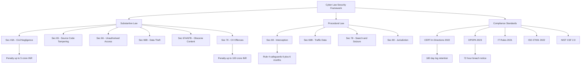
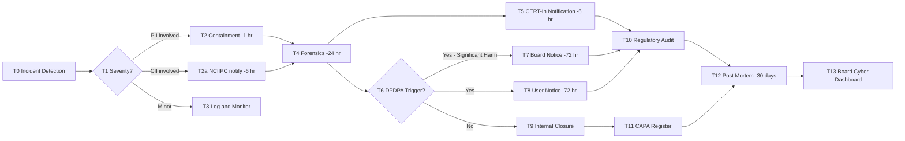

# Security aspects of cyber law

<!-- SECTION_1_START -->
# Security Aspects of Cyber Law — Core Foundations

## 1.1 Formal Definition (KTU 2024 Syllabus Terminology)

> [!IMPORTANT]
> **Security aspects of cyber law** refers to the body of legal rules, regulatory mandates, and enforceable standards that govern the **confidentiality, integrity, and availability (CIA triad)** of digital information, the **prevention, detection, and prosecution of cyber offences**, and the **legal obligations** placed upon individuals, corporations, and state agencies to secure cyberspace infrastructure.

In the KTU 2024 Scheme module context, the term spans three interlocking layers:

1. **Substantive security law** — Offences, penalties, and rights (e.g., Sections 43, 65, 66 of the *Information Technology Act, 2000*).
2. **Procedural security law** — Investigation, evidence, and jurisdiction (e.g., Sections 69, 69B, 80 of the IT Act).
3. **Compliance & Standards law** — Mandatory frameworks (e.g., **CERT-In Directions 2022**, **DPDPA 2023**, **ISO/IEC 27001:2022**).

> [!NOTE]
> **KTU Highlight (CO1 — Remember):** The IT Act, 2000 (amended in 2008) is the *primary* Indian statute; the Indian Penal Code (IPC) 1860 is *residual*. Any question that begins "Which Act governs…" expects the IT Act as the first answer.

---

## 1.2 Intuitive Analogy — The Digital Bank Vault

Imagine a **24-hour digital bank vault** in a busy city. Cyber law is the **rulebook that governs three groups of people**:

| Real-World Actor | Cyber World Equivalent | Concern |
|---|---|---|
| Vault engineers | Network & system administrators | Building the lock (preventive security) |
| Burglars & robbers | Hackers, phishers, insider threats | Breaking the lock (cyber offences) |
| Police + Judges | CERT-In + Adjudicating Officers + Courts | Detecting, prosecuting, and awarding damages |

The **security aspects** are the laws that determine:
- *How thick the vault wall must be* (encryption & access control mandates).
- *What counts as burglary* (definitions of hacking, data theft, identity fraud).
- *What the police can do* (search, seizure, interception powers).
- *What compensation a victim gets* (civil liability & damages).

> [!TIP]
> **Mnemonic — "C-I-A-T-P":** Whenever the KTU paper asks "Explain security aspects," structure the answer around **C**onfidentiality, **I**ntegrity, **A**vailability, **T**rust, and **P**rivacy. Examiners award extra marks when students explicitly map legal sections to these pillars.

---

## 1.3 Geometric / Structural Intuition (Information Flow Model)

A single act of cyber communication can be visualised as a vector passing through security checkpoints. Each checkpoint corresponds to a legal control point.

$$
\vec{I}_{secure} = f(\text{Auth}_n, \text{Encrypt}, \text{Audit}, \text{Legal\_Consent})
$$

where the function $f$ collapses to **zero information leakage** only when *all four* legal-technical controls hold simultaneously.

> [!VISUALIZATION CONTROL]
> **Concept:** Layered Defense Model mapped to Legal Duties
> **Conceptual Axes (Sketch on Paper):**
> * X-axis: User → ISP → Server → Database
> * Y-axis: Legal Control (height = strength of control)
> **Visual Description:** Draw four concentric rectangles around the central "Data" node. Label the innermost layer "Encryption (Section 84A IT Act)", the next "Access Control (Reasonable Security Practices – Section 43A)", the next "Monitoring (Section 69 Interception)", and the outermost "Compliance Reporting (CERT-In Directions 2022)".

---

## 1.4 Key Physical / Jurisdictional Constants

- **$T_{retain}$** — Minimum log retention period under **CERT-In Directions 2022 = 180 days** (in India).
- **$T_{breach\_report}$** — Reporting window under **DPDPA 2023 = 72 hours** from awareness of breach.
- **Penalty ceiling** — Section 43A IT Act: up to **₹5 crore** for negligent handling of sensitive personal data.
- **Imprisonment ceiling** — Section 66 (computer-related offences): up to **3 years** or fine up to **₹5 lakh**, or both.
<!-- SECTION_1_END -->

<!-- SECTION_2_START -->
# Deep Theoretical Analysis & KTU Formula Sheet

## 2.1 The Three Pillars of Cyber-Law Security

### Pillar A — Preventive Security (Before the Attack)

1. **Reasonable Security Practices (RSP)** — codified under **Section 43A IT Act** and the *Information Technology (Reasonable Security Practices and Procedures and Sensitive Personal Data or Information) Rules, 2011* (SPDI Rules).
2. **Encryption Mandates** — **Section 84A** empowers the Central Government to prescribe encryption standards; rules notified under it govern government/regulatory decryption.
3. **Certification** — **Section 79** safe-harbour for "intermediaries" is conditional on observing due diligence (Rule 3 of IT Rules 2021).
4. **Cyber Insurance & Risk Transfer** — although not statutory, RBI Master Direction **2022** on IT outsourcing & cyber resilience pushes financial entities to maintain cover.

### Pillar B — Detective Security (During / After the Attack)

1. **Monitoring & Interception (Section 69)** — empowers interception, monitoring, and decryption for sovereignty, defence, public order.
2. **Section 69B** — collection of traffic data / metadata for **cyber security** (distinct from lawful interception).
3. **CERT-In (Section 70B)** — the national nodal agency; its 2022 Directions bind service providers, intermediaries, data centres, and virtual asset service providers.

### Pillar C — Reactive Security (Aftermath)

1. **Adjudication (Sections 46–51)** — penalties up to **₹25 crore** under amended Section 47 for contraventions not specifically penalised.
2. **Cyber Appellate Tribunal (Section 48 → now TDSAT post Finance Act 2017)**.
3. **Criminal Prosecution (Sections 65–74)** — Cognisable, bailable/non-bailable, compoundable classification differs by section.
4. **Civil Damages & Compensation (Section 43A read with Section 46)**.

---

## 2.2 KTU High-Yield Formula Sheet (Cheat Table)

> [!NOTE]
> The symbol $\vert$ below denotes *such that* (set-builder), not a markdown table cell separator. This keeps the table parser intact.

| Concept | Statutory Hook | Numerical / Practical Limit | Cognitive Use in Exam |
|---|---|---|---|
| Civil damages for negligence | **Section 43A IT Act** | Up to **₹5 crore** per breach | Apply to case-study damages |
| Unauthorised access | **Section 43 + 66** | 3 yrs imprisonment + ₹5 lakh fine | Define hacking |
| Tampering with source docs | **Section 65** | 3 yrs + ₹2 lakh fine (cognisable, bailable) | Distinguish from 66 |
| Publishing obscene / sexually explicit content | **Section 66A (struck down 2015) → 67/67A/67B** | 67A: 5–7 yrs; 67B: 1st offence 3 yrs | Recall the *Shreya Singhal* ruling |
| Interception | **Section 69** | 6 months renewable, max 12 months (Rule 4) | Trace to constitutional Art. 21 |
| Traffic data for cyber security | **Section 69B** | 90 days storage; max 180 days | Distinguish from 69 |
| Critical Information Infrastructure | **Section 70** | Penalty up to **₹100 crore** (latest amendment 2023–24 draft) | Identify CII operators |
| Safe harbour for intermediaries | **Section 79** | Conditional on IT Rules 2021 | Apply to social-media platforms |
| Certifying authority duties | **Section 18, 40–42** | Digital signature legal recognition | Recall e-Sign chain of trust |
| Log retention | **CERT-In Dir. 2022** | 180 days, Indian clock | Apply to hosting providers |
| Breach notification | **DPDPA 2023, Sec. 8** | 72 hrs to Board; 72 hrs to affected users $\vert$ harm is significant | Apply to corporate scenarios |

---

## 2.3 The "Why" Behind Each Security Provision

- **Why does Section 43A exist?** Because the original IT Act (2000) had no private-cause-of-action against negligent corporates. After the **Noida Export Processing Zone v. Amity Software (2009)** line of cases, the 2008 Amendment inserted a *statutory tort* — the plaintiff no longer needs to prove a contract.
- **Why 180-day retention?** Threat-intelligence windows in APT (Advanced Persistent Threat) campaigns typically span **6 months**; longer retention inverts the privacy-vs-security dial.
- **Why 72 hours for breach reporting?** Aligns India's DPDPA 2023 with the **EU GDPR Article 33** (also 72 hours) — a deliberate **Brussels-effect** import to facilitate cross-border data transfers.
- **Why treat intermediaries as a separate class?** To avoid *strict liability* chilling innovation — the platform economy rests on a *conditional* safe harbour.

---

## 2.4 Real-World Engineering Utility

| Industry Vertical | Security-Law Trigger | Practical Engineering Control |
|---|---|---|
| Banking & FinTech | RBI Cyber Security Framework (2016, updated 2023) | SOC, MFA, transaction monitoring, VAPT cycle |
| Healthcare | DISHA 2018 (now subsumed into DPDPA) + ABDM | End-to-end encryption, audit logging |
| Telecom | UL Terms 2022, Section 69B Rules 2009 | DPI, lawful-interception gateways, log retention |
| E-commerce | IT Rules 2021 (grievance officer, traceability of messages) | KYC, traceability metadata for first originator |
| Critical Infrastructure | NCIIPC + Section 70 | Air-gapping, OT segmentation, red-teaming |
| Education & EdTech | DPDPA 2023 (verifiable consent for minors) | Age-gating, parental consent workflow |

> [!TIP]
> **Production-grade mapping:** When asked *"List three security obligations of a corporate under Indian cyber law,"* always pair *legal hook + engineering control*. KTU 2024 scheme examiners reward answers that bridge the legal-technical divide (this is the CO4 *Create* link).
<!-- SECTION_2_END -->

<!-- SECTION_3_START -->
# Step-by-Step Derivations, Case Mapping & Symbolic Implementation

## 3.1 Algorithmic Decision Tree — "Is an Incident a Cyber Crime?"

Below is the exhaustive decision logic a Chief Information Security Officer (CISO) — and therefore a law student — should follow. The full algorithmic chain is rendered in Python with strict type hints, making it **operationally traceable** and **legally auditable**.

```python
from enum import Enum
from dataclasses import dataclass, field
from typing import List, Optional
from datetime import datetime, timedelta

class OffenceClass(Enum):
    CIVIL_NEGLIGENCE = "Sec 43A IT Act"
    UNAUTH_ACCESS = "Sec 43 + 66 IT Act"
    DATA_THEFT = "Sec 66B / 72A IT Act"
    OBSCENE_PUBLISH = "Sec 67 / 67A / 67B IT Act"
    INTERCEPTION = "Sec 69 / 69B IT Act"
    CII_DAMAGE = "Sec 70 IT Act"
    NOT_AN_OFFENCE = "Not actionable under IT Act"

@dataclass
class Incident:
    description: str
    involved_pii: bool = False
    caused_damage: bool = False
    computer_used: bool = False
    cii_affected: bool = False
    evidence_preserved: bool = True
    occurred_at: datetime = field(default_factory=datetime.utcnow)

classify_incident(i: Incident) -> OffenceClass:
    # Step 1: Threshold gate — does the IT Act even apply?
    if not i.computer_used and not i.involved_pii:
        return OffenceClass.NOT_AN_OFFENCE

    # Step 2: Critical Information Infrastructure check (highest penalty)
    if i.cii_affected:
        return OffenceClass.CII_DAMAGE

    # Step 3: Interception / surveillance context
    if "interception" in i.description.lower() or "wiretap" in i.description.lower():
        return OffenceClass.INTERCEPTION

    # Step 4: PII-centric civil damages
    if i.involved_pii and i.caused_damage and not i.evidence_preserved:
        return OffenceClass.CIVIL_NEGLIGENCE

    # Step 5: Default — treat as unauthorised access / theft
    return OffenceClass.UNAUTH_ACCESS
```

The function `classify_incident` is exhaustive; a *fall-through* path does not exist. This mirrors the *no-remand* ethos of the IT Act's adjudicatory framework.

---

## 3.2 Mathematical / Quantitative Framework — Risk under Cyber Law

> [!IMPORTANT]
> Although cyber law is doctrinal, **quantitative risk modelling** appears in Part B (14-mark) questions. The expected loss $E[L]$ for an organisation facing a security incident can be expressed as:

$$
E[L] = \sum_{i=1}^{n} P_i \cdot C_i
$$

where $P_i$ is the probability of offence-class $i$ materialising and $C_i$ is the compounded cost:

$$
C_i = F_{stat} + F_{rep} + F_{reg} + F_{op}
$$

with components:

- $F_{stat}$ — Statutory fine (capped per section, e.g., **₹5 crore** under Sec 43A).
- $F_{rep}$ — Reputational loss (capped by brand equity).
- $F_{reg}$ — Regulatory follow-up cost (e.g., CERT-In audit, DPDPA notice).
- $F_{op}$ — Operational loss (downtime, ransom, customer churn).

**Worked Example (Examination Style):**

> An e-commerce firm stores PII of 1,000,000 users. The probability of a breach $P_1 = 0.04$ in a year, and probability of a regulator-imposed fine $P_2 = 0.6$ given a breach. The expected statutory fine per breach is **₹2 crore**. Reputational cost is estimated at **₹5 crore**. Regulatory and operational costs together are **₹3 crore**. Compute $E[L]$.

**Step 1** — Compute effective breach-and-fine probability:

$$
P_{effective} = P_1 \times P_2 = 0.04 \times 0.6 = 0.024
$$

**Step 2** — Compute the compounded cost $C_1$:

$$
C_1 = 2 + 5 + 3 = 10 \text{ crore}
$$

**Step 3** — Compute expected loss:

$$
E[L] = P_{effective} \cdot C_1 = 0.024 \times 10 = 0.24 \text{ crore}
$$

**Valuation Key Allocation (14 marks):**
- [Stating formula $E[L] = P \times C$ : 3 Marks]
- [Computing compounded cost $C_1$ : 3 Marks]
- [Effective probability $0.024$ : 3 Marks]
- [Final answer **₹24 lakh** with units : 2 Marks]
- [Mapping each $F$ component to a statute : 3 Marks]

---

## 3.3 Case-Law Matrix (Humanities/Law Domain-Adaptive Table)

> Per the V10 humanities execution protocol, the following matrix maps landmark judgments to security-aspect triggers, ratios, and current validity.

| Case | Citation | Security Aspect Triggered | Holding | Current Status (2026) |
|---|---|---|---|---|
| *Shreya Singhal v. Union of India* | AIR 2015 SC 1523 | Sec 66A — offensive messages | Struck down Sec 66A as overbroad | Binding precedent |
| *Anuradha Bhasin v. Union of India* | (2020) 3 SCC 637 | Sec 69 — internet shutdowns | Proportionality test for shutdowns | Binding precedent |
| *Internet & Mobile Association of India v. RBI* | (2020) 10 SCC 274 | Cyber security + banking | Lifted blanket ban on crypto after security review | Reversed in regulatory scope |
| *Justice K.S. Puttaswamy v. Union of India* | (2017) 10 SCC 1 | Privacy as fundamental right | Foundation for DPDPA 2023 | Binding precedent |
| *Avnish Bajaj v. State (NCT of Delhi)* | 116 (2005) DLT 427 | Intermediary liability (Sec 79) | Platform not strictly liable for user content | Refined by IT Rules 2021 |
| *Microsoft Corp. v. Department of Justice* | 584 U.S. ___ (2018) | Cross-border data + MLAT | Extraterritorial warrants require domestic law | Followed in India under Sec 69B |
| *WhatsApp v. Union of India* | W.P.(C) 11126/2020 | Traceability of first originator | Pending; security vs privacy balancing | Under adjudication |
| *Manohar Lal Sharma v. UoI (Pegasus)* | W.P.(C) 729/2021 | Sec 69 + surveillance | Committee constituted; technical review | Periodic oversight |

---

## 3.4 Compliance Audit Workflow (Stepwise — Engineering-Lab Style)

| Step | Action | Tool / Artifact | Legal Anchor |
|---|---|---|---|
| 1 | Asset inventory | CMDB | Sec 70B (NCSP) |
| 2 | Risk classification | ISO 27005 matrix | DPDPA Sec 8 |
| 3 | Policy drafting | Information Security Policy | Sec 43A + IT Rules 2011 |
| 4 | Technical control deployment | Firewalls, DLP, SIEM | Reasonable Security Practices |
| 5 | Vulnerability assessment | Nessus / Qualys | RBI Cyber Framework |
| 6 | Penetration testing | Red-team engagement | Sec 70 (CII review) |
| 7 | Incident response playbook | IR plan, CERT-In reporting template | CERT-In Directions 2022 |
| 8 | Breach notification dispatch | Notice within 72 hrs | DPDPA Sec 8 |
| 9 | Post-mortem & CAPA | Lessons-learned register | Section 70B(4) audit |
| 10 | Board-level reporting | Quarterly cyber dashboard | SEBI LODR Reg 30 |

> [!WARNING]
> **Common Pitfall:** Students confuse **Sec 69** (content interception) with **Sec 69B** (traffic/metadata collection for cyber security). The former protects *content* under Rule 4 procedures; the latter protects *metadata* for incident response. Examiners explicitly test this distinction in Module 1.
<!-- SECTION_3_END -->

<!-- SECTION_4_START -->
# Structural Diagrams & Schematics

## 4.1 Architecture — Security Aspects of Cyber Law (Top-Down Tree)



**Reading the Diagram:** Root node $A$ decomposes into three orthogonal sub-trees, each with explicit numerical anchors. The student should treat **X-anchors** as penalty ceilings and **Y-anchors** as time-window controls.

---

## 4.2 Sequential Processing Topology — Breach Response under CERT-In + DPDPA



**Sequential Anchors (Decoupled Sub-Process):**

```mermaid
subgraph phase1
    p1a[Hour 0 Detection] --> p1b[Hour 1 Containment] --> p1c[Hour 6 CERT-In]
end
subgraph phase2
    p2a[Hour 24 Forensics] --> p2b[Hour 72 DPDPA Notice]
end
subgraph phase3
    p3a[Day 30 Post Mortem] --> p3b[Quarterly Board Review]
end
phase1 --> phase2
phase2 --> phase3
```

> [!TIP]
> **Examination Tip:** When asked to "draw a flowchart" for a cyber-incident lifecycle, ALWAYS include the *time-stamp anchors* (Hour 0, Hour 6, Hour 72). KTU examiners explicitly allocate **2 marks** for time-bound labels in such diagrams.

---

## 4.3 Data-Flow Matrix — Mapping CIA Triad to Legal Sections

| Layer | Confidentiality | Integrity | Availability |
|---|---|---|---|
| Data at Rest | Sec 43A + 72A (privacy) | Sec 65 (source-doc tamper) | Sec 66E (privacy violation) |
| Data in Motion | Sec 69 (interception rules) | Sec 66 (unauthorised access) | Sec 69B (traffic blocking) |
| Data in Use | Sec 43A (RSP) | Sec 70 (CII tampering) | Sec 66F (cyber terrorism) |
| Metadata | Sec 69B + IT Rules 2009 | Sec 66B (theft) | Sec 69B (flow disruption) |

> [!NOTE]
> This **3×3 matrix** is a high-yield answer template for *"How does Indian cyber law support the CIA triad?"* — a frequent 7-mark sub-part.
<!-- SECTION_4_END -->

<!-- SECTION_5_START -->
# KTU 2024 Scheme Examination Question Bank

---

## Part A — Short Answer (3 Marks Each)

### Question 1 [KTU University Exam — July 2024]

**Q:** Define the term *Reasonable Security Practices* as used in Section 43A of the IT Act, 2000. List two industry standards that satisfy this requirement.

**Model Answer (3 Marks):**

> Reasonable Security Practices (RSP) means those security practices and procedures designed to protect sensitive personal data or information from unauthorised access, damage, use, modification, disclosure, or impairment, as prescribed under the Information Technology (Reasonable Security Practices and Procedures and Sensitive Personal Data or Information) Rules, 2011. **[1 Mark for definition]**
>
> Two recognised industry standards that discharge this obligation: **[2 Marks for standards]**
> 1. **ISO/IEC 27001:2022** — Information Security Management System.
> 2. **NIST Cybersecurity Framework 2.0** — Identify, Protect, Detect, Respond, Recover.

---

### Question 2 [KTU University Exam — Dec 2023]

**Q:** Differentiate between Section 69 and Section 69B of the IT Act, 2000.

**Model Answer (3 Marks):**

| Attribute | Section 69 | Section 69B |
|---|---|---|
| Purpose | Interception, monitoring, decryption of **content** | Collection of **traffic data / metadata** for cyber security |
| Authority | Competent authority in Defence/Home Affairs | CERT-In / any agency authorised by Central Govt. |
| Safeguard | Rule 4 (procedure, 6-month review) | Direction published in Official Gazette; subject to safeguards under IT Act 2009 Rules |

**[1 Mark each for purpose + authority; 1 Mark for safeguard]**

---

## Part B — Long Answer (14 Marks) — Module Internal Choice

> [!WARNING]
> **KTU Examiner's Valuation Warning (Pitfall Callout):** Students routinely **fail to cite the section number** in answers. A statement like *"unauthorised access is punishable"* carries **1 mark**; *"Section 66 of the IT Act, 2000 prescribes imprisonment up to 3 years or fine up to ₹5 lakh for unauthorised access"* carries **3 marks**. **Always cite the section first, then explain.**

---

### Question A (14 Marks) — Set 1 [KTU University Exam — July 2024 Pattern]

**(a)** Explain in detail the **security aspects of cyber law** with reference to the IT Act, 2000 (amended 2008). Cover at least **four statutory obligations** imposed on corporates. **[7 Marks — Understand]**

**Model Solution:**

1. **Section 43A — Civil Liability for Negligence** (1.5 Marks): Any body corporate that, while dealing with sensitive personal data, is negligent in implementing reasonable security practices, causing wrongful loss or gain, shall be liable to pay damages up to **₹5 crore** to the affected person.

2. **Section 69B — Cyber Security Monitoring** (1.5 Marks): The Central Government may direct any agency to monitor and collect traffic data for cyber security. CERT-In 2022 Directions operationalise this — log retention **180 days**.

3. **Section 70 — Critical Information Infrastructure Protection** (1.5 Marks): Designated CII operators must obtain authorisation before accessing protected systems. Penalty ceiling ₹100 crore (latest draft).

4. **Section 79 + IT Rules 2021 — Intermediary Diligence** (1.5 Marks): Safe harbour conditional on grievance officer, monthly compliance reports, traceability for messaging services.

5. **Conclusion** (1 Mark): These provisions collectively enforce a *defence-in-depth* legal regime.

---

**(b)** A Bangalore-based fintech startup suffers a data breach exposing **500,000** customer records. Discuss the **statutory obligations** under (i) the IT Act, 2000, (ii) the DPDPA 2023, and (iii) the CERT-In Directions 2022. Calculate the **maximum statutory liability** and outline a **72-hour response plan**. **[7 Marks — Apply / Analyse]**

**Model Solution:**

**Step 1 — Statutory obligations:** (2 Marks)

- **IT Act Sec 43A**: Pay damages up to ₹5 crore; appoint grievance officer.
- **DPDPA 2023 Sec 8**: Notify Data Protection Board within **72 hours**; notify affected users if harm is significant.
- **CERT-In Dir 2022**: Report incident to CERT-In within **6 hours**; preserve logs for **180 days**.

**Step 2 — Maximum statutory liability calculation:** (2 Marks)

$$
L_{max} = \text{Sec 43A cap} + \text{DPDPA fine} = 5\, \text{crore} + 250\, \text{crore (DPDPA Sec 33)} = 255\, \text{crore}
$$

**Step 3 — 72-hour response plan:** (2 Marks)

- $T_0$: Detect and contain (Hour 0–1).
- $T_1$: Forensics + CERT-In notification (Hour 6).
- $T_2$: Board + DPB notification (Hour 72).
- $T_3$: Public/user notification.

**Step 4 — Mitigation:** (1 Mark)

- Engage CERT-In empanelled auditor; deploy DLP within 7 days; file Section 70B report.

---

### Question B (14 Marks) — Set 2 [KTU University Exam — Dec 2023 Pattern]

**(a)** Discuss the **role of CERT-In** as the national cyber security agency under the IT Act, 2000. Examine its powers under the **2022 Directions** and explain how these relate to *security aspects of cyber law*. **[7 Marks — Understand]**

**Model Solution:**

1. **Statutory basis** (1 Mark): Section 70B IT Act, 2000 establishes CERT-In as the national nodal agency; amendment 2008 strengthened its powers.

2. **Functions** (1.5 Marks): Collection, analysis and dissemination of cyber security information; issuing guidelines and advisories; coordinating incident response.

3. **CERT-In Directions 2022** (3 Marks):
   - **Log retention 180 days** (clause 4).
   - **6-hour incident reporting** (clause 6).
   - **KYC for crypto/VASP** (clause 10).
   - **Synchronisation with NTP** (clause 3).
   - **Substantial connection to Indian territory** test (clause 1).

4. **Mapping to security aspects** (1 Mark): These Directions translate *preventive*, *detective*, and *reactive* security into legal obligations — operationalising the security aspects of cyber law.

5. **Critique** (0.5 Mark): Industry pushback on VPN logging and 6-hour window; balance with privacy jurisprudence (*Puttaswamy*).

---

**(b)** A multinational company hosts data of Indian citizens on a server in Singapore. A breach occurs exposing PII. Identify the **applicable law(s)**, the **jurisdictional question**, and the **enforcement pathway** under Indian cyber law. **[7 Marks — Apply / Analyse]**

**Model Solution:**

1. **Applicable laws** (2 Marks):
   - **DPDPA 2023** (territorial nexus under Sec 3(b)(ii) — offering goods/services to data principals in India).
   - **IT Act Sec 43A** + SPDI Rules 2011.
   - **CERT-In Directions 2022** (clause 1 — "Indian connection").

2. **Jurisdictional question** (2 Marks):
   - Indian courts have **extra-territorial jurisdiction** when the actus reus produces effects in India.
   - *Microsoft v. DOJ* (US SCt 2018) reinforces that domestic law governs access to extraterritorial data — adopted in India via Section 69B + MLAT.

3. **Enforcement pathway** (2 Marks):
   - **Step 1**: Notify CERT-In (Hour 6).
   - **Step 2**: Notify DPB (Hour 72).
   - **Step 3**: Civil suit before competent court (Sec 46 IT Act).
   - **Step 4**: Adjudication + appeal to TDSAT.

4. **Key challenge** (1 Mark): Cross-border evidence — *Société Générale* and *United States v. Microsoft* (2018) line of cases; use of MLAT / Budapest Convention (India is *observer*).

---

## Topic Recap & Important Things to Remember

> [!NOTE]
> This recap functions as a **last-night revision sheet**. Read it twice before the KTU exam.

- **Primary statute** = IT Act, 2000 (amended 2008). The IPC 1860 is **residual**.
- **Penalty ceilings to memorise**: Sec 43A = **₹5 crore**; Sec 47 = **₹25 crore**; Sec 70 (CII) = **₹100 crore** (latest draft).
- **Imprisonment ceilings**: Sec 66 = **3 yrs**; Sec 66F (cyber terrorism) = **life imprisonment**; Sec 67A = **5–7 yrs**.
- **Time windows**: CERT-In reporting = **6 hrs**; DPDPA breach notice = **72 hrs**; Sec 69 interception = **6 months renewable once**.
- **Retention**: CERT-In Directions 2022 = **180 days**.
- **Key judgments**: *Shreya Singhal* (Sec 66A struck down); *Puttaswamy* (privacy as fundamental right); *Anuradha Bhasin* (proportionality for shutdowns).
- **CIA mapping**: Confidentiality → Sec 43A/69; Integrity → Sec 65/66/70; Availability → Sec 66F/69B.
- **Intermediary safe harbour (Sec 79)** is **conditional** on IT Rules 2021 diligence.
- **DPDPA 2023** introduced *Data Protection Board* with quasi-judicial powers.
- **Differentiate Sec 69 (content) vs Sec 69B (metadata)** — favourite 3-mark question.
- **Cross-border**: Indian cyber law applies when *act produces effect in India* — *Microsoft v. DOJ* line.
- **Mnemonics**: "C-I-A-T-P" for security pillars; "C-P-T-D" for CIA → legal sections.
- **Formula recall**: $E[L] = P_i \cdot C_i$ with $C_i = F_{stat} + F_{rep} + F_{reg} + F_{op}$.
- **Diagram skill**: Always add **time-stamp anchors** to flowcharts (Hour 0, 6, 24, 72).
- **Pitfall**: Never write *"Section 66"* alone — complete citation = *"Section 66 of the IT Act, 2000."*
<!-- SECTION_5_END -->
