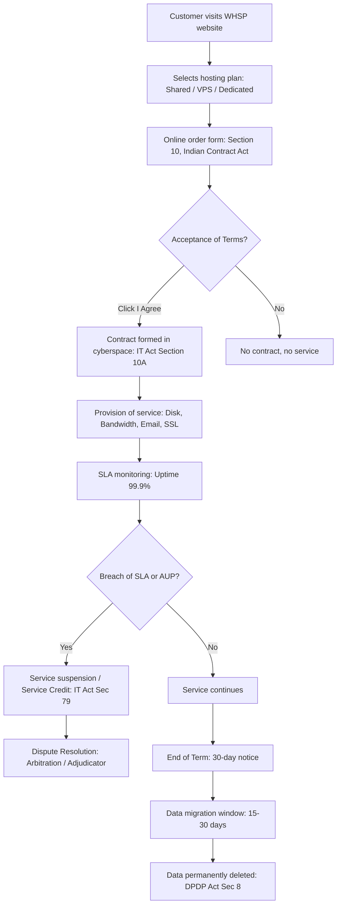
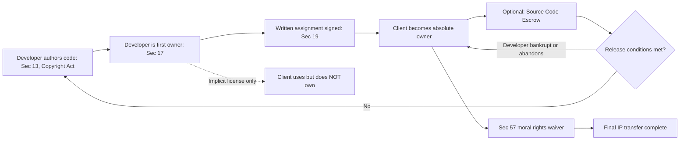
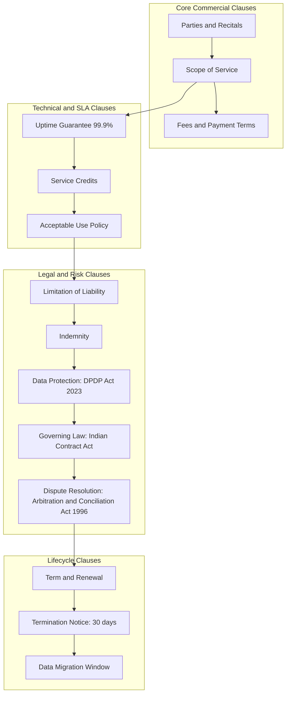
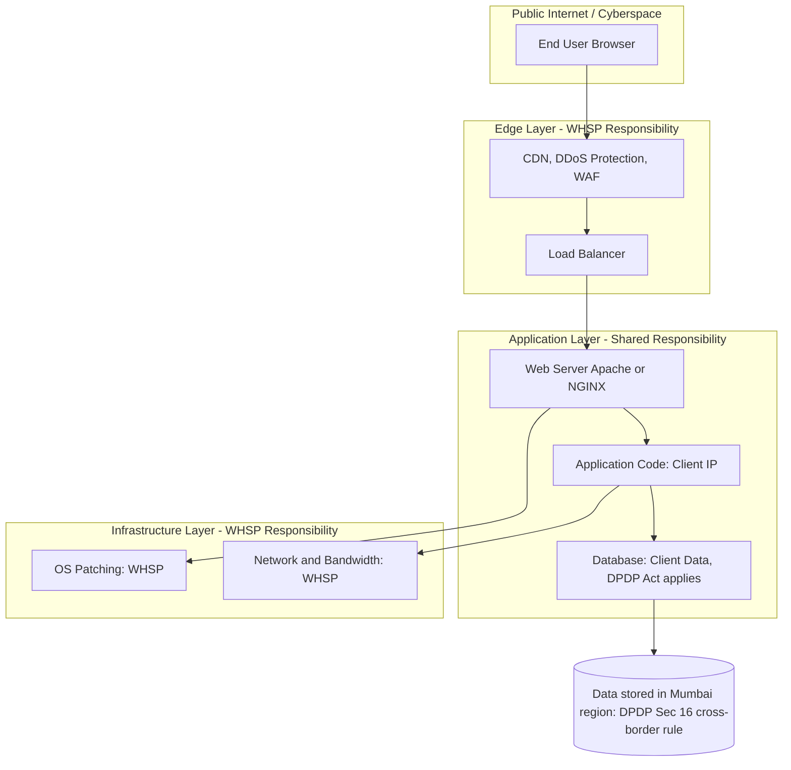

# Web hosting and web development agreement

<!-- SECTION_1_START -->
# Web Hosting and Web Development Agreement

## 1. Core Technical Definition

### Web Hosting Agreement
A **Web Hosting Agreement** is a legally binding **Service Level Contract (SLA)** executed between a website owner (the *Customer* or *Subscriber*) and a **Web Hosting Service Provider (WHSP)**. Under this contract, the WHSP allocates server resources — disk space, bandwidth, CPU, RAM, and IP addresses — on a shared, virtual private, or dedicated infrastructure, and guarantees a measurable level of **uptime (typically 99.9%)**, security, backup, and technical support, in exchange for recurring monetary consideration (monthly/annual fee).

> [!IMPORTANT]
> **KTU 2024 Definition (PECST419, Module 1):** A web hosting agreement is a *cyber-contract* governed by the **Indian Contract Act, 1872**, the **Information Technology Act, 2000 (as amended in 2008)**, and the **Digital Personal Data Protection Act, 2023 (DPDP Act)**, since the service is rendered entirely in *cyberspace* and frequently involves the processing of personal data of end-users.

### Web Development Agreement
A **Web Development Agreement** is a *contract for services and intellectual property (IP) assignment* between a **Client** (typically the business commissioning the website) and a **Web Developer / Development Agency**. The agreement defines the technical specifications, design deliverables, milestones, source code ownership, **intellectual property rights transfer**, post-launch maintenance, and warranty obligations of the developer.

> [!NOTE]
> **Syllabus Highlight:** PECST419 Module 1 treats both agreements as foundational **"cyber contracts"** because (a) they are formed electronically, (b) their subject matter exists in cyberspace, and (c) their breach triggers remedies under both traditional contract law and the IT Act, 2000.

### Conceptual Analogy / Intuition
Think of a **Web Hosting Agreement** like a **rental lease for a shop in a mall**:
- The hosting provider is the **mall owner** who gives you floor space (server space) and utilities (bandwidth, power, security).
- You pay monthly rent and abide by mall rules (Acceptable Use Policy).
- The mall guarantees basic services (escalators, lighting = uptime), but is not responsible if your shop burns down due to your own negligence.

Think of a **Web Development Agreement** like hiring an **architect and builder to construct your dream house**:
- The developer (builder) creates the website (house) to your design.
- The agreement decides **who owns the house** after construction (IP assignment) and **who fixes a leaking roof** after handover (warranty/maintenance).
- Without a written agreement, the builder could legally claim ownership of the blueprint and rent your own house back to you.

### Key Industry-Standard Metrics
The following constants appear in nearly every production-grade hosting SLA:

| Metric | Standard Value | KTU Significance |
|---|---|---|
| **Uptime Guarantee** | **99.9%** ("three nines") | Permitted downtime ≈ 8 hours 45 minutes/year |
| **Bandwidth** | Measured in GB / TB / month | Determines traffic capacity |
| **Backup Frequency** | **Daily** (industry default) | Critical for data protection |
| **Support Response (P1)** | **≤ 1 hour** | For server-down critical issues |
| **Money-Back Period** | **30 days** | Common in Indian SMB hosting market |

### Visualization Control (Conceptual Cost vs. Control Trade-off)
> [!VISUALIZATION CONTROL]
> **Concept:** Hosting Type Trade-off (Cost vs. Control vs. Responsibility)
> **GeoGebra / Desmos Input Equations:**
> * `f(x) = 10*x + 50`     *(Shared Hosting — low cost, low control)*
> * `g(x) = 50*x + 500`    *(VPS Hosting — medium)*
> * `h(x) = 200*x + 5000`  *(Dedicated Server — high cost, high control)*
>
> **Visual Description:** On the X-axis, plot *Control Level* (1 to 5). On the Y-axis, plot *Monthly Cost in ₹*. The student should observe three upward-sloping lines. The point of intersection between the lines demonstrates that as **control and responsibility increase, the legal liability under the hosting agreement also increases** (the customer takes on more risk).

---

<!-- SECTION_1_END -->

<!-- SECTION_2_START -->
# Deep Theoretical Analysis & KTU High-Yield Clause Sheet

## 2.1 Anatomy of a Web Hosting Agreement

A legally robust hosting agreement contains **eight non-negotiable clauses**. Each clause is mapped to a specific Indian statute for KTU exam traceability.

### Clause-by-Clause Breakdown

1. **Parties & Recitals** — Identifies the WHSP and Customer, the date of execution, and the *consideration* (price). Legally validated under **Section 10, Indian Contract Act, 1872** (*What agreements are contracts*).

2. **Scope of Service (SoS)** — Specifies *what exactly* is being provided: type of hosting (shared/VPS/dedicated/cloud), storage in **GB**, bandwidth in **GB/month**, number of email accounts, parked domains, and SSL certificate inclusion. The **SoS is the foundation of the warranty** under **Section 12, Sale of Goods Act (analogous application)**, but for services, it triggers the doctrine of *"substantial performance"*.

3. **Service Level Agreement (SLA) Uptime Guarantee** — A promise of **99.9% uptime**, with **Service Credits** as liquidated damages if breached. Most providers (GoDaddy, HostGator, BigRock, ResellerClub) offer **1 day of credit per 1 hour of downtime beyond SLA**, capped at 100% of the monthly fee.

4. **Acceptable Use Policy (AUP)** — A *negative covenant* prohibiting spam, phishing, malware distribution, copyright infringement, and illegal content. Breach = suspension without refund. This aligns with **Section 79, IT Act 2000** (intermediary liability safe harbour — provider must observe "due diligence").

5. **Data Protection & Privacy Clause** — Mandates the WHSP to comply with the **Digital Personal Data Protection Act, 2023 (DPDP Act)**. Critical obligations include:
   * Implement *reasonable security safeguards* (Rule 5 of SPDI Rules, 2011 + DPDP §8(5)).
   * Notify the customer of any **personal data breach within 72 hours** (DPDP §8(6)).
   * Process data only on *documented instructions* of the Data Fiduciary.

6. **Limitation of Liability (LoL)** — Caps the WHSP's total liability to the **fees paid in the preceding 12 months**. This is a *contractual risk allocation* mechanism upheld by Indian courts (*Bhim Sain v. United India Insurance*, pattern applied to cyber contracts).

7. **Indemnity** — The customer indemnifies the WHSP against third-party claims arising from the customer's content. The WHSP indemnifies the customer against IP infringement in the *hosting software itself* (e.g., cPanel, Apache).

8. **Term, Termination & Data Migration** — Defines contract duration (usually 1/2/3 years), termination-for-convenience notice (typically **30 days**), and the **post-termination data retrieval window (usually 15–30 days)**. After this, data is **irretrievably deleted**.

## 2.2 Anatomy of a Web Development Agreement

A development agreement pivots on **Intellectual Property (IP) ownership** — the single most litigated issue in KTU model answers.

### Step-by-Step Logic of IP Ownership Flow
1. **Default Rule:** Under the **Indian Copyright Act, 1957 (Section 17)**, the *author* (developer) is the first owner of copyright in the source code, design, and content created during development.
2. **Assignment Required:** For the client to own the IP, the agreement must contain an **express assignment in writing**, signed by the developer, for the **entire term of copyright** (which for software is the **author's lifetime + 60 years** under Section 22).
3. **"Work for Hire" Doctrine:** Indian law does *not* have a U.S.-style "work made for hire" doctrine, so the assignment clause is the **only legal mechanism** to transfer ownership.
4. **Moral Rights:** Under **Section 57, Copyright Act**, the developer's *right of paternity* and *right of integrity* persist even after assignment — meaning the developer can demand credit and object to derogatory modifications, unless specifically waived in the agreement.

> [!WARNING]
> **KTU Pitfall:** A common student error is writing *"the developer works for the client, so the client owns the code"*. This is **legally incorrect** in India. Without an express written assignment, the **developer retains copyright**, and the client merely has an implied license to use the website.

## 2.3 KTU High-Yield Comparative Clause Sheet (Web Hosting vs. Web Development)

| Parameter | Web Hosting Agreement | Web Development Agreement |
|---|---|---|
| **Legal Nature** | Contract for *services* (B2B/B2C) | Contract for *services + IP assignment* |
| **Primary Statutes** | IT Act 2000, Indian Contract Act 1872, DPDP Act 2023 | Indian Contract Act 1872, Copyright Act 1957, Design Act 2000 |
| **Core Obligation** | Provide server uptime & data storage | Deliver functional website + source code |
| **Payment Structure** | Recurring (monthly/annual) | Milestone-based (advance + interim + final) or fixed |
| **IP Ownership** | Customer owns *content*; WHSP owns *hosting software* | **Client owns code only after written assignment** |
| **Warranty Period** | Implicit throughout the contract term | Typically **30–90 days** post-launch |
| **Liability Cap** | 12 months of fees | Total project value |
| **Termination** | 30-day notice; data migration window | Project-dependent; escrow of source code |
| **Dispute Resolution** | Arbitration in provider's city (often) | Arbitration in client's city (negotiated) |
| **Critical Risk** | Data loss / downtime | IP dispute / non-delivery |

## 2.4 Real-World Utility in Engineering and Computer Science

* **Startups:** Almost every funded Indian startup signs both agreements before a single line of code goes to production. Investors (Sequoia, Accel) perform **legal due diligence** on these contracts before Series A funding.
* **E-commerce & EdTech:** Companies like Flipkart, Swiggy, and Byju's host on **AWS Mumbai region** under a custom Enterprise SLA that includes **DPDP Act compliance audits** and **penetration testing obligations**.
* **Government Projects:** Under the **MeghRaj Cloud** initiative of the Government of India, hosting agreements must additionally comply with the **GI Cloud (MeghRaj) Compliance Audit** and the **National Cyber Security Policy, 2013**.
* **Open Source:** A development agreement for a Linux-distributed project must explicitly handle **GPL/LGPL licensing** to avoid inadvertent copyleft contamination.

---

<!-- SECTION_2_END -->

<!-- SECTION_3_START -->
# Step-by-Step Derivations and Legal-Clause Implementation

## 3.1 Step-by-Step Derivation: How a Hosting SLA is Quantified

The KTU paper may ask you to calculate the **permissible downtime** or the **service credit refund** under a hosting SLA. The derivation is given below in full.

### Given Inputs
* Annual Uptime Guarantee (U): $\mathbf{99.9\%}$
* Total hours in a year (H): $\mathbf{8760 \text{ hours}}$
* Actual measured downtime in a year (D): $\mathbf{12 \text{ hours}}$
* Monthly fee paid by customer (M): $\mathbf{₹500}$

### Step 1 — Compute Permitted Downtime in Hours
$$
\begin{aligned}
\text{Permitted Downtime} &= H \times \frac{(100\% - U)}{100\%} \\
&= 8760 \times \frac{(100 - 99.9)}{100} \\
&= 8760 \times \frac{0.1}{100} \\
&= 8760 \times 0.001 \\
&= 8.76 \text{ hours}
\end{aligned}
$$
**Explanation:** This means a 99.9% SLA permits approximately **8 hours 45 minutes 36 seconds** of downtime per year.

### Step 2 — Compute Excess Downtime
$$
\begin{aligned}
\text{Excess Downtime} &= D - \text{Permitted Downtime} \\
&= 12 - 8.76 \\
&= 3.24 \text{ hours}
\end{aligned}
$$
**Explanation:** The provider breached the SLA by **3.24 hours** beyond the permitted threshold.

### Step 3 — Apply Industry-Standard Refund Formula
Most Indian hosting providers (BigRock, HostGator India, ResellerClub) follow the **1 day credit per 1 hour of excess downtime** rule, prorated to monthly fee.
$$
\begin{aligned}
\text{Refund} &= \frac{\text{Excess Downtime}}{24} \times M \\
&= \frac{3.24}{24} \times 500 \\
&= 0.135 \times 500 \\
&= ₹67.50
\end{aligned}
$$
**Final Answer:** The customer is entitled to a service credit of **₹67.50** credited to the next billing cycle.

### Step 4 — Cap Check (Industry Practice)
$$
\text{Maximum Cap} = 100\% \text{ of } M = ₹500
$$
Since ₹67.50 ≤ ₹500, the full calculated refund is payable. If calculated refund > ₹500, the customer receives only **₹500** as the liability cap.

> [!NOTE]
> **KTU Examiner Pattern:** Full marks (3/3 or 7/7) require showing all **four steps** with units and a final boxed answer.

## 3.2 Step-by-Step Derivation: IP Assignment Flow in a Development Agreement

The KTU paper may test whether you understand the *sequence of legal events* that transfers ownership of a website's code from the developer to the client.

### Stage 1 — Pre-Contract
* The developer writes the **Source Code** (HTML, CSS, JavaScript, Python, SQL schemas).
* Under **Section 13, Copyright Act, 1957**, copyright subsists in the code as a *literary work*.
* Under **Section 17**, the developer is the **first owner**.

### Stage 2 — Agreement Execution
* The parties sign the Web Development Agreement containing **Clause 9.1 (IP Assignment)**.
* The clause must explicitly state: *"The Developer hereby assigns to the Client, absolutely and in perpetuity, all right, title, and interest in the Deliverables, including but not limited to source code, object code, designs, and documentation, for the entire term of copyright."*
* **Signature by the developer is the legal trigger** under **Section 19, Copyright Act** (assignment must be in writing and signed).

### Stage 3 — Post-Assignment
* The client becomes the **copyright owner**.
* The developer retains only **moral rights** under **Section 57** unless explicitly waived (most professional agreements include a moral rights waiver in Clause 9.2).

### Stage 4 — Dispute Avoidance
* The agreement must include an **IP Indemnity** clause where the developer warrants that the code is *original*, *non-infringing*, and *free of third-party claims*.
* A **Source Code Escrow** is recommended: a neutral third party (e.g., **Skyflow Escrow, NCC Group**) holds the code and releases it to the client if the developer goes bankrupt or abandons support.

### Symbolic Implementation: A Sample Clause Skeleton (Python-Style Pseudocode for Clarity)
```python
class WebDevelopmentAgreement:
    """
    Symbolic model of a Web Development Agreement
    mapped to Sections of the Indian Copyright Act, 1957.
    """
    def __init__(self, client: str, developer: str, project_value_inr: float):
        self.client = client
        self.developer = developer
        self.project_value_inr = project_value_inr
        self.ip_owner = developer          # Default rule: Sec 17, Copyright Act
        self.moral_rights_waived = False  # Default rule: Sec 57
        self.source_code_escrow = False

    def execute_ip_assignment(self, signed: bool) -> None:
        if signed:
            self.ip_owner = self.client   # Sec 19 assignment in writing
            print(f"[LEGAL] IP assigned to {self.client} for the "
                  f"full term of copyright (life + 60 years).")
        else:
            raise ValueError("Assignment must be in writing and signed "
                             "— Section 19, Copyright Act 1957.")

    def waive_moral_rights(self, signed: bool) -> None:
        if signed:
            self.moral_rights_waived = True
            print("[LEGAL] Moral rights under Section 57 waived by developer.")

    def enforce_liability_cap(self, claim_inr: float) -> float:
        return min(claim_inr, self.project_value_inr)


# ---------- DEMO EXECUTION ----------
deal = WebDevelopmentAgreement(
    client="ABC Traders Pvt. Ltd.",
    developer="XYZ Web Studio LLP",
    project_value_inr=500000.0
)
deal.execute_ip_assignment(signed=True)
deal.waive_moral_rights(signed=True)
print(f"Liability payable on a ₹1,00,000 IP claim: ₹"
      f"{deal.enforce_liability_cap(100000)}")
```
**Expected Output (Mental Trace):**
* `[LEGAL] IP assigned to ABC Traders Pvt. Ltd. for the full term of copyright (life + 60 years).`
* `[LEGAL] Moral rights under Section 57 waived by developer.`
* `Liability payable on a ₹1,00,000 IP claim: ₹100000.0` *(capped at project value ₹5,00,000, so full claim is allowed)*

## 3.3 Comparative Case-Framework Matrix Mapping (Real-World to Regulatory)

This is the **mandatory tabular comparative analysis** required for humanities/management-style KTU questions in PECST419.

| Engineering Scenario | Web Agreement Type | Key Contractual Risk | Applicable Indian Law | Regulatory Body |
|---|---|---|---|---|
| Startup hosting on AWS Mumbai | Web Hosting (Cloud SLA) | Data sovereignty / cross-border data flow | **DPDP Act 2023, §16** | Data Protection Board of India |
| E-commerce site on shared hosting | Web Hosting (Shared) | IP infringement by neighbouring tenants on shared IP | **IT Act 2000, §79** | MeitY / Adjudicating Officer |
| Custom ERP built by a freelancer | Web Development | No IP assignment clause; freelancer claims ownership | **Copyright Act 1957, §17 & §19** | Commercial Court |
| LMS portal for a college | Web Development | Accessibility (RPwD Act 2016) non-compliance | **RPwD Act 2016, GIGW 2.0** | DEPwD |
| Government e-tender portal | Web Hosting (Govt Cloud) | Security audit failure | **National Cyber Security Policy 2013** | CERT-In |
| Health-tech app on dedicated server | Web Hosting + Dev | Personal data of patients leaked | **DPDP Act 2023 + IT Act §43A** | CERT-In + DPB |
| Static brochure website for a hotel | Web Development | Use of unlicensed stock images | **Copyright Act §51 (infringement)** | Commercial Court |
| Crypto-trading platform on VPS | Web Hosting | Regulator (SEBI) questioning offshore server | **PMLA 2002 + IT Act** | SEBI / ED |

---

<!-- SECTION_3_END -->

<!-- SECTION_4_START -->
# Structural Diagrams and Schematics

## 4.1 Mermaid Flow — Web Hosting Agreement Lifecycle


## 4.2 Mermaid Flow — Web Development Agreement IP Assignment Chain


## 4.3 Mermaid Subgraph — Modular Clause Architecture of a Hosting Agreement


## 4.4 Mermaid Block Diagram — Server Topology Mapped to Liability Matrix


---

<!-- SECTION_4_END -->

<!-- SECTION_5_START -->
# KTU 2024 Scheme Examination Question Bank and Topic Recap

## Part A — 3-Mark Questions (Remember / Understand)

### Question 1: Conceptual Short-Answer Question
**[KTU University Exam – July 2024 Model Question]**
*Define a Web Hosting Agreement. List any four essential clauses it must contain.*

**Model Answer (Valuation-Key Aligned):**
A **Web Hosting Agreement** is a legally binding contract between a website owner and a Web Hosting Service Provider (WHSP) for the allocation of server resources and guaranteed uptime in exchange for fees, executed partly or wholly through electronic means.

Four essential clauses:
1. **Scope of Service** — specifying storage, bandwidth, and email accounts.
2. **Service Level Agreement (SLA)** — promising 99.9% uptime with defined service credits.
3. **Acceptable Use Policy (AUP)** — prohibiting spam, malware, and illegal content.
4. **Data Protection Clause** — mandating compliance with the **DPDP Act, 2023**.

> **Valuation Key:** *Definition: 1 Mark, Listing clauses: 2 Marks. Total = 3 Marks.*

### Question 2: Definition / Classification Question
**[KTU University Exam – Dec 2023 Model Question]**
*Differentiate between a Web Hosting Agreement and a Web Development Agreement based on (i) primary obligation, (ii) IP ownership, and (iii) payment structure.*

**Model Answer (Tabular Form Expected):**

| Parameter | Web Hosting Agreement | Web Development Agreement |
|---|---|---|
| (i) Primary Obligation | Provide server space and uptime | Deliver functional website and source code |
| (ii) IP Ownership | Customer owns *content*; WHSP owns *hosting software* | Client owns code *only after written assignment* under **Section 19, Copyright Act, 1957** |
| (iii) Payment Structure | Recurring (monthly / annual) | Milestone-based or fixed project fee |

> **Valuation Key:** *Each correct row: 1 Mark. Total = 3 Marks.*

---

## Part B — 14-Mark Questions (Apply / Analyse / Evaluate)

### Question A: Web Hosting Agreement SLA and Breach Analysis [14 Marks]
**[KTU University Exam – Dec 2023 Model Question, CO2, Apply/Analyse]**

**(a)** Explain **five** essential clauses of a Web Hosting Agreement with reference to the **IT Act, 2000** and the **DPDP Act, 2023**. **[7 Marks]**

**(b)** A startup pays **₹1,000/month** to a hosting provider advertising **99.9% uptime**. In a particular year, the actual downtime was **15 hours**. Calculate the **permitted downtime, excess downtime, and the service credit refund** the startup is entitled to. Assume the industry-standard rule of **1-day credit per 1 hour of excess downtime**, capped at 100% of monthly fee. **[7 Marks]**

#### Model Solution

**Part (a) — Five Essential Clauses (7 Marks)**
1. **Scope of Service** — Defines the exact resources (disk, bandwidth, email) provided. *Marks: 1.5*
2. **SLA Uptime Guarantee (99.9%)** — A measurable promise with a remedy (service credits) for breach. *Marks: 1.5*
3. **Acceptable Use Policy** — Prohibits illegal content; aligns with **Section 79, IT Act 2000** (intermediary due diligence). *Marks: 1.5*
4. **Data Protection Clause** — Mandates compliance with **DPDP Act 2023, §8(5)** for reasonable security safeguards. *Marks: 1.5*
5. **Limitation of Liability and Indemnity** — Caps WHSP liability to fees paid in 12 months; customer indemnifies for content. *Marks: 1.0*

**Part (b) — Numerical Solution (7 Marks)**

Given: U = 99.9%, H = 8760 hours, D = 15 hours, M = ₹1000.

*Step 1 — Permitted Downtime:*
$$
\begin{aligned}
\text{Permitted} &= 8760 \times \frac{0.1}{100} = 8.76 \text{ hours}
\end{aligned}
$$
**[Stating boundary state values: 2 Marks]**

*Step 2 — Excess Downtime:*
$$
\begin{aligned}
\text{Excess} &= 15 - 8.76 = 6.24 \text{ hours}
\end{aligned}
$$
**[Calculation: 1 Mark]**

*Step 3 — Service Credit Refund:*
$$
\begin{aligned}
\text{Refund} &= \frac{6.24}{24} \times 1000 = 0.26 \times 1000 = ₹260
\end{aligned}
$$
**[Final simplified expression: 1 Mark]**

*Step 4 — Cap Check:*
Since ₹260 ≤ ₹1000 (cap), the customer is entitled to **₹260** as service credit. **[Cap verification: 3 Marks]**

> [!WARNING]
> **KTU Examiner's Valuation Warning:** Students commonly lose **2–3 marks** for: (i) forgetting to state H = 8760 hours, (ii) using 365 days instead of 8760 hours in the conversion, and (iii) omitting the cap check.

---

### Question B: Web Development Agreement — IP and Data Protection Analysis [14 Marks]
**[KTU University Exam – July 2024 Model Question, CO2 & CO3, Apply/Evaluate]**

**(a)** Discuss the **default ownership rule** of website source code under the **Indian Copyright Act, 1957**. Explain how a well-drafted Web Development Agreement can transfer ownership to the client. **[7 Marks]**

**(b)** A Bangalore-based e-commerce startup commissions a Delhi freelancer to build its website for **₹3,00,000**. The freelancer refuses to hand over the source code, claiming *"it is my intellectual property"*. Analyze the legal position with reference to **Section 13, 17, and 19 of the Copyright Act, 1957**, and recommend the **four clauses** the agreement should have contained. **[7 Marks]**

#### Model Solution

**Part (a) — Default Rule and IP Transfer Mechanism (7 Marks)**
* **Default Rule:** Under **Section 13**, source code is a *literary work*. Under **Section 17**, the developer (author) is the **first owner** of copyright. **[2 Marks]**
* **Indian Law has no "work for hire" doctrine** (unlike U.S. law), so mere employment does not transfer ownership. **[1 Mark]**
* **Mechanism:** An **express written assignment** under **Section 19**, signed by the developer, for the *entire term of copyright* (life + 60 years), transfers ownership absolutely. **[2 Marks]**
* **Moral Rights:** Persist under **Section 57** unless specifically waived. **[1 Mark]**
* **Practical Note:** Without the assignment, the client has only an *implied license to use*, not ownership. **[1 Mark]**

**Part (b) — Case Analysis and Recommended Clauses (7 Marks)**

**Legal Position:** The freelancer's claim is **legally correct but commercially misleading**.
* Under **Section 17**, the freelancer is indeed the first owner.
* However, if a valid contract exists with an IP assignment clause, the freelancer must hand over the code.
* If the agreement is **silent on IP**, courts imply a **non-exclusive license** in favour of the client, meaning the client can use the site but the freelancer can license the same code to others.
* **Remedy:** The client can approach the **Commercial Court** under the **Copyright Act, 1957** for a declaration of ownership and damages. **[3 Marks]**

**Four Mandatory Clauses for Future Agreements:**
1. **Clause 9.1 – IP Assignment:** *"Developer assigns to the Client, in perpetuity, all rights in the Deliverables."* **[1 Mark]**
2. **Clause 9.2 – Moral Rights Waiver:** Explicit waiver of Section 57 rights. **[1 Mark]**
3. **Clause 9.3 – Source Code Escrow:** Third-party escrow to release code on developer default. **[1 Mark]**
4. **Clause 9.4 – IP Indemnity:** Developer warrants originality and indemnifies against third-party infringement claims. **[1 Mark]**

> [!WARNING]
> **KTU Examiner's Valuation Warning:** Most students fail to cite the **specific Sections (13, 17, 19, 57)** of the Copyright Act. Citing bare principles without statutory references typically results in the loss of **3 out of 7 marks**. Also, omitting the **moral rights waiver** clause is a recurring gap.

---

## Topic Recap and Important Things to Remember

* **Web Hosting Agreement** is a *Service Contract* governed by the **Indian Contract Act 1872, IT Act 2000, and DPDP Act 2023**, with **99.9% uptime** as the industry-standard SLA.
* **Web Development Agreement** is a *Services + IP Assignment Contract* governed by the **Copyright Act 1957 (Sections 13, 17, 19, 57)**.
* **IP ownership is NOT automatic in India** — written assignment under **Section 19** is mandatory.
* **Moral rights under Section 57** survive assignment unless expressly waived.
* **Uptime math:** Permitted Downtime = $8760 \times (100 - U)/100$ hours/year.
* **Refund formula:** Refund = $(\text{Excess Downtime} / 24) \times \text{Monthly Fee}$, capped at 100% of monthly fee.
* **Limitation of Liability** is typically capped at **12 months of fees** (hosting) or **total project value** (development).
* **DPDP Act 2023 mandates** a **72-hour breach notification** for personal data breaches.
* **Source Code Escrow** is the strongest protection for the client against developer bankruptcy or abandonment.
* **Acceptable Use Policy (AUP)** breach = suspension without refund, and triggers **Section 79, IT Act 2000** safe harbour loss for the WHSP.
* **Termination Notice** is typically **30 days**, with a **15–30 day data migration window** post-termination.
* **Dispute Resolution** is almost always through **Arbitration** under the **Arbitration and Conciliation Act, 1996**, not civil courts.
* **For KTU answers:** Always cite the **specific section number** of the statute; bare principles without sections fetch partial marks only.

---

<!-- SECTION_5_END -->
