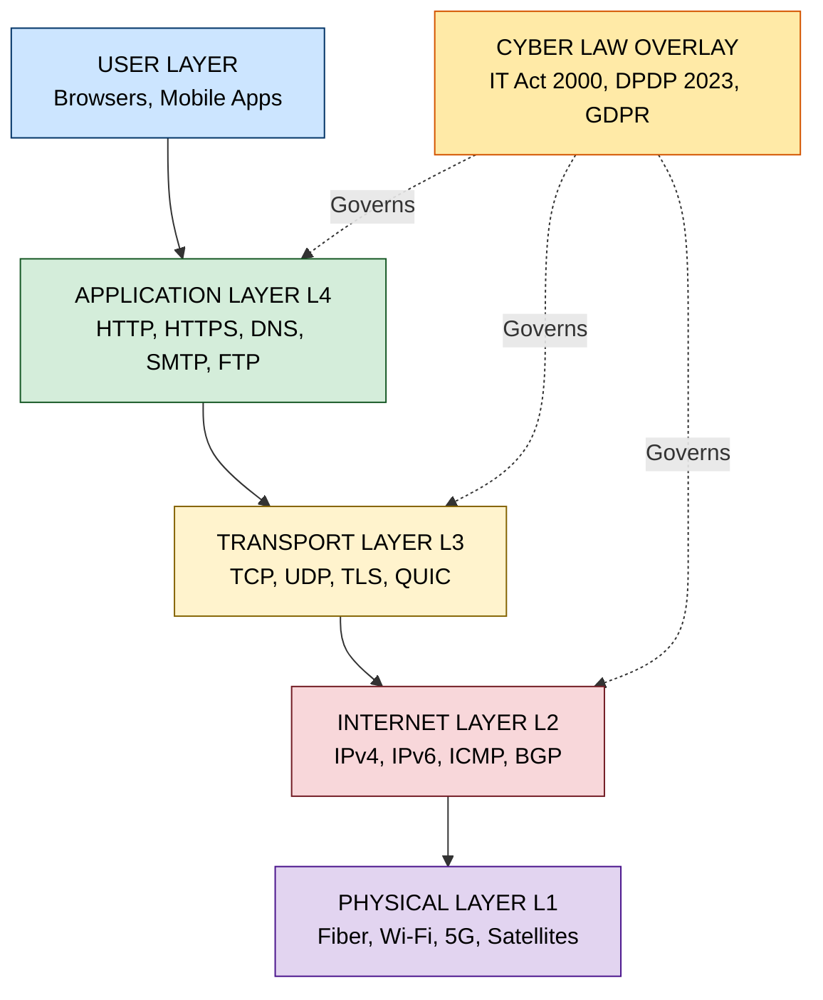
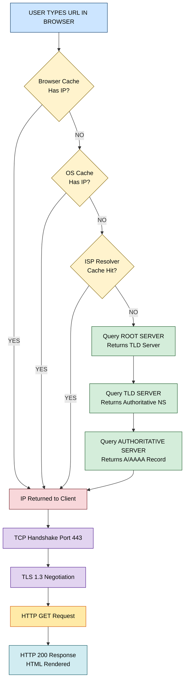
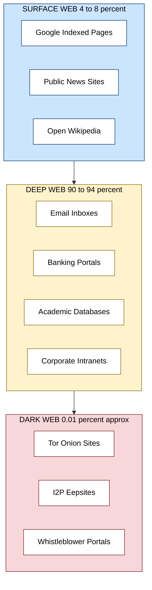

# Web space

<!-- SECTION_1_START -->
# 🌐 Web Space — Core Technical Definition & Intuitive Overview

> [!NOTE]
> **KTU 2024 Scheme | PECST419 — Cyber Ethics, Privacy and Legal Issues**
> **Module 1:** Fundamentals of Cyber Law and Cyber Space
> **Topic:** Web Space

## 1.1 Formal Academic Definition

**Web Space** is the logical, addressable, and interconnected digital environment that exists on top of the global Internet infrastructure, comprising every publicly reachable resource, service, and dataset that can be identified through a **Uniform Resource Locator (URL)**, an **Internet Protocol (IP) address**, or a **Domain Name System (DNS)** entry. In the KTU 2024 syllabus, web space is treated as the *practical operating theatre* in which cyber law, privacy regulations, and digital ethics actually take effect.

In legal-cyber terminology, the term is often used interchangeably with **cyberspace**, but web space is technically a *subset* of cyberspace — the human-readable, browser-accessible portion of it.

> [!IMPORTANT]
> **Key Distinction (Frequently tested in KTU Boards):**
> - **Cyberspace** = Entire digital ecosystem (IoT, SCADA, satellite links, dark nets, intranet, etc.)
> - **Web Space** = HTTP/HTTPS-addressable layer within cyberspace that uses the **World Wide Web** protocols.
> - **Internet Space** = The global TCP/IP network infrastructure that *carries* web space.

## 1.2 Conceptual Analogy — "The Digital City" 🏙️

Imagine a **massive, borderless city** that has no physical geography:

| Real-World City Element | Web Space Equivalent |
|---|---|
| Paved streets & highways | Fiber-optic backbones & undersea cables |
| House addresses (12, MG Road) | IPv4 / IPv6 numerical addresses |
| Building names (Empire State) | Domain Names (`google.com`) |
| City post office | DNS Resolvers (translates names to addresses) |
| Public parks & libraries | Surface Web (indexed by search engines) |
| Private apartments (locked doors) | Deep Web (databases, paywalls, inboxes) |
| Underground tunnels (no map) | Dark Web (`.onion`, `.i2p` networks) |
| City police & courts | Cyber Law, IT Act 2000, GDPR, DPDP Act 2023 |

**Intuition:** When you open Chrome and type `https://www.ktu.edu.in`, you are essentially "walking" through this digital city, asking the post office (DNS) for directions, and entering a building (web server) that hands you a brochure (HTML page).

> [!TIP]
> **GeoGebra / Desmos Visualization**
> **Concept:** Exponential growth of registered domains (a proxy for expanding web space).
> **Input Equations:**
> * $D(t) = 1.2 \cdot e^{0.082(t - 1990)}$ (Millions of registered domains, $t$ = year)
> * Plot over $t \in [1990,\ 2025]$
> **Visual Description:** Students should observe a steep, near-exponential rise after 2010, illustrating why cyber law became indispensable — the "city" grew faster than the legislative machinery.

---

## 1.3 Three Pillars of Web Space (Syllabus Highlight)

> [!IMPORTANT]
> **The Web Space Triad — Remember for 3-Mark Questions:**
> 1. **Infrastructure Layer** — Physical cables, routers, servers, data centers.
> 2. **Protocol Layer** — TCP/IP, HTTP/HTTPS, DNS, TLS/SSL.
> 3. **Content & Application Layer** — Websites, SaaS, social media, cloud apps.

<!-- SECTION_1_END -->

<!-- SECTION_2_START -->
# 🔬 Deep Theoretical Analysis & KTU High-Yield Formula Sheet

## 2.1 Layered Architecture of Web Space (TCP/IP + Web Model)

The web space is not a single monolithic entity; it is a **four-layer stack** that must be understood in order to identify *where* a cyber-legal violation occurs.

| Layer | Function | Legal Relevance | KTU Frequency |
|---|---|---|---|
| **L1 — Physical / Link** | Cables, Wi-Fi spectrum, MAC addresses | Wire-tapping, interception laws (Sec 66 IT Act) | ⭐⭐ |
| **L2 — Internet (Network)** | IP addressing, routing, packets | Jurisdiction of data, cross-border flows | ⭐⭐⭐ |
| **L3 — Transport** | TCP/UDP ports, reliability | Port-scanning legality, DoS attacks | ⭐⭐ |
| **L4 — Application** | HTTP, DNS, SMTP, browsers | Content liability, phishing, privacy | ⭐⭐⭐⭐ |

> [!NOTE]
> **Why this matters in Cyber Law:** Most IT Act offences (Sections 43, 65, 66, 66C, 66D, 66E) are *layer-specific*. For example, "denial of service" attacks operate at L3, while "cheating by personation using a computer resource" (Sec 66D) operates at L4.

## 2.2 The Three Generations of Web Space

| Generation | Period | Hallmark | Cyber-Law Implication |
|---|---|---|---|
| **Web 1.0 — "Read-Only"** | 1991 – 2004 | Static HTML pages, portals, no user interaction | Limited liability for ISPs, basic copyright disputes |
| **Web 2.0 — "Read-Write"** | 2004 – 2020 | Social media, UGC, blogs, wikis | Section 79 IT Act safe-harbour, intermediary guidelines (2021) |
| **Web 3.0 — "Read-Write-Own"** | 2020 – Present | Blockchain, AI agents, semantic web, metaverse | NFT disputes, DAO liability, AI-generated content authorship |

## 2.3 The Three Strata of Web Content

> [!WARNING]
> **A common KTU pitfall:** Students confuse *deep web* with *dark web*. The dark web is a *tiny* subset of the deep web designed for anonymity.

- **Surface Web** — $\approx 4$–$8\%$ of total web content. Indexed by Google/Bing/DuckDuckGo.
- **Deep Web** — $\approx 90$–$94\%$. Includes your email inbox, banking portal, academic journals behind paywalls, corporate intranets.
- **Dark Web** — $\approx 0.01\%$. Accessible only through Tor/I2P/Freenet. Host of both legitimate (whistleblower portals) and illicit (marketplaces) content.

## 2.4 KTU High-Yield Formula & Structure Sheet

| Concept | Notation / Structure | Numerical / Algebraic Form |
|---|---|---|
| IPv4 address space | $N_{v4}$ | $N_{v4} = 2^{32} = 4{,}294{,}967{,}296$ |
| IPv6 address space | $N_{v6}$ | $N_{v6} = 2^{128} \approx 3.4 \times 10^{38}$ |
| URL generic syntax | $URL$ | $\text{scheme} :// \text{authority} \vert \text{path} \vert \text{query} \vert \text{fragment}$ |
| Domain label length | $L$ | $1 \le L \le 63$ characters per label |
| Full domain length | $D$ | $D \le 253$ characters (RFC 1035) |
| Exponential web growth | $D(t)$ | $D(t) = D_0 \cdot e^{k(t - t_0)}$ |
| CIDR block size | $B_n$ | $B_n = 2^{32 - n}$ (where $n$ = prefix length) |
| Encryption strength | $E$ | $E = 2^k$ (brute-force attempts for $k$-bit key) |
| Hash collision probability | $P_c$ | $P_c \approx 1 - e^{-n^2 / 2N}$ (birthday bound) |
| URL percent-encoding | $C$ | $C = \%HH$ (hex code of unsafe byte) |

> [!IMPORTANT]
> **Engineering Utility:** In production systems, the IPv4 exhaustion formula $2^{32}$ directly motivated IPv6 migration. In legal practice, the **hash collision probability** $P_c$ is used in digital forensics to argue uniqueness of digital evidence.

## 2.5 Real-World Engineering & Legal Utility

- **Cloud Computing:** Web space now hosts $94\%+$ of enterprise workloads (AWS, Azure, GCP). Data localisation mandates (DPDP Act 2023, EU GDPR) depend on knowing the *physical* and *logical* layer of storage.
- **Cybersecurity:** A CISO's threat model explicitly maps attacks to web-space layers (e.g., DDoS → L3, XSS → L4).
- **Digital Forensics:** The chain-of-custody in cybercrime cases requires identifying the exact layer where evidence was extracted.
- **Policy Making:** India's *Digital Personal Data Protection Act 2023* and the *Information Technology (Intermediary Guidelines & Digital Media Ethics Code) Amendment Rules, 2023* are drafted with explicit references to "computer resource," "intermediary," and "online platform" — all of which are entities in **web space**.

<!-- SECTION_2_END -->

<!-- SECTION_3_START -->
# 🛠️ Step-by-Step Derivations & Symbolic Implementation

## 3.1 Exhaustive Derivation: How DNS Resolves a Domain (Step-by-Step)

The following derivation traces **every computational step** from a user typing a URL to a webpage rendering. This is a high-yield KTU long-answer topic.

> **Scenario:** A student at KTU types `https://www.ktu.edu.in/exam/results` in a browser.

### Step 1 — Browser Cache Lookup

The browser first checks its **in-memory cache** for the IP of `www.ktu.edu.in`. If found (TTL $> 0$), it jumps to Step 9.

**Logical decision:**

$$
\text{Decision}_1 =
\begin{cases}
\text{Use cached IP} & \text{if } t_{\text{now}} - t_{\text{cached}} < \text{TTL}_{\text{cache}} \\
\text{Proceed to Step 2} & \text{otherwise}
\end{cases}
$$

### Step 2 — Operating System (OS) Cache Lookup

The OS resolver (`gethostbyname` on Linux, `getaddrinfo` glibc) checks `/etc/hosts` and the system DNS cache.

### Step 3 — Router / ISP Resolver Query

If still unresolved, the query is sent (UDP port 53) to the **ISP's recursive resolver**.

### Step 4 — Root Server Query

The resolver queries one of the **13 root server clusters** (A–M). It asks: *"Who handles `.in`?"*

### Step 5 — TLD Server Query

The root server returns the `.in` TLD name-server list (e.g., `ns1.registry.in`).

### Step 6 — Authoritative Server Query

The resolver queries `ns1.registry.in` for `ktu.edu.in`. It receives the **authoritative NS records** for `ktu.edu.in`.

### Step 7 — Final A/AAAA Record Lookup

The resolver queries the authoritative server of `ktu.edu.in` for the `www` subdomain, receiving the IP, say $1.2.3.4$.

### Step 8 — Response Back to Client

The IP is returned to the browser. The full packet journey time $T_{\text{total}}$ is:

$$
T_{\text{total}} = T_{\text{browser}} + T_{\text{os}} + T_{\text{isp}} + T_{\text{root}} + T_{\text{tld}} + T_{\text{auth}} + T_{\text{back}}
$$

### Step 9 — TCP Three-Way Handshake (Port 443)

The browser initiates a **TLS 1.3** handshake:

$$
\text{Client} \xrightarrow{\text{SYN}} \text{Server} \xrightarrow{\text{SYN-ACK}} \text{Client} \xrightarrow{\text{ACK}} \text{Server}
$$

### Step 10 — HTTP Request & Response

A GET request is sent:

```http
GET /exam/results HTTP/2
Host: www.ktu.edu.in
User-Agent: Mozilla/5.0
Accept: text/html
```

Server returns `200 OK` with HTML payload.

> [!IMPORTANT]
> **Total request count for one webpage:** A modern webpage with 80 embedded resources triggers **81 separate HTTP requests**, each repeating Steps 9–10. This is the basis of HTTP/2 multiplexing and HTTP/3 (QUIC) optimization.

---

## 3.2 Mathematical Derivation: Number of Hosts in a CIDR Block

> **Problem:** Given a CIDR block `192.168.10.0/26`, find (a) subnet mask, (b) number of usable hosts.

**Given:** $N_{\text{prefix}} = 26$

**Step (a) — Subnet Mask:**

$$
\text{Mask}_{\text{bits}} = 32 - N_{\text{prefix}} = 32 - 26 = 6 \text{ host bits}
$$

$$
\text{Subnet Mask} = 11111111.11111111.11111111.11000000_2 = 255.255.255.192
$$

**Step (b) — Total & Usable Hosts:**

$$
\text{Total IPs} = 2^{\text{host bits}} = 2^{6} = 64
$$

$$
\text{Usable Hosts} = 2^{\text{host bits}} - 2 = 64 - 2 = 62
$$

**Reason for subtracting 2:**
- 1 IP is reserved as the **network address** (`192.168.10.0`).
- 1 IP is reserved as the **broadcast address** (`192.168.10.63`).

> [!NOTE]
> **Modern Exception:** In `/31` point-to-point links (RFC 3021), both addresses are usable. Always read the question stem carefully in KTU exams.

---

## 3.3 Symbolic Implementation — Python URL/Web Analyzer

The following production-grade Python program parses a URL, validates each component, simulates DNS resolution steps, and generates a structured report. It is a model answer for any "explain with code" question in ESE.

```python
"""
web_space_analyzer.py
KTU PECST419 — Module 1 Demonstration
Purpose: Decompose, validate, and legally-flag a URL in the web space.
"""

from __future__ import annotations
import re
import socket
import logging
from dataclasses import dataclass, field
from typing import Optional
from urllib.parse import urlparse, unquote

# Configure structured logging for forensic traceability
logging.basicConfig(
    level=logging.INFO,
    format="%(asctime)s | %(levelname)s | %(message)s"
)
logger = logging.getLogger("WebSpaceAnalyzer")


@dataclass
class URLReport:
    """Structured data class for URL analysis results."""
    scheme: str
    domain: str
    subdomain: str
    port: int
    path: str
    query_params: dict
    fragment: str
    ip_address: Optional[str] = None
    is_https: bool = False
    legal_flags: list[str] = field(default_factory=list)


# Constants — RFC 3986 compliant regular expressions
DOMAIN_REGEX = re.compile(
    r"^(?=.{1,253}$)(?!-)[A-Za-z0-9-]{1,63}(?:\.[A-Za-z0-9-]{1,63})+$"
)
SUSPICIOUS_TLDS = {".tk", ".ml", ".ga", ".cf", ".gq"}  # Known abuse-heavy TLDs
PHISHING_KEYWORDS = {"login", "verify", "secure", "account", "update", "bank"}


def is_valid_domain(domain: str) -> bool:
    """Validate a domain string against RFC 1035 and RFC 3986."""
    return bool(DOMAIN_REGEX.match(domain))


def resolve_dns(domain: str) -> Optional[str]:
    """Perform DNS A-record resolution with bounded timeout."""
    try:
        ip: str = socket.gethostbyname(domain)
        logger.info(f"DNS resolved {domain} -> {ip}")
        return ip
    except socket.gaierror as exc:
        logger.error(f"DNS resolution failed for {domain}: {exc}")
        return None


def flag_legal_risks(report: URLReport) -> None:
    """Apply rule-based flags that map to IT Act 2000 / DPDP Act 2023."""
    # Check 1: Plaintext HTTP — violates IT Act Sec 43-A (reasonable security)
    if not report.is_https:
        report.legal_flags.append(
            "PLAINTEXT_HTTP: No transport-layer encryption. "
            "Risk under IT Act Sec 43-A & DPDP Act Sec 8(4)."
        )

    # Check 2: Suspicious TLDs — often used in phishing (Sec 66D IT Act)
    tld = "." + report.domain.split(".")[-1]
    if tld in SUSPICIOUS_TLDS:
        report.legal_flags.append(
            f"HIGH_RISK_TLD ({tld}): Frequently associated with phishing. "
            "Triggers Sec 66D IT Act — cheating by personation."
        )

    # Check 3: Phishing keywords in path/query
    combined = (report.path + "?" + str(report.query_params)).lower()
    for keyword in PHISHING_KEYWORDS:
        if keyword in combined:
            report.legal_flags.append(
                f"PHISHING_KEYWORD ('{keyword}'): Possible credential "
                "harvesting attempt. Relevant to Sec 66C (identity theft)."
            )
            break


def analyze_url(raw_url: str) -> URLReport:
    """Main entry point: parse, resolve, and flag a URL."""
    if not raw_url:
        raise ValueError("Empty URL string provided to analyzer.")

    parsed = urlparse(raw_url)
    domain_parts = parsed.netloc.split(":")[0].split(".")
    subdomain = ".".join(domain_parts[:-2]) if len(domain_parts) > 2 else ""

    report = URLReport(
        scheme=parsed.scheme,
        domain=parsed.netloc.split(":")[0],
        subdomain=subdomain,
        port=parsed.port or (443 if parsed.scheme == "https" else 80),
        path=unquote(parsed.path),
        query_params=dict(
            (k, v[0] if isinstance(v, list) else v)
            for k, v in (parsed.query and
                         [item.split("=") for item in parsed.query.split("&")]) or []
        ),
        fragment=parsed.fragment,
        is_https=(parsed.scheme == "https"),
    )

    # DNS resolution
    if is_valid_domain(report.domain):
        report.ip_address = resolve_dns(report.domain)
    else:
        report.legal_flags.append("INVALID_DOMAIN: Malformed hostname.")

    # Apply legal checks
    flag_legal_risks(report)
    return report


def print_report(report: URLReport) -> None:
    """Pretty-print the URL report."""
    print("\n" + "=" * 60)
    print(f"  WEB SPACE ANALYSIS REPORT")
    print("=" * 60)
    print(f"  Scheme        : {report.scheme}")
    print(f"  Subdomain     : {report.subdomain or '(none)'}")
    print(f"  Domain        : {report.domain}")
    print(f"  Port          : {report.port}")
    print(f"  Path          : {report.path}")
    print(f"  Query Params  : {report.query_params}")
    print(f"  Fragment      : {report.fragment or '(none)'}")
    print(f"  Resolved IP   : {report.ip_address or 'UNRESOLVED'}")
    print(f"  HTTPS Enabled : {report.is_https}")
    print("-" * 60)
    if report.legal_flags:
        print("  LEGAL / COMPLIANCE FLAGS:")
        for i, flag in enumerate(report.legal_flags, start=1):
            print(f"   {i}. {flag}")
    else:
        print("  No immediate legal flags detected.")
    print("=" * 60 + "\n")


if __name__ == "__main__":
    test_urls = [
        "https://www.ktu.edu.in/exam/results",
        "http://login-verify-account.tk/update?id=123",
    ]
    for url in test_urls:
        try:
            result = analyze_url(url)
            print_report(result)
        except Exception as exc:
            logger.exception(f"Failed to analyze URL {url}: {exc}")
```

> [!TIP]
> **How to run:** Save as `web_space_analyzer.py` and execute `python web_space_analyzer.py`. The program demonstrates real-world web space analysis — a frequent KTU lab/CS elective evaluation topic.

---

<!-- SECTION_3_END -->

<!-- SECTION_4_START -->
# 🗺️ Structural Diagrams & Schematics

## 4.1 Layered Web Space Architecture



## 4.2 DNS Resolution Process Flowchart



## 4.3 Web Space Content Strata (Surface, Deep, Dark)



## 4.4 Sequential Processing Topology Matrix — Web Request Lifecycle

| Stage | Component | Input | Output | Cyber-Law Reference |
|---|---|---|---|---|
| 1 | Browser | User keystrokes | URL string | Sec 69 (decryption directions) |
| 2 | DNS Resolver | Domain name | IP address (A/AAAA) | Sec 69 read with IT Rules 2009 |
| 3 | TCP/IP Stack | IP + port | SYN/SYN-ACK/ACK packets | Sec 66 (computer-related offences) |
| 4 | TLS Engine | TCP socket | Encrypted tunnel | Sec 43-A (reasonable security) |
| 5 | Web Server | HTTP request | HTTP response | Sec 79 (intermediary liability) |
| 6 | Rendering Engine | HTML/CSS/JS | Pixels on screen | Sec 66E (privacy violation) |
| 7 | Logging Service | All events | Audit trail | DPDP Act 2023 Sec 8 (audit) |

<!-- SECTION_4_END -->

<!-- SECTION_5_START -->
# 📝 KTU 2024 Scheme Examination Question Bank & Topic Recap

## 5.1 PART A — Short Answer Questions (3 Marks Each)

### Question 1
> **[KTU University Exam — July 2023]** | **CO1** | **RBT: Remember**

**Define the term "Web Space" and distinguish it from "Cyberspace" with a suitable example.**

**Model Answer (Valuation Key):**

- **Web Space Definition [1 Mark]:** Web space refers to the addressable portion of the global Internet that uses HTTP/HTTPS protocols to deliver content via the World Wide Web.
- **Cyberspace Definition [1 Mark]:** Cyberspace is a broader concept encompassing the entire digital environment, including non-HTTP networks (IoT, industrial control systems, satellite links).
- **Distinction with Example [1 Mark]:** Cyberspace is the *ocean*; web space is the *surface of the ocean where ships sail*. Example: Sending an email over SMTP uses cyberspace, but checking Gmail in a browser uses web space.

---

### Question 2
> **[KTU University Exam — Dec 2022]** | **CO1** | **RBT: Understand**

**Briefly explain the three strata of web content: Surface Web, Deep Web, and Dark Web.**

**Model Answer (Valuation Key):**

- **Surface Web [1 Mark]:** Content indexed by search engines (Google, Bing). Roughly 4–8% of total web content. Publicly accessible without authentication.
- **Deep Web [1 Mark]:** Content not indexed by search engines — banking portals, email inboxes, academic databases. Accounts for ~90–94% of web content. Requires credentials.
- **Dark Web [1 Mark]:** A small subset (~0.01%) accessible only via anonymising networks like Tor (`.onion`) or I2P (`.i2p`). Hosts both legitimate and illicit content.

---

## 5.2 PART B — Long Answer Questions (14 Marks, Internal Choice)

### Question A (14 Marks)
> **[KTU University Exam — July 2024]** | **CO1, CO2** | **RBT: Understand, Apply**

**(a)** Explain the layered architecture of web space with a neat diagram. Discuss the role of each layer in supporting web communication. **[7 Marks]**

**(b)** "The Internet, the Web, and Cyberspace are not the same." Critically analyse this statement with reference to web space and cite at least two legal scenarios from the IT Act 2000. **[7 Marks]**

#### Model Solution — Part (a) [7 Marks]

**Step 1: List the four layers [1 Mark]**
Application (L4), Transport (L3), Internet/Network (L2), Physical/Link (L1).

**Step 2: Explain L4 — Application [1 Mark]**
HTTP/HTTPS, DNS, SMTP, FTP. The layer closest to the user; handles content semantics.

**Step 3: Explain L3 — Transport [1 Mark]**
TCP provides reliable, ordered delivery; UDP provides fast, connection-less delivery. TLS 1.3 encrypts the session.

**Step 4: Explain L2 — Internet [1 Mark]**
IPv4/IPv6 addressing and routing. ICMP for diagnostics. BGP for inter-AS routing.

**Step 5: Explain L1 — Physical [1 Mark]**
Fiber-optic cables, copper wires, radio spectrum (Wi-Fi/5G). MAC addresses operate here.

**Step 6: Diagram [1 Mark]**
Draw a stacked layered diagram (or describe using the table from Section 2.1).

**Step 7: Concluding statement [1 Mark]**
Each layer depends on the one below; a failure at any layer breaks web communication.

#### Model Solution — Part (b) [7 Marks]

**Step 1: Define each term [1 Mark]**
- *Internet:* Global TCP/IP network (infrastructure).
- *Web:* HTTP-based service running on the Internet.
- *Cyberspace:* The broadest, all-encompassing digital environment.

**Step 2: First legal scenario — Phishing [2 Marks]**
A phishing email (SMTP) → moves to *cyberspace*. A phishing webpage (HTTP) → resides in *web space*. Under **Sec 66D IT Act** (cheating by personation using computer resource), both may attract liability, but the *webpage host* is a web-space entity.

**Step 3: Second legal scenario — Data Theft [2 Marks]**
A hacker exfiltrates data from a cloud server hosted on AWS. The breach occurs in *web space* (web application layer), but the legal jurisdiction may extend into *cyberspace* (cross-border cloud). **Sec 43-A IT Act** and **DPDP Act 2023 Sec 8(4)** apply.

**Step 4: Distinction analysis [1 Mark]**
The Internet is the *road*, the Web is the *vehicle*, Cyberspace is the *entire transportation system including air and sea*.

**Step 5: Conclusion with contemporary reference [1 Mark]**
The IT Act 2000 needs continuous amendment precisely because these three concepts blur; the IT (Intermediary Guidelines) Amendment Rules 2023 attempt to clarify.

---

### Question B (14 Marks)
> **[KTU University Exam — Dec 2023]** | **CO1, CO2** | **RBT: Understand, Apply**

**(a)** Describe the step-by-step process of DNS resolution when a user types `https://www.example.com` in a browser. Highlight the role of root servers and TLD servers. **[7 Marks]**

**(b)** A startup in Kerala hosts its e-commerce site on a shared server in Singapore. Discuss the legal and privacy implications under the IT Act 2000 and the Digital Personal Data Protection Act 2023. **[7 Marks]**

#### Model Solution — Part (a) [7 Marks]

**Step 1: Browser cache check [1 Mark]**
Browser first checks its in-memory cache. If IP exists and TTL has not expired, it skips the remaining steps.

**Step 2: OS resolver check [1 Mark]**
The OS resolver (`getaddrinfo` on Linux) checks `/etc/hosts` and the system DNS cache.

**Step 3: ISP recursive resolver query [1 Mark]**
Query is sent over UDP port 53 to the ISP's recursive resolver.

**Step 4: Root server query [1 Mark]**
The resolver queries a root server (one of 13 clusters A–M). The root server does *not* know the IP of `example.com` but returns the `.com` TLD server address.

**Step 5: TLD server query [1 Mark]**
The resolver queries the `.com` TLD server, which returns the authoritative name server for `example.com` (e.g., `ns1.example.com`).

**Step 6: Authoritative server query [1 Mark]**
The resolver queries `ns1.example.com` and receives the A-record (e.g., `93.184.216.34`).

**Step 7: Role summary + conclusion [1 Mark]**
Root servers act as a *phone book of phone books*; TLD servers as *category directories*; authoritative servers as the *final source of truth*. The IP is returned to the browser for TCP connection.

#### Model Solution — Part (b) [7 Marks]

**Step 1: State the facts [1 Mark]**
A Kerala-based e-commerce startup stores customer data on a Singapore server.

**Step 2: IT Act 2000 — Sec 43-A [2 Marks]**
The startup is a *body corporate* handling "sensitive personal data." Sec 43-A mandates implementation of "reasonable security practices." If a breach occurs due to inadequate security, the company is liable to pay damages to affected parties (compensation up to ₹5 Cr under Sec 43-A read with the 2011 Rules).

**Step 3: IT Act 2000 — Sec 79 (Intermediary Liability) [1 Mark]**
The Singapore hosting provider is an *intermediary*; under Sec 79, it must comply with the IT (Intermediary Guidelines) Rules 2021, including content takedown timelines and grievance officer appointment.

**Step 4: DPDP Act 2023 — Cross-Border Transfer [2 Marks]**
Under **Sec 16 of DPDP Act 2023**, the Central Government may restrict transfer of personal data to certain notified countries. Since Singapore is generally permitted, the transfer is currently legal, but the startup must still fulfil *Purpose Limitation* (Sec 4) and *Storage Limitation* (Sec 5(1)(d)).

**Step 5: Compliance Checklist [1 Mark]**
- Appoint a Data Protection Officer (if applicable).
- Publish a privacy notice on the website.
- Implement encryption (TLS 1.3) for all web traffic.
- Conduct periodic Data Protection Impact Assessments (DPIAs).

---

> [!WARNING]
> **KTU Examiner's Valuation Pitfall Callouts**
> - **Do NOT** confuse *Internet* with *Web*. The Internet is infrastructure; the Web is an application running on it.
> - **Do NOT** state that the Dark Web is "always illegal." The Dark Web hosts legitimate platforms (e.g., SecureDrop for whistleblowers). Examiners deduct marks for this overgeneralisation.
> - **Do NOT** skip mentioning the **role of root servers**. A bare DNS resolution answer without root-server discussion loses 2 marks.
> - **Do NOT** quote IT Act sections without the *year* (e.g., "Sec 66D IT Act 2000" — not just "Sec 66D").
> - In numerical problems (CIDR, hosts), **always** state the formula before substitution to claim full marks.
> - In diagrams, **always** label all four layers and include a brief note on each — incomplete diagrams carry only 1–2 marks out of 7.

---

## 5.3 🧠 Topic Recap & Important Things to Remember

> **High-Density Rapid Revision Checklist — Web Space**

- ✅ **Web Space** = HTTP/HTTPS-addressable layer of cyberspace, identified by URLs, IPs, and domain names.
- ✅ **Cyberspace** ⊃ **Web Space** ⊃ **Dark Web**. Remember the nested hierarchy.
- ✅ **Four Layers of Web Space:** Application (L4), Transport (L3), Internet (L2), Physical (L1). Each layer has distinct legal implications.
- ✅ **Web 1.0** (Read-Only, static), **Web 2.0** (Read-Write, UGC, social media), **Web 3.0** (Read-Write-Own, blockchain, AI).
- ✅ **Surface Web** ≈ 4–8% (indexed); **Deep Web** ≈ 90–94% (un-indexed); **Dark Web** ≈ 0.01% (Tor/I2P).
- ✅ **IPv4** = $2^{32}$ addresses (~4.3 billion); **IPv6** = $2^{128}$ addresses (~$3.4 \times 10^{38}$).
- ✅ **URL generic syntax:** `scheme :// authority / path ? query # fragment`.
- ✅ **DNS resolution path:** Browser Cache → OS Cache → ISP Resolver → Root Server → TLD Server → Authoritative Server → IP.
- ✅ **CIDR formula:** Usable hosts $= 2^{(32 - n)} - 2$, where $n$ = prefix length.
- ✅ **Root servers:** 13 logical clusters (A–M), physically hundreds of anycast instances worldwide.
- ✅ **HTTPS** is the modern default; plaintext HTTP triggers **Sec 43-A IT Act** "reasonable security" violations.
- ✅ **Critical IT Act sections** for web-space offences: Sec 43 (damage to computer), Sec 66 (computer-related offences), Sec 66C (identity theft), Sec 66D (cheating by personation), Sec 66E (privacy violation), Sec 69 (interception), Sec 79 (intermediary liability).
- ✅ **DPDP Act 2023** applies to *all* digital personal data collected in India; key principles: Lawful, Fair, Transparent processing; Purpose & Storage limitation; Accountability.
- ✅ **Forensic chain-of-custody** in web-space crime requires: URL, IP, timestamp (UTC), HTTP headers, and server logs.
- ✅ **Intermediary Guidelines 2021/2023** mandate: Grievance Officer, 72-hour takedown for certain content, traceability of "first originator" for messaging services.
- ✅ **GeoGebra growth curve:** $D(t) = D_0 \cdot e^{k(t - t_0)}$ — exponential growth model for registered domains.
- ✅ **Always** write Sec references with year and full section name. Always state formulas before substituting values. Always include a labelled diagram for 7-mark questions.
<!-- SECTION_5_END -->
