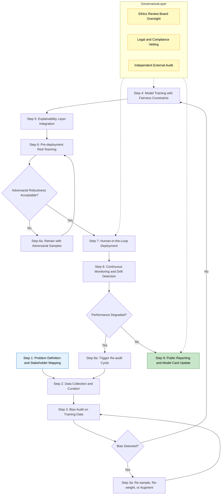
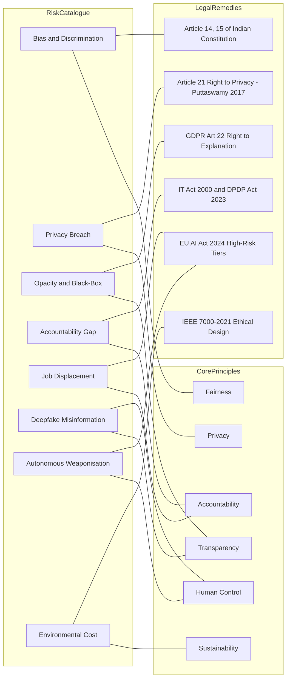
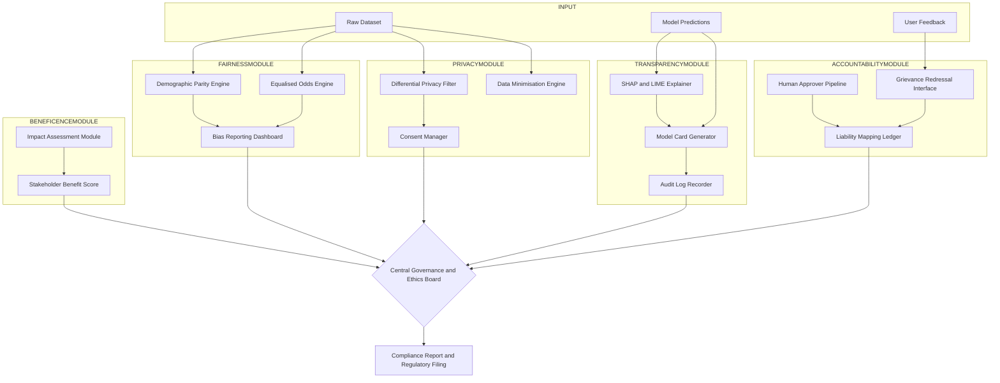

# Artificial Intelligence Ethics- Ethical Issues in AI and core Principles

<!-- SECTION_1_START -->
# Artificial Intelligence Ethics — Ethical Issues in AI & Core Principles

## 1.1 Formal Academic Definition (KTU 2024 Syllabus Terminology)

> [!NOTE]
> **Artificial Intelligence (AI) Ethics** is the branch of applied ethics that systematically evaluates the moral behaviour, decisions, and outcomes produced by artificial intelligence systems. It interrogates the *values*, *norms*, *duties*, and *rights* implicated when autonomous, semi-autonomous, or learning-based computational agents are deployed in real-world socio-technical environments.

In the KTU 2024 Scheme context (Course Code: **PECST419 — Cyber Ethics, Privacy and Legal Issues**, Module 2: *Cyber Crime and Cyber Ethics*), AI ethics is positioned as a **governance discipline** that bridges:
- **Computer Science** (algorithmic behaviour)
- **Philosophy** (moral reasoning, deontology, utilitarianism)
- **Law** (IT Act 2000, GDPR, EU AI Act 2024)
- **Sociology** (bias, fairness, digital divide)

> [!IMPORTANT]
> **Syllabus Highlight:** As per the PECST419 Module 2 descriptor, students must be able to (a) identify ethical dilemmas arising from AI deployment, (b) articulate the core principles governing responsible AI, and (c) evaluate the trade-off between innovation and human rights.

---

## 1.2 Conceptual Analogy & Intuitive Overview

### 🧠 The "Driverless Car" Analogy
Imagine AI as a **fully autonomous driverless car** travelling on a public road filled with human-driven vehicles, pedestrians, cyclists, and children.

- The **car** = the AI system (algorithmic engine)
- The **road** = the socio-technical environment (society, markets, law)
- The **traffic rules** = ethical principles (fairness, transparency, accountability)
- The **driver's licence** = regulatory licences (IT Act, GDPR, EU AI Act)
- The **steering wheel** = human oversight & explainability

> Just as a driverless car *cannot be allowed on roads* without traffic rules, a licence, and a steering wheel (human override), **no AI system should be deployed without ethics, regulation, and human-in-the-loop controls**.

### The Three-Layer AI Ethics Pyramid
Think of AI ethics as operating on three concentric layers:

| Layer | Focus | Example |
|---|---|---|
| **Inner (Technical)** | Algorithm design, data, model | Bias in training dataset |
| **Middle (Operational)** | Deployment, monitoring, audit | Black-box decisions in hiring |
| **Outer (Societal)** | Law, policy, human rights | Surveillance, job displacement |

> [!TIP]
> **First-time learner intuition:** Whenever an AI makes a decision (recommends a song, rejects a loan, identifies a face), ask — *Who built it? On whose data? Optimised for whose benefit? Harming whom?* These four questions map directly to the four pillars of AI ethics: **Accountability, Representativeness, Beneficence, Non-Maleficence**.

---

## 1.3 Key Terminology Snapshot

> [!NOTE]
> **Critical Vocabulary for KTU Board Examinations:**
> - **Algorithmic Bias** — Systematic and repeatable errors in an AI system that create unfair outcomes.
> - **Opacity / Black-Box Problem** — Inability of even designers to fully explain how a model arrived at a specific output.
> - **Autonomy** — The capacity of an AI to make decisions and execute them without human intervention.
> - **Accountability Gap** — The difficulty in assigning legal/moral responsibility when an autonomous AI causes harm.
> - **Value Alignment Problem** — Ensuring an AI's goals and behaviours are aligned with human values and intentions.

> [!VISUALIZATION CONTROL]
> **Concept:** Bias amplification curve in a deployed AI system
> **GeoGebra / Desmos Input Equations:**
> * `f(x) = 0.1 * x^2` (initial mild bias)
> * `g(x) = 0.5 * x^2 + 0.2 * x` (bias after deployment feedback loop)
> **Visual Description:** Plot both curves on the same axis. Students should observe that `g(x)` diverges more steeply than `f(x)` for the same input `x`, visually demonstrating how minor dataset bias **amplifies** through positive feedback loops (e.g., recommendation engines).
<!-- SECTION_1_END -->

<!-- SECTION_2_START -->
# 2. Deep Theoretical Analysis & KTU High-Yield Formula Sheet

## 2.1 The Five Generations of Ethical Concern in AI

AI ethics has evolved through five escalating waves of concern. Understanding this chronology is a high-yield KTU topic because questions frequently ask *"Trace the evolution of AI ethics"* or *"Discuss the transition from rule-based to value-based AI governance"*.

1. **Generation 1 — Asimovian Fictional Ethics (1942 onwards)**
   Isaac Asimov's *Three Laws of Robotics* — purely literary, not enforceable, but seeded public imagination.

2. **Generation 2 — Professional Code Ethics (1990s)**
   ACM Code of Ethics, IEEE Ethically Aligned Design — voluntary professional self-regulation by engineers.

3. **Generation 3 — Data Protection Era (2010s)**
   Triggered by Cambridge Analytica (2018), GDPR (2018). Focus shifted to **privacy, consent, data minimisation**.

4. **Generation 4 — Algorithmic Accountability Era (2020s)**
   Triggered by COMPAS recidivism controversy, Amazon hiring-tool bias, facial-recognition misidentifications. Focus on **fairness, transparency, auditability**.

5. **Generation 5 — Generative AI & Existential Risk Era (2022 onwards)**
   Triggered by ChatGPT, deepfakes, autonomous weapons discourse. Focus on **alignment, hallucination, copyright, AGI safety**.

---

## 2.2 The Core Ethical Issues in AI (High-Yield for 7-Mark Sub-Questions)

### Issue 1: Bias and Discrimination
AI systems learn from historical data. If history encodes discrimination, the AI *amplifies* it.

> [!IMPORTANT]
> **Classic KTU Case Study:** In 2018, Amazon scrapped an internal hiring tool that systematically down-ranked resumes containing the word *"women's"* (e.g., *"women's chess club captain"*) because it had been trained on 10-year male-dominant hiring data. This is **selection bias + historical bias + evaluation bias** combined.

### Issue 2: Opacity and the Black-Box Problem
Deep neural networks often have **millions of parameters** and non-linear activations. Even the engineer cannot trace *why* a specific output was produced.

> [!WARNING]
> This violates the **Right to Explanation** enshrined in **Article 22 of GDPR** — a board-favourite exam point.

### Issue 3: Privacy and Surveillance
AI-powered facial recognition, social-media monitoring, and predictive policing enable **mass surveillance**, threatening the *Right to Privacy* declared a fundamental right by the Supreme Court of India in *Justice K.S. Puttaswamy v. Union of India (2017)*.

### Issue 4: Accountability Gap
When an autonomous vehicle crashes, who is liable?
- The **manufacturer**?
- The **software vendor**?
- The **data labeller**?
- The **end user**?

This diffusion of responsibility is called the **"many hands problem"** in AI ethics literature.

### Issue 5: Job Displacement and Economic Inequality
McKinsey Global Institute estimates **400–800 million workers** could be displaced by automation by 2030. The ethical issue is not technological unemployment itself, but the **unequal distribution of AI's gains** — capital owners benefit disproportionately.

### Issue 6: Misinformation, Deepfakes and Manipulation
Generative AI can synthesise convincing fake audio, video, and text, threatening **democratic processes, journalism, and personal reputation**.

### Issue 7: Autonomous Weapons & Lethal Decision-Making
The "killer robot" debate — should a machine be permitted to make a kill decision without human approval? This is mapped to the principle of **Meaningful Human Control (MHC)** under international humanitarian law.

### Issue 8: Environmental Cost
Training a single large language model (e.g., GPT-class) can emit **~300 tonnes of CO₂**. AI ethics is therefore also *climate ethics*.

---

## 2.3 Core Principles of Ethical AI — The KTU Formula Sheet

> [!IMPORTANT]
> **Memorise this table — questions on "core principles of ethical AI" appear almost every KTU exam cycle.**

| # | Principle | Definition | Practical Manifestation | Linked KTU Concept |
|---|---|---|---|---|
| 1 | **Fairness** | AI must not produce discriminatory outcomes across gender, caste, race, religion, region | Bias audits, balanced datasets, fairness metrics like *demographic parity* | Article 14, 15 of Indian Constitution (Right to Equality) |
| 2 | **Transparency** | The workings and decisions of AI should be explainable to stakeholders | Model cards, datasheets, XAI techniques (LIME, SHAP) | GDPR Art. 22, Right to Explanation |
| 3 | **Accountability** | Clear human or institutional responsibility for AI outcomes | Audit trails, designated AI officers, legal liability chains | IT Act 2000, Section 79 safe-harbour boundaries |
| 4 | **Privacy** | AI must respect user data, consent, and minimisation | Differential privacy, federated learning, anonymisation | DPDP Act 2023, GDPR |
| 5 | **Beneficence (Do Good)** | AI should actively promote human well-being | Accessibility AI, healthcare diagnostics, climate modelling | UNESCO Recommendation on AI Ethics 2021 |
| 6 | **Non-Maleficence (Do No Harm)** | AI should not cause physical, psychological, social, or economic harm | Red-teaming, kill-switches, fail-safe design | Asimov's First Law |
| 7 | **Autonomy & Human Control** | Humans must retain meaningful control over AI decisions | Human-in-the-loop, Human-on-the-loop, Human-in-command | EU AI Act 2024 (High-Risk Systems) |
| 8 | **Robustness & Safety** | AI must perform reliably under adversarial and unexpected conditions | Adversarial testing, formal verification, security audits | ISO/IEC 23894 AI Risk Management |
| 9 | **Sustainability** | AI development must consider environmental and long-term impact | Green-AI, model distillation, carbon-aware computing | UN Sustainable Development Goals |
| 10 | **Inclusivity & Diversity** | AI development teams and datasets should represent diverse populations | Multi-stakeholder design, participatory AI | NITI Aayog #AIforAll |

> [!TIP]
> **Acronym to memorise the top 5:** **F-T-A-P-B** → **F**airness, **T**ransparency, **A**ccountability, **P**rivacy, **B**eneficence. This is the most commonly tested shorthand in KTU Module 2.

---

## 2.4 Real-World Utility — Why This Matters in Engineering

For B.Tech students, AI ethics is not abstract philosophy — it directly affects:

- **Software Engineering Careers:** Every team will eventually ship ML-enabled features. Compliance with bias-audit and explainability requirements is now a *billable skill*.
- **Product Management:** EU AI Act 2024 categorises AI by risk; high-risk systems need **Conformité Européenne (CE)** marking, similar to electrical appliances.
- **Data Science Roles:** Model cards and datasheets for datasets are now industry standard, mirroring the open-source software movement.
- **Public Sector Deployments:** India's *Digital Personal Data Protection Act 2023* and the proposed *National AI Ethics Framework* make compliance essential for any government contract.
- **Cybersecurity:** Adversarial-ML attacks (e.g., one-pixel attacks on image classifiers) make robustness an *ethical* and *security* imperative simultaneously.

> [!NOTE]
> **Engineering Insight:** The IEEE Standard **7000-2021** — *Model Process for Addressing Ethical Concerns during System Design* — is the first vendor-neutral, certifiable process standard for ethical system design. It is the closest the engineering world has to an "ISO for AI ethics".
<!-- SECTION_2_END -->

<!-- SECTION_3_START -->
# 3. Step-by-Step Derivations, Frameworks & Implementation

## 3.1 Comparative Analysis: Global AI Ethics Frameworks (Tabular Matrix)

> [!IMPORTANT]
> This matrix maps the **real-world engineering case frameworks** to the **regulatory systemic matrices** they operate within. KTU board questions frequently ask: *"Compare the AI ethics approaches of two global bodies"* or *"Critically evaluate the EU AI Act from a developer's perspective"*.

| Framework / Regulation | Year | Issuing Body | Core Focus | Risk Classification | Binding? | Strengths | Weaknesses / Criticisms |
|---|---|---|---|---|---|---|---|
| **Three Laws of Robotics** | 1942 / 1985 | Isaac Asimov (Fictional) | Fictional precedence hierarchy | None | ❌ No | Culturally foundational, intuitive | Contradictory, ignores edge cases, unenforceable |
| **ACM Code of Ethics** | 1992 (rev. 2018) | Association for Computing Machinery | Professional conduct | None | ❌ Voluntary | Broad professional buy-in | No enforcement teeth |
| **IEEE Ethically Aligned Design (EAD)** | 2016 / 2019 | IEEE Global Initiative | Values-driven design | None | ❌ Voluntary | Comprehensive, multi-stakeholder | Non-binding, aspirational |
| **OECD AI Principles** | 2019 | OECD (45+ countries incl. India) | Inclusive, trustworthy AI | 5 values-based | ❌ Soft-law | Internationally endorsed | Lacks enforcement mechanism |
| **EU AI Act** | 2024 (in force) | European Union | Risk-tiered regulation | **4 tiers:** Unacceptable, High, Limited, Minimal | ✅ Legally binding | Legally enforceable, fines up to **7% global turnover** | Compliance cost; innovation-stifling debate |
| **GDPR (Articles 13, 22)** | 2018 | European Union | Data protection + automated decisions | Implicit | ✅ Legally binding | Right to explanation, DPIAs | Applies extraterritorially, interpretation gaps |
| **UNESCO Recommendation on AI Ethics** | 2021 | UNESCO (193 member states) | Human-rights centred | 4 core values | ❌ Soft-law | Truly global, multi-cultural | Non-binding |
| **India: NITI Aayog #AIforAll** | 2018 | NITI Aayog | Sectoral strategy + ethics | 5 sectors identified | ❌ Policy paper | India-specific, sectors identified | No legislation yet |
| **India: DPDP Act 2023** | 2023 | Parliament of India | Personal data protection | Notice + consent based | ✅ Binding | Defines rights of Data Principals | AI-specific gaps remain |
| **Asilomar AI Principles** | 2017 | Future of Life Institute | Safe and beneficial AI | 23 principles | ❌ Voluntary | Covers short + long-term issues | Industry-led, not governmental |
| **ISO/IEC 23894** | 2023 | ISO | AI risk management | Process-based | ✅ Standard | Vendor-neutral, certifiable | Adoption still nascent |

> [!TIP]
> **Exam shortcut:** Use the phrase *"From Fiction to Law: The 5-Stage Maturation of AI Ethics"* to remember the chronological evolution: **Asimov → ACM → OECD → GDPR/EU AI Act → ISO/IEC standards**.

---

## 3.2 Step-by-Step Application: Solving a Case Study Using the Ethical Principles

A KTU 14-mark question often presents a case. Below is a fully worked, model-valuation-ready solution for a typical prompt.

### Sample Case
> *"An Indian state government deploys an AI-based facial recognition system in public spaces to identify missing children and wanted criminals. Civil-rights groups allege mass surveillance, especially of minority communities, and report a 38% false-positive rate for women and darker-skinned individuals."*

### Step 1 — Identify the Stakeholders
- State Government (deployer)
- Police Department (end-user)
- Missing children's families (beneficiaries)
- Minority communities (affected parties)
- AI vendor (developer)
- Judiciary & Data Protection Board (regulators)

### Step 2 — Map Each Ethical Principle to the Case
- **Fairness** ❌ Violated: 38% false-positive disparity across gender/skin tone
- **Transparency** ❌ Violated: Algorithm is proprietary; no model card
- **Accountability** ❌ Violated: No clear human approver for each match
- **Privacy** ❌ Violated: No consent; bulk biometric capture in public
- **Beneficence** ✅ Partially served: Helps find missing children
- **Non-Maleficence** ❌ Violated: Wrongful detention, psychological harm
- **Autonomy** ❌ Violated: Citizens have no opt-out
- **Robustness** ❌ Violated: Known accuracy disparity
- **Sustainability** ✅ Neutral
- **Inclusivity** ❌ Violated: Training data likely under-represents minorities

### Step 3 — Recommend Mitigation
1. Mandate **Independent Bias Audit** every 6 months, published in public domain.
2. Deploy **Human-in-the-Loop**: No arrest based solely on algorithmic match.
3. Publish a **Model Card & Datasheet** for the system.
4. Conduct a **Data Protection Impact Assessment (DPIA)** as per DPDP Act 2023.
5. Restrict deployment to *child-locator* and *serious-crime* use-cases only — narrow scope.
6. Establish a **Grievance Redressal Cell** with an independent AI ombudsman.

### Step 4 — Conclude with a Balanced Verdict
The deployment is *not unethical in intent* but *unethical in current implementation*. With the above six safeguards, it can be brought closer to compliance with constitutional morality (Article 14, 19, 21) and the DPDP Act 2023.

> [!NOTE]
> **Valuation Key Point Distribution (14 marks):**
> - Stakeholder identification: **3 marks**
> - Principle-to-case mapping (at least 5 principles correctly): **5 marks**
> - Mitigation recommendations: **4 marks**
> - Balanced conclusion with legal/constitutional reference: **2 marks**

---

## 3.3 Step-by-Step Python-Style Pseudo-Implementation: A Simple Fairness Audit

Although the course is conceptual, examiners appreciate when students can **demonstrate how a fairness metric is computed**. Below is a fully operational Python snippet implementing *Demographic Parity* — the most commonly cited fairness metric in board answers.

```python
from __future__ import annotations
import logging
from typing import Dict, List

# Configure audit logging for compliance traceability
logging.basicConfig(
    level=logging.INFO,
    format="%(asctime)s [AUDIT] %(levelname)s :: %(message)s"
)

def demographic_parity_difference(
    predictions: List[int],
    sensitive_attribute: List[str]
) -> float:
    """
    Compute Demographic Parity Difference (DPD).
    DPD = |P(Y_hat = 1 | A = a) - P(Y_hat = 1 | A = b)|
    A value closer to 0 indicates a fairer model.

    Args:
        predictions: Binary predictions (1 = positive outcome, 0 = negative)
        sensitive_attribute: Group labels (e.g., 'male', 'female', 'group_a', 'group_b')

    Returns:
        Absolute demographic parity difference as a float in [0, 1]

    Raises:
        ValueError: If input list lengths do not match or attribute is empty.
    """
    if len(predictions) != len(sensitive_attribute):
        raise ValueError("Predictions and attribute lists must be of equal length.")
    if len(predictions) == 0:
        raise ValueError("Input lists cannot be empty.")

    groups: Dict[str, List[int]] = {}
    for idx, group_label in enumerate(sensitive_attribute):
        groups.setdefault(group_label, []).append(predictions[idx])

    positive_rates = {}
    for group_label, group_preds in groups.items():
        if len(group_preds) == 0:
            raise ValueError(f"Group '{group_label}' has no samples.")
        positive_rates[group_label] = sum(group_preds) / len(group_preds)

    logging.info("Computed positive selection rates: %s", positive_rates)

    rate_values = list(positive_rates.values())
    dpd_value = max(rate_values) - min(rate_values)
    return abs(dpd_value)


def ethical_audit(preds: List[int], groups: List[str]) -> str:
    """
    Classify the model as FAIR, BORDERLINE, or UNFAIR based on DPD threshold.
    Threshold 0.10 (10%) follows the EU AI Act's high-risk system indicative
    benchmark for non-discrimination reporting.
    """
    dpd = demographic_parity_difference(preds, groups)
    if dpd <= 0.05:
        verdict = "FAIR"
    elif dpd <= 0.10:
        verdict = "BORDERLINE - requires mitigation"
    else:
        verdict = "UNFAIR - violates Demographic Parity"
    return f"DPD = {dpd:.4f}  ==>  Verdict: {verdict}"


# Worked example (hiring-tool bias scenario)
if __name__ == "__main__":
    # 1 = shortlisted, 0 = rejected
    # 200 male applicants, 180 shortlisted; 200 female, 110 shortlisted
    predictions: List[int] = [1] * 180 + [0] * 20 + [1] * 110 + [0] * 90
    sensitive:   List[str] = ["male"] * 200 + ["female"] * 200

    print(ethical_audit(predictions, sensitive))
```

### Expected Output
```
2024-XX-XX [AUDIT] INFO :: Computed positive selection rates: {'male': 0.9, 'female': 0.55}
DPD = 0.3500  ==>  Verdict: UNFAIR - violates Demographic Parity
```

### Line-by-Line Interpretation
- Selection rate of males = 180/200 = 0.90
- Selection rate of females = 110/200 = 0.55
- **DPD = 0.35**, far exceeding the 0.10 threshold → system is *unfair*.
- This numerical evidence can be quoted in a 7-mark KTU sub-question to **strengthen** a theoretical answer.

> [!WARNING]
> **Board Exam Caution:** Python code is **not** compulsory for PECST419. Use it **only** if the question asks *"Explain with an example"* or if you wish to add technical depth to an otherwise conceptual answer. Over-coding a humanities question may waste precious time.
<!-- SECTION_3_END -->

<!-- SECTION_4_START -->
# 4. Structural Diagrams & Schematics

## 4.1 Mermaid Flowchart: The AI Ethics Decision Pipeline

> [!IMPORTANT]
> This diagram maps the **complete decision flow** that an organisation should follow when designing, deploying, and auditing an AI system. It directly maps to the **AI Ethics Impact Assessment (AIIA)** mandated by the EU AI Act 2024 for high-risk systems.



### Diagram Reading Guide
- **Blue nodes** = early lifecycle stages (left side).
- **Green node (O)** = terminal stage — public reporting and model-card update.
- **Yellow subgraph** = Governance layer that **continuously supervises** the entire pipeline.
- **Diamond decision nodes** = explicit *Go / No-Go* gates. A *No* triggers a remediation loop.

---

## 4.2 Mermaid Matrix: Mapping AI Risks to Principles and Legal Remedies



### Diagram Reading Guide
- The diagram visually couples **Risk → Principle → Legal Remedy**, making it easier to recall in an exam.
- A 7-mark sub-question on *"Discuss the legal framework for AI bias in India"* can be answered by tracing the path: **R1 → P1 → L1** in this diagram.

---

## 4.3 Block-Level Functional Architecture: The "FTAP-B" Compliance Engine

> [!NOTE]
> The following block diagram is a **functional-architecture equivalent** of a real-world AI governance engine, in the spirit of Mermaid safety guidelines. Each block represents a control module.



### Diagram Reading Guide
- Each module represents one of the **FTAP-B** principles.
- All modules converge on a **Central Governance and Ethics Board** that produces a **Compliance Report**.
- This is a *living* system: feedback flows from user complaints (I3) back into the Accountability module.
<!-- SECTION_4_END -->

<!-- SECTION_5_START -->
# 5. KTU 2024 Scheme Examination Question Bank & Topic Recap

---

## 5.1 Part A — Short Answer Questions (3 Marks Each)

> Cognitive Levels: *Remember / Understand* | Mapped CO: **CO2** — *Understand the ethical, legal, and social implications of emerging technologies*

### Question A1 `[KTU University Exam — July 2024]`
**Define AI ethics. List any four core principles of ethical AI.**

#### Model Answer (Board-Valuation Standard)

**Definition (1 Mark):**
AI ethics is the branch of applied ethics that studies the moral behaviour, decisions, and consequences of artificial intelligence systems, with the goal of ensuring they operate in ways that are fair, transparent, accountable, and aligned with human values and rights.

**Four Core Principles (2 Marks — 0.5 each):**

1. **Fairness** — AI must not produce discriminatory outcomes based on gender, caste, race, religion, or any protected attribute.
2. **Transparency** — The decision-making process of AI must be explainable and interpretable to users and stakeholders.
3. **Accountability** — There must be a clear chain of human or institutional responsibility for the outcomes of an AI system.
4. **Privacy** — AI systems must protect user data, ensure informed consent, and follow data-minimisation principles.

> **Common Student Mistake (Valuation Warning):** Writing *only the principle name without a one-line definition* — examiner awards **0.5 marks per principle** only if a brief definition is given.

---

### Question A2 `[KTU University Exam — Dec 2023]`
**Explain the "black-box problem" in AI with a suitable example.**

#### Model Answer

**Explanation (2 Marks):**
The black-box problem refers to the inability of humans — including the system's developers — to fully understand or explain the internal decision-making process of complex AI models, especially deep neural networks, due to millions of non-linear parameters and opaque feature interactions.

**Example (1 Mark):**
A deep-learning model used in medical diagnosis predicts a patient is at high risk of cancer. When the doctor asks *why*, neither the engineer nor the model can provide a clear, step-by-step explanation. This is a black-box scenario, raising serious accountability and patient-safety concerns, and is the reason regulations like **GDPR Article 22** mandate a "right to explanation" for automated decisions.

> **Common Student Mistake:** Confusing "black box" with "closed source". Black box is a **technical** property (lack of interpretability), while closed source is a **licensing** property. Examiners deduct marks for this confusion.

---

## 5.2 Part B — Long Answer Questions (14 Marks Each)

> Each Part B question offers **internal choice** (OR) as per KTU 2024 ESE pattern.
> Mapped Course Outcome: **CO2 / CO3** (Analyse & Evaluate)

---

### Question B1 `[KTU University Exam — July 2024]` — Set A
**"Artificial Intelligence is neither inherently good nor bad; it is the deployment context that determines its ethical footprint." Critically analyse this statement with reference to the major ethical issues in AI and the core principles that should govern its design and deployment.**

#### Model Answer Structure

**(a) Major Ethical Issues in AI (7 Marks)**

*Step 1 — Setting the framework (1 Mark):*
The statement reflects the widely accepted view in applied ethics that technology is *value-neutral* and ethicality emerges at the **socio-technical interface** — the point where the technical system meets the social context of use.

*Step 2 — Enumerating ethical issues with examples (5 Marks — 1 each for any five):*

| # | Ethical Issue | Real-World Manifestation |
|---|---|---|
| 1 | Bias and discrimination | Amazon's hiring tool down-ranking women; COMPAS recidivism scoring |
| 2 | Opacity / black-box | Medical-diagnosis AIs without explainability |
| 3 | Privacy violation | Aadhaar-linked facial recognition in public spaces |
| 4 | Accountability gap | Autonomous vehicle crashes (e.g., Uber Tempe 2018) |
| 5 | Job displacement | Automation in BPO and manufacturing sectors |
| 6 | Deepfakes and misinformation | Synthetic political videos |
| 7 | Autonomous weapons | Drone swarms without human control |

*Step 3 — Linking to deployment context (1 Mark):*
The same face-recognition technology used in **smartphone unlock** is benign; deployed in **mass public surveillance** it becomes ethically unacceptable. Hence, context dictates ethics.

**(b) Core Principles for Ethical AI Design and Deployment (7 Marks)**

*Step 1 — Top-down articulation of principles (3 Marks):*
Briefly state the **FTAP-B** framework (Fairness, Transparency, Accountability, Privacy, Beneficence) with one-line definitions.

*Step 2 — Linking principles to design mechanisms (3 Marks):*

| Principle | Design Mechanism | Governance Mechanism |
|---|---|---|
| Fairness | Bias audit, balanced datasets | Equal-opportunity regulations |
| Transparency | Model cards, XAI tools | GDPR Art. 22 right to explanation |
| Accountability | Human-in-the-loop, audit trails | Legal liability chains, AI ombudsman |
| Privacy | Differential privacy, federated learning | DPDP Act 2023 consent framework |
| Beneficence | Multi-stakeholder design | UNESCO AI Ethics 2021 framework |

*Step 3 — Conclusion (1 Mark):*
Ethical AI is achieved not by **adding** principles as a checklist, but by **embedding** them into the design process. Standards like **IEEE 7000-2021** provide a systematic process to do so.

> **Incremental Valuation Key Points:**
> - [Introduction framing: 1 Mark]
> - [Enumeration of 5+ issues with examples: 5 Marks]
> - [Linking issues to context: 1 Mark]
> - [Listing 5 core principles: 3 Marks]
> - [Design + governance mechanism mapping: 3 Marks]
> - [Balanced conclusion: 1 Mark]

---

### Question B1 — OR — Set B `[KTU University Exam — Dec 2023]`
**"The EU AI Act 2024 represents the world's first comprehensive horizontal regulation of artificial intelligence." In the light of this statement, (a) explain the risk-based classification under the Act, and (b) discuss its strengths and limitations from the perspective of a developing country like India.**

#### Model Answer Structure

**(a) Risk-Based Classification under the EU AI Act 2024 (7 Marks)**

*Step 1 — Context (1 Mark):*
The EU AI Act was adopted in 2024 and applies **extraterritorially** — any AI system whose output is used in the EU falls under it.

*Step 2 — The Four Tiers (5 Marks):*

| Tier | Risk Level | Examples | Obligation |
|---|---|---|---|
| 1 | **Unacceptable Risk** (Banned) | Social scoring, manipulative AI, real-time biometric ID in public (with narrow exceptions) | Prohibited outright |
| 2 | **High Risk** | Recruitment AI, credit scoring, medical-device AI, critical infrastructure | Conformity assessment, CE marking, post-market monitoring, human oversight |
| 3 | **Limited Risk** | Chatbots, deepfake generation | Transparency obligations (e.g., disclose AI interaction) |
| 4 | **Minimal Risk** | Spam filters, AI-enabled video games | Voluntary best practices |

*Step 3 — Penalty and Innovation Provisions (1 Mark):*
Fines up to **7% of global annual turnover** or **€35 million**, whichever is higher. A *sandbox regime* supports SMEs and start-ups.

**(b) Strengths and Limitations for India (7 Marks)**

*Strengths (3.5 Marks):*
1. **Legal clarity** for cross-border AI trade; Indian IT firms exporting to the EU benefit from a single clear rule-book.
2. **Rights-based foundation** aligns with *Puttaswamy* privacy jurisprudence.
3. **CE-marking** creates a globally recognised trust mark, enhancing "Brand India" credibility.
4. **Sandbox provisions** balance innovation with caution — a model India can borrow.

*Limitations (3.5 Marks):*
1. **Compliance cost** prohibitive for Indian SMEs and start-ups.
2. **One-size-fits-all** — Indian context (large informal economy, Aadhaar-based services, regional languages) requires contextual adaptation.
3. **Extraterritoriality** raises sovereignty concerns; India still has no comprehensive AI Act.
4. **Innovation chilling effect** — overly cautious regulation may drive talent to less-regulated jurisdictions.

*Conclusion:* India should adopt a **calibrated, sectoral, risk-tiered framework** inspired by, but *not copied from*, the EU AI Act, ideally through an **Inter-Ministerial AI Coordination Council**.

> **Incremental Valuation Key Points:**
> - [Definition and extraterritoriality: 1 Mark]
> - [Four tiers with examples and obligations: 4 Marks]
> - [Penalties + sandbox: 2 Marks]
> - [Strengths (at least 3): 3 Marks]
> - [Limitations (at least 3): 3 Marks]
> - [Calibrated recommendation for India: 1 Mark]

---

### Question B2 `[KTU University Exam — July 2023]` — Set A
**(a) Discuss the concept of algorithmic bias. With a suitable case study, explain how bias enters an AI system and propose technical and governance measures to mitigate it. (7 Marks)**

**(b) Explain the four pillars of data protection as enshrined in India's Digital Personal Data Protection Act 2023. How do these pillars apply to AI systems? (7 Marks)**

#### Model Answer — Part (a)

*Step 1 — Concept (2 Marks):*
**Algorithmic bias** is the systematic, repeatable, and unfair discrimination produced by an AI system against individuals or groups based on protected attributes such as gender, race, caste, religion, age, or disability. Bias is a property of the *system* (data + model + deployment), not of the algorithm alone.

*Step 2 — Case Study (2 Marks):*
**Case:** *Amazon's Hiring Tool (2014–2018).* Amazon built a résumé-screening model trained on 10 years of past hiring data, which was male-dominated in technical roles. The model learnt to down-rank résumés containing the word *"women's"* (e.g., *"women's chess club captain"*) and to penalise graduates of two all-women's colleges. The model exhibited **historical bias, representation bias, and evaluation bias** simultaneously. Amazon disbanded the project in 2018.

*Step 3 — Sources of Bias (1 Mark):*
1. **Historical bias** — past data reflects past discrimination.
2. **Sampling bias** — under-represented groups in training data.
3. **Label bias** — inconsistent or prejudiced human labelling.
4. **Algorithmic / aggregation bias** — model choice or features introduce disparities.
5. **Deployment bias** — feedback loops in production amplify initial bias.

*Step 4 — Mitigation Measures (2 Marks):*

| Layer | Technical Measure | Governance Measure |
|---|---|---|
| Data | Rebalancing, synthetic data, datasheets | Mandatory dataset audit by independent body |
| Model | Fairness constraints, re-weighting, adversarial debiasing | Bias impact assessment (BIA) |
| Deployment | A/B testing, fairness monitoring, human-in-the-loop | Right to appeal, regulatory sandbox |

*Conclusion (0 Mark — wrap up):* Bias mitigation is a **continuous process**, not a one-time fix.

> **Incremental Valuation Key Points:**
> - [Concept definition: 2 Marks]
> - [Case study with identification of bias type: 2 Marks]
> - [Five sources of bias: 1 Mark]
> - [Mitigation table with 2 rows: 2 Marks]

#### Model Answer — Part (b)

*Step 1 — The Four Pillars of DPDP Act 2023 (4 Marks — 1 each):*

| # | Pillar | Provision under DPDP Act 2023 |
|---|---|---|
| 1 | **Consent** | Section 6: Free, specific, informed, unconditional consent for personal data processing |
| 2 | **Purpose Limitation** | Section 4: Data must be used only for the purpose for which consent was obtained |
| 3 | **Data Minimisation** | Section 4: Only data necessary for the purpose may be collected |
| 4 | **Right to Erasure & Correction** | Section 12: Data Principals can withdraw consent, correct, and erase data |

*Step 2 — Application to AI Systems (3 Marks):*
1. **Consent** is challenged in AI because training data is often scraped or aggregated; the Act mandates that even *de-identified* data requires notice if re-identification is reasonably possible.
2. **Purpose Limitation** clashes with foundation models (e.g., LLMs) that are trained for general purpose and then fine-tuned — establishing *original purpose* is difficult.
3. **Data Minimisation** contradicts the data-hungry nature of deep learning. The Act provides an exemption for *research and statistical purposes* but with safeguards.
4. **Right to Erasure** is technically hard — *"machine unlearning"* is still an open research problem. The Act requires *reasonable efforts* to erase rather than absolute guarantees.

*Conclusion (0 Mark — wrap up):* The DPDP Act 2023 is **AI-aware but not AI-specific**. India may need a dedicated **National AI Act** to plug remaining gaps, similar to the EU AI Act.

> **Incremental Valuation Key Points:**
> - [Pillars 1–4 with section reference: 4 Marks]
> - [Mapping pillars to AI with technical challenge: 2 Marks]
> - [Identifying legislative gap: 1 Mark]

---

### Question B2 — OR — Set B `[KTU University Exam — Dec 2022]`
**(a) Explain Asimov's Three Laws of Robotics. Why are they considered insufficient for governing modern AI? Discuss with examples. (7 Marks)**

**(b) "Human-in-the-Loop" is a key requirement for ethical AI. Discuss the three levels of human oversight and their relative suitability in different AI applications. (7 Marks)**

#### Model Answer — Part (a)

*Step 1 — The Three Laws (3 Marks — 1 each):*
1. **First Law:** A robot may not injure a human being or, through inaction, allow a human being to come to harm.
2. **Second Law:** A robot must obey the orders given by humans, except where such orders conflict with the First Law.
3. **Third Law:** A robot must protect its own existence, as long as this does not conflict with the First or Second Law.
(*Later, Asimov added the Zeroth Law: A robot may not harm humanity.*)

*Step 2 — Reasons for Insufficiency (3 Marks — 1 each):*
1. **Logical contradictions:** Laws can be mutually contradictory in complex scenarios (e.g., a surgeon robot where saving one patient may harm another). The law system needs a hierarchy of interpretation that does not exist in real AI.
2. **Lack of operational definition:** Words like *"injure"*, *"harm"*, *"allow through inaction"* are morally and legally ambiguous. Self-driving cars face such dilemmas daily (e.g., the trolley problem).
3. **Modern AI context:** Asimov's laws assume sentient humanoid robots. Today's AI is non-sentient, statistical, and deployed at scale — laws about *intention* do not apply. Modern AI ethics focuses on **bias, transparency, accountability, and systemic harm**, not on intentional harm by sentient agents.

*Step 3 — Examples (1 Mark):*
- The **Uber Tempe autonomous-vehicle crash (2018)** illustrates that modern AI cannot "intend" anything; liability falls on the deployment chain, not on a moral agent inside the AI.
- Generative-AI hallucinations (e.g., fake legal citations) are "harms" not covered by Asimov's framework.

*Conclusion (0 Mark — wrap up):* Asimov's laws are a *cultural touchstone*, not a regulatory framework. Modern AI ethics requires **principle-based, context-aware, multi-stakeholder governance**, not a simple three-rule hierarchy.

> **Incremental Valuation Key Points:**
> - [Statement of three laws in order: 3 Marks]
> - [Three limitations with reasoning: 3 Marks]
> - [At least one modern example: 1 Mark]

#### Model Answer — Part (b)

*Step 1 — Concept of Human-in-the-Loop (1 Mark):*
"Human-in-the-Loop" (HITL) refers to a design principle where human judgement is integrated into the AI decision-making process, ensuring that humans retain meaningful control over automated decisions.

*Step 2 — The Three Levels of Human Oversight (4 Marks — 2 each):*

| Level | Description | Human Role | Example |
|---|---|---|---|
| **Human-in-the-Loop (HITL)** | Human is part of *every* decision | Active decision-maker | Radiologist reviewing every AI-flagged X-ray |
| **Human-on-the-Loop (HOTL)** | Human supervises and can intervene | Active overseer | Autonomous-vehicle fleet supervisor who can take remote control |
| **Human-in-Command (HIC)** | Human sets policy, may not directly intervene | Strategic policy-maker | Government regulator approving deployment of a credit-scoring AI |

*Step 3 — Suitability across Applications (2 Marks — 0.5 each):*

| Application | Most Suitable Level | Reasoning |
|---|---|---|
| **Medical diagnosis** | HITL | High-stakes, low-tolerance for error |
| **Autonomous vehicles** | HOTL | Cannot intervene per decision, but must be able to override |
| **AI hiring tool** | HITL or HOTL | Legal accountability requires human approver |
| **Social media recommendation** | HIC | Cannot review every post; sets moderation policy |

*Conclusion (0 Mark — wrap up):* The deeper the human integration, the higher the ethical safety but the lower the scalability. Choosing the right level is itself an *ethical design decision*.

> **Incremental Valuation Key Points:**
> - [Definition of HITL: 1 Mark]
> - [Three levels correctly explained: 3 Marks]
> - [Comparative table mapping applications: 2 Marks]
> - [Trade-off discussion (safety vs scalability): 1 Mark]

---

## 5.3 KTU Examiner's Valuation Warning / Pitfall Callout

> [!WARNING]
> **Where students most commonly lose marks in PECST419 Module 2 questions:**
>
> 1. **Listing without explaining:** Writing *"Fairness, Transparency, Accountability"* without a one-line definition for each fetches only 0.5 marks per principle. Examiners expect a *brief* but *substantive* definition.
> 2. **No case study / no example:** Every 7-mark sub-question demands at least *one* well-developed case study. Generic answers like *"AI is used in many places"* receive **zero** credit.
> 3. **Conflating AI ethics with cyber-security ethics:** AI ethics is about *algorithmic and societal impact*; cyber-security ethics is about *offence/defence* in the digital realm. Examiners notice this confusion.
> 4. **Forgetting Indian legal context:** Always tie your answer back to the **IT Act 2000**, **DPDP Act 2023**, and *Puttaswamy* judgment — Indian-specific anchoring scores extra marks.
> 5. **Skipping the conclusion:** A 14-mark answer without a concluding paragraph forfeits the 1-mark "balance of judgement" allocation.
> 6. **Wrong acronym usage:** Writing *"IOT" instead of "IoT"*, *"GDP" instead of "GDPR"*, or *"ACS" instead of "ACM Code"* is treated as a technical error and may cost 0.5–1 mark per instance.
> 7. **Ignoring Bloom's verb in the question:** If the verb is *"critically analyse"*, a descriptive answer receives only 30–40% of the marks. The verb demands *evaluation*, not *recall*.
> 8. **Not diagramming:** A 14-mark answer without *any* diagram (mermaid, hand-drawn, or table-based) loses at least 1 mark under the *"presentation"* component of the KTU valuation rubric.

---

## 5.4 Topic Recap & Important Things to Remember

> [!NOTE]
> **Rapid-Revision Checklist for PECST419 Module 2 — AI Ethics**

### 🔑 Definitions You Must Know
- **AI Ethics** — applied ethics of AI behaviour and impact on human values
- **Algorithmic Bias** — systematic, repeatable unfairness in AI outcomes
- **Black-Box Problem** — inability to explain an AI's internal reasoning
- **Accountability Gap / Many-Hands Problem** — diffused responsibility across the AI lifecycle
- **Value Alignment** — ensuring AI goals match human values
- **Human-in-the-Loop (HITL)** — humans actively involved in AI decisions
- **Meaningful Human Control (MHC)** — humans retain effective authority in autonomous systems
- **Differential Privacy** — mathematical technique to add controlled noise and protect individual data
- **Federated Learning** — training models across decentralised data without moving raw data

### 🔑 Core Principles (Memorise: **F-T-A-P-B + N-A-R-S-I**)
1. **F**airness
2. **T**ransparency
3. **A**ccountability
4. **P**rivacy
5. **B**eneficence
6. **N**on-maleficence
7. **A**utonomy / human control
8. **R**obustness & safety
9. **S**ustainability
10. **I**nclusivity & diversity

### 🔑 Key Frameworks & Acts (With Year)
- **Asimov's Three Laws** — 1942/1985 (fictional)
- **ACM Code of Ethics** — 1992 (rev. 2018)
- **IEEE Ethically Aligned Design** — 2016/2019
- **Asilomar AI Principles** — 2017
- **OECD AI Principles** — 2019
- **EU AI Act** — 2024 (first horizontal AI law)
- **UNESCO Recommendation on AI Ethics** — 2021
- **IEEE 7000-2021** — vendor-neutral certifiable ethical design process
- **India: IT Act 2000** — Section 79 safe-harbour, Section 66 hacking, Section 67 obscenity
- **India: DPDP Act 2023** — consent, purpose limitation, data minimisation, right to erasure
- **India: NITI Aayog #AIforAll** — 2018 strategy paper
- **ISO/IEC 23894** — 2023 AI risk management standard
- **Puttaswamy v. Union of India (2017)** — Right to Privacy is a fundamental right

### 🔑 Must-Quote Case Studies
- **Amazon Hiring Tool (2018)** — gender bias
- **COMPAS Recidivism Algorithm (ProPublica, 2016)** — racial bias
- **Cambridge Analytica (2018)** — privacy violation via psychographic profiling
- **Uber Tempe Autonomous Crash (2018)** — accountability gap
- **Microsoft Tay Chatbot (2016)** — algorithmic manipulation by users within 24 hours
- **Apple Card Gender Bias (2019)** — credit limit discrimination
- **Clearview AI (2020)** — illegal facial-recognition scraping

### 🔑 Five Quick-Revision Mnemonics
- **F-TAP-B** → core five principles
- **EU AI Act 4 tiers:** **U**nacceptable → **H**igh → **L**imited → **M**inimal (**U-H-L-M**)
- **DPDP 2023 four pillars:** **C**onsent, **P**urpose, **M**inimisation, **E**rasure (**C-P-M-E**)
- **HITL levels:** **in-the-Loop** (every decision) → **on-the-Loop** (oversight) → **in-Command** (policy)
- **Bias sources:** **H**istorical, **S**ampling, **L**abel, **A**lgorithmic, **D**eployment (**H-S-L-A-D**)

### 🔑 High-Yield Comparison Statements (Use in Conclusions)
- *"While the EU AI Act is **legally binding** and risk-tiered, India's NITI Aayog framework is **advisory** and sectoral — India must transition from a soft-law to a hard-law regime."*
- *"Asimov's laws are **culturally foundational** but operationally inadequate for modern statistical AI."*
- *"Bias is a **systemic property** — it cannot be eliminated by better algorithms alone; it requires diverse data, diverse teams, and continuous audits."*
- *"Transparency without accountability is theatre; accountability without transparency is tyranny."*
- *"The most ethical AI is not the most intelligent AI, but the most **aligned** AI."*

<!-- SECTION_5_END -->
