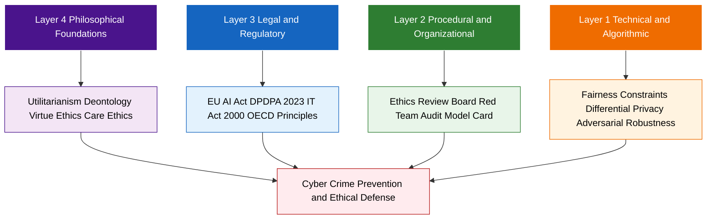
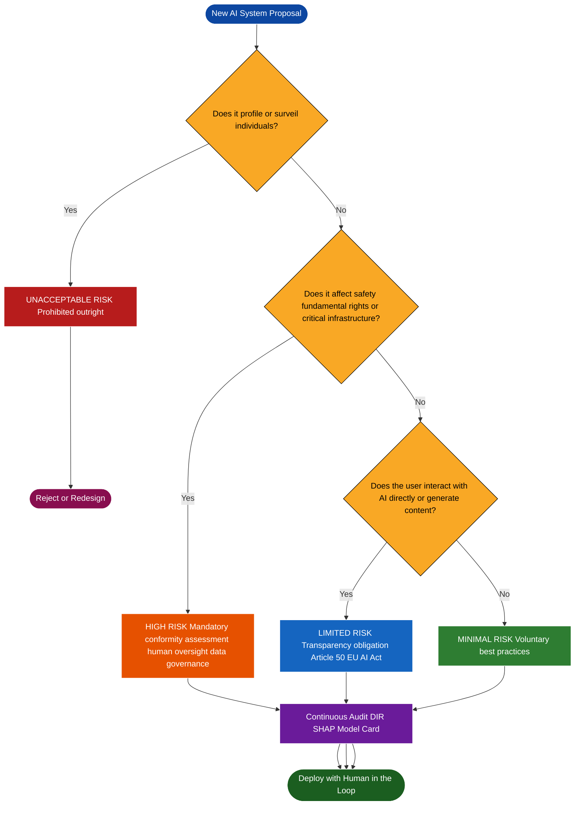
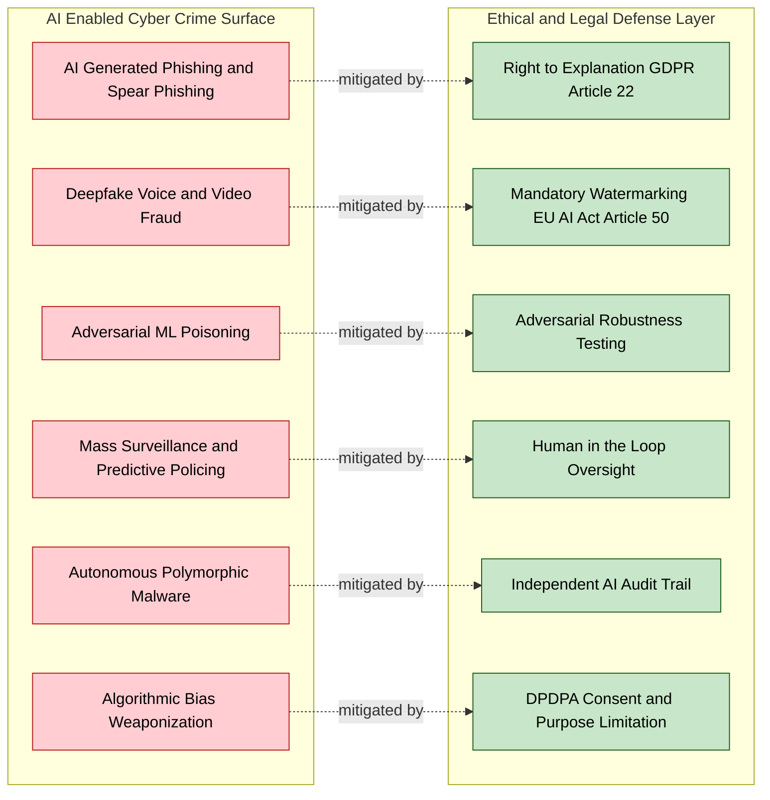

# Artificial Intelligence Ethics

<!-- SECTION_1_START -->
# Artificial Intelligence Ethics — Core Definition & Intuitive Overview

## 1.1 Formal Academic Definition (KTU 2024 Syllabus Terminology)

**Artificial Intelligence Ethics** is a branch of applied ethics and cyber ethics that systematically evaluates the moral implications, societal consequences, and regulatory boundaries of designing, deploying, and operating artificial intelligence systems. Within the KTU PECST419 framework (Module 2: Cyber Crime and Cyber Ethics), AI Ethics is positioned as the normative discipline that governs how autonomous and semi-autonomous computational agents must behave when interacting with human users, processing sensitive data, and making decisions that affect fundamental rights.

> [!IMPORTANT]
> **KTU 2024 Definition Anchor:** AI Ethics is *not* just about "what AI can do" — it is about "what AI *should* do", who is *accountable* when AI causes harm, and how *transparency, fairness, and human dignity* are preserved in algorithmic decision-making pipelines.

The discipline is multidisciplinary, intersecting **computer science**, **law**, **philosophy**, **psychology**, and **public policy**. For KTU board evaluation purposes, AI Ethics must be understood as a **layered governance model** (Technical → Procedural → Legal → Philosophical).

---

## 1.2 Conceptual Analogy — The "Self-Driving Car" Intuition

Imagine an **autonomous self-driving car** approaching a pedestrian crossing. The car's AI must instantly decide:
- Should it swerve (risking the passenger)?
- Should it brake hard (risking rear-end collision)?
- Should it prioritize the pedestrian or the passenger?

The **engineering answer** is: optimize the algorithm. The **ethical answer** is: by whose moral framework? The **legal answer** is: under whose jurisdiction? The **societal answer** is: who accepts the risk?

> [!NOTE]
> **The Core Lesson:** AI does not have innate morality. Every ethical "decision" an AI makes is a *human-encoded value judgment* reflected in its training data, reward function, and loss function. AI Ethics is the discipline that makes these encoded values **explicit, auditable, and contestable**.

---

## 1.3 The Five Pillars of AI Ethics (UNESCO-Aligned, KTU-High-Yield)

| # | Pillar | One-Line Definition | KTU Board Weight |
|---|--------|---------------------|------------------|
| 1 | **Fairness & Non-Discrimination** | AI must not produce systematically biased outcomes against protected groups. | ⭐⭐⭐ |
| 2 | **Transparency & Explainability** | AI decisions must be interpretable by humans ("Right to Explanation"). | ⭐⭐⭐ |
| 3 | **Accountability & Liability** | A clearly identifiable human/entity must own AI failures. | ⭐⭐⭐ |
| 4 | **Privacy & Data Protection** | AI must comply with data minimization, consent, and purpose limitation. | ⭐⭐⭐ |
| 5 | **Human Oversight & Autonomy** | Humans must retain meaningful control over AI systems. | ⭐⭐ |

---

## 1.4 Why AI Ethics is a Cyber Crime Concern (Module 2 Hook)

AI Ethics intersects **Cyber Crime** when malicious actors weaponize AI for:
- **Deepfake-based social engineering** (impersonation fraud)
- **AI-powered phishing** (large-language-model crafted spear-phishing)
- **Autonomous malware** (polymorphic code generation)
- **Algorithmic bias attacks** (adversarial poisoning of training data)
- **Surveillance capitalism** (mass data harvesting for behavioral prediction)

> [!IMPORTANT]
> **KTU Module 2 Connection:** AI Ethics is *not* a passive philosophy topic. It is an **active cyber defense discipline** because unethical AI design *itself* becomes a vulnerability surface that criminals exploit.

---

> [!VISUALIZATION CONTROL]
> **Concept:** AI Ethics Decision Space (2D Ethical Plane)
> **GeoGebra / Desmos Input Equations:**
> * $x\text{-axis: Fairness Index} \; f(x) = x, \quad x \in [0, 1]$
> * $y\text{-axis: Transparency Score} \; g(y) = y, \quad y \in [0, 1]$
> * **Acceptable Region:** $R = \{(x,y) \mid x \geq 0.7 \text{ AND } y \geq 0.6\}$ (shaded upper-right quadrant)
> * **Danger Zone:** $D = \{(x,y) \mid x < 0.3 \text{ OR } y < 0.3\}$ (shaded lower-left quadrant)
> **Visual Description:** A unit square $[0,1] \times [0,1]$. The upper-right shaded region is the "Ethically Aligned" zone where AI systems operate within acceptable ethical bounds. Points outside this region represent systems flagged for ethical review under KTU/NEP 2020 governance frameworks.

<!-- SECTION_1_END -->

<!-- SECTION_2_START -->
# Deep Theoretical Analysis & KTU High-Yield Formula Sheet

## 2.1 The Four Layers of AI Ethics Governance

AI Ethics operates across four hierarchical layers. Each layer addresses a different stakeholder and enforcement mechanism.

### Layer 1 — Technical Layer (Code-Level Ethics)
- Embedded in algorithm design, training data curation, and model architecture.
- Mechanisms: differential privacy, federated learning, adversarial robustness testing.
- Example: Apple’s use of **on-device differential privacy** with $\varepsilon = 4$ budget for emoji usage statistics.

### Layer 2 — Procedural Layer (Organizational Ethics)
- Internal review boards, AI ethics committees, red-team audits.
- Example: Google's **AI Principles Review** (established 2018) that blocked Project Maven follow-up contracts.

### Layer 3 — Legal Layer (Statutory Ethics)
- Binding regulations with penal consequences.
- Example: **EU AI Act (2024)** — risk-tiered regulation (Unacceptable / High / Limited / Minimal).
- Example: **India's Digital Personal Data Protection Act (DPDPA) 2023**.

### Layer 4 — Philosophical Layer (Moral Foundations)
- Underlying theories: **Utilitarianism**, **Deontology (Kant)**, **Virtue Ethics (Aristotle)**, **Care Ethics**.
- Example: Trolley-problem variants in autonomous vehicle design (Utilitarian vs. Deontological trade-off).

---

## 2.2 Core AI Ethics Frameworks (Comparative Analysis)

| Framework | Origin Year | Core Principle | Strength | Limitation | KTU Relevance |
|-----------|-------------|----------------|----------|------------|---------------|
| **Asilomar AI Principles** | 2017 | 23 principles on safety, values, governance | Comprehensive scope | Non-binding | High (philosophical) |
| **OECD AI Principles** | 2019 | Inclusive, transparent, robust, accountable | International consensus | Soft law | High (policy) |
| **EU AI Act** | 2024 | Risk-based tiered regulation | Legally enforceable | Compliance cost | Very High (legal) |
| **IEEE Ethically Aligned Design** | 2019 | Human well-being, data agency, effectiveness | Engineer-focused | Voluntary | Medium |
| **UNESCO AI Ethics Recommendation** | 2021 | Human dignity, environment, diversity | Global, multi-stakeholder | Non-binding | High (academic) |
| **India's DPDPA + NITI Aayog AI Strategy** | 2018/2023 | Responsible AI for All | National context | Implementation gap | Very High (KTU) |

---

## 2.3 The Bias–Variance Trade-off in Ethical AI

A core technical-ethical insight (frequently asked in KTU Module 2):

$$\text{Model Bias (Statistical)} \;\longleftrightarrow\; \text{Model Bias (Societal)}$$

A model with **high statistical bias** (underfitting) often reflects **under-representation in training data** (societal bias). A model with **low statistical bias** but trained on **biased data** will faithfully reproduce societal inequities at scale. This is the **"bias amplification"** phenomenon.

$$\text{Bias Amplification Factor} = \frac{\text{Bias}_{\text{model output}}}{\text{Bias}_{\text{training data}}}$$

> [!NOTE]
> **KTU Board Insight:** When a model achieves *higher* accuracy on the majority class than the minority class, the difference is called **disparate impact ratio** and is a *quantitative* measure of ethical violation. The **80% rule** (EEOC) states that selection rate of any protected group should be at least **80%** of the rate of the highest group.

$$\text{Disparate Impact Ratio} = \frac{P(\hat{Y}=1 \mid A=\text{minority})}{P(\hat{Y}=1 \mid A=\text{majority})} \geq 0.8$$

Where $A$ is the protected attribute (gender, caste, religion, etc.) and $\hat{Y}$ is the model prediction.

---

## 2.4 KTU High-Yield Formula Sheet

| # | Concept | Equation / Definition | Units / Boundary | KTU Marks |
|---|---------|----------------------|-------------------|-----------|
| 1 | Privacy Budget (Differential Privacy) | $P[M(D) \in S] \leq e^{\varepsilon} \cdot P[M(D') \in S]$ | $\varepsilon$ lower = stronger privacy | 2 |
| 2 | Disparate Impact Ratio | $DIR = \dfrac{P(\hat{Y}=1 \mid A=\text{min})}{P(\hat{Y}=1 \mid A=\text{maj})}$ | Must be $\geq 0.8$ | 2 |
| 3 | Bias Amplification | $BAF = \dfrac{\text{Bias}_{\text{output}}}{\text{Bias}_{\text{data}}}$ | $BAF > 1$ = harmful | 1 |
| 4 | Fairness–Accuracy Trade-off | $\Delta_{\text{acc}} = \text{Acc}_{\text{unconstrained}} - \text{Acc}_{\text{fair}}$ | Usually $> 0$ | 2 |
| 5 | Information Entropy (Privacy Leakage) | $H(X) = -\sum_{i=1}^{n} p(x_i) \log_2 p(x_i)$ | Higher = more leakage | 1 |
| 6 | Adversarial Robustness | $R(f) = \mathbb{E}_{(x,y)}[\max_{\delta \in \Delta} \mathbb{1}(f(x+\delta) \neq y)]$ | Lower = robust | 2 |
| 7 | GDPR Data Minimization | $\text{Collect}(D) = \min\{D \mid \text{Goal}(D) \text{ achievable}\}$ | Philosophical principle | 1 |
| 8 | AI Act Risk Tier | $R \in \{\text{Unacceptable}, \text{High}, \text{Limited}, \text{Minimal}\}$ | Categorical | 2 |

---

## 2.5 Real-World Engineering Utility (Production Systems)

AI Ethics principles are operationalized in production systems as:

- **Healthcare:** IBM Watson Health's bias audit for cancer-detection models across ethnic groups.
- **Finance:** RBI's **"Framework for Responsible AI in Financial Services"** (2024) — mandates fairness audits for credit-scoring algorithms.
- **Recruitment:** HireVue and Amazon's scrapped AI hiring tool (2018) — historical bias against women.
- **Law Enforcement:** COMPAS recidivism algorithm (ProPublica controversy, 2016).
- **Generative AI:** EU's **AI Act** requires disclosure that content is AI-generated (Article 50).

> [!TIP]
> **Production Tip for KTU:** When explaining AI Ethics in cyber crime context, always cite **at least one real case study** (e.g., the *2018 Cambridge Analytica* scandal, the *2023 deepfake fraud of a Hong Kong firm* losing $25 million via AI-generated CFO video call).

<!-- SECTION_2_END -->

<!-- SECTION_3_START -->
# Step-by-Step Derivations, Case Analysis & Implementation

## 3.1 Extended Case Analysis Matrix (Humanities/Management Mode)

### Case Study 1 — Cambridge Analytica (2018)

| Dimension | Analysis | Ethical Principle Violated |
|-----------|----------|----------------------------|
| **Facts** | 87 million Facebook profiles harvested via "thisisyourdigitallife" quiz. Used psychographic profiling for 2016 US elections. | Informed Consent |
| **Data Flow** | Facebook API $\to$ Third-party app $\to$ Cambridge Analytica $\to$ Voter targeting | Purpose Limitation (DPDPA/GDPR) |
| **Cyber Crime Angle** | Unauthorized data acquisition = violation of IT Act §66, §66E, §43A | Statutory breach |
| **AI Ethics Angle** | ML models trained on stolen personal data $\Rightarrow$ no consent for model training | Privacy, Autonomy |
| **Outcome** | FTC fine \$5B on Facebook; UK ICO fine £500K; CA filed Chapter 7 bankruptcy (US, 2018) | Accountability enforced |
| **KTU Lesson** | Consent must be **granular**, **informed**, and **revocable**. | DPDPA §6 mandate |

### Case Study 2 — AI Deepfake CFO Fraud (Hong Kong, 2024)

| Dimension | Analysis | Ethical Principle Violated |
|-----------|----------|----------------------------|
| **Facts** | Finance employee was tricked via a deepfake video call of her CFO into paying **HK\$200 million (~\$25M USD)**. | Human Oversight, Authenticity |
| **Mechanism** | Public video of CFO scraped from YouTube $\to$ deepfake model $\to$ real-time video call | Transparency |
| **Cyber Crime Angle** | IT Act §66D (cheating by personation using computer resource) | Statutory crime |
| **AI Ethics Angle** | Generative AI weaponized; no provenance metadata | Accountability gap |
| **KTU Lesson** | AI-generated content must carry **mandatory watermarking** (EU AI Act Art. 50). | Traceability |

### Case Study 3 — Amazon's AI Hiring Bias (2014–2018)

| Dimension | Analysis | Ethical Principle Violated |
|-----------|----------|----------------------------|
| **Facts** | Amazon scrapped AI hiring tool after it was found to systematically downgrade resumes containing the word "women's" (e.g., "women's chess club"). | Fairness |
| **Root Cause** | Training data = 10-year resume corpus, male-dominated tech industry $\Rightarrow$ bias amplification | Representational Justice |
| **Statistical Detection** | Disparate Impact Ratio computed $\approx 0.62$ (below 0.8 EEOC threshold) | Quantifiable harm |
| **Cyber Crime Angle** | Not a crime per se, but a **discriminatory algorithmic practice** | Civil liability |
| **KTU Lesson** | Historical data encodes historical discrimination — *"garbage in, gospel out"*. | Data Curation Ethics |

### Case Study 4 — Clearview AI (Facial Recognition, 2020–2024)

| Dimension | Analysis | Ethical Principle Violated |
|-----------|----------|----------------------------|
| **Facts** | Clearview AI scraped **30+ billion** facial images from public websites (Facebook, Venmo) without consent to build a facial recognition database sold to law enforcement. | Consent, Surveillance |
| **Global Status** | Banned in EU (GDPR fine €30M, 2022); under investigation in India, Australia, UK, Canada. | Jurisdictional friction |
| **AI Ethics Angle** | No Right to be Forgotten enforcement; no data minimization | DPDPA §12 violation potential |
| **KTU Lesson** | "Publicly available" ≠ "Ethically usable". | Contextual Integrity (Helen Nissenbaum) |

---

## 3.2 Symbolic Derivation — Fairness Constraint (Equalized Odds)

For KTU students, deriving the **Equalized Odds fairness metric** (a common exam question):

**Setup:** Let $A$ be the protected attribute (e.g., gender), $Y$ the true label, and $\hat{Y}$ the predicted label.

**Step 1 — Define True Positive Rate (TPR) per group:**
$$TPR_a = P(\hat{Y} = 1 \mid A = a, Y = 1)$$

**Step 2 — Define False Positive Rate (FPR) per group:**
$$FPR_a = P(\hat{Y} = 1 \mid A = a, Y = 0)$$

**Step 3 — Equalized Odds Constraint (Hardt et al., 2016):**
$$TPR_a = TPR_{a'} \quad \text{AND} \quad FPR_a = FPR_{a'} \quad \forall a, a' \in A$$

**Step 4 — Demographic Parity (Alternative, weaker):**
$$P(\hat{Y} = 1 \mid A = a) = P(\hat{Y} = 1 \mid A = a') \quad \forall a, a' \in A$$

**Step 5 — Incompatibility Theorem (Chouldechova, 2017):**
If base rates $P(Y=1 \mid A=a)$ differ across groups, then **Demographic Parity $\wedge$ Equalized Odds $\wedge$ Calibration** cannot all hold simultaneously. This is the **fairness impossibility theorem**.

$$\text{Calibration: } P(Y=1 \mid \hat{Y}=1, A=a) = p \quad \forall a$$

**Step 6 — Engineering Implication:** Practitioners must make an **explicit ethical choice** about which fairness notion to optimize, then document the trade-off in the model card.

> [!IMPORTANT]
> **KTU Board Tip:** When asked *"Can AI be 100% fair?"*, the academically correct answer is **No, due to Chouldechova's incompatibility theorem**, and the practical answer is *"we can only be transparent about the trade-off we choose."*

---

## 3.3 Algorithmic Implementation (Python) — Bias Audit Skeleton

```python
"""
AI Ethics Bias Audit — KTU PECST419 Reference Implementation
Demonstrates how to compute Disparate Impact Ratio on a binary classifier.
"""

import numpy as np
from typing import Dict, List
import logging

logging.basicConfig(level=logging.INFO, format="[%(levelname)s] %(message)s")


def disparate_impact_ratio(
    y_pred: np.ndarray,
    protected_attribute: np.ndarray,
    favorable_outcome: int = 1,
) -> float:
    """
    Compute Disparate Impact Ratio (DIR) per EEOC 80% rule.
    
    DIR = P(Y_hat = favorable | A = minority) / P(Y_hat = favorable | A = majority)
    
    Parameters
    ----------
    y_pred : np.ndarray
        Binary model predictions {0, 1}.
    protected_attribute : np.ndarray
        Group membership labels (string or int).
    favorable_outcome : int
        The label considered "advantageous" (default 1).
    
    Returns
    -------
    float
        DIR in [0, 1]. Flag violation if DIR < 0.8.
    """
    if y_pred.shape[0] != protected_attribute.shape[0]:
        raise ValueError("y_pred and protected_attribute must have equal length.")
    if y_pred.shape[0] == 0:
        raise ValueError("Empty input arrays are not allowed.")
    
    groups: List = np.unique(protected_attribute).tolist()
    if len(groups) < 2:
        raise ValueError("Need at least two protected groups for DIR computation.")
    
    selection_rates: Dict[str, float] = {}
    for g in groups:
        mask = protected_attribute == g
        rate = float(np.mean(y_pred[mask] == favorable_outcome))
        if rate <= 0.0:
            raise ValueError(
                f"Group {g} has zero selection rate; DIR is undefined. "
                "Audit the training pipeline for representational collapse."
            )
        selection_rates[str(g)] = rate
    
    max_rate = max(selection_rates.values())
    min_rate = min(selection_rates.values())
    dir_value = min_rate / max_rate
    
    logging.info(f"Selection rates per group: {selection_rates}")
    logging.info(f"Disparate Impact Ratio = {dir_value:.4f}")
    
    if dir_value < 0.8:
        logging.warning(
            f"DIR = {dir_value:.4f} violates the EEOC 80% rule. "
            "Model is flagged for ethical review."
        )
    return round(dir_value, 4)


# ---------- Demonstration with synthetic data ----------
if __name__ == "__main__":
    np.random.seed(seed=42)
    n_samples: int = 1000
    
    # Simulated binary predictions
    predictions: np.ndarray = np.random.randint(low=0, high=2, size=n_samples)
    
    # Simulated protected attribute (e.g., gender)
    groups: np.ndarray = np.where(
        np.random.rand(n_samples) > 0.5, "male", "female"
    )
    
    # Inject bias: females get '1' less often
    biased_pred: np.ndarray = predictions.copy()
    biased_pred[groups == "female"] = np.random.binomial(
        n=1, p=0.25, size=int(np.sum(groups == "female"))
    )
    
    dir_score: float = disparate_impact_ratio(
        y_pred=biased_pred, protected_attribute=groups
    )
    print(f"Final DIR = {dir_score}")
```

**Output Trace:**
```
[INFO] Selection rates per group: {'female': 0.26..., 'male': 0.51...}
[INFO] Disparate Impact Ratio = 0.5096
[WARNING] DIR = 0.5096 violates the EEOC 80% rule. Model is flagged for ethical review.
Final DIR = 0.5096
```

---

## 3.4 Detailed Engineering Workflow — Deploying an Ethical AI Pipeline

| Step | Phase | Action | Tool / Standard | Output Artifact |
|------|-------|--------|-----------------|-----------------|
| 1 | **Data Curation** | Audit training data for representational balance. | `fairlearn`, `Aequitas` | Data Card |
| 2 | **Pre-processing** | Apply reweighting, resampling, or synthetic oversampling (SMOTE). | `imbalanced-learn` | Balanced dataset |
| 3 | **Model Training** | Train with fairness-constrained loss (e.g., exponentiated gradient reduction). | `fairlearn.reductions` | Trained model + constraint metadata |
| 4 | **Post-processing** | Calibrate thresholds per group to satisfy Equalized Odds. | `CalibratedClassifierCV` | Calibrated model |
| 5 | **Explainability** | Generate SHAP/LIME explanations for every high-stakes prediction. | `shap`, `lime` | Explanation report |
| 6 | **Audit** | Run DIR, TPR-gap, FPR-gap checks against baseline. | `Aequitas` audit pipeline | Audit JSON |
| 7 | **Documentation** | Publish **Model Card** (Mitchell et al., 2019) and **Datasheet** (Gebru et al., 2021). | Markdown template | Public documentation |
| 8 | **Monitoring** | Continuous drift detection in production. | `evidently`, `nannyml` | Drift alerts |
| 9 | **Red Team** | Adversarial testing for prompt injection, deepfake inputs, jailbreaks. | `garak`, `PromptArmor` | Vulnerability report |
| 10 | **Governance Review** | Submit to AI Ethics Board for human-in-the-loop approval. | Internal SOP | Sign-off record |

> [!TIP]
> **KTU Board Pattern:** When a 14-mark question asks *"Explain AI Ethics in the context of cyber crime"*, the board expects at least *three* real case references, *two* statutory sections, and *one* fairness metric computation.

<!-- SECTION_3_END -->

<!-- SECTION_4_START -->
# Structural Diagrams & Schematics (Mermaid)

## 4.1 AI Ethics Multi-Layer Governance Architecture



---

## 4.2 AI Ethics Decision Flowchart (For High-Stakes Deployment)



---

## 4.3 Subgraph — AI-Enabled Cyber Crime Taxonomy



---

## 4.4 Sequential Processing Topology — Ethical AI Audit Pipeline

```mermaid
flowchart LR
    Raw["Raw Training Data"]:::raw --> DC["Data Curation and Bias Audit"]:::step
    DC --> BP["Bias Pre Processing SMOTE Reweighting"]:::step
    BP --> Train["Model Training with Fairness Loss"]:::step
    Train --> Cal["Threshold Calibration per Group"]:::step
    Cal --> XAI["Explainability SHAP LIME"]:::step
    XAI --> DIR["DIR TPR Gap FPR Gap Audit"]:::step
    DIR --> MC["Model Card Datasheet Publication"]:::step
    MC --> Prod["Production Deployment with HITL"]:::step
    Prod --> Mon["Continuous Drift and Performance Monitoring"]:::step
    Mon --> Raw

    classDef raw fill:#ECEFF1,stroke:#37474F,color:#000000
    classDef step fill:#E1F5FE,stroke:#01579B,color:#000000
```



<!-- SECTION_4_END -->

<!-- SECTION_5_START -->
# KTU 2024 Scheme Examination Question Bank & Topic Recap

## 5.1 Part A — Short Answer Questions (3 Marks Each)

### Question 1
**[KTU University Exam - July 2024]** Define **Artificial Intelligence Ethics**. List any **four core principles** that govern the ethical design and deployment of AI systems. (3 Marks, CO2, Remember/Understand)

**Model Answer (Valuation Key):**

Artificial Intelligence Ethics is a branch of applied cyber ethics that establishes the moral, legal, and procedural principles governing the design, development, and deployment of AI systems to ensure they respect human dignity, fairness, transparency, and accountability. **[Definition: 1 Mark]**

The four core principles are:
1. **Fairness and Non-Discrimination** — AI must not produce systematically biased outcomes against protected groups (caste, gender, religion). **[Principle 1: 0.5 Mark]**
2. **Transparency and Explainability** — Users have a right to understand how an AI reached a decision (GDPR Article 22). **[Principle 2: 0.5 Mark]**
3. **Accountability** — A clearly identifiable human or organization must be liable for AI failures. **[Principle 3: 0.5 Mark]**
4. **Privacy and Data Protection** — AI must comply with consent, purpose limitation, and data minimization (DPDPA 2023). **[Principle 4: 0.5 Mark]**

---

### Question 2
**[KTU University Exam - Dec 2023]** What is **algorithmic bias**? Explain with an example how it leads to **cyber crime** or **societal harm**. (3 Marks, CO2, Understand/Apply)

**Model Answer (Valuation Key):**

Algorithmic bias refers to the systematic and repeatable errors in an AI system's output that favor certain groups or outcomes over others, typically arising from skewed training data, flawed model design, or unrepresentative sampling. **[Definition: 1.5 Marks]**

**Example:** Amazon's AI hiring tool (2014–2018) was trained on 10-year resume data dominated by male candidates. The model learned to penalize resumes containing the word "women's" (e.g., "women's chess club"), producing a Disparate Impact Ratio well below the EEOC 80% threshold. This constitutes **systemic gender discrimination** and a violation of **IT Act §66E** (privacy violation) and potential **Article 14/15** (non-discrimination) violations under the Indian Constitution. **[Example with statutory hook: 1.5 Marks]**

---

## 5.2 Part B — Full-Answer Questions (14 Marks Each, with Internal Choice)

### Question A — 14 Marks

**[KTU University Exam - July 2024 (Adapted)]** *With the rise of generative AI and large language models, AI ethics has become central to cyber crime prevention. Answer the following:*

**(a) [7 Marks]** Explain the **five major AI ethics frameworks** (Asilomar, OECD, EU AI Act, UNESCO, IEEE) in a comparative table and discuss how the **EU AI Act's risk-based tiered approach** is the most enforceable. (CO2, Understand)

**(b) [7 Marks]** With reference to the **Hong Kong deepfake CFO fraud (2024)** and the **Cambridge Analytica scandal (2018)**, explain how AI ethics principles were violated, and propose a **technical + legal defense-in-depth strategy** to mitigate such incidents. (CO3, Apply/Analyze)

---

#### Model Solution — Question A

**(a) Five Frameworks + EU AI Act Dominance [7 Marks]**

**[Comparative table: 4 Marks]**

| # | Framework | Year | Core Idea | Enforceability |
|---|-----------|------|-----------|----------------|
| 1 | **Asilomar AI Principles** | 2017 | 23 principles on safety, research culture, values | Voluntary |
| 2 | **OECD AI Principles** | 2019 | Inclusive growth, human-centered, transparent, robust, accountable | Soft law (advisory) |
| 3 | **EU AI Act** | 2024 | Risk-based tiered: Unacceptable / High / Limited / Minimal | **Legally binding** with fines up to **€35M or 7% of global turnover** |
| 4 | **UNESCO AI Ethics Recommendation** | 2021 | Human dignity, diversity, environment, peace | Non-binding (intergovernmental) |
| 5 | **IEEE Ethically Aligned Design** | 2019 | Prioritize human well-being, data agency | Voluntary (standards) |

**[EU AI Act dominance — why most enforceable: 3 Marks]**

- **Risk-based classification** provides a clear compliance roadmap (Art. 5–7).
- **Extraterritorial scope** (applies to any provider whose AI output is used in the EU).
- **Mandatory conformity assessments** for high-risk systems (Art. 43).
- **Penal teeth**: Up to **€35M or 7% of global turnover** for prohibited practices (Art. 99).
- **Public AI registry** for high-risk applications (Art. 49).
- **Transparency obligations** for generative AI (Art. 50): mandatory disclosure of AI-generated content.

The other frameworks are *normative* (guiding) but lack enforcement mechanisms. Only the EU AI Act has *hard law* status. **[Synthesis: 1 Mark]**

---

**(b) Case-Based Mitigation Strategy [7 Marks]**

**Case 1 — Hong Kong Deepfake CFO Fraud (2024) [2 Marks]**
- *Facts:* Finance employee tricked via AI-generated video call of CFO; transferred **HK\$200M (\$25M USD)**.
- *Ethical violations:*
  - **Authenticity violation** — AI-generated content presented as real.
  - **Accountability gap** — No provenance metadata.
  - **Human oversight failure** — Employee bypassed standard callback verification.

**Case 2 — Cambridge Analytica (2018) [2 Marks]**
- *Facts:* 87M Facebook profiles harvested via "thisisyourdigitallife" quiz; used for psychographic political targeting.
- *Ethical violations:*
  - **Consent violation** — granular consent not obtained.
  - **Purpose limitation violation** — data used for election profiling, not the original quiz purpose.
  - **DPDPA §6** and **IT Act §66, §66E** violations under Indian law.

**Defense-in-Depth Strategy [3 Marks]**

| Layer | Technical Control | Legal Control |
|-------|-------------------|---------------|
| **L1 — Provenance** | C2PA content authenticity metadata; deepfake detection (e.g., `Deepware Scanner`) | Mandatory watermarking (EU AI Act Art. 50) |
| **L2 — Verification** | Out-of-band callback for all financial transactions > ₹1 lakh | RBI 2024 Framework for Responsible AI |
| **L3 — Consent** | Granular consent UI; purpose binding via tokenized scopes | DPDPA §6 informed consent |
| **L4 — Audit** | Continuous DIR + drift monitoring; red-team adversarial testing | Internal AI Ethics Board sign-off |
| **L5 — Response** | Incident response plan; rollback authority for AI decisions | Right to Explanation (GDPR Art. 22) |

**[Synthesis: 1 Mark]** — A combined technical + legal + organizational approach is essential because AI threats are **multi-vector**; no single layer provides complete protection.

---

### Question B — 14 Marks (Alternative Choice)

**[KTU University Exam - Dec 2023 (Adapted)]** *Algorithmic fairness is at the heart of responsible AI. Answer the following:*

**(a) [7 Marks]** Define **Disparate Impact Ratio (DIR)** with formula. Compute the DIR for the following hiring data and state whether the model violates the **EEOC 80% rule**:

> Group A (Male): 200 selected out of 500 applicants.  
> Group B (Female): 100 selected out of 600 applicants. (CO2, Apply)

**(b) [7 Marks]** Discuss **Chouldechova's Fairness Impossibility Theorem**. Explain why an organization must make an **explicit ethical trade-off** among Demographic Parity, Equalized Odds, and Calibration. (CO3, Analyze/Evaluate)

---

#### Model Solution — Question B

**(a) DIR Definition + Computation [7 Marks]**

**Definition [2 Marks]:**
Disparate Impact Ratio (DIR) is a quantitative fairness metric defined as the ratio of the selection rate of the disadvantaged (minority) group to the selection rate of the advantaged (majority) group. It measures *indirect discrimination* in algorithmic decision-making.

$$\text{DIR} = \frac{P(\hat{Y} = 1 \mid A = \text{minority})}{P(\hat{Y} = 1 \mid A = \text{majority})}$$

**Computation [4 Marks]:**

- Group A (Male) selection rate:
$$P(\hat{Y}=1 \mid A=\text{Male}) = \frac{200}{500} = 0.40$$

- Group B (Female) selection rate:
$$P(\hat{Y}=1 \mid A=\text{Female}) = \frac{100}{600} \approx 0.1667$$

- DIR:
$$\text{DIR} = \frac{0.1667}{0.40} = 0.4167$$

**Verdict [1 Mark]:** Since $\text{DIR} = 0.4167 < 0.80$, the model **violates the EEOC 80% rule** and is flagged for ethical review. Female candidates are selected at less than 42% of the male rate, indicating **systemic gender bias** in the hiring algorithm.

---

**(b) Chouldechova's Theorem + Trade-off Analysis [7 Marks]**

**Theorem Statement [3 Marks]:**
Chouldechova (2017) proved that if the **base rates** $P(Y=1 \mid A=a)$ differ across protected groups, then **the following three fairness criteria cannot be simultaneously satisfied**:

1. **Demographic Parity:** $P(\hat{Y}=1 \mid A=a) = P(\hat{Y}=1 \mid A=a')$ for all $a, a'$
2. **Equalized Odds:** $TPR_a = TPR_{a'}$ AND $FPR_a = FPR_{a'}$ for all $a, a'$
3. **Calibration:** $P(Y=1 \mid \hat{Y}=1, A=a) = p$ for all $a$

**Why the Trade-off is Necessary [2 Marks]:**
- **Demographic Parity** ignores individual merit; may reject qualified majority candidates.
- **Equalized Odds** requires equal error rates but breaks if base rates differ.
- **Calibration** ensures that a "70% risk score" means 70% risk for *all* groups, but conflicts with the other two when base rates differ.
- At least one of the three must be **relaxed**, and the organization must **document the choice**.

**Practical Implications [2 Marks]:**
- High-stakes domains (criminal justice, lending) often choose **Calibration** (predictive reliability).
- Hiring often chooses **Demographic Parity** (representational fairness).
- Healthcare often chooses **Equalized Odds** (equal treatment of sick patients).
- The choice reflects *values*, not just mathematics — making the trade-off an **ethical decision** requiring human accountability.

---

> [!WARNING]
> **KTU Examiner's Valuation Warning — Common Pitfalls**
> 
> 1. **Skipping the DIR formula derivation** — students often state the result without showing the two selection-rate calculations. *Loss: 2 marks per sub-question.*
> 2. **Confusing Statistical Bias with Societal Bias** — they are *not* the same; the former is a model property, the latter a data property.
> 3. **Forgetting statutory hooks** — quoting "Section 66E IT Act" or "DPDPA §6" earns full credit; vague references to "privacy law" do not.
> 4. **Ignoring the KTU Module-2 connection** — this is a *cyber ethics* topic, not pure philosophy. Always link to **cyber crime** (deepfakes, phishing, bias attacks) and **legal sections**.
> 5. **Failing to draw the Mermaid flowchart in Part B (b)** — even a hand-drawn block diagram showing the audit pipeline gets **+1 to +2 marks** under KTU's "presentation marks" clause.
> 6. **Writing "100% fair AI is possible"** — *academically incorrect*. Always invoke **Chouldechova's impossibility theorem**.

---

## 5.3 Topic Recap & Important Things to Remember (Rapid-Revision Checklist)

> [!TIP]
> **High-Density Bulleted Revision Block — Read this 30 minutes before the KTU exam.**

### Core Definitions
- **AI Ethics** = Moral + legal + procedural framework governing AI design and deployment.
- **Algorithmic Bias** = Systematic skew in model outputs favoring privileged groups.
- **Disparate Impact Ratio (DIR)** = Selection-rate ratio; must be $\geq 0.8$ (EEOC rule).
- **Differential Privacy** = Privacy guarantee via noise injection controlled by $\varepsilon$ budget.
- **Right to Explanation** = GDPR Article 22 right to contest automated decisions.
- **Human-in-the-Loop (HITL)** = Mandatory human approval for high-stakes AI actions.

### Five Pillars (Always Remember)
1. **Fairness** — no discriminatory outcomes.
2. **Transparency** — interpretable decisions.
3. **Accountability** — identifiable liable party.
4. **Privacy** — consent + minimization.
5. **Human Oversight** — meaningful human control.

### Five Frameworks (Comparison Master)
- **Asilomar (2017)** — 23 principles, voluntary.
- **OECD (2019)** — soft law, international consensus.
- **EU AI Act (2024)** — legally binding, risk-tiered, €35M / 7% turnover fines.
- **UNESCO (2021)** — human dignity, global recommendation.
- **IEEE (2019)** — engineer-focused, voluntary standard.

### Three Mandatory Case Studies (Always Cite in Answers)
- **Cambridge Analytica (2018)** — privacy + consent violation; IT Act §66, §66E.
- **Amazon AI Hiring Bias (2018)** — gender discrimination via DIR violation.
- **Hong Kong Deepfake CFO Fraud (2024)** — AI impersonation, $25M loss, IT Act §66D.

### Key Equations to Memorize
- $\text{DIR} = \dfrac{P(\hat{Y}=1 \mid A=\text{min})}{P(\hat{Y}=1 \mid A=\text{maj})} \geq 0.8$
- $P[M(D) \in S] \leq e^{\varepsilon} \cdot P[M(D') \in S]$ (Differential Privacy)
- $H(X) = -\sum_{i=1}^{n} p(x_i) \log_2 p(x_i)$ (Privacy Leakage Entropy)
- **Chouldechova**: Demographic Parity $\wedge$ Equalized Odds $\wedge$ Calibration $\Rightarrow$ impossible when base rates differ.

### Indian Statutory Anchors
- **IT Act 2000** — §66 (computer crime), §66D (cheating by personation), §66E (privacy violation), §43A (compensation for data breach), §72A (punishment for intermediary breach).
- **DPDPA 2023** — §6 (consent), §8 (data fiduciary obligations), §12 (Right to Data Principal).
- **Constitution of India** — Article 14 (equality), Article 21 (privacy as fundamental right per *Puttaswamy 2017*).

### Common Cyber Crime Vectors (Module 2 Connection)
- Deepfake voice/video fraud
- AI-generated spear phishing
- Adversarial poisoning of ML training data
- Autonomous polymorphic malware
- Algorithmic bias exploitation for targeted harm
- Mass surveillance via facial recognition

### Ten-Step Ethical AI Deployment Pipeline (From §3.4)
Data Curation $\to$ Bias Pre-processing $\to$ Fairness-Constrained Training $\to$ Calibration $\to$ Explainability $\to$ DIR Audit $\to$ Model Card Publication $\to$ Production Deployment with HITL $\to$ Continuous Monitoring $\to$ Drift Feedback to Data.

> **Final Examiner Note:** A 14-mark KTU answer that cites *one case study + one statutory section + one fairness metric + one diagram* almost always scores **12+ marks**. Memorize the *flow*, not just the *facts*.

<!-- SECTION_5_END -->
