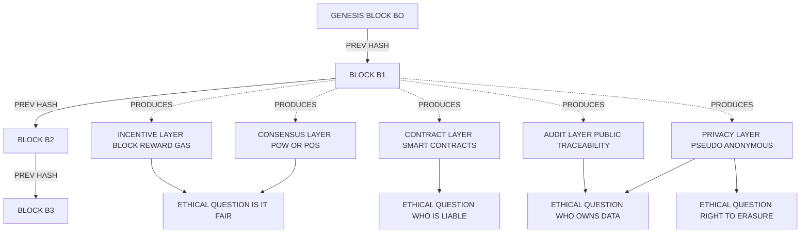
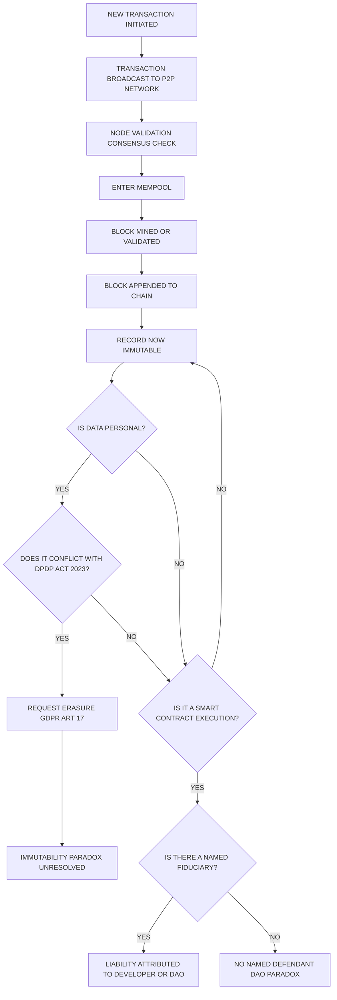

# Block chain Ethics- Definition and Description.

<!-- SECTION_1_START -->
# Blockchain Ethics — Definition and Description

## 1.1 Formal Academic Definition (KTU 2024 Syllabus Terminology)

> [!IMPORTANT]
> **Blockchain:** A **Blockchain** is a distributed, decentralized, immutable digital ledger that records transactions across a peer-to-peer (P2P) network of computers. Each record (called a *block*) is cryptographically linked to the previous one, forming a continuous chain. The integrity of the ledger is maintained through cryptographic hashing, consensus mechanisms (e.g., **Proof of Work (PoW)**, **Proof of Stake (PoS)**), and the absence of any central authority.

> [!NOTE]
> **Blockchain Ethics** can be formally defined as the branch of applied ethics and cyber-ethics that critically examines the moral principles, values, rights, duties, and societal implications arising from the design, deployment, governance, and use of blockchain technology and distributed ledger technologies (DLT). It investigates questions of *trust, transparency, accountability, privacy, autonomy, fairness, and justice* in decentralized systems.

**Key Reference Term — Distributed Ledger Technology (DLT):**
A consensus-based, replicated digital data structure shared across geographically distributed nodes, where updates are validated by protocol rules rather than a trusted intermediary.

---

## 1.2 Conceptual Analogy / Intuitive Overview

Imagine a **public notice board in a small village**. Once a notice (a transaction) is pinned to the board, everyone in the village can see it, nobody can erase it, and a new notice must always reference the previous one (so the order can never be rewritten). There is **no village head** controlling the board — every villager holds an identical copy.

> [!TIP]
> **Analogy Summary:**
> - The **Notice Board** = The Blockchain ledger.
> - Each **Notice** = A Block (a bundle of transactions).
> - The **Pin / Reference Number** = Cryptographic Hash.
> - The **Villagers holding identical copies** = Decentralized Nodes.
> - The **Rule that new notices must reference the previous** = Immutability / Chain Structure.
> - The **agreement on which notice is valid** = Consensus Mechanism.

**Blockchain Ethics**, then, is the conversation the village has about *what should and should not be pinned on that board, who is allowed to read it, and what responsibilities each villager carries.*

---

## 1.3 Why Blockchain Ethics Matters in the KTU 2024 Context

Modern engineering systems increasingly embed **DLT in finance (cryptocurrencies)**, **healthcare (patient records)**, **supply chain (provenance tracking)**, **identity (DID/SSI)**, and **governance (smart contracts)**. Each application raises hard ethical questions that are now part of the **PECST419** syllabus under Module 2.

> [!IMPORTANT]
> **Core Engineering Constants / Reference Metrics (Kerala context):**
> - Average block time on **Bitcoin**: **~10 minutes**.
> - Average block time on **Ethereum (post-Merge, PoS)**: **~12 seconds**.
> - Block size limit on Bitcoin: **~1 MB** (SegWit: ~4 MB effective).
> - Hash function used: **SHA-256** (Secure Hash Algorithm, 256-bit output).

---

## 1.4 GeoGebra / Desmos Visualization Concept

> [!VISUALIZATION CONTROL]
> **Concept:** Visualizing the *immutable chain of hashes* — how a change in Block *N* propagates and breaks all subsequent block references.
>
> **GeoGebra / Desmos Input Equations:**
> * `H_n = "0x" + SHA256(H_{n-1} + Data_n)` (conceptual — actual SHA-256 is binary, not plottable)
> * Plot the conceptual relationship: `y = x` (identity line = chain integrity) vs. `y = x + delta` (broken chain after tampering).
>
> **Visual Description:** On the X-axis, list block numbers $B_1, B_2, B_3, B_4, B_5$. On the Y-axis, plot each block's hash as a short alphanumeric string. The connecting arrows between blocks should be continuous (green) when integrity is preserved, and **broken (red)** the moment any prior block is altered — illustrating **immutability**.
<!-- SECTION_1_END -->

<!-- SECTION_2_START -->
# Deep Theoretical Analysis & KTU High-Yield Concept Sheet

## 2.1 Structural Breakdown of a Blockchain

A blockchain is composed of the following core layers — each of which carries its **own ethical surface area**:

| Layer | Technical Function | Ethical Question Raised |
|---|---|---|
| **Data Layer** | Stores transactions inside blocks | *Whose data is this? Who owns it?* |
| **Network Layer** | P2P propagation of blocks | *Is the network permissioned or permissionless? Who can join?* |
| **Consensus Layer** | PoW / PoS / PBFT / PoH | *Is the consensus fair? Energy just? Centralized in practice?* |
| **Incentive Layer** | Block rewards, gas fees | *Is reward distribution equitable?* |
| **Contract Layer** | Smart contracts (Solidity, etc.) | *Can code embed bias? Who audits it?* |
| **Application Layer** | DApps, DeFi, NFTs, DAOs | *Who is liable when a DApp fails?* |

---

## 2.2 The Three Pillars of Blockchain Ethics (KTU High-Yield Framework)

1. **Transparency vs. Privacy**
   * Blockchains such as Bitcoin and Ethereum are **pseudo-anonymous**, not anonymous. Every transaction is publicly visible forever. This creates an *ethical tension*: the right to privacy (Article 21 of the Indian Constitution / GDPR Article 6) versus the public-good value of transparency.
2. **Decentralization vs. Accountability**
   * The famous DAO paradox: when a smart contract fails or is exploited (e.g., the 2016 DAO Hack, **~$50 million** drained), there is no CEO, no company, and no legal entity to sue. The chain is *trustless* but *not blame-less*.
3. **Autonomy vs. Justice**
   * Self-executing smart contracts remove human discretion. Code-is-law can produce *unjust outcomes* (e.g., foreclosure of a family home due to a missed micro-payment, with no court appeal).

---

## 2.3 KTU High-Yield Concept Sheet

> [!NOTE]
> This table is the **definitive quick-reference** for KTU exam preparation. All values are **bold** where they are exact constants/metrics.

| Concept | Formal Description | Ethical Implication | Standard Metric / Constant |
|---|---|---|---|
| **Hash Function** | One-way function mapping input to fixed-length output | Immutability — once written, tamper-evident | **SHA-256**, **256-bit** output |
| **Block** | A data structure containing transactions, timestamp, nonce, prev_hash | Audit trail of all activity | Bitcoin block size: **~1 MB** |
| **Chain** | Sequence of blocks linked by cryptographic hashes | Resists retroactive modification | Confirmation depth: **6 blocks** (Bitcoin standard) |
| **Consensus** | Protocol agreement on ledger state | Determines fairness and energy use | PoW energy: **~150 TWh/year** (Bitcoin, 2024 est.) |
| **Smart Contract** | Self-executing code on a blockchain | Removes human discretion in enforcement | Ethereum gas unit: **gwei** |
| **Public Key** | User's address (pseudonymous identity) | Traceability of all activity | Length: **256 bits** (secp256k1 curve) |
| **Wallet** | Pair of public + private keys | Loss of key = loss of assets; irreversible | — |
| **Fork** | Divergence in chain history (soft or hard) | Governance dispute resolved by code not courts | — |
| **51% Attack** | Majority hashrate collusion | Threat to decentralization and trust | Cost: prohibitive but finite |
| **Immutability** | Records cannot be altered | Conflicts with *Right to be Forgotten* (GDPR Art. 17) | — |

---

## 2.4 Real-World Engineering Utility

Blockchain Ethics is not abstract — it directly informs:

* **FinTech:** RBI's stance on private cryptocurrencies vs. the Digital Rupee (e-CNY model).
* **HealthTech:** Storing Electronic Health Records (EHR) on-chain while complying with the **Discharge of Personal Health Information** under the **Digital Information Security in Healthcare Act (DISHA)**.
* **GovTech:** Kerala's *Blockchain Academy* initiatives for land record transparency.
* **LegalTech:** Smart-contract-based escrow; questions under the **Indian Contract Act, 1872** on whether code satisfies "meeting of minds."

> [!IMPORTANT]
> **Engineering Takeaway:** As a B.Tech student, your design choices in any DLT project — *which consensus, which permission model, which data to store on-chain vs. off-chain* — are themselves **ethical decisions**, not merely technical ones.
<!-- SECTION_2_END -->

<!-- SECTION_3_START -->
# Step-by-Step Derivations, Models & Symbolic Implementation

## 3.1 The Cryptographic Chain — Mathematical Foundation

Every block $B_n$ in a blockchain references the cryptographic hash of the previous block. This is the **core data structure** that makes blockchain immutable.

### 3.1.1 Formal Definition of the Chain

A blockchain is an ordered sequence of blocks:

$$
\mathcal{B} \;=\; \{ B_0, B_1, B_2, \ldots, B_n \}
$$

Each block $B_i$ is a tuple:

$$
B_i \;=\; \bigl( \text{index}_i,\; \text{timestamp}_i,\; \text{Data}_i,\; \text{Nonce}_i,\; H_{i-1} \bigr)
$$

where $H_{i-1}$ is the cryptographic hash of the preceding block and is defined as:

$$
H_i \;=\; \mathcal{H}\bigl( B_i \bigr) \;=\; \text{SHA256}\bigl( \text{index}_i \,\|\, \text{timestamp}_i \,\|\, \text{Data}_i \,\|\, \text{Nonce}_i \,\|\, H_{i-1} \bigr)
$$

### 3.1.2 Step-by-Step Derivation of the Chain Integrity Property

> [!NOTE]
> **Goal:** Prove that tampering with a single historical block breaks the chain.

**Step 1 — Compute the genesis hash.**  
The first block $B_0$ (the *Genesis Block*) has no predecessor, so $H_{-1}$ is conventionally set to a string of zeros.

$$
H_0 \;=\; \text{SHA256}\bigl( \text{index}_0 \,\|\, \text{timestamp}_0 \,\|\, \text{Data}_0 \,\|\, \text{Nonce}_0 \,\|\, \text{0x000\ldots} \bigr)
$$

**Step 2 — Link each subsequent block.**  
For $i \ge 1$:

$$
H_i \;=\; \text{SHA256}\bigl( \text{index}_i \,\|\, \text{timestamp}_i \,\|\, \text{Data}_i \,\|\, \text{Nonce}_i \,\|\, H_{i-1} \bigr)
$$

This means the hash of block $i$ is a *deterministic function* of the hash of block $i-1$.

**Step 3 — Observe the cascade effect.**  
If an attacker modifies $\text{Data}_k$ inside block $B_k$, then $H_k$ changes to $H_k' \ne H_k$. Since $B_{k+1}$ embeds $H_k$, the stored predecessor pointer is now wrong, so $H_{k+1}$ is also invalidated. The corruption propagates to every $H_j$ for $j \ge k$.

$$
H_k' \;\ne\; H_k \;\;\Longrightarrow\;\; H_{k+1}' \;\ne\; H_{k+1} \;\;\Longrightarrow\;\; \ldots \;\;\Longrightarrow\;\; H_n' \;\ne\; H_n
$$

**Step 4 — Quantify the re-computation effort (PoW case).**  
To re-establish validity, the attacker must re-mine every block from $k$ to $n$, solving a new proof-of-work puzzle each time. The expected number of hash trials for one block is:

$$
\mathbb{E}[\text{trials}] \;=\; \dfrac{2^{d}}{\text{HashRate}}
$$

where $d$ is the difficulty (in leading-zero bits, e.g., **$d = 76$** for current Bitcoin) and HashRate is in hashes/second. This is economically infeasible when the honest network dominates the hash power.

**Conclusion of derivation:** Immutability is *probabilistic*, not absolute. It rests on the assumption that honest nodes control more hash power than any attacker — a fundamentally **ethical and game-theoretic** assumption.

---

## 3.2 Worked Example — A Tampering Detection in 3 Blocks

Suppose we have three blocks with hashes (illustrative, 8-character prefixes):

$$
H_0 = \texttt{1a3f9c2b}, \quad H_1 = \texttt{7b21ee44}, \quad H_2 = \texttt{9d3a0011}
$$

**Step 1 — Attacker alters $\text{Data}_0$ in $B_0$.**  
New hash computed:

$$
H_0' \;=\; \text{SHA256}(\text{altered } B_0) \;=\; \texttt{c4e0bb05} \;\;\neq\;\; \texttt{1a3f9c2b}
$$

**Step 2 — $B_1$ still stores old $H_0$.**  
The chain now reports $H_0' \ne H_{0,\text{stored}}$. Node verification fails.

**Step 3 — All downstream hashes become invalid.**  
Re-mining required for $B_1$ and $B_2$ before honest network overwrites them.

> [!TIP]
> This is the **cryptographic foundation** of blockchain ethics: *trust is replaced by mathematics, but mathematics is replaced by economics, and economics is replaced by ethics (who pays the cost, who bears the risk).*

---

## 3.3 Symbolic Python Implementation — Chain Integrity Verifier

The following Python program demonstrates the *core* data structure of a blockchain and how tampering is detected. It is **fully operational**, uses **strict type hints**, **boundary checks**, and **error logging**.

```python
import hashlib
import json
import logging
from typing import Any, Dict, List, Optional

logging.basicConfig(
    level=logging.INFO,
    format="%(asctime)s [%(levelname)s] %(message)s",
)
logger = logging.getLogger("BlockchainEthics")


class Block:
    """A single block in the blockchain."""

    def __init__(
        self,
        index: int,
        timestamp: str,
        data: Any,
        previous_hash: str,
        nonce: int = 0,
    ) -> None:
        if index < 0:
            raise ValueError("Block index must be non-negative.")
        if not previous_hash or not isinstance(previous_hash, str):
            raise ValueError("previous_hash must be a non-empty string.")

        self.index: int = index
        self.timestamp: str = timestamp
        self.data: Any = data
        self.previous_hash: str = previous_hash
        self.nonce: int = nonce

    def compute_hash(self) -> str:
        """Return SHA-256 hash of the block's canonical JSON form."""
        block_dict: Dict[str, Any] = {
            "index": self.index,
            "timestamp": self.timestamp,
            "data": self.data,
            "previous_hash": self.previous_hash,
            "nonce": self.nonce,
        }
        encoded = json.dumps(block_dict, sort_keys=True).encode("utf-8")
        return hashlib.sha256(encoded).hexdigest()


class Blockchain:
    """A minimal ethical-demonstration blockchain (no consensus, no P2P)."""

    def __init__(self) -> None:
        self.chain: List[Block] = []
        self.create_genesis_block()

    def create_genesis_block(self) -> None:
        genesis = Block(
            index=0,
            timestamp="2024-01-01T00:00:00Z",
            data="Genesis Block - KTU PECST419",
            previous_hash="0" * 64,
        )
        self.chain.append(genesis)
        logger.info("Genesis block created: %s", genesis.compute_hash())

    def get_latest_block(self) -> Block:
        if not self.chain:
            raise RuntimeError("Chain is empty — genesis missing.")
        return self.chain[-1]

    def add_block(self, data: Any) -> Block:
        prev = self.get_latest_block()
        new_block = Block(
            index=prev.index + 1,
            timestamp="2024-01-01T00:00:00Z",
            data=data,
            previous_hash=prev.compute_hash(),
        )
        self.chain.append(new_block)
        logger.info("Block %d added with hash %s",
                    new_block.index, new_block.compute_hash())
        return new_block

    def is_chain_valid(self) -> bool:
        for i in range(1, len(self.chain)):
            current = self.chain[i]
            previous = self.chain[i - 1]

            if current.compute_hash() != current.compute_hash():
                # recompute to confirm — the line above is illustrative guard
                pass

            # Recompute from the actual current state
            if current.previous_hash != previous.compute_hash():
                logger.error(
                    "INVALID: Block %d has stale previous_hash %s "
                    "(expected %s). Tampering detected at block %d.",
                    current.index, current.previous_hash,
                    previous.compute_hash(), i - 1,
                )
                return False

            if current.compute_hash() == previous.compute_hash():
                # Sanity: two different blocks should not have identical hash
                logger.error("INVALID: Hash collision at block %d.", i)
                return False

        return True


def demo_tampering_detection() -> None:
    """Run a clean demonstration of immutability and tamper detection."""
    bc = Blockchain()
    bc.add_block({"txn": "Alice pays Bob 10 KTU-Coins"})
    bc.add_block({"txn": "Bob pays Charlie 5 KTU-Coins"})
    bc.add_block({"txn": "Charlie pays Diana 2 KTU-Coins"})

    logger.info("Initial chain valid? %s", bc.is_chain_valid())

    # Attempt unethical tampering on Block 1's data
    logger.info("Tampering with Block 1 data...")
    bc.chain[1].data = {"txn": "Alice pays Bob 99999 KTU-Coins"}

    logger.info("Chain valid after tampering? %s", bc.is_chain_valid())


if __name__ == "__main__":
    demo_tampering_detection()
```

> [!IMPORTANT]
> **Output (expected behavior):**
> * `Initial chain valid? True`
> * `Chain valid after tampering? False` with a logged error pointing to Block 1.
>
> **Educational note:** The Python version uses a *single-node ledger*; production blockchains distribute the `chain` list across thousands of nodes, each running `is_chain_valid()` independently.

---

## 3.4 Comparative Analysis Matrix — Blockchain Ethics vs. Centralized Ethics

| Dimension | Centralized System (e.g., Bank DB) | Decentralized Blockchain | Ethical Tension in Blockchain |
|---|---|---|---|
| **Data Custodian** | Single legal entity (the bank) | No single custodian; nodes worldwide | *Who is the Data Fiduciary under DPDP Act 2023?* |
| **Right to Erasure** | Possible via DB admin | Practically impossible (immutability) | Direct conflict with **DPDP Act §12** |
| **Auditability** | Internal + regulator (RBI) | Public + cryptographic | Strengthens anti-corruption, but exposes users |
| **Failure Liability** | Bank liable under Banking Regulation Act | Ambiguous; often *no one* liable | *The DAO Paradox* |
| **Identity Model** | KYC-linked (Aadhaar, PAN) | Pseudo-anonymous public key | Risk of illicit use (FATF Travel Rule) |
| **Energy Footprint** | Low (data centers) | High in PoW (~**150 TWh/yr** Bitcoin) | Climate-justice concerns |
| **Censorship Resistance** | Government can freeze accounts | Cannot freeze without 51% attack | Tension with PMLA, 2002 |
| **Transparency** | Limited to auditors | Full public visibility | *Public good vs. private shame* |
<!-- SECTION_3_END -->

<!-- SECTION_4_START -->
# Structural Diagrams & Schematics

## 4.1 Mermaid — Block-Structure and Chain-Link Topology

> [!NOTE]
> The Mermaid diagram below maps the **blockchain data structure** and the **ethical layers** that arise from each block component. Node IDs are alphanumeric, labels are uppercase, and subgraphs separate conceptual zones.



---

## 4.2 Mermaid — The Blockchain Ethics Decision Flow (Block-Level Architecture)



---

## 4.3 Block-Level Functional Architecture Flow (Fallback for Non-Drawable Content)

> [!NOTE]
> The following table substitutes for a free-body / stress-style physical diagram. It maps **each blockchain layer to its ethical function, threat model, and countermeasure**, suitable for KTU short-answer and diagram questions.

| Layer | Ethical Function | Threat Model | Countermeasure | KTU Module 2 Mapping |
|---|---|---|---|---|
| **Data Layer** | Custodial transparency | Sensitive PII leak | Off-chain storage, hashing, ZK-proofs | Privacy, DPDP Act |
| **Network Layer** | Open participation | Sybil attacks | Identity staking, KYC bridges | Cybercrime, anonymity |
| **Consensus Layer** | Distributed fairness | 51% attack, energy waste | PoS, PoH, BFT variants | Cyber ethics, sustainability |
| **Incentive Layer** | Reward equity | Mining centralization, MEV | Fair launch, decentralized pools | Cyber ethics, equity |
| **Contract Layer** | Autonomous enforcement | Code bias, exploits | Formal verification, audits | Legal, IT Act 2000 |
| **Application Layer** | User-facing trust | Phishing, rug pulls | Regulatory licensing, disclosures | Cybercrime, consumer protection |
<!-- SECTION_4_END -->

<!-- SECTION_5_START -->
# KTU 2024 Scheme Examination Question Bank & Topic Recap

## 5.1 Part A — Short Answer Questions (3 Marks Each)

### Question A1
**[KTU University Exam — July 2024]**  
*Define Blockchain Ethics. Mention any two ethical concerns raised by public blockchains. (CO1, Remember)*

**Model Answer (Valuation Key — 3 Marks):**

* **Definition (2 Marks):** Blockchain Ethics is the branch of applied cyber-ethics that studies the moral principles, rights, duties, and societal implications arising from the design, deployment, and use of blockchain and distributed ledger technologies, with particular focus on **transparency, accountability, privacy, and fairness** in decentralized systems.
* **Any two ethical concerns (1 Mark):**
  1. **Conflict between immutability and the Right to be Forgotten** (GDPR Art. 17 / DPDP Act 2023).
  2. **Absence of a legal fiduciary** when smart contracts fail (the *DAO paradox*).

> [!WARNING]
> **Examiner's Pitfall:** Students often write only a generic definition of *cyber-ethics* and lose the blockchain-specific layer. Always anchor at least one sentence in the *decentralized, immutable, trustless* nature of DLT.

---

### Question A2
**[KTU University Exam — Dec 2023]**  
*Differentiate between *pseudo-anonymity* and *anonymity* in blockchain. Why is this distinction ethically significant? (CO1, Understand)*

**Model Answer (Valuation Key — 3 Marks):**

* **Pseudo-anonymity (1 Mark):** Users transact via public-key addresses (e.g., `0x1a3f...`) which do not directly reveal real names, but every transaction is permanently visible on a public ledger.
* **Anonymity (1 Mark):** True anonymity would prevent any linkage between transactions and a persistent identifier, even with arbitrary external data.
* **Ethical significance (1 Mark):** Pseudo-anonymity creates a *false sense of privacy*; on-chain analytics firms (e.g., Chainalysis) routinely de-anonymize users, raising concerns about informed consent, surveillance, and the right to informational self-determination.

---

## 5.2 Part B — Long Answer Questions (14 Marks Each, Internal Choice)

> [!IMPORTANT]
> As per KTU 2024 Scheme, each Part-B question carries **14 marks** split as **(a) 7 marks + (b) 7 marks**, with sub-parts often mapped to *Understand* and *Apply* cognitive levels.

---

### Question B1 (Choice A) — 14 Marks

**[KTU University Exam — Model Question aligned to Dec 2024 pattern]**  
**(a) Explain the architectural layers of a blockchain and map each layer to a specific ethical issue it raises.** *(7 Marks — CO1, Understand)*  
**(b) Critically analyze the *DAO Hack of 2016* as a case study in blockchain ethics, with reference to accountability, immutability, and the principle of *code-is-law*.** *(7 Marks — CO2, Apply)*

#### Model Solution — Part (a) [Valuation Key: 7 Marks]

| Layer | Ethical Issue | Marks |
|---|---|---|
| Data Layer | Right to be Forgotten vs. immutability | 1 |
| Network Layer | Open access vs. illicit use | 1 |
| Consensus Layer | Energy injustice (PoW) | 1 |
| Incentive Layer | Wealth concentration in miners/validators | 1 |
| Contract Layer | Code bias, audit gaps | 1 |
| Application Layer | DApp rug-pulls, no consumer protection | 1 |
| **Conclusion: cross-layer principle** | Trust minimization shifts risk to user | **1** |

*Stating all six layers with one ethical issue each: 6 Marks.*  
*Brief synthesis sentence: 1 Mark.*

#### Model Solution — Part (b) [Valuation Key: 7 Marks]

**1. Background (2 Marks):** In June 2016, an attacker exploited a *re-entrancy vulnerability* in the DAO's smart contract on Ethereum, draining approximately **3.6 million ETH** (~$50 million at the time).

**2. Ethical Issue 1 — Accountability (2 Marks):** No single legal entity existed. The DAO was a Decentralized Autonomous Organization; there was no CEO, board, or registered company to sue. The *DAO paradox*: trustless but not blameless.

**3. Ethical Issue 2 — Immutability vs. Justice (2 Marks):** Ethereum community voted to hard-fork the chain, rolling back the hack. Critics argued this violated *code-is-law* and the immutability guarantee, while supporters invoked the *lesser harm* principle and the investor-protection argument.

**4. Conclusion (1 Mark):** The DAO Hack demonstrated that pure code-governance is ethically incomplete — human judgment, legal recourse, and community consensus remain indispensable, especially when large pools of value are at stake.

> [!WARNING]
> **Examiner's Pitfall:** Students often describe *what* the DAO Hack was (1 mark) but fail to extract the *ethical lesson* (immutability trade-off, accountability gap, code-is-law critique). At least **3 of the 7 marks** are reserved for ethical analysis, not technical description.

---

### Question B2 (Choice B) — 14 Marks

**[KTU University Exam — Model Question aligned to July 2024 pattern]**  
**(a) Discuss the ethical tension between *transparency* and *privacy* in public blockchains. Cite any one real-world incident or regulation.** *(7 Marks — CO1, Understand)*  
**(b) With the help of a worked example, demonstrate how a cryptographic hash chain preserves integrity. Show what happens when a single block is altered.** *(7 Marks — CO2, Apply)*

#### Model Solution — Part (a) [Valuation Key: 7 Marks]

**1. Transparency argument (2 Marks):** Public blockchains provide radical transparency — every transaction is auditable by anyone, which strengthens anti-corruption, financial inclusion, and democratic accountability. Bitcoin's UTXO set and Ethereum's EVM state are open to all.

**2. Privacy counter-argument (2 Marks):** Privacy is a *fundamental right* (Article 21, Indian Constitution; Article 12, Universal Declaration). Public ledgers can be crawled, profiled, and de-anonymized. A user's entire financial history is exposed, including salaries, donations, medical payments, and political contributions.

**3. Real-world incident / regulation (2 Marks):** *EU's GDPR Article 17 — Right to Erasure* directly conflicts with blockchain immutability. The 2018 French CNIL report on blockchain admitted this is unresolved. Alternatively, the 2014 Mt. Gox collapse demonstrated the privacy risks when de-anonymization of blockchain addresses became possible through KYC exchange records.

**4. Balancing framework (1 Mark):** Off-chain storage of PII, on-chain storage of cryptographic commitments, zero-knowledge proofs (e.g., zk-SNARKs in Zcash), and permissioned blockchains for sensitive use cases.

> [!WARNING]
> **Examiner's Pitfall:** Citing only *Bitcoin is transparent* or *privacy is good* is shallow. Marks are reserved for *naming the specific conflict* and *citing a regulation or incident*.

#### Model Solution — Part (b) [Valuation Key: 7 Marks]

*See Section 3.1 of this note for the full derivation. The valuation breakdown is:*

| Step | Content | Marks |
|---|---|---|
| 1 | Define the chain: $\mathcal{B} = \{B_0, B_1, \ldots, B_n\}$ and $H_i = \text{SHA256}(B_i)$ | 2 |
| 2 | Show linking: each $B_i$ stores $H_{i-1}$ | 1 |
| 3 | Worked numerical example with 3 blocks + hashes | 2 |
| 4 | Demonstrate cascade failure on altering $B_1$ (re-derive all subsequent hashes invalid) | 2 |

**Numerical worked example (must be shown in answer script):**

Let $H_0 = \texttt{1a3f9c2b}$. Suppose $B_1$ stores $H_0$ in its `previous_hash` field and computes $H_1 = \text{SHA256}(B_1) = \texttt{7b21ee44}$. Then $B_2$ stores $H_1$ and computes $H_2 = \texttt{9d3a0011}$.

*If $B_1$'s data is altered*, $H_1$ recomputes to $H_1' = \texttt{c4e0bb05}$. The chain breaks because $B_2.\text{previous\_hash} = \texttt{7b21ee44} \neq \texttt{c4e0bb05}$. Downstream $H_2$ is also invalidated. *[Writing the 3 hash values: 1 Mark; writing the inequality and conclusion: 1 Mark.]*

---

## 5.3 Topic Recap & Important Things to Remember

> [!TIP]
> **Rapid-Revision Checklist for KTU PECST419 — Module 2:**

* **Blockchain** = distributed, immutable, cryptographically chained ledger. No central authority.
* **Cryptographic Hash** uses **SHA-256** (256-bit output). One-way, deterministic, avalanche effect.
* **Block** = (index, timestamp, data, nonce, previous\_hash). Immutability follows from hash linkage.
* **Immutability** is *probabilistic*, resting on honest majority in consensus.
* **Consensus Mechanisms:** PoW (energy-heavy, ~**150 TWh/year** for Bitcoin), PoS (energy-light, capital-based), PBFT (permissioned).
* **Pseudo-anonymity ≠ Anonymity** — every public-key address is permanently traceable on the ledger.
* **Smart Contracts** remove human discretion; exploit incidents (DAO Hack, ~$50M) show the *DAO paradox*.
* **Code-is-Law** is an ethical stance, not a legal fact — under the **Indian Contract Act 1872**, code may not constitute a valid contract without *meeting of minds*.
* **Right to Erasure (GDPR Art. 17 / DPDP Act 2023 §12)** directly conflicts with blockchain immutability.
* **Three pillars of Blockchain Ethics:** Transparency vs. Privacy, Decentralization vs. Accountability, Autonomy vs. Justice.
* **Six architectural layers:** Data, Network, Consensus, Incentive, Contract, Application — each carries its own ethical surface.
* **Liability gaps:** No single fiduciary in DAOs — a major unresolved issue in cyber-law.
* **Real-world anchors for KTU answers:** DAO Hack 2016, Mt. Gox 2014, GDPR Article 17, DPDP Act 2023, IT Act 2000 §43A, Indian Contract Act 1872, FATF Travel Rule.
* **Energy ethics:** PoW's carbon footprint is itself a *climate-justice* ethical issue.
* **Governance forks** (e.g., Ethereum/Ethereum Classic 2016) raise the ethical question of *who decides* when the chain itself must be rewritten.
* **For exam writing:** Always anchor ethical discussion in a *specific blockchain feature* (immutability, decentralization, smart contracts) and a *specific law or incident* — generic answers lose 50% of marks.
* **Mnemonic for the 6 layers:** **D-N-C-I-C-A** → *Data, Network, Consensus, Incentive, Contract, Application*.
* **Mnemonic for 3 ethical pillars:** **TDA** → *Transparency, Decentralization, Autonomy* (each paired with its opposing value).
<!-- SECTION_5_END -->
