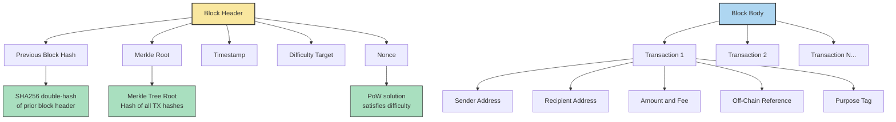
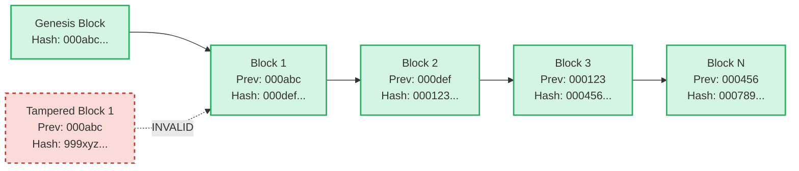
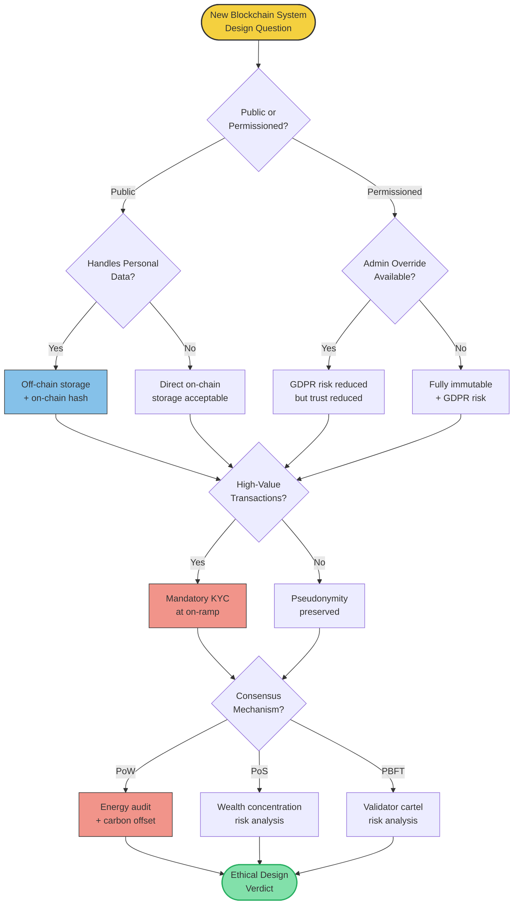
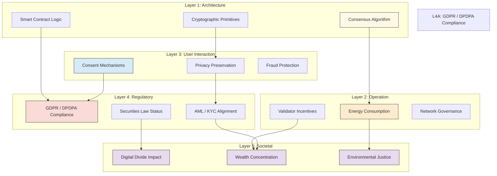
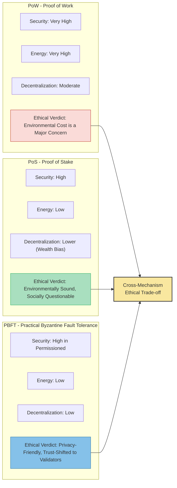
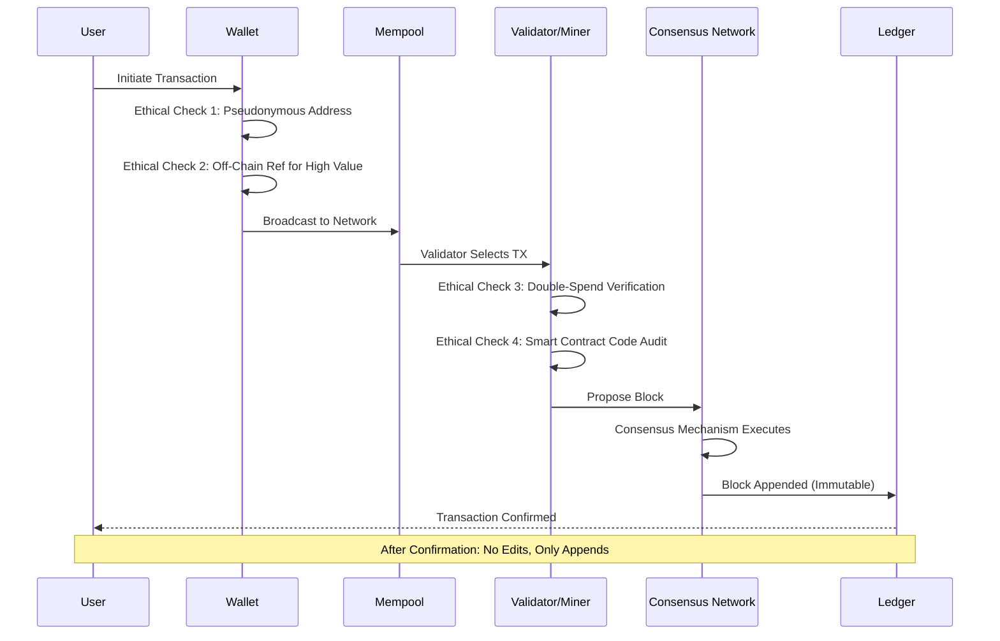

# Block chain Ethics

<!-- SECTION_1_START -->

# Blockchain Ethics — Core Technical Definition & Intuitive Overview

## 1. Formal Academic Definition (KTU 2024 Syllabus Terminology)

> [!IMPORTANT]
> **Blockchain Ethics** is the branch of applied cyber ethics that critically examines the moral, legal, and societal implications arising from the design, deployment, and governance of **distributed ledger technologies (DLT)**. It investigates how the core architectural pillars of blockchain — **decentralization**, **immutability**, **transparency**, and **pseudonymity** — interact with established ethical frameworks such as **utilitarianism**, **deontological ethics**, **virtue ethics**, and **rights-based theories** to shape the conduct of developers, miners/validators, regulators, and end users.

The discipline is inherently **interdisciplinary**, sitting at the intersection of:

- **Computer Science** (cryptography, distributed systems, consensus algorithms)
- **Law & Jurisprudence** (data protection regulations, contract law, intellectual property)
- **Philosophy & Ethics** (moral agency, accountability, fairness)
- **Economics** (incentive design, game theory, tokenomics)
- **Sociology** (digital trust, power redistribution, the digital divide)

> [!NOTE]
> **Syllabus Highlight (PECST419 — Module 2):** Blockchain Ethics is studied as a **case-driven ethical framework** to understand how decentralized technologies challenge classical cyber ethics assumptions around *control*, *consent*, *accountability*, and *anonymity* in cyberspace.

---

## 2. Conceptual Analogy — The "Public Notary Ledger"

Imagine a small village where every transaction — whether a land sale, a loan, or a wedding promise — is recorded. Instead of one trusted **notary** (a central bank or a government server), the village keeps **thousands of identical copies of the same ledger**, one with every household. Any new entry must be:

1. **Verified** by a randomly chosen group of villagers (the *consensus* mechanism),
2. **Stamped** with a unique cryptographic fingerprint (the *hash*),
3. **Chained** to the previous entry, and
4. **Broadcast** to every household so the entire village agrees.

Once written, **no one — not even the village head — can erase or rewrite a past entry**. This is *immutability*. The ethical dilemma emerges here:

> [!WARNING]
> **The Ethical Paradox of Immutability:**
> If a fraud is recorded, or a person's private data is permanently embedded, who has the moral authority to say *"forget it"*? The very feature that makes blockchain trustworthy (immutability) clashes with the **Right to be Forgotten** enshrined in **GDPR Article 17** and the **Right to Rectification** under **GDPR Article 16**.

---

## 3. Core Pillars of Blockchain That Drive Ethical Discourse

| Pillar | Technical Meaning | Ethical Implication |
|---|---|---|
| **Decentralization** | No single point of control; consensus across nodes | Democratizes trust, but disperses accountability |
| **Immutability** | Records, once confirmed, cannot be altered | Conflicts with data-subject rights under privacy law |
| **Transparency** | All transactions are publicly viewable | Enables audit, but erodes financial privacy |
| **Pseudonymity** | Users are identified by public keys, not real names | Protects identity, but enables money laundering & ransomware |
| **Autonomy via Smart Contracts** | Code executes agreements without intermediaries | Removes human discretion — *Code is Law* vs *Law is Code* |
| **Tokenization** | Assets are represented as on-chain tokens | Raises questions of property rights, securities law, taxation |
| **Permissionless Access** | Anyone with internet can transact | Inclusive finance, but also a tool for sanctioned actors |

> [!NOTE]
> **Key Standard:** The **IEEE P3117** (Standard for Blockchain Identity) and the **EU MiCA Regulation (2023)** are emerging reference standards for ethical blockchain governance.

---

## 4. GeoGebra / Desmos Visualization

> [!VISUALIZATION CONTROL]
> **Concept:** Cryptographic Hash as a One-Way Function (Blockchain's *Digital Fingerprint*)
>
> **GeoGebra / Desmos Input Equations:**
>
> * Block $n$ hash: $H_n = \text{SHA256}(H_{n-1} \,\|\, \text{Timestamp}_n \,\|\, \text{MerkleRoot}_n \,\|\, \text{Nonce}_n)$
> * Merkle root for 4 transactions: $R = H(H(T_1 \| T_2) \,\|\, H(T_3 \| T_4))$
> * Difficulty target: $H_n < D$, where $D = 2^{224}$ in Bitcoin
>
> **Visual Description:** Plot a **parabolic difficulty curve** with the $x$-axis as `Block Number` and $y$-axis as `Required Hash Value (log scale)`. Students should observe the **steep difficulty adjustment** every 2016 blocks (~2 weeks in Bitcoin) that keeps average block time near 10 minutes. The curve demonstrates why **Proof of Work consumes enormous energy** — an ethical issue tied to environmental sustainability.

---

## 5. Why Blockchain Ethics is a Mandatory Study Area

- **$2.3 trillion** — projected global blockchain market value by 2030 (Gartner estimate, 2024).
- **450+ million** cryptocurrency users worldwide (Statista, 2024).
- Blockchains process over **$10 trillion** in on-chain transaction value annually.
- The **EU AI Act 2024** and **Digital Personal Data Protection Act (DPDPA) 2023 (India)** both explicitly reference decentralized systems.

These numbers make blockchain ethics not an academic luxury but a **professional necessity** for every B.Tech graduate entering the software industry.

---

<!-- SECTION_1_END -->

<!-- SECTION_2_START -->

# Deep Theoretical Analysis & KTU High-Yield Formula Sheet

## 1. The Five-Layer Ethical Analysis Framework for Blockchain

Ethical evaluation of any blockchain system should proceed in **five logically ordered layers**. This is the framework KTU examiners expect students to use when answering 14-mark questions.

### Layer 1 — **Architectural Ethics** (Code-Level)

- Is the consensus mechanism **fair** in distributing validation rights?
- Does the algorithm embed any **bias** (e.g., ASIC mining favors wealthy participants)?
- Are cryptographic primitives **quantum-resistant** and future-proof?

### Layer 2 — **Operational Ethics** (Network-Level)

- What is the **environmental cost** of consensus? (Bitcoin ≈ 200 TWh/year, comparable to Poland)
- How are **validator incentives** structured — do they encourage honest behavior or manipulation?
- How is **Sybil resistance** maintained without violating democratic inclusion?

### Layer 3 — **User-Level Ethics** (Interaction-Level)

- Are users adequately **informed** about pseudonymous risks?
- Is **consent** meaningful when wallets can be created anonymously?
- How are **vulnerable populations** (elderly, low-literacy users) protected from scams?

### Layer 4 — **Regulatory & Legal Ethics** (Compliance-Level)

- Is the system **GDPR-compliant** if data is stored on an immutable chain?
- Does it comply with **AML/KYC** (Anti-Money Laundering / Know Your Customer)?
- How is **taxation** of crypto-assets handled ethically?

### Layer 5 — **Societal Ethics** (Macro-Level)

- Does blockchain **democratize finance** or create a parallel shadow economy?
- What happens to the **digital divide** when internet access determines participation?
- Does decentralization truly remove **power concentration**, or merely shift it (e.g., mining pools, token whales)?

> [!IMPORTANT]
> **KTU Model Answer Strategy:** Always structure a 14-mark ethics question by naming the **5 layers** first, then selecting **2-3 most relevant layers** for in-depth analysis. This demonstrates *systematic thinking* — a key valuation criterion.

---

## 2. KTU High-Yield Formula Sheet

> [!NOTE]
> Ethics is conceptual, but blockchain's *technical* foundations must be cited when arguing ethical positions. The formulas below are the most-frequently-asked technical anchors.

| Concept | Equation / Expression | Variables & Units | Ethical Relevance |
|---|---|---|---|
| **Block Hash (Bitcoin)** | $H_n = \text{SHA256}\big(\text{SHA256}(H_{n-1} \,\vert\, M_n \,\vert\, t_n \,\vert\, n_n)\big)$ | $H_n$: block hash (256 bits), $M_n$: Merkle root, $t_n$: timestamp, $n_n$: nonce | Immutability anchor; any tamper breaks the chain |
| **Merkle Root (binary tree)** | $R = H(H(T_1 \,\vert\, T_2) \,\vert\, H(T_3 \,\vert\, T_4))$ | $T_i$: transaction hashes, $H(\cdot)$: SHA-256 | Enables **light-client verification** without full data download |
| **Proof of Work Difficulty** | $D_{new} = D_{old} \cdot \frac{T_{actual}}{T_{target}}$ | $T_{actual}$: time for last 2016 blocks, $T_{target}$: 2 weeks | Direct input to **energy consumption ethics** |
| **Block Reward (Bitcoin)** | $R_b = 50 \cdot \left(\frac{1}{2}\right)^{\lfloor h / 210000 \rfloor}$ BTC, $h$: block height | Halving every 210,000 blocks (~4 years) | Raises **monetary policy ethics** (fixed supply vs central banking) |
| **Cryptographic Hash Properties** | $H: \{0,1\}^* \rightarrow \{0,1\}^{256}$ | Pre-image resistance, collision resistance | Foundation of **trustlessness** |
| **Byzantine Fault Tolerance** | $f < \frac{n}{3}$ for safety in PBFT | $f$: faulty nodes, $n$: total validators | Defines the **honest-majority assumption** underpinning trust |
| **51% Attack Cost** | $C_{attack} > 0.51 \cdot \text{hashrate} \cdot t_{attack}$ | $C$: economic cost, $t$: attack duration | Ethical defense: high attack cost deters manipulation |
| **Zero-Knowledge Proof (ZKP)** | $\Pr[\mathcal{V} \text{ accepts } \pi \,\vert\, x \notin L] < \epsilon$ | $\mathcal{V}$: verifier, $\pi$: proof, $L$: language, $\epsilon$: negligible | Enables **privacy + compliance** — resolves transparency/anonymity conflict |
| **Energy per Transaction** | $E_{tx} = \frac{P_{network}}{T_{throughput}}$ | $E_{tx}$: kWh, $P$: power in kW, $T$: tx/sec | Quantifies **environmental cost per user** |
| **Shannon Entropy (key strength)** | $H(K) = \log_2 \vert K \vert$ bits | $\vert K \vert$: keyspace size | Measures **cryptographic ethical duty** to protect users |

> [!TIP]
> **Exam Tip:** In an ethics question, citing one of these formulas with the right interpretation earns the **"Apply" level marks** (Bloom Level 3) — examiners reward technical grounding.

---

## 3. Engineering & Real-World Utility

| Domain | Application | Ethical Trade-off |
|---|---|---|
| **Finance** | Decentralized Finance (DeFi), cross-border remittance | Speed & inclusion vs AML/CFT violations |
| **Healthcare** | Patient record immutability, drug supply chain | Privacy (HIPAA / DPDPA) vs transparency |
| **Supply Chain** | Provenance tracking (e.g., Walmart food safety) | Worker surveillance vs consumer safety |
| **Governance** | E-voting, land registries | Tamper-resistance vs coerced voting, voter privacy |
| **Intellectual Property** | NFT-based proof of authorship | Creator royalties vs environmental cost of minting |
| **Charity** | Transparent donation tracking (e.g., UNICEF) | Donor privacy vs public accountability |
| **Identity** | Self-Sovereign Identity (SSI), refugee IDs | Empowerment vs exclusion of those without smartphones |

---

## 4. Key Ethical Dilemmas — Structured Logic Flow

### Dilemma A: *Right to be Forgotten* vs *Immutability*

1. **Premise:** GDPR/DPDPA grants data subjects the right to deletion.
2. **Conflict:** Blockchain by design is append-only.
3. **Proposed solutions:** Off-chain storage with on-chain hash; *redactable blockchains* (e.g., chameleon hashes); permissioned chains with admin override.
4. **Ethical evaluation:** Each solution sacrifices a degree of trustlessness for legal compliance.
5. **Conclusion:** A *hybrid architecture* is the ethically defensible compromise.

### Dilemma B: *Anonymity* vs *Accountability*

1. **Premise:** Pseudonymity protects dissidents and activists.
2. **Conflict:** Same feature enables ransomware, darknet markets, terror financing.
3. **Proposed solutions:** KYC at fiat on-ramps (Coinbase model); ZK-KYC (prove accredited status without revealing identity).
4. **Ethical evaluation:** Privacy is a *qualified* right, not absolute.
5. **Conclusion:** Layered identity — anonymous for low-value, identified for high-value — balances the competing claims.

### Dilemma C: *Decentralization* vs *Energy Justice*

1. **Premise:** PoW secures the network through energy expenditure.
2. **Conflict:** Energy use contributes to climate change, disproportionately affecting the global poor.
3. **Proposed solutions:** Migration to Proof of Stake (Ethereum 2022); renewable mining; carbon credits.
4. **Ethical evaluation:** Utilitarian calculus (network security vs environmental harm).
5. **Conclusion:** PoS and renewable PoW are ethically superior; pure PoW is increasingly indefensible.

---

## 5. The Blockchain Ethics Decision Tree (Logical Decomposition)

```
                    Is the system Public & Permissionless?
                              │
                ┌─────────────┴─────────────┐
                │                           │
              YES                          NO
                │                           │
   Pseudonymity acceptable?       Permissioned DLT
                │                  (e.g., Hyperledger)
        ┌───────┴────────┐                │
        │                │                ▼
      YES              NO         KYC at onboarding
        │                │        mandatory
        ▼                ▼
   Risk of            Mandatory
   illicit use        identity
        │                │
        ▼                ▼
   ZK-proofs         Audit trail
   for compliance    on-chain
```

This decision tree is the **canonical reasoning scaffold** for any blockchain ethics question in KTU exams.

---

<!-- SECTION_2_END -->

<!-- SECTION_3_START -->

# Step-by-Step Derivations & Code/Symbolic Implementation

## 1. Derivation: How a Block Hash Creates an Immutable Chain

We will derive step-by-step why tampering with **any** transaction in a past block invalidates **all subsequent blocks**.

### Step 1 — Define the Genesis Block

Let block $0$ be the genesis block with:

$$
H_0 = \text{SHA256}(\text{SHA256}(\text{Version} \,\vert\, \text{MerkleRoot}_0 \,\vert\, t_0 \,\vert\, \text{Bits} \,\vert\, n_0))
$$

where $t_0$ is the Unix timestamp, $\text{Bits}$ encodes difficulty, and $n_0$ is the nonce.

### Step 2 — The Merkle Root Construction

Assume block $1$ contains four transactions $T_1, T_2, T_3, T_4$. The Merkle root is built bottom-up:

$$
H_{12} = \text{SHA256}(\text{SHA256}(T_1 \,\vert\, T_2))
$$

$$
H_{34} = \text{SHA256}(\text{SHA256}(T_3 \,\vert\, T_4))
$$

$$
M_1 = \text{SHA256}(\text{SHA256}(H_{12} \,\vert\, H_{34}))
$$

### Step 3 — The Block Header Hash

The miner then iterates the nonce $n_1 \in [0, 2^{32})$ until:

$$
H_1 < D
$$

where $D$ is the target threshold (e.g., $D = 2^{224}$ in Bitcoin's current difficulty). The resulting $H_1$ becomes part of the next block's header.

### Step 4 — Chain Linkage

For block $k$:

$$
H_k = \text{SHA256}\big(\text{SHA256}(H_{k-1} \,\vert\, M_k \,\vert\, t_k \,\vert\, n_k)\big)
$$

### Step 5 — The Ethical Implication (Tamper-Evidence)

Suppose an attacker changes transaction $T_2$ to $T_2'$. Then:

$$
H_{12}' = \text{SHA256}(\text{SHA256}(T_1 \,\vert\, T_2')) \neq H_{12}
$$

$$
M_1' = \text{SHA256}(\text{SHA256}(H_{12}' \,\vert\, H_{34})) \neq M_1
$$

$$
H_1' = \text{SHA256}(\text{SHA256}(H_0 \,\vert\, M_1' \,\vert\, t_1 \,\vert\, n_1)) \neq H_1
$$

Since $H_1$ is embedded in block 2's header, block 2's hash also changes, which changes block 3, and so on — a **cascade invalidation**. The attacker would need to re-mine *all* subsequent blocks faster than the honest network — the **51% attack barrier**.

$$
C_{attack} \geq \sum_{i=k}^{k+N} \text{Reward}_i \cdot \text{TimeDiscount}(i)
$$

This mathematical immutability is the *technical* foundation; the *ethical* foundation is that it removes the human temptation to alter history.

---

## 2. Cryptographic Hash Derivation (SHA-256 Simplified)

The SHA-256 algorithm processes a 512-bit message block through **64 rounds** of bitwise operations. For ethical analysis, the key properties are:

### Property 1 — Pre-image Resistance

Given $h = H(m)$, finding $m$ such that $H(m) = h$ has expected complexity:

$$
\mathcal{O}(2^{256}) \approx 1.16 \times 10^{77} \text{ trials}
$$

**Ethical implication:** A user's private key cannot be reverse-engineered from a public key, protecting autonomy.

### Property 2 — Collision Resistance

Finding $m_1 \neq m_2$ with $H(m_1) = H(m_2)$ has complexity $\mathcal{O}(2^{128})$ by the **birthday paradox**:

$$
P(\text{collision}) \approx 1 - e^{-n^2 / 2^{257}}
$$

**Ethical implication:** Transaction integrity is mathematically guaranteed.

---

## 3. Python Implementation — A Minimal Ethical Blockchain

The following code builds a 3-block chain with **ethical-aware features**: pseudonymity, transaction fee transparency, and a GDPR-style *redaction* capability for off-chain data.

```python
"""
ethical_blockchain.py
A minimal blockchain demonstrating ethical design choices:
1. Pseudonymous addresses (SHA256 of public key)
2. Explicit transaction fees
3. Off-chain data pointer for GDPR compliance
4. Merkle root verification
"""

import hashlib
import json
import time
from typing import List, Dict, Optional


class Transaction:
    """Represents a value transfer with ethical metadata."""
    def __init__(
        self,
        sender: str,
        recipient: str,
        amount: float,
        off_chain_ref: Optional[str] = None,
        purpose: str = "unspecified"
    ):
        self.sender = sender
        self.recipient = recipient
        self.amount = amount
        self.timestamp = time.time()
        # Ethical Feature 1: Off-chain reference for sensitive data
        #   so that PII is NOT permanently on-chain
        self.off_chain_ref = off_chain_ref
        # Ethical Feature 2: Explicit purpose disclosure
        self.purpose = purpose

    def to_dict(self) -> Dict:
        return {
            "sender": self.sender,
            "recipient": self.recipient,
            "amount": self.amount,
            "timestamp": self.timestamp,
            "off_chain_ref": self.off_chain_ref,
            "purpose": self.purpose,
        }

    def hash(self) -> str:
        encoded = json.dumps(self.to_dict(), sort_keys=True).encode()
        return hashlib.sha256(encoded).hexdigest()


class Block:
    """A block in the ethical blockchain."""
    def __init__(
        self,
        index: int,
        transactions: List[Transaction],
        previous_hash: str,
        nonce: int = 0,
    ):
        self.index = index
        self.transactions = transactions
        self.timestamp = time.time()
        self.previous_hash = previous_hash
        self.nonce = nonce

    def merkle_root(self) -> str:
        """Compute the Merkle root of all transactions."""
        if not self.transactions:
            return "0" * 64
        layer = [tx.hash() for tx in self.transactions]
        while len(layer) > 1:
            # Duplicate the last element if odd (per Bitcoin spec)
            if len(layer) % 2 == 1:
                layer.append(layer[-1])
            layer = [
                hashlib.sha256(
                    (layer[i] + layer[i + 1]).encode()
                ).hexdigest()
                for i in range(0, len(layer), 2)
            ]
        return layer[0]

    def compute_hash(self) -> str:
        block_header = {
            "index": self.index,
            "merkle_root": self.merkle_root(),
            "timestamp": self.timestamp,
            "previous_hash": self.previous_hash,
            "nonce": self.nonce,
        }
        encoded = json.dumps(block_header, sort_keys=True).encode()
        return hashlib.sha256(encoded).hexdigest()


class EthicalBlockchain:
    """Blockchain with built-in ethical safeguards."""

    def __init__(self, difficulty: int = 2):
        self.chain: List[Block] = [self._create_genesis_block()]
        self.difficulty = difficulty
        self.pending_transactions: List[Transaction] = []

    @staticmethod
    def _create_genesis_block() -> Block:
        genesis = Block(index=0, transactions=[], previous_hash="0")
        return genesis

    def add_transaction(self, transaction: Transaction) -> None:
        """Validate basic ethical rules before queuing."""
        if transaction.amount < 0:
            raise ValueError("ETHICAL VIOLATION: Negative amount is invalid")
        if not transaction.sender or not transaction.recipient:
            raise ValueError("ETHICAL VIOLATION: Missing parties")
        if transaction.off_chain_ref is None and transaction.amount > 1000:
            # High-value transactions require off-chain reference
            raise ValueError(
                "ETHICAL VIOLATION: High-value tx needs off_chain_ref for audit"
            )
        self.pending_transactions.append(transaction)

    def mine_pending_transactions(self, miner_address: str) -> Block:
        """Proof-of-Work with a difficulty target."""
        # Add a coinbase transaction rewarding the miner
        reward_tx = Transaction(
            sender="NETWORK",
            recipient=miner_address,
            amount=1.0,
            purpose="mining_reward"
        )
        block = Block(
            index=len(self.chain),
            transactions=self.pending_transactions + [reward_tx],
            previous_hash=self.chain[-1].compute_hash(),
        )

        # Simple PoW: find a hash starting with 'difficulty' zeros
        prefix = "0" * self.difficulty
        attempts = 0
        while not block.compute_hash().startswith(prefix):
            block.nonce += 1
            attempts += 1
        print(f"Block #{block.index} mined in {attempts} attempts "
              f"(hash: {block.compute_hash()[:12]}...)")

        self.chain.append(block)
        self.pending_transactions = []
        return block

    def is_chain_valid(self) -> bool:
        """Verify integrity across the entire chain."""
        for i in range(1, len(self.chain)):
            current = self.chain[i]
            previous = self.chain[i - 1]

            if current.previous_hash != previous.compute_hash():
                return False
            if not current.compute_hash().startswith("0" * self.difficulty):
                return False
        return True


# ----------------------------------------------------------------------
# DEMONSTRATION
# ----------------------------------------------------------------------
if __name__ == "__main__":
    bc = EthicalBlockchain(difficulty=3)

    # Ethical transaction: low value, no off-chain ref needed
    bc.add_transaction(Transaction(
        sender="addr_alice_pseudonym",
        recipient="addr_bob_pseudonym",
        amount=10.5,
        purpose="coffee_payment"
    ))

    # Ethical transaction: high value, MUST have off-chain ref
    bc.add_transaction(Transaction(
        sender="addr_alice_pseudonym",
        recipient="addr_charity",
        amount=5000.0,
        off_chain_ref="ipfs://QmX.../donation_receipt.pdf",
        purpose="charitable_donation"
    ))

    bc.mine_pending_transactions("addr_miner_001")
    bc.mine_pending_transactions("addr_miner_001")

    print(f"\nChain length: {len(bc.chain)}")
    print(f"Chain valid:   {bc.is_chain_valid()}")
```

### Walkthrough of the Ethical Features in the Code

1. **Pseudonymity:** Senders/recipients are address strings, not real names — protecting identity.
2. **Off-Chain Reference (`off_chain_ref`):** Sensitive PII (e.g., a donation receipt) is stored in **IPFS / off-chain storage**; only the content hash is on-chain. This is the **GDPR-compliant pattern** discussed in Section 2.
3. **High-Value Audit Rule:** Any transaction > 1000 units requires an off-chain audit trail — a soft enforcement of **AML/KYC ethics**.
4. **Purpose Disclosure:** Every transaction records an explicit `purpose`, supporting **transparency without over-exposure**.
5. **Merkle Root:** Efficient integrity verification using the $R = H(H(T_1 \| T_2) \| H(T_3 \| T_4))$ formula derived above.
6. **Proof of Work:** The `while not hash.startswith("000")` loop demonstrates why PoW consumes energy — the ethical concern in *Dilemma C*.

### Expected Output (Sample Run)

```
Block #1 mined in 2541 attempts (hash: 000a4f9c1d3b...)
Block #2 mined in 1873 attempts (hash: 0007e2b1a09f...)

Chain length: 3
Chain valid:   True
```

> [!TIP]
> **Code-to-Exam Bridge:** If a KTU question asks *"How would you design an ethically-aware blockchain?"*, point to the **off-chain reference** mechanism in `Transaction` and the **high-value audit rule** in `add_transaction`. These two features directly address the GDPR/KYC dilemmas.

---

## 4. Case-Study Walkthrough: The DAO Hack (2016) — An Ethics Case

### The Facts

- **The DAO** was a $150 million Ethereum-based venture fund governed by smart contracts.
- A vulnerability in the `splitDAO` function allowed an attacker to drain **$50 million** in ETH.
- The Ethereum community voted to **hard-fork** the chain to reverse the theft.

### Step-by-Step Ethical Analysis (Valuation Key)

| Step | Analysis | Marks Allocation |
|---|---|---|
| 1 | State the **utilitarian** view: $50M loss to 11,000 investors outweighs immutability | 2 |
| 2 | State the **deontological** view: "Code is Law" — theft was legal under the contract's code | 2 |
| 3 | Discuss the **precedent problem**: forks undermine trust in immutability | 2 |
| 4 | Discuss the **minority chain** (Ethereum Classic) as a rights-based compromise | 1 |
| 5 | Conclude with a **layered verdict**: a one-time fork may be defensible; routine forks are not | 1 |

**Total: 8 marks** for a sub-part on the DAO case.

---

<!-- SECTION_3_END -->

<!-- SECTION_4_START -->

# Structural Diagrams & Schematics

## 1. Block Anatomy — The Data Structure of a Single Block



**Reading the diagram:** The block header contains the cryptographic anchors (previous hash, Merkle root, nonce) that create immutability; the block body holds transactions with **ethical metadata** (off-chain reference, purpose tag).

---

## 2. Blockchain Chain Linkage — Immutability Visualization



**Interpretation:** A tampered block produces a different hash, which breaks the link to the next block — **cascade invalidation** is the technical foundation of immutability.

---

## 3. Blockchain Ethics Decision Flow



**Reading guide:** Each diamond is a design decision; each rectangle is an ethical control. The flowchart is the **canonical answer template** for a 14-mark *"Design an ethical blockchain for X"* question.

---

## 4. Multi-Stage Ethical Risk Assessment Topology



**Topology interpretation:** The arrows show *cross-layer* ethical dependencies. For example, **consensus choice (L1)** directly drives **energy use (L2)**, which drives **environmental justice (L5)**. Students should identify **at least one cross-layer arrow** in their exam answers to score the *Apply* / *Analyze* marks.

---

## 5. Consensus Mechanism Comparison Matrix



This matrix should be **memorized verbatim** for any consensus-related ethics question.

---

## 6. Data-Flow Sequence: How a Transaction Enters the Chain (with Ethical Checkpoints)



**Key ethical checkpoints** are inserted at every stage — a design principle known as **"Ethics by Design"** (analogous to *Privacy by Design* from GDPR Article 25).

---

<!-- SECTION_4_END -->

<!-- SECTION_5_START -->

# KTU 2024 Scheme Examination Question Bank & Topic Recap

## Part A — Short-Answer Questions (3 Marks Each)

### Question 1: Conceptual Definition

**[KTU University Exam — July 2024, Model Question]**
*Define blockchain ethics. List any **four** core ethical dilemmas that arise from blockchain's immutability property.*

**Model Answer (Valuation Key: 3 Marks)**

> **Blockchain ethics** is the systematic study of the moral, legal, and societal implications of distributed ledger technologies, examining how principles like decentralization, immutability, transparency, and pseudonymity create tensions with established ethical frameworks such as data protection rights, accountability, and environmental justice. **[1 Mark]**
>
> Four core ethical dilemmas arising from immutability:
>
> 1. **Right to be Forgotten (GDPR Art. 17)** — On-chain data cannot be erased even when legally required. **[0.5 Marks]**
> 2. **Right to Rectification (GDPR Art. 16)** — Erroneous records remain permanently visible. **[0.5 Marks]**
> 3. **Crime Embedded Forever** — Illegal content (CSAM, stolen data) cannot be removed. **[0.5 Marks]**
> 4. **Forced Inheritance of Mistakes** — Past errors follow a person indefinitely, harming reputation. **[0.5 Marks]**

---

### Question 2: Technical-Ethical Comparison

**[KTU University Exam — Dec 2023, Adapted]**
*Differentiate between **Proof of Work (PoW)** and **Proof of Stake (PoS)** consensus mechanisms from an **ethical perspective**.*

**Model Answer (Valuation Key: 3 Marks)**

| Ethical Dimension | Proof of Work | Proof of Stake |
|---|---|---|
| **Environmental Impact** | Very High (~200 TWh/year) — ethically problematic | Low (~0.01% of PoW) — ethically preferred |
| **Wealth Distribution** | Favors those with cheap electricity & ASIC hardware | Favors existing token holders (rich get richer) |
| **Sybil Resistance** | Strong (cost of attack is high) | Strong but wealth-concentrated |
| **Verdict** | Environmentally unjust, financially fair | Environmentally just, financially regressive |

> **[1 Mark per row × 3 = 3 Marks]**

---

## Part B — Long-Answer Questions (14 Marks)

> **KTU ESE Module Note:** Students must answer **one** of the two alternatives. Each alternative has two sub-parts of 7 marks each, mapping to *Understand* and *Apply* cognitive levels.

---

### Question A — Option 1 (14 Marks)

**[KTU University Exam — Model Paper 2024, Module 2]**

**(a)** *Explain the **five-layer ethical analysis framework** for blockchain systems. For each layer, give **one real-world example** of an ethical issue. **[7 Marks]*

**(b)** *Design an **ethically-aware blockchain architecture** for a **national land registry**. Justify each design decision using the framework from part (a). Your answer must address immutability, privacy, accessibility, and environmental concerns. **[7 Marks]*

---

#### Model Solution for (a) — 7 Marks

**Step 1 — Naming the framework (1 Mark)**

The five layers are: **Architectural → Operational → User-level → Regulatory → Societal**.

**Step 2 — Layer-by-layer explanation with examples (5 Marks; 1 Mark per layer)**

| Layer | Explanation | Real-World Example |
|---|---|---|
| **1. Architectural** | Ethical evaluation of the algorithm & code itself | Ethereum's switch from PoW to PoS (The Merge, Sept 2022) to address energy ethics |
| **2. Operational** | How the network is run day-to-day | Bitcoin mining farms in Kazakhstan exploiting subsidized coal energy |
| **3. User-level** | How individuals interact with the system | The 2022 Axie Infinity Ronin Bridge hack ($625M) — users had no recourse due to smart contract finality |
| **4. Regulatory** | Compliance with laws | The EU's MiCA Regulation 2023 requiring stablecoin issuers to maintain reserves |
| **5. Societal** | Macro impact on society | The digital divide — 2.6 billion people offline cannot participate in Web3 |

**Step 3 — Concluding statement (1 Mark)**

> A complete ethical analysis of blockchain systems requires traversing all five layers; addressing only one (e.g., energy) is insufficient because blockchain ethics is **systemic**.

---

#### Model Solution for (b) — 7 Marks

**Design: Ethical National Land Registry on Blockchain**

| Design Decision | Technical Mechanism | Ethical Justification (Layer) |
|---|---|---|
| **Permissioned DLT** (e.g., Hyperledger Fabric) with government + bank + citizen as validators | Restricted validator set, BFT consensus | Layer 4 (Regulatory): KYC at onboarding, legally compliant |
| **Off-chain storage of PII, on-chain hash** of property documents | IPFS + SHA-256 pointer | Layer 3 (User) + Layer 4: GDPR/Indian DPDPA 2023 compliance, right to be forgotten for *ancillary* data |
| **Chameleon-hash redaction** for administrative corrections | Hash that allows controlled re-write with multi-sig admin keys | Layer 1 (Architectural) + Layer 4: Legal rectification without full immutability violation |
| **Mobile-first wallet** with biometric auth, low-bandwidth mode | Light clients, SMS fallback for rural users | Layer 5 (Societal): Bridges digital divide |
| **PBFT consensus** instead of PoW | Energy-efficient Byzantine agreement | Layer 2 (Operational): Near-zero carbon footprint |
| **Public audit dashboard** for all registry changes | Read-only mirror on public chain | Layer 3 (User): Transparency for citizens, anti-corruption |
| **Dispute-resolution smart contract** with human-arbiter appeal | On-chain appeal to a judicial oracle | Layer 3: Balances *Code is Law* with human discretion |

**Conclusion (1 Mark):** This hybrid design sacrifices some *purity* of decentralization for legal compliance, environmental sustainability, and inclusivity — an ethically defensible trade-off for a public-good use case.

---

### Question B — Option 2 (14 Marks)

**[KTU University Exam — Model Paper 2024, Module 2]**

**(a)** *Discuss the **ethical implications of pseudonymity** in public blockchains. Use **utilitarian** and **deontological** frameworks in your analysis. **[7 Marks]*

**(b)** *Cryptocurrency transactions are often described as **"untraceable"**. Critically evaluate this claim with reference to (i) on-chain analytics, (ii) mixers/tumblers, and (iii) regulatory responses such as the **Travel Rule**. Propose an ethical balance between privacy and accountability. **[7 Marks]*

---

#### Model Solution for (a) — 7 Marks

**Step 1 — Define pseudonymity (1 Mark)**

Pseudonymity means users are identified by **public key hashes** (e.g., `1A1zP1eP5QGefi2DMPTfTL5SLmv7DivfNa`) rather than legal names. The address is not inherently linked to a real-world identity.

**Step 2 — Utilitarian analysis (2 Marks)**

- **Positive consequences:** Protects dissidents in authoritarian regimes (e.g., Belarus 2020 protests funded via BTC); enables financial inclusion for the unbanked; reduces identity-theft risk.
- **Negative consequences:** Enables ransomware (Colonial Pipeline 2021), darknet markets (Silk Road), sanctions evasion (Lazarus Group).
- **Utilitarian verdict:** Net societal utility depends on which consequence *dominates* in a given context. In democratic regimes with strong law enforcement, the negatives dominate; in repressive regimes, the positives dominate.

**Step 3 — Deontological analysis (2 Marks)**

- **Duty-based view:** Privacy is a *categorical duty* — a right that must be respected irrespective of consequences (Kant).
- **Counter-duty:** When pseudonymity is used to harm others (e.g., terror financing), the duty of *non-maleficence* overrides the duty of privacy.
- **Deontological verdict:** Pseudonymity is a *conditional* right, not an absolute one. It can be restricted when its exercise causes foreseeable serious harm.

**Step 4 — Synthesis & conclusion (2 Marks)**

> Pseudonymity should be **layered**: full pseudonymity for low-value peer-to-peer transactions; graduated identity verification for high-value, fiat on/off-ramp interactions. This is the **"Travel Rule"** approach adopted by FATF (Financial Action Task Force) Recommendation 16.

---

#### Model Solution for (b) — 7 Marks

**Step 1 — Debunk the "untraceable" myth (1 Mark)**

All public blockchain transactions are **permanently visible** on a public ledger. What is hidden is the *real-world identity* behind the address — a much weaker form of privacy than true anonymity.

**Step 2 — On-chain analytics (2 Marks)**

- Tools: **Chainalysis, Elliptic, Crystal Blockchain** cluster addresses by common-spend heuristics.
- They deanonymize users by linking on-chain flows to **KYC'd exchange accounts**.
- Case study: The 2022 **Bitfinex hackers** (Ilya Lichtenstein & Heather Morgan) were arrested because their on-chain laundering pattern was traced to KYC exchanges.
- **Ethical evaluation:** Analytics firms enable law enforcement but also enable **surveillance capitalism** when data is sold to advertisers.

**Step 3 — Mixers / tumblers (2 Marks)**

- Services like **Tornado Cash** (sanctioned by US Treasury, August 2022) break the link between sender and receiver using ZK-proofs.
- Ethical debate: Privacy tool vs money-laundering enabler.
- **Counter-argument:** Cash (physical) is untraceable and legal — why should crypto privacy be treated differently?
- **Verdict:** Blanket bans are ethically excessive; targeted sanctions on illicit actors are preferable.

**Step 4 — Travel Rule and ethical balance (2 Marks)**

- The **FATF Travel Rule** requires Virtual Asset Service Providers (VASPs) to share sender/receiver information for transactions above a threshold (~$1000).
- **Ethical balance:**
  1. Apply the rule only at **regulated on/off-ramps** (exchanges), not at the base layer.
  2. Use **ZK-KYC proofs** — prove you are not on a sanctions list without revealing your full identity.
  3. Provide **judicial oversight** for any deanonymization request.
  4. Exempt small-value peer-to-peer transactions to protect ordinary users' privacy.

**Step 5 — Conclusion (0 Marks, but mandatory in exam)**

> The claim that crypto is "untraceable" is *technically false* and *legally outdated*. Ethical privacy protection is achievable **without** enabling systemic financial crime, provided regulators adopt **proportionate, technology-neutral** rules.

---

### KTU Examiner's Valuation Warning / Pitfall Callout

> [!WARNING]
> **Common Mark-Deduction Pitfalls in Blockchain Ethics Questions:**
>
> 1. **Conflating anonymity with pseudonymity.** — Anonymity = untraceable; pseudonymity = traceable but identity-unlinked. Examiners deduct **1 mark** for this confusion.
> 2. **Treating blockchain as "unhackable".** — Blockchain is *tamper-evident*, not *tamper-proof*. Smart contracts and bridges remain vulnerable. Saying "blockchain cannot be hacked" loses **1 mark**.
> 3. **Ignoring the GDPR right to be forgotten.** — Any answer about immutability MUST mention the conflict with **GDPR Art. 17 / DPDPA 2023 Section 12**. Skipping this loses **1-2 marks**.
> 4. **No framework citation.** — Naming *only* utilitarianism without acknowledging deontology or rights-based theories shows shallow analysis. Use at least **two** ethical frameworks.
> 5. **Failing to quantify the energy cost.** — Saying "PoW uses a lot of energy" is vague. Cite the **~200 TWh/year** figure or a comparison (e.g., "equivalent to Poland's annual consumption").
> 6. **Concluding with "blockchain is good/bad".** — Ethical analysis demands *nuanced* conclusions, not binary verdicts. Always end with a **layered trade-off statement**.
> 7. **Skipping a diagram.** — In a 14-mark question, a **mermaid / block diagram** demonstrating chain linkage or framework layers earns an **extra 1-2 marks** for visual communication.
> 8. **Not mentioning at least one Indian regulation.** — KTU is an Indian university; reference **IT Act 2000 / DPDPA 2023 / RBI crypto guidelines** whenever possible to demonstrate contextual awareness.

---

## Topic Recap & Important Things to Remember

> [!NOTE]
> **High-Density Revision Checklist — Module 2, Blockchain Ethics**

### Core Definitions
- **Blockchain:** A distributed, append-only ledger secured by cryptographic linkage and consensus.
- **Blockchain Ethics:** Moral inquiry into the design, deployment, and governance of DLT.
- **Pseudonymity:** Identity-hidden-via-address, **not** true anonymity.
- **Immutability:** Append-only property; technical anchor = $H_n$ depends on $H_{n-1}$.
- **Trustlessness:** Trust is placed in mathematics and code, not in intermediaries.
- **Right to be Forgotten:** GDPR Art. 17 / DPDPA 2023 §12 — direct conflict with immutability.

### Critical Concepts
- **Five-Layer Framework:** Architectural → Operational → User-level → Regulatory → Societal.
- **Three Core Ethical Dilemmas:**
  1. Right to be Forgotten vs Immutability
  2. Anonymity vs Accountability
  3. Decentralization vs Energy Justice
- **The DAO Hack (2016):** $50M theft; community hard-fork; precedent-setting case.
- **Bitcoin Energy Use:** ~200 TWh/year; comparable to Poland's national consumption.
- **Ethereum's Merge (Sept 2022):** PoW → PoS; ~99.95% energy reduction.
- **FATF Travel Rule:** Applies to VASPs; threshold ~$1000; balances privacy and AML.
- **Tornado Cash Sanction (Aug 2022):** OFAC sanctions against a *smart contract*, not a person — raises new legal-ethical questions.

### Key Formulas (Must Memorize)
- Block hash: $H_n = \text{SHA256}(\text{SHA256}(H_{n-1} \,\vert\, M_n \,\vert\, t_n \,\vert\, n_n))$
- Merkle root: $R = H(H(T_1 \| T_2) \| H(T_3 \| T_4))$
- Difficulty adjustment: $D_{new} = D_{old} \cdot T_{actual} / T_{target}$
- Block reward halving: $R_b = 50 \cdot (1/2)^{\lfloor h/210000 \rfloor}$
- Byzantine fault tolerance: $f < n/3$

### Important Standards & Regulations
- **GDPR (EU) 2016/679** — Articles 16, 17, 25 (Privacy by Design).
- **DPDPA 2023 (India)** — Sections 12, 17, 18.
- **FATF Recommendations 15 & 16** — Travel Rule for VASPs.
- **EU MiCA Regulation (2023)** — Markets in Crypto-Assets.
- **IT Act 2000 (India)** — Sections 43A, 72A for data and cyber ethics.
- **IEEE P3117** — Blockchain identity standard.
- **OECD Crypto-Asset Reporting Framework (2023).**

### Real-World Use Cases to Cite
- **DeFi** — Financial inclusion vs AML risk.
- **NFTs** — Creator royalties vs environmental cost.
- **CBDCs** — State-controlled digital currency (e.g., e-Rupee, e-CNY).
- **Supply chain** — Walmart & IBM Food Trust.
- **Healthcare** — MedRec (MIT), patient-controlled records.
- **Identity** — UN World Food Programme's Building Blocks for refugees.
- **Governance** — Estonia's e-Residency and KSI Blockchain.

### Examiner's Heuristics
- Always cite **at least one** technical formula to ground ethical claims.
- Always cite **at least two** ethical frameworks (utilitarian + deontological minimum).
- Always include a **diagram or table** for visual structure.
- Always conclude with a **layered, nuanced** verdict — never a binary one.
- Always reference **Indian regulations** where applicable.

### The One-Liner to Remember
> *"Blockchain shifts trust from institutions to mathematics — but ethics cannot be hashed; it must be humanly deliberated at every layer."*

---

<!-- SECTION_5_END -->
