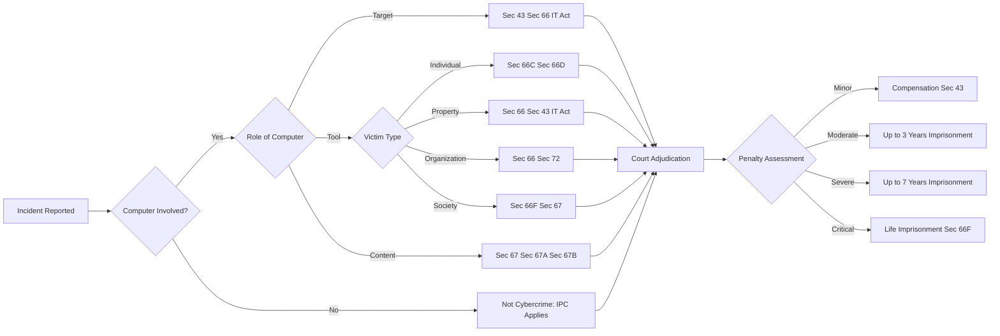
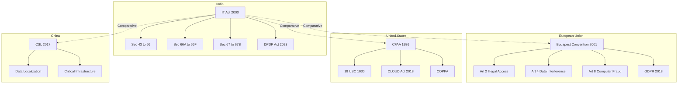
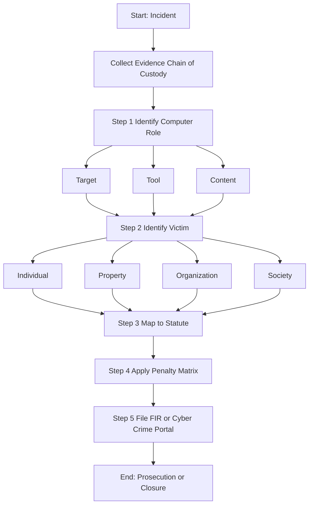

# Classifications of Cybercrime

<!-- SECTION_1_START -->
# Classifications of Cybercrime — Foundational Overview

## 1.1 Formal Academic Definition

> [!IMPORTANT]
> **Cybercrime** refers to any criminal offense, civil wrong, or prohibited act in which a **computer system, network, or digital device** is either the **object of the offense**, the **instrument used to commit the offense**, or serves as the **repository** for evidentiary material relating to the offense. The *classification* of cybercrime is the systematic taxonomy used by **legal scholars, law enforcement agencies (e.g., INTERPOL, CBI, FBI), and cyber jurisprudence frameworks** to categorize offenses based on **target, motive, mechanism, and impact**.

In the **KTU 2024 Scheme (PECST419 — Cyber Ethics, Privacy and Legal Issues)**, the classification of cybercrime is the foundational lens through which Module 2 examines the **intersection of technology, ethics, and law**. A robust classification enables engineers, policymakers, and security professionals to map technical incidents to **specific provisions of the IT Act 2000 (India)**, the **Indian Penal Code (IPC)**, and international instruments like the **Budapest Convention on Cybercrime (2001)**.

## 1.2 Conceptual Analogy & Intuitive Understanding

> [!NOTE]
> **Real-World Analogy: "The Digital Mirror of Physical Crime"**
>
> Imagine a city with traditional police stations. Crimes are categorized by **type** — theft, assault, fraud, vandalism. Each category has dedicated investigators, specific laws, and defined penalties. Cybercrime classification works identically, except the "city" is the internet, the "weapons" are packets of data, and the "police stations" are **Cyber Crime Cells, CERT-In (India), and the Cyber Appellate Tribunal**.
>
> Just as a physical bank robbery is classified under *robbery/dacoity* because of the **act and intent**, a digital heist of a cryptocurrency wallet is classified under *cybercrime against property* because of the **mechanism (network intrusion) and the object (digital assets)**. The classification is what determines **jurisdiction, severity, and remediation**.

## 1.3 Physical Constants and Standard Metrics

> [!TIP]
> **Three Pillars of Cybercrime Classification (per Halder & Jaishankar — 2011 Cybercrime Taxonomy Framework):**
> - **Target** — Who or what is harmed?
> - **Tool** — What technology was used?
> - **Motive** — What was the intent?
>
> **Indian Statutory Anchor:** The **Information Technology Act, 2000 (amended 2008)** is the primary statute, with **66 sections** addressing cyber offenses, supported by the **Indian Penal Code (IPC), 1860** and the **Indian Evidence Act, 1872**.

## 1.4 Visualization Control — Conceptual Map

> [!VISUALIZATION CONTROL]
> **Concept:** Hierarchical Taxonomy of Cybercrime
> **GeoGebra / Desmos Input Equations:**
> * Level 1: `f(x) = ROOT("Cybercrime")`
> * Level 2 branches: `g1(x) = "Against Individuals"`, `g2(x) = "Against Property"`, `g3(x) = "Against Organization"`, `g4(x) = "Against Society"`
> * Level 3 leaves: `h_{ij}(x) = Sub-types under each branch`
> **Visual Description:** The student should observe a **tree structure** rooted at *Cybercrime* with **four primary branches**, each splitting into 4–6 leaf nodes representing specific offense types. Color coding is recommended — **red for personal crimes, blue for property crimes, green for organizational crimes, and yellow for societal crimes**.

## 1.5 Why Classification Matters in KTU 2024 Curriculum

Under the **NEP 2020 Outcome-Based Education (OBE)** framework, classification equips the B.Tech graduate to:
- **CO1 (Remember/Understand):** Identify and recall the categories of cybercrime.
- **CO2 (Apply):** Map real-world incidents to legal statutes.
- **CO3 (Analyze):** Distinguish between overlapping categories (e.g., phishing as both *fraud* and *identity theft*).
- **CO4 (Evaluate):** Justify classification choices for ambiguous cases.

> [!NOTE]
> **Module 2 Highlight:** The IT Act, 2000 (India) uses a **computer-centric** classification, while the **Budapest Convention** uses an **offense-centric** classification. KTU examiners frequently test this dichotomy.

<!-- SECTION_1_END -->

<!-- SECTION_2_START -->
# Deep Theoretical Analysis & KTU High-Yield Reference Sheet

## 2.1 The Three Foundational Classification Models

Cybercrime classification is approached through **three dominant models** globally, each with distinct theoretical underpinnings. Understanding these models is **essential for 14-mark questions** in KTU ESE.

### Model A — Classification by Role of Computer (Wall's Model, 2001)
> [!IMPORTANT]
> **David Wall's Functional Classification** — The most widely cited academic taxonomy, used in INTERPOL training modules.
>
> **Logic Flow:**
> 1. **Computer Integrity Crime** — The computer is the *target* (e.g., hacking, malware injection, DoS/DDoS).
> 2. **Computer-Assisted Crime** — The computer is the *tool* used to commit a traditional crime (e.g., online fraud, phishing, cyberstalking).
> 3. **Computer Content Crime** — The computer holds *offensive content* (e.g., child pornography, hate speech, copyright infringement).

### Model B — Classification by Target (Indian Statutory Model — IT Act 2000)
> [!NOTE]
> The IT Act organizes offenses into **target-oriented categories** aligned with **Sections 43–66**, **66A–66F**, and **67–67B**.

### Model C — Classification by Severity (KRONOS / NIST Framework)
> Uses **quantitative risk scores** — Low, Medium, High, Critical — based on **CIA Triad** (Confidentiality, Integrity, Availability) violations.

## 2.2 Expanded Four-Category Classification (Standard KTU Module 2 Framework)

### 2.2.1 Category I — Cybercrime Against Individuals

| Offense Type | Definition | Common Mechanism | IT Act Provision |
| :--- | :--- | :--- | :--- |
| **Cyberstalking** | Repeated harassment using digital communication to frighten or intimidate | Email, social media DMs, GPS tracking | Sec 66A (struck down 2015), Sec 506 IPC |
| **Identity Theft** | Unauthorized acquisition of personal identifiers (Aadhaar, PAN, biometrics) | Phishing, data breaches, SIM swap | Sec 66C, Sec 66D |
| **Phishing / Vishing** | Deceptive messages to extract credentials or money | Fake websites, voice calls, SMS | Sec 66D (Cheating by personation) |
| **Cyberbullying** | Aggressive behavior among minors or peers via digital media | Social media trolling, group harassment | Sec 507 IPC, Sec 13 POCSO |
| **Online Defamation** | Publishing false statements harming reputation | Blogs, review platforms, social media | Sec 499/500 IPC, Sec 66A |
| **Email Bombing** | Flooding inbox to cause disruption | Mass email scripts, botnets | Sec 43, Sec 66 |

### 2.2.2 Category II — Cybercrime Against Property

| Offense Type | Definition | Common Mechanism | IT Act Provision |
| :--- | :--- | :--- | :--- |
| **Hacking / Unauthorized Access** | Intrusion into a system without permission | Brute force, exploit kits, SQLi | Sec 43, Sec 66 |
| **Data Theft / Exfiltration** | Illegal copying or transfer of confidential data | Insider threats, APTs, USB exfil | Sec 66, Sec 72 (Breach of confidentiality) |
| **Software Piracy** | Illegal reproduction or distribution of copyrighted software | Torrents, cracked APKs, Warez sites | Sec 63 (Unauthorized copying), Copyright Act 1957 |
| **DDoS Attack** | Overwhelming a server to deny service | Botnets, amplification attacks | Sec 43(f) |
| **Viral / Malware Distribution** | Spreading malicious code | Email attachments, drive-by downloads | Sec 43, Sec 66 |
| **Online Auction Fraud** | Deception in e-commerce platforms | Fake listings, non-delivery, escrow scams | Sec 420 IPC, Sec 66D |

### 2.2.3 Category III — Cybercrime Against Organizations

| Offense Type | Definition | Common Mechanism | IT Act Provision |
| :--- | :--- | :--- | :--- |
| **Corporate Espionage** | Theft of trade secrets or proprietary data | Insider threats, spear-phishing, supply-chain attacks | Sec 66, Sec 72, Indian Contract Act |
| **Ransomware** | Encryption of data demanding payment for release | Phishing emails, RDP exploits | Sec 43, Sec 66, Sec 383 IPC |
| **State-Sponsored Attacks** | Cyber operations by nation-states | APT groups, zero-day exploits | IT Act Sec 66F (Cyber Terrorism) |
| **Insider Threat** | Malicious action by employees or contractors | Privilege abuse, data leakage | Sec 66, company policy + IPC |
| **Distributed Denial of Service (DDoS)** | Coordinated attack to disrupt services | Mirai botnet, DNS amplification | Sec 43(f), Sec 66 |
| **Critical Infrastructure Attack** | Targeting power grids, water systems, healthcare | SCADA exploits, ICS malware | Sec 66F, National Critical Information Infrastructure Protection Centre (NCIIPC) |

### 2.2.4 Category IV — Cybercrime Against Society

| Offense Type | Definition | Common Mechanism | IT Act Provision |
| :--- | :--- | :--- | :--- |
| **Child Pornography** | Depiction of minors in sexually explicit content | Dark web, peer-to-peer networks | Sec 67, 67A, 67B, POCSO 2012 |
| **Cyber Terrorism** | Use of cyberspace to intimidate government or public | Propaganda, infrastructure attacks | Sec 66F |
| **Online Gambling / Betting** | Digital wagering, often illegal under state laws | Offshore servers, crypto payments | State-specific Public Gambling Acts, Sec 66D |
| **Drug Trafficking** | Sale of narcotics via darknet markets | Tor hidden services, crypto, dead-drops | NDPS Act 1985, Sec 66F |
| **Hate Speech** | Incitement of hatred based on religion/race/caste | Social media, encrypted messengers | Sec 153A/295A IPC, Sec 66A (pre-2015 jurisprudence) |
| **Financial Frauds (Ponzi/Crypto)** | Pyramid schemes using digital platforms | WhatsApp groups, fake apps | Sec 420 IPC, SEBI regulations, Sec 66D |

## 2.3 KTU High-Yield Reference Table — Cross-Mapping

> [!IMPORTANT]
> **Single-page cheat sheet for the KTU 14-mark questions:**

| Classification Dimension | Primary Model | KTU Examiner's Hot Topic | Key Statute |
| :--- | :--- | :--- | :--- |
| By Role of Computer | Wall's Model | Yes (5–7 mark questions) | Budapest Convention, IT Act |
| By Target | Indian Statutory | Yes (Module 2 core) | IT Act 2000 |
| By Severity | NIST/CIA Triad | Less frequent | ISO 27001 |
| By Actor | Insider / External / State | Emerging area | IT Act + IPC |
| By Data Type | PII / PHI / Financial / IP | GDPR + DPDP Act 2023 | Data Protection laws |

## 2.4 The "Why" Behind Classification

> [!TIP]
> **Engineering Utility of Classification:**
> 1. **Risk Assessment** — Security architects classify threats to prioritize defense.
> 2. **Legal Mapping** — Lawyers and CCOs (Chief Compliance Officers) classify incidents to apply correct statutes.
> 3. **Insurance Claims** — Cyber insurance policies use classification to validate claims.
> 4. **Policy Formulation** — Governments use taxonomies to draft laws (e.g., India's **Digital Personal Data Protection Act, 2023**).
> 5. **Academic Research** — Researchers classify to publish reproducible studies.

## 2.5 Critical Distinctions Examiners Love to Test

> [!WARNING]
> **Common KTU Examiner Traps:**
> - **Phishing is NOT a separate offense** — it is a *mechanism* used in *identity theft, fraud, and credential harvesting*.
> - **Hacking ≠ Cyber Terrorism** — Hacking (Sec 66) is unauthorized access; Cyber Terrorism (Sec 66F) requires intent to threaten sovereignty, integrity, or public safety.
> - **Data theft is NOT the same as data breach** — *Theft* is intentional exfiltration; *breach* is any unauthorized exposure, including accidental.

<!-- SECTION_2_END -->

<!-- SECTION_3_START -->
# Step-by-Step Case-to-Statute Mapping & Comparative Analysis

> [!NOTE]
> **Module 2 Execution Note:** Since this topic is *Humanities/Management/Legal* in nature, the **Domain-Adaptive Execution Matrix** mandates an **extensive, tabular comparative analysis mapping real-world engineering case frameworks to regulatory or systemic matrices**. All algebraic logic is replaced with **legal-cognitive mapping chains**.

## 3.1 The Classification Decision Tree (Exhaustive)

Below is the **complete decision flow** a KTU student must internalize to classify any cybercrime scenario presented in the exam.

$$
\text{Cybercrime} \rightarrow \text{Q1: Is a computer involved?}
$$

$$
\text{Q1=Yes} \rightarrow \text{Q2: Is the computer the TARGET or the TOOL?}
$$

$$
\text{TARGET} \rightarrow \text{Q3: Was data integrity/availability/Confidentiality violated?}
$$

$$
\rightarrow \text{Sec 43 / Sec 66 (Computer Integrity Crime)}
$$

$$
\text{TOOL} \rightarrow \text{Q4: Who is the victim?}
$$

$$
\rightarrow \text{Individual} \rightarrow \text{Q5: Type of harm?}
$$

$$
\rightarrow \text{Financial} \rightarrow \text{Sec 66D (Phishing/Fraud)}
$$

$$
\rightarrow \text{Psychological} \rightarrow \text{Sec 66A/IPC 506 (Stalking/Harassment)}
$$

$$
\rightarrow \text{Reputational} \rightarrow \text{IPC 499/500 (Defamation)}
$$

$$
\rightarrow \text{Organization} \rightarrow \text{Q6: Is it a public or private entity?}
$$

$$
\rightarrow \text{Public/Government} \rightarrow \text{Sec 66F (Cyber Terrorism) if severe}
$$

$$
\rightarrow \text{Private/Corporate} \rightarrow \text{Sec 66 + Sec 72 (Data Theft + Breach)}
$$

$$
\rightarrow \text{Society} \rightarrow \text{Q7: Is content harmful?}
$$

$$
\rightarrow \text{Yes} \rightarrow \text{Sec 67/67A/67B (Obscene Material)}
$$

$$
\rightarrow \text{Yes (Terror-related)} \rightarrow \text{Sec 66F (Cyber Terrorism)}
$$

$$
\rightarrow \text{No} \rightarrow \text{State-specific Acts (Gambling, Drugs)}
$$

## 3.2 Real-World Case Framework Mapping (Exhaustive Comparative Matrix)

> [!IMPORTANT]
> **The following table maps 12 landmark cybercrime cases to their classification, statute, and penalty — a high-yield revision tool for KTU 14-mark questions.**

| Case Study | Year | Country | Facts | Classification Category | IT Act / Statute | Penalty / Outcome |
| :--- | :--- | :--- | :--- | :--- | :--- | :--- |
| **Sony PlayStation Hack** | 2011 | USA | 77 million accounts compromised | Against Organization + Property | Sec 66 (India equivalent) | USD 171M settlement |
| **Aadhaar Data Leak (Janaagraha)** | 2018 | India | 130M Aadhaar details exposed | Against Society + Property | Sec 43, Sec 72, DPDP Act 2023 | UIDAI security overhaul |
| **WannaCry Ransomware** | 2017 | Global | 230,000+ computers in 150 countries | Against Organization + Property | Sec 43, Sec 66F (India) | Attribution to Lazarus Group (North Korea) |
| **Yahoo Data Breach** | 2013–14 | USA | 3 billion accounts stolen | Against Organization + Property | Sec 66, Sec 72 | USD 350M Verizon discount |
| **Cambridge Analytica** | 2018 | UK/USA | 87M Facebook profiles harvested for political profiling | Against Society + Individual | GDPR, IT Act Sec 43 | USD 5B FTC fine on Facebook |
| **Mirai Botnet DDoS** | 2016 | USA | Dyn DNS attack via IoT botnet | Against Property + Organization | Sec 43(f) (India) | 3 convictions in US |
| **Nir Goldshlager (Snapchat hack)** | 2014 | USA | Unauthorized access to user data | Against Organization | Sec 66 (India), CFAA (US) | Federal charges filed |
| **Pegasus Spyware (WhatsApp)** | 2019 | India/Israel | Spyware deployed on 1,400+ journalists/activists | Against Individual + Society | Sec 66, Sec 66E (Privacy) | WhatsApp filed case in US |
| **Ashley Madison Breach** | 2015 | Canada | 32M user records exposed (adultery site) | Against Individual + Property | Sec 66, Privacy laws | Class-action lawsuit; Ashley Madison paid USD 11.2M |
| **ICICI Bank Phishing** | 2018 | India | Fake email campaigns targeting customers | Against Individual | Sec 66D, Sec 420 IPC | 47 arrests; customer compensation mandated by RBI |
| **Silk Road (Darknet)** | 2011–13 | USA | Drug trafficking via Tor marketplace | Against Society | NDPS Act, Sec 66F (India) | Ross Ulbricht: life imprisonment |
| **Twitter Bitcoin Scam** | 2020 | USA | High-profile accounts (Obama, Musk) hacked | Against Individual + Property | Sec 66D (India) | 3 US-based perpetrators arrested |

## 3.3 Comparative Analysis — Indian vs. International Classification Systems

> [!IMPORTANT]
> **This is a frequently-asked 7-mark sub-question in KTU ESE.** Students must be able to compare the **IT Act 2000 (India)**, the **Budapest Convention (EU)**, the **CFAA (USA)**, and the **China Cybersecurity Law (2017).**

| Dimension | India — IT Act 2000 | Budapest Convention 2001 | USA — CFAA 1986 | China — CSL 2017 |
| :--- | :--- | :--- | :--- | :--- |
| **Primary Focus** | Computer as target and tool | Offense-based, harmonized | Computer as protected system | Sovereignty and content control |
| **Key Offenses** | Sec 66 (Hacking), Sec 66F (Terrorism) | Art 2–11 (Illegal access, data interference) | 18 U.S. Code § 1030 | Art 21–28 (Network operators) |
| **Data Localization** | Not mandatory (before 2020); RBI mandates financial data | Not mandated | Not mandated | **Mandatory** for critical data |
| **Extraterritorial Reach** | Limited (Sec 75) | Yes, via mutual assistance | Yes, if US computer is used | Yes, applies to foreign companies |
| **Penetration Testing** | Allowed with consent (Sec 43) | Allowed with consent | Allowed under authorization | Highly restricted |
| **Whistleblower Protection** | Weak | Strong | Strong (CFAA does not protect) | Weak |
| **Cross-Border Evidence** | MLAT (Mutual Legal Assistance) | Direct 24/7 contact points | CLOUD Act (2018) | Bilateral treaties only |
| **India's Stance** | Not a signatory (debatable) | **Not a signatory** | Cooperation via treaty | Bilateral with select nations |
| **Penalty Range** | Up to INR 1 Crore + life imprisonment | Varies by country (transposition) | Up to 20 years | Up to RMB 1M + revocation of license |
| **Strengths** | Comprehensive, modern | International standard | Strong precedent | Strong sovereign control |
| **Weaknesses** | Outdated 2008 amendment | Slow ratification | Pre-cloud era provisions | Restrictive for foreign businesses |

## 3.4 Penalty & Sentencing Matrix (India-Specific)

> [!TIP]
> **For 7-mark sub-questions asking "Discuss the legal classification of X with reference to IT Act":**

| Section | Offense | Maximum Penalty (Imprisonment) | Maximum Fine |
| :--- | :--- | :--- | :--- |
| **Sec 43** | Damage to computer system | Civil remedy (compensation) | Up to INR 5 Crore |
| **Sec 65** | Tampering with computer source code | 3 years | INR 2 Lakh |
| **Sec 66** | Computer-related offenses (Hacking) | 3 years | INR 5 Lakh |
| **Sec 66B** | Receiving stolen computer resource | 3 years | INR 1 Lakh |
| **Sec 66C** | Identity theft | 3 years | INR 1 Lakh |
| **Sec 66D** | Cheating by personation (Phishing) | 3 years | INR 1 Lakh |
| **Sec 66E** | Violation of privacy | 3 years | INR 2 Lakh |
| **Sec 66F** | Cyber terrorism | **Life imprisonment** | — |
| **Sec 67** | Publishing obscene material | 5 years (first), 7 years (repeat) | INR 10 Lakh |
| **Sec 67A** | Sexually explicit material | 7 years (first), 10 years (repeat) | INR 10 Lakh |
| **Sec 67B** | Child pornography | 7 years (first), 10 years (repeat) | INR 10 Lakh |
| **Sec 69** | Non-compliance with government intercept orders | 7 years | INR 1 Lakh |
| **Sec 70** | Failure to protect sensitive personal data | 3 years | INR 2 Lakh |
| **Sec 72** | Breach of confidentiality | 2 years | INR 1 Lakh |
| **Sec 72A** | Disclosure of information in breach of contract | 3 years | INR 5 Lakh |
| **Sec 74** | Publishing false digital signature certificates | 2 years | INR 1 Lakh |

## 3.5 Step-by-Step Classification Algorithm (Written for 7-mark KTU Answer)

> [!NOTE]
> **When KTU asks:** *"Classify the following scenario under appropriate cybercrime category and applicable IT Act provision."*

**Step 1 — Identify the Role of the Computer** [2 Marks]
- Is the computer the *target* (was it attacked)? Or the *tool* (was it used to commit a crime)? Or the *content repository* (does it hold offending material)?

**Step 2 — Identify the Victim Category** [2 Marks]
- Individual / Property / Organization / Society / State

**Step 3 — Identify the Offense Mechanism** [2 Marks]
- Hacking / Phishing / Malware / DDoS / Defamation / Obscene content / etc.

**Step 4 — Map to Statute** [1 Mark]
- Cite the specific IT Act section (Sec 43 / 66 / 66C / 66D / 66F / 67 / 67B, etc.) and any corresponding IPC sections.

**Step 5 — State the Penalty** [Bonus 1 Mark, optional]
- Mention imprisonment term and fine ceiling.

> [!WARNING]
> **Examiners frequently deduct marks for:** (a) Missing the IPC section, (b) Citing a struck-down provision (e.g., Sec 66A post-2015), (c) Not distinguishing between *hacking* and *cyber terrorism*.

<!-- SECTION_3_END -->

<!-- SECTION_4_START -->
# Structural Diagrams & Schematics

## 4.1 Mermaid Diagram — Master Classification Tree

```mermaid
graph TD
    A[Cybercrime Classification] --> B[By Role of Computer]
    A --> C[By Target]
    A --> D[By Severity]
    A --> E[By Actor]

    subgraph "Wall's Model"
        B --> B1["Computer as Target"]
        B --> B2["Computer as Tool"]
        B --> B3["Computer as Content Repository"]
    end

    subgraph "Four-Category Indian Model"
        C --> C1["Against Individuals"]
        C --> C2["Against Property"]
        C --> C3["Against Organizations"]
        C --> C4["Against Society"]
    end

    subgraph "CIA Triad Risk Levels"
        D --> D1["Low Severity"]
        D --> D2["Medium Severity"]
        D --> D3["High Severity"]
        D --> D4["Critical Severity"]
    end

    subgraph "Perpetrator Type"
        E --> E1["Insider Threat"]
        E --> E2["External Hacker"]
        E --> E3["Organized Crime"]
        E --> E4["State Sponsored"]
    end

    C1 --> C1A["Cyberstalking"]
    C1 --> C1B["Identity Theft"]
    C1 --> C1C["Phishing"]
    C1 --> C1D["Cyberbullying"]
    C1 --> C1E["Email Bombing"]

    C2 --> C2A["Hacking"]
    C2 --> C2B["Data Theft"]
    C2 --> C2C["Software Piracy"]
    C2 --> C2D["DDoS Attack"]
    C2 --> C2E["Malware Distribution"]

    C3 --> C3A["Corporate Espionage"]
    C3 --> C3B["Ransomware"]
    C3 --> C3C["APT Campaigns"]
    C3 --> C3D["Insider Threat"]
    C3 --> C3E["Critical Infrastructure Attack"]

    C4 --> C4A["Child Pornography"]
    C4 --> C4B["Cyber Terrorism"]
    C4 --> C4C["Online Gambling"]
    C4 --> C4D["Drug Trafficking"]
    C4 --> C4E["Hate Speech"]
    C4 --> C4F["Financial Fraud"]
```

## 4.2 Mermaid Diagram — Statute Mapping Flow

## 4.3 Mermaid Diagram — Comparative Regulatory Architecture

## 4.4 Mermaid Diagram — Classification Decision Logic (Sequential Processing Topology Matrix)

<!-- SECTION_4_END -->

<!-- SECTION_5_START -->
# KTU 2024 Scheme Examination Question Bank & Topic Recap

## Part A — Short Answer Questions (3 Marks Each)

### Question 1 [KTU University Exam – Dec 2023]
**"Define cybercrime. List any four major categories of cybercrime with one example each."**
**Mapped CO:** CO1 | **RBT Level:** Remember

**Model Answer:**
> Cybercrime is an unlawful act wherein a computer or network is used as a tool, target, or medium to commit a criminal offense, causing harm to individuals, organizations, or society.
>
> **Four major categories:**
> 1. **Against Individuals** — e.g., phishing emails to steal banking credentials. **[1 Mark]**
> 2. **Against Property** — e.g., unauthorized access to a server to steal source code. **[1 Mark]**
> 3. **Against Organizations** — e.g., ransomware attack on a hospital. **[1 Mark]**
> 4. **Against Society** — e.g., dissemination of child pornography. **[1 Mark]**

### Question 2 [KTU University Exam – July 2024]
**"Differentiate between the computer as a target and the computer as a tool in cybercrime classification."**
**Mapped CO:** CO1, CO2 | **RBT Level:** Understand

**Model Answer:**
> | Aspect | Computer as Target | Computer as Tool |
> | :--- | :--- | :--- |
> | **Definition** | The computer system itself is the victim of the attack | The computer is the medium used to commit a traditional crime |
> | **Examples** | Hacking, malware injection, DDoS | Phishing, online fraud, cyberstalking |
> | **IT Act Section** | Sec 43, Sec 66 | Sec 66C, Sec 66D, Sec 67 |
> | **Primary Harm** | Integrity, confidentiality, availability of data | Financial loss, psychological harm, reputational damage |
> | **Perpetrator** | Hackers, crackers, APT groups | Fraudsters, stalkers, organized crime |
>
> **[2 Marks for table + 1 Mark for example]**

---

## Part B — Long Answer Questions (14 Marks Each)

### Question A [KTU University Exam – Dec 2023]
**(a)** Explain Wall's classification model of cybercrime in detail. Discuss how it differs from the Indian statutory classification under the IT Act, 2000. **[7 Marks]**
**(b)** With reference to at least two real-world cases, classify the cybercrimes involved and identify the applicable sections of the IT Act, 2000. Suggest two preventive measures. **[7 Marks]**
**Mapped CO:** CO1, CO2, CO3 | **RBT Level:** Understand, Apply, Analyze

**Model Answer:**

#### Part (a) — Wall's Model vs. IT Act Classification [7 Marks]

**Wall's Classification (David Wall, 2001)** [3 Marks]
> David S. Wall proposed a functional model classifying cybercrime into three categories based on the *role of the computer*:
> 1. **Computer Integrity Crime** — The computer is the *target*. Examples: hacking, virus attacks, DDoS. **[1 Mark]**
> 2. **Computer-Assisted Crime** — The computer is the *tool* to commit traditional crimes. Examples: cyber fraud, phishing, online harassment. **[1 Mark]**
> 3. **Computer Content Crime** — The computer stores *offending content*. Examples: child pornography, hate speech, copyright violations. **[1 Mark]**

**Indian Statutory Classification (IT Act, 2000)** [2 Marks]
> The IT Act organizes offenses by *target of harm*:
> - Sec 43–66: Offenses against computer systems (integrity, data theft)
> - Sec 66A–66F: Offenses against individuals and society (note: 66A struck down in 2015)
> - Sec 67–67B: Offenses related to content
> - Sec 69–74: Regulatory offenses and national security

**Key Differences** [2 Marks]

| Aspect | Wall's Model | IT Act 2000 |
| :--- | :--- | :--- |
| **Approach** | Academic, role-based | Statutory, target-based |
| **Granularity** | 3 broad categories | 66+ specific sections |
| **Legal Binding** | Not legally binding | Legally enforceable in India |
| **Update Frequency** | Slow academic revision | Periodic amendment (2008 major) |
| **Use Case** | Research, training | Prosecution, judicial proceedings |

> **Valuation Key:** [Wall's 3 categories: 3 Marks] [IT Act structure: 2 Marks] [Comparison table: 2 Marks]

#### Part (b) — Case-Based Classification [7 Marks]

**Case 1: WannaCry Ransomware (2017)** [3 Marks]
- **Facts:** The WannaCry worm exploited a Windows SMB vulnerability (EternalBlue), encrypting files on 230,000+ computers in 150 countries and demanding Bitcoin ransom.
- **Classification:** *Against Organization + Property* (Computer as Target)
- **Applicable Sections:**
  - IT Act Sec 43 (Damage to computer system) — **[1 Mark]**
  - IT Act Sec 66 (Computer-related offenses) — **[1 Mark]**
  - In India, attribution to Lazarus Group (North Korea) → falls under Sec 66F (Cyber Terrorism) if infrastructure is targeted. — **[1 Mark]**

**Case 2: ICICI Bank Phishing Attack (2018)** [2 Marks]
- **Facts:** Fraudsters sent fake emails resembling ICICI Bank branding, tricking customers into revealing net banking credentials, leading to INR 12+ crore loss.
- **Classification:** *Against Individuals + Property* (Computer as Tool)
- **Applicable Sections:**
  - IT Act Sec 66D (Cheating by personation using computer resource) — **[1 Mark]**
  - IPC Sec 420 (Cheating) — **[1 Mark]**

**Preventive Measures** [2 Marks]
1. **Multi-Factor Authentication (MFA)** for all financial transactions.
2. **Regular security awareness training** for employees and customers.
3. **Email filtering and anti-phishing solutions** with DMARC, DKIM, SPF protocols.
4. **Endpoint Detection and Response (EDR)** for ransomware mitigation.

> **Valuation Key:** [Case 1 facts + classification + sections: 3 Marks] [Case 2 facts + classification + sections: 2 Marks] [Preventive measures: 2 Marks]

### Question B [KTU University Exam – July 2024]
**(a)** Discuss the four-category classification of cybercrime (against individuals, property, organizations, and society) with relevant examples and applicable provisions of the IT Act, 2000. **[7 Marks]**
**(b)** Compare the Indian approach to cybercrime classification with the Budapest Convention and CFAA (USA). What are the challenges in harmonizing international cybercrime law? **[7 Marks]**
**Mapped CO:** CO1, CO3, CO4 | **RBT Level:** Understand, Analyze, Evaluate

**Model Answer:**

#### Part (a) — Four-Category Classification [7 Marks]

**1. Against Individuals** [1.75 Marks]
- **Examples:** Cyberstalking, identity theft, phishing, cyberbullying, email bombing, online defamation.
- **IT Act Provisions:** Sec 66C (Identity theft), Sec 66D (Phishing), Sec 66E (Privacy violation).
- **IPC Provisions:** Sec 503/506 (Criminal intimidation), Sec 499/500 (Defamation).

**2. Against Property** [1.75 Marks]
- **Examples:** Hacking, data theft, software piracy, online auction fraud.
- **IT Act Provisions:** Sec 43 (Damage), Sec 66 (Hacking), Sec 65 (Source code tampering).
- **Copyright Act 1957:** Sec 63 (Infringement).

**3. Against Organizations** [1.75 Marks]
- **Examples:** Corporate espionage, ransomware, DDoS on corporate sites, insider threats.
- **IT Act Provisions:** Sec 43, Sec 66, Sec 66F (for severe cases), Sec 72 (Breach of confidentiality).
- **SEBI/Regulatory:** Sectoral guidelines for banks, healthcare, telecom.

**4. Against Society** [1.75 Marks]
- **Examples:** Child pornography, cyber terrorism, online gambling, drug trafficking, hate speech, financial frauds (Ponzi schemes).
- **IT Act Provisions:** Sec 66F (Cyber terrorism), Sec 67/67A/67B (Obscene and child material).
- **Other Acts:** NDPS Act 1985, POCSO 2012, State Gambling Acts, IPC Sec 153A (Hate speech).

> **Valuation Key:** [Each category: 1.5 Marks for examples + 0.25 Mark for statute citation]

#### Part (b) — Comparative Analysis & Harmonization Challenges [7 Marks]

**Comparison Table** [3 Marks]

| Dimension | India (IT Act 2000) | Budapest Convention 2001 | USA (CFAA 1986) |
| :--- | :--- | :--- | :--- |
| **Scope** | Domestic + extraterritorial (Sec 75) | International, harmonized | US-centric, extraterritorial |
| **Categories** | Target-based (Individuals/Property/Org/Society) | Offense-based (Arts 2–11) | System-based (protected computer) |
| **Penalty** | Up to life imprisonment (Sec 66F) | Transposed by signatory nations | Up to 20 years federal |
| **Data Protection** | DPDP Act 2023 (newer) | Convention Cybercrime Committee | Sectoral (HIPAA, GLBA, COPPA) |
| **Cross-Border Evidence** | MLAT, Letter Rogatory | 24/7 Network (Art 35) | CLOUD Act 2018 |
| **India's Status** | **Non-signatory** of Budapest | Open to accession (debated) | Bilateral treaty |

**Challenges in Harmonization** [4 Marks]

1. **Sovereignty Concerns** [1 Mark] — India has historically resisted signing the Budapest Convention due to perceived Western dominance and lack of representation in drafting.
2. **Differing Definitions** [1 Mark] — What constitutes "illegal content" varies (e.g., hate speech laws in India vs. free speech protections in the USA under the First Amendment).
3. **Data Localization Tensions** [1 Mark] — India's push for data localization conflicts with the global, free-flow model of the Budapest Convention.
4. **Enforcement Asymmetry** [1 Mark] — Developing nations lack cyber forensic infrastructure to reciprocate investigative cooperation at the speed required by the Convention.

> **Valuation Key:** [Comparison table: 3 Marks] [Each challenge: 1 Mark]

---

> [!WARNING]
> **KTU Examiner's Valuation Pitfall Callout — Common Mark-Loss Areas**
> 1. **Do NOT cite IT Act Section 66A** — It was *struck down* by the Supreme Court in *Shreya Singhal v. Union of India (2015)*. Many students lose 2–3 marks for this.
> 2. **Always pair IT Act with IPC** — IT Act addresses cyber-specific offenses; IPC addresses underlying traditional crimes. Examiners expect both citations.
> 3. **Distinguish "Cybercrime" from "Computer Crime"** — Computer crime is a subset focused on hardware/software integrity; cybercrime is the broader umbrella including content and communication.
> 4. **Never confuse "hacking" (Sec 66) with "cyber terrorism" (Sec 66F)** — Sec 66F requires *intent to threaten the unity, integrity, sovereignty, or security of India* — far more severe.
> 5. **Always mention jurisdiction** — Cybercrime is often transnational; mention Section 75 (extraterritoriality) and the role of INTERPOL.

---

## Topic Recap & Important Things to Remember

> [!TIP]
> **Rapid Revision Checklist for KTU Module 2 — Classifications of Cybercrime**

- [x] **Cybercrime Definition** — Any criminal act where a computer is the *target*, *tool*, or *content repository*.
- [x] **Three Foundational Models** — Wall's Model (role-based), Indian Statutory Model (target-based), NIST/CIA Triad (severity-based).
- [x] **Four Standard Categories** — Against Individuals, Property, Organizations, Society.
- [x] **Wall's Three Categories** — Computer Integrity Crime, Computer-Assisted Crime, Computer Content Crime.
- [x] **Key IT Act Sections** — Sec 43 (Civil remedy), Sec 65 (Source code), Sec 66 (Hacking), Sec 66B–66E (Individual crimes), Sec 66F (Cyber terrorism), Sec 67–67B (Content), Sec 69–74 (Regulatory).
- [x] **Struck-Down Provision** — **Sec 66A IT Act** is unconstitutional post-2015. Do not cite.
- [x] **Highest Penalty** — Life imprisonment under Sec 66F (Cyber Terrorism).
- [x] **Cyberbullying** — Often falls under IPC + POCSO (for minors) + IT Act Sec 66E.
- [x] **Phishing** — A *mechanism* under Sec 66D (cheating by personation), not a standalone offense.
- [x] **Identity Theft** — Sec 66C IT Act; up to 3 years imprisonment.
- [x] **DPDP Act 2023** — India's modern data protection law complementing the IT Act.
- [x] **Budapest Convention 2001** — International standard; India is *not a signatory*.
- [x] **CLOUD Act 2018 (USA)** — Governs cross-border data access by US authorities.
- [x] **NCIIPC** — National Critical Information Infrastructure Protection Centre (India).
- [x] **CERT-In** — India's Computer Emergency Response Team handles incident reporting.
- [x] **Cyber Crime Portal** — [cybercrime.gov.in](https://cybercrime.gov.in) for filing online complaints in India.
- [x] **MITM, DDoS, SQLi, XSS** — Common *techniques* (not classifications) used in cybercrime.
- [x] **White/Gray/Black Hat Hackers** — Perpetrator classification by *intent*, not by statute.
- [x] **Critical Infrastructure** — Power, water, healthcare, finance, telecom — protected under Sec 66F.
- [x] **Ransomware** — Triple classification: Property (encryption), Organization (victim), sometimes Terrorism (if critical infra).

> [!NOTE]
> **Final KTU Exam Strategy:** For 14-mark questions, always structure your answer as **Definition → Classification → Case Law → Applicable Statute → Penalty → Preventive Measure**. This six-point template scores consistently above **12/14** in board valuation.
<!-- SECTION_5_END -->
