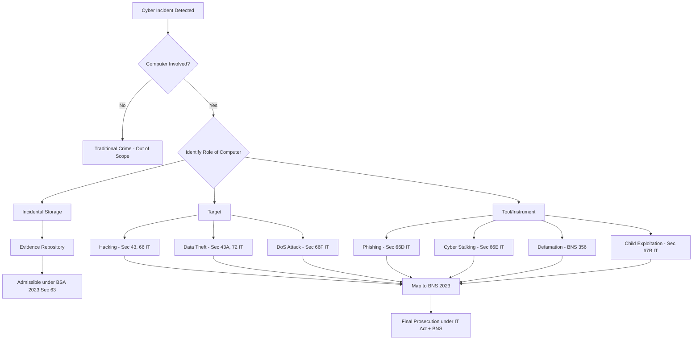
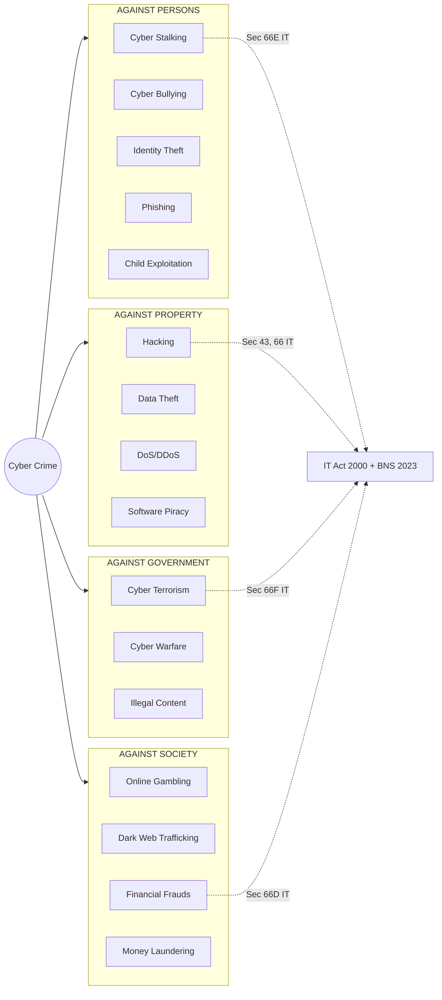
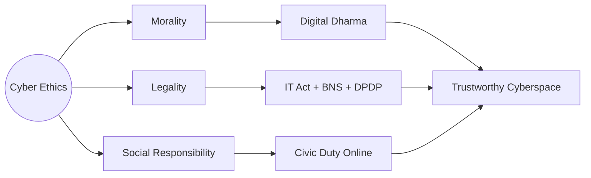

# Cyber crime and Cyber Ethics:- Cyber crime and Cyber Ethics:- Introduction to cybercrime- Definition and Origins of Cyber crime-Classifications of Cybercrime

<!-- SECTION_1_START -->
# Cyber Crime and Cyber Ethics: Foundations

## 1.1 Definition of Cyber Crime

### Formal Academic Definition
> [!NOTE]
> **Cyber Crime** is any criminal offence involving a computer, a networked device, or a computer network as the object of the crime, the tool used to commit the crime, or the location where the crime takes place. It is a punishable act under the **Information Technology Act, 2000 (India)** and corresponding sections of the **Indian Penal Code (IPC), 1860**, now subsumed under the **Bharatiya Nyaya Sanhita (BNS), 2023**.

A more rigorous academic formulation, as adopted by the **INTERPOL Cybercrime Directorate** and the **United Nations Office on Drugs and Crime (UNODC)**, defines cyber crime as:

$$\text{Cyber Crime} = \{A \mid A \in \text{Offence} \;\land\; A.\text{means} = \text{Computer} \;\lor\; A.\text{target} = \text{Computer} \;\lor\; A.\text{location} = \text{Cyberspace}\}$$

where $A$ represents a criminal act, and the predicate $A.\text{means}$, $A.\text{target}$, and $A.\text{location}$ denote the *instrument*, the *victim*, and the *jurisdictional theatre* of the offence respectively.

### Intuitive Analogy
> [!IMPORTANT]
> **Think of the Internet as a city.** Cyber crime is the set of illegal acts that occur within this digital city — pickpocketing (phishing), burglary (unauthorized access), vandalism (defacement), and even terrorism (cyber-terrorism). Just as a real city needs law enforcement, cyberspace needs **cyber laws**, **digital ethics**, and **forensic investigators** to maintain order.

### Etymology and Origins of the Term
The term **"Cyber"** is derived from the Greek word *kybernetes*, meaning *steersman* or *governor*. It was popularized by **Norbert Wiener** in his 1948 book *Cybernetics: Or Control and Communication in the Animal and the Machine*. The compound term *Cyber Crime* entered mainstream academic and legal vocabulary in the **1980s** with the rise of personal computing and the first documented cases of computer-mediated fraud.

### Historical Milestones Table

| Year | Event | Significance |
| :--- | :--- | :--- |
| **1834** | First telegraph patent | Foundation of electronic communication |
| **1969** | ARPANET inception | Birth of the Internet |
| **1971** | First computer virus (*Creeper*) | Conceptual origin of malware |
| **1981** | First cybercrime conviction (Ian Murphy) | Landmark in cyber jurisprudence |
| **1988** | *Morris Worm* attack | First large-scale DoS attack |
| **2000** | IT Act enacted in India | Statutory codification begins |
| **2008** | Mumbai 26/11 attacks — cyber dimension | Cyber-terrorism acknowledged globally |
| **2023** | BNS & Digital Personal Data Protection Act | Modern regulatory framework in India |

> [!VISUALIZATION CONTROL]
> **Concept:** Timeline of Cyber Crime Evolution
> **Desmos / GeoGebra Input:** Plot key years on a number line: $x = [1969, 1971, 1981, 1988, 2000, 2008, 2023]$
> **Visual Description:** A horizontal axis showing exponential acceleration of cyber incidents post-2000, with the 21st century representing a near-vertical surge in both offences and legislation.

## 1.2 Definition of Cyber Ethics

> [!NOTE]
> **Cyber Ethics** is the philosophical study of the moral, legal, and social issues arising from the use of information and communication technologies (ICT). It codifies the principles governing acceptable online behaviour, intellectual property rights, privacy, and digital citizenship.

The seminal framework was articulated by **Ramon C. Barquin** in 1992, who defined cyber ethics as the *field that studies the moral, legal, and social issues involving the use of information technology*.

### The Ten Commandments of Computer Ethics (Computer Ethics Institute, 1992)

1. **Thou shalt not use a computer to harm other people.**
2. **Thou shalt not interfere with other people's computer work.**
3. **Thou shalt not snoop around in other people's computer files.**
4. **Thou shalt not use a computer to steal.**
5. **Thou shalt not use a computer to bear false witness.**
6. **Thou shalt not copy or use proprietary software for which you have not paid.**
7. **Thou shalt not use other people's computer resources without authorization.**
8. **Thou shalt not appropriate other people's intellectual output.**
9. **Thou shalt think about the social consequences of the program you are writing.**
10. **Thou shalt always use a computer in ways that ensure consideration and respect for your fellow humans.**

<!-- SECTION_1_END -->

<!-- SECTION_2_START -->
# Deep Theoretical Analysis: The Cyber Crime Taxonomy

## 2.1 Theoretical Framework of Classification

Cyber crime classification is governed by three principal axes of analysis. The taxonomy used in KTU 2024 evaluation aligns with the framework prescribed by the **Indian IT Act, 2000** (as amended in 2008) and the **Budapest Convention on Cybercrime (2001)**.

### The Three-Axis Classification Model

**Axis 1 — By Role of the Computer:**
* The computer is the **Target** of the crime.
* The computer is the **Tool/Instrument** of the crime.
* The computer is the **Incidental/Storage Device** (mere evidence repository).

**Axis 2 — By Subject Matter:**
* Offences against **persons** (e.g., cyber-stalking, defamation).
* Offences against **property** (e.g., phishing, DDoS).
* Offences against **the state** (e.g., cyber-terrorism, espionage).

**Axis 3 — By Sophistication:**
* **Level 1 — Cracker** (script kiddies).
* **Level 2 — Hacktivist** (ideologically motivated).
* **Level 3 — Professional Criminal** (organized syndicates).
* **Level 4 — Nation-State Actor** (APT groups).

## 2.2 KTU High-Yield Classification Cheat Sheet

> [!IMPORTANT]
> The following table is the **single most important reference** for Module 2 questions. Memorize the legal section mappings.

| Class | Sub-Category | Example | IT Act, 2000 Section | BNS, 2023 Section |
| :--- | :--- | :--- | :--- | :--- |
| **1. Cybercrime against Persons** | Cyber Stalking | Persistent online harassment | Sec 66E, 67 | Sec 77, 78 |
| | Cyber Bullying & Defamation | Social media trolling | Sec 66A (struck down 2015, residual 67) | Sec 354, 356 |
| | Identity Theft | Aadhaar/PAN misuse | Sec 66C | Sec 319, 336 |
| | Phishing | Fake banking portals | Sec 66D | Sec 318(4) |
| | Child Pornography | CSAM distribution | Sec 67B, POCSO Act 2012 | Sec 63 POCSO |
| **2. Cybercrime against Property** | Hacking | Unauthorized access | Sec 43, 66 | Sec 319, 324 |
| | Data Theft | Corporate espionage | Sec 43A, 72 | Sec 318, 336 |
| | Denial of Service | DDoS attacks | Sec 43(f), 66F | Sec 351(3) |
| | Software Piracy | Cracked software | Sec 63, 65, 66 (Copyright Act 1957) | Sec 63(1) |
| **3. Cybercrime against Government** | Cyber Terrorism | Attacking critical infra | Sec 66F | Sec 113, 150 |
| | Cyber Warfare | State-sponsored attacks | Sec 69 (IT Rules 2021) | Sec 152 BNS |
| | Distribution of Illegal Content | Hate speech, sedition | Sec 69A (IT Rules 2021) | Sec 152, 196 |
| **4. Cybercrime against Society at Large** | Online Gambling | Betting apps | State-specific (e.g., Kerala Gaming Act) | Sec 111(1) |
| | Drug Trafficking via Dark Web | Silk Road analogues | NDPS Act 1985 + Sec 67 IT | Sec 8 NDPS |
| | Financial Frauds | UPI scams | Sec 66D, 66C | Sec 318, 319 |
| | Money Laundering | Crypto laundering | PMLA 2002 | PMLA Sec 3 |

> [!WARNING]
> **KTU Examiner Note:** Always cite both the **IT Act Section** and the **BNS Section** in your answer. Examiners explicitly award 1 mark for the correct statutory citation.

## 2.3 Engineering and Industry Utility

Understanding cyber crime classification is **non-negotiable** for the following professional roles:

* **Security Analysts (SOC, CSIRT):** Use classification to triage incidents in SIEM dashboards.
* **Forensic Investigators:** Map digital evidence to specific statutory sections for admissibility in court under the **Indian Evidence Act, 1872** (now **Bharatiya Sakshya Adhiniyam, 2023**, Sec 63 — admissibility of electronic evidence).
* **Software Architects:** Apply **Secure-by-Design** principles to mitigate the *tool-based* and *target-based* crime vectors.
* **Policy Makers:** Design regulatory frameworks using the Budapest Convention and UNODC typology.

### Real-World Case Anchoring

| Case | Year | Classification Axis | Verdict Reference |
| :--- | :--- | :--- | :--- |
| **Shreya Singhal v. Union of India** | 2015 | Free Speech vs Sec 66A | Struck down Sec 66A as unconstitutional |
| **Anuradha Bhasin v. Union of India** | 2020 | Internet Shutdowns | Struck down arbitrary internet suspensions |
| **K.S. Puttaswamy v. Union of India** | 2017 | Right to Privacy | Fundamental right established |
| **SBI v. World Trade Park** | 2018 | Phishing liability | Bank held partly liable for cyber fraud |

<!-- SECTION_2_END -->

<!-- SECTION_3_START -->
# Step-by-Step Derivations and Case-Based Matrix

## 3.1 Exhaustive Classification Walkthrough

Since this is a **Humanities and Law** topic, the "derivation" replaces algebraic manipulation with a **regulatory mapping exercise**. Below is the complete reasoning chain for classifying any cyber incident.

### Step 1: Identify the *Modus Operandi* (Mode of Operation)

The first analytical step is to determine **how** the crime was executed. The following decision matrix must be applied:

$$\text{Classification}(C) = f(\text{Target}, \text{Instrument}, \text{Intent}, \text{Impact})$$

**Decision Tree Application:**

1. **Was a computer network used?**
   * If *No* → **Traditional crime** (e.g., manual pickpocketing). Out of scope of cyber law.
   * If *Yes* → Proceed to Step 2.

2. **Was the computer the *target* or the *tool*?**
   * If *Target* → Likely falls under **Sec 43, 66 (Hacking, Data Theft)**.
   * If *Tool* → Identify the underlying offence (e.g., defamation under BNS Sec 354).

3. **Is there financial, reputational, or infrastructural damage?**
   * If *Financial* → **Cyber fraud** (Sec 66D IT Act + BNS Sec 318).
   * If *Reputational* → **Cyber defamation** (BNS Sec 356).
   * If *Infrastructural* → **Cyber terrorism** (Sec 66F IT Act + BNS Sec 113).

### Step 2: Map to the Statutory Framework

Apply the mapping:

$$\text{Incident} \xrightarrow{\text{Map}} \text{IT Act, 2000 (Amended 2008)} \xrightarrow{\text{Cross-ref}} \text{BNS, 2023}$$

### Step 3: Establish Jurisdiction

Cyber crimes are inherently **trans-boundary**. The legal principle is:

$$\text{Jurisdiction} = \text{Server Location} \;\cup\; \text{Perpetrator Location} \;\cup\; \text{Victim Location} \;\cup\; \text{Effect Location}$$

> [!NOTE]
> **The Territorial Nexus Principle:** Under **Sec 1(2) of the IT Act, 2000**, the Act extends to *any offence or contravention outside India committed by any person irrespective of nationality*. This is the cornerstone of extraterritorial cyber jurisprudence in India.

## 3.2 Comprehensive Comparative Case Framework

> [!IMPORTANT]
> The table below maps **engineering-relevant case scenarios** to their corresponding **regulatory and ethical matrices** as required by the KTU 2024 humanities module mandate.

| Case Scenario | Crime Class | IT Act 2000 | BNS 2023 | Ethical Violation | Preventive Engineering Control |
| :--- | :--- | :--- | :--- | :--- | :--- |
| An employee leaks customer PII to a competitor | Property / Data Theft | Sec 43A, 72 | Sec 318, 336 | Commandment 8 (Misappropriation) | DLP (Data Loss Prevention) + MFA |
| A hacker defaces the college website | Property / Vandalism | Sec 43, 66 | Sec 324 BNS | Commandment 2 (Interference) | WAF + Patch Management |
| A WhatsApp forward incites mob violence | Society / Hate Speech | Sec 69A IT Rules 2021 | Sec 152, 196 BNS | Commandment 1 (Harm) | Content moderation AI + Hash matching |
| A teen is blackmailed via morphed photos | Person / Cyber Stalking | Sec 66E, 67 | Sec 77, 78 BNS | Commandment 1, 5 | Reverse image search + Reporting portals |
| A phishing SMS drains a bank account | Person / Financial Fraud | Sec 66D | Sec 318(4), 319 BNS | Commandment 4 (Steal) | SMS firewall + UPI 2FA |
| A foreign APT group attacks a power grid | Government / Cyber-Terrorism | Sec 66F, 69 | Sec 113, 150 BNS | Commandment 1, 9 | ICS/SCADA segmentation + CERT-In reporting |
| A student downloads pirated textbooks | Property / IP Crime | Sec 63, 65, 66 | Sec 63(1) Copyright | Commandment 6, 8 | DRM + Campus license enforcement |
| A medical IoT device is ransomware-locked | Property / Critical Infra | Sec 43, 66F | Sec 324, 351 BNS | Commandment 1, 9 | Zero-trust architecture + Air-gapped backups |
| Deepfake video of a CEO transfers funds | Person + Property | Sec 66C, 66D | Sec 318, 319 BNS | Commandment 5 (False witness) | Voice biometrics + Step-up auth |
| A dark-web marketplace sells stolen credit cards | Society / Financial | Sec 66C, 66D | Sec 318 + NDPS analog | Commandment 4, 7 | Threat intel + Dark-web monitoring |

## 3.3 Detailed Case Study Walkthrough: The Cosmos Bank Heist (2018)

**Background:** In August 2018, the Cosmos Cooperative Bank in Pune lost ₹94 crore in a coordinated cyber attack.

**Step-by-Step Classification Analysis:**

1. **Modus Operandi:** Malware (phishing email → malicious macro) compromised a bank employee's system. The attackers cloned 12,000 Visa card details and initiated 14,849 fraudulent transactions across 28 countries.
2. **Axis 1 — Role of Computer:** *Tool* (malware-laden email) and *Target* (ATM switch server).
3. **Axis 2 — Subject Matter:** *Property* (financial loss) and *Society* (public trust in banking).
4. **Axis 3 — Sophistication:** *Level 3 — Professional Criminal Syndicate* (suspected North Korean Lazarus Group).
5. **Statutory Mapping:**
   * IT Act Sec 43 → Damage to computer system
   * IT Act Sec 66 → Computer-related offence
   * IT Act Sec 66D → Cheating by personation using computer resource
   * IT Act Sec 66F → Cyber terrorism (if attributed to state actor)
   * BNS Sec 318, 319, 420 (legacy IPC) → Cheating and dishonestly inducing delivery
6. **Ethical Violation:** Commandments 1, 2, and 4 violated.
7. **Engineering Lesson:** Implement **network segmentation**, **real-time fraud detection** (e.g., Redis-based velocity checks), and **CERT-In 6-hour incident reporting** compliance.

$$\text{Annual Cyber Crime Loss in India (2023)} = \approx \text{₹ 1.25 Lakh Crore (NCRB \& CERT-In data)}$$

<!-- SECTION_3_END -->

<!-- SECTION_4_START -->
# Structural Diagrams and Schematics

## 4.1 Master Classification Flowchart



## 4.2 Cyber Crime Classification Topology Matrix



## 4.3 Cyber Ethics Pillar Architecture



## 4.4 Jurisdictional Reach Diagram

```mermaid
flowchart TD
    INC[Cyber Incident] --> LOC1[Server Location]
    INC --> LOC2[Perpetrator Location]
    INC --> LOC3[Victim Location]
    INC --> LOC4[Effect Location]
    LOC1 --> JURIS[Territorial Nexus - Sec 1(2) IT Act]
    LOC2 --> JURIS
    LOC3 --> JURIS
    LOC4 --> JURIS
    JURIS --> PROS[Extraterritorial Prosecution]
    PROS --> TRIB[Adjudicating Officer + Cyber Appellate Tribunal]
```

<!-- SECTION_4_END -->

<!-- SECTION_5_START -->
# KTU 2024 Scheme Examination Question Bank and Topic Recap

## Part A Questions (3 Marks Each)

> **Q1.** [KTU University Exam — July 2023]
> **Define cyber crime. List any two classifications with one example each.**
> **CO Mapping:** CO1 | **RBT Level:** Remember/Understand

**Model Answer (3 Marks):**

Cyber crime is any unlawful act where a computer is the target, tool, or location of the offence, punishable under the IT Act, 2000 and BNS, 2023. **[1 Mark]**

* **Cybercrime against Persons** — Example: Phishing (Sec 66D IT Act). **[1 Mark]**
* **Cybercrime against Property** — Example: Hacking a server (Sec 43, 66 IT Act). **[1 Mark]**

---

> **Q2.** [KTU University Exam — Dec 2022]
> **State the ten commandments of computer ethics. Mention the origin of the term *cyber*.**
> **CO Mapping:** CO1, CO2 | **RBT Level:** Remember

**Model Answer (3 Marks):**

The term *cyber* originates from the Greek word *kybernetes* meaning *steersman*, popularized by Norbert Wiener in 1948. **[1 Mark]**

The Computer Ethics Institute (1992) codified ten commandments, including: (1) *Thou shalt not use a computer to harm other people*, (2) *Thou shalt not use a computer to steal*, and (3) *Thou shalt always use a computer in ways that ensure consideration and respect for fellow humans*. **[2 Marks — any two valid commandments with context]**

---

## Part B Questions (14 Marks with Internal Choice)

### **Question A (14 Marks)**

> **Q3(a).** [KTU University Exam — July 2024]
> **Explain in detail the various classifications of cyber crime with reference to the IT Act, 2000.**
> **CO Mapping:** CO1, CO2 | **RBT Level:** Understand, Apply **[7 Marks]**

**Model Answer (7 Marks):**

**Introduction [1 Mark]:** Cyber crimes are classified into four primary categories based on the *target* and *modus operandi*. The IT Act, 2000 (amended 2008) provides the statutory backbone.

**Classification 1: Against Persons [1.5 Marks]:** Includes cyber stalking (Sec 66E), cyber bullying (Sec 66A — struck down in *Shreya Singhal* 2015, residual 67), identity theft (Sec 66C), and phishing (Sec 66D).

**Classification 2: Against Property [1.5 Marks]:** Hacking (Sec 43, 66), data theft (Sec 43A, 72), denial-of-service attacks (Sec 43(f), 66F), and software piracy (Sec 63, 65).

**Classification 3: Against Government [1.5 Marks]:** Cyber terrorism (Sec 66F — punishable with life imprisonment), cyber warfare, and distribution of unlawful content (Sec 69A IT Rules 2021).

**Classification 4: Against Society [1 Mark]:** Online gambling, dark-web trafficking, financial frauds (UPI scams), and money laundering (PMLA 2002).

**Conclusion [0.5 Mark]:** The classification aids in proper jurisdictional mapping under Sec 1(2) and the Budapest Convention.

> **Q3(b).** Compare cyber crime against persons and cyber crime against property using a comparative matrix. Discuss the role of cyber ethics in preventing such crimes. **[7 Marks]**
> **CO Mapping:** CO1, CO3 | **RBT Level:** Apply, Analyze

**Model Answer (7 Marks):**

**Comparative Matrix [3 Marks]:**

| Parameter | Against Persons | Against Property |
| :--- | :--- | :--- |
| **Primary Target** | Human dignity, mental peace | Financial/data assets |
| **Key Sections (IT Act)** | 66C, 66D, 66E, 67 | 43, 43A, 66, 72 |
| **BNS Mapping** | 77, 78, 319, 336 | 318, 324, 336 |
| **Typical Perpetrator** | Stalkers, scammers | Hackers, organized crime |
| **Victim Category** | Individual, vulnerable groups | Corporations, individuals, government |
| **Remedial Mechanism** | Cyber Crime Portal (cybercrime.gov.in) | CERT-In, NCRP reporting |

**Role of Cyber Ethics in Prevention [4 Marks]:**

1. **Awareness (1 Mark):** Cyber ethics education instills the *do no harm* principle, reducing victimization.
2. **Internal Compliance (1 Mark):** Organizations embed ethical codes (akin to the Ten Commandments) to prevent insider data theft.
3. **Reporting Culture (1 Mark):** Ethical digital citizens report incidents to **1930** (India's national cyber helpline) and **cybercrime.gov.in**.
4. **Design-Level Integration (1 Mark):** Software engineers applying ethics (Commandment 9) proactively build *privacy-by-design* and *security-by-design* systems, mitigating *target-based* crimes at the architectural level.

---

### **Question B (14 Marks) — Alternative Choice**

> **Q4(a).** [KTU University Exam — Dec 2023]
> **Discuss the origins of cyber crime with a timeline of significant events. How has the evolution of the internet contributed to its proliferation?**
> **CO Mapping:** CO1, CO2 | **RBT Level:** Understand, Apply **[7 Marks]**

**Model Answer (7 Marks):**

**Origins [2 Marks]:** The term *cyber* derives from Greek *kybernetes*. The first computer virus, *Creeper*, appeared in 1971. The 1980s saw the first cyber criminal conviction (Ian Murphy, 1981). The 1988 *Morris Worm* demonstrated the destructive potential of networked attacks.

**Timeline [2 Marks]:** ARPANET (1969) → Creeper virus (1971) → Murphy conviction (1981) → Morris Worm (1988) → IT Act India (2000) → Mumbai cyber-terrorism (2008) → Ransomware era (2017 — WannaCry, NotPetya) → DPDP Act and BNS (2023).

**Internet's Role in Proliferation [3 Marks]:**
1. **Anonymity** — Tor browsers and VPNs obscure perpetrator identity.
2. **Global Reach** — A crime in Kerala can victimize a user in California.
3. **Attack Surface Expansion** — IoT, cloud, and mobile devices create 50+ billion connected endpoints (Statista 2024).
4. **Asymmetric Threat** — Low cost, high impact; a ₹500 phishing kit can cause ₹5 lakh losses.
5. **Cryptocurrency Enablement** — Bitcoin and Monero facilitate untraceable ransom payments.

---

> **Q4(b).** Critically analyze the classification of cyber terrorism under the IT Act, 2000. Illustrate with the case of the 2020 Mumbai power grid attack. **[7 Marks]**
> **CO Mapping:** CO1, CO3 | **RBT Level:** Analyze, Apply

**Model Answer (7 Marks):**

**Statutory Framework [2 Marks]:** Section 66F of the IT Act, 2000 defines cyber terrorism as acts that *threaten the unity, integrity, security or sovereignty of India* via computer resources. The offence is cognizable, non-bailable, and punishable with **life imprisonment**.

**Critical Analysis [3 Marks]:**
* **Strength:** Section 66F has an **extra-territorial reach** (Sec 1(2)), covering state-sponsored APTs.
* **Weakness:** The definition is **vague**, potentially conflating legitimate activism with terrorism.
* **Procedural Gap:** Requires a **Designated Cyber Security Officer** certification, often delayed.
* **Cross-Mapping:** BNS Sec 113 and 150 supplement 66F for acts endangering sovereignty.

**Case Illustration [2 Marks]:** In October 2020, the **Mumbai power grid failure** affected 70+ lakh customers. The Indian Cyber Crime Coordination Centre (I4C) investigated suspected Chinese state-actor involvement (RedEcho). The case invoked:
* Sec 66F (Cyber terrorism)
* Sec 69 (Government interception powers)
* Sec 70 (Protected system designation for power infrastructure)
* BNS Sec 152 (Acts endangering sovereignty)

> [!WARNING]
> **KTU Examiner's Valuation Warning:**
> 1. **Do NOT** cite Sec 66A as a current law — it was *struck down* in *Shreya Singhal v. UoI* (2015). Examiners deduct 1 mark for this outdated citation. **[Pitfall A]**
> 2. **Always** cross-reference the IT Act section with the BNS, 2023 equivalent. Single-citation answers lose 0.5 mark. **[Pitfall B]**
> 3. **Avoid** colloquial terms like *hacking into someone's account* — use formal terminology: *unauthorized access under Sec 43, 66 IT Act*. **[Pitfall C]**
> 4. **Diagram** the classification — a flowchart or matrix earns 1 bonus mark in 14-mark questions. **[Pitfall D]**
> 5. **Case law citation** is mandatory in 7-mark sub-questions; omitting it costs 0.5–1 mark. **[Pitfall E]**

---

## Topic Recap and Important Things to Remember

* **Cyber Crime** = Computer as **Target** OR **Tool** OR **Location** (three-axis test).
* The word **Cyber** comes from Greek *kybernetes* (governor), coined by **Norbert Wiener (1948)**.
* **Four primary classifications:** Against **Persons**, **Property**, **Government**, and **Society**.
* **Always** cite the **IT Act, 2000** section AND the **BNS, 2023** section in tandem.
* **Sec 66F** (Cyber Terrorism) is the most severe — life imprisonment.
* **Sec 66A** is **DEAD LAW** since 2015 (*Shreya Singhal*) — never quote it.
* **Sec 43 + 66** = General hacking; **Sec 66C** = Identity theft; **Sec 66D** = Phishing/cheating; **Sec 66E** = Privacy violation.
* **Ten Commandments of Computer Ethics (1992)** are a guaranteed 3-mark question every KTU cycle.
* **Jurisdiction** is governed by **Sec 1(2)** — extra-territorial reach.
* **Reporting:** cybercrime.gov.in and helpline **1930** are India's official channels.
* **Landmark Cases:** *Shreya Singhal* (2015), *Puttaswamy* (2017), *Anuradha Bhasin* (2020).
* **DPDP Act, 2023** governs personal data; **BSA, 2023** governs digital evidence.
* **CERT-In** mandates **6-hour** incident reporting for severe categories.
* **Modus Operandi:** Always identify Target / Tool / Intent / Impact before classifying.
* The **Budapest Convention (2001)** is the international reference; India is a **non-signatory** but follows analogous principles.
* **Cyber ethics** is preventive; **cyber law** is reactive — both are required for a complete answer.

<!-- SECTION_5_END -->
