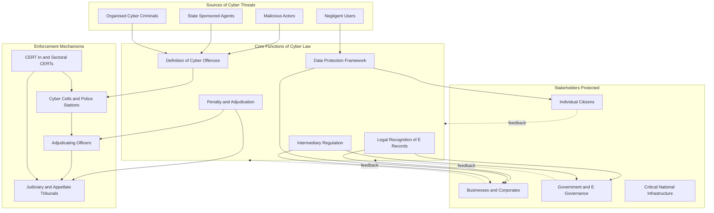
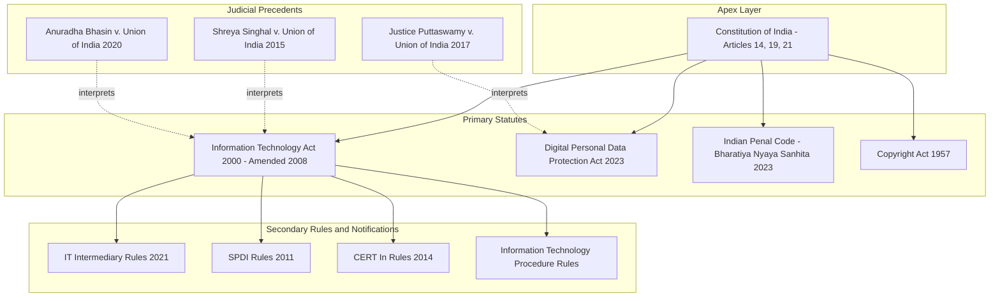
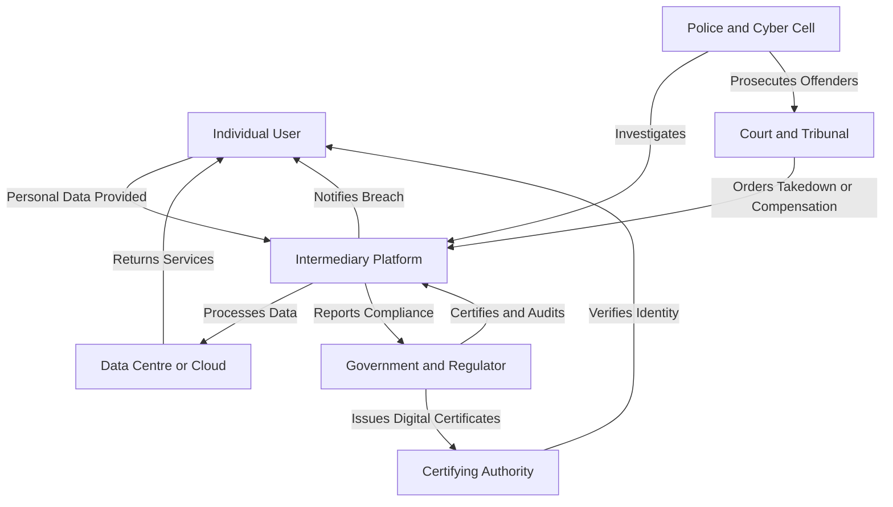

# Cyber Ethics:  The Importance of Cyber Law

<!-- SECTION_1_START -->

# Cyber Ethics: The Importance of Cyber Law

## 1.1 Core Technical Definition

> [!IMPORTANT]
> **Cyber Law** is the body of legal regulations, statutory provisions, judicial precedents, and ethical principles that govern the conduct of individuals, organizations, and governments in cyberspace. It addresses issues relating to digital rights, data protection, electronic commerce, intellectual property, and the prevention of cyber offences.

In the context of the **KTU 2024 Scheme** for the course **PECST419 (Cyber Ethics, Privacy and Legal Issues)**, Cyber Law is positioned as the **regulatory spine** of the digital ecosystem. It provides the legal architecture that enables ethical behaviour online, defines the rights and obligations of digital citizens, and prescribes remedies for violations.

The most prominent statutory embodiment of cyber law in India is the **Information Technology Act, 2000** (amended in **2008**), often abbreviated as the **IT Act**. It is the primary legislation dealing with cybercrime and e-commerce in the country and is therefore central to any discussion of cyber ethics.

### 1.2 Conceptual Analogy / Intuitive Overview

> [!NOTE]
> **Analogy: The Digital Highway**
> Imagine the internet as a massive, multi-lane highway where millions of users travel every second. Just as a real highway needs **traffic signals, lane markings, speed limits, traffic police, and accident laws** to function safely, cyberspace too needs rules, regulations, and enforcement mechanisms. **Cyber Law is essentially the combined traffic-rule book + police force + court system for the digital highway.** Without it, the highway would collapse into chaos — data theft, fraud, harassment, and sabotage would go unchecked.

Three cornerstones make cyber law indispensable:

1. **Protection** — It shields individuals, businesses, and governments from digital harm (identity theft, data breaches, cyber-stalking, financial fraud).
2. **Regulation** — It standardises digital transactions, e-contracts, digital signatures, and electronic records so that commerce on the internet is trustworthy.
3. **Punishment & Redressal** — It defines what constitutes a cybercrime, prescribes penalties, and establishes adjudicating authorities to deliver justice.

> [!TIP]
> **Syllabus Highlight (PECST419 – Module 2):**
> Under the KTU 2024 syllabus, this topic directly supports **Course Outcome CO2**: *“Understand the legal framework governing cyberspace and apply ethical reasoning to cyber-related dilemmas.”* It is therefore a **high-weightage area** for both Continuous Assessment (CA) and End Semester Examinations (ESE).

### 1.3 Key Terminology (KTU Board-Standard Definitions)

| Term | Definition (Board-Exam Ready) |
|---|---|
| **Cyberspace** | The notional environment in which communication over computer networks occurs. |
| **Cybercrime** | Any unlawful act where a computer or network is the tool, target, or place of the offence. |
| **Digital Signature** | An electronic signature used to authenticate the identity of the sender of a message or the signer of a document. |
| **E-Governance** | The use of Information and Communication Technology (ICT) to deliver government services, exchange information, and integrate standalone systems. |
| **Data Privacy** | The right of an individual to control how their personal information is collected, stored, processed, and shared. |
| **Intellectual Property (IP)** | Creations of the mind, such as inventions, literary and artistic works, designs, and symbols, protected by law. |

> [!VISUALIZATION CONTROL]
> **Concept:** Conceptual Map of Cyber Law as a Three-Pillar Structure
> **GeoGebra / Desmos Input Equations (Schematic layout on the coordinate plane):**
> * `Pillar 1: (x=-2, y=0) to (x=-2, y=6)` labelled "PROTECTION"
> * `Pillar 2: (x=0, y=0) to (x=0, y=6)` labelled "REGULATION"
> * `Pillar 3: (x=2, y=0) to (x=2, y=6)` labelled "REDDRESSAL"
> * `Roof: line from (-3, 6) to (3, 6) labelled "CYBER LAW"`
> **Visual Description:** A temple-style three-pillar diagram where each pillar represents one functional role of cyber law, and a horizontal roof on top represents the unifying umbrella of Cyber Law. Students should observe that the structure is only stable when all three pillars work together.

### 1.4 Why Cyber Law is Important — The Five Pillars

> [!IMPORTANT]
> **The Importance of Cyber Law can be summarised under five engineering-grade pillars.** Board examiners expect students to enumerate these with crisp one-line explanations.

1. **Legal Recognition of Electronic Transactions** — It gives legal validity to e-contracts, digital signatures, and electronic records, enabling e-commerce to function.
2. **Combating Cybercrime** — It defines offences like hacking, phishing, identity theft, and obscenity in cyberspace, and prescribes punishments.
3. **Data Protection & Privacy** — It establishes norms for the collection, storage, and processing of personal data.
4. **Intellectual Property Protection** — It protects software, databases, and digital content from piracy and infringement.
5. **E-Governance & Digital India** — It enables citizens to access government services electronically (e.g., e-filing, digital certificates).

---

<!-- SECTION_1_END -->

<!-- SECTION_2_START -->

# Deep Theoretical Analysis & KTU High-Yield Formula Sheet

## 2.1 The Information Technology (IT) Act, 2000 — The Indian Backbone

The **Information Technology Act, 2000** is the **primary cyber law of India**. It was enacted on **17th October 2000** and came into effect on **17th August 2002**. The Act was substantially amended in **2008** to address new forms of cybercrime, introduce the **Information Technology (Reasonable Security Practices and Procedures and Sensitive Personal Data or Information) Rules, 2011**, and add several new offences.

> [!NOTE]
> **Historical Context for Examinations:** The IT Act 2000 was passed to give legal recognition to e-commerce and e-governance after the **Model Law on Electronic Commerce** adopted by the **United Nations Commission on International Trade Law (UNCITRAL)** in 1996.

### 2.2 Salient Features of the IT Act, 2000 (as amended in 2008)

The following structured breakdown aligns with what a KTU 2024 examiner expects from a 14-mark answer:

- **Legal Recognition of Electronic Records** (Section 3–4) — Any information stored, generated, or communicated in electronic form is recognised as a legal record.
- **Legal Recognition of Digital Signatures** (Section 3–4) — Digital signatures are granted the same legal status as physical signatures.
- **Regulation of Certifying Authorities (CAs)** (Sections 17–34) — Establishes a Controller of Certifying Authorities who licenses and supervises CAs that issue digital certificates.
- **Penalties for Offences** (Sections 43, 43A, 44) — Civil and criminal penalties for damage to computer systems, data theft, and disclosure of sensitive personal information.
- **Adjudication of Disputes** (Sections 46–64) — Establishes the **Cyber Appellate Tribunal** (now replaced by the **Telecom Disputes Settlement and Appellate Tribunal — TDSAT** under recent amendments) to hear cyber-related disputes.
- **Offences and Penalties** (Sections 65–78) — Criminal offences such as tampering with computer source documents, publishing information that is obscene in electronic form, and cyber-terrorism.
- **Intermediary Liability** (Section 79) — Defines the liability of intermediaries (e.g., ISPs, social media platforms) for content hosted on their platforms.
- **Cyber Terrorism** (Section 66F) — Defines and prescribes punishment for cyber terrorism — a key amendment introduced in 2008.
- **Data Protection** (Section 43A + SPDI Rules 2011) — Mandates reasonable security practices for handling sensitive personal data.
- **Compounding of Offences** (Section 77A) — Allows certain offences to be compounded (settled) to reduce the burden on courts.

### 2.3 Important Sections of the IT Act — The Board-Examiner's "Must-Know" List

> [!TIP]
> **Examiner Insight:** Most KTU questions in this module ask students to either (a) list important sections with their subject matter, or (b) explain one or two sections in detail. Memorise the section numbers and their core content using the table below.

### 2.4 KTU High-Yield Formula Sheet (Key Concepts Table)

> Since Cyber Law is a non-quantitative subject, the "formula sheet" is replaced with a **Conceptual Reference Table** that summarises all examinable statutory and ethical elements.

| **Concept / Section** | **Subject Matter** | **Practical Implication** |
|---|---|---|
| **Section 3** | Legal recognition of electronic records | Enables e-contracts in e-commerce |
| **Section 4** | Legal recognition of digital signatures | Enables secure online authentication |
| **Section 43** | Penalty for damage to computer or computer system | Civil remedy for hacking / data damage |
| **Section 43A** | Compensation for failure to protect data | Holds corporates liable for data breaches |
| **Section 65** | Tampering with computer source documents | Offence — punishable with imprisonment up to 3 years or fine up to ₹2 lakh |
| **Section 66** | Computer-related offences (hacking with dishonest intent) | Offence — punishable with imprisonment up to 3 years or fine up to ₹5 lakh |
| **Section 66A** (struck down in 2015) | Sending offensive messages through communication services | **Declared unconstitutional** by the Supreme Court in *Shreya Singhal v. Union of India* (2015) |
| **Section 66C** | Identity theft | Using another person's digital signature, password, or unique identification is an offence |
| **Section 66D** | Cheating by personation using communication device | Phishing / online fraud is an offence |
| **Section 66E** | Violation of privacy | Publishing / transmitting private images of a person without consent |
| **Section 66F** | Cyber terrorism | Punishment up to **life imprisonment** |
| **Section 67** | Publishing obscene material in electronic form | First offence: up to 5 years imprisonment + fine |
| **Section 69** | Government power to intercept, monitor, or decrypt information | Used for national security investigations |
| **Section 72** | Breach of confidentiality and privacy | Disclosure of electronic information by an intermediary without consent |
| **Section 79** | Intermediary liability | Safe harbour provisions for platforms acting in good faith |
| **Section 80** | Power of police officer to enter, search, and arrest | Officers of Inspector rank and above can investigate |
| **SPDI Rules 2011** | Sensitive Personal Data or Information Rules | Defines consent, disclosure, and reasonable security practices |
| **IT (Amendment) Act 2008** | Major overhaul introducing cyber terrorism, data protection, child pornography sections | Foundation of modern Indian cyber jurisprudence |

### 2.5 Engineering & Real-World Utility

- **Software Industry** — Cyber Law governs software licensing, source code protection, and liability for software defects.
- **E-Commerce Platforms** — Amazon, Flipkart, and payment gateways like Razorpay rely on Section 43A and SPDI Rules to structure their data-handling policies.
- **Banking & FinTech** — RBI's Digital Lending Guidelines and the IT Act together regulate online transactions, KYC, and digital wallets.
- **Healthcare (HealthTech)** — Telemedicine platforms must comply with IT Act provisions when handling patient data.
- **National Security** — Section 66F empowers agencies to prosecute cyber terrorism, which directly impacts defence and intelligence infrastructure.
- **Academia & Research** — Universities must ensure their LMS (Learning Management Systems), research repositories, and email servers comply with cyber law for data protection.

> [!IMPORTANT]
> **Beyond the IT Act — A Holistic View of Cyber Law in India**
> The IT Act is not the only statute governing cyberspace. Other relevant laws include:
> * **Indian Penal Code, 1860 (now Bharatiya Nyaya Sanhita, 2023)** — General criminal provisions applicable to cyber offences.
> * **Indian Evidence Act, 1872 (now Bharatiya Sakshya Adhiniyam, 2023)** — Governs admissibility of electronic evidence.
> * **Copyright Act, 1957** — Protects software and digital content.
> * **Information Technology (Intermediary Guidelines and Digital Media Ethics Code) Rules, 2021** — Regulates social media, OTT platforms, and digital news media.
> * **Digital Personal Data Protection Act, 2023 (DPDP Act)** — India's first comprehensive data protection law.

### 2.6 The Importance of Cyber Law — A Cause-and-Effect Framework

The following structured logic sequence is the **model answer template** examiners reward:

**Step 1 — Establishes Legal Validity**
$\rightarrow$ E-commerce and e-governance can function only when digital contracts and signatures have legal standing. The IT Act provides this.

**Step 2 — Protects Citizens and Businesses**
$\rightarrow$ Sections 66, 66C, 66D, 66E safeguard users against hacking, identity theft, phishing, and privacy violations.

**Step 3 — Defines and Punishes Cyber Offences**
$\rightarrow$ Sections 65 to 74 list specific offences with prescribed penalties, creating a deterrent effect.

**Step 4 — Enables Cross-Border Cooperation**
$\rightarrow$ Cyber law provides a framework for international cooperation through MLATs (Mutual Legal Assistance Treaties) and INTERPOL channels, since cybercrime is inherently borderless.

**Step 5 — Supports National Security**
$\rightarrow$ Section 66F and Section 69 equip the state to counter cyber terrorism and digital espionage.

**Step 6 — Promotes Ethical Digital Behaviour**
$\rightarrow$ By codifying rights and responsibilities, cyber law reinforces ethical standards in the digital ecosystem.

---

<!-- SECTION_2_END -->

<!-- SECTION_3_START -->

# Step-by-Step Derivations, Comparative Analysis & Case Frameworks

## 3.1 Comparative Analysis — Indian Cyber Law vs Global Frameworks

> [!NOTE]
> **Engineering Case Framework Mapping:** For the Humanities / Management domain, the following tabular matrix maps Indian statutory provisions to international regulatory frameworks. This is a **highly scoring 14-mark question pattern** in KTU 2024 ESE.

| **Aspect** | **India (IT Act 2000 / 2008 + DPDP Act 2023)** | **European Union (GDPR, 2018)** | **United States (CFAA, 1986 + State Laws)** | **China (Cybersecurity Law, 2017)** |
|---|---|---|---|---|
| **Primary Statute** | IT Act, 2000 (amended 2008); DPDP Act 2023 | General Data Protection Regulation (GDPR) | Computer Fraud and Abuse Act (CFAA); state-level laws like CCPA | Cybersecurity Law of the People's Republic of China |
| **Year of Enactment** | 2000 (amended 2008) | 2016 (enforced 2018) | 1986 (amended multiple times) | 2016 (enforced 2017) |
| **Scope** | E-commerce, e-governance, data protection, cybercrime | Personal data of EU residents | Federal computer crime, interstate hacking | National cyber sovereignty, critical infrastructure |
| **Data Protection Model** | Consent-based, fiduciary obligations (DPDP Act) | Lawful basis + explicit consent + right to be forgotten | Sector-specific (health, finance, children's data) | Data localisation + government access |
| **Maximum Penalty** | Up to ₹25 crore (DPDP Act for data breaches) | Up to €20 million or 4% of global turnover | Varies — up to 20 years imprisonment for serious CFAA violations | Up to ¥1 million for individuals; up to ¥10 million for companies |
| **Cyber Terrorism Provision** | Section 66F — life imprisonment | Not specifically defined (covered under criminal law) | 18 U.S. Code § 1030 (CFAA) | Articles 21–25 of Cybersecurity Law |
| **Right to be Forgotten** | Implicit under DPDP Act (right to erasure) | Explicit (Article 17 of GDPR) | Limited (only minors in some states) | Not recognised |
| **Intermediary Liability** | Section 79 — conditional safe harbour | Article 14 of GDPR | Section 230 of Communications Decency Act (CDA) | Strict — platforms must cooperate with government |
| **Cross-Border Data Transfer** | Restricted under government notification | Requires adequacy decision or Standard Contractual Clauses | Largely unrestricted | Mandatory data localisation for critical data |
| **Philosophy** | Balanced — enables e-commerce while protecting rights | **Rights-centric** — individual privacy is paramount | **Innovation-friendly** with sectoral regulations | **Sovereignty-centric** — state control over data |

## 3.2 Landmark Case Law — Mapping Real-World Cases to Legal Provisions

> [!TIP]
> **Why this section matters:** KTU examiners frequently frame 7-mark sub-questions around "Explain the importance of cyber law with reference to a real-world case." The following case-to-statute mapping provides a ready reference.

| **Case** | **Year** | **Issue** | **Statute / Section Invoked** | **Outcome / Significance** |
|---|---|---|---|---|
| **State of Tamil Nadu v. Suhas Katti** | 2004 | Defamatory / obscene messages posted in a Yahoo! group | Section 67, IT Act + Section 469 IPC | First conviction under IT Act in India — established that online defamation is punishable |
| **Avnish Bajaj v. State (Delhi)** | 2005 | Sale of obscene content on Baazee.com (now Snapdeal) | Section 67, IT Act | Held the intermediary liable for hosting obscene content — led to Section 79 amendments |
| **Shreya Singhal v. Union of India** | 2015 | Constitutional validity of Section 66A (offensive messages) | Section 66A struck down as violative of Article 19(1)(a) | Landmark judgment — Section 66A declared unconstitutional; strengthened free speech online |
| **Justice K.S. Puttaswamy v. Union of India** | 2017 | Whether privacy is a fundamental right | Article 21 of Constitution + Section 43A IT Act | Supreme Court declared **Right to Privacy as a Fundamental Right** — foundation for DPDP Act 2023 |
| **Anuradha Bhasin v. Union of India** | 2020 | Internet shutdowns in Jammu & Kashmir | Section 144 CrPC + Section 69 IT Act | SC mandated that indefinite internet shutdowns violate Articles 19 and 21 |
| **Internet and Mobile Association of India v. RBI** | 2020 | RBI ban on cryptocurrency transactions | Section 3, RBI Act + IT Act provisions | SC lifted the blanket ban — paved way for future crypto regulation |
| **Facebook v. TAG Heuer** | Various | Use of trademarked keywords in social media ads | Section 79 + Copyright Act 1957 | Reinforced intermediary liability framework |

## 3.3 Step-by-Step Logical Derivation — "Why Cyber Law is Indispensable"

Since Cyber Law is a conceptual subject, the "derivation" is a **logical proof by enumeration of consequences** — a technique examiners expect in 14-mark essays.

**Step 1 — Premise (Axiom):** The internet is a public, borderless, and anonymous medium.

**Step 2 — Consequence A (Without Cyber Law):** No mechanism exists to validate digital contracts $\rightarrow$ e-commerce collapses.

$$\text{No Legal Recognition of e-records} \implies \text{Breakdown of Online Commerce}$$

**Step 3 — Consequence B (Without Cyber Law):** No statutory definition of "hacking" or "identity theft" $\rightarrow$ victims have no remedy.

$$\text{No Statutory Offence Definitions} \implies \text{Justice Denied to Victims of Cybercrime}$$

**Step 4 — Consequence C (Without Cyber Law):** No data protection rules $\rightarrow$ corporations harvest and sell user data unchecked.

$$\text{No Data Protection Norms} \implies \text{Mass Surveillance and Exploitation}$$

**Step 5 — Consequence D (Without Cyber Law):** No mechanism to address cross-border cybercrime $\rightarrow$ safe haven for transnational criminals.

$$\text{No International Cooperation Framework} \implies \text{Impunity for Cross-Border Offenders}$$

**Step 6 — Conclusion (Q.E.D.):** Therefore, cyber law is **indispensable** for the orderly, secure, and ethical functioning of cyberspace. It is to the digital world what the Constitution is to a democracy — the foundational legal compact.

## 3.4 Engineering Application Matrix — Where Cyber Law Matters

> [!IMPORTANT]
> **For B.Tech Students:** Cyber Law is not just a theoretical subject. It directly affects every software engineer, data scientist, and IT professional. The following matrix maps real-world engineering functions to the relevant statutory provisions.

| **Engineering Function** | **Relevant Cyber Law Provision** | **Practical Application** |
|---|---|---|
| Designing a user authentication system | Section 66C (Identity Theft) | Implement robust password hashing, MFA, and biometric security |
| Building an e-commerce website | Sections 3, 4, 43A, 79 + SPDI Rules 2011 | Add digital signatures, privacy policy, and data breach notification |
| Developing a social media platform | Section 79 (Intermediary Liability) + IT Rules 2021 | Establish grievance officers, content takedown mechanisms |
| Handling patient data in a healthtech app | Section 43A + DPDP Act 2023 | Implement consent management, data minimisation, encryption |
| Writing research code for AI models | Copyright Act 1957 + IT Act | Ensure dataset licensing, model IP registration, and attribution |
| Operating a cloud data centre in India | Sections 69, 69B + IT Act Rules | Comply with government interception and monitoring requirements |
| Performing penetration testing | Section 66 (Hacking) + DPDP Act | Obtain written authorisation; respect data minimisation during testing |
| Building a fintech / payment gateway | Section 66D (Phishing) + RBI Guidelines | Implement fraud detection, KYC, and transaction monitoring |

---

<!-- SECTION_3_END -->

<!-- SECTION_4_START -->

# Structural Diagrams & Schematics

## 4.1 Block-Level Functional Architecture Flow — Importance of Cyber Law

The following Mermaid diagram illustrates the **functional architecture** of Cyber Law and how it interacts with stakeholders, offences, and remediation pathways.

**Visual Description:** Threats flow from the left into the central Cyber Law function block, which in turn dispatches protection, definition, and adjudication services to stakeholders. Enforcement mechanisms on the right ensure that offences are investigated and punished. Dotted feedback lines show that stakeholder experiences loop back to refine the law.

## 4.2 Sequential Processing Topology — Cyber Law Enforcement Pipeline

```mermaid
flowchart LR
    A[Cyber Incident Occurs] --> B[Detection by Victim or SOC]
    B --> C[Complaint to Cyber Cell or Cyber Crime Portal]
    C --> D[FIR Registered under IT Act Sections]
    D --> E[Investigation by Police Inspector Rank]
    E --> F{Offence Category}
    F -->|Bailable or Compoundable| G[Adjudication by Adjudicating Officer]
    F -->|Non Bailable or Serious| H[Magistrate Court Trial]
    G --> I[Order for Compensation or Penalty]
    H --> J[Conviction and Sentencing]
    I --> K[Appeal to Cyber Appellate Tribunal or High Court]
    J --> K
    K --> L[Final Disposal and Case Closure]

    style A fill:#1a1a1a,color:#ffffff
    style F fill:#4a4a4a,color:#ffffff
    style K fill:#2a2a2a,color:#ffffff
    style L fill:#3a3a3a,color:#ffffff
```

**Visual Description:** A left-to-right pipeline showing the journey of a cybercrime complaint — from incident detection, through FIR registration, investigation, bifurcation into bailable or non-bailable tracks, adjudication or trial, and finally appeal and closure. Students should observe the **bifurcation node** that determines whether the case is handled administratively (adjudication) or judicially (criminal trial).

## 4.3 Hierarchical Architecture — Indian Cyber Law Stack

**Visual Description:** A top-down hierarchical stack showing the four layers of Indian cyber law — the Constitution at the apex, primary statutes in the next layer, subordinate rules and notifications below them, and judicial precedents (dotted arrows) that interpret and refine the statutes. This is the **mental model** students should carry into the exam hall.

## 4.4 Stakeholder Relationship Matrix

**Visual Description:** A central network of actors — individual users, platforms (intermediaries), data centres, government, certifying authorities, police, and courts — and the data / regulatory flows between them. The diagram clarifies that **cyber law governs not just one relationship, but the entire ecosystem** of digital interactions.

---

<!-- SECTION_4_END -->

<!-- SECTION_5_START -->

# KTU 2024 Scheme Examination Question Bank & Topic Recap

## 5.1 Part A — Short Answer Questions (3 Marks Each)

> **KTU 2024 Scheme Note:** Part A questions target **Remember / Understand** cognitive levels. Answers should be precise, 4–6 sentence responses.

### Question 1

> **[KTU University Exam – July 2024 | CO2 | Remember]**
> **Define Cyber Law. Why is it important in the modern digital era?**

**Model Answer (Board-Exam Standard):**

Cyber Law refers to the body of legal rules, regulations, and principles that govern activities conducted over the internet and computer networks. It encompasses statutes, judicial decisions, and ethical norms dealing with cybercrime, data protection, electronic commerce, and digital rights.

It is important in the modern digital era because (i) it gives legal recognition to electronic records and digital signatures, enabling e-commerce and e-governance; (ii) it defines and punishes cyber offences such as hacking, identity theft, phishing, and cyber terrorism; (iii) it protects the data privacy of individuals and intellectual property of creators; and (iv) it facilitates international cooperation to combat cross-border cybercrime. Without cyber law, the digital ecosystem would be lawless and unsafe for users, businesses, and governments alike.

> [!TIP]
> **Valuation Key:** Award 1 mark for the definition and 2 marks for any two valid importance points. Concise, bulleted listing is preferred over paragraph format for Part A.

### Question 2

> **[KTU University Exam – Dec 2023 | CO2 | Understand]**
> **List any four salient features of the Information Technology Act, 2000.**

**Model Answer:**

1. **Legal Recognition of Electronic Records** — Section 3 provides that any information generated, stored, or communicated in electronic form shall be deemed to be a legal record.
2. **Legal Recognition of Digital Signatures** — Section 4 grants digital signatures the same legal status as physical signatures.
3. **Regulation of Certifying Authorities** — Sections 17 to 34 establish a Controller of Certifying Authorities to license and supervise CAs issuing digital certificates.
4. **Penalties and Adjudication** — Sections 43, 43A, 65 to 78 prescribe civil and criminal penalties for cyber offences and establish adjudicating mechanisms.
5. **Cyber Terrorism Provision** — Section 66F (introduced by the 2008 amendment) defines cyber terrorism and prescribes punishment up to life imprisonment.

> [!TIP]
> **Valuation Key:** 1 mark per feature (4 features × 1 mark = 4 marks; best four considered for 3 marks). Students should use the exact section numbers where possible.

---

## 5.2 Part B — Long Answer Questions with Internal Choice (14 Marks Each)

> **KTU 2024 Scheme Note:** Part B questions are 14-mark questions with internal choice. They target escalating cognitive levels (Understand $\rightarrow$ Apply $\rightarrow$ Analyse). Each sub-part is typically 7 marks.

### **Question A (14 Marks)**

> **[KTU University Exam – July 2024 | CO2 | Understand + Apply]**
> **(a)** Explain in detail the importance of Cyber Law in cyberspace. Discuss how the IT Act, 2000 contributes to the regulation of e-commerce and e-governance in India. **(7 Marks)**
> **(b)** With reference to the IT Act, 2000, describe the offences related to **identity theft (Section 66C)** and **cyber terrorism (Section 66F)**. Compare the penalties prescribed for these two offences. **(7 Marks)**

### **Model Answer — Part (a) [7 Marks]**

**Introduction (1 Mark):** Cyber Law is the legal framework that governs digital activities. The IT Act, 2000 is India's primary cyber statute, enacted to give legal recognition to e-commerce and e-governance.

**Body — Importance of Cyber Law (3 Marks):**
* It validates **electronic records and digital signatures**, enabling businesses to sign contracts and process transactions online.
* It **defines cyber offences** such as hacking, phishing, and obscenity, providing victims with legal remedies.
* It **protects data and privacy** through Section 43A and the SPDI Rules, 2011.
* It enables **e-governance** by allowing government departments to issue electronic notices, accept e-filings, and provide services online.

**Body — Role in E-commerce and E-governance (2 Marks):**
* E-commerce platforms rely on Sections 3, 4, and 43A to process payments, store customer data, and issue digital receipts.
* Government portals such as Income Tax e-filing, GST portal, and DigiLocker depend on digital signatures issued under the IT Act to authenticate user identity.

**Conclusion (1 Mark):** Thus, the IT Act serves as the **legal backbone** of India's digital economy and is indispensable for the orderly growth of cyberspace.

> [!TIP]
> **Valuation Key:**
> * [Introduction with definition: 1 Mark]
> * [Four distinct points of importance: 3 Marks]
> * [Two specific applications in e-commerce and e-governance: 2 Marks]
> * [Conclusion summarising the role: 1 Mark]

### **Model Answer — Part (b) [7 Marks]**

**Section 66C — Identity Theft (3 Marks):**
* Section 66C states that **"whoever, fraudulently or dishonestly makes use of the electronic signature, password, or any other unique identification feature of any other person"** shall be punished.
* This covers offences such as using someone else's Aadhaar number, password, or digital certificate without permission.
* **Punishment:** Imprisonment up to **3 years** + fine up to **₹1 lakh**.

**Section 66F — Cyber Terrorism (3 Marks):**
* Section 66F defines cyber terrorism as any act that involves the **unauthorised access of a computer resource with intent to threaten the unity, integrity, security, or sovereignty of India**.
* Examples include hacking into defence networks, power grids, or financial systems to cause widespread disruption.
* **Punishment:** Imprisonment that **may extend to life imprisonment** + fine.

**Comparison (1 Mark):**

| Parameter | Section 66C (Identity Theft) | Section 66F (Cyber Terrorism) |
|---|---|---|
| Nature | Theft of digital identity | Threat to national security |
| Punishment | Up to 3 years + ₹1 lakh fine | Up to life imprisonment |
| Severity | Less severe — individual harm | Most severe — national impact |

> [!WARNING]
> **Examiner's Pitfall Warning:** Students commonly lose 2–3 marks by (a) **confusing the punishment amounts** between sections (e.g., mixing up ₹1 lakh with ₹5 lakh), (b) failing to state the **exact imprisonment duration**, and (c) omitting the **"intent" element** in cyber terrorism. Always write the mental element of the offence explicitly.

---

### **Question B (14 Marks — Internal Choice Alternative)**

> **[KTU University Exam – Dec 2023 | CO2 | Understand + Analyse]**
> **(a)** Discuss the role of the IT Act, 2000 in protecting **data privacy** and **intellectual property** in India. Mention the relevant sections and rules. **(7 Marks)**
> **(b)** Examine any **three landmark case laws** in Indian cyber jurisprudence and explain how they have shaped the interpretation of cyber law in India. **(7 Marks)**

### **Model Answer — Part (a) [7 Marks]**

**Data Privacy Protection (4 Marks):**
* **Section 43A** imposes liability on any body corporate that handles "sensitive personal data or information" and is negligent in implementing reasonable security practices, leading to wrongful loss or gain.
* **SPDI Rules, 2011** define sensitive personal data (passwords, financial information, health records, sexual orientation, biometric data, etc.) and mandate that such data be collected only with the consent of the provider.
* The rules also prescribe that data be used only for the purpose for which it was collected and that the data principal has the right to review and correct the information.
* The **Digital Personal Data Protection Act, 2023** is the most recent comprehensive data protection statute, replacing the earlier framework and introducing fiduciary obligations, penalties up to **₹250 crore**, and the Data Protection Board of India.

**Intellectual Property Protection (3 Marks):**
* The **Copyright Act, 1957** protects software as a "literary work" under Section 2(o), preventing unauthorised copying and distribution.
* **Section 65 of the IT Act** criminalises the act of knowingly or intentionally concealing, destroying, or altering any computer source code — protecting software IP.
* **Section 66** punishes "hacking with dishonest intent," which is often used to enforce IP rights when trade secrets or proprietary software are stolen.
* The **Information Technology Act** also recognises the rights of **digital signature holders**, protecting them from forgery and misuse under Section 73.

> [!TIP]
> **Valuation Key:**
> * [Naming Section 43A + SPDI Rules: 2 Marks]
> * [Naming DPDP Act 2023 with penalty amount: 1 Mark]
> * [Naming Copyright Act + Section 65 IT Act: 2 Marks]
> * [Naming Section 66 / 73 with relevance: 1 Mark]
> * [Conclusion linking IP and privacy protection: 1 Mark]

### **Model Answer — Part (b) [7 Marks]**

**Case 1 — State of Tamil Nadu v. Suhas Katti (2004) [2 Marks]:**
A woman was harassed by obscene and defamatory messages posted in a Yahoo! group by her ex-employer. The accused was convicted under Section 67 of the IT Act (obscenity) and Section 469 of the IPC (forgery). This was the **first conviction under the IT Act in India** and established that online harassment and defamation are punishable offences.

**Case 2 — Shreya Singhal v. Union of India (2015) [2.5 Marks]:**
The Supreme Court struck down **Section 66A** of the IT Act as unconstitutional, holding that it violated **Article 19(1)(a)** of the Constitution (freedom of speech and expression). The judgment established the **"Chilling Effect" doctrine** — vague laws that could deter legitimate speech are unconstitutional. It also interpreted **Section 79** to provide stronger safe-harbour protections to intermediaries.

**Case 3 — Justice K.S. Puttaswamy v. Union of India (2017) [2.5 Marks]:**
A nine-judge bench of the Supreme Court unanimously held that the **Right to Privacy is a Fundamental Right** under **Article 21** of the Constitution. This judgment overruled earlier decisions (such as the Kharak Singh case's narrower view) and laid the constitutional foundation for the **DPDP Act, 2023**. It directly impacted Section 43A and the SPDI Rules, making data protection a constitutional imperative.

> [!TIP]
> **Valuation Key:**
> * [Each case: 2–2.5 Marks — issue, statute, and outcome]
> * [Linking cases to subsequent legal developments: bonus 0.5 Mark per case]

> [!WARNING]
> **Examiner's Pitfall Warning:** In long-answer questions, students frequently lose marks by (a) **describing the case without naming the parties correctly**, (b) **failing to state the legal provision that was interpreted**, and (c) **omitting the ratio decidendi (the legal principle established)**. Always write: *Case Name (Year) — Issue — Statute Invoked — Court's Ruling — Significance.*

---

## 5.3 Topic Recap & Important Things to Remember

> [!IMPORTANT]
> **Rapid Revision Checklist for KTU 2024 ESE — Cyber Law**

- **Definition:** Cyber Law = body of legal rules governing cyberspace. **IT Act, 2000 (amended 2008)** is India's primary cyber statute.
- **Enactment Date:** 17 October 2000 (came into force 17 August 2002); major amendment in **2008**.
- **Legal Recognition:** Section 3 (electronic records) and Section 4 (digital signatures).
- **Controller of Certifying Authorities:** Appointed under Section 17 to license and supervise CAs.
- **Penalty for Damage:** Section 43 — civil remedy (compensation up to ₹1 crore).
- **Data Protection:** Section 43A + SPDI Rules 2011 + DPDP Act 2023.
- **Key Offences:**
  * Section 65 — Tampering with computer source documents (3 years + ₹2 lakh)
  * Section 66 — Hacking with dishonest intent (3 years + ₹5 lakh)
  * Section 66C — Identity theft (3 years + ₹1 lakh)
  * Section 66D — Phishing / cheating by personation (3 years + ₹1 lakh)
  * Section 66E — Violation of privacy (3 years + ₹2 lakh)
  * Section 66F — **Cyber terrorism — life imprisonment**
  * Section 67 — Obscenity in electronic form (5 years + ₹10 lakh on repeat)
- **Intermediary Liability:** Section 79 + IT (Intermediary Guidelines and Digital Media Ethics Code) Rules, 2021.
- **Constitutional Foundation:** Articles 14, 19, 21 govern all cyber law interpretation.
- **Landmark Cases (Must Remember):**
  * *Suhas Katti (2004)* — first IT Act conviction.
  * *Shreya Singhal (2015)* — Section 66A struck down.
  * *Puttaswamy (2017)* — Right to Privacy is a Fundamental Right.
  * *Anuradha Bhasin (2020)* — Internet shutdowns and proportionality test.
- **Five Pillars of Importance:** Legal recognition, Combating cybercrime, Data protection, IP protection, E-governance.
- **Comparative Frameworks:** GDPR (EU — rights-centric), CFAA (US — innovation-friendly), China Cybersecurity Law (sovereignty-centric).
- **DPDP Act 2023 Penalty:** Up to **₹250 crore** for data breaches by significant data fiduciaries.
- **Examiner's Top Trigger Words:** *"Importance of cyber law"*, *"Salient features of IT Act"*, *"Explain Section 66F"*, *"Discuss landmark case laws"*, *"Role of cyber law in e-commerce"*.
- **Cognitive Level Mapping (RBT):** This topic is best answered at the **Understand** and **Apply** levels. Always link statutory provisions to real-world engineering scenarios (login systems, e-commerce platforms, cloud storage, etc.) for higher scores.
- **One-Liner for Introduction in Any Answer:** *"Cyber Law is to cyberspace what the Constitution is to a democracy — the foundational legal compact that ensures order, security, and justice in the digital realm."*

---

<!-- SECTION_5_END -->
