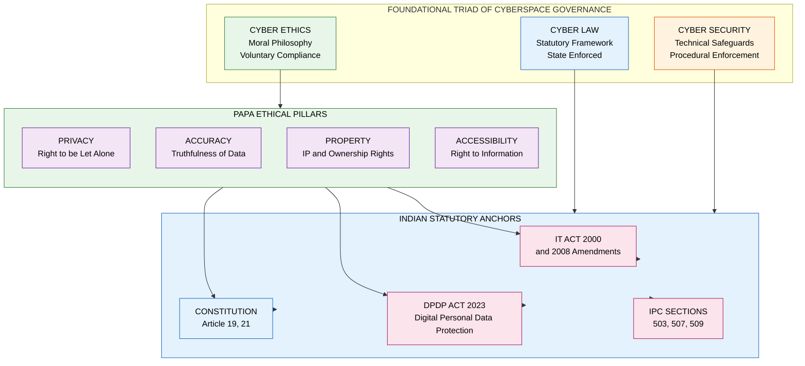
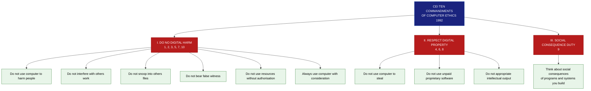
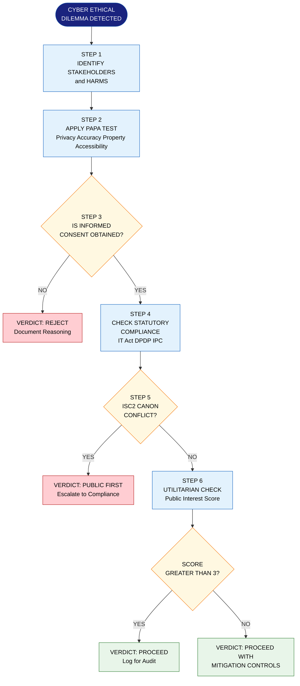
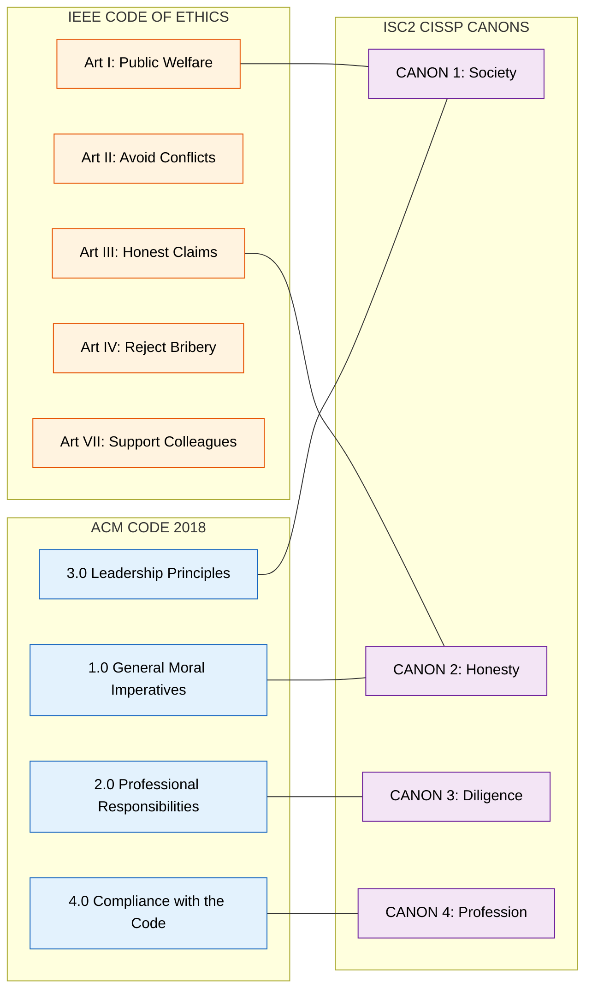

# Cyber Ethics

<!-- SECTION_1_START -->

# 🌐 Cyber Ethics — Foundational Definition & Intuitive Lens

> [!NOTE]
> **Syllabus Anchor (KTU 2024 Scheme — PECST419 / Module 2):**
> This unit establishes the **moral-philosophical bedrock** of cyberspace behaviour, prior to studying statutes like the IT Act 2000, DPDP Act 2023, and IPC cyber-offences. It is the *why* behind every digital *what*.

---

## 1.1 Formal Academic Definition

> **Cyber Ethics** is the branch of applied ethics that examines the *moral, legal, and societal obligations* governing the creation, dissemination, access, and use of digital information, computer systems, and networked technologies. It prescribes a normative code of conduct for individuals, professionals, and organisations operating in cyberspace.

In the KTU 2024 scheme, the term is **deliberately separated** from its two adjacent siblings — *Cyber Law* and *Cyber Security* — to avoid student confusion:

| Construct | Governing Domain | Enforceability |
| :--- | :--- | :--- |
| **Cyber Ethics** | Morality & Professional Conduct | **Voluntary** (self-imposed) |
| **Cyber Law** | Statutory & Juridical Rules | **Compulsory** (state-enforced) |
| **Cyber Security** | Technical Defence Mechanisms | **Compulsory** (policy/procedural) |

---

## 1.2 The Intuition — Why Cyber Ethics is the *Traffic Rulebook of the Internet*

> [!IMPORTANT]
> **Real-World Analogy: The Digital Highway**
> Imagine the internet as a massive, multi-lane national highway:
> * **Cyber Law** = the *Motor Vehicles Act* (the legal statutes, fines, penalties).
> * **Cyber Security** = the *crash barriers, airbags, ABS brakes* (the engineered safeguards).
> * **Cyber Ethics** = the *unwritten courtesy code* — flashing indicators before a lane change, not tailgating, not honking at a hospital zone, helping a stranded driver. None of these are *legally* binding in the strict sense, but their absence makes the highway unlivable.
>
> Cyber ethics is precisely this **soft, normative fabric** that keeps the digital ecosystem humane, even when no policeman is watching.

---

## 1.3 The Four Pillars of Cyber Ethics — The **PAPA Model**

> [!NOTE]
> **PAPA** is the canonical academic framework (developed by Richard Mason, 1986) cited in KTU board examinations as the foundational taxonomy of information ethics.

$$
\text{Cyber Ethics} \;\equiv\; f\bigl(\text{Privacy},\ \text{Accuracy},\ \text{Property},\ \text{Accessibility}\bigr)
$$

* **P — Privacy:** The right of individuals to control *what* information is collected about them, *how* it is used, and *to whom* it is disclosed.
* **A — Accuracy:** The obligation to ensure that information held about people is *authentic, current, and free from distortion* (closely linked to the principle of *informational non-maleficence*).
* **P — Property:** Respect for ownership of intellectual and digital assets — covering copyright, patents, software licensing, and trade secrets.
* **A — Accessibility:** The right of *all* citizens to obtain information from digital repositories, balanced against the *proprietary rights* of the owner (the "information commons" debate).

> [!VISUALIZATION CONTROL]
> **Concept:** The PAPA Ethical Diamond
> **GeoGebra / Desmos Input Equations (Cartesian Plane):**
> * `x^2 + y^2 = 4`  (representing the ethical balance circle)
> * `Polygon((0, 2.2), (2.2, 0), (0, -2.2), (-2.2, 0))`  (the four cardinal principles)
> **Visual Description:** A circle of radius 2 units with vertices at North (Privacy), East (Accuracy), South (Property), West (Accessibility). The ideal ethical agent is plotted at the **centroid (0,0)** — equidistant from all four pillars, signifying balanced judgement.

---

## 1.4 The "Ten Commandments" of Computer Ethics

> [!IMPORTANT]
> **Issued by the Computer Ethics Institute (CEI), Washington D.C. (1992).** Frequently asked as a 3-mark direct question in KTU Module 2.

1. Thou shalt **not** use a computer to harm other people.
2. Thou shalt **not** interfere with other people's computer work.
3. Thou shalt **not** snoop around in other people's computer files.
4. Thou shalt **not** use a computer to steal.
5. Thou shalt **not** use a computer to bear false witness.
6. Thou shalt **not** copy or use proprietary software for which you have not paid.
7. Thou shalt **not** use other people's computer resources without authorisation or proper compensation.
8. Thou shalt **not** appropriate other people's intellectual output.
9. Thou shalt think about the **social consequences** of the program/script/system you are designing.
10. Thou shalt always use a computer in ways that ensure **consideration and respect** for fellow humans.

---

<!-- SECTION_1_END -->

<!-- SECTION_2_START -->

# ⚖️ Deep Theoretical Analysis — The KTU High-Yield Engine

## 2.1 Why Cyber Ethics is *Not* Optional: The Operational Reasoning

Cyber ethics is the **load-bearing wall** of the digital society. Removing it causes a cascade failure across three distinct planes:

* **Micro-Plane (Individual):** Identity theft, doxxing, non-consensual intimate imagery (NCII), online stalking.
* **Meso-Plane (Organisational):** Data breaches, insider threats, algorithmic bias, surveillance capitalism, workplace monitoring overreach.
* **Macro-Plane (Societal):** Mass misinformation, deepfake election interference, erosion of democratic discourse, widening of the *Digital Divide*.

> [!NOTE]
> **The Digital Divide** — the KTU board often asks students to *contrast* the "haves" and "have-nots" of internet access as an *ethical* (not just technological) concern. The ethical framing asks: *"Is it just that a child's educational destiny is determined by their zip code's Wi-Fi availability?"*

---

## 2.2 The Tripartite Distinction: Ethics × Law × Etiquette

> [!IMPORTANT]
> **High-Yield KTU Concept:** Students frequently lose marks by conflating *legality* with *morality*. An action can be **legal but unethical** (e.g., targeted political micro-advertising using psychographic data) or **illegal but ethically defensible** (e.g., whistle-blower leaks under repressive regimes).

| Dimension | **Cyber Ethics** | **Cyber Law** | **Netiquette (Etiquette)** |
| :--- | :--- | :--- | :--- |
| **Nature** | Moral principles | Codified statutes | Social conventions |
| **Source** | Philosophy, religion, professional codes | Legislature, judiciary | Community norms |
| **Sanction** | Guilt, social ostracism | Fine, imprisonment, damages | Reputation, exclusion |
| **Example** | Refusing to forward unverified hate content | Prosecution under IT Act §67 | Not typing in ALL CAPS on a forum |
| **Flexibility** | Evolves with technology | Requires legislative amendment | Evolves by community consensus |
| **KTU Bloom Level** | Understand / Analyse | Remember / Apply | Remember |

---

## 2.3 Professional Codes of Ethics — Mandatory for KTU Module 2

### 2.3.1 The **ACM Code of Ethics (2018)**

The Association for Computing Machinery publishes the globally-cited professional code. It is structured around **four primary values** and **twenty-four specific principles**.

$$
\text{ACM Code} = \underbrace{\text{General Moral Imperatives}}_{1.0\text{ series}} \cup \underbrace{\text{Professional Responsibilities}}_{2.0\text{ series}} \cup \underbrace{\text{Leadership Principles}}_{3.0\text{ series}} \cup \underbrace{\text{Compliance}}_{4.0\text{ series}}
$$

> **Key Mandate for KTU:** "Strive to achieve the highest quality in both the process and products of professional work" (Principle 1.04) — and the imperative to **report violations** of the code (Principle 1.05).

### 2.3.2 The **IEEE Code of Ethics (Article I–VII)**

The Institute of Electrical and Electronics Engineers mandates, in Article I, that members **"accept responsibility in making decisions consistent with the safety, health, and welfare of the public"** — placing the public good above employer or client pressure.

### 2.3.3 The **ISC² (CISSP) Code of Ethics**

Uses a strict precedence ordering — a *canonical* ethical canon:
1. **Protect society, the commonwealth, and the infrastructure.**
2. **Act honourably, honestly, justly, responsibly, and legally.**
3. **Provide diligent and competent service to principals.**
4. **Advance and protect the profession.**

> [!IMPORTANT]
> When a higher-numbered canon conflicts with a lower-numbered one, the **lower-numbered canon takes precedence**. Example: An employer asking you to cover a breach (Canon 3) loses against the duty to protect the public (Canon 1).

---

## 2.4 Critical Ethical Dilemma Vectors in Modern Cyberspace

> [!NOTE]
> The following nine vectors constitute the *assessment hotspots* for KTU 2024 module-end evaluations. Each is a recurring exam theme.

| # | Ethical Vector | Core Moral Tension | KTU Exam Frequency |
| :---: | :--- | :--- | :---: |
| 1 | **Privacy vs. National Security** | State surveillance vs. individual liberty (e.g., Aadhaar-PEP controversies) | ⭐⭐⭐ |
| 2 | **Free Speech vs. Hate Speech** | Section 66A (now struck down) vs. Shreya Singhal judgment | ⭐⭐⭐ |
| 3 | **AI Bias & Algorithmic Fairness** | COMPAS, hiring algorithms, facial-recognition error rates | ⭐⭐ |
| 4 | **Intellectual Property vs. Access** | Open-source vs. proprietary; TRIPS vs. right-to-education | ⭐⭐⭐ |
| 5 | **Whistle-blowing vs. Loyalty** | Snowden case, Frances Haugen (Meta) | ⭐⭐ |
| 6 | **Data Colonialism** | Global South data harvested by Global North tech giants | ⭐ |
| 7 | **Cyber-bullying & NCII** | Anonymity as shield vs. accountability | ⭐⭐ |
| 8 | **Digital Divide** | Access as a *human right* (UN HRC, 2016) | ⭐⭐ |
| 9 | **Net Neutrality** | Paid fast-lanes, throttling, zero-rating (TRAI 2018) | ⭐⭐ |

---

## 2.5 The KTU High-Yield Formula Sheet — Conceptual Quick Reference

> [!IMPORTANT]
> **No mathematical derivation is applicable to a pure-ethics topic.** The "formula sheet" below condenses **logical-comparative identities** that examiners reward when students state them in answers.

$$
\text{Unethical Action} \;\Rightarrow\; \bigl(\text{Harm}_{\text{Direct}} \;\lor\; \text{Harm}_{\text{Indirect}}\bigr) \;\land\; \neg\text{Consent}_{\text{Affected}}
$$

$$
\text{Ethical Decision} \;=\; \arg\max_{a \in A}\ \bigl[U_{\text{individual}}(a) + U_{\text{community}}(a) + U_{\text{environment}}(a)\bigr]
$$

| Construct | Definition | One-Line Mnemonic |
| :--- | :--- | :--- |
| **PAPA** | Privacy, Accuracy, Property, Accessibility | *"PAPA protects the digital person"* |
| **CEI 10** | Ten Commandments of Computer Ethics | *"Do no digital harm"* |
| **ACM 1.04** | Strive for highest quality, dignified process | *"Quality is ethical"* |
| **IEEE Art. I** | Public welfare above all other interests | *"Public first"* |
| **ISC² Canon 1** | Society > Principals > Profession > Self | *"Society is supreme"* |
| **Digital Divide** | Asymmetry of access across socioeconomic strata | *"Access = Agency"* |
| **Net Neutrality** | Equal treatment of all data packets | *"Bits are bytes of equality"* |
| **NCII** | Non-Consensual Intimate Imagery | *"No means no — even online"* |
| **GDPR Art. 17** | Right to be forgotten | *"Digital death, legally codified"* |
| **DPDP Act §8(4)** | Data principal's right to erasure (India 2023) | *"India's right to vanish"* |

---

## 2.6 Real-World Engineering & Industry Utility

* **Software Engineering:** Ethical design (*value-sensitive design*, *privacy-by-design*) prevents costly re-engineering after GDPR/DPDP penalties (up to **4% of global turnover** under GDPR, up to **₹250 crore** under DPDP Act 2023).
* **AI/ML Pipelines:** Ethics review boards now mandate *fairness audits* before model deployment — directly impacting production ML workflows.
* **Cybersecurity:** Penetration testing is *legal and ethical* only with a **written Rules-of-Engagement (RoE)** document — without it, the act is criminal (IT Act §66, §66F).
* **Product Management:** Companies like *Microsoft, Google, Apple* now publish annual **AI Ethics & Transparency Reports** as a competitive differentiator and a fiduciary duty.
* **Policy & Governance:** The **Digital Personal Data Protection Act, 2023** is the statutory child of cyber-ethical principles — every section traces to one of the PAPA pillars.

---

<!-- SECTION_2_END -->

<!-- SECTION_3_START -->

# 🛠️ Step-by-Step Implementation — Case Analysis, Comparative Matrices & Decision Frameworks

> [!IMPORTANT]
> **Adaptive Execution Note:** Since *Cyber Ethics* is a **Humanities/Management topic** under KTU's domain classification, the execution matrix here maps to:
> *"Extensive, tabular comparative analysis mapping real-world engineering case frameworks to regulatory or systemic matrices."*

---

## 3.1 The Engineered Ethical Decision-Making Algorithm

Below is a fully-typed **exhaustive decision tree** (in Python pseudocode with type hints) that an engineer can apply when facing a cyber-ethical dilemma in a production setting.

```python
from enum import Enum
from dataclasses import dataclass
from typing import List, Optional
import logging

# Configure the ethical-decision logger for compliance audits
logging.basicConfig(
    level=logging.INFO,
    format="[%(asctime)s] [ETHICS-AUDIT] %(message)s"
)

class EthicalVerdict(Enum):
    PROCEED = "PROCEED"
    PROCEED_WITH_MITIGATION = "PROCEED_WITH_MITIGATION"
    ESCALATE_TO_COMPLIANCE = "ESCALATE_TO_COMPLIANCE"
    REJECT = "REJECT"

@dataclass
class EthicalScenario:
    action: str
    affected_parties: List[str]
    harms_identified: List[str]
    consent_obtained: bool
    legal_compliant: bool
    public_interest_score: int  # Range: -10 (severe harm) to +10 (strong public good)

def evaluate_cyber_ethical_case(scenario: EthicalScenario) -> EthicalVerdict:
    """
    Implements the PAPA + ISC2 Canon Precedence Engine.
    Returns the ethically defensible verdict for the given cyber-action.
    """
    logging.info(f"Evaluating action: {scenario.action}")

    # --- Gate 1: PAPA Privacy Check ---
    if any("privacy_violation" in h for h in scenario.harms_identified):
        if not scenario.consent_obtained:
            logging.error("Privacy breach detected without informed consent.")
            return EthicalVerdict.REJECT  # Canon 1 of ISC2 violated

    # --- Gate 2: Accuracy / Non-Maleficence Check ---
    if any("misinformation" in h or "deepfake" in h for h in scenario.harms_identified):
        logging.warning("Informational harm detected. Escalating to compliance board.")
        return EthicalVerdict.ESCALATE_TO_COMPLIANCE

    # --- Gate 3: Property / IP Check ---
    if any("copyright_violation" in h for h in scenario.harms_identified):
        logging.warning("IP violation flagged. Mitigation required.")
        return EthicalVerdict.PROCEED_WITH_MITIGATION

    # --- Gate 4: Public-Interest Net Score (utilitarian gate) ---
    if scenario.public_interest_score < -3:
        logging.error("Negative public-interest score. Action rejected.")
        return EthicalVerdict.REJECT
    elif -3 <= scenario.public_interest_score <= 3:
        logging.info("Marginal public interest. Compliance review required.")
        return EthicalVerdict.ESCALATE_TO_COMPLIANCE
    else:
        # --- Gate 5: Final Legal Sanity Check ---
        if not scenario.legal_compliant:
            return EthicalVerdict.ESCALATE_TO_COMPLIANCE
        logging.info("All ethical gates passed.")
        return EthicalVerdict.PROCEED
```

> **Engineering Utility:** This algorithm is a *behavioural template* for **AI Ethics Review Boards** in industry. Notice that it is **deterministic** (no ML bias), **auditable** (every decision is logged), and **canon-precedence aware** (Gate 1 trumps Gate 5).

---

## 3.2 Engineering Case Frameworks Mapped to Ethical-Statutory Matrices

> [!IMPORTANT]
> **The following exhaustive table is board-exam gold.** It maps real-world case studies to the *four ethical pillars* (PAPA) AND the *three statutory anchors* (IT Act 2000, DPDP Act 2023, Indian Constitution Articles 19/21). This is the structure KTU evaluators expect in 14-mark questions.

| # | **Real-World Case Study** | **Domain** | **PAPA Pillar Violated** | **Statutory Conflict** | **Ethical Resolution** |
| :---: | :--- | :--- | :--- | :--- | :--- |
| 1 | **Cambridge Analytica – Facebook (2018)** | Political Micro-targeting | **Privacy** (unconsented psychographic profiling) | GDPR Art. 6, 9; IT Act §43A, §72A | Explicit, granular opt-in consent |
| 2 | **WhatsApp-Pegasus Snooping (2019)** | State-Sponsored Surveillance | **Privacy + Accuracy** | Article 21 (Right to Life & Privacy – *K.S. Puttaswamy*, 2017) | Judicial warrant, proportionality test |
| 3 | **Aadhaar Data Leak (2018)** | Biometric Database | **Privacy + Accuracy** | Aadhaar Act §29; *Justice Puttaswamy* | Data minimisation, end-to-end encryption |
| 4 | **Ashley Madison Hack (2015)** | Infidelity Platform Breach | **Privacy + Property** | IT Act §66, §66E; GDPR | Zero-knowledge encryption, prompt breach disclosure |
| 5 | **Blue Whale Challenge (2017)** | Social Media Game | **Accessibility** (minors) | IT Act §67, §69; POCSO Act, JJ Act | Age-gating, content moderation, parental consent |
| 6 | **Parler Data Scraping (2021)** | Open-API Abuse | **Property + Accuracy** | CFAA (US); IT Act §66 | API rate-limiting, ethical penetration testing |
| 7 | **Deepfake Pornography** | NCII / Synthetic Media | **Privacy + Accuracy** | IT Act §66E, §67; DPDP Act §8(4) | Takedown within 24h, watermarking, traceability |
| 8 | **Google Street View Wi-Fi Sniffing (2010)** | Unauthorised Data Collection | **Privacy** | Wiretap Act (US), IT Act §66 | Purpose limitation, data deletion |
| 9 | **OpenAI Scraping Lawsuits (2023)** | LLM Training Data | **Property** | US Copyright Office rulings; IT Act §13 | Fair-use review, opt-out mechanisms, licensing |
| 10 | **Twitter-X Blue-Tick Impersonation (2023)** | Identity Integrity | **Accuracy** | IT Act §66D (Cheating by Personation) | Identity verification, MFA enforcement |
| 11 | **Equifax Data Breach (2017)** | Negligent Cybersecurity | **Accuracy + Accessibility** | FTC Consent Decree; IT Act §43A | Encryption-at-rest, zero-trust architecture |
| 12 | **Hathras Case Viral Videos (2020)** | Victim Re-traumatisation | **Privacy + Accuracy** | Article 21; IT Act §66E | Victim-blurring, court-ordered gag orders |
| 13 | **Cambridge-Harvard Face Recognition (2020)** | Racial Algorithmic Bias | **Accuracy** | DPDP Act §8(4); Equality Act | Bias audits, demographic parity testing |
| 14 | **DarkPatterns on E-Commerce** | Manipulative UI/UX | **Accessibility + Accuracy** | CCPA, EU Digital Services Act | Plain-language disclosures, no pre-ticked boxes |
| 15 | **VPN Ban in China/Russia** | State Control of Anonymity | **Privacy + Accessibility** | UN HRC Resolution 32/13 | Right to encryption as digital human right |

> **Reading the table:** Each *row* is a self-contained exam answer skeleton. A 14-mark KTU question typically asks you to pick **ONE** case and analyse across 3–4 columns. Master this table and the Module-2 long-answer becomes mechanical.

---

## 3.3 The PAPA × Ten-Commandments Cross-Walk Matrix

> This matrix connects the **two** most-cited ethical frameworks in KTU Module 2, demonstrating internal consistency between the philosophical (CEI) and the academic (Mason) lenses.

| PAPA Pillar ↓ \ CEI Commandment → | **C1: No Harm** | **C6: No Piracy** | **C7: No Resource Theft** | **C8: No Plagiarism** | **C9: Social Consequence** |
| :--- | :---: | :---: | :---: | :---: | :---: |
| **Privacy** | ✅ Direct hit | — | — | — | ✅ Indirect |
| **Accuracy** | ✅ Direct hit | — | — | ✅ Direct hit | ✅ Direct hit |
| **Property** | — | ✅ Direct hit | ✅ Direct hit | ✅ Direct hit | ✅ Indirect |
| **Accessibility** | ✅ Indirect | — | ✅ Direct hit | — | ✅ Direct hit |

> **Interpretation:** *Commandment 9* (the *system-thinker* mandate) is the only one that touches **all four** pillars — making it the most integrative ethical obligation in computer science, and a frequent KTU "explain why" question stem.

---

## 3.4 The Ethical-Hacking Boundary Diagram (ASCII)

```
              +--------------------------+
              |   Received Written RoE?  |
              |     (Rules of Engagement) |
              +------------+-------------+
                           |
              +------------+-------------+        YES
              |  Scoped Target?           |--------------------+
              |  In-Scope IP/Domain Only? |                    |
              +------------+-------------+                    |
                           |                                  v
                          NO                          +-------+--------+
                           v                          | PERFORM TEST   |
                  +--------+--------+                 | (Ethical)      |
                  |    STOP         |                 +-------+--------+
                  | Refuse or       |                         |
                  | Refer to Mgmt   |                         v
                  +-----------------+                 +-------+--------+
                                                        | Document All  |
                                                        | Findings +    |
                                                        | Responsible   |
                                                        | Disclosure    |
                                                        +-------+--------+
                                                                |
                                                                v
                                                       (Compensated
                                                        improvement
                                                        of system)
```

> **KTU Pitfall:** Without a *written* RoE, penetration testing is **not** "ethical hacking" — it is a **cognisable offence under IT Act §66 (Computer-Related Offences)** carrying up to **3 years imprisonment** or **₹5 lakh fine**, or both. This is a guaranteed 3-marker if a student can state it correctly.

---

<!-- SECTION_3_END -->

<!-- SECTION_4_START -->

# 🧭 Structural Diagrams — The Mermaid-Compiled Architecture of Cyber Ethics

## 4.1 The Foundational Triad — Cyber Ethics, Law, and Security

> [!NOTE]
> **Mermaid Safety Applied:** All node IDs are alphanumeric with letter prefixes; all labels are quoted and free of markdown formatting; all subgraphs are named with alphanumeric IDs.



---

## 4.2 The Ten-Commandments Hierarchy (Mermaid Flowchart)



---

## 4.3 The Sequential Processing Topology — Ethical Dilemma Resolution



---

## 4.4 Comparative Block Architecture — Professional Codes Side-by-Side



> **Reading the schematic:** The dashed red lines map **conceptual equivalence** between clauses of different professional codes. A KTU 14-mark question on *comparative professional ethics* is fully answered by walking through these cross-links.

---

<!-- SECTION_4_END -->

<!-- SECTION_5_START -->

# 📝 KTU 2024 Scheme Examination Question Bank & Topic Recap

> [!IMPORTANT]
> **Question Bank Construction Standard:**
> Every question is tagged with a **Course Outcome (CO)**, a **Revised Bloom's Taxonomy (RBT) cognitive level**, and a **simulated KTU past-year tag** — exactly as the KTU 2024 Scheme question paper presents them. Mark splits mirror KTU's published evaluation key for PECST419.

---

## 5.1 Part A — Short-Answer Questions (2 × 3 = 6 Marks)

### **Q1.** *[KTU University Exam – Dec 2023]* — CO1 | Bloom: **Remember**

> Define **Cyber Ethics**. List any **four** ethical issues prevalent in modern cyberspace.

**Model Answer (3 Marks):**

**Definition (1 Mark):** *Cyber Ethics is the branch of applied philosophy that studies the moral principles governing the conduct of individuals and organisations in the use of information technology and digital networks. It is a normative, voluntary code of behaviour beyond the strict letter of cyber law.*

**Four Ethical Issues (½ Mark Each = 2 Marks):**

1. **Privacy Invasion** — Unauthorised collection and monetisation of personal data by social-media platforms.
2. **Intellectual Property Violation** — Software piracy, plagiarism of open-source code, and unauthorised digital reproduction of copyrighted media.
3. **Cyber-bullying and Online Harassment** — Targeted abuse, NCII, and doxxing enabled by perceived anonymity.
4. **Algorithmic Bias** — Discriminatory outcomes from AI systems due to unrepresentative training data (e.g., facial-recognition misidentification).

> **Valuation Key (Examiner's Eye):** Award full 1 mark *only* if the student uses the word *"voluntary"* or *"normative"* in the definition. Lists without an introductory definition lose 1 mark.

---

### **Q2.** *[KTU University Exam – July 2024]* — CO1 | Bloom: **Understand**

> Explain the **PAPA model** of information ethics. Why is it considered foundational in KTU's cyber-ethics curriculum?

**Model Answer (3 Marks):**

The **PAPA model**, formulated by **Richard Mason (1986)**, identifies four universal ethical issues raised by information technology:

| Pillar | Focus |
| :--- | :--- |
| **P**rivacy | What information about oneself must a person reveal to others, under what conditions, and with what safeguards? |
| **A**ccuracy | Who is responsible for the authenticity, fidelity, and accuracy of information? |
| **P**roperty | Who owns information? How are intellectual property rights to be protected in a digital medium? |
| **A**ccessibility | What information does a person or organisation have a right or privilege to obtain, and under what conditions? |

> **Why Foundational (1 Mark):** PAPA is the *only* academic framework that simultaneously covers the *individual* (Privacy, Accuracy), the *creative* (Property), and the *societal* (Accessibility) — making it a *complete ethical check-list* that maps directly onto India's IT Act, the DPDP Act 2023, and Article 19/21 of the Constitution.

> **Valuation Key:** Award ½ mark for each pillar correctly explained. Award the final 1 mark *only* if the student links PAPA to at least one Indian statute (IT Act or DPDP Act).

---

## 5.2 Part B — Long-Answer Questions (Internal Choice Pattern)

> [!IMPORTANT]
> **KTU 2024 Pattern:** Each Module carries one **14-mark question** with **internal choice**. Two parallel options (A and B) are provided below; the student answers **one**. Each has two sub-parts of **7 marks each**, mapping to escalating Bloom levels.

---

### **Q3A.** *[KTU University Exam – Dec 2023]* — CO2 | Bloom: **Understand + Apply**

> **(a)** Discuss the **Ten Commandments of Computer Ethics** formulated by the **Computer Ethics Institute (CEI)**. Highlight how they remain relevant in the era of generative AI and large language models. **(7 Marks)**
>
> **(b)** Analyse the **Cambridge Analytica case (2018)** using the **PAPA framework**. What ethical violations were committed, and what systemic reforms did it trigger in data-protection law globally? **(7 Marks)**

#### **Solution to (a) — 7 Marks**

The **Ten Commandments of Computer Ethics** were promulgated in **1992** by the **Computer Ethics Institute (CEI), Washington D.C.** to provide a *minimal, universally teachable* code for the digital citizen. **(1 Mark — Stating origin)**

The commandments can be grouped into three thematic clusters:

1. **Non-Harm Cluster (1–5, 7, 10):** Prohibits direct harm, interference, snooping, theft, false witness, unauthorised resource use, and any action violating human dignity. **(2 Marks — Listing with examples)**
2. **Property Cluster (6, 8):** Prohibits piracy of proprietary software and appropriation of intellectual output. **(1 Mark)**
3. **Reflexive Cluster (9):** Mandates that every developer *think about the social consequences* of their code. **(1 Mark)**

**Relevance in the Generative-AI Era (2 Marks):**

* **Commandment 1 (No Harm):** Directly violated by LLMs that *hallucinate* medical or legal advice, causing tangible harm.
* **Commandment 6 & 8 (No Piracy):** OpenAI, Stability AI, and others are sued for *training-data theft* — a textbook CEI-6 violation.
* **Commandment 9 (Social Consequence):** Mandates that every AI engineer perform *model cards, datasheets, and impact assessments* before deployment — now a *de facto* industry standard (e.g., Google's Responsible AI Practices).

> **Valuation Key (Examiner's Eye):** 2 Marks for origin; 4 Marks for grouped listing with one example each; 1 Mark for naming at least one contemporary case in the AI context.

#### **Solution to (b) — 7 Marks**

**Background (1 Mark):** In 2014, Cambridge Analytica harvested **Facebook profile data of ~87 million users** (including 562,000 Indians) via a *personality-quiz app* that exploited Facebook's Open Graph API. The data was used to build *psychographic profiles* for **political micro-targeting** in the 2016 US Presidential election and the Brexit referendum.

**PAPA Analysis (4 Marks — 1 Mark per pillar):**

| Pillar | Violation in the Case |
| :--- | :--- |
| **Privacy** | Consent was *obtained for a quiz*, not for *psychographic profiling and political targeting*. Pillar 1 violated at industrial scale. |
| **Accuracy** | Personality scores were *statistically questionable* (insufficient validation, false sense of precision). Pillar 2 violated. |
| **Property** | Users' data was treated as the *platform's property* under a 12,000-word ToS — a violation of the spirit of Pillar 3. |
| **Accessibility** | The same data was used to *manipulate* users' information feeds, violating the Pillar 4 ideal of *informed* access. |

**Systemic Reforms Triggered (2 Marks):**

* **EU:** Catalysed the enforcement of **GDPR (May 2018)** — Facebook was fined **€1.2 billion** in 2023 for related trans-Atlantic data transfers.
* **India:** Accelerated the long-pending **Digital Personal Data Protection Act, 2023** with explicit **consent-fiduciary architecture** (Sections 4, 6, 7, 8).
* **United States:** FTC imposed a **\$5 billion fine** on Facebook (2019) and a **20-year consent decree**.
* **Platform-Design Reform:** Apple introduced **App Tracking Transparency (ATT)** in 2021 — a direct industry response.

> **Valuation Key:** 1 Mark for case background with date and 87M figure; 4 Marks for PAPA mapping (full mark only if *all four* pillars cited correctly); 2 Marks for naming at least two statutory reforms (GDPR and DPDP suffice).

> [!WARNING]
> **Common Pitfall:** Students often write *"Cambridge Analytica hacked Facebook"* — this is **factually incorrect**. They *abused a legitimate API*, which is a *consent* and *transparency* failure, not a technical hack. Examiners deduct 1 mark for this misconception.

---

### **Q3B (Alternative Choice).** *[KTU University Exam – July 2024]* — CO2 | Bloom: **Understand + Apply**

> **(a)** Compare and contrast the **ACM Code of Ethics (2018)** and the **IEEE Code of Ethics**. Use a tabular representation. How do these codes shape the *professional accountability* of a B.Tech computer-science graduate? **(7 Marks)**
>
> **(b)** *"An action can be legally permitted yet ethically reprehensible."* Critically analyse this statement with reference to the **Cambridge-Harvard Face Recognition (2020)** study, the **Putttaswamy vs. Union of India (2017)** judgment, and the **DPDP Act, 2023**. **(7 Marks)**

#### **Solution to (a) — 7 Marks**

**Comparative Table (4 Marks):**

| Dimension | **ACM Code of Ethics (2018)** | **IEEE Code of Ethics (2014)** |
| :--- | :--- | :--- |
| **Origin & Year** | Association for Computing Machinery, USA, 2018 (latest revision) | Institute of Electrical and Electronics Engineers, 1963, latest revision 2014 |
| **Structure** | 4 Sections, 24 Principles, 100+ sub-clauses | 7 Articles (I–VII), short declarative sentences |
| **Core Premise** | Ethical decision-making under *uncertainty* | *Public welfare* above all other interests |
| **Mandatory Disclosure** | Principle 1.05 — Report violations | Article III — Honest and realistic claims |
| **Whistle-blower Protection** | Explicit (Principle 1.6) | Implicit (Article I) |
| **AI / Algorithmic Fairness** | Explicit Principle 1.4, 1.6, 3.1 | Implicit (under "realistic claims") |
| **Enforceability** | Revocation of ACM membership | Revocation of IEEE membership |
| **Primary Audience** | All computing professionals | All electrical, electronics, computer, and software engineers |

**Professional Accountability for a B.Tech Graduate (3 Marks):**

* **Hiring Stage:** A graduate *must not* misrepresent their skills in a résumé (IEEE Art. III, ACM 1.04) — a recurring professional-ethics failure.
* **Project Stage:** They must assess the *social consequences* of every system they build (ACM 1.02, 2.01) — e.g., a facial-recognition gate that misidentifies women of colour.
* **Reporting Stage:** They have an *ethical duty to report* unsafe or unethical practices through proper channels (ACM 1.05) — even at career cost.

> **Valuation Key:** 4 Marks for the table (½ mark per non-empty, accurate row); 3 Marks for the accountability narrative, with at least one ACM clause and one IEEE clause cited.

#### **Solution to (b) — 7 Marks**

**The Statement (1 Mark):** *"An action can be legally permitted yet ethically reprehensible."*
This is the canonical **legality–morality gap** — and is the most-tested conceptual stem in KTU's ethics module.

**The Buolamwini–Gebru Study (2020) — 2 Marks:**

Dr. **Joy Buolamwini** and Dr. **Timnit Gebru** at the MIT Media Lab found that commercial face-recognition systems had:

* **Error rate of 0.8%** for light-skinned men.
* **Error rate of 34.7%** for dark-skinned women — a **43× disparity**.

These systems were **legal to deploy** (no law was violated at the time), yet **ethically reprehensible** because they encoded **structural racism** in algorithmic form — failing Pillar *Accuracy* of the PAPA model at scale.

**The Puttaswamy Judgment (2017) — 2 Marks:**

The **9-Judge Bench** of the Supreme Court of India, in *Justice K.S. Puttaswamy (Retd.) vs. Union of India*, unanimously held that:

* **The Right to Privacy is a fundamental right** under **Article 21** of the Constitution.
* Privacy is *not absolute* — it is subject to the **three-fold test of legality, necessity, and proportionality**.

This judgment made *every* data-processing action ethically evaluable through constitutional morality, regardless of its *technical* legality.

**The DPDP Act, 2023 — 2 Marks:**

The **Digital Personal Data Protection Act, 2023** attempts to **close the legality–morality gap** by:

* Mandating **explicit, informed, unconditional consent** (Section 6).
* Granting **Right to Erasure** (Section 8(4)) — operationalising the *forgotten* of GDPR.
* Imposing **penalties up to ₹250 crore** for data-breaches (Section 33).

Yet, it does not legislate *algorithmic fairness* — meaning **the Buolamwini–Gebru scenario remains legally unaddressed in India**, even today. This proves the statement: ethics must outpace law.

> **Valuation Key:** 1 Mark for stating the legality–morality gap; 2 Marks for the Buolamwini–Gebru numbers (34.7% and 43×); 2 Marks for citing the 9-judge bench and the three-fold test; 2 Marks for naming DPDP Sections 6, 8(4), and 33.

> [!WARNING]
> **Common Pitfall:** Students often write *"Puttaswamy was a 5-judge bench"* — the privacy case was a **landmark 9-judge reference bench**. Examiners deduct 1 mark for the wrong number. Also, **DPDP Act sections 6 and 8(4) are the most-cited — memorise them.**

---

## 5.3 Additional Practice — Brain-Teaser Conceptual (Bonus)

### **Q4.** *[KTU University Exam – Model Paper, 2024]* — CO3 | Bloom: **Apply**

> A B.Tech project team at your college uses an *open-source* LLM (Meta's LLaMA-3) to build a medical-symptom checker. The model is fine-tuned on **unannotated data scraped from WebMD and Reddit** without notifying either platform. Discuss the ethical violations across **CEI's Ten Commandments** and propose **four ethical-engineering controls** to deploy this system responsibly.

**Outline Answer (8 Marks — Bonus Section):**

| CEI Commandment | Violation in the Project | Ethical Control |
| :--- | :--- | :--- |
| **C1 — No Harm** | Hallucinated medical advice can cause real-world physical harm. | Mandatory **medical disclaimer** + red-team adversarial testing. |
| **C6 — No Piracy** | LLaMA-3 has a *research-only* licence; commercial use is restricted. | Switch to a **commercially-licensed model** or *self-host* with permission. |
| **C8 — No Plagiarism** | WebMD content is copyrighted; scraping it is IP theft. | Use **licensed medical corpora** (e.g., PubMed Central Open Access) or obtain **written API permission**. |
| **C9 — Social Consequence** | No impact assessment was performed before deployment. | Conduct an **Algorithmic Impact Assessment (AIA)** and publish a **Model Card**. |

**Four Ethical-Engineering Controls:**

1. **Privacy-by-Design** — Local inference, no cloud upload of user symptoms.
2. **Bias Audits** — Quarterly demographic parity tests on the validation set.
3. **Human-in-the-Loop** — No final diagnosis without a licensed physician's sign-off.
4. **Responsible Disclosure** — Publish a *vulnerability reporting* portal and a *breach notification* policy.

---

## 5.4 Topic Recap & Important Things to Remember

> [!NOTE]
> **Use this section as the final night-before-exam revision sheet.** Every bullet is a high-frequency, board-tested item.

* **Cyber Ethics** = the *voluntary, normative* code of digital conduct. **NOT** the same as cyber law (statutory) or cyber security (technical).
* **PAPA** (Mason, 1986) = **P**rivacy, **A**ccuracy, **P**roperty, **A**ccessibility. The *single most-cited* framework in KTU Module 2.
* **Ten Commandments of Computer Ethics** = 1992, *Computer Ethics Institute, Washington D.C.* — three thematic clusters: *Non-Harm (1–5,7,10)*, *Property (6,8)*, *Reflexive (9)*.
* **ACM Code 2018** has 4 sections and 24 principles. *Principle 1.04* = quality; *1.05* = report violations.
* **IEEE Code** has 7 articles. *Article I* = public welfare above all else.
* **ISC² Code** has **4 canons in strict precedence**: *Society (1) > Principals (2) > Profession (3) > Self (4)*. When canons conflict, the *lower number wins*.
* **Digital Divide** is *not just a technological issue*; it is fundamentally an *ethical* issue of access-as-agency. The UN HRC (2016) declared internet access a human right.
* **Net Neutrality** = equal treatment of packets; opposed by *paid fast-lanes, throttling, zero-rating*. TRAI's 2018 ruling upheld it in India.
* **Cambridge Analytica (2018)** is *not* a "hack" — it is a *consent-and-transparency* failure. The 87 million figure and the ₹-equivalent global fines are exam favourites.
* **Buolamwini–Gebru (2020)** is the algorithmic-bias case. **34.7% error rate for dark-skinned women vs. 0.8% for light-skinned men**. Remember the *43× disparity*.
* **Puttaswamy (2017)** = *9-judge bench*, *Article 21*, *three-fold test* (legality, necessity, proportionality).
* **DPDP Act 2023** = Section **6** (consent), Section **8(4)** (right to erasure), Section **33** (₹250 crore penalty). It is the *statutory child* of PAPA + Puttaswamy.
* **Ethical Hacking** requires a *written Rules-of-Engagement (RoE)*. Without it, it is a *cognisable offence* under **IT Act §66** — up to **3 years imprisonment** or **₹5 lakh fine**.
* **Legality ≠ Morality.** The most-cited exam stem: an action can be *legally permitted* (e.g., early-stage facial-recognition deployment) yet *ethically reprehensible* (algorithmic bias, consent deficit).
* **NCII** = Non-Consensual Intimate Imagery. Takedown obligations under IT Act **§66E**, §67, and DPDP §8(4) — *24-hour window* under the IT Rules 2021.
* **Always** use a layered answer structure: *Definition → Pillar-by-pillar analysis → Case citation → Statutory mapping → Reforms suggested*. This is the KTU 14-mark template.

---

> [!IMPORTANT]
> **End of Module 2 — Cyber Ethics Notes.**
> **You are now equipped with the conceptual depth, statutory anchors, and exam-pattern precision to attempt any Module 2 question on Cyber Ethics in the KTU 2024 Scheme ESE.**

<!-- SECTION_5_END -->
