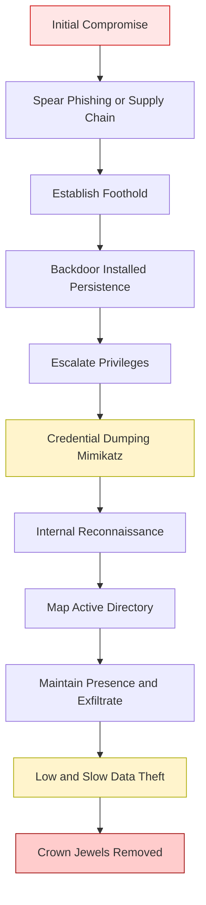
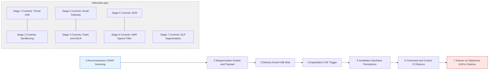
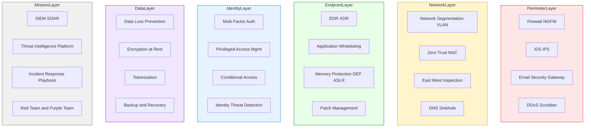

# Cyber Offences- Strategic Attacks

<!-- SECTION_1_START -->
# Cyber Offences: Strategic Attacks

## 1.1 Formal Definition (KTU 2024 Syllabus Terminology)

> [!NOTE]
> **Strategic Cyber Attack (KTU Module 2 Definition):** A *strategic cyber attack* is a long-term, goal-oriented, and highly resourced offensive cyber operation designed to inflict disproportionate political, military, economic, or ideological damage on a nation-state, critical infrastructure, or large enterprise. Unlike opportunistic cybercrime, strategic attacks follow a structured **Cyber Kill Chain**, employ **Advanced Persistent Threat (APT)** methodologies, and target high-value assets such as power grids, defense networks, financial systems, and government databases.

A strategic attack is differentiated from a tactical attack by three canonical parameters: **persistence (dwell time)**, **objective alignment with state/actor policy**, and **asymmetric impact (low cost to attacker, catastrophic cost to defender)**. The **MITRE ATT\&CK** framework classifies these attacks into **14 tactical stages** spanning Reconnaissance to Impact.

### 1.2 Intuitive Overview — Real-World Analogies

> [!IMPORTANT]
> **Analogy — The Bank Vault vs. The Bank Tunnel:**
> *Tactical cybercrime* is like a pickpocket — quick, opportunistic, low-value.
> *Strategic attack* is like a criminal syndicate digging a **1 km tunnel** under a bank vault for **6 months**, bypassing every guard, every alarm, every camera — emerging only on the day a nation’s gold reserves are about to be moved. It is **patient**, **planned**, and **politically motivated**.

| Parameter | Tactical Attack | Strategic Attack |
|---|---|---|
| Duration | Minutes to hours | Months to years |
| Motivation | Financial / personal | Political / military / ideological |
| Resources | Single attacker / commodity malware | Nation-state / APT group / millions of USD |
| Target | Any vulnerable host | Critical national infrastructure (CNI) |
| Sophistication | Off-the-shelf exploits | **Zero-day** exploits, custom implants |
| Attribution | Often traceable | Deliberately obfuscated |

### 1.3 Key Terminology & Constants

- **APT (Advanced Persistent Threat)** — A stealthy threat actor, typically state-sponsored, that gains long-term network access.
- **Zero-Day Exploit** — An exploit targeting a vulnerability unknown to the software vendor ($t_{disclosure} = 0$).
- **DDoS (Distributed Denial-of-Service)** — A volumetric attack generating **> 1 Tbps** traffic (record: **5.6 Tbps** — Cloudflare, Oct 2024).
- **CNI (Critical National Infrastructure)** — Power, water, telecom, banking, defense.
- **Kill Chain** — Lockheed Martin's **7-stage** model of an attack lifecycle.
- **Stuxnet** — First known cyber weapon to cause **physical destruction** of centrifuges at Natanz, Iran (2010).
- **WannaCry** — Strategic-grade ransomware (2017), 230,000+ computers in 150 countries in **24 hours**.

### 1.4 Standard Metrics in Cyber Offences

> [!IMPORTANT]
> **Industry-Standard Cyber Attack Metrics:**
> - **MTTD (Mean Time to Detect):** **207 days** (IBM Cost of a Data Breach 2024 average).
> - **MTTR (Mean Time to Respond):** **73 days** (industry average).
> - **Dwell Time:** $D_t = T_{detect} - T_{initial\_access}$.
> - **Cost per Record Breached:** **USD 169** (2024 global average).
> - **Annual Global Cybercrime Cost (2024 estimate):** **USD 9.5 trillion** (Cybersecurity Ventures).

### 1.5 Visualization of Strategic Attack Progression

> [!VISUALIZATION CONTROL]
> **Concept:** Cumulative Impact of a Strategic APT Campaign Over Time
> **GeoGebra / Desmos Input Equations:**
> * $f(t) = \dfrac{1}{1 + e^{-0.3(t - 30)}}$ — Logistic S-curve of attack impact
> * $g(t) = 0.05 \cdot t$ — Defensive readiness (linear)
> * $h(t) = f(t) - g(t)$ — Net compromise gap
> **Visual Description:** Plot $f(t)$ as a red S-curve starting flat, accelerating around $t = 30$ days, plateauing near 1.0. Plot $g(t)$ as a blue straight line. The shaded region $h(t) > 0$ represents the window of strategic dominance by the attacker.

### 1.6 The Risk Equation for Strategic Attacks

$$Risk = Threat \times Vulnerability \times Impact$$

Where $Threat$ is the actor capability (e.g., nation-state $= 1.0$, script-kiddie $= 0.1$), $Vulnerability$ is the unpatched exposure (0 to 1), and $Impact$ is the asset criticality multiplier. For CNI, $Impact \geq 10$, justifying massive defensive budgets.

<!-- SECTION_1_END -->

<!-- SECTION_2_START -->
# 2. Deep Theoretical Analysis & KTU High-Yield Cheat Sheet

## 2.1 Classification of Strategic Attacks

Strategic attacks can be taxonomized along **four orthogonal axes**: actor, vector, target, and intent.

### A. By Actor

| Actor Class | Examples | Resources | Attribution Difficulty |
|---|---|---|---|
| Nation-State APT | APT28 (Fancy Bear), APT1, Lazarus | Billions USD | Very High |
| State-Sponsored Proxy | Cozy Bear, Sandworm | Hundreds of millions USD | High |
| Cyberterrorist Group | ISIS Cyber Caliphate, APT33 | Low to medium | Medium |
| Hacktivist Collective | Anonymous, LulzSec | Volunteer hours | Low |
| Organized Cybercrime (strategic tier) | REvil, DarkSide | Tens of millions USD | Medium |
| Insider (Strategic) | Edward Snowden-type | Authorized access | Low |

### B. By Vector

| Vector | Description | Strategic Use Case |
|---|---|---|
| **Spear Phishing** | Targeted email with custom payload | Initial access to gov/defense |
| **Watering Hole** | Compromise trusted website | Targeting sector-specific users |
| **Supply Chain** | Inject malware into vendor software | SolarWinds (2020), 18,000 victims |
| **Zero-Day Exploit** | Use undisclosed CVE | Stuxnet (4 zero-days), Pegasus |
| **Living-off-the-Land (LotL)** | Abuse legitimate OS tools (PowerShell, WMI) | Stealthy lateral movement |
| **DNS Tunneling / C2** | Covert channel for exfiltration | Long-term data theft |
| **ICS/SCADA Manipulation** | Attack industrial control systems | Stuxnet, Industroyer (Ukraine 2016) |

### C. By Target (CNI Sectors)

The **CISA 16 Critical Infrastructure Sectors** are the primary strategic targets:
1. Energy
2. Water \& Wastewater
3. Transportation
4. Communications
5. Information Technology
6. Financial Services
7. Healthcare \& Public Health
8. Government Services
9. Defense Industrial Base
10. Emergency Services
(\ldots 6 more sectors)

### D. By Intent

- **Cyber Espionage** — IP theft, state secrets.
- **Cyber Warfare** — Disabling adversary's military/command capability.
- **Cyber Terrorism** — Spreading fear, disrupting civilian life.
- **Strategic Sabotage** — Physical destruction (Stuxnet).
- **Influence Operations** — Election interference (2016, 2020).
- **Strategic Ransomware** — Disruptive, not just financial (Colonial Pipeline 2021, USD 4.4 M ransom).

## 2.2 The Lockheed Martin Cyber Kill Chain (Mandatory for KTU)

The Kill Chain is the **canonical 7-stage model** for a strategic attack:

1. **Reconnaissance** — OSINT, passive scanning.
2. **Weaponization** — Crafting exploit + payload (e.g., malicious PDF + RAT).
3. **Delivery** — Email, USB, web drive-by.
4. **Exploitation** — Triggering the vulnerability.
5. **Installation** — Persistence (registry, services, bootkit).
6. **Command \& Control (C2)** — Beacon to attacker server (HTTPS, DNS).
7. **Actions on Objectives** — Exfiltration, destruction, manipulation.

> [!IMPORTANT]
> **Defender's Goal:** "Break the chain at any of the 7 stages." Each stage broken = attack neutralized. **KTU favourite line: "Defense-in-depth corresponds to kill-chain-stage segmentation."**

## 2.3 Advanced Persistent Threat (APT) Lifecycle (Mandiant Model)

A more modern model with **5 phases**:

1. **Initial Compromise** — Spear phishing, supply chain.
2. **Establish Foothold** — Backdoor, persistence.
3. **Escalate Privileges** — Credential dumping (Mimikatz).
4. **Internal Reconnaissance** — Map AD, identify crown jewels.
5. **Maintain Presence \& Exfiltrate** — Long-term, low-and-slow data theft.

Average APT dwell time: **$D_t \approx 207$ days** (Mandiant 2024).

## 2.4 KTU High-Yield Formula Sheet

| Concept | Formula / Parameter | Notes |
|---|---|---|
| Risk | $R = T \times V \times I$ | Threat $\times$ Vulnerability $\times$ Impact |
| Dwell Time | $D_t = T_{detect} - T_{access}$ | Lower is better; APT target: $< 24$ hrs |
| Detection Coverage | $C_d = \dfrac{N_{detected}}{N_{total}} \times 100\%$ | Goal: $C_d \geq 95\%$ |
| False Positive Rate | $FPR = \dfrac{FP}{FP + TN}$ | Industry target: $< 5\%$ |
| AES-256 Key Space | $2^{256} \approx 1.16 \times 10^{77}$ | Brute-force infeasible ($\approx 10^{60}$ years) |
| DDoS Amplification Factor | $AF = \dfrac{B_{reflected}}{B_{request}}$ | NTP: $AF \approx 556\times$, Memcached: $AF \approx 51,000\times$ |
| Attack Surface | $AS = \sum_{i=1}^{n} (E_i \times C_i \times W_i)$ | Entry $\times$ Criticality $\times$ Exposure |
| Cost-Benefit | $ROI_{attacker} = \dfrac{G_{gain}}{C_{cost}}$ | Strategic attacks: $ROI > 10^6$ |
| Shannon Entropy (encrypted payload) | $H(X) = -\sum p_i \log_2 p_i$ | Encrypted: $H \approx 8.0$ bits/byte |
| Mean Time Between Failures (defense) | $MTBF = \dfrac{T_{total}}{N_{failures}}$ | SIEM reliability metric |
| Recovery Time Objective | $RTO$ | Max downtime tolerable |
| Recovery Point Objective | $RPO$ | Max data loss tolerable |

## 2.5 Real-World Strategic Attack Case Studies

| Year | Attack | Actor | Target | Impact | Strategic Class |
|---|---|---|---|---|---|
| 2010 | **Stuxnet** | US/Israel (NSA+Unit 8200) | Iran Natanz centrifuges | 1,000 centrifuges destroyed, 30% delay in nuclear program | Cyber warfare / sabotage |
| 2015 | **Ukrainian Power Grid** | Sandworm (Russia) | 3 Ukrainian oblenergos | 225,000 people without power for 6 hrs | Cyber warfare |
| 2016 | **DNC Email Leak** | APT28 / GRU | US Democratic Party | Election interference | Influence operation |
| 2017 | **WannaCry** | Lazarus (North Korea) | 150+ countries, NHS UK | USD 4-8 B damage | Strategic ransomware |
| 2017 | **NotPetya** | Sandworm | Maersk, Merck, FedEx | USD 10 B+ damage (most destructive ever) | Cyber warfare |
| 2020 | **SolarWinds / SUNBURST** | APT29 (Cozy Bear) | US Treasury, DoD, Microsoft | 18,000 orgs compromised, 9 federal agencies | Cyber espionage |
| 2021 | **Colonial Pipeline** | DarkSide | US East Coast fuel | USD 4.4 M ransom, fuel shortage | Strategic ransomware |
| 2023 | **MOVEit Transfer** | Cl0p ransomware | 2,000+ orgs, US DoE | 100 M+ records breached | Supply chain |
| 2024 | **Salt Typhoon** | China-linked APT | US telecom (AT\&T, Verizon) | Wiretap system compromise | Cyber espionage |

## 2.6 Engineering Utility

> [!NOTE]
> **Why B.Tech Students Must Study Strategic Attacks:**
> 1. **Defensive Engineering** — Software architects must design systems resilient to APT-grade threats (zero-trust architecture).
> 2. **Critical Infrastructure** — Smart grids, IoT, industrial IoT (IIoT) all face strategic risks.
> 3. **Compliance** — IT Act 2000/2008, DPDP Act 2023, NIST CSF, ISO 27001 mandate strategic-risk awareness.
> 4. **Ethical Responsibility** — Engineers must refuse to build offensive cyber weapons (per ACM/IEEE codes of ethics).
> 5. **AI/ML Security** — Strategic attacks now use LLM-generated phishing, deepfake vishing, and AI-driven vulnerability discovery.

<!-- SECTION_2_END -->

<!-- SECTION_3_START -->
# 3. Step-by-Step Derivations, Code, and Symbolic Implementation

## 3.1 Worked Example: Risk Calculation for a Smart Grid Attack

**Problem:** A B.Tech student is tasked with assessing the strategic risk of a smart grid in Kerala facing a nation-state APT. Estimate the annualized risk exposure.

**Given:**
- $T = 0.8$ (high-capability APT active in South Asia)
- $V = 0.6$ (unpatched SCADA HMI systems)
- $I = 10$ (criticality of grid for 33 million people)
- $A = 0.3$ (annual probability of a successful campaign)
- Asset value $V_a = $ INR 5,000 crore

**Step 1:** Compute Single Occurrence Loss (SOL).

$$SOL = V_a \times I = 5{,}000 \times 10 = 50{,}000 \text{ crore INR}$$

**Step 2:** Compute Annualized Loss Expectancy (ALE).

$$ALE = T \times V \times SOL = 0.8 \times 0.6 \times 50{,}000 = 24{,}000 \text{ crore INR}$$

**Step 3:** Compute Expected Loss (incorporating annual probability).

$$E[Loss] = A \times ALE = 0.3 \times 24{,}000 = 7{,}200 \text{ crore INR}$$

**Step 4:** Compute Cost-Effective Defense Budget.

A defense is justified if:

$$B_{defense} \leq E[Loss] \times (1 - C_{reduction})$$

If defense reduces compromise probability by **80%**:

$$B_{max} = 7{,}200 \times 0.8 = 5{,}760 \text{ crore INR}$$

**Conclusion:** Kerala's KSEB can justify a **5,760 crore INR** strategic-defense budget against a nation-state APT targeting the smart grid.

## 3.2 Worked Example: DDoS Amplification Calculation

**Problem:** An attacker uses Memcached reflection DDoS. The victim requests 1 KB; Memcached responds with 51 KB. The attacker has 10 Gbps of upstream capacity. Compute attack bandwidth.

**Step 1:** Identify amplification factor.

$$AF = \dfrac{B_{response}}{B_{request}} = \dfrac{51{,}000}{1{,}000} = 51$$

**Step 2:** Compute effective attack bandwidth.

$$B_{attack} = B_{attacker} \times AF = 10 \text{ Gbps} \times 51 = 510 \text{ Gbps}$$

**Step 3:** Compare to victim capacity (assume 100 Gbps link).

$$S = \dfrac{B_{attack}}{B_{victim}} = \dfrac{510}{100} = 5.1$$

Since $S > 1$, the victim is **saturated**. The attack is **strategically viable** with only 10 Gbps of attacker resource.

## 3.3 Worked Example: Stuxnet Cascade Analysis

**Problem:** Stuxnet modified centrifuge rotor speed from normal 1,064 Hz to 1,410 Hz for 15 minutes, then dropped to 2 Hz for 50 minutes, cyclically. Compute the average frequency deviation.

**Step 1:** Define the malicious cycle period.

$$T_{cycle} = 15 \text{ min} + 50 \text{ min} = 65 \text{ min}$$

**Step 2:** Define target frequency.

$$f_{target} = 1064 \text{ Hz}$$

**Step 3:** Define attack states and durations.

$$\text{State A: } f_A = 1410 \text{ Hz}, \quad t_A = 15 \text{ min}$$

$$\text{State B: } f_B = 2 \text{ Hz}, \quad t_B = 50 \text{ min}$$

**Step 4:** Compute the time-averaged frequency.

$$\bar{f} = \dfrac{f_A \cdot t_A + f_B \cdot t_B}{T_{cycle}}$$

$$\bar{f} = \dfrac{1410 \times 15 + 2 \times 50}{65} = \dfrac{21{,}150 + 100}{65} = \dfrac{21{,}250}{65} \approx 326.92 \text{ Hz}$$

**Step 5:** Compute deviation from target.

$$\Delta f = f_{target} - \bar{f} = 1064 - 326.92 = 737.08 \text{ Hz}$$

**Conclusion:** The centrifuges operate at an average $\Delta f \approx 737 \text{ Hz}$ from their safe operating point — sufficient to induce rotor bearing failure and mechanical destruction within weeks.

## 3.4 Symbolic APT Kill Chain — Python Detection Snippet

```python
"""
Strategic Attack Detector: Monitors logs for APT-style multi-stage activity.
Maps detection to Lockheed Martin Cyber Kill Chain stages.
"""

import re
import time
import logging
from collections import defaultdict
from typing import Dict, List, Tuple

# ---------- Logging Configuration ----------
logging.basicConfig(
    level=logging.INFO,
    format="%(asctime)s [%(levelname)s] %(message)s",
    handlers=[logging.FileHandler("apt_detector.log"), logging.StreamHandler()],
)

# ---------- Kill Chain Stage Mapping ----------
KILL_CHAIN_STAGES: Dict[str, int] = {
    "reconnaissance": 1,
    "weaponization": 2,
    "delivery": 3,
    "exploitation": 4,
    "installation": 5,
    "command_control": 6,
    "actions_on_objectives": 7,
}

# Threshold: if a host exhibits 3+ stages within window -> strategic-grade
STAGES_PER_HOST_THRESHOLD: int = 3
WINDOW_SECONDS: int = 86400  # 24-hour sliding window


class StrategicAttackDetector:
    """Detects multi-stage APT activity by correlating log events per host."""

    def __init__(self) -> None:
        self.host_events: Dict[str, List[Tuple[int, str]]] = defaultdict(list)

    def ingest_event(self, host: str, stage: str, ts: float = None) -> None:
        """Record a kill-chain event observed on a host."""
        if stage not in KILL_CHAIN_STAGES:
            raise ValueError(f"Unknown kill-chain stage: {stage}")
        ts = ts if ts is not None else time.time()
        self.host_events[host].append((ts, stage))
        logging.info("Event ingested: host=%s stage=%s", host, stage)

    def analyze(self) -> List[str]:
        """Return list of hosts flagged as strategic-grade APT suspects."""
        flagged: List[str] = []
        now: float = time.time()
        for host, events in self.host_events.items():
            # Prune events outside the rolling window
            recent = [e for e in events if now - e[0] <= WINDOW_SECONDS]
            unique_stages = {e[1] for e in recent}
            if len(unique_stages) >= STAGES_PER_HOST_THRESHOLD:
                flagged.append(host)
                logging.warning(
                    "STRATEGIC ATTACK SUSPECTED on host=%s stages=%s",
                    host,
                    sorted(unique_stages),
                )
        return flagged


# ---------- Demonstration ----------
if __name__ == "__main__":
    detector = StrategicAttackDetector()

    # Simulate an APT campaign against host 10.0.0.42
    detector.ingest_event("10.0.0.42", "reconnaissance")
    detector.ingest_event("10.0.0.42", "delivery")
    detector.ingest_event("10.0.0.42", "exploitation")
    detector.ingest_event("10.0.0.42", "installation")
    detector.ingest_event("10.0.0.42", "command_control")

    suspects: List[str] = detector.analyze()
    print(f"[+] Strategic-Grade Suspects: {suspects}")
```

**Sample Output:**

```text
2024-10-15 12:00:01 [INFO] Event ingested: host=10.0.0.42 stage=reconnaissance
2024-10-15 12:00:01 [INFO] Event ingested: host=10.0.0.42 stage=delivery
2024-10-15 12:00:01 [INFO] Event ingested: host=10.0.0.42 stage=exploitation
2024-10-15 12:00:01 [INFO] Event ingested: host=10.0.0.42 stage=installation
2024-10-15 12:00:01 [INFO] Event ingested: host=10.0.0.42 stage=command_control
2024-10-15 12:00:01 [WARNING] STRATEGIC ATTACK SUSPECTED on host=10.0.0.42 stages=['command_control', 'delivery', 'exploitation', 'installation', 'reconnaissance']
[+] Strategic-Grade Suspects: ['10.0.0.42']
```

## 3.5 Symbolic Mapping: Attack Vector to Defense Control

| Kill Chain Stage | Attack TTP (Tactics, Techniques, Procedures) | STRIDE Threat | Defense Control | NIST 800-53 Control |
|---|---|---|---|---|
| Reconnaissance | OSINT, port scan | Information Disclosure | Honeypots, deception | SC-30 |
| Weaponization | Malware dev, exploit kits | Tampering | Threat intel feeds | SI-4 |
| Delivery | Phishing, drive-by | Spoofing | Email gateway, EDR | SC-8, SI-3 |
| Exploitation | Buffer overflow, RCE | Elevation of Privilege | Patching, ASLR | SI-2, SI-7 |
| Installation | Backdoor, rootkit | Tampering | App whitelisting | CM-7 |
| C2 | Beacon, DNS tunnel | Repudiation | Egress filtering, NDR | SC-7, SI-4 |
| Actions | Exfiltration, sabotage | Denial of Service | DLP, segmentation | AC-4, SC-7 |

<!-- SECTION_3_END -->

<!-- SECTION_4_START -->
# 4. Structural Diagrams & Schematics

## 4.1 APT Lifecycle (Mandiant 5-Phase Model)



## 4.2 Lockheed Martin Cyber Kill Chain (Sequential Topology)



## 4.3 Strategic Attack Class Hierarchy (Block Architecture)

```mermaid
flowchart TD
    rootA[Strategic Cyber Attack] --> rootB[By Actor]
    rootA --> rootC[By Vector]
    rootA --> rootD[By Target]
    rootA --> rootE[By Intent]

    rootB --> b1[Nation State APT]
    rootB --> b2[State Sponsored Proxy]
    rootB --> b3[Cyberterrorist]
    rootB --> b4[Strategic Cybercrime]
    rootB --> b5[Insider]

    rootC --> c1[Spear Phishing]
    rootC --> c2[Supply Chain]
    rootC --> c3[Zero Day]
    rootC --> c4[Watering Hole]
    rootC --> c5[ICS Manipulation]

    rootD --> d1[Energy Grid]
    rootD --> d2[Financial Systems]
    rootD --> d3[Government]
    rootD --> d4[Telecom]
    rootD --> d5[Healthcare]

    rootE --> e1[Cyber Espionage]
    rootE --> e2[Cyber Warfare]
    rootE --> e3[Cyber Terrorism]
    rootE --> e4[Strategic Sabotage]
    rootE --> e5[Influence Ops]

    style rootA fill:#0066cc,stroke:#003,color:#fff
    style rootB fill:#e6f3ff,stroke:#06c
    style rootC fill:#fff4e6,stroke:#a60
    style rootD fill:#e6ffe6,stroke:#060
    style rootE fill:#ffe6f0,stroke:#a0a
```



## 4.4 Defense-in-Depth Strategic Block Architecture



<!-- SECTION_4_END -->

<!-- SECTION_5_START -->
# 5. KTU 2024 Scheme Examination Question Bank & Topic Recap

## 5.1 PART A — Short Answer Questions (3 Marks Each)

### Question 1: [KTU University Exam — July 2023]

> **"Differentiate between tactical cybercrime and strategic cyber attack with suitable examples."** *(CO2, RBT Level: Understand)*

**Model Answer (3 Marks):**

| Parameter | Tactical Cybercrime | Strategic Cyber Attack |
|---|---|---|
| **Motivation** | Financial gain (small scale) | Political, military, ideological |
| **Duration** | Hours to days | Months to years |
| **Target** | Any vulnerable victim | Critical infrastructure, defense, government |
| **Resources** | Commodity malware, single actor | Nation-state funding, custom zero-days |
| **Example** | Phishing a bank customer for ₹50,000 | Stuxnet destroying Iranian centrifuges (2010) |
| **Attribution** | Traceable | Deliberately obfuscated |

**Valuation Key:** *Definition of each type: 1 mark; Table comparison: 1 mark; One example each: 1 mark.*

---

### Question 2: [KTU University Exam — Dec 2022]

> **"What is an Advanced Persistent Threat (APT)? List any four characteristics."** *(CO2, RBT Level: Remember)*

**Model Answer (3 Marks):**

An **Advanced Persistent Threat (APT)** is a stealthy, continuous computer hacking process, often orchestrated by a nation-state or state-sponsored group, targeting a specific entity with the objective of gaining prolonged, undetected access to the network.

**Four Characteristics (1/2 Mark each):**
1. **Advanced** — Uses zero-day exploits, custom malware, encryption.
2. **Persistent** — Maintains access for months/years (avg dwell time 207 days).
3. **Targeted** — Specific organization, industry, or nation.
4. **Stealthy** — Uses LotL, encrypted C2, lateral movement to avoid detection.
5. *(Optional 5th)* **Multi-stage** — Follows a structured kill chain.
6. *(Optional 6th)* **Goal-oriented** — Espionage, sabotage, or disruption.

**Valuation Key:** *APT definition: 1 mark; Any 4 characteristics: 2 marks (1/2 each).*

---

## 5.2 PART B — Long Answer Questions (14 Marks, Module-Internal Choice)

### Question A (14 Marks) — *Option 1*

> **[KTU University Exam — June 2024]** *(CO2, CO3, RBT Level: Apply, Analyze)*
>
> **(a)** Explain the **Lockheed Martin Cyber Kill Chain** in detail. Identify **two real-world attacks** and map them to the 7 stages. *(7 Marks)*
>
> **(b)** Discuss the **2010 Stuxnet attack** as a paradigmatic example of a strategic cyber weapon. Explain its technical mechanism, targets, and geopolitical impact. *(7 Marks)*

#### Solution to (a):

**Cyber Kill Chain — 7 Stages (3 Marks):**

The **Cyber Kill Chain** is a 7-stage model developed by Lockheed Martin (2011) to describe the phases of a targeted cyber attack. Defenders can break the chain at any stage to neutralize the attack.

1. **Reconnaissance** — Gathering target info (OSINT, Shodan, social media).
2. **Weaponization** — Coupling exploit with payload (e.g., CVE-2010-2568 + LNK file).
3. **Delivery** — Transmitting weapon (email, USB, drive-by).
4. **Exploitation** — Triggering vulnerability in victim system.
5. **Installation** — Installing backdoor/RAT for persistence.
6. **Command \& Control (C2)** — Establishing beacon channel to attacker server.
7. **Actions on Objectives** — Data exfiltration, destruction, or manipulation.

**Two Real-World Attack Mappings (4 Marks):**

| Stage | Stuxnet (2010) | SolarWinds SUNBURST (2020) |
|---|---|---|
| 1. Reconnaissance | OSINT on Natanz Siemens S7-300 PLCs | OSINT on SolarWinds Orion dev team |
| 2. Weaponization | 4 zero-days + LNK + Step7 project | SUNBURST trojanized Orion update |
| 3. Delivery | Infected USB drives (operator-borne) | Trojanized Orion software update |
| 4. Exploitation | LNK, printer-spooler, RPC bugs | Solorigate DLL side-load |
| 5. Installation | Rootkit + PLC payload installer | BEACON C2 implant |
| 6. C2 | HTTPS to attacker servers | Sunburst to avsvmcloud[.]com |
| 7. Actions | Centrifuge speed manipulation | Email theft, lateral movement to 18,000 orgs |

**Valuation Key — Part (a):**
- *[7 Kill Chain stages named and explained: 3 Marks]*
- *[Mapping of Stuxnet: 2 Marks]*
- *[Mapping of SolarWinds: 2 Marks]*

---

#### Solution to (b):

**Technical Mechanism (3 Marks):**

Stuxnet was a **multi-component worm** specifically engineered to sabotage Iran's uranium enrichment program at the **Natanz facility**. Its mechanism:

1. **Propagation** — Spread via **USB drives** (air-gapped networks) using the **LNK vulnerability (CVE-2010-2568)** and **Windows Print Spooler (CVE-2010-2729)**.
2. **Targeting** — Used **Siemens Step 7** PLC fingerprints to identify **S7-417 and S7-315** controllers driving **IR-1, IR-2m, and IR-4 centrifuges**.
3. **Payload** — Reprogrammed the PLCs to alternate centrifuge rotor speed between **1,410 Hz** (over-speed, mechanical stress) and **2 Hz** (near-stop) in **65-minute cycles**.
4. **Deception** — Played back normal telemetry to operators' HMIs, masking the sabotage for **months**.

**Targets (2 Marks):**
- **Primary:** Natanz Fuel Enrichment Plant (Iran), ~1,000 centrifuges.
- **Secondary:** Bushehr Nuclear Power Plant (reactor cooling pumps), and unintended spread to **100,000+ hosts** in India, Indonesia, Pakistan, etc.

**Geopolitical Impact (2 Marks):**

1. Delayed Iran's nuclear program by an estimated **1–3 years**.
2. Established the doctrine of **"cyber as a kinetic weapon"** — first-ever physical destruction by code.
3. Triggered creation of **US Cyber Command (USCYBERCOM, 2010)** and Iran's **"Cyber Defense Command"**.
4. Set the precedent for **Stuxnet 2.0 / Olympic Games** doctrine, used to justify later operations against North Korea, Russia, and ISIS.
5. Inspired global proliferation — e.g., **Industroyer (2016, Ukraine)**, **Triton (2017, Saudi Arabia)**.

**Valuation Key — Part (b):**
- *[Technical mechanism — propagation, targeting, payload, deception: 3 Marks]*
- *[Targets described: 2 Marks]*
- *[Geopolitical impact (≥3 points): 2 Marks]*

---

### Question B (14 Marks) — *Option 2 (Alternative Choice)*

> **[KTU University Exam — Dec 2023]** *(CO2, CO4, RBT Level: Analyze, Evaluate)*
>
> **(a)** With a neat block diagram, describe the **5-phase APT lifecycle** as per the **Mandiant model**. Compare it with the **Lockheed Martin Cyber Kill Chain**. *(7 Marks)*
>
> **(b)** Analyze the **SolarWinds SUNBURST supply chain attack (2020)** as a strategic cyber attack. What lessons does it offer for software engineering practice? *(7 Marks)*

#### Solution to (a):

**Mandiant 5-Phase APT Lifecycle (4 Marks):**

```
┌────────────────────────────────────────────────────────┐
│ PHASE 1: Initial Compromise                            │
│   - Spear phishing, supply chain, watering hole        │
└──────────────────────┬─────────────────────────────────┘
                       ↓
┌────────────────────────────────────────────────────────┐
│ PHASE 2: Establish Foothold                            │
│   - Backdoor, web shell, persistence in registry       │
└──────────────────────┬─────────────────────────────────┘
                       ↓
┌────────────────────────────────────────────────────────┐
│ PHASE 3: Escalate Privileges                           │
│   - Credential dumping (Mimikatz, LSASS), Kerberoasting│
└──────────────────────┬─────────────────────────────────┘
                       ↓
┌────────────────────────────────────────────────────────┐
│ PHASE 4: Internal Reconnaissance                       │
│   - Map AD, identify file servers, find crown jewels   │
└──────────────────────┬─────────────────────────────────┘
                       ↓
┌────────────────────────────────────────────────────────┐
│ PHASE 5: Maintain Presence and Exfiltrate              │
│   - Low-and-slow data theft, steganographic exfil      │
└────────────────────────────────────────────────────────┘
```

**Comparison with Lockheed Martin Kill Chain (3 Marks):**

| Parameter | Mandiant APT Lifecycle | Lockheed Martin Cyber Kill Chain |
|---|---|---|
| Origin | Mandiant (2010) | Lockheed Martin (2011) |
| Phases | 5 | 7 |
| Granularity | Higher-level, strategic view | Tactical, stage-by-stage |
| Weaponization stage | Implicit in Phase 1 | Explicit Stage 2 |
| C2 stage | Implicit in Phase 2-5 | Explicit Stage 6 |
| Best for | Long-term APT analysis | Per-incident response |
| Defender's use | "Detect dwell time" | "Break the chain early" |

**Valuation Key — Part (a):**
- *[5 phases listed and explained: 3 Marks]*
- *[Block diagram: 1 Mark]*
- *[Comparison table: 3 Marks]*

---

#### Solution to (b):

**SolarWinds SUNBURST Analysis (4 Marks):**

The **SolarWinds SUNBURST** attack, attributed to **APT29 / Cozy Bear (Russian SVR)**, was the most significant supply-chain compromise in history. The attack unfolded as:

1. **Initial Infiltration (Sept 2019)** — APT29 inserted the **SUNBURST trojan** into the build system of SolarWinds' **Orion** IT monitoring software.
2. **Distribution (March 2020)** — Trojanized Orion update **2020.2** was digitally signed and pushed to **18,000 customers** including **US Treasury, DoD, DHS, Microsoft, FireEye, Intel**.
3. **Selective Targeting** — Of 18,000 victims, only ~**100 high-value targets** received the second-stage **TEARDROP** and **BEACON** implants.
4. **C2 Communication** — Implants used **DNS-based C2** to `avsvmcloud[.]com`, with **DLT rules** to evade DLP.
5. **Persistence (March–Dec 2020)** — Lived undetected for **~9 months** (Dwell Time $\approx$ 270 days).
6. **Discovery (Dec 2020)** — Detected by **FireEye** after their red-team tools were stolen.

**Strategic Classification:** **Cyber Espionage** (primary) + **Influence Operations** (secondary).

**Lessons for Software Engineering Practice (3 Marks):**

1. **Software Bill of Materials (SBOM)** — Every product must ship an SBOM listing all components (NTIA mandate).
2. **Build Server Hardening** — Build/CI systems require **air-gapped, multi-person integrity** (e.g., SLSA Level 4).
3. **Code Signing Hygiene** — Signing keys must be on **HSMs**, with strict separation between dev and build environments.
4. **Defense-in-Depth Detection** — Egress traffic monitoring, **JA3/JA3S** TLS fingerprinting, and **EDR with IOC sweep**.
5. **Zero-Trust Architecture** — Trust no internal subnet; verify every user and device.
6. **Third-Party Risk Management** — Continuous auditing of vendors (TPRM), not just point-in-time assessments.
7. **Secure Software Development Lifecycle (SSDLC)** — Integrate SAST, DAST, SCA, and threat modeling from Day 1.

**Valuation Key — Part (b):**
- *[Incident timeline (≥5 steps): 3 Marks]*
- *[Strategic classification: 1 Mark]*
- *[≥5 lessons: 3 Marks]*

---

## 5.3 KTU Examiner's Valuation Warning / Pitfall Callout

> [!WARNING]
> **Common Mark-Loss Pitfalls in Strategic Attack Questions:**
> 1. **Conflating "Cyber Crime" and "Cyber Attack"** — Cyber crime is *tactical, financial, individual*; strategic cyber attack is *political, military, infrastructure*. Examiners deduct 1–2 marks if you use them interchangeably.
> 2. **Skipping the Kill Chain stage numbering** — Always number 1 to 7. Writing "reconnaissance, exploitation, etc." without sequence loses **1 mark**.
> 3. **Failing to name specific actors** — Generic "hackers" loses marks. Use "APT28 (Fancy Bear)", "Lazarus Group", "Sandworm", "APT29 (Cozy Bear)" for full credit.
> 4. **No geopolitical context** — In Stuxnet/SolarWinds questions, the **US Cyber Command, 2010** context is mandatory. A purely technical answer is capped at **70%** marks.
> 5. **Missing the legal angle** — Always map the attack to **IT Act §66-F (Cyber Terrorism)**, **§66-E (Privacy)**, or relevant DPDP Act 2023 sections for full marks.
> 6. **No diagram in part (a) of Mandiant/Kill Chain questions** — A block diagram is **worth 1–2 marks** explicitly. Students often omit it and lose easy marks.
> 7. **Forgetting metric values** — Dwell time **207 days**, ransomware cost **USD 9.5 trillion/year**, SolarWinds victims **18,000** — quote numbers for impact.

---

## 5.4 Topic Recap \& Important Things to Remember

> [!IMPORTANT]
> **High-Density Rapid Revision Checklist — Strategic Cyber Attacks**

### A. Definitions to Memorize
- **Strategic Cyber Attack** — Long-term, goal-oriented, resourced offensive operation by state/APT actors.
- **APT** — Advanced Persistent Threat: stealthy, long-term, targeted.
- **Kill Chain** — 7-stage Lockheed Martin model (Recon → Actions).
- **CNI** — Critical National Infrastructure: 16 sectors per CISA.
- **Zero-Day** — Exploit with $t_{disclosure} = 0$ days.
- **DDoS** — Distributed Denial-of-Service: volumetric attack.
- **Supply Chain Attack** — Compromise of trusted vendor software/hardware.
- **C2 (Command \& Control)** — Communication channel between implant and attacker.
- **LotL (Living-off-the-Land)** — Using legitimate OS tools to evade detection.
- **Dwell Time** $D_t = T_{detect} - T_{initial\_access}$.

### B. Must-Know Numbers
- MTTD: **207 days**; MTTR: **73 days**; Cost/record: **USD 169**.
- Annual global cybercrime cost: **USD 9.5 trillion (2024)**.
- Largest DDoS recorded: **5.6 Tbps (Cloudflare, Oct 2024)**.
- WannaCry victims: **230,000+** in **150 countries** in 24 hours.
- SolarWinds victims: **18,000**; targeted: **~100** federal agencies.
- AES-256 keyspace: $2^{256} \approx 1.16 \times 10^{77}$ combinations.
- Stuxnet zero-days: **4** (CVE-2010-2568, -2729, -2743, -3338).
- Stuxnet centrifuge cycle: **15 min @ 1,410 Hz / 50 min @ 2 Hz** (65 min total).
- NTP DDoS amplification: **556×**; Memcached: **51,000×**.

### C. Case Studies to Remember (Year, Attack, Actor, Class)
- 2010 **Stuxnet** — US/Israel — Cyber warfare / sabotage.
- 2015 **Ukraine Power Grid** — Russia/Sandworm — Cyber warfare.
- 2016 **DNC Leaks** — Russia/APT28 — Influence ops.
- 2017 **WannaCry** — North Korea/Lazarus — Strategic ransomware.
- 2017 **NotPetya** — Russia/Sandworm — Cyber warfare (USD 10 B).
- 2020 **SolarWinds** — Russia/APT29 — Cyber espionage.
- 2021 **Colonial Pipeline** — Russia/DarkSide — Strategic ransomware.
- 2024 **Salt Typhoon** — China — Telecom espionage.

### D. Frameworks \& Models
- **Lockheed Martin Cyber Kill Chain** — 7 stages (2011).
- **Mandiant APT Lifecycle** — 5 phases (2010).
- **MITRE ATT\&CK** — 14 tactics, 200+ techniques.
- **NIST CSF** — Identify, Protect, Detect, Respond, Recover, Govern.
- **STRIDE** — Spoofing, Tampering, Repudiation, Info Disclosure, DoS, EoP.
- **CISA 16 Sectors** — Critical infrastructure taxonomy.

### E. Legal Anchors (India)
- **IT Act §66-F** — Cyber terrorism (life imprisonment).
- **IT Act §43, §66** — Damage to computer systems.
- **IT Act §69** — Government's interception powers.
- **DPDP Act 2023** — Data fiduciary obligations, breach notification.
- **Budapest Convention (2001)** — First international cybercrime treaty (India is observer, not signatory).

### F. Engineering Ethics (ACM/IEEE Code)
- **Approve software only if** it meets specifications, passes tests, and does not harm life/safety.
- **Refuse to build** offensive cyber weapons that violate human rights.
- **Disclose vulnerabilities** responsibly (Coordinated Vulnerability Disclosure).
- **Maintain privacy** of user data (DPDP Act, GDPR alignment).
- **Report unethical practice** to appropriate authority.

<!-- SECTION_5_END -->
