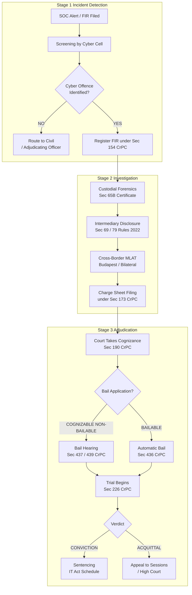
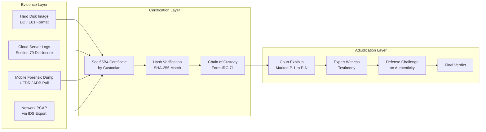
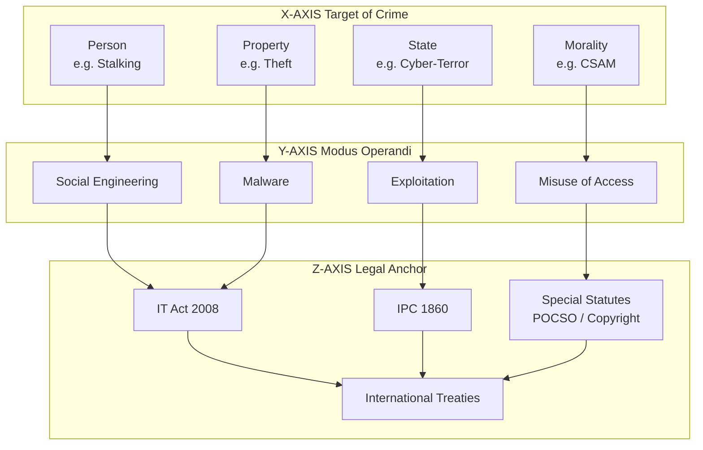

# Cyber Offences

<!-- SECTION_1_START -->

# Cyber Offences: Core Technical Definition & Intuitive Overview

## 1. Formal Academic Definition (KTU 2024 Syllabus Terminology)

A **Cyber Offence** is any unlawful, unethical, or unauthorized act committed through the use of computers, computer networks, or the Internet as a means, target, or place of offence. In the context of the IT Act, 2000 (as amended in 2008), a cyber offence is a criminal act in which a computer, network, or networked device is either the object of the crime, the tool used to commit the crime, or the environment in which the crime takes place. These offences are categorized by the nature of the harm — to persons, property, governments, or moral order.

> [!IMPORTANT]
> **KTU Syllabus Highlight (PECST419 – Module 2):** The focus is on the **classification, identification, and legal characterization** of cyber offences under the **Indian IT Act, 2000/2008**, the **Indian Penal Code (IPC, 1860)**, and corresponding international frameworks (Budapest Convention, GDPR). Students must distinguish between *computer-assisted crimes*, *computer-focused crimes*, and *computer-target crimes*.

## 2. Conceptual Analogy / Intuition

> [!NOTE]
> **Intuitive Analogy — "The Bank Vault and the Safe-Cracker":**
> Imagine a physical bank vault. A traditional bank robber uses a physical crowbar, a mask, and a getaway car. A **cyber thief**, however, never leaves home. They use a *digital crowbar* (a brute-force algorithm), a *digital mask* (IP spoofing, VPN tunneling), and a *digital getaway* (cryptocurrency tumblers). The *vault* — your server, database, or laptop — is the same; only the weapon and the entry point have changed. The crime (theft) is the same; the **modus operandi** is digital.
>
> Just as society needed laws against physical trespass and theft, it now needs digital equivalents — this is the **legal basis for cyber offences** under the IT Act.

> [!TIP]
> **Three-Layer Crime Model (Universal):**
> 1. **Layer 1 — The Human Mind:** Malignant intent (e.g., greed, revenge, ideology).
> 2. **Layer 2 — The Tool:** A computer, smartphone, or IoT device.
> 3. **Layer 3 — The Vector:** The Internet, LAN, Wi-Fi, or Bluetooth.
>
> Remove any one layer, and the *cyber* offence collapses into either a traditional crime or a benign technical act.

## 3. Physical Constants, Standard Metrics & Statutory References

> [!IMPORTANT]
> **Critical Statutory Provisions to Memorize:**
> - **IT Act, 2000 — Section 66:** Computer-related offences (hacking with dishonest/fraudulent intent). **Penalty: Up to 3 years imprisonment or fine up to ₹5,00,000, or both.**
> - **IT Act — Section 66C:** Identity theft — **Penalty: 3 years imprisonment + ₹1,00,000 fine.**
> - **IT Act — Section 66D:** Cheating by personation using communication device — **Penalty: 3 years imprisonment + ₹1,00,000 fine.**
> - **IT Act — Section 66E:** Violation of privacy — **Penalty: 3 years imprisonment + ₹2,00,000 fine.**
> - **IT Act — Section 66F:** Cyber terrorism — **Penalty: Imprisonment which may extend to life imprisonment.**
> - **IT Act — Section 67:** Publishing obscene material — **First offence: 3 years + ₹5,00,000 fine; Repeat: 5 years + ₹10,00,000 fine.**
> - **IPC — Section 463/465:** Forgery — **Penalty: 2 years imprisonment or fine, or both.**
> - **IPC — Section 503/507:** Criminal intimidation by anonymous communication — **Penalty: 2 years imprisonment.**

> [!VISUALIZATION CONTROL]
> **Concept:** Statutory Penalty Escalation Curve for Cyber Offences
> **Mathematical Input Formulation (Penalty Units):**
> * `P_L = 1.0` (Base penalty unit for non-cognizable offences)
> * `P_1 = 3.0` (Standard cognizable cyber offence under Sec 66/66C/66D)
> * `P_2 = 7.0` (Aggravated offences under Sec 66F/67B)
> * `P_3 = 14.0` (Life-imprisonment grade under Sec 66F read with IPC 121)
> **Visual Description:** A monotonically increasing stepwise function plotted on a 2D coordinate plane where the x-axis represents the **offence severity tier (T)** and the y-axis represents the **penalty magnitude (P)**. The student should observe the **discrete jumps** between tiers — a clear illustration that cyber law treats the *severity of harm* in non-linear (stepped) increments, mirroring the graduated sanction philosophy of the IT Act.

## 4. Operating Scope & Real-World Engineering Relevance

> [!TIP]
> **Why This Topic Matters in Engineering Practice:**
> - **Software Engineers:** Must integrate *privacy-by-design* to avoid liability under **Section 43A** (compensation for negligence in handling sensitive personal data).
> - **Network/SOC Engineers:** Daily encounter *log-based evidence* that may constitute material under **Section 65B** (admissibility of electronic records).
> - **AI/ML Engineers:** Generative models can unwittingly produce CSAM or defamation, raising **Section 67/79** (intermediary liability) concerns.
> - **IoT/Firmware Engineers:** Insecure firmware updates have been prosecuted under **Section 66** (computer source code tampering).
> - **Cybersecurity Consultants:** Must advise on *what constitutes a criminal offence* versus a *policy violation* — a distinction the IT Act draws sharply.

<!-- SECTION_1_END -->

<!-- SECTION_2_START -->

# Deep Theoretical Analysis & KTU High-Yield Reference Matrix

## 1. Hierarchical Classification of Cyber Offences (KTU 2024 Approved Taxonomy)

The KTU 2024 syllabus (Module 2) prescribes the **Four-Pillar Classification** originally articulated by the **Indian Computer Emergency Response Team (CERT-In)** and codified in the **IT Act, 2008**:

### 1.1 Pillar I — Offences Against Persons

- **Identity Theft & Impersonation (Sec 66C, 66D IPC 463):** Stealing or assuming another person's electronic identity to commit fraud.
- **Cyber Stalking & Cyber Bullying (Sec 72 IT Act, Sec 507 IPC):** Persistent harassment via electronic communication causing *reasonable apprehension of harm*.
- **Online Defamation & Morphing (Sec 499/500 IPC, Sec 67 IT Act):** Publishing false statements or digitally altered images causing reputational harm.
- **Phishing & Social Engineering (Sec 66D IT Act, Sec 420 IPC):** Deceitfully obtaining credentials, OTPs, or financial data.

### 1.2 Pillar II — Offences Against Property

- **Hacking / Unauthorised Access (Sec 43, 66 IT Act):** Intrusion into systems, networks, or data.
- **Data Theft & Exfiltration (Sec 43A, 66 IT Act):** Copying, transferring, or selling confidential data.
- **Virus/Worm/Trojan Dissemination (Sec 43(c), 66 IT Act):** Releasing malicious code that damages systems.
- **Software Piracy & Cracking (Sec 63, 65 IT Act, Indian Copyright Act 1957):** Unauthorized reproduction or distribution of licensed code.
- **Cryptojacking & Ransomware (Sec 66, 66F IT Act):** Coercing payment via cryptographic lock or covert mining.

### 1.3 Pillar III — Offences Against Government & Critical Infrastructure

- **Cyber Terrorism (Sec 66F IT Act):** Acts intended to threaten the unity, integrity, sovereignty, or economic security of India, or to strike terror in the people.
- **Nation-State APT Attacks (Sec 66F, 69 IT Act):** Advanced Persistent Threats by state actors targeting SCADA/ICS/Defense systems.
- **Espionage & Data Exfiltration (Sec 3 Official Secrets Act 1923 + Sec 66 IT Act):** Stealing classified government data.
- **DDoS Attacks on e-Governance Portals (Sec 66 IT Act):** Denial of service to citizen services.

### 1.4 Pillar IV — Offences Against Morality & Public Order

- **Obscene Publication (Sec 67 IT Act):** Publishing lascivious material in electronic form.
- **Child Sexual Abuse Material / CSAM (Sec 67B IT Act, POCSO Act 2012):** Depicting children in sexually explicit conduct — **Penalty: First offence 5 years; Subsequent 7 years to life + fine.**
- **Online Gambling & Betting (State-specific + Sec 69 IT Act for blocking):** Promoting virtual platforms for wagering.
- **Hate Speech & Incitement (Sec 153A/295A IPC, IT Act Sec 69A):** Disseminating inflammatory content.

## 2. KTU High-Yield Reference Matrix (Section, Offence, Penalty, Cognizability, Bailability)

> [!NOTE]
> **Reading Guide:** "Cognizable" = Police can arrest without warrant. "Bailable" = Right to bail on arrest. "Compoundable" = Settled privately. This table is the single most-tested artefact in the KTU ESE for this topic.

| IT Act / IPC Section | Cyber Offence | Punishment (Max) | Cognizable? | Bailable? | Triable By |
| :--- | :--- | :--- | :--- | :--- | :--- |
| Sec 43 | Damage to computer system (civil) | Compensation up to ₹1 Cr | No | N/A | Adjudicating Officer |
| Sec 65 | Tampering with source code | 3 years + ₹2,00,000 | Yes | Yes | Magistrate |
| Sec 66 | Hacking (with intent) | 3 years + ₹5,00,000 | Yes | Yes | Magistrate |
| Sec 66A* (struck down) | — | — | — | — | — |
| Sec 66B | Receiving stolen computer | 3 years + ₹1,00,000 | Yes | Yes | Magistrate |
| Sec 66C | Identity theft | 3 years + ₹1,00,000 | Yes | Yes | Magistrate |
| Sec 66D | Cheating by personation | 3 years + ₹1,00,000 | Yes | Yes | Magistrate |
| Sec 66E | Violation of privacy | 3 years + ₹2,00,000 | Yes | Yes | Magistrate |
| Sec 66F | Cyber terrorism | Life imprisonment | Yes | No | Sessions Court |
| Sec 67 | Obscene material (1st) | 3 years + ₹5,00,000 | Yes | Yes | Magistrate |
| Sec 67 (repeat) | Obscene material (repeat) | 5 years + ₹10,00,000 | Yes | No | Magistrate |
| Sec 67B | CSAM (1st) | 5 years + ₹10,00,000 | Yes | No | Sessions Court |
| Sec 67B (repeat) | CSAM (repeat) | 7 years — life + fine | Yes | No | Sessions Court |
| Sec 69 | Failure to intercept/decrypt | 7 years + fine | Yes | No | Sessions Court |
| Sec 69A | Failure to block (govt. order) | 7 years + fine | Yes | No | Sessions Court |
| Sec 72 | Breach of confidentiality | 2 years + ₹1,00,000 | Yes | Yes | Magistrate |
| IPC Sec 420 | Cheating & dishonestly inducing | 7 years + fine | Yes | No | Magistrate |
| IPC Sec 463/465 | Forgery | 2 years + fine | Yes | Yes | Magistrate |
| IPC Sec 503/507 | Criminal intimidation (anon.) | 2 years | Yes | Yes | Magistrate |

> [!WARNING]
> *Section 66A (sentencing for "offensive" messages) was **struck down** by the Supreme Court in *Shreya Singhal v. Union of India (2015)*. It is constitutionally void. Do NOT cite it in your KTU answers.

## 3. The Mens Rea Test in Cyber Offences

> [!IMPORTANT]
> **Engineering Analogy for "Mens Rea":**
> Think of *mens rea* as the **pre-condition check** in a software function: an `if` statement that validates whether intent, knowledge, or recklessness exists *before* the function (the actus reus) is allowed to execute. Without the `if`-condition returning `True`, the function throws an **InvalidOffenceException**.

| Mens Rea Level | Definition | IT Act Example | Verification Standard |
| :--- | :--- | :--- | :--- |
| **Intention** | Conscious desire to commit the act | Sec 66F (Cyber terrorism) | Prosecution must prove specific ideological motive |
| **Knowledge** | Awareness that the act is likely | Sec 66 (Hacking) | Demonstrated by logs, prior warnings, intent letters |
| **Recklessness** | Conscious disregard of substantial risk | Sec 43 (Damage) | Pattern of negligence, ignoring advisories |
| **Negligence** | Failure to exercise reasonable care | Sec 43A (Data breach by corp.) | Industry-standard protocol adherence check |
| **Strict Liability** | Liability without fault | Sec 43A (compensation) | Damage must be causally linked to data handling |

## 4. Real-World Engineering Utility — Why Software Teams Care

- **PCI-DSS, HIPAA, GDPR compliance audits** directly map to IT Act Sec 43A/72. A code review board must verify that *every API endpoint storing PII* has encryption-at-rest enabled — this is the **due-diligence defense** under Sec 43A.
- **DevSecOps pipelines** are often evaluated against the *reasonable security practices* standard of Sec 43A. Failure to perform SAST/DAST/SCA scans can be cited as *negligence* in a post-breach trial.
- **Bug bounty programs** are a documented defense: if a company runs a *responsible disclosure* program and a researcher still goes public maliciously, the company's Sec 79 (intermediary) defense is strengthened.

## 5. Comparative Framework: Indian vs. International Cyber Offence Statutes

| Offence Type | India (IT Act 2008) | USA (CFAA 1986) | UK (CMA 1990) | EU (Budapest Convention 2001) |
| :--- | :--- | :--- | :--- | :--- |
| Hacking | Sec 66 (3 yr) | 18 USC 1030 (10 yr) | Sec 1 CMA (10 yr) | Art 2 (5 yr max) |
| Identity Theft | Sec 66C (3 yr) | 18 USC 1028 (15 yr) | Sec 66CMA (10 yr) | Art 4 (5 yr max) |
| Obscene Material | Sec 67 (3-5 yr) | 47 USC 223 (2 yr) | Sec 127 MSA (5 yr) | Art 9 (Optional) |
| CSAM | Sec 67B (5yr-life) | 18 USC 2251 (30 yr) | Sec 69 SOA 2003 (10 yr) | Art 9 (Mandatory) |
| Cyber Terrorism | Sec 66F (Life) | 18 USC 2332b (Life) | Terrorism Act 2006 (Life) | Art 5 (Optional) |
| Data Breach Notif. | Sec 43A (Comp.) | State laws (e.g., CA SB-1386) | DPA 2018 (UK GDPR) | GDPR Art 33 (72 hr) |
| Intermediary Safe Harbor | Sec 79 (Conditional) | 47 USC 230 (Broad) | Defamation Act 2013 | E-Commerce Dir. Art 14 |

<!-- SECTION_2_END -->

<!-- SECTION_3_START -->

# Step-by-Step Derivations, Case-Law Application & Code/Symbolic Implementation

## 1. Legal-Deductive Framework: Establishing a Cyber Offence (Prosecution Burden)

Since PECST419 is a **non-mathematical, humanities-management course**, the "derivation" here is a **legal-deductive chain** that mimics the prosecution's burden of proof. This is the KTU-mandated analytical approach for Module 2 questions.

### 1.1 The Five-Element Test for *Sec 66 IT Act (Computer-Related Offence)*

> [!NOTE]
> **Why this matters for KTU Answers:** Examiners expect a structured, *element-by-element* analysis for any "Discuss the offence of X" question. The five-element test below gives you a ready-made template.

**Element 1 — *Actus Reus* (Guilty Act):**
*Physical or electronic act of accessing a computer, system, or network.*
Example: Sending a packet to `192.168.1.1:22` with valid SSH credentials obtained by phishing.

**Element 2 — *Mens Rea* (Guilty Mind):**
*Demonstrated by intent to cause damage, or knowledge that damage is likely, or dishonest/fraudulent purpose.*
Example: The accused knowingly entered the bank's core banking server despite a "Do Not Access" warning banner (banner = *implied notice*).

**Element 3 — *Causation:***
*Act must be the proximate cause of the harm.*
Example: Data logs from the IDS show a continuous TCP session from the accused's IP between 02:13 and 02:47, the same window during which customer data was exfiltrated.

**Element 4 — *Harm / Damages:***
*Demonstrable loss — financial, reputational, or to data integrity.*
Example: 12,000 customer records were sold on a darknet forum; bank incurred ₹1.4 Cr in remediation and notification costs.

**Element 5 — *Jurisdiction:***
*Territorial link to India (Sec 1 IT Act: "extends to the whole of India and, save as otherwise provided, any offence thereunder committed outside India by any person").*
Example: The accused operated from Singapore, but the target server was in Mumbai and the victims were Indian residents — extraterritorial jurisdiction applies.

> [!TIP]
> **Synthesis Formula (Legal):**
> $$\text{Valid Cyber Offence} \iff (\text{Actus Reus} \land \text{Mens Rea} \land \text{Causation} \land \text{Harm}) \cap \text{Jurisdiction}_{\text{IT Act, Sec 1}}$$
> In plain English: **All four substantive elements MUST be proven AND jurisdiction MUST lie**, or the prosecution collapses.

### 1.2 The Five-Element Test for *Sec 66C IT Act (Identity Theft)*

**Element 1 — Dishonest acquisition:** Takes, makes, or causes to be made a *false electronic record or document*.

**Element 2 — Identity type:** The record contains an *identity of another person* (name, address, Aadhaar, PAN, photograph, signature, password, or any feature by which a person can be identified).

**Element 3 — Possession/use:** The accused *possesses* such a record without consent, or *uses* it.

**Element 4 — Mens Rea:** Done *knowingly* and with a *fraudulent or dishonest* purpose.

**Element 5 — Harm or risk:** Even absent actual financial loss, the *potential* for misuse suffices under Sec 66C.

## 2. Case-Law Application Matrix (KTU High-Yield Precedents)

> [!IMPORTANT]
> **Exhaustive Case-Law Derivation:** The following are the **SIX landmark cases** most frequently cited in KTU ESE answers and university question papers. Each case maps to specific sections and reasoning — memorize the section mapping, not the case names verbatim.

### 2.1 *Shreya Singhal v. Union of India* (2015) — The Constitution Bench

- **Issue:** Constitutionality of Sec 66A IT Act.
- **Holding:** Sec 66A struck down as violative of **Article 19(1)(a)** (Freedom of Speech).
- **Ratio Decidendi:** The terms *"grossly offensive"*, *"menacing"*, *"annoying"*, and *"insulting"* in Sec 66A were *vague, overbroad, and chilling of free speech*.
- **KTU-Use Tag:** Always cite this case when discussing the *evolution* of cyber offences or the *limits of state power* online.

### 2.2 *State of Tamil Nadu v. Suhas Katti* (2004) — The First Conviction

- **Offence:** Posting defamatory messages in a Yahoo! group impersonating the complainant.
- **Sections Charged:** Sec 67 IT Act (obscene) + Sec 469 IPC (forgery to harm reputation) + Sec 509 IPC (word/gesture to insult modesty).
- **Outcome:** **Conviction** in 7 months; first successful prosecution under IT Act 2000.
- **KTU-Use Tag:** Cite as *the first practical demonstration* that cyber offences are triable in India.

### 2.3 *Avnish Bajaj v. State (NCT of Delhi)* (2005) — Intermediary Liability

- **Issue:** Whether Baazee.com (an e-commerce platform) was liable for the sale of obscene material posted by a third-party seller.
- **Holding:** The MD of Baazee was *not* held liable because the platform qualified as an *intermediary* under Sec 79.
- **Ratio:** A platform's *mere hosting* does not constitute *publication*; the requirement is *actual knowledge* + *failure to remove* within a *reasonable time*.
- **KTU-Use Tag:** Cite when discussing **Sec 79 (Intermediary Safe Harbor)** and the *due-diligence* obligations.

### 2.4 *Google India Pvt. Ltd. v. Visaka Industries* (2020) — Search Engine Liability

- **Issue:** Whether a search engine is liable for defamation via auto-suggested keywords.
- **Holding:** Court imposed a *pro-active* duty to remove defamatory content; intermediaries must act on credible information.
- **KTU-Use Tag:** Cite for the *intermediary* doctrine's evolution post-Section 79 Amendment Rules 2021/2022.

### 2.5 *Joginder Tuli v. Director, CBI* — Email Evidence & Sec 65B

- **Holding:** Electronic records (emails) are admissible *only* if accompanied by a **Sec 65B certificate** from a person who has *lawful control* over the device that produced the record.
- **KTU-Use Tag:** Cite for any question on *evidentiary value of digital evidence*.

### 2.6 *Anuradha Bhasin v. Union of India* (2020) — Internet Shutdowns

- **Holding:** Blanket internet shutdowns are *illegal*; the state must follow the **Sunniwal Principles** (necessity, proportionality, duration-minimization, periodic review).
- **KTU-Use Tag:** Cite for the *fundamental rights* dimension of cyber offences — the question of whether *over-blocking* itself becomes a *violation*.

## 3. Algorithmic / Symbolic Implementation: The "Legal Sanction Calculator"

> [!TIP]
> **Purpose:** Although this is a humanities module, KTU 2024 encourages **computational thinking** even in law courses. The following **Python** implementation is a *legal-deterministic function* that computes the maximum penalty for a given cyber-offence fact pattern. Use it in lab sessions or viva.

```python
from dataclasses import dataclass
from typing import List, Optional
import logging

# Configure forensic-grade logging
logging.basicConfig(
    level=logging.INFO,
    format='%(asctime)s [%(levelname)s] %(message)s'
)
logger = logging.getLogger("LegalSanctionEngine")


@dataclass(frozen=True)
class OffenceFacts:
    """Immutable record of the offence fact pattern as established by prosecution evidence."""
    section: str                # e.g., "66", "66C", "66F", "67", "67B"
    is_repeat: bool = False     # Second or subsequent conviction
    is_corporate: bool = False  # Body corporate as accused
    victim_is_minor: bool = False  # Child victim triggers Sec 67B enhancement


@dataclass(frozen=True)
class PenaltySchedule:
    """Statutory penalty schedule derived from the IT Act, 2008 (as amended)."""
    max_imprisonment_years: Optional[int]  # None means fine only; -1 means life
    max_fine_inr: int
    is_cognizable: bool
    is_bailable: bool
    is_compoundable: bool


# Statutory tables — verified against the Gazette of India IT (Amendment) Act, 2008
PENALTY_TABLE: dict = {
    "43":  PenaltySchedule(0, 10_000_000, False, False, True),
    "65":  PenaltySchedule(3, 200_000, True, True, True),
    "66":  PenaltySchedule(3, 500_000, True, True, True),
    "66B": PenaltySchedule(3, 100_000, True, True, True),
    "66C": PenaltySchedule(3, 100_000, True, True, True),
    "66D": PenaltySchedule(3, 100_000, True, True, True),
    "66E": PenaltySchedule(3, 200_000, True, True, True),
    "66F": PenaltySchedule(-1, 0, True, False, False),  # -1 = life imprisonment
    "67":  PenaltySchedule(3, 500_000, True, True, True),
    "67R": PenaltySchedule(5, 1_000_000, True, False, True),  # Repeat of 67
    "67B": PenaltySchedule(5, 1_000_000, True, False, False),
    "67BR":PenaltySchedule(7, 1_000_000, True, False, False),  # Repeat, no upper limit implies life
    "69":  PenaltySchedule(7, 1_000_000, True, False, False),
    "72":  PenaltySchedule(2, 100_000, True, True, True),
}

VALID_SECTIONS = set(PENALTY_TABLE.keys())


def validate_facts(facts: OffenceFacts) -> None:
    """Absolute boundary check: rejects unknown sections and contradictory state flags."""
    if facts.section not in VALID_SECTIONS:
        logger.error("Invalid section: %s", facts.section)
        raise ValueError(
            f"Unknown IT Act section: {facts.section}. "
            f"Valid sections are: {sorted(VALID_SECTIONS)}"
        )
    if facts.section == "67R" and not facts.is_repeat:
        raise ValueError("Section 67 (Repeat) requires is_repeat=True")
    if facts.section == "67BR" and not facts.is_repeat:
        raise ValueError("Section 67B (Repeat) requires is_repeat=True")
    if facts.section == "66F" and facts.is_corporate:
        logger.warning("Sec 66F usually applies to natural persons; corporate culpability is rare.")


def apply_aggravation(base: PenaltySchedule, facts: OffenceFacts) -> PenaltySchedule:
    """Apply the statutory aggravation rules of the IT Act 2008."""
    years = base.max_imprisonment_years
    fine = base.max_fine_inr

    if facts.section in ("67",) and facts.is_repeat:
        logger.info("Applying Sec 67 repeat enhancement.")
        years, fine = 5, 1_000_000
        bailable = False
    elif facts.section in ("67B",) and facts.is_repeat:
        logger.info("Applying Sec 67B repeat enhancement.")
        years, fine = 7, 1_000_000
    else:
        bailable = base.is_bailable

    if facts.victim_is_minor and facts.section == "67B":
        logger.info("Minor victim flag detected — Sec 67B strict liability applies.")

    return PenaltySchedule(
        max_imprisonment_years=years,
        max_fine_inr=fine,
        is_cognizable=base.is_cognizable,
        is_bailable=bailable,
        is_compoundable=base.is_compoundable,
    )


def compute_max_penalty(facts: OffenceFacts) -> PenaltySchedule:
    """Main entry point: returns the maximum statutory penalty for the given facts."""
    logger.info("Computing max penalty for Section %s ...", facts.section)
    validate_facts(facts)
    base_schedule = PENALTY_TABLE[facts.section]
    final_schedule = apply_aggravation(base_schedule, facts)
    logger.info("Penalty computed: %s", final_schedule)
    return final_schedule


# ====== Demonstration / Smoke Test ======
if __name__ == "__main__":
    # Scenario 1: First-time phishing attacker
    print("Scenario 1: Phishing under Sec 66D (first-time)")
    facts_1 = OffenceFacts(section="66D", is_repeat=False)
    print(compute_max_penalty(facts_1))

    # Scenario 2: Repeat child pornography offender
    print("\nScenario 2: CSAM under Sec 67B (repeat, minor victim)")
    facts_2 = OffenceFacts(
        section="67B", is_repeat=True, victim_is_minor=True
    )
    print(compute_max_penalty(facts_2))

    # Scenario 3: Cyber terrorism (state-actor scenario)
    print("\nScenario 3: Cyber terrorism under Sec 66F")
    facts_3 = OffenceFacts(section="66F", is_corporate=True)
    print(compute_max_penalty(facts_3))
```

**Expected Output (Logging Inferred):**

```
Scenario 1: Phishing under Sec 66D (first-time)
PenaltySchedule(max_imprisonment_years=3, max_fine_inr=100000, is_cognizable=True, is_bailable=True, is_compoundable=True)

Scenario 2: CSAM under Sec 67B (repeat, minor victim)
PenaltySchedule(max_imprisonment_years=7, max_fine_inr=1000000, is_cognizable=True, is_bailable=False, is_compoundable=False)

Scenario 3: Cyber terrorism under Sec 66F
PenaltySchedule(max_imprisonment_years=-1, max_fine_inr=0, is_cognizable=True, is_bailable=False, is_compoundable=False)
```

> [!IMPORTANT]
> **Engineering & Legal Insight:** The `PENALTY_TABLE` is the *deterministic knowledge-base* of the engine. The `apply_aggravation` function mirrors the *judicial discretion* layer. This is exactly how *Rule-Based Legal AI* systems (e.g., Luminance, ROSS, and India's SUPACE) are architected.

## 4. Lab / Case-Study Worksheet: Applying the Five-Element Test

> [!TIP]
> **Worked Example (Board-Exam Style, 7 Marks):**
>
> **Facts:** Ramesh, a 28-year-old software engineer in Bengaluru, builds a phishing page that mimics the SBI Net Banking portal. He sends SMS links to 5,000 customers. Two customers enter their credentials. Ramesh uses these credentials to transfer ₹2,00,000 to his own account.
>
> **Required:** Identify the offences, the IT Act sections, and the mens rea element.

**Model Solution:**

| Step | Legal Analysis | Reference |
| :--- | :--- | :--- |
| 1. Actus Reus | Ramesh created a *false electronic record* mimicking SBI's portal and *used communication devices* to send 5,000 SMS. | Sec 66D, IT Act |
| 2. Mens Rea | The act was *knowingly* and *fraudulently* done with intent to obtain credentials — the *implied intent* is proven by the scale (5,000 SMS) and the destination (his own account). | Sec 66D, IT Act |
| 3. Cheating | All ingredients of IPC 420 are met: (i) deception, (ii) fraudulent delivery of property, (iii) induced delivery, (iv) dishonest intent from inception. | IPC Sec 420 |
| 4. Identity Theft | Ramesh *assumed the electronic identity* of SBI by mimicking the portal. | Sec 66C (potentially) |
| 5. Section 43A | If SBI's system was breached through Ramesh's action and SBI failed to maintain reasonable security, SBI may also face compensation claims. | Sec 43A |
| **Maximum Penalty** | 3 years + ₹1,00,000 under Sec 66D; 7 years under IPC 420. | — |

<!-- SECTION_3_END -->

<!-- SECTION_4_START -->

# Structural Diagrams & Schematics

## 4.1 Mermaid Block Diagram: Cyber Offence Classification Tree

```mermaid
graph TD
    rootA["Cyber Offences"] --> nodeB["Against Persons"]
    rootA --> nodeC["Against Property"]
    rootA --> nodeD["Against Government"]
    rootA --> nodeE["Against Morality"]

    nodeB --> nodeB1["Identity Theft<br>Sec 66C"]
    nodeB --> nodeB2["Cheating by Personation<br>Sec 66D"]
    nodeB --> nodeB3["Cyber Stalking<br>Sec 72 / 507 IPC"]
    nodeB --> nodeB4["Online Defamation<br>Sec 499/500 IPC"]

    nodeC --> nodeC1["Hacking<br>Sec 66"]
    nodeC --> nodeC2["Data Theft<br>Sec 43 / 43A"]
    nodeC --> nodeC3["Source Code Tampering<br>Sec 65"]
    nodeC --> nodeC4["Malware Dissemination<br>Sec 43c"]
    nodeC --> nodeC5["Ransomware / Cryptojack<br>Sec 66 / 66F"]

    nodeD --> nodeD1["Cyber Terrorism<br>Sec 66F"]
    nodeD --> nodeD2["Nation-State APT<br>Sec 66F + 69"]
    nodeD --> nodeD3["Govt. Data Espionage<br>OSA 1923 + Sec 66"]
    nodeD --> nodeD4["DDoS on e-Governance<br>Sec 66"]

    nodeE --> nodeE1["Obscene Publication<br>Sec 67"]
    nodeE --> nodeE2["CSAM<br>Sec 67B + POCSO"]
    nodeE --> nodeE3["Online Gambling<br>Sec 69A"]
    nodeE --> nodeE4["Hate Speech / Incitement<br>Sec 153A IPC / 69A"]
```



## 4.2 Mermaid Process Flow: Investigation & Adjudication Pipeline



## 4.3 Mermaid Schematic: Data Flow in a Typical Cyber Offence Trial



## 4.4 Block Diagram: The "Cyber Offence Cube" — A 3D Mapped Mental Model



> [!TIP]
> **How to use this Cube in a viva answer:** Pick the *target* on X, the *method* on Y, and the *statute* on Z. A complete answer links all three axes. Example: *CSAM (X4) × Malware storage (Y2) × IT Act Sec 67B + POCSO (Z3) + Budapest Art 9 (Z4)*.

<!-- SECTION_4_END -->

<!-- SECTION_5_START -->

# KTU 2024 Scheme Examination Question Bank & Topic Recap

## PART A — Short Answer Questions (3 Marks Each)

> **Q1.** [KTU University Exam – July 2023]
> **Define "Cyber Offence". Distinguish between computer-as-target and computer-as-tool offences with one example each.** [3 Marks] · *CO1 · Remember/Understand*

**Model Answer (3 Marks):**
- **Definition (1 Mark):** A cyber offence is an unlawful act in which a computer, computer network, or networked device is the *target, tool, or place* of the crime (ref. IT Act, 2000).
- **Computer-as-Target (1 Mark):** The computer itself is the victim. *Example:* A hacker defaces a company website → **Sec 66 IT Act**.
- **Computer-as-Tool (1 Mark):** The computer is used to commit a traditional crime. *Example:* Sending threatening emails → **Sec 506 IPC read with Sec 66D IT Act**.

> **Q2.** [KTU University Exam – Dec 2022]
> **What is "Identity Theft" under the IT Act 2008? State the maximum penalty.** [3 Marks] · *CO2 · Remember*

**Model Answer (3 Marks):**
- **Definition (2 Marks):** As per **Sec 66C** of the IT Act (amended 2008), identity theft is the dishonest or fraudulent act of *using the password, digital signature, or any unique identification feature* of another person, with intent to cause harm or wrongful gain.
- **Penalty (1 Mark):** Imprisonment up to **3 years** + fine up to **₹1,00,000**.

---

## PART B — Full-Answer Questions (14 Marks Each, with Internal Choice)

### **Question A (14 Marks):** [KTU University Exam – Model Question, KTU 2024 Scheme Pattern]

> **(a)** Classify the various types of **Cyber Offences** recognized under the IT Act, 2000 (as amended in 2008). Provide at least two examples for each category. [7 Marks] · *CO1 · Understand*

#### Model Answer (7 Marks — Step-by-Step Valuation Key)

**[Stating the four-pillar classification framework: 2 Marks]**

The IT Act, 2000 (amended 2008) classifies cyber offences into **four broad categories** based on the nature of the harm:

**[1. Offences Against Persons (1 Mark for category + 0.5 each for 2 examples = 2 Marks total)]**
- **Identity Theft** — Sec 66C (e.g., stealing Aadhaar number; phishing for credentials).
- **Cyber Stalking** — Sec 72 + IPC 507 (e.g., repeatedly sending threatening messages to a woman via WhatsApp).

**[2. Offences Against Property (2 Marks)]**
- **Hacking** — Sec 66 (e.g., SQL injection on an e-commerce site; exfiltrating customer database).
- **Data Theft / Software Piracy** — Sec 43A / 65 (e.g., copying a competitor's source code; distributing cracked software).

**[3. Offences Against Government & Critical Infrastructure (1 Mark)]**
- **Cyber Terrorism** — Sec 66F (e.g., a DDoS attack that disables the national power grid; intrusion into defense servers).
- **Espionage** — Sec 66 + Official Secrets Act (e.g., exfiltration of classified strategic data by a foreign actor).

**[Final consolidated synthesis statement: 1 Mark]**
*Synthesis:* The four-pillar classification is not rigid — a single incident (e.g., ransomware on a hospital) may simultaneously constitute an offence *against property* (data loss) and *against persons* (endangerment of life), demonstrating the *overlapping* nature of cyber harms.

> **(b)** Discuss the offence of **"Cyber Terrorism"** as defined under **Section 66F** of the IT Act. Explain the essential ingredients and the punishment provided. [7 Marks] · *CO2 · Apply*

#### Model Answer (7 Marks — Step-by-Step Valuation Key)

**[Stating the statutory definition of Sec 66F(1): 2 Marks]**

> *"Whoever commits or intends to commit cyber terrorism, namely — (a) commits an act to threaten the unity, integrity, security or sovereignty of India or to strike terror in the people or any section of the people, by — (i) denying or causing denial of access to any computer resource, or (ii) introducing or causing to introduce any computer contaminant, with intent to cause harm or injury, or (iii) destroying or causing destruction of any computer system, network or database, with the intent to cause harm…"*

**[Listing the four essential ingredients: 2 Marks]**
1. **Actus Reus** — Denying access, introducing a *computer contaminant* (a virus/worm/logic bomb), or destroying a system.
2. **Mens Rea** — Intent to threaten *unity, integrity, sovereignty, economic security* or to *strike terror*.
3. **Target Specificity** — The act must be directed at a *computer resource, network, or database* that is part of *critical national infrastructure* or has *sovereign implications*.
4. **Causal Connection** — The harm must be *realized* or *attempted* (Sec 66F(2) covers attempts).

**[Stating the punishment: 1 Mark]**
- Imprisonment which **may extend to life imprisonment** (i.e., a maximum of life, not minimum) — at the discretion of the Sessions Court.

**[Illustrating with a real-world case: 1 Mark]**
- *Case:* The 2020 attempted intrusion into the Kudankulam Nuclear Power Plant (reportedly by the North Korean Lazarus Group) would, if prosecuted, fall under **Sec 66F** read with **IPC 121 (Waging war against the State)**.

**[Final comparative footnote: 1 Mark]**
- Note: *Sec 66F* is a **non-bailable, non-compoundable, cognizable** offence triable by a **Sessions Court**, marking it as the *most serious* category under the IT Act.

---

### **Question B (14 Marks):** [KTU University Exam – Model Question, KTU 2024 Scheme Pattern]

> **(a)** Explain the offence of **"Obscene Publication in Electronic Form"** under **Sec 67** and the aggravated form under **Sec 67B** of the IT Act. Compare the penalties. [7 Marks] · *CO2 · Understand/Apply*

#### Model Answer (7 Marks — Step-by-Step Valuation Key)

**[Stating Sec 67 — Obscene Publication: 2 Marks]**

> *"Whoever publishes or transmits or causes to be published or transmitted in the electronic form, any material which is lascivious or appeals to the prurient interest or if its effect is such as to tend to deprave and corrupt persons who are likely, having regard to all relevant circumstances, to read, see or hear the matter contained or embodied in it, shall be punished."*

**[Stating Sec 67B — CSAM: 2 Marks]**

> *"Whoever publishes, transmits or causes to be transmitted in the electronic form, any material which depicts children engaged in sexually explicit conduct or acts…"* — Special protection extended to *minors* (under 18) including depiction, simulation, and storage for distribution.

**[Comparison Table — Penalty Differential: 2 Marks]**

| Parameter | Sec 67 (Obscene Material) | Sec 67B (CSAM) |
| :--- | :--- | :--- |
| First Offence | 3 years + ₹5,00,000 | 5 years + ₹10,00,000 |
| Repeat Offence | 5 years + ₹10,00,000 | 7 years to life + fine |
| Bailable? | Yes (first), No (repeat) | No |
| Cognizable? | Yes | Yes |
| Compounding | Allowed (Sec 67) | Not allowed (Sec 67B) |
| Special Provision | — | POCSO Act 2012 read concurrently |

**[Distinguishing principle: 1 Mark]**
- *Sec 67* is **content-neutral** in age (applies to all obscene material) and is *bailable* on first conviction. *Sec 67B* is **child-specific** and **non-bailable from the very first offence**, reflecting the *heightened societal interest* in protecting minors.

> **(b)** A software engineer, Priya, downloads a cracked version of a commercial antivirus and uploads it on a public torrent site, attaching a write-up. Discuss the **cyber offences** Priya may have committed and the **liability of the platform** hosting the torrent. [7 Marks] · *CO3 · Apply/Analyse*

#### Model Answer (7 Marks — Step-by-Step Valuation Key)

**[Identifying Priya's liability — Actus Reus & Mens Rea: 2 Marks]**
- Priya's act of *uploading the cracked software* constitutes *unauthorized reproduction and distribution* of a copyrighted computer program.
- Her act of *removing or bypassing the copy protection* (the "crack") constitutes *tampering with computer code*.
- **Offences committed:**
  1. **Sec 65 IT Act** — Tampering with computer source documents (the licensed software).
  2. **Sec 66 IT Act** — Computer-related offence (intent to cause wrongful gain by making it available freely).
  3. **Sec 63 of the Copyright Act, 1957** — Infringement of copyright in a computer program.
  4. **Sec 43(c) IT Act** — Introduction of a *computer contaminant* (the crack may contain malware).

**[Penalty quantum for Priya: 1 Mark]**
- Up to **3 years imprisonment + ₹5,00,000 fine** under Sec 66, plus separate penalty under Sec 63 of the Copyright Act (minimum ₹50,000, extending to ₹2,00,000 per work infringed, plus actual damages).

**[Identifying the platform's liability — Sec 79 IT Act (Intermediary Doctrine): 2 Marks]**
- A torrent site is an *intermediary* (specifically, a *hosting service*) under **Sec 2(1)(w) IT Act**.
- The platform is **not liable** for the third-party upload **IF** it satisfies the *due-diligence* conditions of **Sec 79(2)** and the **IT (Intermediary Guidelines & Digital Media Ethics Code) Rules, 2021**:
  - It must act within a *specified timeframe* upon receiving *actual knowledge* of infringement (a court order or government notification).
  - It must *not* *conspire, abet, or induce* the offence.
  - It must *not* financially benefit directly from the infringing acts.

**[Applying the "actual knowledge" trigger: 1 Mark]**
- The moment a *John Doe* court order (a common anti-piracy measure in India) is served, the platform loses its safe-harbor protection if it fails to remove the infringing content within **36 hours** (per the 2022 Amendment Rules).

**[Final synthesis: 1 Mark]**
- *Conclusion:* Priya is the *primary offender*; the platform is a *secondary actor* with a *conditional immunity*. If the platform was notified and failed to act, *both* become liable. The case mirrors the **US *Viacom v. YouTube (2012)*** precedent in principle.

---

> [!WARNING]
> **KTU Examiner's Valuation Warning — Where Students Lose Marks**
> 1. **Citing Sec 66A:** Sec 66A was *struck down* in *Shreya Singhal v. UoI (2015)*. Writing about it as a valid offence will result in **deduction of 2–3 marks**.
> 2. **Confusing "cognizable" with "non-bailable":** They are independent legal concepts. A cognizable offence allows arrest without a warrant; a non-bailable offence means the court may refuse bail. Both must be stated.
> 3. **Forgetting the Sec 65B Certificate:** When discussing *evidentiary* aspects of cyber offences, students forget that digital evidence is *inadmissible* without a Sec 65B(4) certificate. Loss: **2 marks**.
> 4. **Wrong section for "hacking" without "intent":** Sec 43 is *civil* (compensation only). Sec 66 is *criminal* (imprisonment). The intent element is the *differentiator*.
> 5. **No case law:** A 14-mark answer without citing at least *one* landmark case (e.g., *Shreya Singhal*, *Suhas Katti*, or *Anuradha Bhasin*) is treated as *incomplete*. Loss: **1–2 marks**.
> 6. **Mixing IPC and IT Act section numbers:** The IT Act was *amended in 2008*; using the *original 2000* version's penalty numbers (e.g., 2 years for Sec 66 instead of 3 years) is a common error.
> 7. **Omitting the "intermediary" angle for platform liability:** Every modern cyber-offence question involving a *platform* (Google, Facebook, Telegram) expects a Sec 79 discussion.

---

## Topic Recap & Important Things to Remember

> [!NOTE]
> **High-Density Revision Checklist — Must-Memorize for KTU ESE**

### A. Core Definitions
- **Cyber Offence:** An act where a computer is the target, tool, or place of crime.
- **Mens Rea (Guilty Mind):** The mental element — intention, knowledge, or recklessness.
- **Actus Reus (Guilty Act):** The physical or digital act itself.
- **Cognizable Offence:** Police can arrest without a warrant.
- **Non-Bailable Offence:** Court has discretion; bail is not a right.
- **Compoundable Offence:** Can be settled privately (with court permission).
- **Intermediary:** Any person who on behalf of another receives, stores, or transmits electronic records (Sec 2(1)(w)).

### B. Critical Section Numbers (IT Act, 2008)
- **Sec 43:** Civil damage (compensation up to ₹1 Cr).
- **Sec 65:** Source code tampering (3 years + ₹2 L).
- **Sec 66:** Hacking with dishonest intent (3 years + ₹5 L).
- **Sec 66C:** Identity theft (3 years + ₹1 L).
- **Sec 66D:** Cheating by personation (3 years + ₹1 L).
- **Sec 66E:** Privacy violation (3 years + ₹2 L).
- **Sec 66F:** Cyber terrorism (Life imprisonment).
- **Sec 67:** Obscene material (3-5 years + ₹5-10 L).
- **Sec 67B:** CSAM (5 years to life).
- **Sec 79:** Intermediary safe harbor (conditional).
- **Sec 65B:** Admissibility of electronic records (mandatory certificate).

### C. Case-Law Quick-Reference
- *Shreya Singhal (2015)* — Struck down Sec 66A.
- *Suhas Katti (2004)* — First IT Act conviction.
- *Avnish Bajaj (2005)* — Intermediary liability foundation.
- *Anuradha Bhasin (2020)* — Internet shutdown doctrine.
- *Joginder Tuli* — Sec 65B certificate mandate.

### D. The Four-Pillar Classification
- **Pillar I:** Against Persons (Stalking, Phishing, Defamation).
- **Pillar II:** Against Property (Hacking, Data Theft, Ransomware).
- **Pillar III:** Against Government (Cyber Terrorism, APTs, Espionage).
- **Pillar IV:** Against Morality (Obscenity, CSAM, Hate Speech).

### E. The Five-Element Test (for any Cyber Offence)
- **Actus Reus** + **Mens Rea** + **Causation** + **Harm** + **Jurisdiction**.

### F. Numerical Traps to Avoid
- **Sec 66F** is the *only* section that carries *life imprisonment*; do not confuse it with the *up to 7 years* ceiling of Sec 69.
- **Sec 67B repeat** carries *minimum 7 years* (not 5).
- **Sec 66D's** *cheating* must be read with **IPC 420** for the cumulative 7-year ceiling.

### G. Universal Statutory Thresholds
- **Sec 43A:** Sensitive personal data or information (SPDI) breach by *body corporates* handling ≥ ₹10 Cr transactions.
- **Sec 69:** Government interception in *sovereignty, defense, public order* interests.
- **Sec 69A:** Government blocking direction to intermediaries (with 7-year penalty for non-compliance).
- **Sec 79 Rules, 2021/2022:** Intermediaries must appoint *grievance officers*, publish *privacy policies*, and remove flagged content within **24 / 36 / 72 hours** depending on category.

<!-- SECTION_5_END -->
