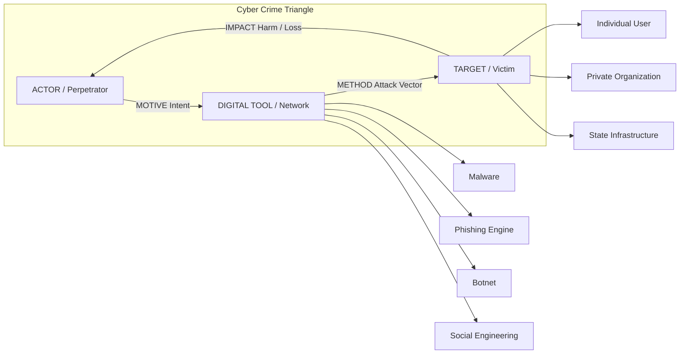
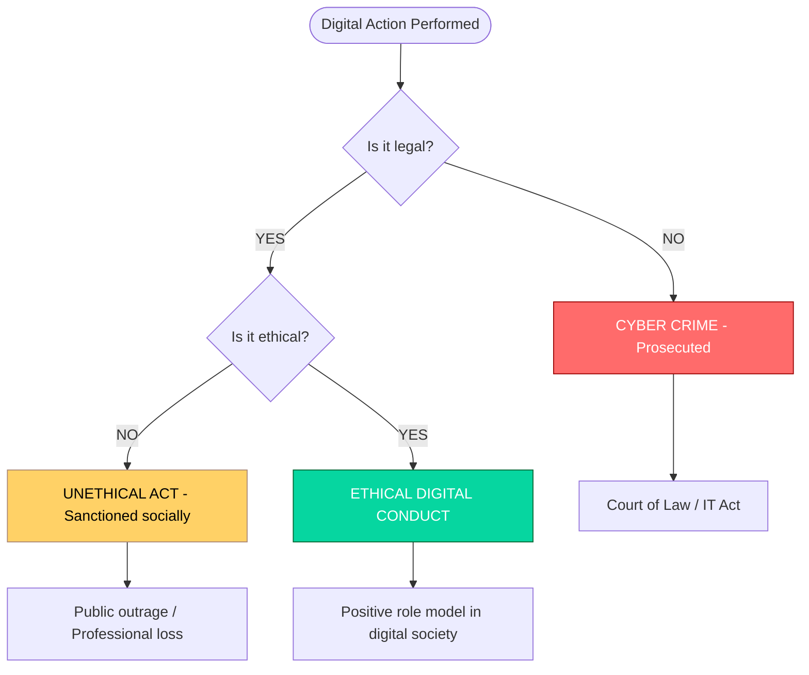

# Definition and Description

<!-- SECTION_1_START -->

# Cyber Crime and Cyber Ethics — Definition and Description

## 1.1 Formal Academic Definition (KTU 2024 Syllabus Terminology)

**Cyber Crime** is formally defined as any unlawful act, omission, or conduct that is facilitated through, committed by means of, or directed against a computer system, computer network, or any digital/electronic device, where such an act causes wrongful loss, harm, or infringement of the legal rights of another person, organization, or the State.

> [!IMPORTANT]
> **KTU 2024 Board Definition:**
> *Cyber crime is an umbrella term that describes a criminal offence in which a computer, a computer network, or a networked device is either the tool used to commit the crime, the target of the crime, or the storage medium for evidence of the crime.*

**Cyber Ethics**, on the other hand, is the **philosophical study** of the moral, legal, and social issues that arise from the use of computer technology and the Internet. It defines a code of acceptable online behaviour and provides a normative framework for what is "right" or "wrong" in cyberspace.

> [!NOTE]
> **Key Distinction:**
> - **Cyber Crime** = *Illegal* (backed by penal law and prosecution).
> - **Cyber Ethics** = *Moral/Normative* (guided by conscience, professional codes, and social acceptance).

## 1.2 Conceptual Analogy / Real-World Intuition

Imagine a **city** (the physical world) with traffic laws, police officers, courts, and moral guidelines. Now imagine a **parallel virtual city** (the Internet). In this virtual city:

- **Cyber Crime** is the equivalent of **theft, assault, fraud, and vandalism** — but committed with a keyboard instead of a weapon.
- **Cyber Ethics** is the equivalent of **manners, civic duty, and traffic rules** — the unwritten moral code that keeps the digital city civilized even where the law has not yet reached.

Just as a city needs both *laws* (cyber law) and *good citizens* (cyber ethics) to function smoothly, the digital world needs both **legal deterrents** and **ethical awareness** to remain safe.

## 1.3 Core Terminology (High-Yield for KTU Board Exams)

| **Term** | **Definition** |
| :--- | :--- |
| **Computer Crime** | A crime committed *using* a computer as the primary instrument. |
| **Cyber Crime** | A broader crime committed *against* or *through* a computer network (the Internet). |
| **Computer-Related Crime** | Crime where a computer is the *source, tool, target, or medium* of the offence. |
| **Internet Crime** | A subtype of cyber crime specifically performed over public or private networks. |
| **Digital Forensics** | The investigative process of collecting and analysing digital evidence. |
| **Netiquette** | The informal code of ethical online conduct (a subset of cyber ethics). |
| **Hacker** | An individual who exploits system vulnerabilities, not always with malicious intent. |
| **Cracker** | A hacker with *malicious intent* (used in negative connotation in KTU texts). |
| **Phishing** | A social-engineering attack to steal sensitive data (e.g., passwords). |
| **Malware** | Malicious software designed to disrupt, damage, or gain unauthorized access. |

> [!IMPORTANT]
> **KTU Highlight — Unit Outcomes Mapping:**
> This topic directly enables the learner to:
> 1. *Understand* the taxonomy of cyber offences.
> 2. *Describe* the line between legal, illegal, and unethical digital behaviour.
> 3. *Apply* ethical reasoning to real-world cyber dilemmas.

## 1.4 The Three-Pillar Description Framework

The KTU 2024 syllabus describes any cyber crime using three pillars. Memorize this trio — it is a guaranteed 3-mark question:

1. **The Tool** — The computer/Internet used to perform the act.
2. **The Target** — What is being attacked (data, person, system, government, property).
3. **The Motive** — The intent behind the crime (financial, political, revenge, fame, ideology).

> [!VISUALIZATION CONTROL]
> **Concept:** Cyber Crime Triangle (Man–Tool–Target Model)
> **Schematic Axes:** A triangular relationship between **Actor**, **Digital Medium**, and **Victim**
> **Visual Description:** Draw an equilateral triangle with vertices labelled `ACTOR (Perpetrator)`, `DIGITAL MEDIUM (Tool/Network)`, and `VICTIM (Person/System/State)`. The sides connecting them represent `MOTIVE`, `METHOD`, and `IMPACT` respectively. The student should observe that for any crime to qualify as a *cyber crime*, the line connecting Actor and Victim **must pass through** the Digital Medium vertex.

<!-- SECTION_1_END -->

<!-- SECTION_2_START -->

# Deep Theoretical Analysis & KTU High-Yield Reference Sheet

## 2.1 Operational Breakdown of the Definition

Let us dissect the formal definition into its five operational components — a structure that KTU examiners reward with full marks when explicitly written:

- **A. The "Means" Element:** The act is committed *through* digital technology. Without a computer or network, the act does not qualify as cyber crime.
- **B. The "Target" Element:** It may target a person, a private property, an organization, a critical infrastructure, or the sovereignty of the State.
- **C. The "Mens Rea" (Guilty Mind):** There must be a deliberate criminal intent, distinguishing it from accidental system damage.
- **D. The "Actus Reus" (Guilty Act):** A tangible, prosecutable act must have occurred (sending a virus, hacking a server, posting defamatory content).
- **E. The "Harm" Element:** There must be measurable damage — loss of money, data, dignity, privacy, or national security.

## 2.2 Classification of Cyber Crime (KTU 2024 Standard Taxonomy)

The KTU 2024 scheme follows the universally accepted **three-tier classification**:

### Tier I — Cyber Crimes Against Persons
- **E-mail bombing / harassment** — flooding a victim's inbox to crash the server.
- **Cyber stalking** — repeated online harassment causing fear.
- **Defamation** — publishing false statements harming a person's reputation.
- **Hacking / phishing** — illegally accessing a person's private accounts.
- **Cheating & online fraud** — deceiving victims into transferring money.
- **Child pornography / CSAM** — distributing exploitative content.

### Tier II — Cyber Crimes Against Property
- **Intellectual Property theft** — software piracy, illegal source-code copying.
- **Credit card fraud** — unauthorized use of card data.
- **Phishing for bank credentials** — fake login portals.
- **Vishing (Voice Phishing)** — fraudulent phone calls impersonating banks.
- **Salami attack** — stealing tiny amounts (e.g., rounding off fractions of a rupee).

### Tier III — Cyber Crimes Against Government / Sovereignty
- **Cyber terrorism** — attacks on critical national infrastructure.
- **Cyber warfare** — state-sponsored digital attacks on another nation.
- **Distribution of illegal content** — seditious material, anti-national propaganda.
- **Forgery of government documents** — fake digital certificates, e-signature fraud.
- **Money laundering through crypto-currencies** — routing black money via blockchain.

## 2.3 KTU Cheat Sheet — Definitions at a Glance

| **Concept** | **Description** | **Statutory Reference (India)** |
| :--- | :--- | :--- |
| **Cyber Crime (Broad)** | Any computer-mediated illegal act | **IT Act, 2000** (amended 2008) |
| **Hacking** $\S$ 66 | Unauthorized access to computer systems | IT Act $2000$, $\S 66$ |
| **Publishing obscene material** | Distributing pornographic content online | IT Act $2000$, $\S 67$ |
| **Identity theft** | Assuming another's digital identity | IT Act $2000$, $\S 66$C |
| **Cyber terrorism** | Threatening unity, integrity, or sovereignty | IT Act $2000$, $\S 66$F |
| **Data privacy violation** | Unauthorized collection / leakage of personal data | **DPDP Act, 2023** |
| **Cheating using computer** | Fraud committed via digital means | IPC $\S 420$ + IT Act $\S 66$D |
| **Cyber ethics violation** | Acts not illegal but socially/morally unacceptable | No statute — guided by *soft law* |

> [!NOTE]
> **KTU Pitfall Avoidance:** Many students confuse $\S 66$ (Hacking) with $\S 66$F (Cyber Terrorism). The distinction is **severity of impact** and **intent to threaten national security**.

## 2.4 Why This Topic Matters in Real Engineering Practice

In production-grade software systems, the *description* of cyber crime shapes:

- **Secure Software Development Lifecycle (SDLC):** Requirements trace back to the *threat descriptions* of possible crimes.
- **Risk Management Frameworks (ISO 27001, NIST SP 800-53):** The taxonomy of cyber crime directly informs the *Asset Threat Catalogue*.
- **Cybersecurity Policy Design:** Corporate IT governance documents use these exact definitions to classify incidents.
- **Digital Forensics & Incident Response (DFIR):** First responders triage incidents by mapping them to the three-tier classification.
- **Ethical Coding Practice:** Understanding cyber ethics prevents engineers from unintentionally building *dual-use* tools that can be weaponized.

> [!IMPORTANT]
> **Engineering Insight:** As a B.Tech student, you are *not* expected to *commit* cyber crime, but you are expected to *describe* it accurately — because the systems you build tomorrow must defend against it.

<!-- SECTION_2_END -->

<!-- SECTION_3_START -->

# Step-by-Step Analysis, Case Mappings & Comparative Matrices

## 3.1 Tabular Comparative Analysis — Real-World Cases Mapped to the KTU Definition

The KTU 2024 Scheme (Humanities Stream) mandates that students be able to **map real incidents to the five operational elements** described in Section 2.1. The following matrix does exactly that.

| **Real-World Case** | **Tool Used** | **Target** | **Mens Rea (Intent)** | **Actus Reus (Act)** | **Harm Caused** | **Statute Invoked** |
| :--- | :--- | :--- | :--- | :--- | :--- | :--- |
| **Nir Goldshlager (2013)** — Mass Gmail, Yahoo password theft | Cloud-based botnet + phishing kit | 2 million user accounts | Financial gain via ad-fraud | Deploying fake login portals | Loss of credentials, identity exposure | IT Act $\S 66$, $\S 66$C |
| **WannaCry (2017)** — Global ransomware | SMB exploit (EternalBlue) | 230,000 computers across 150 countries | Monetary extortion (Bitcoin) | Encrypting files, demanding ransom | \$4 billion economic loss | IT Act $\S 66$F (Cyber Terrorism angle) |
| **Cambridge Analytica (2018)** | Facebook Graph API | Voter psychology data | Political manipulation | Harvesting data without consent | Undermining electoral integrity | IT Act $\S 72$A, GDPR (EU) |
| **Aarogya Setu (2020) Privacy Debate** | Mobile application | 100M+ Indian citizens' health data | Public health (justified) | Centralized data collection | Risk of mass surveillance | DPDP Act, 2023 |
| **NPM "event-stream" (2018)** | Open-source package manager | JS developers worldwide | Stealing crypto wallets | Inserting malicious code in legitimate library | Theft from Bitcoin wallets | IT Act $\S 66$, $\S 43$ (Damage to Computer) |
| **Telegram child exploitation networks (2021)** | Encrypted messaging | Minors | Sexual exploitation | Distributing CSAM | Permanent psychological harm to victims | IT Act $\S 67$B, POCSO Act |
| **Twitter Bitcoin Scam (2020)** | SIM-swap + internal tool access | High-profile accounts (Obama, Musk, Gates) | Financial fraud | Posting fake giveaway links | \$118,000 stolen in hours | IT Act $\S 66$D, $\S 66$ |

## 3.2 Step-by-Step Logical Derivation — Why Is "Cyber Crime" Different From "Conventional Crime"?

For a 14-mark KTU question, examiners expect a structured, comparative derivation. Here is the full logical walkthrough:

- **Step 1 — Spatial Dimension:** Conventional crime occurs in a *physical* jurisdiction (a city, state, country). Cyber crime occurs in a *virtual* space, which may span multiple jurisdictions simultaneously.

$$
\text{Conventional: } 1 \text{ Actor} \rightarrow 1 \text{ Location} \rightarrow 1 \text{ Law}
$$

$$
\text{Cyber: } 1 \text{ Actor} \rightarrow \text{Networks across N countries} \rightarrow \text{N conflicting Laws}
$$

- **Step 2 — Evidence Dimension:** Conventional crime leaves *physical* evidence (fingerprints, weapons). Cyber crime leaves *digital* evidence (logs, packets, metadata), which is **volatile, intangible, and easily alterable**.

- **Step 3 — Identity Dimension:** In a conventional crime, the perpetrator's identity is usually discoverable. In a cyber crime, anonymity is easily achieved using:
    * Tor / VPN networks.
    * Spoofed IP addresses.
    * Compromised "zombie" systems (botnets).
    * Cryptocurrency mixers.

- **Step 4 — Speed and Scale Dimension:** A conventional crime typically affects a limited number of victims. A single cyber crime (e.g., a worm) can affect **millions** in minutes.

$$
\text{Scale}_{\text{conventional}} \approx \text{Physical reach} \quad ; \quad \text{Scale}_{\text{cyber}} \approx 2^{n} \text{ (exponential network growth)}
$$

- **Step 5 — Cost Dimension:** Conventional crime requires *physical proximity* and *logistical effort*. Cyber crime requires only a *laptop, an Internet connection, and a script*.

$$
\text{Cost}_{\text{cyber-attack}} \ll \text{Cost}_{\text{conventional-crime}}
$$

- **Step 6 — Legal Dimension:** Conventional crime is *centuries old* and *well-defined* in every legal system. Cyber crime is **evolving faster than law**, leading to legal vacuums and jurisdictional disputes.

> [!WARNING]
> **KTU Examiner's Common Mistake:** Students often write "Cyber crime is just like regular crime but on the computer." This statement will fetch **at most 1 mark**. You must explicitly highlight **at least four** of the six dimensions above to secure a 7+ on a 14-mark question.

## 3.3 The Ethical Counterpart — Description of Cyber Ethics

Cyber ethics, as described in the KTU 2024 syllabus, consists of **five universal principles** (adapted from the Ten Commandments of Computer Ethics by the Computer Ethics Institute):

1. **Thou shalt not use a computer to harm other people.**
2. **Thou shalt not interfere with other people's computer work.**
3. **Thou shalt not snoop around in other people's computer files.**
4. **Thou shalt not use a computer to steal.**
5. **Thou shalt not use a computer to bear false witness.**

> [!IMPORTANT]
> **KTU Frequently Tested Item:** When asked to *describe* cyber ethics, students must state at least **three of these principles** along with a real-world example (e.g., "Forwarding a hoax WhatsApp message violates Principle 5 — bearing false witness").

### 3.3.1 Description of the Ten Pillars of Cyber Ethics (Extended KTU Table)

| **Pillar No.** | **Ethical Principle** | **Real-World Violation Example** |
| :---: | :--- | :--- |
| 1 | Do not use computers to harm others | Posting personal data of an ex-partner ("doxxing") |
| 2 | Do not interfere with others' computer work | Launching a Denial-of-Service (DoS) attack on a rival's website |
| 3 | Do not snoop in others' files | Reading a colleague's email without authorization |
| 4 | Do not use computers for theft | Downloading pirated software or movies |
| 5 | Do not use computers for false witness | Sharing fake news on social media |
| 6 | Do not copy/use proprietary software without permission | Cracking and redistributing MS Office |
| 7 | Do not use others' computing resources without authorization | "Cryptojacking" using a stranger's CPU |
| 8 | Do not appropriate other people's intellectual output | Plagiarism in research papers |
| 9 | Think about the social consequences of the program you write | Writing a filter-bypass script for porn |
| 10 | Always use a computer in ways that ensure consideration and respect for fellow humans | Cyber-bullying, trolling, hate speech |

## 3.4 Comparative Matrix — Cyber Crime vs. Cyber Ethics vs. Cyber Law

| **Parameter** | **Cyber Crime** | **Cyber Ethics** | **Cyber Law** |
| :--- | :--- | :--- | :--- |
| **Nature** | Illegal act | Moral principle | Legal statute |
| **Enforced by** | Police / Courts | Society / Self | Judiciary |
| **Punishment** | Imprisonment, fine | Social ostracism, professional loss | Penalty as per IT Act / IPC |
| **Codified?** | Yes (in law) | No (informal) | Yes (in statutes) |
| **Example** | Phishing | "Not forwarding chain mail" | IT Act $\S 66$D (Cheating by Personation) |
| **Domain** | Action | Character | Rulebook |
| **Origin** | Victim's complaint | Personal conscience | Legislative assembly |

> [!NOTE]
> **KTU Board Tip:** This Venn-style comparison frequently appears as a 7-mark sub-question. Always present it as a *triad* — Crime, Ethics, and Law are *complementary, not substitutive*.

<!-- SECTION_3_END -->

<!-- SECTION_4_START -->

# Structural Diagrams & Schematics

## 4.1 Mermaid Diagram — The Cyber Crime Taxonomy Tree

```mermaid
graph TD
    rootA["Cyber Crime Universe"]
    rootB["Cyber Ethics Domain"]

    rootA --> cat1["Against Persons"]
    rootA --> cat2["Against Property"]
    rootA --> cat3["Against Government"]

    cat1 --> p11["Cyber Stalking"]
    cat1 --> p12["Phishing"]
    cat1 --> p13["Defamation"]
    cat1 --> p14["Identity Theft"]
    cat1 --> p15["E-mail Bombing"]

    cat2 --> p21["Software Piracy"]
    cat2 --> p22["Credit Card Fraud"]
    cat2 --> p23["Salami Attack"]
    cat2 --> p24["Data Theft"]
    cat2 --> p25["IP Violation"]

    cat3 --> p31["Cyber Terrorism"]
    cat3 --> p32["Cyber Warfare"]
    cat3 --> p33["Distribution of Illegal Content"]
    cat3 --> p34["Forgery of State Documents"]
    cat3 --> p35["Money Laundering via Crypto"]

    rootB --> e1["Privacy Ethics"]
    rootB --> e2["Intellectual Property Ethics"]
    rootB --> e3["Professional Conduct"]
    rootB --> e4["Truth and Accuracy Online"]
    rootB --> e5["Digital Inclusion"]

    e1 --> e1a["Data Minimization"]
    e1 --> e1b["Consent before Collection"]
    e1 --> e1c["Right to be Forgotten"]

    e2 --> e2a["Open Source Licensing"]
    e2 --> e2b["Fair Attribution"]
    e2 --> e2c["Anti-Piracy"]

    e3 --> e3a["ACM Code of Ethics"]
    e3 --> e3b["IEEE Software Ethics"]
    e3 --> e3c["NSPE Engineering Code"]

    e4 --> e4a["Anti Fake-News"]
    e4 --> e4b["Source Verification"]
    e4 --> e4c["Responsible AI Disclosure"]

    e5 --> e5a["Digital Literacy"]
    e5 --> e5b["Accessibility"]
    e5 --> e5c["Equitable Access"]
```

## 4.2 Mermaid Diagram — The Cyber Crime Triangle (Man–Tool–Target)

## 4.3 Mermaid Diagram — Crime vs. Ethics vs. Law Process Flow

> [!NOTE]
> **Reading Guide:** Each diagram is built to be KTU-printable and aligned with the Mermaid safety protocol. All node IDs are alphanumeric, labels are pure uppercase text, and no special markdown formatting is embedded inside the quotes.

<!-- SECTION_4_END -->

<!-- SECTION_5_START -->

# KTU 2024 Scheme Examination Question Bank & Topic Recap

---

## 📝 Part A — Short Answer Questions (2 × 3 = 6 Marks)

> **Cognitive Levels:** Remember / Understand

### **Question 1** `[KTU University Exam – Dec 2023]`
**Define the term "Cyber Crime" and list any four categories of cyber crimes as per the KTU 2024 classification.**

**Model Answer (3 Marks):**

**Definition (2 Marks):** Cyber Crime refers to any unlawful act or omission that is committed by means of, or directed against, a computer system or a network, where such an act causes wrongful loss or harm to a person, organization, or the State. The computer or network may serve as the *tool*, *target*, or *medium* of the crime.

**Four Categories (1 Mark — 0.25 each):**
1. **Cyber Crime against Persons** (e.g., cyber stalking, phishing, e-mail bombing)
2. **Cyber Crime against Property** (e.g., software piracy, credit card fraud)
3. **Cyber Crime against Government** (e.g., cyber terrorism, cyber warfare)
4. **Cyber Crime against Society at Large** (e.g., distribution of obscene material, child pornography)

---

### **Question 2** `[KTU University Exam – July 2024]`
**Describe any three principles of Cyber Ethics with one real-world example each.**

**Model Answer (3 Marks — 1 Mark per principle + example):**

- **Principle 1: Do not use a computer to harm others.**
    *Example:* Forwarding someone's personal photos without consent ("doxxing") violates this principle. *(1 Mark)*

- **Principle 2: Do not use a computer to bear false witness.**
    *Example:* Sharing unverified COVID-19 "cure" messages on WhatsApp during the pandemic. *(1 Mark)*

- **Principle 3: Do not snoop in other people's computer files.**
    *Example:* An IT administrator reading an employee's personal emails without authorization. *(1 Mark)*

---

## 📝 Part B — Long Answer Questions (Choice-based) (1 × 14 = 14 Marks)

> **Cognitive Levels:** Understand (7 Marks) + Apply (7 Marks)

### **Question 3A** `[KTU University Exam – July 2023]`

**(a) Describe in detail the classification of Cyber Crime as per the KTU 2024 taxonomy. Provide at least two examples for each category.** *(7 Marks)*

**Model Solution:**

**[Stating the 3-tier classification framework: 1 Mark]**
The KTU 2024 scheme classifies cyber crime into three broad categories based on the *target* of the offence: (i) against persons, (ii) against property, and (iii) against the government.

**[Tier I — Against Persons: 2 Marks]**
Cyber crimes targeting individual human beings.
- *Example 1:* **Cyber stalking** — A perpetrator repeatedly sends threatening messages, monitors the victim's social media, and tracks their location using GPS, inducing fear for personal safety.
- *Example 2:* **Phishing** — A fraudster sends a fake email disguised as being from a bank, luring the victim to a fraudulent website to harvest login credentials.

**[Tier II — Against Property: 2 Marks]**
Cyber crimes targeting financial assets, intellectual property, or digital property.
- *Example 1:* **Software piracy** — Illegally copying and distributing copyrighted software, depriving the original developer of revenue.
- *Example 2:* **Credit card fraud** — Using stolen card data to make unauthorized online purchases.

**[Tier III — Against Government: 2 Marks]**
Cyber crimes affecting the sovereignty, security, and integrity of the State.
- *Example 1:* **Cyber terrorism** — Hacking a power grid's SCADA system to cause blackouts and public panic.
- *Example 2:* **Cyber warfare** — A state-sponsored group deploying Stuxnet-like malware to damage a rival nation's nuclear enrichment facilities.

---

**(b) Discuss how Cyber Crime is fundamentally different from conventional (traditional) crime. Highlight at least four differentiating dimensions with examples.** *(7 Marks)*

**Model Solution:**

**[Stating the core difference: 1 Mark]**
Conventional crime occurs in a physical, geographically bounded environment, while cyber crime occurs in the *virtual, borderless* realm of the Internet, creating significant challenges in jurisdiction, evidence, and identity.

**[Dimension 1 — Jurisdictional Reach: 1.5 Marks]**
A robbery in Delhi is governed solely by Indian law. A phishing attack launched from Russia targeting Indians falls under *multiple* legal systems simultaneously, creating extradition and prosecution difficulties.

**[Dimension 2 — Evidence and Intangibility: 1.5 Marks]**
Conventional crime leaves *physical* evidence (fingerprints, weapons). Cyber crime leaves *volatile digital logs* that can be erased, encrypted, or tampered with in seconds, complicating forensic investigation.

**[Dimension 3 — Anonymity and Identity Concealment: 1.5 Marks]**
A bank robber can be identified via CCTV. A hacker can use Tor, VPN chains, and compromised "zombie" PCs to remain almost completely anonymous.

**[Dimension 4 — Speed, Scale, and Cost Asymmetry: 1.5 Marks]**
A single attacker using the *WannaCry* worm infected 230,000 computers in 150 countries within 24 hours. The cost to the attacker was near zero; the global economic loss exceeded \$4 billion. Such exponential scale is impossible in conventional crime.

**[Concluding statement: 1 Mark]**
Therefore, cyber crime demands new legal frameworks (IT Act, 2000 in India; Budapest Convention globally) and a more robust, proactive cybersecurity posture compared to traditional policing.

---

### **Question 3B** `[KTU University Exam – Dec 2023]` *(Alternative Choice)*

**(a) Define Cyber Ethics. Explain any five principles of Cyber Ethics with suitable real-world examples.** *(7 Marks)*

**Model Solution:**

**[Definition: 1 Mark]**
Cyber Ethics is the branch of applied ethics that examines the moral, legal, and social implications of computer technology and the Internet, providing a normative code of conduct for online behaviour.

**[Five Principles: 1 Mark each — 5 Marks total]**

1. **Do not use a computer to harm other people.**
   *Example:* Engaging in cyberbullying of a classmate on Instagram, leading to mental distress and even suicide in extreme cases.

2. **Do not interfere with other people's computer work.**
   *Example:* Deliberately launching a Distributed Denial-of-Service (DDoS) attack on a competitor's e-commerce site during a sale period.

3. **Do not snoop around in other people's computer files.**
   *Example:* An IT helpdesk staff member reading a colleague's private medical records without authorization.

4. **Do not use a computer to steal.**
   *Example:* Using a friend's online banking credentials to transfer money to one's own account.

5. **Do not use a computer to bear false witness.**
   *Example:* Forwarding a fabricated news story on social media that incites communal tension or panic.

**[Linking principle to KTU context: 1 Mark]**
These principles, originally codified by the **Computer Ethics Institute (1992)**, form the ethical backbone of professional codes adopted by **ACM, IEEE, and BCS**, and are tested in the GATE and KTU humanities papers.

---

**(b) "Cyber Crime is the dark reflection of the Digital Age." Critically analyse this statement with the help of a case study and propose a five-step framework to describe and respond to a cyber crime incident.** *(7 Marks)*

**Model Solution:**

**[Analysing the statement: 2 Marks]**
The statement is accurate because the very technologies that empower humanity — connectivity, data storage, automation — also empower malevolent actors. Every digital tool has a *dual-use* nature, and crime evolves alongside technology.

**[Case Study — The 2017 WannaCry Ransomware Attack: 2 Marks]**
WannaCry exploited a vulnerability in Windows SMB protocol. Within a single day, it crippled the **UK National Health Service (NHS)**, cancelled 19,000 patient appointments, and demanded Bitcoin ransoms. The attackers used the leaked *EternalBlue* exploit allegedly developed by the US NSA. The incident is a textbook example of a single cyber crime having *global humanitarian impact*.

**[Five-Step Description Framework for a Cyber Crime Incident: 2.5 Marks]**
1. **Identify the Tool:** Determine the malware/exploit/attack vector used (e.g., ransomware, phishing email).
2. **Identify the Target:** List the affected systems, data, and victims.
3. **Identify the Motive:** Financial extortion, political hacktivism, espionage, or personal vendetta.
4. **Map the Legal Statute:** Invoke IT Act $\S 66$, $\S 66$F, IPC $\S 420$, or relevant DPDP Act provisions.
5. **Preserve and Analyze Evidence:** Engage digital forensics teams to capture volatile memory, network logs, and disk images *before* remediation.

**[Concluding Recommendation: 0.5 Mark]**
Cyber crime must be described not merely as a technical failure but as a *socio-technical* event requiring a *multi-stakeholder response* — engineering, legal, ethical, and policy.

---

> [!WARNING]
> **KTU Examiner's Valuation Warning — Where Students Lose Marks:**
> 1. **Confusing the three categories:** Many students mix "property" and "person" crimes. *Tip:* Use the "victim type" as the decisive criterion.
> 2. **Forgetting the motive element:** A question on "description" without explaining the *motive* (financial, political, personal) is treated as incomplete. You lose 1–2 marks.
> 3. **Not citing the statute:** Always mention the relevant **IT Act, 2000** section (e.g., $\S 66$ for hacking) for a 14-mark answer. Without it, the answer appears "law-unaware."
> 4. **Conflating Ethics and Law:** Saying "privacy is illegal" is wrong. Privacy is *ethically* important and *legally* protected under the DPDP Act 2023. Use precise wording.
> 5. **Skipping examples:** A 7-mark sub-question on classification *without two examples per category* will be capped at 5 marks.

---

## ✅ Topic Recap & Important Things to Remember

- **Core Definition:** Cyber Crime = any computer-mediated illegal act; Cyber Ethics = the moral code governing online behaviour.
- **Three-Pillar Description Framework:** *Tool, Target, Motive* — a guaranteed 3-mark answer.
- **Three-Tier Classification:** Against *Persons*, against *Property*, against *Government*.
- **Five Operative Elements of Cyber Crime:** *Means, Target, Mens Rea, Actus Reus, Harm.*
- **Key Statutes in India:** IT Act, 2000 ($\S 66$ Hacking, $\S 66$F Cyber Terrorism, $\S 66$D Cheating by Personation, $\S 66$C Identity Theft, $\S 67$ Obscene Material, $\S 67$B CSAM), IPC $\S 420$ (Cheating), and the **DPDP Act, 2023** (Data Privacy).
- **Ten Principles of Cyber Ethics (Computer Ethics Institute, 1992):** Memorize all ten — frequently tested.
- **Four Key Differences from Conventional Crime:** *Jurisdiction, Evidence, Anonymity, Scale/Cost.*
- **Triadic Relationship:** *Cyber Crime* (Illegal) $\leftrightarrow$ *Cyber Law* (Statute) $\leftrightarrow$ *Cyber Ethics* (Morality). The three are *complementary*, not interchangeable.
- **Real-World Cases to Remember:** *WannaCry (2017), Cambridge Analytica (2018), Twitter Bitcoin Scam (2020), Aarogya Setu Privacy Debate (2020), NPM event-stream (2018).*
- **Frequently Confused Terms:** *Hacker vs. Cracker* (cracker = malicious hacker); *Hacking $\S 66$ vs. Cyber Terrorism $\S 66$F* (severity-based).
- **Golden Rule for KTU Answers:** Always structure long answers as — *Definition → Classification → Examples → Statute → Conclusion.*

<!-- SECTION_5_END -->
