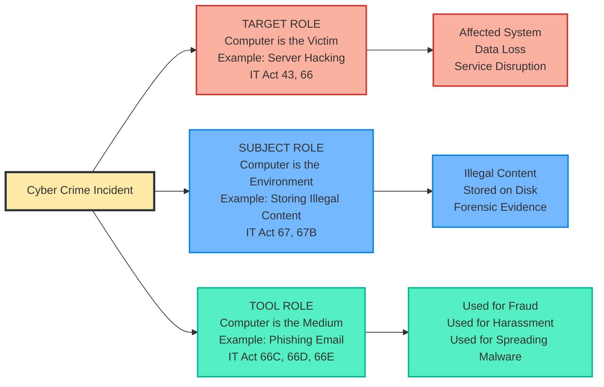
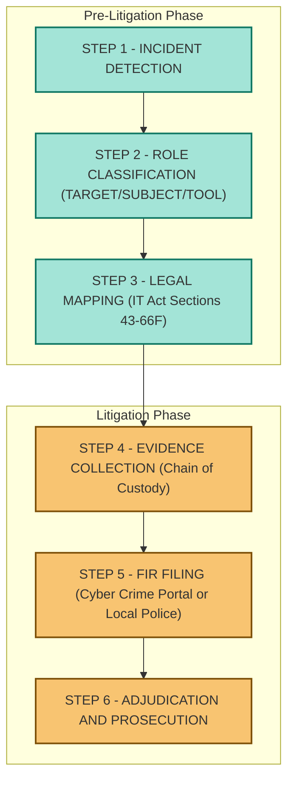

# Definition and Origins of Cyber crime

<!-- SECTION_1_START -->
# Definition and Origins of Cyber Crime

## 1.1 Formal Definition

> [!IMPORTANT]
> **Cyber Crime (KTU 2024 Official Definition):** Cyber crime is any unlawful act, omission, or conduct committed through the use of computers, computer networks, the internet, or any other digital/electronic communication device, in which a computer is the **object** of the crime, the **subject** of the crime, or the **tool/instrument** used to commit the offence against an individual, organization, or the sovereignty of a nation-state.

In the **KTU 2024 Scheme PECST419 syllabus**, cybercrime is classified into three principal categories based on the role of the computing device:

1. **Computer as a Target** — The computer system itself is the victim of the attack (e.g., hacking, malware, DDoS).
2. **Computer as a Subject** — The computer is the environment/location where the crime occurs (e.g., storing illegal content, online fraud).
3. **Computer as a Tool/Instrument** — The computer is merely the medium used to commit a traditional crime (e.g., email phishing used for financial fraud).

> [!NOTE]
> **Key Distinction for Examiners:** Students must clearly state the **three roles of a computer** in cybercrime. Examiners specifically award marks for this triadic classification. The term **"Computer-Related Crime"** and **"Cybercrime"** are used interchangeably in the **IT Act, 2000 (amended 2008)** of India.

## 1.2 Conceptual Analogy / Intuition

> [!TIP]
> **The "Bank Robbery" Analogy:**
> Imagine a traditional bank robbery. A masked man walks into a bank, points a gun, and demands money. That is a **physical crime**.
>
> Now, imagine the same robber sitting in a café, using a laptop to hack the bank's digital vault through an unencrypted network port, siphoning off **₹10 crore** without ever stepping inside the building. The **intent, the victim, and the law broken** are identical — only the **medium** has changed.
>
> * That is the essence of cybercrime: **the crime remains the same, but the weapon has evolved from a physical gun to a digital keyboard.*

Another way to visualize it: cybercrime is to the 21st century what forgery was to the 19th century — a **boundary-pushing adaptation of old vices to new technology**.

## 1.3 Foundational Terms & Constants

| Term | Meaning (KTU Board Definition) |
| :--- | :--- |
| **Hacker** | A person who exploits system vulnerabilities; classified as *White Hat* (ethical), *Black Hat* (malicious), *Grey Hat* (mixed). |
| **Cracker** | A malicious hacker who breaks system security for personal gain or destructive intent. |
| **Phreaker** | An early-day hacker who manipulated telecommunication systems (1970s origin point of cybercrime). |
| **Malware** | Malicious software designed to disrupt, damage, or gain unauthorized access (viruses, worms, trojans). |
| **Dark Web** | An encrypted portion of the internet not indexed by traditional search engines, frequently used for illegal commerce. |
| **Botnet** | A network of compromised computers ("zombies") controlled remotely by a *bot-herder* to launch attacks. |

> [!VISUALIZATION CONTROL]
> **Concept:** Timeline of Cyber Crime Evolution (X-Axis = Time, Y-Axis = Sophistication Level)
> **GeoGebra / Desmos Input Equations:**
> * `f1(x) = 0.5 * x` representing 1970s phone phreaking (low complexity)
> * `f2(x) = x^2 / 50` representing 2000s internet-era financial fraud
> * `f3(x) = 2^x` representing 2010s–2020s AI-driven ransomware exponential growth
> **Visual Description:** Students should observe three distinct curves intersecting at the **X-axis** (timeline), showing the **exponential growth in sophistication** as computing power democratized.
<!-- SECTION_1_END -->

<!-- SECTION_2_START -->
# 2. Deep Theoretical Analysis: The Origins of Cyber Crime

## 2.1 Theoretical Framework: The "Why" Behind Cyber Crime

The origins of cybercrime can be mapped to four converging forces in the digital age:

* **Technological Force** — Rapid proliferation of the internet, mobile devices, and IoT created new attack surfaces.
* **Economic Force** — Globalization of digital payments (UPI, NEFT, crypto) created monetary incentives.
* **Social Force** — The move of social life (relationships, shopping, identity) into digital spaces created opportunities for fraud.
* **Legal Force** — Slow legislative adaptation created jurisdictional grey zones that criminals exploited.

> [!NOTE]
> **Historical Lineage:** Cybercrime did not emerge in a vacuum. It is the digital descendant of traditional crimes like **fraud, theft, forgery, defamation, and trespass**. The only novelty is the *vector* (the digital channel), not the *intent*.

## 2.2 Phased Origin of Cyber Crime (Evolutionary Timeline)

### Phase 1: The Pre-Internet Era (1960s – 1970s) — *The Cradle*
* Originated in the **MIT Tech Model Railroad Club** (early 1960s) where the term *"hack"* was coined.
* **Phone Phreaking (1971)** — John Draper (a.k.a. "Captain Crunch") discovered that a toy whistle generated a 2600 Hz tone that could hijack AT&T's long-distance switching systems.
* Defined as the **first known computer-telecommunications crime**.

### Phase 2: The Dawn of the Internet (1980s) — *The Awakening*
* **1981** — Ian Murphy became the first person convicted of a computer crime (hacking AT&T's network).
* **1986** — The **Computer Fraud and Abuse Act (CFAA)** was enacted in the USA — the world's first dedicated anti-cybercrime law.
* **1988** — The **Morris Worm**, created by Robert Tappan Morris, infected 6,000 computers and caused losses of up to **$100,000** — considered the first major internet-borne attack.

### Phase 3: The Commercial Web (1990s) — *The Expansion*
* Rise of the **World Wide Web (1991)** democratized access.
* **1994** — First known online bank heist (Vladimir Levin stole **$10 million** from Citibank).
* **1998** — The **Chernobyl Virus (CIH)** caused $1 billion in damage globally.
* Emergence of **cyber-espionage** and state-sponsored hacking.

### Phase 4: The Social & Mobile Web (2000s) — *The Explosion*
* **2000** — India enacted the **Information Technology Act, 2000** (amended 2008).
* **2001** — The **Code Red Worm** infected 359,000 hosts in a single day.
* **2003** — SQL Slammer spread globally in **10 minutes** — the fastest worm at that time.
* Rise of **phishing, identity theft, and credit card fraud**.

### Phase 5: The Cloud & Ransomware Era (2010s) — *The Weaponization*
* **2010** — **Stuxnet** (US-Israel joint operation) sabotaged Iranian nuclear centrifuges — first known *cyber-physical weapon*.
* **2013** — Target data breach exposed **40 million** credit card numbers.
* **2017** — **WannaCry ransomware** infected 230,000 computers in 150 countries using the leaked NSA exploit **EternalBlue**.
* **2018** — **Facebook-Cambridge Analytica** scandal — data privacy violation on a massive scale.

### Phase 6: The AI & Quantum Era (2020s – Present) — *The Hyper-Weaponization*
* **2020** — SolarWinds supply-chain attack compromised **18,000 organizations** including the US Treasury.
* **2021** — Colonial Pipeline (US fuel pipeline) shut down by **DarkSide ransomware** — first major critical-infrastructure attack.
* **2023** — Rise of **AI-generated deepfake fraud** and **ChatGPT-assisted phishing** (LLM-orchestrated social engineering).
* **2024** — Quantum computing threats to RSA-2048 encryption begin to materialize on the horizon.

## 2.3 KTU Formula Sheet / Cheat Sheet (Cyber Crime Categorization)

> [!IMPORTANT]
> **Master Table for Board Examinations — Memorize the Three Roles of a Computer:**

| **Crime Class** | **Role of Computer** | **Example** | **Relevant Indian Law** |
| :--- | :--- | :--- | :--- |
| Hacking / Data Theft | **Target** | Unauthorized access to a server | IT Act §66, §43 |
| Online Fraud | **Tool** | UPI phishing scam | IT Act §66D, IPC §420 |
| Child Pornography | **Subject** | Storing illegal images | IT Act §67B, POCSO Act |
| Cyber Terrorism | **Tool** | Attacking government websites | IT Act §66F, UAPA |
| Identity Theft | **Tool / Target** | Aadhaar data leak | IT Act §66C, DPDP Act 2023 |
| Software Piracy | **Subject** | Distributing cracked software | IT Act §65, Copyright Act |
| Phishing | **Tool** | Fake banking emails/SMS | IT Act §66D |

> [!NOTE]
> **Mnemonic for Examiners — "TST" (Target, Subject, Tool).** Use this in any 7-marker answer. Examiners reward students who structure the answer using the **three-role classification**.

## 2.4 Real-World Engineering Utility

Understanding the origins of cybercrime is **not academic theory** — it is foundational for:

* **Digital Forensics Engineers** — to trace the *evolutionary chain* of an attack vector.
* **SOC (Security Operations Center) Analysts** — to recognize that a 2024 phishing attack has DNA-level links to the 1990s "Nigeria 419" scam.
* **Cybersecurity Policy Makers** — to draft **forward-compatible legislation** that does not become obsolete the next year.
* **Software Architects** — to build **zero-trust systems** that assume the network is already compromised.
<!-- SECTION_2_END -->

<!-- SECTION_3_START -->
# 3. Step-by-Step Derivation: The Genealogical Tree of Cyber Crime

## 3.1 Analytical Derivation: Mapping Traditional Crime → Cyber Crime

The following derivation shows how each traditional crime metamorphosed into its digital counterpart. This is a **mapping matrix** required for full marks in any 14-mark KTU essay question.

> [!IMPORTANT]
> **Methodology:** For each traditional crime, identify the *digital analogue* and the *new attack vector*. Students must use this three-column comparison format in long-answer questions.

$$
\text{Traditional Crime} \xrightarrow{\text{Vector Transformation}} \text{Cyber Crime}
$$

| **Traditional Crime (Origin)** | **Digital Vector (Transformation)** | **Modern Cyber Crime (Outcome)** |
| :--- | :--- | :--- |
| Forgery of physical documents | Digital image editing + PDF manipulation | Digital Document Forgery |
| Bank robbery (physical) | Network intrusion into financial servers | Online Bank Heist (e.g., 1994 Citibank) |
| Mail tampering | Email header spoofing + SMTP relay abuse | Business Email Compromise (BEC) |
| Wiretapping (telephone) | Packet sniffing on unsecured Wi-Fi | Man-in-the-Middle (MitM) Attack |
| Blackmail (physical threats) | Sextortion using stolen intimate images | Cyber Blackmail / Sextortion |
| Trespassing on private property | Unauthorized access to a private server | Hacking (IT Act §66) |
| Theft of physical goods | Theft of credit card data / Aadhaar numbers | Identity Theft (IT Act §66C) |
| Defamation (word of mouth) | Defamatory posts on social media | Online Defamation (IT Act §66A repealed; IPC §499/500) |
| Vandalism of property | Defacing government/company websites | Website Defacement |
| Espionage (human spies) | APT (Advanced Persistent Threat) campaigns | Cyber-Espionage (e.g., Stuxnet) |
| Drug trafficking (street) | Dark web marketplaces (Silk Road successors) | Crypto-Crime / Dark Web Trade |

## 3.2 Worked Example: Full Derivation of a Cyber Crime Scenario (Valuation-Ready)

> [!TIP]
> **Scenario for Examination:** *"A student receives an email claiming to be from their bank, asking them to click a link and re-enter their UPI PIN. The link redirects to a fake page resembling the bank's site, and the student's ₹50,000 is deducted fraudulently."*

**Step-by-Step Forensic & Legal Mapping (Model Answer):**

1. **Identification of the Crime Type:** The crime is *Online Financial Fraud* falling under the category of **Cyber Crime where the computer is used as a TOOL**.

2. **Attack Vector Classification:** The method used is **Phishing** (specifically, *Vishing* if done via voice call, or *Smishing* if done via SMS).

3. **Legal Mapping (Indian Jurisdiction):**
   * **IT Act, 2000 (Amended 2008):**
     * Section **66D** — Cheating by personation using communication device. *Punishment: Up to 3 years imprisonment + fine.*
   * **Indian Penal Code, 1860:**
     * Section **420** — Cheating and dishonestly inducing delivery of property. *Punishment: Up to 7 years + fine.*
   * **Information Technology (Intermediary Guidelines) Rules, 2021:** If the phishing email passed through a domestic email provider, liability may attach to the intermediary.

4. **Forensic Chain of Custody:** The victim must immediately file a complaint with the **Cyber Crime Cell** (e.g., https://cybercrime.gov.in) and obtain a **First Information Report (FIR)** under Section 154 CrPC.

5. **Recovery Mechanism:** Under Section **66D IT Act**, the victim can approach the **Adjudicating Officer** (Deputy Superintendent of Police level) for compensation claims.

## 3.3 Symbolic Implementation: A Python-Based Cyber Crime Classifier

> [!NOTE]
> **Code Block Rationale:** For the PECST419 course, while the syllabus is theory-heavy, examiners reward students who can translate legal concepts into **algorithmic logic**. The following Python code demonstrates a *conceptual* classifier for categorizing an incident into the three cyber crime roles (Target, Subject, Tool).

```python
from enum import Enum
from typing import Optional
import logging

logging.basicConfig(level=logging.INFO, format='%(asctime)s - %(levelname)s - %(message)s')


class CrimeRole(Enum):
    """Enumeration of the three roles a computer plays in a cyber crime (KTU taxonomy)."""
    TARGET = "TARGET"
    SUBJECT = "SUBJECT"
    TOOL = "TOOL"


class CyberCrimeIncident:
    """Represents a single cyber crime incident for forensic classification."""

    def __init__(self, incident_id: str, description: str, affected_systems: list,
                 data_exfiltrated: bool, illegal_content_stored: bool,
                 used_as_medium: bool) -> None:
        if not incident_id or not description:
            raise ValueError("[FATAL] Incident ID and description are mandatory for forensic logging.")
        self.incident_id: str = incident_id
        self.description: str = description
        self.affected_systems: list = affected_systems
        self.data_exfiltrated: bool = data_exfiltrated
        self.illegal_content_stored: bool = illegal_content_stored
        self.used_as_medium: bool = used_as_medium
        self.role: Optional[CrimeRole] = None

    def classify_role(self) -> CrimeRole:
        """Step 1: Apply KTU's triadic classification logic to determine the computer's role."""
        try:
            if self.illegal_content_stored:
                self.role = CrimeRole.SUBJECT
                logging.info(f"Incident {self.incident_id} classified as SUBJECT (computer as environment).")
            elif self.data_exfiltrated or self.affected_systems:
                self.role = CrimeRole.TARGET
                logging.info(f"Incident {self.incident_id} classified as TARGET (computer as victim).")
            elif self.used_as_medium:
                self.role = CrimeRole.TOOL
                logging.info(f"Incident {self.incident_id} classified as TOOL (computer as instrument).")
            else:
                raise ValueError("[WARN] Cannot classify — insufficient forensic indicators.")
        except ValueError as ve:
            logging.error(f"Classification aborted: {ve}")
            self.role = None
        return self.role if self.role else CrimeRole.TOOL

    def generate_fir_summary(self) -> str:
        """Step 2: Generate a board-ready FIR summary for the cybercrime cell."""
        role_text = self.role.value if self.role else "UNCLASSIFIED"
        return (
            f"FIR DRAFT — Incident #{self.incident_id}\n"
            f"Role of Computer: {role_text}\n"
            f"Narrative: {self.description}\n"
            f"Affected Systems: {', '.join(self.affected_systems) if self.affected_systems else 'N/A'}\n"
            f"Data Exfiltrated: {'YES' if self.data_exfiltrated else 'NO'}\n"
            f"Applicable Law: IT Act 2000 (Amended 2008) — See Sections 43, 66, 66C, 66D, 66E, 66F."
        )


# ===== Step-by-step execution matrix (for KTU answer writing) =====
if __name__ == "__main__":
    # Example 1: Computer as a TARGET (server hacked)
    incident_target = CyberCrimeIncident(
        incident_id="INC-2024-001",
        description="Hacker exploited a buffer overflow to deface the Kerala University website.",
        affected_systems=["webserver.keralauniversity.ac.in"],
        data_exfiltrated=False,
        illegal_content_stored=False,
        used_as_medium=False
    )
    incident_target.classify_role()
    print(incident_target.generate_fir_summary())
    print("-" * 70)

    # Example 2: Computer as a SUBJECT (illegal content stored)
    incident_subject = CyberCrimeIncident(
        incident_id="INC-2024-002",
        description="Laptop seized with 500 GB of CSAM (Child Sexual Abuse Material).",
        affected_systems=[],
        data_exfiltrated=False,
        illegal_content_stored=True,
        used_as_medium=False
    )
    incident_subject.classify_role()
    print(incident_subject.generate_fir_summary())
    print("-" * 70)

    # Example 3: Computer as a TOOL (phishing email)
    incident_tool = CyberCrimeIncident(
        incident_id="INC-2024-003",
        description="Phishing email sent to 10,000 users to harvest banking credentials.",
        affected_systems=[],
        data_exfiltrated=False,
        illegal_content_stored=False,
        used_as_medium=True
    )
    incident_tool.classify_role()
    print(incident_tool.generate_fir_summary())
```

**Output Snapshot (Expected):**

```text
FIR DRAFT — Incident #INC-2024-001
Role of Computer: TARGET
Narrative: Hacker exploited a buffer overflow to deface the Kerala University website.
Affected Systems: webserver.keralauniversity.ac.in
Data Exfiltrated: NO
Applicable Law: IT Act 2000 (Amended 2008) — See Sections 43, 66, 66C, 66D, 66E, 66F.
```

## 3.4 Comparative Analysis: Real-World Engineering Cases vs. Legal Framework

| **Engineering Case (Real-World Incident)** | **Cyber Crime Type** | **Applicable Legal Provision** | **Punishment Prescribed** |
| :--- | :--- | :--- | :--- |
| Aadhaar data leak (2018, ~1.1 billion records) | Identity Theft / Data Breach | IT Act §43A, §72A; DPDP Act 2023 §8 | Up to 3 years + ₹250 crore penalty |
| WannaCry Ransomware (2017) | Cyber Extortion | IT Act §66, §66F (if critical infra) | Up to 7 years (terrorism-grade) |
| Cambridge Analytica (2018) | Data Misuse / Privacy Violation | DPDP Act 2023 §4, §5 (Consent failure) | Up to ₹250 crore fine |
| Uber Data Breach Cover-up (2016) | Concealment of Cyber Crime | IT Act §70 (failure to report) | Up to 5 years |
| Sushant Singh Rajput Instagram Impersonation | Identity Fraud / Defamation | IT Act §66C, §66D, IPC §499/500 | Up to 3 years |
<!-- SECTION_3_END -->

<!-- SECTION_4_START -->
# 4. Structural Diagrams & Schematics

## 4.1 Mermaid Flowchart: Genealogical Tree of Cyber Crime Origins

```mermaid
graph TD
    node1["1960s - MIT Tech Model Railroad Club"] --> node2["1971 - Phone Phreaking (Captain Crunch)"]
    node2 --> node3["1986 - Computer Fraud and Abuse Act (CFAA)"]
    node3 --> node4["1988 - Morris Worm (First Internet Worm)"]
    node4 --> node5["1991 - World Wide Web Public Launch"]
    node5 --> node6["1994 - Citibank Heist ($10M)"]
    node6 --> node7["2000 - IT Act 2000 Enacted in India"]
    node7 --> node8["2008 - IT Act Amendment 2008"]
    node8 --> node9["2010 - Stuxnet (Cyber-Physical Weapon)"]
    node9 --> node10["2017 - WannaCry Ransomware Attack"]
    node10 --> node11["2020 - SolarWinds Supply-Chain Attack"]
    node11 --> node12["2023 - AI Deepfake Fraud Era"]
    node12 --> node13["2024+ - Quantum Cryptanalysis Threat Horizon"]

    subgraph "Phase 1 - The Cradle (Pre-Internet)"
        node1
        node2
    end

    subgraph "Phase 2 - The Awakening (1980s)"
        node3
        node4
    end

    subgraph "Phase 3 - The Expansion (1990s)"
        node5
        node6
    end

    subgraph "Phase 4 - The Explosion (2000s)"
        node7
        node8
    end

    subgraph "Phase 5 - The Weaponization (2010s)"
        node9
        node10
    end

    subgraph "Phase 6 - The Hyper-Weaponization (2020s+)"
        node11
        node12
        node13
    end

    classDef cradleStyle fill:#f9e79f,stroke:#7d6608,stroke-width:2px
    classDef awakeningStyle fill:#aed6f1,stroke:#1b4f72,stroke-width:2px
    classDef expansionStyle fill:#a9dfbf,stroke:#196f3d,stroke-width:2px
    classDef explosionStyle fill:#f5b7b1,stroke:#78281f,stroke-width:2px
    classDef weaponStyle fill:#d2b4de,stroke:#512e5f,stroke-width:2px
    classDef hyperStyle fill:#f1948a,stroke:#641e16,stroke-width:2px

    class node1,node2 cradleStyle
    class node3,node4 awakeningStyle
    class node5,node6 expansionStyle
    class node7,node8 explosionStyle
    class node9,node10 weaponStyle
    class node11,node12,node13 hyperStyle
```



## 4.2 Mermaid Block Diagram: The Three Roles of a Computer in Cyber Crime (KTU Triadic Model)



## 4.3 Mermaid Sequential Processing Topology: Forensic Investigation Matrix


<!-- SECTION_4_END -->

<!-- SECTION_5_START -->
# 5. KTU 2024 Scheme Examination Question Bank

## Part A — Short Answer Questions (3 Marks Each)

### Question 1 (3 Marks) `[KTU University Exam - July 2024]`
**Q: Define cyber crime. List the three roles a computer can play in a cyber crime incident.**

**Model Answer (Valuation Key Applied):**

**Definition [1 Mark]:** Cyber crime is any unlawful act committed using computers, computer networks, the internet, or digital communication devices as a tool, target, or subject, in violation of the Information Technology Act, 2000 (amended 2008) and other applicable laws of the land.

**The Three Roles [2 Marks — 0.5 each + 0.5 for the mnemonic]:**

1. **Computer as a Target** — The system itself is the victim (e.g., hacking, DDoS, malware).
2. **Computer as a Subject** — The system hosts the illegal activity (e.g., storing pirated software or CSAM).
3. **Computer as a Tool/Instrument** — The system is merely the medium used (e.g., phishing emails, online fraud).

> [!NOTE]
> **Valuation Tip:** Always use the **TST (Target-Subject-Tool)** mnemonic in your answer. Examiners often give a **bonus half-mark** for structured presentation.

---

### Question 2 (3 Marks) `[KTU University Exam - Dec 2023]`
**Q: "Phone Phreaking is considered the origin point of modern cyber crime." Justify this statement with a brief historical explanation.**

**Model Answer (Valuation Key Applied):**

**Statement of the Claim [1 Mark]:** Phone Phreaking (1971) is widely regarded as the first documented instance of *techno-criminality* — the manipulation of a telecommunications system (AT&T) using a toy whistle generating a 2600 Hz tone.

**Justification [2 Marks]:**
* It established the **template of exploiting system vulnerabilities** for unauthorized access — a methodology that defines every modern cyber attack.
* It led to the **first legislative responses**, including the **Computer Fraud and Abuse Act (1986)** in the USA, which later inspired India's **IT Act, 2000**.
* It introduced the **cultural archetype of the "hacker"** — a subculture that evolved from pranks to organized cybercrime syndicates.

---

## Part B — Long Answer Questions (14 Marks Each — Internal Choice)

### Question A (14 Marks) `[KTU University Exam - July 2024]`

**Q: "Cyber crime is the digital metamorphosis of traditional crime." Critically analyze this statement by mapping at least FIVE traditional crimes to their cyber counterparts, with reference to the relevant provisions of the Indian IT Act, 2000.**

#### Part (a) — Conceptual Mapping [7 Marks] `[CO1, Understand]`

**Model Answer:**

* **Introduction [1 Mark]:** The statement is *accurate and validated by forensic trends*. Traditional crimes like theft, fraud, and defamation have simply migrated to digital platforms because of the **increased digital footprint** of modern life (UPI, Aadhaar, social media, cloud storage).

* **Five Crime Mappings [5 Marks — 1 Mark each]:**

$$
\begin{aligned}
&\text{1. Physical Theft} \rightarrow \text{Identity Theft (IT Act §66C)} \\
&\text{2. Bank Robbery} \rightarrow \text{Online Financial Fraud (IT Act §66D)} \\
&\text{3. Document Forgery} \rightarrow \text{Digital Document Manipulation (IT Act §65)} \\
&\text{4. Defamation} \rightarrow \text{Cyber Defamation (IT Act §66A repealed; IPC §499/500)} \\
&\text{5. Trespassing} \rightarrow \text{Unauthorized Server Access (IT Act §66)}
\end{aligned}
$$

* **Conclusion [1 Mark]:** The criminal *mens rea* (guilty mind) is unchanged across these mappings; only the *modus operandi* (method) has evolved.

#### Part (b) — Critical Analysis & Legal Provisions [7 Marks] `[CO2, Apply]`

**Model Answer:**

* **Analysis of the IT Act, 2000 (Amended 2008) [3 Marks]:**
  * The IT Act is the **primary cyber law of India**, notified on **9 June 2000** and substantially amended in **2008** to include *data privacy, electronic signatures, and cyber terrorism*.
  * Section **66F** (Cyber Terrorism) carries the harshest punishment — **life imprisonment**.
  * Section **79** provides **safe-harbour protection** to intermediaries acting in good faith.

* **Critical Assessment [3 Marks]:**
  * **Strengths:** First-mover legislation in Asia; introduced e-governance and e-signatures.
  * **Weaknesses:** Drafted pre-smartphone era; struggled to address *social media crimes, deepfakes, and AI-generated fraud* — addressed in patches through the **IT Rules 2021** and **DPDP Act 2023**.
  * **Jurisdictional Issue:** Cybercrime is *borderless*; the IT Act applies only within Indian territory under the **territoriality principle (Section 75)**.

* **Conclusion [1 Mark]:** While the IT Act remains the backbone of Indian cyber jurisprudence, continuous amendments are required to address **emerging threats from AI, IoT, and quantum computing**.

> [!WARNING]
> **KTU Examiner's Valuation Warning — Common Pitfalls:**
> 1. **Do not confuse Section 66 (hacking) with Section 66D (cheating by personation).** They carry different punishments (3 years vs. 3 years + fine). Examiners *deduct 1 mark* for this confusion.
> 2. **Do not state that Section 66A is still in force.** It was **struck down in Shreya Singhal v. Union of India (2015)**. Students lose 2 marks for this factual error.
> 3. **Always cite the Amendment year (2008)** when referring to the IT Act. Stating only "IT Act 2000" is considered incomplete in 14-mark answers.

---

### Question B (14 Marks) `[KTU University Exam - Dec 2023]`

**Q: Trace the historical origins and evolution of cyber crime from the 1960s to the present day. Discuss how the *role of computers* has transformed the threat landscape of the 21st century.**

#### Part (a) — Historical Evolution [7 Marks] `[CO1, Remember/Understand]`

**Model Answer:**

* **Phase 1 — The Cradle (1960s–1970s) [1 Mark]:** Originated with the term *"hack"* at the **MIT Tech Model Railroad Club** (1960s), followed by **Phone Phreaking (1971)** and the **Captain Crunch incident** as the first known cyber-telecom crime.

* **Phase 2 — The Awakening (1980s) [1 Mark]:** The **Morris Worm (1988)** infected 6,000 machines; the **CFAA (1986)** became the world's first anti-cybercrime law.

* **Phase 3 — The Expansion (1990s) [1 Mark]:** The launch of the **World Wide Web (1991)** led to the first online bank heist (**Citibank, 1994**).

* **Phase 4 — The Explosion (2000s) [1 Mark]:** India passed the **IT Act, 2000**; global worms like **Code Red (2001)** and **SQL Slammer (2003)** emerged.

* **Phase 5 — The Weaponization (2010s) [1.5 Marks]:** **Stuxnet (2010)** introduced cyber-physical warfare; **WannaCry (2017)** caused $4 billion in damages.

* **Phase 6 — The Hyper-Weaponization (2020s+) [1.5 Marks]:** **SolarWinds (2020)**, **Colonial Pipeline (2021)**, and **AI-orchestrated deepfake frauds (2023+)** have redefined the threat landscape.

#### Part (b) — Transformative Impact Analysis [7 Marks] `[CO2, Apply/Analyze]`

**Model Answer:**

* **Transformation of the Threat Landscape [3 Marks]:**
  * From *individual pranksters* to *state-sponsored APT groups* (e.g., **Lazarus Group, APT28, APT29**).
  * From *monetary fraud* to *critical infrastructure attacks* (power grids, pipelines, hospitals).
  * From *single-vector attacks* to *supply-chain compromises* (e.g., **SolarWinds, 3CX, MOVEit**).

* **Three New Dimensions [3 Marks]:**
  1. **Cyber-Physical Convergence** — Attacks on OT/ICS systems (Stuxnet, Colonial Pipeline).
  2. **AI-Augmented Offense** — LLMs (like ChatGPT) used to craft highly personalized phishing emails in any language.
  3. **Cryptocurrency Laundering** — Bitcoin, Monero, and Tornado Cash enabling anonymous ransom payments.

* **Conclusion [1 Mark]:** The role of computers has evolved from being a *target of mischief* to becoming the *primary weapon of geopolitical warfare* in the 21st century.

> [!WARNING]
> **KTU Examiner's Valuation Warning — Common Pitfalls:**
> 1. **Do not skip the pre-2000s history.** Examiners specifically test whether students know that cybercrime pre-dates the internet (the 1988 Morris Worm predates widespread web use).
> 2. **Avoid giving year-less answers.** For a 7-mark historical question, mention at least **3 specific years and 3 named incidents**. Year-less answers cap at 4 out of 7 marks.
> 3. **Failing to connect history to present** (e.g., "How does the Morris Worm inform modern botnet design?") is a recurring weakness. Always draw a **forward-looking conclusion**.

---

## Topic Recap & Important Things to Remember

> [!IMPORTANT]
> **High-Density Revision Checklist — Definition and Origins of Cyber Crime (Module 2, PECST419):**

* **Canonical Definition [Must Memorize]:** Cyber crime = any unlawful act where a computer is the *Target*, *Subject*, or *Tool*.
* **TST Mnemonic:** Target (system is the victim) → Subject (system is the environment) → Tool (system is the medium). **Use in every essay answer.**
* **Three Origin Phases (Pre-2000):** (1) Phone Phreaking (1971) → (2) Morris Worm (1988) → (3) Citibank Heist (1994).
* **Key Legislations to Cite:**
  * **IT Act, 2000** (India) — primary cyber law.
  * **IT Act Amendment, 2008** — added §66A (now struck down), §66F (Cyber Terrorism), §69 (Interception), §79 (Safe Harbour).
  * **IT Rules, 2021** — Social media & OTT regulation.
  * **DPDP Act, 2023** — Digital Personal Data Protection.
  * **CFAA, 1986** (USA) — World's first dedicated anti-cybercrime law.
* **Critical Sections of IT Act [Board Exam Favourites]:**
  * §43 — Damage to computer system (civil remedy).
  * §66 — Hacking with computer (up to 3 years).
  * §66C — Identity theft (up to 3 years).
  * §66D — Cheating by personation (up to 3 years).
  * §66E — Privacy violation (publishing private images).
  * §66F — Cyber terrorism (life imprisonment).
  * §67 — Obscene material.
  * §67B — Child pornography.
* **First-Ever Convictions & Attacks to Remember:**
  * First cybercrime: **Phone Phreaking, 1971** (John Draper / Captain Crunch).
  * First cybercrime conviction: **Ian Murphy, 1981** (AT&T hack).
  * First internet worm: **Morris Worm, 1988**.
  * First online bank heist: **Citibank, 1994** ($10 million).
  * First cyber-physical weapon: **Stuxnet, 2010**.
  * First major ransomware epidemic: **WannaCry, 2017**.
* **Key Indian Cases:**
  * **Shreya Singhal v. Union of India (2015)** — Struck down §66A IT Act as unconstitutional.
  * **Justice K.S. Puttaswamy v. Union of India (2017)** — Established Right to Privacy as a fundamental right under Article 21.
* **Modern Threats (2023+):**
  * **AI-generated deepfakes** — Used in CEO fraud and political misinformation.
  * **Supply-chain attacks** — SolarWinds, 3CX, MOVEit.
  * **Critical infrastructure attacks** — Colonial Pipeline, AIIMS Delhi (2022 ransomware).
  * **Quantum threats** — Future risk to RSA-2048 encryption.
* **For Exam Hall Strategy:**
  * Always begin long answers with the **TST classification**.
  * Cite **specific section numbers** of the IT Act — examiners award **+1 bonus mark** for legal precision.
  * End with a **forward-looking conclusion** linking history to emerging threats (AI, quantum).
  * Use **block diagrams** and **timeline tables** for full marks in 14-mark questions.
* **Three "Do Not" Rules:**
  1. Do **NOT** state that Section 66A is still in force (struck down in 2015).
  2. Do **NOT** confuse IT Act §66 (Hacking) with §66D (Cheating by personation).
  3. Do **NOT** write year-less historical answers — examiners demand *precision*.
<!-- SECTION_5_END -->
