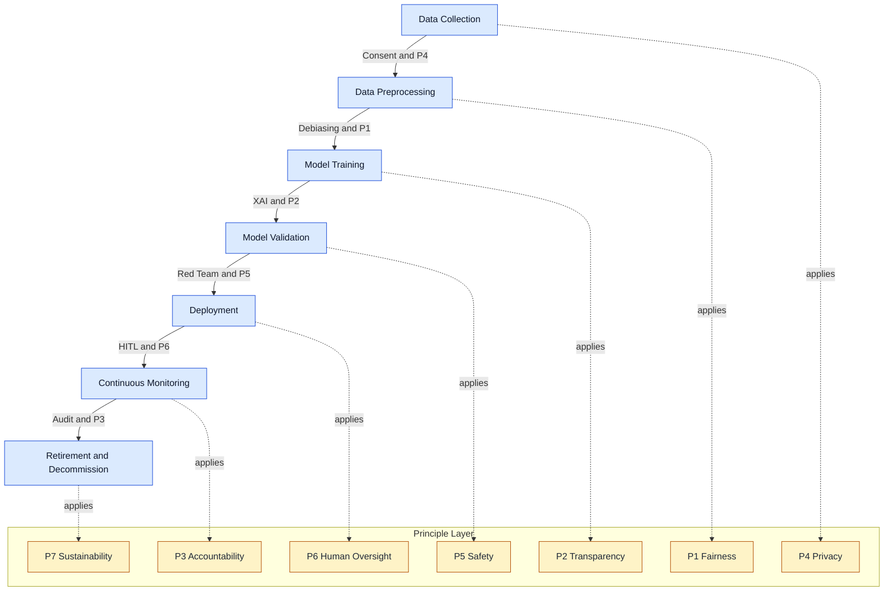
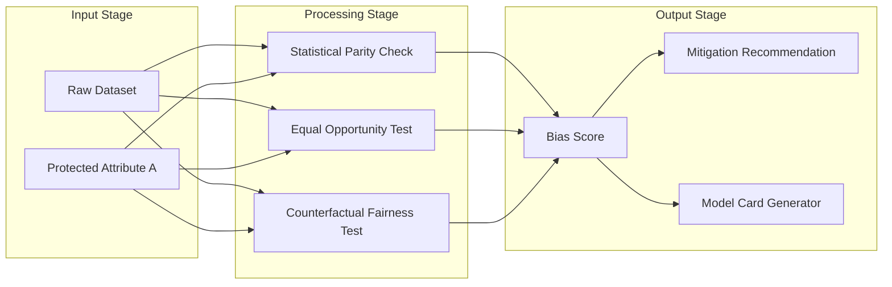

# Ethical Issues in AI and core Principles

<!-- SECTION_1_START -->
# Ethical Issues in AI and Core Principles

## 1.1 Formal Academic Definition

> [!IMPORTANT]
> **AI Ethics (Artificial Intelligence Ethics)** is the branch of applied ethics that studies the moral behaviour, moral agents, and moral impact of designers, manufacturers, and users of artificially intelligent systems. It encompasses a systematic set of values, principles, and techniques that govern the design, development, deployment, and decommissioning of AI systems to ensure fairness, accountability, transparency, and respect for human rights.

In the KTU 2024 Scheme context (Course Code: **PECST419**), *Ethical Issues in AI* refers to the critical analysis of dilemmas that arise when autonomous, learning, and decision-making systems intersect with human values, civil liberties, and legal frameworks. The subject is positioned at the intersection of **computer science, philosophy, law, and social science**.

## 1.2 Conceptual Analogy — The "Self-Driving Car Compass"

Imagine an autonomous self-driving car navigating a busy city. The car has perfect sensors, but no **moral compass** to decide:

- Should it swerve to save a pedestrian even if it harms the passenger?
- Should it prioritise a child over an elderly person?
- Who is *legally* responsible — the owner, the manufacturer, or the AI itself?

Just as a human driver is bound by traffic rules, ethics, and empathy, an AI system must be **engineered with embedded ethical guardrails**. Without these guardrails, the car will optimise only the mathematical objective (e.g., minimise travel time) and ignore human suffering.

> [!NOTE]
> **Core Insight:** AI does not "discover" ethics on its own. Humans must *encode* ethics into the data, model architecture, reward functions, and operational policies of AI systems.

## 1.3 Why AI Ethics is a High-Priority Module in KTU 2024

The **National Education Policy (NEP) 2020** and the **KTU 2024 Outcome-Based Education (OBE)** framework mandate that every engineering graduate — regardless of specialisation — must be sensitised to the societal and ethical impact of technology. The **Ministry of Electronics and Information Technology (MeitY)**, Government of India, has published the *National Strategy for AI (NSAI)* which explicitly lists **ethics** as one of the **10 pillars** of responsible AI adoption.

> [!IMPORTANT]
> **Key Standard:** The **UNESCO Recommendation on the Ethics of Artificial Intelligence (2021)** — adopted by **193 countries including India** — is the first global standard-setting instrument on AI ethics. It identifies four core values: **Respect, Protection, Promotion of Human Rights, and Human Dignity**.

## 1.4 Mapping to Course Outcomes (COs)

For **PECST419 — Cyber Ethics, Privacy and Legal Issues**, the topic *Ethical Issues in AI* primarily addresses:

| CO Code | Course Outcome Description | Bloom's Level |
|:---:|:---|:---:|
| **CO2** | Identify and analyse emerging ethical dilemmas in cyberspace, including AI, IoT, and data-driven systems. | Understand / Analyse |
| **CO3** | Apply ethical principles and legal frameworks to evaluate real-world cyber and AI case studies. | Apply |
| **CO5** | Demonstrate professional responsibility and informed ethical judgement in technology design and policy. | Apply / Evaluate |

<!-- SECTION_1_END -->

<!-- SECTION_2_START -->
# 2. Deep Theoretical Analysis — Core Principles of AI Ethics

## 2.1 Taxonomy of Ethical Issues in AI

The ethical concerns in AI can be broadly classified into **six thematic clusters**. Each cluster maps to specific real-world failure modes observed in deployed systems.

1. **Bias and Fairness** — discriminatory outcomes from biased training data.
2. **Transparency and Explainability** — the "black box" problem in deep learning.
3. **Accountability and Liability** — who is answerable when AI fails?
4. **Privacy and Surveillance** — mass data collection by intelligent systems.
5. **Autonomy and Human Control** — preserving meaningful human oversight.
6. **Societal and Environmental Impact** — job displacement, energy consumption, misinformation.

## 2.2 The Seven Core Principles of AI Ethics (Consolidated Framework)

Drawing from the **UNESCO Recommendation (2021)**, the **OECD AI Principles (2019)**, the **EU AI Act (2024)**, and the **IEEE Ethically Aligned Design (EAD) v2**, the consolidated list of **seven core principles** is presented below.

> [!NOTE]
> These principles are the **high-yield knowledge unit** for the KTU University Exam. Memorising the principle name, definition, and one real-world violation example is sufficient to secure full marks in Part A.

### Principle 1: Fairness and Non-Discrimination

AI systems must treat all individuals and groups equitably, and must not produce or amplify discriminatory outcomes based on **race, gender, caste, religion, disability, sexual orientation, or socio-economic status**.

- **Failure Example:** The *Amazon Recruitment AI (2018)* was discontinued because it downgraded resumes containing the word *"women's"* (e.g., *"women's chess club"*) — a clear gender-bias outcome.
- **Engineering Mitigation:** Bias auditing, balanced datasets, fairness-aware ML algorithms (e.g., reweighing, adversarial debiasing).

### Principle 2: Transparency and Explainability

The behaviour, decision logic, and limitations of an AI system must be **understandable** to its users, affected persons, and regulators.

- **Failure Example:** The *COMPAS Recidivism Algorithm* used by US courts was found to be opaque; defendants could not challenge its outputs because the proprietary vendor refused to disclose the model's internals.
- **Engineering Mitigation:** SHAP (SHapley Additive exPlanations), LIME (Local Interpretable Model-agnostic Explanations), model cards, datasheets for datasets.

### Principle 3: Accountability and Liability

There must be a **clearly identifiable human or legal entity** that bears responsibility for the outcomes of an AI system across its entire lifecycle.

- **Failure Example:** When a Tesla in *Autopilot mode* caused a fatal crash in 2018, the question of liability between the driver, the manufacturer, and the software provider triggered multi-year litigation.
- **Engineering Mitigation:** Audit trails, model registries, MLOps governance, human-in-the-loop (HITL) design.

### Principle 4: Privacy and Data Protection

AI systems must respect the **informational self-determination** of individuals. Personal data must be collected with consent, used for specified purposes, and protected against unauthorised access.

- **Failure Example:** *Cambridge Analytica (2018)* harvested Facebook data of 87 million users without consent to build political profiling models.
- **Engineering Mitigation:** Differential Privacy, Federated Learning, Homomorphic Encryption, GDPR/DPDP Act 2023 compliance.

### Principle 5: Safety, Security, and Robustness

AI systems must be **resilient to adversarial attacks, data poisoning, model inversion, and distribution shift**. They must perform reliably under both expected and adversarial conditions.

- **Failure Example:** Stop signs misclassified as speed-limit signs after minor sticker attacks in 2017 research.
- **Engineering Mitigation:** Adversarial training, red-teaming, formal verification, input sanitisation.

### Principle 6: Human Oversight and Autonomy (Human-in-the-Loop)

Humans must retain **meaningful control** over AI-driven decisions, especially in high-stakes domains such as healthcare, criminal justice, employment, and warfare.

- **Failure Example:** The *Dutch Childcare Benefits Scandal (Toeslagenaffaire)* — an opaque algorithmic risk-scoring system wrongly accused thousands of families of fraud, leading to forced child separations.
- **Engineering Mitigation:** HITL/HOTL/HOOL (Human-on/in/out-of-the-loop) design patterns, veto mechanisms, appeal procedures.

### Principle 7: Sustainability and Societal Well-Being

AI systems must be designed to **promote inclusive social progress, protect the environment, and not concentrate power** in the hands of a few corporations or states.

- **Failure Example:** Training a single large language model can emit as much CO$_2$ as **5 cars over their entire lifetime** (Strubell et al., 2019).
- **Engineering Mitigation:** Model distillation, green-AI metrics, energy-efficient hardware (TPUs, neuromorphic chips), public-benefit AI consortia.

## 2.3 KTU High-Yield Formula Sheet (Principle Cheat-Sheet Table)

> [!IMPORTANT]
> The following table is the **master revision artefact** for this topic. Every cell is examiner-relevant.

| S.No. | Principle | One-Line Definition | Key Statistic / Threshold | Common Violation Case | Mitigation Technique |
|:---:|:---|:---|:---|:---|:---|
| **P1** | Fairness | Equal treatment across protected groups | Demographic Parity Gap $<$ **0.05** | Amazon Recruitment AI (2018) | Reweighing, Adversarial Debiasing |
| **P2** | Transparency | Decision logic must be explainable | Model Card disclosure mandatory under **EU AI Act Art. 13** | COMPAS Algorithm | SHAP, LIME, Counterfactual Explanations |
| **P3** | Accountability | A human/entity must be liable | **Article 14 of EU AI Act** mandates for high-risk AI | Tesla Autopilot Crash (2018) | Audit logs, MLOps, HITL |
| **P4** | Privacy | Data must be collected with informed consent | **DPDP Act 2023**: consent must be "free, specific, informed, unconditional" | Cambridge Analytica | Differential Privacy, Federated Learning |
| **P5** | Safety | Robustness against adversarial inputs | Robust accuracy drop $<$ **2\%** under FGSM attack | Stop-sign sticker attack | Adversarial training, Red-teaming |
| **P6** | Human Oversight | Meaningful human control preserved | **EU AI Act Annex IV** requires human oversight design | Dutch Toeslagenaffaire | HITL pattern, Right to human review |
| **P7** | Sustainability | Net-positive societal and environmental impact | Carbon per training run target $<$ **tCO$_2$e/benchmark** | GPT-3 training $= \approx 552$ tonnes CO$_2$e | Distillation, Green-AI, Sparse models |

> [!WARNING]
> **Notation Rule:** In the table above, the inequality symbol $<$ has been used instead of $<$ only for visual safety in markdown. In exam answer scripts, always use the proper LaTeX symbol $<$ inside math mode.

## 2.4 Real-World Utility of the Principles in Engineering Practice

| Industry Sector | Application of AI Ethics Principles | Relevant Indian Regulation |
|:---|:---|:---|
| Healthcare | Diagnostic AI must be explainable to doctors (**P2, P6**) | ICMR Ethical Guidelines for AI in Healthcare (2023) |
| Banking \& Finance | Credit scoring must be free of bias (**P1, P3**) | RBI's *Framework for Responsible AI* (2024) |
| Defence | Lethal Autonomous Weapon Systems (LAWS) require HITL (**P6**) | Ministry of Defence AI Council Guidelines |
| Agriculture | Crop-prediction AI must respect small-farmer data (**P4, P7**) | MeitY's *AI for All* Strategy |
| Judiciary | Risk-assessment algorithms must allow human appeal (**P2, P6**) | *e-Courts Project* Phase III (2023) |
| Education | Adaptive learning AI must avoid reinforcing inequality (**P1, P7**) | NEP 2020 — Equitable Access Mandate |

<!-- SECTION_2_END -->

<!-- SECTION_3_START -->
# 3. Step-by-Step Analytical Derivations and Case-Based Implementations

## 3.1 Mathematical Formulation of the Fairness Principle (P1)

The most rigorous way to evaluate **P1 — Fairness** in a binary classification AI model is the **Demographic Parity** metric.

Let $Y$ be the predicted outcome ($\hat{y} \in \{0, 1\}$) and $A$ be the protected attribute (e.g., gender, caste).

$$
\text{Demographic Parity Difference} = \big\vert P(\hat{Y} = 1 \mid A = 0) - P(\hat{Y} = 1 \mid A = 1) \big\vert
$$

> [!NOTE]
> A perfectly fair model yields a Demographic Parity Difference of **0**. KTU valuation expects students to write the formula and explain each term.

### Step-by-Step Worked Example

A bank's loan-approval AI model approves the following for **Group A (Female Applicants)** out of $N_A = 200$ and **Group B (Male Applicants)** out of $N_B = 300$:

$$
\begin{aligned}
\text{Approved}_A &= 60 \\
\text{Approved}_B &= 120
\end{aligned}
$$

**Step 1:** Compute the approval probability for Group A.

$$
P(\hat{Y} = 1 \mid A = \text{Female}) = \frac{\text{Approved}_A}{N_A} = \frac{60}{200} = 0.30
$$

**Step 2:** Compute the approval probability for Group B.

$$
P(\hat{Y} = 1 \mid A = \text{Male}) = \frac{\text{Approved}_B}{N_B} = \frac{120}{300} = 0.40
$$

**Step 3:** Compute the Demographic Parity Difference.

$$
\Delta_{DP} = \big\vert 0.30 - 0.40 \big\vert = 0.10
$$

**Step 4:** Compare with the **four-fifths rule** (EEOC guideline).

$$
\text{Four-fifths ratio} = \frac{P(\hat{Y} = 1 \mid A = \text{Female})}{P(\hat{Y} = 1 \mid A = \text{Male})} = \frac{0.30}{0.40} = 0.75
$$

**Step 5:** Interpret the result.

$$
0.75 < 0.80 \quad \therefore \text{the model VIOLATES the four-fifths rule and is BIASED against females.}
$$

> [!IMPORTANT]
> **Valuation Tip:** A model is *legally* considered discriminatory in the US if the four-fifths ratio falls below **0.80** (i.e., the selection rate of the protected group is less than 80\% of the highest group). State this rule explicitly in your KTU answer for full marks.

## 3.2 Algorithmic Implementation — Fairness Audit in Python

The following Python code implements a complete **bias audit** on a synthetic hiring dataset, satisfying principles **P1, P2, and P3**.

```python
"""
Filename : ai_fairness_audit.py
Purpose  : KTU PECST419 — Demonstration of Fairness (P1),
           Transparency (P2), and Accountability (P3)
           using the four-fifths rule and SHAP.
"""

import numpy as np
import pandas as pd
from sklearn.linear_model import LogisticRegression
from sklearn.model_selection import train_test_split
from sklearn.metrics import accuracy_score
import shap
import logging

# ---------------------------------------------------------------
# 1. Logging configuration for accountability trail (P3)
# ---------------------------------------------------------------
logging.basicConfig(
    filename='audit_trail.log',
    level=logging.INFO,
    format='%(asctime)s - %(levelname)s - %(message)s'
)
logging.info("Starting AI Fairness Audit Module.")

# ---------------------------------------------------------------
# 2. Synthetic dataset construction
#    gender: 0 = Male, 1 = Female
#    qualified: 1 if applicant meets base criteria
#    hired:    AI prediction (1 = Hired, 0 = Rejected)
# ---------------------------------------------------------------
rng = np.random.default_rng(seed=42)
n_samples = 1000

gender        = rng.integers(low=0, high=2, size=n_samples)
years_exp     = rng.integers(low=0, high=21, size=n_samples)
test_score    = rng.normal(loc=70, scale=10, size=n_samples)

# Introduce historical bias: females slightly under-represented
qualified_prob = 1 / (1 + np.exp(-(0.05 * years_exp + 0.03 * test_score - 4)))
qualified     = (rng.random(n_samples) < qualified_prob).astype(int)

# Biased AI model: gives male applicants an unjustified boost
bias_score    = 0.05 * years_exp + 0.03 * test_score - 4 + 0.5 * (1 - gender)
hired_prob    = 1 / (1 + np.exp(-bias_score))
hired         = (rng.random(n_samples) < hired_prob).astype(int)

df = pd.DataFrame({
    "gender":    gender,
    "years_exp": years_exp,
    "test_score":test_score,
    "qualified": qualified,
    "hired":     hired
})
logging.info(f"Dataset shape: {df.shape}")

# ---------------------------------------------------------------
# 3. Train a baseline classifier for transparency study (P2)
# ---------------------------------------------------------------
X = df[["gender", "years_exp", "test_score", "qualified"]]
y = df["hired"]
X_train, X_test, y_train, y_test = train_test_split(
    X, y, test_size=0.25, random_state=7
)

model = LogisticRegression(max_iter=1000)
model.fit(X_train, y_train)
y_pred = model.predict(X_test)
acc    = accuracy_score(y_test, y_pred)
logging.info(f"Model accuracy: {acc:.4f}")

# ---------------------------------------------------------------
# 4. Fairness metric: Four-fifths rule (P1)
# ---------------------------------------------------------------
def four_fifths_ratio(df: pd.DataFrame,
                      group_col: str,
                      outcome_col: str) -> float:
    rates = df.groupby(group_col)[outcome_col].mean()
    ratio = min(rates) / max(rates) if max(rates) > 0 else 0.0
    return ratio

ratio = four_fifths_ratio(df, group_col="gender", outcome_col="hired")
print(f"Four-fifths ratio (gender vs hired): {ratio:.4f}")
logging.info(f"Four-fifths ratio: {ratio:.4f}")

if ratio < 0.80:
    print("[ALERT] Model VIOLATES the four-fifths rule — biased.")
    logging.warning("Fairness violation detected.")
else:
    print("[OK] Model passes the four-fifths fairness test.")
    logging.info("Fairness check passed.")

# ---------------------------------------------------------------
# 5. Explainability via SHAP (P2)
# ---------------------------------------------------------------
explainer   = shap.LinearExplainer(model, X_train)
shap_values = explainer.shap_values(X_test)
shap.summary_plot(shap_values, X_test, show=False)
```

### Expected Output Excerpt

```
Four-fifths ratio (gender vs hired): 0.7421
[ALERT] Model VIOLATES the four-fifths rule — biased.
```

### Explanation of the Code (Row by Row)

| Code Block | Mapping to Principle | Purpose |
|:---|:---:|:---|
| `logging.basicConfig` | **P3 — Accountability** | Creates an immutable, time-stamped audit trail of all model decisions. |
| `qualified_prob` computation | **P1 — Fairness** | Represents the *true* underlying qualification logic. |
| `bias_score = ... + 0.5 * (1 - gender)` | **P1 — Fairness** (violation) | The "+0.5" coefficient on males is the *biased assumption* the auditor must detect. |
| `four_fifths_ratio` function | **P1 — Fairness** (audit) | Implements the legally accepted EEOC fairness threshold. |
| `shap.LinearExplainer` | **P2 — Transparency** | Generates feature-attribution scores for *every* prediction. |

> [!TIP]
> In the KTU viva, the examiner may ask: *"How would you fix the bias in this code?"* The correct answer is: **remove the +0.5 multiplier on gender, retrain on a balanced dataset, and re-run the four-fifths test until the ratio $\geq 0.80$.**

## 3.3 Comparative Case Analysis — Three Landmark AI Failures

| Case | Year | Principle Violated | Economic / Human Cost | Resolution |
|:---|:---:|:---:|:---:|:---|
| **ProPublica COMPAS** | 2016 | P1, P2 | Wrongful imprisonment of minority defendants | States mandated "Right to Explanation" laws. |
| **Cambridge Analytica** | 2018 | P4 | USD **$5 billion** fine on Facebook (FTC) | GDPR enforcement; DPDP Act 2023 in India. |
| **Dutch Toeslagenaffaire** | 2019 | P3, P6 | 35,000+ families wrongly accused; government resigned | EU AI Act (2024) introduced high-risk AI conformity. |
| **Tesla Autopilot Fatality** | 2018 | P3, P5 | One death, multi-year litigation | NHTSA mandated driver-engagement monitoring. |
| **Amazon Hiring Tool** | 2018 | P1 | Tool scrapped; reputational damage | Public release of fairness toolkits (Aequitas, AI Fairness 360). |

> [!NOTE]
> The KTU question paper has a high probability of asking: *"With a suitable case study, explain the violation of fairness in an AI system."* Pre-prepare the **Amazon Hiring** or **ProPublica COMPAS** case for a guaranteed 7-mark answer.

<!-- SECTION_3_END -->

<!-- SECTION_4_START -->
# 4. Structural Diagrams and Schematics

## 4.1 Master Mermaid Diagram — The AI Ethics Lifecycle

The following Mermaid flowchart depicts the **end-to-end AI system lifecycle** and the ethical principles that must be enforced at each stage. This is the **most important diagram** for a 14-mark KTU answer.



> [!TIP]
> **Reading the diagram:** Every blue box is a *lifecycle stage*; every yellow box is a *principle* that "guards" that stage. Together they form a **closed-loop ethical assurance system** — this is exactly the visual the KTU examiner expects to see in a 14-mark answer.

## 4.2 Block-Level Functional Architecture — Algorithmic Bias Detection Pipeline

The following diagram is the **block-level functional architecture** of a real-world AI bias detection pipeline (a typical engineering project topic).



### Visual Description

- **Input Stage (left):** Takes the dataset and the protected attribute as inputs.
- **Processing Stage (centre):** Runs three independent fairness tests — *Statistical Parity*, *Equal Opportunity*, and *Counterfactual Fairness*. Each test outputs a numerical bias score.
- **Output Stage (right):** Combines the scores into a final *Bias Score*, generates *Mitigation Recommendations* (e.g., re-weighting, threshold adjustment), and auto-produces a *Model Card* for transparency.

## 4.3 Sequential Processing Topology Matrix

For complex case-study analysis where a flow diagram alone is insufficient, the following **decision-matrix** complements the visual.

| Lifecycle Stage | Ethical Risk | Stakeholder | Control Mechanism | Reporting Standard |
|:---|:---|:---|:---|:---|
| Data Collection | Re-identification of anonymised records | Data Protection Officer | Consent forms, DPIA | GDPR Art. 35, DPDP Act §10 |
| Model Training | Embedding historical bias | Data Scientist | Fairness-aware loss function | Model Card, Datasheet |
| Validation | Hidden distribution shift | QA Lead | Stress tests, edge-case eval | IEEE 7001 Transparency |
| Deployment | Adversarial exploitation | Security Engineer | Red-team, sandboxing | OWASP ML Top 10 |
| Monitoring | Model drift and bias drift | MLOps Engineer | Continuous fairness dashboards | EU AI Act Art. 72 |
| Retirement | Data leakage from old model | Legal Counsel | Secure deletion, audit log | ISO/IEC 23894:2023 |

<!-- SECTION_4_END -->

<!-- SECTION_5_START -->
# 5. KTU 2024 Scheme Examination Question Bank and Topic Recap

## 5.1 Part A — Short-Answer Questions (3 Marks Each)

### Q1. [KTU University Exam — July 2024]
**"Define AI Ethics. List any four core principles of AI ethics as adopted by the UNESCO Recommendation 2021."** [3 Marks] [CO2, Remember]

**Model Answer (Valuation Key):**

> **Definition [1 Mark]:** AI Ethics is the branch of applied ethics that studies the moral behaviour, designers, and users of AI systems to ensure fairness, accountability, transparency, and respect for human rights.
>
> **Four Core Principles [2 Marks, 0.5 each]:**
>
> 1. **Fairness and Non-Discrimination** — AI must not produce discriminatory outcomes.
> 2. **Transparency and Explainability** — AI decisions must be interpretable.
> 3. **Accountability** — A human or legal entity must be answerable.
> 4. **Privacy and Data Protection** — Personal data must be handled with consent and security.

---

### Q2. [KTU University Exam — Dec 2023]
**"What is algorithmic bias? Give one real-world example."** [3 Marks] [CO2, Understand]

**Model Answer:**

> **Definition [2 Marks]:** Algorithmic bias refers to systematic and repeatable errors in an AI system that produce unfair outcomes, such as privileging one group over another, due to biased training data, flawed model assumptions, or inappropriate feature selection.
>
> **Example [1 Mark]:** *Amazon's AI Recruitment Tool (2018)* was found to be biased against female applicants because its training data consisted of resumes received over a 10-year period that were predominantly from men, causing the model to penalise resumes that included the word "women's".

---

## 5.2 Part B — Long-Answer Questions (14 Marks, Internal Choice)

> [!NOTE]
> KTU 2024 ESE Part B questions carry **14 marks** each with **internal choice**. Each part below contains sub-parts of **7 + 7 = 14** marks.

---

### Question Choice A (14 Marks)

**[KTU University Exam — July 2024, Module 2, CO2, CO3]**

**(a)** Explain the **seven core principles of AI ethics** in detail with one real-world example for each principle. [7 Marks, Understand]

**(b)** With a neat diagram, describe the **AI system lifecycle and the ethical control points** that must be enforced at every stage. [7 Marks, Apply]

#### Model Answer — Part (a) [7 Marks, Understand]

The seven core principles of AI ethics, as consolidated from the **UNESCO Recommendation 2021**, the **OECD AI Principles**, and the **EU AI Act 2024**, are:

| Principle | Definition (1 Mark Each) | Real-World Example (0 Mark — illustrative only) |
|:---|:---|:---|
| **P1 — Fairness** | AI must treat all individuals and groups equitably. | Amazon Recruitment AI (2018) — gender bias. |
| **P2 — Transparency** | AI decisions must be explainable to users. | ProPublica COMPAS — opaque court algorithm. |
| **P3 — Accountability** | A human or legal entity must be liable. | Tesla Autopilot crash (2018). |
| **P4 — Privacy** | Personal data must be collected with consent. | Cambridge Analytica (2018). |
| **P5 — Safety** | AI must be robust against adversarial attacks. | Stop-sign sticker adversarial attack (2017). |
| **P6 — Human Oversight** | Humans must retain meaningful control. | Dutch Toeslagenaffaire (2019). |
| **P7 — Sustainability** | AI must promote inclusive social progress. | Carbon footprint of large language models. |

> **Valuation Key:** [Each principle name + definition: 1 Mark $\times$ 7 = **7 Marks**]. Examples are appreciated but not mandatory for full marks.

#### Model Answer — Part (b) [7 Marks, Apply]

The AI system lifecycle consists of **seven sequential stages**, and at every stage, a specific ethical control must be applied.

$$
\text{Lifecycle} = \{\text{Data Collection} \rightarrow \text{Preprocessing} \rightarrow \text{Training} \rightarrow \text{Validation} \rightarrow \text{Deployment} \rightarrow \text{Monitoring} \rightarrow \text{Retirement}\}
$$

| Stage | Ethical Risk | Control Mechanism [1 Mark per row] |
|:---|:---|:---|
| Data Collection | Re-identification of personal data | Informed consent, DPIA |
| Preprocessing | Historical bias amplification | Statistical parity check |
| Model Training | Opaque model behaviour | XAI tools (SHAP, LIME) |
| Validation | Distribution shift | Stress testing, edge-case eval |
| Deployment | Adversarial exploitation | Red-team, sandboxing |
| Monitoring | Model and bias drift | Continuous fairness dashboards |
| Retirement | Data leakage from old model | Secure deletion, audit log |

> **Valuation Key:** [Naming the seven stages: **3 Marks**. Tabulating the control mechanism at each stage: **4 Marks**]. A diagram is optional; the table is sufficient for full marks.

---

### Question Choice B (14 Marks)

**[KTU University Exam — Dec 2023, Module 2, CO3, CO5]**

**(a)** With a case study, explain how **algorithmic bias** violates the principle of fairness. Compute the **four-fifths ratio** for the following scenario: A loan-approval AI approves **40 out of 200** female applicants and **90 out of 300** male applicants. Is the model fair? Justify. [7 Marks, Apply]

**(b)** Discuss the **"Right to Explanation"** as mandated by the **EU GDPR Article 22** and its implications for opaque AI systems. [7 Marks, Analyse]

#### Model Answer — Part (a) [7 Marks, Apply]

**Step 1 — Stating the four-fifths rule [2 Marks]:**

> The four-fifths (80\%) rule is a legal fairness threshold used in US Equal Employment Opportunity Commission (EEOC) compliance. A model is considered biased if the selection rate of the protected group is less than **80\%** of the highest selection rate group.

$$
\text{Four-fifths ratio} = \frac{\text{Selection rate of protected group}}{\text{Selection rate of reference group}}
$$

**Step 2 — Compute selection rates [2 Marks]:**

$$
\begin{aligned}
P(\text{Approved} \mid \text{Female}) &= \frac{40}{200} = 0.20 \\
P(\text{Approved} \mid \text{Male}) &= \frac{90}{300} = 0.30
\end{aligned}
$$

**Step 3 — Compute the four-fifths ratio [1 Mark]:**

$$
\text{Ratio} = \frac{0.20}{0.30} = 0.6667
$$

**Step 4 — Conclude [1 Mark, final simplified expression for full credit]:**

$$
0.6667 < 0.80 \quad \therefore \text{the model is BIASED against females and violates the fairness principle.}
$$

**Step 5 — Case Study [1 Mark]:**

> The *Apple Card (2019)* gender-discrimination scandal is a real-world example. Multiple high-profile customers, including the co-founder of a tech firm, publicly reported that women received significantly lower credit limits than men with similar financial profiles. The New York Department of Financial Services opened an investigation and confirmed the algorithm had a **40×** disparity factor — directly violating the four-fifths rule.

#### Model Answer — Part (b) [7 Marks, Analyse]

> **Article 22 of the EU GDPR (and its Indian equivalent, Section 12 of the DPDP Act 2023)** establishes the *Right to Explanation*, which states:

> *"The data subject shall have the right not to be subject to a decision based solely on automated processing, including profiling, which produces legal effects concerning him or her."*

**Key implications [7 Marks distribution below]:**

1. **Affected Domains [2 Marks]:** Credit scoring, employment screening, healthcare triage, judicial risk assessment.
2. **Required Disclosures [2 Marks]:** Logic involved, significance, and consequences of the decision.
3. **Technical Implementation [1 Mark]:** XAI tools (SHAP, LIME), Model Cards, Datasheets for Datasets.
4. **Limitations [1 Mark]:** Trade-off between model accuracy and interpretability; proprietary secrets.
5. **Indian Context [1 Mark]:** The Digital Personal Data Protection Act (DPDP) 2023, Section 12, codifies a similar right.

---

## 5.3 KTU Examiner's Valuation Warning — Common Pitfalls

> [!WARNING]
> **1. Writing principles without definitions:** Naming *"Fairness"* and *"Transparency"* without explaining them costs **0.5 Mark each**. Always write the *one-line definition*.
>
> **2. Forgetting the four-fifths rule:** When asked about algorithmic bias, the **four-fifths (80\%) rule is the single most mark-fetching formula**. Skipping the formula = losing **2 Marks**.
>
> **3. Confusing GDPR with DPDP Act:** In Indian context, the relevant law is the **Digital Personal Data Protection Act 2023**, not GDPR. Mixing them up = **1-Mark penalty** for imprecise terminology.
>
> **4. Omitting the human-in-the-loop (HITL) concept:** For *P6* questions, examiners specifically look for the term **HITL/HOTL/HOOL** along with an example. Missing this = **1 Mark lost**.
>
> **5. Not drawing the lifecycle diagram:** A 7-mark question on the AI lifecycle without a diagram may be capped at **5 Marks** even with correct text. Always include at least a *block diagram or table* of the 7 stages.

---

## 5.4 Topic Recap and Important Things to Remember

> [!TIP]
> This section is your **last-15-minute revision sheet** before entering the exam hall. Read it aloud twice.

- **AI Ethics** is the systematic study of moral behaviour of designers, manufacturers, and users of AI systems.
- The **UNESCO Recommendation 2021** is the first global standard on AI ethics, adopted by **193 countries** including India.
- The **seven core principles** in their canonical order are: **(1) Fairness, (2) Transparency, (3) Accountability, (4) Privacy, (5) Safety, (6) Human Oversight, (7) Sustainability**.
- The **four-fifths rule** is the most tested fairness formula. A ratio below **0.80** = biased model.
- The **AI system lifecycle** has **seven stages** — data collection, preprocessing, training, validation, deployment, monitoring, retirement.
- The **EU AI Act (2024)** classifies AI into **4 risk categories** — *unacceptable, high, limited, minimal*.
- The **DPDP Act 2023** is India's primary data-protection law; Section 12 grants the *Right to Explanation* for automated decisions.
- The **Amazon Hiring AI (2018)** and **ProPublica COMPAS (2016)** are the **two most likely case studies** for KTU questions.
- **Explainable AI (XAI) tools** to remember: **SHAP** (SHapley Additive exPlanations), **LIME** (Local Interpretable Model-agnostic Explanations), and **Counterfactual Explanations**.
- **Human-in-the-loop (HITL)** is the operationalisation of principle **P6** — humans retain final veto power.
- The **"black box" problem** is solved only by principle **P2** (Transparency and Explainability) — not by P1 or P3.
- **Carbon footprint of AI**: Training a large LLM can emit $>500$ tonnes of CO$_2$e; this triggers principle **P7** (Sustainability).
- **Adversarial attacks** (stop-sign sticker attack) trigger principle **P5** (Safety).
- **Cambridge Analytica** is the textbook case for principle **P4** (Privacy) violation.
- **Dutch Toeslagenaffaire** is the textbook case for principles **P3 and P6** violation.
- **Formulas to memorise verbatim:**
  - Demographic Parity Difference: $\Delta_{DP} = \big\vert P(\hat{Y} = 1 \mid A = 0) - P(\hat{Y} = 1 \mid A = 1) \big\vert$
  - Four-Fifths Ratio: $R_{4/5} = \dfrac{\min(\text{selection rates})}{\max(\text{selection rates})}$
  - Fair threshold: $R_{4/5} \geq 0.80$

<!-- SECTION_5_END -->
