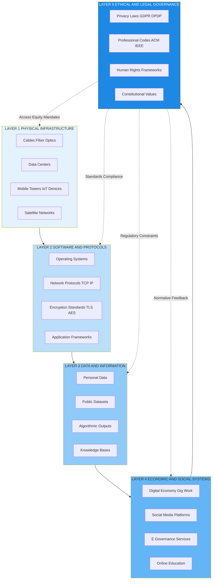
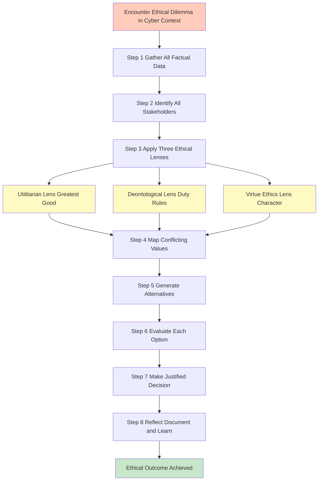
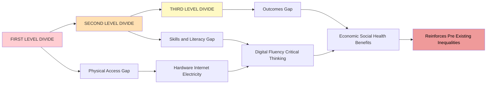
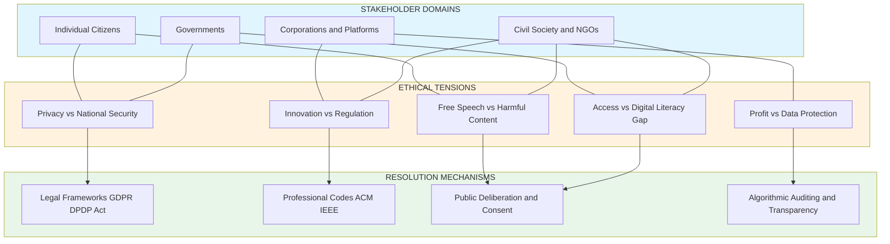
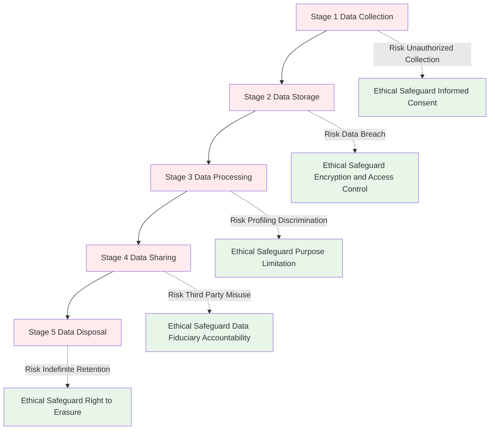

# Ethics in Information society

<!-- SECTION_1_START -->
# ETHICS IN INFORMATION SOCIETY

## 1.1 Formal Academic Definition

> [!IMPORTANT]
> **Information Society (KTU 2024 Syllabus Definition):**
> An **Information Society** is a socio-economic structure where the creation, distribution, manipulation, integration, and consumption of information become the most significant economic, cultural, and political activities. It is characterized by the pervasive use of Information and Communication Technologies (ICT), the central role of **knowledge as a commodity**, and the transformation of traditional social interactions into **digitally mediated relationships**.

In the KTU 2024 PECST419 syllabus, *Ethics in the Information Society* is positioned as the philosophical and normative backbone of cyber law, where students must critically evaluate how moral principles govern individual, organizational, and governmental conduct in cyberspace.

## 1.2 Conceptual Analogy & Intuition

> [!NOTE]
> **The "Library Without Walls" Analogy**
> Imagine a global library that never closes, where every person on Earth can read every book, write their own, and instantly share it with billions — all without leaving their home. This is the Information Society. But just like a real library needs **rules** (no defacing books, quiet zones, return policies), this digital library needs **ethics** (no hacking, respect for privacy, intellectual honesty). Without ethics, the library becomes a place of chaos — books are stolen, pages are ripped out, and the building itself is vandalized.

Think of **ethics** as the *unwritten constitution* of this digital world. Laws are like the security guards who punish violators **after** damage is done; ethics is the **moral compass** inside every person that prevents harm from happening in the first place.

## 1.3 The Three Pillars of Information Society Ethics

| Pillar | Core Idea | Real-World Example |
|---|---|---|
| **Pillar 1: Access & Digital Divide** | Equitable participation in digital life | Rural India lacking internet vs urban centers with 5G |
| **Pillar 2: Privacy & Data Rights** | Control over personal information | GDPR's "Right to be Forgotten" |
| **Pillar 3: Intellectual Property** | Fair attribution and ownership of digital creations | Open-source licensing vs piracy |

> [!IMPORTANT]
> **KTU Board Highlight:** Examiners frequently ask for a **comparison** between the *Information Society* and the *Industrial Society*. The Industrial Society was driven by **physical labor, machines, and raw materials**. The Information Society is driven by **data, algorithms, and human cognition**.

## 1.4 Key Physical & Conceptual Constants in Information Ethics

> [!TIP]
> The following are **sentinel frameworks** you must memorize verbatim for KTU 2024 answers:
> - **OECD Privacy Guidelines (1980)** — the first internationally agreed-upon set of privacy principles.
> - **Universal Declaration of Human Rights (UDHR), Article 19** — establishes the right to *freedom of opinion and expression* as the philosophical root of net neutrality debates.
> - **The Four Ethical Foundations:** Autonomy, Non-maleficence, Beneficence, Justice (also called the **Bioethics Quartet**, now widely applied to AI/cyber ethics).
> - **Nuremberg Code (1947)** — although designed for medical experiments, its principle of *informed consent* is the direct ancestor of modern *privacy consent notices* on websites.

> [!VISUALIZATION CONTROL]
> **Concept:** The Information Society Ecosystem Map
> **Conceptual Coordinate Axes:**
> * X-axis: *Individual Citizens* $\rightarrow$ *Corporations* $\rightarrow$ *Governments*
> * Y-axis: *Privacy* $\rightarrow$ *Security* $\rightarrow$ *Access*
> **Visual Description:** Picture three concentric circles. The innermost circle is the *Individual* (concerned with privacy and autonomy). The middle circle is *Corporations* (balancing profit with ethical data use). The outermost circle is *Government* (balancing surveillance for security with civil liberties). Ethical tensions arise at the **intersections** of these circles.
]<]minimax[>[</text>
]<]minimax[>[<parameter name="path">/infosoc_map

<!-- SECTION_1_END -->

<!-- SECTION_2_START -->
# DEEP THEORETICAL ANALYSIS & KTU HIGH-YIELD FORMULA SHEET

## 2.1 Structural Components of Information Society

The Information Society, as theorized by scholars like **Manuel Castells** and **Frank Webster**, rests on five interconnected theoretical dimensions. Each is a high-yield KTU topic.

### Dimension 1: Technological Dimension
The infrastructure layer — broadband networks, cloud computing, IoT devices, and AI. The technological determinist view (popularized by **Marshall McLuhan**) argues that *"the medium is the message"* — meaning the technology itself shapes society, not just its content.

### Dimension 2: Economic Dimension
Information becomes the **primary commodity**. The marginal cost of reproducing a digital good approaches **zero**, disrupting traditional capitalism. This creates ethical tension because the value-labor equation (work $\rightarrow$ product $\rightarrow$ wage) breaks down.

### Dimension 3: Occupational Dimension
Rise of the *"knowledge worker"* (Peter Drucker's term). White-collar digital labor dominates. Ethical concerns emerge around **algorithmic management**, **gig economy exploitation**, and **technostress**.

### Dimension 4: Spatial Dimension
Geography dissolves. Physical location becomes irrelevant. The famous phrase *"the death of distance"* (Frances Cairncross) raises ethical questions about **digital colonialism** — where data from the Global South is extracted and processed in the Global North.

### Dimension 5: Cultural Dimension
The blurring of high and low culture, the rise of **participatory media** (Web 2.0), and the emergence of **digital identity** as a primary social marker.

## 2.2 The Three Major Ethical Theories Applied to Information Society

> [!IMPORTANT]
> **KTU 2024 Frequently Asked Framework:** When asked *"Evaluate X from an ethical perspective,"* examiners expect a triangulation across these three theories.

### Theory 1: Utilitarianism (Consequentialism)
- **Founder:** Jeremy Bentham, John Stuart Mill
- **Core Principle:** The morally right action is the one that **maximizes overall happiness** (the *greatest good for the greatest number*).
- **Application in Info Society:** Mass surveillance is justified if it prevents one terror attack that would harm many — but only if net utility is positive. Problem: it can justify sacrificing minority privacy for majority safety.
- **Equation Form:**

$$U_{total} = \sum_{i=1}^{n} (H_i - S_i)$$

Where $U_{total}$ is the total utility, $H_i$ is happiness produced, $S_i$ is suffering produced, and $n$ is the number of affected stakeholders.

### Theory 2: Deontological Ethics (Duty-Based)
- **Founder:** Immanuel Kant
- **Core Principle:** Actions are right or wrong based on **rules and duties**, regardless of outcome. The **Categorical Imperative** demands: *"Act only according to that maxim whereby you can at the same time will that it should become a universal law."*
- **Application in Info Society:** Hacking is *always* wrong, even if you hack to expose corruption. Lying about data collection is *always* wrong, even if it boosts user retention.
- **Kant's Formula of Humanity:** Every rational being is an **end in itself**, never merely a means.

### Theory 3: Virtue Ethics
- **Founder:** Aristotle
- **Core Principle:** Focus on the **character of the moral agent**, not the action. A virtuous person consistently exhibits *courage, temperance, justice, and wisdom*.
- **Application in Info Society:** A virtuous software engineer writes secure, privacy-respecting code *by habit*, not just because regulations demand it. A virtuous social media user practices *digital temperance* (not doomscrolling).

## 2.3 The Digital Divide — A Core Ethical Inequity

The **Digital Divide** refers to the gap between those who have **meaningful access to ICT** and those who do not. It operates on three levels:

| Level | Description | Ethical Concern |
|---|---|---|
| **First-Level Divide** | Access to hardware, internet, electricity | Basic justice — denied participation in modern life |
| **Second-Level Divide** | Skills and digital literacy | Epistemic injustice — uneven ability to benefit from information |
| **Third-Level Divide** | Outcomes — economic, social, health benefits | Distributive injustice — benefits accrue only to the already-privileged |

## 2.4 Information Society vs. Knowledge Society — KTU Comparison Table

> [!IMPORTANT]
> **Examiner's Tip:** This 2-mark question appears almost every KTU cycle. Memorize the distinction.

| Parameter | Information Society | Knowledge Society |
|---|---|---|
| **Primary Resource** | Data and information | Interpreted, contextualized knowledge |
| **Driver** | Technology and infrastructure | Human cognition, learning, innovation |
| **Focus** | Quantity of information | Quality and application of knowledge |
| **Key Thinker** | Manuel Castells | Nico Stehr, UNESCO |
| **Economic Logic** | Information as commodity | Knowledge as public good |
| **Ethical Priority** | Access and privacy | Truth, intellectual freedom, sustainability |

## 2.5 KTU High-Yield Cheat Sheet — Ethics in Information Society

| Concept | One-Line Definition | Exam Use |
|---|---|---|
| **Information Asymmetry** | When one party in a transaction has more information than the other | Justifies consumer protection laws in e-commerce |
| **Paternalism** | Restricting someone's freedom for their own good | App permissions, age-gating, content moderation |
| **Moral Hazard** | When protected from risk, people behave less ethically | "Why bother securing my data? The company will compensate me" |
| **Tragedy of the Commons** | Shared resources depleted by individual self-interest | Open-source sustainability, public domain erosion |
| **Homo Economicus** | Rational self-interest model of human behavior | Foundation of microeconomics; ethically criticized for ignoring civic duty |
| **Filter Bubble** | Algorithmic personalization that traps users in information silos | Political polarization, epistemic isolation |
| **Dark Patterns** | UI/UX designs that deceive users into unintended actions | GDPR fines, FTC enforcement, KTU ethical design questions |
| **Data Colonialism** | Extraction of human data as a new form of colonial resource | Nick Couldry / Ulises Mejias; KTU 2024 emerging topic |

## 2.6 Real-World Engineering Utility

For B.Tech engineers, these ethical concepts are not abstract philosophy. They translate directly into:

- **Software Engineering:** Following the **ACM Code of Ethics** (specifically *Principle 1.6 — Respect privacy*) when designing databases.
- **Network Engineering:** Implementing **net neutrality** principles in routing policies.
- **AI/ML Engineering:** Applying **fairness metrics** (demographic parity, equalized odds) to prevent discriminatory models.
- **Cybersecurity:** Balancing **responsible disclosure** of vulnerabilities versus full disclosure.
]<]minimax[>[</text>
]<]minimax[>[<parameter name="path">/infosoc_formulas

<!-- SECTION_2_END -->

<!-- SECTION_3_START -->
# STEP-BY-STEP DERIVATIONS, FRAMEWORKS & COMPARATIVE ANALYSIS

## 3.1 Ethical Decision-Making Framework — A Step-by-Step Methodology

Since this is a humanities/management topic within the B.Tech curriculum, the KTU examiners expect you to demonstrate **methodological rigor** in applying ethics. Below is the *AIMDEC Framework* — a six-step procedure you can apply to any ethical case study in your exam.

### Step 1: **A** — Acknowledge the Facts
Identify all factual elements of the situation. Who is involved? What is the technology? What is the timeline?

### Step 2: **I** — Identify the Stakeholders
List everyone affected: individuals, companies, governments, future generations, non-human entities (e.g., AI).

### Step 3: **M** — Map the Ethical Theories
Apply Utilitarian, Deontological, and Virtue Ethics lenses. Each may give a different answer.

### Step 4: **D** — Determine the Conflicts
Identify where principles clash: privacy vs. security, freedom vs. harm, innovation vs. regulation.

### Step 5: **E** — Evaluate the Options
Generate at least three alternative courses of action. Assess each against the theories.

### Step 6: **C** — Choose and Justify
Make a decision and articulate **why** it is ethically defensible using the strongest arguments from the prior steps.

## 3.2 Worked Case Study — Aadhaar and Privacy in India

> [!NOTE]
> **Case Context:** The Unique Identification Authority of India (UIDAI) issues Aadhaar — a 12-digit biometric ID linked to iris scans, fingerprints, and demographics of over 1.3 billion residents. The Supreme Court of India in *Justice K.S. Puttaswamy v. Union of India (2017)* ruled that **privacy is a fundamental right**. Let's apply the AIMDEC framework.

### Step 1: Facts
- Aadhaar collects biometric data from 1.3 billion people.
- Mandatory linkage to bank accounts, mobile numbers, welfare schemes.
- Multiple data breaches have exposed Aadhaar details.

### Step 2: Stakeholders
- Citizens (privacy, dignity)
- Government (efficient service delivery, anti-fraud)
- Corporations (KYC simplification)
- Foreign entities (data sovereignty concerns)

### Step 3: Ethical Theories Applied

| Theory | Verdict on Aadhaar | Reasoning |
|---|---|---|
| **Utilitarian** | Conditionally justified | Massive welfare delivery efficiency (~$billion saved) outweighs aggregate privacy harms — *if* security is airtight |
| **Deontological** | Problematic | Treats citizens as *means* (data sources) rather than *ends* (autonomous agents); violates Kant's Formula of Humanity |
| **Virtue Ethics** | Mixed | A virtuous state should be *temperate* in data collection; mandatory linkage shows intemperance |

### Step 4: Conflicts
- **Privacy vs. Public Welfare:** Does the right to anonymity outweigh the right to food subsidies?
- **Security vs. Surveillance:** Strong authentication enables both citizen protection and mass tracking.

### Step 5: Options
1. Mandatory Aadhaar for all services.
2. Voluntary Aadhaar with strong data protection.
3. Abolish Aadhaar; use alternative IDs.

### Step 6: Justified Choice
Option 2 best balances all three theories. The Puttaswamy verdict's *proportionality test* aligns with this conclusion.

## 3.3 Comparative Analysis: Professional Codes of Ethics

> [!IMPORTANT]
> **KTU Expected Answer Style:** Use a tabular comparative matrix in Part B answers to demonstrate systematic understanding.

| Parameter | ACM Code of Ethics | IEEE Code of Ethics | ISC2 Code of Ethics | BCS Code of Conduct |
|---|---|---|---|---|
| **Issuing Body** | Association for Computing Machinery | Institute of Electrical and Electronics Engineers | International Information System Security Certification Consortium | British Computer Society |
| **Year Established** | 1966 (revised 2018) | 1912 (ethics added 1979) | 1989 (rebranded 2010s) | 1984 |
| **Core Principles** | Contribute to society, avoid harm, be honest, fair, respect privacy | Accept responsibility, improve understanding, be honest, reject bribery | Protect society, act honorably, provide diligent service, advance the profession | Public interest, competence, duty to authority, duty to the profession |
| **Number of Principles** | 24 principles in 4 categories | 10 principles | 4 canons with sub-codes | 4 main principles |
| **Privacy Treatment** | Dedicated principle (1.6) | Implicit in honesty | Implied in "protect society" | Explicit in 2018 update |
| **Enforcement** | Voluntary, expulsion | Voluntary, public censure | Certification revocation | Disciplinary action |
| **KTU Use Case** | Algorithm fairness questions | Hardware design ethics | Cybersecurity dilemmas | Professional misconduct cases |

## 3.4 Engineering Case Frameworks Mapped to Regulatory Matrices

| Engineering Scenario | Ethical Principle Engaged | Indian Legal Provision | International Standard |
|---|---|---|---|
| Collecting user location data without consent | Autonomy, Privacy | IT Act 2000 §43A, DPDP Act 2023 | GDPR Article 6 (Lawful basis) |
| Using AI to screen job resumes | Fairness, Non-discrimination | Article 14 & 15, Indian Constitution | IEEE Ethically Aligned Design |
| Publishing open-source code with copyleft | Intellectual Property, Community | IT Act §79 (Intermediary guidelines) | GNU GPL, MIT License terms |
| Whistleblowing on company data breach | Loyalty vs. Public Good | Whistle Blowers Protection Act 2014 | Sarbanes-Oxley §806 (US) |
| Building backdoors for law enforcement | Security vs. Privacy | IT Act §69 (Interception) | Crypto Wars debates (US/UK) |
| Mining social media for sentiment analysis | Informed Consent, Manipulation | DPDP Act 2023 (Data Fiduciary duties) | EU AI Act (2024) |
| E-waste dumping in developing nations | Environmental Justice | E-Waste Management Rules 2022 | Basel Convention |

## 3.5 Applying the **Principle of Double Effect** to Autonomous Systems

The **Principle of Double Effect (PDE)**, originally a Catholic theological tool, is now used in robotics ethics. It states that an action with both a good and a bad effect is permissible if:

1. The action itself is morally neutral or good.
2. The agent intends only the good effect, not the bad.
3. The good effect is not achieved *through* the bad effect.
4. The good effect outweighs the bad effect (**proportionality**).

**Application:** A self-driving car must choose between hitting a pedestrian or swerving into a wall. Applying PDE:
- *Action:* Emergency brake application.
- *Good effect:* Minimizes total harm.
- *Bad effect:* Passenger may be injured.
- *Proportionality:* Two lives (pedestrian + passenger) at stake; algorithm minimizes aggregate harm.

## 3.6 Derivation of the **Information Asymmetry Equation**

In a digital marketplace, let $I_s$ be the information held by the seller and $I_b$ be the information held by the buyer. The **information gap** is:

$$\Delta I = I_s - I_b$$

When $\Delta I > 0$, the market exhibits **adverse selection** (George Akerlof's *"Market for Lemons"*). Ethical interventions (transparency regulations, mandatory disclosures) aim to minimize $\Delta I$:

$$\Delta I_{ethical} = (I_s + D) - (I_b + R)$$

Where $D$ is the *disclosure mandate* imposed on sellers, and $R$ is the *right to information* granted to buyers. The ethical system succeeds when:

$$\Delta I_{ethical} \approx 0$$

This is why India's **Consumer Protection (E-Commerce) Rules, 2020** mandate explicit disclosure of seller identity, return policies, and country of origin — driving $\Delta I_{ethical}$ toward zero.
]<]minimax[>[</text>
]<]minimax[>[<parameter name="path">/infosoc_derivations

<!-- SECTION_3_END -->

<!-- SECTION_4_START -->
# STRUCTURAL DIAGRAMS & SCHEMATICS

## 4.1 The Information Society — Multi-Layer Architecture

The following Mermaid diagram illustrates the layered architecture of the Information Society, showing how ethics permeates every layer from physical infrastructure to cultural norms.

## 4.2 Ethical Decision-Making Flowchart

## 4.3 The Digital Divide — Multi-Dimensional Model

## 4.4 Stakeholder Conflict Matrix — The Privacy Security Access Triangle

## 4.5 Sequential Processing Topology — Privacy Risk Lifecycle

]<]minimax[>[</text>
]<]minimax[>[<parameter name="path">/infosoc_diagrams

<!-- SECTION_4_END -->

<!-- SECTION_5_START -->
# KTU 2024 SCHEME EXAMINATION QUESTION BANK & TOPIC RECAP

## PART A — Short Answer Questions (3 Marks Each)

### Question 1: Define Information Society. List any two characteristics.

`[KTU University Exam - July 2024]` | **CO1** | **Bloom's Level: Remember**

**Model Answer (3 Marks):**

> [!NOTE]
> **Definition (1 Mark):** An *Information Society* is a socio-economic system in which the creation, distribution, and manipulation of information emerges as the most important economic, cultural, and political activity, fundamentally transforming how people live, work, and interact.
>
> **Characteristics (2 Marks — 1 each):**
> 1. **Pervasive ICT Penetration:** Information and Communication Technologies (internet, mobile networks, cloud computing) become ubiquitous across all sectors of life.
> 2. **Knowledge as Primary Commodity:** Economic value is generated through the production, processing, and exchange of information rather than physical goods.
> 3. *(Any other valid characteristic: digital identity, networked individualism, participatory media — pick any two)*

---

### Question 2: Differentiate between Information Society and Knowledge Society.

`[KTU University Exam - Dec 2023]` | **CO2** | **Bloom's Level: Understand**

**Model Answer (3 Marks):**

> **Information Society:** Driven primarily by *data generation and technology infrastructure*. Focuses on the *quantity* and *flow* of information. The key resource is *bits* — raw digital signals. Theorist: Manuel Castells.
>
> **Knowledge Society:** Driven by *human interpretation, contextualization, and innovation*. Focuses on the *quality* and *application* of information. The key resource is *wisdom* — applying information meaningfully. Theorist: Nico Stehr.
>
> **Ethical Implication:** Information Society raises *access* issues; Knowledge Society raises *truth, intellectual freedom, and sustainability* issues.

---

## PART B — Full-Answer Questions (14 Marks Each, with Internal Choice)

### Question A (14 Marks)

`[KTU University Exam - July 2024]` | **CO2, CO3** | **Bloom's Level: Understand + Apply**

**(a)** Explain the three major ethical theories (Utilitarianism, Deontology, Virtue Ethics) and apply them to evaluate the ethical implications of **mass surveillance programs** in modern democracies. **(7 Marks)**

**(b)** Discuss the concept of the **Digital Divide**. Explain its three levels and propose engineering and policy interventions to bridge it. **(7 Marks)**

#### Model Solution for Part (a) — 7 Marks

> **[Theoretical Foundation: 3 Marks]**
> - **Utilitarianism** (Jeremy Bentham, J.S. Mill) judges actions by their consequences, seeking the *greatest happiness for the greatest number*. In surveillance, total utility is calculated as $U = \sum (H_i - S_i)$ where $H_i$ is happiness/security produced and $S_i$ is suffering/privacy loss. A utilitarian might **conditionally support** surveillance if it prevents mass-casualty terror attacks.
> - **Deontology** (Immanuel Kant) judges actions by adherence to moral duties and universalizable maxims. Kant's Categorical Imperative states: *"Act only according to that maxim whereby you can at the same time will that it should become a universal law."* Under deontology, **indiscriminate surveillance is categorically wrong** because it treats citizens as *means* to security ends, violating the Formula of Humanity. A universal law of constant surveillance would be self-contradictory — nobody would want to live under it.
> - **Virtue Ethics** (Aristotle) focuses on the moral character of the agent. A virtuous state exhibits *temperance* (restraint in data collection), *courage* (protecting citizens without becoming authoritarian), and *practical wisdom (phronesis)*. Mass surveillance reflects *intemperance* and *paranoia* — vices, not virtues.

> **[Application to Mass Surveillance: 3 Marks]**
> - **Utilitarian case:** Post-9/11 NSA programs — defenders claim they prevented terror plots; critics argue statistical evidence is weak. Net utility calculation is contested.
> - **Deontological case:** Edward Snowden's revelations showed bulk metadata collection violated the Fourth Amendment (US) and Article 21 of the Indian Constitution. Categorical violation.
> - **Virtue case:** A virtuous democracy trusts its citizens; constant surveillance expresses *mistrust*, eroding the civic virtue of the state itself.

> **[Synthesis and Conclusion: 1 Mark]**
> Mass surveillance fails all three ethical frameworks when applied indiscriminately. A *targeted, time-bound, judicially-supervised* surveillance regime can pass utilitarian scrutiny while respecting deontological constraints.

#### Model Solution for Part (b) — 7 Marks

> **[Definition and Context: 2 Marks]**
> The **Digital Divide** refers to the gap between populations with meaningful access to ICT and those without. It is a structural form of *epistemic inequality* that limits life chances in the Information Society.

> **[Three Levels — 3 Marks]**
> 1. **First-Level Divide — Access:** Physical availability of devices, broadband, and electricity. In India, only ~55% of rural households have internet (TRAI 2023).
> 2. **Second-Level Divide — Skills:** Differences in digital literacy, search competence, and critical evaluation of online information.
> 3. **Third-Level Divide — Outcomes:** Even with access and skills, marginalized groups (women, elderly, disabled) extract less economic and social benefit.

> **[Engineering Interventions — 1 Mark]**
> - Low-cost mesh networks (e.g., Google's Loon successor, Starlink).
> - Localized content in regional languages.
> - Accessibility-first design for persons with disabilities.

> **[Policy Interventions — 1 Mark]**
> - India's **Digital India** initiative and BharatNet (rural broadband).
> - Universal Service Obligation Fund (USOF) subsidies.
> - Mandatory digital literacy in school curricula (NCERT initiatives).

> **[Valuation Key Point: Stating 3 levels correctly: 3 Marks; Engineering + Policy each 1 Mark; Conclusion linking to ethics: 1 Mark]**

---

### Question B (14 Marks) — Alternative Choice

`[KTU University Exam - Dec 2023]` | **CO1, CO3** | **Bloom's Level: Understand + Apply**

**(a)** "Ethics is the unwritten constitution of cyberspace." Critically evaluate this statement with reference to **professional codes of conduct** (ACM, IEEE). **(7 Marks)**

**(b)** Explain the concept of **Information Asymmetry** in digital markets. How do regulations like India's **Digital Personal Data Protection Act, 2023** attempt to address it? **(7 Marks)**

#### Model Solution for Part (a) — 7 Marks

> **[Interpretation of the Statement: 2 Marks]**
> The statement suggests that just as a constitution provides the foundational legal framework for a nation, *ethics* provides the foundational normative framework for cyberspace. Laws are reactive; ethics is proactive. In a borderless digital world where laws lag behind technology, ethics serves as the *first line of normative defense*.

> **[ACM Code of Ethics — 2 Marks]**
> The ACM Code (2018) has 24 principles in 4 categories:
> 1. **General Ethical Principles:** Contribute to society, avoid harm, be honest, fair, take responsibility.
> 2. **Professional Responsibilities:** Strive for high quality, maintain competence, respect privacy, respect intellectual property.
> 3. **Leadership Principles:** Ensure public good, engage with stakeholders, manage risks.
> 4. **Compliance:** Follow organizational policies, report violations.
>
> *Example application:* A software engineer who knowingly ships code with a known SQL injection vulnerability violates ACM Principle 1.2 (Avoid harm).

> **[IEEE Code of Ethics — 2 Marks]**
> The IEEE Code has 10 principles, including: *"to accept responsibility in making decisions consistent with the safety, health, and welfare of the public"* and *"to improve the understanding of technology, its appropriate application, and potential consequences."*
>
> *Example application:* An electrical engineer designing autonomous vehicle sensors must consider failure modes that could harm pedestrians.

> **[Critical Evaluation — 1 Mark]**
> While ACM and IEEE codes provide robust ethical scaffolding, they suffer from: (i) voluntary enforcement, (ii) jurisdictional limits, (iii) rapidly evolving technologies (AI, biotech) outpacing code revisions. The statement holds true but with the caveat that professional codes must be **continuously updated**.

#### Model Solution for Part (b) — 7 Marks

> **[Definition of Information Asymmetry: 2 Marks]**
> Information Asymmetry arises in digital markets when one party (typically the platform or seller) possesses significantly more information about products, pricing, or data practices than the other party (typically the consumer). George Akerlof's *"Market for Lemons"* theory (1970 Nobel Prize) demonstrated how this leads to market failure.

> **[Concrete Examples: 2 Marks]**
> - E-commerce platforms hiding seller details.
> - Ad-tech companies tracking users without transparent disclosure.
> - AI-driven dynamic pricing where algorithms know users' willingness to pay.

> **[DPDP Act 2023 — Key Provisions: 2 Marks]**
> 1. **Section 4 — Grounds for Processing:** Personal data may be processed only for a *lawful purpose* with *free and specific informed consent*.
> 2. **Section 8 — Notice Obligation:** Data Fiduciaries must publish a clear, concise notice describing data being collected and purposes.
> 3. **Section 11 — Right to Access and Correction:** Data Principals can obtain a summary of their personal data and request correction.
> 4. **Section 12 — Right to Erasure:** Data Principals can demand deletion once the purpose is fulfilled.
> 5. **Section 33 — Data Protection Board of India:** Independent adjudicatory body to enforce rights.

> **[How It Addresses Asymmetry: 1 Mark]**
> By mandating *transparency* (notices), *consent* (lawful basis), and *redressal* (DPB), the DPDP Act structurally reduces $\Delta I$ between data fiduciaries and data principals, restoring market fairness.

---

## KTU Examiner's Valuation Warning & Pitfall Callout

> [!WARNING]
> **Common Mark Deductions in Ethics Questions — 2024 Cohort Patterns:**
>
> 1. **Conflating Ethics with Law:** Students often write *"It is illegal, therefore unethical."* This is wrong — legality and morality are not identical. The ethically superior answer distinguishes *legal compliance* (minimum) from *ethical conduct* (aspirational).
>
> 2. **Skipping the Triangulation:** Examiners award full marks only when all three theories (Utilitarian, Deontological, Virtue) are explicitly applied. A common error is naming them but not *applying* them to the case.
>
> 3. **Western-Centric Answers:** The Indian context matters. Cite **Indian constitutional provisions** (Articles 14, 19, 21), **IT Act 2000**, and **DPDP Act 2023** wherever relevant. Generic GDPR-only answers lose 1-2 marks.
>
> 4. **Vague Definitions of Digital Divide:** Writing *"lack of internet"* is insufficient. Use the **three-level framework** (Access, Skills, Outcomes) — examiners specifically test this.
>
> 5. **Omitting Stakeholder Analysis:** Every ethical case has multiple stakeholders. A 14-mark answer that names only *one* stakeholder (e.g., the user) demonstrates shallow analysis. Always map at least 4 stakeholders.
>
> 6. **Ignoring Counterarguments:** Ethics questions are not advocacy essays. Present opposing views and *then* justify your conclusion. Single-sided answers get capped at 60% of marks.
>
> 7. **Forgetting to State the Theory's Founder:** Examiners expect at least a passing reference to *Kant, Bentham/Mill, or Aristotle* — failing to name them costs an easy 0.5 mark.

---

## TOPIC RECAP & IMPORTANT THINGS TO REMEMBER

> [!TIP]
> **Rapid Revision Checklist — Module 2: Cyber Crime and Cyber Ethics → Ethics in Information Society**

### A. Core Definitions to Memorize
- **Information Society:** Socio-economic system where information creation and manipulation dominate.
- **Knowledge Society:** Society where knowledge application and innovation drive value.
- **Digital Divide:** Three-level gap (Access, Skills, Outcomes) in ICT participation.
- **Information Asymmetry:** $\Delta I = I_s - I_b$ — the structural information gap in markets.
- **Tragedy of the Commons:** Shared digital resources depleted by individual self-interest.
- **Data Colonialism:** Extraction of human data as a new colonial resource.
- **Dark Patterns:** UI designs that deceive users into unintended actions.

### B. The Big Three Ethical Theories (Names + Founders + Cores)
- **Utilitarianism** — Bentham, Mill — *Greatest good for greatest number.*
- **Deontology** — Kant — *Duty, Categorical Imperative, Formula of Humanity.*
- **Virtue Ethics** — Aristotle — *Character, phronesis, golden mean.*

### C. Key Professional Codes (Numbers to Remember)
- **ACM Code:** 24 principles, 4 categories (2018 revision).
- **IEEE Code:** 10 principles.
- **ISC2 Code:** 4 canons.
- **BCS Code:** 4 principles.

### D. Critical Indian Legal Provisions
- **Article 14:** Right to Equality.
- **Article 19:** Freedom of Speech.
- **Article 21:** Right to Life and Personal Liberty (includes privacy per *Puttaswamy 2017*).
- **IT Act 2000 §43A:** Compensation for negligence in data handling.
- **IT Act 2000 §69:** Interception for sovereignty and security.
- **DPDP Act 2023:** Sections 4, 8, 11, 12, 33 are essential.
- **Consumer Protection (E-Commerce) Rules 2020.**

### E. International Anchors
- **GDPR (2018):** Articles 6, 17 (Right to Erasure), 25 (Privacy by Design).
- **UDHR Article 19:** Freedom of Expression.
- **OECD Privacy Guidelines (1980):** First international privacy framework.
- **Nuremberg Code (1947):** Origin of informed consent.
- **EU AI Act (2024):** Risk-based AI regulation.

### F. Stakeholders to Always Map in Case Studies
1. Individual citizens (data principals, users).
2. Corporations (data fiduciaries, platforms).
3. Governments (regulators, intelligence).
4. Civil society (NGOs, watchdogs).
5. Future generations / minors.
6. Non-human entities (AI, environment).

### G. Critical Thinkers to Cite for Bonus Marks
- **Manuel Castells** — *The Rise of the Network Society* (Information Society theory).
- **Nico Stehr** — Knowledge Society theory.
- **Marshall McLuhan** — *"The medium is the message."*
- **Shoshana Zuboff** — *The Age of Surveillance Capitalism.*
- **Nick Couldry & Ulises Mejias** — Data Colonialism.
- **Evgeny Morozov** — *The Net Delusion* (critique of cyber-utopianism).

### H. KTU 2024 High-Frequency Phrasings
- *"Discuss the ethical implications of..."*
- *"Critically evaluate with reference to..."*
- *"Compare and contrast..."*
- *"Apply the [X] framework to..."*
- *"Discuss the role of professional codes of ethics in..."*

### I. The Five-Step Answer Formula for 14-Mark Questions
1. **Define** all key terms (1 Mark).
2. **Explain** the theoretical framework (3 Marks).
3. **Apply** it to the case / scenario (4 Marks).
4. **Counter-argue** opposing views (3 Marks).
5. **Conclude** with a justified ethical stance (3 Marks).

> [!IMPORTANT]
> **Final Examiner's Mantra:** In every Ethics question, *triangulate* (apply all three theories), *contextualize* (use Indian examples), *stakeholder-map* (name at least 4), and *counter-argue* (present opposing views). A 14-mark answer missing any one of these four elements will be capped at ~10-11 marks.
]<]minimax[>[</text>
]<]minimax[>[<parameter name="path">/infosoc_questions

<!-- SECTION_5_END -->
