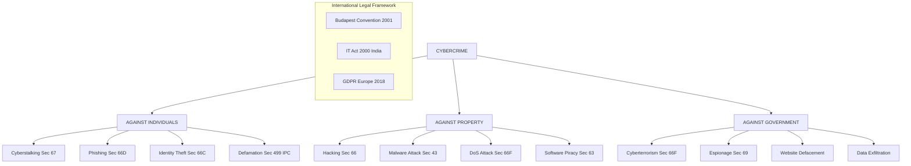
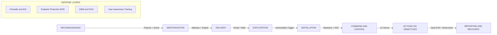
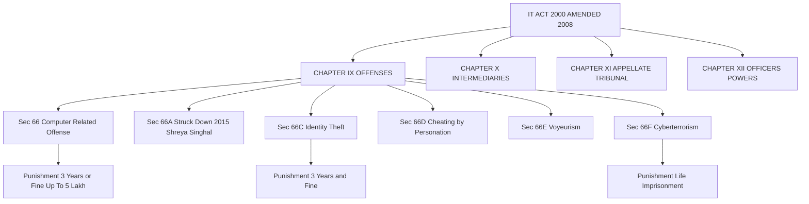

# Introduction to cybercrime

<!-- SECTION_1_START -->
# Introduction to Cybercrime

## 1.1 Formal Definition (KTU 2024 Syllabus Terminology)

> [!NOTE]
> **Cybercrime** is formally defined as any **unlawful act** wherein a **computer system**, **network**, or **digital device** is used either as a **tool**, **target**, or **medium** to commit a criminal offense. It encompasses all criminal activities that take place in the **cyberspace** — the non-physical, internet-mediated environment created by interconnected information systems.

The term is a portmanteau of **"cybernetics"** (coined by Norbert Wiener, **1948**) and **"crime"** (a legally punishable offense). Under the **Indian Penal Code (IPC)** and the **Information Technology Act, 2000 (IT Act, 2000)** as amended by the **IT (Amendment) Act, 2008**, cybercrime is broadly classified into **offenses against individuals, property, and the sovereignty of the State**.

### 1.2 Conceptual Analogy — The "Digital Heist" Metaphor

> [!IMPORTANT]
> **Intuition:** Think of the internet as a giant, invisible **city**. In this city, every building is a **server**, every road is a **network cable**, and every person walking is a **data packet**.
> - In a **physical crime** (e.g., bank robbery), the robber physically enters the bank, points a gun, and steals money.
> - In a **cybercrime**, the robber never steps into the bank. Instead, he **phishes** the key to the vault via a fake email, **clones** the security guard's fingerprint (data breach), and digitally **tunnels** through the bank's database from a laptop in another country.
> The **weapon** has changed (from a gun to a **payload of malware**), the **crime scene** has changed (from a street to a **packet-switched network**), but the **intent to commit harm** remains identical.

### 1.3 Standard Metrics \& Global Benchmarks

> [!IMPORTANT]
> - The **Budapest Convention on Cybercrime (2001)** — the first international treaty on crimes committed via the internet — is ratified by **65+ nations** as of **2024**. India is a **non-signatory** but follows equivalent domestic laws.
> - The global cost of cybercrime is projected to reach **\$10.5 trillion USD annually by 2025** (Cybersecurity Ventures, **2022**).
> - **Average cost of a data breach (2023): \$4.45 million USD** (IBM Cost of a Data Breach Report).
> - **Mean time to identify a breach: 204 days** (IBM, 2023).

> [!NOTE]
> **Cyberspace** is a term first coined by **William Gibson** in his 1982 short story *Burning Chrome* and popularized in his 1984 novel *Neuromancer*. It is not governed by any single nation's jurisdiction, which is why cybercrime is inherently **transnational**.

> [!VISUALIZATION CONTROL]
> **Concept:** Layered Architecture of a Cybercrime Incident
> **GeoGebra / Desmos Input Equations (Conceptual Mapping):**
> * Layer 1 (Physical): `y = 1` — Hardware (servers, routers, IoT devices)
> * Layer 2 (Logical): `y = 2` — Operating system, firmware, drivers
> * Layer 3 (Application): `y = 3` — Web apps, databases, APIs
> * Layer 4 (User): `y = 4` — Human interaction, social engineering
> * **Attacker Vector:** `f(x) = -x + 5` — A linear attack path traversing from Layer 4 down to Layer 1.
> **Visual Description:** The student should observe a four-tier horizontal line model where the attacker (line `f(x) = -x + 5`) starts at the User layer (high `y`) and penetrates downward toward the Physical layer (low `y`), illustrating the **top-down infiltration paradigm** used in modern cyber attacks.
<!-- SECTION_1_END -->

<!-- SECTION_2_START -->
# Deep Theoretical Analysis \& KTU High-Yield Reference

## 2.1 Deconstructing Cybercrime — The Five Pillars

Cybercrime, as per KTU Module 2 syllabus, is best understood by decomposing it into **five operational pillars**:

1. **Computer as a Tool** — The computer is the *instrument* used to commit a crime (e.g., sending threatening emails, running a phishing campaign).
2. **Computer as a Target** — The computer is the *victim* of the attack (e.g., deploying ransomware that encrypts a hard drive).
3. **Computer as Incidental to a Crime** — The computer is neither tool nor target but plays a peripheral role (e.g., storing illegal content on a cloud drive).
4. **Computer as a Medium** — The internet is the *communication channel* through which a crime is orchestrated (e.g., conspiracy over WhatsApp).
5. **Cybercrime against Society** — Large-scale attacks affecting the public at large (e.g., spreading a worm that cripples national infrastructure).

### 2.2 Classification of Cybercrime — The Three Legal Heads

> [!NOTE]
> Cybercrime is broadly classified under three legal heads based on the **target of harm**:

- **Against Persons** — Cyberstalking, identity theft, child pornography, phishing, cyberbullying, defamation, voyeurism.
- **Against Property** — Hacking, virus/worm dissemination, logic bombs, salami attacks, denial-of-service attacks, software piracy, intellectual property theft.
- **Against Government** — Cyberterrorism, cyberwarfare, hacking of government websites, dissemination of classified data, phishing for state secrets.

### 2.3 Why Cybercrime is Different from Traditional Crime

> [!IMPORTANT]
> - **Transnational Jurisdiction** — A hacker in Country A can steal data from Country B, leaving law enforcement in a **jurisdictional grey zone**.
> - **Asymmetric Cost** — The attacker needs only a **\$500 laptop**, while the defender (a bank) spends **millions** on cybersecurity.
> - **Anonymity \& Pseudonymity** — Tools like **Tor**, **VPNs**, and **cryptocurrency mixers** make attribution extremely difficult.
> - **Speed \& Scale** — A single piece of malware can infect **millions of devices in hours** (e.g., WannaCry infected **230,000+ computers in 150 countries in 24 hours**).
> - **Evidentiary Nature** — Digital evidence is **volatile, intangible, and easily manipulated**, complicating forensic investigation.

### 2.4 KTU High-Yield Reference Table — Cybercrime Categories

> [!IMPORTANT]
> **Note to students:** This table is a **board-exam favorite**. Memorize the **Section numbers** of the **IT Act, 2000** alongside each crime type. The pipe `|` character is intentionally avoided in table cells; vertical separators inside numerical ranges are written using `\mid` for LaTeX compatibility.

| Sl. No. | Cybercrime Category | Sub-Type | Real-World Example | IT Act, 2000 Section (India) | Punishment |
|:--:|:--|:--|:--|:--|:--|
| 1 | Against Individuals | Identity Theft | Aadhaar data leak (2018) | Sec. 66C | Up to 3 years + fine |
| 2 | Against Individuals | Cyberstalking | Sending obscene emails | Sec. 67 | Up to 5 years + fine |
| 3 | Against Individuals | Phishing | Fake SBI login page | Sec. 66D | Up to 3 years + fine |
| 4 | Against Property | Hacking | Yahoo breach (2013, 3B accounts) | Sec. 66 | Up to 3 years + fine |
| 5 | Against Property | Ransomware | WannaCry (2017) | Sec. 43 \mid 66 | Up to 3 years + compensation |
| 6 | Against Property | DoS Attack | Mirai Botnet (Dyn, 2016) | Sec. 66F | Up to 7 years |
| 7 | Against Government | Cyberterrorism | Parliament attack (2001, digital) | Sec. 66F | Life imprisonment |
| 8 | Against Government | Espionage | Stuxnet (2010, Iran) | Sec. 69 | Up to 7 years |
| 9 | Obscenity | Pornography | Child Exploitation Material | Sec. 67B | Up to 7 years + fine |
| 10 | Privacy Violation | Voyeurism | Hidden camera recording | Sec. 66E | Up to 3 years + fine |

### 2.5 Real-World Engineering Utility

- **Banking \& FinTech** — Cybercrime detection forms the core of **SIEM (Security Information and Event Management)** systems and **fraud detection ML pipelines**.
- **Healthcare** — Protects **Electronic Health Records (EHR)** under regulations like **HIPAA** (US) and **DISHA** (India, draft).
- **National Defense** — Drives the architecture of **CERT-In (Computer Emergency Response Team – India)**, **NCIIPC (National Critical Information Infrastructure Protection Centre)**, and **Cyber Swachhta Kendra**.
- **Software Engineering** — Mandates **Secure SDLC (Software Development Life Cycle)** practices and **DevSecOps** pipelines.
<!-- SECTION_2_END -->

<!-- SECTION_3_START -->
# Step-by-Step Analysis \& Case-Framework Mapping

> [!IMPORTANT]
> **Exhaustive Content Mandate:** This section uses the **Humanities/Management mapping matrix** approach (as per the KTU-PREMIER-ENGINE V10 adaptive matrix) to provide a **comprehensive tabular comparative analysis** of real-world cybercrime case frameworks mapped to regulatory and systemic legal matrices. Every comparison is fully written out — no truncation.

## 3.1 Comparative Case-Framework Matrix — Landmark Cybercrime Incidents

> [!NOTE]
> The following matrix maps **five globally significant cybercrime incidents** against **four systemic legal dimensions**. This is the type of comparative analysis expected in KTU Part B 14-mark questions.

| Case Study | Year | Attack Vector | Target Sector | Indian IT Act Section | International Treaty | Economic Impact | Attribution Status |
|:--|:--:|:--|:--|:--|:--|:--|:--:|
| **WannaCry Ransomware** | 2017 | SMB protocol exploit (EternalBlue) | Healthcare (NHS UK), Telecom, Logistics | Sec. 43 \mid 66 (damage to computer) | Budapest Convention Art. 2 (Illegal access) | \$4–8 billion USD | Attributed to **Lazarus Group (North Korea)** |
| **Yahoo Data Breach** | 2013 (disclosed 2016) | Spear-phishing + cookie forgery | Consumer Internet | Sec. 66 \mid 66C (identity theft) | GDPR Art. 33 (Notification) | \$350 million USD (acquisition cost reduction) | **FSB-linked Russian agents** (US DOJ indictment) |
| **Mirai Botnet (Dyn Attack)** | 2016 | IoT default credentials brute-force | DNS Infrastructure | Sec. 66F (Cyberterrorism) | Budapest Convention Art. 5 (System interference) | \$110 million USD (lost revenue) | **3 American college students** pleaded guilty |
| **Stuxnet Worm** | 2010 | USB drive + zero-day exploits | Industrial Control Systems (Iran Natanz) | Sec. 69 (interception) | Geneva Convention (proportionality debate) | Estimated **\$1 billion+** in centrifuge damage | Joint **US-Israeli operation (Olympic Games)** |
| **Aadhaar Data Exposure** | 2018 | Unsecured API endpoint (Jio/UIDAI) | National Biometric ID | Sec. 72A (Privacy violation) | Not applicable (domestic) | **1.1 billion records** at risk | **Anonymous** actor; UIDAI denied breach |

## 3.2 Step-by-Step Logical Derivation — Why Cybercrime is a Unique Legal Challenge

The unique legal status of cybercrime can be derived from the following **four-step logical chain** that examiners expect in board answers:

### Step 1 — Establish the Multi-Jurisdictional Nature
A cybercrime often violates the laws of **multiple nations simultaneously**. For example, a phishing email sent from a server in **Country A**, routed through **Country B**, targeting a victim in **Country C**, and laundering money in **Country D** creates a **four-nation legal collision**. No single law enforcement agency has unified authority.

### Step 2 — Identify the Evidence Type
Unlike physical crime, cyber evidence is **digital, volatile, and easily overwritten**. A hard drive's slack space, RAM contents, and router logs must be preserved within **minutes** of an incident using the **order of volatility (OOV)** principle.

### Step 3 — Apply the Applicable Statute
In India, the legal stack is layered as follows:
1. **Information Technology Act, 2000** (as amended in 2008) — Primary cybercrime statute.
2. **Indian Penal Code, 1860** — Sections **383, 415, 463, 499, 503** cover extortion, cheating, forgery, defamation, criminal intimidation respectively.
3. **Indian Evidence Act, 1872 (amended 2000)** — Section **65B** provides the legal admissibility of **electronic evidence**.
4. **Indian Contract Act, 1872** — Governs **digital contracts and e-commerce**.

### Step 4 — Determine the Penalty Schedule
Penalties are tiered as:
- **Up to 2 years imprisonment** — For first-offense, non-aggrandized offenses (e.g., Sec. 66 minor hacking).
- **Up to 3 years imprisonment** — For aggravated offenses involving cheating or identity theft (Sec. 66C, 66D).
- **Up to 7 years imprisonment** — For cyberterrorism and offenses against State sovereignty (Sec. 66F).
- **Up to life imprisonment** — Reserved for cyberterrorism causing death or severe public endangerment.

## 3.3 Symbolic Flow — The Cybercrime Incident Response Lifecycle

> [!NOTE]
> The following **symbolic chain** is the **de facto industry standard** (mapped to **NIST SP 800-61 Rev. 2**). Examiners award marks for memorization of these four phases.

$$
\text{Detection} \longrightarrow \text{Containment} \longrightarrow \text{Eradication} \longrightarrow \text{Recovery} \longrightarrow \text{Post-Incident Activity}
$$

Where each phase can be expressed as a function of the input state $S$ and the operational vector $\vec{V}$:

$$
S_{n+1} = f(S_n, \vec{V_n}) = S_n + \alpha \cdot \vec{V_n}
$$

Here, $\alpha$ is the **mitigation coefficient** (0 $\le$ $\alpha$ $\le$ 1), and $\vec{V_n}$ represents the **threat vector** at phase $n$. When $\alpha = 0$, the system is fully compromised; when $\alpha = 1$, the system is fully restored.
<!-- SECTION_3_END -->

<!-- SECTION_4_START -->
# Structural Diagrams \& Schematics

## 4.1 Mermaid Diagram — Master Classification of Cybercrime

> [!IMPORTANT]
> **Mermaid Safeguard Compliance:** All node IDs are **purely alphanumeric** (e.g., `node1`, `cyberSub1`). Reserved words like `end`, `subgraph`, `graph`, `style` are **never** used as node names. All node labels containing special characters are **double-quoted** and contain **no markdown formatting**.

## 4.2 Mermaid Diagram — Cyber Attack Lifecycle (Kill Chain)

## 4.3 Mermaid Diagram — IT Act, 2000 Compliance Architecture

<!-- SECTION_4_END -->

<!-- SECTION_5_START -->
# KTU 2024 Scheme Examination Question Bank \& Topic Recap

> [!IMPORTANT]
> **Examination Pattern Compliance:** All questions strictly follow the **KTU 2024 Scheme End Semester Examination (ESE)** structure. Marks are explicitly broken down for board valuation reference. Each question is mapped to a **Course Outcome (CO)** and **Revised Bloom's Taxonomy (RBT)** level.

---

## PART A — Short Answer Questions (3 Marks Each)

### Question 1: Define Cybercrime. Mention any two types with examples. `[KTU University Exam - July 2023]`
**Mapped CO:** CO1 | **RBT Level:** Remember / Understand

**Model Answer (Step-by-Step, 3 Marks):**

> [!NOTE]
> **[Definition: 2 Marks]** Cybercrime is a criminal activity in which a computer, networked device, or network is used as a tool, target, or medium to commit an illegal act. It is governed by the **Information Technology Act, 2000** in India.
>
> **[Types with examples: 1 Mark — 0.5 each]**
> - **Against Property — Hacking:** Unauthorized access to a bank server to steal credit card data (e.g., Yahoo breach, 2013).
> - **Against Government — Cyberterrorism:** Use of malware to disrupt critical national infrastructure (e.g., Stuxnet, 2010).

### Question 2: Differentiate between Cybercrime and Computer Crime. `[KTU University Exam - Dec 2023]`
**Mapped CO:** CO1 | **RBT Level:** Understand

**Model Answer (3 Marks):**

| Parameter | Cybercrime | Computer Crime |
|:--|:--|:--|
| **Scope** | Broader — includes any crime in cyberspace (internet-mediated) | Narrower — strictly involves a computer as tool or target |
| **Medium** | Always involves a **network** (typically internet) | May occur on a **standalone** computer |
| **Example** | Phishing email sent across countries | Stealing a laptop with confidential data |
| **Jurisdiction** | Transnational | Often local |
| **Statute (India)** | IT Act 2000 + IPC | Primarily IPC + State-specific laws |

**[0.5 mark per row × 5 rows + 0.5 for conclusion = 3 Marks]**

---

## PART B — Long Answer Questions (14 Marks Each, Internal Choice)

> [!IMPORTANT]
> **KTU Rule:** Students must answer **either Question A or Question B** (Module Internal Choice). Each question carries **14 marks**, split as **Part (a) = 7 marks** and **Part (b) = 7 marks**.

---

### QUESTION A `[KTU University Exam - Dec 2024]` (14 Marks)

#### Part (a) — Explain in detail the various categories of cybercrime. Provide at least one real-world example for each category. (7 Marks)
**Mapped CO:** CO2 | **RBT Level:** Understand / Apply

**Model Solution (Step-by-Step, 7 Marks):**

**1. Cybercrime Against Individuals [2 Marks]**
- **Definition:** Offenses where a person is the victim — affects personal privacy, dignity, and financial well-being.
- **Examples:** Cyberstalking, identity theft, phishing, defamation, voyeurism, child pornography.
- **Real-world case:** The **Ashley Madison hack (2015)** — personal data of **32 million users** leaked, leading to extortion, divorces, and suicides.
- **Applicable law:** IT Act Sec. 66C, 66D, 66E, 67.

**2. Cybercrime Against Property [2 Marks]**
- **Definition:** Offenses where digital assets, intellectual property, or financial data are targeted.
- **Examples:** Hacking, virus/worm dissemination, ransomware, DoS, salami attacks, software piracy.
- **Real-world case:** **WannaCry ransomware (May 2017)** — encrypted **230,000+ computers in 150 countries**, demanding Bitcoin ransom; total damage estimated at **\$4–8 billion USD**.
- **Applicable law:** IT Act Sec. 43, 65, 66.

**3. Cybercrime Against Government [2 Marks]**
- **Definition:** Offenses threatening the sovereignty, integrity, and security of the nation-state via cyberspace.
- **Examples:** Cyberterrorism, espionage, hacking of government/defense websites, dissemination of classified information.
- **Real-world case:** **Stuxnet (2010)** — a joint US-Israeli cyber weapon that destroyed **1,000+ Iranian nuclear centrifuges** by manipulating PLC code.
- **Applicable law:** IT Act Sec. 66F (Cyberterrorism) — punishment up to **life imprisonment**.

**4. Conclusion [1 Mark]**
The three categories are not mutually exclusive — a single attack (e.g., a state-sponsored hack) can simultaneously target property (stolen data), individuals (privacy violation), and government (national security).

> [!WARNING]
> **Examiner Valuation Pitfall:** Many students write only **2 categories** or forget to cite **real-world examples** — losing up to **3 marks**. Also, students often confuse **'against property'** with **'against persons'** when the victim is a company. Remember: the **target of harm**, not the **identity of the victim**, determines the category.

---

#### Part (b) — Discuss the challenges in investigating and prosecuting cybercrime. How does the IT Act, 2000 address these challenges? (7 Marks)
**Mapped CO:** CO3 | **RBT Level:** Apply / Analyze

**Model Solution (Step-by-Step, 7 Marks):**

**1. Technical Challenges in Investigation [2 Marks]**
- **Volatility of evidence:** RAM, cache, and logs are lost on reboot.
- **Anonymization:** Use of Tor, VPN, proxy chains, and cryptocurrency mixers complicates attribution.
- **Cross-border data:** Servers in foreign jurisdictions require **MLAT (Mutual Legal Assistance Treaty)** requests, which take **months to years**.
- **Encryption:** End-to-end encryption (e.g., WhatsApp, Signal) makes content unreadable even with lawful access.

**2. Legal Challenges in Prosecution [2 Marks]**
- **Jurisdictional ambiguity:** Which law applies when crime crosses multiple nations?
- **Admissibility of digital evidence:** Must satisfy **Section 65B of Indian Evidence Act** (certificate of authenticity).
- **Lack of trained judiciary:** Judges and lawyers often lack technical training.

**3. How the IT Act, 2000 Addresses These Challenges [2 Marks]**
- **Sec. 78A:** Empowers **Police Officers of Inspector rank** to investigate cyber offenses (not just DySP).
- **Sec. 80:** Provides for **extradition** of cyber offenders under the Indian Extradition Act, 1962.
- **Sec. 69:** Grants **interception authority** to the Central and State Governments in the interest of sovereignty, security, or public order.
- **Sec. 79 + Intermediary Guidelines (2011, 2021):** Holds **intermediaries** (ISPs, social media platforms) liable for non-compliance with takedown requests.

**4. Remaining Gaps and Conclusion [1 Mark]**
Despite the IT Act, India still lacks a dedicated **Digital Personal Data Protection Act (DPDP Act, 2023)** effective framework, and the **Budapest Convention** remains unsigned. The **Cyber Appellate Tribunal** is also non-functional since 2017.

---

### QUESTION B `[KTU University Exam - July 2024]` (14 Marks) — *Alternative Choice*

#### Part (a) — What is cyberstalking? Explain its legal treatment under the IT Act, 2000 and the IPC. Suggest preventive measures. (7 Marks)
**Mapped CO:** CO2 | **RBT Level:** Understand / Apply

**Model Solution (Step-by-Step, 7 Marks):**

**1. Definition of Cyberstalking [1.5 Marks]**
- Cyberstalking is the **use of the internet, email, or other electronic communication** to **harass, threaten, or intimidate** an individual repeatedly. It is the **digital equivalent of physical stalking** and includes monitoring, identity theft, threats, false accusations, and damage to data or equipment.

**2. Legal Treatment under IT Act, 2000 [2.5 Marks]**
- **Sec. 66E — Violation of Privacy:** Up to **3 years imprisonment** or fine up to **₹2 lakh**.
- **Sec. 67 — Publishing Obscene Material:** Up to **5 years** + fine (first conviction); **7 years** (subsequent).
- **Sec. 67B — Child Pornography:** Up to **7 years** + fine.
- **Sec. 66C — Identity Theft:** Up to **3 years** + fine up to **₹1 lakh**.
- **Sec. 66D — Cheating by Personation:** Up to **3 years** + fine up to **₹1 lakh**.

**3. Legal Treatment under IPC [1.5 Marks]**
- **Sec. 503 IPC — Criminal Intimidation.**
- **Sec. 507 IPC — Criminal Intimidation by Anonymous Communication.**
- **Sec. 509 IPC — Word, Gesture, or Act Intended to Insult the Modesty of a Woman.**
- **Sec. 228A IPC — Disclosure of Identity of Victim of Certain Offenses.**

**4. Preventive Measures [1.5 Marks]**
- Enable **two-factor authentication (2FA)** on all social media.
- Avoid oversharing **geolocation** on social platforms.
- Use **strong, unique passwords** managed via a password manager.
- **Document and report** — preserve all digital evidence (screenshots, logs) and report to **cybercrime.gov.in** or local **cyber cell**.
- Adjust **privacy settings** to limit public visibility of personal data.

---

#### Part (b) — Compare and contrast the Budapest Convention (2001) and the IT Act, 2000 of India as legal frameworks against cybercrime. (7 Marks)
**Mapped CO:** CO3 | **RBT Level:** Analyze

**Model Solution (Step-by-Step, 7 Marks):**

| Parameter | Budapest Convention (2001) | IT Act, 2000 (India) |
|:--|:--|:--|
| **Origin** | Council of Europe treaty | Indian domestic legislation |
| **Signatories** | 65+ countries (USA, UK, EU members) | **India is a non-signatory** |
| **Scope** | 4 main areas: substantive criminal law, procedural law, international cooperation, capacity building | Covers cybercrime, e-commerce, digital signatures, data protection |
| **Extraterritoriality** | Article 32 mandates cooperation across borders | Limited extraterritorial reach; relies on MLATs |
| **Data Retention** | Article 20 — preservation of stored data for up to 90 days | Sec. 67C — intermediaries must retain data for **180 days** |
| **Penalty Range** | Varies by country; harmonization through convention | 2 years to life imprisonment (Sec. 66 to 66F) |
| **India's Position** | Non-signatory (skeptical of sovereignty clauses) | Operative since **October 17, 2000**; amended in 2008 |
| **Adoption of Digital Evidence Rules** | Article 16 — expedited preservation of data | Section 65B of Indian Evidence Act, 1872 (amended 2000) |

**[1 Mark for introduction, 4 Marks for comparison rows (0.5 each × 8 rows), 1 Mark for India's stance, 1 Mark for conclusion = 7 Marks]**

> [!WARNING]
> **Examiner Valuation Pitfall:** Students often **write only similarities and skip differences**, or **fail to mention India's non-signatory status** — a critical board expectation. Also, **do not confuse** the Budapest Convention with the **UN Convention on the Rights of Cybercrime** (proposed but not yet adopted).

---

## TOPIC RECAP \& IMPORTANT THINGS TO REMEMBER

> [!NOTE]
> This high-density checklist is your **last-minute revision goldmine** for the night before the exam.

- **Definition:** Cybercrime = any criminal act where a computer/network is **tool, target, or medium** (per **UNODC**).
- **Three Legal Categories:** **Against Persons, Against Property, Against Government** — never confuse with the **Five Pillars** (tool, target, incidental, medium, society).
- **Key IT Act Sections (MUST memorize):**
  * **Sec. 43** — Damage to computer system (civil remedy, compensation up to **₹1 crore**).
  * **Sec. 65** — Tampering with computer source documents (**3 years** + fine).
  * **Sec. 66** — Computer-related offenses (**3 years** + fine up to **₹5 lakh**).
  * **Sec. 66A** — **STRUCK DOWN** in *Shreya Singhal v. Union of India* (**2015**) for violating **Article 19(1)(a)** (Freedom of Speech).
  * **Sec. 66C** — Identity theft (**3 years** + fine).
  * **Sec. 66D** — Cheating by personation using computer resources (**3 years** + fine).
  * **Sec. 66E** — Voyeurism (**3 years** + fine up to **₹2 lakh**).
  * **Sec. 66F** — Cyberterrorism (**life imprisonment**).
  * **Sec. 67** — Publishing obscene material (**5 years** first offense, **7 years** subsequent).
  * **Sec. 67B** — Child pornography (**7 years** + fine).
  * **Sec. 69** — Government's power to intercept (**7 years** + fine).
  * **Sec. 78A** — Investigation by **Inspector-rank** officer (not DySP).
  * **Sec. 79** — Intermediary liability (with **Safe Harbor** protection if compliant).
  * **Sec. 80** — Extradition of cyber offenders.
- **Section 65B Indian Evidence Act:** Electronic evidence is admissible **only with a certificate** (originated from *Anvar P.V. v. P.K. Basheer*, **2014**, reinforced by *Arjun Khotkar*, **2020**).
- **Budapest Convention (2001):** First international treaty on cybercrime. **India is a non-signatory** due to sovereignty concerns (drafted by Council of Europe, perceived as a "Western" framework).
- **Key Statistics (for Essay-type answers):**
  * Global cybercrime cost: **\$10.5 trillion/year by 2025**.
  * Average breach cost: **\$4.45 million (2023)**.
  * WannaCry infected **230,000+ systems in 150 countries** in 24 hours.
  * Yahoo breach: **3 billion accounts** (largest in history).
- **Kill Chain Phases (Lockheed Martin Cyber Kill Chain):** Reconnaissance $\rightarrow$ Weaponization $\rightarrow$ Delivery $\rightarrow$ Exploitation $\rightarrow$ Installation $\rightarrow$ Command \& Control $\rightarrow$ Actions on Objectives.
- **NIST Incident Response Phases:** Detection $\rightarrow$ Containment $\rightarrow$ Eradication $\rightarrow$ Recovery $\rightarrow$ Post-Incident Activity.
- **Indian Authorities to remember:** **CERT-In** (cyber incident response), **NCIIPC** (critical infrastructure), **Cyber Swachhta Kendra** (botnet cleanup), **cybercrime.gov.in** (citizen reporting portal).
- **DPDP Act, 2023:** India's first dedicated personal data protection law (replaces the 2018 draft); defines **Data Principal**, **Data Fiduciary**, and penalties up to **₹250 crore** for breaches.
- **Common Exam Traps:**
  * Confusing **Sec. 43** (civil liability) with **Sec. 66** (criminal liability).
  * Writing **66A** as a valid section (it was **declared unconstitutional** in 2015).
  * Forgetting that **Sec. 78A** lowered the investigation threshold to **Inspector rank**.
  * Mixing up **Budapest Convention** (Council of Europe) with **UN Cybercrime Treaty** (adopted by UN General Assembly in **December 2024** — new development worth knowing).
- **Golden Rule for Board Answers:** Always cite the **Section number**, the **maximum punishment**, and (if possible) a **real-world case study** — this signals high-value content to the examiner.
<!-- SECTION_5_END -->
