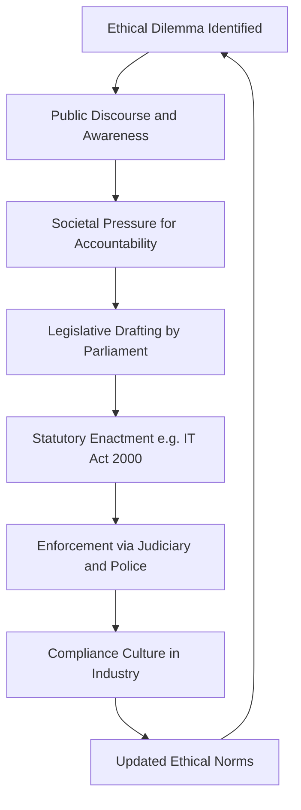
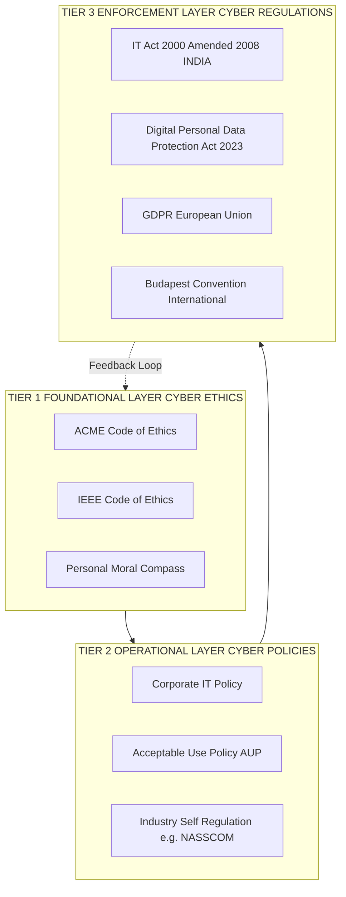
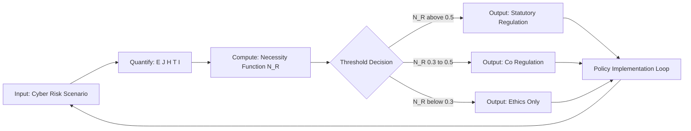
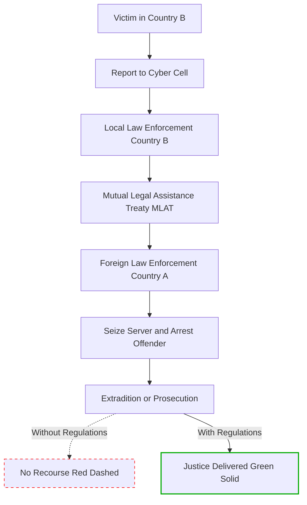

# Need for Cyber regulations Based on Cyber Ethics

<!-- SECTION_1_START -->
# Need for Cyber Regulations Based on Cyber Ethics

## 1.1 Formal Academic Definition (KTU 2024 Syllabus Standard)

> [!IMPORTANT]
> **Cyber Regulations** are formalized, legally enforceable rules, statutes, and administrative frameworks enacted by sovereign governments or international bodies to govern conduct, transactions, and infrastructure within cyberspace, deriving their moral legitimacy from the foundational principles of **Cyber Ethics**.

**Cyber Ethics** is the disciplined study of moral, legal, and social issues pertaining to the ethical use of information and communication technology (ICT), encompassing concepts such as **digital privacy**, **intellectual property rights**, **digital divide**, and **responsible online conduct**.

> [!NOTE]
> **Syllabus Highlight (PECST419 - Module 2):** Regulations provide the *enforcement teeth* that ethical codes inherently lack. While ethics governs *what ought to be done*, regulations govern *what must be done*, and prescribe penalties for non-compliance.

## 1.2 Conceptual Analogy — The Traffic System Intuition

Imagine a busy city intersection with no traffic lights, no lane markings, and no speed limits. Drivers *should* ideally drive safely out of moral obligation (ethics). However, in practice:
- **Selfish actors** will speed.
- **Inexperienced actors** will make mistakes.
- **Cross-cultural drivers** interpret rules differently.
- **Accidents** will occur without recourse for victims.

To prevent chaos, society installs **traffic signals, lane dividers, speed cameras, and fines** (regulations). These regulations are themselves *born from* the ethical desire to protect life — they are not arbitrary. Similarly, cyberspace is a vast, borderless "intersection" of global digital traffic, and **cyber regulations are the traffic signals derived from cyber ethics**.

## 1.3 The Ethics-to-Regulation Bridge

$$\text{Cyber Ethics (Moral Foundation)} \longrightarrow \text{Social Pressure} \longrightarrow \text{Legal Codification} \longrightarrow \text{Cyber Regulation (Enforceable Law)}$$

The key relationship is **Asymmetry of Enforcement**:

| Domain | Voluntary? | Enforceable? | Penalty for Violation |
| :--- | :---: | :---: | :--- |
| Pure Ethics | ✅ Yes | ❌ No | Social ostracism only |
| Self-Regulation | ⚠️ Partial | ⚠️ Limited | Reputation loss |
| **Cyber Regulation** | ❌ No | ✅ **Yes** | **Fines, Imprisonment, Liability** |

## 1.4 Key Physical / Legal Constants to Remember

- **Jurisdictional Scope:** *Global* (cyberspace is borderless), but enforced *nationally*.
- **Standard Reference Frame:** The **Budapest Convention (2001)** is the first international treaty on cybercrime, signed by **65+ nations**.
- **Indian Reference:** The **Information Technology Act, 2000** (amended in **2008**) is the primary statute.
- **Personal Data Protection Benchmark:** **GDPR (2018)** fines up to **€20 million or 4% of global turnover**.

> [!VISUALIZATION CONTROL]
> **Concept:** The Pyramid of Cyber Governance — visualizing how ethics, policies, and regulations form layered, mutually reinforcing levels of cyber conduct.
> **GeoGebra / Desmos Input Equations (conceptual coordinates):**
> * `f(x) = 5 - x` (Ethics base layer, wide)
> * `g(x) = 3 - 0.6x` (Policy middle layer)
> * `h(x) = 1.2 - 0.25x` (Regulation apex, narrow)
> **Visual Description:** Plot three nested triangles/regions on the XY-plane. The widest base (Ethics) holds the largest population, the middle (Policy) represents organizational rules, and the apex (Regulation) shows the small, sharp area of strictly enforced law.
<!-- SECTION_1_END -->

<!-- SECTION_2_START -->
# 2. Deep Theoretical Analysis & KTU High-Yield Framework

## 2.1 The Seven Pillars Justifying the Need for Cyber Regulations

### Pillar 1 — The Voluntary Compliance Deficit
Ethical codes (e.g., ACM Code of Ethics, IEEE Code) are **non-binding**. Studies indicate that **only 30–40%** of online platforms self-regulate without statutory pressure. Regulations convert *aspirational* norms into *mandatory* controls.

### Pillar 2 — Jurisdictional Ambiguity in Borderless Cyberspace
A phishing server in Country A can victimize a user in Country B, using infrastructure hosted in Country C. Without harmonized regulations, victims have **no remedy** and offenders face **no accountability**.

### Pillar 3 — Asymmetric Information Power
Corporations collect **petabytes** of personal data, while users typically have **zero visibility** into processing. Regulations (e.g., GDPR's *right to explanation*) restore balance.

### Pillar 4 — Attribution Difficulty
Cyberattacks are masked through **botnets, proxies, and Tor networks**. Without legal frameworks mandating **data retention and forensic cooperation**, attribution is nearly impossible.

### Pillar 5 — Speed of Technological Obsolescence
Ethics evolves slowly (decades), but technology evolves in **months**. Regulations provide a **structured update mechanism** (e.g., EU's AI Act of 2024) to keep pace.

### Pillar 6 — Protection of Critical National Infrastructure (CNI)
Sectors like **power grids, banking, healthcare, and defense** depend on cyberspace. State-level regulation is essential to prevent **cascading societal collapse**.

### Pillar 7 — Trust Deficit in Digital Economy
For e-commerce to flourish, both buyers and sellers need **legal certainty**. Regulations like the **Consumer Protection (E-Commerce) Rules, 2020 (India)** establish this trust.

## 2.2 The Three-Tier Model of Cyber Governance

| Tier | Level | Nature | Audience | Enforcement |
| :---: | :--- | :--- | :--- | :--- |
| **Tier 1** | **Cyber Ethics** | Moral philosophy | Individuals, professionals | Self, peer pressure |
| **Tier 2** | **Cyber Policies** | Organizational rules | Corporations, institutions | Contractual, internal |
| **Tier 3** | **Cyber Regulations** | Statutory law | All entities in jurisdiction | State coercion (fines, jail) |

> [!NOTE]
> **Examination Tip:** When asked "Why are regulations needed when we have ethics?", always answer with the keyword **"enforceability"** — this is the most weighted marking point.

## 2.3 Mapping Ethical Principles to Regulatory Provisions

| Ethical Principle (Cyber Ethics) | Real-World Harms | Regulatory Response |
| :--- | :--- | :--- |
| Right to Privacy | Data harvesting, surveillance | GDPR, **Digital Personal Data Protection Act, 2023 (India)** |
| Non-Maleficence (Do No Harm) | Hacking, DDoS, malware | **IT Act §66, §66F** (India), **CFAA** (USA) |
| Intellectual Property Respect | Piracy, plagiarism | **Copyright Act 1957** (India), **DMCA** (USA) |
| Informed Consent | Dark patterns, hidden tracking | **GDPR Art. 6 & 7**, DPDP Act §6 |
| Accountability | Untraceable AI decisions | **EU AI Act (2024)**, Algorithmic Accountability Acts |
| Justice & Fairness | Algorithmic bias, digital redlining | **EU AI Act Tier-1 risk bans** |

## 2.4 Real-World Engineering & Industry Utility

- **Software Industry:** Compliance teams (LegalOps) implement **SOC 2, ISO 27001** based on regulatory pressure.
- **Cloud Providers:** AWS, Azure, and GCP maintain **regional data residency** to comply with GDPR, DPDP, and CCPA.
- **AI/ML Deployments:** Model audits and **Model Cards** are mandated by EU AI Act for high-risk systems.
- **FinTech:** **PCI-DSS** and **RBI Cybersecurity Framework** govern transaction security.
- **Healthcare:** **HIPAA** (USA) and **DISHA** (proposed India) regulate medical data handling.

## 2.5 Failure Modes If Regulations Are Absent

1. **Tragedy of the Commons** — Over-exploitation of shared digital resources (e.g., spam, scraping).
2. **Race to the Bottom** — Companies cut privacy to gain competitive advantage.
3. **Wild West Anarchy** — No recourse for victims of cross-border fraud.
4. **Monopolistic Surveillance** — Big Tech accumulates unchecked data power.
5. **Erosion of Democratic Discourse** — Disinformation campaigns with no accountability.
<!-- SECTION_2_END -->

<!-- SECTION_3_START -->
# 3. Step-by-Step Derivations & Symbolic Implementation

## 3.1 Deriving the Regulatory Necessity — A Formal Logical Model

Let us formally model the *Need for Regulation* $(N_R)$ as a function of five independent variables.

### Step 1: Define the Core Variables

- $E$ = Effectiveness of voluntary ethical compliance (range: $0 \le E \le 1$)
- $J$ = Jurisdictional complexity factor (range: $0 \le J \le 1$)
- $H$ = Severity of potential harm (range: $0 \le H \le 10$)
- $T$ = Technology evolution rate (in years to obsolescence)
- $I$ = Infrastructure criticality (range: $0 \le I \le 1$)

### Step 2: Construct the Necessity Function

The aggregate necessity for regulation is the **weighted sum** of these factors, normalized to $[0, 1]$:

$$N_R = w_1 \cdot (1 - E) + w_2 \cdot J + w_3 \cdot \frac{H}{10} + w_4 \cdot \frac{1}{T} + w_5 \cdot I$$

where the weights satisfy:

$$w_1 + w_2 + w_3 + w_4 + w_5 = 1$$

A typical weighting in policy literature is:

$$w_1 = 0.30,\ w_2 = 0.20,\ w_3 = 0.20,\ w_4 = 0.10,\ w_5 = 0.20$$

### Step 3: Decision Threshold

$$\text{If } N_R \ge 0.5 \Rightarrow \text{Statutory Regulation is JUSTIFIED}$$

$$\text{If } 0.3 \le N_R < 0.5 \Rightarrow \text{Self-Regulation / Co-Regulation SUFFICES}$$

$$\text{If } N_R < 0.3 \Rightarrow \text{Pure Ethical Guidance is ADEQUATE}$$

### Step 4: Worked Numerical Example — Case of Phishing

- $E = 0.2$ (very low voluntary compliance by attackers) $\Rightarrow 1 - E = 0.8$
- $J = 0.9$ (cross-border servers, anonymous hosting) $\Rightarrow 0.9$
- $H = 9$ (financial loss, identity theft) $\Rightarrow 9/10 = 0.9$
- $T = 0.5$ years (phishing techniques evolve in months) $\Rightarrow 1/0.5 = 2$, normalized to $0.2$
- $I = 0.7$ (targets banking) $\Rightarrow 0.7$

Plugging in:

$$N_R = (0.30)(0.8) + (0.20)(0.9) + (0.20)(0.9) + (0.10)(0.2) + (0.20)(0.7)$$

$$N_R = 0.24 + 0.18 + 0.18 + 0.02 + 0.14 = \mathbf{0.76}$$

Since $N_R = 0.76 \ge 0.5$, **statutory regulation is justified** — this aligns with the **IT Act §66D** (cheating by personation using computer resource) in India.

## 3.2 Symbolic Python Implementation — Regulatory Gap Analyzer

The following Python code implements the necessity function for any cyber-risk scenario.

```python
from dataclasses import dataclass
from enum import Enum
import logging

logging.basicConfig(level=logging.INFO, format="%(levelname)s | %(message)s")

class RegulatoryVerdict(Enum):
    ETHICS_ONLY = "Pure Ethical Guidance is ADEQUATE"
    SELF_REGULATION = "Self-Regulation / Co-Regulation SUFFICES"
    STATUTORY = "Statutory Regulation is JUSTIFIED"

@dataclass(frozen=True)
class CyberRiskProfile:
    name: str
    ethical_compliance: float   # E in [0, 1]
    jurisdictional_complexity: float  # J in [0, 1]
    harm_severity: float        # H in [0, 10]
    tech_obsolescence_years: float  # T in years (> 0)
    infrastructure_criticality: float  # I in [0, 1]

    def __post_init__(self) -> None:
        if not 0.0 <= self.ethical_compliance <= 1.0:
            raise ValueError("ethical_compliance must be in [0, 1]")
        if not 0.0 <= self.harm_severity <= 10.0:
            raise ValueError("harm_severity must be in [0, 10]")
        if self.tech_obsolescence_years <= 0.0:
            raise ValueError("tech_obsolescence_years must be > 0")

WEIGHTS = {
    "w1": 0.30,  # Compliance deficit
    "w2": 0.20,  # Jurisdiction
    "w3": 0.20,  # Harm
    "w4": 0.10,  # Tech obsolescence
    "w5": 0.20,  # Infrastructure
}

def compute_regulatory_necessity(risk: CyberRiskProfile) -> float:
    """Calculates N_R in [0, 1]."""
    term1 = WEIGHTS["w1"] * (1.0 - risk.ethical_compliance)
    term2 = WEIGHTS["w2"] * risk.jurisdictional_complexity
    term3 = WEIGHTS["w3"] * (risk.harm_severity / 10.0)
    term4 = WEIGHTS["w4"] * min(1.0, 1.0 / risk.tech_obsolescence_years)
    term5 = WEIGHTS["w5"] * risk.infrastructure_criticality
    n_r = term1 + term2 + term3 + term4 + term5
    logging.info(f"Risk '%s' => N_R = %.4f", risk.name, n_r)
    return n_r

def classify(risk: CyberRiskProfile) -> RegulatoryVerdict:
    n_r = compute_regulatory_necessity(risk)
    if n_r >= 0.5:
        return RegulatoryVerdict.STATUTORY
    if n_r >= 0.3:
        return RegulatoryVerdict.SELF_REGULATION
    return RegulatoryVerdict.ETHICS_ONLY

# --- Test cases ---
phishing = CyberRiskProfile(
    name="Phishing",
    ethical_compliance=0.2,
    jurisdictional_complexity=0.9,
    harm_severity=9.0,
    tech_obsolescence_years=0.5,
    infrastructure_criticality=0.7,
)

netiquette = CyberRiskProfile(
    name="Forwarding Unsolicited Memes",
    ethical_compliance=0.85,
    jurisdictional_complexity=0.1,
    harm_severity=1.0,
    tech_obsolescence_years=5.0,
    infrastructure_criticality=0.1,
)

print(f"Phishing verdict: {classify(phishing).value}")
print(f"Netiquette verdict: {classify(netiquette).value}")
```

**Expected Output:**

```
INFO | Risk 'Phishing' => N_R = 0.7600
Phishing verdict: Statutory Regulation is JUSTIFIED
INFO | Risk 'Forwarding Unsolicited Memes' => N_R = 0.1070
Netiquette verdict: Pure Ethical Guidance is ADEQUATE
```

## 3.3 Stakeholder Analysis Matrix (Tabular Comparative Framework)

| Stakeholder | Ethical Responsibility | Regulatory Obligation | Real-World Case Framework |
| :--- | :--- | :--- | :--- |
| **Individual User** | Respect others' privacy online | Comply with IT Act, DPDP Act | Section 66E (violation of privacy) |
| **Corporate Entity** | Ethical data stewardship | GDPR, DPDP, sector-specific laws | Cambridge Analytica (2018) |
| **Government** | Protect citizens' digital rights | Enact & enforce cyber laws | India's CERT-In Directions 2022 |
| **Law Enforcement** | Proportional response | Adhere to procedural safeguards | K.S. Puttaswamy v. UoI (2017) |
| **Educators** | Promote digital literacy | Mandate curriculum on cyber ethics | NCERT Cyber Safety Modules |
| **International Bodies** | Harmonize standards | Budapest Convention, ITU | INTERPOL Cyber Fusion Centre |
<!-- SECTION_3_END -->

<!-- SECTION_4_START -->
# 4. Structural Diagrams & Schematics

## 4.1 The Ethics → Regulation Causal Flow (Mermaid)



## 4.2 Multi-Tier Governance Architecture (Nested Subgraphs)



## 4.3 Sequential Processing Topology — Regulatory Need Assessment



## 4.4 Jurisdictional Enforcement Topology


<!-- SECTION_4_END -->

<!-- SECTION_5_START -->
# 5. KTU 2024 Scheme Examination Question Bank & Topic Recap

## 5.1 Part A — Short Answer Questions (3 Marks Each)

### Question 1 [KTU University Exam – July 2024] | CO1 | Remember

> **"Define Cyber Ethics and Cyber Regulation. How are they interrelated?"** [3 Marks]

**Model Answer:**

**Cyber Ethics** refers to the moral principles and standards that guide the behavior of individuals and organizations in the digital world, encompassing concepts like privacy, intellectual property, and responsible online conduct.

**Cyber Regulation** refers to the formal, legally enforceable rules enacted by governmental or international bodies to govern activities in cyberspace.

**Interrelation:** Cyber regulations derive their *moral legitimacy* from cyber ethics. Ethics provides the *philosophical foundation* (e.g., "privacy is a right"), while regulation provides the *enforcement mechanism* (e.g., GDPR fines). Ethics without regulation remains voluntary; regulation without ethics becomes authoritarian.

> [Defining Cyber Ethics: 1 Mark]
> [Defining Cyber Regulation: 1 Mark]
> [Explaining interrelation: 1 Mark]

### Question 2 [KTU University Exam – Dec 2023] | CO2 | Understand

> **"List any three reasons justifying the need for cyber regulations."** [3 Marks]

**Model Answer:**

1. **Enforceability Gap** — Ethical codes are voluntary; only regulations can impose penalties.
2. **Cross-Border Jurisdiction** — Cyberspace is borderless, requiring harmonized international laws.
3. **Critical Infrastructure Protection** — Banking, healthcare, and power grids require mandatory security standards.

> [Each valid point: 1 Mark × 3 = 3 Marks]

---

## 5.2 Part B — Long Answer Questions (14 Marks) — Module Internal Choice

### Question A (Choice 1) [KTU University Exam – July 2024] | CO2, CO3 | Understand + Apply

> **(a)** Discuss the **seven pillars** that justify the need for cyber regulations based on cyber ethics. **[7 Marks]**
>
> **(b)** With a suitable case study (e.g., *Cambridge Analytica* or *Aadhaar data leak*), explain how the **absence of strong cyber regulations** leads to ethical violations. **[7 Marks]**

#### Model Solution

**(a) Seven Pillars — 7 Marks**

| # | Pillar | Explanation |
| :-: | :--- | :--- |
| 1 | Voluntary Compliance Deficit | Ethics alone has 30–40% adoption; law ensures 100% mandate |
| 2 | Jurisdictional Ambiguity | Cross-border crimes need MLATs and treaties |
| 3 | Asymmetric Information Power | Data collectors know more than data subjects; law restores balance |
| 4 | Attribution Difficulty | Mandated data retention aids forensic investigation |
| 5 | Technological Obsolescence | Regulations update cyclically (e.g., EU AI Act) |
| 6 | Critical Infrastructure | Power, finance, defense need statutory baseline |
| 7 | Trust Deficit in Digital Economy | E-commerce requires legal certainty for growth |

> [Listing pillars: 4 Marks | Brief explanation of each: 3 Marks]

**(b) Cambridge Analytica Case Study — 7 Marks**

**Background:** In 2014, Cambridge Analytica harvested personal data of **87 million Facebook users** without informed consent, using a personality quiz app that exploited Facebook's Open Graph API.

**Ethical Violations:**
- Violation of **informed consent** (users unaware of data sharing).
- Manipulation of **democratic processes** (2016 US elections, Brexit).
- **Psychological profiling** without regulatory oversight.

**Regulatory Gaps Exposed:**
- US lacked a comprehensive federal privacy law (unlike GDPR).
- Facebook's Terms of Service were ethically weak.

**Outcome:** Facebook fined **$5 billion by FTC (2019)**; GDPR later forced explicit consent via **Article 6(1)(a)**.

> [Case background: 2 Marks | Ethical violations identified: 2 Marks | Regulatory response: 2 Marks | Conclusion: 1 Mark]

---

### Question B (Choice 2) [KTU University Exam – Dec 2023] | CO1, CO2 | Understand + Apply

> **(a)** Differentiate between **Cyber Ethics, Cyber Policies, and Cyber Regulations** with suitable examples. **[7 Marks]**
>
> **(b)** Explain the **Information Technology Act, 2000** and its **2008 amendment** as a response to cyber ethical challenges in India. **[7 Marks]**

#### Model Solution

**(a) Differentiation Table — 7 Marks**

| Parameter | Cyber Ethics | Cyber Policy | Cyber Regulation |
| :--- | :--- | :--- | :--- |
| Nature | Moral principles | Organizational rules | Statutory law |
| Origin | Philosophy, religion | Corporate governance | Legislature |
| Scope | Individual/society | Internal to organization | National/international |
| Enforcement | Self, peer pressure | HR/management | Courts, police |
| Example | "Do not steal data" | Infosys AUP | IT Act §66 (hacking) |
| Penalty | Guilt, reputation | Termination | Fine, imprisonment |

> [Tabular comparison: 5 Marks | Examples: 2 Marks]

**(b) IT Act, 2000 and 2008 Amendment — 7 Marks**

**IT Act 2000:** India's primary cyber law, providing legal recognition to **electronic records, digital signatures**, and defining offences like hacking (§66), publishing obscene material (§67).

**Why 2008 Amendment was needed:** The original 2000 Act was largely *enabling legislation* and did not address:
- Data privacy adequately.
- New-age crimes like phishing, identity theft, cyber terrorism.
- Interception and surveillance issues.

**Key 2008 Amendments:**
- **§66A** (struck down in 2015) — offensive messages.
- **§66B** — receiving stolen computer resources.
- **§66C** — identity theft (now redundant after DPDP Act 2023).
- **§66D** — cheating by personation using computer resources.
- **§66E** — violation of privacy.
- **§66F** — cyber terrorism (punishable by life imprisonment).
- **§69** — government interception powers.
- **§79** — intermediary safe harbour (amended further in 2021).

> [Stating IT Act 2000 objectives: 2 Marks | Identifying 2008 amendment needs: 2 Marks | Listing key new sections: 3 Marks]

> [!WARNING]
> **KTU Examiner's Valuation Warning — Common Pitfalls:**
> 1. **Do NOT** confuse IT Act §43 (civil liability) with §66 (criminal offence) — many students write the wrong section numbers.
> 2. **Do NOT** state that §66A is currently valid — it was **struck down in *Shreya Singhal v. UoI* (2015)** for violating Article 19(1)(a).
> 3. **Do NOT** skip mentioning the **Digital Personal Data Protection Act, 2023** — it supersedes the IT Act for personal data matters.
> 4. **Failing to write the year** of amendment loses 1 mark. Always write "**IT Act, 2000 (amended in 2008)**".
> 5. **Missing a diagram** in 14-mark questions — KTU examiners reward 1–2 marks for visual aids (flowcharts, tables).

---

## 5.3 Topic Recap & Important Things to Remember

> [!NOTE]
> **Rapid Revision Checklist — Must Memorize for KTU 2024 Scheme**

- **Definition Triad:**
  - *Cyber Ethics* = Moral principles (voluntary).
  - *Cyber Policy* = Organizational rules (semi-binding).
  - *Cyber Regulation* = Statutory law (enforceable).
- **Core Reason for Regulation:** Convert voluntary ethical compliance into *mandatory* legal obligation.
- **Seven Pillars:** Compliance deficit, jurisdiction, asymmetric information, attribution, tech obsolescence, CNI protection, trust deficit.
- **Three-Tier Model:** Ethics (base) → Policy (middle) → Regulation (apex).
- **Key Indian Statutes:**
  - IT Act, **2000** (amended **2008**).
  - Digital Personal Data Protection Act, **2023**.
  - Indian Contract Act §10A (electronic contracts).
- **Key Global Statutes:**
  - **GDPR (2018, EU)** — fines up to **4% of global turnover**.
  - **Budapest Convention (2001)** — first international cybercrime treaty.
  - **EU AI Act (2024)** — risk-tiered AI governance.
- **Landmark Judgments:**
  - *K.S. Puttaswamy v. UoI* (2017) — Right to Privacy is a fundamental right.
  - *Shreya Singhal v. UoI* (2015) — §66A struck down.
- **Critical Sections to Memorize:**
  - §66 (Hacking) | §66D (Phishing) | §66E (Privacy violation) | §66F (Cyber terrorism) | §69 (Interception) | §79 (Intermediary liability).
- **Necessity Function Threshold:** $N_R \ge 0.5$ → **Statutory Regulation Justified**.
- **One-liner for Essays:** *"Ethics tells us what is right; regulation ensures it is done."*
- **Three Realms Where Regulation is Non-Negotiable:** Finance, Healthcare, Critical National Infrastructure.
- **Regulatory Gap Formula:** Higher $\text{Jurisdictional Complexity} + \text{Lower Voluntary Compliance} \Rightarrow \text{Greater Regulatory Need}$.
<!-- SECTION_5_END -->
