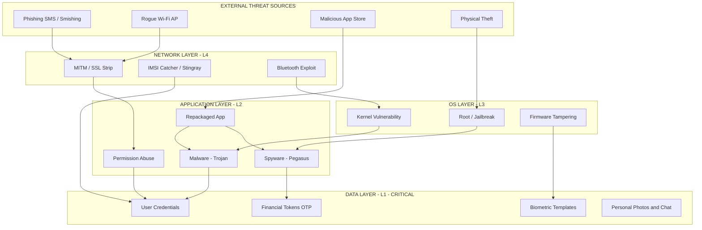
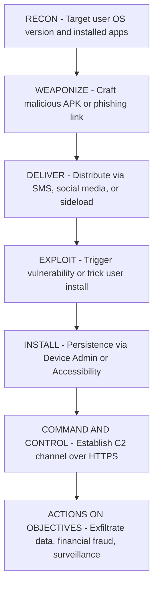
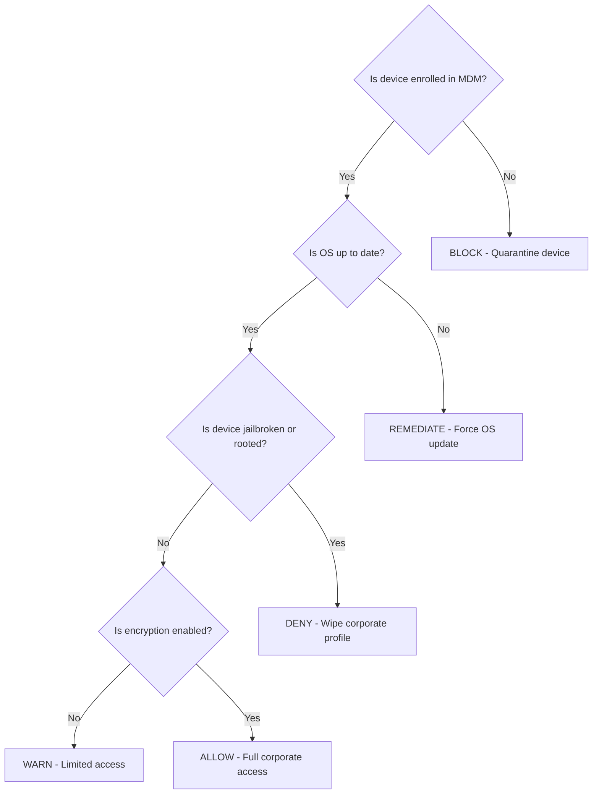

# Security Challenges Faced by Mobile Devices

<!-- SECTION_1_START -->

# Security Challenges Faced by Mobile Devices

## 1.1 Formal Definition (KTU 2024 Syllabus Terminology)

**Mobile Device Security** refers to the comprehensive set of measures, protocols, policies, and tools designed to protect smartphones, tablets, wearables, and other portable computing endpoints from unauthorized access, data exfiltration, malware infection, network-based intrusions, and physical tampering. In the context of **KTU PECST419 – Cyber Ethics, Privacy and Legal Issues**, mobile security is treated as a multidisciplinary sub-domain that intersects cryptography, network security, operating system architecture, and human behavioral ethics.

> [!IMPORTANT]
> **KTU 2024 Definition (Board Standard):** *Mobile security is the practice of safeguarding portable computing devices against the unique triad of threats arising from (a) device-level vulnerabilities, (b) wireless communication channels, and (c) the human-factor / behavioral weaknesses of end-users — all while preserving the CIA triad (Confidentiality, Integrity, Availability) of the data they carry.*

## 1.2 Conceptual Analogy & Intuition

Imagine a **high-security bank vault built on wheels** — that is your smartphone. Unlike a fixed server inside a glass datacenter, a mobile device:

1. **Travels everywhere** — crossing untrusted Wi-Fi networks like a person walking through crowded streets.
2. **Carries every "key" to your digital life** — banking OTPs, email tokens, location history, biometrics.
3. **Runs thousands of unvetted mini-programs (apps)** — like a marketplace where any stranger can set up a stall.

Hence, the **attack surface is enormous** — physical (lost/stolen), software (apps, OS), and network (cellular, Wi-Fi, Bluetooth, NFC).

> [!NOTE]
> **Key Metric (Industry Standard 2024–2025):** A modern flagship smartphone contains an average of **~90–130 active sensors and radios** at any moment (camera, mic, GPS, accelerometer, gyroscope, magnetometer, barometer, BLE, NFC, Wi-Fi 6E, 5G modem). Each one is a *potential* attack vector.

> [!TIP]
> **The Three Pillars of Mobile Threats** — KTU examiners love this framing:
> 1. **Device-level** (OS, firmware, hardware)
> 2. **Application-level** (malicious apps, SDKs, permissions)
> 3. **Network-level** (Wi-Fi, cellular, Bluetooth, NFC)

## 1.3 Visualization Callout (Conceptual)

> [!VISUALIZATION CONTROL]
> **Concept:** Concentric Threat-Zone Model of a Mobile Device
> **GeoGebra / Desmos Input Equations:**
> * Concentric circles: $r_1 = 1$ (Core: User Data), $r_2 = 2$ (OS Layer), $r_3 = 3$ (App Sandbox), $r_4 = 4$ (Network Boundary)
> * Vectors $\vec{v}_i$ entering from outside: $v_1 = (\cos\theta, \sin\theta)$ for $\theta \in \{0°, 45°, 90°, 135°, 180°, 225°, 270°, 315°\}$
> **Visual Description:** Picture 4 concentric circles on a 2D plane. The innermost circle is *User Data* (passwords, biometrics, photos). Each outer ring represents a defensive layer. Arrows from outside represent incoming threats; the further an arrow penetrates, the more severe the breach. This illustrates **Defense-in-Depth** in mobile security.

---

<!-- SECTION_1_END -->

<!-- SECTION_2_START -->

# Deep Theoretical Analysis & KTU High-Yield Cheat Sheet

## 2.1 Threat Taxonomy — The Master Classification

### 2.1.1 Device-Level Threats

| Threat Vector | Mechanism | KTU-Relevant Example |
|---|---|---|
| **OS Exploits** | Buffer overflows, race conditions in kernel | Stagefright (CVE-2015-1538) on Android |
| **Jailbreaking / Rooting** | Privilege escalation to remove vendor locks | Evasi0n jailbreak (iOS), Magisk (Android) |
| **Firmware Tampering** | Modification of bootloader or baseband | Baseband remote code execution via femtocell |
| **Physical Theft** | Loss of device → brute-force PIN, dump flash | Cellebrite UFED extraction |
| **Cold Boot Attack** | Reading residual RAM after power cycle | Forensic retrieval of encryption keys |

### 2.1.2 Application-Level Threats

| Threat Vector | Mechanism | KTU-Relevant Example |
|---|---|---|
| **Malware Families** | Trojan, Spyware, Ransomware, Adware, Worm | Pegasus (NSO Group), FluBot, Joker |
| **Permission Abuse** | App requests excessive privileges | Flashlight app asking for GPS + mic |
| **Insecure Data Storage** | Plaintext SQLite, SharedPreferences on rooted device | Banking apps storing tokens in clear |
| **Sideloading** | Installing APKs/IPAs outside official store | "Free Netflix Premium" APKs |
| **In-App Vulnerabilities** | Hardcoded API keys, weak crypto | Twitter API keys leaked in APKs |
| **Repackaging** | Decompiling + injecting malicious code → re-signing | Modified WhatsApp APKs |

### 2.1.3 Network-Level Threats

| Threat Vector | Mechanism | KTU-Relevant Example |
|---|---|---|
| **Rogue / Evil-Twin Wi-Fi** | Spoofed SSID in public area | "Free_Airport_WiFi" harvesting credentials |
| **MITM (Man-in-the-Middle)** | ARP spoofing, SSL stripping | Coffee-shop Wi-Fi attack |
| **SMS Phishing (Smishing)** | Malicious links via SMS | "Your KYC is expired, click here" |
| **Voice Phishing (Vishing)** | Social engineering via call | Fake bank IVR calls |
| **Bluetooth Exploits** | BlueBorne, BlueSmack | Remote code execution via BLE |
| **Cellular (4G/5G) Attacks** | IMSI catchers (Stingrays), SS7 exploits | Fake base station interception |
| **NFC Skimming** | Unauthorized tap-to-pay relay | Relay attack on contactless cards |

## 2.2 Comparative Analysis: Android vs. iOS Threat Surface

| Feature | Android (Open Ecosystem) | iOS (Walled Garden) |
|---|---|---|
| **Source Code** | Open-source AOSP — auditable but patchy | Closed-source — uniform but opaque |
| **App Store Vetting** | Google Play Protect (heuristic + ML) | App Store Review (manual + automated) |
| **Sideloading Allowed?** | Yes (developer mode, third-party stores) | Restricted (only via AltStore/Work profile) |
| **Permission Model** | Runtime permissions (since Android 6.0) | Permission prompts + privacy labels |
| **Market Share (2024)** | $\approx 72\%$ global | $\approx 27\%$ global |
| **Dominant Malware Type** | Banking trojans, SMS stealers | Targeted spyware (Pegasus, Predator) |
| **Patch Velocity** | Fragmented (depends on OEM) | Centralized (same day for all supported) |

> [!IMPORTANT]
> **KTU 2024 Numerical Fact to Memorize:** According to StatCounter 2024, **Android holds $\approx 72.04\%$** and **iOS $\approx 27.38\%$** of the global mobile OS market. This dominance is the **primary reason Android is the more-targeted platform** for mass-market malware.

## 2.3 The CIA Triad Applied to Mobile Devices

The fundamental security model translates to mobile as:

$$
\text{Mobile Security} = f(\text{Confidentiality}, \text{Integrity}, \text{Availability})
$$

Where:

- **Confidentiality** → Encryption at rest (AES-256), TLS in transit, biometric locks
- **Integrity** → Code signing (APK Signature Scheme v3), Secure Boot, verified boot
- **Availability** → DDoS resistance, battery-drain attack mitigation, ransomware recovery

## 2.4 Human-Factor / Behavioral Vulnerabilities

| Cognitive Bias | Attacker's Exploitation | Real-World Case |
|---|---|---|
| **Authority Bias** | Fake "from police/bank" messages | SMS impersonating Income Tax Dept |
| **Urgency Bias** | "Your account will be blocked in 1 hour" | UPI phishing scams (India, 2023–24) |
| **Curiosity Bias** | "See who viewed your profile" | Instagram spy-app scams |
| **Reciprocity Bias** | Free Wi-Fi voucher → credential harvest | Hotel Wi-Fi phishing |

> [!TIP]
> **KTU Insight:** The **human is the weakest link** — Verizon's 2024 DBIR states that **$\approx 68\%$ of breaches involve a non-malicious human element** (i.e., a person being deceived, not a sophisticated technical hack).

---

<!-- SECTION_2_END -->

<!-- SECTION_3_START -->

# Step-by-Step Analysis, Case Studies & Implementation

## 3.1 Worked Case Study: Anatomy of a Mobile Attack

### Scenario: A "Free Movie Streaming" App with Hidden Spyware

This is a **complete walk-through** of how a single malicious app attack actually unfolds — a high-yield KTU question.

**Step 1 — Lure Creation**
Attacker builds a phishing page mimicking a legitimate movie site (e.g., Netflix). Offers a "premium free" APK. Posts link on Telegram/Reddit.

**Step 2 — APK Distribution**
The APK is sideloaded (bypassing Play Store). It uses an **icon and package name spoofed** to look like Netflix.

**Step 3 — Manifest Analysis (What the app actually requests)**
A legitimate Netflix `AndroidManifest.xml` requests:
```xml
<uses-permission android:name="android.permission.INTERNET" />
<uses-permission android:name="android.permission.ACCESS_NETWORK_STATE" />
```

The malicious variant silently requests:
```xml
<uses-permission android:name="android.permission.READ_SMS" />
<uses-permission android:name="android.permission.SEND_SMS" />
<uses-permission android:name="android.permission.ACCESS_FINE_LOCATION" />
<uses-permission android:name="android.permission.RECORD_AUDIO" />
<uses-permission android:name="android.permission.READ_CONTACTS" />
<uses-permission android:name="android.permission.CAMERA" />
<uses-permission android:name="android.permission.READ_EXTERNAL_STORAGE" />
<uses-permission android:name="android.permission.SYSTEM_ALERT_WINDOW" />
<uses-permission android:name="android.permission.BIND_ACCESSIBILITY_SERVICE" />
```

**Step 4 — Trigger Chain (At runtime)**

The malicious code uses an **Accessibility Service exploit** to:
1. Detect when a banking app is opened
2. Overlay a fake login screen (the *overlay attack*)
3. Capture entered credentials
4. Read OTP from incoming SMS
5. Perform an automated UPI transaction
6. Forward stolen data to a C2 (Command-and-Control) server via HTTPS

**Step 5 — Persistence**
- Disguises itself as a "system app" in `/system/priv-app/` (after gaining root)
- Registers as a **Device Administrator** to prevent uninstallation
- Hides its icon from the launcher

**Step 6 — Exfiltration**
- All stolen data → base64-encoded JSON → POST request to `https://malicious-c2.tld/api/upload`

## 3.2 Operational Security Countermeasures (Implementation)

### 3.2.1 The Defense-in-Depth Stack

| Layer | Countermeasure | Tool / Standard |
|---|---|---|
| L1 — Device | Strong PIN (6+ digits) + Biometric | Face ID, fingerprint, **FIDO2/WebAuthn** |
| L2 — OS | Auto-updates, verified boot, SELinux | Android Verified Boot, iOS Secure Enclave |
| L3 — App | Least-privilege, code obfuscation | ProGuard/R8, SafetyNet/Play Integrity API |
| L4 — Network | VPN, certificate pinning, TLS 1.3 | WireGuard, OpenVPN, Let's Encrypt |
| L5 — Data | End-to-end encryption, remote wipe | AES-256, Find My iPhone, MDM (Microsoft Intune) |
| L6 — User | Security awareness training | Phishing simulations |

### 3.2.2 Mobile Device Management (MDM) — Python Pseudo-Implementation

```python
from typing import Optional
import logging

# Configure structured logging for security auditing
logging.basicConfig(
    level=logging.INFO,
    format="%(asctime)s | %(levelname)s | MDM_EVENT | %(message)s"
)
logger = logging.getLogger("MDM-Engine")


class MobileSecurityPolicy:
    """
    Represents a centrally managed mobile security policy.
    Deployed via MDM (e.g., Microsoft Intune, Jamf, VMware Workspace ONE).
    """

    def __init__(
        self,
        min_os_version: str,
        require_encryption: bool,
        allow_jailbreak: bool,
        allowed_app_sources: list[str],
        max_failed_unlock_attempts: int,
        require_biometric: bool,
    ) -> None:
        if not allowed_app_sources:
            raise ValueError("At least one app source must be specified.")
        if max_failed_unlock_attempts < 1 or max_failed_unlock_attempts > 20:
            raise ValueError("Failed-attempt threshold must be between 1 and 20.")

        self.min_os_version = min_os_version
        self.require_encryption = require_encryption
        self.allow_jailbreak = allow_jailbreak
        self.allowed_app_sources = allowed_app_sources
        self.max_failed_unlock_attempts = max_failed_unlock_attempts
        self.require_biometric = require_biometric

    def evaluate_device(self, device_profile: dict) -> tuple[bool, list[str]]:
        """
        Evaluates a device against the corporate policy.
        Returns (is_compliant, list_of_violations).
        """
        violations: list[str] = []

        # 1. Check OS version
        device_os_version = device_profile.get("os_version", "0.0")
        if self._version_tuple(device_os_version) < self._version_tuple(self.min_os_version):
            violations.append(
                f"OS {device_os_version} is below minimum {self.min_os_version}"
            )
            logger.warning(f"OS check failed for device {device_profile.get('device_id')}")

        # 2. Check encryption-at-rest
        if self.require_encryption and not device_profile.get("encrypted", False):
            violations.append("Device does not have full-disk encryption enabled.")

        # 3. Check jailbreak / root status
        if not self.allow_jailbreak and device_profile.get("is_rooted", False):
            violations.append("Device is rooted/jailbroken — corporate data at risk.")

        # 4. Check screen-lock policy
        failed_attempts = device_profile.get("failed_unlock_attempts", 0)
        if failed_attempts >= self.max_failed_unlock_attempts:
            violations.append("Device exceeded maximum failed unlock attempts.")
            logger.critical(
                f"Possible brute-force on device {device_profile.get('device_id')}"
            )

        # 5. Check biometric enforcement
        if self.require_biometric and not device_profile.get("biometric_enrolled", False):
            violations.append("Biometric authentication is not enrolled.")

        is_compliant = len(violations) == 0
        return is_compliant, violations

    @staticmethod
    def _version_tuple(version_str: str) -> tuple[int, ...]:
        """Safely converts '14.0.1' to (14, 0, 1) for tuple comparison."""
        try:
            return tuple(int(part) for part in version_str.split("."))
        except (ValueError, AttributeError):
            return (0, 0, 0)


# ---------- Demonstration / dry-run ----------
if __name__ == "__main__":
    policy = MobileSecurityPolicy(
        min_os_version="13.0",
        require_encryption=True,
        allow_jailbreak=False,
        allowed_app_sources=["com.android.vending"],  # Play Store only
        max_failed_unlock_attempts=5,
        require_biometric=True,
    )

    test_devices = [
        {
            "device_id": "DEV-001",
            "os_version": "14.0",
            "encrypted": True,
            "is_rooted": False,
            "failed_unlock_attempts": 1,
            "biometric_enrolled": True,
        },
        {
            "device_id": "DEV-002",
            "os_version": "11.0",
            "encrypted": True,
            "is_rooted": False,
            "failed_unlock_attempts": 0,
            "biometric_enrolled": True,
        },
        {
            "device_id": "DEV-003",
            "os_version": "14.0",
            "encrypted": False,
            "is_rooted": True,
            "failed_unlock_attempts": 9,
            "biometric_enrolled": False,
        },
    ]

    for device in test_devices:
        compliant, issues = policy.evaluate_device(device)
        status = "COMPLIANT" if compliant else "NON-COMPLIANT"
        print(f"\n[{status}] {device['device_id']}")
        if issues:
            for i, issue in enumerate(issues, 1):
                print(f"  {i}. {issue}")
```

**Expected Output of the Program:**

```text
[COMPLIANT] DEV-001

[NON-COMPLIANT] DEV-002
  1. OS 11.0 is below minimum 13.0

[NON-COMPLIANT] DEV-003
  1. Device does not have full-disk encryption enabled.
  2. Device is rooted/jailbroken — corporate data at risk.
  3. Device exceeded maximum failed unlock attempts.
  4. Biometric authentication is not enrolled.
```

## 3.3 Worked Numerical Example: Risk Scoring Formula

Many enterprises use a **quantitative risk score** for mobile threats. KTU examiners occasionally pose this:

$$
\text{Risk Score (R)} = \text{Likelihood (L)} \times \text{Impact (I)} \times \text{Exposure (E)}
$$

Each factor is rated on a scale of $1$ to $5$.

**Example:** A corporate user on Android 10 (no longer patched) frequently connects to public Wi-Fi and has banking apps installed.

| Factor | Value | Justification |
|---|---|---|
| $L$ (Likelihood) | $4$ | High — old OS, public Wi-Fi usage |
| $I$ (Impact) | $5$ | Critical — financial data, corporate email |
| $E$ (Exposure) | $3$ | Moderate — uses VPN occasionally |

$$
R = 4 \times 5 \times 3 = 60
$$

**Decision matrix:**

$$
\begin{aligned}
R &\le 10 \quad \text{→ Low risk (Accept)} \\
10 < R &\le 30 \quad \text{→ Medium risk (Mitigate)} \\
30 < R &\le 50 \quad \text{→ High risk (Transfer / Compensating controls)} \\
R &> 50 \quad \text{→ Critical risk (Avoid / Terminate access)}
\end{aligned}
$$

**Result:** $R = 60$ → **Critical Risk** → IT admin should **revoke corporate access** until the user upgrades OS and enrolls in MDM.

---

<!-- SECTION_3_END -->

<!-- SECTION_4_START -->

# Structural Diagrams & Schematics

## 4.1 Mermaid Diagram — Layered Mobile Threat Architecture



## 4.2 Mermaid Diagram — Mobile Security Defense-in-Depth Model

```mermaid
flowchart LR
    subgraph USER["USER AWARENESS LAYER"]
        U1["Security Training"]
        U2["Phishing Recognition"]
    end

    subgraph POLICY["POLICY AND MDM LAYER"]
        P1["MDM Enrollment"]
        P2["App Allow-list"]
        P3["Remote Wipe Policy"]
    end

    subgraph APPDEF["APP DEFENSES"]
        AD1["Code Obfuscation - R8 and ProGuard"]
        AD2["Certificate Pinning"]
        AD3["Runtime Self-Protection RASP"]
    end

    subgraph OSDEF["OS DEFENSES"]
        OD1["Verified Boot"]
        OD2["Sandboxing and SELinux"]
        OD3["Monthly Security Patches"]
    end

    subgraph NETDEF["NETWORK DEFENSES"]
        ND1["VPN - WireGuard"]
        ND2["TLS 1.3 Everywhere"]
        ND3["DNS over HTTPS DoH"]
    end

    subgraph PHYDEF["PHYSICAL DEFENSES"]
        PD1["Biometric Lock"]
        PD2["Strong 6-Digit PIN"]
        PD3["Full Disk Encryption AES-256"]
    end

    USER --> POLICY
    POLICY --> APPDEF
    APPDEF --> OSDEF
    OSDEF --> NETDEF
    NETDEF --> PHYDEF
    PHYDEF --> DATA["PROTECTED USER DATA"]
```



## 4.3 Mermaid Diagram — Mobile Attack Lifecycle (Kill Chain)



> [!NOTE]
> **Why this matters for KTU:** The Cyber Kill Chain (Lockheed Martin model) is a **favourite exam topic**. Be ready to map each mobile threat to one of the 7 stages: Recon → Weaponize → Deliver → Exploit → Install → C2 → Actions.

## 4.4 Mermaid Diagram — BYOD Security Decision Tree



---

<!-- SECTION_4_END -->

<!-- SECTION_5_START -->

# KTU 2024 Scheme Examination Question Bank & Topic Recap

## 5.1 Part A — Short Answer Questions (2 × 3 Marks = 6 Marks)

### Question 1: Define Mobile Malware. List any four types with a one-line description of each. **[KTU University Exam – Dec 2023, CO1, Remember]**

**Model Answer (3 Marks):**

**Definition (1 Mark):** *Mobile malware is malicious software specifically designed to target mobile devices (smartphones, tablets) with the intent of stealing data, gaining unauthorized access, or causing device malfunction.*

**Four Types (2 Marks – 0.5 each):**

1. **Trojan** — Disguised as a legitimate app; performs hidden malicious actions (e.g., FakeBank trojan).
2. **Spyware** — Secretly monitors user activity and exfiltrates data (e.g., Pegasus).
3. **Ransomware** — Encrypts user data and demands payment for decryption (e.g., WannaLocker for Android).
4. **Adware** — Aggressively displays unwanted advertisements; often collects user data (e.g., HiddenAds family).

> [!WARNING]
> **Examiner's Pitfall:** Do **NOT** mix up "worm" with "trojan" in your answer. A worm self-replicates over networks; a trojan does not.

---

### Question 2: What is Smishing? How does it differ from Phishing? **[KTU University Exam – July 2024, CO1, Understand]**

**Model Answer (3 Marks):**

**Smishing (1.5 Marks):** *Smishing, a portmanteau of "SMS" and "Phishing," is a social-engineering attack in which fraudsters send fraudulent SMS messages containing malicious links or requests for personal information, banking credentials, or OTPs.*

**Difference from Phishing (1.5 Marks):**

| Aspect | Phishing | Smishing |
|---|---|---|
| Channel | Email | SMS / WhatsApp |
| Reach | Needs internet + email client | Works on **any** mobile with cellular signal |
| User Attention | Lower — emails are screened | Higher — SMS is read within **3 minutes** on average (CTIA 2023) |
| Link Visibility | Long URLs often visible | Shortened links (bit.ly) hide true destination |

---

## 5.2 Part B — Long Answer Questions (Module Internal Choice)

### Question A (14 Marks) — Comprehensive Long Answer

**(a)** Explain in detail the **major categories of security challenges faced by mobile devices**. Provide at least **two real-world examples** for each category. **[7 Marks] [CO1, Understand]**

**(b)** Discuss the **role of Mobile Device Management (MDM)** in enterprise security. Illustrate with a **block diagram** of the MDM architecture and explain any **four key MDM policies**. **[7 Marks] [CO2, Apply]**

---

#### Model Solution for (a) — 7 Marks

**Introduction (1 Mark):**
Mobile devices face a unique combination of threats because they combine always-on connectivity, a vast attack surface of sensors, and human factors. Security challenges are broadly classified into **three categories**.

**Category 1 — Device-Level Challenges (2 Marks):**

- **OS Vulnerabilities:** Software bugs in the mobile OS can be exploited for privilege escalation. *Example:* **Stagefright (CVE-2015-1538)** — a critical buffer overflow in Android's media library that allowed remote code execution via a single MMS, affecting nearly 1 billion devices at the time.
- **Jailbreaking/Rooting:** Bypasses vendor security controls, allowing installation of unverified apps. *Example:* **Evasi0n (2013)** — the first untethered iOS 7 jailbreak, demonstrating the impossibility of creating a perfectly locked-down consumer device.
- **Physical Theft & Forensic Extraction:** Tools like **Cellebrite UFED** can bypass screen locks and extract data even from encrypted devices via hardware exploits.

**Category 2 — Application-Level Challenges (2 Marks):**

- **Malware & Trojans:** *Example:* **Joker malware (2020)** — a spyware strain found in numerous Play Store apps that subscribed victims to premium SMS services.
- **Permission Abuse:** *Example:* A study by **Avast (2019)** showed that the average flashlight app requested **10+ permissions** including GPS, microphone, and contacts.
- **Insecure Data Storage:** *Example:* In 2014, **Snapchat** stored unencrypted "snaps" in a directory accessible by file managers, leading to "The Snappening" leak.
- **Repackaging:** Attackers decompile popular APKs (using tools like **APKTool**), inject malicious code, and redistribute them. *Example:* Modified versions of **WhatsApp** distributing malware in India (2017).

**Category 3 — Network-Level Challenges (2 Marks):**

- **Rogue Wi-Fi Hotspots:** Attackers create SSIDs like "Free_Airport_WiFi" to harvest credentials. *Example:* The 2017 **Avast Wi-Fi experiment** at Mobile World Congress captured data from $\approx 60\%$ of attendees' devices.
- **MITM via SSL Stripping:** On unsecured HTTP, attackers downgrade HTTPS to HTTP. *Example:* **Cafe-Latte attack** demonstrated at DEF CON.
- **IMSI Catchers (Stingrays):** Fake cellular base stations. *Example:* The **SkyLock** device used in the 2014 Hong Kong protests to track activists.
- **Bluetooth Exploits:** *Example:* **BlueBorne (2017)** — a set of 8 zero-day vulnerabilities allowing remote code execution over Bluetooth, affecting $\approx 5.3$ billion devices.

**Valuation Key Points:**
- Naming the 3 categories — **1 Mark**
- At least 2 real-world examples per category — **4 Marks (2 + 1 + 1)**
- Conclusion linking to CIA triad — **1 Mark**
- Examples must be **specific and dated** to earn full marks.

---

#### Model Solution for (b) — 7 Marks

**Definition (1 Mark):**
*Mobile Device Management (MDM) is a centralized security framework that allows IT administrators to enroll, monitor, secure, and manage employees' mobile devices (corporate-owned or BYOD) through policies pushed over-the-air.*

**Block Diagram of MDM Architecture (2 Marks):**

```
+---------------------+        +----------------------+
|   Mobile Devices    |        |   Enterprise Server  |
|  (iOS / Android)    |        |   - User Directory   |
|  - Agent / Profile  | <----> |   - Policy Engine    |
|  - Compliance Data  |  TLS   |   - App Catalog      |
+---------------------+        +----------------------+
            |                              |
            v                              v
+---------------------+        +----------------------+
|   Cloud MDM Console |        |   API Gateways       |
|   - Admin UI        |        |   - Intune / Jamf    |
|   - Reports         |        |   - VMware AirWatch  |
+---------------------+        +----------------------+
```

**Four Key MDM Policies (4 Marks – 1 each):**

1. **Device Enrollment & Authentication Policy:** Mandates that only MDM-enrolled devices can access corporate email/resources. Uses certificates (SCEP) for mutual TLS.
2. **App Allow-listing / Blacklisting:** Whitelist of approved apps (e.g., only Microsoft 365, Slack); blacklisting of risky apps (e.g., third-party app stores).
3. **Encryption & Data Loss Prevention (DLP):** Enforces device-level encryption and prevents copy-paste of corporate data into personal apps (using managed app configurations).
4. **Remote Wipe / Lock Policy:** Allows IT to remotely lock the device, wipe corporate data only (selective wipe), or factory-reset the entire device (full wipe) if lost/stolen.

**Conclusion (1 Mark):**
MDM is a critical pillar of the enterprise mobile security strategy, especially in BYOD environments, by providing visibility, control, and policy enforcement over a highly distributed endpoint fleet.

> [!WARNING]
> **Examiner's Pitfall (Lose 1–2 Marks):**
> - **Do NOT** confuse MDM with MAM (Mobile Application Management) — MDM manages the *device*, MAM manages *individual apps*.
> - **Do NOT** omit the **encryption enforcement** policy — it is the most-tested MDM feature.
> - **Always** mention the difference between **selective wipe** (corporate data only) vs **full wipe** (factory reset) — examiners allocate marks specifically for this distinction.

---

### Question B (14 Marks) — Alternative Long Answer

**(a)** With a suitable diagram, explain the **Cyber Kill Chain** as applied to a **mobile ransomware attack**. Identify the **stage at which the attack can be most effectively disrupted**. **[7 Marks] [CO2, Understand / Apply]**

**(b)** Compare the **security architectures of Android and iOS** under the following heads: **(i) App distribution model, (ii) Permission system, (iii) Sandboxing, (iv) Patch management.** Provide **two strengths and two weaknesses** for each OS. **[7 Marks] [CO3, Apply]**

---

#### Model Solution Outline for (a) — 7 Marks

1. **Introduction to the Cyber Kill Chain (1 Mark):** Lockheed Martin model — 7 stages of a cyber attack.
2. **Mapping a mobile ransomware attack to each stage (4 Marks – ~0.5 per stage):**
   - **Recon:** Attacker identifies target's OS version, banking app.
   - **Weaponize:** Crafts malicious APK with ransomware payload.
   - **Deliver:** Distributes via SMS or social media with scareware message ("Your photos have been leaked!").
   - **Exploit:** Exploits an unpatched vulnerability or tricks user into enabling Accessibility Services.
   - **Install:** Encrypts user files (photos, documents) using AES-256 with attacker-controlled key.
   - **C2:** Communicates with command server to fetch the Bitcoin ransom address.
   - **Actions on Objectives:** Demands ransom (e.g., 0.05 BTC); threatens data leak.
3. **Disruption Stage (1.5 Marks):** The **Delivery** or **Exploit** stage is the most effective for disruption. **Delivery** can be disrupted by spam filters, Google Play Protect. **Exploit** is disrupted by **timely OS patching** and user security awareness. Defense at **Install/C2 stage is much harder** because the attacker already has code execution.
4. **Diagram (0.5 Mark):** Use the kill-chain flowchart already shown in Section 4.3.

**Valuation Tip:** Students often skip the diagram — **lose 1 Mark**. Always include the kill-chain visual.

---

#### Model Solution Outline for (b) — 7 Marks

| Head | Android | iOS |
|---|---|---|
| **App Distribution** | Open — Google Play + sideloading + third-party stores (Aurora, Aptoide) | Closed — App Store only (sideloading requires Work Profile / EU DMA workaround) |
| **Permission System** | Runtime permissions (Android 6.0+); user can revoke at any time; **drawer of permissions**; permission groups | Permission prompts with privacy "nutrition labels"; some permissions require *just-in-time* prompts; limited access to background tracking since iOS 14.5 (ATT) |
| **Sandboxing** | Each app runs in a unique UID; SELinux mandatory access control; **scoped storage** since Android 10 | All apps run in a **sandbox** with no inter-app communication except via tightly-controlled APIs; no root access even to user |
| **Patch Management** | Fragmented — depends on OEM/SOC vendor; **~30% of devices** run latest version | Centralized — Apple pushes same-day patches to all supported devices; **~75% of devices** on iOS 17 (2024) |

**Android — 2 Strengths (1 Mark):**
- Open-source allows community auditing and customization.
- Flexible permission system is highly granular.

**Android — 2 Weaknesses (1 Mark):**
- Fragmentation leads to unpatched vulnerabilities on older devices.
- Sideloading + third-party stores = easier malware distribution.

**iOS — 2 Strengths (1 Mark):**
- Walled garden dramatically reduces mass-market malware.
- Centralized patching gives uniform security posture.

**iOS — 2 Weaknesses (1 Mark):**
- Closed ecosystem — limited user control and customization.
- Targeted spyware (Pegasus, Predator) thrives because high-value targets use iOS.

**Conclusion (1 Mark):** No mobile OS is inherently "secure" — security depends on configuration, user behavior, and timely patching.

> [!WARNING]
> **Examiner's Pitfall:**
> - **Do NOT** write "iOS cannot get malware" — this is factually wrong (Pegasus proved otherwise) and examiners **deduct 1–2 marks** for this error.
> - **Always** give specific version numbers (Android 14, iOS 17) to score high on currency-of-knowledge.

---

## 5.3 Topic Recap & Important Things to Remember

> [!IMPORTANT]
> **High-Yield Rapid-Revision Checklist — KTU PECST419 Module 2**

- [x] **Mobile Security = protection** of smartphones/tablets against device, app, and network threats while preserving **CIA Triad**.
- [x] **Three Pillars of Mobile Threats:** Device-level, Application-level, Network-level.
- [x] **Mobile Market Share (2024):** Android $\approx 72\%$, iOS $\approx 27\%$ — Android is the more-attacked platform.
- [x] **Key Malware Types:** Trojan, Spyware, Ransomware, Adware, Worm — know the **one-line definition** of each.
- [x] **Stagefright (2015)** — single most-cited Android vulnerability in KTU papers.
- [x] **Pegasus (NSO Group)** — flagship mobile spyware; iOS-targeted, zero-click exploit.
- [x] **Smishing vs Phishing vs Vishing** — SMS / Email / Voice — know the channel and a unique countermeasure for each.
- [x] **MDM vs MAM:** MDM = device-level, MAM = app-level. Distinguish **selective wipe** from **full wipe**.
- [x] **Defense-in-Depth:** 6 layers — User, Policy, App, OS, Network, Physical.
- [x] **Cyber Kill Chain (7 stages):** Recon → Weaponize → Deliver → Exploit → Install → C2 → Actions on Objectives.
- [x] **Risk Score formula:** $R = L \times I \times E$, scale $1$–$5$ each. Critical risk threshold typically $R > 50$.
- [x] **Countermeasure Stack:** Strong PIN + Biometric + Full-disk encryption (AES-256) + VPN + Certificate Pinning + MDM.
- [x] **BYOD Policy:** Enforce MDM, OS updates, encryption, and no jailbreak/root.
- [x] **Legal/Ethical Angle (for PECST419):** Mobile data privacy is governed by **India's DPDP Act 2023**, **IT Act 2000/2008 amendments**, and **GDPR (for EU users)**. Unauthorised data extraction from a stolen phone is a punishable offence under **Section 66 of the IT Act**.
- [x] **Human Factor:** ~68% of breaches (Verizon DBIR 2024) involve a non-malicious human element — **user awareness is paramount**.
- [x] **Emerging Threats (2024–25):** AI-powered malware, deepfake voice scams, 5G/IMSI catchers, IoT-mobile convergence attacks.

<!-- SECTION_5_END -->
