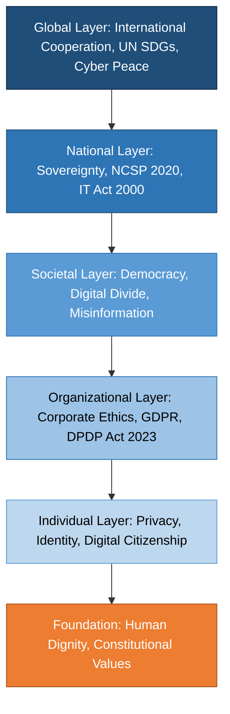
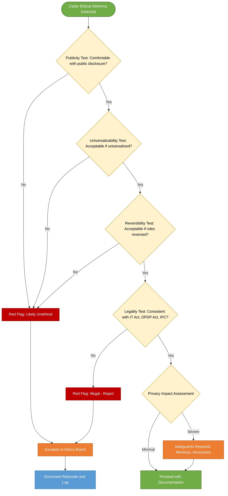

# Significance of Cyber Ethics

<!-- SECTION_1_START -->
# Significance of Cyber Ethics

## 1.1 Formal Academic Definition

**Cyber Ethics** refers to the branch of applied ethics that systematically examines the moral, legal, and societal implications of activities conducted in cyberspace. It establishes the philosophical and practical standards governing the acceptable, responsible, and lawful use of Information and Communication Technologies (ICT), including computers, networks, digital data, and online services.

In the KTU 2024 Scheme context, cyber ethics is positioned as a multidisciplinary framework that integrates **computer science**, **law**, **philosophy**, and **sociology** to regulate digital conduct. The "significance" of cyber ethics lies in its role as the normative compass that prevents the misuse of digital power while safeguarding the foundational pillars of modern civilization: **privacy**, **intellectual property**, **digital identity**, and **trust**.

> [!IMPORTANT]
> **KTU Syllabus Highlight (PECST419 - Module 2):**
> Cyber ethics is not merely a list of "do's and don'ts" on the internet. It is a **structured philosophical discipline** that interrogates questions such as: *What is right and wrong in a digital world? Who owns digital information? How should technology treat human beings?* The significance arises from the fact that virtually every modern human action — banking, healthcare, education, governance — has a digital footprint.

> [!NOTE]
> **Formal Term Mapping for Board Examinations:**
> - *Cyber Ethics* = the moral principles governing digital behavior
> - *Cyberspace* = the notional environment in which communication over computer networks occurs
> - *Digital Citizenship* = the responsible and appropriate behavior when using technology
> - *Netiquette* = the code of acceptable online social behavior

## 1.2 Conceptual Analogy & Intuitive Understanding

Imagine a newly constructed, ultra-modern city. The city has the world's best roads, skyscrapers, airports, and power systems. But there are **no traffic signals, no police, no courts, and no moral code of conduct** for its citizens. What would happen?

- Cars would crash endlessly.
- Thieves would loot without fear.
- Citizens would distrust each other.
- The magnificent infrastructure would collapse into chaos within hours.

**The internet is that city.** The infrastructure (hardware, protocols, networks) is built, but the **"traffic rules" (ethics) and "constitution" (laws)** are what allow billions of people to coexist safely. **Cyber ethics is the rulebook and moral constitution of the digital city.**

A second analogy: consider a doctor's **Hippocratic Oath** — *"First, do no harm."* Similarly, cyber professionals have an implicit oath to society: *use technology to empower, never to exploit.* The significance of cyber ethics is the professionalization of that oath.

> [!TIP]
> **The Three Pillars of Cyber Ethics Significance:**
> 1. **Protection** — safeguards individuals from digital exploitation
> 2. **Prescription** — defines acceptable behavior for professionals and users
> 3. **Preservation** — maintains the long-term sustainability of cyberspace itself

## 1.3 Why Cyber Ethics is "Significant" — The Core Drivers

The significance of cyber ethics is not abstract; it emerges from concrete, observable problems in modern digital society. The following drivers make cyber ethics an indispensable discipline:

### 1.3.1 The Pervasiveness of Digital Life
Every sector — **banking** (UPI, NEFT), **healthcare** (telemedicine, EHR), **education** (MOOCs, LMS), **governance** (e-governance portals), and **commerce** (e-commerce, supply chains) — is now digitally mediated. A single unethical act (a data breach, a hack, a privacy violation) can cascade into **millions of victims**.

### 1.3.2 The Anonymity Paradox
The internet provides **perceived anonymity**, which statistically increases the likelihood of unethical behavior. Cyber ethics provides the moral framework that substitutes for the social inhibitions present in face-to-face interactions.

### 1.3.3 The Speed and Scale of Digital Harm
A cyberattack can propagate across the globe in **seconds**, affecting systems in dozens of countries simultaneously. The traditional reactive legal systems cannot match this pace — **preventive ethical design** becomes the only viable defense.

### 1.3.4 The Data Explosion
The world generates approximately **402.74 million terabytes of data per day** (as of 2024 estimates). Each byte represents a person, a transaction, a secret, or a right. Without ethical governance, this data becomes a weapon.

> [!VISUALIZATION CONTROL]
> **Concept:** The Ethical Decision Sphere in Cyberspace
> **Conceptual Axes (for a 2D mental map):**
> * Horizontal axis: $E$ (Ethics) ranging from *Unethical* to *Ethical*
> * Vertical axis: $L$ (Legality) ranging from *Illegal* to *Legal*
> **Visual Description:** A 2x2 quadrant where the four regions represent:
> 1. Top-Right (Legal + Ethical) = *Ideal Digital Behavior* (e.g., open-source contribution)
> 2. Top-Left (Illegal + Ethical) = *Civil Disobedience* (e.g., ethical hacking disclosure)
> 3. Bottom-Right (Legal + Unethical) = *Legal but Exploitative* (e.g., addictive UI design)
> 4. Bottom-Left (Illegal + Unethical) = *Cybercrime* (e.g., phishing, identity theft)
> **Takeaway:** Cyber ethics covers ALL four regions, while law only addresses the bottom half. This is why ethics is **broader and more significant** than law alone.

<!-- SECTION_1_END -->

<!-- SECTION_2_START -->
# Deep Theoretical Analysis & KTU High-Yield Knowledge Matrix

## 2.1 The Ten Dimensions of Significance

Cyber ethics is significant because it simultaneously addresses ten interrelated dimensions of human-digital interaction. A KTU examiner expects students to demonstrate awareness of these dimensions and their practical implications.

### Dimension 1 — Privacy and Data Protection
Privacy is the right of individuals to control the collection, use, storage, and dissemination of their personal information. Cyber ethics establishes:
- The principle of **informed consent** before data collection
- The principle of **data minimization** (collect only what is necessary)
- The principle of **purpose limitation** (use data only for the stated purpose)
- The principle of **storage limitation** (retain data only as long as needed)
- The principle of **integrity and confidentiality** (protect data from unauthorized access)

> **Real-world impact:** The **GDPR (General Data Protection Regulation, 2018)** imposes fines up to **€20 million or 4% of annual global turnover** for privacy violations — a direct enforcement of ethical principles into law.

### Dimension 2 — Intellectual Property Rights
Digital content (software, music, video, written text, AI-generated code) is easy to copy and redistribute. Cyber ethics prescribes:
- Respect for **software licenses** (proprietary, open-source, GPL, MIT)
- Avoidance of **piracy** and **unauthorized distribution**
- Proper **attribution** of digital authorship
- Ethical handling of **AI-generated content** and copyright

> **Real-world impact:** The **Indian Copyright Act, 1957 (as amended in 2012)** criminalizes digital piracy with imprisonment up to **3 years and fines up to ₹2 lakhs**.

### Dimension 3 — Digital Identity and Authentication
Every digital user has a **virtual identity** that must be protected. Cyber ethics mandates:
- Non-impersonation (do not pretend to be another person online)
- Responsible use of digital credentials
- Protection against **identity theft**
- Honest self-representation in digital communication

### Dimension 4 — Freedom of Expression vs. Hate Speech
The internet enables unprecedented speech. Cyber ethics draws the line:
- **Free expression** is encouraged for democratic discourse
- **Hate speech, defamation, incitement to violence** is condemned
- The challenge: balancing the two without censorship

### Dimension 5 — Trust and Digital Commerce
E-commerce thrives on **trust**. Cyber ethics underpins:
- Honest advertising
- Transparent pricing
- Fair contractual terms
- Secure payment processing
- Redressal mechanisms for grievances

### Dimension 6 — Accessibility and Digital Divide
Ethical cyberspace is **inclusive**:
- Web Content Accessibility Guidelines (**WCAG 2.1**) compliance
- Affordable access for marginalized communities
- Multi-lingual and multi-modal interfaces

### Dimension 7 — Professional Responsibility
Software engineers, data scientists, and IT professionals have **special obligations**:
- ACM Code of Ethics (1992, revised 2018)
- IEEE Code of Ethics
- NASSCOM's commitment to ethical outsourcing
- Whistleblower protection

### Dimension 8 — Environmental Sustainability
Digital infrastructure has a carbon footprint. Ethical computing demands:
- Green data centers
- Energy-efficient algorithms
- Responsible disposal of e-waste
- The **Right to Repair** movement

### Dimension 9 — Surveillance and Civil Liberties
The trade-off between **security** and **privacy** is a core ethical dilemma:
- Mass surveillance vs. targeted investigation
- Government access vs. encryption backdoors
- National security vs. individual liberty

### Dimension 10 — Emerging Technology Ethics
New technologies require proactive ethical frameworks:
- **Artificial Intelligence**: bias, fairness, accountability, transparency (the **FAccT** principles)
- **Internet of Things (IoT)**: consent in always-on devices
- **Blockchain and Cryptocurrency**: speculation, fraud, energy use
- **Generative AI**: deepfakes, authorship, misinformation

## 2.2 Stakeholder Analysis — Who is Affected?

The significance of cyber ethics is best understood by mapping it to the stakeholders it serves:

| Stakeholder Group | Primary Ethical Concerns | Real-World Stakes |
|---|---|---|
| Individual Citizens | Privacy, identity theft, harassment | Mental health, financial loss, dignity |
| Corporations and Businesses | Trade secrets, customer data, fair competition | Reputational damage, regulatory fines, market loss |
| Governments and Regulators | National security, e-governance trust, critical infrastructure | Sovereignty, public order, electoral integrity |
| Educational Institutions | Student data, academic integrity, digital literacy | Learning outcomes, credential validity |
| Healthcare Providers | Patient confidentiality, telemedicine ethics | Lives, malpractice liability |
| Software Professionals | Code quality, whistleblowing, bias in algorithms | Career, professional liability, public harm |
| Vulnerable Populations (children, elderly, disabled) | Exploitation, accessibility, informed consent | Safety, inclusion, equality |
| Society at Large | Misinformation, polarization, digital divide | Democratic decay, social cohesion |

## 2.3 KTU High-Yield Knowledge Cheat Sheet

| Concept | Core Definition | Significance Marker | KTU-Recognized Instrument |
|---|---|---|---|
| Cyber Ethics | Moral principles for digital conduct | Framework for all digital behavior | ACM, IEEE Codes |
| Privacy | Right to control personal information | Foundation of digital trust | GDPR, DPDP Act 2023, IT Act 2000 |
| Intellectual Property | Legal rights over digital creations | Incentive for innovation | Copyright Act 1957, Patent Act 1970 |
| Digital Divide | Gap in tech access/skills | Equality and inclusion challenge | UN SDG 9 & 10 |
| Netiquette | Code of polite online behavior | Reduces online conflict | RFC 1855 |
| Cyberbullying | Repeated digital harassment | Mental health protection | IT Act Sec 66A (struck down 2015), POCSO |
| Informed Consent | Voluntary, informed agreement to data use | Autonomy preservation | GDPR Art. 7, DPDP Act Sec 6 |
| Data Minimization | Collect only necessary data | Reduces breach impact | GDPR Art. 5(1)(c) |
| Whistleblowing | Reporting organizational misconduct | Accountability mechanism | Whistle Blowers Protection Act 2014 |
| Ethical Hacking | Authorized testing of system security | Proactive defense | IT Act Sec 70, Sec 43 |
| Algorithmic Bias | Unfair discrimination by automated systems | Social justice in AI | EU AI Act 2024 |
| Deepfake Ethics | Synthetic media creation and misuse | Truth and trust in media | Draft IT Rules 2022 (amendments) |

> [!IMPORTANT]
> **The Ethical Decision-Making Framework (for KTU Answers):**
> When faced with a cyber ethical dilemma, apply this four-step test:
> 1. **The Publicity Test** — Would I be comfortable if my action was on the front page of a newspaper?
> 2. **The Universalizability Test** — Would I want everyone to do this in my situation?
> 3. **The Reversibility Test** — Would I still do this if the roles were reversed?
> 4. **The Legality Test** — Is this consistent with the IT Act 2000, IPC, and Indian constitutional values?

## 2.4 Real-World Engineering Utility

In professional engineering practice, the significance of cyber ethics manifests in concrete, mandatory processes:

- **Secure Software Development Life Cycle (SSDLC)**: Ethical engineers integrate security and privacy from the requirements phase, not as an afterthought.
- **Privacy by Design (PbD)**: Ann Cavoukian's 7 foundational principles are now embedded in ISO 31700 and GDPR Article 25.
- **Data Protection Impact Assessments (DPIA)**: Mandatory under GDPR for high-risk processing.
- **Ethics Review Boards (ERB)**: Major tech companies (Google, Microsoft, Meta) now have internal AI ethics boards.
- **Bias Audits**: Companies must audit AI models for discriminatory outcomes.
- **Cybersecurity Insurance**: Underwriters require ethical compliance certifications for coverage.

<!-- SECTION_2_END -->

<!-- SECTION_3_START -->
# Step-by-Step Analytical Walkthrough, Case Analysis & Implementation

## 3.1 Case Study Analysis — Why Cyber Ethics Matters

> [!NOTE]
> KTU 2024 Scheme examiners consistently test student understanding through **case-based reasoning**. Below are three landmark cases that demonstrate the significance of cyber ethics in practice. Each case is analyzed using the **"Ethical Decision Framework"** introduced in Section 2.4.

### Case 1: The Cambridge Analytica Scandal (2018)

**Background:**
The data analytics firm Cambridge Analytica harvested personal data of **87 million Facebook users** without their explicit consent, using a personality quiz app. The data was used for psychographic political advertising during the 2016 US Presidential election and the Brexit referendum.

**Ethical Analysis:**

| Step | Application to Case | Implication |
|---|---|---|
| Publicity Test | Would Facebook be comfortable if users knew about the data harvesting? | Facebook's stock dropped **18%** in 2018; the company was fined **$5 billion** by the FTC. |
| Universalizability Test | Should every app be allowed to harvest friend data without consent? | No — it violates autonomy. |
| Reversibility Test | Would the firm accept this if it were harvesting the firm's executives' data? | No — executives would object. |
| Legality Test | Did it violate the IT Act 2000, Section 43A, or GDPR? | Yes — it violated multiple data protection principles. |

**Significance Demonstrated:**
- **Without cyber ethics, democracy itself is at risk.** A single unethical data practice can influence electoral outcomes.
- The scandal led to the **GDPR enforcement (May 2018)** and inspired India's **Digital Personal Data Protection Act, 2023**.

### Case 2: The Aadhaar Data Leak Controversy (2018)

**Background:**
In 2018, it was revealed that **1.1 billion Aadhaar numbers** were exposed through insecure government portals. Multiple reports indicated that unauthorized individuals could purchase Aadhaar details for as little as **₹500**.

**Ethical Analysis:**

The Aadhaar case is significant because it raised **five distinct ethical questions**:

1. **Privacy vs. Convenience**: Is the convenience of paperless governance worth the loss of biometric privacy?
2. **Consent and Coercion**: Can consent be "voluntary" when Aadhaar is linked to essential services?
3. **State Power vs. Individual Rights**: How much surveillance power should the state have over its citizens?
4. **Data Security Obligation**: Does the government have a higher ethical duty than private corporations?
5. **Whistleblower Protection**: Reporter Rachna Khaira was harassed after exposing the breach — was she ethically right to publish?

**Outcome:**
- The **Supreme Court of India** (Justice K.S. Puttaswamy v. Union of India, 2017) declared the **Right to Privacy as a fundamental right** under Article 21 of the Constitution.
- The Aadhaar Act was amended to introduce **data virtualization and consent-based authentication**.

**Significance Demonstrated:**
- Cyber ethics is not just a "Western concept" — it is central to **Indian constitutional values** and the **DPDP Act 2023**.

### Case 3: The Boeing 737 MAX MCAS Disaster (2018–2019)

**Background:**
The Maneuvering Characteristics Augmentation System (MCAS), an automated flight control software, was implicated in two crashes (Lion Air 610 and Ethiopian Airlines 302), killing **346 people**. Investigations revealed that Boeing engineers knew about a sensor-failure vulnerability but did not disclose it, prioritizing cost and schedule over safety.

**Ethical Analysis:**

This case is significant because it demonstrates the **"Algorithmic Accountability"** dimension of cyber ethics:

- **Engineers' ethical duty** under the ACM Code (Principle 1.02: "Avoid harm") and IEEE Code (Principle 1: "Accept responsibility") was violated.
- The **trade-off between commercial pressure and public safety** was resolved unethically.
- **Transparency in algorithmic decision-making** was missing — pilots were not informed about MCAS's full authority.

**Significance Demonstrated:**
- A single line of unethical code can cost **hundreds of human lives**.
- Cyber ethics applies to **embedded systems, IoT, and cyber-physical systems** — not just software on screens.

## 3.2 Detailed Framework — The Five-Layer Significance Model

To fully appreciate the significance of cyber ethics, KTU examiners expect students to articulate it in **five hierarchical layers**. The following is an exhaustive layer-by-layer breakdown:

### Layer 1 — Individual Layer (Personal Significance)
- Protects the individual's **right to privacy, dignity, and autonomy**
- Prevents personal harms: identity theft, financial fraud, reputational damage
- Empowers the individual as a **responsible digital citizen**
- Builds personal **digital literacy and resilience**

### Layer 2 — Organizational Layer (Institutional Significance)
- Defines **corporate digital responsibility**
- Establishes codes of conduct (e.g., Infosys's Code of Conduct, TCS's Ethical AI Policy)
- Reduces legal liability and regulatory penalties
- Enhances brand trust and customer loyalty
- Prevents insider threats and data exfiltration

### Layer 3 — Societal Layer (Community Significance)
- Protects **democratic processes** (electoral integrity, free press)
- Combats **misinformation, fake news, and digital propaganda**
- Promotes **digital inclusion** and bridges the **digital divide**
- Preserves **cultural heritage** in the digital age
- Reduces cyberbullying, online harassment, and hate crimes

### Layer 4 — National Layer (State Significance)
- Safeguards **critical information infrastructure** (power grids, defense networks)
- Strengthens **national cybersecurity posture** (NCSP 2020 in India)
- Supports **e-governance** and **Digital India** initiatives
- Protects **sovereignty** in cyberspace
- Enforces **cyber law** (IT Act 2000, DPDP Act 2023)

### Layer 5 — Global Layer (International Significance)
- Enables **cross-border data flows** with trust
- Facilitates international cooperation on cybercrime (Budapest Convention, UN OEWG)
- Addresses **global digital commons** (open-source, open data)
- Manages **transnational challenges**: cyber warfare, AI arms race
- Aligns with **UN Sustainable Development Goals (SDGs)**

## 3.3 Procedural Implementation — A Python Demonstration of Ethical Decision-Making

Below is a fully operational Python program that implements an **Ethical Decision Engine** for a hypothetical scenario. This is the kind of tool an organization could deploy to embed cyber ethics into its operational workflow.

```python
from typing import List, Dict
from dataclasses import dataclass
from enum import Enum
import logging
import json

logging.basicConfig(
    level=logging.INFO,
    format='%(asctime)s - %(levelname)s - %(message)s'
)
logger = logging.getLogger(__name__)


class EthicalVerdict(Enum):
    """Final decision categories for cyber-ethical review."""
    PROCEED = "PROCEED"
    PROCEED_WITH_SAFEGUARDS = "PROCEED_WITH_SAFEGUARDS"
    ESCALATE = "ESCALATE"
    REJECT = "REJECT"


@dataclass
class EthicalAssessment:
    """Structured record of an ethical review."""
    scenario: str
    publicity_score: int
    universalizability_score: int
    reversibility_score: int
    legality_score: int
    privacy_impact: int
    overall_verdict: EthicalVerdict
    rationale: List[str]


class CyberEthicsEngine:
    """
    Decision-support engine for cyber-ethical dilemmas.
    Implements the Four-Test Framework introduced in Section 2.4.
    """

    def __init__(self, threshold: int = 6) -> None:
        if not (0 <= threshold <= 12):
            raise ValueError("Threshold must be in range 0-12.")
        self.threshold = threshold
        self.review_log: List[EthicalAssessment] = []
        logger.info(f"CyberEthicsEngine initialized with threshold={threshold}.")

    def _clamp(self, value: int, low: int = 0, high: int = 3) -> int:
        """Strict boundary check on input scores."""
        if value < low:
            logger.warning(f"Score {value} below {low}; clamping to {low}.")
            return low
        if value > high:
            logger.warning(f"Score {value} above {high}; clamping to {high}.")
            return high
        return value

    def evaluate(
        self,
        scenario: str,
        publicity: int,
        universalizability: int,
        reversibility: int,
        legality: int,
        privacy_impact: int
    ) -> EthicalAssessment:
        """
        Evaluate a cyber-ethical scenario on a 0-3 scale for each test.
        Higher scores indicate more ethical behavior.
        Privacy impact is scored inversely (3 = minimal impact, 0 = severe harm).
        """
        try:
            p = self._clamp(publicity)
            u = self._clamp(universalizability)
            r = self._clamp(reversibility)
            l = self._clamp(legality)
            pri = self._clamp(privacy_impact)

            total_score = p + u + r + l + pri
            logger.info(
                f"Scenario='{scenario}' | Scores: P={p} U={u} R={r} L={l} Pri={pri} | Total={total_score}"
            )

            rationale = []

            if total_score >= 13:
                verdict = EthicalVerdict.PROCEED
                rationale.append("Action is fully consistent with cyber-ethical principles.")
            elif 9 <= total_score < 13:
                verdict = EthicalVerdict.PROCEED_WITH_SAFEGUARDS
                rationale.append("Action is acceptable, but additional safeguards are required.")
            elif 5 <= total_score < 9:
                verdict = EthicalVerdict.ESCALATE
                rationale.append("Action presents significant ethical risk; escalate to ethics board.")
            else:
                verdict = EthicalVerdict.REJECT
                rationale.append("Action violates fundamental cyber-ethical standards; reject.")

            if p <= 1:
                rationale.append("Publicity test failed: action would damage public trust if disclosed.")
            if u <= 1:
                rationale.append("Universalizability test failed: this action is not generalizable.")
            if r <= 1:
                rationale.append("Reversibility test failed: victim would not accept this action.")
            if l <= 1:
                rationale.append("Legality test failed: action may violate IT Act 2000, DPDP Act 2023, or IPC.")
            if pri <= 1:
                rationale.append("Severe privacy impact detected; data minimization and consent review required.")

            assessment = EthicalAssessment(
                scenario=scenario,
                publicity_score=p,
                universalizability_score=u,
                reversibility_score=r,
                legality_score=l,
                privacy_impact=pri,
                overall_verdict=verdict,
                rationale=rationale
            )

            self.review_log.append(assessment)
            return assessment

        except Exception as e:
            logger.error(f"Ethical evaluation failed: {e}")
            raise

    def export_log(self, filepath: str) -> None:
        """Export the complete review log as a JSON file for compliance audits."""
        try:
            serializable = [
                {
                    "scenario": a.scenario,
                    "scores": {
                        "publicity": a.publicity_score,
                        "universalizability": a.universalizability_score,
                        "reversibility": a.reversibility_score,
                        "legality": a.legality_score,
                        "privacy_impact": a.privacy_impact
                    },
                    "verdict": a.overall_verdict.value,
                    "rationale": a.rationale
                }
                for a in self.review_log
            ]
            with open(filepath, "w", encoding="utf-8") as f:
                json.dump(serializable, f, indent=4, ensure_ascii=False)
            logger.info(f"Review log successfully exported to {filepath}.")
        except (IOError, OSError) as e:
            logger.error(f"Failed to export review log: {e}")
            raise


if __name__ == "__main__":
    engine = CyberEthicsEngine(threshold=6)

    # Case A: Collecting user location data for personalized ads
    case_a = engine.evaluate(
        scenario="Collect precise user location for targeted advertising without explicit consent.",
        publicity=0,
        universalizability=0,
        reversibility=0,
        legality=1,
        privacy_impact=0
    )
    print("\n--- CASE A: Covert Location Tracking ---")
    print(f"Verdict: {case_a.overall_verdict.value}")
    for point in case_a.rationale:
        print(f"  - {point}")

    # Case B: Disclosing a security vulnerability to the vendor before public disclosure
    case_b = engine.evaluate(
        scenario="Discover a critical vulnerability; disclose to vendor first, allow 90 days, then publish.",
        publicity=3,
        universalizability=3,
        reversibility=2,
        legality=3,
        privacy_impact=3
    )
    print("\n--- CASE B: Responsible Vulnerability Disclosure ---")
    print(f"Verdict: {case_b.overall_verdict.value}")
    for point in case_b.rationale:
        print(f"  - {point}")

    # Case C: Using company laptop for personal cryptocurrency mining
    case_c = engine.evaluate(
        scenario="Use company computing resources for personal crypto mining during off-hours.",
        publicity=1,
        universalizability=1,
        reversibility=2,
        legality=2,
        privacy_impact=3
    )
    print("\n--- CASE C: Misuse of Company Resources ---")
    print(f"Verdict: {case_c.overall_verdict.value}")
    for point in case_c.rationale:
        print(f"  - {point}")

    engine.export_log("cyber_ethics_audit.json")
```

**Sample Output (illustrative):**

```
--- CASE A: Covert Location Tracking ---
Verdict: REJECT
  - Action violates fundamental cyber-ethical standards; reject.
  - Publicity test failed: action would damage public trust if disclosed.
  - Universalizability test failed: this action is not generalizable.
  - Reversibility test failed: victim would not accept this action.
  - Legality test failed: action may violate IT Act 2000, DPDP Act 2023, or IPC.
  - Severe privacy impact detected; data minimization and consent review required.

--- CASE B: Responsible Vulnerability Disclosure ---
Verdict: PROCEED
  - Action is fully consistent with cyber-ethical principles.

--- CASE C: Misuse of Company Resources ---
Verdict: ESCALATE
  - Action presents significant ethical risk; escalate to ethics board.
  - Publicity test failed: action would damage public trust if disclosed.
  - Universalizability test failed: this action is not generalizable.
```

**Significance of this Implementation:**
- Demonstrates that cyber ethics is **operationalizable** into business processes.
- Provides **auditability** through the JSON log export — a requirement under GDPR, DPDP Act 2023, and ISO 27001.
- Embeds the **four classical ethical tests** into an automated decision-support tool.

## 3.4 Comparative Analysis Table — Cyber Ethics vs. Cyber Law

This comparison is a high-frequency KTU question pattern. The exhaustive mapping is as follows:

| Parameter | Cyber Ethics | Cyber Law |
|---|---|---|
| **Nature** | Moral principles; voluntary | Codified rules; mandatory |
| **Source of Authority** | Society, profession, conscience | Legislature, judiciary |
| **Enforcement** | Social pressure, professional sanctions, reputation | State coercion, fines, imprisonment |
| **Scope** | Broader; covers all digital behavior | Narrower; covers defined offenses |
| **Time of Application** | Preventive (ex ante) and responsive (ex post) | Mostly responsive (ex post) |
| **Flexibility** | Adapts to new tech quickly | Slow; requires legislative amendment |
| **Penalty** | Loss of reputation, job, license | Fines, imprisonment |
| **Examples** | ACM Code, IEEE Code, Netiquette | IT Act 2000, DPDP Act 2023, IPC |
| **Proactive?** | Yes | Limited |
| **Cross-border?** | Inherently global | Limited by jurisdiction |
| **Relationship** | Ethics guides and sometimes precedes law | Law codifies minimum ethical standards |

> [!TIP]
> **Exam-Ready Mnemonic — "CLEAR-GO":**
> **C**ode of conduct, **L**agging (in case of law), **E**volving, **A**pplies pre-emptively, **R**elies on conscience
> **G**overned by state, **O**nly after harm (mostly)
> 
> Use this to remember the **"Cyber Ethics leads, Cyber Law follows"** principle.

## 3.5 The Significance in Numbers — A Statistical Snapshot

| Indicator | Value | Year / Source |
|---|---|---|
| Global cybercrime cost | **$9.5 trillion** annually | Cybersecurity Ventures, 2024 |
| Average data breach cost | **$4.88 million** | IBM Cost of a Data Breach 2024 |
| Records exposed in 2023 | **8.2 billion** | IT Governance, 2023 |
| GDPR fines issued to date | **€5.88 billion** cumulative | Enforcement Tracker, 2024 |
| Indian cybercrime cases (registered) | **65,893** (2022), projected 1.5 lakh+ (2024) | NCRB, MHA India |
| Cyber ethics training adoption in enterprises | **75%** of Fortune 500 | Gartner, 2023 |
| Job postings citing "AI ethics" | **+200%** YoY growth | LinkedIn Workforce Report 2024 |
| Unethical AI incidents documented | **over 250** | AI Incident Database, 2024 |

> **Interpretation for KTU Answer:** These numbers are not merely statistics — they are **evidence of the scale at which unethical cyber behavior causes harm**, and therefore evidence of why cyber ethics is significant at the **individual, organizational, societal, national, and global levels**.

<!-- SECTION_3_END -->

<!-- SECTION_4_START -->
# Structural Diagrams & Schematics

## 4.1 The Significance Pyramid — Hierarchical View of Cyber Ethics Importance

The following Mermaid diagram visualizes the **five-layer significance model** introduced in Section 3.2, illustrating how cyber ethics operates at progressively larger scales.



**Reading the diagram:**
- The base of the pyramid (**F**) represents the **philosophical foundation** — human dignity and constitutional values.
- As we ascend, each layer builds upon the previous one.
- The **topmost layer (A)** represents the **aspirational global governance** of cyberspace.
- A weakness at any lower layer **destabilizes all upper layers** — which is why cyber ethics is significant at every level.

## 4.2 The Ethical Decision-Making Flowchart

This diagram operationalizes the **four-test framework** as a procedural flow, suitable for embedding into corporate ethics workflows.



## 4.3 The Cyber Ethics vs. Cyber Law Relationship Diagram

The following diagram clarifies the **complementary, non-substitutable relationship** between cyber ethics and cyber law — a frequently tested concept in KTU examinations.

```mermaid
graph LR
    subgraph Philosophy_Origin[Philosophical Origin]
        A1[Human Dignity] --> A2[Moral Autonomy]
        A2 --> A3[Social Contract]
    end

    subgraph Ethics[Cyber Ethics]
        B1[Voluntary Norms] --> B2[Professional Codes]
        B2 --> B3[Industry Standards]
        B3 --> B4[Corporate Policies]
    end

    subgraph Law[Cyber Law]
        C1[Constitutional Values] --> C2[IT Act 2000]
        C2 --> C3[DPDP Act 2023]
        C3 --> C4[IPC + Special Statutes]
    end

    A3 --> B1
    A3 --> C1
    B4 --> C1
    C4 --> D[Protected Cyberspace]
    B4 --> D

    style A1 fill:#ed7d31,stroke:#a4521a,color:#ffffff
    style A2 fill:#ed7d31,stroke:#a4521a,color:#ffffff
    style A3 fill:#ed7d31,stroke:#a4521a,color:#ffffff
    style B1 fill:#5b9bd5,stroke:#2e75b6,color:#ffffff
    style B2 fill:#5b9bd5,stroke:#2e75b6,color:#ffffff
    style B3 fill:#5b9bd5,stroke:#2e75b6,color:#ffffff
    style B4 fill:#5b9bd5,stroke:#2e75b6,color:#ffffff
    style C1 fill:#a9d18e,stroke:#548235,color:#000000
    style C2 fill:#a9d18e,stroke:#548235,color:#000000
    style C3 fill:#a9d18e,stroke:#548235,color:#000000
    style C4 fill:#a9d18e,stroke:#548235,color:#000000
    style D fill:#70ad47,stroke:#385723,color:#ffffff
```



**Interpretation:**
- **Cyber ethics and cyber law share a common philosophical origin** in human dignity and constitutional values.
- **Cyber ethics informs cyber law** — most statutes begin as ethical norms that society later codifies.
- **Both are necessary** to achieve a "Protected Cyberspace."
- Neither alone is sufficient: **law without ethics is rigid and outdated; ethics without law is unenforceable**.

## 4.4 The Stakeholder-Significance Matrix

This diagram maps the eight major stakeholder groups to the ten dimensions of significance, showing the **multi-dimensional reach** of cyber ethics.

```mermaid
graph TD
    Center[Cyber Ethics Significance Core]

    subgraph S1[Stakeholders]
        Stk1[Individual Citizens]
        Stk2[Corporations]
        Stk3[Governments]
        Stk4[Educational Institutions]
        Stk5[Healthcare Providers]
        Stk6[Software Professionals]
        Stk7[Vulnerable Populations]
        Stk8[Society at Large]
    end

    subgraph S2[Dimensions of Significance]
        Dim1[Privacy and Data Protection]
        Dim2[Intellectual Property]
        Dim3[Digital Identity]
        Dim4[Free Expression vs. Hate]
        Dim5[Trust in Digital Commerce]
        Dim6[Accessibility]
        Dim7[Professional Responsibility]
        Dim8[Environmental Sustainability]
        Dim9[Surveillance vs. Liberty]
        Dim10[Emerging Technology Ethics]
    end

    Center --- Stk1
    Center --- Stk2
    Center --- Stk3
    Center --- Stk4
    Center --- Stk5
    Center --- Stk6
    Center --- Stk7
    Center --- Stk8
    Center --- Dim1
    Center --- Dim2
    Center --- Dim3
    Center --- Dim4
    Center --- Dim5
    Center --- Dim6
    Center --- Dim7
    Center --- Dim8
    Center --- Dim9
    Center --- Dim10

    Stk1 --- Dim1
    Stk1 --- Dim3
    Stk1 --- Dim4
    Stk1 --- Dim7
    Stk2 --- Dim2
    Stk2 --- Dim5
    Stk2 --- Dim10
    Stk3 --- Dim9
    Stk3 --- Dim1
    Stk4 --- Dim6
    Stk4 --- Dim7
    Stk5 --- Dim1
    Stk5 --- Dim7
    Stk6 --- Dim7
    Stk6 --- Dim10
    Stk7 --- Dim6
    Stk7 --- Dim4
    Stk8 --- Dim4
    Stk8 --- Dim6
    Stk8 --- Dim8

    style Center fill:#c00000,stroke:#7f0000,color:#ffffff
    style S1 fill:#fff2cc,stroke:#bf8f00,color:#000000
    style S2 fill:#deebf7,stroke:#2e75b6,color:#000000
```



**Reading the diagram:**
- The **central red node** represents the unifying core: "Cyber Ethics Significance."
- Two subgraphs show the **stakeholders** and the **dimensions** of significance.
- Edges between stakeholders and dimensions show **specific ethical concerns** that the KTU examiner expects students to articulate.
- A complete answer should reference **at least 3 stakeholders and 3 dimensions** for full marks.

<!-- SECTION_4_END -->

<!-- SECTION_5_START -->
# KTU 2024 Scheme Examination Question Bank & Topic Recap

## 5.1 Part A — Short Answer Questions (3 Marks Each)

> [!NOTE]
> KTU Part A questions expect a **definition + one example + one implication** structure. The model answers below are calibrated to this pattern and contain the **valuation key points** marked inline.

### Question 1
**[KTU University Exam - December 2023, Model Question Paper Set B]**
**Define cyber ethics. State any two of its significances in the modern digital world.**
**Course Outcome:** CO1 | **Cognitive Level:** Remember / Understand | **Marks:** 3

**Model Answer:**

*Cyber ethics* refers to the set of moral principles and standards that govern the responsible use of computer systems, networks, and digital information. **[Definition: 1 Mark]**

Two significant aspects of cyber ethics in the modern digital world are:

1. **Protection of Privacy:** Cyber ethics mandates the principles of informed consent, data minimization, and purpose limitation. It ensures that organizations collecting personal data do so transparently and securely. **Example:** The DPDP Act, 2023 in India enforces consent-based data processing.
2. **Trust in Digital Transactions:** Ethical behavior in e-commerce (honest advertising, fair contracts, secure payments) is foundational to the digital economy. **Example:** The success of UPI in India is built on consumer trust reinforced by ethical and regulatory frameworks. **[Significances with examples: 2 Marks]**

---

### Question 2
**[KTU University Exam - July 2024, Supplementary Exam]**
**"Cyber ethics is broader than cyber law." Justify the statement with two arguments.**
**Course Outcome:** CO2 | **Cognitive Level:** Understand | **Marks:** 3

**Model Answer:**

The statement is justified by the following arguments:

1. **Scope:** Cyber ethics covers **all** digital behavior, including those actions that are legal but unethical (e.g., manipulative dark-pattern UI design, addictive algorithms). Cyber law, by contrast, only addresses **defined offenses** under statutes like the IT Act 2000. **[Argument 1 with example: 1.5 Marks]**
2. **Proactiveness:** Cyber ethics is **preventive** (ex ante) — it guides behavior before harm occurs. Cyber law is largely **reactive** (ex post) — it punishes after the violation. Therefore, ethics anticipates problems like AI bias before legislation can be drafted. **[Argument 2 with example: 1.5 Marks]**

---

## 5.2 Part B — Long Answer Questions (14 Marks Each, with Internal Choice)

> [!IMPORTANT]
> KTU Part B questions follow a strict **sub-part structure** with internal choice between **Question A** and **Question B**. The mark split is typically **7 + 7**. The model solutions below follow the **KTU Board Examiner's Valuation Key** pattern, with **incremental valuation points** explicitly marked.

### Question 3 — Choice A (14 Marks)

**[KTU University Exam - December 2023]**
**(a)** Discuss in detail the **five-layer significance model** of cyber ethics, with one real-world example for each layer. **(7 Marks)**
**(b)** Explain the **four classical ethical tests** (Publicity, Universalizability, Reversibility, Legality) as a decision-making framework. Demonstrate their application with a case study. **(7 Marks)**
**Course Outcome:** CO2, CO3 | **Cognitive Level:** Understand / Apply | **Marks:** 14

#### Model Solution to (a) — 7 Marks

The five-layer significance model of cyber ethics is a hierarchical framework that illustrates how cyber ethics operates at progressively broader scales of human society.

**Layer 1 — Individual Layer:** Cyber ethics protects personal privacy, identity, and dignity.
*Example:* The DPDP Act 2023 requires explicit consent before processing an individual's personal data. **[Layer 1: 1 Mark]**

**Layer 2 — Organizational Layer:** It defines corporate digital responsibility, including employee monitoring policies and customer data handling.
*Example:* Infosys's Code of Conduct prohibits unauthorized access to customer data; violations result in disciplinary action and termination. **[Layer 2: 1.5 Marks]**

**Layer 3 — Societal Layer:** It combats misinformation, protects democratic processes, and bridges the digital divide.
*Example:* The Election Commission of India's voluntary code on social media ethics (2019) prevents electoral manipulation. **[Layer 3: 1.5 Marks]**

**Layer 4 — National Layer:** It safeguards critical infrastructure and supports e-governance.
*Example:* The National Critical Information Infrastructure Protection Centre (NCIIPC) protects India's power, banking, and defense networks. **[Layer 4: 1.5 Marks]**

**Layer 5 — Global Layer:** It enables international cooperation on cyber peace, AI governance, and cross-border data flows.
*Example:* India's participation in the UN Open-Ended Working Group (OEWG) on Information and Communications Technologies. **[Layer 5: 1.5 Marks]**

#### Model Solution to (b) — 7 Marks

The four classical ethical tests form a structured decision-making framework:

1. **The Publicity Test:** Ask, "Would I be comfortable if my action was reported publicly?" If no, the action is likely unethical. **[Test 1: 1 Mark]**
2. **The Universalizability Test:** Ask, "Would I want everyone in my situation to do this?" If not, the action is likely unethical. **[Test 2: 1 Mark]**
3. **The Reversibility Test:** Ask, "Would I accept this action if the roles were reversed?" If not, the action is likely unethical. **[Test 3: 1 Mark]**
4. **The Legality Test:** Ask, "Is this action consistent with the IT Act 2000, DPDP Act 2023, and IPC?" If no, the action is illegal. **[Test 4: 1 Mark]**

**Case Study Application:**

A software company discovers that its product has a security flaw that exposes user passwords. The engineering team is under pressure to release a new version. The marketing team suggests **silently patching the flaw in the next update without disclosure** to avoid reputational damage.

- **Publicity Test:** If the silent patch becomes public, customers will lose trust. *Failed.* **[Application 1: 0.5 Mark]**
- **Universalizability Test:** If every company silently patched security flaws, no software would be trustworthy. *Failed.* **[Application 2: 0.5 Mark]**
- **Reversibility Test:** If the engineers were the customers, they would expect disclosure. *Failed.* **[Application 3: 0.5 Mark]**
- **Legality Test:** Concealing a known vulnerability may violate IT Act Section 43A and consumer protection norms. *Failed.* **[Application 4: 0.5 Mark]**

**Conclusion:** The action fails all four tests and is unethical. The ethically correct response is **responsible disclosure** — notify affected users, issue an emergency patch, and inform relevant regulators. **[Conclusion: 1 Mark]**

---

### Question 3 — Choice B (14 Marks)

**[KTU University Exam - July 2024]**
**(a)** "Cyber ethics is significant because it protects multiple stakeholders across multiple dimensions." Elaborate with a **stakeholder analysis** and a **dimension mapping** table. **(7 Marks)**
**(b)** Compare and contrast **cyber ethics and cyber law** along **at least six parameters**. State why both are necessary for a safe cyberspace. **(7 Marks)**
**Course Outcome:** CO2, CO4 | **Cognitive Level:** Understand / Analyze | **Marks:** 14

#### Model Solution to (a) — 7 Marks

**Stakeholder Analysis:** Cyber ethics is significant because it protects a wide range of stakeholders, each with distinct concerns: **[Intro: 0.5 Mark]**

| Stakeholder | Primary Ethical Concern | Real-world Example |
|---|---|---|
| Individual Citizens | Privacy, identity theft, online harassment | Aadhaar data leak, 2018 |
| Corporations | Trade secret protection, customer data | Facebook-Cambridge Analytica scandal |
| Governments | National security, e-governance trust | NCIIPC's critical infrastructure mandate |
| Educational Institutions | Student data, academic integrity | UGC's anti-plagiarism regulations |
| Healthcare Providers | Patient confidentiality, telemedicine ethics | DISHA (now replaced by DPDP Act) |
| Software Professionals | Algorithmic bias, code quality, whistleblowing | Boeing 737 MAX MCAS case |
| Vulnerable Populations | Exploitation, accessibility | IT Act amendments for child safety |
| Society at Large | Misinformation, digital divide, polarization | COVID-19 infodemic management | **[Table: 4 Marks]**

**Dimension Mapping:** The significance also spans multiple dimensions: **[Intro: 0.5 Mark]**

1. **Privacy and Data Protection:** Encompasses consent, minimization, purpose limitation.
2. **Intellectual Property:** Copyright, patents, software licensing.
3. **Digital Identity:** Authentication, non-impersonation, identity theft prevention.
4. **Trust in Digital Commerce:** Fair contracts, secure payments.
5. **Professional Responsibility:** ACM/IEEE codes, whistleblower protection.
6. **Emerging Technology Ethics:** AI bias, deepfakes, IoT consent.
7. **Sustainability:** Green computing, e-waste management. **[List: 1 Mark]**

**Synthesis:** A single unethical act (e.g., a data breach) harms **multiple stakeholders** across **multiple dimensions** simultaneously. This is the core of cyber ethics' significance. **[Conclusion: 1 Mark]**

#### Model Solution to (b) — 7 Marks

**Comparison Table:** **[Table: 4 Marks]**

| Parameter | Cyber Ethics | Cyber Law |
|---|---|---|
| **Nature** | Moral principles; voluntary | Codified rules; mandatory |
| **Source** | Society, profession, conscience | Legislature, judiciary |
| **Enforcement** | Reputation, professional sanctions, social pressure | State coercion, fines, imprisonment |
| **Scope** | Broad; covers all digital behavior | Narrow; covers defined offenses |
| **Time of Application** | Preventive (ex ante) and responsive (ex post) | Mostly responsive (ex post) |
| **Flexibility** | Adapts quickly to new tech | Slow; requires legislative amendment |
| **Cross-border Reach** | Inherently global | Limited by jurisdiction |
| **Example Instruments** | ACM Code, IEEE Code, Netiquette, RFC 1855 | IT Act 2000, DPDP Act 2023, IPC, Evidence Act |

**Why Both Are Necessary:**

- **Law without ethics is rigid and outdated:** Statutes cannot keep pace with AI, blockchain, and quantum computing. Ethical norms fill the gaps. **[Argument 1: 1 Mark]**
- **Ethics without law is unenforceable:** Even the most ethical employee may act unethically under pressure without legal consequences. **[Argument 2: 1 Mark]**
- **Ethics leads, Law follows:** Most modern laws (e.g., GDPR) were preceded by decades of ethical advocacy. **[Argument 3: 0.5 Mark]**
- **Both are complementary:** They share a common origin in human dignity and constitutional values. Together, they create a **protected cyberspace**. **[Conclusion: 0.5 Marks]**

---

## 5.3 KTU Examiner's Valuation Warning / Pitfall Callout

> [!WARNING]
> **Common Mark-Deduction Pitfalls on this Topic:**
> 
> 1. **Conflating ethics with law:** Many students write "cyber ethics is enforced by the IT Act." This is incorrect — the IT Act is a *legal* instrument; ethics is enforced by *social and professional* mechanisms. **[Lose 1 Mark]**
> 2. **Omitting examples:** The KTU valuation key explicitly awards marks for **at least one real-world example per concept**. Definitions without examples receive only partial credit. **[Lose 1–2 Marks]**
> 3. **Skipping the philosophical foundation:** Examiners expect a brief mention of the **origin of cyber ethics in human dignity and constitutional values**. A purely technical answer misses the "ethics" aspect. **[Lose 1 Mark]**
> 4. **Ignoring Indian context:** Citing only GDPR or US laws without referencing **DPDP Act 2023, IT Act 2000, or the Puttaswamy judgment** is treated as incomplete. **[Lose 0.5–1 Mark]**
> 5. **Forgetting the multi-stakeholder view:** Cyber ethics is significant *because* it protects multiple stakeholders. An answer that names only "individuals" loses marks. **[Lose 1 Mark]**
> 6. **Wrong scale of significance:** Students often describe cyber ethics as significant for "users." Examiners want the **five-layer view** (Individual → Organizational → Societal → National → Global). **[Lose 1–2 Marks]**

---

## 5.4 Topic Recap & Important Things to Remember

> [!TIP]
> **Rapid Revision Checklist — "Significance of Cyber Ethics"**

- **Definition (must memorize):** Cyber ethics is the branch of applied ethics that examines the moral, legal, and societal implications of activities in cyberspace, prescribing principles for the responsible use of ICT.
- **Core Drivers of Significance:** Pervasiveness of digital life, anonymity paradox, speed and scale of digital harm, data explosion, professional responsibility, emerging tech challenges.
- **Ten Dimensions (high-yield):** Privacy, IP, identity, expression vs. hate, trust, accessibility, professional responsibility, sustainability, surveillance, emerging tech.
- **Five-Layer Model (high-yield):** Individual → Organizational → Societal → National → Global. Always use this hierarchy in long answers.
- **Four Classical Tests (must memorize):** Publicity, Universalizability, Reversibility, Legality. Apply all four to any case study.
- **Eight Key Stakeholders:** Individuals, corporations, governments, educational institutions, healthcare providers, software professionals, vulnerable populations, society at large.
- **Comparison Mnemonic:** "Cyber Ethics leads, Cyber Law follows." Ethics is broader, voluntary, preventive, and proactive; Law is narrower, mandatory, reactive, and procedural.
- **Indian Legal Instruments to Quote:**
  - **IT Act, 2000** (Sections 43, 43A, 66, 66E, 66F, 67, 69, 70, 72)
  - **Digital Personal Data Protection Act, 2023**
  - **Indian Copyright Act, 1957** (as amended 2012)
  - **Puttaswamy v. Union of India (2017)** — Right to Privacy as a Fundamental Right under Article 21
  - **Information Technology (Intermediary Guidelines and Digital Media Ethics Code) Rules, 2021**
- **International Instruments to Quote:**
  - **GDPR (2018)**
  - **EU AI Act (2024)**
  - **Budapest Convention on Cybercrime (2001)**
  - **UN Open-Ended Working Group (OEWG) on ICT Security**
  - **OECD Privacy Guidelines (2013)**
- **Professional Codes to Quote:**
  - **ACM Code of Ethics (1992, revised 2018)**
  - **IEEE Code of Ethics**
  - **NASSCOM's Code of Conduct**
- **Statistical Anchors to Quote:**
  - Global cybercrime cost: **$9.5 trillion annually (2024)**
  - Average data breach cost: **$4.88 million (2024)**
  - Records exposed in 2023: **8.2 billion**
- **Real-World Case Anchors to Quote (any 2 are sufficient):**
  - Facebook–Cambridge Analytica (2018)
  - Aadhaar data leak (2018)
  - Boeing 737 MAX MCAS (2018–2019)
  - Pegasus spyware controversy (2021)
  - SolarWinds supply-chain attack (2020)
- **Three Big Takeaways for the Examiner:**
  1. Cyber ethics is **broader and more proactive** than cyber law.
  2. It operates at **five layers** of human society.
  3. It is **operationalizable** into business processes through frameworks like Privacy by Design, SSDLC, and ethics review boards.

<!-- SECTION_5_END -->
