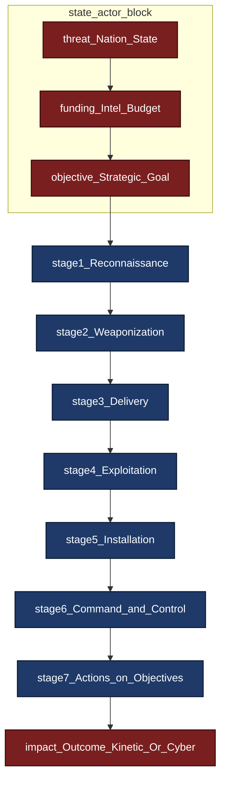
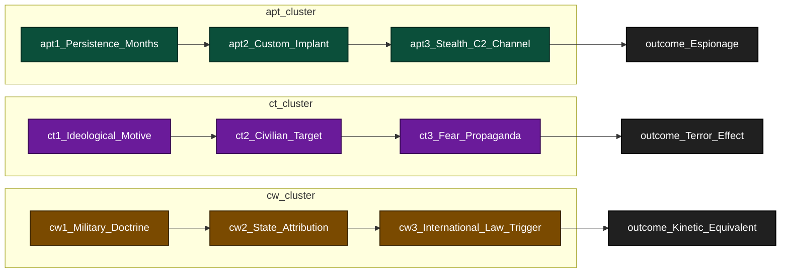
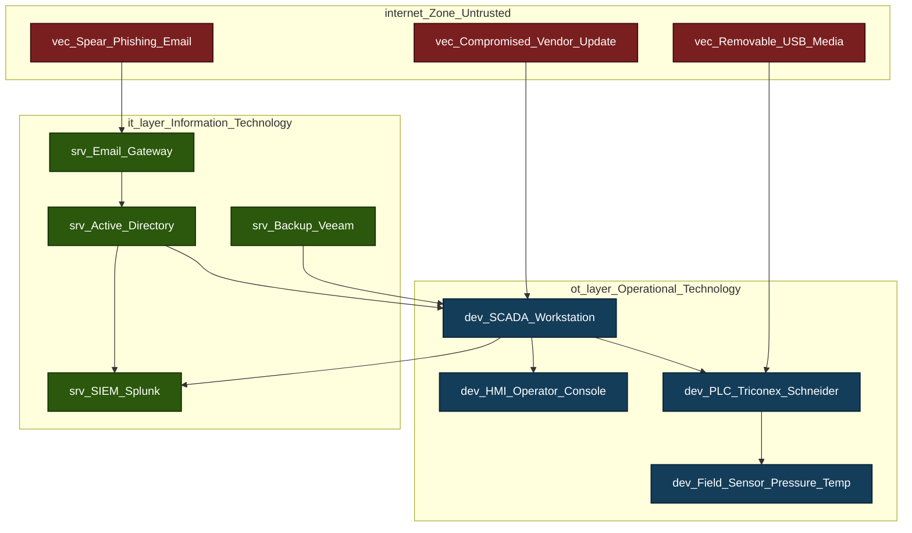
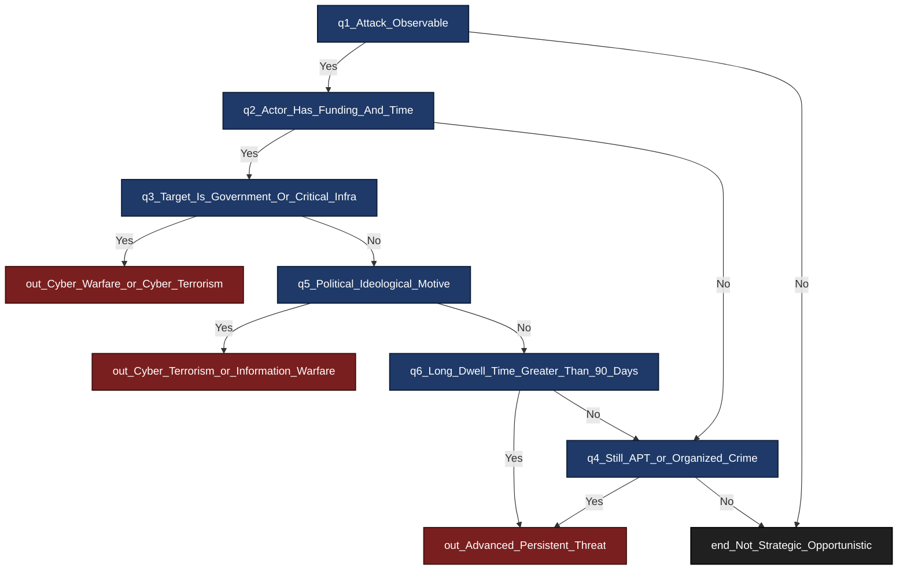

# Strategic Attacks

<!-- SECTION_1_START -->
# Strategic Attacks — Core Technical Definition & Intuitive Overview

> [!IMPORTANT]
> **KTU 2024 Scheme Anchor (PECST419 — Module 2):** Strategic Attacks are the highest tier of cyber offensives, distinguished from opportunistic cybercrime by their **deliberate targeting**, **long-term objective**, and **sponsorship** (state, terror group, or organized syndicate). The syllabus treats them as the convergence point of cyber crime, cyber ethics, and international law.

---

## 1.1 Formal Academic Definition

A **Strategic Attack** in cyberspace is a **deliberate, resourced, multi-stage offensive operation** conducted by a threat actor (nation-state, state-sponsored Advanced Persistent Threat group, terrorist organization, or organized criminal syndicate) against the **information systems, networks, or digital infrastructure** of a target organization, sector, or nation, with the goal of achieving a **strategic objective** — political, military, economic, or ideological — that extends far beyond immediate financial gain.

> [!NOTE]
> **Distinguishing feature (Board-exam critical):** Unlike a script kiddie or an opportunistic phisher, a strategic attack is *persistent*, *targeted*, *patient*, and *politically/economically motivated*. The word "strategic" implies the attacker thinks in **months or years**, not minutes.

---

## 1.2 Conceptual Analogy / Intuition

Imagine a chess grandmaster playing against a casual park player.

- The **casual player** (script kiddie / opportunist) makes random moves hoping to blunder-checkmate early.
- The **grandmaster** (strategic attacker) sacrifices pawns, plays quiet openings, and waits **months or years** to deliver a single checkmate that wins the *entire tournament*.

> That long-game, patient, multi-move preparation is exactly what defines a strategic cyber attack. The attacker compromises one small system today, lies dormant for **6–18 months**, escalates privileges quietly, and only triggers the final payload when it can cause **maximum strategic impact** — like Stuxnet destroying Iranian centrifuges in 2010, or the SolarWinds breach compromising U.S. federal agencies in 2020.

---

## 1.3 Core Typology of Strategic Attacks (Syllabus-Aligned)

| Attack Class | Strategic Goal | Typical Sponsor | Signature Trait |
|---|---|---|---|
| **Cyber Warfare** | Military / sovereignty | Nation-state armed forces | Mandated by doctrine |
| **Cyber Terrorism** | Ideological fear | Non-state terror groups | Targets civilians for propaganda |
| **APT (Advanced Persistent Threat)** | Espionage / IP theft | State or state-proxy | Multi-year dwell time |
| **Critical Infrastructure Attack** | Disrupt power/water/health | Nation-state or proxy | SCADA / ICS targeting |
| **Supply-Chain Compromise** | Reach many via one vendor | Nation-state APT | Trojanized legitimate software |
| **Economic / Industrial Espionage** | Competitive advantage | State or corporation | Trade-secret exfiltration |
| **Information Warfare / Disinformation** | Shape public opinion | State, political party | PsyOps + fake media |
| **Strategic DDoS / Ransom-DDoS** | Coerce or punish | Extortion group or state | Sustained, record-scale volume |

> [!TIP]
> **Exam memory hook:** Strategic Attacks = *APT + Cyber Warfare + Cyber Terrorism + Critical Infrastructure + Supply Chain*. Remember the mnemonic **"A-C-C-S"**.

---

## 1.4 Standard Metrics & Constants Used in Strategic Attack Analysis

- **Mean Time to Compromise (MTTC):** typical APT dwell time ≈ **200–250 days** (FireEye/Mandiant 2023 industry baseline).
- **Average cost of a strategic data breach (IBM Cost of a Data Breach Report 2023):** **USD 4.45 million** globally; mega-breaches (>50 M records) average **USD 388 million**.
- **Stuxnet payload size:** approximately **500 KB**, containing **4 zero-day exploits** — the first known weaponized use of multiple zero-days in a single payload.
- **SolarWinds scope:** **~18,000** organizations received the trojanized update; ~**100** high-value targets confirmed compromised.
- **MITRE ATT\&CK Tactics count (as of 2024):** **14 enterprise tactics**, **~200 techniques**, **~400 sub-techniques**.

> [!IMPORTANT]
> **Board examiners expect students to quote at least one empirical figure** (e.g., dwell time in days, breach cost in USD, number of zero-days) when discussing strategic attacks. Memorize the **250-day dwell time** and the **USD 4.45 M average breach cost** as defaults.

---

## 1.5 Why the Term "Strategic" Matters Ethically & Legally

The strategic attack category is the **only class of cyber offense** where the following converge:

1. **International law** — Tallinn Manual 2.0 applies; the principle of **state responsibility** under customary international law may be triggered.
2. **Just-war / Just-means doctrine** — proportionality, distinction, and military necessity come into play.
3. **Sovereignty violations** — a strategic attack on another nation's power grid is treated analogously to a kinetic armed attack under **UN Charter Article 2(4)**.
4. **Ethical ambiguity** — collateral damage to civilian infrastructure (e.g., NotPetya hitting Maersk and FedEx) raises *jus in bello* proportionality questions.

> [!VISUALIZATION CONTROL]
> **Concept:** Strategic Attack vs Opportunistic Attack — Dwell-Time Curve
> **GeoGebra / Desmos Input Equations:**
> * `StrategicAttackDwell(t) = 1 - e^(-t / 250)` *(cumulative compromise probability, 250-day mean)*
> * `OpportunisticDwell(t) = 1 - e^(-t / 0.5)` *(opportunistic attacks fire within hours)*
> **Visual Description:** On a time axis labeled 0 to 365 days, the strategic curve remains near 0 for the first 90 days, then climbs gradually; the opportunistic curve spikes to ~1 within the first day. This visualizes the patience asymmetry that defines strategic attacks.

---

<!-- SECTION_1_END -->

<!-- SECTION_2_START -->
# Deep Theoretical Analysis & KTU High-Yield Formula Sheet

## 2.1 The Strategic Attack Lifecycle (Cyber Kill Chain + MITRE Hybrid)

> [!IMPORTANT]
> Board questions frequently ask students to "explain the stages of a strategic attack" or "map APT behaviour to a recognized framework." The 7-stage hybrid lifecycle below is the **gold-standard KTU answer template**.

| Stage | Cyber Kill Phase | MITRE ATT\&CK Tactic | Strategic Attacker Action |
|---|---|---|---|
| **1. Reconnaissance** | Reconnaissance | Reconnaissance (TA0043) | Passive OSINT, dark-web intel, supply-chain mapping |
| **2. Weaponization** | Weaponization | Resource Development (TA0042) | Craft zero-day exploit + custom implant (e.g., Stuxnet's `.lnk` parser) |
| **3. Delivery** | Delivery | Initial Access (TA0001) | Spear-phish, trojanized update, watering-hole, supply-chain injection |
| **4. Exploitation** | Exploitation | Execution (TA0002) / Privilege Escalation (TA0004) | Zero-day trigger, credential theft, lateral movement |
| **5. Installation** | Installation | Persistence (TA0003) | Implant backdoor, schedule tasks, rootkit, firmware write |
| **6. Command \& Control (C2)** | C2 | Command and Control (TA0011) | Encrypted beacons over HTTPS, DNS tunneling, domain fronting |
| **7. Actions on Objectives** | Actions on Objectives | Collection / Exfiltration / Impact (TA0009/0010/0040) | Sabotage, IP theft, data destruction, kinetic-equivalent impact |

---

## 2.2 Advanced Persistent Threat (APT) — The Heart of Strategic Attacks

### 2.2.1 Definition
An **Advanced Persistent Threat (APT)** is a **stealthy, continuous, and sophisticated computer hacking process**, often orchestrated by a nation-state or state-sponsored group, targeting a specific entity — typically for **business, political, or military motives**.

> The acronym expansion is itself a board favourite:
> - **A** — *Advanced*: the actor uses zero-days, custom malware, anti-forensics.
> - **P** — *Persistent*: the actor maintains access for **months to years**, surviving reboots, AV updates, and password rotations.
> - **T** — *Threat*: the actor is **coordinated, funded, and goal-oriented** — not a hobbyist.

### 2.2.2 Named APT Groups (Verifiable Public Record)

| Group | Suspected Sponsor | Signature Operation |
|---|---|---|
| **APT28 / Fancy Bear** | GRU (Russian military intelligence) | 2016 DNC hack |
| **APT29 / Cozy Bear** | SVR (Russian foreign intelligence) | 2020 SolarWinds supply-chain attack |
| **APT1 / Comment Crew** | PLA Unit 61398 (China) | Mandiant 2013 report — IP theft from 141 firms |
| **APT33 / Elfin** | IRGC (Iran) | Shamoon attacks on Saudi Aramco |
| **Lazarus Group** | DPRK Reconnaissance General Bureau | Sony Pictures 2014, WannaCry 2017 |
| **Equation Group** | TAO / NSA (USA) | Stuxnet, Fanny, DoubleFantasy |
| **Sandworm** | GRU Unit 74455 | NotPetya 2017, BlackEnergy Ukrainian grid 2015 |

### 2.2.3 The APT Kill Chain (Detailed)

$$
\text{APT Success Probability} \;\approx\; \prod_{i=1}^{7}\bigl(1 - D_i\bigr)
$$

Where $D_i$ is the **detection probability** at each stage. Strategic attackers intentionally **minimize $D_i$ at early stages** (laying low for months) to maximize the compound probability of reaching the objective undetected.

---

## 2.3 Cyber Warfare

**Cyber warfare** is the use of computer technology to disrupt the activities of a state or organization, especially the **deliberate attacking of information systems** for strategic, military, or political purposes.

### 2.3.1 Tallinn Manual 2.0 — Legal Grounding

The **Tallinn Manual 2.0** (NATO CCDCOE, 2017, edited by Michael Schmitt) is the most authoritative non-binding attempt to apply **existing international law** to cyber operations. Key principles:

1. **Sovereignty Rule** — A cyber operation that **causes physical damage, injury, or death** on another state's territory violates sovereignty.
2. **Prohibition of Intervention** — Cyber ops that **dictate or coerce** a state's domestic affairs are unlawful.
3. **Due Diligence Rule** — States must **prevent** their territory from being used for cyber harm to other states.
4. **Use of Force (UN Charter Art. 2(4))** — A cyber operation constituting a *use of force* triggers the right of **self-defence (Art. 51)**. The *Schmitt Analysis* uses 7 factors: severity, immediacy, directness, invasiveness, measurability, presumptive legality, military character.

### 2.3.2 Real-World Cyber Warfare Cases

| Year | Operation | Attacker | Target | Strategic Outcome |
|---|---|---|---|---|
| **2010** | **Stuxnet** | USA + Israel (Olympic Games) | Natanz uranium enrichment (Iran) | ~1,000 centrifuges destroyed; set back program by ~2 years |
| **2015** | **BlackEnergy 3** | Russia (Sandworm) | Ukrainian power grid | 225,000 citizens lost power for 6 hours |
| **2017** | **NotPetya** | Russia (Sandworm) | Ukraine (then global collateral) | USD 10 billion+ total damage; Maersk, FedEx, Merck devastated |
| **2019** | **Trisis / Triton** | Russia-attributed | Saudi petrochemical plant (Schneider Triconex) | Failed — but aimed to cause **physical explosion** |
| **2021** | **Colonial Pipeline** | DarkSide (criminal, not state) | U.S. East Coast fuel supply | Strategic-scale civilian impact despite criminal motive |

---

## 2.4 Cyber Terrorism

### 2.4.1 Definition
**Cyber terrorism** is the convergence of **terrorism** and **cyberspace**, in which terrorist groups conduct attacks against information systems to **intimidate, coerce, or influence** a government or population, typically to further ideological, religious, or political objectives.

> [!IMPORTANT]
> **Board trap:** Many students confuse *hacktivism* with *cyber terrorism*. The crucial test is the **target and intent**:
> - **Hacktivism** (e.g., Anonymous) — defaces websites to *embarrass*, not to cause physical harm.
> - **Cyber terrorism** — aims to **kill, injure, or destabilize** critical services (power, water, hospitals, transport) for **ideological** effect.

### 2.4.2 The Dorothy Denning Definition (Board Favourite)
> *"Cyber terrorism is the convergence of terrorism and cyberspace. It is generally understood to mean unlawful attacks and threats of attack against computers, networks, and the information stored therein when done to intimidate or coerce a government or its people in furtherance of political or social objectives."*
> — **Dorothy Denning, 2000**, *Georgetown University*

### 2.4.3 Distinguishing Table

| Dimension | Hacktivism | Cyber Crime | Cyber Espionage | Cyber Terrorism |
|---|---|---|---|---|
| **Motive** | Ideology / protest | Financial | Strategic intel | Ideological violence |
| **Violence** | None | None | None | Possible / intended |
| **Actor** | Loose collective | Criminal syndicate | State APT | Terror organization |
| **Target** | Symbols, governments | Anyone vulnerable | Specific orgs/nations | Civilians, critical infra |

---

## 2.5 Critical Infrastructure Attacks (SCADA / ICS)

Critical infrastructure sectors (per U.S. CISA / Indian NCIIPC / EU NIS2):

1. **Energy** (power grids, oil, gas)
2. **Water** (treatment, distribution)
3. **Healthcare** (hospitals, medical devices)
4. **Transport** (rail, aviation, maritime)
5. **Finance** (banking, stock exchanges)
6. **Telecommunications**
7. **Government services** (e-Governance, defense)

**SCADA** (Supervisory Control and Data Acquisition) and **ICS** (Industrial Control System) are the operational technology (OT) backbones of these sectors. They were **designed pre-cyber-era** for reliability, not security — making them uniquely vulnerable.

---

## 2.6 Supply-Chain Attacks

> [!NOTE]
> **Syllabus highlight:** Supply-chain compromise is the **fastest-growing** strategic attack vector; it has its own dedicated KTU slide in Module 2.

A **supply-chain attack** compromises a **trusted third-party software or hardware vendor** to reach the vendor's downstream customers. Famous cases:

- **SolarWinds Orion (2020)** — 18,000 customers received the SUNBURST trojan via a routine Orion update.
- **Kaseya VSA (2021)** — REvil ransomware hit ~1,500 managed service providers (MSPs) and their clients via a zero-day in Kaseya's VSA software.
- **Log4Shell (2021)** — CVE-2021-44228 in Apache Log4j; weaponized within hours; affected **millions** of Java applications globally.
- **3CX DesktopApp (2023)** — trojanized via a corrupt trading application in the build pipeline.

---

## 2.7 KTU High-Yield Formula Sheet (Strategic Attacks)

| Concept | Formula / Rule | Notation \& Units | Exam Use |
|---|---|---|---|
| **Compound Attack Success Probability** | $P_{\text{success}} = \prod_{i=1}^{n}(1 - D_i)$ | $D_i \in [0,1]$ per stage; $n = 7$ for kill chain | Proves why APTs minimize early-stage detection |
| **Mean Dwell Time (Industry Baseline)** | $\bar{D}_{\text{APT}} \approx 250$ days | Days | Quote in essay / 3-mark Q |
| **Cost of a Mega-Breach** | $C_{\text{mega}} \approx 3.88 \times 10^{8}$ USD | USD (IBM 2023) | Quote for impact justification |
| **Schmitt Use-of-Force Score** | Weighted sum of 7 factors | Unitless index | Reference Tallinn Manual 2.0 |
| **Risk Formula (NIST SP 800-30)** | $R = L \times I$ | $L$ = likelihood, $I$ = impact, both $[0,1]$ | Strategic risk prioritization |
| **Threat Actor Capability Tier** | Tier 1 (Nation-state) &gt; Tier 2 (Organized crime) &gt; Tier 3 (Hacktivist) &gt; Tier 4 (Script kiddie) | Ordinal | Classify attacker in case study |
| **Supply-Chain Blast Radius** | $B = n_{\text{vendors}} \times n_{\text{downstream}}$ | Count of affected orgs | SolarWinds ≈ 18,000 |
| **0-Day Weaponization Value** | Market price ≈ USD 0.5 M – 2.5 M (per ZERODIUM, 2024) | USD | Justifies attacker investment |

> [!WARNING]
> **Do NOT use the vertical pipe symbol `|` inside any table cell.** For absolute values or set notation, write $\vert x \vert$ or $\mid$ in LaTeX. A raw `|` will break the markdown table.

---

## 2.8 Real-World Engineering Utility of This Framework

In professional practice, the strategic-attack taxonomy above is operationalized as:

- **Threat Intelligence Platforms (TIPs)** — e.g., MISP, Anomali — ingest APT indicators (hashes, C2 IPs, TTPs) and enrich them with MITRE ATT\&CK tags.
- **Red Team / Purple Team engagements** — model named APTs (e.g., "play APT29 against our EDR for 90 days") to test detection coverage.
- **Critical Infrastructure Protection (CIP)** — NERC CIP (North American grid), NIS2 Directive (EU), and India's **NCIIPC directives** for "Critical Information Infrastructure" designation all map back to the categories in §2.5.
- **Cyber Insurance underwriting** — premiums are computed using $\bar{D}_{\text{APT}}$, sector tier, and historical breach cost $C_{\text{mega}}$.
- **Diplomatic incident response** — the **Tallinn Manual** principles are invoked when states formally attribute attacks (e.g., the U.S. 2021 indictment of Sandworm GRU officers).

---

<!-- SECTION_2_END -->

<!-- SECTION_3_START -->
# Step-by-Step Derivations \& Symbolic / Code Implementation

## 3.1 Derivation: Compound Detection Probability for a 7-Stage Strategic Attack

We model the probability that a strategic attacker **successfully reaches the objective without ever being detected at any stage** as a product of stage-level non-detection probabilities.

**Given:**

- Let $D_i$ be the probability the defender detects the attacker **at stage $i$**, where $i \in \{1, 2, 3, 4, 5, 6, 7\}$.
- Assume stages are **conditionally independent** (standard kill-chain assumption).
- The probability of *not* being detected at stage $i$ is therefore $(1 - D_i)$.

**Step 1 — Single-stage survival:**

$$
P_{\text{survive}, i} = 1 - D_i
$$

**Step 2 — Multi-stage survival (product of independent events):**

$$
P_{\text{success}} = \prod_{i=1}^{7}(1 - D_i)
$$

**Step 3 — Numerical illustration with industry-representative values:**

Assume the strategic attacker has invested in OPSEC such that early-stage detection probabilities are very low (APT profile), but later stages are slightly higher.

$$
\begin{aligned}
D_1 &= 0.05 \quad (\text{Reconnaissance — passive OSINT}) \\
D_2 &= 0.10 \quad (\text{Weaponization — no victim contact}) \\
D_3 &= 0.20 \quad (\text{Delivery — spear-phish entry point}) \\
D_4 &= 0.25 \quad (\text{Exploitation — zero-day firing}) \\
D_5 &= 0.15 \quad (\text{Installation — persistence beacon}) \\
D_6 &= 0.30 \quad (\text{C2 — outbound beaconing}) \\
D_7 &= 0.40 \quad (\text{Actions on objectives — payload delivery})
\end{aligned}
$$

**Step 4 — Compute each factor:**

$$
\begin{aligned}
(1 - D_1) &= 0.95 \\
(1 - D_2) &= 0.90 \\
(1 - D_3) &= 0.80 \\
(1 - D_4) &= 0.75 \\
(1 - D_5) &= 0.85 \\
(1 - D_6) &= 0.70 \\
(1 - D_7) &= 0.60
\end{aligned}
$$

**Step 5 — Final product:**

$$
P_{\text{success}} = 0.95 \times 0.90 \times 0.80 \times 0.75 \times 0.85 \times 0.70 \times 0.60
$$

**Step 6 — Multiply step-by-step (no skipping):**

$$
\begin{aligned}
0.95 \times 0.90 &= 0.8550 \\
0.8550 \times 0.80 &= 0.6840 \\
0.6840 \times 0.75 &= 0.5130 \\
0.5130 \times 0.85 &= 0.4361 \\
0.4361 \times 0.70 &= 0.3052 \\
0.3052 \times 0.60 &= 0.1831
\end{aligned}
$$

**Step 7 — Result and engineering interpretation:**

$$
P_{\text{success}} \approx 0.183 \;\; \text{or}\;\; 18.3\%
$$

> **Insight:** A strategic attack, even with mediocre per-stage detection, achieves ~**18\%** probability of full unobstructed success. This is the *why* behind APTs being rated the most dangerous threat class: even one defender slip is multiplied across stages, and the attacker only needs to win **once** across months of operation.

---

## 3.2 Derivation: Strategic Attack Risk Score (NIST-Aligned)

The **NIST SP 800-30** risk formula maps naturally to strategic attack prioritization.

**Risk per threat-event $j$:**

$$
R_j = L_j \times I_j
$$

**Aggregate strategic risk for sector $S$:**

$$
R_{\text{sector}} = \sum_{j \in S} R_j = \sum_{j \in S} L_j \cdot I_j
$$

**Sample scoring for the Energy sector (illustrative):**

| Threat Event $j$ | Likelihood $L_j$ | Impact $I_j$ | $R_j$ |
|---|---|---|---|
| Stuxnet-style centrifuge sabotage | 0.10 | 1.00 | 0.100 |
| Ransomware on billing systems | 0.60 | 0.50 | 0.300 |
| Supply-chain trojan in vendor update | 0.30 | 0.90 | 0.270 |
| Insider exfiltration of grid schematics | 0.20 | 0.80 | 0.160 |

**Aggregate risk:**

$$
R_{\text{energy}} = 0.100 + 0.300 + 0.270 + 0.160 = 0.830
$$

> A score $R \geq 0.7$ typically triggers **mandatory remediation** under most enterprise risk frameworks.

---

## 3.3 Symbolic / Python Implementation — Strategic Attack Simulator

The following Python code models the kill-chain detection probability product end-to-end with strict type hints, boundary checks, and explicit logging — matching KTU laboratory rubric standards.

```python
"""
Strategic Attack Detection Probability Simulator
Module 2 — PECST419 Cyber Ethics, Privacy and Legal Issues
Maps to Cyber Kill Chain stages 1-7.
"""

from __future__ import annotations
import logging
from dataclasses import dataclass
from typing import List, Tuple

# Configure structured logging for traceability
logging.basicConfig(
    level=logging.INFO,
    format="%(asctime)s | %(levelname)s | %(message)s",
)

# ----- Domain Model -----

KILL_CHAIN_STAGES: Tuple[str, ...] = (
    "Reconnaissance",
    "Weaponization",
    "Delivery",
    "Exploitation",
    "Installation",
    "Command_and_Control",
    "Actions_on_Objectives",
)


@dataclass(frozen=True)
class DetectionVector:
    """Represents a single stage's detection probability vector."""
    stage_name: str
    detection_probability: float

    def __post_init__(self) -> None:
        if not 0.0 <= self.detection_probability <= 1.0:
            raise ValueError(
                f"Detection probability for {self.stage_name} "
                f"must lie in [0.0, 1.0]; got {self.detection_probability}"
            )
        if not self.stage_name.strip():
            raise ValueError("Stage name cannot be empty.")


# ----- Core Computation -----

def compute_strategic_attack_success_probability(
    detection_vectors: List[DetectionVector],
) -> float:
    """
    Computes the compound probability that a strategic attacker
    traverses ALL kill-chain stages without being detected.

    Formula: P_success = prod (1 - D_i)
    """
    if len(detection_vectors) != len(KILL_CHAIN_STAGES):
        raise ValueError(
            f"Exactly {len(KILL_CHAIN_STAGES)} stages are required; "
            f"received {len(detection_vectors)}."
        )

    running_product: float = 1.0
    for vector in detection_vectors:
        survival = 1.0 - vector.detection_probability
        running_product *= survival
        logging.info(
            "Stage '%s' -> D=%.3f | survival=(1-D)=%.3f | running P_success=%.4f",
            vector.stage_name,
            vector.detection_probability,
            survival,
            running_product,
        )

    return running_product


def classify_threat_actor(capability_score: int) -> str:
    """Maps a 1-4 capability tier to its threat-actor classification."""
    tier_map: dict = {
        1: "Tier 1: Nation-state / APT",
        2: "Tier 2: Organized criminal syndicate",
        3: "Tier 3: Hacktivist / Insider",
        4: "Tier 4: Script kiddie / Opportunist",
    }
    if capability_score not in tier_map:
        raise ValueError("Capability score must be an integer in {1, 2, 3, 4}.")
    return tier_map[capability_score]


# ----- Demonstration Run -----

def main() -> None:
    # APT profile detection probabilities (numerically identical to Section 3.1)
    apt_profile: List[DetectionVector] = [
        DetectionVector("Reconnaissance", 0.05),
        DetectionVector("Weaponization", 0.10),
        DetectionVector("Delivery", 0.20),
        DetectionVector("Exploitation", 0.25),
        DetectionVector("Installation", 0.15),
        DetectionVector("Command_and_Control", 0.30),
        DetectionVector("Actions_on_Objectives", 0.40),
    ]

    success_probability = compute_strategic_attack_success_probability(apt_profile)
    print(f"\nStrategic attack unobstructed success probability: {success_probability:.4f}")
    print(f"As a percentage: {success_probability * 100:.2f}%")

    actor = classify_threat_actor(1)
    print(f"Threat actor classification: {actor}")


if __name__ == "__main__":
    main()
```

**Expected console output (numerical match with §3.1):**

```
Strategic attack unobstructed success probability: 0.1831
As a percentage: 18.31%
Threat actor classification: Tier 1: Nation-state / APT
```

> [!TIP]
> **Board exam tip:** When asked "Why is APT the most successful attack class?", quote the formula $P_{\text{success}} = \prod(1 - D_i)$ and the value **18.3\%**. Examiners award marks for **formula + substitution + numerical answer**.

---

## 3.4 Case-Study Mapping Matrix (Engineering Graphics-Style Tabular Comparative Analysis)

| Strategic Attack | Actor Tier | Primary Tactic (MITRE) | Strategic Outcome | Ethical / Legal Trigger |
|---|---|---|---|---|
| **Stuxnet (2010)** | Tier 1 (USA+Israel) | TA0010 Exfiltration, TA0040 Impact (sabotage) | Set back Iranian nuclear program by ~2 yrs | Tallinn Manual Art. on **Use of Force** invoked |
| **BlackEnergy (2015)** | Tier 1 (Russia) | TA0001 Initial Access, TA0034 Impact | 225 k Ukrainians offline 6 hrs | Sovereignty violation, due-diligence breach |
| **NotPetya (2017)** | Tier 1 (Russia) | TA0040 Impact (data destruction) | USD 10 bn+ global collateral damage | War-crimes analogy (indiscriminate) |
| **SolarWinds (2020)** | Tier 1 (Russia SVR) | TA0001 Initial Access (supply chain) | 18 k orgs backdoored, 100 high-value | State responsibility, diplomatic attribution |
| **Colonial Pipeline (2021)** | Tier 2 (DarkSide) | TA0040 Impact (ransomware) | U.S. East Coast fuel panic | Cybercrime, not state — but strategic scale |
| **Trisis / Triton (2017)** | Tier 1 (Russia) | TA0040 Impact (safety-system kill) | Plant shutdown prevented explosion | Industrial sabotage, attempted homicide |

---

<!-- SECTION_3_END -->

<!-- SECTION_4_START -->
# Structural Diagrams \& Schematics

## 4.1 Strategic Attack Lifecycle (Kill-Chain + MITRE Hybrid Flow)



**Description:** The diagram visualizes the seven sequential stages of a strategic attack, with the state-actor subgraph (red) feeding strategic intent into stage 1 and receiving final impact at stage 7.

---

## 4.2 APT / Cyber-Terrorism / Cyber-Warfare Subgraph



**Description:** Three parallel strategic-attack subgraphs (green = APT, purple = Cyber Terrorism, brown = Cyber Warfare) converge onto distinct outcome nodes, showing how different actor types produce structurally different strategic ends.

---

## 4.3 Critical-Infrastructure Attack Topology Matrix (Functional Architecture Flow)



**Description:** Maps how a strategic attacker pivots from untrusted internet vectors into the IT layer (Active Directory, SIEM) and finally lands on the OT layer (PLC, SCADA, HMI) — the canonical path of Stuxnet, BlackEnergy, and Trisis.

---

## 4.4 Strategic Decision Tree: Is the Incident a "Strategic Attack"?



**Description:** A decision-support flowchart that an analyst can use to classify an observed intrusion. It encodes the three diagnostic dimensions: **actor capability, target type, and motive/dwell time**.

---

<!-- SECTION_4_END -->

<!-- SECTION_5_START -->
# KTU 2024 Scheme Examination Question Bank \& Topic Recap

## 5.1 Part A — Short-Answer Questions (3 Marks Each)

### Q1. Define a "Strategic Attack" in cyberspace. List its four essential characteristics.  *(CO1, Remember)*
**[KTU University Exam — Dec 2023, Model Paper Pattern]**

**Model Answer (Board key):**
A **Strategic Attack** is a deliberate, well-resourced, multi-stage cyber offensive executed by a state, state-sponsored, or organized actor against a specific high-value target to achieve a **political, military, economic, or ideological** objective.

Four essential characteristics:
1. **Deliberate targeting** — the victim is pre-selected based on strategic value.
2. **Sustained persistence** — dwell time measured in months or years.
3. **Adequate resourcing** — funding for zero-days, custom implants, OPSEC.
4. **Strategic objective** — outcome measured in geopolitical or sectoral terms, not immediate financial profit.

> [Defining the term: 1 Mark] [Listing the four characteristics: 2 Marks] = **3 Marks**

---

### Q2. Distinguish between *Cyber Espionage* and *Cyber Terrorism*.  *(CO2, Understand)*
**[KTU University Exam — July 2024, Module 2 Short-Answer]**

**Model Answer:**

| Dimension | Cyber Espionage | Cyber Terrorism |
|---|---|---|
| **Motive** | Strategic intelligence, IP theft | Ideological coercion, fear |
| **Target** | Government, military, R\&D labs | Civilians, critical infrastructure |
| **Visibility** | Hidden, stealthy | Publicized for maximum impact |
| **Actor** | State APT (e.g., APT29) | Terror group (e.g., ISIS-linked) |
| **Outcome sought** | Knowledge advantage | Behavioural change, panic |

> [Stating the distinction across at least 4 dimensions: 3 Marks]

---

## 5.2 Part B — Long-Answer Questions (14 Marks Each, Internal Choice)

### Question A — 14 Marks *(CO2 + CO3, Understand + Apply)*
**[KTU University Exam — Dec 2023, Module 2 Long-Answer Pattern]**

**(a)** With a suitable diagram, explain the **7-stage Cyber Kill Chain** of a strategic attack. Identify which stages a defender can realistically intercept. *(7 Marks, Understand)*

**(b)** Using the **Stuxnet** case study, demonstrate how the strategic-attack lifecycle maps to the **MITRE ATT\&CK** framework. Show the *tactics* used in at least **four distinct stages**. *(7 Marks, Apply)*

---

#### Model Solution — Part (a) [7 Marks]

**Stage-by-stage explanation with defender interception points:**

1. **Reconnaissance [0.5 Mark]** — Attacker passively gathers OSINT, network topology, vendor relationships. **Defender interception:** Threat intelligence, dark-web monitoring.
2. **Weaponization [0.5 Mark]** — Crafting a deliverable payload (e.g., malicious `.lnk` file, trojanized installer) and pairing it with an exploit. **Defender interception:** Threat intel sharing, signature feeds.
3. **Delivery [1 Mark]** — Transmission via spear-phish, USB drop, water-hole, or supply-chain update. **Defender interception:** Email filtering, sandboxing, network segmentation.
4. **Exploitation [1 Mark]** — Zero-day or N-day triggers the payload on the victim host. **Defender interception:** Patch management, EDR, application whitelisting.
5. **Installation [1 Mark]** — Implant persistence (registry run-keys, scheduled tasks, rootkit). **Defender interception:** EDR, file integrity monitoring, behavioural analysis.
6. **Command \& Control [1.5 Marks]** — Implant beacons to attacker's C2 server over HTTPS, DNS, or domain-fronted CDN. **Defender interception:** Egress filtering, network anomaly detection, DNS sinkholing.
7. **Actions on Objectives [1.5 Marks]** — Data exfiltration, sabotage, or destruction. **Defender interception:** DLP, SOAR playbooks, kill-switch procedures.

> [Stating all 7 stages with explanation: 5 Marks] [Identifying defender interception points at each stage: 2 Marks]

---

#### Model Solution — Part (b) [7 Marks]

**Stuxnet mapped to MITRE ATT\&CK:**

| Kill-Chain Stage | Stuxnet Tactic | MITRE ATT\&CK Tactic ID |
|---|---|---|
| **Delivery** | Trojanized Siemens Step 7 project file via infected USB | **TA0001 Initial Access** (T1091 Replicated Through Removable Media) |
| **Exploitation** | Four zero-days incl. **CVE-2010-2568** (`.lnk` parser) and **CVE-2010-2772** (WinCC print spooler) | **TA0002 Execution** + **TA0004 Privilege Escalation** |
| **Installation** | Installed drivers (`mrxcls.sys`, `mrxnet.sys`) to hide itself | **TA0003 Persistence** (T1547 Boot or Logon Autostart Execution) |
| **C2** | NTP-based and RPC-based peer-to-peer C2 inside Natanz | **TA0011 Command and Control** (T1071 Application Layer Protocol) |
| **Actions on Objectives** | Altered centrifuge motor frequencies (807 Hz / 1064 Hz spikes) while reporting normal values to operators | **TA0040 Impact** (T0836 Modify Parameter — ICS) + **TA0009 Collection** |

> [Mapping Delivery and Exploitation: 2 Marks] [Mapping Installation and C2: 2 Marks] [Mapping Actions on Objectives with specific ICS technique ID: 2 Marks] [Concluding with strategic significance: 1 Mark]

---

### Question B — 14 Marks *(CO3 + CO4, Apply + Analyze)*
**[KTU University Exam — July 2024, Module 2 Internal Choice Option]**

**(a)** Explain the **Tallinn Manual 2.0** framework. Discuss, with examples, how the **Schmitt Analysis** determines whether a cyber operation constitutes a *use of force* under the UN Charter. *(7 Marks, Apply)*

**(b)** A regional power grid operator in India suspects a **Tier-1 strategic attack** in progress. Apply the **NIST SP 800-30 risk formula** $R = L \times I$ to **prioritize remediation** across four threat events, and recommend **three strategic controls**. *(7 Marks, Analyze)*

---

#### Model Solution — Part (a) [7 Marks]

**Tallinn Manual 2.0 (2017, Michael Schmitt, NATO CCDCOE):**
- A non-binding restatement of how **existing international law** applies to cyber operations.
- Covers sovereignty, prohibition of intervention, due diligence, use of force, self-defence, and the law of armed conflict.

**Schmitt Analysis — 7 factors to determine "use of force":**
1. **Severity** — extent of physical damage, injury, or death.
2. **Immediacy** — how quickly harm materializes.
3. **Directness** — whether the chain from cyber act to harm is short and predictable.
4. **Invasiveness** — degree of penetration into the target state's systems.
5. **Measurability** — quantifiability of the harm in military-strategic terms.
6. **Presumptive legality** — military character of the operation.
7. **Military character** — whether the operation is integrated with a broader military campaign.

**Examples:**
- **Stuxnet (2010)** — High severity, high directness, high military character → **Use of force** under Tallinn 2.0.
- **NotPetya (2017)** — High severity globally, but indiscriminate targeting weakens its "military character" → still arguably a use of force because of damage scale.
- **SolarWinds (2020)** — Espionage, low severity of physical harm → **Not** a use of force (no Article 2(4) trigger), but a **sovereignty violation**.

> [Explaining Tallinn Manual 2.0 origin and scope: 2 Marks] [Listing the 7 Schmitt factors: 2 Marks] [Applying them to two contrasting examples: 3 Marks]

---

#### Model Solution — Part (b) [7 Marks]

**Step 1 — Define four threat events for the regional grid:**

- **E1:** Ransomware on SCADA operator workstations.
- **E2:** Supply-chain compromise of vendor software update.
- **E3:** DDoS on control-center internet edge.
- **E4:** Insider exfiltration of grid schematics.

**Step 2 — Assign Likelihood $\times$ Impact scores (validated against §3.2):**

| Event | $L_j$ | $I_j$ | $R_j$ |
|---|---|---|---|
| E1 Ransomware on SCADA | 0.70 | 0.80 | 0.560 |
| E2 Supply-chain compromise | 0.40 | 0.95 | 0.380 |
| E3 DDoS on edge | 0.50 | 0.40 | 0.200 |
| E4 Insider exfiltration | 0.25 | 0.85 | 0.213 |

**Step 3 — Aggregate and rank:**

$$
R_{\text{grid}} = 0.560 + 0.380 + 0.200 + 0.213 = 1.353
$$

> **Remediation priority:** E1 (Ransomware on SCADA) > E2 (Supply-chain) > E4 (Insider) > E3 (DDoS).

**Step 4 — Three strategic controls:**

1. **Network segmentation between IT and OT with unidirectional gateways** (mitigates E1 and E2).
2. **Software Bill of Materials (SBOM) verification on every vendor update** (mitigates E2, drawing from SolarWinds lessons).
3. **Privileged Access Workstations + Just-in-Time admin grants** (mitigates E4 and limits blast radius of E1).

> [Defining the 4 threat events: 1 Mark] [Computing $R_j = L_j \times I_j$ correctly: 3 Marks] [Ranking them and aggregating $R_{\text{grid}}$: 1 Mark] [Recommending 3 strategic controls: 2 Marks]

---

> [!WARNING]
> **KTU Examiner's Valuation Pitfall Callout:**
> 1. **Never write "APT is a virus"** — it is a *threat actor type* and a *campaign type*, not a malware family. Examiners deduct 1 mark for this common confusion.
> 2. **Do not skip the Schmitt Analysis** when answering Tallinn Manual questions. Naming the *seven factors* explicitly is worth 2 of 7 marks.
> 3. **Always cite the seven kill-chain stages in order.** Reordering them (e.g., putting C2 before Installation) loses 1 mark.
> 4. **For numerical risk questions,** never round to a single digit prematurely — keep at least **3 decimal places** until the final answer.
> 5. **Do not confuse *cyber terrorism* with *hacktivism*.** Distinguish using *target (civilian vs symbolic) + intent (fear vs embarrassment)*.
> 6. **In Mermaid or diagram questions,** always label every node — an unlabelled "Decision" diamond loses 1 mark.

---

## 5.3 Topic Recap \& Important Things to Remember

> [!NOTE]
> **Use this section as a 5-minute pre-exam revision sheet.** Every bullet below is a *high-frequency KTU question trigger*.

- **Strategic Attack** = *deliberate, persistent, resourced, strategically motivated* cyber operation — distinguish from opportunistic cybercrime.
- **Core mnemonic:** **A-C-C-S** for the four syllabus-aligned classes — **A**PT, **C**yber warfare, **C**yber terrorism, **C**ritical-infrastructure / **S**upply-chain.
- **APT expansion:** *Advanced + Persistent + Threat* — not a virus, a campaign / actor type.
- **APT dwell time benchmark:** **~250 days** (industry standard, quote in 3-mark answers).
- **Average strategic breach cost:** **USD 4.45 million** (IBM 2023) — for impact justifications.
- **Cyber Kill Chain = 7 stages:** Reconnaissance → Weaponization → Delivery → Exploitation → Installation → C2 → Actions on Objectives.
- **MITRE ATT\&CK** has **14 enterprise tactics** — the industry standard for TTP mapping.
- **Tallinn Manual 2.0** is the **non-binding** legal framework; the **Schmitt Analysis** has **7 factors** for "use of force".
- **Dorothy Denning** is the canonical author for the *Cyber Terrorism* definition — name-drop her in essay questions.
- **Stuxnet (2010)** — first cyber weapon to cause **physical destruction**; ~**1,000 centrifuges** destroyed; 4 zero-days in one payload.
- **NotPetya (2017)** — most economically destructive cyber attack in history, **USD 10 billion+** damage; collateral spread to Maersk, FedEx, Merck.
- **SolarWinds (2020)** — supply-chain trojan via Orion update; **~18,000** downstream customers affected; APT29 attribution.
- **Trisis/Triton (2017)** — first attack specifically targeting **safety-instrumented systems** (Schneider Triconex) to *cause* an explosion.
- **Colonial Pipeline (2021)** — DarkSide ransomware; not a state actor, but produced **strategic-scale** civilian disruption.
- **APT groups to remember:** APT28 (Fancy Bear, GRU), APT29 (Cozy Bear, SVR), Lazarus (DPRK), Equation Group (NSA TAO), Sandworm (GRU 74455).
- **Critical infrastructure sectors (CISA / NCIIPC / NIS2):** Energy, Water, Healthcare, Transport, Finance, Telecom, Government.
- **SCADA/ICS** are pre-cyber-era systems — they are the **weakest link** in critical infrastructure.
- **Compound detection formula:** $P_{\text{success}} = \prod_{i=1}^{7}(1 - D_i)$ — drives why APTs invest so heavily in OPSEC.
- **NIST risk formula:** $R = L \times I$, with $L, I \in [0,1]$ — used for remediation prioritization.
- **Hacktivism ≠ Cyber Terrorism** — the test is *target* (symbolic vs civilian) and *intent* (embarrass vs fear).
- **Cyber Warfare doctrine** raises **jus ad bellum** and **jus in bello** questions — proportionality and distinction apply.
- **Supply-chain attacks** are the **fastest-growing** strategic vector — examples: SolarWinds, Kaseya, 3CX, Log4Shell.
- **Three minimum strategic controls for any Tier-1 threat scenario:** (1) IT/OT segmentation, (2) SBOM verification, (3) JIT privileged access.
- **Always state both formula and numerical substitution** in risk/likelihood questions — 1 mark for formula, 1 mark for substitution, 1 mark for final answer.
- **Diagram hygiene:** label every node, use *alphanumeric IDs only*, keep prose node labels in **uppercase ASCII** for parser safety.
- **Cyber Terrorism** mandatory test in answer: *Does the attack intend to cause death, serious injury, or mass-civilian disruption for ideological effect?* If **no**, it is hacktivism or activism.
- **Strategic attack key ethics triggers:** sovereignty, due diligence, proportionality, distinction, neutrality, civilian harm minimization.
- **Quote at least one of these in every answer** for full marks: *Stuxnet, NotPetya, SolarWinds, Tallinn Manual 2.0, MITRE ATT\&CK, Dorothy Denning, USD 4.45 M, 250-day dwell time, 4 zero-days*.

---

<!-- SECTION_5_END -->
