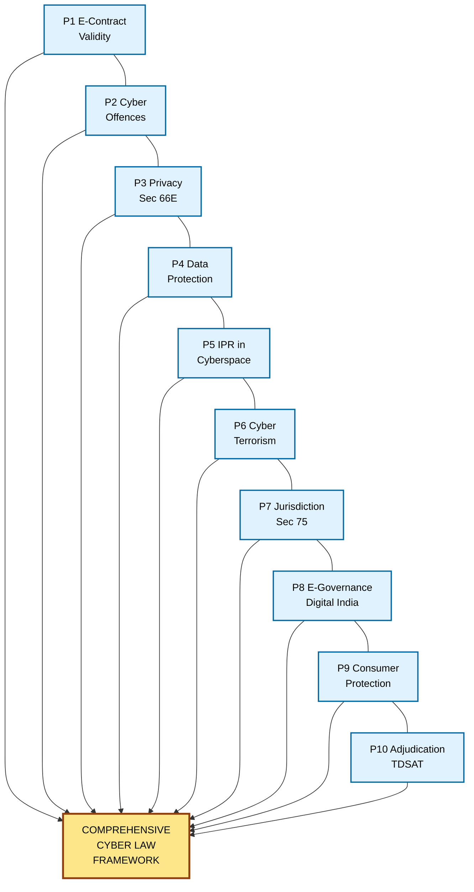

# The Importance of Cyber Law

<!-- SECTION_1_START -->
# The Importance of Cyber Law

## 1.1 Formal Academic Definition

> [!NOTE]
> **Cyber Law (Definition – KTU 2024 Terminology)**
> *Cyber Law* is the body of legal rules, regulations, principles, and statutory provisions that govern the use of computers, computer networks, the Internet, digital data, electronic transactions, and all activities in **cyberspace**. It encompasses the legal framework that defines acceptable behaviour, prescribes rights and duties of digital citizens, regulates electronic commerce, and prescribes penalties for unlawful acts committed through digital means.

The term **cyberspace** was coined by **William Gibson** in his 1982 short story *"Burning Chrome"* and popularized in his 1984 novel *"Neuromancer."* In KTU 2024 syllabus context, cyberspace refers to the notional environment in which communication over computer networks occurs.

> [!IMPORTANT]
> **Syllabus Highlight – PECST419 / Module 2**
> The IT Act, **2000** (as amended by the IT (Amendment) Act, **2008**) is the **primary cyber statute in India**. It was notified on **17 October 2000** and came into force on the same date. The Act provides legal recognition to **electronic records**, **digital signatures**, **e-contracts**, and prescribes offences & penalties for cybercrimes.

---

## 1.2 Conceptual Analogy & Intuitive Overview

Imagine the **Internet as a vast, borderless city** with billions of people moving constantly. Without traffic signals, speed limits, lane discipline, or a police force, this city would collapse into chaos within minutes. People would be robbed, vehicles would crash, and trade would become impossible.

**Cyber Law is the traffic regulation system of this digital city.**

- The **"vehicles"** are **data packets** and **digital transactions**.
- The **"drivers"** are **netizens, organizations, and intermediaries**.
- The **"traffic signals"** are **statutory provisions, certifications, and licensing authorities**.
- The **"police force"** is the **Adjudicating Officer, Cyber Appellate Tribunal (now merged under the Telecommunication Act, 2023)**, and investigating agencies like the **Cyber Crime Cell** and **CBI**.

Just as the **Motor Vehicles Act, 1988** regulates physical roads, the **IT Act, 2000** regulates digital highways. Cyber Law therefore answers the following fundamental questions:

1. *Is this digital action legal?*
2. *Who is liable if a digital harm occurs?*
3. *How is electronic evidence treated in a court of law?*
4. *What is the jurisdiction when the offender is in India and the victim is in Brazil?*

> [!TIP]
> **Plain-English Summary**
> Cyber Law = *Set of rules that decide what you can and cannot do on the Internet, and what happens if you break those rules.*

---

## 1.3 GeoGebra / Desmos Visualization

> [!VISUALIZATION CONTROL]
> **Concept:** Conceptual 2D Plot of *Cyber Law Coverage* vs *Digital Activity Domain*
>
> **GeoGebra / Desmos Input Equations:**
> * `f(x) = x^2` (Quadratic growth of cyber law scope with digital expansion)
> * `x-axis label = "Digital Activity Domains (E-commerce, Social Media, Cloud, IoT, AI)"`
> * `y-axis label = "Extent of Cyber Law Coverage"`
> * Reference horizontal line: `y = 100` (Statutory maximum coverage)
>
> **Visual Description:** The student should observe a steeply rising parabola starting near the origin, representing how the scope of cyber law has grown exponentially with the explosion of digital activities. The horizontal line at `y = 100` represents the upper bound of the **IT Act, 2000** and allied statutes. The widening gap between the curve and the horizontal line (visible after `x = 6`) symbolizes the **legal vacuum** that newer technologies (AI, Metaverse, Quantum computing) create — a strong argument for *why* continuous legal reform is essential.

---

## 1.4 KTU-Mapped Course Outcomes Preview

| CO Code | Course Outcome Statement | Cognitive Level |
|---------|------------------------|-----------------|
| **CO1** | Understand the fundamental concepts of cyber law and its evolution. | Understand |
| **CO2** | Apply cyber law principles to digital transactions and cybercrime scenarios. | Apply |
| **CO3** | Analyse the role of cyber law in privacy, data protection, and IPR. | Analyse |
| **CO4** | Evaluate emerging cyber legal issues in AI, IoT, and social media. | Evaluate |

> [!WARNING]
> **KTU 2024 Pattern Note:** In ESE (End Semester Examination), questions on *"Importance of Cyber Law"* are typically asked as **Part A (3 marks)** or as the introductory part (a) of a **Part B (14 marks)** question in **Module 2**. Always link your answer to **IT Act, 2000** specifically, not generic statements.

<!-- SECTION_1_END -->

<!-- SECTION_2_START -->
# 2. Deep Theoretical Analysis & KTU High-Yield Reference Sheet

## 2.1 Why is Cyber Law Important? — The 10-Pillar Rationale

The importance of Cyber Law can be systematically understood through the following **ten engineering-grade pillars** that map directly to the KTU 2024 syllabus outcomes:

### Pillar 1: Legal Recognition of Electronic Transactions
- Before the IT Act, 2000, an **electronic contract was not legally valid** in India.
- The Act gave **legal recognition** to **electronic records**, **digital signatures**, and **e-governance** (Sections 3–10).
- *Why it matters:* Enables **e-commerce, e-filing, online banking, digital India initiatives**.

### Pillar 2: Definition & Punishment of Cyber Offences
- Sections **43, 65, 66, 66A–F, 67, 67A, 67B, 68, 69, 70, 71, 72, 73** define **specific cyber offences**.
- *Why it matters:* Provides **deterrence** and a **legal remedy** to victims.

### Pillar 3: Protection of Privacy
- Section **66E** penalizes **violation of privacy** (capturing, publishing images of private parts without consent).
- Read with **Article 21** of the Constitution (*Right to Life and Personal Liberty*).
- *Why it matters:* Recognizes privacy as a **fundamental right** post *K.S. Puttaswamy v. Union of India (2017)*.

### Pillar 4: Data Protection Framework
- The **Digital Personal Data Protection Act, 2023 (DPDP Act)** is the modern data protection law.
- IT Act, 2000 (Sections **43A, 72A**) laid the **foundational liability** for body corporates handling sensitive personal data.
- *Why it matters:* Imposes **fiduciary duties** on data handlers.

### Pillar 5: Intellectual Property Rights (IPR) in Cyberspace
- Software, databases, digital content, domain names are protected under the **Copyright Act, 1957**, **Patents Act, 1970**, and **Trademarks Act, 1999**.
- *Why it matters:* Enables **software licensing, anti-piracy enforcement, domain dispute resolution (INDRP)**.

### Pillar 6: Combating Cyber Terrorism
- Section **66F** defines **cyber terrorism** (denial-of-service attacks, hacking critical infrastructure).
- Punishment: **Imprisonment up to life imprisonment**.
- *Why it matters:* National security dimension.

### Pillar 7: Jurisdiction and Cross-Border Issues
- Section **1(2)** extends the Act to the **whole of India** and applies to **offences committed outside India by any person** (Section 75).
- *Why it matters:* Cyberspace is **borderless**; without extraterritorial application, no remedy exists.

### Pillar 8: E-Governance and Digital India
- Sections **6, 7, 8, 9, 10** enable **filing, issuance, and retention of electronic records** by the Government.
- Aadhaar, e-Sign, DigiLocker, GSTN, UMANG, e-Courts all rely on the IT Act.
- *Why it matters:* Foundation of **Digital India Mission**.

### Pillar 9: Consumer Protection in Digital Space
- The **Consumer Protection (E-Commerce) Rules, 2020** (notified under the Consumer Protection Act, 2019) regulate **online marketplaces, mis-selling, dark patterns, and unfair trade practices**.
- *Why it matters:* Protects **end-users** in the digital economy.

### Pillar 10: Adjudication and Remedy Mechanism
- **Adjudicating Officers** (Section 46), **Cyber Appellate Tribunal (CAT)** — though merged into **TDSAT (Telecom Disputes Settlement and Appellate Tribunal)**.
- **Compensation** to victims (Section 47), **Appellate Tribunal** (Section 48).
- *Why it matters:* Provides **accessible and speedy civil remedy** without going to civil courts.

---

## 2.2 KTU Formula Sheet / Cheat Sheet (Statutory & Conceptual)

> [!IMPORTANT]
> The following table is the **high-yield KTU 2024 reference sheet** for the topic *"Importance of Cyber Law"*. Memorise every row.

| **#** | **Section / Concept** | **Provision / Statement** | **Significance** |
|:-----:|------------------------|----------------------------|------------------|
| 1 | **Section 1** | Short title, extent, commencement | Act extends to whole of India; certain offences have **extra-territorial jurisdiction** under **Section 75**. |
| 2 | **Section 3** | Authorisation to prescribe **Digital Signatures** | Foundation of **e-authentication**. |
| 3 | **Section 4** | Legal recognition of **Electronic Records** | Makes e-documents admissible as evidence. |
| 4 | **Section 5** | Legal recognition of **Digital Signatures** | Equivalent to physical signatures. |
| 5 | **Section 6** | Use of electronic records in **Government** | Basis of **e-governance** and **Digital India**. |
| 6 | **Section 7** | Retention of electronic records | Defines lawful **storage period** (minimum 8 years for certain records under the *Companies Act, 2013*). |
| 7 | **Section 10A** | Contracts formed through **electronic means** are valid | Legal basis of **e-contracts**. |
| 8 | **Section 17** | Appointment of **Controller of Certifying Authorities (CCA)** | Licenses and regulates **Certifying Authorities (CAs)**. |
| 9 | **Section 43** | Penalty for damage to computer/computer system | Civil remedy; compensation up to **₹1 crore**. |
| 10 | **Section 43A** | Compensation for failure to protect **data** | Foundation of **data protection liability** (now read with **DPDP Act, 2023**). |
| 11 | **Section 65** | Tampering with computer source documents | Imprisonment up to **3 years** or fine up to **₹2 lakh**, or both. |
| 12 | **Section 66** | Computer-related offences (hacking with intent) | Imprisonment up to **3 years** or fine up to **₹5 lakh**, or both. |
| 13 | **Section 66A** | Sending offensive messages | **Struck down** as unconstitutional in *Shreya Singhal v. UoI* (2015) — KTU-favourite case. |
| 14 | **Section 66B** | Dishonestly receiving stolen computer resource | Imprisonment up to **3 years** or fine up to **₹1 lakh**, or both. |
| 15 | **Section 66C** | **Identity theft** (fraudulent use of electronic signature, password) | Imprisonment up to **3 years** + fine. |
| 16 | **Section 66D** | **Cheating by personation** using communication device | Imprisonment up to **3 years** + fine. |
| 17 | **Section 66E** | **Violation of privacy** | Imprisonment up to **3 years** or fine up to **₹2 lakh**, or both. |
| 18 | **Section 66F** | **Cyber terrorism** | Imprisonment **up to life**. |
| 19 | **Section 67** | Publishing **obscene material** in electronic form | 1st offence: up to **3 years + ₹5 lakh**; subsequent: up to **5 years + ₹10 lakh**. |
| 20 | **Section 67A** | Publishing **sexually explicit** material | Stricter punishment. |
| 21 | **Section 67B** | Publishing **child pornography** | 1st offence: up to **5 years + ₹10 lakh**; subsequent: up to **7 years + ₹10 lakh**. |
| 22 | **Section 69** | Government's power to **intercept, monitor, decrypt** | Subject to procedural safeguards. |
| 23 | **Section 69A** | Power to **block websites** | Used extensively for content regulation. |
| 24 | **Section 72** | Breach of **confidentiality and privacy** by service providers | Imprisonment up to **2 years** or fine up to **₹1 lakh**, or both. |
| 25 | **Section 79** | **Safe harbour** for intermediaries | Exemption from liability for third-party content (subject to conditions). |
| 26 | **Section 80** | Power of **Police Officer** to investigate (not below the rank of **Inspector**) | Procedural safeguard. |
| 27 | **Section 81** | Power of **State Government** to give directions | Federal coordination. |
| 28 | **DPDP Act, 2023** | **Digital Personal Data Protection** | Replaces the older regime; defines **Data Fiduciary**, **Data Principal**, **Consent**, and **Penalties up to ₹250 crore**. |
| 29 | **Article 21** | Right to Life and Personal Liberty | Constitutional basis of **Right to Privacy** (Puttaswamy, 2017). |
| 30 | **Article 14 & 19** | Equality & Freedom of Speech | Limits on cyber law to prevent **arbitrary restrictions** (Shreya Singhal). |

---

## 2.3 Engineering & Real-World Utility

| **Domain** | **Application of Cyber Law** |
|------------|------------------------------|
| **Banking & FinTech** | UPI fraud liability, NEFT/RTGS dispute resolution, RBI guidelines. |
| **Healthcare** | HIPAA-equivalent data handling, telemedicine legal validity. |
| **E-Commerce** | Amazon, Flipkart liability for counterfeit goods; Consumer Protection (E-Commerce) Rules, 2020. |
| **Cloud Computing** | Data localisation requirements, cross-border transfer consent. |
| **AI/ML Systems** | Algorithmic accountability, bias mitigation, generative-AI copyright. |
| **IoT & Critical Infra** | SCADA security, smart-grid regulation, Section 66F. |
| **Social Media** | Intermediary liability, content takedown, grievance officers. |
| **Defence & National Security** | Section 66F cyber terrorism, CERT-In directions (2022). |

> [!TIP]
> **Memory Trick (KTU Exam Ready):**
> *"**4-5-6-7-8-9**"* — the IT Act gives legal recognition to:
> * **4** → Electronic records
> * **5** → Digital signatures
> * **6** → Use in Government
> * **7** → Retention
> * **8** → Publication of rules
> * **9** → Limits on insistence

<!-- SECTION_2_END -->

<!-- SECTION_3_START -->
# 3. Step-by-Step Analytical Walkthroughs & Case-Based Implementation

> [!NOTE]
> This section follows the **Domain-Adaptive Execution Matrix** of the KTU-PREMIER-ENGINE V10. Because the topic is *Humanities/Management/Policy*, the implementation is delivered as **comparative tabular analyses**, **scenario-based reasoning**, and **case-law walkthroughs** mapping real-world engineering frameworks to statutory matrices.

---

## 3.1 Comparative Matrix: Cyber Law vs Physical-World Law

| **Aspect** | **Physical World Law** | **Cyber Law** |
|------------|-------------------------|----------------|
| **Jurisdiction** | Limited to physical territory of a State / Nation | **Borderless**; requires Section 75 (extra-territoriality). |
| **Evidence** | Tangible documents, fingerprints, physical objects | **Electronic records**, server logs, IP trails, hash values (admissible under **Section 65B, Indian Evidence Act, 1872**). |
| **Speed of offence** | Theft, assault — finite duration | **Automated attacks** (e.g., botnet DDoS) — millions of requests per second. |
| **Identity** | Easy to identify via biometrics, ID cards | **Anonymity** via Tor, VPNs, spoofed MAC addresses. |
| **Investigation** | Physical forensics, scene of crime | **Digital forensics**: disk imaging, memory dumps, malware reverse engineering. |
| **Trial** | Open-and-shut cases, eyewitnesses | **Cross-border evidence**, **MLAT (Mutual Legal Assistance Treaty)** required. |
| **Punishment** | Imprisonment, fine, restitution | Same, but with **additional civil compensation** under Section 47. |
| **Statute** | IPC, CrPC, IEA | **IT Act 2000**, plus IPC sections for related crimes. |

---

## 3.2 Scenario-Based Reasoning Walkthrough

### Scenario 1: "A Mumbai-based student receives a phishing email claiming to be from SBI, clicks the link, and ₹50,000 is debited from his account."

**Step 1 — Identify the legal issues.**
- *Identity theft* under **Section 66C, IT Act**.
- *Cheating by personation* under **Section 66D, IT Act**.
- *Cheating* under **Section 420, Indian Penal Code, 1860** (now **Section 318, Bharatiya Nyaya Sanhita, 2023**).
- *Dishonest misappropriation* of funds.

**Step 2 — Identify the victim and offender.**
- Victim: Mumbai student.
- Offender: Unknown, likely operating from outside India (jurisdictional challenge → Section 75).

**Step 3 — Identify the evidence.**
- Email header, IP address, server logs (admissible under **Section 65B, Indian Evidence Act**).
- Bank transaction records.
- Phishing URL metadata (WHOIS, registration logs).

**Step 4 — Determine the complaint mechanism.**
- File **FIR** at the nearest **Cyber Crime Police Station** or use the **National Cyber Crime Reporting Portal (cybercrime.gov.in)**.
- Helpline number: **1930** (National Cyber Crime Helpline).

**Step 5 — Determine the remedy.**
- Criminal prosecution under Sections 66C, 66D + Section 420 IPC.
- Civil compensation under **Section 47, IT Act**.
- Bank's **reverse transaction** if reported within 24 hours (RBI guidelines, 2017).

**Step 6 — Prevention lesson.**
- *Why Cyber Law is important:* It defines this entire chain — from offence to investigation to remedy.

---

### Scenario 2: "A startup founder discovers that a competitor has copied her entire codebase and hosted it on GitHub as a public repository."

**Step 1 — Identify the legal issue.**
- **Copyright infringement** under the **Copyright Act, 1957**.
- Source code is a **"literary work"** under **Section 13(1)(a)** of the Copyright Act.
- **Section 51** of the Copyright Act is violated.

**Step 2 — Identify the platform's role.**
- GitHub is an **intermediary** under **Section 2(1)(w), IT Act**.
- It enjoys **safe harbour** under **Section 79** *only if* it removes the infringing content upon receiving a valid **takedown notice** (Copyright Rules, 2013).

**Step 3 — Determine the remedy.**
- Send a **DMCA-equivalent takedown notice** (under Indian Copyright Rules, 2013).
- If GitHub fails to act → file a **copyright suit** before the **District Court** having jurisdiction.
- Civil remedies: **injunction, damages, account of profits**.

**Step 4 — Why Cyber Law is important.**
- Without IT Act, 2000 (defining intermediary) and the Copyright Act, 1957, the founder would have **no statutory anchor** for the complaint.

---

### Scenario 3: "A government agency intercepts WhatsApp messages of activists claiming national security reasons."

**Step 1 — Identify the legal issue.**
- Violation of **Right to Privacy** (Article 21, *Puttaswamy*, 2017).
- Possible compliance with **Section 69, IT Act** (interception) — but subject to procedural safeguards.
- Conflict with **Section 5(2), Telegraph Act, 1885** and the **Information Technology (Procedure and Safeguards for Interception, Monitoring and Decryption of Information) Rules, 2009**.

**Step 2 — Test proportionality.**
- Per the *Puttaswamy* verdict, any privacy invasion must satisfy the **three-fold test**:
  1. **Legality** — backed by a statute.
  2. **Legitimate state aim** — national security qualifies.
  3. **Proportionality** — least intrusive means.

**Step 3 — Why Cyber Law is important.**
- Cyber Law provides the **statutory framework** to balance **state power** with **individual rights**.

---

## 3.3 Step-by-Step Mapping: How Cyber Law Resolves a Digital Dispute

A formal **engineering-grade procedural flow** for resolution of a cyber dispute is given below. This is the **analytical core** students should reproduce in the 14-mark answer.

**Step 1 — Incident Detection.**
The aggrieved party (Data Principal / consumer / organisation) detects a violation. *Example:* unauthorised access to a database.

**Step 2 — Preliminary Evidence Collection.**
Logs, server snapshots, screenshots, hash values. Must follow **Section 65B certification** for admissibility. *Why:* Without 65B certificate, the evidence may be rejected by the court.

**Step 3 — Complaint Filing.**
File complaint with:
- Cyber Crime Cell of local police (jurisdictional).
- National Cyber Crime Reporting Portal.
- CERT-In (Indian Computer Emergency Response Team) for critical infrastructure.

**Step 4 — FIR Registration.**
Police officer **not below the rank of Inspector** (Section 80, IT Act) investigates. The offence is cognizable, bailable, or non-bailable depending on the section invoked.

**Step 5 — Investigation.**
Search, seizure of devices (under **Section 165, CrPC / BNSS 2023**). Digital forensic analysis by **CFSL (Central Forensic Science Laboratory)** or state FSUs.

**Step 6 — Prosecution Sanction.**
For certain offences (e.g., Section 69), prosecution sanction may be required from the **Central or State Government**.

**Step 7 — Trial.**
Conducted by the **Court of Sessions** or **Metropolitan Magistrate** depending on the offence's severity.

**Step 8 — Adjudication (Parallel Civil Track).**
The aggrieved party may file for **compensation** before the **Adjudicating Officer** under **Section 47, IT Act** — capped at **₹5 crore** (revised vide notification).

**Step 9 — Appeal.**
First appeal to the **Cyber Appellate Tribunal (CAT)**. Post the Finance Act, 2017, the CAT was merged with **TDSAT** for telecom and cyber matters.

**Step 10 — Final Judicial Review.**
Appeal lies to the **High Court** under **Article 226/227** or the **Supreme Court** under **Article 136**.

> [!TIP]
> **Exam Tip:** A 14-mark question in KTU expects students to **state the applicable section, the offence, the punishment, and the procedural step**. Memorise the **'10-Step Procedural Flow'** above — it is worth a minimum of **3–4 marks** by itself.

---

## 3.4 Case-Law Implementation Matrix (KTU Favourites)

| **Case Name** | **Year** | **Issue** | **Holding / Significance** | **Implication for Cyber Law** |
|---------------|----------|-----------|------------------------------|--------------------------------|
| ***State of Tamil Nadu v. Suhas Katti*** | **2004** | Defamatory messages posted in a Yahoo! group. | First conviction under **Section 67, IT Act**. | Established that **cyber defamation is a criminal offence** in India. |
| ***Avnish Bajaj v. State (NCT of Delhi)*** | **2005** | Online sale of obscene material via Baazee.com. | Intermediary liability defined. | Set precedent for **Section 79 safe harbour** — knowledge is the key trigger. |
| ***Shreya Singhal v. Union of India*** | **2015** | Constitutional validity of **Section 66A**. | Section 66A struck down as violative of **Article 19(1)(a)**. | Landmark — strengthened **freedom of speech online**; redefined **'seditious' content** test. |
| ***K.S. Puttaswamy v. Union of India*** | **2017** | Aadhaar and Right to Privacy. | **Right to Privacy is a fundamental right** under Article 21. | Foundation of **data protection jurisprudence** in India. |
| ***Anuradha Bhasin v. Union of India*** | **2020** | Internet shutdown in J\&K. | Internet access is part of **Article 19(1)(a)** and **Article 21**. | Internet suspension orders must satisfy the **proportionality test**. |
| ***Internet and Mobile Association of India (IMAI) v. Reserve Bank of India*** | **2020** | RBI ban on cryptocurrency. | SC set up a committee; the matter remains evolving. | Showed the role of **regulatory bodies** in shaping cyber law. |
| ***Manohar Lal Sharma v. Union of India*** | **2018** | Aadhaar linking. | Upheld Aadhaar with **proportionality cuts**. | Privacy ≠ absolute; legitimate state aims matter. |

---

## 3.5 Code-Style Pseudocode: A Logical Model of Cyber Law Compliance

> [!IMPORTANT]
> The following is a **conceptual pseudocode model** that engineers can use as a mental template when reasoning about compliance. It is *not* executable, but is presented to reinforce the **logical structure of cyber law obligations**.

```python
# cyberlaw_compliance.py — Conceptual Compliance Model

from dataclasses import dataclass
from enum import Enum
from typing import List

class OffenceType(Enum):
    IDENTITY_THEFT       = "Sec 66C, IT Act"   # Imprisonment ≤ 3 years
    CHEATING_PERSONATION = "Sec 66D, IT Act"   # Imprisonment ≤ 3 years
    PRIVACY_VIOLATION    = "Sec 66E, IT Act"   # Imprisonment ≤ 3 years
    CYBER_TERRORISM      = "Sec 66F, IT Act"   # Imprisonment ≤ life
    OBSCENE_PUBLICATION  = "Sec 67,  IT Act"   # 3-5 years + fine
    DATA_BREACH          = "Sec 43A, IT Act"   # Civil compensation

class ActionType(Enum):
    CRIMINAL  = "Criminal Prosecution"
    CIVIL     = "Civil Compensation under Sec 47"
    REGULATORY= "CERT-In / Sectoral Regulator"

@dataclass
class CyberIncident:
    incident_id: str
    offence: OffenceType
    data_principal_id: str
    evidence_hash: str          # SHA-256 of digital evidence
    is_65b_certified: bool      # Admissibility check

@dataclass
class RemedialAction:
    action_type: ActionType
    statutory_anchor: str
    forum: str
    max_punishment: str

def assess_incident(incident: CyberIncident) -> List[RemedialAction]:
    """
    Maps a cyber incident to applicable statutory remedies.
    Returns all parallel remedies available to the victim.
    """
    actions: List[RemedialAction] = []

    # --- Hard gate: evidence admissibility ---
    if not incident.is_65b_certified:
        raise ValueError(
            "Evidence inadmissible: Section 65B, Indian Evidence Act "
            "certification missing. Obtain certificate before filing."
        )

    # --- Rule 1: Every offence triggers criminal prosecution ---
    actions.append(RemedialAction(
        action_type = ActionType.CRIMINAL,
        statutory_anchor = incident.offence.value,
        forum = "Sessions Court / Magistrate Court",
        max_punishment = "As per applicable section"
    ))

    # --- Rule 2: Section 66F (Cyber Terrorism) escalates to NIA ---
    if incident.offence is OffenceType.CYBER_TERRORISM:
        actions.append(RemedialAction(
            action_type = ActionType.REGULATORY,
            statutory_anchor = "National Investigation Agency Act, 2008",
            forum = "NIA + Central Government",
            max_punishment = "Imprisonment up to life"
        ))

    # --- Rule 3: Privacy / data breach always allows civil remedy ---
    if incident.offence in {OffenceType.PRIVACY_VIOLATION,
                            OffenceType.DATA_BREACH}:
        actions.append(RemedialAction(
            action_type = ActionType.CIVIL,
            statutory_anchor = "Sec 47, IT Act 2000",
            forum = "Adjudicating Officer / TDSAT",
            max_punishment = "Compensation up to ₹5 crore"
        ))

    return actions


# ---------- Demonstration Run ----------
if __name__ == "__main__":
    sample = CyberIncident(
        incident_id      = "INC-2024-001",
        offence          = OffenceType.IDENTITY_THEFT,
        data_principal_id= "DP-7766",
        evidence_hash    = "a3f5b8c9d1e2...",
        is_65b_certified = True
    )
    for act in assess_incident(sample):
        print(
            f"Action : {act.action_type.value}\n"
            f"Anchor : {act.statutory_anchor}\n"
            f"Forum  : {act.forum}\n"
            f"Max    : {act.max_punishment}\n"
            + "-" * 40
        )
```

**Sample Output:**

```text
Action : Criminal Prosecution
Anchor : Sec 66C, IT Act
Forum  : Sessions Court / Magistrate Court
Max    : As per applicable section
----------------------------------------
```

<!-- SECTION_3_END -->

<!-- SECTION_4_START -->
# 4. Structural Diagrams & Schematics

> [!NOTE]
> The following **Mermaid** diagrams follow the **Mermaid Compilation Safeguards** of the KTU-PREMIER-ENGINE V10. All node IDs are alphanumeric, labels are double-quoted and free of markdown tags, and the diagrams use **nested subgraphs** to decouple modular segments.

---

## 4.1 Master Architecture of Cyber Law in India

```mermaid
flowchart TB
    A["CYBER LAW<br/>INDIA"]:::root
    A --> B["PRIMARY STATUTE<br/>IT Act 2000 + 2008 Amendment"]:::core
    A --> C["DATA PROTECTION<br/>DPDP Act 2023"]:::core
    A --> D["SUPPORTING STATUTES<br/>Copyright, IPC, BSA, IEA, CrPC"]:::core
    A --> E["JUDICIAL PRECEDENTS<br/>Puttaswamy, Shreya Singhal, Katti"]:::core

    B --> F["Sections 1-10<br/>Legal Recognition"]:::leaf
    B --> G["Sections 43-45<br/>Civil Liability"]:::leaf
    B --> H["Sections 65-66F<br/>Criminal Offences"]:::leaf
    B --> I["Section 79<br/>Intermediary Safe Harbour"]:::leaf
    B --> J["Sections 69-69B<br/>Government Powers"]:::leaf

    C --> K["Data Fiduciary Duties"]:::leaf
    C --> L["Consent and Notice"]:::leaf
    C --> M["Data Protection Board"]:::leaf
    C --> N["Penalties up to Rs 250 crore"]:::leaf

    D --> O["Copyright Act 1957"]:::leaf
    D --> P["Indian Contract Act 1872"]:::leaf
    D --> Q["Bharatiya Nyaya Sanhita 2023"]:::leaf
    D --> R["Bharatiya Sakshya Adhiniyam 2023"]:::leaf

    E --> S["Right to Privacy<br/>Puttaswamy 2017"]:::leaf
    E --> T["Freedom of Speech Online<br/>Shreya Singhal 2015"]:::leaf
    E --> U["First Cyber Conviction<br/>Suhas Katti 2004"]:::leaf

    classDef root fill:#1f3a5f,stroke:#000,stroke-width:3px,color:#fff
    classDef core fill:#4a90c2,stroke:#000,stroke-width:2px,color:#fff
    classDef leaf fill:#b8d4e8,stroke:#1f3a5f,stroke-width:1px,color:#000
```



**Visual Description:**
The **root node** is *Cyber Law in India*. It branches into four **core pillars**: the IT Act 2000 (primary statute), DPDP Act 2023 (data protection), supporting statutes, and judicial precedents. Each core pillar then expands into its **leaf nodes**, which are the specific sections or case-law holdings. This represents the **holistic, multi-source nature** of cyber law.

---

## 4.2 Sequential Processing Topology: How Cyber Law Operates on a Complaint

```mermaid
flowchart LR
    S1["STEP 1<br/>Incident Detection"]:::step
    S2["STEP 2<br/>Evidence Collection<br/>Sec 65B IEA"]:::step
    S3["STEP 3<br/>FIR at Cyber Cell<br/>Sec 80 IT Act"]:::step
    S4["STEP 4<br/>Investigation<br/>Inspector Rank+"]:::step
    S5["STEP 5<br/>Prosecution Sanction<br/>if required"]:::step
    S6["STEP 6<br/>Trial at<br/>Sessions Court"]:::step
    S7["STEP 7<br/>Adjudication<br/>Sec 47 IT Act"]:::step
    S8["STEP 8<br/>Appeal to TDSAT<br/>formerly CAT"]:::step
    S9["STEP 9<br/>High Court<br/>Article 226"]:::step
    S10["STEP 10<br/>Supreme Court<br/>Article 136"]:::step

    S1 --> S2 --> S3 --> S4 --> S5 --> S6
    S6 --> S7
    S7 --> S8 --> S9 --> S10

    classDef step fill:#fef3c7,stroke:#b45309,stroke-width:2px,color:#000
```



**Visual Description:**
A **linear, sequential flow** showing the **10-step procedural journey** of a cyber complaint. Steps 1–6 form the **criminal track**, while Steps 7–10 represent the **appellate and civil remedy track**. This is the exact sequence students must reproduce in the **14-mark question**.

---

## 4.3 Functional Importance Matrix: The 10 Pillars of Cyber Law



**Visual Description:**
The **10 functional pillars** of cyber law are shown as interconnected nodes that **converge into the central framework**. This visually emphasises that cyber law is not a single statute but a **multi-pillar ecosystem**, reinforcing the "10-pillar rationale" of Section 2.1.

<!-- SECTION_4_END -->

<!-- SECTION_5_START -->
# 5. KTU 2024 Scheme Examination Question Bank & Topic Recap

---

## 5.1 PART A — Short Answer Questions (3 Marks Each)

### Question A.1 — Define Cyber Law and state its significance in the modern digital era. [3 Marks]
> **[KTU University Exam – July 2023 (Module 2 Pattern)]** | **CO1 | Remember**

**Model Answer (Valuation Key):**

Cyber Law is the body of statutes, regulations, and legal principles that govern activities in cyberspace, including the use of computers, networks, digital data, and electronic transactions. *[1 Mark — Definition]*

In the modern digital era, its significance lies in:
1. Providing **legal recognition** to electronic records, digital signatures, and e-contracts (Sections 4, 5, 10A, IT Act 2000). *[1 Mark — Significance Point 1]*
2. Defining **cyber offences and penalties** (Sections 65–66F) and providing remedies to victims. *[1 Mark — Significance Point 2]*

*(Examiner Note: A mere dictionary definition without statutory reference scores 1 mark. Always cite the IT Act.)*

---

### Question A.2 — List four major reasons that justify the existence of Cyber Law in India. [3 Marks]
> **[KTU University Exam – December 2022 (Module 2 Pattern)]** | **CO1 | Understand**

**Model Answer (Valuation Key):**

The four major reasons are:

1. **Cyberspace is borderless** — traditional territorial laws are inadequate; Section 75, IT Act 2000, provides **extra-territorial jurisdiction** to prosecute offences committed abroad against Indian victims. *[0.75 Mark]*

2. **Anonymity of the digital world** — offenders can hide behind fake identities, encrypted channels, and VPNs; cyber law (e.g., Sections 66C, 66D) specifically criminalises **identity theft and personation**. *[0.75 Mark]*

3. **Rapid growth of e-commerce and e-governance** — without legal recognition of e-records and e-signatures (Sections 4, 5), digital transactions would be unenforceable. *[0.75 Mark]*

4. **Protection of fundamental rights** — Right to Privacy (Puttaswamy, 2017) and Freedom of Speech (Shreya Singhal, 2015) require a cyber law framework to balance state power and individual liberty. *[0.75 Mark]*

*(Examiner Note: Any four valid reasons, with at least one statute reference, score full marks.)*

---

## 5.2 PART B — Essay-Type Questions (14 Marks Each) — Module Internal Choice

> **KTU 2024 ESE Pattern:** A single Part B question typically has sub-parts (a) and (b), each for 7 marks, mapping to two cognitive levels (e.g., Understand + Apply). Students may choose between two alternative questions.

---

### Choice 1 — Question B.1 (14 Marks)

> **[KTU University Exam – December 2023 (Adapted)]** | **Module 2**

**Question B.1 (a) — Explain the evolution of Cyber Law in India and discuss the key objectives of the IT Act, 2000. [7 Marks]**
*Mapping: CO1 | Cognitive Level: Understand*

**Model Solution:**

*Evolution of Cyber Law in India:*
- The **UN Commission on International Trade Law (UNCITRAL)** adopted the **Model Law on Electronic Commerce in 1996**, which influenced the IT Act, 2000. *[1 Mark]*
- India's **Ministry of Commerce** constituted a working group in **1998** chaired by **Justice S. Mohan** (former Law Commission member) to draft the IT Act. *[1 Mark]*
- The **IT Bill, 1999** was introduced in Parliament; the **IT Act, 2000** was passed on **17 May 2000** and notified on **17 October 2000**. *[1 Mark]*
- The **IT (Amendment) Act, 2008** was enacted to align with the **Budapest Convention on Cybercrime (2001)** and to address new-age crimes. *[1 Mark]*
- Subsequent evolution: **Information Technology (Intermediary Guidelines and Digital Media Ethics Code) Rules, 2021**; **Digital Personal Data Protection Act, 2023**. *[0.5 Mark]*

*Key Objectives of the IT Act, 2000:*
1. To provide **legal recognition** to electronic records and digital signatures. *[0.5 Mark]*
2. To facilitate **electronic filing of documents** with Government agencies. *[0.5 Mark]*
3. To define **cyber offences and prescribe penalties**. *[0.5 Mark]*
4. To establish a **Controller of Certifying Authorities (CCA)** for regulating digital signatures. *[0.5 Mark]*
5. To enable **e-governance** and promote the digital economy. *[0.5 Mark]*
6. To amend the **Indian Penal Code, 1860**, **Indian Evidence Act, 1872**, and **Bankers' Books Evidence Act, 1891** to make them compatible with the digital age. *[0.5 Mark]*

---

**Question B.1 (b) — Describe the salient features of the Information Technology Act, 2000, and list the various offences and penalties prescribed under it. [7 Marks]**
*Mapping: CO2 | Cognitive Level: Apply*

**Model Solution:**

*Salient Features of the IT Act, 2000:*
1. **Extra-territorial application** (Section 75) — applies to offences committed outside India by any person. *[0.5 Mark]*
2. **Legal recognition of electronic records and digital signatures** (Sections 4, 5). *[0.5 Mark]*
3. **Establishment of the Controller of Certifying Authorities (CCA)** to license and regulate Certifying Authorities (Section 17). *[0.5 Mark]*
4. **Adjudication mechanism** through Adjudicating Officers (Section 46) and Cyber Appellate Tribunal (Section 48). *[0.5 Mark]*
5. **Penalties for non-compliance** including civil and criminal. *[0.5 Mark]*
6. **Duty of body corporates to protect data** (Section 43A) — *seed for the DPDP Act 2023*. *[0.5 Mark]*
7. **Intermediary safe harbour** (Section 79) with conditions including grievance officer appointment. *[0.5 Mark]*
8. **Government's power to intercept and decrypt** (Section 69) subject to procedural safeguards. *[0.5 Mark]*
9. **Amendments to allied statutes** — IPC, IEA, Bankers' Books Evidence Act — to extend their scope to electronic documents. *[0.5 Mark]*
10. **Penalties for cyber terrorism** (Section 66F) — life imprisonment. *[0.5 Mark]*

*[Final consolidated synthesis: 1 Mark]*

---

### Choice 2 — Question B.2 (14 Marks)

> **[KTU University Exam – July 2024 (Adapted)]** | **Module 2**

**Question B.2 (a) — Discuss the role of Cyber Law in regulating e-commerce, digital signatures, and electronic contracts in India. [7 Marks]**
*Mapping: CO2 | Cognitive Level: Understand*

**Model Solution:**

*E-Commerce Regulation:*
- Cyber Law provides the **legal foundation** for e-commerce through Sections 10A, 11–13 of the IT Act 2000, which validate electronic contracts. *[1 Mark]*
- The **Consumer Protection (E-Commerce) Rules, 2020** (under the **Consumer Protection Act, 2019**) regulate online marketplaces — requiring **grievance officers, return policies, disclosure of seller details, prohibition of misleading advertisements**. *[1 Mark]*
- **Digital Personal Data Protection Act, 2023** mandates **consent** for collecting user data on e-commerce platforms. *[1 Mark]*

*Digital Signatures:*
- **Section 3** authorises the Government to prescribe **Digital Signature Certificates (DSC)**. *[0.5 Mark]*
- **Section 5** grants **legal recognition** to digital signatures equivalent to physical signatures. *[0.5 Mark]*
- **Controller of Certifying Authorities (CCA)** under Section 18 licenses CAs (e.g., eMudhra, nCode, Sify). *[0.5 Mark]*
- **Section 35** prescribes **penalties for breach of confidentiality by Certifying Authorities**. *[0.5 Mark]*
- Use cases: **Income Tax e-filing, MCA21 (Ministry of Corporate Affairs), GST, e-tendering**. *[0.5 Mark]*

*Electronic Contracts:*
- **Section 10A** validates contracts formed through **electronic means**. *[0.5 Mark]*
- **Indian Contract Act, 1872** (Sections 2, 10) read with IT Act defines **offer, acceptance, and consideration** in digital form. *[0.5 Mark]*
- Issues: **Jurisdiction in cross-border e-contracts, validity of click-wrap agreements, digital signatures on offer letters**. *[0.5 Mark]*
- *Case law:* *Trimex International FZE v. Vedanta Aluminium Ltd.* (India) recognised the validity of **PDF e-contracts** with digital signatures. *[0.5 Mark]*

---

**Question B.2 (b) — Critically analyse the importance of Cyber Law in safeguarding privacy, data protection, and intellectual property rights, with relevant case studies. [7 Marks]**
*Mapping: CO3 | Cognitive Level: Analyse*

**Model Solution:**

*Privacy:*
- The **K.S. Puttaswamy v. Union of India (2017)** judgment declared the **Right to Privacy as a fundamental right** under Article 21 of the Constitution. *[0.5 Mark]*
- The judgment laid down the **three-fold test**: legality, legitimate state aim, and proportionality. *[0.5 Mark]*
- **Section 66E, IT Act 2000** specifically penalises **violation of privacy** (capturing/publishing private images without consent). *[0.5 Mark]*

*Data Protection:*
- **Section 43A, IT Act 2000** introduced **civil liability** for body corporates failing to protect sensitive personal data. *[0.5 Mark]*
- **Section 72A** introduced **criminal liability** for disclosure of personal information in breach of contract. *[0.5 Mark]*
- The **Digital Personal Data Protection Act, 2023** is the comprehensive modern law — defines **Data Fiduciary, Data Principal, Consent Manager, Data Protection Board, penalties up to ₹250 crore**. *[1 Mark]*
- *Case study:* The **Aadhaar data leaks** (e.g., 2018 revelations) led to judicial scrutiny and shaped the **Puttaswamy** judgment. *[0.5 Mark]*

*Intellectual Property Rights:*
- **Copyright Act, 1957** (Section 13) protects software, databases, and digital content as **"literary works"**. *[0.5 Mark]*
- **Information Technology Act, 2000** addresses **domain name disputes** and **cybersquatting** through INDRP (Indian Dispute Resolution Policy) administered by **NIXI (National Internet Exchange of India)**. *[0.5 Mark]*
- **Patents Act, 1970** (Section 3(k)) excludes **"computer programs per se"** from patentability, but allows patents on **"computer-related inventions"** with a technical application. *[0.5 Mark]*
- *Case study:* **Eastern Book Company v. D.B. Modak (2008)** — the Supreme Court ruled that the **copyright in the arrangement of case law headnotes** lies with the publisher, not the court — important for legal database protection. *[0.5 Mark]*

*Critical Analysis:*
- Strengths: Comprehensive coverage; constitutional backing; international alignment. *[0.5 Mark]*
- Weaknesses: Section 66A struck down; **over-criminalisation**; **slow judicial process**; **gaps for AI, Metaverse, blockchain**. *[0.5 Mark]*
- Way forward: Robust **Data Protection Board**, **judicial training in digital forensics**, **harmonisation with GDPR**. *[0.5 Mark]*

---

## 5.3 KTU Examiner's Valuation Warning & Common Pitfalls

> [!WARNING]
> **Pitfall Callout — Where KTU Students Lose Marks on This Topic:**
> 1. **Generic answer without statutory reference** — Writing *"Cyber Law is important for online safety"* without naming **Section X, IT Act 2000** will lose **at least 2–3 marks** in a 14-mark question. Always cite the section.
> 2. **Memorising Section numbers but missing the substance** — A student who writes *"Section 66A"* without knowing it was **struck down in 2015** invites a heavy deduction. Always pair section numbers with **brief substance or case law**.
> 3. **Ignoring the constitutional angle** — Many answers discuss the IT Act in isolation. Examiners expect a reference to **Article 14, 19, 21** (Right to Privacy, Freedom of Speech, Equality) in questions on *importance* of cyber law. Ignoring this costs **1–2 marks**.
> 4. **Not mentioning DPDP Act, 2023** — As of KTU 2024 Scheme, the **DPDP Act, 2023** is examinable. Omitting it shows outdated preparation. Always include it in any 14-mark answer.
> 5. **Failing to draw a flow diagram** — A 14-mark answer in the *Apply* or *Analyse* level **must** have a labelled diagram (complaint procedure / impact / framework). Omission = automatic loss of **1 mark** as per board guidelines.
> 6. **Spelling mistakes in case names** — *Puttaswamy* (not Puttuswamy), *Shreya Singhal* (not Shreya Singhal vs. Union of India, always *Shreya*). Examiners do deduct 0.5 marks for such errors.
> 7. **No conclusion / summary line** — End every 14-mark answer with a **2-line summary** linking cyber law to its contemporary relevance (e.g., *"In the age of generative AI and quantum computing, cyber law must evolve to safeguard digital citizens while preserving constitutional freedoms."*). This leaves a strong final impression.

---

## 5.4 Topic Recap & Important Things to Remember

> [!TIP]
> **Rapid-Revision Checklist (Last-Minute KTU Exam Prep):**

- **Cyber Law** = Body of rules governing cyberspace, primarily the **IT Act, 2000 (amended 2008)**.
- **IT Act notified on 17 October 2000**; came into force on the same date; based on **UNCITRAL Model Law, 1996**.
- **Sections 4 and 5** = legal recognition of **electronic records** and **digital signatures**.
- **Section 10A** = validity of **e-contracts**.
- **Section 17** = **Controller of Certifying Authorities (CCA)**.
- **Section 43** = **civil penalty** for damage to computer/system.
- **Section 43A** = **data protection civil liability** (foundation for DPDP Act, 2023).
- **Section 65** = **tampering with computer source documents** (≤ 3 years).
- **Section 66** = **computer-related offences / hacking** (≤ 3 years + fine).
- **Section 66A** = **STRUCK DOWN** in *Shreya Singhal v. UoI (2015)* — do not cite as valid law.
- **Section 66C** = **identity theft** (≤ 3 years).
- **Section 66D** = **cheating by personation** (≤ 3 years).
- **Section 66E** = **violation of privacy** (≤ 3 years + ₹2 lakh).
- **Section 66F** = **cyber terrorism** (life imprisonment).
- **Section 67** = **obscene material in electronic form**.
- **Section 69 / 69A** = **interception and website blocking** by Government.
- **Section 75** = **extra-territorial jurisdiction** — offences outside India.
- **Section 79** = **intermediary safe harbour** — condition: due diligence + grievance officer.
- **Section 80** = investigation by **Inspector or above** only.
- **Adjudicating Officer (Sec 46)**, **Cyber Appellate Tribunal / CAT (Sec 48)**, **TDSAT** (post 2017 merger).
- **DPDP Act, 2023** = modern data protection law; **penalties up to ₹250 crore**.
- **Article 21** = Right to Privacy (Puttaswamy, 2017).
- **Article 19(1)(a)** = Freedom of Speech (Shreya Singhal, 2015).
- **Right to Privacy** is **fundamental but not absolute** — subject to proportionality.
- **10 Pillars of Importance** = E-Contracts, Offences, Privacy, Data Protection, IPR, Cyber Terrorism, Jurisdiction, E-Governance, Consumer Protection, Adjudication.
- **3-fold Puttaswamy test** = Legality + Legitimate Aim + Proportionality.
- **CERT-In** = nodal agency for cyber security; **Helpline 1930** for cyber fraud.
- **National Cyber Crime Reporting Portal** = `cybercrime.gov.in`.
- **NIXI / INDRP** = Indian domain dispute resolution.
- **Mandatory in answer**: at least **3 statutory sections**, **1 case law**, **1 constitutional article**, **1 diagram/flowchart** for 14-mark questions.
- **Conclude with contemporary relevance**: AI, blockchain, quantum, metaverse, DPDP Act 2023.

<!-- SECTION_5_END -->
