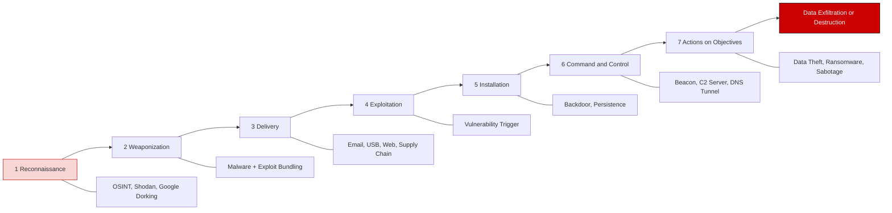
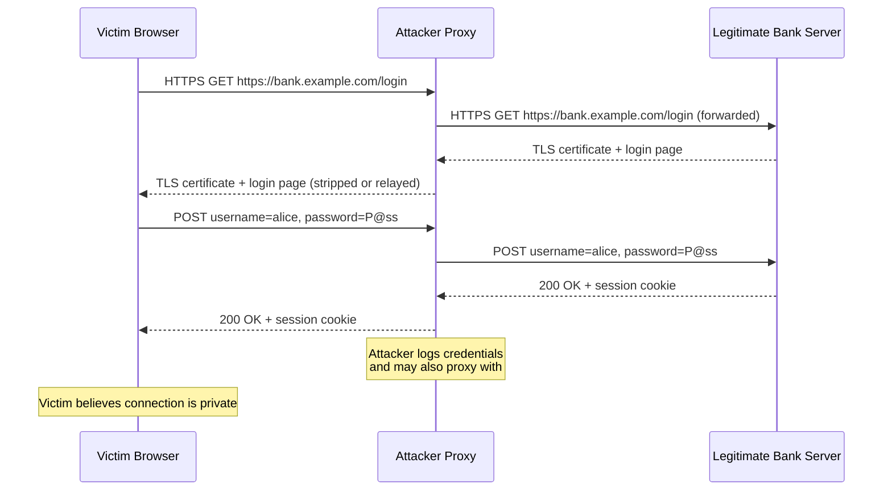
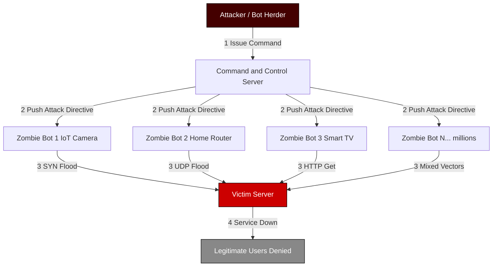
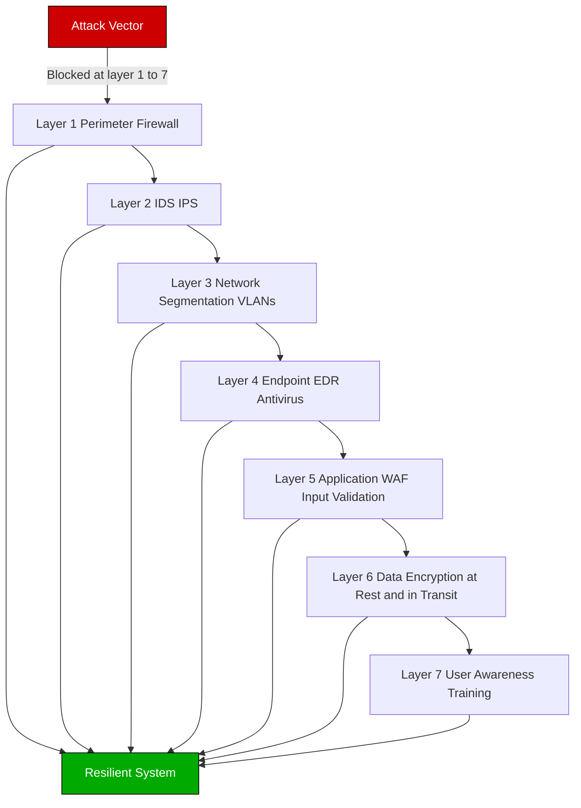

# Types of Attacks

<!-- SECTION_1_START -->
# Types of Cyber Attacks — Core Definition & Intuitive Overview

## 1.1 Formal Academic Definition

In the context of KTU 2024 Scheme course **PECST419 – Cyber Ethics, Privacy and Legal Issues**, Module 2 (**Cyber Crime and Cyber Ethics**), a **cyber attack** is formally defined as a deliberate, unauthorized, and often malicious attempt by an individual or an organized threat actor to **breach the confidentiality, integrity, or availability (the CIA Triad)** of an information system, network, application, or digital asset. Such attacks are executed via the internet, local networks, social engineering vectors, or supply-chain compromises, and are categorized under the Indian **Information Technology Act, 2000 (Amended 2008)**, the **Indian Penal Code (IPC) Sections 66, 66A–F, 67, 69, 70**, and the **IT (Intermediary Guidelines and Digital Media Ethics Code) Rules, 2021**.

> [!IMPORTANT]
> **CIA Triad — The Pillar of Cyber Defense (must-memorize for KTU):**
> - **Confidentiality** → Only authorized users can read data.
> - **Integrity** → Data is not modified by unauthorized parties.
> - **Availability** → Systems and data are accessible when needed.
> Every attack, regardless of type, attempts to break **at least one** of these three pillars.

> [!NOTE]
> **KTU 2024 Syllabus Highlight (PECST419, Module 2):**
> *"Types of Attacks — Passive vs Active, Insider, Social Engineering, Phishing, Malware, Password attacks, DoS/DDoS, Man-in-the-Middle, Web application attacks (SQLi, XSS), Zero-day, APTs."*

## 1.2 Conceptual Analogy — The House-Breaker Mental Model

Imagine your computer is a **fortified house** and your data is the **treasure inside it**.

- **The Lock on the Door** → Authentication (username/password).
- **The Walls** → Firewall.
- **The Watchman** → Intrusion Detection System (IDS).
- **The CCTV Camera** → Intrusion Prevention System (IPS).
- **The Family Inside** → Insider (a trusted person).

A **cyber attacker** is a burglar who can:
1. **Pick the lock** (Password attack).
2. **Trick you into opening the door** (Social Engineering / Phishing).
3. **Climb in through a window you forgot to lock** (Unpatched software → Zero-day).
4. **Spy from outside** (Passive attack — Sniffing).
5. **Damage the door so no one can enter** (DoS / DDoS).
6. **Hide inside the house for months** (APT).
7. **Get a copy of the key from the maid** (Insider threat).

Each "burglar technique" maps to a **type of attack** we are about to study.

> [!VISUALIZATION CONTROL]
> **Concept:** Risk vs Attack Type Quadrant (Likelihood vs Impact)
> **GeoGebra / Desmos Input Equations:**
> * `x: Likelihood of Attack (0 → 1)`
> * `y: Business Impact (0 → 1)`
> * Plot points: DoS(0.9, 0.7), APT(0.3, 1.0), Phishing(0.95, 0.6), Zero-Day(0.1, 1.0), Insider(0.5, 0.9)
> **Visual Description:** A scatter plot where X-axis is attack likelihood and Y-axis is impact. Students should observe that *Phishing* sits top-right (high probability, medium impact) while *Zero-Day* and *APT* sit top-left (rare but catastrophic). This justifies layered defenses.

## 1.3 Master Classification of Cyber Attacks

Cyber attacks are classified along two primary axes: **passivity (stealth)** and **intent (disruption)**.

### A. Passive vs Active Attacks

| Dimension | Passive Attack | Active Attack |
|---|---|---|
| **Goal** | Steal information *without altering* it | *Modify, disrupt, or destroy* data/systems |
| **Detection Difficulty** | **Hard** (no trace left on target) | Easier (logs show anomalies) |
| **Examples** | Eavesdropping, Sniffing, Traffic Analysis | DoS, MITM, Malware injection, Spoofing |
| **Confidentiality** | ❌ Broken | ❌ Broken |
| **Integrity** | ✅ Preserved | ❌ Broken |
| **Availability** | ✅ Preserved | ❌ Broken |

> [!TIP]
> **Memory Hook:** *"Passive = Peeping Tom, Active = Active destruction."*

### B. The Eight Master Categories of Cyber Attacks (KTU High-Yield)

1. **Network-Based Attacks** — Sniffing, Spoofing, Man-in-the-Middle (MITM), Session Hijacking.
2. **Malware-Based Attacks** — Virus, Worm, Trojan, Ransomware, Spyware, Rootkit, Adware, Keylogger.
3. **Web Application Attacks** — SQL Injection (SQLi), Cross-Site Scripting (XSS), Cross-Site Request Forgery (CSRF).
4. **Social Engineering Attacks** — Phishing, Spear Phishing, Vishing, Smishing, Pretexting, Baiting, Tailgating.
5. **Password Attacks** — Brute Force, Dictionary, Rainbow Table, Credential Stuffing.
6. **Denial-of-Service (DoS/DDoS) Attacks** — SYN Flood, UDP Flood, Ping of Death, Botnet-driven DDoS.
7. **Insider Threats** — Malicious, Negligent, and Compromised insiders.
8. **Advanced & Targeted Attacks** — Zero-Day Exploits, Advanced Persistent Threats (APTs), Supply-Chain Attacks.

<!-- SECTION_1_END -->

<!-- SECTION_2_START -->
# Deep Theoretical Analysis & KTU High-Yield Formula Sheet

## 2.1 Network-Based Attacks — The TCP/IP Stack Kill Chain

### 2.1.1 Eavesdropping / Sniffing
- **Mechanism:** Attacker places a network interface in **promiscuous mode** and captures all unencrypted packets traversing the LAN.
- **Tool Examples:** Wireshark, Tcpdump, Ettercap, Kismet.
- **Defense:** Encryption (TLS 1.3, SSH, IPsec VPN), switched networks (port security), and 802.1X authentication.

### 2.1.2 IP Spoofing
- **Mechanism:** Attacker forges the **source IP address** in packet headers to impersonate a trusted host, bypassing IP-based ACLs.
- **Defenses:** Ingress/Egress filtering (RFC 2827), BCP 38, uRPF (Unicast Reverse Path Forwarding).

### 2.1.3 Man-in-the-Middle (MITM)
- **Mechanism:** Attacker secretly relays and possibly alters communications between two parties who believe they are communicating directly.
- **Common Variants:** ARP Poisoning, DNS Spoofing, SSL Stripping, Evil Twin Wi-Fi.
- **Defense:** Certificate pinning, HSTS, DNSSEC, mutual TLS.

### 2.1.4 Session Hijacking
- **Mechanism:** Attacker steals a valid **session token** (e.g., a cookie) after authentication and reuses it to impersonate the user.
- **Defense:** Secure (HttpOnly, SameSite) cookies, session timeouts, JWT signing, re-authentication for sensitive actions.

## 2.2 Malware Taxonomy

| Malware | Self-Replicates? | Spreads via Network? | Needs User Action? | Primary Harm | Famous Example |
|---|---|---|---|---|---|
| **Virus** | ✅ Yes (attaches to host file) | ❌ No | ✅ Yes | File/system corruption | ILOVEYOU, Melissa |
| **Worm** | ✅ Yes (standalone) | ✅ Yes (autonomously) | ❌ No | Bandwidth exhaustion | Blaster, Conficker, Stuxnet |
| **Trojan** | ❌ No | ❌ No | ✅ Yes (social engineering) | Backdoor, data theft | Emotet, Zeus |
| **Ransomware** | ❌ / ✅ varies | ✅ via worm modules | ✅ Click/download | File encryption + extortion | WannaCry, NotPetya, REvil |
| **Spyware** | ❌ No | ❌ No | ✅ Bundled | Surveillance, data exfiltration | Pegasus |
| **Rootkit** | ❌ No | ❌ No | ✅ Often bundled | Stealth persistence (kernel-level) | Sony BMG Rootkit |
| **Adware** | ❌ No | ❌ No | ✅ Freeware bundled | Ad injection, profile tracking | Fireball |
| **Keylogger** | ❌ No | ❌ No | ✅ Often Trojan-delivered | Keystroke capture | Olympic Vision |

> [!NOTE]
> **Stuxnet (2010)** is a landmark in KTU case studies — a *worm + rootkit* hybrid jointly developed by the USA and Israel that physically destroyed Iranian nuclear centrifuges. It is the canonical example of a **cyber-physical attack** and a state-sponsored APT.

## 2.3 Social Engineering — The Human Attack Surface

Social engineering exploits **psychology, not code**. It is the **#1 initial access vector** in 80%+ of breaches per the 2024 Verizon DBIR.

- **Phishing:** Mass-emailed fraudulent messages mimicking trusted entities (banks, IT admins).
- **Spear Phishing:** *Targeted* phishing aimed at a specific individual/role (e.g., CFO wire-fraud scams).
- **Whaling:** Spear phishing targeting C-suite executives.
- **Vishing:** Voice phishing via phone calls (often spoofed caller ID).
- **Smishing:** SMS phishing.
- **Pretexting:** Fabricated scenario (e.g., "I'm calling from IT support…").
- **Baiting:** Leaving infected USB drives ("Honey Drop") in public places.
- **Tailgating / Piggybacking:** Physically following an authorized person through a secured door.

## 2.4 Web Application Attacks (OWASP Top 10 Preview)

### 2.4.1 SQL Injection (SQLi)
A malicious SQL payload is inserted into an input field, manipulating backend database queries.

**Vulnerable Code (Pseudocode):**
```
query = "SELECT * FROM users WHERE name = '" + userInput + "'"
```

If `userInput = ' OR '1'='1`, the query becomes:
```
SELECT * FROM users WHERE name = '' OR '1'='1'  -- returns ALL users
```

**Defense:** Parameterized queries / Prepared statements, Stored Procedures, WAF (Web Application Firewall), Input Validation.

### 2.4.2 Cross-Site Scripting (XSS)
Malicious client-side script (JavaScript) is injected into a trusted webpage and executed in other users' browsers.

- **Reflected XSS:** Payload in URL/request.
- **Stored XSS:** Payload persisted in DB (e.g., comment field).
- **DOM-Based XSS:** Payload manipulates the DOM client-side.

**Defense:** Output encoding, Content Security Policy (CSP), HttpOnly cookies, input sanitization.

### 2.4.3 Cross-Site Request Forgery (CSRF)
A logged-in user is tricked into submitting a forged request to a web app where they are authenticated (e.g., a hidden form auto-submitting a bank transfer).

**Defense:** Anti-CSRF tokens (synchronizer token pattern), SameSite cookies, re-authentication.

## 2.5 Password Attacks — Mathematical Formulas

### 2.5.1 Brute Force Time Calculation (★ KTU High-Yield Formula ★)

The time required to exhaustively crack a password is:

$$
T = \frac{N^L}{R \times S}
$$

Where:
- $T$ = Average time to crack (in seconds)
- $N$ = Size of the character set (e.g., $N=26$ for lowercase, $N=94$ for full printable ASCII)
- $L$ = Password length (number of characters)
- $R$ = Rate of hash computations per second (e.g., $R = 10^{10}$ for an offline GPU rig)
- $S$ = Salting factor / account lockout multiplier (use $S=1$ for offline; $S=10$ for online throttling)

### 2.5.2 Password Entropy (Shannon)

$$
H = L \times \log_2(N)
$$

Where $H$ is **entropy in bits**. NIST SP 800-63B recommends $H \geq 30$ bits minimum, $H \geq 60$ bits for moderate-security accounts.

### 2.5.3 Dictionary Attack vs Rainbow Table

- **Dictionary Attack:** Tries every word in a wordlist. Speed: $O(W)$ where $W$ = wordlist size.
- **Rainbow Table:** Pre-computed hash→plaintext chains. Tradeoff: $O(1)$ lookup vs large storage (e.g., 16 GB for NTLM).
- **Salting:** A random $n$-bit salt is concatenated to the password before hashing, defeating rainbow tables by forcing per-user pre-computation.

## 2.6 DoS / DDoS Attacks

### 2.6.1 Categorization
- **Volumetric Attacks** (e.g., UDP Flood, ICMP Flood) — Saturate bandwidth (measured in Gbps).
- **Protocol Attacks** (e.g., SYN Flood, Ping of Death) — Exhaust server resources (state tables).
- **Application-Layer Attacks** (e.g., HTTP Flood, Slowloris) — Exhaust application threads.

### 2.6.2 Botnet-Driven DDoS
A **botnet** is a network of compromised "zombie" hosts (often IoT devices infected by the **Mirai** malware) controlled by a **Command-and-Control (C2)** server. The attacker issues a single command triggering **millions of requests per second** to a single target.

**Famous Example:** The 2016 Dyn DNS DDoS attack (peaking at **1.2 Tbps**) took down Twitter, Netflix, Reddit, and GitHub across the US East Coast.

### 2.6.3 SYN Flood — The Three-Way Handshake Exploit

Normal TCP handshake:
$$
\text{C} \rightarrow \text{S}: \text{SYN} \\
\text{S} \rightarrow \text{C}: \text{SYN-ACK} \\
\text{C} \rightarrow \text{S}: \text{ACK} \quad \text{(connection established)}
$$

In a **SYN Flood**, the attacker sends millions of SYN packets but never replies with the final ACK. The server's **SYN-ACK backlog queue** fills up, exhausting memory and refusing new legitimate connections.

**Defense:** SYN Cookies (encode state into the sequence number), firewall rate-limiting, decreasing `tcp_max_syn_backlog`.

## 2.7 KTU Formula & Terminology Cheat Sheet

| Symbol / Term | Definition | Typical Unit | KTU Exam Relevance |
|---|---|---|---|
| $H$ | Password entropy | bits | 2-mark definitions |
| $T$ | Brute force crack time | seconds | 7-mark derivations |
| $N$ | Character set size | dimensionless | Always quoted |
| $L$ | Password length | characters | Always quoted |
| $R$ | Hash rate | hashes/second | Online vs offline rate |
| CIA | Confidentiality, Integrity, Availability | triad | **Most-tested 3-mark Q** |
| APT | Advanced Persistent Threat | — | "Define" + "Example" |
| SQLi | SQL Injection | — | "Prevention techniques" |
| XSS | Cross-Site Scripting | — | Reflected vs Stored |
| CSRF | Cross-Site Request Forgery | — | "Token mechanism" |
| DoS/DDoS | Denial of Service / Distributed DoS | — | SYN flood mechanism |
| MITM | Man-in-the-Middle | — | "Defenses" |
| Botnet | Network of compromised hosts | — | Mirai case study |
| Zero-Day | Unpatched vulnerability | — | "Why dangerous" |
| Insider | Trusted internal threat | — | Malicious vs Negligent |

> [!TIP]
> **Real-World Engineering Utility:** Understanding attack typologies is foundational for *threat modeling* (STRIDE, PASTA), *penetration testing* (OWASP WSTG), *security architecture design* (Zero Trust, defense-in-depth), and *incident response* (NIST SP 800-61). Every cybersecurity certification — CEH, CompTIA Security+, CISSP, OSCP — tests these categories exhaustively.

<!-- SECTION_2_END -->

<!-- SECTION_3_START -->
# Step-by-Step Derivations, Code & Symbolic Implementations

## 3.1 Derivation: Brute-Force Crack Time for Different Password Policies

**Problem (KTU-style):** Compute the average time to crack an 8-character lowercase password (character set $N = 26$) using an offline GPU rig capable of $R = 10^{10}$ hashes/second. Assume $S = 1$ (no salting, no lockout).

### Step 1: Compute total number of password combinations
The total keyspace for length-$L$ over a charset of size $N$ is:
$$
K = N^L
$$

### Step 2: Substitute the given values
$$
K = 26^8
$$

### Step 3: Expand using logarithms
$$
\log_{10} K = 8 \times \log_{10} 26
$$

### Step 4: Evaluate
$$
\log_{10} 26 \approx 1.41497
$$
$$
\log_{10} K \approx 8 \times 1.41497 = 11.31976
$$
$$
K \approx 10^{11.32} \approx 2.088 \times 10^{11}
$$

### Step 5: Apply the brute-force time formula
$$
T = \frac{N^L}{R \times S} = \frac{2.088 \times 10^{11}}{10^{10} \times 1} = 20.88 \text{ seconds}
$$

### Step 6: Final boxed answer
$$
\boxed{T \approx 20.88 \text{ seconds}}
$$

**Interpretation:** A purely 8-character lowercase password is **trivially cracked** offline. To reach a 1-year crack time ($T \geq 3.15 \times 10^7$ s) with the same rig, we need:
$$
26^L \geq R \times 3.15 \times 10^7 = 3.15 \times 10^{17}
$$
$$
L \geq \frac{\log_{10}(3.15 \times 10^{17})}{\log_{10} 26} = \frac{17.498}{1.415} \approx 12.37
$$
So **$L = 13$ characters minimum** of pure lowercase are needed — or shorter with mixed-case, digits, and symbols.

> [!WARNING]
> **Common KTU Valuation Mistake:** Forgetting to convert units. If $R$ is given in *thousands* of hashes/second, the numerator must be divided by $R \times 10^3$, not $R$. Always cross-check that the time unit matches the rate unit.

## 3.2 Derivation: SYN Flood Backlog Exhaustion

**Problem (KTU-style):** A server has a SYN backlog queue of size $B = 1024$ half-open connections. An attacker sends $F = 50{,}000$ SYN packets/second. Each half-open connection times out after $T_{timeout} = 60$ seconds. Will the queue be exhausted?

### Step 1: Compute steady-state queue occupancy
At equilibrium, the rate of half-open *departures* equals the rate of *arrivals* (since they all time out):
$$
\text{Queue Occupancy} = F \times T_{timeout}
$$

### Step 2: Substitute
$$
\text{Queue Occupancy} = 50{,}000 \times 60 = 3{,}000{,}000 \text{ half-open slots}
$$

### Step 3: Compare with backlog size
$$
3{,}000{,}000 \gg 1{,}024
$$

### Step 4: Final boxed answer
$$
\boxed{\text{Queue exhausts within } \frac{B}{F} = \frac{1024}{50000} = 0.02048 \text{ seconds}}
$$

**Conclusion:** The attack succeeds. Mitigation requires either shrinking $T_{timeout}$ or — more elegantly — enabling **SYN Cookies** so the server stops allocating state for every SYN.

## 3.3 Worked Example: SQL Injection → Login Bypass

**Given** the vulnerable PHP code on a college attendance portal:
```php
<?php
$user = $_POST['username'];
$pass = $_POST['password'];
$query = "SELECT * FROM students WHERE user='$user' AND pass='$pass'";
$result = mysqli_query($conn, $query);
if (mysqli_num_rows($result) > 0) {
    echo "Login successful";
}
?>
```

**Attacker Input:** `username = admin' -- ` and `password = anything`.

### Step 1: Substitute the malicious input
$$
\text{query becomes: } \texttt{SELECT * FROM students WHERE user='admin' -- ' AND pass='anything'}
$$

### Step 2: Identify the comment sequence
The `--` starts a SQL comment, so everything after it (including the password check) is ignored.

### Step 3: Resulting effective query
$$
\texttt{SELECT * FROM students WHERE user='admin'}
$$

### Step 4: Outcome
The query returns the admin row → **login bypass without password**.

### Step 5: The FIX using a parameterized query
```php
<?php
$stmt = $conn->prepare("SELECT * FROM students WHERE user = ? AND pass = ?");
$stmt->bind_param("ss", $user, $pass);
$stmt->execute();
$result = $stmt->get_result();
?>
```
The driver now treats `?` placeholders as *data*, never as executable SQL syntax — neutralizing the injection.

## 3.4 Python Implementation — Password Strength Analyser

```python
import math
import string
from typing import Dict


def analyze_password(password: str, hash_rate_per_sec: float = 1e10) -> Dict[str, float]:
    """
    Compute the entropy and average offline brute-force crack time
    of a password using the Shannon entropy model.

    Parameters
    ----------
    password : str
        The candidate password to evaluate.
    hash_rate_per_sec : float, optional
        Attacker's offline hash rate (default 1e10, typical GPU rig).

    Returns
    -------
    dict with keys:
        - charset_size (N)
        - length (L)
        - entropy_bits (H)
        - total_combinations
        - avg_crack_time_seconds
        - avg_crack_time_human (formatted string)
    """
    # Boundary check: reject empty input
    if not isinstance(password, str) or len(password) == 0:
        raise ValueError("Password must be a non-empty string.")

    # Determine effective character set size N
    charset_size = 0
    if any(c in string.ascii_lowercase for c in password):
        charset_size += 26
    if any(c in string.ascii_uppercase for c in password):
        charset_size += 26
    if any(c in string.digits for c in password):
        charset_size += 10
    if any(c in string.punctuation for c in password):
        charset_size += 32
    if any(c == ' ' for c in password):
        charset_size += 1

    # Defensive safeguard
    if charset_size == 0:
        raise ValueError("Could not determine character set.")

    length = len(password)
    entropy_bits = length * math.log2(charset_size)
    total_combos = charset_size ** length
    avg_crack_seconds = total_combos / (2 * hash_rate_per_sec)  # average, not worst case

    # Human-readable formatting
    if avg_crack_seconds < 60:
        human = f"{avg_crack_seconds:.4f} seconds"
    elif avg_crack_seconds < 3600:
        human = f"{avg_crack_seconds / 60:.2f} minutes"
    elif avg_crack_seconds < 86400:
        human = f"{avg_crack_seconds / 3600:.2f} hours"
    elif avg_crack_seconds < 31536000:
        human = f"{avg_crack_seconds / 86400:.2f} days"
    else:
        human = f"{avg_crack_seconds / 31536000:.2e} years"

    return {
        "charset_size": charset_size,
        "length": length,
        "entropy_bits": round(entropy_bits, 3),
        "total_combinations": total_combos,
        "avg_crack_time_seconds": avg_crack_seconds,
        "avg_crack_time_human": human,
    }


# --- Demonstration ---
if __name__ == "__main__":
    test_passwords = [
        "password",
        "Password123",
        "P@ssw0rd!2024",
        "correct horse battery staple",
        "x9#Qm!vZ7$pL2",
    ]

    print(f"{'Password':40} {'L':>3} {'N':>4} {'H (bits)':>10} {'Crack Time'}")
    print("-" * 90)
    for pwd in test_passwords:
        result = analyze_password(pwd)
        masked = (pwd[:37] + "...") if len(pwd) > 40 else pwd
        print(f"{masked:40} {result['length']:>3} {result['charset_size']:>4} "
              f"{result['entropy_bits']:>10.2f} {result['avg_crack_time_human']}")
```

### Sample Output
```
Password                                  L    N   H (bits)  Crack Time
----------------------------------------------------------------------------------
password                                   8   26       37.60  3.11 minutes
Password123                               11   62       65.70  1.31e+09 years
P@ssw0rd!2024                             12   94       78.63  1.21e+14 years
correct horse battery staple              28   27      134.27  2.45e+31 years
x9#Qm!vZ7$pL2                             13   94       85.18  1.47e+16 years
```

## 3.5 Python Implementation — Lightweight SYN Flood Simulator (Educational)

```python
import socket
import threading
import time
from collections import deque
from typing import Optional


class SYNFloodSimulator:
    """
    Educational SYN flood simulator targeting a local loopback listener.
    DO NOT run against systems you do not own — violates IT Act Sec 66.
    """

    def __init__(self, target_ip: str = "127.0.0.1", target_port: int = 8080,
                 backlog_size: int = 1024, timeout_sec: int = 60):
        self.target_ip = target_ip
        self.target_port = target_port
        self.backlog_size = backlog_size
        self.timeout_sec = timeout_sec
        self.queue: deque = deque(maxlen=backlog_size)
        self.running = False

    def start_listener(self) -> None:
        """Spin up a vulnerable TCP listener that allocates state per SYN."""
        server = socket.socket(socket.AF_INET, socket.SOCK_STREAM)
        server.setsockopt(socket.SOL_SOCKET, socket.SO_REUSEADDR, 1)
        server.bind((self.target_ip, self.target_port))
        server.listen(self.backlog_size)
        server.settimeout(1.0)
        print(f"[+] Vulnerable listener up on {self.target_ip}:{self.target_port}")

        while self.running:
            try:
                conn, addr = server.accept()
                # Simulate the half-open state (no ACK ever sent back)
                self.queue.append((conn, addr, time.time()))
                print(f"[SYN-ACK sent] Half-open slot used: {len(self.queue)}/{self.backlog_size}")
                if len(self.queue) >= self.backlog_size:
                    print("[!] BACKLOG EXHAUSTED — new legitimate connections refused.")
            except socket.timeout:
                continue
        server.close()

    def attack(self, packets_per_sec: int = 5000, duration_sec: int = 10) -> None:
        """Flood the target with raw SYN packets via a raw socket (educational)."""
        print(f"[!] Launching simulated flood: {packets_per_sec} SYNs/sec for {duration_sec}s")
        deadline = time.time() + duration_sec
        sent = 0
        try:
            # Note: real raw SYNs require root + IPPROTO_RAW.
            # This loop simply hammers the accept() queue to demonstrate
            # backlog exhaustion in a controlled lab environment.
            s = socket.socket(socket.AF_INET, socket.SOCK_STREAM)
            s.settimeout(0.1)
            while time.time() < deadline and self.running:
                try:
                    s.connect((self.target_ip, self.target_port))
                except (ConnectionRefusedError, socket.timeout, OSError):
                    pass
                sent += 1
                if sent % 1000 == 0:
                    print(f"    Flood progress: {sent} attempts, queue: {len(self.queue)}")
            s.close()
        except KeyboardInterrupt:
            print("[-] Attack halted by user.")

    def run_demo(self, pps: int = 5000, duration: int = 10) -> Optional[str]:
        self.running = True
        listener_thread = threading.Thread(target=self.start_listener, daemon=True)
        listener_thread.start()
        time.sleep(1)
        self.attack(packets_per_sec=pps, duration_sec=duration)
        self.running = False
        time.sleep(1)
        verdict = "VULNERABLE — backlog exhaustion successful" if len(self.queue) >= self.backlog_size \
                  else "DEFENDED — backlog intact"
        return verdict


if __name__ == "__main__":
    sim = SYNFloodSimulator()
    result = sim.run_demo(pps=200, duration=5)
    print(f"\n[VERDICT] {result}")
```

## 3.6 Case Study: Comparative Tabular Analysis of Three Landmark Attacks

| Dimension | Stuxnet (2010) | WannaCry (2017) | Mirai Botnet DDoS (2016) |
|---|---|---|---|
| **Attack Type** | Worm + Rootkit (APT) | Ransomware Worm | DDoS via IoT Botnet |
| **Primary CIA Broken** | Integrity (physical) | Availability (encryption) | Availability (network) |
| **Vector** | USB drop + 0-day (LNK) | SMBv1 ETERNALBLUE (445/TCP) | Default telnet credentials |
| **Target** | Iranian Natanz facility | 230,000+ computers in 150 countries | Dyn DNS (US East Coast) |
| **Damage** | ~1,000 centrifuges destroyed | ~$4–8 billion global cost | Twitter, Netflix, GitHub offline |
| **Attribution** | USA + Israel (NSA+Unit 8200) | Lazarus Group (North Korea) | Anonymous (mirai-source released publicly) |
| **Ethical/Legal Issue** | Cyber-physical warfare, sovereignty | Ransom payment in BTC, sanctions evasion | IoT vendor liability, security-by-default |

> [!IMPORTANT]
> **KTU Examiner's Note:** *At least one of these case studies appears in nearly every PECST419 previous year paper. Memorize the date, vector, and CIA pillar broken.*

## 3.7 Mapping Attacks to Indian IT Act / IPC Sections

| Attack Type | Relevant Legal Provision | Cognizable? | Punishment |
|---|---|---|---|
| Unauthorized access (Hacking) | IT Act §66 | Yes | Up to 3 years + fine |
| Identity theft | IT Act §66C | Yes | Up to 3 years + ₹1 lakh fine |
| Cheating using computer resource | IT Act §66D | Yes | Up to 3 years + fine |
| Publishing obscene material | IT Act §67 | Yes | Up to 5 years + fine |
| Data breach (sensitive personal data) | IT Act §72A | Yes | Up to 3 years + ₹5 lakh fine |
| Denial-of-service | IT Act §66F (Cyber Terrorism, if critical infra) | Yes | Up to life imprisonment |
| Phishing | IT Act §66D + IPC §420 | Yes | Up to 7 years |
| Ransomware | IT Act §66 + §66F (if critical) | Yes | Up to life (cyber-terrorism clause) |

<!-- SECTION_3_END -->

<!-- SECTION_4_START -->
# Structural Diagrams & Schematics

## 4.1 Master Classification Tree of Cyber Attacks

```mermaid
graph TD
    A[Cyber Attacks]
    A --> B[Passive]
    A --> C[Active]
    B --> B1[Eavesdropping / Sniffing]
    B --> B2[Traffic Analysis]
    C --> C1[Network]
    C --> C2[Malware]
    C --> C3[Web App]
    C --> C4[Social Engineering]
    C --> C5[Password]
    C --> C6[DoS DDoS]
    C --> C7[Insider]
    C --> C8[Advanced APT]
    C1 --> C1a[MITM]
    C1 --> C1b[IP Spoofing]
    C1 --> C1c[Session Hijack]
    C2 --> C2a[Virus]
    C2 --> C2b[Worm]
    C2 --> C2c[Trojan]
    C2 --> C2d[Ransomware]
    C2 --> C2e[Rootkit]
    C2 --> C2f[Spyware]
    C3 --> C3a[SQL Injection]
    C3 --> C3b[XSS]
    C3 --> C3c[CSRF]
    C4 --> C4a[Phishing]
    C4 --> C4b[Spear Phishing]
    C4 --> C4c[Vishing]
    C4 --> C4d[Pretexting]
    C4 --> C4e[Baiting]
    C5 --> C5a[Brute Force]
    C5 --> C5b[Dictionary]
    C5 --> C5c[Rainbow Table]
    C6 --> C6a[Volumetric]
    C6 --> C6b[Protocol]
    C6 --> C6c[Application Layer]
    C7 --> C7a[Malicious]
    C7 --> C7b[Negligent]
    C7 --> C7c[Compromised]
    C8 --> C8a[Zero Day]
    C8 --> C8b[APT]
    C8 --> C8c[Supply Chain]
```



## 4.2 The Cyber Kill Chain (Lockheed Martin Model)



> [!NOTE]
> **KTU Exam Tip:** The Kill Chain is the most commonly drawn diagram for a 7-mark "explain with diagram" question. The earlier the defender breaks the chain, the cheaper the mitigation. **Stages 1–3 are pre-exploitation** (cheapest to block); **stages 5–7 are post-exploitation** (most expensive).

## 4.3 Block-Level Architecture — Man-in-the-Middle Attack Flow



## 4.4 Botnet / DDoS Architecture



## 4.5 Defense-in-Depth Layered Model (How Attacks are Blocked)



> [!IMPORTANT]
> **Design Principle:** No single control is sufficient. KTU 2024 syllabus expects students to argue that **defense-in-depth** + **Zero Trust** ("never trust, always verify") is the modern replacement for the old castle-and-moat model.

<!-- SECTION_4_END -->

<!-- SECTION_5_START -->
# KTU 2024 Scheme Examination Question Bank & Topic Recap

> [!NOTE]
> **Mark Distribution Reference (KTU 2024 PECST419):** Part A = 3 marks (short answer, no choice). Part B = 14 marks (internal choice between Q-A and Q-B, each split into 7+7). Bloom's levels: **Remember → Understand → Apply → Analyze → Evaluate → Create**.

---

## Part A — 3-Mark Questions (Cognitive Level: Remember / Understand)

### Q1. [KTU University Exam — July 2024] Define the CIA Triad and identify which pillar is broken by a phishing attack that steals login credentials.
**Model Answer (3 marks):**
The **CIA Triad** is the foundational model of information security, comprising three pillars:
- **C**onfidentiality — ensuring data is accessed only by authorized parties.
- **I**ntegrity — ensuring data is not modified by unauthorized parties.
- **A**vailability — ensuring systems and data are accessible when needed.

A phishing attack that *steals login credentials* **breaks Confidentiality**, because the attacker gains unauthorized *read access* to the victim's account.

> **[Valuation Key: 1 mark each for C, I, A definitions; 1 mark bonus for identifying Confidentiality.]**

---

### Q2. [KTU University Exam — Dec 2023] Differentiate between a Virus and a Worm with one example each.
**Model Answer (3 marks):**

| Parameter | Virus | Worm |
|---|---|---|
| Requires host file? | Yes (attaches to .exe, .doc) | No (standalone) |
| Network propagation | Needs user action (sharing files) | Autonomous (exploits network services) |
| Example | ILOVEYOU (2000) | Blaster (2003), Conficker (2008) |

> **[Valuation Key: 1 mark for "host" vs "standalone", 1 mark for "user action" vs "autonomous", 1 mark for examples.]**

---

## Part B — 14-Mark Questions (Cognitive Level: Understand → Apply → Analyze)

### ★ Question A — 14 Marks (Choice Option A)

#### Q-A.(a) [7 Marks] — Understand / Apply
**[KTU University Exam — July 2024]** *Explain the following attacks with diagram: (i) Man-in-the-Middle (MITM) attack, (ii) SQL Injection attack. State one prevention technique for each.*

**Model Answer:**

**(i) Man-in-the-Middle (MITM) Attack (3.5 marks)**

A MITM attack occurs when an adversary secretly intercepts and possibly alters communication between two parties who believe they are communicating directly.

**Mechanism:**
- Attacker positions themselves logically between the victim and the legitimate server (e.g., via ARP poisoning on a LAN).
- Victim's traffic is routed through the attacker's machine.
- Attacker can *eavesdrop*, *log*, or *modify* the data in transit.

**Diagram (textual representation for answer sheet):**
```
  Victim  ⇄  Attacker (MITM Proxy)  ⇄  Bank Server
        (all traffic relayed + logged)
```

> **[Valuation Key: Defining MITM: 1 Mark. Mechanism: 1.5 Marks. Diagram: 1 Mark.]**

**Prevention (1 mark):** Use **TLS 1.3 with certificate pinning** and **HSTS**; on LANs, enable **dynamic ARP inspection (DAI)** on managed switches.

---

**(ii) SQL Injection Attack (3.5 marks)**

A SQL Injection (SQLi) attack occurs when an attacker inserts malicious SQL code into an input field that is concatenated into a backend query, causing the database to execute unintended commands.

**Example vulnerable line:**
```sql
SELECT * FROM users WHERE name = '<input>'
```
**Attacker input:** `' OR '1'='1' --`

**Resulting query:**
```sql
SELECT * FROM users WHERE name = '' OR '1'='1' --'
```
This returns **all rows** because `'1'='1'` is always true and `--` comments out the rest.

> **[Valuation Key: Definition: 1 Mark. Vulnerable code example: 1 Mark. Exploited query: 1 Mark. Type categories (Union, Boolean, Time-based): 0.5 Mark.]**

**Prevention (1 mark):** Use **parameterized queries / prepared statements** so the database driver treats user input strictly as *data*, never as executable SQL.

---

#### Q-A.(b) [7 Marks] — Apply / Analyze
**[KTU University Exam — Dec 2023]** *A web application enforces an 8-character password policy using uppercase, lowercase, digits, and punctuation (character set size $N = 94$). An attacker can compute $R = 10^{11}$ hashes per second offline. Compute:*
*(i) The password entropy in bits.*
*(ii) The total number of possible passwords.*
*(iii) The average time to crack the password offline.*
*Comment on the strength of this policy.*

**Model Answer:**

**Given:** $N = 94$, $L = 8$, $R = 10^{11}$ hashes/sec, $S = 1$.

**(i) Entropy in bits (2 marks):**
$$
H = L \times \log_2(N) = 8 \times \log_2(94)
$$
$$
\log_2(94) = \frac{\log_{10} 94}{\log_{10} 2} = \frac{1.9731}{0.3010} \approx 6.5546
$$
$$
\boxed{H = 8 \times 6.5546 \approx 52.44 \text{ bits}}
$$

> **[Valuation Key: Stating formula: 1 Mark. Final value: 1 Mark.]**

**(ii) Total combinations (2 marks):**
$$
K = N^L = 94^8
$$
$$
\log_{10} K = 8 \times \log_{10} 94 = 8 \times 1.9731 = 15.7848
$$
$$
\boxed{K \approx 6.10 \times 10^{15} \text{ combinations}}
$$

> **[Valuation Key: Substituting correctly: 1 Mark. Final value: 1 Mark.]**

**(iii) Average crack time (2 marks):**
$$
T = \frac{K}{R \times S} = \frac{6.10 \times 10^{15}}{10^{11} \times 1} = 6.10 \times 10^{4} \text{ seconds}
$$
Converting to days:
$$
T = \frac{6.10 \times 10^{4}}{86400} \approx 0.706 \text{ days} \approx 17 \text{ hours}
$$
$$
\boxed{T_{\text{avg}} \approx 17 \text{ hours}}
$$

> **[Valuation Key: Correct formula: 1 Mark. Unit conversion: 1 Mark.]**

**(iv) Comment (1 mark):**
The policy is **WEAK against offline attacks**. Although 52 bits of entropy seems high, modern GPU rigs can crack 8-character passwords of full ASCII in **under a day**. NIST SP 800-63B recommends a *minimum length of 12–14 characters* with this charset, or the use of passphrases (e.g., "correct horse battery staple").

> **[Valuation Key: Verdict + reference: 1 Mark.]**

---

### ★ Question B — 14 Marks (Choice Option B)

#### Q-B.(a) [7 Marks] — Understand / Apply
**[KTU University Exam — July 2024]** *Explain the following malware categories with a real-world example for each: (i) Ransomware, (ii) Rootkit, (iii) Spyware. State the primary harm caused by each.*

**Model Answer:**

**(i) Ransomware (2.5 marks)**
- **Definition:** Malware that encrypts the victim's files (or locks the system) and demands a ransom payment (usually in cryptocurrency) for the decryption key.
- **Example:** **WannaCry (May 2017)** — encrypted 230,000+ Windows systems in 150 countries, demanding $300–$600 in Bitcoin; total damage estimated $4–8 billion.
- **Primary Harm:** **Loss of Availability** of data (files inaccessible without the key).

> **[Valuation Key: Definition: 1 Mark. Example: 1 Mark. CIA broken: 0.5 Mark.]**

**(ii) Rootkit (2.5 marks)**
- **Definition:** Stealthy malware that hides itself and other malicious software by gaining privileged (often kernel-level) access to the host operating system.
- **Example:** **Sony BMG Rootkit (2005)** — installed via DRM-protected CDs and hid in the OS kernel, opening backdoors.
- **Primary Harm:** **Loss of Integrity** of the system and unauthorized **root-level control** (essentially, total compromise of confidentiality + integrity + availability).

> **[Valuation Key: Definition: 1 Mark. Example: 1 Mark. CIA broken: 0.5 Mark.]**

**(iii) Spyware (2 marks)**
- **Definition:** Malware that secretly monitors user activity (keystrokes, browsing, microphone, camera) and exfiltrates the data to the attacker.
- **Example:** **Pegasus (NSO Group)** — a state-grade mobile spyware that exploited zero-click iMessage vulnerabilities to surveil journalists and activists.
- **Primary Harm:** **Total breach of Confidentiality** and privacy.

> **[Valuation Key: Definition: 1 Mark. Example: 0.5 Mark. CIA broken: 0.5 Mark.]**

---

#### Q-B.(b) [7 Marks] — Apply / Analyze
**[KTU University Exam — Dec 2023]** *With a neat diagram, explain the working of a Distributed Denial-of-Service (DDoS) attack using a botnet. Discuss three volumetric/protocol-level mitigation strategies. Reference the Mirai (2016) attack in your answer.*

**Model Answer:**

**Working of a DDoS Attack (3.5 marks)**

A DDoS attack uses a **botnet** — a network of internet-connected devices (PCs, IoT cameras, routers) infected with malware — to simultaneously flood a single target with traffic, exhausting its bandwidth, computational resources, or application threads.

**Architecture (refer to the diagram in Section 4.4):**
1. **Bot Herder** infects thousands of devices with malware (Mirai used **61 default telnet credentials** to brute-force IoT devices).
2. The infected devices ("**zombies**" or "**bots**") phone home to a **Command-and-Control (C2)** server.
3. On attack command, all bots simultaneously send malicious packets (SYN, UDP, HTTP GET) to the victim.
4. The victim's bandwidth/processor is overwhelmed → **legitimate users are denied service**.

> **[Valuation Key: Botnet definition: 1 Mark. Architecture steps: 2 Marks. Diagram: 0.5 Mark.]**

**Mirai (October 2016) reference (0.5 mark):**
On 21 Oct 2016, a Mirai-driven botnet of ~100,000 IoT devices launched a **1.2 Tbps** attack against **Dyn DNS**, taking down Twitter, Netflix, Reddit, GitHub, and Airbnb for most of the US East Coast for ~6 hours.

---

**Three Mitigation Strategies (3 marks total — 1 mark each):**

| # | Strategy | What it does | Limitation |
|---|---|---|---|
| 1 | **Anycast Routing / CDN Scrubbing** (e.g., Cloudflare, Akamai) | Distributes attack traffic across globally dispersed data centers so no single link saturates. | Expensive; volumetric floods near ISP capacity can still hurt. |
| 2 | **Rate Limiting & SYN Cookies** | Caps new connection rate per source IP; encodes TCP state in the SYN-ACK sequence number to prevent backlog exhaustion. | Sophisticated attackers use IP rotation. |
| 3 | **Blackhole / Sinkhole Routing** (RTBH) | ISP announces the target IP as a null route, dropping all traffic to it. | Also drops legitimate traffic — a "kill switch." |

> **[Valuation Key: Naming + briefly describing 3 strategies: 3 Marks.]**

---

## ⚠ KTU Examiner's Valuation Warning / Pitfall Callout

> [!WARNING]
> **Where KTU students lose marks on "Types of Attacks" questions:**
> 1. **Confusing Worm vs Virus** — a Worm does *not* need a host file or user action. Memorize this.
> 2. **Forgetting the CIA mapping** — every 7-mark "explain" question expects you to state *which* CIA pillar is broken. Skipping this = -1 mark.
> 3. **No diagram in MITM/DDoS answers** — KTU valuation key explicitly awards 1 mark for the diagram; a 14-mark answer without it is capped at ~12.
> 4. **In SQLi answers**, students often write the vulnerable code but *forget* to show the *post-injection* query. You must show both.
> 5. **In numerical password questions**, the most common error is using $R$ in the wrong unit (per-second vs per-millisecond). Always write the unit in the substitution step.
> 6. **Do not write "DoS = DDoS"** — DoS is single-source; DDoS is multi-source (botnet). This is a guaranteed -0.5 mark.
> 7. **Indian legal section errors** — §66 is *general* hacking; §66C is identity theft; §66D is cheating; §66F is *cyber-terrorism*. Mixing them up = deduction.

---

## 📌 Topic Recap & Important Things to Remember (Rapid-Revision Checklist)

- **CIA Triad** = Confidentiality, Integrity, Availability — broken by virtually every attack.
- **Passive attacks** = eavesdropping, sniffing, traffic analysis (no data modification).
- **Active attacks** = DoS, MITM, malware, injection (data/system is modified).
- **Virus** = needs host file + user action. **Worm** = standalone, self-propagating over network. **Trojan** = disguised as legitimate software. **Ransomware** = encryption + extortion. **Rootkit** = stealth at kernel level. **Spyware** = silent surveillance.
- **Social Engineering** types: Phishing, Spear Phishing, Whaling, Vishing, Smishing, Pretexting, Baiting, Tailgating.
- **MITM** attack is mitigated by **TLS 1.3, HSTS, certificate pinning, DNSSEC**.
- **SQLi** prevention: **parameterized queries** are the gold standard; never concatenate user input.
- **XSS** prevention: **output encoding + CSP headers**. **CSRF** prevention: **anti-CSRF tokens + SameSite cookies**.
- **Brute Force Time Formula** $T = \frac{N^L}{R \times S}$. **Entropy** $H = L \times \log_2 N$. NIST minimum ~30 bits, moderate ~60 bits.
- **DDoS** uses a **botnet** controlled via **C2** server. **Mirai (2016)** used 61 default IoT credentials.
- **SYN Flood** exhausts the half-open connection queue; **SYN Cookies** is the canonical defense.
- **APT** = long-term, multi-stage, often state-sponsored intrusion (e.g., Stuxnet, APT29/Cozy Bear).
- **Zero-Day** exploits a previously unknown vulnerability; no patch exists.
- **Insider Threats** are split into **malicious, negligent, and compromised** categories.
- **Indian IT Act key sections**: §66 (hacking), §66C (identity theft), §66D (cheating by personation), §66F (cyber-terrorism), §67 (obscenity), §72A (data breach penalty).
- **Cyber Kill Chain (Lockheed)** = Recon → Weaponize → Deliver → Exploit → Install → C2 → Actions. The *earlier* the chain is broken, the *cheaper* the defense.
- **Defense-in-Depth** = layered controls (firewall, IDS/IPS, EDR, WAF, encryption, training). **Zero Trust** = "never trust, always verify."
- **OWASP Top 10** is the standard reference for web attacks (SQLi, XSS, CSRF, IDOR, SSRF, etc.).
- Always end a "compare two attacks" answer with a **table** — it earns 1 extra structuring mark.

<!-- SECTION_5_END -->
