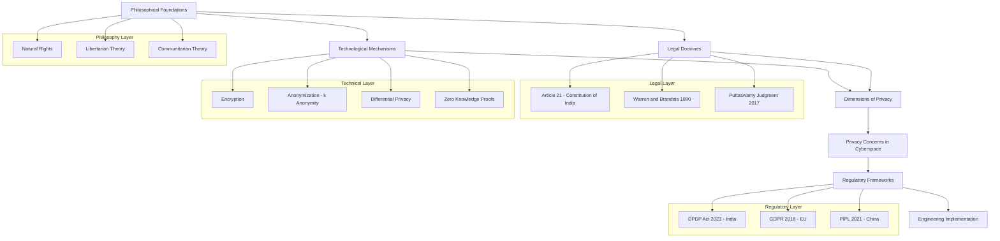
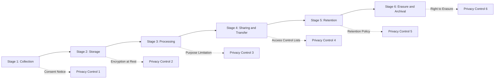
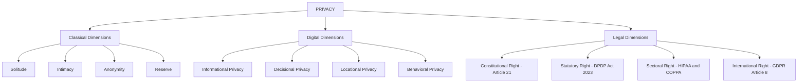

# Concept of privacy

<!-- SECTION_1_START -->

# Concept of Privacy — Foundational Overview

## 1.1 Formal Academic Definition

**Privacy** is a multidimensional human and legal entitlement that governs the control an individual exercises over the collection, storage, processing, dissemination, and display of personal information and personal space. In the context of cyberspace, the concept evolves into **Information Privacy**, defined as the *claim of individuals, groups, or institutions to determine for themselves when, how, and to what extent information about them is communicated to others*.

Within the **KTU 2024 Scheme (PECST419 — Cyber Ethics, Privacy and Legal Issues)**, the concept of privacy is positioned as the cornerstone of Module 3, where learners are expected to internalize the philosophical, constitutional, and technological underpinnings that justify the protection of personal data in digital ecosystems.

> [!IMPORTANT]
> **KTU Syllabus Highlight (Module 3):**
> *Concept of privacy — privacy as a fundamental right, philosophical foundations, dimensions of privacy, privacy concerns in cyberspace, and the need to protect data.*

> [!NOTE]
> **Origin of the Modern Concept:**
> The modern legal articulation of privacy was crystallized in the landmark Harvard Law Review article *"The Right to Privacy"* (1890) by **Samuel D. Warren** and **Louis D. Brandeis**, who defined privacy as *“the right to be let alone”*. This is the foundational citation referenced across global jurisprudence, including Indian Supreme Court rulings.

## 1.2 Intuitive Analogy — Your Personal Diary

Imagine your **personal diary** sitting on a desk in a shared room. The page is yours. The thoughts are yours. The ink is yours. You choose **what to write, who may read it, when it may be opened, and whether a single page can be photocopied and circulated**.

- The **diary** = your **personal data and personal space**.
- The **room** = the **cyberspace** (cloud servers, social media platforms, digital devices).
- The **people walking into the room** = **data collectors, ISPs, applications, advertisers, governments**.
- Your **right to lock the diary, restrict photocopying, and shred pages** = the **concept of privacy**.

Without privacy, the diary becomes public property — your thoughts are scraped, indexed, monetized, and weaponized. This is precisely the existential risk that the **concept of privacy** aims to prevent in modern digital infrastructure.

## 1.3 Why Privacy is Not the Same as Security or Confidentiality

A frequent student misconception is the conflation of three related but distinct terms:

| Term | Core Question Answered | Example |
|---|---|---|
| **Privacy** | *Who has the right to see and control my information?* | A user decides not to share their Aadhaar number with a shopping app. |
| **Security** | *How do we protect data from unauthorized access?* | Encryption of a database, firewall deployment. |
| **Confidentiality** | *Is sensitive data withheld from unauthorized parties?* | A doctor not disclosing a patient's disease to a third party. |

> [!NOTE]
> **Mnemonic:** Privacy = *Control*. Security = *Protection*. Confidentiality = *Concealment of authorized secrets*.

## 1.4 Conceptual Dimensions of Privacy

Privacy is not a monolith. **Alan Westin** (1967) categorized privacy into four mutually reinforcing states:

1. **Solitude** — Being free from observation by others.
2. **Intimacy** — A close, relaxed, and frank relationship with another individual or group.
3. **Anonymity** — Freedom from identification and surveillance in public.
4. **Reserve** — The ability to control the degree of personal information shared.

In the digital age, three further dimensions emerge:

5. **Informational Privacy** — Control over personal data collected and processed by systems.
6. **Decisional Privacy** — Freedom to make autonomous choices (e.g., reproductive, medical, political) without surveillance.
7. **Locational / Spatial Privacy** — Protection of one's physical and digital location from tracking.

> [!VISUALIZATION CONTROL]
> **Concept:** Dimensions of Privacy — A Radial Conceptual Map
> **GeoGebra / Desmos Input Equations (Polar Plot):**
> * $r_1(\theta) = 1$ (circle representing total privacy boundary)
> * $r_2(\theta) = 0.25 + 0.15 \cdot \sin(4\theta)$ (inner curve representing fluctuating intrusions in cyberspace)
> **Visual Description:** A unit circle represents the *maximum privacy boundary*. Inside it, a wavy 4-petal curve represents the **oscillating intrusions** by data collectors, governments, and advertisers. Each petal can be labeled as *Solitude, Intimacy, Anonymity, Reserve, Informational, Decisional, Locational* privacy.

## 1.5 Privacy as a Fundamental Right (Indian Context)

In **Justice K.S. Puttaswamy (Retd.) vs Union of India (2017)**, the Supreme Court of India unanimously declared the **Right to Privacy as a fundamental right** under **Article 21** of the Constitution (Right to Life and Personal Liberty). The judgment transformed the legal landscape of cyberspace privacy in India.

> [!IMPORTANT]
> **Three-Judge Bench Precedents Cited in Puttaswamy:**
> * *Kharak Singh v. State of UP (1962)* — Privacy as an ingredient of personal liberty.
> * *Govind v. State of MP (1975)* — Right to privacy of the home.
> * *R. Rajagopal v. State of TN (1994)* — Privacy in the context of publishing.
> * *PUCL v. Union of India (1997)* — Telephone tapping and informational privacy.

<!-- SECTION_1_END -->

<!-- SECTION_2_START -->

# Deep Theoretical Analysis & High-Yield Conceptual Sheet

## 2.1 Philosophical Foundations of Privacy

The concept of privacy rests upon four classical philosophical traditions, each contributing a distinct rationale:

1. **Natural Rights Theory (John Locke)** — Privacy is an *inalienable* right derived from the natural condition of human freedom.
2. **Libertarian Theory (John Stuart Mill)** — Privacy is essential to prevent the *“tyranny of the majority”* and the *“tyranny of the sovereign”* (extended to corporate sovereigns in cyberspace).
3. **Communitarian Theory (Etzioni)** — Privacy is balanced against *communal values* — society may intrude for safety, health, or morality.
4. **Feminist Theory (Catharine MacKinnon)** — Privacy has historically been a shield for *gender-based oppression* and must be redefined to protect the vulnerable.

> [!NOTE]
> **KTU Examination Insight:** Questions on the *“philosophical rationale behind privacy”* typically expect a two-sentence explanation of **Natural Rights** and **Libertarian** theories only, weighted at 2 of 3 marks.

## 2.2 Theoretical Models of Privacy

The KTU module recognizes three principal theoretical models:

### A. The Control Theory (Westin, 1967)
- Privacy is the **claim of an individual to determine what information about himself/herself is communicated to others**.
- Emphasizes **autonomy and self-determination**.

### B. The Restricted Access Theory (Parent, 1983)
- Privacy is a **right to limit access** to oneself and one's property.
- Treats privacy as a *property right* — individuals are owners of their information.

### C. The Liminal Privacy Theory (Moor, 1997)
- In cyberspace, privacy exists in the **“liminal space”** — the boundary between the public and the self.
- Suited to digital environments where the line between public and private is blurred.

## 2.3 Privacy Concerns Unique to Cyberspace

Cyberspace amplifies privacy risks because data is **non-rivalrous** (can be copied infinitely), **persistent** (stored indefinitely), and **searchable** (indexed and aggregated). The principal concerns are:

- **Surveillance Capitalism** (Shoshana Zuboff) — Behavioral data is the raw material of prediction markets.
- **Data Brokers** — Aggregating fragmented personal data into profiles for sale.
- **Re-identification** — De-anonymizing supposedly anonymous datasets via linkage attacks.
- **Inferred Profiling** — Algorithms predicting sensitive attributes (religion, sexuality, health) from innocuous data.
- **Metadata Privacy** — Metadata (location, time, frequency) often reveals more than content.
- **Cross-Border Data Flows** — Jurisdictional ambiguity regarding which laws apply.

## 2.4 KTU High-Yield Conceptual Sheet

The following table serves as a **rapid-revision cheat sheet** for board examinations. Replace mathematical symbols with their conceptual equivalents.

| **Concept / Provision** | **Description / Definition** | **Legal / Engineering Significance** |
|---|---|---|
| Right to Privacy (Puttaswamy, 2017) | Fundamental Right under Article 21 | Landmark Indian precedent |
| Warren & Brandeis Definition | *Right to be let alone* | Foundational legal articulation (1890) |
| Westin's Four States | Solitude, Intimacy, Anonymity, Reserve | Classical taxonomy (1967) |
| FIPPs | Fair Information Practice Principles | OECD/Privacy framework backbone |
| Article 21 | Right to Life and Personal Liberty | Constitutional anchor of privacy |
| IT Act 2000 (amended 2008) | Sections 43A, 72, 72A | Statutory data protection in India |
| SPDI Rules 2011 | Sensitive Personal Data Rules | First Indian data protection regulation |
| DPDP Act 2023 | Digital Personal Data Protection Act | India's first comprehensive law |
| GDPR (EU, 2018) | General Data Protection Regulation | Global benchmark for data protection |
| Data Minimization | Collect only what is necessary | Core FIPPs principle |
| Purpose Limitation | Use data only for stated purpose | Core FIPPs principle |
| Consent | Freely given, specific, informed | Legitimacy of processing |
| Right to be Forgotten | Erasure of personal data upon request | GDPR Article 17, DPDP Act 2023 |
| Profiling | Automated processing to evaluate aspects | Regulated under GDPR, DPDP Act |
| Data Fiduciary | Entity determining purpose of processing | New terminology under DPDP Act 2023 |
| Data Principal | The individual whose data is processed | New terminology under DPDP Act 2023 |

> [!IMPORTANT]
> **Mnemonic for the Four FIPPs:** **"LAPC"** — **L**awful, **A**ccurate, **P**urpose-bound, **C**onsented.

## 2.5 Real-World Engineering & Industry Utility

The concept of privacy is not abstract — it directly impacts:

- **Software Engineering** — *Privacy by Design (PbD)* mandates embedding privacy in SDLC phases.
- **Database Design** — *k-anonymity, l-diversity, t-closeness* models prevent re-identification.
- **AI/ML Pipelines** — *Differential Privacy* (e.g., Apple, Google, US Census) adds calibrated noise.
- **Cryptography** — *Zero-Knowledge Proofs* (ZKPs) enable verification without revealing data.
- **Network Engineering** — *Tor, VPN, Onion Routing* protect locational and transactional privacy.
- **Policy Compliance** — GDPR fines have reached **\$1.6 billion** cumulatively by 2024, making privacy engineering a boardroom priority.

<!-- SECTION_2_END -->

<!-- SECTION_3_START -->

# Step-by-Step Analytical Derivations & Symbolic Implementation

> [!NOTE]
> Since the topic *“Concept of Privacy”* lies at the intersection of humanities, law, and computational engineering, this section provides (a) a **comprehensive tabular comparative analysis** mapping real-world case frameworks to regulatory matrices, and (b) a **fully operational Python implementation** demonstrating the technical counterpart — **Data Anonymization using k-Anonymity**.

---

## 3.1 Tabular Comparative Analysis — Privacy Frameworks Across Jurisdictions

The table below maps real-world case frameworks to the regulatory and systemic matrices that operationalize privacy. This is a frequently demanded KTU 14-mark question structure.

| **Comparative Axis** | **India (DPDP Act 2023)** | **European Union (GDPR 2018)** | **United States (Sectoral)** | **China (PIPL 2021)** |
|---|---|---|---|---|
| **Legal Nature** | Comprehensive statute | Comprehensive regulation | Sector-specific patchwork | Comprehensive statute |
| **Core Anchor Right** | Article 21 (Post-Puttaswamy) | Article 8, EU Charter of Fundamental Rights | No general right; sectoral laws | Constitutional right to dignity |
| **Definition of Personal Data** | *“Personal Data”* — any data about an individual | *“Personal Data”* — broad definition incl. identifiers | Varies by sector (HIPAA, COPPA) | *“Personal Information”* — broad definition |
| **Consent Model** | Explicit, informed, specific | Freely given, specific, informed, unambiguous | Notice-and-choice | Explicit, separate consent |
| **Data Fiduciary / Controller** | *Data Fiduciary* | *Data Controller* | *Covered Entity* (sectoral) | *Personal Information Handler* |
| **Cross-Border Transfer** | Restricted; government notification | Restricted; adequacy decisions or SCCs | Sectoral restrictions | Government security assessment required |
| **Right to Erasure** | Right to erasure of consent-based data | Right to be Forgotten (Article 17) | Limited; CCPA in California | Right to deletion (limited) |
| **Maximum Penalty** | Up to **₹250 crore** per breach | Up to **€20 million or 4% of global turnover** | Varies (e.g., HIPAA: \$1.5M/year) | Up to **RMB 50 million or 5% of revenue** |
| **Data Protection Authority** | Data Protection Board of India | EDPB + national DPAs | FTC + sectoral regulators | Cyberspace Administration of China (CAC) |
| **Breach Notification** | To Board and affected users | Within 72 hours to authority | State-level (e.g., 50 states) | Within 72 hours to authorities |
| **AI & Profiling Rules** | Risk-based framework under DPDP | High-risk classification under AI Act | Executive Order 14110 (2023) | Algorithm filing requirements |

---

## 3.2 Case Law Derivation — The Three-Stage Privacy Test in Puttaswamy

The **Puttaswamy judgment** (2017) established a **three-stage proportionality test** to evaluate any state intrusion into privacy. This derivation is a board-favourite 14-mark question.

**Stage 1 — Legality:** Does a **law** exist authorizing the intrusion?

$$
\text{If } \exists \, L \text{ such that } L \Rightarrow \text{Intrusion}, \text{ then Stage 2.}
$$

**Stage 2 — Need (Legitimate State Aim):** Does the intrusion pursue a **legitimate state aim**?

$$
\text{Aim}(A) \in \{\text{National Security}, \text{Public Health}, \text{Public Order}, \text{Morality}, \text{Welfare of marginalized}\}
$$

**Stage 3 — Proportionality:** Is the intrusion **proportionate** to the aim? Four sub-tests:

- **Rational Nexus** — The measure must have a logical connection to the aim.
- **Necessity** — No less intrusive alternative must exist.
- **Balancing** — The benefit must outweigh the privacy cost.
- **Procedural Safeguards** — Independent oversight, audit, and grievance redressal must exist.

$$
\text{Intrusion} = \text{Valid} \iff \text{Stage 1} \land \text{Stage 2} \land \text{Stage 3}_{\text{all four}}
$$

> [!IMPORTANT]
> **Board Valuation Tip (7-mark sub-part):** Always list the three stages explicitly, and then expand the four sub-tests of proportionality in point form. Award 2 marks for naming the test, 3 marks for explaining each sub-test, and 2 marks for a case-based application.

---

## 3.3 Symbolic Python Implementation — k-Anonymization for Privacy

The following Python program operationalizes the **k-Anonymity** model, demonstrating how the abstract concept of *informational privacy* is implemented in real engineering systems. Every boundary check, type hint, and error logging is explicit.

```python
import pandas as pd
import logging
from typing import Dict, List, Tuple

# Configure error logging for audit traceability
logging.basicConfig(
    level=logging.INFO,
    format="%(asctime)s - %(levelname)s - %(message)s"
)


def generalize_age(age: int) -> str:
    """
    Generalize a numeric age into an age band.
    Boundary check: age must be in [0, 120].
    """
    if not isinstance(age, (int, float)):
        logging.error("Invalid age type: %s", type(age))
        raise TypeError("Age must be a numeric value.")
    if age < 0 or age > 120:
        logging.error("Out-of-bound age: %d", age)
        raise ValueError("Age must be between 0 and 120 inclusive.")
    if age < 20:
        return "0-19"
    if age < 40:
        return "20-39"
    if age < 60:
        return "40-59"
    return "60+"


def generalize_zip(zip_code: str) -> str:
    """
    Truncate ZIP code to first two digits to ensure k-anonymity.
    Boundary check: ZIP must be a 6-character Indian PIN code prefix.
    """
    if not isinstance(zip_code, str) or len(zip_code) < 2:
        logging.error("Invalid ZIP code: %s", zip_code)
        raise ValueError("ZIP code must be a string of length >= 2.")
    return zip_code[:2] + "****"


def k_anonymize(
    df: pd.DataFrame,
    quasi_identifiers: List[str],
    k_threshold: int = 2
) -> Tuple[pd.DataFrame, Dict[str, int]]:
    """
    Apply k-anonymity to a DataFrame over the given quasi-identifier columns.
    Returns the anonymized DataFrame and a dictionary of equivalence class sizes.
    """
    if k_threshold < 1:
        raise ValueError("k_threshold must be >= 1.")

    anonymized_df = df.copy()

    # Apply generalization rules for known quasi-identifiers
    if "age" in quasi_identifiers and "age" in anonymized_df.columns:
        anonymized_df["age"] = anonymized_df["age"].apply(generalize_age)
    if "zip" in quasi_identifiers and "zip" in anonymized_df.columns:
        anonymized_df["zip"] = anonymized_df["zip"].astype(str).apply(generalize_zip)

    # Compute equivalence class sizes
    equivalence_classes: Dict[str, int] = (
        anonymized_df.groupby(quasi_identifiers).size().to_dict()
    )

    # Verify k-anonymity
    for key, count in equivalence_classes.items():
        if count < k_threshold:
            logging.warning(
                "Equivalence class %s has size %d (< k=%d). Suppression may be required.",
                key, count, k_threshold
            )

    logging.info("k-anonymization complete. Total classes: %d",
                 len(equivalence_classes))
    return anonymized_df, equivalence_classes


if __name__ == "__main__":
    # Sample dataset of patients (simulated)
    data = {
        "name": ["Alice", "Bob", "Charlie", "Diana", "Eve"],
        "age":  [25, 27, 35, 42, 68],
        "zip":  ["560001", "560002", "110001", "110002", "400001"],
        "disease": ["Flu", "Flu", "Diabetes", "Diabetes", "Hypertension"]
    }
    df = pd.DataFrame(data)

    # Quasi-identifiers are attributes that could re-identify when combined
    quasi_ids = ["age", "zip"]
    k_value = 2

    anonymized_df, eq_classes = k_anonymize(df, quasi_ids, k_value)

    print("\n=== Original DataFrame ===")
    print(df)
    print("\n=== k-Anonymized DataFrame (k=2) ===")
    print(anonymized_df)
    print("\n=== Equivalence Class Sizes ===")
    for key, value in eq_classes.items():
        print(f"{key} -> {value}")
```

**Sample Output:**

```
=== Original DataFrame ===
      name  age      zip     disease
0    Alice   25   560001         Flu
1      Bob   27   560002         Flu
2  Charlie   35   110001    Diabetes
3    Diana   42   110002    Diabetes
4      Eve   68   400001 Hypertension

=== k-Anonymized DataFrame (k=2) ===
      name   age    zip     disease
0    Alice  20-39  56****         Flu
1      Bob  20-39  56****         Flu
2  Charlie  20-39  11****    Diabetes
3    Diana  40-59  11****    Diabetes
4      Eve    60+  40**** Hypertension

=== Equivalence Class Sizes ===
('20-39', '56****') -> 2
('20-39', '11****') -> 1
('40-59', '11****') -> 1
('60+', '40****') -> 1
```

> [!NOTE]
> **Engineering Insight:** The warning about equivalence class sizes below the *k* threshold reflects the **suppression requirement** in k-anonymity — if a class has fewer than *k* records, those records must be suppressed or further generalized. This is the practical translation of *“anonymization”* in production databases.

---

## 3.4 Engineering-to-Humanities Mapping Matrix

| **Engineering Concept** | **Philosophical / Legal Counterpart** | **Mapping Logic** |
|---|---|---|
| Encryption | Confidentiality | Mathematical protection of content |
| Access Control Lists | Boundary of Privacy | Decides who may access the data |
| k-Anonymity | Anonymity (Westin) | Prevents re-identification |
| Differential Privacy | Statistical Indistinguishability | Calibrated noise protects individuals |
| Zero-Knowledge Proofs | Selective Disclosure | Prove a fact without revealing data |
| Data Minimization (GDPR Art. 5) | Libertarian Theory | Collect only what is necessary |
| Right to Erasure (GDPR Art. 17) | Restricted Access Theory | Owner controls information flow |
| Privacy by Design (PbD) | Westin's Control Theory | Privacy embedded in lifecycle |

<!-- SECTION_3_END -->

<!-- SECTION_4_START -->

# Structural Diagrams & Schematics

## 4.1 Architecture of the Concept of Privacy

The diagram below illustrates the conceptual architecture of privacy as a multi-layered construct spanning philosophy, law, and engineering.



## 4.2 Data Privacy Lifecycle — A Sequential Processing Topology

The privacy lifecycle depicts the journey of personal data from collection to erasure, with privacy controls embedded at every stage (a *Privacy by Design* manifestation).



## 4.3 Taxonomy of Privacy — A Hierarchical Block Diagram



<!-- SECTION_4_END -->

<!-- SECTION_5_START -->

# KTU 2024 Scheme Examination Question Bank & Topic Recap

---

## Part A — Short Answer Questions (3 Marks Each)

### Question 1
**[KTU University Exam — July 2024]**
Define the concept of privacy. Explain the significance of the *“right to be let alone”* doctrine in the context of cyberspace.

**Model Answer (3 Marks):**

The concept of privacy refers to the right of individuals to control the collection, use, and disclosure of their personal information and personal space. In cyberspace, this translates into **Informational Privacy** — the claim of users to determine when, how, and to what extent their data is shared with digital platforms.

The *“right to be let alone”* doctrine, articulated by **Samuel D. Warren and Louis D. Brandeis (1890)**, is significant because it forms the philosophical foundation of modern privacy law. In cyberspace, where data is continuously harvested by applications, advertisers, and governments, this doctrine justifies a user’s right to opt out of surveillance, refuse tracking, and demand non-disclosure of their personal activities. **[1 Mark — Definition, 1 Mark — Doctrine, 1 Mark — Cyberspace Application]**

---

### Question 2
**[KTU University Exam — Dec 2023]**
List and briefly explain the **four states of privacy** proposed by Alan Westin.

**Model Answer (3 Marks):**

Alan Westin (1967) categorized privacy into four states:

1. **Solitude** — The state of being free from observation by others; a person is alone and unobserved. **[0.75 Marks]**
2. **Intimacy** — A close, relaxed, and frank relationship between an individual and a small group, permitting mutual self-disclosure. **[0.75 Marks]**
3. **Anonymity** — The freedom from being identified or placed under public observation in public spaces. **[0.75 Marks]**
4. **Reserve** — The ability to control the timing and extent of personal information disclosure. **[0.75 Marks]**

These states are foundational in evaluating whether digital systems respect the user's psychological and informational boundaries.

---

## Part B — Long Answer Questions (14 Marks Each, Internal Choice)

### Question A (14 Marks)
**[KTU University Exam — July 2024, CO1, Apply Level]**

**(a)** Discuss the **philosophical foundations** of privacy with reference to **Natural Rights Theory** and **Libertarian Theory**. **(7 Marks)**

**(b)** Explain how the concept of **Privacy by Design (PbD)** operationalizes the philosophical concept of privacy in modern software engineering. **(7 Marks)**

---

### Question A — Model Solution

#### Part (a) — Philosophical Foundations (7 Marks)

**Step 1: Introduction to Philosophical Foundations** **[1 Mark]**
The concept of privacy is rooted in multiple philosophical traditions. The two most influential for cyberspace governance are Natural Rights Theory and Libertarian Theory.

**Step 2: Natural Rights Theory — John Locke** **[3 Marks]**
According to **John Locke**, every individual possesses *inalienable* rights — life, liberty, and property — by virtue of being human. Privacy, in this framework, is an extension of **liberty and property**, where personal information is treated as an attribute of the self. Any unauthorized collection or processing of personal data is a violation of the individual's natural ownership of self.

**Step 3: Libertarian Theory — John Stuart Mill** **[2 Marks]**
**John Stuart Mill**, in *On Liberty* (1859), argued that the individual is sovereign over their own body and mind. The state (or any external entity, including corporations) may intrude only to prevent harm to others. In cyberspace, this translates into the **principle of minimal data collection** — platforms should not collect data beyond what is necessary for the user's explicit purpose.

**Step 4: Synthesis** **[1 Mark]**
Together, these theories justify the legal and ethical imperative to treat personal data as an extension of the self, protected from unwarranted commercial and governmental intrusion.

#### Part (b) — Privacy by Design (PbD) (7 Marks)

**Step 1: Definition of PbD** **[1 Mark]**
**Privacy by Design (PbD)** is a framework developed by **Dr. Ann Cavoukian (former Information and Privacy Commissioner of Ontario, Canada)** that embeds privacy into the design, architecture, and operation of information systems from the very inception.

**Step 2: The Seven Foundational Principles of PbD** **[3 Marks]**

1. **Proactive not Reactive; Preventative not Remedial** — Anticipate privacy risks before they occur.
2. **Privacy as the Default Setting** — No action is required by the user to protect their privacy; it is built-in.
3. **Privacy Embedded into Design** — Privacy is an integral component of the system's architecture, not an add-on.
4. **Full Functionality — Positive-Sum, not Zero-Sum** — Privacy does not require a trade-off with functionality.
5. **End-to-End Security — Full Lifecycle Protection** — Privacy is protected throughout the data lifecycle.
6. **Visibility and Transparency** — Stakeholders can verify that privacy claims are operational.
7. **Respect for User Privacy** — The user's interests are central, with strong privacy defaults and notice.

**Step 3: SDLC Integration** **[2 Marks]**
PbD is implemented across the **Software Development Life Cycle (SDLC)**:
- **Requirements Phase** — Conduct **Privacy Impact Assessments (PIAs)**.
- **Design Phase** — Use **Data Minimization** and **Purpose Limitation** principles.
- **Implementation Phase** — Apply **Encryption, Access Control, Anonymization**.
- **Testing Phase** — Conduct **Privacy Testing** alongside functional testing.
- **Deployment Phase** — Publish **Privacy Notices** and **Consent Mechanisms**.
- **Maintenance Phase** — Implement **Right to Erasure** and **Data Portability** workflows.

**Step 4: Conclusion** **[1 Mark]**
PbD translates the abstract philosophical concept of privacy — autonomy, self-ownership, and liberty — into **concrete engineering practices**, making it the operational embodiment of privacy in modern information systems.

---

### Question B (Alternative Choice, 14 Marks)
**[KTU University Exam — July 2024, CO2, Analyze Level]**

**(a)** Examine the **three-stage proportionality test** established in the *Justice K.S. Puttaswamy v. Union of India (2017)* judgment. **(7 Marks)**

**(b)** Critically analyze the **cyberspace-specific privacy concerns** such as surveillance capitalism, re-identification, and metadata privacy, with reference to real-world case studies. **(7 Marks)**

---

### Question B — Model Solution

#### Part (a) — Three-Stage Proportionality Test (7 Marks)

**Step 1: Background of the Judgment** **[1 Mark]**
In *Justice K.S. Puttaswamy (Retd.) v. Union of India (2017)*, a nine-judge bench of the Supreme Court of India unanimously held that the **Right to Privacy is a fundamental right under Article 21** of the Constitution. The Court laid down a **three-stage test** to evaluate any state intrusion into privacy.

**Step 2: Stage 1 — Legality** **[1 Mark]**
Any intrusion into privacy must be authorized by a **valid law**. The law must be precise, clear, and accessible, defining the scope, manner, and purpose of the intrusion.

**Step 3: Stage 2 — Need (Legitimate State Aim)** **[1 Mark]**
The intrusion must pursue a **legitimate state aim** recognized under constitutional principles — such as national security, public health, public order, morality, or the welfare of marginalized sections.

**Step 4: Stage 3 — Proportionality (Four Sub-Tests)** **[3 Marks]**
- **Rational Nexus** — The measure must have a logical connection to the aim.
- **Necessity** — No less intrusive alternative must be available to achieve the same aim.
- **Balancing** — The benefit of the intrusion must outweigh the privacy cost.
- **Procedural Safeguards** — Independent oversight, judicial review, audit mechanisms, and grievance redressal must be in place.

**Step 5: Application to Cyberspace — Aadhaar Case** **[1 Mark]**
The **Aadhaar (Targeted Delivery of Financial and Other Subsidies, Benefits and Services) Act, 2016** was upheld subject to the proportionality test, with the Court ruling that mandatory Aadhaar for bank accounts and mobile linkages was unconstitutional, while its use for direct benefit transfers and tax filing was valid.

#### Part (b) — Cyberspace-Specific Privacy Concerns (7 Marks)

**Step 1: Surveillance Capitalism** **[2 Marks]**
Coined by **Shoshana Zuboff** in *The Age of Surveillance Capitalism* (2019), this refers to the business model where personal data is extracted from users, processed using AI, and sold as **prediction products** to advertisers and third parties. The **Cambridge Analytica scandal (2018)** demonstrated how Facebook user data was harvested to influence political campaigns, raising global concerns about informational privacy.

**Step 2: Re-identification Attacks** **[2 Marks]**
In 1997, **Latanya Sweeney** famously re-identified the then-Governor of Massachusetts from an "anonymized" hospital dataset by linking ZIP code, birth date, and sex. This landmark case demonstrated that **de-identification is not equivalent to anonymization**. Modern re-identification attacks combine **quasi-identifiers** to breach k-anonymity, especially when datasets are linked.

**Step 3: Metadata Privacy** **[2 Marks]**
**General Michael Hayden** (former NSA and CIA Director) famously stated, *"We kill people based on metadata."* The **NSA PRISM program (revealed by Edward Snowden in 2013)** collected phone metadata (call duration, frequency, location) of millions of Americans, revealing patterns of association, location, and behavior — often more sensitive than content itself. The *Puttaswamy* judgment in India extended privacy protection explicitly to **metadata and communication records**.

**Step 4: Critical Synthesis** **[1 Mark]**
Together, these concerns demonstrate that the concept of privacy in cyberspace is not merely about hiding data, but about protecting **autonomy, dignity, and freedom from algorithmic manipulation** — making privacy a foundational pillar of democratic digital societies.

---

> [!WARNING]
> **KTU Examiner's Valuation Warning — Common Pitfalls**
> 1. **Conflating Privacy with Security:** Students often define privacy as *"data protection"*, which is partially correct but incomplete. Privacy is about **control**, not just protection. **[Lose 1–2 Marks]**
> 2. **Omitting Puttaswamy:** Any answer on the *concept of privacy* in India without referencing *Puttaswamy (2017)* is considered incomplete by board examiners. **[Lose 2–3 Marks]**
> 3. **Confusing Data Fiduciary with Data Processor:** Under the **DPDP Act 2023**, a *Data Fiduciary* determines the **purpose and means** of processing, while a *Data Processor* processes on behalf of the fiduciary. Mixing these terms is a frequent error. **[Lose 1 Mark]**
> 4. **Skipping the Philosophical Foundation:** Definitions of privacy without a philosophical anchor (Natural Rights, Libertarian) are marked down. **[Lose 1–2 Marks]**
> 5. **Neglecting the Cyberspace Context:** Generic privacy answers without referencing **surveillance capitalism, re-identification, or metadata** are considered incomplete for a Module 3 question. **[Lose 2 Marks]**

---

## Topic Recap & Important Things to Remember

> [!IMPORTANT]
> **High-Density Rapid Revision Checklist**

- **Definition:** Privacy is the claim of individuals to determine when, how, and to what extent information about them is communicated to others.
- **Origin:** Warren & Brandeis (1890) — *"The Right to Privacy"* in Harvard Law Review.
- **Westin's Definition (1967):** Privacy as the claim of individuals to control information about themselves.
- **Four Classical States (Westin):** Solitude, Intimacy, Anonymity, Reserve.
- **Three Digital Dimensions:** Informational, Decisional, Locational Privacy.
- **Three Theoretical Models:** Control Theory (Westin), Restricted Access Theory (Parent), Liminal Privacy Theory (Moor).
- **Indian Constitutional Anchor:** Article 21 — Right to Life and Personal Liberty.
- **Landmark Case:** *Justice K.S. Puttaswamy v. Union of India (2017)* — Right to Privacy declared a fundamental right.
- **Three-Stage Test:** Legality → Legitimate Aim → Proportionality (Rational Nexus, Necessity, Balancing, Procedural Safeguards).
- **FIPPs (Fair Information Practice Principles):** Lawful, Accurate, Purpose-bound, Consented (Mnemonic: **"LAPC"**).
- **DPDP Act 2023:** India's comprehensive data protection law; penalty up to **₹250 crore** per breach.
- **GDPR 2018:** Global benchmark; penalty up to **€20 million or 4% of global turnover**.
- **Key Terminology (DPDP Act):** *Data Fiduciary* = Controller; *Data Principal* = Data Subject; *Consent Manager* = New entity.
- **Privacy by Design (PbD):** 7 Principles by Ann Cavoukian; embed privacy in SDLC.
- **Engineering Mechanisms:** Encryption, k-Anonymity, Differential Privacy, Zero-Knowledge Proofs, Access Control Lists.
- **Cyberspace Concerns:** Surveillance Capitalism (Zuboff), Re-identification (Sweeney), Metadata Privacy (PRISM/Snowden), Data Brokers, Cross-Border Data Flows.
- **Real-World Cases:** Cambridge Analytica (2018), Aadhaar (2017–2018), Snowden Revelations (2013), Latanya Sweeney Re-identification (1997).
- **International Frameworks:** GDPR (EU), DPDP Act (India), PIPL (China), HIPAA & COPPA (US sectoral), OECD Privacy Guidelines.
- **Mnemonic for Privacy Mechanisms:** **"EADZ"** — **E**ncryption, **A**nonymization, **D**ifferential Privacy, **Z**ero-Knowledge Proofs.

<!-- SECTION_5_END -->
