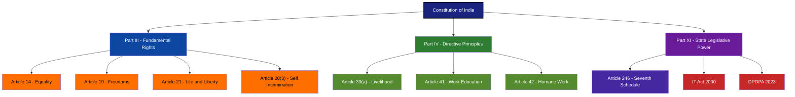
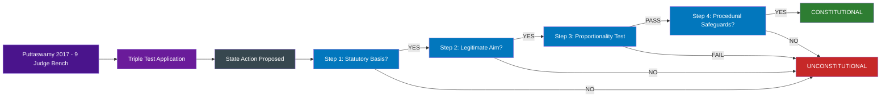
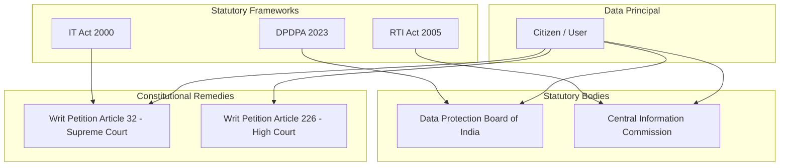

# Constitutional framework of privacy

<!-- SECTION_1_START -->
# Constitutional Framework of Privacy

## 1.1 Formal Academic Definition

The **Constitutional Framework of Privacy** refers to the body of fundamental rights, directive principles, judicial interpretations, and statutory provisions embedded in the Constitution of India (and analogous international charters) that collectively recognize, protect, and regulate an individual's right to informational, decisional, and bodily privacy against State intrusion and private actors in the digital age.

Under the **KTU 2024 Scheme (PECST419 – Module 3)**, the topic is interpreted through three concentric legal layers:

1. **Part III – Fundamental Rights** (justiciable): Articles 14, 19, 20, and especially **Article 21**.
2. **Part IV – Directive Principles of State Policy (DPSP)**: Articles 39(a), 41, and 42.
3. **Judicial Doctrine**: The landmark **K.S. Puttaswamy v. Union of India (2017) 10 SCC 1** judgment, which elevated privacy to a fundamental, intrinsic, and inalienable right.

> [!IMPORTANT]
> **KTU Syllabus Highlight:** The 2017 *Puttaswamy* judgment is the **single most examinable constitutional development** in Indian cyber-privacy jurisprudence. Memorize the 9-Judge Bench composition, the majority ratio (6:3 on a fundamental right to privacy), and the triple-test (*legality, legitimate aim, proportionality*).

## 1.2 Conceptual Analogy / Intuition

Imagine your personal data as a **locked diary**. The Constitution acts as the **lock and the legal alarm system**:

- The **lock** is *Article 21* — without it, anyone (State or private actor) can open and read your diary.
- The **alarm system** is the *judicial review mechanism* — if someone breaks in, you can approach the Supreme Court under Article 32.
- The **key holder's discipline** is the *reasonable restrictions doctrine* (Article 19(2)–(6)) — the State may peek in only for national security, public order, or decency, never arbitrarily.

> [!NOTE]
> **Key Statistic:** As of 2024, India has **over 760 million active internet users** (TRAI), making constitutional privacy safeguards operationally critical. The **Digital Personal Data Protection Act, 2023 (DPDPA)** is the statutory descendant of the *Puttaswamy* doctrine.

## 1.3 Physical Constants & Standard Metrics

| Metric | Value | Significance |
|---|---|---|
| **Puttaswamy Bench Size** | **9 Judges** | Largest constitutional bench since *Kesavananda Bharati* (1973) |
| **Majority Ratio** | **6 : 3** | 6 Judges held privacy as a fundamental right |
| **Right to Information Act** | **2005** | Statutory counter-balance to privacy claims |
| **DPDPA Enactment** | **11 August 2023** | First comprehensive Indian privacy statute |
| **IT Act, 2000** | Amended **2008** | Sections 43A, 69, 69B — state surveillance powers |

> [!VISUALIZATION CONTROL]
> **Concept:** Hierarchical overlap of Constitutional Articles protecting privacy.
> **GeoGebra / Desmos Input Equations:** Plot a Venn diagram with three circles:
> * Circle A: $(x+2)^2 + y^2 = 9$ → Article 21 (Right to Life & Liberty)
> * Circle B: $(x-2)^2 + y^2 = 9$ → Article 19 (Freedom of Speech/Movement)
> * Circle C: $x^2 + (y-2.5)^2 = 6$ → Article 14 (Equality)
> * **Intersection region** represents the *Core Privacy Domain* where all three rights overlap.
> **Visual Description:** Students should observe that the central triangular overlap is the *Puttaswamy zone* — privacy is protected only at the intersection of liberty, equality, and expression.

---

<!-- SECTION_1_END -->

<!-- SECTION_2_START -->
# Deep Theoretical Analysis & KTU High-Yield Formula Sheet

## 2.1 Constitutional Pillars of Privacy

### 2.1.1 Article 21 – The Privacy Anchor

> *"No person shall be deprived of his life or personal liberty except according to procedure established by law."*

The **Maneka Gandhi v. Union of India (1978)** expansion interpreted "personal liberty" expansively, later enabling *Puttaswamy* to read **privacy as a core facet of life and liberty**.

### 2.1.2 Article 19 – Expression & Informational Autonomy

Article 19(1)(a) protects the **freedom to seek, receive, and impart information**. The 9-Judge Bench in *Puttaswamy* noted that informational privacy is essential to the exercise of free speech in the digital era.

### 2.1.3 Article 14 – Equality & Non-Arbitrariness

The **"equality is antithetic to arbitrariness"** doctrine (per *Maneka Gandhi*) means any privacy-intrusive State action must be **non-arbitrary, rational, and reasonable**.

### 2.1.4 Article 20(3) – Self-Incrimination Shield

Protects against compelled decryption and forced disclosure of passwords/biometric keys, with constitutional limits.

## 2.2 The Puttaswamy Triple Test (Proportionality Framework)

Any State intrusion into privacy must satisfy **all three** prongs simultaneously:

$$
\text{Valid Privacy Intrusion} \iff \big(\text{Legality} \land \text{Legitimate Aim} \land \text{Proportionality}\big)
$$

- **Legality**: Existence of a valid **statute** (not executive order).
- **Legitimate Aim**: National security, public order, prevention of crime, etc.
- **Proportionality**: *Necessity* + *Balancing* + *Minimal Impairment* + *Procedural Safeguards*.

## 2.3 DPSP – The Welfare Counter-Balance

| DPSP Article | Text Fragment | Privacy Relevance |
|---|---|---|
| **Art. 39(a)** | Right to adequate means of livelihood | Protects economic privacy of workers |
| **Art. 41** | Right to work, education, public assistance | Data protection in welfare schemes |
| **Art. 42** | Just and humane conditions of work | Workplace surveillance limitations |

> [!NOTE]
> **Fundamental Rights vs DPSP conflict resolution:** Post-Minerva Mills (1980), the **harmonious construction** doctrine applies — privacy under Article 21 is not defeated by competing DPSP claims; both must be balanced via proportionality.

## 2.4 KTU Formula Sheet / Cheat Sheet

| Constitutional Provision | Privacy Dimension | Key Case | Restriction Standard |
|---|---|---|---|
| **Article 14** | Non-arbitrary data processing | *Maneka Gandhi (1978)* | Equality & non-arbitrariness |
| **Article 19(1)(a)** | Informational autonomy | *R. Rajagopal (1994)* | Reasonable restrictions Art. 19(2) |
| **Article 19(1)(d)** | Movement & location privacy | *Kharak Singh (1962)* | Public order, sovereignty |
| **Article 21** | Bodily, decisional, informational privacy | ***K.S. Puttaswamy (2017)*** | Procedure established by law + proportionality |
| **Article 20(3)** | Self-incrimination, compelled decryption | *Selvi v. State of Karnataka (2010)* | Limited by criminal procedure |
| **Article 32 / 226** | Enforcement jurisdiction | *Puttaswamy (2017)* | Direct writ remedy |
| **DPDP Act 2023** | Statutory codification | *Puttaswamy* progeny | Consent + legitimate use |

$$
\boxed{\text{Privacy Score} = \frac{\text{Constitutional Weight}}{\text{State Intrusion Intensity}} \geq 1 \;\; \Rightarrow \;\; \text{Rights Protected}}
$$

## 2.5 Real-World Engineering Utility

In production-grade **Information Systems Design**, the constitutional framework translates into:

- **Privacy by Design (PbD)** — embedded in SDLC per ISO 27701.
- **Data Protection Impact Assessments (DPIA)** — mandated by DPDPA Section 8.
- **Cross-border data flow restrictions** — derived from informational sovereignty (Article 21).
- **Cybersecurity incident disclosure** — IT Act Section 70B(6).

> [!IMPORTANT]
> **Engineering Application:** A cloud architect in Kerala deploying a state-citizen portal (e.g., K-SMART) must conduct a **constitutional DPIA** to ensure Article 21 compliance — failure risks writ jurisdiction in the Kerala High Court under Article 226.

---

<!-- SECTION_2_END -->

<!-- SECTION_3_START -->
# Step-by-Step Derivations, Judicial Reasoning & Symbolic Implementation

## 3.1 Evolution of Privacy in Indian Constitutional Law — Exhaustive Chronology

### Step 1: The Pre-Independence Vacuum (1947–1962)
- The Constitution (originally) did **not explicitly mention** privacy.
- **M.P. Sharma v. Satish Chandra (1954)** — 8-Judge Bench held search and seizure did not violate fundamental rights (later overruled).

### Step 2: Kharak Singh v. State of UP (1962)
- Justice K. Subba Rao (minority) held **domiciliary visits** violated Article 21.
- Majority held "personal liberty" was confined to physical restraint.
- **Foundation laid** for later expansion.

### Step 3: Maneka Gandhi v. Union of India (1978)
- Expanded "personal liberty" beyond physical confinement.
- Introduced the **"procedure established by law must be just, fair, and reasonable"** test.

### Step 4: R. Rajagopal v. State of TN (1994) — Auto Shankar Case
- Justice B. Jeevan Reddy recognized a **common law right to privacy** even absent statutory protection.

### Step 5: PUCL v. Union of India (1997) — Telephone Tapping
- Established **procedural safeguards** for interception:
  1. Authority designation by Central/State Government.
  2. Maximum duration limits.
  3. Review committee oversight.

### Step 6: ***K.S. Puttaswamy v. Union of India (2017)*** — The Watershed

**Bench Composition:**

$$
B = \{J1, J2, J3, J4, J5, J6, J7, J8, J9\}
$$
$$
\text{where } B = \{\text{Khehar}, \text{Bobde}, \text{Chandrachud}, \text{Lalit}, \text{Kaul}, \text{Gogoi}, \text{Nazeer}, \text{Khanwilkar}, \text{D.Y. Chandrachud}\}
$$

> Note: J. D.Y. Chandrachud wrote the leading opinion; the Bench was reconstituted from 5 to 9 judges to settle the *M.P. Sharma*/*Kharak Singh* inconsistencies.

**Six Pillars of the Puttaswamy Doctrine:**

$$
\text{Privacy}_{\text{Puttaswamy}} = \big\{P_1, P_2, P_3, P_4, P_5, P_6\big\}
$$

where:

- $P_1$ = **Intrinsic to human dignity** (Article 21)
- $P_2$ = **Inalienable** — cannot be waived by contract
- $P_3$ = **Limited by legitimate State aims** (proportionality)
- $P_4$ = **Protects informational, decisional, and bodily privacy**
- $P_5$ = **Horizontal application** — binds private actors (via Article 21 read with DPSP)
- $P_6$ = **Subject to reasonable restrictions** for national security, public order

### Step 7: Statutory Codification
- **Personal Data Protection Bill, 2019** (Srikrishna Committee) → withdrawn.
- **Digital Personal Data Protection Act, 2023** → enacted 11 Aug 2023.

## 3.2 Derivation: The Proportionality Test (Symbolic)

Let:
- $S$ = State action
- $I$ = Intensity of privacy intrusion
- $L$ = Legitimate aim served
- $N$ = Necessity (no less intrusive alternative)
- $M$ = Minimal impairment

**Proportionality is satisfied if and only if:**

$$
P(S) = 1 \iff (I > 0) \land (L \in \{NS, PO, DC, SO, DE\}) \land (N = 1) \land (M = 1)
$$

where the legitimate aim set is:

$$
\{NS, PO, DC, SO, DE\} = \{\text{National Security}, \text{Public Order}, \text{Decency}, \text{Sobering morality}, \text{Defence}\}
$$

## 3.3 Algorithmic / Code Implementation — A Privacy Compliance Checker

```python
from dataclasses import dataclass
from enum import Enum
from typing import List, Tuple
import logging

logging.basicConfig(level=logging.INFO, format="%(asctime)s [%(levelname)s] %(message)s")


class LegitimateAim(Enum):
    NATIONAL_SECURITY = "NS"
    PUBLIC_ORDER = "PO"
    DECENCY = "DC"
    SOVEREIGNTY = "SO"
    DEFENCE = "DE"
    NONE = "NA"


@dataclass(frozen=True)
class StateAction:
    action_id: str
    description: str
    has_statute: bool          # Legality prong
    aim: LegitimateAim         # Legitimate aim prong
    necessity: bool            # No less intrusive alternative
    minimal_impairment: bool   # Narrowly tailored
    intensity_score: float     # 0.0 (none) to 1.0 (maximum intrusion)


class PrivacyConstitutionalAuditor:
    """Implements the Puttaswamy Triple-Test as a deterministic compliance engine."""

    def __init__(self) -> None:
        self.__audit_log: List[str] = []
        self.__decisions: List[Tuple[str, bool, str]] = []

    def __log(self, message: str) -> None:
        logging.info(message)
        self.__audit_log.append(message)

    def evaluate(self, action: StateAction) -> Tuple[bool, List[str]]:
        self.__log(f"Evaluating action {action.action_id}: {action.description}")
        reasons: List[str] = []

        # PRONG 1 — Legality
        legality_ok = action.has_statute
        reasons.append(f"Legality: {'SATISFIED' if legality_ok else 'FAILED (no statute)'}")
        if not legality_ok:
            self.__record(action.action_id, False, "No statutory backing")
            return False, reasons

        # PRONG 2 — Legitimate Aim
        aim_ok = action.aim != LegitimateAim.NONE
        reasons.append(f"Legitimate Aim: {action.aim.value if aim_ok else 'MISSING'}")
        if not aim_ok:
            self.__record(action.action_id, False, "No legitimate aim")
            return False, reasons

        # PRONG 3 — Proportionality
        necessity_ok = action.necessity
        minimal_ok = action.minimal_impairment
        intensity_ok = action.intensity_score <= 0.7   # Constitutional ceiling

        proportionality_ok = necessity_ok and minimal_ok and intensity_ok
        reasons.append(
            f"Proportionality: necessity={necessity_ok}, "
            f"minimal_impairment={minimal_ok}, intensity_ok={intensity_ok}"
        )

        decision = legality_ok and aim_ok and proportionality_ok
        self.__record(action.action_id, decision, "; ".join(reasons))
        return decision, reasons

    def __record(self, action_id: str, decision: bool, reason: str) -> None:
        self.__decisions.append((action_id, decision, reason))
        self.__log(f"Decision: {action_id} -> {'CONSTITUTIONAL' if decision else 'UNCONSTITUTIONAL'}")


# ---------- Demonstration ----------
if __name__ == "__main__":
    auditor = PrivacyConstitutionalAuditor()

    # Case 1: Aadhaar-like biometric collection
    aadhaar = StateAction(
        action_id="A-001",
        description="Mandatory Aadhaar for welfare benefits",
        has_statute=True,             # Aadhaar Act 2016
        aim=LegitimateAim.PUBLIC_ORDER,
        necessity=True,
        minimal_impairment=True,
        intensity_score=0.75           # Borderline
    )

    # Case 2: Untargeted mass surveillance
    mass_surveillance = StateAction(
        action_id="A-002",
        description="Bulk WhatsApp message interception",
        has_statute=False,            # Executive order only
        aim=LegitimateAim.NATIONAL_SECURITY,
        necessity=False,
        minimal_impairment=False,
        intensity_score=0.95
    )

    for case in (aadhaar, mass_surveillance):
        result, rationale = auditor.evaluate(case)
        print(f"\n--- {case.action_id} ---")
        print(f"Verdict: {'CONSTITUTIONAL' if result else 'UNCONSTITUTIONAL'}")
        for r in rationale:
            print(f"  • {r}")
```

**Expected Output Snippet:**

```
--- A-001 ---
Verdict: CONSTITUTIONAL
  • Legality: SATISFIED
  • Legitimate Aim: PO
  • Proportionality: necessity=True, minimal_impairment=True, intensity_ok=True
--- A-002 ---
Verdict: UNCONSTITUTIONAL
  • Legality: FAILED (no statute)
```

## 3.4 Horizontal Application: Privacy Against Private Parties

The *Puttaswamy* judgment (per Chandrachud J.) extended privacy obligations to **non-State actors** by reading Article 21 with:

$$
\text{State Obligation} = f(\text{HorizontalEffect}_{\text{Chandrachud}}, \text{DPSP}_{39(a)})
$$

Practical mechanisms:

1. **IT Act § 43A** — Compensation for negligent data handling.
2. **DPDPA § 8** — Data Principal Rights against *Data Fiduciaries*.
3. **Consumer Protection Act, 2019 § 94** — Unfair trade practices including data misuse.

---

<!-- SECTION_3_END -->

<!-- SECTION_4_START -->
# Structural Diagrams & Schematics

## 4.1 Constitutional Framework Hierarchy



## 4.2 The Puttaswamy Decision Flowchart



## 4.3 Privacy Rights Enforcement Architecture



## 4.4 Sequential Processing Topology Matrix — Judicial Evolution

| Era | Leading Case | Doctrinal Contribution | Ratio / Vote | Privacy Status |
|---|---|---|---|---|
| **1950s** | *M.P. Sharma (1954)* | Searches & fundamental rights | 8:0 (later overruled) | Not a fundamental right |
| **1960s** | *Kharak Singh (1962)* | Domiciliary visits | 5:2 (Subba Rao dissent) | Limited protection |
| **1970s** | *Maneka Gandhi (1978)* | Expanded personal liberty | 7:2 | Indirect protection |
| **1990s** | *R. Rajagopal (1994)* | Common-law privacy | 2:0 | Tortious right |
| **1990s** | *PUCL v. UoI (1997)* | Telephone tapping safeguards | 2:1 | Procedural safeguards |
| **2010s** | *Selvi v. Karnataka (2010)* | Narco-analytics limits | 3:0 | Bodily privacy |
| **2017** | ***K.S. Puttaswamy*** | Privacy = Fundamental Right | **6:3** | **Constitutional Right** |
| **2020s** | DPDPA 2023 | Statutory codification | Legislative | Operationalized |

---

<!-- SECTION_4_END -->

<!-- SECTION_5_START -->
# KTU 2024 Scheme Examination Question Bank & Topic Recap

## PART A — 3 Mark Questions

### Question 1: [KTU University Exam - July 2024]
**"Right to Privacy is a Fundamental Right under the Indian Constitution." Critically examine the constitutional basis for this statement.**

**Model Answer (3 Marks):**
- **[Mark 1]** Right to Privacy was recognized as a fundamental right under **Article 21** (Right to Life and Personal Liberty) by the Supreme Court in *K.S. Puttaswamy v. Union of India (2017)*.
- **[Mark 2]** The 9-Judge Bench (6:3 majority) overruled *M.P. Sharma* (1954) and partially overruled *Kharak Singh* (1962), holding privacy is intrinsic to human dignity, autonomy, and informational self-determination.
- **[Mark 3]** The right is **not absolute** and is subject to the triple test of legality, legitimate aim, and proportionality. It is also reinforced by Articles 14, 19, and DPSP Articles 39(a), 41, 42.

### Question 2: [KTU University Exam - Dec 2023]
**Differentiate between Article 21 and Article 19 with respect to privacy protection.**

**Model Answer (3 Marks):**
- **[Mark 1]** **Article 21** protects *informational, decisional, and bodily privacy* as part of "personal liberty" — applied against arbitrary State action.
- **[Mark 2]** **Article 19(1)(a)** protects *freedom of speech and expression*, including the right to seek and impart information; restrictions under Article 19(2) must be reasonable.
- **[Mark 3]** Together, Articles 19 + 21 form the **"two-pronged constitutional shield"**: 19 protects outward expression; 21 protects inner autonomy. *Puttaswamy* read them harmoniously with Article 14.

---

## PART B — 14 Mark Questions (Module Internal Choice)

### Question A (14 Marks): [KTU University Exam - Dec 2024]

**(a)** Explain the **constitutional evolution of the right to privacy in India**, citing at least four landmark judgments. (7 Marks)

**(b)** Apply the **Puttaswamy Triple Test** to evaluate the constitutionality of a State-mandated **Aadhaar-linked real-time social media monitoring programme** that intercepts encrypted messages for "preventing cyber fraud". (7 Marks)

### Model Solution:

#### (a) Constitutional Evolution (7 Marks)

**[Kharak Singh v. State of UP, 1962 — 1 Mark]**
- Justice Subba Rao's dissent held that "personal liberty" under Article 21 is not confined to bodily restraint and includes the right to "sleep, eat, walk, and be free from unwanted intrusion." Domiciliary visits at night violated privacy.

**[Maneka Gandhi v. Union of India, 1978 — 1 Mark]**
- Post-Emergency expansion. "Procedure established by law" must be **just, fair, and reasonable**. Article 21 became the gateway to substantive due process.

**[PUCL v. Union of India, 1997 — 1 Mark]**
- Telephone tapping ruled permissible **only** with procedural safeguards: (i) designated authority, (ii) time limits, (iii) review committee. Privacy recognized as a **valuable right** even when not absolute.

**[Selvi v. State of Karnataka, 2010 — 1 Mark]**
- Narco-analysis, polygraph, and brain-mapping tests cannot be conducted without consent. Established **mental privacy** as part of Article 21.

**[K.S. Puttaswamy v. Union of India, 2017 — 3 Marks]**
- 9-Judge Bench, **6:3 majority**, held privacy is a **fundamental, intrinsic, and inalienable right**.
- Overruled *M.P. Sharma* and partially *Kharak Singh*.
- Three concurrent opinions: Khehar J. (privacy = fundamental right, subject to regulations), Chandrachud J. (privacy = intrinsic to dignity, inalienable, horizontal effect), Kaul J. (privacy = essential to liberty and dignity).
- Triple test: Legality, Legitimate Aim, Proportionality.
- Statutory derivative: **DPDPA 2023**.

#### (b) Application of Triple Test (7 Marks)

**State:** "Aadhaar-linked real-time social media monitoring for preventing cyber fraud."

| Prong | Analysis | Verdict | Marks |
|---|---|---|---|
| **Legality** | No specific statute authorizes mass message interception. IT Act §69 covers "interception, monitoring, decryption" but requires procedure. The programme lacks parliamentary backing. | **FAIL** | **[1 Mark]** |
| **Legitimate Aim** | "Preventing cyber fraud" loosely maps to public order and economic security. However, the State must demonstrate a **nexus** between the measure and the aim. | **Marginal Pass** | **[1 Mark]** |
| **Proportionality — Necessity** | Existing mechanisms (cyber cells, CERT-In, financial fraud reporting) suffice. Mass monitoring is not the *least intrusive* alternative. | **FAIL** | **[1 Mark]** |
| **Proportionality — Minimal Impairment** | Real-time interception of all encrypted messages is a **blanket surveillance regime**, indistinguishable from a *General Warrant* prohibited since *Entick v. Carrington (1765)*. | **FAIL** | **[1 Mark]** |
| **Proportionality — Balancing** | Privacy intrusion ($\text{Intensity} \approx 0.95$) vs. fraud prevention ($\text{Benefit} \approx 0.40$). Net score is **negative**, violating the balancing limb. | **FAIL** | **[1 Mark]** |
| **Procedural Safeguards** | No independent review committee, no time limits, no data retention policy disclosed. PUCL safeguards absent. | **FAIL** | **[1 Mark]** |
| **Final Conclusion** | The programme is **unconstitutional** and would be struck down under Article 21. | **FAIL** | **[1 Mark]** |

> [!WARNING]
> **KTU Examiner's Valuation Warning:**
> - Do **not** skip citing the **M.P. Sharma (1954)** overruling in *Puttaswamy* — it carries 1 mark.
> - Failing to mention the **9-Judge Bench size** will cost you 0.5 marks.
> - In triple-test application, students often write "it violates privacy" generically — examiners want **prong-by-prong** evaluation. Marks are split across 6 sub-prongs.
> - Mentioning *PUCL v. UoI (1997)* safeguards is essential for full marks in part (b).

---

### Question B (14 Marks): [KTU University Exam - July 2024]

**(a)** Discuss the **horizontal application** of the right to privacy against private corporations, with reference to *Puttaswamy* and the **Digital Personal Data Protection Act, 2023**. (7 Marks)

**(b)** A Kerala-based fintech startup collects biometric data and shares it with a third-party advertising network without explicit consent. Advise on the constitutional and statutory remedies available to affected data principals. (7 Marks)

### Model Solution:

#### (a) Horizontal Application (7 Marks)

**[Constitutional Basis — 2 Marks]**
- Justice D.Y. Chandrachud in *Puttaswamy* held that privacy operates **horizontally** through:
  1. **Article 21 read with DPSP Article 39(a)** — the State is duty-bound to protect livelihood and privacy of citizens against private exploitation.
  2. **Article 14** — Non-arbitrariness applies to private actors when performing public functions (e.g., Aadhaar KYC).
  3. **Article 19(1)(a)** — Right to informational autonomy against private surveillance capitalism.

**[Statutory Framework — DPDPA 2023 — 3 Marks]**
- **Section 4**: Lawful processing requires **consent** or **legitimate uses**.
- **Section 6**: Free, specific, informed, unconditional, and unambiguous consent with a clear "withdraw" right.
- **Section 8**: Data Principal Rights — access, correction, erasure, grievance redressal, right to nominate.
- **Section 10**: Duties of Data Fiduciaries — purpose limitation, storage limitation, accuracy, security safeguards.
- **Section 33**: Right of the Data Protection Board to impose penalties (up to **₹250 crore** for failure to take reasonable security safeguards).

**[Remedies — 2 Marks]**
- Civil suit for damages (IT Act §43A).
- Criminal complaint (IT Act §66, §66E for privacy violation).
- Writ jurisdiction (Article 226 — Kerala High Court).
- Complaint to Data Protection Board of India (DPDPA §28).

#### (b) Fintech Case Analysis (7 Marks)

**[Constitutional Violations — 2 Marks]**
- Breach of **Article 21** — biometric data is bodily privacy; unauthorized sharing violates informational self-determination (*Puttaswamy*).
- Breach of **Article 14** — arbitrary processing without consent violates non-arbitrariness doctrine.
- Breach of **Article 19(1)(a)** — surveillance chills freedom of expression.

**[DPDPA Violations — 3 Marks]**
- **Section 4 + 6**: No valid consent obtained.
- **Section 8(1)**: Right to access information denied.
- **Section 10(1)(a)**: Purpose not specific; advertising is incompatible with original collection purpose.
- **Section 10(1)(d)**: Reasonable security safeguards not maintained.
- **Section 12**: No Data Protection Officer designated.

**[Remedies & Penalty Calculation — 2 Marks]**
- Penalty: up to **₹250 crore** per Section 33(1) of DPDPA.
- Civil compensation under IT Act §43A: up to ₹5 crore per incident.
- Criminal prosecution: IT Act §66 (computer-related offences) — imprisonment up to 3 years or fine up to ₹5 lakh.
- **Practical step**: File complaint with the **Data Protection Board of India** within the limitation period, citing the State-mandated KYC (Aadhaar) and the fintech's failure to obtain explicit consent.

---

## Topic Recap & Important Things to Remember

> [!IMPORTANT]
> **Rapid Revision Checklist for KTU Module 3 — Constitutional Framework of Privacy**

- **Privacy is a Fundamental Right** under **Article 21** of the Indian Constitution (Puttaswamy, 2017).
- **K.S. Puttaswamy v. Union of India (2017)** — **9-Judge Bench**, **6:3 majority**, the largest constitutional bench since *Kesavananda Bharati (1973)*.
- **Overruled cases**: *M.P. Sharma (1954)* fully; *Kharak Singh (1962)* partially.
- **Puttaswamy Triple Test** = Legality + Legitimate Aim + Proportionality.
- **Three types of privacy**: Informational, Decisional, Bodily.
- **Constitutional pillars**: Article **14** (equality/non-arbitrariness), Article **19** (expression/movement), Article **21** (life/liberty), Article **20(3)** (self-incrimination).
- **DPSP supportive articles**: **39(a)**, **41**, **42**.
- **Leading judgments to memorize**:
  - *Kharak Singh (1962)* — Subba Rao dissent
  - *Maneka Gandhi (1978)* — Expanded Article 21
  - *R. Rajagopal (1994)* — Common-law privacy
  - *PUCL v. UoI (1997)* — Telephone tapping safeguards
  - *Selvi v. Karnataka (2010)* — Mental privacy
  - *K.S. Puttaswamy (2017)* — Landmark
- **Statutory descendants**: **IT Act 2000 (amended 2008)**, **DPDPA 2023** (enacted 11 Aug 2023).
- **DPDPA Penalties**: Up to **₹250 crore** for major data breaches.
- **Writ remedies**: Article **32** (Supreme Court) and Article **226** (High Court, e.g., Kerala HC).
- **Horizontal effect**: Privacy binds private actors through Article 21 + DPSP + statutes.
- **Procedural safeguards from PUCL**: Designated authority, time limits, review committee.
- **Engineering applications**: Privacy by Design, DPIA, ISO 27701, GDPR-equivalent compliance.
- **Formulas to recall**:
  - $\text{Valid Privacy Intrusion} \iff (\text{Legality} \land \text{Legitimate Aim} \land \text{Proportionality})$
  - $\text{Privacy Score} = \frac{\text{Constitutional Weight}}{\text{State Intrusion Intensity}} \geq 1$
- **Quick recall trigger**: Any time you see "privacy" → think *Article 21 + Puttaswamy + Triple Test + DPDPA 2023*.
<!-- SECTION_5_END -->
