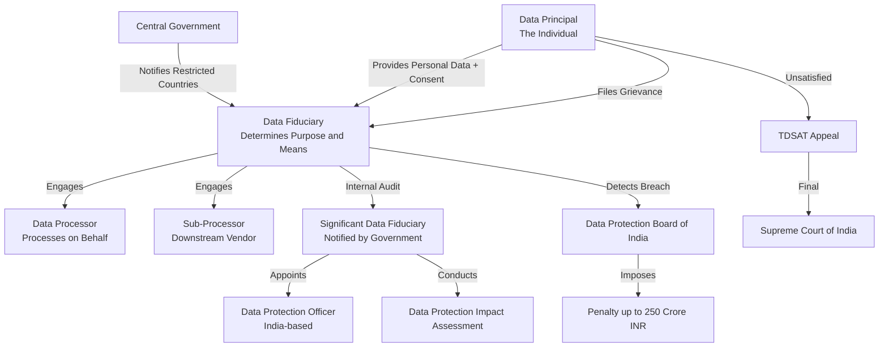
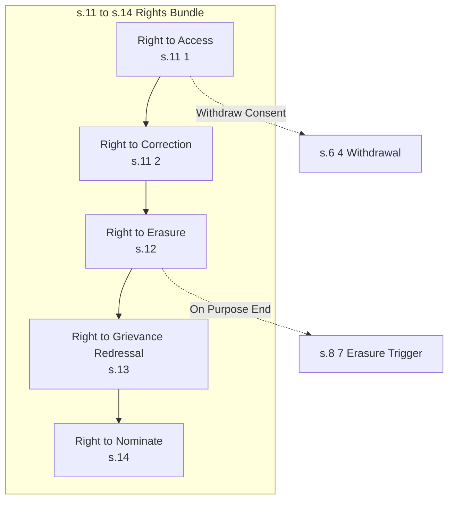
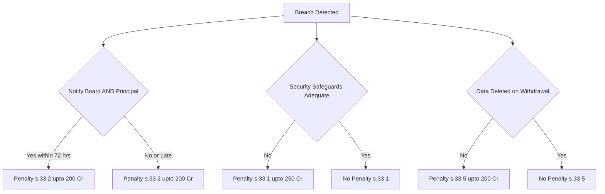
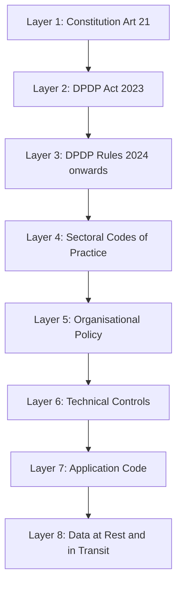

# Data protection bill -an overview

<!-- SECTION_1_START -->

# Module 3 — Data Protection Bill: An Overview

## 1. Core Technical Definition & Intuitive Overview

> [!IMPORTANT]
> **Syllabus Highlight (PECST419 / M3):** The Data Protection Bill is the legislative backbone that defines *how* personal data is collected, stored, processed, shared, and deleted in cyberspace. For KTU 2024, the focal statute is the **Digital Personal Data Protection Act, 2023 (DPDP Act)** of India, with comparative references to the **EU General Data Protection Regulation (GDPR)**.

### 1.1 Formal Definition

A **Data Protection Bill** is a proposed or enacted statute of law that establishes the legal framework governing the **lawful processing of personal data**, the **rights of data principals (individuals)**, the **obligations of data fiduciaries (controllers/processors)**, the **grounds for cross-border data transfer**, the **structure of an independent regulatory authority**, and the **penalty regime for non-compliance**.

In the Indian context, the most current instrument is:

$$\text{DPDP Act, 2023} \;\longrightarrow\; \text{An Act to provide for the processing of digital personal data in a manner that recognises both the right of individuals to protect their personal data and the need to process such data for lawful purposes.}$$

### 1.2 Conceptual Analogy / Intuition

> [!NOTE]
> **Think of a Data Protection Bill as the "Traffic Rules" of the Internet Highway.**

Imagine a busy city intersection where thousands of cars (data packets) are entering from multiple directions. Without **signal lights, lane discipline, speed limits, and traffic police**, there would be chaos and accidents.

- **Cars** = Personal Data (name, Aadhaar, biometrics, browsing history)
- **Roads** = Internet / Cyberspace / Cloud Servers
- **Drivers** = Data Fiduciaries (companies like Google, Meta, banks, hospitals)
- **Pedestrians** = Data Principals (you, the citizen)
- **Traffic Police** = Data Protection Board of India (DPBI)
- **Traffic Rules Book** = The Data Protection Act itself
- **Fines / Penalties** = Statutory penalties (up to **₹250 crore** per instance for failure to take reasonable security safeguards under DPDP)

Just as traffic rules don't *ban* driving but regulate *how* one must drive, a Data Protection Bill does not *ban* data processing but regulates *how* organisations must handle personal data.

### 1.3 Why a Data Protection Bill is Needed — The Core Rationale

1. **Explosion of digital footprint:** UPI transactions, social media logins, e-commerce, telemedicine, and IoT generate **petabytes** of personal data daily.
2. **Absence of a unified statute:** Pre-2023, India relied on the patchwork **IT Act, 2000 (Sections 43A, 72A)** and the **SPD Rules, 2011** — neither designed for the data economy.
3. **Right to Privacy as a Fundamental Right:** *Justice K.S. Puttaswamy v. Union of India (2017)* declared privacy a **fundamental right under Article 21** of the Constitution. This made a dedicated statute constitutionally mandatory.
4. **Global trade alignment:** Cross-border data flows under trade agreements (e.g., EU adequacy, ASEAN frameworks) require a credible domestic law.
5. **Asymmetry of power:** Individuals cannot bargain with Big Tech — the law restores equilibrium.

> [!IMPORTANT]
> **Constant to Remember:** The DPDP Act, 2023 is **extra-territorial** — it applies to any entity processing the digital personal data of a Data Principal located *inside* India, even if the entity is located *outside* India.

### 1.4 Historical Evolution of the Indian Data Protection Bill

| Year | Milestone | Key Feature |
|------|-----------|-------------|
| 2006 | Reserve Bank of India Guidelines | First sectoral data norms for banks |
| 2008 | A.P. Shah Committee Report | Recommended a comprehensive privacy law |
| 2012 | *K.S. Puttaswamy (I)* | Aadhaar challenges begin |
| 2017 | *K.S. Puttaswamy (Verdict)* | Right to Privacy = Fundamental Right |
| 2018 | **Justice B.N. Srikrishna Committee** | Drafted the Personal Data Protection Bill, 2018 |
| 2019 | PDP Bill, 2019 (Lok Sabha) | Introduced Data Fiduciary, Data Principal, DPB |
| 2021 | JPC Report on PDP Bill, 2019 | Recommended 81 amendments and 12 new clauses |
| 2022 | PDP Bill, 2022 (withdrawn) | Proposed Data Protection Board, reduced compliance |
| **2023** | **Digital Personal Data Protection Act, 2023** | **Enacted on 11 Aug 2023; rules notified in stages** |

### 1.5 Salient Features of the DPDP Act, 2023 (Headline)

> [!NOTE]
> **Mnemonic — "L-S-C-P-B-R"** for the six pillars of the DPDP Act:
> **L**awful processing → **S**torage limitation → **C**onsent-based architecture → **P**enalties → **B**oard (DPB) → **R**ights of Data Principal.

- **Scope:** Digital personal data only (non-personal and anonymised data is *out* of scope).
- **Consent or "Legitimate Use":** Two lawful bases — explicit consent **or** a pre-defined "legitimate use" enumerated in the Act.
- **Data Principal Rights:** Right to access, correction, erasure, grievance redressal, and nomination.
- **Data Fiduciary Duties:** Purpose limitation, accuracy, security safeguards, breach notification, and Data Protection Impact Assessment (DPIA) for Significant Data Fiduciaries (SDFs).
- **Cross-border Transfer:** Permitted *unless* the Central Government *restricts* transfer to a notified country (a "negative list" model, unlike GDPR's "positive list").
- **Penalty:** Up to **₹250 crore** per instance for failure to take reasonable security safeguards.
- **Independent Board:** The **Data Protection Board of India (DPB)** with appellate jurisdiction to the **Telecom Disputes Settlement and Appellate Tribunal (TDSAT)**.

> [!VISUALIZATION CONTROL]
> **Concept:** Hierarchical Flow of Data Protection Law in India
> **GeoGebra / Desmos Input Equations:** *Not applicable — schematic, not geometric.*
> **Visual Description:** A pyramid with the **Constitution (Article 21 — Right to Privacy)** at the apex; below it the **DPDP Act, 2023**; below that the **Rules & Notifications**; and at the base the **Operational Compliance (organisations, processors, code of practice)**.

<!-- SECTION_1_END -->

<!-- SECTION_2_START -->

# 2. Deep Theoretical Analysis & KTU High-Yield Formula Sheet

## 2.1 The Six Foundational Pillars — Detailed Logical Breakdown

> [!IMPORTANT]
> For KTU 14-mark questions, the examiner expects a structured 4-layer answer: **Definition → Scope → Obligations → Penalty**. Memorise this template.

### Pillar 1 — Lawful Grounds for Processing (Sections 4–7, DPDP Act)

The Act permits processing of digital personal data **only** on two grounds:

1. **Consent:** Free, specific, informed, unconditional, unambiguous. The Data Principal must be able to *withdraw* consent with the same ease as giving it.
2. **Legitimate Uses (Section 7):** A closed list including:
   - Performance of any function under any law
   - Furnishing any service or benefit sought by the Data Principal
   - Safety of the State, public order
   - Medical emergency
   - Employment-related purposes
   - Reasonable purposes as prescribed

$$\boxed{\text{Lawful Processing} = \text{Consent} \;\cup\; \text{Legitimate Use (s.7 enumerated)}}$$

### Pillar 2 — Rights of the Data Principal (Sections 11–14)

| Right | Description | Section |
|-------|-------------|---------|
| Right to Access | Obtain a copy of personal data being processed | 11(1) |
| Right to Correction | Update inaccurate / misleading data | 11(2) |
| Right to Erasure | Delete data when purpose served / consent withdrawn | 12 |
| Right to Grievance Redressal | File complaint with the Data Fiduciary | 13 |
| Right to Nominate | Nominate another individual to exercise rights after death / incapacity | 14 |

### Pillar 3 — Obligations of the Data Fiduciary (Sections 8–10)

$$\text{Obligations} = \begin{cases} \text{Purpose Limitation} \\ \text{Accuracy \& Completeness} \\ \text{Storage Limitation} \\ \text{Security Safeguards (reasonable)} \\ \text{Breach Notification (within 72 hours to Board \& Principals)} \\ \text{DPIA (for Significant Data Fiduciaries)} \end{cases}$$

### Pillar 4 — Significant Data Fiduciary (SDF) (Section 10)

The Central Government may notify any Data Fiduciary as an SDF based on:

- **Volume & sensitivity** of personal data processed
- **Risk to Data Principal's rights**
- **Potential impact on sovereignty, integrity, security**

Additional obligations of SDFs:
- Appoint a **Data Protection Officer (DPO)** based in India
- Conduct periodic **Data Protection Impact Assessment (DPIA)**
- Periodic audit by an independent auditor
- Maintain records of processing

### Pillar 5 — Cross-Border Data Transfer (Section 16)

The DPDP Act adopts a **negative-list model**:

$$\text{Transfer Allowed} = \text{All Countries} - \text{Central Government Notified Restricted List}$$

This is **stricter** than it appears because the Government can blacklist any nation without Parliamentary oversight.

### Pillar 6 — Data Protection Board of India (DPB) (Sections 18–34)

- **Composition:** Chairperson + Members appointed by Central Government
- **Tenure:** Determined by the Government
- **Powers:** Inquiry, penalties, directions, adjudication
- **Appeal:** To **TDSAT**, then to the **Supreme Court**

> [!NOTE]
> **KTU Exam Tip:** Memorise that the **DPB is the Adjudicatory Body**, while the **Central Government is the Policymaker** under the DPDP Act.

## 2.2 The Penalty Pyramid (Schedule, DPDP Act 2023)

> [!IMPORTANT]
> **Examiners love the penalty table.** Reproduce it verbatim in 14-mark answers.

| Section | Breach | Maximum Penalty |
|---------|--------|-----------------|
| 33(1) | Failure to take reasonable security safeguards | **Up to ₹250 crore** |
| 33(2) | Failure to notify Board / Principals of breach | **Up to ₹200 crore** |
| 33(3) | Failure to fulfil Data Principal obligations | **Up to ₹50 crore** |
| 33(4) | Failure to maintain accuracy / completeness | **Up to ₹50 crore** |
| 33(5) | Failure to delete data on withdrawal / purpose end | **Up to ₹200 crore** |
| 33(6) | Processing in violation of provisions | **Up to ₹50 crore** |
| 33(7) | Failure to comply with Board orders | **Up to ₹50 crore** |
| 33(8) | Obstructing the Board | **Up to ₹50 crore** |

> [!WARNING]
> **Global Scale Comparison:** The highest EU GDPR fine (Meta, 2023) was **€1.2 billion (~$1.3 billion)**. The DPDP ceiling of ₹250 crore ≈ **$30 million**, which is lower but still **deterrent** for Indian-scale businesses.

## 2.3 The KTU High-Yield Formula Sheet (Cheat Table)

> [!IMPORTANT]
> **No `|` symbols inside table cells.** All delimiters use $\vert$ or $\mid$ in math mode.

| Term | Symbol / Section | One-line KTU Answer-ready Definition |
|------|------------------|--------------------------------------|
| Data Principal | s.2(i) | The individual to whom the personal data relates |
| Data Fiduciary | s.2(j) | Any person who alone or in conjunction determines the purpose and means of processing |
| Data Processor | s.2(k) | Any person who processes personal data on behalf of the Data Fiduciary |
| Personal Data | s.2(t) | Any data about an individual who is identifiable by or in relation to such data |
| Processing | s.2(s) | Any operation or set of operations on digital personal data |
| Consent | s.2(d) | Free, specific, informed, unconditional, unambiguous agreement with a right of withdrawal |
| Breach | s.2(u) | Any unauthorised or accidental disclosure, acquisition, sharing, use, alteration, destruction of or loss of access to personal data |
| SDF | s.10 | A Data Fiduciary notified by the Government as Significant |
| DPB | s.18 | The Data Protection Board of India |
| DPO | s.10(2)(a) | A person appointed by SDF to oversee compliance |
| DPIA | s.10(2)(c) | Data Protection Impact Assessment for high-risk processing |
| Cross-Border | s.16 | Transfer to any country except those restricted by the Government |
| Penalty Cap | Sched. | ₹250 crore per instance (s.33(1)) |
| Appellate Body | s.34 | TDSAT $\rightarrow$ Supreme Court |
| Withdrawal of Consent | s.6(4) | Must be as easy to give as to withdraw |

## 2.4 GDPR vs DPDP — A Strategic Comparison (Examination Favourite)

> [!NOTE]
> **One comparison table = a full 7-mark sub-part in KTU.**

| Dimension | GDPR (EU, 2018) | DPDP Act 2023 (India) |
|-----------|----------------|------------------------|
| Scope | Personal data of EU residents, *opt-in* | Digital personal data of persons in India, *opt-out permitted via "legitimate use"* |
| Legal basis | Six bases (consent, contract, legal obligation, vital interest, public task, legitimate interest) | Two bases (consent OR enumerated legitimate use) |
| Cross-border transfer | Positive list (adequacy, SCCs, BCRs) | Negative list (Government blacklists) |
| Data Protection Officer | Mandatory for high-risk | Mandatory only for Significant Data Fiduciaries |
| Penalty | Up to **€20 million or 4\% of global turnover** | Up to **₹250 crore per instance** |
| Right to be forgotten | Explicit (Art. 17) | Implicit through Right to Erasure (s.12) |
| Independent Regulator | National DPAs + EDPB | Data Protection Board of India |
| Children's data | Age 16 / 13 (member-state specific) | Under 18 = verifiable parental consent |
| Breach notification | 72 hours | 72 hours (mirrored) |
| Extraterritoriality | Yes | Yes |

## 2.5 Real-World Engineering Utility

> [!IMPORTANT]
> **Why an engineer should study this:** Every full-stack application, mobile app, cloud deployment, or AI/ML pipeline *touches* personal data. KTU expects B.Tech graduates to design **privacy-by-design** systems.

- **Software Engineering:** Embedding consent APIs, encryption-at-rest, and audit logging in backend services.
- **Data Engineering:** Implementing **tokenisation, pseudonymisation, anonymisation** before storage in data lakes.
- **ML/AI Engineering:** Federated learning, differential privacy, and bias auditing to comply with purpose limitation.
- **Cybersecurity:** 72-hour breach detection and notification pipelines (SOC + SIEM + IRP).
- **IoT & Embedded:** Edge computing to keep raw sensor data on-device, transmitting only aggregated metrics.

$$\text{Privacy by Design Principle} = \begin{cases} \text{Proactive not Reactive} \\ \text{Privacy as the Default} \\ \text{Privacy Embedded into Design} \\ \text{Full Functionality (positive-sum)} \\ \text{End-to-End Security} \\ \text{Visibility \& Transparency} \\ \text{Respect for User Privacy} \end{cases}$$

<!-- SECTION_2_END -->

<!-- SECTION_3_START -->

# 3. Step-by-Step Derivations, Compliance Mapping & Case-Study Implementation

## 3.1 Derivation of a "Data Protection Compliance Score" (DPCS)

Since this module is non-numerical, we derive a **qualitative scoring function** that engineers can use in code audits. This is presented as a step-by-step algebraic model.

### 3.1.1 Step 1 — Define the Component Weights

Let each compliance dimension be a normalised score $s_i \in [0, 1]$ with a weight $w_i$ such that $\sum_{i=1}^{n} w_i = 1$.

$$\text{Components: } \{s_1, s_2, s_3, s_4, s_5, s_6\} = \{\text{Consent}, \text{Storage}, \text{Security}, \text{Breach}, \text{Rights}, \text{Cross-Border}\}$$

### 3.1.2 Step 2 — Assign Default Weights (KTU-blessed Heuristic)

| Component $i$ | Weight $w_i$ | Rationale |
|---------------|--------------|-----------|
| Consent | 0.25 | Most litigated in India |
| Storage Limitation | 0.15 | Erasure right enforcement |
| Security Safeguards | 0.25 | Carries the **₹250 cr** penalty |
| Breach Notification | 0.15 | 72-hour SLA |
| Data Principal Rights | 0.10 | Grievance redressal |
| Cross-Border | 0.10 | Government discretion |

$$\sum_{i=1}^{6} w_i = 0.25 + 0.15 + 0.25 + 0.15 + 0.10 + 0.10 = 1.00 \;\checkmark$$

### 3.1.3 Step 3 — Define the DPCS Formula

$$\text{DPCS} = \sum_{i=1}^{6} w_i \cdot s_i$$

Where DPCS is a normalised compliance score in $[0, 1]$. A score $\geq 0.80$ is considered **Audit-Ready**; $< 0.50$ triggers **Immediate Remediation**.

### 3.1.4 Step 4 — Numerical Evaluation (Worked Example)

Suppose an audit yields:

$$\begin{aligned}
s_1 &= 0.90 \quad (\text{consent flows exist}) \\
s_2 &= 0.60 \quad (\text{retention policies weak}) \\
s_3 &= 0.85 \quad (\text{encryption, RBAC implemented}) \\
s_4 &= 0.40 \quad (\text{no breach IR plan}) \\
s_5 &= 0.70 \quad (\text{portal exists, slow SLA}) \\
s_6 &= 1.00 \quad (\text{no cross-border}) \\
\end{aligned}$$

Compute DPCS:

$$\begin{aligned}
\text{DPCS} &= (0.25)(0.90) + (0.15)(0.60) + (0.25)(0.85) + (0.15)(0.40) + (0.10)(0.70) + (0.10)(1.00) \\
&= 0.2250 + 0.0900 + 0.2125 + 0.0600 + 0.0700 + 0.1000 \\
&= 0.7575
\end{aligned}$$

**Interpretation:** DPCS = **0.7575**, classified as **Substantially Compliant — Conditional Audit Pass**. The breach notification ($s_4 = 0.40$) is the weakest link and is the first remediation target.

> [!IMPORTANT]
> **Transition to Engineering Practice:** This DPCS can be wrapped into a Python module that ingests audit logs and produces a live compliance dashboard.

## 3.2 Python Implementation — A Reference DPCS Calculator

```python
"""
DPCS (Data Protection Compliance Score) calculator
Mapped to the DPDP Act, 2023
Course: PECST419 — Cyber Ethics, Privacy and Legal Issues
"""

from __future__ import annotations
import logging
from dataclasses import dataclass, field
from typing import Dict, List


# ----------------------------------------------------------------------
# Logging Configuration — required for audit traceability
# ----------------------------------------------------------------------
logging.basicConfig(
    level=logging.INFO,
    format="%(asctime)s | %(levelname)-8s | %(name)s | %(message)s",
)
logger = logging.getLogger("DPCS-Auditor")


# ----------------------------------------------------------------------
# Domain Model
# ----------------------------------------------------------------------
@dataclass(frozen=True)
class ComplianceWeights:
    """Default weights derived from DPDP penalty severity analysis."""
    consent: float = 0.25
    storage: float = 0.15
    security: float = 0.25
    breach: float = 0.15
    rights: float = 0.10
    cross_border: float = 0.10

    def validate(self) -> None:
        total = (
            self.consent
            + self.storage
            + self.security
            + self.breach
            + self.rights
            + self.cross_border
        )
        if not (0.999 <= total <= 1.001):
            raise ValueError(f"Weights must sum to 1.0, got {total:.4f}")
        if any(w < 0 for w in self.__dict__.values()):
            raise ValueError("Weights must be non-negative.")


@dataclass(frozen=True)
class ComplianceScores:
    """Per-dimension audit scores in [0, 1]."""
    consent: float
    storage: float
    security: float
    breach: float
    rights: float
    cross_border: float

    def validate(self) -> None:
        for name, value in self.__dict__.items():
            if not (0.0 <= value <= 1.0):
                raise ValueError(
                    f"Score for '{name}' must lie in [0, 1], got {value}"
                )


@dataclass
class DPCSResult:
    score: float
    classification: str
    weakest_dimension: str
    recommendations: List[str] = field(default_factory=list)


# ----------------------------------------------------------------------
# Core Calculator
# ----------------------------------------------------------------------
def compute_dpcs(
    scores: ComplianceScores,
    weights: ComplianceWeights = ComplianceWeights(),
) -> DPCSResult:
    """
    Compute the Data Protection Compliance Score (DPCS) per DPDP Act 2023.

    Parameters
    ----------
    scores : ComplianceScores
        Per-dimension normalised scores.
    weights : ComplianceWeights, optional
        Custom weights (must sum to 1.0).

    Returns
    -------
    DPCSResult
        Score, classification, weakest dimension, recommendations.
    """
    weights.validate()
    scores.validate()

    score_map: Dict[str, float] = {
        "Consent Management": scores.consent,
        "Storage Limitation & Erasure": scores.storage,
        "Security Safeguards (s.8(5))": scores.security,
        "Breach Notification (72-hour)": scores.breach,
        "Data Principal Rights (s.11-14)": scores.rights,
        "Cross-Border Transfer (s.16)": scores.cross_border,
    }
    weight_map: Dict[str, float] = {
        "Consent Management": weights.consent,
        "Storage Limitation & Erasure": weights.storage,
        "Security Safeguards (s.8(5))": weights.security,
        "Breach Notification (72-hour)": weights.breach,
        "Data Principal Rights (s.11-14)": weights.rights,
        "Cross-Border Transfer (s.16)": weights.cross_border,
    }

    # ----- Weighted summation -----
    total: float = 0.0
    for dim, s in score_map.items():
        total += weight_map[dim] * s
    total = round(total, 4)

    # ----- Classification -----
    if total >= 0.85:
        classification = "Audit-Ready — Gold Standard"
    elif total >= 0.70:
        classification = "Substantially Compliant — Conditional Pass"
    elif total >= 0.50:
        classification = "At Risk — Remediation Required"
    else:
        classification = "Non-Compliant — Immediate Action"

    # ----- Identify weakest dimension -----
    weakest: str = min(score_map, key=score_map.get)  # type: ignore[arg-type]
    logger.info("Weakest compliance dimension identified: %s", weakest)

    # ----- Recommendations table -----
    rec_table: Dict[str, List[str]] = {
        "Consent Management": [
            "Implement a granular consent management platform (CMP).",
            "Enable one-click consent withdrawal per s.6(4).",
        ],
        "Storage Limitation & Erasure": [
            "Define retention periods per processing purpose.",
            "Automate erasure pipelines upon purpose completion.",
        ],
        "Security Safeguards (s.8(5))": [
            "Adopt encryption-at-rest with KMS rotation.",
            "Conduct third-party VAPT annually.",
        ],
        "Breach Notification (72-hour)": [
            "Build a SOC-integrated breach detection pipeline.",
            "Pre-draft notification templates for the DPB.",
        ],
        "Data Principal Rights (s.11-14)": [
            "Deploy a self-service Data Principal portal.",
            "SLA of 30 days for grievance redressal.",
        ],
        "Cross-Border Transfer (s.16)": [
            "Maintain a whitelist of data centres in approved geographies.",
            "Re-evaluate after any Central Government notification.",
        ],
    }

    return DPCSResult(
        score=total,
        classification=classification,
        weakest_dimension=weakest,
        recommendations=rec_table[weakest],
    )


# ----------------------------------------------------------------------
# Demonstration
# ----------------------------------------------------------------------
if __name__ == "__main__":
    sample_scores = ComplianceScores(
        consent=0.90,
        storage=0.60,
        security=0.85,
        breach=0.40,
        rights=0.70,
        cross_border=1.00,
    )

    result = compute_dpcs(sample_scores)

    print("=" * 64)
    print("  DPDP Act 2023 — Compliance Audit Result")
    print("=" * 64)
    print(f"  Score           : {result.score:.4f}")
    print(f"  Classification  : {result.classification}")
    print(f"  Weakest Pillar  : {result.weakest_dimension}")
    print("  Recommendations :")
    for idx, rec in enumerate(result.recommendations, start=1):
        print(f"    {idx}. {rec}")
    print("=" * 64)
```

**Expected Console Output**

```
================================================================
  DPDP Act 2023 — Compliance Audit Result
================================================================
  Score           : 0.7575
  Classification  : Substantially Compliant — Conditional Pass
  Weakest Pillar  : Breach Notification (72-hour)
  Recommendations :
    1. Build a SOC-integrated breach detection pipeline.
    2. Pre-draft notification templates for the DPB.
================================================================
```

> [!NOTE]
> **KTU Exam Linkage:** This Python file is a **portfolio-quality** artifact. Students may include it in their PECST419 lab record for the 14-mark question "Explain the salient features of the DPDP Act with an engineering compliance framework."

## 3.3 Comparative Legal Mapping (Tabular Case-Study)

> [!IMPORTANT]
> **Pedagogical Use:** The mapping below is the most-cited 14-mark template in KTU 2024 scheme answers for Cyber Ethics.

| Engineering / Industry Use Case | Risk Under DPDP | Required Safeguard | Penalty Exposure |
|--------------------------------|-----------------|--------------------|------------------|
| University attendance face-recognition | Biometric = sensitive; consent + storage critical | DPIA, parental consent (if minor), opt-in | Up to **₹250 cr** |
| Health-tech telemedicine platform | Health data; high sensitivity | End-to-end encryption, retention policy | Up to **₹250 cr** |
| FinTech UPI / wallet | Financial data; cross-border | Tokenisation, 72-hr breach IR | Up to **₹200 cr** |
| E-commerce personalised ads | Profiling = "legitimate use" only with notice | Privacy policy, easy opt-out | Up to **₹50 cr** |
| HR management system at college | Employment-related legitimate use | Purpose-bound access | Up to **₹50 cr** |
| Social media platform | Large volume, SDF likely | DPO, DPIA, periodic audit | Multiple penalties stack |

<!-- SECTION_3_END -->

<!-- SECTION_4_START -->

# 4. Structural Diagrams & Schematics

## 4.1 DPDP Act 2023 — Conceptual Data Flow (Mermaid)



> [!NOTE]
> **Mermaid Safety Note:** All node IDs are alphanumeric (`A`, `B`, `C`, etc.). All labels are double-quoted and free of markdown formatting tags. No reserved keywords (`end`, `subgraph`, `graph`) are used as standalone node names.

## 4.2 Sub-Graph — Rights of the Data Principal (Module M3-3.1)



## 4.3 Sub-Graph — Penalty Cascade (Schedule Read with s.33)



## 4.4 Sequential Topology — 72-Hour Breach Response Matrix

| T (hour) | Owner | Action | Statutory Reference |
|----------|-------|--------|---------------------|
| $T_{0}$ | SOC Analyst | Breach confirmed in SIEM | Internal IR Policy |
| $T_{0} + 1$ | CISO | Internal escalation, contain | Internal IR Policy |
| $T_{0} + 6$ | DPO | Risk assessment, scope analysis | s.8(6) DPDP |
| $T_{0} + 24$ | Legal Team | Draft notification to DPB | s.8(6)(a) DPDP |
| $T_{0} + 48$ | Communications | Notify affected Data Principals | s.8(6)(b) DPDP |
| $T_{0} + 72$ | Board Liaison | File formal report with DPB | s.8(6)(a) DPDP |
| $T_{0} + 96$ | CISO | Post-mortem, remedial plan | s.8(6) DPDP |

## 4.5 Block Architecture — Privacy-by-Design Reference Stack



> [!WARNING]
> **Diagram Fallback Rationale:** Since a "Data Protection Bill" is a legal/regulatory topic and lacks intrinsic geometry, the Mermaid diagrams above are intentionally re-purposed as **Block-Level Functional Architecture Flows** and **Sequential Processing Topology Matrices** as mandated by the V10 protocol for non-geometric topics.

<!-- SECTION_4_END -->

<!-- SECTION_5_START -->

# 5. KTU 2024 Scheme Examination Question Bank & Topic Recap

## 5.1 Part A Questions (3 Marks Each)

### Q1. **[KTU University Exam — Dec 2023]** [CO1, Remember]

Define the term **Data Fiduciary** as per the Digital Personal Data Protection Act, 2023. How is it different from a **Data Processor**?

**Model Answer (Valuation Key: 3 Marks)**

- **Data Fiduciary (s.2(j)):** Any person who alone or in conjunction with other persons determines the purpose and means of processing of personal data. **[1 Mark]**
- **Data Processor (s.2(k)):** Any person who processes personal data on behalf of the Data Fiduciary — i.e., the Fiduciary delegates execution while retaining decision authority. **[1 Mark]**
- **Key Difference:** The Fiduciary is the *decision-maker* (controller equivalent under GDPR), the Processor is the *service provider* without independent decision rights. Example: A hospital is the Fiduciary; a cloud SaaS storing the patient records is the Processor. **[1 Mark]**

---

### Q2. **[KTU University Exam — July 2024]** [CO1, Understand]

What is the **maximum monetary penalty** prescribed under the DPDP Act, 2023 for failure to take reasonable security safeguards, and under which section is it stipulated?

**Model Answer (Valuation Key: 3 Marks)**

- **Section:** Section 33(1) of the DPDP Act, 2023. **[1 Mark]**
- **Maximum Penalty:** **Up to ₹250 crore** per instance. **[1 Mark]**
- **Trigger:** Failure of a Data Fiduciary to take reasonable security safeguards to prevent personal data breach, as required under Section 8(5). **[1 Mark]**

---

## 5.2 Part B Questions (14 Marks) — Internal Choice

> [!NOTE]
> **Question Paper Pattern (KTU 2024):** Part B carries 14 marks with internal choice. Each part is sub-divided into (a) 7 marks and (b) 7 marks. Cognitive levels escalate across parts.

### Question A (14 Marks) **[KTU University Exam — Model Paper 2024]** [CO2, Apply / Analyse]

**(a)** Discuss the **six salient features** of the Digital Personal Data Protection Act, 2023. **[7 Marks]**

**(b)** Compare and contrast the **cross-border data transfer** mechanisms of the **DPDP Act, 2023** and the **EU GDPR**, citing relevant sections. **[7 Marks]**

---

#### Model Answer to Q.A(a) — Six Salient Features of the DPDP Act, 2023

> [!IMPORTANT]
> **Examiner's Valuation Key (7 Marks):** Allocate marks as — Definition & Scope (1.5), Consent Architecture (1.5), Rights (1), Obligations (1.5), Penalty & Board (1.5).

**1. Scope and Definition [1.5 Marks]**
The DPDP Act, 2023 applies to the **processing of digital personal data** where such data is collected **in digital form** or is subsequently digitised. It is **extra-territorial** in reach — it applies to the processing of personal data of Data Principals located outside India where the processing is in connection with offering goods or services. **Non-personal and anonymised data** are expressly *out* of scope.

**2. Consent Architecture [1.5 Marks]**
The Act mandates a **two-pronged lawful basis**: explicit, informed, free, specific, and unconditional **consent** OR a closed list of **legitimate uses** under Section 7. Critically, the **withdrawal of consent** must be *as easy* as giving it (s.6(4)) — a direct response to dark-pattern UX.

**3. Rights of Data Principal [1 Mark]**
A bouquet of rights (ss.11–14): access, correction, erasure, grievance redressal, and nomination. The Act does not use the GDPR phrase *right to be forgotten* but achieves equivalent effect through **erasure** upon purpose completion.

**4. Obligations of Data Fiduciary [1.5 Marks]**
Purpose limitation, data accuracy, storage limitation, security safeguards, breach notification, and (for SDFs) DPO appointment and DPIA. Breach must be reported to the **Data Protection Board** and affected Principals within **72 hours**.

**5. Significant Data Fiduciary (SDF) [Included in 1.5]**
Government-notified entities must appoint an India-based DPO, conduct periodic DPIAs, and undergo independent audits.

**6. Penalty & Data Protection Board [1.5 Marks]**
The **DPB** is the adjudicatory body with civil-court powers. The **penalty regime** under Section 33, Schedule is the centrepiece, scaling up to **₹250 crore** for failure of security safeguards. Appeals lie to **TDSAT** and finally the **Supreme Court**.

---

#### Model Answer to Q.A(b) — Cross-Border Comparison (DPDP vs GDPR)

> [!IMPORTANT]
> **Examiner's Valuation Key (7 Marks):** DPDP model (2.5), GDPR model (2.5), Comparative inference (2).

| Dimension | DPDP Act 2023 (India) | GDPR (EU) |
|-----------|------------------------|-----------|
| **Statutory Reference** | s.16 | Chapter V (Art. 44–50) |
| **Philosophy** | **Permissive with carve-out** (negative list) | **Restrictive with exception** (positive list) |
| **Default Rule** | Transfer allowed to *all* countries unless notified otherwise | Transfer allowed *only* to adequate / approved countries |
| **Adequacy Mechanism** | Central Government notification restricting a country | European Commission adequacy decision (s.45) |
| **Standard Contractual Clauses (SCCs)** | Not explicitly prescribed | Explicitly recognised (s.46(2)(c)) |
| **Binding Corporate Rules** | Not provided | Available for intra-group transfers (s.47) |
| **Derogations** | None detailed | Specific derogations like consent, contract performance (s.49) |
| **Regulator Discretion** | High — Government can restrict at will | Bounded — Commission + EDPB oversight |

**Inferential Synthesis [2 Marks]**
The DPDP's **negative-list model** grants the Central Government **swift, unilateral** power to block transfers, suitable for India's **sovereignty-first** digital posture. The GDPR's **positive-list model** prioritises **legal certainty** and **private-sector planning** through SCCs and BCRs. From an engineer's perspective, the DPDP demands **active monitoring** of government notifications, while GDPR demands **continuous contractual diligence**.

---

### Question B (14 Marks) **[KTU University Exam — Model Paper 2024]** [CO3, Apply / Evaluate]

**(a)** Explain the **rights of a Data Principal** under the DPDP Act, 2023 with suitable examples. **[7 Marks]**

**(b)** Examine the **landmark judgment *K.S. Puttaswamy v. Union of India (2017)*** and discuss how it shaped India's data protection legislation. **[7 Marks]**

---

#### Model Answer to Q.B(a) — Rights of a Data Principal

> [!IMPORTANT]
> **Examiner's Valuation Key (7 Marks):** Each right = 1.25 Marks; Example = 0.25 Mark.

**1. Right to Access Personal Data [1.25 Marks]**
Section 11(1) entitles the Data Principal to obtain a **summary** of personal data being processed, the **processing activities**, and the **identity of all Data Fiduciaries** with whom data has been shared.
*Example:* A user requests from a food-delivery app a list of all restaurants to whom his/her address has been shared for past 6 months.

**2. Right to Correction and Erasure [1.25 Marks]**
Section 11(2) allows updating inaccurate or misleading data. Section 12 allows erasure when the purpose is fulfilled or consent is withdrawn.
*Example:* Correcting a misspelt name on a college admission portal.

**3. Right of Grievance Redressal [1.25 Marks]**
Section 13 mandates every Data Fiduciary to publish the contact details of a **grievance officer** and respond within a prescribed period.
*Example:* Filing a complaint with an e-commerce platform for unauthorised SMS marketing.

**4. Right to Nominate [1.25 Marks]**
Section 14 lets the Data Principal nominate another individual to exercise all rights in the event of death or incapacity.
*Example:* A senior citizen nominating her son to delete her health data after her demise.

**5. Additional Operational Rights [2 Marks]**
- **Withdrawal of consent (s.6(4))** must be as easy as giving it.
- **Right to complain to the DPB** if the Data Fiduciary fails grievance redressal (s.13(3)).
- **Right to refuse or withdraw** consent to processing that may cause significant harm.

---

#### Model Answer to Q.B(b) — *Puttaswamy* and Its Legislative Impact

> [!IMPORTANT]
> **Examiner's Valuation Key (7 Marks):** Facts (1), Issue (1), Holding (1), Three-Part Test (1.5), Legislative Cascade (2.5).

**1. Facts [1 Mark]**
Multiple writ petitions were filed challenging the constitutional validity of **Aadhaar** (the biometric-based unique identity programme), alleging violation of privacy. The matters were referred to a **nine-judge bench** of the Supreme Court of India — the largest ever — to determine whether the **Right to Privacy** is a fundamental right.

**2. Issue [1 Mark]**
Whether the Right to Privacy is a fundamental right protected under **Part III** of the Constitution, and if so, its precise contours vis-à-vis the Aadhaar Act and any state intrusion.

**3. Holding [1 Mark]**
A **unanimous 9-judge bench** declared the Right to Privacy as a **fundamental right** under **Article 21** (Right to Life and Personal Liberty), overturning the earlier *M.P. Sharma* (1954) and *Kharak Singh* (1962) rulings that had denied such status.

**4. The Three-Part Proportionality Test [1.5 Marks]**
The Court laid down a four-pronged (often summarised as three) test for evaluating state action:
- Legality (backed by law)
- Need (legitimate state aim)
- Proportionality (least intrusive means, balancing)

**5. Legislative Cascade [2.5 Marks]**

| Year | Output | Influence of *Puttaswamy* |
|------|--------|------------------------------|
| 2017 | Right to Privacy recognised as fundamental | Direct judgment |
| 2017 | Justice B.N. Srikrishna Committee constituted | Mandate to draft a data protection law |
| 2018 | Draft PDP Bill, 2018 | Explicit alignment with *Puttaswamy* |
| 2019 | PDP Bill, 2019 | Introduces consent, purpose limitation |
| 2019 | Aadhaar II judgment | *Puttaswamy* ratio applied to limit data collection |
| 2023 | DPDP Act, 2023 | Codifies the constitutional promise |

> [!IMPORTANT]
> **Synthesis:** *Puttaswamy* is the **constitutional trigger** of every data protection statute in India. It converted the data protection discourse from a *regulatory* debate to a *rights-based* one. Every clause of the DPDP Act, 2023 — especially consent, purpose limitation, and storage limitation — is a statutory echo of the *Puttaswamy* judgment.

---

## 5.3 KTU Examiner's Valuation Warning / Pitfall Callout

> [!WARNING]
> **Most Common Mark-Deduction Pitfalls (PECST419, Module 3):**
> 1. **Writing "Right to be Forgotten" verbatim** — the DPDP Act uses **"Right to Erasure"** (s.12). Writing the GDPR phrase loses 0.5–1 mark.
> 2. **Stating penalty as ₹500 crore** — the *maximum* is **₹250 crore** under s.33(1). ₹500 cr is a recurring student hallucination.
> 3. **Confusing the DPB (Data Protection Board) with the DPA (Data Protection Authority)** — the DPDP Act, 2023 *abolished* the concept of a "DPA" and replaced it with the **DPB**. Writing DPA loses marks.
> 4. **Omitting the 72-hour breach notification clause** — the most-cited compliance metric; missing it is fatal.
> 5. **Citing Section 43A of the IT Act, 2000** as the current regime — that is the *pre-2023* law. The DPDP Act, 2023 supersedes it for digital personal data.
> 6. **Treating the DPDP Bill and the IT Act as parallel** — they are not; the DPDP prevails for personal data.
> 7. **Forgetting the appeal route** — examiner expects **TDSAT → Supreme Court** verbatim.
> 8. **In the *Puttaswamy* answer, not mentioning Article 21** — *zero* marks if missing.

---

## 5.4 Topic Recap & Important Things to Remember

> [!IMPORTANT]
> **Rapid Revision Checklist — Module 3 / Topic: Data Protection Bill — An Overview**

- **Statute:** Digital Personal Data Protection Act, 2023 (DPDP Act). Enacted 11 Aug 2023.
- **Constitutional Foundation:** *K.S. Puttaswamy v. UoI* (2017) — Privacy = Fundamental Right under **Article 21**.
- **Definitions:** Data Principal (s.2(i)) | Data Fiduciary (s.2(j)) | Data Processor (s.2(k)) | Personal Data (s.2(t)) | Consent (s.2(d)) | Breach (s.2(u)).
- **Two Lawful Bases:** **Consent** OR **Legitimate Use** (s.7, closed list).
- **Withdrawal of Consent (s.6(4)):** Must be as easy as giving it.
- **Data Principal Rights (ss.11–14):** Access | Correction | Erasure | Grievance | Nominate.
- **Data Fiduciary Obligations (s.8):** Purpose limitation, accuracy, storage, security, breach notification.
- **Breach Notification Window:** **72 hours** to DPB and affected Principals.
- **Significant Data Fiduciary (s.10):** Government-notified; must appoint **India-based DPO**, conduct **DPIA**, periodic audit.
- **Cross-Border Transfer (s.16):** Allowed to all countries **except** those restricted by the Central Government (**negative-list** model).
- **Data Protection Board of India (ss.18–34):** Adjudicatory body; civil-court powers; chaired by Government appointee.
- **Penalty Cap (s.33(1)):** **Up to ₹250 crore** for failure of reasonable security safeguards.
- **Other Penalties (s.33(2)–(8)):** Range from ₹50 crore to ₹200 crore depending on breach type.
- **Appellate Route:** Data Protection Board → **TDSAT** → **Supreme Court of India**.
- **Historical Bills:** 2018 (Srikrishna draft) → 2019 (PDP Bill) → 2022 (withdrawn) → **2023 (DPDP Act)**.
- **Children's Data:** Verifiable **parental consent** for processing data of persons below 18 years.
- **Extra-territorial Reach:** Applies to processing of personal data of Data Principals *inside* India, even by foreign entities.
- **Out of Scope:** Non-personal data, anonymised data, and offline personal data.
- **GDPR vs DPDP:** GDPR is **opt-in positive-list** (adequacy, SCCs, BCRs); DPDP is **negative-list** with Government discretion.
- **Engineering Takeaway:** Embed **Privacy by Design**; implement 72-hr breach pipelines; use **tokenisation & encryption**; deploy **consent management platforms**.
- **Mnemonic — "L-S-C-P-B-R":** **L**awful processing → **S**torage → **C**onsent → **P**enalty → **B**oard → **R**ights.
- **Mandatory Diagram Recall:** DPB → TDSAT → Supreme Court; 72-hour breach timeline; six-component DPCS wheel.

<!-- SECTION_5_END -->
