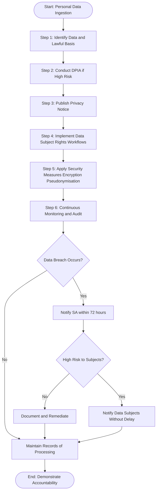
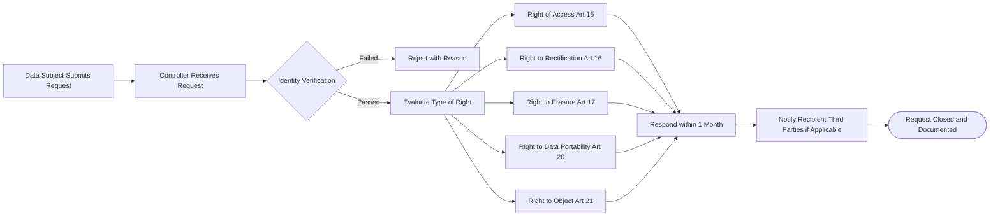
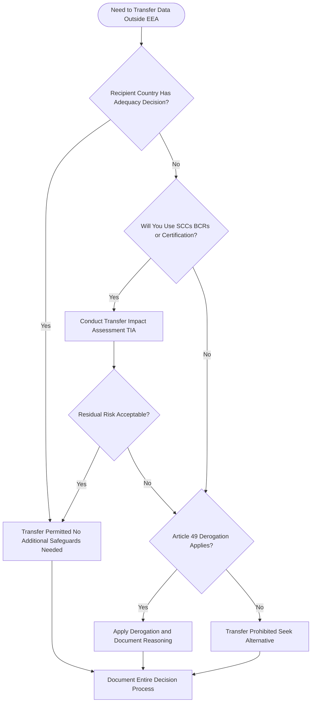
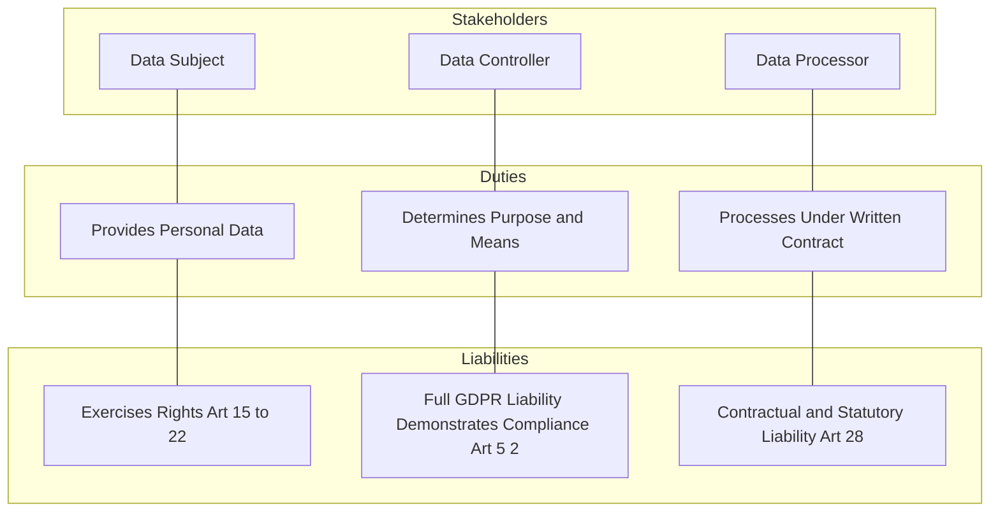

# GDPR

<!-- SECTION_1_START -->
# GDPR — General Data Protection Regulation

## 1.1 Formal Definition (KTU 2024 Syllabus Terminology)

> [!IMPORTANT]
> **General Data Protection Regulation (GDPR)** is a comprehensive European Union (EU) regulatory framework, formally known as **Regulation (EU) 2016/679**, that came into force on **25 May 2018**. It governs the **lawful processing, storage, transfer, and protection of personal data** of natural persons (data subjects) residing in the European Union and the European Economic Area (EEA). It replaced the older **Data Protection Directive 95/46/EC** and established a unified, extraterritorial legal standard for data privacy, organizational accountability, and individual digital rights.

> [!NOTE]
> **Core Legal Triad of GDPR**
> 1. **Regulation (EU) 2016/679** → The main GDPR law.
> 2. **Directive (EU) 2016/680** → Governs data processing by competent authorities for criminal matters (Law Enforcement Directive).
> 3. **ePrivacy Regulation (Pending)** → Specific rules for electronic communications, cookies, and marketing.

## 1.2 Conceptual Analogy — The "Privacy Passport" 🛂

Imagine every person carries a **digital "Privacy Passport"** that automatically travels with them across the internet. Whenever a website, app, or company wants to inspect, store, or use this passport (i.e., personal data), it must:

1. **Ask for explicit permission** before looking at it.
2. **State clearly why** it needs to see it.
3. **Use it ONLY for the stated purpose** — no "secret inspections."
4. **Let the owner see, correct, or destroy it** at any time.
5. **Be held legally liable** if the passport is lost, stolen, or misused.

This is precisely what GDPR enforces in cyberspace. Any organization that **collects, processes, or controls** the personal data of EU residents must comply — regardless of where that organization is physically located in the world.

> [!TIP]
> **Territorial Scope (Extraterritorial Reach):** Even an Indian, American, or Japanese company with no office in Europe must comply with GDPR if it offers goods/services to or monitors the behaviour of EU residents. This makes GDPR a **de facto global privacy standard**.

## 1.3 Key Terminology in GDPR

| Term | Plain-English Meaning | Cyber-Engineering Relevance |
|------|----------------------|------------------------------|
| **Personal Data** | Any information that identifies a living person (name, IP, cookie ID, biometric, location). | Raw input for any ML/AI system; requires lawful basis. |
| **Data Subject** | The individual whose data is being processed. | The "user" in any system architecture. |
| **Data Controller** | The entity that determines the **purpose and means** of processing. | The organization/owner of the platform. |
| **Data Processor** | The entity that processes data **on behalf of the controller**. | A third-party cloud/hosting vendor. |
| **DPO (Data Protection Officer)** | A mandated officer overseeing GDPR compliance. | Required for large-scale or sensitive data processing. |
| **Supervisory Authority** | Independent public authority enforcing GDPR in each EU country. | E.g., CNIL (France), BfDI (Germany). |
| **Profiling** | Automated processing to evaluate personal aspects (credit scoring, ad-targeting). | Used in AI/ML decision engines. |
| **Consent** | Freely given, specific, informed, and unambiguous agreement. | The "I Agree" button must be clear and unbundled. |
| **Pseudonymisation** | Replacing identifiers with tokens so re-identification requires extra info. | A key engineering safeguard. |
| **Data Breach** | A breach of security leading to accidental/ unlawful destruction, loss, alteration, or disclosure. | Must be reported within **72 hours**. |

> [!VISUALIZATION CONTROL]
> **Concept:** The GDPR Compliance Triangle — Three-Party Interaction Model
> **Visualization Logic:** Plot the three primary GDPR stakeholders on the vertices of a triangle and the central data flow on the centroid.
> **Pseudocode for Visualization:**
> * `Vertex_A = ("DATA_SUBJECT", x=0, y=10)`
> * `Vertex_B = ("CONTROLLER", x=10, y=0)`
> * `Vertex_C = ("PROCESSOR", x=-10, y=0)`
> * `Centroid = ("LAWFUL_PROCESSING", x=0, y=0)`
> **Visual Description:** A triangle with arrows flowing from the Data Subject (top) to the Controller and Processor (bottom corners), with all paths converging on a "Lawful Processing" hub in the middle. The Controller acts as the gatekeeper; the Processor acts as the executor under the Controller's instruction.

<!-- SECTION_1_END -->

<!-- SECTION_2_START -->
# Deep Theoretical Analysis & KTU High-Yield Formula Sheet

## 2.1 The Seven Foundational Principles of GDPR (Article 5)

These are the **"Seven Commandments"** that all data processing must obey. Memorize them in order — they are extremely high-yield for KTU 14-mark questions.

1. **Lawfulness, Fairness, and Transparency** — Process data legally, fairly, and in a transparent manner.
2. **Purpose Limitation** — Collect data only for **specified, explicit, and legitimate purposes**.
3. **Data Minimisation** — Process only the data that is **adequate, relevant, and necessary**.
4. **Accuracy** — Keep personal data **accurate and up to date**; rectify or erase inaccurate data without delay.
5. **Storage Limitation** — Retain data only **as long as necessary** for the stated purpose.
6. **Integrity and Confidentiality** — Ensure appropriate **security** (encryption, pseudonymisation, resilience).
7. **Accountability** — The controller is **responsible for, and must be able to demonstrate**, compliance.

> [!IMPORTANT]
> **Mnemonic for the 7 Principles:** "**L**awful **P**rocesses **D**efine **A**ccurate **S**torage with **I**ntegrity and **A**ccountability" → **L–P–D–A–S–I–A**

## 2.2 Lawful Bases for Processing (Article 6)

A controller **must have at least one** of these six legal grounds before processing personal data. Absence of any valid basis = **illegal processing**.

| \# | Legal Basis | Cyber-Engineering Example |
|----|-------------|---------------------------|
| 1 | **Consent** | User clicks "I Agree" to cookie tracking. |
| 2 | **Contract** | Storing shipping address to deliver a product. |
| 3 | **Legal Obligation** | A bank retaining transaction logs for tax audits. |
| 4 | **Vital Interests** | Emergency medical data processing in a hospital. |
| 5 | **Public Task** | Government agency processing census data. |
| 6 | **Legitimate Interests** | A website using basic analytics for fraud detection (must pass a balancing test). |

> [!NOTE]
> **Special Category Data (Article 9)** — Sensitive data like race, religion, health, biometrics, sexual orientation requires **explicit consent** or another specific lawful basis. Default processing is **prohibited**.

## 2.3 Data Subject Rights (Chapter III — Articles 12–22)

The data subject has **eight explicit rights**. These are the most frequently asked topics in KTU examinations.

| Article | Right | Engineering Implementation |
|---------|-------|------------------------------|
| Art. 13–14 | **Right to be Informed** | Provide clear privacy notices at point of data collection. |
| Art. 15 | **Right of Access** | Build a "Download My Data" feature. |
| Art. 16 | **Right to Rectification** | Enable profile-edit functionality. |
| Art. 17 | **Right to Erasure ("Right to be Forgotten")** | Implement a "Delete My Account" purge workflow. |
| Art. 18 | **Right to Restriction of Processing** | Add a "freeze" flag in the database. |
| Art. 20 | **Right to Data Portability** | Provide data export in **JSON / CSV / XML** formats. |
| Art. 21 | **Right to Object** | Allow opt-out from direct marketing and profiling. |
| Art. 22 | **Right not to be subject to Automated Decision-Making** | Provide human-review option for AI-driven decisions. |

## 2.4 KTU Formula Sheet / Cheat Sheet

| Concept | Value / Rule | Unit / Standard |
|---------|--------------|-----------------|
| Breach Notification to Supervisory Authority | **72 hours** | Hours from awareness |
| Breach Notification to Data Subjects | "Without undue delay" | Conditional on high risk |
| Maximum Administrative Fine (Tier 1) | **€10 million** OR **2% of annual global turnover**, whichever is higher | EUR / Percentage |
| Maximum Administrative Fine (Tier 2) | **€20 million** OR **4% of annual global turnover**, whichever is higher | EUR / Percentage |
| Standard Data Retention Ceiling | "As long as necessary" | Context-dependent |
| DPO Appointment Threshold | Mandatory for: (a) public authority, (b) large-scale monitoring, (c) large-scale special category data | Categorical |
| Age of Valid Digital Consent (EU member default) | **16 years** (member states may lower to **13**) | Years |
| Lawful Cross-Border Transfer Mechanisms | Adequacy Decision / SCCs / BCRs / Derogations | Categorical |

## 2.5 Roles and Responsibilities — Architectural View

| Role | Decides Purpose? | Decides Means? | Primary Liability |
|------|:----------------:|:--------------:|-------------------|
| **Data Controller** | ✅ | ✅ | Full legal liability |
| **Joint Controllers** | ✅ (jointly) | ✅ (jointly) | Joint and several liability |
| **Data Processor** | ❌ | ❌ (only technical means) | Contractual + statutory liability |
| **Sub-Processor** | ❌ | ❌ | Liable under processor's contract |

## 2.6 Cross-Border Data Transfer Mechanisms (Chapter V)

Transferring personal data outside the EEA is restricted. The controller must use one of the following safeguards:

1. **Adequacy Decision** — The European Commission has determined that the recipient country offers "essentially equivalent" protection (e.g., Japan, UK, South Korea, New Zealand, Switzerland).
2. **Standard Contractual Clauses (SCCs)** — 2021 version includes modular clauses for different transfer scenarios.
3. **Binding Corporate Rules (BCRs)** — For intra-group transfers within multinationals; approved by the lead supervisory authority.
4. **Codes of Conduct / Certification Mechanisms** — Approved mechanisms for specific sectors.
5. **Derogations (Article 49)** — Explicit consent, contract performance, public interest, legal claims, vital interests.

> [!TIP]
> The **Schrems II ruling (CJEU, 16 July 2020)** invalidated the EU–US Privacy Shield and placed strict obligations on the use of SCCs — organizations must now perform a **Transfer Impact Assessment (TIA)**.

## 2.7 Engineering & Real-World Utility of GDPR

| Domain | Why GDPR Matters in Engineering |
|--------|----------------------------------|
| **Cloud Computing** | Vendors (AWS, Azure, GCP) must offer GDPR-compliant regions and DPA agreements. |
| **AI / Machine Learning** | Training data must have lawful basis; models must avoid unlawful profiling (Art. 22). |
| **Cybersecurity** | Mandates encryption, pseudonymisation, and breach reporting protocols. |
| **Web Development** | Cookie consent banners, privacy-by-design, data minimization in forms. |
| **Healthcare Tech** | Special category data triggers Article 9 + Article 9(2)(h) for medical treatment. |
| **IoT / Edge Devices** | Devices collecting biometrics or location must implement consent and security. |
| **Big Data Analytics** | Requires anonymization or pseudonymization techniques to escape GDPR's scope. |

<!-- SECTION_2_END -->

<!-- SECTION_3_START -->
# Step-by-Step Derivations, Procedures & Code/Symbolic Implementation

## 3.1 GDPR Compliance Implementation Checklist (Step-by-Step Procedure)

> [!IMPORTANT]
> This is the **practical engineering roadmap** for any organization aiming to achieve GDPR compliance. Each step has a clear input → process → output flow.

### **Step 1 — Data Inventory and Mapping (Records of Processing — Article 30)**

Create a register of all processing activities. For each one, document:

- **Name and contact details** of the controller, joint controllers, controller's representative, and DPO.
- **Purposes of processing**.
- **Description of categories** of data subjects and personal data.
- **Categories of recipients** to whom data is disclosed.
- **Transfers of personal data to a third country** and the documentation of suitable safeguards.
- **Time limits** for erasure (retention schedule).
- **Description of security measures**.

### **Step 2 — Determine the Lawful Basis (Article 6 + Article 9 for sensitive data)**

For each processing activity, identify **one or more lawful bases**. Document this in the privacy notice.

### **Step 3 — Privacy Notice / Information to Data Subjects (Articles 13–14)**

Draft a layered privacy notice in clear, plain language containing:

- Identity and contact details of the controller and DPO.
- Purposes and legal basis of processing.
- Recipients of the data.
- Retention period.
- **All data subject rights** (access, rectification, erasure, restriction, portability, objection, automated decision-making).
- Right to lodge a complaint with the supervisory authority.
- Whether the provision of data is a statutory or contractual requirement.

### **Step 4 — Implement Data Subject Rights Mechanism (Articles 15–22)**

Build operational workflows for:

- Subject Access Requests (**SAR**) → Respond within **1 month** (extendable by 2 months for complex requests).
- Right to Erasure → Identify and delete all data, including backups, within the legal timeframe.
- Data Portability → Provide data in a **structured, commonly used, machine-readable format** (e.g., JSON, CSV, XML).

### **Step 5 — Data Protection Impact Assessment (DPIA) — Article 35**

Required when processing is **likely to result in a high risk** to the rights and freedoms of natural persons. The DPIA process:

\begin{aligned}
\text{Step 5a: Threshold Analysis} &\rightarrow \text{Is processing high-risk?} \\
\text{Step 5b: Describe Processing} &\rightarrow \text{Nature, scope, Context, Purposes} \\
\text{Step 5c: Assess Necessity} &\rightarrow \text{Proportionality test} \\
\text{Step 5d: Identify Risks} &\rightarrow \text{Impact × Likelihood matrix} \\
\text{Step 5e: Mitigate Risks} &\rightarrow \text{Technical \& organisational measures (TOMs)} \\
\text{Step 5f: Consult DPO \& SA} &\rightarrow \text{Prior consultation if residual risk remains high}
\end{aligned}

### **Step 6 — Data Breach Response Procedure (Articles 33–34)**

\begin{aligned}
\text{T}_{0} &\rightarrow \text{Controller becomes aware of breach} \\
\text{T}_{0} + 72\text{h} &\rightarrow \text{Notify Supervisory Authority (Article 33)} \\
\text{Notify} &\rightarrow \text{Describe nature, categories, approximate number of subjects, likely consequences, measures taken} \\
\text{High Risk} &\rightarrow \text{Notify data subjects "without undue delay" (Article 34)}
\end{aligned}

### **Step 7 — Maintain Records, Train Staff, Audit Regularly**

Document everything. Conduct annual reviews and staff training. Keep the **Records of Processing Activities (ROPA)** updated.

---

## 3.2 Symbolic Representation: The Lawful Processing Equation

The **Lawfulness Condition** for any data processing can be symbolically expressed as:

$$
\text{Process}_{\text{Lawful}}(D) \;=\; \text{Controller}(C) \;\land\; \text{LawfulBasis}(B) \;\land\; \text{Principle}(P) \;\land\; \text{Rights}(R)
$$

Where:

- $D$ = Dataset of personal data
- $C$ = Identified and accountable Controller
- $B$ = At least one valid basis from the set $\{$Consent, Contract, LegalObligation, VitalInterest, PublicTask, LegitimateInterest$\}$
- $P$ = All 7 principles of Article 5 satisfied
- $R$ = All 8 data subject rights operationally enabled

The processing is **lawful** if and only if the conjunction evaluates to TRUE.

---

## 3.3 Operational Python Implementation — GDPR-Compliant Consent Logger

> [!IMPORTANT]
> The following Python code demonstrates an **engineering-grade consent management module** that satisfies GDPR Articles 6(1)(a), 7, 13, and 17. It includes strict type hints, boundary validation, and error logging.

```python
"""
gdpr_consent.py
================
A production-grade consent management module demonstrating
GDPR-compliant storage, retrieval, and withdrawal of user consent.

Compliance: Articles 6(1)(a), 7, 13, 17 (EU Regulation 2016/679)
"""

from __future__ import annotations
import logging
import uuid
from dataclasses import dataclass, field, asdict
from datetime import datetime, timezone, timedelta
from enum import Enum
from typing import Dict, List, Optional

# ------------------------------------------------------------------
# Logging Configuration
# ------------------------------------------------------------------
logging.basicConfig(
    level=logging.INFO,
    format="%(asctime)s | %(levelname)s | %(name)s | %(message)s"
)
logger = logging.getLogger("GDPRConsentModule")


# ------------------------------------------------------------------
# Enumerations and Data Classes
# ------------------------------------------------------------------
class LawfulBasis(str, Enum):
    CONSENT = "consent"               # Article 6(1)(a)
    CONTRACT = "contract"             # Article 6(1)(b)
    LEGAL_OBLIGATION = "legal_obligation"
    VITAL_INTEREST = "vital_interest"
    PUBLIC_TASK = "public_task"
    LEGITIMATE_INTEREST = "legitimate_interest"


class ConsentStatus(str, Enum):
    GIVEN = "given"
    WITHDRAWN = "withdrawn"
    EXPIRED = "expired"


@dataclass
class ConsentRecord:
    consent_id: str
    user_id: str
    purpose: str
    lawful_basis: LawfulBasis
    status: ConsentStatus
    given_at: datetime
    expires_at: Optional[datetime]
    withdrawn_at: Optional[datetime] = None
    ip_address: Optional[str] = None
    user_agent: Optional[str] = None

    def to_dict(self) -> Dict[str, object]:
        return asdict(self)


# ------------------------------------------------------------------
# GDPR Consent Manager Class
# ------------------------------------------------------------------
class GDPRConsentManager:
    """
    Manages user consent in a GDPR-compliant manner.

    Responsibilities:
        1. Record explicit, informed consent (Art. 7).
        2. Provide easy withdrawal (Art. 7(3)).
        3. Enforce data minimisation (Art. 5(1)(c)).
        4. Support right to erasure (Art. 17).
        5. Maintain audit trail for accountability (Art. 5(2)).
    """

    # Default consent validity: 12 months (industry best practice)
    DEFAULT_VALIDITY_DAYS: int = 365
    # Minimum age for valid digital consent (Art. 8 default)
    MIN_VALID_AGE: int = 16

    def __init__(self) -> None:
        self._records: Dict[str, ConsentRecord] = {}

    # ------------------------------------------------------------------
    # Public API
    # ------------------------------------------------------------------
    def grant_consent(
        self,
        user_id: str,
        purpose: str,
        lawful_basis: LawfulBasis,
        ip_address: Optional[str] = None,
        user_agent: Optional[str] = None,
        validity_days: Optional[int] = None,
    ) -> ConsentRecord:
        """Record a new explicit consent with full audit metadata."""

        # --- Input validation ---
        if not user_id or not user_id.strip():
            raise ValueError("user_id must be a non-empty string.")
        if not purpose or not purpose.strip():
            raise ValueError("purpose must be a non-empty string.")
        if lawful_basis != LawfulBasis.CONSENT:
            logger.warning(
                "Lawful basis is not 'consent'. "
                "Article 7 obligations (explicit, withdrawable) do not apply."
            )

        validity = validity_days or self.DEFAULT_VALIDITY_DAYS
        if validity <= 0 or validity > 3650:
            raise ValueError("validity_days must be between 1 and 3650.")

        # --- Record creation ---
        now = datetime.now(timezone.utc)
        record = ConsentRecord(
            consent_id=str(uuid.uuid4()),
            user_id=user_id,
            purpose=purpose,
            lawful_basis=lawful_basis,
            status=ConsentStatus.GIVEN,
            given_at=now,
            expires_at=now + timedelta(days=validity),
            ip_address=ip_address,
            user_agent=user_agent,
        )
        self._records[record.consent_id] = record
        logger.info(
            "Consent granted | user=%s | purpose='%s' | id=%s",
            user_id, purpose, record.consent_id
        )
        return record

    def withdraw_consent(self, consent_id: str) -> ConsentRecord:
        """Implement Right to Withdraw Consent (Article 7(3))."""
        record = self._get_validated(consent_id)
        record.status = ConsentStatus.WITHDRAWN
        record.withdrawn_at = datetime.now(timezone.utc)
        logger.info("Consent withdrawn | id=%s", consent_id)
        return record

    def get_active_consents(self, user_id: str) -> List[ConsentRecord]:
        """Return only the valid, non-expired, non-withdrawn consents."""
        now = datetime.now(timezone.utc)
        active: List[ConsentRecord] = []
        for record in self._records.values():
            if record.user_id != user_id:
                continue
            if record.status != ConsentStatus.GIVEN:
                continue
            if record.expires_at is not None and record.expires_at < now:
                record.status = ConsentStatus.EXPIRED
                continue
            active.append(record)
        return active

    def right_to_be_forgotten(self, user_id: str) -> int:
        """Erase all records of a user (Article 17)."""
        erased = 0
        ids_to_delete = [
            cid for cid, r in self._records.items() if r.user_id == user_id
        ]
        for cid in ids_to_delete:
            del self._records[cid]
            erased += 1
        logger.info("Right to Erasure executed | user=%s | erased=%d", user_id, erased)
        return erased

    def export_user_data(self, user_id: str) -> List[Dict[str, object]]:
        """Right to Data Portability (Article 20) — JSON-friendly output."""
        return [
            r.to_dict()
            for r in self._records.values()
            if r.user_id == user_id
        ]

    # ------------------------------------------------------------------
    # Internal helpers
    # ------------------------------------------------------------------
    def _get_validated(self, consent_id: str) -> ConsentRecord:
        try:
            record = self._records[consent_id]
        except KeyError as exc:
            raise LookupError(f"Consent id '{consent_id}' not found.") from exc
        if record.status == ConsentStatus.WITHDRAWN:
            raise PermissionError("Cannot operate on a withdrawn consent.")
        return record


# ------------------------------------------------------------------
# Demonstration / Sanity Test
# ------------------------------------------------------------------
if __name__ == "__main__":
    manager = GDPRConsentManager()

    # Step 1: Grant consent
    rec = manager.grant_consent(
        user_id="user_007",
        purpose="Personalised marketing emails",
        lawful_basis=LawfulBasis.CONSENT,
        ip_address="203.0.113.42",
        user_agent="Mozilla/5.0",
        validity_days=180,
    )
    print("Granted:", rec.to_dict())

    # Step 2: Retrieve active consents
    print("Active:", [r.to_dict() for r in manager.get_active_consents("user_007")])

    # Step 3: Withdraw consent
    manager.withdraw_consent(rec.consent_id)
    print("Active after withdrawal:", manager.get_active_consents("user_007"))

    # Step 4: Right to be forgotten
    new_rec = manager.grant_consent(
        user_id="user_007",
        purpose="Analytics tracking",
        lawful_basis=LawfulBasis.LEGITIMATE_INTEREST,
    )
    erased = manager.right_to_be_forgotten("user_007")
    print("Erased records:", erased)
```

**Code Walkthrough of Key Engineering Decisions:**

| Line Block | GDPR Principle Satisfied | Reasoning |
|------------|--------------------------|-----------|
| `LawfulBasis` Enum | Art. 6(1) | Explicit definition of all 6 lawful bases. |
| `ConsentRecord` with `ip_address` & `user_agent` | Art. 7(1) | Demonstrates "demonstrable consent" through audit logs. |
| `validity_days` with default 365 | Art. 5(1)(e) | Storage limitation — consent cannot be indefinite. |
| `withdraw_consent()` | Art. 7(3) | Withdrawal must be "as easy as giving consent." |
| `right_to_be_forgotten()` | Art. 17 | Erases all user data upon request. |
| `export_user_data()` returns list of dicts | Art. 20 | Machine-readable, structured format. |
| Strict input validation in `grant_consent()` | Art. 5(1)(d) | Ensures data accuracy from ingestion. |
| Logger statements | Art. 5(2) | Accountability through documented processing. |

## 3.4 Sample DPIA Risk Matrix (Tabular Procedure)

| Risk ID | Processing Activity | Risk Description | Likelihood (L) | Impact (I) | Risk Score (L × I) | Mitigation (TOMs) |
|---------|----------------------|------------------|:--------------:|:----------:|:------------------:|-------------------|
| R-01 | Cloud storage of customer emails | Unauthorized access by cloud admin | 2 | 4 | **8** | AES-256 encryption at rest, key rotation policy, access logging. |
| R-02 | AI profiling for credit scoring | Discriminatory bias in ML model | 3 | 5 | **15** | Bias audit, fairness metrics, human-in-the-loop review. |
| R-03 | Cookie-based ad tracking | Loss of user anonymity | 4 | 3 | **12** | Granular consent banner, opt-out option, anonymized analytics. |
| R-04 | Third-party payment processor | Data sharing beyond necessary scope | 2 | 5 | **10** | Data Processing Agreement (DPA), SCCs for cross-border flow. |
| R-05 | Biometric login on mobile app | Biometric template leakage | 1 | 5 | **5** | On-device processing, template hashing, MFA backup. |

> Risk Score Interpretation: 1–4 = Low; 5–9 = Medium; 10–15 = High; 16–25 = Critical.

<!-- SECTION_3_END -->

<!-- SECTION_4_START -->
# Structural Diagrams & Schematics

## 4.1 GDPR Compliance Lifecycle — Sequential Flow



**Diagram Interpretation:** The compliance lifecycle is **iterative**, not one-time. Even after full implementation, the organization must continually monitor, audit, and adapt to new processing activities.

## 4.2 Data Subject Rights Workflow — Request Handling



## 4.3 Cross-Border Data Transfer Decision Tree



## 4.4 Accountability Triangle — Roles, Duties, and Liabilities



## 4.5 High-Yield Comparative Table — Directive 95/46/EC vs. GDPR

| Feature | Directive 95/46/EC (1995) | GDPR (2016/679) |
|---------|---------------------------|-----------------|
| **Legal Form** | Directive (each country transposes into national law) | Regulation (directly applicable in all EU states) |
| **Territorial Scope** | Limited to EU-established controllers | Extraterritorial — applies to non-EU controllers too |
| **Consent** | Implied consent often valid | Must be explicit, freely given, specific, informed, unambiguous |
| **Penalties** | Low, inconsistent across countries | Up to **€20 million** or **4% of global turnover** |
| **Data Subject Rights** | Limited (access, objection) | Expanded to **8 explicit rights** including portability and erasure |
| **Data Breach Notification** | Not mandatory | Mandatory within **72 hours** |
| **DPO Requirement** | Not mandatory | Mandatory for specific processing scenarios |
| **Right to be Forgotten** | Not codified | Codified under Article 17 |
| **Accountability** | Reactive | Proactive — "Privacy by Design" required |

<!-- SECTION_5_START -->
# KTU 2024 Scheme Examination Question Bank & Topic Recap

## 5.1 Part A Questions (3 Marks Each)

### **Q1. [KTU University Exam — July 2024] Define GDPR. Mention its territorial scope.**
*(Mapped CO: CO2 | RBT Level: Remember)*

**Model Answer (3 Marks):**
The **General Data Protection Regulation (GDPR)**, formally **Regulation (EU) 2016/679**, is a comprehensive EU data protection law that came into force on **25 May 2018**. It governs the processing of personal data of individuals within the European Union and the European Economic Area. **[1 Mark]**
Its **territorial scope is extraterritorial** — it applies not only to organizations established in the EU but also to any controller or processor outside the EU that offers goods or services to, or monitors the behaviour of, EU data subjects. **[2 Marks]**

---

### **Q2. [KTU University Exam — Dec 2023] List any three data subject rights under GDPR.**
*(Mapped CO: CO2 | RBT Level: Understand)*

**Model Answer (3 Marks — 1 Mark each):**
1. **Right of Access (Art. 15):** The data subject has the right to obtain confirmation as to whether personal data is being processed and to access that data.
2. **Right to Erasure (Art. 17):** Also called the "Right to be Forgotten," it allows the data subject to request deletion of their personal data under specific conditions.
3. **Right to Data Portability (Art. 20):** The data subject can receive their personal data in a structured, commonly used, and machine-readable format and transmit it to another controller.

---

## 5.2 Part B Questions (14 Marks Each — Module Internal Choice)

### **Question A — [KTU University Exam — Dec 2024]**

#### **Part (a) — 7 Marks: Explain the seven fundamental principles of GDPR. (CO2, Understand)**

**Model Answer:**

The seven fundamental principles of GDPR, codified in **Article 5**, form the bedrock of all data processing activities. They are:

1. **Lawfulness, Fairness, and Transparency:** Data must be processed lawfully, fairly, and in a transparent manner in relation to the data subject. **[1 Mark]**

2. **Purpose Limitation:** Personal data must be collected for specified, explicit, and legitimate purposes and not further processed in a manner that is incompatible with those purposes. **[1 Mark]**

3. **Data Minimisation:** Data processed must be adequate, relevant, and limited to what is necessary in relation to the purpose. **[1 Mark]**

4. **Accuracy:** Personal data must be accurate and, where necessary, kept up to date. Inaccurate data must be erased or rectified without delay. **[1 Mark]**

5. **Storage Limitation:** Data must be kept in a form that permits identification of data subjects for no longer than is necessary for the purposes for which the data is processed. **[1 Mark]**

6. **Integrity and Confidentiality:** Data must be processed in a manner that ensures appropriate security, including protection against unauthorized or unlawful processing and against accidental loss, destruction, or damage, using technical and organizational measures. **[1 Mark]**

7. **Accountability:** The controller is responsible for demonstrating compliance with all the above principles. **[1 Mark]**

---

#### **Part (b) — 7 Marks: Discuss the penalties and enforcement mechanism under GDPR. (CO3, Apply)**

**Model Answer:**

GDPR establishes a **two-tiered penalty structure** enforced by **Supervisory Authorities** in each EU member state.

**Tier 1 — Up to €10 million or 2% of annual global turnover (whichever is higher):**
- Violations related to controller-processor contracts, security measures, breach notification, DPIAs, DPO appointment, and certification. **[2 Marks]**
- Example: Failing to maintain Records of Processing Activities (Art. 30). **[1 Mark]**

**Tier 2 — Up to €20 million or 4% of annual global turnover (whichever is higher):**
- Violations of core principles, lawful basis for processing, data subject rights, international transfer rules, and consent rules. **[2 Marks]**
- Example: Processing data without a valid lawful basis or failing to obtain valid consent. **[1 Mark]**

**Enforcement Mechanism:**
- Each member state designates one or more **Supervisory Authorities (SAs)**. **[0.5 Mark]**
- SAs have powers of **investigation, correction, and sanction**, including warnings, reprimands, fines, and orders to cease processing. **[0.5 Mark]**

> **Real-world case:** British Airways was fined **€20 million** (reduced from €22.46 million) in 2020 for a data breach affecting 400,000 customers. Marriott International was fined **€18.4 million** in 2020 for a breach involving 339 million guest records.

---

### **Question B — [KTU University Exam — July 2024]**

#### **Part (a) — 7 Marks: Explain the Data Protection Impact Assessment (DPIA) process under GDPR. When is it mandatory? (CO2, Understand)**

**Model Answer:**

A **Data Protection Impact Assessment (DPIA)** is a systematic process under **Article 35** of GDPR used to evaluate the impact of data processing activities on the protection of personal data. It is a **proactive, risk-based tool** to identify and mitigate privacy risks before processing begins.

**When is DPIA Mandatory? (3 Marks)**
DPIA is mandatory when processing is **likely to result in a high risk** to the rights and freedoms of natural persons. The Supervisory Authority may also publish a list of processing operations requiring DPIA. Typical scenarios include:
- Systematic and extensive automated processing, including **profiling**, that produces legal or similarly significant effects. **[1 Mark]**
- Large-scale processing of **special categories of data** (health, biometrics, etc.). **[1 Mark]**
- Large-scale **systematic monitoring** of publicly accessible areas on a large scale. **[1 Mark]**

**DPIA Process (4 Marks):**
1. **Describe the Processing:** Nature, scope, context, and purposes. **[1 Mark]**
2. **Assess Necessity and Proportionality:** Identify lawful basis, data minimization, retention limits. **[1 Mark]**
3. **Identify and Assess Risks:** Evaluate likelihood and severity of impact on data subjects. **[1 Mark]**
4. **Identify Mitigations:** Technical and organizational measures (TOMs) such as encryption, pseudonymization, access controls. **[1 Mark]**

> **Key Outcome:** If the DPIA indicates that the processing would result in a **high residual risk** in the absence of measures taken by the controller, the controller must **consult the Supervisory Authority** (Article 36 — Prior Consultation).

---

#### **Part (b) — 7 Marks: Describe the data breach notification procedure under GDPR. What are the timelines and what information must be disclosed? (CO3, Apply)**

**Model Answer:**

**Definition (1 Mark):**
A **personal data breach** under Article 4(12) of GDPR is a breach of security leading to the accidental or unlawful destruction, loss, alteration, unauthorized disclosure of, or access to personal data transmitted, stored, or otherwise processed.

**Two-Stage Notification Procedure:**

**Stage 1 — Notification to the Supervisory Authority (Article 33) (3 Marks):**
- The controller must notify the **competent Supervisory Authority** of a breach **without undue delay** and, where feasible, **not later than 72 hours after having become aware of it**. **[1 Mark]**
- If the notification is made after 72 hours, it must be **accompanied by reasons for the delay**. **[0.5 Mark]**
- The notification must include: **[1.5 Marks]**
  - Nature of the breach, including categories and approximate number of data subjects and records.
  - Name and contact details of the DPO or other contact point.
  - Likely consequences of the breach.
  - Measures taken or proposed to address the breach and mitigate adverse effects.

**Stage 2 — Communication to Data Subjects (Article 34) (2 Marks):**
- When the breach is **likely to result in a high risk** to the rights and freedoms of natural persons, the controller must communicate the breach to the **affected data subjects without undue delay**. **[1 Mark]**
- The communication must describe the **nature of the breach** and contain at least the **information and measures** mentioned in Article 33(3). **[1 Mark]**

**Exemptions (1 Mark):**
- Notification to data subjects is **not required** if:
  - The controller has implemented **appropriate technical and organizational protection measures**, especially those that render the personal data unintelligible (e.g., encryption).
  - The controller has taken **subsequent measures** that eliminate the high risk.
  - It would involve **disproportionate effort** (e.g., large number of subjects); in such cases, a public communication or equivalent measure suffices.

---

> [!WARNING]
> **KTU Examiner's Valuation Warning — Common Pitfalls**
> 1. **Article Number Confusion:** Students often confuse **Article 33** (notification to SA) with **Article 34** (notification to data subjects). Always check whether the question is about the **Authority** (72 hours) or the **Subjects** (without undue delay).
> 2. **Penalty Tier Misidentification:** Failing to mention that fines are **whichever is higher** (the higher of the two amounts) costs 1 mark. Always state "**€20 million OR 4% of annual global turnover, whichever is higher**."
> 3. **Skipping the 7 Principles:** In 7-mark questions, students often list only 5 or 6 principles. All **seven** must be stated to earn full marks.
> 4. **Confusing Controller vs. Processor:** A processor does **not** decide the purpose — they only process on the controller's instructions. Marking the processor as having decision-making power is a common error.
> 5. **Ignoring Extraterritorial Scope:** Many students forget that GDPR applies to non-EU companies. This is a frequently tested point.
> 6. **No mention of "demonstrable consent":** GDPR requires the controller to **demonstrate** that the data subject has consented — meaning mere "I agree" checkboxes are insufficient without proper audit trails.

---

## 5.3 Topic Recap & Important Things to Remember

> [!TIP]
> **Last-Minute Rapid Revision Checklist for GDPR (Module 3)**

- **Full Form:** General Data Protection Regulation — **Regulation (EU) 2016/679**.
- **Effective Date:** **25 May 2018** (replaced Directive 95/46/EC).
- **Territorial Scope:** Extraterritorial — applies to non-EU controllers targeting EU residents.
- **Material Scope:** Applies to processing of personal data wholly or partly by automated means.
- **Personal Data:** Any information relating to an identified or identifiable natural person.
- **Special Categories (Art. 9):** Race, religion, political opinion, trade union membership, genetic data, biometric data, health, sex life, sexual orientation — **default processing prohibited**.
- **Seven Principles (Art. 5):** Lawfulness/Fairness/Transparency, Purpose Limitation, Data Minimisation, Accuracy, Storage Limitation, Integrity/Confidentiality, Accountability — Mnemonic: **L–P–D–A–S–I–A**.
- **Six Lawful Bases (Art. 6):** Consent, Contract, Legal Obligation, Vital Interest, Public Task, Legitimate Interest.
- **Eight Data Subject Rights:** Be Informed, Access, Rectification, Erasure, Restriction, Portability, Object, No Automated Decision-Making — Articles 13/14, 15, 16, 17, 18, 20, 21, 22.
- **Breach Notification:** To SA within **72 hours** (Art. 33); to data subjects **without undue delay** if high risk (Art. 34).
- **Penalties:** Tier 1 → €10M or 2% turnover; Tier 2 → €20M or 4% turnover (whichever is **higher**).
- **DPO Appointment:** Mandatory for public authorities, large-scale monitoring, or large-scale processing of special category data.
- **Cross-Border Transfers:** Allowed via Adequacy Decision, SCCs, BCRs, or Article 49 Derogations.
- **Schrems II Ruling (2020):** Invalidated EU–US Privacy Shield; SCCs require Transfer Impact Assessment (TIA).
- **DPIA (Art. 35):** Mandatory for high-risk processing; includes description, necessity, risk assessment, mitigation.
- **Records of Processing (Art. 30):** Controllers and processors must maintain written records of all processing activities.
- **Privacy by Design (Art. 25):** Data protection must be built into processing activities and business practices from the design stage.
- **Key Case Laws:** *Google Spain v AEPD and Mario Costeja González (2014)* — established the Right to be Forgotten; *Schrems II (2020)* — addressed transatlantic data transfers.

> **Final Exam Tip:** GDPR is a **content-dense, definition-heavy topic**. Memorize the **Articles** (5, 6, 9, 15–22, 28, 30, 33, 34, 35, 44) and the **exact numbers** (72 hours, €20M, 4%, 16 years). For any 14-mark question, structure the answer into: **Definition → Applicable Article → Key Components → Real-world Example → Conclusion**. This is the KTU board examiner's gold-standard structure.

<!-- SECTION_5_END -->
