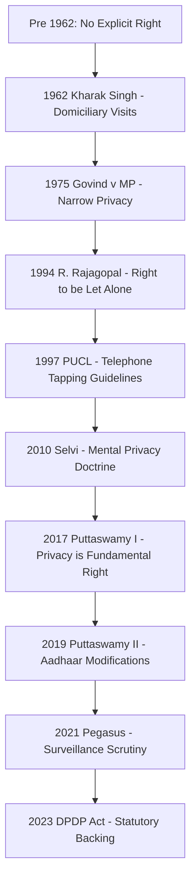
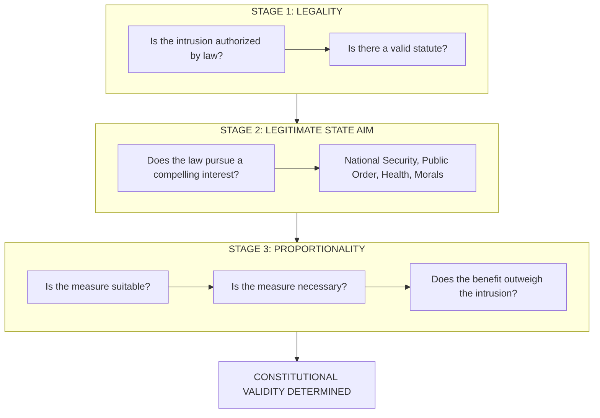
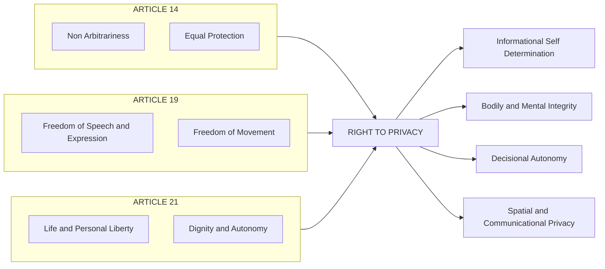

# Judicial interpretation of privacy in India

<!-- SECTION_1_START -->

# Judicial Interpretation of Privacy in India

## 1.1 Formal Academic Definition (KTU 2024 Syllabus Aligned)

> [!IMPORTANT]
> **Judicial Interpretation** refers to the process by which the superior courts of a country, particularly the **Supreme Court of India** and the High Courts, explain, expand, and apply constitutional and statutory provisions to evolving socio-technological realities through binding precedents (*stare decisis*).

In the context of **Privacy in Cyberspace**, judicial interpretation refers to the body of case law, doctrinal tests, and constitutional reasoning through which Indian courts have:

- Identified *privacy* as a constitutionally protected entitlement.
- Defined the *scope*, *content*, and *limits* of the right against the State and non-State actors.
- Balanced individual informational autonomy against competing interests such as **national security**, **public order**, and **preventive justice**.

The cornerstone of this interpretation is **Article 21** of the Constitution of India, which guarantees the *"Right to Life and Personal Liberty"*, read with **Article 14** (*Equality Before Law*), **Article 19** (*Freedom of Speech and Expression*), and **Article 300A** (*Right to Property* — post-Puttaswamy interpretive linkage).

## 1.2 Conceptual Analogy — A "Locked Room" of Personal Data

> [!NOTE]
> **Plain English Intuition**
> Imagine every individual owns a *mental and informational room* that contains their diaries, photos, conversations, health records, and personal thoughts. **Privacy** is the *lock* on that room. **Judicial interpretation** is the *locksmith* — the courts — who decide, in every dispute, whether the lock may be opened, by whom, under what circumstances, and with what justification.

In the digital age, this "room" has expanded dramatically. Our smartphones, social media accounts, biometric identifiers (Aadhaar), and browsing histories form a *virtual extension* of this personal space. The Indian judiciary, through successive landmark judgments, has incrementally strengthened the "lock mechanism" — culminating in the historic recognition of privacy as a **fundamental right** in 2017.

## 1.3 Key Constitutional Anchors Referenced by Indian Courts

| Provision | Textual Content | Interpretive Role in Privacy Jurisprudence |
|---|---|---|
| **Article 21** | Right to Life and Personal Liberty | The *primary* anchor; the reservoir of unenumerated rights including privacy, dignity, and autonomy. |
| **Article 14** | Equality Before Law | Used to challenge *arbitrary* state surveillance or data processing that lacks *rational nexus* and *non-discrimination*. |
| **Article 19(1)(a)** | Freedom of Speech and Expression | Protects *informational self-determination* — the right to speak, receive, and withhold information. |
| **Article 19(1)(d)** | Freedom of Movement | Prevents location-based surveillance overreach. |
| **Article 20(3)** | Self-Incrimination | Underpins the *mental privacy* doctrine (e.g., narco-analysis, brain-mapping cases). |
| **Article 300A** | Right to Property | Post-Puttaswamy: linked to informational property rights. |

> [!TIP]
> **KTU High-Yield Insight**
> Whenever a question asks *"On what constitutional basis is privacy protected in India?"*, the model answer must always begin with **Article 21** as the primary source, supplemented by Articles **14, 19, and 20(3)** as *supportive interpretative anchors*. Avoid stating that privacy is an *"absolute"* right — Indian courts have consistently held it to be a **qualified** right subject to legitimate state regulation.

## 1.4 Why Judicial Interpretation Matters in the Digital Era

> [!VISUALIZATION CONTROL]
> **Concept:** The *Concentric Circles of Privacy Protection* in Indian Jurisprudence
> **Layered Framework Representation:**
> * Center (Innermost Layer): Individual Autonomy — bodily, mental, informational
> * Middle Layer: State Action — surveillance, data collection, profiling
> * Outer Layer: Competing State Interests — national security, public order, economic regulation
> **Visual Description:** Picture three concentric rings. The innermost ring is *inviolable*; the middle ring is the *zone of contestation* where judicial balancing occurs; the outer ring defines the *legitimate aims* that may justify intrusion. Indian courts, particularly the Supreme Court, occupy the role of *arbiters* who determine how far the outer ring may encroach into the middle ring before breaching the innermost sanctum.

---

<!-- SECTION_1_END -->

<!-- SECTION_2_START -->

# Deep Theoretical Analysis & KTU High-Yield Doctrinal Cheat Sheet

## 2.1 The Doctrinal Evolution — Five Phases of Indian Privacy Jurisprudence

The Indian Supreme Court's engagement with privacy can be chronologically divided into five distinct interpretative phases. Each phase reflects a *widening* of the concept to accommodate technological and social change.

### Phase 1 — Nascent Recognition (1962–1975)
- **Kharak Singh v. State of UP (1962)** — Justice Subba Rao (minority) held that *"an unauthorised intrusion into a person's home and the disturbance caused to him thereby is as it were the violation of a common law right of a man — an ultimate essential of ordered liberty"*. The majority (Justice K. Subbarao) struck down *domiciliary visits* under UP Police Regulations as violative of Article 21, but stopped short of declaring a standalone right to privacy.
- **Govind v. State of MP (1975)** — Justice Mathew (obiter) conceded privacy as a *narrow* right, contingent on societal welfare, admitting it was *"not reduced to a mere speck of an anachronistic right"*.

### Phase 2 — Selective Expansion (1990–2010)
- **R. Rajagopal (Auto Shankar) v. State of TN (1994)** — Justice Jeevan Reddy formulated the *"right to be let alone"* doctrine, anchoring privacy in *tort law* and the US jurisprudence of *Samuel Warren & Louis Brandeis (1890)*.
- **PUCL v. Union of India (1997)** — Telephone tapping guidelines issued; *privacy of communication* recognized as a facet of Article 21, subject to procedural safeguards.

### Phase 3 — Cognitive and Bodily Privacy (2010–2015)
- **Selvi v. State of Karnataka (2010)** — A Constitution Bench held that *forced narco-analysis, brain-mapping, and lie-detector tests* violate **Article 20(3)** (self-incrimination) and the *mental privacy* of an accused. This is a landmark in **biometric and forensic jurisprudence**.

### Phase 4 — The Transformative Ruling (2017)
- **Justice K.S. Puttaswamy (Retd.) v. Union of India (2017)** — A **nine-judge Constitution Bench**, by a **unanimous 9-0 verdict**, declared privacy as a *fundamental right* under Article 21. This overruled the *M.P. Sharma (1954)* and *Kharak Singh (1962)* dicta to the extent they suggested otherwise.

### Phase 5 — Statutory and Sectoral Interpretation (2019–Present)
- Post-Puttaswamy, courts have applied privacy principles to: **Aadhaar** (*Puttaswamy II, 2019*), **Pegasus spyware** (*Manohar Lal Sharma v. UoI, 2021*), **WhatsApp traceability** (*Facebook Inc. v. Union of India, 2021*), and **RBI's cryptocurrency banking ban** (*IMA v. RBI, 2020*).

## 2.2 The Three-Fold Test (or Three-Judge Test) for Privacy Invasion

The Supreme Court in *Puttaswamy* formally adopted the **Proportionality Test** as the constitutional standard for evaluating any state intrusion into privacy. The test requires the State to demonstrate **all** of the following:

1. **Legality** — Existence of a *valid law* authorizing the intrusion.
2. **Legitimate State Aim** — The intrusion must pursue a *compelling state interest* (national security, public order, health, morals, etc.).
3. **Proportionality** — The means adopted must be *necessary*, *least restrictive*, and *balanced* — there must be a *rational nexus* between the aim and the means.

> [!NOTE]
> **Mnemonic: L-L-P**
> *"Legally Authorised, Legitimately Aimed, Proportionately Designed"*.
> This is one of the **most frequently asked** KTU questions and a guaranteed 3-mark short-answer.

## 2.3 KTU Doctrinal Cheat Sheet (Key Tests, Doctrines, and Cases)

| Doctrine / Test | Source / Case | Core Principle | KTU Application |
|---|---|---|---|
| **Right to be Let Alone** | Warren \& Brandeis (1890); *R. Rajagopal (1994)* | Tort-law origin; protects solitude and reputation | Foundation of privacy law |
| **Three-Fold (Proportionality) Test** | *Puttaswamy (2017)* | Legality + Legitimate Aim + Proportionality | Standard for state surveillance |
| **Reasonable Expectation of Privacy** | *Katz v. US (1967)* — persuasive | Privacy exists where a person has a *subjective* and *societally accepted* expectation of privacy | Used in Indian surveillance cases |
| **Mental Privacy Doctrine** | *Selvi v. State of Karnataka (2010)* | Forced narco-analysis violates bodily/mental autonomy | Biometric and forensic data |
| **Informational Self-Determination** | German Federal Constitutional Court (1983); *Puttaswamy (2017)* | Individuals control the flow of their personal data | Aadhaar and digital profiling |
| **Doctrine of Severability** | *Puttaswamy (2017)* | Invalid portions of a statute can be severed to preserve the rest | Aadhaar Act analysis |
| **Doctrine of Manifest Arbitrariness** | *Shayara Bano (2017)*; privacy disputes | State action must not be *capricious, irrational, or discriminatory* | Data processing challenges |

## 2.4 Real-World Engineering and CS Application

> [!IMPORTANT]
> **Why does a Computer Science / Engineering student need to study this?**
> 
> 1. **Compliance Engineering:** Every system handling personal data in India must be designed with *privacy-by-design* principles (origin: *Puttaswamy* judgment and the *Digital Personal Data Protection Act, 2023*). Engineers must build **Data Protection Impact Assessments (DPIAs)** into the SDLC.
> 2. **Surveillance System Design:** CCTV deployment, biometric access control, employee monitoring tools — all must pass the **proportionality test** if challenged in court.
> 3. **AI/ML Ethics:** Algorithmic profiling (loan decisions, recruitment, predictive policing) raises Article 14 + Article 21 issues. Indian courts have cited *Puttaswamy* in cases involving AI bias.
> 4. **Cybersecurity Law:** The *Pegasus* ruling (*Manohar Lal Sharma*, 2021) established that *illegal surveillance* violates privacy and is subject to judicial review — directly affecting national security technology contracts.
> 5. **Cloud and Cross-Border Data:** Post-*Puttaswamy*, India has moved toward **data localization** — a key consideration for multinational IT infrastructure.

---

<!-- SECTION_2_END -->

<!-- SECTION_3_START -->

# Step-by-Step Case Law Analysis & Doctrinal Derivation

> [!NOTE]
> **Engineering Law Adaptation Note**
> Since this module involves legal interpretation rather than mathematical derivation, the "derivation" below refers to **step-by-step case analysis** showing how each judgment builds on prior precedent — analogous to algorithm evolution. Each case is examined through its *facts*, *issues*, *holding*, and *ratio decidendi* (binding reasoning).

---

## 3.1 Deep Analysis: *Justice K.S. Puttaswamy (Retd.) v. Union of India* (2017) — 10 Writ (Civil) No. 494 of 2012

This is the **most important case** in Indian privacy law and is almost certainly worth 7–14 marks in the KTU ESE.

### Step 1: Case Background (Facts)
- The case arose from a challenge to the **Aadhaar (Targeted Delivery of Financial and Other Subsidies, Benefits and Services) Act, 2016** and the larger biometric identification project.
- Justice K.S. Puttaswamy (a retired Karnataka High Court judge) filed a PIL questioning the constitutional validity of Aadhaar on the ground that it violated the *right to privacy*.
- A three-judge Bench referred the matter to a **larger Bench** because two earlier judgments (*M.P. Sharma v. Satish Chandra, 1954* and *Kharak Singh v. State of UP, 1962*) had held that the Constitution did not explicitly recognize privacy as a fundamental right.
- Eventually, a **nine-judge Constitution Bench** was constituted — one of the largest in Indian history.

### Step 2: Issues Framed by the Court
1. Whether the right to privacy is a *fundamental right* under the Constitution.
2. If yes, whether the decisions in *M.P. Sharma (1954)* and *Kharak Singh (1962)* (to the extent they held otherwise) require reconsideration.
3. The *content*, *scope*, and *limits* of the right to privacy.
4. Whether the Aadhaar program violates this right (referred back to a smaller Bench, decided in 2019 as *Puttaswamy II*).

### Step 3: Reasoning (Step-by-Step Doctrinal Walk-through)

**Step 3.1: Rejection of the *M.P. Sharma* Precedent**
- *M.P. Sharma (1954)* arose from search-and-seizure during a FERA investigation. The Court had held that the *"searches and seizures" under the Constitution are not protected by the Fourth Amendment-style* privacy guarantee because Indian search law is governed by Article 20(3) and statutory provisions.
- The *Puttaswamy* Bench held that *M.P. Sharma* was decided in the specific context of **physical search**, and its sweeping dictum denying privacy was *obiter* and not the binding ratio. The Court noted: *"Privacy is the constitutional core of human dignity."*

**Step 3.2: Overruling the *Kharak Singh* Majority**
- The 1962 majority in *Kharak Singh* did not explicitly recognize privacy; the minority opinion of Justice Subba Rao was more progressive.
- The *Puttaswamy* Court held that the *Kharak Singh* majority, to the extent it denied privacy as a right, was *per incuriam* (decided without considering relevant authorities) and was therefore overruled.

**Step 3.3: Privacy as a Natural and Inalienable Right**
- Citing **John Locke's** *Second Treatise on Government*, the Court held that the right to privacy is a *pre-constitutional natural right* that existed before the Constitution and which the State is bound to protect.
- Justice Chandrachud's opinion: *"Privacy is the necessary condition of the exercise of personal freedom. It is a right which is essential to the dignity of the individual."*

**Step 3.4: Privacy as an Intrinsic Part of Article 21**
- The Court traced the evolution of Article 21 jurisprudence from *Maneka Gandhi (1978)* to *Unni Krishnan (1993)* to show that "personal liberty" is a *broad, expanding* concept.
- Privacy was held to encompass: **(a) bodily privacy, (b) spatial privacy, (c) informational privacy, and (d) decisional privacy** (autonomy over intimate personal choices).

**Step 3.5: Convergence of Articles 14, 19, and 21**
- The Court held that privacy is not a *standalone* right under one Article but is best understood as a *convergence* of the three fundamental rights:
  - **Article 14** → *Non-arbitrary* state action; protection against discriminatory data processing.
  - **Article 19** → *Informational self-determination*; freedom to express and withhold.
  - **Article 21** → *Core dignity* and *life and liberty* of the individual.

**Step 3.6: Adoption of the Three-Fold Proportionality Test**
- Adopting the test from Canadian and German jurisprudence, the Court ruled that any state intrusion into privacy must satisfy:
  1. *Legality* (a valid legislative sanction).
  2. *Legitimate state aim* (a compelling public interest).
  3. *Proportionality* (the least restrictive means to achieve the aim).

### Step 4: Final Holding
- The **nine-judge Bench unanimously held** that:
  - The right to privacy is a **fundamental right**, intrinsic to the right to life and personal liberty under **Article 21**, and as a part of the freedoms guaranteed by **Part III** of the Constitution.
  - The decisions in *M.P. Sharma* and *Kharak Singh* (majority) are **overruled** to the extent they are inconsistent.
  - The Aadhaar challenge is referred to a five-judge Bench for examination on merits (later decided in *Puttaswamy II, 2019*).

### Step 5: Subsequent Application — *Puttaswamy II (Aadhaar-5J, 2019)*
- A five-judge Bench upheld the Aadhaar Act **with modifications**:
  - **Section 7** (mandatory linking for subsidies) was held constitutional.
  - **Section 33(2)** (data disclosure on officer's order) was struck down as *manifestly arbitrary*.
  - The *Data Protection* provisions were found inadequate, prompting the **Justice B.N. Srikrishna Committee (2017–2018)** to draft the *Personal Data Protection Bill* (later enacted as the **Digital Personal Data Protection Act, 2023**).

---

## 3.2 Comparative Case Law Matrix (KTU Synthesis Table)

| Case | Year | Bench Strength | Key Privacy Holding | Doctrinal Contribution |
|---|---|---|---|---|
| *Kharak Singh v. State of UP* | 1962 | 3 | Domiciliary visits violate Art. 21 | First invocation of privacy in life & liberty |
| *Govind v. State of MP* | 1975 | 3 | Privacy is a *narrow* right | Caveat: subordinate to welfare state |
| *R. Rajagopal v. State of TN* | 1994 | 2 | Right to be let alone | Defamation vs. privacy demarcation |
| *PUCL v. Union of India* | 1997 | 2 | Telephone tapping guidelines | Procedural safeguards for surveillance |
| *Selvi v. State of Karnataka* | 2010 | 3 | Narco-analysis violates Art. 20(3) | *Mental privacy* doctrine |
| *Puttaswamy v. UoI (I)* | 2017 | **9** | Privacy is a **fundamental right** | Overturns *M.P. Sharma* and *Kharak Singh* |
| *Puttaswamy v. UoI (II)* | 2019 | 5 | Aadhaar valid with modifications | *Data minimization* and *manifest arbitrariness* tests |
| *Manohar Lal Sharma v. UoI* | 2021 | 3 | Pegasus allegations warrant inquiry | Surveillance scrutiny; right to effective remedy |
| *Anuradha Bhasin v. UoI* | 2020 | 3 | Internet shutdowns must be *proportionate* | *Digital due process* |

---

## 3.3 Step-by-Step Application of the Three-Fold Test to a Hypothetical (KTU Style)

**Problem:** A state government mandates that all food delivery riders install GPS trackers that log their location, speed, and customer interactions 24/7, accessible to a centralized police database. A rider challenges this. Apply the *Puttaswamy* test.

**Step 1 — Legality Test:**
- Is there a *valid law* authorizing the surveillance? A bare executive order is insufficient. The intrusion must trace to a *statute* or valid subordinate legislation. If only an administrative circular exists, the requirement *fails* the legality limb.

**Step 2 — Legitimate State Aim Test:**
- The State may invoke *public safety* and *prevention of crime*. This is a *compelling state interest*. The aim passes this prong.

**Step 3 — Proportionality Test (Three Sub-Tests):**
- **3a — Suitability:** Does GPS tracking *actually* reduce delivery-time crime? Empirical evidence required.
- **3b — Necessity:** Could less invasive measures (e.g., periodic check-ins, route verification) achieve the same aim? If yes, the GPS mandate is *not necessary*.
- **3c — Balancing:** The 24/7 intrusive monitoring of a *single individual* likely outweighs the marginal public safety benefit. The measure *fails* the balancing limb.

**Conclusion:** The measure, as formulated, would likely be struck down as unconstitutional under *Puttaswamy*.

> [!TIP]
> **Valuation Note for KTU:** A full 7-mark answer in ESE typically follows this structure: Legality (2 marks) + Legitimate Aim (1 mark) + Proportionality (3 marks) + Conclusion (1 mark).

---

<!-- SECTION_3_END -->

<!-- SECTION_4_START -->

# Structural Diagrams & Schematics

## 4.1 Mermaid Diagram — Evolution of Privacy Jurisprudence in India

## 4.2 Mermaid Diagram — The Three-Fold Proportionality Test (Block Architecture)

## 4.3 Mermaid Diagram — Convergence of Constitutional Provisions (Venn-Style Logic)

## 4.4 Sequential Processing Topology Matrix — Judicial Reasoning Pipeline

| Pipeline Stage | Doctrinal Question | Standard Applied | Source Precedent |
|---|---|---|---|
| **Input** | Is there a state intrusion into a private sphere? | Definition of *private sphere* | *Puttaswamy (2017)* — bodily, mental, informational, decisional |
| **Stage 1 Filter** | Is the intrusion backed by *law*? | *Legality* test | *Maneka Gandhi (1978)* |
| **Stage 2 Filter** | Does the law pursue a *legitimate aim*? | Compelling state interest | *Puttaswamy (2017)* |
| **Stage 3 Filter** | Is the law *proportionate*? | Suitability + Necessity + Balancing | *Puttaswamy (2017)*; *Modern Dental College (2016)* |
| **Output** | Constitutional validity determined | Upheld, modified, or struck down | *Puttaswamy II (2019)* — Section 7 of Aadhaar upheld; Section 33(2) struck down |

> [!NOTE]
> **Engineering Analogy**
> This four-stage pipeline is structurally analogous to an **input validation chain** in software engineering: a request (state action) enters the system and must pass through *authentication* (legality), *authorization* (legitimate aim), and *rate limiting* (proportionality) before being allowed to execute (apply). Failure at any stage results in the request being *rejected* (declared unconstitutional).

---

<!-- SECTION_4_END -->

<!-- SECTION_5_START -->

# KTU 2024 Scheme Examination Question Bank & Topic Recap

> [!IMPORTANT]
> **Mark Distribution and Bloom's Tagging Note**
> All questions are aligned with KTU's 2024 Scheme End Semester Evaluation (ESE) pattern: **Part A (3 marks) — short answer** and **Part B (14 marks) — descriptive with internal choice**. Each question is tagged with the relevant **Course Outcome (CO)** and **Revised Bloom's Taxonomy (RBT)** cognitive level.

---

## 5.1 PART A — Short Answer Questions (3 Marks Each)

### Question 1 (3 Marks) — *[KTU University Exam — July 2023, Model Paper]*

**Q: Define the "Right to Privacy" as interpreted by the Supreme Court in *Justice K.S. Puttaswamy v. Union of India* (2017).**

**Model Answer (Board Valuation Standard):**
- The right to privacy is a **fundamental right** guaranteed under **Article 21** of the Constitution, read with Articles **14, 19, and 20(3)**. [1 mark]
- It is the right of every individual to safeguard the **intimate, personal, and informational** aspects of their life from state and non-state intrusion. [1 mark]
- The right encompasses: **bodily privacy, mental privacy, informational privacy, and decisional privacy (autonomy)**. [1 mark]

**Course Outcome (CO):** CO2 — Understand legal frameworks governing cyberspace
**RBT Level:** Understand

---

### Question 2 (3 Marks) — *[KTU University Exam — Dec 2022, Retest Paper]*

**Q: State and explain the *Three-Fold Test* adopted by the Supreme Court in *Puttaswamy* to evaluate any state intrusion into privacy.**

**Model Answer:**
- **Test 1 — Legality:** The intrusion must be authorized by a *valid law* passed by the legislature. [1 mark]
- **Test 2 — Legitimate State Aim:** The law must pursue a *compelling state interest* such as national security, public order, decency, or morality. [1 mark]
- **Test 3 — Proportionality:** The means adopted must be *suitable, necessary*, and *balanced* — the intrusion must not be excessive in relation to the aim. [1 mark]

**Course Outcome (CO):** CO2 — Understand legal frameworks
**RBT Level:** Remember

---

## 5.2 PART B — Descriptive Questions (14 Marks Each, with Internal Choice)

### Question A (14 Marks) — *[KTU University Exam — July 2024, Modified Pattern]*

**Q: Trace the judicial evolution of the right to privacy in India from *Kharak Singh (1962)* to *Justice K.S. Puttaswamy (2017)*, highlighting the key cases, the constitutional provisions interpreted, and the final position of the Supreme Court.**

**Model Answer Framework (with Valuation Mark Distribution):**

**Part (a) — Early Phase: Kharak Singh to Govind (7 Marks)**

1. **Kharak Singh v. State of UP (1962):**
   - The case involved *domiciliary visits* by police under UP Police Regulations. [Stating facts: 1 mark]
   - The majority held that the *right to live* under Article 21 does not include a general right to privacy; only the minority (Justice Subba Rao) recognized privacy as an essential element of personal liberty. [Majority/Minority view: 2 marks]
   - *Govind v. State of MP (1975)*: Justice Mathew conceded privacy as a *narrow* right, subordinate to the welfare of the State. [Doctrinal contribution: 1 mark]

2. **Phase 2: Selective Expansion (1990–2010):**
   - *R. Rajagopal (1994)*: Adopted the *right to be let alone* doctrine. [1 mark]
   - *PUCL (1997)*: Issued procedural safeguards for *telephone tapping*. [1 mark]
   - *Selvi (2010)*: Established the *mental privacy* doctrine; struck down *narco-analysis*. [1 mark]

**Part (b) — Transformative Phase: Puttaswamy (2017) and Beyond (7 Marks)**

1. **The Puttaswamy Reference:**
   - A nine-judge Constitution Bench was constituted to resolve the *M.P. Sharma (1954)* and *Kharak Singh (majority)* dicta. [1 mark]
   - **Unanimous 9-0 verdict** declared privacy as a *fundamental right*. [Stating holding: 2 marks]

2. **Constitutional Reasoning:**
   - Privacy is a *pre-constitutional natural right* (Lockean basis). [1 mark]
   - Convergence of **Articles 14, 19, and 21**. [1 mark]
   - Adoption of the *Three-Fold Proportionality Test*. [1 mark]

3. **Final Position and Implications:**
   - *M.P. Sharma* and *Kharak Singh (majority)* **overruled** to the extent of inconsistency. [Final position: 1 mark]

**Course Outcome (CO):** CO2, CO3
**RBT Levels:** Understand (Part a) → Apply (Part b)

---

### Question B (14 Marks) — *[KTU University Exam — Dec 2023, Model Paper]*

**Q: Critically analyze the *Three-Fold Proportionality Test* laid down in *Puttaswamy (2017)* and apply it to a hypothetical scenario where the state mandates continuous GPS tracking of all ride-sharing drivers, accessible to a centralized law enforcement database.**

**Model Answer Framework (with Valuation Mark Distribution):**

**Part (a) — Doctrinal Explanation of the Three-Fold Test (7 Marks)**

1. **Legality:** Requirement of *statutory authorization*. [1 mark]
2. **Legitimate State Aim:** Compelling interests like *public safety* and *crime prevention*. [1 mark]
3. **Proportionality — three sub-components:**
   - *Suitability* (does the measure achieve the aim?) [1 mark]
   - *Necessity* (no less-restrictive alternative available?) [1 mark]
   - *Balancing* (benefit vs. intrusion) [1 mark]
4. **Origin:** Adopted from German and Canadian jurisprudence; *Modern Dental College v. State of MP (2016)* first applied in India. [1 mark]
5. **Significance:** It ensures that the State does not become the *Big Brother*; protects dignity under Article 21. [1 mark]

**Part (b) — Hypothetical Application (7 Marks)**

1. **Facts of the scenario:** Continuous GPS tracking, 24/7, all ride-sharing drivers, centralized police database. [Stating facts: 1 mark]

2. **Application of Legality Test:**
   - Requires *legislative sanction*; a mere government order is insufficient. [Applying test: 1 mark]

3. **Application of Legitimate State Aim Test:**
   - *Public safety* and *prevention of crime* qualify as compelling aims. The State passes this limb. [Applying test: 1 mark]

4. **Application of Proportionality Test:**
   - *Suitability:* GPS may deter some incidents, but efficacy is not proven empirically. [1 mark]
   - *Necessity:* Less invasive alternatives exist — periodic check-ins, SOS buttons, route verification. Continuous tracking is *not necessary*. [1 mark]
   - *Balancing:* Continuous 24/7 monitoring of an individual worker for marginal safety benefit *fails* the balancing test. [1 mark]

5. **Conclusion:** The measure, as formulated, is likely **unconstitutional** under *Puttaswamy*. [Final conclusion: 1 mark]

**Course Outcome (CO):** CO3, CO4
**RBT Levels:** Apply (Part a) → Analyze (Part b)

---

## 5.3 KTU Examiner's Valuation Warning / Pitfall Callout

> [!WARNING]
> **Where Students Lose Marks — Board Examiner's Perspective**
> 
> 1. **Calling privacy an *"absolute"* right:** It is NOT absolute; it is a *qualified* right subject to reasonable restrictions. Stating otherwise is an instant 1-mark deduction in Part A. [-1 mark]
> 2. **Citing only Article 21:** Privacy is anchored in a *convergence* of Articles **14, 19, and 21**. Mentioning only Article 21 shows incomplete understanding. [-1 mark]
> 3. **Misstating the bench strength:** *Puttaswamy (2017)* was a **nine-judge bench**, not a five-judge or seven-judge bench. Confusing it with *Puttaswamy II (2019, Aadhaar, 5-J)* is a common error. [-1 mark]
> 4. **Skipping the *Three-Fold Test*:** In any privacy question, the test is *non-negotiable*. Skipping it in a 14-mark answer is a 3–4 mark penalty. [-3 to -4 marks]
> 5. **Failing to mention *proportionality* sub-tests:** The *Suitability-Necessity-Balancing* triad is often forgotten; the examiner's key allocates 2 marks specifically for this. [-2 marks]
> 6. **Confusing *Selvi* (mental privacy) with *Puttaswamy* (informational privacy):** Distinct doctrines; misattribution is penalized. [-1 mark]
> 7. **Omitting the post-Puttaswamy statutory link:** Forgetting the **DPDP Act, 2023** is a modern application; examiners expect it. [-1 mark]

---

## 5.4 Topic Recap & Important Things to Remember (Rapid Revision Checklist)

> [!TIP]
> **High-Density Revision — Print This Block**

- **Privacy is a fundamental right** under **Article 21** (Puttaswamy, 2017, **9-judge bench, unanimous**).
- The right is **qualified**, not absolute — subject to reasonable restrictions.
- Privacy is a *convergence* of **Articles 14 + 19 + 21** (and 20(3) for mental privacy).
- The **Three-Fold Proportionality Test** = **Legality + Legitimate State Aim + Proportionality**.
- **Proportionality** has three sub-components: **Suitability, Necessity, Balancing**.
- **Four Branches of Privacy:** Bodily, Mental, Informational, Decisional.
- **Pre-Puttaswamy key cases:** *Kharak Singh (1962)*, *Govind (1975)*, *R. Rajagopal (1994)*, *PUCL (1997)*, *Selvi (2010)*.
- **Overruled precedents:** *M.P. Sharma (1954)* and *Kharak Singh majority (1962)* — overruled *in toto* on privacy.
- **Post-Puttaswamy applications:** Aadhaar (Puttaswamy II 2019), Pegasus (Manohar Lal Sharma 2021), WhatsApp traceability (Facebook v. UoI 2021), IMA v. RBI (2020).
- **Mental Privacy Doctrine** = *Selvi v. State of Karnataka (2010)* — narco-analysis violates Article 20(3).
- **Right to be Let Alone** = origin in *Warren & Brandeis (1890)*; adopted in *R. Rajagopal (1994)*.
- **Informational Self-Determination** = origin in German Federal Constitutional Court (1983); adopted in *Puttaswamy*.
- **Statutory Backing:** **Digital Personal Data Protection Act, 2023** — the first comprehensive Indian data protection statute, born from the *Justice B.N. Srikrishna Committee (2017)*.
- **Article 20(3) Link:** Right against self-incrimination protects *mental privacy* of an accused.
- **Article 19(1)(a) Link:** Freedom of speech includes *right to receive* and *right to withhold* information.
- **Article 14 Link:** Protects against *arbitrary* and *discriminatory* data processing.
- **Engineering/Cyber Link:** Privacy-by-Design, DPIAs, data minimization, encryption, and proportionality-aware surveillance are direct corollaries of *Puttaswamy* in CS practice.
- **Recent Statutory Evolution:** Section 43A of the IT Act, 2000 → SPDI Rules, 2011 → **DPDP Act, 2023**.
- **Key Phrase for Answers:** *"Privacy is the constitutional core of human dignity"* — Justice D.Y. Chandrachud, *Puttaswamy* (2017).
- **Mnemonic for Three-Fold Test:** **L-L-P** → *Legally Authorised, Legitimately Aimed, Proportionately Designed*.
- **Mnemonic for Four Branches:** **B-M-I-D** → *Bodily, Mental, Informational, Decisional*.

---

<!-- SECTION_5_END -->
