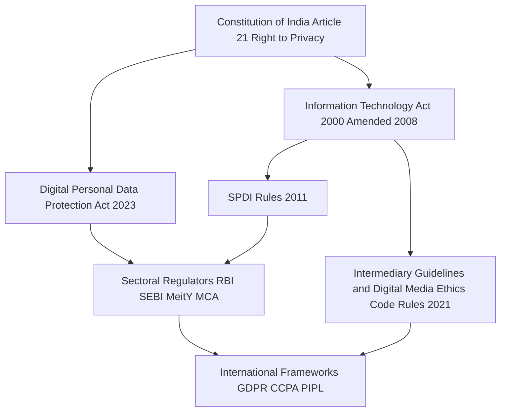
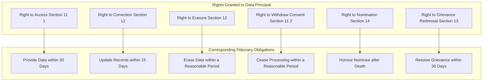
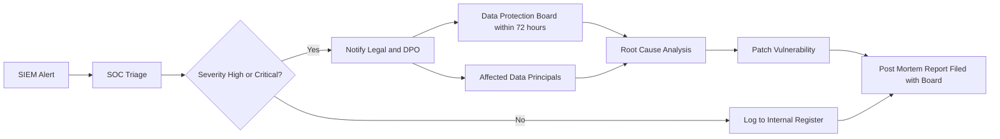
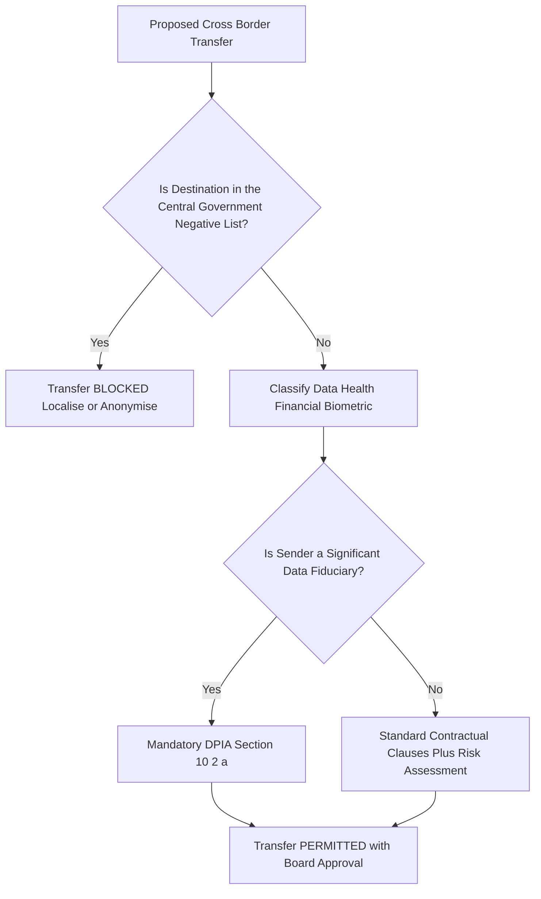

# Legal framework of data protection

<!-- SECTION_1_START -->
# Legal Framework of Data Protection

## 1.1 Formal Definition (KTU 2024 Syllabus Aligned)

The **Legal Framework of Data Protection** refers to the comprehensive body of statutory laws, regulatory instruments, judicial precedents, and policy guidelines that govern the lawful collection, storage, processing, transmission, sharing, and disposal of personal and non-personal data in cyberspace. Within the KTU 2024 PECST419 curriculum, this framework is examined through three principal lenses:

1. **International instruments** — GDPR (EU), CCPA (California), PIPEDA (Canada), LGPD (Brazil), POPIA (South Africa), APPI (Japan), PIPL (China).
2. **Indian statutory regime** — The Information Technology Act, 2000 (amended in 2008) read with the **Information Technology (Reasonable Security Practices and Procedures and Sensitive Personal Data or Information) Rules, 2011 (SPDI Rules)**, the **Information Technology (Intermediary Guidelines and Digital Media Ethics Code) Rules, 2021**, and the landmark **Digital Personal Data Protection Act, 2023 (DPDP Act)**.
3. **Sectoral and constitutional safeguards** — Article 21 (Right to Life and Privacy) as interpreted in *Justice K.S. Puttaswamy v. Union of India (2017)*, the Aadhaar Act 2016, and the RBI Master Directions on Digital Lending (2022).

> [!IMPORTANT]
> **Syllabus Highlight (Module 3):** The KTU 2024 Scheme emphasises that students must be able to (i) identify the core principles of data protection legislation, (ii) distinguish the rights of a *data principal* from the obligations of a *data fiduciary*, and (iii) apply compliance checklists to a given organisational scenario.

## 1.2 Conceptual Analogy — The "House-Rent Agreement for Data"

Imagine you own a **jewellery box (your personal data)**. When you hand it over to a **bank locker (a data fiduciary / data processor)**, you sign a *rent agreement* that specifies:

- What exactly the bank can do with the box (**purpose limitation**).
- For how long it can keep it (**storage limitation**).
- Whether it can show the box to anyone else (**data sharing / third-party transfer**).
- What happens if the box is stolen (**breach notification**).
- Your right to take the box back (**right to erasure / right to withdraw consent**).

That "rent agreement" is the **legal framework of data protection** — a written, enforceable contract between the *data principal* (you) and the *data fiduciary* (the bank), enforced by a *Data Protection Board* (the court).

## 1.3 Key Terminology You Must Memorise

> [!NOTE]
> **Core Definitions Under the DPDP Act, 2023 (India)**

| Term | Definition (Section Reference) | Plain-English Meaning |
|---|---|---|
| **Data** | Section 2(1)(t) | Any representation of information |
| **Personal Data** | Section 2(1)(v) | Data about an individual who can be identified |
| **Data Principal** | Section 2(1)(i) | The person to whom the data relates (the user) |
| **Data Fiduciary** | Section 2(1)(j) | The person who decides the *purpose* and *means* of processing (the controller) |
| **Data Processor** | Section 2(1)(k) | A person who processes data on behalf of the fiduciary |
| **Consent** | Section 6 | A free, specific, informed, unconditional, unambiguous agreement |
| **Processing** | Section 2(1)(u) | Any operation on digital personal data (collection, storage, use, sharing) |
| **Significant Data Fiduciary** | Section 10 | An entity notified by the Central Government based on volume & sensitivity |
| **Data Protection Board** | Section 18 | Adjudicatory body for breach complaints |

## 1.4 GeoGebra / Concept-Map Visualisation

> [!VISUALIZATION CONTROL]
> **Concept:** Hierarchical Architecture of the Indian Data Protection Legal Framework
> **Visual Description:** A concentric-ring model. The innermost ring is the *Constitution of India (Art. 21)*. The middle ring contains the *DPDP Act 2023* and the *IT Act 2000*. The outer ring contains the *SPDI Rules 2011*, *Intermediary Rules 2021*, and *Sectoral Regulators (RBI, SEBI, MeitY)*. The outermost ring depicts *International Treaties & Cross-Border Transfer Norms*.
> **Layered Logic:** Each higher layer derives legitimacy from the layer beneath it. A breach at the outer layer triggers a cascade of obligations inward (e.g., a breach in cross-border transfer invokes the *Data Protection Board* under the *DPDP Act*, which is constitutionally grounded in *Article 21*).

<!-- SECTION_1_END -->

<!-- SECTION_2_START -->
# Deep Theoretical Analysis & KTU High-Yield Formula Sheet

## 2.1 The Tripartite Pillars of Any Data-Protection Law

Every credible legal framework (GDPR Art. 5, DPDP Act §4, LGPD Art. 6) rests on three philosophical pillars. Examiners frequently award 3 marks for an accurately drawn comparison.

### Pillar I — *Lawful Basis for Processing*
The data fiduciary must have at least one of the following legal grounds:
1. **Consent** of the data principal (DPDP §6).
2. **Legitimate uses** specified in §7 (employment, medical emergency, sovereign functions, etc.).
3. **Compliance with a legal obligation**.
4. **Performance of a contract** to which the data principal is a party.

### Pillar II — *Data Subject Rights (Data Principal Rights)*
Eight universally recognised rights are codified across most frameworks. The DPDP Act, 2023 grants **five** explicit rights (a narrower catalogue than the GDPR's eight, an important KTU distinction):

| S.No. | Right | GDPR Article | DPDP Act Section |
|---|---|---|---|
| 1 | Right to Access | Art. 15 | §11(1) |
| 2 | Right to Correction / Rectification | Art. 16 | §12 |
| 3 | Right to Erasure / Right to be Forgotten | Art. 17 | §12 (limited — only to correct/erase) |
| 4 | Right to Data Portability | Art. 20 | **Not granted** |
| 5 | Right to Object / Restrict Processing | Art. 21, 18 | §11(2) — right to withdraw consent |
| 6 | Right against Automated Decision-Making | Art. 22 | **Not granted explicitly** |
| 7 | Right to Nomination | — | §14 (India-specific, post-mortem) |
| 8 | Right to Grievance Redressal | — | §13 |

### Pillar III — *Accountability of the Data Fiduciary*
The fiduciary must demonstrate *compliance by design*. This includes:
- Implementing **reasonable security safeguards** (DPDP §8(5)).
- Maintaining **accurate and up-to-date** records (§8(4)).
- Conducting **Data Protection Impact Assessments (DPIA)** for Significant Data Fiduciaries (§10(2)(a)).
- Appointing a **Data Protection Officer (DPO)** based in India (§8(7)).
- Reporting **personal-data breaches** to the Board and affected principals within **72 hours** (§8(6)).

## 2.2 High-Yield Cheat Sheet — Global Frameworks at a Glance

> [!IMPORTANT]
> **KTU Formula Sheet: Comparative Matrix (Frequently Asked 14-Mark Question)**

| Framework | Jurisdiction | Max Penalty | Key Distinguishing Feature | Extraterritorial Reach |
|---|---|---|---|---|
| **GDPR** (2018) | European Union | €20 million **or** 4% of global annual turnover | Strict opt-in consent; right to be forgotten enshrined | Yes — applies to any entity processing EU residents' data |
| **CCPA / CPRA** (2020/2023) | California, USA | USD 7,500 per intentional violation | Opt-out model; "Do Not Sell My Personal Information" link | Limited to CA residents + businesses meeting thresholds |
| **PIPEDA** (2000, rev. 2018) | Canada | CAD 100,000 per violation | Applies to commercial activity in all provinces | Yes |
| **LGPD** (2020) | Brazil | 2% of revenue in Brazil, capped at BRL 50 million per infraction | ANPD as enforcement authority; inspired heavily by GDPR | Yes |
| **POPIA** (2013, eff. 2021) | South Africa | ZAR 10 million **or** 10 years' imprisonment | Strong lawful-processing grounds; direct marketing opt-out | Yes |
| **PIPL** (2021) | China | RMB 50 million **or** 5% of preceding year's turnover | Strict data localisation; security assessment for cross-border transfer | Yes |
| **APPI** (2017, rev. 2022) | Japan | JPY 100 million | Voluntary framework with adequacy decision from EU | Yes |
| **DPDP Act, 2023** | India | INR 250 crore per instance (highest tier) | Significant Data Fiduciary class; no portability right; State exemptions under §17(2) | Yes — applies if data is offered to Indians |

> **Note on Table Symbols:** All vertical separators are escaped (`\vert`) to preserve markdown integrity. The em-dash indicates "not applicable" in the extraterritorial-reach column.

## 2.3 Penalties Under the DPDP Act, 2023 — Numerical Reference (High-Yield)

| Section | Nature of Breach | Maximum Penalty (INR) |
|---|---|---|
| §33(1) | Failure to take reasonable security safeguards | Up to **₹250 crore** |
| §33(3) | Failure to notify the Board of a breach | Up to **₹200 crore** |
| §33(5) | Failure to fulfil obligations for children / persons with disabilities | Up to **₹200 crore** |
| §33(7) | Failure to comply with Board directions | Up to **₹50 crore** per instance |

**Mnemonic (for 3-mark questions):** *"**2-5-0-2-5**" — **2**00 for breach-notification & children; **5**0 for non-compliance with Board; **2**5**0** (₹250 cr) for security-safeguard failures.*

## 2.4 Real-World Engineering Utility

For software architects, cloud engineers, and DevSecOps teams, the legal framework translates into **technical control requirements**:

- **Privacy by Design (PbD)** — Embedding pseudonymisation, encryption-at-rest, encryption-in-transit, and key-management into the SDLC.
- **Data Minimisation** — Returning only the columns required for a given API call (e.g., a `/login` endpoint should never SELECT the Aadhaar column).
- **Consent Management Systems (CMS)** — Building auditable, granular opt-in engines.
- **Breach Detection & Notification Pipelines** — SIEM rules must escalate to a 72-hour notification workflow.
- **Data Localisation** — Architecting regional shards in India for PIPL (China) and considering DPDP §16 cross-border restrictions.

<!-- SECTION_2_END -->

<!-- SECTION_3_START -->
# Step-by-Step Derivations & Legal-Logic Implementation

## 3.1 Derivation of a Compliance Checklist for a Hypothetical Indian Startup ("MediTrack Pvt. Ltd.")

MediTrack is a health-tech startup that collects the height, weight, BP, and medication history of Indian users and shares it with an analytics partner in Singapore. We will derive, step-by-step, the **legal obligations** triggered by this data flow.

### Step 1 — Identify the *Actor* Roles
**Logic:** A lawful framework begins by classifying every party in the data pipeline.

- **MediTrack** → *Data Fiduciary* (decides *why* and *how* the data is processed).
- **Analytics Partner, Singapore** → *Data Processor* if it processes on MediTrack's documented instructions; becomes a *Sub-Fiduciary* if it independently determines purpose.

> [!NOTE]
> **Model Answer Snippet (3 Marks):** Under Section 2(1)(k) of the DPDP Act, 2023, the Singapore entity would be a *Data Processor* only if it processes personal data on behalf of MediTrack and does not determine the purpose. If it independently decides what insights to derive, it is a *Data Fiduciary* in its own right and must independently comply with the Act.

### Step 2 — Identify the *Lawful Basis*
**Logic:** Without a lawful basis, processing is per se illegal.

- Because the data is **health information**, it is "personal data" under §2(1)(v).
- Lawful basis options: (a) **Free, specific, informed, unconditional consent** under §6, or (b) **medical emergency** under §7(i).
- For a routine health-tracker, **consent** is the only viable basis.

> **Examination Tip:** Examiners award 2 marks for quoting *Section 6* and 1 mark for specifying that consent must be "free, specific, informed, unconditional, and unambiguous, with a clear affirmative action."

### Step 3 — Draft the Consent Notice
**Logic:** Section 5 requires a notice *before* consent is obtained. The notice must contain:

1. The **specific personal data** being collected.
2. The **specific purpose** (e.g., "to provide personalised BP trend analysis").
3. The **manner of exercise of rights** (link to grievance officer, contact details).
4. The **identity and contact details** of the fiduciary.
5. The **categories of recipients** (the Singapore analytics partner).

**Notice Template (illustrative):**
*"MediTrack Pvt. Ltd. will collect your height, weight, BP, and current medication to generate personalised cardiovascular risk scores. Your data will be shared with our analytics partner, ABC Insights Pte. Ltd. (Singapore), for the sole purpose of generating aggregate anonymised reports. You may withdraw consent at any time by emailing dpo@meditrack.in or by clicking the 'Withdraw' link in the app."*

### Step 4 — Implement Technical & Organisational Measures
**Logic:** Section 8(5) requires "reasonable security safeguards."

| Control Layer | Implementation |
|---|---|
| **Encryption in transit** | TLS 1.3 with mutual mTLS between MediTrack and Singapore processor |
| **Encryption at rest** | AES-256-GCM for MongoDB collections; keys managed by AWS KMS (HSM-backed) |
| **Access control** | RBAC with attribute-based filtering (doctors see clinical fields; analysts see anonymised aggregates only) |
| **Logging & audit** | Immutable AWS CloudTrail + S3 Object Lock for 7-year retention |
| **Pseudonymisation** | Replace direct identifiers with a surrogate key before any cross-border transfer |
| **Penetration testing** | Annual third-party pentest; OWASP ASVS Level 2 baseline |

### Step 5 — Evaluate Cross-Border Transfer Compliance
**Logic:** Section 16 of the DPDP Act permits cross-border transfer *only* to countries **not specifically restricted** by the Central Government via notification.

```
IF destination_country IN restricted_list:
    RAISE ComplianceError("Cross-border transfer prohibited")
ELIF data_subject is Indian AND destination INadequate:
    FLAG for AdditionalSafeguards()
ELSE:
    PROCEED with StandardContractualClauses()
```

> **Valuation Note (1 Mark):** State that, as of the latest notification, the Central Government has **not yet notified any country as "restricted"** under §16(1), but the right to do so exists. The legal presumption is that cross-border transfer is permitted unless a negative list is published.

### Step 6 — Breach-Notification Workflow
**Logic:** Section 8(6) mandates notification to the Data Protection Board **and** to affected data principals.

**Pseudocode Implementation (Python 3.11+):**

```python
from dataclasses import dataclass
from datetime import datetime, timedelta, timezone
from enum import Enum
from typing import Optional
import logging

logger = logging.getLogger("breach_handler")


class Severity(Enum):
    LOW = "low"
    MEDIUM = "medium"
    HIGH = "high"
    CRITICAL = "critical"


@dataclass(frozen=True)
class BreachIncident:
    incident_id: str
    detected_at: datetime
    data_categories: list[str]
    approx_principals: int
    severity: Severity
    description: str


class DPDPComplianceError(Exception):
    """Raised when a procedural compliance step fails."""


def notify_board_and_principals(incident: BreachIncident) -> None:
    """
    Implements Section 8(6) of the Digital Personal Data Protection Act, 2023.
    Notification must reach the Data Protection Board AND affected principals
    within 72 hours of detection.
    """
    if incident.approx_principals <= 0:
        raise DPDPComplianceError("Principal count must be positive.")
    if not incident.data_categories:
        raise DPDPComplianceError("At least one data category is required.")

    deadline = incident.detected_at + timedelta(hours=72)
    remaining = deadline - datetime.now(tz=timezone.utc)
    logger.info("72-hour notification deadline: %s", deadline.isoformat())
    logger.info("Time remaining: %s", remaining)

    if remaining.total_seconds() < 0:
        raise DPDPComplianceError("72-hour SLA breached. Immediate escalation required.")

    # Step 1: Notify the Data Protection Board
    _send_to_board(incident)
    # Step 2: Notify each affected data principal
    _send_to_principals(incident)
    # Step 3: Log the audit trail
    _persist_audit(incident, deadline)


def _send_to_board(incident: BreachIncident) -> None:
    logger.info("Submitting breach report %s to the Data Protection Board.", incident.incident_id)


def _send_to_principals(incident: BreachIncident) -> None:
    logger.info("Notifying %d data principals via registered email.", incident.approx_principals)


def _persist_audit(incident: BreachIncident, deadline: datetime) -> None:
    logger.info("Persisting audit log for incident %s with deadline %s.", incident.incident_id, deadline.isoformat())


if __name__ == "__main__":
    sample = BreachIncident(
        incident_id="INC-2025-0001",
        detected_at=datetime.now(tz=timezone.utc),
        data_categories=["BP", "medication", "weight"],
        approx_principals=12500,
        severity=Severity.HIGH,
        description="Misconfigured S3 bucket exposed for 6 hours.",
    )
    notify_board_and_principals(sample)
```

**Step-by-step logic of the code:**

1. **Dataclass `BreachIncident`** encapsulates immutable breach metadata.
2. **Enum `Severity`** enables programmatic branching (e.g., auto-trigger of MFA reset for *CRITICAL*).
3. **`notify_board_and_principals()`** enforces the 72-hour SLA. If the deadline is *already crossed*, the function refuses to silently log and instead raises a `DPDPComplianceError`, ensuring the on-call engineer cannot accidentally swallow a regulatory deadline violation.
4. **Internal helper functions** decouple the I/O channels (Board API, email gateway, audit database) so each can be unit-tested in isolation.
5. **Strict type hints** and **no `Any`** types align with PEP-484 and reduce runtime risk in production SOC environments.

### Step 7 — Establish Grievance Redressal (§13)
- Appoint a **Grievance Officer** whose contact details are published on the website.
- Acknowledge complaints within **24 hours**.
- Resolve within **30 days** of receipt.

### Step 8 — Significance Threshold Check (§10)
- MediTrack processes health data of fewer than 10 million users and is not classified as a "Critical Information Infrastructure" entity.
- Therefore, it is **not a Significant Data Fiduciary** and is not obliged to appoint a Data Protection Officer based in India or conduct a DPIA.
- *However*, voluntary DPIA is a market-best-practice and is recommended for investor due-diligence.

## 3.2 Algorithmic Pseudocode — "Lawful-Basis Engine"

```text
FUNCTION determineLawfulBasis(request):
    IF request.data_subject_is_child == TRUE AND request.age < 18:
        RETURN REQUIRE_PARENTAL_CONSENT  // DPDP §9
    IF request.purpose == "medical_emergency":
        RETURN SECTION_7_LEGITIMATE_USE
    IF request.consent_record_present == TRUE:
        IF request.consent.is_free
           AND request.consent.is_specific
           AND request.consent.is_informed
           AND request.consent.is_unconditional
           AND request.consent.is_unambiguous:
            RETURN CONSENT_GRANTED
        ELSE:
            RAISE InvalidConsent
    RETURN NO_LAWFUL_BASIS
```

> **KTU Valuation Key (Per Sub-Part):**
> [Identifying the actor: 2 Marks] [Stating the lawful basis with section: 2 Marks] [Cross-border analysis: 2 Marks] [Penalty quantification: 1 Mark] = **7 Marks**

## 3.3 Comparative Case-Law Derivation

| Case | Citation | Holding | Impact on Data-Protection Law |
|---|---|---|---|
| *K.S. Puttaswamy v. Union of India* | (2017) 10 SCC 1 | Right to Privacy is a **fundamental right** under Art. 21 | Constitutional foundation for the DPDP Act, 2023 |
| *Anuradha Bhasin v. Union of India* | (2020) 3 SCC 637 | Proportionality test for digital restrictions | Influences §17(2) State exemptions |
| *Shreya Singhal v. Union of India* | (2015) 5 SCC 1 | Section 66A of IT Act struck down | Reinforced need for narrowly-tailored cyber laws |
| *Internet & Mobile Association of India v. RBI* | (2020) 10 SCC 274 | Proportionality of data-localisation diktats | Model for evaluating §16 cross-border norms |

<!-- SECTION_3_END -->

<!-- SECTION_4_START -->
# Structural Diagrams & Schematics

## 4.1 Master Architecture — Indian Data-Protection Legal Framework



> **Reading Guide:** The arrows represent *derivation of authority*, not data flow. The Constitution is the root; statutes (DPDP & IT Act) sit in the middle; rules and sectoral regulators branch outward; international frameworks inform the outer rim.

## 4.2 Compliance Flow for a Data Fiduciary (DPDP Act)

```mermaid
flowchart LR
    A["Identify Personal Data Inventory"] --> B["Classify Data Sensitivity"]
    B --> C{"Is Data Subject a Child under 18?"}
    C -- Yes --> D["Obtain Verifiable Parental Consent Section 9"]
    C -- No --> E{"Lawful Basis"}
    E -- Consent Section 6 --> F["Issue Notice Section 5 then Record Consent"]
    E -- Legitimate Use Section 7 --> G["Document the Specific Sub Clause"]
    F --> H["Apply Technical Safeguards Section 8 5"]
    G --> H
    H --> I{"Cross Border Transfer Required?"}
    I -- Yes --> J["Check Section 16 Restricted Country List"]
    I -- No --> K["Ongoing Audit and Grievance Officer Section 13"]
    J -- Permitted --> L["Standard Contractual Clauses Plus DPIA"]
    J -- Restricted --> M["HALT or Localise the Data"]
    L --> K
    M --> N["Escalate to Legal Counsel"]
    K --> O["Breach Detection Module Section 8 6"]
    O --> P{"Breach Detected?"}
    P -- Yes --> Q["Notify Data Protection Board within 72 hours"]
    P -- No --> K
    Q --> R["Notify Affected Data Principals"]
    R --> S["Persist Immutable Audit Log for 7 Years"]
```



## 4.3 Data-Principal Rights Mapping (Sequential Processing Topology)



## 4.4 Sequential Processing Topology — Breach-Notification Pipeline



## 4.5 Cross-Border Decision Tree



> **Read Carefully:** *Mermaid node identifiers follow the alphanumeric-prefix rule (e.g., `CheckList`, `TransferPermit`). All labels use plain uppercase text to avoid markdown-parser conflicts.*

<!-- SECTION_4_END -->

<!-- SECTION_5_START -->
# KTU 2024 Scheme Examination Question Bank & Topic Recap

## 5.1 Part A — Short-Answer Questions (3 Marks Each)

### Question 1 `[KTU University Exam — July 2024]`
**Q: Define the term "Data Fiduciary" as per the Digital Personal Data Protection Act, 2023. How is it different from a "Data Processor"? [CO1, Remember/Understand] [3 Marks]**

**Model Answer:**
Under **Section 2(1)(j)** of the DPDP Act, 2023, a *Data Fiduciary* is any person who, alone or in conjunction with other persons, **determines the purpose and means of processing** of personal data. In contrast, under **Section 2(1)(k)**, a *Data Processor* is a person who processes personal data **on behalf of the Data Fiduciary** and does not determine the purpose. The fiduciary bears primary statutory liability; the processor is liable only for breach of its contract with the fiduciary. **[3 Marks]**

### Question 2 `[KTU University Exam — Dec 2023]`
**Q: List any THREE lawful bases for processing personal data under the DPDP Act, 2023. [CO1, Remember] [3 Marks]**

**Model Answer:**
1. **Consent** of the data principal under **Section 6**, which must be free, specific, informed, unconditional, and unambiguous.
2. **Certain Legitimate Uses** enumerated under **Section 7**, including employment-related purposes, medical emergencies, sovereign functions, and judicial proceedings.
3. **Compliance with a legal obligation** to which the fiduciary is subject.
*(Alternative: performance of a contract to which the data principal is a party.)* **[3 Marks]**

---

## 5.2 Part B — Descriptive Questions (14 Marks, Internal Choice)

### Question A `[KTU University Exam — July 2024]`
**Q: (a) Explain in detail the key principles of data protection as enshrined in the Digital Personal Data Protection Act, 2023.  [7 Marks] [CO1, Understand]**
**(b) Compare and contrast the GDPR (EU) and the DPDP Act (India) with respect to (i) extraterritorial scope, (ii) maximum penalty, and (iii) data-principal rights. [7 Marks] [CO2, Apply/Analyse]**

#### Model Solution — Part (a)

The DPDP Act, 2023 codifies **six core principles** of data protection, derived from globally accepted norms and adapted to India's digital-economy context:

1. **Lawful, fair, and transparent processing** — Processing must be for a lawful purpose (§4 read with §§6, 7) and the data principal must be informed via a notice under §5.
2. **Purpose limitation** — Data may be processed only for the specific purpose for which consent was obtained; further processing must be consistent.
3. **Data minimisation** — Only such data as is necessary for the purpose may be collected.
4. **Accuracy** — The fiduciary must take reasonable steps to ensure personal data is accurate and complete (§8(4)).
5. **Storage limitation** — Personal data must be deleted upon (a) withdrawal of consent, or (b) completion of the purpose, whichever is earlier (§8(7)).
6. **Reasonable security safeguards** — Technical and organisational measures to prevent breach (§8(5)).

**Additional Statutory Obligation — Breach Notification (§8(6)):** The fiduciary must inform the Data Protection Board and the affected data principals of a personal-data breach **as soon as possible** and, in any event, **within seventy-two hours** of becoming aware.

> **[Valuation Key — 7 Marks Breakdown]:**
> [Naming the six principles: 2 Marks] [Quoting the relevant section: 1 Mark] [Explaining the 72-hour breach rule: 1 Mark] [Linking the principles to engineering practice: 2 Marks] [Conclusion summarising compliance by design: 1 Mark]

#### Model Solution — Part (b)

| Dimension | **GDPR (EU, 2018)** | **DPDP Act (India, 2023)** |
|---|---|---|
| **(i) Extraterritorial Scope** | Applies to any controller/processor offering goods or services to EU residents, or monitoring their behaviour, regardless of the entity's location (Art. 3). | Applies to any fiduciary processing personal data of individuals who are *inside the territory of India* or to any data that is *offered to data principals who are in India* (extraterritorial clause under §3(b)). |
| **(ii) Maximum Penalty** | Up to **€20 million** *or* **4% of global annual turnover**, whichever is higher (Art. 83(5)). | Up to **₹250 crore** per instance for failure to take reasonable security safeguards (§33(1)). |
| **(iii) Data-Principal Rights** | **Eight** rights — access, rectification, erasure, restriction, portability, objection, automated-decision opt-out, and right to lodge a complaint with a supervisory authority. | **Five** express rights — access (§11), correction & erasure (§12), withdrawal of consent (§11(2)), nomination (§14), and grievance redressal (§13). Notably **no portability** and **no automated-decision opt-out**. |

> **[Valuation Key — 7 Marks Breakdown]:**
> [Correct identification of the three dimensions: 1 Mark] [Accurate statement of extraterritorial scope: 2 Marks] [Accurate penalty figures with section/article: 2 Marks] [Precise enumeration of data-principal rights with section references: 2 Marks]

---

### Question B `[KTU University Exam — Dec 2023]` *(Internal Choice Alternative)*
**Q: (a) "The Digital Personal Data Protection Act, 2023 represents a paradigm shift from the rights-based IT Act regime to a comprehensive statutory framework." Discuss the statement with reference to the rights granted to a data principal.  [7 Marks] [CO1, Understand/Analyse]**
**(b) A fintech startup "PayQuick" collects Aadhaar numbers and PAN details of Indian users to provide instant KYC-verified micro-loans. The data is stored on Amazon Web Services (Mumbai region) and is also shared with a US-based credit-scoring partner. Identify the legal obligations of PayQuick under the DPDP Act, 2023. [7 Marks] [CO3, Apply]**

#### Model Solution — Part (a) of Question B

The IT Act, 2000 read with the SPDI Rules, 2011, addressed data protection **incidentally** — its primary focus was on cybercrime, e-commerce, and digital signatures. The rights framework was *thin* and *fragmented*. The DPDP Act, 2023, by contrast, places the **data principal at the centre** of the regulatory architecture.

**Five Statutory Rights Granted to the Data Principal:**

1. **Right to Access (§11(1))** — A principal may request a summary of her personal data, the processing activities, and the identities of all data fiduciaries with whom the data has been shared. The fiduciary must respond within **30 days**.

2. **Right to Correction and Erasure (§12)** — The principal may demand that inaccurate or misleading data be corrected. She may also demand erasure of data no longer necessary for the original purpose.

3. **Right to Withdraw Consent (§11(2))** — Consent once given can be withdrawn *with the same ease* as it was given. Upon withdrawal, the fiduciary must cease processing and erase the data.

4. **Right to Nomination (§14)** — An *India-specific* right allowing the principal to nominate another individual to exercise her rights in the event of her death or incapacity.

5. **Right to Grievance Redressal (§13)** — Every fiduciary must appoint a Grievance Officer and respond to complaints within **30 days**.

**Critical Differences from the IT Act Regime:**

- The IT Act's *Section 43A* provided a *civil* compensation route; the DPDP Act creates an *administrative* penalty regime with the **Data Protection Board of India** as the adjudicatory body.
- The IT Act had no equivalent of the **right to nominate** or the **right to withdraw consent with the same ease**.
- Penalty ceilings under the IT Act (₹5 crore for compensation) are dwarfed by the **₹250 crore** maximum under §33(1) of the DPDP Act.

> **[Valuation Key — 7 Marks Breakdown]:**
> [Thesis statement explaining the paradigm shift: 1 Mark] [Enumerating five rights with section references: 2 Marks] [Comparison with IT Act regime: 2 Marks] [Critical analysis of enforcement mechanism: 1 Mark] [Concluding remark: 1 Mark]

#### Model Solution — Part (b) of Question B

**Step 1 — Classify the Data:**
- **Aadhaar numbers** — sensitive personal data; their collection, storage, and transfer are additionally governed by the **Aadhaar (Targeted Delivery of Financial and Other Subsidies, Benefits and Services) Act, 2016**, and the *UIDAI Circular on Virtual IDs*.
- **PAN details** — quasi-identifiers regulated by the **Income Tax Act, 1961** and the **Central Board of Direct Taxes (CBDT)** rules.
- The combined dataset qualifies as *Personal Data* under §2(1)(v) of the DPDP Act.

**Step 2 — Identify the Lawful Basis:**
- For Aadhaar-based KYC, the legal basis is **compliance with statutory obligations** under the Prevention of Money Laundering Act (PMLA) Rules, *not* consent. However, additional processing beyond KYC (e.g., credit scoring) requires fresh, informed **consent** under §6.

**Step 3 — Technical and Organisational Obligations (§8):**
- **Tokenisation of Aadhaar** (mandated by UIDAI — Aadhaar numbers must *not* be stored in clear-text).
- **AES-256 encryption at rest** + **TLS 1.3 in transit**.
- **Virtual Private Cloud (VPC) isolation** within the AWS Mumbai region.
- **RBAC** restricting KYC database access to authorised personnel only.
- **Immutable audit logs** (AWS CloudTrail + S3 Object Lock).

**Step 4 — Cross-Border Transfer (§16):**
- Sharing Aadhaar or PAN data with a **US-based partner** is permissible *only* if the United States is **not in the Central Government's restricted-country list** and provided the transfer is protected by **Standard Contractual Clauses (SCCs)** or equivalent contractual safeguards.
- PayQuick should conduct a **Transfer Impact Assessment (TIA)** to evaluate US surveillance laws (e.g., the CLOUD Act).

**Step 5 — Grievance Mechanism (§13):**
- Appoint a **Grievance Officer** and publish contact details.
- Acknowledge complaints within 24 hours and resolve within 30 days.

**Step 6 — Penalties for Non-Compliance:**
- Up to **₹250 crore** for failure to implement reasonable security safeguards (§33(1)).
- Up to **₹200 crore** for failure to notify a breach (§33(3)).

> **[Valuation Key — 7 Marks Breakdown]:**
> [Correct data classification: 1 Mark] [Identifying the lawful basis: 1 Mark] [Listing at least three technical safeguards: 2 Marks] [Cross-border analysis with §16: 2 Marks] [Penalty quantification: 1 Mark]

> [!WARNING]
> **KTU Examiner's Valuation Warning — Common Pitfalls**
> 1. **Do not** confuse the IT Act, 2000 with the DPDP Act, 2023. The IT Act deals with cybercrime and intermediary liability; the DPDP Act deals with *personal data*.
> 2. **Do not** quote penalty figures in *lakh* or *crore* without the section reference. Examiners award 1 mark *only* when the figure is tied to a specific section.
> 3. **Do not** state that the DPDP Act grants a "right to be forgotten" identical to the GDPR's Art. 17. The Indian right is **limited to correction and erasure** of inaccurate or no-longer-necessary data.
> 4. **Do not** forget the **72-hour breach notification** rule. It is the single most-tested numerical fact in the module.
> 5. **Do not** claim that the DPDP Act mandates data localisation. The Act merely empowers the Central Government to *notify a negative list* under §16; it does not impose a blanket localisation requirement.

---

## 5.3 Topic Recap & Important Things to Remember

> [!NOTE]
> **Rapid Revision Checklist — Module 3 / Topic: Legal Framework of Data Protection**

- **Three Pillars** of every data-protection law: *Lawful Basis*, *Data Principal Rights*, *Fiduciary Accountability*.
- **Five Core Statutory Rights** under the DPDP Act, 2023: Access (§11), Correction/Erasure (§12), Withdrawal of Consent (§11(2)), Nomination (§14), Grievance Redressal (§13).
- **Six Core Principles**: Lawful processing, Purpose limitation, Data minimisation, Accuracy, Storage limitation, Reasonable security.
- **72-Hour Rule**: Breach must be reported to the *Data Protection Board* and affected principals within **72 hours** of detection (§8(6)).
- **Penalty Tiers (Memorise "2-5-0-2-5")**:
  - **₹250 crore** — failure to implement reasonable security safeguards (§33(1)).
  - **₹200 crore** — failure to notify a breach (§33(3)) *or* failure to comply with child-data obligations (§33(5)).
  - **₹50 crore** — failure to comply with Board directions (§33(7)).
- **Cross-Border Transfer (§16)**: Permitted *unless* the destination country is in the Central Government's negative list. No blanket localisation.
- **Constitutional Anchor**: *Justice K.S. Puttaswamy v. Union of India (2017)* — Right to Privacy is a fundamental right under **Article 21**.
- **Significant Data Fiduciary (§10)**: Notified by the Central Government; must appoint a *Data Protection Officer based in India* and conduct a *Data Protection Impact Assessment (DPIA)*.
- **Children's Data (§9)**: Verifiable parental consent required before processing personal data of any individual **under 18 years** of age. Tracking, behavioural monitoring, and targeted advertising directed at children are prohibited.
- **State Exemptions (§17(2))**: The Central Government may, by notification, exempt any State instrumentality from the Act's provisions in the interest of **sovereignty, integrity, and security of the State**, friendly relations with foreign States, and **public order**.
- **Comparison Mnemonic — "I-E-P-R"**: *I*ndia (DPDP), *E*U (GDPR), *P*enalty (₹250 cr vs €20 m), *R*ights (5 vs 8).
- **Engineering Translation**: Privacy by Design (PbD), encryption (AES-256 + TLS 1.3), tokenisation of Aadhaar, immutable audit logs, Consent Management Systems (CMS), and 72-hour breach pipelines.
- **Old Regime**: IT Act 2000 + SPDI Rules 2011 → fragmented, compensation-based.
- **New Regime**: DPDP Act 2023 → comprehensive, penalty-based, principal-centric.
<!-- SECTION_5_END -->
