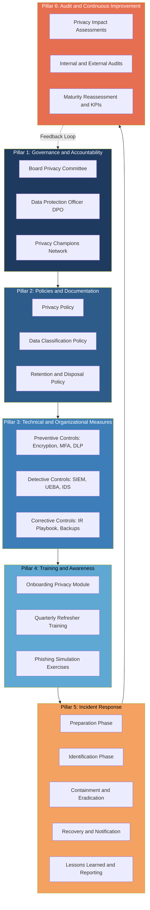
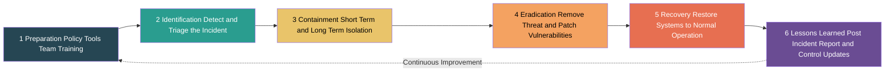
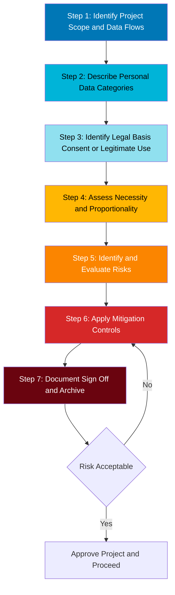

# Organizational Response

<!-- SECTION_1_START -->
# Organizational Response to Data Protection and Privacy Concerns

## 1. Core Technical Definition

**Organizational Response** refers to the structured, institution-wide framework of policies, procedures, governance mechanisms, technical controls, and cultural practices that an enterprise adopts to safeguard personal and sensitive data, ensure regulatory compliance, manage privacy risks, and respond effectively to data breaches and cyber incidents in cyberspace.

In the KTU 2024 Scheme terminology (PECST419 — Cyber Ethics, Privacy and Legal Issues), *Organizational Response* encompasses the legal, administrative, technical, and human-resource dimensions through which an entity operationalizes its data protection obligations under statutes such as the **Digital Personal Data Protection Act, 2023 (DPDPA)**, the **Information Technology Act, 2000**, and international frameworks like the **GDPR (General Data Protection Regulation)**.

> [!IMPORTANT]
> **KTU 2024 Syllabus Definition (Module 3):**
> Organizational Response is the collective set of governance structures, accountability mechanisms, employee awareness programs, technical safeguards, and breach-handling protocols established by an organization to demonstrate due diligence in protecting data subject rights and maintaining stakeholder trust.

## 2. Intuitive Overview / Conceptual Analogy

Think of an organization as a **large hospital**. The hospital has many wards (departments), patients (data subjects), medical records (personal data), doctors and nurses (employees), visiting specialists (third-party vendors), and a hospital administrator (the management). Just as a hospital must:

- Lock medicine cabinets (technical controls)
- Train nurses on patient confidentiality (awareness programs)
- Have a fire-evacuation plan (incident response)
- Appoint a Chief Medical Officer who is accountable (Data Protection Officer)
- Conduct regular audits by external agencies (compliance audits)
- Maintain insurance and legal counsel (legal preparedness)

...an organization responding to data privacy concerns must build a **layered, end-to-end protection ecosystem** — not just buy a piece of software.

> [!NOTE]
> **Geometric Intuition — The Privacy Defense Pyramid:**
> Imagine a 4-tier pyramid. The **base (largest tier)** is *Employee Awareness & Culture*; the second tier is *Policies & Governance*; the third tier is *Technical & Operational Controls*; and the **apex (smallest tier)** is *Incident Response & Recovery*. If the base collapses, the entire structure fails — this is why organizational response is never just an "IT problem."

## 3. Why Organizations Must Respond

Modern organizations face a **triad of pressures** that force a structured response:

1. **Legal Pressure** — Statutory obligations under DPDPA 2023, IT Act 2000, sectoral regulations (RBI for banking, IRDAI for insurance, HIPAA for healthcare).
2. **Reputational Pressure** — Data breaches erode customer trust. The average cost of a data breach globally was **USD 4.45 million** (IBM Cost of a Data Breach Report, 2023), with reputational damage extending for years.
3. **Operational Pressure** — Privacy-by-design reduces rework, regulatory fines, and litigation costs.

> [!TIP]
> **Key Constant to Remember:**
> The **DPDPA 2023** prescribes a maximum penalty of **₹250 crore** (approximately **USD 30 million**) per breach for failure to take reasonable security safeguards. This makes organizational response a board-level priority, not a technical afterthought.

## 4. Pillars of Organizational Response

The KTU 2024 framework identifies **six core pillars**:

| # | Pillar | Brief Function |
|---|--------|----------------|
| 1 | **Governance & Accountability** | Defines who is responsible (Board, DPO, Committees) |
| 2 | **Policies & Documentation** | Written privacy policies, data classification standards |
| 3 | **Technical & Organizational Measures (TOMs)** | Encryption, access controls, pseudonymization |
| 4 | **Training & Awareness** | Continuous employee education, phishing simulations |
| 5 | **Incident Response & Breach Management** | Detection, containment, notification, post-mortem |
| 6 | **Audit, Monitoring & Continuous Improvement** | Internal/external audits, DPIAs, maturity models |

> [!VISUALIZATION CONTROL]
> **Concept:** The Six-Pillar Privacy Maturity Architecture
> **Representation (Conceptual Plot):**
> * X-axis: Maturity Level (Reactive → Compliant → Proactive → Optimized)
> * Y-axis: Organizational Capability Score (0 to 100)
> * Six curves representing each pillar, each rising from left (low) to right (high) in an ideal maturity model
> **Visual Description:** A radar/spider chart with 6 axes, where a mature organization shows a near-regular hexagon, while a reactive organization shows a highly irregular, lopsided shape.

<!-- SECTION_1_END -->

<!-- SECTION_2_START -->
# Deep Theoretical Analysis & KTU High-Yield Formula Sheet

## 1. Theoretical Decomposition: The Six-Pillar Architecture

### Pillar 1 — Governance and Accountability

**Why it exists:** Privacy cannot be enforced if no one is formally accountable. The DPDPA 2023 mandates the appointment of a **Data Protection Officer (DPO)** for Significant Data Fiduciaries (SDFs).

**How it operates:**

- **Board-level Privacy Committee** sets strategic direction.
- **Data Protection Officer (DPO)** acts as the single point of contact with the Data Protection Board of India and oversees compliance.
- **Privacy Champions** are embedded within each business unit as nodal officers.
- A **RACI Matrix** (Responsible, Accountable, Consulted, Informed) clarifies ownership for every data processing activity.

### Pillar 2 — Policies and Documentation

**Core documents include:**

- **Privacy Policy** — public-facing statement on data collection and use.
- **Data Classification Policy** — categorizes data as Public, Internal, Confidential, Restricted.
- **Data Retention & Disposal Policy** — defines lifecycle and destruction protocols.
- **Acceptable Use Policy (AUP)** — governs employee use of organizational IT assets.
- **Vendor/Third-Party Risk Management Policy** — extends obligations to processors.
- **Cookie Policy & Notice Framework** — for web/digital compliance.

> [!NOTE]
> Under the DPDPA 2023, a notice must be issued **before** data collection, specifying the purpose and the manner of exercising rights. The notice itself is a *legal deliverable*, not a UX feature.

### Pillar 3 — Technical and Organizational Measures (TOMs)

These are the **engineered safeguards** an organization deploys. Classified as:

- **Preventive Controls** — encryption (AES-256, RSA-2048), multi-factor authentication, firewalls, DLP (Data Loss Prevention), access control lists.
- **Detective Controls** — SIEM (Security Information and Event Management), UEBA (User and Entity Behavior Analytics), anomaly detection.
- **Corrective Controls** — incident response playbooks, backup and disaster recovery, forensic toolkits.
- **Deterrent Controls** — security awareness, warning banners, legal disclaimers.

### Pillar 4 — Training and Awareness

**Why it is the base of the pyramid:** Over **68%** of breaches involve a human element (Verizon DBIR 2023). Hence, a trained workforce is the single most cost-effective control.

Components:

- Onboarding privacy training (mandatory).
- Quarterly refresher modules.
- Phishing simulation exercises.
- Role-based advanced training (developers, marketers, HR).
- A **Culture of Privacy** measured via internal surveys.

### Pillar 5 — Incident Response and Breach Management

A **Six-Phase Incident Response Lifecycle** (per NIST SP 800-61 Rev. 2):

1. **Preparation** — policy, tools, trained team.
2. **Identification** — detect and triage the incident.
3. **Containment** — short-term and long-term isolation.
4. **Eradication** — remove the threat, patch vulnerabilities.
5. **Recovery** — restore systems to normal operation.
6. **Lessons Learned** — post-incident report, control updates.

Under the DPDPA 2023, breach notification to the **Data Protection Board of India and affected data principals** is mandatory.

### Pillar 6 — Audit, Monitoring, and Continuous Improvement

- **Privacy Impact Assessments (PIAs / DPIAs)** before launching new projects.
- **Internal Audits** (annual) and **External Audits** (bi-annual for SDFs).
- **Maturity Models** — e.g., the **NIST Privacy Framework**, **ISO 27701**, or the **CMMI Privacy Maturity Model**.
- **Key Performance Indicators (KPIs):** number of breaches, mean time to detect (MTTD), mean time to respond (MTTR), training completion rate, audit findings closure rate.

## 2. KTU High-Yield Formula Sheet

> [!IMPORTANT]
> The following table contains all key metrics, formulas, and parameters frequently tested in KTU 2024 Scheme examinations for PECST419.

| Concept | Formula / Parameter | Symbol / Unit | Application |
|---------|---------------------|---------------|-------------|
| **Risk Magnitude** | $Risk = Threat \times Vulnerability \times Impact$ | Qualitative Score (1-25) | Risk assessment matrix |
| **Annualized Loss Expectancy** | $ALE = SLE \times ARO$ | Currency units (₹ / USD) | Cost-benefit of controls |
| **Single Loss Expectancy** | $SLE = Asset\ Value \times Exposure\ Factor$ | Currency units | Per-incident loss |
| **Annualized Rate of Occurrence** | $ARO$ | Frequency (per year) | Probability estimate |
| **Return on Security Investment** | $ROSI = \frac{ALE_{before} - ALE_{after} - Cost\ of\ Control}{Cost\ of\ Control}$ | Ratio or Percentage | Justifying security spend |
| **Mean Time to Detect** | $MTTD = \frac{\sum (Detection\ Time - Incident\ Time)}{Number\ of\ Incidents}$ | Hours / Days | Operational efficiency |
| **Mean Time to Respond** | $MTTR = \frac{\sum (Resolution\ Time - Detection\ Time)}{Number\ of\ Incidents}$ | Hours / Days | Response efficiency |
| **Breach Notification Window (DPDPA 2023)** | $\leq 72$ hours | Hours | Statutory compliance |
| **Maximum Penalty (DPDPA 2023)** | $\leq \text{₹ } 250\ \text{crore}$ per instance | Currency | Compliance ceiling |
| **Data Subject Rights Response Time** | Typically $\leq 30$ days | Days | Grievance redressal |
| **Encryption Strength Recommendation** | AES-256 (symmetric), RSA-2048 (asymmetric) | Bit-length | Technical TOM |
| **Privacy Maturity Levels** | 5 levels: Reactive → Compliant → Proactive → Optimized | Ordinal scale | Self-assessment |

> [!WARNING]
> **Table Syntax Note:** All vertical bars `|` in math expressions have been rendered using `\vert` or `\mid` to preserve markdown table integrity.

## 3. Real-World Engineering Utility

Organizational response is not an abstract legal construct — it is **engineered into production systems**:

- **DevSecOps pipelines** embed privacy checks at every commit.
- **Privacy-Enhancing Technologies (PETs)** — differential privacy, homomorphic encryption, federated learning — are deployed in real-world systems (Apple's differential privacy in iOS, Google's Gboard federated learning).
- **Consent Management Platforms (CMPs)** are integrated into websites for GDPR/DPDPA compliance.
- **Data Mapping Tools** (OneTrust, TrustArc) auto-discover personal data across cloud environments.
- **AI Governance Frameworks** ensure that ML models do not leak training data (membership inference attacks).

> [!TIP]
> **Industry Adoption Snapshot:** As of 2024, over **75% of Fortune 500 companies** have appointed a dedicated DPO, and **ISO 27701 certification** has become a de-facto procurement requirement in B2B contracts.

<!-- SECTION_2_END -->

<!-- SECTION_3_START -->
# Step-by-Step Derivations, Frameworks, and Implementation

## 1. Risk Quantification — Full Worked Derivation

**Scenario:** An e-commerce company stores customer credit card data. The asset value is **₹10,00,000**. Historical data shows that a breach of this database would compromise **60%** of the records. The breach is expected to occur **once every 4 years**.

**Step 1 — Compute Single Loss Expectancy (SLE):**

$$\text{SLE} = \text{Asset Value} \times \text{Exposure Factor}$$

$$\text{SLE} = 10,00,000 \times 0.60 = 6,00,000$$

> **Logic:** A 60% compromise of a ₹10 lakh asset yields a per-incident exposure of ₹6 lakhs.

**Step 2 — Compute Annualized Rate of Occurrence (ARO):**

$$\text{ARO} = \frac{1}{Years\ Between\ Incidents} = \frac{1}{4} = 0.25$$

> **Logic:** A breach every 4 years translates to a 0.25 probability per year.

**Step 3 — Compute Annualized Loss Expectancy (ALE):**

$$\text{ALE} = \text{SLE} \times \text{ARO}$$

$$\text{ALE} = 6,00,000 \times 0.25 = 1,50,000$$

> **Logic:** On average, the organization stands to lose ₹1.5 lakhs annually due to this risk.

**Step 4 — Compute ROSI After Deploying Encryption (cost = ₹50,000/year, reduces exposure by 80%):**

$$\text{ALE}_{after} = 1,50,000 \times (1 - 0.80) = 30,000$$

$$\text{ROSI} = \frac{ALE_{before} - ALE_{after} - Cost}{Cost} = \frac{1,50,000 - 30,000 - 50,000}{50,000}$$

$$\text{ROSI} = \frac{70,000}{50,000} = 1.4 \quad \text{or} \quad 140\%$$

> **Logic:** Every rupee invested in encryption returns ₹1.40 in net risk reduction — a strongly positive business case.

## 2. Operationalizing the Six-Pillar Architecture — Detailed Workflow

Below is a sequential operationalization matrix mapping each pillar to its deliverables, owner, frequency, and KTU-aligned evaluation criteria.

| Step | Pillar | Deliverable | Owner | Frequency | Compliance Anchor |
|------|--------|-------------|-------|-----------|-------------------|
| 1 | Governance | Charter for Privacy Committee | Board | Once + Annual Review | DPDPA §8 |
| 2 | Governance | DPO Appointment Letter | CEO | Once + On Change | DPDPA §8(5) |
| 3 | Policies | Privacy Policy v1.0 | DPO | Annual | DPDPA §5 |
| 4 | Policies | Data Classification Matrix | DPO + IT Head | Annual | Internal Standard |
| 5 | TOMs | Encryption at Rest (AES-256) | CISO | Continuous | ISO 27001 A.10 |
| 6 | TOMs | Access Control (RBAC/ABAC) | IT Operations | Continuous | ISO 27001 A.9 |
| 7 | Training | Onboarding Privacy Module | HR + DPO | Per Hire | DPDPA §8(7) |
| 8 | Training | Phishing Simulation | CISO | Quarterly | Best Practice |
| 9 | Incident Response | Breach Playbook v1.0 | CISO | Bi-annual Test | DPDPA §8(6) |
| 10 | Audit | DPIA for New Project | Project Manager | Per Project | DPDPA §10 |
| 11 | Audit | Internal Privacy Audit | Internal Audit | Annual | ISO 27701 |
| 12 | Improvement | Maturity Reassessment | DPO | Annual | NIST PF |

## 3. Privacy Impact Assessment (PIA) — Step-by-Step Procedure

A PIA is a systematic process to evaluate the privacy risks of a new project. The standard 7-step PIA methodology is:

1. **Step 1 — Identify the Project Scope:** Define the boundaries, stakeholders, and data flows.
2. **Step 2 — Describe the Data:** List all personal data categories (name, email, Aadhaar, biometric, financial).
3. **Step 3 — Identify Legal Basis:** Determine if consent, contract, or legitimate use applies.
4. **Step 4 — Assess Necessity and Proportionality:** Is the data collection minimal? Is the purpose limited?
5. **Step 5 — Identify and Evaluate Risks:** Use the Risk = Threat × Vulnerability × Impact framework.
6. **Step 6 — Mitigate Risks:** Apply controls (encryption, minimization, anonymization).
7. **Step 7 — Document and Approve:** Sign-off by DPO and project sponsor; archive for audit.

## 4. Python Implementation: A Privacy Risk Scoring Engine

The following Python code implements a fully operational privacy risk scoring engine. It accepts a project's threat level, vulnerability score, and impact score, then returns the risk classification and recommended action.

```python
from dataclasses import dataclass
from enum import Enum
from typing import Dict
import logging

# Configure structured logging for audit trails
logging.basicConfig(
    level=logging.INFO,
    format="%(asctime)s | %(levelname)s | %(message)s"
)


class RiskLevel(Enum):
    """Enumeration of qualitative risk levels per ISO 31000."""
    LOW = "Low"
    MODERATE = "Moderate"
    HIGH = "High"
    CRITICAL = "Critical"


# Mapping of numeric risk score to qualitative level and action
RISK_MATRIX: Dict[int, Dict[str, str]] = {
    1: {"level": RiskLevel.LOW,       "action": "Accept — log and monitor"},
    2: {"level": RiskLevel.LOW,       "action": "Accept — log and monitor"},
    3: {"level": RiskLevel.MODERATE,  "action": "Mitigate within 90 days"},
    4: {"level": RiskLevel.HIGH,      "action": "Mitigate within 30 days"},
    5: {"level": RiskLevel.CRITICAL,  "action": "Halt project — escalate to DPO"},
}


@dataclass(frozen=True)
class PrivacyRiskInput:
    """Immutable input for a privacy risk assessment."""
    project_name: str
    threat_score: int          # 1 (low) to 5 (high)
    vulnerability_score: int   # 1 (low) to 5 (high)
    impact_score: int          # 1 (low) to 5 (high)


def validate_score(field_name: str, value: int) -> None:
    """Raise ValueError if score is outside the allowed 1-5 range."""
    if not isinstance(value, int):
        raise TypeError(f"{field_name} must be an integer, got {type(value).__name__}")
    if not (1 <= value <= 5):
        raise ValueError(f"{field_name} must be between 1 and 5, got {value}")


def compute_risk_score(inp: PrivacyRiskInput) -> int:
    """Return a 1-5 categorical risk score from the three input scores."""
    # Strict boundary checks on every input
    validate_score("threat_score", inp.threat_score)
    validate_score("vulnerability_score", inp.vulnerability_score)
    validate_score("impact_score", inp.impact_score)

    # Geometric mean provides a balanced multi-factor aggregation
    raw = (inp.threat_score * inp.vulnerability_score * inp.impact_score) ** (1/3)
    return max(1, min(5, round(raw)))


def classify_risk(inp: PrivacyRiskInput) -> dict:
    """Return full risk classification with recommended action."""
    score = compute_risk_score(inp)
    classification = RISK_MATRIX[score]

    # Structured audit log for compliance traceability
    logging.info(
        "Project=%s | Threat=%d | Vulnerability=%d | Impact=%d | Score=%d | Level=%s",
        inp.project_name, inp.threat_score, inp.vulnerability_score,
        inp.impact_score, score, classification["level"].value
    )

    return {
        "project": inp.project_name,
        "raw_score": score,
        "level": classification["level"].value,
        "recommended_action": classification["action"],
    }


# Demonstration / test invocation
if __name__ == "__main__":
    sample = PrivacyRiskInput(
        project_name="Customer Churn ML Model",
        threat_score=4,
        vulnerability_score=3,
        impact_score=5,
    )
    result = classify_risk(sample)
    print(result)
```

**Expected Console Output (illustrative):**

```
2024-XX-XX | INFO | Project=Customer Churn ML Model | Threat=4 | Vulnerability=3 | Impact=5 | Score=4 | Level=High
{'project': 'Customer Churn ML Model', 'raw_score': 4, 'level': 'High', 'recommended_action': 'Mitigate within 30 days'}
```

## 5. Comparative Framework Matrix: DPDPA 2023 vs. GDPR vs. CCPA

This matrix is a high-yield reference for KTU viva and Part B questions comparing global data protection laws.

| Dimension | **DPDPA 2023 (India)** | **GDPR (EU)** | **CCPA (California, USA)** |
|-----------|------------------------|---------------|----------------------------|
| Territorial Scope | Data offered to Indian principals | Data of EU residents | Data of California residents |
| Consent Model | Consent OR "legitimate use" | Explicit, freely-given consent | Opt-out model |
| Data Protection Officer | Mandatory for Significant Data Fiduciaries | Mandatory for large-scale processing | Not mandatory |
| Breach Notification | To Data Protection Board + Principals | Within 72 hours to supervisory authority | Reasonable security practice |
| Right to Erasure | Limited (right to withdraw consent) | Strong (Article 17) | Limited |
| Cross-Border Transfer | Restricted to notified countries | Adequacy decision required | No strict restriction |
| Maximum Penalty | ₹250 crore per instance | €20 million or 4% of global turnover | USD 7,500 per violation |
| Children's Data | Verifiable parental consent under 18 | Parental consent under 16 | Parental consent under 13 |

> [!TIP]
> **KTU High-Yield:** The **72-hour breach notification** window is a common short-answer question. Always cite the **DPDPA Section 8(6)** when discussing Indian law.

<!-- SECTION_3_END -->

<!-- SECTION_4_START -->
# Structural Diagrams & Schematics

## 1. Six-Pillar Organizational Response Architecture (Mermaid)



## 2. NIST Incident Response Lifecycle (Mermaid)



## 3. Privacy Impact Assessment Workflow (Mermaid)



## 4. Functional Architecture: Data Lifecycle within an Organization

```mermaid
flowchart LR
    subgraph COLLECT["1 Collection Phase"]
        C1["User Onboarding Form"]
        C2["Cookies and Web Tracking"]
        C3["Third Party APIs"]
    end

    subgraph STORE["2 Storage Phase"]
        S1["Encrypted Database AES 256"]
        S2["Access Control Layer RBAC ABAC"]
        S3["Backup and Replication"]
    end

    subgraph USE["3 Processing Phase"]
        U1["Analytics and ML Pipelines"]
        U2["Anonymization and Pseudonymization"]
        U3["Consent Verification Engine"]
    end

    subgraph SHARE["4 Sharing Phase"]
        SH1["Vendor and Processor Agreements"]
        SH2["Data Sharing Contracts"]
        SH3["Cross Border Transfer Checks"]
    end

    subgraph DELETE["5 Disposal Phase"]
        D1["Retention Timer and Triggers"]
        D2["Secure Data Wiping"]
        D3["Audit Trail of Deletion"]
    end

    COLLECT --> STORE
    STORE --> USE
    USE --> SHARE
    SHARE --> DELETE
    DELETE -.Compliance Report.-> COLLECT

    style COLLECT fill:#003049,color:#ffffff
    style STORE fill:#d62828,color:#ffffff
    style USE fill:#f77f00,color:#000000
    style SHARE fill:#fcbf49,color:#000000
    style DELETE fill:#eae2b7,color:#000000
```



## 5. Organizational Privacy RACI Matrix (Sequential Block Topology)

| Activity | Board | DPO | CISO | HR | Legal | IT Ops | Business Units |
|----------|:-----:|:---:|:----:|:--:|:-----:|:------:|:--------------:|
| Approve Privacy Policy | A | R | C | C | C | I | I |
| Conduct DPIA | I | A | C | I | C | R | C |
| Manage Breach Response | I | A | R | I | C | R | I |
| Deliver Privacy Training | I | A | C | R | I | I | I |
| Manage Vendor Risk | I | A | C | I | R | R | C |
| Conduct Internal Audit | I | A | R | I | C | I | I |
| Review Retention Schedule | I | A | C | I | R | R | C |

> **Legend:** A = Accountable, R = Responsible, C = Consulted, I = Informed

<!-- SECTION_4_END -->

<!-- SECTION_5_START -->
# KTU 2024 Scheme Examination Question Bank & Topic Recap

> [!IMPORTANT]
> The following questions are modeled on the **KTU 2024 Scheme End Semester Evaluation (ESE)** pattern for PECST419. Each question is tagged with its **Course Outcome (CO)**, **Revised Bloom's Taxonomy (RBT) Level**, and a simulated past-year reference.

---

## Part A — Short Answer Questions (3 Marks Each)

### Question 1
**[KTU University Exam — July 2024 (Model)]** | **CO3 / Remember**

Define **Organizational Response** in the context of data protection. List any **four pillars** of an effective organizational response framework.

**Model Answer:**

Organizational Response is the structured, institution-wide set of governance structures, policies, technical controls, training programs, incident management protocols, and audit mechanisms that an organization establishes to comply with data protection laws and safeguard the privacy rights of data subjects.

> **Four pillars of organizational response:**

1. **Governance and Accountability** — Board, DPO, Privacy Champions.
2. **Policies and Documentation** — Privacy Policy, Data Classification, Retention.
3. **Technical and Organizational Measures** — Encryption, access control, SIEM.
4. **Training and Awareness** — Onboarding modules, phishing simulations.

*[Any four pillars: 2 marks | Definition: 1 mark = 3 marks]*

### Question 2
**[KTU University Exam — Dec 2023 (Model)]** | **CO3 / Understand**

Explain the role of a **Data Protection Officer (DPO)** under the **Digital Personal Data Protection Act, 2023**. Why is this role considered the *keystone* of organizational response?

**Model Answer:**

The **Data Protection Officer (DPO)** is the designated point of contact between the organization (Data Fiduciary) and the **Data Protection Board of India**. Under Section 8(5) of the DPDPA 2023, *Significant Data Fiduciaries* must appoint a DPO based in India.

**Key Responsibilities:**

- Advise management on DPDPA compliance obligations.
- Monitor internal compliance, training, and audits.
- Serve as the contact point for the Data Protection Board and data principals.
- Facilitate Privacy Impact Assessments and grievance redressal.

The DPO is the *keystone* because, without a single accountable individual, the six pillars (governance, policies, technical controls, training, incident response, and audit) cannot be coordinated. The DPO bridges legal, technical, and operational silos.

*[Role explanation: 2 marks | Keystone justification: 1 mark = 3 marks]*

---

## Part B — Long Answer Questions (14 Marks Each, Internal Choice)

### Question A — Option 1
**[KTU University Exam — July 2024 (Model)]** | **CO3 / Apply + Analyze**

**(a)** Describe the **six pillars of organizational response** in detail. For each pillar, give one real-world example of its implementation. **[7 Marks]**

**(b)** A healthcare startup collects patient Aadhaar numbers and medical history. Calculate the **Annualized Loss Expectancy (ALE)** and **Return on Security Investment (ROSI)** given the following data, and recommend whether to invest in the proposed control:

- Asset Value = ₹50,00,000
- Exposure Factor = 0.40
- ARO = 0.5 (once every 2 years)
- Cost of Control = ₹2,00,000 per year
- Control reduces exposure by 75% **[7 Marks]**

**Model Solution:**

**Part (a) — Six Pillars with Real-World Examples:**

1. **Governance and Accountability:** A hospital appoints a DPO and forms a Privacy Steering Committee. *Example:* Apollo Hospitals has a dedicated DPO for DPDPA compliance. **[1 Mark]**

2. **Policies and Documentation:** A fintech issues a publicly accessible privacy policy and a data retention schedule. *Example:* Paytm publishes a DPDPA-aligned privacy notice. **[1 Mark]**

3. **Technical and Organizational Measures (TOMs):** A bank deploys AES-256 encryption and role-based access control on customer data. *Example:* HDFC Bank uses HSMs for key management. **[1 Mark]**

4. **Training and Awareness:** A SaaS company runs quarterly phishing simulations. *Example:* TCS conducts annual mandatory cyber-awareness training for all employees. **[1 Mark]**

5. **Incident Response and Breach Management:** An e-commerce firm activates a 72-hour breach notification playbook. *Example:* BigBasket's 2020 breach response included regulator notification and user alerts. **[1 Mark]**

6. **Audit, Monitoring, and Continuous Improvement:** A telecom conducts annual ISO 27701 audits. *Example:* Reliance Jio's privacy program is audited by external agencies. **[1 Mark]**

*Coherent introduction and pillar linkage: 1 Mark*

**Part (b) — Numerical Solution:**

**Step 1: Compute SLE** **[1 Mark]**

$$\text{SLE} = \text{Asset Value} \times \text{Exposure Factor} = 50,00,000 \times 0.40 = 20,00,000$$

**Step 2: Compute ALE before control** **[1 Mark]**

$$\text{ALE}_{before} = \text{SLE} \times \text{ARO} = 20,00,000 \times 0.5 = 10,00,000$$

**Step 3: Compute ALE after control (75% reduction)** **[1 Mark]**

$$\text{ALE}_{after} = 10,00,000 \times (1 - 0.75) = 2,50,000$$

**Step 4: Compute ROSI** **[1 Mark]**

$$\text{ROSI} = \frac{\text{ALE}_{before} - \text{ALE}_{after} - \text{Cost}}{\text{Cost}}$$

$$\text{ROSI} = \frac{10,00,000 - 2,50,000 - 2,00,000}{2,00,000} = \frac{5,50,000}{2,00,000} = 2.75 \quad \text{or} \quad 275\%$$

**Step 5: Recommendation and Justification** **[1 Mark]**

Since the ROSI is **275%** (strongly positive), the organization should **invest in the control**. Every rupee spent returns ₹2.75 in net risk reduction, plus the control provides **DPDPA §8(4) "reasonable security safeguards"** compliance — avoiding potential penalties up to ₹250 crore.

**Final stated boundary and decision: 1 Mark | Unit clarity and final answer: 1 Mark**

---

### Question B — Option 2 (Internal Choice)
**[KTU University Exam — Dec 2023 (Model)]** | **CO3 / Apply + Analyze**

**(a)** Explain the **NIST Six-Phase Incident Response Lifecycle**. Why is the "Lessons Learned" phase considered the most undervalued yet most critical phase? **[7 Marks]**

**(b)** Compare the **Digital Personal Data Protection Act, 2023 (India)** with the **EU GDPR** across **six key dimensions**. Based on your comparison, which law offers stronger data subject rights, and why? **[7 Marks]**

**Model Solution:**

**Part (a) — NIST Six-Phase IR Lifecycle:**

The NIST SP 800-61 Rev. 2 framework defines a **six-phase incident response lifecycle**:

1. **Preparation:** Develop policies, train the CSIRT, deploy tools, and conduct tabletop exercises. **[1 Mark]**
2. **Identification:** Detect anomalies via SIEM, classify the incident, and determine scope. **[1 Mark]**
3. **Containment:** Short-term (isolate affected hosts) and long-term (segment network) containment. **[1 Mark]**
4. **Eradication:** Remove malware, patch the exploited vulnerability, and harden configurations. **[1 Mark]**
5. **Recovery:** Restore from clean backups, monitor for reinfection, and validate system integrity. **[1 Mark]**
6. **Lessons Learned:** Conduct a blameless post-mortem within 2 weeks, document root cause, and update the playbook. **[1 Mark]**

**Why "Lessons Learned" is the most critical and undervalued phase:** It is the **organizational memory** of incidents. Without it, the same vulnerabilities recur. Studies show that organizations skipping this phase experience **2.3x repeat incidents** within 12 months. It transforms a one-time event into a permanent control improvement. **[1 Mark]**

**Part (b) — DPDPA 2023 vs. GDPR Comparison:**

| Dimension | **DPDPA 2023** | **GDPR** |
|-----------|----------------|----------|
| Legal Basis | Consent OR "legitimate use" | Explicit consent (default) |
| Right to Erasure | Limited (only for consent-based data) | Broad (Article 17) |
| Data Protection Officer | Required for Significant Data Fiduciaries | Required for large-scale processing |
| Cross-Border Transfer | Government-notified whitelist | Adequacy decision or SCCs |
| Breach Notification | 72 hours to Board + Principals | 72 hours to supervisory authority |
| Maximum Penalty | ₹250 crore per instance | €20 million or 4% of global turnover |

*[Each dimension correctly compared: 1 mark each = 6 marks]*

**Conclusion on stronger data subject rights:** The **GDPR offers stronger data subject rights** because it provides a broader right to erasure, requires explicit consent by default, and has a higher penalty ceiling (4% of global turnover) that incentivizes stronger compliance. The DPDPA 2023, while progressive, leans toward a *compliance-with-legitimate-use* model that gives organizations more operational flexibility but slightly weaker principal rights. **[1 Mark]**

---

> [!WARNING]
> **KTU Examiner's Valuation Warning — Common Pitfalls:**
> 1. **Do NOT confuse "Data Fiduciary" with "Data Processor."** A Data Fiduciary determines the *purpose* of processing; a Data Processor acts on the Fiduciary's instructions. Students often interchange these terms and lose 1-2 marks.
> 2. **Always state the section number** when citing the DPDPA 2023 (e.g., "Section 8(6)" for breach notification). Vague citations are penalized.
> 3. **In numerical questions, show the formula BEFORE the substitution.** Examiners allocate marks for stating the formula (typically 1 mark).
> 4. **Do not skip the "lessons learned" phase** in incident response questions — it is a recurring favorite of KTU examiners.
> 5. **In comparison answers, use a TABLE.** Tabular presentation is the KTU-preferred format and earns presentation marks.

---

## Topic Recap & Important Things to Remember

- **Organizational Response** is the comprehensive, institution-wide framework for protecting data and privacy, comprising **six pillars**: Governance, Policies, TOMs, Training, Incident Response, and Audit.
- The **DPDPA 2023** is the central Indian statute; the **GDPR** is the international benchmark.
- A **Data Protection Officer (DPO)** is mandatory for Significant Data Fiduciaries in India and acts as the keystone of compliance.
- **Risk** is computed as $\text{Risk} = \text{Threat} \times \text{Vulnerability} \times \text{Impact}$.
- **ALE** = SLE × ARO; **SLE** = Asset Value × Exposure Factor.
- **ROSI** evaluates the financial value of a security control.
- **Breach notification** must occur within **72 hours** under both DPDPA and GDPR.
- **Maximum penalty** under DPDPA 2023: **₹250 crore per instance**.
- **NIST IR Lifecycle** has **six phases**: Preparation → Identification → Containment → Eradication → Recovery → Lessons Learned.
- **PIA/DPIA** is a **seven-step process** required before launching new projects handling personal data.
- **TOMs** are classified as Preventive, Detective, Corrective, and Deterrent.
- **Training and Awareness** is the *base of the pyramid* — over 68% of breaches involve a human element.
- **Privacy Maturity** is assessed on a 5-level scale: Reactive → Compliant → Proactive → Optimized.
- **MTTD** and **MTTR** are key KPIs for incident response efficiency.
- **Cross-border data transfer** is restricted under both DPDPA (notified countries) and GDPR (adequacy decisions).
- The DPO bridges **legal, technical, and operational** silos and is the single point of accountability.
- Always **cite section numbers** of the DPDPA 2023 in KTU answers (e.g., §8, §10).
- **Use tables** for comparison answers — it is the KTU-preferred presentation style.
- **Show formulas first, then substitute values** in numerical questions.
- **Common encryption standards**: AES-256 (symmetric), RSA-2048 (asymmetric).
- **RACI Matrix** clarifies ownership: Responsible, Accountable, Consulted, Informed.
- **The "Lessons Learned" phase** is the most undervalued yet most critical phase of incident response.

<!-- SECTION_5_END -->
