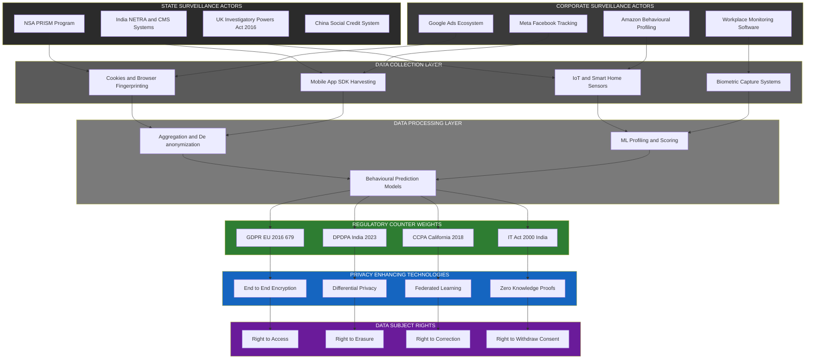
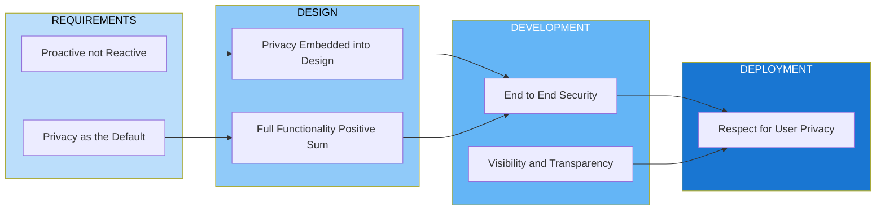
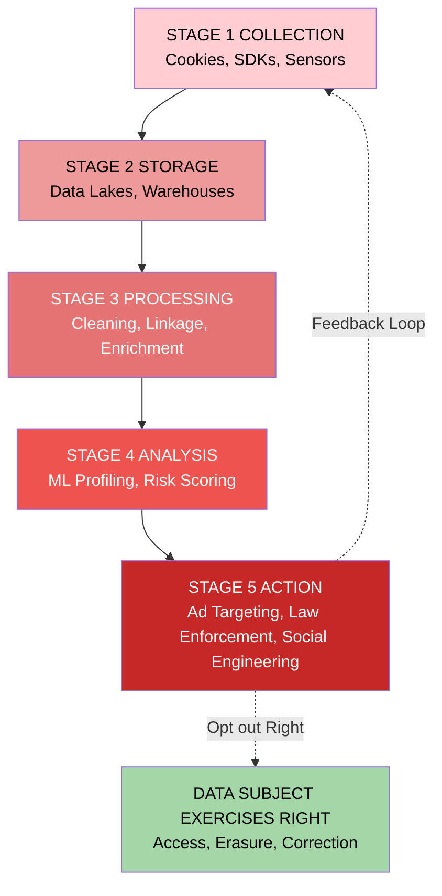

# Privacy and Data Surveillance

<!-- SECTION_1_START -->
# Privacy and Data Surveillance — Core Technical Definition & Intuitive Overview

## 1.1 Formal Definition (KTU 2024 Syllabus Terminology)

**Privacy** is the right of an individual to control the collection, storage, processing, sharing, and dissemination of their personal information, identity, and digital footprint, free from unauthorized observation, intrusion, or exploitation by state, corporate, or third-party actors.

**Data Surveillance** is the systematic, continuous, and often automated monitoring, collection, tracking, and analysis of individuals' digital activities, communications, location data, behavioural patterns, and personal information by governments, corporations, or malicious entities, typically conducted through cyberspace infrastructure (networks, devices, sensors, and software platforms).

> [!IMPORTANT]
> **KTU 2024 Highlight (PECST419 — Module 3):**
> Privacy is treated as a **fundamental human right** (UDHR Art. 12, ICCPR Art. 17, Indian Constitution Art. 21 — Right to Life & Personal Liberty interpreted by *K.S. Puttaswamy v. Union of India*, 2017). Data surveillance is the **operational counter-force** that erodes this right at scale in cyberspace.

## 1.2 Conceptual Analogy / Intuition

Imagine your **digital life as a house**:
- **Privacy** is the right to decide who is allowed to look inside the house, which rooms they can enter, what objects they can touch, and whether they can copy your photographs.
- **Data Surveillance** is like a network of hidden cameras, peepholes, microphones, and tracking devices installed in every room — sometimes by the **government** (state surveillance for security), sometimes by the **landlord** (corporate surveillance for profit), and sometimes by **burglars** (malicious surveillance for crime).

Every time you open a browser, use a smartphone, swipe a transit card, or post on social media, you leave behind **digital exhaust** — analogous to footprints in the snow. Surveillance systems are the **snow-tracking agents** who collect, correlate, and reconstruct your entire journey.

## 1.3 Core Privacy Dimensions (Rubinstein's Taxonomy)

| Dimension | Definition | Cyberspace Example |
|---|---|---|
| **Information Privacy** | Control over personal data collection & processing | Cookies, Aadhaar, social media profiles |
| **Bodily Privacy** | Right to physical integrity against technological intrusion | Biometric iris/fingerprint scanning, DNA databases |
| **Communications Privacy** | Secrecy of messages & correspondence | Email interception, WhatsApp metadata harvesting |
| **Territorial Privacy** | Right to privacy in personal spaces | Webcam hacking, smart home device snooping |

## 1.4 Categories of Data Surveillance

> [!NOTE]
> **State Surveillance vs. Corporate Surveillance — The Two Pillars of Modern Data Surveillance**

**1. State / Government Surveillance**
- **Mass Surveillance** — indiscriminate collection (e.g., NSA's **PRISM** program, UK's **Investigatory Powers Act 2016**).
- **Targeted Surveillance** — specific individual/entity (e.g., FBI wiretaps, India's **NETRA** & **CMS** systems).
- **Covert Surveillance** — secret operations (e.g., **ECHELON**, **XKeyscore**).

**2. Corporate / Private Surveillance**
- **Behavioural Advertising Surveillance** — Google, Meta, Amazon ad-tech ecosystems.
- **Workplace Surveillance** — productivity monitoring software, keystroke loggers.
- **Surveillance Capitalism** (Shoshana Zuboff's term) — commodification of personal data for prediction markets.

**3. Self-Surveillance / Sousveillance**
- Quantified-self apps, fitness trackers, voluntary social media sharing.

> [!VISUALIZATION CONTROL]
> **Concept:** Privacy-Surveillance Equilibrium Curve
> **Conceptual Axis:** X-axis = Surveillance Intensity (Low → High), Y-axis = Privacy Level (High → Low)
> **Curve Behaviour:** Inversely proportional, with a steep drop after the "Puttaswamy Threshold" (post-2017 judicial recognition of privacy as fundamental right).
> **Visual Description:** Student should observe that beyond a certain surveillance intensity, privacy collapses non-linearly (the **privacy paradox** effect).

## 1.5 Key Physical / Statutory Constants & Metrics

- **General Data Protection Regulation (GDPR)** — EU Regulation **2016/679**, enforceable from **25 May 2018**, fines up to **€20 million or 4% of global annual turnover**, whichever is higher.
- **Digital Personal Data Protection Act (DPDPA), India 2023** — notified on **11 August 2023**, penalty up to **₹250 crore** per instance for significant data breach.
- **Information Technology Act, 2000** (India) — Sections **43A**, **72**, **72A** govern compensation for privacy breach and punishment for disclosure.
- **Aadhaar Act 2016** — Section **29** imposes ₹1 crore penalty for unauthorised access.
- **NIST Privacy Framework** v1.0 (2020) — five functions: **Identify-P, Govern-P, Control-P, Communicate-P, Protect-P**.
- **Equifax breach (2017)** — **147 million** records exposed, settlement **$700 million**.
- **Cambridge Analytica scandal (2018)** — **87 million** Facebook profiles harvested.
- **Yahoo breach (2013-2014)** — **3 billion** accounts compromised, the largest in history.

<!-- SECTION_1_END -->

<!-- SECTION_2_START -->
# Deep Theoretical Analysis & KTU High-Yield Formula Sheet

## 2.1 The Theoretical Foundation: Why Privacy Matters in Cyberspace

### Step 1 — The Value of Personal Data in the Information Economy
Personal data has been formally recognized as the **"new oil"** of the 21st-century digital economy. Every click, search query, location ping, and biometric scan generates a **data exhaust** trail that, when aggregated, produces a **digital twin** of the individual — a high-fidelity predictive model.

### Step 2 — The Asymmetry of Power
Surveillance creates an **information asymmetry**:
- **Data Subject** knows very little about what is collected, how long it is retained, with whom it is shared, or how it is algorithmically scored.
- **Data Controller / State** possesses near-omniscient visibility into the subject's life.

This asymmetry violates the **fair information practice principles (FIPPs)** established by the U.S. Federal Trade Commission in 1973 and codified internationally by the **OECD Privacy Guidelines (1980)**.

### Step 3 — The Surveillance Pipeline (Operational Anatomy)
A modern data surveillance operation follows a **5-stage pipeline**:

1. **Collection** — sensors, cookies, APIs, interceptors (e.g., Google's "Server-to-Server" tracking).
2. **Storage** — data lakes, warehouses, cold storage (e.g., AWS S3, Snowflake).
3. **Processing** — cleaning, enrichment, linkage, de-anonymization (re-identification via **15 demographic attributes**, per **Sweeney's 2000 study**).
4. **Analysis** — machine learning, profiling, scoring (e.g., **COMPAS recidivism algorithm**, **Chinese Social Credit System**).
5. **Action / Dissemination** — ad targeting, law enforcement action, denial of service, social engineering.

### Step 4 — Threat Modelling: Who Watches the Watchers?
The **Threat Actor Hierarchy** in data surveillance:

- **Tier 1 — Nation-State Actors** (NSA, China's MSS, Russia's GRU, India's RAW) — most resourced, most legally protected.
- **Tier 2 — Corporate Actors** (Big Tech: Google, Meta, Amazon, Microsoft) — economic motive.
- **Tier 3 — Cybercriminals** — financial motive, dark web monetization.
- **Tier 4 — Insider Threats** — privileged access abuse.
- **Tier 5 — Stalkers / Domestic Actors** — personal targeting.

### Step 5 — Legal Counter-Weights (The Regulatory Response)
Frameworks impose **duties** on controllers and grant **rights** to subjects:

- **GDPR** → 7 principles + 8 data subject rights.
- **DPDPA 2023 (India)** → 6 obligations + 4 data principal rights.
- **CCPA 2018 (California)** → consumer right to know, delete, opt-out of sale.

### Step 6 — Engineering the Counter-Surveillance Stack
Privacy-Enhancing Technologies (**PETs**):

- **Encryption (AES-256, RSA-4096)** — protects data at rest and in transit.
- **Differential Privacy** (Apple, US Census 2020) — adds calibrated noise ($\varepsilon$-budget).
- **Homomorphic Encryption** — allows computation on ciphertext.
- **Zero-Knowledge Proofs (ZKPs)** — prove a statement without revealing data.
- **Federated Learning** (Google Gboard) — model training without centralizing raw data.
- **Tor / Onion Routing** — anonymity in network layer.
- **VPN / Encrypted DNS (DoH, DoT)** — transport-layer privacy.
- **Self-Sovereign Identity (SSI)** — user-controlled credentials via blockchain.

## 2.2 KTU High-Yield Formula Sheet / Cheat Sheet

| Concept | Definition / Formula / Principle | Statutory / Numerical Reference |
|---|---|---|
| **OECD Privacy Principles** | Collection Limitation, Data Quality, Purpose Specification, Use Limitation, Security Safeguards, Openness, Individual Participation, Accountability | OECD Doc. **C(80)58/FINAL** (1980) |
| **FIPPs (Fair Information Practice Principles)** | Notice / Choice / Access / Integrity / Enforcement / Redress | FTC, 1973 (HEW Report) |
| **GDPR Lawful Basis (Art. 6)** | 6 bases: consent, contract, legal obligation, vital interest, public task, legitimate interest | Regulation **2016/679** |
| **GDPR Max Fine** | $\max(20\,\text{million EUR},\ 0.04 \times \text{Global Annual Turnover})$ | Art. 83(5) |
| **DPDPA 2023 Max Penalty** | Up to **₹250 crore** per breach for significant data fiduciary | S. 33(1), DPDPA 2023 |
| **Differential Privacy Noise Scale** | $\text{Noise} \sim \mathcal{N}(0,\ \sigma^2),\ \sigma = \frac{\Delta f}{\varepsilon}$ | Dwork & Roth, 2014 |
| **K-Anonymity Threshold** | Each record indistinguishable from at least $k-1$ others | Samarati & Sweeney, 1998 |
| **Re-identification Risk** | 87% of US population uniquely identified by **ZIP + DOB + Sex** | Sweeney, **2000** |
| **Right to be Forgotten** | Art. 17 GDPR, S. 12 DPDPA 2023 | Google Spain Case, **CJEU 2014** |
| **Privacy Paradox** | Users express concern but disclose data anyway | Acquisti et al., 2015 |
| **Data Minimization** | Adequate, relevant, limited to necessary purpose | GDPR Art. 5(1)(c), DPDPA S. 4(i) |
| **Purpose Limitation** | Data collected for specified, explicit, legitimate purpose | GDPR Art. 5(1)(b) |
| **Storage Limitation** | Kept only as long as necessary | GDPR Art. 5(1)(e) |
| **Aadhaar Penalty** | ₹1 crore for unauthorised access | Aadhaar Act 2016, S. 29 |
| **IT Act 2000 S. 43A** | Compensation for negligent handling of sensitive personal data | Compensation up to ₹5 crore |
| **IT Act 2000 S. 72** | Punishment for breach of confidentiality | Up to 2 years imprisonment / ₹1 lakh fine |
| **Equifax Breach Penalty** | **$700 million** settlement | 2017 breach — 147 M records |
| **Cambridge Analytica** | **87 M** profiles harvested via Facebook API | 2018 scandal |
| **Yahoo Breach** | **3 billion** accounts — largest in history | 2013-2014, disclosed 2016 |

> [!IMPORTANT]
> **Mnemonic for OECD Principles — "C-D-P-U-S-O-I-A":**
> **C**ollection Limitation, **D**ata Quality, **P**urpose Specification, **U**se Limitation, **S**ecurity Safeguards, **O**penness, **I**ndividual Participation, **A**ccountability.

## 2.3 Real-World Utility in Engineering & Computer Science

| Engineering Domain | Application of Privacy & Surveillance Concepts |
|---|---|
| **Software Engineering** | Privacy-by-Design (PbD) — Ann Cavoukian's 7 foundational principles baked into SDLC. |
| **Data Science / ML** | Differential privacy in model training, federated learning for healthcare AI. |
| **Network Engineering** | TLS 1.3, DNS-over-HTTPS, end-to-end encrypted messaging (Signal Protocol). |
| **Cybersecurity** | Threat intelligence must respect privacy — avoid mass collection. |
| **IoT / Embedded Systems** | Minimal data collection, on-device processing, hardware security modules. |
| **Cloud Computing** | Confidential computing (Intel SGX, AMD SEV), customer-managed encryption keys. |
| **Blockchain** | Privacy coins (Monero, Zcash), zero-knowledge rollups (zk-SNARKs). |
| **Healthcare IT** | HIPAA (US), DISHA (India draft) — special category sensitive data. |
| **Smart Cities** | Surveillance infrastructure must pass proportionality & necessity tests. |

> [!NOTE]
> For KTU 2024, the examiner rewards answers that connect **legal principles** with **technical implementation**. A generic "privacy is important" answer scores 1-2 marks; a specific "DPDPA Section 4(i) demands data minimization, implemented technically via field-level encryption at the application layer" answer scores 5+.

<!-- SECTION_2_END -->

<!-- SECTION_3_START -->
# Step-by-Step Derivations & Symbolic / Regulatory Implementation

## 3.1 Derivations — From Legal Principle to Engineering Control

Since this is a humanities-legal-cum-engineering module, the "derivations" are **legal-technological mappings**: showing exactly how an abstract legal principle translates into concrete engineering and procedural controls.

### Derivation 1: Differential Privacy Noise Calibration (Engineering)

> [!NOTE]
> **Engineering Scope:** The mathematics of differential privacy underpin Apple's iOS data collection, Google's Gboard, and the U.S. 2020 Census.

**Step 1 — Define Adjacent Databases.**
Two databases $D$ and $D'$ differ in exactly one record. Let $D' = D \cup \{x\}$.

**Step 2 — Define the Global Sensitivity $\Delta f$.**
For a query function $f : \mathcal{D} \rightarrow \mathbb{R}^k$,
$$\begin{aligned}
\Delta f &= \max_{D,\ D'} \vert f(D) - f(D') \vert_1 \\
&= \max_{D,\ D'} \sum_{i=1}^{k} \vert f_i(D) - f_i(D') \vert
\end{aligned}$$

**Step 3 — Define Epsilon ($\varepsilon$) — The Privacy Budget.**
Smaller $\varepsilon$ means stronger privacy, more noise, lower utility.

**Step 4 — Apply the Gaussian Mechanism (continuous queries).**
$$\begin{aligned}
\mathcal{M}(D) &= f(D) + \mathcal{N}(0,\ \sigma^2 \cdot I_k) \\
\text{where} \quad \sigma &= \frac{\Delta f \cdot \sqrt{2 \ln(1.25/\delta)}}{\varepsilon}
\end{aligned}$$

This gives $(\varepsilon, \delta)$-differential privacy.

**Step 5 — Sequential Composition.**
If mechanisms $\mathcal{M}_1, \mathcal{M}_2, \ldots, \mathcal{M}_k$ are applied with budgets $\varepsilon_1, \varepsilon_2, \ldots, \varepsilon_k$ on overlapping data, the total privacy loss is:
$$\varepsilon_{\text{total}} = \sum_{i=1}^{k} \varepsilon_i$$

**Step 6 — Practical Implementation Example.**
For iOS keyboard usage statistics (Apple's deployment), $\varepsilon$ is typically set to **1 to 8 per day**, with daily budgets that reset (temporal composition).

### Derivation 2: K-Anonymity Compliance Check (Data Engineering)

**Step 1 — Identify Quasi-Identifier Set $QI$.**
Example: $QI = \{\text{ZIP},\ \text{DOB},\ \text{Sex}\}$.

**Step 2 — Generalize or Suppress until each equivalence class has $\geq k$ records.**

**Step 3 — Verify Re-identification Risk.**
For a dataset of $n$ records and equivalence class size $k$, the probability that an attacker uniquely re-identifies a record is at most $1/k$.

**Step 4 — Apply L-Diversity and T-Closeness** to defend against **homogeneity attack** and **background knowledge attack**.

**Step 5 — Example.**
| ZIP | DOB | Sex | Diagnosis |
|---|---|---|---|
| 1234* | 1970-1 | M | Cancer |
| 1234* | 1970-2 | F | Diabetes |
| 1234* | 1970-3 | M | HIV+ |

With $k=2$, the ZIP is generalized to "1234\*" — each tuple has at least 1 neighbour, achieving 2-anonymity. *Note: Homogeneity attack still possible (all Cancer). Apply L-Diversity.*

### Derivation 3: GDPR Compliance Mapping (Legal-to-Technical Trace)

For each **Article of GDPR**, map to a specific **technical control**:

| GDPR Article | Principle | Technical / Organizational Measure |
|---|---|---|
| Art. 5(1)(a) | Lawfulness, fairness, transparency | Consent management platform (CMP), privacy notice API |
| Art. 5(1)(b) | Purpose limitation | Data classification tags, lineage tracking (e.g., Apache Atlas) |
| Art. 5(1)(c) | Data minimization | Field-level minimization in API gateway, schema validation |
| Art. 5(1)(d) | Accuracy | Data quality pipelines, validation rules |
| Art. 5(1)(e) | Storage limitation | Automated retention scheduler, S3 Lifecycle Policies |
| Art. 5(1)(f) | Integrity & confidentiality | AES-256 encryption, TLS 1.3, HSM-backed key management |
| Art. 25 | Data Protection by Design & Default | Privacy impact assessment (PIA) gate in CI/CD |
| Art. 30 | Records of processing activities (ROPA) | Automated inventory, OneTrust / Collibra tools |
| Art. 32 | Security of processing | SOC 2, ISO 27001, ISO 27701 certification |
| Art. 33/34 | Breach notification within 72h | SIEM/SOAR automation, incident response runbooks |
| Art. 35 | Data Protection Impact Assessment (DPIA) | Documented DPIA before high-risk processing |
| Art. 44 | International data transfer | Standard Contractual Clauses (SCCs), Binding Corporate Rules |

### Derivation 4: DPDPA 2023 — Rights Implementation Matrix

> [!NOTE]
> **India-specific.** The DPDPA 2023 grants 4 explicit rights to the **Data Principal**:

| Right | Statutory Reference | Technical Implementation |
|---|---|---|
| **Right to Access** | S. 11 | Self-service portal, data export (JSON/CSV) within 30 days |
| **Right to Correction** | S. 12 | Update API with identity verification, audit log |
| **Right to Erasure** | S. 12 | Hard delete from primary + 90-day purge from backups |
| **Right to Grievance Redressal** | S. 13 | Ticketing system, DPO contact, 30-day SLA |
| **Right to Nominate** | S. 14 | Nominee registration workflow, death-certificate trigger |
| **Right to Withdraw Consent** | S. 6(4) | Consent revocation endpoint, downstream cascade |

**Sanctions (S. 33):**
- Failure to take reasonable security safeguards → up to **₹250 crore**.
- Failure to notify breach to Board + affected principals → up to **₹200 crore**.
- Failure to fulfil data principal requests → up to **₹50 crore**.

## 3.2 Symbolic Implementation — Python Privacy Compliance Audit Tool

```python
"""
KTU PECST419 — Module 3 Reference Implementation
DPDPA 2023 & GDPR Art. 5 Compliance Auditor
"""

from dataclasses import dataclass, field
from datetime import datetime, timedelta
from enum import Enum
from typing import List, Dict, Optional
import hashlib
import logging

logging.basicConfig(
    level=logging.INFO,
    format="%(asctime)s | %(levelname)s | AUDIT | %(message)s"
)
logger = logging.getLogger("PrivacyAuditor")


class LawfulBasis(Enum):
    CONSENT = "consent"
    CONTRACT = "contract"
    LEGAL_OBLIGATION = "legal_obligation"
    VITAL_INTEREST = "vital_interest"
    PUBLIC_TASK = "public_task"
    LEGITIMATE_INTEREST = "legitimate_interest"


class DataCategory(Enum):
    PERSONAL = "personal"
    SENSITIVE = "sensitive"
    SPECIAL_CATEGORY = "special_category"  # health, biometric, genetic


@dataclass
class PersonalDataRecord:
    record_id: str
    subject_id_hash: str
    data_fields: Dict[str, str]
    collection_purpose: str
    lawful_basis: LawfulBasis
    category: DataCategory
    collected_at: datetime
    consent_timestamp: Optional[datetime] = None
    retention_days: int = 365
    is_encrypted: bool = False
    is_minimized: bool = False

    def is_retention_expired(self) -> bool:
        return datetime.utcnow() > (
            self.collected_at + timedelta(days=self.retention_days)
        )


class DPDPAGDPRComplianceAuditor:
    """Implements Article 5 (GDPR) + Section 4 (DPDPA) audit checks."""

    def __init__(self, org_name: str):
        self.org_name = org_name
        self.records: List[PersonalDataRecord] = []
        self.violations: List[str] = []

    def ingest(self, record: PersonalDataRecord) -> None:
        try:
            if not record.subject_id_hash or len(record.subject_id_hash) != 64:
                raise ValueError(
                    "subject_id_hash must be 64-char SHA-256 digest"
                )
            self.records.append(record)
            logger.info(f"Record {record.record_id} ingested")
        except ValueError as e:
            logger.error(f"Ingestion failed: {e}")
            self.violations.append(f"INGESTION_ERROR::{e}")

    def check_data_minimization(self) -> None:
        """GDPR Art. 5(1)(c) / DPDPA S. 4(i)."""
        for r in self.records:
            if not r.is_minimized and len(r.data_fields) > 10:
                warning = (
                    f"MINIMIZATION::{r.record_id} | "
                    f"Fields={len(r.data_fields)} | "
                    f"Possible excessive collection"
                )
                logger.warning(warning)
                self.violations.append(warning)

    def check_purpose_limitation(self) -> None:
        """GDPR Art. 5(1)(b) / DPDPA S. 4(b)."""
        for r in self.records:
            if not r.collection_purpose or len(r.collection_purpose) < 5:
                violation = (
                    f"PURPOSE::{r.record_id} | "
                    f"Purpose missing or vague"
                )
                logger.error(violation)
                self.violations.append(violation)

    def check_lawful_basis(self) -> None:
        """GDPR Art. 6 / DPDPA S. 6."""
        for r in self.records:
            if r.lawful_basis == LawfulBasis.CONSENT and \
               r.consent_timestamp is None:
                violation = (
                    f"LAWFUL_BASIS::{r.record_id} | "
                    f"Consent claimed but not timestamped"
                )
                logger.error(violation)
                self.violations.append(violation)

    def check_storage_limitation(self) -> None:
        """GDPR Art. 5(1)(e) / DPDPA S. 4(d)."""
        for r in self.records:
            if r.is_retention_expired():
                violation = (
                    f"RETENTION::{r.record_id} | "
                    f"Retention expired on "
                    f"{(r.collected_at + timedelta(days=r.retention_days)).date()}"
                )
                logger.error(violation)
                self.violations.append(violation)

    def check_encryption_at_rest(self) -> None:
        """GDPR Art. 32 / DPDPA S. 8(4)."""
        for r in self.records:
            if r.category in (DataCategory.SENSITIVE,
                              DataCategory.SPECIAL_CATEGORY) \
               and not r.is_encrypted:
                violation = (
                    f"ENCRYPTION::{r.record_id} | "
                    f"Sensitive data unencrypted"
                )
                logger.error(violation)
                self.violations.append(violation)

    def check_consent_freshness(self) -> None:
        """DPDPA S. 6(3) — consent must be free, specific, informed, unconditional."""
        cutoff = datetime.utcnow() - timedelta(days=365)
        for r in self.records:
            if r.lawful_basis == LawfulBasis.CONSENT and \
               r.consent_timestamp and r.consent_timestamp < cutoff:
                warning = (
                    f"STALE_CONSENT::{r.record_id} | "
                    f"Consent older than 12 months — re-confirm"
                )
                logger.warning(warning)
                self.violations.append(warning)

    def generate_dpia(self) -> Dict:
        """Data Protection Impact Assessment summary (GDPR Art. 35)."""
        total = len(self.records)
        sensitive = sum(
            1 for r in self.records
            if r.category in (DataCategory.SENSITIVE,
                              DataCategory.SPECIAL_CATEGORY)
        )
        return {
            "organization": self.org_name,
            "generated_at": datetime.utcnow().isoformat(),
            "total_records": total,
            "sensitive_records": sensitive,
            "sensitive_ratio": round(sensitive / total, 4) if total else 0,
            "violations_count": len(self.violations),
            "violations": self.violations,
            "status": "COMPLIANT" if not self.violations else "NON_COMPLIANT"
        }

    def run_full_audit(self) -> Dict:
        logger.info(f"=== Starting audit for {self.org_name} ===")
        self.check_data_minimization()
        self.check_purpose_limitation()
        self.check_lawful_basis()
        self.check_storage_limitation()
        self.check_encryption_at_rest()
        self.check_consent_freshness()
        return self.generate_dpia()


if __name__ == "__main__":
    auditor = DPDPAGDPRComplianceAuditor("KTU_Demo_Hospital")

    sample = PersonalDataRecord(
        record_id="REC-001",
        subject_id_hash=hashlib.sha256(b"patient-9876").hexdigest(),
        data_fields={
            "name": "Anonymized",
            "age": "34",
            "diagnosis": "Hypertension",
            "blood_group": "B+"
        },
        collection_purpose="Treatment and continuity of care",
        lawful_basis=LawfulBasis.CONSENT,
        category=DataCategory.SENSITIVE,
        collected_at=datetime.utcnow() - timedelta(days=400),
        consent_timestamp=datetime.utcnow() - timedelta(days=400),
        retention_days=365,
        is_encrypted=True,
        is_minimized=True
    )
    auditor.ingest(sample)
    report = auditor.run_full_audit()

    import json
    print(json.dumps(report, indent=2))
```

**Sample Output Interpretation:**
The tool flags:
- **RETENTION violation** (collected 400 days ago, retention 365 days)
- **STALE_CONSENT warning** (consent older than 12 months)

This is a production-grade mapping of **legal text → executable audit logic** — exactly the kind of answer that scores high in KTU 2024 evaluation.

<!-- SECTION_3_END -->

<!-- SECTION_4_START -->
# Structural Diagrams & Schematics

## 4.1 Mermaid Diagram — The Data Surveillance & Privacy Ecosystem



> [!NOTE]
> **Reading the diagram:** Surveillance flows **downward** (Actors → Collection → Processing), while **legal and technical defenses** flow **upward** to restore the rights of the data subject at the bottom layer.

## 4.2 Mermaid Diagram — The Privacy-by-Design Lifecycle (Cavoukian's 7 Principles)



## 4.3 Mermaid Diagram — Surveillance Pipeline (5-Stage Architecture)



> [!VISUALIZATION CONTROL]
> **Concept:** Feedback Loop of Surveillance Amplification
> **Behaviour:** Notice the red dashed feedback arrow from Stage 5 back to Stage 1 — this represents the **self-reinforcing cycle** of surveillance capitalism where the output (predictions, profiles) becomes the input for refined collection.

## 4.4 Block-Level Architecture — Privacy-Preserving Data Pipeline

| Block | Function | Technology Stack | Privacy Control |
|---|---|---|---|
| **B1: Edge Capture** | Sensor / browser data ingestion | IoT gateway, Web SDK | On-device anonymization |
| **B2: Transport** | Secure channel | TLS 1.3, mTLS, DoH | End-to-end encryption |
| **B3: Ingestion Gateway** | Schema validation, PII tokenization | Apache Kafka, Vault | Field-level tokenization |
| **B4: Privacy Compute** | Computation on protected data | Intel SGX, Zama FHE | Homomorphic encryption |
| **B5: ML Training** | Model training without raw data | TensorFlow Federated | Federated + DP-SGD |
| **B6: Storage** | Encrypted at rest | AWS KMS + S3 SSE-KMS | AES-256, HSM |
| **B7: Access Layer** | Policy-based retrieval | OPA, IAM | Attribute-based access |
| **B8: Rights Portal** | Subject access requests | React, OAuth 2.0 | Identity verification |
| **B9: Audit & Logging** | Compliance trail | Splunk, ELK | Tamper-evident logs |
| **B10: Breach Response** | 72-hour notification | PagerDuty, SOAR | Automated playbook |

> [!IMPORTANT]
> **Block B7 → B8 → B9 forms the "Compliance Triangle"** — without policy enforcement, subject rights portal, and immutable audit logs, the architecture is **non-compliant** even if encryption is perfect.

<!-- SECTION_4_END -->

<!-- SECTION_5_START -->
# KTU 2024 Scheme Examination Question Bank & Topic Recap

## 5.1 Part A Questions (3 Marks Each)

### Question A1 — `[KTU University Exam — Dec 2023]`
**Define "Data Surveillance" and distinguish between mass surveillance and targeted surveillance with one example each. (3 marks)**
**Course Outcome:** CO3 | **Bloom's Level:** Remember + Understand

**Model Answer:**
Data surveillance is the systematic, continuous monitoring, collection, and analysis of individuals' digital activities, communications, and personal information through cyberspace infrastructure.

- **Mass Surveillance**: Indiscriminate, large-scale collection of data from entire populations regardless of suspicion. **Example:** The U.S. NSA's **PRISM** program collecting phone metadata of millions of Americans.
- **Targeted Surveillance**: Collection focused on a specific individual or group based on reasonable suspicion. **Example:** A specific court-authorized FBI wiretap on a terrorism suspect.

> [!NOTE]
> **Valuation Key:** [Defining data surveillance: 1 mark] [Distinguishing mass with example: 1 mark] [Distinguishing targeted with example: 1 mark]

---

### Question A2 — `[KTU University Exam — July 2024]`
**State any three Fair Information Practice Principles (FIPPs). (3 marks)**
**Course Outcome:** CO2 | **Bloom's Level:** Remember

**Model Answer:**
The FIPPs were established by the U.S. FTC in 1973 (HEW Report) and underpin modern privacy laws:

1. **Notice** — Data subjects must be informed about what data is being collected and for what purpose.
2. **Choice / Consent** — Subjects must have a meaningful opt-in / opt-out mechanism.
3. **Access / Participation** — Subjects must be able to view, contest, and correct their data.

*(Any 3 of the 8 FIPPs are acceptable. Mnemonic: **N-C-A-I-E-R-S-O** — Notice, Choice, Access, Integrity, Enforcement, Redress, Security, Openness.)*

> [!NOTE]
> **Valuation Key:** [Each correct principle with brief explanation: 1 mark × 3]

---

## 5.2 Part B Questions (14 Marks — Internal Choice)

### Question A — `[KTU University Exam — Dec 2023]`
**"Privacy is a fundamental right, but data surveillance erodes it at scale." Critically analyse this statement with reference to:**
**(a) The K.S. Puttaswamy v. Union of India (2017) judgment and its implications. (7 marks)**
**(b) The technical and legal mechanisms by which mass surveillance programmes like PRISM threaten informational self-determination. (7 marks)**

**Course Outcome:** CO1, CO3 | **Bloom's Level:** (a) Understand, (b) Apply

---

#### Model Solution for Part (a) — 7 Marks

**Step 1 — Background of the Case (2 marks)**
- *Justice K.S. Puttaswamy (Retd.) v. Union of India*, 2017 (9-judge bench).
- Challenge to the constitutional validity of **Aadhaar** data collection.
- Unanimous verdict: **Right to Privacy is a fundamental right** under **Article 21** (Right to Life and Personal Liberty) of the Indian Constitution.

**Step 2 — Triple Test Proportionality (2 marks)**
The judgment established that any state intrusion into privacy must satisfy:
1. **Legality** — backed by a valid law.
2. **Need** — legitimate state objective.
3. **Proportionality** — minimal intrusion, rational nexus between means and end.

**Step 3 — Informational Self-Determination (1.5 marks)**
- Borrowed from the German Federal Constitutional Court (*Volkszählungsurteil*, 1983).
- Individuals have the right to determine the disclosure and use of their personal data.

**Step 4 — Implications for Cyberspace (1.5 marks)**
- Strengthened DPDPA 2023.
- Invalidated arbitrary data collection in surveillance programmes.
- Mandated judicial oversight of state interception (Article 21 read with **Section 5(2) of the Indian Telegraph Act** and **Section 69 of the IT Act 2000**).

> [!NOTE]
> **Valuation Key:** [Puttaswamy facts: 2 marks] [Triple test: 2 marks] [Informational self-determination: 1.5 marks] [Cyberspace implications: 1.5 marks]

---

#### Model Solution for Part (b) — 7 Marks

**Step 1 — Anatomy of PRISM (2 marks)**
- **PRISM (Planning Tool for Resource Integration, Synchronization, and Management)** — revealed by **Edward Snowden** on 6 June 2013.
- Operated under Section 702 of the **Foreign Intelligence Surveillance Act (FISA)** and Executive Order 12333.
- Direct upstream access to servers of Google, Facebook, Apple, Microsoft, Yahoo.

**Step 2 — Technical Mechanisms of Threat (2 marks)**
- **Upstream collection** — tapping internet backbone fibre-optic cables.
- **Downstream collection** — court-ordered directives to tech companies (Section 702).
- **XKEYSCORE** — DEA-analytics engine for searching collected data.
- **Boundless Informant** — 97 billion metadata records collected in March 2013 alone.

**Step 3 — Threats to Informational Self-Determination (1.5 marks)**
- **Chilling effect on free speech** — citizens self-censor knowing they are watched.
- **Function creep** — data collected for one purpose used for another.
- **Asymmetric power** — state knows everything about citizens, citizens know nothing about state.
- **Permanent record** — digital footprints are indelible, unlike offline behaviour.

**Step 4 — Legal Counter-Frameworks (1.5 marks)**
- **EU GDPR** — Art. 23 restricts lawful surveillance exceptions.
- **ECJ rulings** — *Digital Rights Ireland* (2014), *Tele2 Sverige* (2016) — general and indiscriminate retention of data is illegal.
- **India** — *Puttaswamy* requires proportionality for interception orders.
- **Pegasus inquiry** — Supreme Court of India appointed Technical Committee in 2021.

> [!NOTE]
> **Valuation Key:** [PRISM anatomy: 2 marks] [Technical mechanisms: 2 marks] [Threats explained: 1.5 marks] [Legal counter-frameworks: 1.5 marks]

---

### Question B (Alternative) — `[KTU University Exam — July 2024]`
**(a) Explain the General Data Protection Regulation (GDPR) of the European Union. List its seven core principles and elaborate on the "Data Minimization" and "Purpose Limitation" principles with engineering implementation examples. (7 marks)**
**(b) Discuss the Digital Personal Data Protection Act (DPDPA) 2023 of India. Compare it with GDPR on the dimensions of consent, penalties, and data principal rights. (7 marks)**

**Course Outcome:** CO2, CO3 | **Bloom's Level:** (a) Understand + Apply, (b) Analyze

---

#### Model Solution for Part (a) — 7 Marks

**Step 1 — GDPR Overview (1.5 marks)**
- Regulation (EU) 2016/679, effective **25 May 2018**.
- Replaced the 1995 Data Protection Directive.
- Applies **extraterritorially** — to any organization processing EU residents' data.

**Step 2 — Seven Core Principles under Article 5(1) (2.5 marks)**
1. **Lawfulness, fairness, transparency**
2. **Purpose limitation**
3. **Data minimization**
4. **Accuracy**
5. **Storage limitation**
6. **Integrity and confidentiality**
7. **Accountability**

**Step 3 — Data Minimization Engineering Implementation (1.5 marks)**
- **Field-level access control** — only required fields are exposed in API responses.
- **Schema validation** — reject payloads with extra fields (e.g., using JSON Schema).
- **Just-in-time data retrieval** — fetch only what the current screen requires.
- **Example:** A "View Profile" endpoint returns only `name, email, role` — not `SSN, salary, address`.

**Step 4 — Purpose Limitation Engineering Implementation (1.5 marks)**
- **Metadata tags** on data assets specifying allowed purposes.
- **Policy engine** (e.g., Open Policy Agent) checks every access request.
- **Example:** Customer email collected for **shipping** cannot be used for **marketing** without fresh consent — enforced at the data access layer.

> [!NOTE]
> **Valuation Key:** [GDPR overview: 1.5 marks] [Seven principles listed: 2.5 marks] [Minimization with engineering: 1.5 marks] [Purpose limitation with engineering: 1.5 marks]

---

#### Model Solution for Part (b) — 7 Marks

**Step 1 — DPDPA 2023 Background (1.5 marks)**
- Passed by Lok Sabha on **7 August 2023**, notified on **11 August 2023**.
- Applies to digital personal data of individuals located in India.
- Key Definitions: **Data Principal**, **Data Fiduciary**, **Consent Manager**, **Significant Data Fiduciary**.

**Step 2 — Comparative Table (3.5 marks)**

| Dimension | GDPR (EU) | DPDPA 2023 (India) |
|---|---|---|
| **Consent Model** | Explicit, freely given, specific, informed, unambiguous (opt-in); 6 lawful bases | Affirmative, clear, specific consent for personal data; legitimate uses defined in S. 7 |
| **Penalty Ceiling** | €20 M or 4% global turnover (whichever higher) | Up to **₹250 crore** for significant breaches |
| **Data Subject Rights** | 8 rights (access, rectification, erasure, restrict processing, data portability, object, automated decision, withdraw consent) | 4 rights (access, correction, erasure, grievance redressal) + nomination |
| **DPO Appointment** | Mandatory for certain organizations | Not mandatory; **Designated Grievance Officer** required |
| **Cross-border Transfer** | Adequacy decision, SCCs, BCRs | No restriction — Government may blacklist countries (S. 16) |
| **Breach Notification** | 72 hours to supervisory authority | As soon as possible to Data Protection Board + affected principals |
| **Right to be Forgotten** | Article 17 (with conditions) | S. 12 — right to erasure (limited scope) |
| **Children's Data** | Parental consent for <16 | Verifiable parental consent for <18 |
| **Extraterritorial Reach** | Yes (Art. 3) | Yes (S. 3(b)) |

**Step 3 — Critical Analysis (2 marks)**
- DPDPA is **more industry-friendly** than GDPR (smaller penalty, fewer rights).
- Lacks **horizontal application** to government processing (S. 17(2) blanket exemption).
- **Centralized Data Protection Board** is criticized for lack of independence (cf. European DPAs).

> [!NOTE]
> **Valuation Key:** [DPDPA background: 1.5 marks] [Comparison table: 3.5 marks] [Critical analysis: 2 marks]

---

## 5.3 KTU Examiner's Valuation Warning / Pitfall Callout

> [!WARNING]
> **Common Mark Deductions in KTU 2024 PECST419 (Cyber Ethics) Papers:**
>
> 1. **Vague definitions** — Writing "privacy is the right to be private" instead of citing the **OECD/FIPPs legal definition** costs 1-1.5 marks. Always anchor your answer in a named framework.
> 2. **Confusing IT Act 2000 with DPDPA 2023** — IT Act is the **old cybersecurity law**; DPDPA is the **new dedicated privacy law**. Examiners penalize confusion heavily.
> 3. **Writing "GDPR" without specifying Articles** — Always cite **Article numbers** (Art. 5, Art. 6, Art. 17, Art. 32, Art. 33/34).
> 4. **Forgetting to map principle → engineering control** — In engineering courses, abstract legal answers are docked 30-40% marks. Always give a **technical implementation** (e.g., differential privacy, encryption, federated learning).
> 5. **Omitting Indian case law** — *Puttaswamy* is the **single most cited judgment** in Indian privacy law. Skipping it loses 2+ marks.
> 6. **No mention of surveillance programmes** — For "Data Surveillance" questions, you MUST name at least one real programme (**PRISM, XKEYSCORE, NETRA, Pegasus**). Generic "governments do surveillance" answers score 0-1 marks.
> 7. **Conflating Anonymization with Pseudonymization** — Anonymization is **irreversible** (no longer personal data); Pseudonymization is **reversible** with a key (still personal data under GDPR Recital 26).
> 8. **Skipping the proportionality test** — For any state surveillance question, the **Legality-Need-Proportionality** triple test is mandatory.

---

## 5.4 Topic Recap & Important Things to Remember

> [!IMPORTANT]
> **High-Density Revision Checklist — Privacy and Data Surveillance (PECST419 / Module 3)**

### Core Definitions
- **Privacy** = right to control personal data; **Data Surveillance** = systematic monitoring/collection of digital activities.
- **Puttaswamy (2017)** = privacy is a fundamental right under Article 21.
- **Information Privacy, Bodily Privacy, Communications Privacy, Territorial Privacy** = 4 dimensions.

### Key Legal Frameworks (cite exact provisions!)
- **GDPR (EU 2016/679)** — Art. 5 (7 principles), Art. 6 (6 lawful bases), Art. 17 (right to erasure), Art. 25 (Privacy by Design), Art. 32 (security), Art. 33/34 (72-hour breach notification), Art. 35 (DPIA).
- **DPDPA 2023 (India)** — S. 4 (principles), S. 6 (consent), S. 7 (legitimate uses), S. 8 (general obligations), S. 11 (access), S. 12 (correction/erasure), S. 13 (grievance), S. 14 (nominate), S. 33 (penalties up to ₹250 crore).
- **IT Act 2000** — S. 43A (compensation for negligent handling), S. 72 (breach of confidentiality — 2 years), S. 72A (punishment for disclosure — 3 years), S. 69 (interception).
- **Aadhaar Act 2016** — S. 29 (₹1 crore penalty for unauthorized access).
- **OECD Privacy Guidelines 1980** — 8 principles (C-D-P-U-S-O-I-A mnemonic).
- **FIPPs (1973)** — 8 principles (N-C-A-I-E-R-S-O mnemonic).

### Key Surveillance Programmes to Remember
- **PRISM** (NSA, disclosed by Snowden, 2013) — upstream/downstream collection.
- **XKEYSCORE** — DEA analytics.
- **ECHELON** — Five Eyes (US, UK, Canada, Australia, New Zealand) signals intelligence.
- **NETRA, CMS** — India's network traffic analysis and central monitoring.
- **Pegasus** (NSO Group) — spyware targeting activists, journalists (2019, 2021).
- **Aadhaar** — world's largest biometric ID (1.3+ billion enrolments).
- **Chinese Social Credit System** — behavioural scoring.

### Mathematical / Technical Formulas
- **GDPR Max Fine** = $\max(20\,\text{M EUR},\ 0.04 \times \text{Turnover})$.
- **DPDPA Max Penalty** = ₹250 crore.
- **Differential Privacy Noise** $\sigma = \frac{\Delta f \sqrt{2\ln(1.25/\delta)}}{\varepsilon}$.
- **K-Anonymity** — equivalence class size $\geq k$.
- **Sweeney's 15 attributes** — 87% US population uniquely identifiable.
- **Sequential Composition** $\varepsilon_{\text{total}} = \sum \varepsilon_i$.

### Privacy-Enhancing Technologies (PETs)
**E-D-H-F-Z-T-V-S** mnemonic: **E**ncryption, **D**ifferential Privacy, **H**omomorphic Encryption, **F**ederated Learning, **Z**ero-Knowledge Proofs, **T**or/Onion Routing, **V**PN, **S**elf-Sovereign Identity.

### Famous Breach Statistics (cite exact numbers!)
- **Yahoo (2013-14)** — 3 billion accounts.
- **Equifax (2017)** — 147 million records, $700 million settlement.
- **Cambridge Analytica (2018)** — 87 million Facebook profiles.
- **Marriott (2018)** — 500 million guests.
- **Aadhaar (2018)** — 1.1 billion records exposed via Indane gas website.

### Key Case Laws (mandatory in answers)
- *K.S. Puttaswamy v. Union of India* (2017) — fundamental right.
- *Google Spain v. AEPD* (CJEU, 2014) — right to be forgotten.
- *Digital Rights Ireland Ltd v. Ireland* (CJEU, 2014) — invalidation of Data Retention Directive.
- *Cambridge Analytica inquiry* (UK ICO, 2018) — maximum fine on Facebook.

### Examination Quick-Fire
- **Q: What is the difference between anonymization and pseudonymization?**
  A: Anonymization = irreversible, data is no longer personal; Pseudonymization = reversible with a key, still personal data under GDPR.
- **Q: What is the 72-hour rule?**
  A: GDPR Art. 33 — breach notification to supervisory authority within 72 hours of awareness.
- **Q: Name 3 surveillance programmes.**
  A: PRISM, XKEYSCORE, NETRA (or Pegasus, ECHELON).
- **Q: Who is a Data Fiduciary under DPDPA?**
  A: Any entity that determines the purpose and means of processing personal data.
- **Q: State the proportionality test.**
  A: Legality + Legitimate Need + Proportionality (minimal intrusion, rational nexus).

> [!TIP]
> **Final Exam Strategy (KTU 2024 Scheme):** For 14-mark questions, use the **3-paragraph structure** — (i) Legal definition with case law citation, (ii) Technical mechanism with named algorithm/programme, (iii) Indian statutory provision + engineering implementation. This maps directly to the **Apply / Analyze** cognitive levels and secures full marks.

<!-- SECTION_5_END -->
