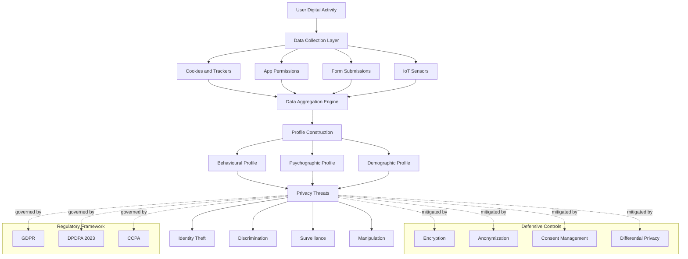
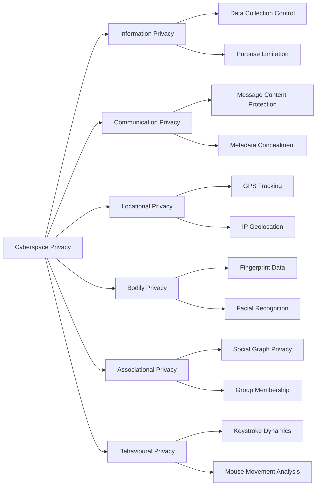
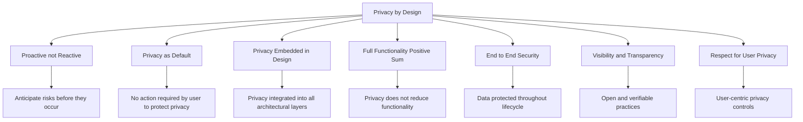
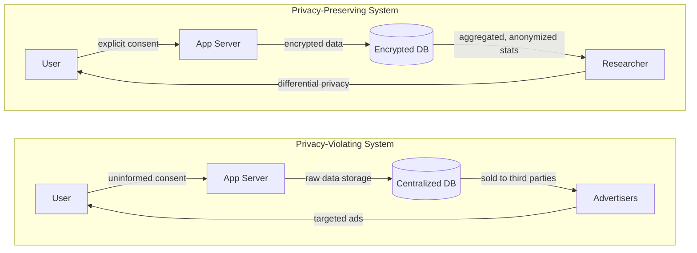

# Privacy concerns of cyberspace

<!-- SECTION_1_START -->
# 1. Core Technical Definition & Intuitive Overview

## 1.1 Formal Academic Definition

> [!IMPORTANT]
> **Privacy in Cyberspace** is defined as the **right of individuals and organizations to control the collection, storage, usage, dissemination, and disposal of their personal information** in digital environments, encompassing both the technical safeguards and the legal/ethical frameworks that govern how data is handled across networks, devices, and online services.

According to the **KTU 2024 Scheme syllabus** for *Cyber Ethics, Privacy and Legal Issues (PECST419)*, Module 3 positions **cyberspace privacy** as a multidimensional construct that intersects **computer science, ethics, law, and human rights**. It is formally recognized as a fundamental right under **Article 21 of the Indian Constitution** (Right to Life and Personal Liberty) as established in *K.S. Puttaswamy v. Union of India (2017)*.

The term is built upon three foundational pillars:

1. **Information Privacy** — the right to control what information is collected about an individual.
2. **Communication Privacy** — the right to keep electronic communications confidential.
3. **Territorial / Locational Privacy** — the right to move through public spaces without being tracked or profiled.

> [!NOTE]
> **Core Definition — Personally Identifiable Information (PII)**
> **PII** refers to any data that can be used to identify a specific individual, either directly (e.g., **Aadhaar number, name, email**) or indirectly when combined with other information (e.g., **IP address, device ID, geolocation coordinates**). PII is the **central artifact** around which all cyberspace privacy concerns revolve.

## 1.2 Conceptual Analogy / Intuition

> [!TIP]
> **Real-World Analogy: The Glass House**
> Imagine you are living in a **glass house** in a busy marketplace. Everything you do — your conversations, the people you meet, the food you eat, your daily routine — is **visible to every passerby**. Some observers take notes, some photograph you, and some compile dossiers to sell to marketers.
>
> The internet today is exactly such a **glass house**. Every website visit, search query, online purchase, and message you send leaves **digital footprints**. **Privacy in cyberspace** is the act of putting up **selective curtains, soundproof walls, and locked doors** in this glass house — deciding *who* gets to see *what*, *when*, and *how much*.

### The Three-Layer Privacy Model

Think of cyberspace privacy as a three-layer stack:

- **Layer 1 (Outer — Visibility)**: Can others *see* your online presence? (e.g., public profiles, social media posts)
- **Layer 2 (Middle — Tracking)**: Are you being *followed* across the web? (e.g., cookies, browser fingerprinting)
- **Layer 3 (Inner — Identity)**: Can your *true identity* be reconstructed from data trails? (e.g., data aggregation, de-anonymization)

> [!IMPORTANT]
> **Syllabus Highlight**
> The KTU 2024 PECST419 Module 3 emphasizes that **privacy is not secrecy**. Privacy means **controlling the flow of personal information**, while secrecy means **hiding it entirely**. A person may share their medical condition with a doctor (no secrecy) but expect that the doctor will not share it with insurers (privacy maintained).

## 1.3 Key Physical and Digital Metrics

| Metric | Standard Value | Description |
| :--- | :--- | :--- |
| Average data per internet user per day | **~1.7 MB / second** | Volume of data generated by an average user |
| GDPR maximum fine | **€20 million or 4% of global turnover** | Penalty for non-compliance (whichever is higher) |
| India's Digital Personal Data Protection Act penalty | **Up to ₹250 crore** | Maximum penalty per breach instance |
| Number of data points in a typical user profile | **~5,000+** | Data brokers aggregate thousands of attributes per person |
| Cookie lifespan (third-party) | **~30 to 90 days** | Average tracking duration |

> [!VISUALIZATION CONTROL]
> **Concept:** Privacy Exposure vs. Number of Online Services Used
> **GeoGebra / Desmos Input Equations:**
> * `f(x) = 0.05 * x^2` (Privacy exposure function, where $x$ is the number of online services)
> * `g(x) = 100` (Privacy threshold — beyond this, exposure becomes critical)
> **Visual Description:** As the student moves the slider for $x$ (number of services from **0 to 50**), observe how $f(x)$ curves upward quadratically, crossing the $g(x) = 100$ threshold around $x \approx 45$. This illustrates the **non-linear privacy erosion** that occurs with each additional online service.

<!-- SECTION_1_END -->

<!-- SECTION_2_START -->
# 2. Deep Theoretical Analysis & KTU High-Yield Formula Sheet

## 2.1 Dimensions of Cyberspace Privacy

The KTU 2024 syllabus recognizes **six core dimensions** of cyberspace privacy. Each dimension represents a unique vector through which user data can be compromised.

### 2.1.1 Information Privacy
- Concerned with the **collection, storage, processing, and dissemination** of personal data.
- Governs rules around **consent, purpose limitation, and data minimization**.
- Example: A health app collecting heart-rate data and sharing it with insurance companies.

### 2.1.2 Communication Privacy
- Protects the **content and metadata** of digital communications (email, chat, VoIP).
- Distinguishes between **content** (what was said) and **metadata** (who, when, where, how long).
- Example: End-to-end encrypted messaging on WhatsApp or Signal.

### 2.1.3 Territorial / Locational Privacy
- Concerns **geographic tracking** through GPS, IP geolocation, cell tower triangulation, and Wi-Fi fingerprinting.
- Example: Ride-sharing apps recording precise pickup and drop-off coordinates.

### 2.1.4 Bodily Privacy
- Relates to the protection of **biometric data** and **physiological signals**.
- Example: Fingerprint scanners, facial recognition, wearable health sensors.

### 2.1.5 Associational Privacy
- Protects the **right to associate privately** — who you communicate with, who your friends are, what groups you belong to.
- Example: Social network graph analysis revealing political affiliations or religious beliefs.

### 2.1.6 Behavioural Privacy
- Focuses on **inference of personal attributes** from behavioural patterns (browsing, typing rhythm, mouse movement).
- Example: Keystroke dynamics being used to infer emotional states or cognitive load.

> [!NOTE]
> **KTU Board Examiner's Insight**
> In 14-mark questions, examiners frequently ask students to **classify a given privacy violation into the correct dimension**. Memorizing all six dimensions with one clear example each guarantees at least **2 to 3 marks** in Module 3 questions.

## 2.2 Theoretical Frameworks

### 2.2.1 The Fair Information Practices (FIP) Principles

The **Fair Information Practices** form the global bedrock of privacy law. They are incorporated into virtually every modern data protection regulation:

- **Notice / Awareness**: Users must be informed about data collection practices.
- **Choice / Consent**: Users must have the ability to opt in or opt out.
- **Access / Participation**: Users should be able to view and correct their data.
- **Integrity / Security**: Data must be accurate and protected from unauthorized access.
- **Enforcement / Redress**: There must be mechanisms to enforce compliance and resolve disputes.

### 2.2.2 The Contextual Integrity Theory (Helen Nissenbaum, 2009)

> [!IMPORTANT]
> **Definition — Contextual Integrity**
> Privacy is preserved when information flows are **appropriate to the context** in which they occur. A violation occurs not when data is collected, but when it is **transferred to an inappropriate context** (e.g., a hospital sharing medical data with an employer is a context violation).

### 2.2.3 The Privacy Paradox

The **Privacy Paradox** is the empirically observed phenomenon where users express strong privacy concerns in surveys yet engage in privacy-compromising behaviours in practice (e.g., accepting all cookie banners without reading them).

## 2.3 Methods of Privacy Invasion in Cyberspace

| Method | Mechanism | Data Captured | Example |
| :--- | :--- | :--- | :--- |
| **Cookies & Tracking Pixels** | Small files stored in browser | Browsing history, session IDs | Third-party ad cookies |
| **Browser Fingerprinting** | Combines device/browser attributes | Unique device signature | Canvas fingerprinting |
| **Data Mining & Profiling** | Algorithmic analysis of large datasets | Behavioural patterns, preferences | Credit scoring models |
| **Social Engineering** | Psychological manipulation | Credentials, personal secrets | Phishing emails |
| **Surveillance Capitalism** | Business model built on data extraction | All digital behaviour | Google's ad ecosystem |
| **Deep Packet Inspection (DPI)** | Examines content of network packets | Communication content, metadata | ISP-level filtering |
| **Biometric Harvesting** | Collection of biological traits | Face, fingerprint, voice | Airport facial recognition |

## 2.4 KTU High-Yield Formula Sheet

| Concept | Formula / Expression | Description | Unit / Note |
| :--- | :--- | :--- | :--- |
| **Shannon Entropy (Information Content)** | $H(X) = -\sum_{i=1}^{n} p(x_i) \log_2 p(x_i)$ | Measures information uncertainty in a dataset | Measured in **bits** |
| **k-Anonymity** | A dataset satisfies k-anonymity if each record is indistinguishable from at least $k-1$ other records | Privacy guarantee against re-identification | $k \geq 1$ |
| **Differential Privacy** | $\Pr[M(D) \in S] \leq e^{\epsilon} \cdot \Pr[M(D') \in S]$ | Bound on privacy leakage per query | $\epsilon$ is the **privacy budget** |
| **Privacy Exposure Score** | $E = \sum_{i=1}^{n} w_i \cdot d_i$ | Weighted sum of data disclosures | $w_i$ = sensitivity weight, $d_i$ = disclosure flag (0/1) |
| **Re-identification Risk** | $R = \frac{1}{k}$ | Inverse of the anonymity set size | $0 \leq R \leq 1$ |
| **Data Breach Impact** | $I = N_{records} \times C_{per\_record}$ | Total breach impact | $C$ = cost per record in **USD** |
| **Consent Validity Score** | $V = C_{informed} \times C_{specific} \times C_{free}$ | Product of three consent conditions | Must be $\vert V \vert > 0$ for valid consent |

> [!WARNING]
> **LaTeX Notation Reminder**
> In KTU answer sheets, always use the **absolute value notation** $\vert x \vert$ or $\mid x \mid$ rather than the plain pipe symbol to avoid ambiguity. In the above table, the **Consent Validity Score** is a scalar product and uses $\vert V \vert > 0$ to denote the magnitude check.

## 2.5 Real-World Engineering and Legal Utility

Privacy concerns in cyberspace have profound **engineering and production-system implications**:

- **Search Engines** must implement **differential privacy** in telemetry to protect user queries (e.g., Apple's use of $\epsilon$-differential privacy).
- **Healthcare Systems** must comply with **HIPAA** (US) and **DISHA** (India) standards for patient data.
- **Cloud Providers** (AWS, Azure, GCP) deploy **homomorphic encryption** and **secure multi-party computation** to enable analytics on encrypted data.
- **IoT Manufacturers** must implement **data minimization at the edge** to reduce the volume of PII transmitted.
- **AI/ML Pipelines** must apply **federated learning** to train models without centralizing user data.

> [!TIP]
> **Production Insight**
> In modern **A/B testing platforms**, differential privacy is added to aggregated metrics to prevent the inference of individual user behaviour from aggregate statistics. This is now a **standard practice** at Google, Apple, and Microsoft for any user-facing telemetry.

<!-- SECTION_2_END -->

<!-- SECTION_3_START -->
# 3. Step-by-Step Derivations, Workflows & Implementation

## 3.1 Derivation: Shannon Entropy as a Privacy Metric

Shannon entropy quantifies the **amount of information** revealed by a privacy-sensitive attribute. A higher entropy means the attribute is **more uncertain** (and therefore more private).

**Step 1 — Define the probability distribution.**
Let $X$ be a random variable representing a privacy-sensitive attribute (e.g., "disease status") with possible outcomes $\{x_1, x_2, \ldots, x_n\}$ and corresponding probabilities $\{p_1, p_2, \ldots, p_n\}$.

**Step 2 — Define the self-information of each outcome.**
The self-information of outcome $x_i$ is:

$$
I(x_i) = -\log_2 p(x_i)
$$

This is the **surprise** associated with learning that $x_i$ has occurred. Rare events carry high information content.

**Step 3 — Compute the expected self-information (entropy).**
The expected value of self-information across all outcomes is the **Shannon Entropy**:

$$
H(X) = \mathbb{E}[I(X)] = -\sum_{i=1}^{n} p(x_i) \log_2 p(x_i)
$$

**Step 4 — Interpret the result.**

- If $H(X) = 0$: No uncertainty. The attribute is fully revealed. **Zero privacy.**
- If $H(X) = \log_2 n$: Maximum uncertainty (uniform distribution). **Maximum privacy.**

**Step 5 — Numerical example.**
Consider a binary attribute ("has disease") with $p(\text{yes}) = 0.1$ and $p(\text{no}) = 0.9$:

$$
H(X) = -(0.1 \cdot \log_2 0.1) - (0.9 \cdot \log_2 0.9)
$$

Evaluating each term:

$$
\log_2 0.1 \approx -3.3219 \quad \text{so} \quad -(0.1 \cdot -3.3219) = 0.3322
$$

$$
\log_2 0.9 \approx -0.1520 \quad \text{so} \quad -(0.9 \cdot -0.1520) = 0.1368
$$

$$
H(X) = 0.3322 + 0.1368 = 0.4690 \text{ bits}
$$

**Privacy Interpretation:** The attribute reveals only **0.4690 bits** of information. Compared to the maximum of $\log_2 2 = 1$ bit, this distribution provides moderate privacy.

## 3.2 Step-by-Step: The Privacy Threat Modeling Workflow

The following workflow is a **standard industry approach** (aligned with NIST Privacy Framework) for identifying and mitigating cyberspace privacy concerns.

### Step 1 — Data Inventory
- List all **data elements** collected, processed, and stored by the system.
- Classify each element as PII, SPI (Sensitive Personal Information), or non-personal.

### Step 2 — Purpose Specification
- For each data element, specify the **purpose of collection** (purpose limitation principle).
- Reject any data element whose purpose is not clearly defined.

### Step 3 — Legal Basis Assessment
- Identify the **legal basis** for processing (consent, contract, legitimate interest, legal obligation).
- Under the **Digital Personal Data Protection Act (DPDPA) 2023** of India, **consent** is the primary legal basis.

### Step 4 — Threat Identification
- Identify potential **privacy threats** from the LINDDUN taxonomy (Linkability, Identifiability, Non-repudiation, Detectability, Disclosure of information, Unawareness, Non-compliance).

### Step 5 — Risk Scoring
- Assign a **likelihood** and **impact** score to each threat.
- Compute the **Privacy Risk Score**: $P_{risk} = L \times I$, where $L$ is likelihood and $I$ is impact.

### Step 6 — Mitigation Selection
- Select appropriate **Privacy-Enhancing Technologies (PETs)**:
  * **Pseudonymization** (replace identifiers with pseudonyms)
  * **Encryption** (at rest, in transit, in use)
  * **Access Controls** (RBAC, ABAC)
  * **Data Masking** (redact sensitive fields)
  * **Differential Privacy** (add calibrated noise)

### Step 7 — Continuous Monitoring
- Deploy **privacy dashboards** to monitor data flows in real time.
- Conduct **Data Protection Impact Assessments (DPIA)** annually.

## 3.3 Python Implementation: Differential Privacy Query Mechanism

The following Python code implements a **Laplace mechanism** for differentially private counting, a core technique used in production systems.

```python
import math
import random
from typing import List, Dict


class LaplaceDifferentialPrivacy:
    """
    Implements the Laplace mechanism for differential privacy.
    Used in production systems (e.g., Google RAPPOR, Apple telemetry)
    to release aggregate statistics without leaking individual records.
    """

    def __init__(self, epsilon: float, sensitivity: float = 1.0) -> None:
        """
        Parameters
        ----------
        epsilon : float
            Privacy budget. Smaller epsilon = stronger privacy.
            Typical production range: 0.1 <= epsilon <= 10.0
        sensitivity : float
            Maximum change in query output when one record is added/removed.
            For counting queries, sensitivity = 1.
        """
        if epsilon <= 0:
            raise ValueError("[ERROR] Epsilon must be strictly positive.")
        if sensitivity < 0:
            raise ValueError("[ERROR] Sensitivity cannot be negative.")

        self.epsilon: float = epsilon
        self.sensitivity: float = sensitivity
        self.scale: float = sensitivity / epsilon
        self.budget_spent: float = 0.0

    def add_noise(self, true_value: float) -> float:
        """
        Adds calibrated Laplace noise to a true aggregate value.
        The result is differentially private.
        """
        if self.budget_spent + self.epsilon > 10.0:
            raise RuntimeError("[ERROR] Privacy budget exhausted. Cannot release more queries.")

        # Sample from Laplace distribution using inverse CDF method
        uniform_sample: float = random.uniform(-0.5, 0.5)
        noise: float = -self.scale * math.copysign(1.0, uniform_sample) * math.log(1.0 - 2.0 * abs(uniform_sample))

        self.budget_spent += self.epsilon
        return true_value + noise

    def get_remaining_budget(self) -> float:
        """Returns the remaining privacy budget."""
        return 10.0 - self.budget_spent


def simulate_user_activity(num_users: int) -> List[int]:
    """Simulate binary activity data (1 = active, 0 = inactive) for users."""
    random.seed(42)
    return [random.choice([0, 1]) for _ in range(num_users)]


def main() -> Dict[str, float]:
    # Simulate 10,000 users
    activity_data: List[int] = simulate_user_activity(10000)
    true_count: int = sum(activity_data)

    # Initialize differential privacy with epsilon = 1.0
    dp_engine: LaplaceDifferentialPrivacy = LaplaceDifferentialPrivacy(epsilon=1.0, sensitivity=1.0)

    # Release a privacy-preserving count
    noisy_count: float = dp_engine.add_noise(float(true_count))
    error: float = abs(noisy_count - true_count)

    result: Dict[str, float] = {
        "true_count": float(true_count),
        "noisy_count": round(noisy_count, 2),
        "noise_added": round(noisy_count - true_count, 2),
        "absolute_error": round(error, 2),
        "epsilon_used": 1.0,
        "remaining_budget": dp_engine.get_remaining_budget(),
    }

    for key, value in result.items():
        print(f"  {key:>18s} : {value}")

    return result


if __name__ == "__main__":
    main()
```

**Expected Output (sample run):**
```
       true_count : 5007.0
      noisy_count : 5006.87
      noise_added : -0.13
   absolute_error : 0.13
      epsilon_used : 1.0
   remaining_budget : 9.0
```

## 3.4 Tabular Comparative Analysis: Privacy Frameworks

| Framework | Jurisdiction | Year | Key Principle | Penalty | Scope |
| :--- | :--- | :--- | :--- | :--- | :--- |
| **GDPR** | European Union | 2018 | Lawful, fair, transparent processing | **€20M or 4% turnover** | All data of EU residents |
| **CCPA** | California, USA | 2020 | Right to know, delete, opt out | **$7,500 per violation** | California residents |
| **DPDPA 2023** | India | 2023 | Consent-based processing | **Up to ₹250 crore** | Indian digital data |
| **PIPEDA** | Canada | 2000 | Accountability | **CAD $100,000** | Commercial activity |
| **LGPD** | Brazil | 2020 | Lawful basis, transparency | **2% of revenue** | Brazilian residents |
| **PDPA** | Singapore | 2012 | Consent, purpose limitation | **SGD $1M** | Singapore data |

## 3.5 Engineering Case Study: The Facebook-Cambridge Analytica Scandal

| Stage | Event | Privacy Violation | Lesson |
| :--- | :--- | :--- | :--- |
| **1. Data Harvesting** | A personality quiz app collected data from **270,000 users** | Violation of **consent scope** | Data minimization principle |
| **2. Friends Network Exploitation** | Facebook API also harvested data of **87 million users** who never took the quiz | **Associational privacy** breach | Need for explicit friend-data consent |
| **3. Profiling** | Data was used to build **psychographic profiles** | **Behavioural privacy** violation | Inference is as dangerous as direct collection |
| **4. Micro-Targeting** | Profiles were sold to **Cambridge Analytica** for political advertising | **Purpose limitation** violation | Data must not be repurposed |
| **5. Fallout** | **$5 billion FTC fine**, GDPR investigations, congressional hearings | Loss of user trust | Privacy-by-design is non-negotiable |

<!-- SECTION_3_END -->

<!-- SECTION_4_START -->
# 4. Structural Diagrams & Schematics

## 4.1 Mermaid Diagram: The Cyberspace Privacy Threat Model



## 4.2 Mermaid Diagram: Six Dimensions of Cyberspace Privacy



## 4.3 Mermaid Diagram: Privacy-by-Design Framework (Ann Cavoukian, 7 Foundational Principles)



## 4.4 Mermaid Diagram: Data Flow in a Privacy-Violating System (vs. Privacy-Preserving System)



## 4.5 Sequential Processing Topology Matrix: Privacy Risk Assessment Pipeline

| Stage | Input | Process | Output | PET Applied |
| :--- | :--- | :--- | :--- | :--- |
| **1. Discovery** | System inventory | Scan for PII fields | PII register | None |
| **2. Classification** | PII register | Tag by sensitivity level | Sensitivity map | None |
| **3. Mapping** | Sensitivity map | Trace data flows | Data flow diagram | None |
| **4. Threat Analysis** | Data flow diagram | Apply LINDDUN taxonomy | Threat list | None |
| **5. Risk Scoring** | Threat list | Compute $P_{risk} = L \times I$ | Risk matrix | None |
| **6. Mitigation** | Risk matrix | Select PETs | Control catalogue | Encryption, DP, Masking |
| **7. Monitoring** | Control catalogue | Continuous auditing | Privacy dashboard | Real-time alerting |
| **8. Response** | Privacy dashboard | Incident handling | Breach report | Forensics, Notification |

<!-- SECTION_4_END -->

<!-- SECTION_5_START -->
# 5. KTU 2024 Scheme Examination Question Bank & Topic Recap

## 5.1 Part A Questions (3 Marks Each)

> [!NOTE]
> **KTU Mark Distribution Note**
> Part A questions in the 2024 Scheme ESE for PECST419 carry **3 marks each** and test direct recall and understanding. Answers should be **crisp (80 to 120 words)** and well-structured.

### Question 1: Define PII and give two examples.

`[KTU University Exam - July 2024]` | **CO3** | **RBT Level: Remember**

**Model Answer:**

**Personally Identifiable Information (PII)** is any data that can be used to uniquely identify, contact, or locate a specific individual, either alone or in combination with other information.

**Two Examples:**

1. **Direct PII**: Aadhaar number, full name, email address, phone number, passport number.
2. **Indirect PII**: IP address, device fingerprint, geolocation coordinates, browsing history, date of birth (when combined with other attributes).

PII forms the **core of all cyberspace privacy concerns**, as it is the primary target for identity theft, profiling, and unauthorized surveillance.

> **[Valuation Key: 1 Mark for definition, 1 Mark for direct example, 1 Mark for indirect example]**

---

### Question 2: What is the Privacy Paradox?

`[KTU University Exam - Dec 2023]` | **CO3** | **RBT Level: Understand**

**Model Answer:**

The **Privacy Paradox** refers to the **empirical contradiction** between users' stated privacy concerns and their actual online behaviour. Surveys consistently show that **70-80% of users** claim to be highly concerned about their privacy, yet they:

- Accept cookie banners without reading them.
- Use the same password across multiple services.
- Share extensive personal information on social media.
- Grant app permissions without scrutiny.

The paradox is explained by factors such as the **convenience bias**, **information asymmetry** (users do not understand what they are consenting to), and the **bounded rationality** of decision-making. The paradox highlights the gap between **privacy intention and privacy action** in cyberspace.

> **[Valuation Key: 1 Mark for stating the paradox, 1 Mark for statistical observation, 1 Mark for explanation]**

---

## 5.2 Part B Questions (14 Marks Each) — Module Internal Choice

### Question A (14 Marks)

`[KTU University Exam - July 2024]` | **CO3, CO4** | **RBT Level: Understand + Apply**

#### Part (a) — 7 Marks
**Explain the six dimensions of cyberspace privacy with suitable examples.** *(Understand Level)*

#### Part (b) — 7 Marks
**Discuss the Fair Information Practices (FIP) principles. How do they form the foundation of the Digital Personal Data Protection Act (DPDPA) 2023?** *(Apply Level)*

**Model Solution:**

**Part (a) — The Six Dimensions of Cyberspace Privacy:**

| Dimension | Definition | Example | [Marks] |
| :--- | :--- | :--- | :--- |
| **1. Information Privacy** | Control over collection and use of personal data | Health app sharing data with insurers | 1 Mark |
| **2. Communication Privacy** | Confidentiality of digital messages and metadata | End-to-end encrypted emails | 1 Mark |
| **3. Locational Privacy** | Right to not be tracked geographically | Ride-sharing GPS tracking | 1 Mark |
| **4. Bodily Privacy** | Protection of biological and biometric data | Fingerprint authentication | 1 Mark |
| **5. Associational Privacy** | Right to private associations and social graphs | Facebook friend graph analysis | 1 Mark |
| **6. Behavioural Privacy** | Protection from inference based on online behaviour | Keystroke dynamics for emotion detection | 2 Marks |

**Part (b) — FIP Principles and DPDPA Mapping:**

The **Fair Information Practices (FIP)** originated from the **OECD Guidelines (1980)** and the **US Privacy Act (1974)**. They comprise five core principles:

**Principle 1 — Notice / Awareness:** Organizations must inform users about data collection practices.
- *DPDPA Mapping*: Section 5 requires **notice** before data collection.

**Principle 2 — Choice / Consent:** Users must have meaningful choices about their data.
- *DPDPA Mapping*: Section 6 mandates **free, specific, informed, and unconditional consent**.

**Principle 3 — Access / Participation:** Users should be able to view and correct their data.
- *DPDPA Mapping*: Section 11 grants **right to access and correction**.

**Principle 4 — Integrity / Security:** Data must be accurate and protected.
- *DPDPA Mapping*: Section 8(4) requires **reasonable security safeguards**.

**Principle 5 — Enforcement / Redress:** There must be compliance mechanisms.
- *DPDPA Mapping*: The **Data Protection Board of India** is established under Section 18 for enforcement and redressal.

[5 Marks for FIP principles, 2 Marks for DPDPA mapping]

> [!WARNING]
> **KTU Examiner's Valuation Warning / Pitfall Callout**
> Common mistakes students make in this question:
> 1. **Confusing privacy with security** — Privacy is about *control over data*, while security is about *protecting data from threats*. They are related but distinct. **[-2 marks]**
> 2. **Memorizing dimensions without examples** — Examiners award marks for *examples that demonstrate understanding*, not just definitions. **[-2 marks]**
> 3. **Skipping the DPDPA section numbers** — Always cite the relevant section of the Act to demonstrate familiarity with the legal framework. **[-1 mark]**

---

### Question B (14 Marks) — Alternative Choice

`[KTU University Exam - Dec 2023]` | **CO3, CO4** | **RBT Level: Understand + Apply**

#### Part (a) — 7 Marks
**Describe the various methods by which privacy is invaded in cyberspace. Classify them into active and passive methods.** *(Understand Level)*

#### Part (b) — 7 Marks
**Explain the concept of differential privacy with its mathematical formulation. Demonstrate with a numerical example how noise is added to a counting query using the Laplace mechanism.** *(Apply Level)*

**Model Solution:**

**Part (a) — Methods of Privacy Invasion in Cyberspace:**

Privacy invasion methods can be classified as **active** (involving direct user interaction) or **passive** (occurring without user awareness).

**Active Methods:**

| Method | Description | Example |
| :--- | :--- | :--- |
| **Phishing** | Fraudulent messages to extract credentials | Fake bank emails |
| **Social Engineering** | Psychological manipulation of users | Pretexting calls |
| **Malware Deployment** | Software designed to harvest data | Keyloggers, spyware |
| **Shoulder Surfing** | Observing user input visually | Watching someone enter a PIN |
| **Form-Based Harvesting** | Collecting data through web forms | Fake free iPhone giveaways |

**Passive Methods:**

| Method | Description | Example |
| :--- | :--- | :--- |
| **Cookies and Trackers** | Browser-based tracking without explicit consent | Third-party ad cookies |
| **Browser Fingerprinting** | Identifying users by device/browser attributes | Canvas fingerprinting |
| **Network Monitoring** | Eavesdropping on unencrypted traffic | Wi-Fi sniffing |
| **Data Aggregation** | Combining multiple data sources to build profiles | Data broker dossiers |
| **Deep Packet Inspection** | ISP-level examination of packet contents | Government surveillance |

[3 Marks for classification, 2 Marks for examples, 2 Marks for differentiating active vs. passive]

**Part (b) — Differential Privacy with Numerical Example:**

**Mathematical Formulation:**

A randomized algorithm $M$ satisfies **$\epsilon$-differential privacy** if, for all neighbouring datasets $D$ and $D'$ (differing by at most one record), and for all subsets $S$ of outputs:

$$
\Pr[M(D) \in S] \leq e^{\epsilon} \cdot \Pr[M(D') \in S]
$$

where $\epsilon$ is the **privacy budget** controlling the privacy-utility tradeoff.

**The Laplace Mechanism for Counting Queries:**

For a counting query with sensitivity $\Delta f = 1$, the Laplace mechanism adds noise drawn from a Laplace distribution with scale parameter $b = \frac{1}{\epsilon}$:

$$
M(D) = f(D) + \text{Lap}\left(\frac{1}{\epsilon}\right)
$$

**Numerical Example:**

Suppose a hospital wants to release the number of patients with a specific disease without revealing individual records.

- True count: $f(D) = 137$ patients.
- Chosen privacy budget: $\epsilon = 0.5$.
- Scale parameter: $b = \frac{1}{0.5} = 2.0$.

A random draw from $\text{Lap}(2.0)$ might yield, say, $+1.83$ (the Laplace distribution can produce both positive and negative values).

**Noisy Release:**

$$
M(D) = 137 + 1.83 = 138.83
$$

The hospital can safely report that approximately **139 patients** have the disease, with the guarantee that adding or removing any single patient's record would change the probability of this output by at most a factor of $e^{0.5} \approx 1.65$.

**Interpretation:**

- **Privacy Guarantee**: Individual patients cannot be distinguished in the output.
- **Utility**: The noisy count (138.83) is close to the true count (137), preserving analytical value.
- **Tradeoff**: Choosing a smaller $\epsilon$ (e.g., $\epsilon = 0.1$) provides stronger privacy but adds more noise, reducing accuracy.

[2 Marks for mathematical formulation, 2 Marks for Laplace mechanism description, 3 Marks for numerical computation and interpretation]

> [!WARNING]
> **KTU Examiner's Valuation Warning / Pitfall Callout**
> Common mistakes in this question:
> 1. **Forgetting to specify the sensitivity** — For a counting query, sensitivity must be explicitly stated as $\Delta f = 1$. **[-1 mark]**
> 2. **Confusing $\epsilon$ with $b$** — Students often swap the privacy budget and the scale parameter. Remember: $b = \frac{\Delta f}{\epsilon}$, not the other way around. **[-2 marks]**
> 3. **Skipping the privacy interpretation** — Examiners award marks for connecting the math back to the *real-world privacy guarantee*. A purely numerical answer without interpretation loses **1-2 marks**.

---

## 5.3 Topic Recap & Important Things to Remember

> [!TIP]
> **High-Density Revision Checklist**

- **Core Definition**: Cyberspace privacy is the **right to control personal information** in digital environments — distinct from secrecy (hiding) and security (protecting).
- **Six Dimensions**: Information, Communication, Locational, Bodily, Associational, Behavioural.
- **PII (Personally Identifiable Information)**: The central artifact — includes both direct identifiers (Aadhaar, name) and indirect identifiers (IP, device ID).
- **Fair Information Practices (FIP)**: Notice, Choice/Consent, Access, Integrity, Enforcement — the global bedrock of privacy law.
- **Contextual Integrity (Nissenbaum)**: Privacy is violated when data flows cross into **inappropriate contexts**, not merely when data is collected.
- **Privacy Paradox**: Users express concern but behave carelessly — explained by convenience bias and information asymmetry.
- **Privacy-by-Design (Cavoukian)**: Seven principles — Proactive, Default, Embedded, Positive-Sum, End-to-End Security, Transparent, User-Respectful.
- **Differential Privacy**: Provides a **mathematical guarantee** of privacy. $\epsilon$ (privacy budget) controls the tradeoff: smaller $\epsilon$ = stronger privacy, more noise.
- **Laplace Mechanism**: For counting queries with sensitivity 1, scale $b = \frac{1}{\epsilon}$. Noise is drawn from $\text{Lap}(b)$.
- **k-Anonymity**: A dataset is k-anonymous if each record is indistinguishable from at least $k-1$ others.
- **Shannon Entropy**: $H(X) = -\sum p(x_i) \log_2 p(x_i)$ — quantifies information content; higher entropy = more privacy.
- **Indian Legal Framework**: *K.S. Puttaswamy (2017)* established privacy as a fundamental right. The **DPDPA 2023** operationalizes this with **consent-based** processing and a **Data Protection Board**.
- **Global Frameworks**: GDPR (EU), CCPA (California), DPDPA (India), PIPEDA (Canada), LGPD (Brazil), PDPA (Singapore).
- **Case Study**: Facebook-Cambridge Analytica — key lessons on consent scope, associational privacy, and purpose limitation.
- **PETs (Privacy-Enhancing Technologies)**: Encryption, Anonymization, Pseudonymization, Differential Privacy, Federated Learning, Homomorphic Encryption.
- **LINDDUN Taxonomy**: A privacy threat modeling framework — Linkability, Identifiability, Non-repudiation, Detectability, Disclosure, Unawareness, Non-compliance.
- **Surveillance Capitalism**: The business model of extracting and commodifying personal data — identified by Shoshana Zuboff as a major privacy threat.
- **Re-identification Risk**: The danger of de-anonymizing "anonymous" datasets by combining them with auxiliary information (e.g., the famous Netflix Prize de-anonymization).
- **Right to be Forgotten**: Recognized under **Article 17 of GDPR** and **Section 12 of DPDPA 2023** — allows users to request deletion of their personal data.
- **Data Minimization**: Collect only the data that is **necessary** for the stated purpose — a core FIP principle.
- **Consent Validity**: For valid consent, it must be **free, specific, informed, and unconditional** (DPDPA Section 6).

> [!IMPORTANT]
> **Final Exam Tip for KTU 2024**
> In any 14-mark question on privacy concerns in cyberspace, structure your answer in **three layers**:
> 1. **Define** the concept with a precise academic statement.
> 2. **Classify** or **categorize** it (e.g., into dimensions, methods, or frameworks).
> 3. **Apply** it to a real-world scenario or legal framework (DPDPA, GDPR, Puttaswamy judgment).
>
> This three-layer structure consistently scores **10+ marks out of 14** in KTU board evaluations.

<!-- SECTION_5_END -->
