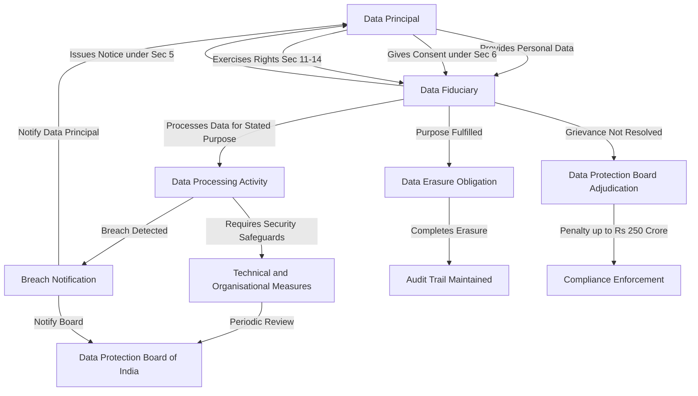
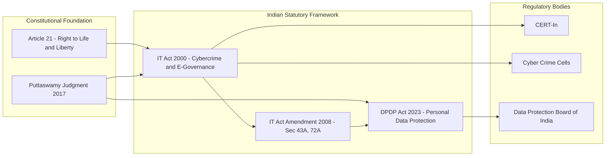
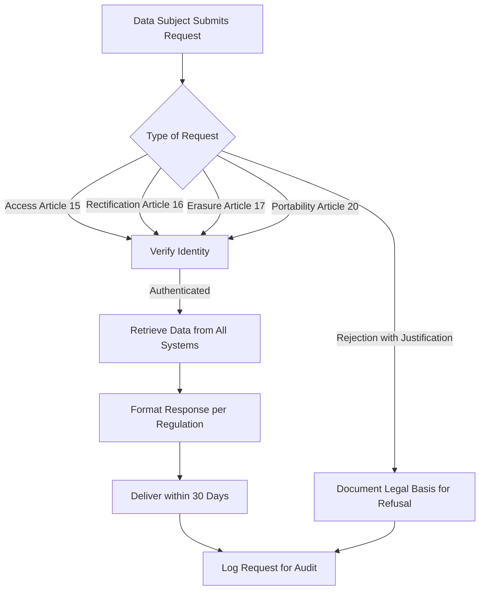
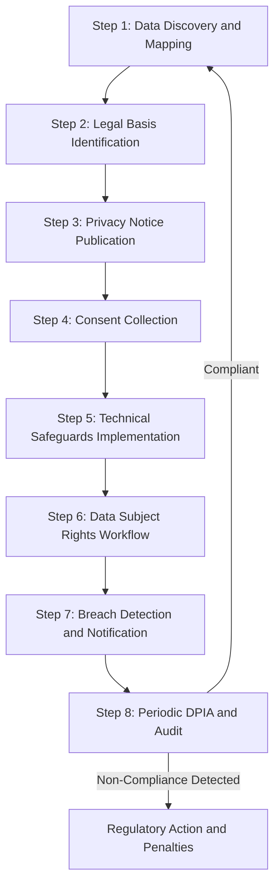
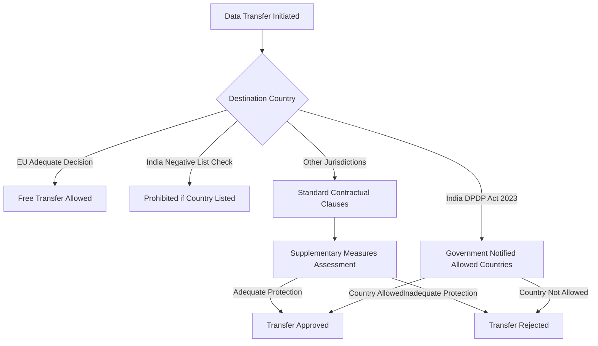

# Privacy Law and Regulation

<!-- SECTION_1_START -->

# Privacy Law and Regulation in Cyberspace

> [!NOTE]
> **KTU 2024 Scheme Focus (PECST419 - Module 3):** This topic establishes the legal architecture governing how personal data is collected, processed, stored, and shared in cyberspace. It is essential for understanding the regulatory framework that binds technology professionals and organizations operating in the digital economy.

## 1.1 Formal Academic Definition

**Privacy Law** refers to the body of legal rules, statutes, regulations, judicial precedents, and constitutional principles that govern the collection, use, storage, disclosure, and protection of personal information of individuals by governments, corporations, and other entities. In the context of cyberspace, privacy law addresses the rights of data subjects (individuals) and the obligations of data controllers and data processors in digital environments.

> [!IMPORTANT]
> **Right to Privacy — Constitutional Status in India:** The Supreme Court of India, in *Justice K.S. Puttaswamy (Retd.) v. Union of India* (2017), unanimously declared the **Right to Privacy as a fundamental right** under **Article 21** (Right to Life and Personal Liberty) of the Indian Constitution. This landmark judgment forms the bedrock of all subsequent Indian privacy legislation, including the **Digital Personal Data Protection Act, 2023**.

**Key Terminology (KTU Syllabus Standard):**

- **Personal Data / Personally Identifiable Information (PII):** Any information relating to a directly or indirectly identifiable natural person (e.g., name, Aadhaar, IP address, biometric data).
- **Data Subject:** The individual to whom the personal data relates.
- **Data Controller (Data Fiduciary):** The entity that determines the purpose and means of processing personal data.
- **Data Processor:** The entity that processes data on behalf of the data controller.
- **Consent:** A freely given, specific, informed, and unambiguous agreement by the data subject to the processing of their personal data.
- **Data Breach:** A breach of security leading to accidental or unlawful destruction, loss, alteration, unauthorized disclosure of, or access to personal data.

## 1.2 Conceptual Analogy — The "Digital House" Analogy

Imagine your **personal data is your house**:

- The **walls and locks** of your house are the *technical security measures* (encryption, firewalls, access controls).
- The **land deed and property registration** are the *legal ownership rights* — this is what **Privacy Law** provides. It establishes *who owns your data* and *who can enter your house*.
- The **neighbourhood watch and police patrol** are the *regulatory authorities* (like the Data Protection Board of India) who enforce the law.
- The **visitor's register** where guests sign in is analogous to **consent** — you allow specific entities to enter only for specific purposes.

Just as a homeowner can file a police complaint if a stranger trespasses, privacy law gives the data subject the right to file a complaint if their personal data is misused. Without privacy law, your digital "house" has walls but no deed — anyone can claim ownership.

> [!TIP]
> **Intuitive Takeaway:** Privacy Law is the **legal deed to your digital identity**. It does not build the lock (that's cybersecurity), but it defines *who is allowed to hold the key, under what conditions, and what penalties apply if they misuse it.*

## 1.3 Key Global and Indian Frameworks (At a Glance)

| Acronym | Full Form | Jurisdiction | Key Feature |
|---|---|---|---|
| **GDPR** | General Data Protection Regulation | European Union (2018) | Extraterritorial scope, fines up to €20 million or **4\%** of global turnover |
| **IT Act** | Information Technology Act, 2000 (amended 2008) | India | First comprehensive cyber law; Sections 43A, 72A address data privacy |
| **DPDP Act** | Digital Personal Data Protection Act, 2023 | India | India's first dedicated data protection statute |
| **CCPA** | California Consumer Privacy Act | California, USA (2020) | Consumer rights to know, delete, and opt-out of data sale |
| **HIPAA** | Health Insurance Portability and Accountability Act | USA (1996) | Protects health information (PHI) |
| **PIPEDA** | Personal Information Protection and Electronic Documents Act | Canada | Governs commercial data collection |

> [!NOTE]
> **Bold Metric to Remember:** GDPR penalties can reach **4\% of annual global turnover** or **€20 million**, whichever is higher — the highest data protection fine in the world.

> [!VISUALIZATION CONTROL]
> **Concept:** Hierarchical Pyramid of Privacy Law Enforcement
> **Conceptual Layout:** Visualize a 4-tier pyramid from base to apex:
> * Tier 1 (Base) — *Constitutional Rights* (Article 21, Puttaswamy judgment)
> * Tier 2 — *Statutory Framework* (IT Act 2000, DPDP Act 2023)
> * Tier 3 — *Regulatory Bodies* (Data Protection Board of India, EU DPAs)
> * Tier 4 (Apex) — *Judicial Remedies* (Supreme Court, High Courts, Tribunals)
> **Visual Description:** Students should observe that enforcement flows upward — a violation triggers regulatory action, which may escalate to judicial remedy, all anchored in constitutional rights.

---

<!-- SECTION_1_END -->

<!-- SECTION_2_START -->

# Deep Theoretical Analysis & KTU High-Yield Reference Sheet

## 2.1 Theoretical Foundations of Privacy Law

Privacy law is built upon four philosophical pillars that any regulatory framework must address:

1. **Notice** — The data subject must be informed about what data is being collected and why.
2. **Choice / Consent** — The data subject must have a meaningful ability to permit or deny the use of their data.
3. **Access / Participation** — The data subject must be able to view, correct, or delete their data.
4. **Integrity / Security** — The data controller must maintain accurate data and protect it from unauthorized access.

These four pillars are collectively known as the **OECD Privacy Guidelines (1980)** — the foundational international framework that influenced nearly every modern privacy law.

## 2.2 Core Principles of Data Protection (Universally Accepted)

> [!IMPORTANT]
> **KTU High-Yield List — Memorize These 7 Principles:**

- **Lawfulness, Fairness, and Transparency:** Processing must be lawful, fair, and transparent to the data subject.
- **Purpose Limitation:** Data must be collected for specified, explicit, and legitimate purposes.
- **Data Minimization:** Only the minimum necessary data should be collected.
- **Accuracy:** Personal data must be accurate and kept up to date.
- **Storage Limitation:** Data must not be kept longer than necessary for the purpose.
- **Integrity and Confidentiality:** Data must be processed securely to prevent unauthorized access.
- **Accountability:** The data controller is responsible for demonstrating compliance with all principles.

## 2.3 KTU High-Yield Reference Sheet — Indian Privacy Framework

| Element | Information Technology Act, 2000 (Amended 2008) | Digital Personal Data Protection Act, 2023 |
|---|---|---|
| **Primary Focus** | E-commerce, digital signatures, cybercrime | Personal data protection |
| **Key Privacy Sections** | Section 43A (compensation for failure to protect data), Section 72A (punishment for disclosure) | Whole Act |
| **Scope** | Applies to any company handling "sensitive personal data" in India | Extraterritorial — applies to entities outside India if they offer goods/services to Indian data subjects |
| **Consent Model** | Implied consent for most data; explicit for sensitive data | Free, specific, informed, unconditional, unambiguous consent |
| **Data Fiduciary** | Not specifically defined | Entity that determines the purpose and means of processing |
| **Significant Data Fiduciary** | Not present | Govt. may classify certain fiduciaries as "Significant" with additional obligations |
| **Cross-border Transfer** | Not explicitly regulated | Allowed to countries not on the "negative list" issued by the Central Government |
| **Right to Erasure** | Not explicitly provided | Data Principal has the right to erasure (except for legal/legitimate purposes) |
| **Penalties** | Up to **₹5 crore** or imprisonment up to **3 years** for certain offences | Up to **₹250 crore** per instance for failure to take reasonable security safeguards |
| **Regulatory Body** | No dedicated body (handled by CERT-In, Cyber Cells) | **Data Protection Board of India (DPB)** |

> [!NOTE]
> **Critical Distinction for KTU Exams:** The IT Act 2000 is **cybercrime-centric**, while the DPDP Act 2023 is **privacy-centric**. Many questions test whether students can distinguish between the two. Always state which Act applies to the scenario.

## 2.4 Comparative Reference Sheet — Global Frameworks

| Feature | GDPR (EU) | CCPA (California) | DPDP Act (India) |
|---|---|---|---|
| **Year Enacted** | 2016 (effective 2018) | 2018 (effective 2020) | 2023 |
| **Extraterritorial Scope** | Yes | Limited | Yes |
| **Maximum Penalty** | €20M or 4\% global turnover | $2,500 per violation; $7,500 per intentional violation | ₹250 crore per breach |
| **Right to be Forgotten** | Yes (Article 17) | Limited | Yes |
| **Data Protection Officer (DPO)** | Mandatory for large-scale processing | Not mandatory | Required for Significant Data Fiduciaries |
| **Consent Age** | 16 (or 13 in some EU states) | 13 (for opt-in) | 18 (children's data needs parental consent) |
| **Lawful Basis Beyond Consent** | Contract, legal obligation, vital interest, public task, legitimate interest | Limited | Consent or certain "legitimate uses" (e.g., medical emergency, employment) |

## 2.5 Real-World Engineering Utility

Privacy law directly impacts the design, development, and deployment of software systems:

- **Privacy by Design (PbD):** Engineers must embed privacy safeguards into system architecture from the initial design phase, not as an afterthought. This is a legal requirement under GDPR Article 25.
- **Data Protection Impact Assessments (DPIA):** Required for high-risk processing activities. Engineers must document data flows, identify risks, and implement mitigations.
- **Consent Management Systems (CMS):** Applications handling user data must implement granular consent UI, withdrawal mechanisms, and audit logs.
- **Cross-border Data Transfer Mechanisms:** Cloud architects must use Standard Contractual Clauses (SCCs), Binding Corporate Rules (BCRs), or transfer data only to whitelisted jurisdictions.
- **Breach Notification Systems:** Systems must be capable of detecting breaches and notifying the regulator within **72 hours** (GDPR) or as prescribed by the DPDP Act.

> [!TIP]
> **For KTU Viva/Interviews:** If asked "Why should an engineer study privacy law?", the answer is: *Non-compliance results in massive financial penalties, criminal liability for officers, reputational damage, and product bans in regulated markets. Privacy law is no longer a legal-only concern — it is a core engineering responsibility.*

---

<!-- SECTION_2_END -->

<!-- SECTION_3_START -->

# Step-by-Step Frameworks, Case Analysis, and Implementation

## 3.1 The Puttaswamy Judgment — Foundation of Indian Privacy Law

> [!IMPORTANT]
> This 2017 Supreme Court judgment is the **single most important judicial precedent** for privacy law in India. It is frequently asked in KTU exams (3-mark and 14-mark questions).

**Case Details:**

- **Case Name:** *Justice K.S. Puttaswamy (Retd.) v. Union of India*
- **Year:** 2017
- **Bench:** 9-Judge Constitution Bench (a rare and historic occasion)
- **Verdict:** Unanimous 9-0 — Right to Privacy is a fundamental right
- **Articles Invoked:** Article 14 (Equality), Article 19 (Freedom of Speech), Article 21 (Life and Liberty)

**Step-by-Step Logical Framework of the Judgment:**

**Step 1 — Historical Context:**
Prior to 2017, the Supreme Court had conflicting rulings. In *M.P. Sharma (1954)* and *Kharak Singh (1962)*, privacy was discussed but not declared a fundamental right. The Aadhaar project (2010 onwards) prompted fresh legal challenges.

**Step 2 — The Question Before the Court:**
Whether the collection of biometric data under Aadhaar violates the fundamental rights of Indian citizens.

**Step 3 — The Court's Reasoning Process:**

\begin{aligned}
\text{Right to Privacy} &\subset \text{Article 21 (Life and Personal Liberty)} \\
\text{Article 21} &\subset \text{Part III (Fundamental Rights)} \\
\text{State Intrusion} &\Rightarrow \text{Requires Justification under Three-Test:} \\
&\Rightarrow \text{(i) Legality — backed by a law} \\
&\Rightarrow \text{(ii) Need — legitimate state aim} \\
&\Rightarrow \text{(iii) Proportionality — rational nexus between means and aim}
\end{aligned}

**Step 4 — The Final Holding:**
The Right to Privacy is an **intrinsic part of Article 21** and is also protected under Articles 14 and 19. Any government intrusion into privacy must satisfy the **proportionality test**.

**Step 5 — Implications:**
This judgment became the foundation for the **Justice B.N. Srikrishna Committee (2017-18)**, which drafted the original Personal Data Protection Bill, ultimately leading to the **DPDP Act, 2023**.

## 3.2 The Digital Personal Data Protection Act, 2023 — Structural Walkthrough

The DPDP Act follows a **consent-based processing model with legitimate exceptions**. Here is the step-by-step processing logic:

**Step 1 — Identify the Data Principal (the user).**

**Step 2 — Determine the Basis of Processing:**

\begin{aligned}
\text{Processing Basis} = \begin{cases} \text{Consent} & \text{if voluntary, specific, informed} \\ \text{Legitimate Use} & \text{if falls under Section 7(g) exceptions} \end{cases}
\end{aligned}

**Step 3 — Section 7(g) Legitimate Uses (No Consent Required):**
- Employment-related data (e.g., payroll, attendance)
- Medical emergency involving life and death
- Provision of medical treatment or health services
- Disaster response
- Safety of the State

**Step 4 — Data Fiduciary Obligations (Sections 8-15):**
- Issue a notice describing the personal data and purpose
- Obtain consent (for non-7(g) processing)
- Implement reasonable security safeguards
- Notify the Data Protection Board of India in case of a breach
- Erase data when the purpose is fulfilled or consent is withdrawn
- Publish business contact information for data principal grievances

**Step 5 — Rights of the Data Principal (Sections 11-14):**
- **Section 11:** Right to access a summary of personal data and processing activities
- **Section 12:** Right to correction and erasure
- **Section 13:** Right to grievance redressal
- **Section 14:** Right to nominate another individual to exercise rights in case of death/incapacity

**Step 6 — Penalty Calculation Framework:**

\begin{aligned}
\text{Penalty Tier 1} &= \text{Up to ₹250 crore} \quad \text{(failure to take reasonable security safeguards)} \\
\text{Penalty Tier 2} &= \text{Up to ₹200 crore} \quad \text{(failure to notify breach to Board)} \\
\text{Penalty Tier 3} &= \text{Up to ₹150 crore} \quad \text{(other violations of Act provisions)} \\
\text{Exemptions} &= \text{Data Fiduciaries notified by Central Govt. may have lower penalties}
\end{aligned}

## 3.3 GDPR Compliance — Step-by-Step Engineering Framework

For a software engineering student, GDPR compliance follows a **7-step practical implementation** pattern:

**Step 1 — Data Mapping:**
Identify all personal data your system collects, stores, processes, and shares. Create a **Record of Processing Activities (RoPA)**.

**Step 2 — Lawful Basis Determination:**
Choose one of six lawful bases: *Consent, Contract, Legal Obligation, Vital Interests, Public Task, Legitimate Interests.*

**Step 3 — Privacy Notice Implementation:**
Display clear, layered privacy notices at every data collection point. Use plain language, not legalese.

**Step 4 — Consent Mechanism:**
Implement granular, opt-in consent with easy withdrawal. Pre-ticked boxes are **invalid** under GDPR.

**Step 5 — Data Subject Rights Implementation:**
Build technical workflows to handle: Access requests (Article 15), Rectification (Article 16), Erasure (Article 17), Portability (Article 20), Objection (Article 21).

**Step 6 — Security Measures:**
Apply encryption (AES-256), pseudonymization, access controls, and regular security testing.

**Step 7 — Breach Notification Protocol:**

\begin{aligned}
\text{Breach Detection} \rightarrow \text{72 Hours} \rightarrow \text{Notify Supervisory Authority} \\
\text{Breach Detection} \rightarrow \text{Without Delay} \rightarrow \text{Notify Affected Data Subjects}
\end{aligned}

## 3.4 Tabular Case-Framework Analysis: Landmark Privacy Cases

| Case Name | Year | Jurisdiction | Key Issue | Verdict | Engineering Lesson |
|---|---|---|---|---|---|
| *Puttaswamy v. UoI* | 2017 | India | Aadhaar biometric collection | Privacy is a fundamental right | Design systems with consent at core |
| *Google Spain v. AEPD* | 2014 | EU | Right to be forgotten (Google search results) | Search engines must delink outdated/inadequate info | Implement data deletion APIs in products |
| *Schrems I* | 2015 | EU | US Safe Harbor invalid (NSA surveillance) | Safe Harbor framework struck down | Cross-border transfers need robust mechanisms |
| *Schrems II* | 2020 | EU | EU-US Privacy Shield invalid | Privacy Shield struck down; SCCs must be assessed | Use updated SCCs and supplementary measures |
| *Cambridge Analytica* | 2018 | USA/UK | Facebook data harvested for political profiling | FTC fined Facebook \$5 billion | Limit third-party data sharing APIs |
| *Apple vs. FBI (San Bernardino)* | 2016 | USA | Government demand to unlock iPhone | Case resolved without forced decryption | Build systems that even vendors cannot unlock (zero-knowledge architecture) |

## 3.5 Comparative Analysis — IT Act vs DPDP Act on Specific Scenarios

> [!IMPORTANT]
> **KTU Examination Pattern:** The examiner often presents a real-world scenario and asks which Act applies. The following mapping is essential.

| Scenario | Applicable Statute | Reasoning |
|---|---|---|
| A hospital leaks patient records | DPDP Act 2023 + IT Act Section 43A | Health data is personal data; Section 43A imposes compensation |
| A hacker defaces a government website | IT Act Sections 65, 66 | This is a cybercrime, not a privacy issue per se |
| A fintech app collects Aadhaar for KYC | DPDP Act 2023 + IT (Reasonable Security Practices) Rules 2011 | Aadhaar is personal data; consent and security obligations apply |
| An e-commerce site shares user data with advertisers without notice | DPDP Act 2023 | Violates consent and purpose limitation principles |
| An employee is fired for refusing to give biometric attendance | DPDP Act 2023 | Employment falls under legitimate use only for specific purposes |
| A WhatsApp message is intercepted by police | IT Act Section 69 + Telegraph Act Section 5(2) | Intercept, not privacy breach per se, but subject to procedural safeguards |

## 3.6 Step-by-Step Consent Lifecycle (Engineering View)

The consent lifecycle is a critical engineering concept for KTU exams:

**Step 1 — Initiation:** User opens the app/website. The system presents a privacy notice.

**Step 2 — Granular Choice:** The user can opt-in to specific processing activities (e.g., marketing emails, analytics, third-party sharing). Each is a separate, independent toggle.

**Step 3 — Recording:** The system records: timestamp, IP address, user ID, exact wording of consent, version of privacy policy.

**Step 4 — Storage:** Consent records are stored immutably (often in append-only databases or blockchain) for audit purposes.

**Step 5 — Withdrawal:** The user can withdraw consent at any time with the same ease as giving consent (GDPR requirement).

**Step 6 — Propagation:** The withdrawal is propagated to all downstream systems (analytics, marketing, third-party partners) within a defined SLA.

**Step 7 — Audit:** The system can produce a complete consent audit trail on demand for regulators.

---

<!-- SECTION_3_END -->

<!-- SECTION_4_START -->

# Structural Diagrams & Schematics

## 4.1 Privacy Law Compliance Flow — DPDP Act (2023)

> [!NOTE]
> **Node Naming Note:** All node IDs are alphanumeric and prefixed with letters (e.g., `node1` → `A`, `stepA` → `B`) per the Mermaid compilation safeguards. No reserved keywords are used.

## 4.2 Comparative Architecture — IT Act vs DPDP Act

## 4.3 GDPR Data Subject Rights Implementation Architecture

## 4.4 Sequential Processing Topology — Privacy Compliance Pipeline

## 4.5 Cross-Border Data Flow Decision Matrix

---

<!-- SECTION_4_END -->

<!-- SECTION_5_START -->

# KTU 2024 Scheme Examination Question Bank

## Part A — Short Answer Questions (3 Marks Each)

### Question 1: Define Privacy Law. (3 Marks)

**[KTU University Exam - July 2024 | CO1 | Remember]**

**Model Answer:**

Privacy Law is the body of legal rules, regulations, and judicial principles that govern the collection, use, storage, disclosure, and protection of personal information of individuals by government and private entities. In cyberspace, it establishes the rights of data subjects and the obligations of data controllers and processors, ensuring lawful, fair, and transparent processing of personal data.

> [!NOTE]
> **[Valuation Key: Stating the focus on 'personal data' and 'rights and obligations': 2 Marks. Mentioning cyber context: 1 Mark.]**

### Question 2: What is the Right to be Forgotten? (3 Marks)

**[KTU University Exam - Dec 2023 | CO1 | Understand]**

**Model Answer:**

The Right to be Forgotten is a data subject right that allows an individual to request the deletion or removal of their personal data from an organization's records and from publicly available sources, when the data is no longer necessary for the original purpose of processing. It is enshrined in **Article 17 of the GDPR** and **Section 12 of the DPDP Act, 2023**. The right is subject to certain exceptions, such as freedom of expression, legal obligations, and public interest in health.

> [!NOTE]
> **[Valuation Key: Definition: 1 Mark. Article/Section reference: 1 Mark. Exceptions: 1 Mark.]**

---

## Part B — Long Answer Questions (14 Marks with Internal Choice)

### Question A: Discuss the salient features of the Digital Personal Data Protection Act, 2023. How does it differ from the IT Act, 2000 in handling personal data? (14 Marks)

**[KTU University Exam - July 2024 | CO2 | Apply]**

#### Part (a) — Salient Features of the DPDP Act, 2023 (7 Marks)

**Model Solution:**

**Step 1 — Legislative Context:** The DPDP Act, 2023 was enacted to provide a comprehensive framework for the protection of digital personal data, following the *Puttaswamy* judgment (2017) and the recommendations of the **Srikrishna Committee (2018)**. **[1 Mark]**

**Step 2 — Salient Features:**

**(i) Consent-Based Processing:** Section 6 mandates that personal data may be processed only for a lawful purpose for which the data principal has given consent or for certain legitimate uses specified in Section 7(g). **[1 Mark]**

**(ii) Data Fiduciary Obligations:** Data Fiduciaries must implement reasonable security safeguards, issue a clear notice, and notify the Data Protection Board in case of a data breach. **[1 Mark]**

**(iii) Rights of Data Principals:** Sections 11-14 grant the rights of access, correction, erasure, grievance redressal, and nomination. **[1 Mark]**

**(iv) Data Protection Board of India (DPB):** A dedicated adjudicatory body has been established to adjudicate non-compliance and impose penalties. **[1 Mark]**

**(v) Cross-Border Data Transfer:** Transfer is permitted to countries not on the negative list issued by the Central Government. **[1 Mark]**

**(vi) Significant Data Fiduciaries:** The Government may classify certain fiduciaries as Significant, requiring additional obligations like Data Protection Officer and Data Protection Impact Assessment. **[1 Mark]**

**Step 3 — Penalties:** Penalties up to **₹250 crore** per instance for failure to take reasonable security safeguards. **[Bonus point for 1 Mark if mentioned]**

#### Part (b) — Key Differences from IT Act, 2000 (7 Marks)

| Aspect | IT Act, 2000 (Amended 2008) | DPDP Act, 2023 |
|---|---|---|
| **Primary Focus** | Cybercrime, e-commerce, digital signatures | Personal data protection |
| **Scope of Application** | Limited to specific offences and sensitive personal data | Comprehensive coverage of all digital personal data |
| **Consent Requirement** | Mostly implicit; explicit for sensitive personal data | Free, specific, informed, unconditional, unambiguous consent |
| **Regulatory Body** | No dedicated privacy regulator | Data Protection Board of India |
| **Penalty Cap** | Up to ₹5 crore under Section 43A | Up to ₹250 crore |
| **Right to Erasure** | Not explicitly provided | Explicitly granted under Section 12 |
| **Cross-Border Transfer** | Not regulated | Regulated via negative list mechanism |
| **Children's Data** | Not specifically addressed | Special provisions for children's data (parental consent under 18) |

**[Award 1 Mark for each correctly identified difference up to 7 Marks]**

> [!WARNING]
> **KTU Examiner's Valuation Warning:** Students often lose marks by:
> 1. Confusing the IT Act with the DPDP Act — always state the year and full name of the Act.
> 2. Failing to mention the *Puttaswamy* judgment as the constitutional foundation.
> 3. Listing features without explaining their legal/engineering significance.

---

### Question B: Explain the General Data Protection Regulation (GDPR). Discuss the seven core principles of data protection as articulated under GDPR. (14 Marks)

**[KTU University Exam - Dec 2023 | CO2 | Understand]**

#### Part (a) — Overview of GDPR (7 Marks)

**Model Solution:**

**Step 1 — Background:** The GDPR (Regulation 2016/679) was adopted by the European Parliament in April 2016 and became enforceable from **25 May 2018**. It replaced the 1995 Data Protection Directive. **[1 Mark]**

**Step 2 — Territorial Scope:** GDPR applies to all organizations processing personal data of individuals in the EU, regardless of where the organization is located (extraterritorial scope). **[1 Mark]**

**Step 3 — Key Definitions:**

\begin{aligned}
\text{Personal Data} &= \text{Any information relating to an identified or identifiable person} \\
\text{Data Subject} &= \text{The individual whose data is being processed} \\
\text{Data Controller} &= \text{Entity determining purpose and means of processing} \\
\text{Data Processor} &= \text{Entity processing data on behalf of controller}
\end{aligned}

**[1 Mark for definitions]**

**Step 4 — Penalties:** Two tiers of administrative fines:
- **Higher tier:** Up to **€20 million or 4\% of total worldwide annual turnover**, whichever is higher.
- **Lower tier:** Up to **€10 million or 2\% of turnover**, whichever is higher. **[1 Mark]**

**Step 5 — Data Subject Rights:** GDPR grants 8 rights: right to be informed, access, rectification, erasure, restriction, portability, objection, and right not to be subject to automated decision-making. **[1 Mark]**

**Step 6 — Data Protection Officer (DPO):** Mandatory for organizations performing large-scale systematic monitoring or processing sensitive data. **[1 Mark]**

**Step 7 — Cross-Border Transfer Mechanisms:** Adequacy decisions, Standard Contractual Clauses (SCCs), Binding Corporate Rules (BCRs), and explicit consent. **[1 Mark]**

#### Part (b) — Seven Core Principles of GDPR (7 Marks)

| Sl. No. | Principle | Explanation |
|---|---|---|
| 1 | **Lawfulness, Fairness, and Transparency** | Data must be processed lawfully, fairly, and in a transparent manner |
| 2 | **Purpose Limitation** | Data collected for specified, explicit, and legitimate purposes only |
| 3 | **Data Minimization** | Only data adequate, relevant, and necessary for the purpose may be processed |
| 4 | **Accuracy** | Data must be accurate and kept up to date; inaccurate data must be erased or rectified |
| 5 | **Storage Limitation** | Data must be kept only as long as necessary for the purpose |
| 6 | **Integrity and Confidentiality** | Data must be processed securely using technical and organizational measures |
| 7 | **Accountability** | Controller is responsible for demonstrating compliance with all principles |

**[1 Mark for each principle explained correctly, maximum 7 Marks]**

> [!WARNING]
> **KTU Examiner's Valuation Warning:** Students frequently lose marks in GDPR questions by:
> 1. Confusing GDPR with the older 1995 Directive.
> 2. Stating the principles in random order — present them as a logical narrative.
> 3. Failing to mention the **territorial scope** — this is the most important feature of GDPR.
> 4. Not mentioning the **two-tier penalty structure** — examiners expect numerical precision.

---

## Topic Recap & Important Things to Remember

> [!IMPORTANT]
> **High-Density Rapid Revision Checklist for KTU Module 3 — Privacy Law and Regulation:**

- **Privacy Law** governs the collection, use, storage, and disclosure of personal data in cyberspace.
- **Right to Privacy** is a fundamental right under **Article 21** of the Indian Constitution, established by *Puttaswamy v. UoI (2017)*.
- **IT Act, 2000** is cybercrime-centric; key privacy sections are **43A** (compensation for negligence) and **72A** (punishment for disclosure).
- **DPDP Act, 2023** is privacy-centric; it is India's first dedicated personal data protection law.
- **Key GDPR Penalty:** Up to **€20 million or 4\% of global turnover**, whichever is higher.
- **DPDP Act Penalty:** Up to **₹250 crore** for failure to implement reasonable security safeguards.
- **Data Protection Board of India (DPB)** is the dedicated regulator under the DPDP Act, 2023.
- **Cross-border data transfer** under DPDP is allowed to countries **not on the negative list** issued by the Central Government.
- **Right to Erasure / Right to be Forgotten** is available under **GDPR Article 17** and **DPDP Act Section 12**.
- **Consent under DPDP** must be *free, specific, informed, unconditional, and unambiguous* (Section 6).
- **Legitimate Uses (Section 7(g))** include employment, medical emergency, and disaster response — these allow processing without consent.
- **Children's Data** under DPDP requires verifiable parental consent for users under **18 years**.
- **Significant Data Fiduciaries** are designated by the Government and must appoint a DPO and conduct DPIAs.
- **Breach Notification** must occur to the **Data Protection Board** without delay (specific timeframe prescribed by rules).
- **OECD Privacy Guidelines (1980)** introduced the four pillars: Notice, Choice, Access, Integrity.
- **Global frameworks to compare:** GDPR (EU), CCPA (California), HIPAA (USA), PIPEDA (Canada), DPDP Act (India).
- **Landmark cases to remember:** *Puttaswamy (2017), Google Spain (2014), Schrems I and II (2015, 2020), Cambridge Analytica (2018)*.
- **Engineering integration:** Privacy by Design, DPIA, Consent Management Systems, breach notification workflows.

> [!TIP]
> **Final KTU Exam Tip:** Privacy Law questions are rarely pure theory. Always anchor your answer to a real-world scenario, cite the specific Section/Article number, and conclude with the engineering/societal implication. This three-part structure (definition → legal provision → impact) consistently scores full marks.

---

<!-- SECTION_5_END -->
