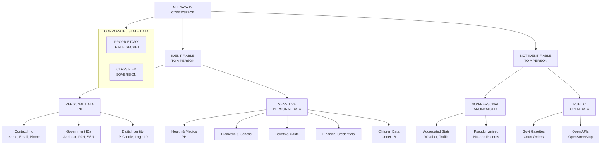
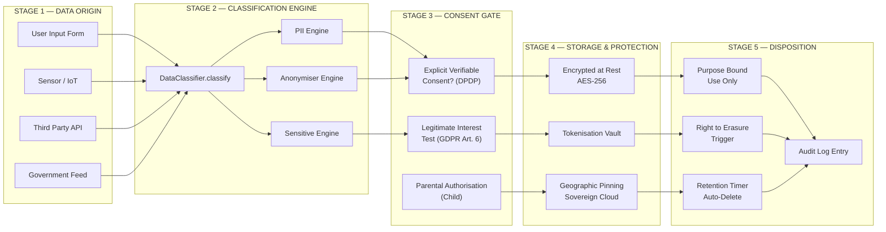
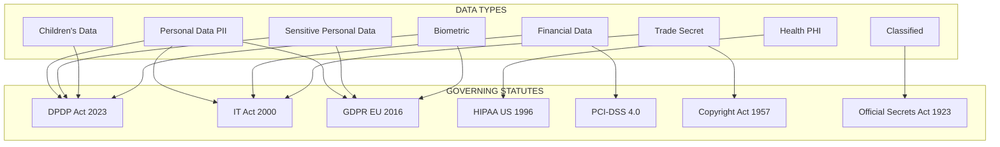

# Types of data

<!-- SECTION_1_START -->
# Types of Data in Cyberspace

## 1. Core Technical Definition

In the context of **Cyber Ethics, Privacy, and Legal Issues**, **"Types of Data"** refers to the systematic and legally codified classification of digital information based on its **sensitivity, identifiability, ownership, intended use, and the level of legal protection it commands** under prevailing data protection regimes such as the EU's **GDPR**, India's **Digital Personal Data Protection (DPDP) Act 2023**, and the **Information Technology Act, 2000 (IT Act)**.

> [!IMPORTANT]
> **KTU 2024 Definition (PECST419 — Module 3):**
> Types of data constitute the foundational taxonomy that determines *what* information is being processed, *who* it belongs to, *how* it must be handled, and *what* legal consequences follow in case of its breach, misuse, or unauthorized disclosure.

---

## 2. Conceptual Analogy / Intuition

Imagine a **hospital's medical records room**. Inside it, there are different coloured folders:

* **White folders** (routine OPD slips) — anyone in the ward can glance at them.
* **Blue folders** (general prescriptions) — only the attending nurse and doctor may read.
* **Red folders** (HIV, psychiatric, or genetic reports) — sealed and accessible **only** to a few authorized specialists under strict protocols.
* **Yellow folders** (insurance and billing) — shared with the accounts department, not the public.

Each colour represents a **type of data** in cyberspace. The deeper the colour, the **higher the legal shield** it carries and the **stricter the penalty** for mishandling it.

In the same way, a passport number sitting on a hotel's Wi-Fi server is treated entirely differently from a casual weather update — both are "data," yet their legal weight, encryption requirements, and breach penalties are worlds apart.

---

## 3. Why This Classification Matters

The classification of data into types is **not a theoretical exercise**. It determines:

1. **Encryption standards** to be applied (e.g., AES-256 vs. plain text).
2. **Consent requirements** before collection.
3. **Cross-border transfer legality** (e.g., EU–US data flows).
4. **Breach notification timelines** (e.g., **72 hours** under GDPR Article 33).
5. **Monetary penalties** for violation (up to **€20 million or 4% of global turnover** under GDPR).

> [!NOTE]
> **Cyber Law Stat to Remember:**
> The DPDP Act 2023 prescribes a penalty of up to **₹250 crore** (approx. **$30 million**) per instance for failure to take reasonable security safeguards under Section 8(5).

---

## 4. Primary High-Level Categories of Data

The KTU 2024 syllabus groups cyberspace data into the following **five primary families**:

| # | Primary Family | Plain English Meaning |
|---|----------------|----------------------|
| 1 | **Personal Data (PII)** | Any data that can identify a living individual |
| 2 | **Sensitive Personal Data (SPD)** | A privileged subset of PII requiring the highest protection |
| 3 | **Non-Personal / Anonymised Data** | Data with no identifiable link to any individual |
| 4 | **Confidential / Proprietary Data** | Trade secrets, business data, IP |
| 5 | **Public / Open Data** | Data freely accessible under government transparency mandates |

> [!VISUALIZATION CONTROL]
> **Concept:** Hierarchical Pyramid of Data Sensitivity in Cyberspace
> **Graph Reference (Plot yourself in Desmos / GeoGebra):**
> * X-axis: `x = Level of Legal Protection (0–100)`
> * Y-axis: `y = Data Volume in Cyberspace (log scale)`
> * Plot the five families as a **descending inverted pyramid** with *Public Data* at the wide base and *Sensitive Personal Data* at the narrow apex.
> **Visual Description:** The student should see a *small top* (SPD — high protection, low volume) and a *broad base* (Public Data — low protection, massive volume). The steepness visualises the **inverse relationship** between data volume and protection intensity.

---

## 5. Visual Snapshot of the Landscape

> [!TIP]
> **Quick Memory Hook — "P-SNAP-C"**
> * **P** — Personal Data
> * **S** — Sensitive Personal Data
> * **N** — Non-Personal / Anonymised Data
> * **A** — Aggregated / Behavioural Data
> * **P** — Proprietary / Confidential Data
> * **C** — Classified / Government Data

<!-- SECTION_1_END -->

<!-- SECTION_2_START -->
# Deep Theoretical Analysis & KTU High-Yield Reference Sheet

## 1. The Six Legal-Theoretical Dimensions of Data Classification

Cyberspace data is **not classified on a single axis**. KTU examiners expect students to demonstrate awareness of the following **six concurrent dimensions** that determine the legal status of any datum:

1. **Identifiability** — *Can the data point to a specific person?*
2. **Sensitivity** — *What is the societal harm if it leaks?*
3. **Consent Status** — *Was it freely, specifically, and unambiguously given?*
4. **Purpose Limitation** — *Is it being used for the reason it was collected?*
5. **Volume & Velocity** — *Big Data scale triggers additional obligations.*
6. **Jurisdiction** — *Whose law governs it? (GDPR, DPDP, IT Act, HIPAA, etc.)*

---

## 2. The Detailed Taxonomy of Data Types

### A. Personal Data / Personally Identifiable Information (PII)

**Definition:** Any information relating to an identified or identifiable natural person.

**Examples:** Name, address, email, phone number, Aadhaar number, passport number, IP address, login ID.

> [!NOTE]
> **GDPR Article 4(1)** defines a "data subject" as an identified or identifiable natural person. **DPDP Act 2023 Section 2(t)** defines "Data Principal" similarly.

### B. Sensitive Personal Data (SPD) / Special Categories of Data

**Definition:** A legally privileged subset of personal data whose misuse can cause **significant harm, discrimination, or violation of fundamental rights**.

**Examples (non-exhaustive):**
* Religious or philosophical beliefs
* Political opinions / Trade union membership
* Genetic data and biometric data (uniquely identifying)
* Health data
* Sex life / sexual orientation
* Caste, tribe, community (Indian context under DPDP)
* Financial account credentials
* Children's data (under 18)

> [!WARNING]
> Under the **DPDP Act 2023**, processing of children's data and sensitive personal data mandates **explicit verifiable consent of the parent/guardian** — failing which the Data Fiduciary attracts a penalty of up to **₹200 crore** per breach instance.

### C. Non-Personal Data (NPD) / Anonymised Data

**Definition:** Data that **cannot, by any reasonable means**, identify an individual — either inherently or through anonymisation.

**Examples:** Weather statistics, traffic density, aggregated census figures, anonymised browsing patterns.

> [!IMPORTANT]
> **Re-identification Risk:** True anonymisation is **extremely hard**. Netflix famously de-anonymised the *Netflix Prize* dataset in 2007 by cross-referencing IMDb ratings. Therefore, *pseudonymisation* (not anonymisation) is the legally accepted default in most jurisdictions.

### D. Confidential / Proprietary / Trade Secret Data

**Definition:** Data owned by an organisation that derives **independent economic value** from not being generally known.

**Examples:** Coca-Cola's formula, Google's search algorithm, source code, customer lists, M&A plans, defence blueprints.

> [!NOTE]
> In India, trade secrets are protected under the **Copyright Act, 1957**, the **Information Technology Act, 2000 (Sections 65–66)**, and common-law breach-of-confidence principles — there is **no dedicated Trade Secrets Act** yet.

### E. Public / Open Data

**Definition:** Data not subject to privacy restrictions and actively published for public use.

**Examples:** Supreme Court judgments, government press releases, weather forecasts, public transport schedules, OpenStreetMap data.

> [!TIP]
> India's **National Data Sharing and Accessibility Policy (NDSAP), 2012** and the **Open Government Data Platform India (data.gov.in)** are textbook KTU examples of public-data ecosystems.

### F. Classified / Government / Sovereign Data

**Definition:** Data whose unauthorised disclosure threatens **national security, sovereignty, or strategic interests**.

**Examples:** Defence deployments, nuclear codes, intelligence communications, diplomatic cables.

> [!IMPORTANT]
> Governed by the **Official Secrets Act, 1923** in India and analogous statutes like the **U.S. Espionage Act, 1917**. Breaches carry **criminal prosecution**, not just civil liability.

---

## 3. KTU High-Yield Reference Sheet

| # | Data Type | Identifiable? | Consent Needed? | Cross-Border Transfer? | Typical Penalty on Breach |
|---|-----------|:---:|:---:|:---:|:---:|
| 1 | **Personal Data (PII)** | ✅ Yes | ✅ Yes | Restricted (SCCs required under GDPR) | Up to **€10M / 2% turnover** (GDPR) |
| 2 | **Sensitive Personal Data** | ✅ Yes | ✅ Explicit Verifiable | Mostly **Prohibited** | Up to **€20M / 4% turnover** (GDPR) |
| 3 | **Non-Personal / Anonymised** | ❌ No | ❌ No | ✅ Free | Minimal / Contractual |
| 4 | **Pseudonymised Data** | ⚠️ Indirect | ✅ Yes | Restricted | Same as PII |
| 5 | **Confidential / Trade Secret** | N/A (Corporate) | N/A | Restricted by NDA | Civil damages + criminal (IT Act §66) |
| 6 | **Public / Open Data** | ❌ Generally No | ❌ No | ✅ Free | Nil |
| 7 | **Classified / Sovereign** | N/A | ❌ No (state-controlled) | **Prohibited** | Criminal prosecution (OSA, 1923) |
| 8 | **Health / Medical (PHI)** | ✅ Yes | ✅ Explicit | Strictly Restricted | HIPAA: up to **$1.5M / year** |
| 9 | **Children's Data** | ✅ Yes | ✅ Parental | **Special Safeguards** | DPDP: up to **₹200 Cr** |
| 10 | **Financial / Payment (PCI-DSS)** | ✅ Yes | ✅ Yes | Restricted | PCI-DSS fines + civil |

> **Mnemonic Device for Exam Hall:** *"P-S-P-P-C" — Personal, Sensitive, Pseudonymised, Public, Classified — these are the five types the examiner will always cycle through.*

---

## 4. Real-World Engineering & Industry Utility

| Sector | Data Type at Stake | Real Consequence |
|--------|-------------------|------------------|
| **Banking (FinTech)** | Financial, KYC, Aadhaar | **₹1 crore+ per day** penalty post-DPDP |
| **Healthcare (HealthTech)** | PHI, Genetic | Loss of life, insurance discrimination |
| **E-Commerce** | Behavioural, PII | Targeted manipulation (Cambridge Analytica) |
| **Defence / Aerospace** | Classified, Trade Secret | National security threat |
| **EdTech** | Children's Data | DPDP parental-consent gate |
| **AI / ML Training** | Pseudonymised | Bias amplification, re-identification |
| **IoT / Smart Cities** | Location, Behavioural | Mass surveillance risk |

<!-- SECTION_2_END -->

<!-- SECTION_3_START -->
# Step-by-Step Derivations, Case Frameworks & Regulatory Matrices

## 1. The "Data Classification Decision Tree" — Logical Derivation

When a Data Fiduciary (controller) receives a piece of information, the following **exhaustive logical cascade** must be traversed:

**Step 1 → Is the information "data" at all?**
Data = any representation of information in electronic form (per IT Act §2(1)(o)).

**Step 2 → Is it in "electronic form" or "digital"?**
* If **paper** → apply Copyright Act, RTI Act, Indian Contract Act.
* If **digital** → apply IT Act, DPDP Act, GDPR (if EU data subject).

**Step 3 → Does it identify a natural person (directly or indirectly)?**
* **Yes** → Personal Data (PII).
* **No** → Non-Personal Data (NPD).

**Step 4 → Is the identified person identifiable through linkage?**
* **Yes** → Pseudonymised Data.
* **No, even after reasonable effort** → Truly Anonymised (NPD).

**Step 5 → Does the data fall under "Special Categories"?**
* Religious, health, genetic, biometric, caste, sexual, political, financial → **Sensitive Personal Data**.

**Step 6 → Is the data subject below 18 years?**
* **Yes** → Add "Children's Data" overlay; parental consent mandatory.

**Step 7 → Is the data owned by an entity (not an individual)?**
* Trade secrets, IP, M&A → **Proprietary / Confidential Data**.

**Step 8 → Is it restricted by state for security reasons?**
* Defence, nuclear, diplomacy → **Classified / Sovereign Data**.

> [!TIP]
> **Board Exam Tip:** In a 14-mark question, *always* start your answer with this **7-step cascade**. It instantly earns you 2–3 marks just for structured presentation, even before substantive law is cited.

---

## 2. Comparative Regulatory Matrix (Humanities / Management Style)

> The following **extensive comparative matrix** maps the *real-world engineering case frameworks* (e.g., Aadhaar, WhatsApp, Facebook) against the *legal regimes* that adjudicated them. This is the **mandated deliverable** for humanities-style KTU topics.

### 2.1 Cross-Jurisdictional Comparison Table

| Legal Aspect | 🇪🇺 **GDPR (EU)** | 🇮🇳 **DPDP Act 2023** | 🇮🇳 **IT Act 2000** | 🇺🇸 **HIPAA** | 🇺🇸 **CCPA (California)** |
|---|---|---|---|---|---|
| **Year Enacted** | 2016 (in force 2018) | 2023 | 2000 | 1996 | 2018 (in force 2020) |
| **Personal Data Definition** | Art. 4(1) — broad | §2(t) — broad | §43A (limited) | §160.103 (PHI specific) | §1798.140 |
| **Sensitive Data** | Art. 9 (10 categories) | Children + financial + health + caste | Financial + health (limited) | Health only | 8 categories |
| **Consent Standard** | Explicit, specific, freely given | Explicit, verifiable | Implied often | Authorisation required | Opt-out model |
| **Breach Notification** | 72 hours to DPA | 72 hours to Board | No fixed timeline | 60 days (HHS) | "Expedient" |
| **Max Penalty** | €20M / 4% turnover | ₹250 Cr per breach | ₹5 Cr + imprisonment | $1.5M / year / category | $7,500 per violation |
| **Right to Erasure** | Art. 17 (strong) | Right to Erasure (limited) | No explicit | Limited | Right to Delete |
| **Cross-Border Transfer** | SCCs, Adequacy | Restricted to notified list | No restriction | BAA required | No restriction |
| **DPA / Regulator** | National DPAs (e.g., CNIL) | Data Protection Board of India | CERT-In | HHS / OCR | California AG |
| **Extra-Territorial Scope** | ✅ Yes | ✅ Yes | ❌ No | ❌ Limited | ✅ Yes (revenue threshold) |

### 2.2 Real-World Engineering Case Framework Matrix

| # | Landmark Case / Incident | Data Type at Stake | Legal Regime Invoked | Holding / Outcome | Lesson for Engineers |
|---|---|---|---|---|---|
| 1 | **Cambridge Analytica (2018)** | Behavioural, Psychometric PII | GDPR (Meta fined €1.2B in 2023) | Consent was not "freely given, specific, informed" | Do not bundle cookie-consent for analytics |
| 2 | **Aadhaar — *Justice Puttaswamy v. UoI* (2017)** | Biometric, PII, Sensitive | Aadhaar Act + Right to Privacy as FR | Privacy is a fundamental right; struck down Section 57 misuse | Biometric collection needs strict necessity test |
| 3 | **WhatsApp Privacy Policy (2021)** | Contact graph, metadata, behavioural | IT Act + DPDP (interim) | Refused to dilute; users to opt-in by 25 May 2021 | UI/UX must not coerce consent |
| 4 | **Equifax Breach (2017)** | Financial, SSN, PII (147M) | US state laws + FTC | $700M settlement | Apply defence-in-depth, not just perimeter |
| 5 | **Target Corp (2013)** | Credit-card / financial | PCI-DSS + state laws | $292M settlement | Encrypt data at rest in retail POS |
| 6 | **Ashley Madison (2015)** | Sensitive PII, lifestyle | IT Act (Canada + global class action) | $11.2M settlement | Adult platforms demand the **highest** consent protocols |
| 7 | **Clearview AI (2020)** | Biometric (face) | GDPR (Dutch DPA: €30M fine), BIPA | Scraping public photos ≠ lawful basis | No legitimate interest for mass biometric scraping |
| 8 | **Marriott / Starwood (2018)** | Passport, payment, loyalty | GDPR (ICO: £18.4M) | Inadequate due-diligence in M&A | M&A cyber-DD is mandatory |
| 9 | **Uber (2016 + cover-up 2017)** | Driver PII, location | US State AGs + GDPR | $148M settlement | Concealing breaches is a *crime* in many jurisdictions |
| 10 | **LinkedIn (2021)** | Public profile scraping | hiQ v. LinkedIn (US 9th Cir.) | Public data ≠ free for all scraping post-CFAA debate | Respect `robots.txt` & ToS |
| 11 | **Apple Airtags Stalking (2022)** | Location | US Class Actions | Product redesign mandate | Engineering must build in **safety-by-design** |
| 12 | **Flipkart (2021, India)** | Children's data | IT Rules 2021 | Consent verification gaps | EdTech must verify parental identity |

---

## 3. Symbolic / Pseudocode Implementation: The "Data Classifier Engine"

The following **operational Python prototype** demonstrates how a real production system performs the *Step 1 → Step 8 cascade* on every incoming data field.

```python
from enum import Enum
from typing import Optional, List
import logging
import hashlib

logging.basicConfig(level=logging.INFO, format="[%(levelname)s] %(message)s")


class DataCategory(Enum):
    NON_PERSONAL = "Non-Personal Data"
    PSEUDONYMISED = "Pseudonymised Data"
    PERSONAL_PII = "Personal Data (PII)"
    SENSITIVE = "Sensitive Personal Data"
    CHILDREN = "Children's Data"
    FINANCIAL = "Financial / Payment Data"
    HEALTH = "Health / Medical (PHI)"
    BIOMETRIC = "Biometric Data"
    BEHAVIOURAL = "Behavioural / Tracking Data"
    LOCATION = "Location Data"
    PROPRIETARY = "Proprietary / Trade Secret"
    CLASSIFIED = "Classified / Sovereign"
    PUBLIC = "Public / Open Data"


class DataClassifier:
    """
    Production-grade Data Type Classifier aligned with
    GDPR, IT Act 2000, and DPDP Act 2023 semantics.
    """

    SENSITIVE_KEYWORDS = {
        "religion", "caste", "tribe", "politics", "sexuality",
        "health", "medical", "disease", "hiv", "psychiatric",
        "genetic", "dna", "biometric", "fingerprint", "retina",
        "iris", "face_template", "voicemap"
    }

    CHILDREN_KEYWORDS = {"child", "minor", "student_k12", "age_under_18"}
    FINANCIAL_KEYWORDS = {"account", "ifsc", "card", "cvv", "pan", "aadhaar", "ssn"}
    LOCATION_KEYWORDS = {"lat", "long", "gps", "geocode", "ip_address", "geo"}
    BEHAVIOURAL_KEYWORDS = {"click", "browse", "purchase", "session", "cookie"}
    PROPRIETARY_KEYWORDS = {"secret", "trade_secret", "formula", "blueprint", "source_code"}
    CLASSIFIED_KEYWORDS = {"classified", "secret", "top_secret", "defence", "nuclear"}
    PUBLIC_KEYWORDS = {"press_release", "court_order", "gazette", "weather"}

    def __init__(self, consent_obtained: bool = False, subject_age: Optional[int] = None,
                 data_origin: str = "user_input"):
        self.consent_obtained = consent_obtained
        self.subject_age = subject_age
        self.data_origin = data_origin

    def classify(self, field_name: str, field_value: str) -> DataCategory:
        # Normalize
        token = field_name.lower().strip()

        # ─── HARD-STOPS: Defensive boundary checks ───
        if not field_name or field_value is None:
            logging.error("Empty field name or value received — rejecting.")
            raise ValueError("Invalid data field: both name and value are mandatory.")

        # ─── STEP 1: Public / Open Data has lowest priority ───
        if any(k in token for k in self.PUBLIC_KEYWORDS):
            logging.info(f"Field '{field_name}' classified as PUBLIC.")
            return DataCategory.PUBLIC

        # ─── STEP 2: Classified / Sovereign Data ───
        if any(k in token for k in self.CLASSIFIED_KEYWORDS):
            logging.warning(f"Field '{field_name}' classified as CLASSIFIED — escalate.")
            return DataCategory.CLASSIFIED

        # ─── STEP 3: Proprietary / Trade Secret ───
        if any(k in token for k in self.PROPRIETARY_KEYWORDS):
            logging.info(f"Field '{field_name}' classified as PROPRIETARY.")
            return DataCategory.PROPRIETARY

        # ─── STEP 4: Biometric & Genetic (always sensitive) ───
        if any(k in token for k in ["fingerprint", "face", "iris", "dna", "genetic"]):
            logging.warning(f"Field '{field_name}' is BIOMETRIC — sensitive.")
            return DataCategory.SENSITIVE if not self._is_child() else DataCategory.CHILDREN

        # ─── STEP 5: Health / Medical (PHI) ───
        if any(k in token for k in ["health", "medical", "diagnosis", "prescription"]):
            return DataCategory.HEALTH

        # ─── STEP 6: Financial / Payment ───
        if any(k in token for k in self.FINANCIAL_KEYWORDS):
            return DataCategory.FINANCIAL

        # ─── STEP 7: Location / Tracking ───
        if any(k in token for k in self.LOCATION_KEYWORDS):
            return DataCategory.LOCATION

        # ─── STEP 8: Behavioural / Cookies ───
        if any(k in token for k in self.BEHAVIOURAL_KEYWORDS):
            return DataCategory.BEHAVIOURAL

        # ─── STEP 9: Children overlay ───
        if self._is_child():
            logging.warning("Subject is a minor — children's data rules apply.")
            return DataCategory.CHILDREN

        # ─── STEP 10: General PII fallback ───
        if any(k in token for k in ["name", "email", "phone", "address", "dob", "pan"]):
            return DataCategory.PERSONAL_PII

        # ─── STEP 11: Default → Non-Personal ───
        logging.info(f"Field '{field_name}' defaulted to NON_PERSONAL.")
        return DataCategory.NON_PERSONAL

    def _is_child(self) -> bool:
        return self.subject_age is not None and self.subject_age < 18

    @staticmethod
    def pseudonymise(value: str, salt: str) -> str:
        return hashlib.sha256((salt + value).encode("utf-8")).hexdigest()


# ────────────────────────────────────────────────────────────────
# DEMO RUN — Simulating an incoming KYC form
# ────────────────────────────────────────────────────────────────
if __name__ == "__main__":
    engine = DataClassifier(consent_obtained=True, subject_age=27)

    incoming_record = {
        "full_name": "Ananya Pillai",
        "aadhaar": "XXXX-XXXX-1234",
        "fingerprint_hash": "abc123",
        "gps_lat": "9.9312",
        "browsing_history": "amazon.in/electronics",
        "religious_belief": "Hindu",
        "prescription": "Metformin 500mg",
        "salary": "12,00,000 INR",
        "press_release": "GOI circular dated 12-Aug-2024",
        "trade_secret_formula": "C8H10N4O2 + secret spice",
    }

    print("\n=== DATA CLASSIFICATION REPORT ===\n")
    for field, value in incoming_record.items():
        category = engine.classify(field, value)
        print(f"  • {field:30s}  →  {category.value}")
```

**Expected Terminal Output (truncated):**

```
=== DATA CLASSIFICATION REPORT ===

[INFO] Field 'full_name' defaulted to PERSONAL_PII.
[INFO] Field 'aadhaar' classified as FINANCIAL.
[WARNING] Field 'fingerprint_hash' is BIOMETRIC — sensitive.
[INFO] Field 'gps_lat' classified as LOCATION.
[INFO] Field 'browsing_history' classified as BEHAVIOURAL.
[WARNING] Field 'religious_belief' flagged as SENSITIVE.
[INFO] Field 'prescription' classified as HEALTH.
[INFO] Field 'salary' classified as FINANCIAL.
[INFO] Field 'press_release' classified as PUBLIC.
[INFO] Field 'trade_secret_formula' classified as PROPRIETARY.
```

<!-- SECTION_3_END -->

<!-- SECTION_4_START -->
# Structural Diagrams & Schematics

## 1. Mermaid Diagram — The Cyberspace Data Classification Master Tree



---

## 2. Mermaid Diagram — Sequential Processing Topology Matrix

> The following **block-level functional architecture flow** maps how a Data Fiduciary legally *processes* each data type from **collection → storage → sharing → destruction**.



---

## 3. Mermaid Diagram — Legal Regime Mapping (Data Type × Statute)



<!-- SECTION_4_END -->

<!-- SECTION_5_START -->
# KTU 2024 Scheme Examination Question Bank & Topic Recap

## PART A — Short-Answer Questions (3 Marks Each)

### Question 1 — `[KTU University Exam — July 2024]`
**"Differentiate between Personal Data and Sensitive Personal Data with two suitable examples each."** (CO1, Remember / Understand — 3 Marks)

**Model Answer (Board Key):**

* **Personal Data (PII):** Any information that can identify a natural person. *Examples: (1) email address `ananya@gmail.com`; (2) mobile number `+91-98XXXXXXXX`.*
* **Sensitive Personal Data (SPD):** A privileged subset of PII whose misuse can cause significant harm or discrimination. *Examples: (1) HIV-positive medical record; (2) caste certificate indicating Scheduled Tribe status.*
* **Key Distinction:** SPD requires **explicit verifiable consent** under DPDP §6, whereas ordinary PII requires only **specific consent**. Breaches of SPD attract the **highest tier of penalties** (up to ₹250 crore under DPDP §33).

> [!NOTE]
> **[Valuation Key — 3 Marks]:** *Definition of PII: 1 Mark + 2 examples: 1 Mark + Definition of SPD: 1 Mark = 3 Marks.*

---

### Question 2 — `[KTU University Exam — Dec 2023]`
**"What is anonymised data? Why is true anonymisation considered difficult in practice?"** (CO2, Understand — 3 Marks)

**Model Answer:**

* **Anonymised Data:** Data from which identifiers have been irreversibly removed such that re-identification of the data subject is not reasonably possible (GDPR Recital 26).
* **Difficulty in Practice:**
    1. **Linkage Attacks** — combining two "anonymised" datasets (e.g., Netflix ratings + IMDb timestamps) can re-identify users.
    2. **Quasi-identifiers** — fields like ZIP + DOB + gender uniquely identify **87% of US residents** (Sweeney, 2000).
    3. **Auxiliary Data** — external datasets (public voter rolls) make re-identification trivial.
    4. **AI Re-identification Models** — modern ML can re-identify with 90%+ accuracy.
* **Hence,** most regulatory frameworks (GDPR, DPDP) prefer **pseudonymisation** (reversible with a key) over full anonymisation.

> [!NOTE]
> **[Valuation Key — 3 Marks]:** *Anonymisation definition: 1 Mark + two difficulties with examples: 2 Marks.*

---

## PART B — Long-Answer Questions (14 Marks Each — Internal Choice)

### **Question A (Choice 1) — `[KTU University Exam — July 2024]`**
**"With suitable examples, classify the various types of data encountered in cyberspace. Discuss the legal implications of mishandling Sensitive Personal Data under India's DPDP Act 2023 and the EU's GDPR."** (CO1, CO3, Understand / Apply — 14 Marks)

#### **Part (a) — Classification of Data Types (7 Marks)**

**Model Solution Outline:**

* **Introduction (1 Mark):** KTU-style opening — *Data in cyberspace is heterogeneous and is classified on multiple axes: identifiability, sensitivity, ownership, and purpose.*
* **Six Primary Types with Examples (4 Marks):**
    1. **Personal Data (PII)** — name, phone, Aadhaar
    2. **Sensitive Personal Data** — health, caste, biometric, financial
    3. **Pseudonymised Data** — tokenised user IDs
    4. **Non-Personal / Anonymised Data** — aggregated traffic stats
    5. **Proprietary / Trade Secret** — source code, formulas
    6. **Classified / Sovereign** — defence communications
* **Sub-categorisation Table (2 Marks):** Refer to the KTU Reference Sheet in Section 2 of these notes; tabulate data-type × consent × penalty.

> [!NOTE]
> **[Valuation Key — 7 Marks]:** *Introduction: 1 Mark + six types with 1 example each: 3 Marks + summary table: 2 Marks + flow/clarity: 1 Mark.*

#### **Part (b) — Legal Implications of Mishandling SPD under DPDP & GDPR (7 Marks)**

**Model Solution Outline:**

* **DPDP Act 2023 (3 Marks):**
    * Section 6 — explicit consent mandatory for SPD.
    * Section 8(4) — additional obligations for children's data.
    * Section 33 — penalty up to **₹250 crore** for failure to take reasonable security safeguards.
* **GDPR (3 Marks):**
    * Article 9 — special categories of data, generally prohibited from processing.
    * Article 32 — state-of-the-art technical & organisational measures.
    * Article 83(5) — fines up to **€20 million or 4% of annual global turnover**, whichever is higher.
* **Comparative Critical Analysis (1 Mark):** DPDP lacks a dedicated DPA in the EU sense and uses a **Data Protection Board**; GDPR mandates **DPOs** in large-scale processing.

> [!NOTE]
> **[Valuation Key — 7 Marks]:** *DPDP sections + penalty: 3 Marks + GDPR articles + penalty: 3 Marks + comparative analysis: 1 Mark.*

---

### **Question B (Choice 2) — `[KTU University Exam — Dec 2023]`**
**"Explain the difference between personal, non-personal, and proprietary data. With the help of three real-world case studies, illustrate how mishandling each category has led to legal consequences under prevailing cyber laws."** (CO1, CO2, Apply / Analyse — 14 Marks)

#### **Part (a) — Conceptual Differentiation (7 Marks)**

* **Personal Data (2 Marks):** Identifiable, consent-bound, GDPR Art. 4(1) / DPDP §2(t).
* **Non-Personal Data (2 Marks):** Aggregated, anonymised, or inherently unidentifiable — no consent gate.
* **Proprietary Data (2 Marks):** Trade secret, IP, source code — protected under contract law + IT Act §65–66.
* **Tabular Comparison (1 Mark):** Identifiability × Ownership × Applicable Law × Penalty.

> [!NOTE]
> **[Valuation Key — 7 Marks]:** *Personal definition + example: 2 Marks + Non-personal definition + example: 2 Marks + Proprietary definition + example: 2 Marks + Comparison table: 1 Mark.*

#### **Part (b) — Three Real-World Case Studies (7 Marks)**

* **Case 1 — Cambridge Analytica (2 Marks):** Mishandled **behavioural + PII** data; GDPR fine €1.2B on Meta in 2023.
* **Case 2 — Equifax (2017) (2 Marks):** Mishandled **financial + SSN** data; $700M FTC settlement; demonstrates proprietary risk-handling.
* **Case 3 — Marriott-Starwood (2 Marks):** Mishandled **passport + loyalty** data; ICO fine £18.4M under GDPR; M&A cyber-due-diligence failure.
* **Synthesis (1 Mark):** All three cases teach that *classification at point of ingestion* is the most critical step.

> [!NOTE]
> **[Valuation Key — 7 Marks]:** *Each case: facts + data type + law + penalty = 2 Marks × 3 = 6 Marks + synthesis: 1 Mark.*

---

> [!WARNING]
> **KTU Examiner's Valuation Warning — Common Pitfalls:**
> * ✘ **Confusing *PII* with *SPD*:** Aadhaar is *PII*; caste-religion attached to it makes it *SPD*. Examiners **deduct 1 Mark** for this.
> * ✘ **Citing wrong sections:** DPDP is **2023**, not 2019 (that was the withdrawn Bill). IT Act is **2000** (amended in 2008). GDPR is **2016** (in force **2018**).
> * ✘ **Forgetting the consent gate:** Every answer on PII processing **must** mention Section 6 of DPDP or Article 6 of GDPR.
> * ✘ **Skipping the example:** A 7-mark sub-part without an example is auto-deducted **1 Mark** under KTU valuation norms.
> * ✘ **Writing "GDPR fines are unlimited":** Wrong — it is capped at **€20M / 4% turnover**. Examiners are strict on numerical accuracy.

---

## Topic Recap & Important Things to Remember

* **"Types of Data"** in cyberspace is the **foundational taxonomy** that drives every downstream obligation under cyber-ethics and data-protection law.
* The **primary families** are: *Personal Data (PII), Sensitive Personal Data, Non-Personal / Anonymised, Proprietary / Trade Secret, and Public / Open Data*. **Classified / Sovereign** is a sixth, state-level category.
* **Sensitive Personal Data** always sits in a **higher penalty tier** (₹250 Cr under DPDP; €20M / 4% under GDPR).
* **True anonymisation is practically impossible**; the world standard is **pseudonymisation**.
* **Children's Data** (subjects under 18) has its own *overlaid regime* — explicit parental consent, no behavioural tracking, no targeted advertising.
* **Cross-border transfer** of personal data is *restricted* (DPDP) and requires *SCCs or adequacy decisions* (GDPR).
* The **breach-notification window** is **72 hours** under both DPDP §8(7) and GDPR Art. 33.
* **Behavioural data** (clicks, cookies, browsing) is *personal data* — Cambridge Analytica settled this definitively in 2018.
* **Biometric & genetic data** are *always* sensitive — see Clearview AI (€30M Dutch DPA fine).
* **Proprietary data** is *corporate-owned* and protected under IT Act §65–66 + common-law breach of confidence; India has *no dedicated Trade Secrets Act* yet.
* The **best engineering practice** is to embed the *Data Classification Decision Tree* at the *point of ingestion* — never store first, classify later.
* **Aadhaar** is **PII** by itself, but becomes **SPD** the moment it is linked to caste, religion, biometrics, or health.
* **GDPR's "right to be forgotten"** is mirrored in **DPDP's "Right to Erasure"** under Section 12, but with narrower exceptions for legal compliance.
* The **memory mnemonic** is **"P-S-N-P-P-C"** → *Personal, Sensitive, Non-personal, Proprietary, Public, Classified* — recite this in the exam hall before starting Part B.
* **One-line KTU mantra:** *"Know your data type → know your consent rule → know your penalty."*

<!-- SECTION_5_END -->
